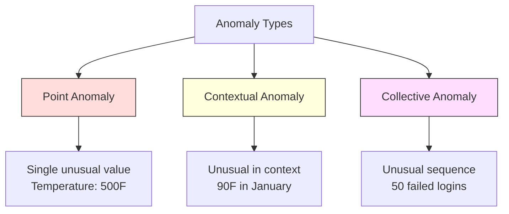
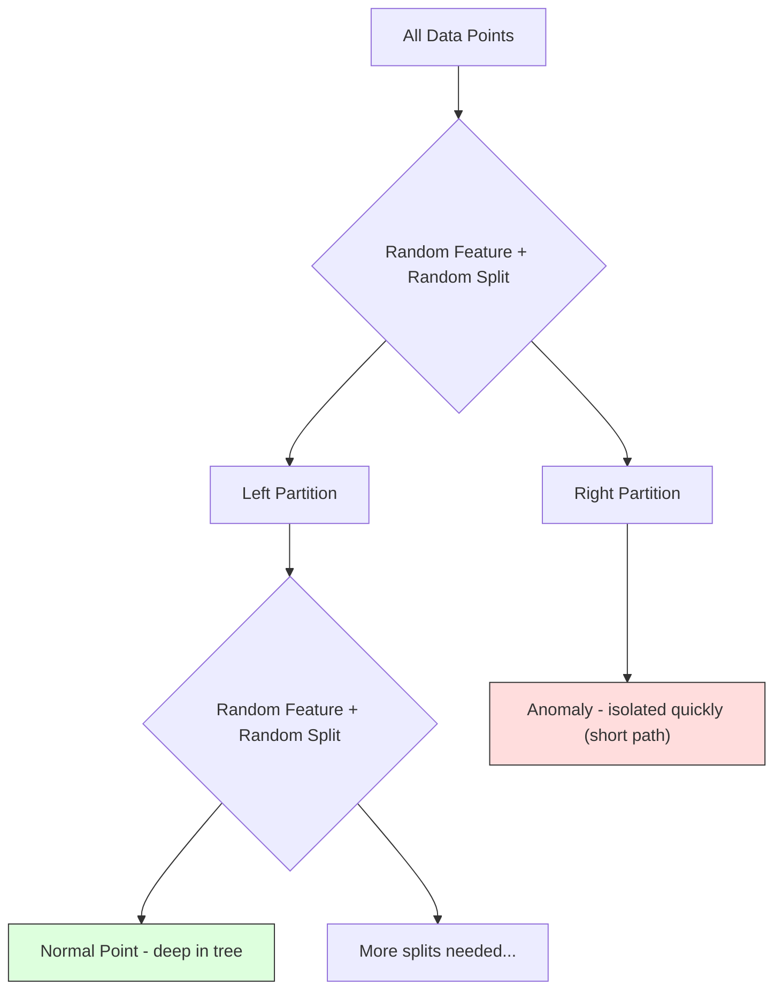
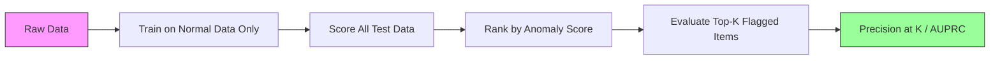

# Anomalyayı tespit etmek
# 异常检测


> Normal tanımlamak kolaydır, anormal ise, uygun olmayan şeydir.

> Normal kolay tanımlanmaktadır. Normal olmayanlar uygun olmayanlardır.

**Type:** Build | **类型：** 构建
**Language:**Python .**语言：**Python
**Prerequisites:** Phase 2, Lessons 01-09 | **前置知识：** Phase 2 第 1-9 课
**Time:** ~75 minutes | **时间：** 约 75 分钟

## Öğrenme hedefleri

- Z-score, IQR ve İzolasyon Orman anomaliyi tespit etme yöntemlerini sıfırdan uygula
  Z puanı, IQR ve İzolasyon Ormanı 异常检测方法
- Nokta, bağlamlı ve kolektif anormallikler arasında ayrım yapın ve her bir için uygun tespit yöntemi seçin.
  区分点异常、上下文异常 ve toplam异常, her seçeneğe uygun denetim yöntemleri için
- Anomalyayı tespit etmek neden anormallikleri sınıflandırmak yerine normal verileri modellemek olarak çerçevelendiğini açıklayın.
   Explain Why Abnormal Testing is Framework for Building Normal Data and Not Classifying Abnormal
- Denetimsiz anomali tespitini denetimli sınıflandırma ile karşılaştırın ve yeni anomali kapsamı ve hassasiyet arasındaki karıştırmayı değerlendiryin
  Gözetimsiz anormal denetim ile gözetim sınıfı arasındaki tartışma, yeni anormal kapsamlılık oranını ve doğruluk oranını değerlendirme


> **【中文解读】**
> 异常检测找出不同数据点──信用卡欺诈检测、设备故障预警、网络入侵检测都依赖于它──孤立森林 和 一级 SVM is a common method──sklearn 中的孤立森林──

> **【拓展：异常检测在金融和网络安全中的核心应用】**
> Visa'nın gerçek zamanlı dolandırıcılık teşhis sistemi, her saniye yaklaşık 76.000 işlem işliyor, anormal teşhis + denetim öğrenme karışık yöntemi kullanıyor, yaklaşık 150 millimetrinde dolandırıcılık olup olmadığını belirliyor. Google'ın internet güvenlik sistemi anormal teşhis kullanarak DDoS saldırıları ve anormal giriş davranışlarını tespit ediyor. Tesla'nın pil yönetim sistemi anormal teşhislerle önceden ön uyarı pil arızaları kullanıyor.

## Sorunlar. Sorunlar.

Bir kredi kartı New York'ta akşam 2'de, sonra Tokyo'da akşam 2:05'de kullanılır. Normal aralığın 80-120 olduğu zaman fabrika sensörü 150 derece okuyor.

> Bir kredi kartı öğleden sonra 2 saat New York'ta kullanılır, sonra 2:05 saat Tokyo'da kullanılır.

Bunlar anomaliler, onları bulmak önemli, dolandırıcılık milyarlar, ekipman bozukluğu, devreye girdiği zaman, veri maliyeti.

> Bunlar sıradışı şeyler. Onları bulmak çok önemlidir. Sahne milyarlarca kayıp yaratıyor. Cihaz bozukluğu kapanmaya neden oluyor.

Sorun: nadiren anomali örneklerini etiketlendiniz. Sahtelik işlemlerin %0,1'ünü oluşturuyor. Cihazlar yılda birkaç kez bozulur. Standart bir sınıflandırıcıyı eğitemezsin çünkü "anomali" sınıfında öğrenmek için neredeyse hiçbir şey yoktur. Bazı etiketlere sahip olsanız bile, gördüğünüz anomaliler karşılaştığınız tek tür değildir. Yarınki dolandırıcılık planı bugünküden farklı görünüyor.

> Çaban şu: Çok az bir eşsiz etiket örneği vardır. Sahne sadece ticaretlerin %0,1'ünü oluşturuyor. Cihaz bozukluğu yılda sadece birkaç kez meydana gelir. Standart sınıflandırma sınıfında öğrenmek için neredeyse hiçbir şey yok.

Anomaly tespit problemi tersine çevirir. Anomalyayı öğrenmek yerine, normal olanı öğrenin. Normalden sapmış olan her şey şüpheli. Bu etiketlenmeden çalışır, yeni tür anormalliklere uyar ve büyük veri kümelerine ölçeklendirir.

> 异常检测翻转了问题──不学"what is abnormal",而是学"what is normal"── herhangi bir anormalden uzak bir şey şüpheli── bu, yeni tür anormallere uyum sağlayan, büyük ölçekli veri kümesine yayılan etiketleme gerektirmez.

> **【中文解读】**
> 异常检测的关键思路反转:不学"什么是异常",而是学"什么是正常",偏离正常的就是可疑的──常用方法:Z-score(基于统计)、IQR(基于四分位距)、孤立森林(基于隔离的随机森林)、One-Class SVM(学习正常数据的边界)──异常类别分为点异常、上下文异常和集合异常,不同类型需要不同的检测策略──

## Konsepten bir şey.

### Anomya Türleri

Tüm anomaliler aynı değil .

> Tüm eşsiz şeyler aynı değil:

- **Point anomalies.**Konektsel durumdan bağımsız olarak olağandışı olan tek bir veri noktası.$50,000 from an account that normally spends $- 50'e.
  Bu kadar normal değil. 500 derece sıcaklıktan sonra, 50 dolarlık bir hesapta birdenbire 50.000 dolarlık bir işlem olur.
- **Contextual anomalies.**Bu, bağlamı bakıldığında olağandışı bir veri noktası. 90 derece sıcaklık yazda normal, kışta anormal. Aynı değer, farklı bağlam.
  Ünlü yazda normal olmayan, kışda normal olmayan, aynı değer, farklı olan, aynı değer.
- **Collective anomalies.**Bir grup olarak sıradışı olan veri noktaları sırası, her bireysel nokta normal olsa da. Beş giriş başarısızlığı normaldir.
  集合异常──一组数据点作为整体不正常,即使每个单独的点可能是正常──五次登录失败正常──连续五十次就是暴力破解攻击──

Çoğu yöntem nokta anomalilerini tespit eder. Konekst anomalilerine zaman veya konum özellikleri gerekmektedir. Toplu anomalilere sıralama bilincili yöntemler gerekmektedir.

> Büyük çoğunlukla bir dizi farklılıkları tespit etmek için bir dizi farklılıkları tespit etmek için bir dizi farklılıkları tespit etmek için bir dizi farklılıkları tespit etmek için bir dizi farklılıkları tespit etmek için bir dizi farklılıkları tespit etmek için bir dizi farklılıkları tespit etmek için bir dizi farklılıkları tespit etmek için bir dizi farklılıkları tespit etmek için bir dizi farklılıkları tespit etmek için bir dizi farklılıkları tespit etmek için bir dizi farklılıkların tespit edilmesi için bir dizi farklılıkların tespit edilmesi için bir dizi farklılıkların tespit edilmesi için bir dizi farklılıkların tespit edilmesi için bir dizi farklılıkları vardır.



### Gözlemsiz Çekim

Standart sınıflandırmada her iki sınıf için etiketler vardır. Anomalyayı tespit etmek için genellikle üç durumdan biri vardır:

> Standart sınıflarda, iki sınıf etiketi vardır.

1. **Fully unsupervised.**Tüm verilere detektörü takarsın ve normal modelin bozulmasına engel olmayacak kadar nadir olacağın umarım.
   完全无监督──完全无标签──. Tüm veriler üzerinde uygun bir denetçi var, ümit edin ki anormal yeterince azdır, böylece "normal" modeli bozmaz.
2. **Semi-supervised.**Sadece normal verilerden oluşan temiz bir veri kümeniz var. Bu temiz bir veri kümesine sığarsınız ve diğer her şeyi notlarsınız. Bu mümkün olan en güçlü kurulum.
   半监督──你只有一个干净的正常数据集──你在这个干净集合上合适,然后对所有其他数据打分──这是可能时最强的设置──
3. **Weakly supervised.**Birkaç etiketli anomali var. Onları değerlendirmek için kullan, eğitim değil.
   弱监督──you have some markings of anomalies──you will use them for evaluation rather than training──you will use them for evaluation rather than training──you will use them for evaluation rather than training──you will use them for evaluation rather than training──you will use them for evaluation rather than training──you will use them for evaluation rather than training──you will use them for evaluation rather than training──you will use them for evaluation rather than training──you will use them for evaluation rather than training──you will use them for evaluation rather than training──you will use them for evaluation rather than training.

Anahtar anlayış: anomali tespitleri sınıflandırmadan temel olarak farklıdır. Normal verilerin dağılımını modelleştiriyorsunuz, iki sınıf arasındaki karar sınırını değil.

> 关键洞察:异常检测与分类根本不同.

### Gözetimli ve Gözetilmeyenler: Aradaki Karşılaşma

Eğer anomaliler etiketlendiyse, bunları eğitim (özenlendirilmiş sınıflandırma) veya sadece değerlendirme (özenlendirilmemiş tespit) için kullanmalı mısınız?

> Eğer gerçekten belirtilen bir anormal varsa, bunları eğitim için kullanmalı mısınız?

**Supervised (treat as classification):**
- Daha önce gördüğünüz anomalilerin tam türünü yakalar.
  Daha önce gördüğün bazı farklılıkları yakalamak.
- Bilinen anomali türlerinde daha yüksek hassasiyet
  Bilinen anormal türlere göre daha yüksek doğruluk oranı vardır.
- Yeni anomali türlerini tamamen kaçırıyor.
  完全错过新类型的异常
- Yeni anormallik türleri ortaya çıktığında yeniden eğitilme gerekir
  Yeni bir anormal tür ortaya çıktığında yeniden eğitilme ihtiyacı vardır.
- Yeterince anomali örneklerine ihtiyaç duyar (genellikle çok az)
  需要足够的异常样本 (genellikle çok az)

**Unsupervised (model normal, flag deviations):**
- Yeni türler de dahil olmak üzere normalden herhangi bir sapma yakalar
  ırkın yeni türleri de dahil olmak üzere normalden uzak herhangi bir durumun yakalanması
- Etiketlenmiş anomaliler gerektirmez
  Not Not Notation:
- Yüksek yanlış pozitif oran (her alışılmadık şey kötü değildir)
  Daha yüksek sahte negatiflik oranı ((( değil tüm alışılmadık şeyler kötüdür))
- Dağıtım değişikliğine daha güçlü
  Etkinlik ve değişim

Uygulamalarda en iyi sistemler her ikisini birleştirir: geniş kapsamlılık için denetimsiz tespit, bilinen yüksek öncelikli anormal türler için denetimli modeller ve belirsiz durumlar için insan incelemesi.

> Uygulamalarda en iyi sistem iki şeyi birleştirir: denetimsiz denetim geniş kapsamlı bir kapsamlılık için, denetim modeli bilinen yüksek öncelikli anormal türler için, yapay inceleme mod  iki olası durumlar için.

### Z-Score Yöntem

En basit yaklaşım. Her bir özelliğin ortalama ve standart sapmalarını hesaplayın. Ortalama standart sapmalardan k'den fazla herhangi bir noktayı işaretleyin.

> En basit yöntem: Her özellikin ortalama değerini ve standart farkını hesaplamak.

```text
z_score = (x - mean) / std
anomaly if |z_score| > threshold
```

Varsayılan eşiği 3,0'dur (normal verilerin %99,7'si Gaussian dağılımında 3 standart sapma aralığındadır).

> Standart değer 3.0'dur. %99.7'nin normal verileri 3 standart fark içinde.

**Strengths:**Basit, hızlı, yorumlanabilir ("bu değer normalden 4,5 standart sapma"dır).

> **优势：**简单――快速――可解释("Bu değer normalden 4.5 个标准差")

**Weaknesses:**Veriler normal olarak dağıtılır. Eğitim verilerindeki dış değerlere duyarlı (ön değerler ortalamayı değiştirir ve std'yi şişirir, bu da onları tespit etmeyi zorlaştırır).

> **劣势：**假设数据服从正态分布――训练数据中的异常值敏感――异常值会偏移平均值和膨胀标准差,使它们更难被检测)――多峰分布上失败――

**When it works well:**Verilerin yaklaşık olarak çan şeklinde olduğu tek özellikli izleme. Sunucu yanıt süreleri, üretim toleransları, sabit tabanlı sensör okumaları.

> **适用场景：**Veri büyüklüğü saat şeklinde tek özellik izleme.

**When it fails:**Çoklu küme verileri (farklı başlangıç sıcaklıkları olan iki ofis yeri), çarpık veriler (1000 dolar nadir ama anormal olmayan işlem miktarları), eğitim kümesindeki dış değerli veriler.

> **失效场景：**Çok sayıda veri (Biri ofis farklı bir temel sıcaklığa sahiptir) 偏斜数据 (Yüzdeyişler)  1000 $'lık işlem miktarı nadir olsa da, sıradışı değildir) 訓練集中 has anormal değerli veri

### IQR Yöntem

Z puanından daha sağlam, ortalama ve standart sapıklık yerine kareler arası aralığı kullanır.

> Z puanından daha fazla.

```
Q1 = 25th percentile
Q3 = 75th percentile
IQR = Q3 - Q1
lower_bound = Q1 - factor * IQR
upper_bound = Q3 + factor * IQR
anomaly if x < lower_bound or x > upper_bound
```

Varsayılan değeri 1.5'dir.

> 默认因子为1.5──

**Strengths:**Çatlak değerlere kadar sağlam (persentiller aşırı değerlerle etkilenmez).

> **优势：**%位数 için aşırı değer etkilenmez.

**Weaknesses:**Tek değişkenlik (her özellik için bağımsız olarak geçerlidir). Özellikler birlikte gözden geçirilince sıradışı olan anormallikleri tespit edemez (her bir özellikte bir nokta bireysel olarak normal olabilir, ancak ortak alanda anormal olabilir).

> **劣势：**仅限单变量 (独立应用于每个特征) 无法检测只在特征联合考虑时才异常的点 (Bütün özellikler üzerinde bir nokta normal olabilir, ancak birleşik alanlarda异常)

**Practical note:**IQR'deki 1.5 faktörü, bir kutu plotındaki mustarlara karşılık gelir. mustarların dışındaki noktalar potansiyel dış değerlerdir. 1.5 yerine 3.0 kullanmak detektörü daha muhafazakar hale getirir (çık bayraklar, daha az yanlış pozitif). Doğru faktör, yanlış alarmlara karşı toleransınızdan bağlıdır.

> **实践提示：**IQR'de 1.5 faktör, kutu çizgisine göre bir değer değildir.

### İzolasyon Ormanı

Anahtar anlayış: anomaliler az ve farklıdır. Verilerin rastgele bölünmesinde anomalileri izole etmek daha kolaydır. Geri kalanlardan ayırmak için daha az rastgele bölüme ihtiyaçları vardır.

> 关键洞察:异常很少且与众不同. DATA'nın随机划分中,异常 daha kolay olarak ayrılır.



**How it works:**
1. Birçok rastgele ağaç inşa edin (bir izole ormanı)
   构建许多随机树 (çok sayıda ağaç inşa et)
2. Her düğümde, rastgele bir özellik ve özellikin min ve maksimum arasındaki rastgele bir bölünme değeri seçin
   Her noktada, en az değer ile en büyük değer arasındaki bir özellik ve özellik seçin.
3. Her nokta (öz yapraklarında) ayrı olana kadar bölmeye devam edin.
   Her nokta kendi yaprak noktalarında ayrılırken
4. Anomaliler tüm ağaçlarda daha kısa ortalama yol uzunluğuna sahiptir
   异常在所有树中平均路径长度更短

**Why it works:**Normal noktalar yoğun bölgelerde yaşar. Birini komşularından ayırmak için birçok rastgele bölüme ihtiyaç vardır. Anomaliler nadir bölgelerde yaşar. Onları izole etmek için bir veya iki rastgele bölüme yeterlidir.

> **为什么有效：**Normal nokta yoğun bölgede bulunur. Bir noktayı komşularından ayırmak için birçok zamanlı bölünme gerekir.

Anomaly skor, tüm ağaçlardaki ortalama yol uzunluğuna dayanır. Bu normal bir rastgele ikili arama ağacının beklenen yol uzunluğuna göre normalleştirilmiştir.

> 异常分数 tüm ağaçların ortalama yol uzunluğuna dayanır, 随机二叉搜索树的期望路长度归结:

```
score(x) = 2^(-average_path_length(x) / c(n))
```

Nerede ?`c(n)`n örnekler için beklenen yol uzunluğu. 1 yakınında puan anormallik demektir. 0.5 yakınında puan normal anlamına gelir. 0 yakınında puan çok normal anlamına gelir (sıkı kümelerde derinliklerde).

> İçlerinden `c(n)`Bu da normalden çok uzak bir bölgeye doğru ilerliyor.

**Strengths:**Yayınlama varsayımları yoktur. Yüksek boyutlarda çalışır. İyi ölçekler (her ağaç bir alt örnek kullanırken örnek boyutunda alt çizgilidir). Karışık özellik türlerini ele alır.

> **优势：**无分布假设──高维度适用──扩展性好──样本量亚线性,因为每个树使用子采样)──处理混合特征类型──

**Weaknesses:**Sıkıntılı bölgelerde anomalilerle mücadele (mask etkisi).

> **劣势：**                                                                                                                                                                                                                                                              

**Key hyperparameters:**
- `n_estimators`Daha fazla ağaç daha istikrarlı puanlar verir ama hesaplama yavaş olur.
  `n_estimators`Ağaç sayısı: 100. Genellikle yeterli. Daha fazla ağaç daha sabit bir oran verir ama hesaplama daha yavaş.
- `max_samples`Ağaç başına örnek sayısı. 256 orijinal kağıtın varsayılanıdır. Daha küçük değerler bireysel ağaçları daha az doğru yapar, ancak çeşitliliği artırır. Alt örnekleme, İzolasyon Ormanı'nın hızlı olmasını sağlar. Her ağaç verilerin küçük bir kısmını görür.
  `max_samples`Her ağaçın örnek sayısı: ♂️Original paper on the basis of the original text: ♂️Original paper: ♂️Original paper: ♂️Original paper: ♂️Original paper: ♂️Original paper: ♂️Original paper: ♂️Original paper: ♂️Original paper: ♂️Original paper: ♂️Original paper: ♂️Original paper: ♂️Original paper: ♂️Original paper: ♂️Original paper: ♂️Original paper: ♂️Original paper: ♂️Original paper: ♂️Original paper: ♂️Original paper: ♂️Original paper: ♂️Original paper: ♂️Original paper: ♂️Original paper: ♂️Original text: ♂️Original text: ♂️Original text: ♂️Original text: ♂️ ♂️ ♂️ ♂️ ♂️ ♂️ ♂️ ♂️ ♂️ ♂️ ♂️ ♂️ ♂️ ♂️ ♂️ ♂️ ♂️ ♂️ ♂️ ♂️ ♂️ ♂️ ♂️ ♂️ ♂️ ♂️ ♂️ ♂️ ♂️ ♂️ ♂️ ♂️ ♂️ ♂️ ♂️ ♂️ ♂️ ♂️ ♂️ ♂️ ♂️ ♂️ ♂️ ♂️ ♂️ ♂️ ♂️ ♀️ ♀️ ♀️ ♀️ ♀️ ♀️ ♀️ ♀️ ♀️ ♀️ ♀️ ♀️ ♀️ ♀️ ♀️ ♀️ ♀️ ♀️ ♀️ ♀️ ♀️ ♀️ ♀️ ♀️ ♀️ ♀️ ♀️ ♀️ ♀️ ♀️ ♀️ ♀️ ♀️ ♀️ ♀️ ♀️ ♀️ ♀️ ♀️ ♀️ ♀️ ♀️ ♀️ ♀
- `contamination`: Anomalilerin beklenen kısmı. Sadece eşiğin belirlenmesi için kullanılır.
  `contamination`:预期的异常比例──仅用于设置值──不影响分数本身──

### Yerel dış değer faktörü (LOF)

LOF, bir noktadan çevresindeki yerel yoğunluğu komşularının yoğunluğuna karşılaştırır.

> LOF, bir noktayı çevreleyen yerel yoğunluğu komşularının yoğunluğuna karşılaştırır.

**How it works:**
1. Her noktaya en yakın komşu k'yi bul
   Her noktaya göre, yakın komşunu bul.
2. Yerel erişilebilirlik yoğunluğunu hesaplayın (komşunun ne kadar yoğun olduğu)
   计算局部可达密度 (Gelişkin bölge çok yoğun)
3. Her noktanın yoğunluğunu komşularının yoğunluklarıyla karşılaştır
   Her noktanın yoğunluğunu komşularının yoğunluğunu karşılaştırın.
4. Bir noktanın komşularından çok daha düşük yoğunluğu varsa, bu bir dışarıdır.
   Eğer bir noktanın yoğunluğu komşularından çok daha düşükse, bu bir anormal noktadır.

**LOF score:**
- LOF 1.0 yakın komşuların yoğunluğu (normal) anlamına gelir
  LOF  yakın 1.0 anlamı komşu yoğunluğu ile benzer(normal)
- 1.0'dan büyük LOF, komşulardan daha düşük yoğunluk anlamına gelir (potansiyel olarak anormal)
  LOF 1.0 büyüktür, yani komşusundan daha düşük yoğunlukla (mümkünse garip)
- LOF 1.0'dan çok daha büyük (örneğin, 2.0+) anlamıyla daha düşük yoğunluk (muhtemelen anomali)
  LOF 远大于1.0(如2.0+) yoğunluğu önemli ölçüde daha düşük anlamına gelir

"Yerel" kısmı kritik. İki kümeden oluşan bir veri kümesini düşünün: 1000 noktadan oluşan yoğun bir kümeden ve 50 noktadan oluşan nadir bir kümeden. Nadir kümenin kenarındaki bir nokta küresel olarak alışılmadık değildir - 50 komşusu vardır. Ama yakın komşuları olduğundan daha yoğunsa yerel olarak alışılmadık. LOF küresel yöntemlerin kaçırdıkları bu nüansı yakalar.

> "Local" önemli bir noktadır. Bir topluğun iki türü olan bir veri kümesini düşünün: 1000 nokta yoğun topluğun ve 50 nokta nadir topluğun bir kenar bölümü.

**Strengths:**Yerel anormallikleri (globa olarak sıradışı olmasalar da, komşularında olağandışı olan noktaları) tespit eder.

> **优势：**检测局部异常 (dışınlıklı bir bölgede olağan dışı noktalar)

**Weaknesses:**Büyük veri kümeleri üzerinde yavaş (O(n^2) saf uygulama için. k'nin seçimine duyarlı. Çok yüksek boyutlarda iyi çalışmaz (ölümsellik laneti mesafe hesaplamalarını etkiler).

> **劣势：**Bu nedenle, bu işlemin sonuçları çok yüksek bir ölçüde kötüdür.

### Karşılaştırma

| Method | Assumptions | Speed | Handles High Dims | Detects Local Anomalies |
|--------|------------|-------|-------------------|------------------------|
| Z-score | Normal distribution | Very fast | Yes (per feature) | No |
| IQR | None (per feature) | Very fast | Yes (per feature) | No |
| Isolation Forest | None | Fast | Yes | Partially |
| LOF | Distance is meaningful | Slow | Poorly | Yes |

### Değerlendirme Zorlukları

Anomalyeler denetleyicilerini değerlendirmek sınıflandırıcıları değerlendirmekten daha zor:

> 评估异常检测器 评估分类器 较困难:

- **Extreme class imbalance.**%0,1 anomali ile her şey için "normal" tahmin ederek %99,9 doğruluk elde edilir.
  极端的类别不平衡──0.1% 异常率下,全预测为"正常"可得99.9% 准确率──准确率无用──
- **AUROC is misleading.**Ağır dengesizlik durumunda, AUROC, model pratik eşiğinde çoğu anomaliyi kaçırırken bile iyi görünebilir.
  AUROC 具有误导性──在严重不平衡时,即使模型在实用值下错过了大部分异常,AUROC görünüşü hala yanlış.
- **Better metrics:**Precision@k (yukarıda k işaretli öğelerin, kaç tane gerçek anomali), AUPRC (tamamlı geri çağırma eğri altında alan) ve sabit yanlış pozitif oranla geri çağırma.
  Daha iyi gösterge:Dikrarlık@k(排名前 k 个标记项中有多少是真正的异常) 、AUPRC(Dikrarlık-Çalışım oranı eğilimi下面积)



### Anomaly Deteksiyon Boru hattı

Uygulamalar, bu iş akışını takip eder:

> Praktiki olarak, anormal test aşağıdaki çalışma akışına uyar:

1. **Collect baseline data.**İdeal olarak, anormallikler olmadığını (ya da çok az olduğunu) bildiğiniz bir dönem.
   收集基线数据──理想情况下, bir dönem vardır.
2. **Feature engineering.**Çiğ özellikler ve türev özellikler (rolling istatistikleri, zaman özellikleri, oranlar).
   Özellikler: Yapım: Asıl özellikler: Derivat özellikleri:
3. **Train the detector.**Baseline verilerine uygun. Model normal görünüşü öğrenir.
   訓練検検器──在基線データ上拟合──模型学习"normal"の样子──
4. **Score new data.**Her yeni gözlem anormallik puanı alır.
   Yeni verilere göre, her yeni gözlemde bir sıra dışı sayı bulunmaktadır.
5. **Threshold selection.**Bu bir iş kararı: daha yüksek eşiğin anlamı daha az yanlış alarm, ama daha fazla kaçırılan anomali.
   选择值――选择分数截断值―― bu bir iş kararıdır: daha yüksek 值 daha az yanlış raporlama ama daha fazla hata denetimi anlamına gelir―
6. **Alert and investigate.**Bayraklı noktalar insan incelemesine veya otomatik tepkiye gidiyor.
   告警和调查──标记的点进入人工审查或自动响应──
7. **Feedback collection.**Belgelemiş öğelerin gerçek anomaliler mi yoksa yanlış alarmlar mı olduğunu kaydet.
   收集反──记录标记项是真实异常还是错报──使用这些数据评估检测器并随时间调优值──

Bu boru hattı asla "bitmez". Veriler dağıtımları değişir, yeni anomalya türleri ortaya çıkar ve eşiğin ayarlanması gerekir.

> 管线永远不会"完成"――数据分布偏移, yeni异常类型出现,值需要调整――将异常检测视为一个活系统,而不是一次性模型――

## Yapın.

> **【中文解读】**
> Üç farklı farklı farklılıklama yöntemini gerçekleştirmek için: Z-score (Yöntem değer ve standart farklara göre, yakın normal dağılımlı verilere uygun) ✓ IQR (Dört bölüm mesafesine göre, farklı değerlere göre) ✓ İzolasyon Ormanı (Hazır Seçim Özellikleri ve Ayrılık Noktası Ayrılıklama Verim Noktası, Ayrılık Noktası Ortalama Daha Az Ayrılık Gerektirir) ✓ İzolasyon Ormanı, endüstri dünyasında en sık kullanılan denetimsiz, sıradan ayrımlama yöntemidir.

> **【拓展：异常检测在 AIOps 和制造业中的应用】**
> Microsoft Azure Monitor, alışılmadık denetim kullanıyor; bulut hizmetlerinin performansının alışılmadıklığını otomatik olarak tespit ediyor; Netflix, alışılmadık denetim kullanıyor; akış hizmetlerinin çeşitli göstergeleri üzerinde izlemektedir; (( gecikme, hata oranı vb.), günde milyarlarca veri noktasını denetlemektedir; Fujicon, üretim hatlarında alışılmadık denetim kullanıyor; cihazın arızalanmasını önceden tespit ederek, kapanma süresini %30 azaltacaktır.
```figure
f3-anomaly-fence
```

## Yapın

Kodun içinde .`code/anomaly_detection.py`Z-score, IQR ve İzolasyon Ormanı'nı sıfırdan uyguluyor.

> `code/anomaly_detection.py`Orta kod, Z puanı, IQR ve İzolasyon Ormanı'nı sıfırdan gerçekleştirdi.

### Z-Score Detektörü

```python
def zscore_detect(X, threshold=3.0):
    mean = X.mean(axis=0)
    std = X.std(axis=0)
    std[std == 0] = 1.0
    z = np.abs((X - mean) / std)
    return z.max(axis=1) > threshold
```

Basit ve vektörlü. Bir noktayı işaretler.

> 简单且向量化──如果任何特征超过值则标记该点──

### IQR Detektörü

```python
def iqr_detect(X, factor=1.5):
    q1 = np.percentile(X, 25, axis=0)
    q3 = np.percentile(X, 75, axis=0)
    iqr = q3 - q1
    iqr[iqr == 0] = 1.0
    lower = q1 - factor * iqr
    upper = q3 + factor * iqr
    outside = (X < lower) | (X > upper)
    return outside.any(axis=1)
```

### İzolasyon Ormanı

Baştan başlayan uygulamada özellik alanını rastgele bölen izoleci ağaçlar oluşturulur:

> Züce yapıların kendiliğinden ayrılması:

```python
class IsolationTree:
    def __init__(self, max_depth):
        self.max_depth = max_depth

    def fit(self, X, depth=0):
        n, p = X.shape
        if depth >= self.max_depth or n <= 1:
            self.is_leaf = True
            self.size = n
            return self
        self.is_leaf = False
        self.feature = np.random.randint(p)
        x_min = X[:, self.feature].min()
        x_max = X[:, self.feature].max()
        if x_min == x_max:
            self.is_leaf = True
            self.size = n
            return self
        self.threshold = np.random.uniform(x_min, x_max)
        left_mask = X[:, self.feature] < self.threshold
        self.left = IsolationTree(self.max_depth).fit(X[left_mask], depth + 1)
        self.right = IsolationTree(self.max_depth).fit(X[~left_mask], depth + 1)
        return self
```

Bir noktayı izole etmek için yol uzunluğu anomali puanını belirler.

> Bir noktayı ayırmak için yol uzunluğu, onun anormal sayılarını belirler.

- Evet .`IsolationForest`sınıf birden fazla ağaç sarıyor:

> `IsolationForest`类包装了多棵树:

```python
class IsolationForest:
    def __init__(self, n_estimators=100, max_samples=256, seed=42):
        self.n_estimators = n_estimators
        self.max_samples = max_samples

    def fit(self, X):
        sample_size = min(self.max_samples, X.shape[0])
        max_depth = int(np.ceil(np.log2(sample_size)))
        for _ in range(self.n_estimators):
            idx = rng.choice(X.shape[0], size=sample_size, replace=False)
            tree = IsolationTree(max_depth=max_depth)
            tree.fit(X[idx])
            self.trees.append(tree)

    def anomaly_score(self, X):
        avg_path = average path length across all trees
        scores = 2.0 ** (-avg_path / c(max_samples))
        return scores
```

Normalleşme faktörü`c(n)`n elementli bir ikili arama ağacında başarısız bir arama için beklenen yol uzunluğu.`2 * H(n-1) - 2*(n-1)/n`nerede`H`Bu normallaştırma, farklı boyutlarda veri kümeleri arasında puanların karşılaştırılabilir olmasını sağlar.

> 归一化因子 `c(n)`n 个元素的二叉搜索树中失败搜索的期望路径长度──等于`2 * H(n-1) - 2*(n-1)/n`, içinden `H`Bu birleştirme, farklı büyüklükteki veri kümeleri arasında oranların karşılaştırılabilmesini sağlar.

### Demo Szenaryoları

Kod, birden fazla test senaryosunu oluşturur:

> 代码生成多个测试场景:

1. **Single cluster with outliers.**Merkezden uzakta enjekte edilen anomaliler ile 2 boyutlu Gaussian kümesi.
   单聚类加异常值――2D 高聚类,远离中心处注入异常―― tüm yöntemler bu durum altında çalışmalıdır――
2. **Multimodal data.**Üç farklı boyut ve yoğunluklu kümeler.
   Çok yüksek veriler, üç farklı büyüklük ve yoğunluklu bir toplama sınıfı arasında noktalar, sıradışı bir durumdur.
3. **High-dimensional data.**50 özellik, ancak anomaliler sadece 5'te farklıdır.
   Yüksek seviyede veri: 50 özellik, ancak anormallık sadece 5 özellik üzerinde değişir.

Her demo, hassasiyet, hatırlama, F1 ve Precision@k kullanarak tüm yöntemleri karşılaştırır.

> Her gösteride, tüm yöntemleri karşılaştırmak için doğrulama oranı, çağrı oranı, F1 ve Precision@k kullanılmıştır.

## Çerçeveyi kullanın.

sklearn ile (kitaphanenin uygulamalar kullanılarak, sıfırdan değil):

> kullanmak için kullanmak için kullanmak için kullanmak için kullanmak için kullanmak için kullanmak için kullanmak için kullanmak için kullanmak için kullanmak için kullanmak için kullanmak için kullanmak için kullanmak için kullanmak için kullanmak için kullanmak için kullanmak için kullanmak için kullanmak için kullanmak için kullanmak için kullanmak için kullanmak için kullanmak için kullanmak için kullanmak için kullanmak için kullanmak için kullanmak için kullanmak için kullanmak için kullanmak için kullanmak için kullanmak için kullanmak için kullanmak için kullanmak için kullanmak için kullanmak için kullanmak için kullanmak için kullanmak için kullanmak için kullanmak için kullanmak için kullanmak için kullanmak için kullanmak için kullanmak için kullanmak için kullanmak için kullanmak için kullanmak için kullanmak için kullanmak için kullanmak için kullanmak için kullanmak için kullanmak için kullanmak için kullanmak için kullanmak için kullanmak için kullanmak için kullanmak için kullanmak için kullanmak için kullanmak için kullanmak için kullanmak için kullanmak için kullanmak için kullanmak için kullanmak için kullanmak için kullanmak için kullanmak için kullanmak için kullanmak için kullanmak için kullanmak için kullanmak için kullanmak için kullanmak için kullanmak için kullanmak için kullanmak için kullanmak için kullanmak için kullanmak için kullanmak için kullanmak için kullanmak için kullanmak için kullanmak için kullanmak için kullanmak için kullanmak için kullanmak için kullanmak için kullanmak için kullanmak için kullanmak için kullanmak için kullanmak için kullanmak için kullanmak için kullanmak için kullanmak için kullanmak için kullanmak için kullanmak için kullanmak için kullanmak için kullanmak için kullanmak için kullanmak için kullanmak için kullanmak için kullanmak için kullan

```python
from sklearn.ensemble import IsolationForest
from sklearn.neighbors import LocalOutlierFactor

iso = IsolationForest(n_estimators=100, contamination=0.05, random_state=42)
iso.fit(X_train)
predictions = iso.predict(X_test)

lof = LocalOutlierFactor(n_neighbors=20, contamination=0.05, novelty=True)
lof.fit(X_train)
predictions = lof.predict(X_test)
```

Not:`contamination`Bu, beklenen anomalilerin oranını belirler. Doğru ayarlamak önemlidir -- çok düşük anomalileri kaçırır, çok yüksek yanlış alarmlar yaratır.

> Dikkat et .`contamination`設定预期的异常比例──正确设置很重要太低会漏检异常,太高会产生错报──

Kodun içinde .`anomaly_detection.py`Aynı veriler üzerinde ilk baştan uygulamalar ile sklearn karşılaştırılır.

> `anomaly_detection.py`Orta kod aynı veriler üzerinde sıfırdan gerçekleştirilen ile karşılaştırılır.

### sklearn Kirlilik parametri

- Evet .`contamination`sklearn'daki parametreler, sürekli anomalya puanlarını ikili tahminlere dönüştürme eşiğini belirler.

> Sklern 中的 `contamination`参数决定将连续异常分数转换为二值预测的值──它不改变底层分数──

```python
iso_5 = IsolationForest(contamination=0.05)
iso_10 = IsolationForest(contamination=0.10)
```

İkisi de aynı anormallik puanı verir.`iso_5`% 5'i işaretlerken`iso_10`Eğer gerçek anormallik oranını bilmiyorsanız (genellikle bilmiyorsanız), kirliliği "otomatik" olarak ayarlayın ve doğrudan ham puanlarla çalışın.

>  ikisi de aynı anormal oranları üretir.`iso_5`%5'lik bir işçi.`iso_10`标记前 10%── Eğer gerçek anormal oranı bilmiyorsanız, 污染 设为"auto"并直接使用原始分数──假阳性和假阴性之间的成本权衡根据假阳性和假阴性之间的成本权衡设自己的值──

### Bir Sınıf SVM

Bir sınıf SVM, yüksek boyutlu bir özellik alanında (kernel numarasını kullanarak) normal verilerin etrafında bir sınır koyuyor.

> Ancak bir diğer fark edilebilir, denetimsiz bir sıralama denetleyicisi.

```python
from sklearn.svm import OneClassSVM

oc_svm = OneClassSVM(kernel="rbf", gamma="auto", nu=0.05)
oc_svm.fit(X_train)
predictions = oc_svm.predict(X_test)
```

- Evet .`nu`Bir Sınıf SVM küçük ve orta ölçekli veri kümeleri üzerinde iyi çalışır ancak çok büyük veriye ölçeklendirmeyen (kernel matrisi kare olarak büyür).

> `nu`参数近似异常的比例──One-Class SVM, orta küçük veri kümelerinde iyi bir etki gösterir, ancak çok büyük veriye genişletilmez.

### Otomatik Kodlama Yöntem (Önce Görünüm)

Otomotik kodlayıcılar, verileri sıkıştırmayı ve yeniden yapılandırmayı öğrenen sinir ağlarıdır. Normal veriler üzerinde çalıştırmak. Test sırasında anomaliler yüksek yeniden yapılandırma hatasıyla sonuçlanır, çünkü ağ sadece normal kalıpları yeniden yapılandırmayı öğrenir.

> Özkodlayıcı, normal veri üzerinde eğitim gören sinir ağlarının basınç ve yeniden yapılandırılmasıdır. Test sırasında, anormal bir durum yüksek ağırlıklı yapısal hatalara neden olur, çünkü ağlar sadece normal bir şekilde yeniden yapılandırmayı öğrenir.

Bu konu 3 (Deep Learning) aşamasında ele alınıyor, ama ilke aynı: normal olanı modelle, sapmış olanı işaretle.

> Bu, 3. aşamada tartışılıyor, ama prensip aynı: normal olanın nasıl yapılması, belirtileri ayrılmış olması.

### Anomaly Deteksiyonı Birleştir

Ensemble yöntemleri sınıflandırmayı iyileştirdiği gibi (Learning 11) birden fazla anormallik dedektörü birleştirmek de algılamayı iyileştirir.

> Nasıl birleştirilmiş yöntem geliştirmek için (§11), bir çok anormal denetleyicinin bir araya getirilmesi denetlemeyi iyileştirebilir.

1. Çoklu dedektörler çalıştırın (Z puan, IQR, İzolasyon Ormanı, LOF)
   运行多个检测器(Z puanı、IQR、Yaplanma Orman、LOF)
2. Her detektörün puanlarını [0, 1] olarak normalleştirin.
   Her denetleyicinin sayılarını [0, 1] olarak değerlendirelim.
3. Normal puanları ortalama
   平均归归归归归归归归归归归归归归归归归归归归归归归归归归归归归归归归归归归归归归归归归归归归归归归归归归归归归归归归归归归归归归归归归归归归归归归归归归归归归归归归归归归归归归归归归归归归归归归归归归归归归归归归归归归归归归归归归归归归归归归归归归归归归归归归归归归归归归归归归归归归归归归归归归归归归归归归归归归归归归归归归归归归归归归归归归归归归归归归归归归归归归归归归归归归归归归归归归归归归归归归归归归归归归归归归归归归归归归归归归归归归归归归归归归归归归归归归归归归归归归归归归归归归归归归归归归归归归归归归归归归归归归归归归归归归归归归归归归归归归归归归归归归归归归归归归归归归归归归归归归归归归归归归归归归归归归归归归归归归归归归归归归归归归归归归归归归归归归归归归归归归归归归归归归归归归归归归归归归归归归归归归归归归归归归归归归归归归归归归归归归归归归归归归归归归归归归归归归归归归归归归归归归归归归归归归归归归归归归归归归归归归归归归归归归归归归归归归归归归归归归归归归归归归归归归归归归归归归归归归归归归归归归归归归归归归归归归归归归归归归归归归归归归归归归归归归归归归归归归归归归归归归归归归归归
4. Ortalama puanın eşiğindeki bayrak noktaları
   标记平均分数超过值的点

Bu, yanlış pozitifleri azaltır çünkü farklı yöntemlerin farklı başarısızlık modları vardır. Dört yöntem tarafından işaretlenen bir nokta neredeyse kesinlikle anormaldir.

> Bu, yanlış olumluluğu azaltır, çünkü farklı yöntemlerin farklı başarısızlık biçimleri vardır.

Daha gelişmiş bir dizi, her detektörün ağırlığını tahmin edilen güvenilirliğiyle (varsa bilinen anomaliler olan bir doğrulama kümesi ile ölçülür) birleştirir.

> Daha karmaşık bir entegrasyon, her denetleyicinin tahminine göre güvenilirlik artırma gücü (eğer mümkünse, bilinen anormal denetleme kitlesinde ölçümler)

### Üretim Konuları

1. **Threshold drift.**Verilerin dağılımı değiştiğinde, sabit bir eşiğin kullanımı geçmiş hale gelir.
    değer漂移── veri dağılımının dağılımının geçmesi ile sabit  değer geçmiştir── gözlemleme alışılmadık oranların dağılımının düzenli olarak düzenlenmesi──
2. **Alert fatigue.**Çok fazla sahte alarm ve operatör dikkatini bırakıyor. Yüksek bir eşiğin (daha az, daha güvenilir uyarılar) ile başlayın ve güvenin arttıkça onu düşürün.
   告警疲劳──太多误报会让操作员不再关注──从高值开始(更少、更可靠的告警),信任建立再降低──
3. **Ensemble approach.**Üretim sırasında, birden fazla algılayıcı birleştirin. Bir noktayı sadece birden fazla yöntemin anormal olduğuna karar verdiği takdirde işaretleyin. Bu, yanlış pozitifleri önemli ölçüde azaltır.
   集成方法──在生产中,组合多检测器──只有当多种方法一致认为异常时才标记──这显著减少假阳性──
4. **Feature engineering.**Çiğ özellikler nadiren yeterli. Yükleme istatistikleri, oranlar, son olaydan beri zaman ve alan özel özellikler ekleyin. İyi bir özellik, detektör seçimine göre daha önemlidir.
   Özellikler: Yapımcılık. İlk özellikler yeterli değil.
5. **Feedback loop.**İşaretli öğeleri araştırırken ve onaylarken veya reddederken, bunları sisteme geri gönderir. Detektörü değerlendirmek ve geliştirmek için zaman içinde etiketlenen verileri biriktirir.
   Operatör soruşturma işaretlerini onayladığında veya çıkarıldığında, giriş sistemine karşı gelir.

## İndirin . Ürünler .

Bu ders şunları ortaya çıkarır:
- `outputs/skill-anomaly-detector.md`- Doğru dedektörü seçmek için karar verme yeteneği
  `outputs/skill-anomaly-detector.md` 选择合适检测器'ın karar verme becerileri
- `code/anomaly_detection.py`- Z puanı, IQR ve İzolasyon Ormanı sıfırdan, sklearn karşılaştırması ile
  `code/anomaly_detection.py` Z puanı ∞ IQR ∞ İzolasyon Ormanı ∞

### Bir Eğlence Seçimi

Anomaly skor sürekli, ikili kararlar vermek için bir eşiğin olması gerekiyor.

> 异常分数是连续的. 值的决策. 值的决策. 值的决策. 值的决策. 值的决策. 值的决策. 值的决策. 值的决策. 值的决策. 值的决策. 值的决策. 值的决策. 值的决策. 值的决策. 值的决策. 值的决策. 值的决策. 值的决策.

İki durumdan söz edelim:
- **Fraud detection.**Yanlış alarmlar bir insan analistine 5 dakikalık bir araştırma masrafı getirir.
  欺诈检测──漏检欺诈代价高昂(退款、客户信任)──误报需要分析师 5 分钟调查──设置低值以捕获更多欺诈,接受更多误报──
- **Equipment maintenance.**Sahte alarm gereksiz bir kapanma masrafı anlamına gelir .$50,000. A missed failure means a $Bu maliyetleri dengeleyen bir sınır belirleyin.
  设备维护――误报意味着不必要的停机,成本50,000 美元――漏检故障意味着500,000 美元的维修――设置值以平衡这些成本――

Her iki durumda da, en uygun eşiğin fiyatı yanlış olumlu ve yanlış olumsuz oranlar arasındaki maliyet oranına bağlıdır.

> İki durumda, en iyi değer, yanlış olumlu ve yanlış negatif arasındaki maliyet oranına bağlıdır.

### Üretim için ölçeklendirme

Üretimdeki gerçek zamanlı anomali tespit için:

> 对于生产中的实时异常检测:

1. **Batch training, online scoring.**Modelle son normal veriler üzerinde düzenli olarak (gündelik, haftalık) eğitim verin.
   批量训练,在线打分──定期(每天、每周) yakın dönem normal veriler üzerinde eğitim modeli──每个新观测到达时打分──
2. **Feature computation must match.**Eğer 30 gün boyunca devreye dönüp istatistik kullanıyorsanız, yeni bir gözlem için özellikleri hesaplamak için 30 gün geçmişe ihtiyacınız var.
   Özellikler hesaplanması gerekir. Eğer 30 günlük bir rolling statistics eğitimini kullanıyorsanız, yeni gözlem hesaplama özellikleri için 30 günlük bir tarih gerektirir.
3. **Score distribution monitoring.**Anomaly skorlarının zaman içinde dağılmasını takip edin. Eğer ortalama puan yukarı doğru hareket ederse, ya veriler değişiyor ya da model eskidir.
   Bölüm dağılım izleme. Zamanla sıralamaların dağılımını takip etmek. Eğer ortalama bölüm yukarı doğru akıp giderse, ya veriler değişir, ya da model geçersiz hale gelir.
4. **Explainability.**Anomaliyi işaretlediğinizde nedenini söyleyin. Z puanı: "X özellik 4,2 normalden yüksek standart sapma".
   Çözümlülık. Çözümlülik. Çözümlülik. Çözümlülik.

## Egzersizler.

1. **Threshold tuning.**Z puanı dedektörü, 0.5 adımla 1.0'dan 5.0'a kadar olan eşiği çalıştırın.
   1. Normal veri içinde farklı oranlardaki anormallikler yerleştirir: %1 ̊5% ̊10 %.

2. **Multivariate anomalies.**Her bir özelliğin bireysel olarak normal göründüğü, ancak kombinasyonun anormal olduğu 2 boyutlu veriler oluşturun (örneğin, ana kümenin diyagonalından uzak noktalar).
   2. Üzerinde bir aşağıdaki sıradan veriler kitlesine eklenmiş: Normal değerler kış ve yaz aylarında farklıdır.

3. **LOF from scratch.**K-nezar komşuları kullanarak Yerel Dışarıdaki Factor uygulamak. Aynı veriler üzerinde sklearn'ın Yerel Dışarıdaki Factor ile karşılaştırın. k=10 ve k=50 kullanın - k seçimi sonuçları nasıl etkiler?
   3. 构建孤立森林的集成:训练 10 树 isolation tree,取平均路径长度──与单树与集成的稳定性──

4. **Streaming anomaly detection.**Z-score detektörü akış ayarında çalışmak için değiştirin: yeni noktalar geldiğinde çalışan ortalama ve varyansı güncelleyin (Welford'un çevrimiçi algoritması).
   4. Otomoencoder kullanılarak fikir ayrımcılığı gerçekleştirmek için: eğitim basit bir yapılandırma modeli, yapılandırma hataları için işaretleme noktası için sıradanlık

5. **Real-world evaluation.**Bilinen anomaliler olan bir veri kümesi alın (örneğin Kaggle'den kredi kartı dolandırıcılığı).

> **【中文解读】**
> 异常检测的评估使用 Precision@K(排名 K 个可疑案例中的多少是真正的异常) 和 AUPRC(精确率-召回率曲线下面积) 精确率比准率更有意义──孤立森林的核心洞察:异常数据点更"稀疏",随机特征分裂更容易使它们单独隔离平均需要的分离次数更少──

## Anahtar Şartlar .

| Term | What people say | What it actually means |
|------|----------------|----------------------|
| Anomaly | "Outlier, unusual point" | A data point that deviates significantly from the expected pattern of normal data |
| Point anomaly | "A single weird value" | An individual observation that is unusual regardless of context |
| Contextual anomaly | "Normal value, wrong context" | An observation that is unusual given its context (time, location, etc.) but might be normal in another context |
| Isolation Forest | "Random splits to find outliers" | An ensemble of random trees that isolates anomalies with fewer splits than normal points |
| Local Outlier Factor | "Compare density to neighbors" | A method that flags points whose local density is much lower than their neighbors' density |
| Z-score | "Standard deviations from mean" | (x - mean) / std, measuring how far a point is from the center in units of standard deviation |
| IQR | "Interquartile range" | Q3 - Q1, measuring the spread of the middle 50% of data, used for robust outlier detection |
| Contamination | "Expected fraction of anomalies" | A hyperparameter telling the detector what proportion of the data it should flag as anomalous |
| Precision@k | "Of the top k flags, how many are real" | Precision computed on only the k most suspicious points, useful for imbalanced anomaly detection |
| AUPRC | "Area under precision-recall curve" | A metric that summarizes precision-recall performance across all thresholds, better than AUROC for imbalanced data |

## Daha fazla okumak

- [Liu et al., Isolation Forest (2008)](https://cs.nju.edu.cn/zhouzh/zhouzh.files/publication/icdm08b.pdf)-- orijinal İzolasyon Orman kağıdı
  [Liu et al.: Isolation Forest (2008)](https://ieeexplore.ieee.org/document/4781136)- İzolasyon Ormanı
- [Breunig et al., LOF: Identifying Density-Based Local Outliers (2000)](https://dl.acm.org/doi/10.1145/342009.335388)-- orijinal LOF kağıdı
  [Chandola et al.: Anomaly Detection: A Survey (2009)](https://dl.acm.org/doi/10.1145/1541880.1541882)- 异常检测综述
- [scikit-learn Outlier Detection docs](https://scikit-learn.org/stable/modules/outlier_detection.html)-- tüm sklearn anomali tespitçilerinin genel bakış
  [scikit-learn 异常检测](https://scikit-learn.org/stable/modules/outlier_detection.html)
- [Chandola et al., Anomaly Detection: A Survey (2009)](https://dl.acm.org/doi/10.1145/1541880.1541882)-- Anomalyayı tespit etme yöntemlerinin kapsamlı incelenmesi
- [Goldstein and Uchida, A Comparative Evaluation of Unsupervised Anomaly Detection Algorithms (2016)](https://journals.plos.org/plosone/article?id=10.1371/journal.pone.0152173)-- Gerçek veri kümelerindeki 10 yöntemin empiriyel karşılaştırması
