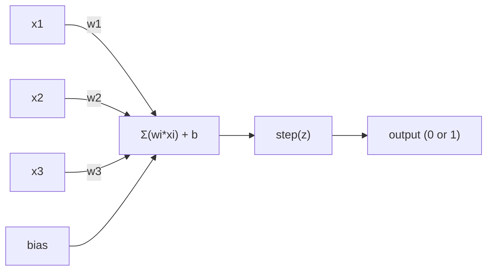
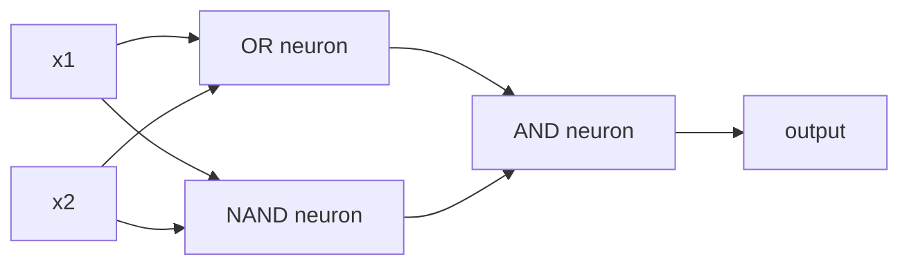

# Perceptron algılama makinesi.

> Perceptron sinir ağlarının atomudur. Açın ve ağırlıkları, önyargıları ve bir kararı bulacaksınız.

> 感知机, sinir ağının "atomları"dır.

> **【中文解读】**感知机, sinir ağının en küçük öğrenme birimidir. Yaptığı şey çok basit: girişleri ağırlık ve ağırlık artı olarak, sonra bir seçim yaparak bir karar vermektir. 感知机, 感知机'ı anlamak, kodda " öğrenmek "in anlamını anlamaktır.

**Type:** Build
**Languages:** Python
**Prerequisites:** Phase 1 (Linear Algebra Intuition)
**Time:** ~60 minutes

## Öğrenme hedefleri

- Python'da bir perceptron uygulamasını baştan başlayın, ağırlık güncelleme kuralı ve adım etkinleştirme işlevi dahil
  Python'dan sıfırdan  gerçekleştirmek 感知机, içinde权重更新规则和阶跃激活函数
- Tek bir perceptron'un neden sadece doğrusal olarak ayrılabilir sorunları çözebileceğini açıklayın ve XOR başarısızlık durumunu gösterin
                                                                                                                                                                                                                                                                                                                                                                                                                                                                                                                               
- XOR çözmek için OR, NAND ve AND kapılarını oluşturarak çok katmanlı bir perceptron inşa edin
                                                                                                                                                                                                                                                                
- XOR'u otomatik olarak öğrenmek için sigmoid aktivasyonu ve geri yayılması ile iki katmanlı bir ağ eğit
  Sigmoid kullanılarak  aktivasyon ve aksı yönlü yayılma eğitim iki katlı ağ otomatik öğrenme XOR

> **【中文解读】**Bu bölümün amacı: algılama makinelerini sıfırdan gerçekleştirmek, tek algılama makinelerinin neden sadece doğal çözülebileceklerini anlamak, bir kaç algılama makinesi birleştirerek bu sınırları aşmak ve sonunda ters yönde yayılmak için otomatik öğrenme hakkını kullanmak.

## Sorunlar. Sorunlar.

Vectörleri ve nokta ürünlerini biliyorsunuz. Bir matrisin girişleri çıkışlara dönüştürdüğünü biliyorsunuz. Ama bir makine hangi dönüşümü kullanmayı nasıl öğrenir?

> Vektör ve noktaları biliyorsun. Mektürlerin giriş dönüştürülmesi, çıkış olarak kullanılabileceğini biliyorsun. Ama makineler nasıl* öğrenir* hangi değişkenliği kullanır?

Perceptron buna cevap verir. Bu mümkün olan en basit öğrenme makinesi: bazı girişleri alın, ağırlıklarla çarpın, bir önyargı ekleyin ve ikili bir karar verin. Sonra ayarlayın. İşte bu.

> 感知机, bu soruyu yanıtladı. Bu en basit öğrenme makinesi: giriş al, ağırlığı çarp, kısıtlama, iki sınıf kararlar ver, sonra düzenle. İşte böyle.

Perceptron'u anlamak aslında kodda "öğrenme" ne anlama geldiğini anlamak demektir: çıkış gerçekliğe uymaya kadar sayıları ayarlamak.

> Anlama kavraması, kodda "öğrenme" nin gerçek anlamını anlamak anlamına gelir: çıkış gerçekle uyum sağlayana kadar sayıları sürekli düzenlemek.

> **【中文解读】**Bu nedenle, bu konularda, bir dizi metin, bir dizi metin, bir dizi metin, bir dizi metin, bir dizi metin, bir dizi metin, bir dizi metin, bir dizi metin, bir dizi metin, bir dizi metin, bir dizi metin, bir dizi metin, bir dizi metin, bir dizi metin, bir dizi metin, bir dizi metin, bir dizi metin, bir dizi metin, bir dizi metin, bir dizi metin, bir dizi metin, bir dizi metin, bir dizi metin, bir dizi metin, bir dizi metin, bir dizi metin, bir dizi metin, bir dizi metin, bir dizi metin, bir dizi metin, bir dizi metin, bir dizi metin, bir dizi metin, bir dizi metin, bir dizi metin, bir dizi metin, bir dizi metin, bir dizi metin, bir dizi metin, bir dizi metin, bir dizi metin, bir dizi metin, bir dizi metin, bir dizi metin, bir dizi metin, bir bir bir metin, bir bir metin, bir metin, bir metin, bir metin, bir metin, bir metin, bir metin, bir metin, bir metin, bir metin, bir metin, bir metin, bir metin, bir metin, bir metin, bir metin, bir metin, bir metin, bir metin, bir metin, bir metin, bir metin, bir metin, bir metin, bir metin, bir metin, bir metin, bir metin, bir metin, bir metin, bir metin, bir metin, bir metin, bir metin, bir metin, bir metin, bir metin, bir metin, bir metin, bir metin, bir metin, bir metin, bir metin, bir metin, bir metin, bir metin, bir metin, bir metin, bir metin, bir metin, bir metin, bir metin, bir metin, bir metin, bir metin, bir metin, bir metin, bir metin, bir metin, bir metin, bir metin, bir metin, bir metin, bir metin, bir metin, bir metin, bir metin, bir met

## Konsepten bir şey.

### Bir nöron, bir karar, bir sinir, bir karar.

Bir perceptron n giriş alır, her birini bir ağırlıkla çarpır, onları toplar, bir önyargıyı ekler ve sonucu bir etkinleştirme fonksiyonu aracılığıyla geçer.

> 感知机 n 个输入, 感知机 n 个输入, 感知机 n 个输入, 感知机接收 n 个输入, 感知机接收 n 个输入, 感知机接收 n 个输入, 感知机接收 n 个输入, 感知机接收 n 个输入, 感知机接收 n 个输入, 感知机接收 n 个输入, 感知机接收 n 个输入, 感知机接收 n 个输入, 感知机接收 n 个输入, 感知机接收 输入, 感知机接收 权重, 求和, 感知机加偏, 偏, 后通过激活函数输出结果.



Adım fonksiyonu vahşi: ağırlıklı toplam artı önyargı >= 0, çıkış 1. Aksi takdirde çıkış 0.

> 阶跃函数 çok basit sert: eğer 加权和加偏置大于等于 0,输出 1; yoksa输出 0。

```
step(z) = 1  if z >= 0
           0  if z < 0
```

Bu bir çizgülü sınıflandırıcıdır. Ağırlıklar ve tarafsızlık giriş alanını iki bölgeye ayıran bir çizgiyi (veya daha yüksek boyutlarda hiper düzlem) tanımlar.

> Bu bir 線性分类器. Güç ve ağırlık bir 線 (yüksek seviye uzaydaki bir süper düzlem) olarak tanımlanır.

> **【中文解读】**感知机的计算流程:输入 x 乘权重 w,求和后加偏置 b,最后通过阶跃函数输出 0 或 1──本质上就是一个线性分类器权重和偏置在空间中画一条线 (((或超平面),输入空间分为两个区域──

### Karar Sınırı. Karar Sınırı.

İki giriş için, perceptron 2 boyutlu alanın içinden bir çizgi çizer:

> İki giriş için, 感知机在二维空间中画一条直线:

```
  x2
  ┤
  │  Class 1        /
  │    (0)          /
  │                /
  │               / w1·x1 + w2·x2 + b = 0
  │              /
  │             /     Class 2
  │            /        (1)
  ┼───────────/──────────── x1
```

Hatın bir tarafındaki her şey 0 çıkışı çıkarır. Diğer taraftaki her şey 1 çıkışı çıkarır.

> Bir tarafı tüm çıkış 0, diğer tarafı tüm çıkış 1.. Eğitim süreci, doğru şekilde farklı sınıflar açılana kadar bu çizgiyi hareket ettirmek.

> **【中文解读】** karar sınırı w·x + b = 0                                                                                                                                                                                                                                                         

### Öğrenme Kuralı

Perceptron öğrenme kuralı basit:

> 感知机的学习规则非常简单:

```
For each training example (x, y_true):     # 对每个训练样本
    y_pred = predict(x)                    # 预测输出
    error = y_true - y_pred                # 计算误差

    For each weight:                       # 对每个权重
        w_i = w_i + learning_rate * error * x_i   # 更新权重
    bias = bias + learning_rate * error    # 更新偏置
```

Eğer tahmin doğruysa, hata = 0, hiçbir şey değişmez. Eğer 0'u tahmin ederse, ama 1 olması gerekiyorsa, ağırlıklar artır. 1'i tahmin ederse, ama 0 olması gerekiyorsa, ağırlıklar azalır. Öğrenme hızı her ayarın ne kadar büyük olduğunu kontrol eder.

> Eğer tahmin doğruysa, hata 0'dur, herhangi bir düzenleme yapmaz. Eğer tahmin 0'dur, ama 1'dir, ağırlık artıyor. Eğer tahmin 1'dir, ama 0'dur, ağırlık azıyor.

> **【中文解读】**感知机的学习规则非常直觉: 预测对就不动,预测错了根据误差方向调整权重.`optimizer.step()`Yapmak aslında aynı şey, sadece hesaplamak daha karmaşık.

> **【拓展：梯度下降的起源】**感知机学习规则是最简单的梯度下降――现代深度学习中的 SGD (SGD) 随机梯度下降) 、Adam 优化器都是这个思想的延伸――区别在:感知机使用固定的学习率和手动计算梯度,而Adam 会自适应调整学习率――

### XOR Sorunu XOR Sorunu

Bu mantık kapılarına bakın:

> İşte algılama makinesi başarısız olduğu yer.

```
AND gate:           OR gate:            XOR gate:
x1  x2  out         x1  x2  out         x1  x2  out
0   0   0           0   0   0           0   0   0
0   1   0           0   1   1           0   1   1
1   0   0           1   0   1           1   0   1
1   1   1           1   1   1           1   1   0
```

AND ve OR doğrusal olarak ayırılabilir: 0'ları 1'lerden ayırmak için tek bir çizgi çizmek mümkündür. XOR değildir. Hiçbir tek çizgi [0,1] ve [1,0]'yi [0,0] ve [1,1]'den ayıramaz.

> Ve 和 OR is linear可分的: sen bir çizgi çizersin 0 和 1 分开。XOR 不是。没有一条直线能将 [0,1] 和 [1,0] 与 [0,0] 和 [1,1] 分开。

```
AND (separable):        XOR (not separable):

  x2                      x2
  1 ┤  0     1            1 ┤  1     0
    │     /                 │
  0 ┤  0 / 0              0 ┤  0     1
    ┼──/──────── x1         ┼──────────── x1
       line works!          no single line works!
```

Bu temel bir sınırdır. Tek bir algıtron sadece doğrusal olarak ayrılabilir sorunları çözebilir. Minsky ve Papert bunu 1969'da kanıtladı ve bir on yıl boyunca sinir ağları araştırmalarını neredeyse öldürdü.

> Bu temel bir kısıtlama. Tek algılama makinesi sadece doğal açıdan çözülebilir bir sorunu çözebilir. Minsky ve Papert 1969'da bunu kanıtladı.

Çözüm: algılayıcıları katmanlara yığın. Çok katmanlı algılayıcı bir xor çözümü iki doğrusal kararı doğrusal olmayan bir karar olarak birleştirerek çözebilir.

> Çözüm: Duygu makinesi bir kat kat kat kat kat kat kat kat kat kat kat kat kat kat kat kat kat kat kat kat kat kat kat kat kat kat kat kat kat kat kat kat kat kat kat kat kat kat kat kat kat kat kat kat kat kat kat kat kat kat kat kat kat kat kat kat kat kat kat kat kat kat kat kat kat kat kat kat kat kat kat kat kat kat kat kat kat kat kat kat kat kat kat kat kat kat kat kat kat kat kat kat kat kat kat kat kat kat kat kat kat kat kat kat kat kat kat kat kat kat kat kat kat kat kat kat kat kat kat kat kat kat kat kat kat kat kat kat kat kat kat kat kat kat kat kat kat kat kat kat kat kat kat kat kat kat kat kat kat kat kat kat kat kat kat kat kat kat kat kat kat kat kat kat kat kat kat kat kat kat kat kat kat kat kat kat kat kat kat kat kat kat kat kat kat kat kat kat kat kat kat kat kat kat kat kat kat kat kat kat kat kat kat kat kat kat kat kat kat kat kat kat kat kat kat kat kat kat kat kat kat kat kat kat kat kat kat kat kat kat kat kat kat kat kat kat kat kat kat kat kat kat kat kat kat kat kat kat kat kat kat kat kat kat kat kat kat kat kat kat kat kat kat kat kat kat kat kat kat kat kat kat kat kat kat kat kat kat kat kat kat kat kat kat kat kat kat kat kat kat kat kat kat kat kat kat kat kat kat kat kat kat kat kat kat kat kat kat kat kat kat kat kat kat kat kat kat kat kat kat kat kat kat kat kat kat kat kat kat kat kat kat kat kat kat kat kat kat kat kat kat kat kat kat kat kat kat kat kat kat kat kat kat kat kat kat kat kat kat kat kat kat kat kat kat kat kat kat kat kat kat kat kat kat kat kat kat kat kat kat kat kat kat kat kat kat kat kat kat kat kat kat kat kat kat kat kat kat kat kat kat kat kat kat kat kat kat kat kat kat kat kat kat kat kat kat kat kat kat kat kat kat kat kat kat kat kat kat kat kat kat kat kat kat kat kat kat kat kat kat kat kat kat kat kat kat kat kat kat kat kat kat kat kat kat kat kat kat kat kat kat kat kat kat kat kat kat kat kat kat kat kat kat kat kat kat kat kat kat kat kat kat kat kat kat kat kat kat kat kat kat kat kat kat kat kat kat kat kat kat kat

> **【中文解读】**XOR  sorusu algılama makinesi "Akaks之" dir: ne yaparsanız yapın, XOR'un iki tür çıkışını ayırmak mümkün değil. 1969 yılında Minsky 和 Papert bunu kanıtladı, doğrudan sinir ağı araştırmasının "ilk kışına" yol açtı. Ama çözümü de çok güzel: çok fazla algılama makinesini çok katlı, iki düz çizgi kombinasyonu ile olmayan karar sınırlarını oluşturmak.

> **【拓展：为什么深度学习需要"深"】**Tek katlı algılama makinesi sadece düz çizim yapabilir, iki katlı çarpma çizim yapabilir, üç katlı herhangi bir şekil çizebilir. Daha fazla katlı, daha karmaşık bir işlevi ifade edebilir. Bu yüzden GPT-4'in her birden fazla katlı Transformer'e yakın 100 katlılığı vardır.

## Yapın.
```figure
perceptron-boundary
```

## Yapın

### Adım 1: Perceptron sınıfı

```python
class Perceptron:
    def __init__(self, n_inputs, learning_rate=0.1):
        self.weights = [0.0] * n_inputs   # 权重初始化为 0
        self.bias = 0.0                    # 偏置初始化为 0
        self.lr = learning_rate            # 学习率控制每次调整的幅度

    def predict(self, inputs):
        total = sum(w * x for w, x in zip(self.weights, inputs))  # 加权求和：w·x
        total += self.bias                                         # 加偏置：w·x + b
        return 1 if total >= 0 else 0       # 阶跃函数：>=0 输出 1，否则输出 0

    def train(self, training_data, epochs=100):
        for epoch in range(epochs):
            errors = 0
            for inputs, target in training_data:
                prediction = self.predict(inputs)   # 前向预测
                error = target - prediction          # 计算误差
                if error != 0:
                    errors += 1
                    for i in range(len(self.weights)):
                        self.weights[i] += self.lr * error * inputs[i]  # 权重更新
                    self.bias += self.lr * error      # 偏置更新
            if errors == 0:
                print(f"Converged at epoch {epoch + 1}")  # 全部正确，收敛
                return
        print(f"Did not converge after {epochs} epochs")
```

### Adım 2: Logica Kapıları'na Eğitim

```python
and_data = [          # AND 逻辑门数据：两个输入都为 1 时输出 1
    ([0, 0], 0),
    ([0, 1], 0),
    ([1, 0], 0),
    ([1, 1], 1),
]

or_data = [           # OR 逻辑门数据：任一输入为 1 时输出 1
    ([0, 0], 0),
    ([0, 1], 1),
    ([1, 0], 1),
    ([1, 1], 1),
]

not_data = [          # NOT 逻辑门数据：取反
    ([0], 1),
    ([1], 0),
]

print("=== AND Gate ===")
p_and = Perceptron(2)
p_and.train(and_data)
for inputs, _ in and_data:
    print(f"  {inputs} -> {p_and.predict(inputs)}")

print("\n=== OR Gate ===")
p_or = Perceptron(2)
p_or.train(or_data)
for inputs, _ in or_data:
    print(f"  {inputs} -> {p_or.predict(inputs)}")

print("\n=== NOT Gate ===")
p_not = Perceptron(1)
p_not.train(not_data)
for inputs, _ in not_data:
    print(f"  {inputs} -> {p_not.predict(inputs)}")
```

### Adım 3: XOR'un başarısızlığını izle

```python
xor_data = [         # XOR 逻辑门数据：两个输入不同时输出 1
    ([0, 0], 0),
    ([0, 1], 1),
    ([1, 0], 1),
    ([1, 1], 0),
]

print("\n=== XOR Gate (single perceptron) ===")
p_xor = Perceptron(2)
p_xor.train(xor_data, epochs=1000)   # 即使训练 1000 轮也无法收敛
for inputs, expected in xor_data:
    result = p_xor.predict(inputs)
    status = "OK" if result == expected else "WRONG"
    print(f"  {inputs} -> {result} (expected {expected}) {status}")
```

Bu tek bir algılayıcı XOR'u öğrenemeyeceğinin kanıtı.

> Bu tek bir algılama makinesi XOR'un demiryolu öğrenemez.

> **【中文解读】**单个感知机训练 XOR 永远不会收不管训练多少轮──这是数学上的硬限制:一条直线不能正确分成两类──

### Dördüncü adım: XOR'u iki kat ile çöz.

XOR = (x1 YA da x2) ve NOT (x1 YEN x2)

> 技巧:XOR = (x1 YA da x2) ve NOT (x1 YEN x2)



```python
def xor_network(x1, x2):
    or_neuron = Perceptron(2)
    or_neuron.weights = [1.0, 1.0]     # OR 门的权重
    or_neuron.bias = -0.5              # OR 门的偏置

    nand_neuron = Perceptron(2)
    nand_neuron.weights = [-1.0, -1.0]  # NAND 门（AND 的取反）的权重
    nand_neuron.bias = 1.5              # NAND 门的偏置

    and_neuron = Perceptron(2)
    and_neuron.weights = [1.0, 1.0]     # AND 门的权重
    and_neuron.bias = -1.5              # AND 门的偏置

    hidden1 = or_neuron.predict([x1, x2])    # 隐藏层第 1 个神经元：OR
    hidden2 = nand_neuron.predict([x1, x2])  # 隐藏层第 2 个神经元：NAND
    output = and_neuron.predict([hidden1, hidden2])  # 输出层：AND
    return output


print("\n=== XOR Gate (multi-layer network) ===")
for inputs, expected in xor_data:
    result = xor_network(inputs[0], inputs[1])
    print(f"  {inputs} -> {result} (expected {expected})")
```

Dört olay da doğru.Perektronları katmanlara yığarak tek bir perceptron üretemeyeceği karar sınırları oluşturur.

> Dört örnek tamamıyla doğru. Duygu makinesi bir kat katı oluşturur. Tek bir duygu makinesi oluşturulamıyor.

> **【中文解读】**关键洞察:XOR = (x1 OR x2) YEN YEN YEN YEN(x1 YEN x2);; 1. kat iki algılama makinesi ile OR 和 NAND yapın, 2. kat iki sonucu ile ve iki sonucu bir araya getirin.

### Adım 5: İki katlı ağ eğitmek

4 numaralı adım, ağırlıkları elle kabloluyor. Bu XOR için çalışır, ama doğru ağırlıkları önceden bilmediğiniz gerçek sorunlar için değil.

> Adım 4 Handset Set Weight. Bu XOR için etkilidir, ancak doğru ağırlığın gerçek sorunu bilmemek için kullanılamaz. Çözüm: Sigmoid                                                                                                                                                                                                                                                                                                                                                                                                                                                                                        

```python
class TwoLayerNetwork:
    def __init__(self, learning_rate=0.5):
        import random
        random.seed(0)
        self.w_hidden = [[random.uniform(-1, 1), random.uniform(-1, 1)] for _ in range(2)]  # 隐藏层权重（2个神经元，各2个输入）
        self.b_hidden = [random.uniform(-1, 1), random.uniform(-1, 1)]   # 隐藏层偏置
        self.w_output = [random.uniform(-1, 1), random.uniform(-1, 1)]   # 输出层权重
        self.b_output = random.uniform(-1, 1)   # 输出层偏置
        self.lr = learning_rate

    def sigmoid(self, x):
        import math
        x = max(-500, min(500, x))   # 裁剪防止溢出
        return 1.0 / (1.0 + math.exp(-x))  # sigmoid 函数：σ(x) = 1/(1+e^(-x))

    def forward(self, inputs):
        self.inputs = inputs
        self.hidden_outputs = []
        for i in range(2):
            z = sum(w * x for w, x in zip(self.w_hidden[i], inputs)) + self.b_hidden[i]  # 隐藏层线性变换
            self.hidden_outputs.append(self.sigmoid(z))  # 隐藏层激活
        z_out = sum(w * h for w, h in zip(self.w_output, self.hidden_outputs)) + self.b_output  # 输出层线性变换
        self.output = self.sigmoid(z_out)   # 输出层激活
        return self.output

    def train(self, training_data, epochs=10000):
        for epoch in range(epochs):
            total_error = 0
            for inputs, target in training_data:
                output = self.forward(inputs)       # 前向传播
                error = target - output              # 误差 = 目标 - 预测
                total_error += error ** 2            # 累计平方误差

                d_output = error * output * (1 - output)   # 输出层梯度（链式法则）

                saved_w_output = self.w_output[:]
                hidden_deltas = []
                for i in range(2):
                    h = self.hidden_outputs[i]
                    hd = d_output * saved_w_output[i] * h * (1 - h)  # 隐藏层梯度（反向传播）
                    hidden_deltas.append(hd)

                # 更新输出层权重
                for i in range(2):
                    self.w_output[i] += self.lr * d_output * self.hidden_outputs[i]
                self.b_output += self.lr * d_output

                # 更新隐藏层权重
                for i in range(2):
                    for j in range(len(inputs)):
                        self.w_hidden[i][j] += self.lr * hidden_deltas[i] * inputs[j]
                    self.b_hidden[i] += self.lr * hidden_deltas[i]
```

```python
net = TwoLayerNetwork(learning_rate=2.0)
net.train(xor_data, epochs=10000)
for inputs, expected in xor_data:
    result = net.forward(inputs)
    predicted = 1 if result >= 0.5 else 0   # 以 0.5 为阈值做二分类
    print(f"  {inputs} -> {result:.4f} (rounded: {predicted}, expected {expected})")
```

Birincisi, sigmoid, adım fonksiyonunu değiştirir.`train`Bu yöntem, hatayı çıkıştan gizli katmana geriye yayarak, her ağırlığı hataya katkısına oranla ayarlıyor.

> İlk olarak, Sigmoid, aşama atış fonksiyonunu değiştirdi.`train`方法将错误从输出层到隐藏层反向传播, each weight to error's contribution ratio according to adjustment.

Bu, ders 3'e giden köprüdür.`d_output`ve `hidden_deltas`- - - - - - - - - - - - - - - - - - - - - - - - - - - - - - - - - - - - - - - - - - - - - - - - - - - - - - - - - - - - - - - - - - - - - - - - - - - - - - - - - - - - - - - - - - - - - - - - - - - - - - - - - - - - - - - - - - - - - - - - - - - - - - - - - - - - - - - - - - - - - - - - - - - - - - - - - - - - - - - - - - - - - - - - - - - - - - - - - - - - - - - - - - - - - - - - - - - - - - - - - - - - - - - - - - - - - - - - - - - - - - - - - - - - - - - - - - - - - - - - - - - - - - - - - - - - - - - - - - - - - - - - - - - - - - - - - - - - - - - - - - - - - - - - - - - - - - - - - - - - - - - - - - - - - - - - - - - - - - - - - - - - - - - - - - - - - - - - - - - - - - - - - - - - - - - - - - - - - - - - - - - - - - - - - - - - - - - - - - - - - - - - - - - - - - - - - - - - - - - - - - - - - - - - - - - - - - - - - - - - - - - - - - - - - - - - - - - - - - - - - - - - - - - - - - - - - - - - - - - - - - - - - - - - - - - - - - - - - - - - - - - - - - - - - - - - - - - - - - - - - - - - - - - - - -

> İşte bu 3. sınıfın köprü.`d_output`和 `hidden_deltas`Arkasındaki matematik, ağ grafiklerinde kullanılan zincir kuralıdır.

> **【中文解读】**Adım 4 ise elden bir ağırlık belirlemektir, ama gerçek sorun içinde doğru ağırlığı bilmiyoruz.`d_output`和 `hidden_deltas`İşte Çatış Sınıfından Çekil Sınıfına, Sınıf Sınıfına. İşte PyTorch'ın Sınıfı.`loss.backward()`Yapılacak şeyler var.

> **【拓展：PyTorch autograd 的原理】**PyTorch'in otomatik olarak gerçekleştirilen, önde yayılan zaman kayıt hesaplama, sonra da devreye aktarma süreci.`backward()`时沿图反向传播梯度──手动写反向传播 (tıpkı burada olduğu gibi) otograd'ı anlamanın en iyi yolu──

## Bunu uygulamak için kullanın.

Yeni oluşturduğunuz her şey bir importta var:

> Sadece sıfırdan inşa edilen tüm işlevler bir giriş yoluyla gerçekleştirilebilir:

```python
from sklearn.linear_model import Perceptron as SkPerceptron   # sklearn 内置的感知机
import numpy as np

X = np.array([[0,0],[0,1],[1,0],[1,1]])  # 输入数据
y = np.array([0, 0, 0, 1])               # AND 门的标签

clf = SkPerceptron(max_iter=100, tol=1e-3)  # 最多迭代 100 次，容差 0.001
clf.fit(X, y)                                # 训练
print([clf.predict([x])[0] for x in X])     # 预测所有样本
```

Beş satır, 30 satır.`Perceptron`Sklern sürümünde, yakınlaşma kontrolleri, birden fazla kayıp fonksiyonu ve nadir giriş desteği eklenir.

> Sen 30'uncu.`Perceptron`类 doing the same thing──sklearn  version has increased 收检查、多种损失函数和稀疏输入支持但核心循环完全相同:加权和、阶跃函数、按差更新权重──

Gerçek fark ölçekte ortaya çıkıyor.

> Gerçek fark şu anda büyüklüğünde oluşmaktadır.

- Adım fonksiyonu sigmoid, ReLU veya diğer düzgün etkinleştirmeler haline gelir
  阶跃 işlevi sigmoid 、ReLU veya diğer düzleyici aktive işlevi haline gelir
- Ağırlıklar otomatik olarak geri yayılma yoluyla öğrenilir (Desin 03)
  权重通过反向传播自动学习 (özel öğrenmek)
- Katmanlar daha derine gider: 3, 10, 100+ katman
  Katman sayısı daha derin oldu: 3 katman,10 katman100 katman
- Aynı ilke geçerlidir: her katman önceki katmanın çıkışlarından yeni özellikler yaratır
  基本原理不变: her katman önceki katmanın çıkışında yeni özellikler oluşturur

Tek bir algılayıcı sadece düz çizgileri çizer.

> Tek bir algılama makinesi sadece düz çizim yapabilir. Onları toplayıp, herhangi bir şekil çizersin.

> **【中文解读】**sklearn'daki Perceptron 五行代码 zaten 30 条 işimizi hallettiyor. Kütle mantığı tamamen aynı:加权求和、阶跃函数、按差更新权重── gerçek farklar ölçeğinde: modern network with可导的激活函数(ReLU gibi) 、反向传播自动学习、有几十到上百层── ancak temel prensip her aşamalı aşamalı bir çıkıştan yeni özellikler oluşturmaktır.

## Gönder .

Bu ders şunları ortaya çıkarır:
- `outputs/skill-perceptron.md`- tek katmanlı vs. çok katmanlı mimarilerin gerektiği zaman kapsamlı bir beceri

> 本课产 出:`outputs/skill-perceptron.md`- Tek katlı ve çok katlı yapıların ne zaman kullanılması hakkında bir beceri belgesini

## Egzersizler.

1. Bir perceptron'u NAND kapısı (üçbirsel kapı - herhangi bir mantıksal devrenin NAND'den inşa edilebileceği) üzerinde eğit.
   > **练习 1：**Kullanılan tüm mantıksal elektrikler NAND ile yapılandırılabilir.

2. Perceptron sınıfını değiştirin ve karar sınırını (w1\*x1 + w2\*x2 + b = 0) her dönemde izleyin.
   > **练习 2：**修改 Perceptron 类,在每个时代 记录决策边界 (w1\*x1 + w2\*x2 + b = 0) ――打印在训练 AND 门时这条线是如何移动的──

3. 3 girişi algılayıcıyı oluşturun ve 3 girişi içinden en az 2'si 1 olduğunda 1 çıkarabilir.
   > **练习 3：**构建一个3输入感知机,当至少2输入为1 时输出1(多数投票函数) ;; bu işlevi 线性可分的吗? Neden?

## Anahtar Terimler

| Term | What people say | What it actually means |
|------|----------------|----------------------|
| Perceptron | "A fake neuron" | A linear classifier: dot product of inputs and weights, plus bias, through a step function |
| Weight | "How important an input is" | A multiplier that scales each input's contribution to the decision |
| Bias | "The threshold" | A constant that shifts the decision boundary, letting the perceptron fire even with zero inputs |
| Activation function | "The thing that squishes values" | A function applied after the weighted sum - step function for perceptrons, sigmoid/ReLU for modern networks |
| Linearly separable | "You can draw a line between them" | A dataset where a single hyperplane can perfectly separate the classes |
| XOR problem | "The thing perceptrons can't do" | Proof that single-layer networks cannot learn non-linearly-separable functions |
| Decision boundary | "Where the classifier switches" | The hyperplane w\*x + b = 0 that divides input space into two classes |
| Multi-layer perceptron | "A real neural network" | Perceptrons stacked in layers, where each layer's output feeds the next layer's input |

| 术语 | 通俗说法 | 实际含义 |
|------|---------|---------|
| 感知机 (Perceptron) | "假神经元" | 线性分类器：输入与权重的点积加偏置，过阶跃函数 |
| 权重 (Weight) | "输入的重要性" | 缩放每个输入对决策贡献的乘数 |
| 偏置 (Bias) | "阈值" | 偏移决策边界的常数，让感知机在全零输入时也能激活 |
| 激活函数 (Activation function) | "压扁数值的东西" | 加权求和后施加的函数——感知机用阶跃函数，现代网络用 sigmoid/ReLU |
| 线性可分 (Linearly separable) | "能画线分开" | 数据集可以用一个超平面完美分成两类 |
| XOR 问题 | "感知机做不到的事" | 证明单层网络无法学习非线性可分函数 |
| 决策边界 (Decision boundary) | "分类器切换的地方" | w\*x + b = 0 这个超平面，把输入空间分成两类区域 |
| 多层感知机 (MLP) | "真正的神经网络" | 感知机按层堆叠，每层的输出是下一层的输入 |

## Daha fazla okumak

- Frank Rosenblatt, "Perceptron: Beyinde Bilgi Kaydetme ve Teşkilatlanma için Bir Muhtemelenlik Modeli" (1958) - Herşeye başlayan orijinal makale
  Frank Rosenblatt, 感知机: Brain Information Storage and Organization Probability Model
- Minsky & Papert, "Perceptrons" (1969) -- XOR'un tek katmanlı ağlar tarafından çözülemez olduğunu kanıtlayan ve bir on yıl boyunca perceptron araştırmasını öldüren kitap
  Minsky 和 Papert,感知机(1969)  kanıt tek katmanlı ağ çözülemez XOR ve 感知机 araştırmasının bir on yılın çalışmalarını durdurdu
- Michael Nielsen, "Nöral ağlar ve derin öğrenme", 1. bölüm (http://neuralnetworksanddeeplearning.com/) -- ücretsiz çevrimiçi, algılayıcıların ağlara nasıl karıştığını en iyi görsel açıklama
  Michael Nielsen,  Neural Networks and Deep Learning  1. bölüm  Free Online,  Anlama Makineleri Nasıl Birleştirildiği Hakkında 
