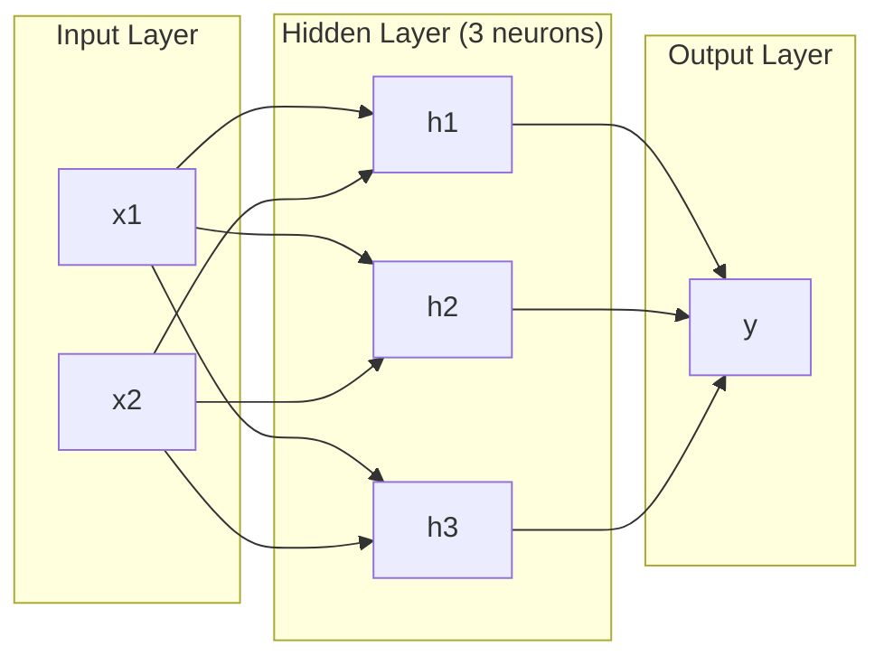
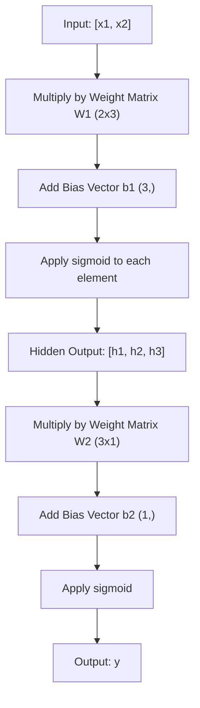
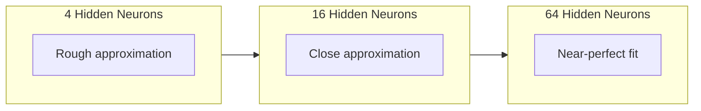

# Çok katmanlı ağlar ve ileri geçit .

> Bir nöron bir çizgi çizer, onları yığar ve her şeyi çizersin.

> Bir sinir bir düz çizgi çizer. Onları birbiri üzerine koy, herhangi bir şekil çizersin.

> **【中文解读】**Bir nöron sadece bir düz çizgi çizer, ancak birden fazla nöronu birden fazla kataya takar, herhangi bir şekil eğriye uygun olur. Bu, birden fazla katlı ağın temel değeridir.

**Type:** Build
**Languages:** Python
**Prerequisites:** Phase 01 (Math Foundations), Lesson 03.01 (The Perceptron)
**Time:** ~90 minutes

## Öğrenme hedefleri

- Tam bir ileri geçiş yapan katman ve ağ sınıfları ile sıfırdan çok katmanlı bir ağ oluştur
  Zücre'den yapılandırma ve katmanlı ve ağlı ırkın çok katmanlı ağlar, tam bir şekilde yayılmaya yönelik
- Bir ağın her katmanında iz matrisi boyutlarını takip edin ve şekil eşleşmemelerini belirleyin
                                                                                                                                                                                                                                                                                                                                                                                                                                                                                                                               
- Hattı olmayan etkinleştirmeleri yığmanın bir ağın eğri karar sınırlarını nasıl öğrenmesini sağladığını açıklayın.
  解释堆叠非线性激活网络如何使网络能够学习曲的决策边界
- El ayarlı sigmoid ağırlıkları ile 2-2-1 mimarisini kullanarak XOR sorunu çöz
  2-2-1 架构解决 XOR 问题 使用手动调整的 sigmoid 权重, 2-2-1 架构解决 XOR 问题

> **【中文解读】**Bu bölümün amacı: sıfırdan yapılandırma katman ve ağ 类, önceden yayımlanan matron boyutunun değişimini anlamak, neden bir bağlantısız aktif fonksiyonun ağın 曲 öğrenmesini sağladığını anlamak.

## Sorunlar. Sorunlar.

Tek bir nöron bir çizgi çekmecesidir. Bu işte. Verilerinizi doğru bir çizgi ile geçirin. Yapay zeka'daki her gerçek sorun -- görüntü tanıma, dil anlama, Go oynamak -- eğrilik gerektirir. Nöronları katmanlara yığmak eğrilik elde etmenin bir yolu.

> 单个神经只是一个图线的工具――仅此而已―― 您的数据中画一条直线―― AI'deki her gerçek sorun―图像识别、语言理解、下围棋都需要曲线―― 单个神经只是一个图线的工具―― 单个神经只是一个图线的工具―― 单个神经就是一个图线的工具―― 单个神经就是一个图线的工具―― 单个神经就是一个图线的工具―― 单个神经只是一个图线的工具―― 单个神经只是一个图线的工具―― 单个神经只是一个图线的工具―― 单个神经就是一个图线的工具―― 单个神经就是一个图线的方法―― 单个神经的方法就是一个图线的方法――

1969'da Minsky ve Papert bu sınırlamanın ölümcül olduğunu kanıtladı: tek katmanlı bir ağ XOR'u öğrenemez. "Öğrenmek için mücadele etmez" - matematiksel olarak olamaz. XOR gerçeklik tabloları bir tarafta [0,1] ve [1,0] yerleştirir, diğer tarafta [0,0] ve [1,1]. Onları hiçbir tek çizgi ayırmaz.

> 1969 yılında, Minsky 和 Papert                                                                                                                                                                                                                                                                                                                                                                                                                                                                                                                      

Bu, on yıldan uzun bir süre sinir ağlarının finansmanını durdurdu. Geriye bakıldığında çözüm açıkça görülüyordu: bir katman kullanmayı bırakın. Nöronları katmanlara yığın. Birinci katman giriş alanını yeni özelliklere kazınsın ve ikinci katmanın bu özellikleri tek bir satır bile yapamayacak kararlara birleştirmesine izin verin.

> Bu, sinir ağının fonunun on yıldan fazla bir süreye kadar kesintisiyle sonuçlanmıştır. Sonrasında çözüm açıkça görülüyor: artık tek bir katman kullanmak zorunda kalmak zorunda kalmak zorunda kalmak zorunda kalmak zorunda kalmak zorunda kalmak zorunda kalmak zorunda kalmak zorunda kalmak zorunda kalmak zorunda kalmak zorunda kalmak zorunda kalmak zorunda kalmak zorunda kalmak zorunda kalmak zorunda kalmak zorunda kalmak zorunda kalmak zorunda kalmak zorunda kalmak zorunda kalmak zorunda kalmak zorunda kalmak zorunda kalmak zorunda kalmak zorunda kalmak zorunda kalmak zorunda kalmak zorunda kalmak zorunda kalmak zorunda kalmak zorunda kalmak zorunda kalmak zorunda kalmak zorunda kalmak zorunda kalmak zorunda kalmak zorunda kalmak zorunda kalmak zorunda kalmak zorunda kalmak zorunda kalmak zorunda kalmak zorunda kalmak zorunda kalmak zorunda kalmak zorunda kalmak zorunda kalmak zorunda kalmak zorunda kalmak zorunda kalmak zorunda kalmak zorunda kalmak zorunda kalmak zorunda kalmak zorunda kalmak zorunda kalmak zorunda kalmak zorunda kalmak zorunda kalmak zorunda kalmak zorunda kalmak zorunda kalmak zorunda kalmak zorunda kalmak zorunda kalmak zorunda kalmak zorunda kalmak zorunda kalmak zorunda kalmak zorunda kalmak zorunda kalmak zorunda kalmak zorunda kalmak zorunda kalmak zorunda kalmak zorunda kalmak zorunda kalmak zorunda kalmak zorunda kalmak zorunda kalmak zorunda kalmak zorunda kalmak zorunda kalmak zorunda kalmak zorunda kalmak zorunda kalmak zorunda kalmak zorunda kalmak zorunda kalmak zorunda kalmak zorunda kalmak zorunda kalmak zorunda kalmak zorunda kalmak zorunda kalmak zorunda kalmak zorunda kalmak zorunda kalmak zorunda kalmak zorunda kalmak zorunda kalmak zorunda kalmak zorunda kalmak zorunda kalmak zorunda kalmak zorunda kalmak zorunda kalmak zorunda kalmak zorunda kalmak zorunda kalmak zorunda kalmak zorunda kalmak zorunda kalmak zorunda kalmak zorunda kalmak zorunda kalmak zorunda kalmak zorunda kalmak zorunda kalmak zorunda kalmak zorunda kalmak zorunda kalmak zorunda kalmak zorunda kalmak zorunda kalmak zorunda kalmak zorunda kalmak zorunda kalmak zorunda kalmak zorunda kalmak zorunda kalmak zorunda kalmak zorunda kalmak zorunda kalmak zorunda kalmak zorunda kalmak zorunda kalmak zorunda kalmak üzere bir karar karar karar karar karar karar karar karar karar karar karar kararlar.

Bu yığın çok katmanlı ağ. Günümüzde üretilen tüm derin öğrenme modellerinin temelidir. Ön geçiş - gizlenmiş katmanlardan çıkışa giren veriler - başka bir şey çalışmadan önce inşa etmeniz gereken ilk şeydir.

> Bu bir çok katlı ağdır. Bugünkü üretim ortamında her derin öğrenme modelinin temelidir.

> **【中文解读】**Tek bir nöron sadece düz çizim yapabilir, ancak görüntü tanımlama, dil anlama, bu gerçek AI görevlerinin tümünün eğrime ihtiyacı vardır. 1969 yılında Minsky ve Papert tek bir katmanlı ağın XOR'u öğrenemeyeceğini kanıtladı.

## Konsepten bir şey.

### Katmanlar: Giriş, Gizli, Çıkış. Katmanlar: Giriş katmanı, Gizli katmanı, Çıkış katmanı.

Çok katmanlı bir ağ üç katman türüne sahiptir:

> Çok katlı ağ üç tip katlıktır:

**Input layer**Bu bir katman değil. Bu sizin ham verilerinizi saklar. iki özellik iki giriş düğüm anlamına gelir. Burada hiçbir hesaplama yapılmıyor.

> **输入层**其实不算真正的层――它存储原始数据――两个特征意味着两个输入节点――这里没有任何计算――

**Hidden layers**- işlerin gerçekleşmesi. Her nöron önceki katmandan her çıkışını alır, ağırlıkları ve bir tarafsızlığı uyguluyor, sonra da sonucu bir etkinleştirme fonksiyonu üzerinden geçer. "Geliştirilmiş" çünkü bu değerleri asla doğrudan eğitim verilerinde görmezsiniz.

> **隐藏层** Gerçek olarak aktif olan yer. Her sinir biriminin ilk katmanındaki tüm çıkışlar, yükleme ve kısaltma işlemleri uygulanır.

**Output layer**- son cevabı. İkili sınıflandırma için, bir nöron sigmoid ile.

> **输出层**最終答案──二分类 一个 sigmoid 神经元,



Bu bir 2-3-1 ağ. İki giriş, üç gizli nöron, bir çıkış. Her bağlantı ağırlık taşır. Her nöron ( giriş hariç) bir önyargı taşır.

> Bu bir 2-3-1 网络── iki giriş, üç gizli sinir, bir çıkış── her bağlantının bir ağırlığı vardır── her sinirün 输入层 dışında) bir yanlışı vardır──

Her katman gizli durum denilen bir rakam vektörü üretir. Metin için gizli durumlar boyutluluğu arttırır -- bir kelimeyi anlamlı anlamı yakalamak için 768 sayı olarak kodlar. Resimler için boyutluluğu azaltır -- milyonlarca pikselden oluşan yönetilebilir bir temsil oluşturur. Gizli durum öğrenmenin yaşadığı yerdir.

> Her katman gizli durum olarak adlandırılan bir dijital vektor oluşturur. Metin için, gizli durum, bir kelimeyi 768 rakam olarak kodlayarak anlamı algılamak için artırır.

> **【中文解读】**Üç kat: girişim katı(sadece veri giriş, hesaplanmıyor)、 gizlilik katı( yapım özellik değişimi, " gizlilik " çünkü eğitim veri içinde bu değerlere bakılmıyor)、 çıkarım katı(sonucuncu cevap)。 her katı ortaya çıkıyor bir vektör adı " gizlilik durumu " metin görev içinde boyut artıyor( sözcükleri 768 维向量 olarak çevirir, ifadeyi kavramak için), görüntü görevlerinde boyut düşüyor(sıkıştırma milyonlarca resim için yoğunlaştırılmıştır)。 öğrenme bu gizlilik durumlarında gerçekleşmektedir。

> **【拓展：Transformer 中的隐藏状态】**GPT/BERT'de, her bir kat Transformer'ın çıkışı da bir gizli durumdur.`model(x).hidden_states[-1]`提取特征用于下游任务──

### Nöronlar ve Aktivasyonlar.

Her nöron üç şey yapar:

> Her sinir üç şey yapar:

1. Her girişini karşılıklı ağırlığı ile çarpın
   Her giriş karşılığı ağırlığı ile çarpılır .
2. Tüm ürünleri toplam ve bir önyargı ekleyin
   Tüm çarpıtı ve çarpıtı
3. Toplamı bir etkinleştirme fonksiyonu üzerinden geç
   Aktifleştirme fonksiyonu

Şimdilik, etkinleştirme sigmoid:

> Şu anda kullanılan aktivasyon işlevi sigmoid:

```
sigmoid(z) = 1 / (1 + e^(-z))
```

Sigmoid herhangi bir sayıyı (0,1) aralığına sıfırlıyor. Büyük olumlu girişler 1. büyük negatif girişler 0.5'e doğru sıfır haritelerine doğru ilerliyor. Bu düz eğri öğrenmeyi mümkün kılan şey.

> Sigmoid herhangi bir rakamı (0, 1) aralığında küçültür. Büyük negatif giriş eğilimi 0,0'a doğru hareket eder. Bu düz eğilimi öğrenmeyi mümkün kılar.

> **【中文解读】**Her sinir üç şeyi yapar: input乘权重、求和加偏置、过激活函数──Sigmoid İstediği sayıyı (0, 1) 区间──关键 olarak bu şekilde 梯度下降が可能になる──感知机的阶跃函数在0处不可导,所以无法使用梯度下降训练──

### Önceki Geçit: Verilerin Akışları

Ön geçiş, giriş verilerini ağ üzerinden katman katman olarak, çıkışa ulaşana kadar itirir. Ön geçiş sırasında hiçbir öğrenme gerçekleşmez. Saf hesaplama: katlay, ekle, etkinleştir, tekrarla.

> Ön yönlü yayım, verileri ağın üzerinden bir kat olarak aktarır, çıkışın ulaşıncaya kadar. Ön yönlü yayım sürecinde hiçbir öğrenme gerçekleşmez.



Her katman, üç işlem sırayla gerçekleşir:

> Her aşamada, üç işlem yapılır:

```
z = W * input + b       (linear transformation)    # 线性变换
a = sigmoid(z)           (activation)                # 激活
```

Bir katmanın çıkışı bir sonraki katmanın girişine dönüşür.

> Bir katmanın çıkışı aşağı katmanın girişine dönüşür.

> **【中文解读】**Ön yönü yayılma, giriş akışından çıkış sürecine kadar yapılan veri işlemidir. Hiçbir öğrenme, saf hesaplama yoktur. Her kat iki şeyi yapın: 线性变换 ((Wx + b) + 非线性活活 ((sigmoid) ⋅ üst katın çıkışı, alt katın girişidir.`model(x)`Yapılacak şeyler var.

### Matrix Boyutları.

Arkaplan boyutları derin öğrenmede en önemli defegleme becerisidir.

> 追踪维度深度学习'da en önemli调试技能──以下是 2-3-1 网络:

| Step | Operation | Dimensions | Result Shape |
|------|-----------|------------|-------------|
| Input | x | -- | (2,) |
| Hidden linear | W1 * x + b1 | W1: (3, 2), b1: (3,) | (3,) |
| Hidden activation | sigmoid(z1) | -- | (3,) |
| Output linear | W2 * h + b2 | W2: (1, 3), b2: (1,) | (1,) |
| Output activation | sigmoid(z2) | -- | (1,) |

| 步骤 | 操作 | 维度 | 结果形状 |
|------|------|------|---------|
| 输入 | x | -- | (2,) |
| 隐藏层线性变换 | W1 * x + b1 | W1: (3, 2), b1: (3,) | (3,) |
| 隐藏层激活 | sigmoid(z1) | -- | (3,) |
| 输出层线性变换 | W2 * h + b2 | W2: (1, 3), b2: (1,) | (1,) |
| 输出层激活 | sigmoid(z2) | -- | (1,) |

Kural: katman k'deki ağırlık matrisi W'nin şekli vardır (neurons_in_layer_k, neurons_in_layer_k_minus_1). Satırlar mevcut katmanla eşleşir. sütunlar önceki katmanla eşleşir. Eğer şekiller sırayla gelmezse, bir hata vardır.

> 規則:第 k 層の重量矩阵 W'nın şekli (第 k 層神经元数, 第 k - 1 層神经元数) 〜行对应应应应应应应应应应应应应应应应应应应应应应应应应应应应应应应应应应应应应应应应应应应应应应应应应应应应应应应应应应应应应应应应应应应应应应应应应应应应应应应应应应应应应应应应应应应应应应应应应应应应应应应应应应应应应应应应应应应应应应应应应应应应应应应应应应应应应应应应应应应应应应应应应应应应应应应应应应应应应应应应应应应应应应应应应应应应应应应应应应应应应应应应应应应应应应应应应应应应应应应应应应应应应应应应应应应应应应应应应应应应应应应应应应应应应应应应应应应应应应应应应应应应应应应应应应应应应应应应应应应应应应应应应应应应应应应应应应应应应应应应应应应应应应应应应应应应应应应应应应应应应应应应应应应应应应应应应应应应应应应应应应应应应应应应应应应应应应应应应应应应应应应应应应应应应应应应应应应应应应应应应应应应应应应应应应应应应应应应应应应应应应应应应应应应应应应应应应应应应应应应应应应应应应应应应应应应应应应应应应应应应应应应应应应应应应应应应应应应应应应应应应应应应应应应应应应应应应应应应应应应应应应应应应应应

> **【中文解读】**追踪矩阵维度深度学习中最重要的调试技能──规则很简单:第一个层的权重矩阵 W 形是 (第一个层神经元数, 第一个层神经元数)──行对应应应应应应应应应应应应应应应应应应应应应应应应应应应应应应应应应应应应应应应应应应应应应应应应应应应应应应应应应应应应应应应应应应应应应应应应应应应应应应应应应应应应应应应应应应应应应应应应应应应应应应应应应应应应应应应应应应应应应应应应应应应应应应应应应应应应应应应应应应应应应应应应应应应应应应应应应应应应应应应应应应应应应应应应应应应应应应应应应应应应应应应应应应应应应应应应应应应应应应应应应应应应应应应应应应应应应应应应应应应应应应应应应应应应应应应应应应应应应应应应应应应应应应应应应应应应应应应应应应应应应应应应应应应应应应应应应应应应应应应应应应应应应应应应应应应应应应应应应应应应应应应应应应应应应应应应应应应应应应应应应应应应应应应应应应应应应应应应应应应应应应应应应应应应应应应应应应应应应应应应应应应应应应应应应应应应应应应应应应应应应应应应应应应应应应应应应应应应应应应应应应应应应应应应应应应应应应应应应应应应应应应应应应应应应应应应应应应应应应应应应应应应应应应应应应应应应应应

> **【拓展：维度不匹配是深度学习最常见的 bug】**PyTorch'te sık sık görüyorsun.`RuntimeError: mat1 and mat2 shapes cannot be multiplied`Bu, ölçümlerin eşleşmediği bir şeydir.`torchsummary`Ya da`torchinfo`Otomatik kontrol yapmanıza yardımcı olabilirim.

### Evrensel Yaklaşım Teoremi.

1989'da George Cybenko olağanüstü bir şey kanıtladı: tek bir gizli katman ve yeterli nöronlu bir sinir ağı istedikleri herhangi bir kesinliğe herhangi bir sürekli fonksiyonu yaklaşabilir.

> 1989 yılında George Cybenko bir şey kanıtladı: tek bir gizli katman ve yeterli sayıda nöronlu nöron ağı herhangi bir devamlı işlevi istediği doğrulukla yaklaşabilir.

Bu, gizli bir katman her zaman en iyisi olduğu anlamına gelmez. Bu, mimarinin teorik olarak yeteneğine sahip olduğu anlamına gelir.

> Bu, gizli bir katman her zaman en iyi olduğu anlamına gelmez. Bu, teoride yapılandırmanın uygulanabilir olduğu anlamına gelmez.

İçgüdü: Gizli katmandaki her nöron bir "bump" ya da özellik öğrenir. Doğru yerlere yerleştirilen yeterince bulup herhangi bir düz eğriyi yaklaşabilir. Daha fazla nöron, daha fazla bulup, daha iyi yaklaşılabilir.

> 直觉: gizli katmanın her sinir bir "konksi" veya özellik öğrenir. Doğru konumdaki konksi yeterince fazla yerleştirerek herhangi bir düz eğri çizgisine yaklaşır.



> **【中文解读】**Mönere yakın teorisi (1989): Bir gizli katman +  yeterince fazla nöron herhangi bir devamlı işlevi yakın olabilir. Ancak bu, bir katmanın pratikte  yeterince olduğunu göstermez. "Dünen ve dar" ağı, "sarsak ve geniş" ağından daha yüksek verimlidir.

> **【拓展：为什么"深"比"宽"好】**Teorik olarak bir katman 2 ′n ′ sinirleri n katman 2 ′ sinirlerinin değerine eşit, ancak öncekilerin parametre sayısı endeksal, sonrakiler ise doğrusaldır.

### Yapılandırılabilirlik.

Nöral ağlar yapılandırılabilir. Onları yığarak zincirleyebilir, paralel olarak çalıştırılabilir. Bir Whisper modeli ses işleme için bir kodlayıcı ağı ve metin oluşturmak için ayrı bir dekodör ağı kullanır. Modern LLM'ler sadece dekodördür. BERT sadece kodlayıcıdır. T5 kodlayıcı-dekodördür. Arsitektur seçeneği modelin ne yapabileceğini tanımlar.

> Neuralar ağları bir araya gelebilir. Onları toplayabilirsin, bağlayabilirsin, birlikte çalışabilirsin. Sıcak sesli bir kodlayıcı ağı kullanarak, tek başına kodlayıcı ağı kullanarak metin oluşturulur.

> **【中文解读】**神经网络是组合的:Whisper 用编码器处理音频 + 解码器生成文本;GPT 纯解码器;BERT 纯编码器;T5 编码器-解码器──架构选择决定模型的能力──

## Yapın.
```figure
mlp-forward
```

## Yapın

Temiz Python, hiç bir şey yok, her matris işlemini sıfırdan yazmış.

> -Pure Python. -Numpy kullanmıyorum.

### Adım 1: Sigmoid Aktifleştirme

```python
import math

def sigmoid(x):
    x = max(-500.0, min(500.0, x))  # 裁剪到 [-500, 500] 防止指数溢出
    return 1.0 / (1.0 + math.exp(-x))  # σ(x) = 1/(1+e^(-x))
```

[500, 500]'e kadar olan sıkıştırıcı, aşırı akışın önlenmesini sağlar. `math.exp(500)`Büyük ama sınırlı.`math.exp(1000)`Sonsuzluk.

> 500'e kadar kesilmiş.`math.exp(500)`Çok büyük ama sınırlı.`math.exp(1000)`- Evet, çok büyük.

### Adım 2: Katman sınıfı

Derin öğrenme'de en önemli işlem matris çarpımı. Her katman, her dikkat başlığı, her ileri geçiş - aşağıya kadar matmuls. Bir doğrusal katman bir giriş vektörü alır, ağırlık matrisine çarpır ve bir önyargı vektörü ekler: y = Wx + b. Bu tek denklem sinir ağındaki hesaplamanın %90'ını oluşturur.

> Derinlik öğreniminde en önemli işlem, matraj çarpmaıdır. Her katman, her dikkat başı, her ön yönü yayımlanan  hepsi matraj çarpmaıdır.

Bir katman bir ağırlık matrisi ve bir önyargı vektörü tutar. Önüne yönlendirme bir giriş vektörü alır ve etkin çıkışı iade eder.

> Bir katman bir ağırlık matçını ve bir eğrilik vektörünü içerir.

```python
class Layer:
    def __init__(self, n_inputs, n_neurons, weights=None, biases=None):
        if weights is not None:
            self.weights = weights                       # 使用指定的权重（如手动设置 XOR 的权重）
        else:
            import random
            self.weights = [
                [random.uniform(-1, 1) for _ in range(n_inputs)]  # 随机初始化权重
                for _ in range(n_neurons)
            ]                                           # 形状：(n_neurons, n_inputs)
        if biases is not None:
            self.biases = biases                         # 使用指定的偏置
        else:
            self.biases = [0.0] * n_neurons              # 偏置初始化为 0

    def forward(self, inputs):
        self.last_input = inputs                         # 保存输入（反向传播时需要）
        self.last_output = []
        for neuron_idx in range(len(self.weights)):
            z = sum(
                w * x for w, x in zip(self.weights[neuron_idx], inputs)  # 加权求和
            )
            z += self.biases[neuron_idx]                 # 加偏置
            self.last_output.append(sigmoid(z))          # sigmoid 激活
        return self.last_output
```

Ağırlık matrisi şekli vardır (n_neurons, n_inputs). Her satır tüm girişler boyunca bir nöronun ağırlıklarıdır. Ön metot nöronları üzerinden döngüler, ağırlanan toplam artı önyargıyı hesaplar, sigmoid uygulaır ve sonuçları toplar.

> 权重矩阵的形状为 (n_neurons, n_inputs) ⋅ her satır tüm girişlerin üzerindeki ⋅aine ⋅aine ⋅aine ⋅aine ⋅aine ⋅aine ⋅aine ⋅aine ⋅aine ⋅aine ⋅aine ⋅aine ⋅aine ⋅aine ⋅aine ⋅aine ⋅aine ⋅aine ⋅aine ⋅aine ⋅aine ⋅aine ⋅aine ⋅aine ⋅aine ⋅aine ⋅aine ⋅aine ⋅aine ⋅aine ⋅aine ⋅aine ⋅aine ⋅aine ⋅aine ⋅a ⋅a ⋅a ⋅a ⋅a ⋅a ⋅a ⋅a ⋅a ⋅a ⋅a ⋅a ⋅a ⋅a ⋅a ⋅a ⋅a ⋅a ⋅a ⋅a ⋅a ⋅a ⋅a ⋅a ⋅a ⋅a ⋅a ⋅a ⋅a ⋅a ⋅a ⋅a ⋅a ⋅a ⋅a ⋅a ⋅a ⋅a ⋅a ⋅a ⋅a

> **【拓展：PyTorch 的 nn.Linear】**Bu katman PyTorch .`nn.Linear`Yazdırılmış bir sürüm.`nn.Linear(in_features, out_features)`İçinde de bir koruma var.`(out_features, in_features)`Bir tane ve bir tane.`(out_features,)`Bu, derin öğrenmenin %90'ının hesaplanmasını anlıyor.

### Adım 3: Ağ Sınıfı

Bir ağ katmanların bir listesi. Ön geçiş onları zincirler: katman k çıkışı katman k + 1 olarak beslenir.

> 网络是一个层的列表――前向传播将它们串联:第 k 层的输出作为第 k + 1 层的输入――

```python
class Network:
    def __init__(self, layers):
        self.layers = layers   # 按顺序存储所有层

    def forward(self, inputs):
        current = inputs               # 当前层的输入
        for layer in self.layers:
            current = layer.forward(current)  # 逐层前向传播
        return current
```

Bu, tüm ileri geçiş. Dört çizgi mantık. Veriler içeri girer, her katman boyunca akıyor, diğer taraftan çıkar.

> Bu, tüm ön yönlü yayılma.

> **【中文解读】**Ağ 类就是 PyTorch `nn.Sequential`Bu, tüm derin öğrenme modelinin yayılmasının özelliğidir.

### Adım 4: XOR el ayarlı ağırlıklarla XOR'u elle ayarlama gücü ile çözün

01. Dersde, OR, NAND ve AND algılayıcılarını birleştirerek XOR'u çözdük. Şimdi katman ve ağ sınıflarımızla aynı şeyi yapın. 2-2-1 mimarisi: iki giriş, iki gizli nöron, bir çıkış.

> 1. Sınıfta, OR、NAND 和 AND 感知机 ile XOR 解析 edildi. Şimdi bizim katmanımız ve ağ sınıfımızla aynı şeyi yapıyoruz.

```python
hidden = Layer(
    n_inputs=2,
    n_neurons=2,
    weights=[[20.0, 20.0], [-20.0, -20.0]],  # 大权重让 sigmoid 接近阶跃函数
    biases=[-10.0, 30.0],                      # 第一个神经元 ≈ OR，第二个 ≈ NAND
)

output = Layer(
    n_inputs=2,
    n_neurons=1,
    weights=[[20.0, 20.0]],                    # 输出层 ≈ AND
    biases=[-30.0],
)

xor_net = Network([hidden, output])

xor_data = [
    ([0, 0], 0),
    ([0, 1], 1),
    ([1, 0], 1),
    ([1, 1], 0),
]

for inputs, expected in xor_data:
    result = xor_net.forward(inputs)
    predicted = 1 if result[0] >= 0.5 else 0
    print(f"  {inputs} -> {result[0]:.6f} (rounded: {predicted}, expected: {expected})")
```

Büyük ağırlıklar (20, -20) sigmoid'i bir adım fonksiyonu gibi hareket ettirir. İlk gizli nöron OR'ya yakındır. İkinci NAND'e yakındır. Çıkış nöronu onları AND'e birleştirir, bu da XOR'dur.

> Büyük ağırlık (20, -20) Use sigmoid manifested as a step jump function。 1. gizli sinirlerin yakınlığı OR, 2. yakınlık NAND── output sinirlerin onları bir araya getirmesi AND, yani XOR──

### Adım 5: Çember sınıflandırması.

Daha zor bir sorun: 2 boyutlu noktaları, köken merkezindeki 0.5 radiüsün içinde veya dışında bir dairede sınıflandırmak. Bu, tek bir algılayıcı için imkansız olan eğri bir karar sınırı gerektirir.

> Bir daha zor olan soru: iki boyutlu noktaları bir başlangıç noktasına odaklanmış olarak sınıflandırmak, yarılık 0.5'in içinde veya dışında bir yuvarlak olarak.

```python
import random
import math

random.seed(42)

data = []
for _ in range(200):
    x = random.uniform(-1, 1)
    y = random.uniform(-1, 1)
    label = 1 if (x * x + y * y) < 0.25 else 0   # 距原点距离 < 0.5 则为"内部"
    data.append(([x, y], label))

circle_net = Network([
    Layer(n_inputs=2, n_neurons=8),   # 隐藏层：8 个神经元
    Layer(n_inputs=8, n_neurons=1),   # 输出层：1 个神经元
])
```

Bu da bir diğer şey. Bu da bir diğer şey. Bu da bir diğer şey. Bu da bir diğer şey.

> Bilgisayarın gelişmiş ve gelişmiş bir sistem olması için, bu sistemin gelişmiş bir sistem olduğunu biliyoruz.

```python
correct = 0
for inputs, expected in data:
    result = circle_net.forward(inputs)
    predicted = 1 if result[0] >= 0.5 else 0
    if predicted == expected:
        correct += 1

print(f"Accuracy with random weights: {correct}/{len(data)} ({100*correct/len(data):.1f}%)")
```

Rastgele ağırlıklar düşük doğruluk sağlar. Çoğu zaman çoğunluk sınıfını tahmin etmekten daha kötüdür. Eğitimden sonra (Denevi 03), bu aynı yapı 8 gizli nöronlu bir çizer.

> 随机权重给出了很差的精确率通常比猜测多数类还差──经过训练第 03 课) 后, aynı zamanda 8 gizli sinir yapısı vardır 曲的边界,将圆内和圆外分开──

> **【中文解读】**随机权重的网络分类效果很差这是正常的,因为还没有训练――前向传播只是计算,不涉及学习――训练(下一课的反向传播) 才会调整权重――8 隐藏神经足以绘画圆形的决策边界――

## Bunu uygulamak için kullanın.

PyTorch yukarıdaki her şeyi dört satırla yapar:

> PyTorch dört kod kullanarak yukarıdaki tüm işlevleri tamamlayabilir:

```python
import torch
import torch.nn as nn

model = nn.Sequential(       # 对应我们的 Network 类
    nn.Linear(2, 8),         # 对应 Layer(2, 8)：权重形状 (8, 2)
    nn.Sigmoid(),             # 对应 sigmoid 激活
    nn.Linear(8, 1),         # 对应 Layer(8, 1)：权重形状 (1, 8)
    nn.Sigmoid(),             # 输出层 sigmoid
)

x = torch.tensor([[0.0, 0.0], [0.0, 1.0], [1.0, 0.0], [1.0, 1.0]])  # XOR 输入
output = model(x)             # 前向传播
print(output)
```

`nn.Linear(2, 8)`katman sınıfınız: şekil ağırlık matrisi (8, 2), şekil eğilimi vektörü (8,). `nn.Sigmoid()`Sigmoid fonksiyonunuz element yönünde uygulanır.`nn.Sequential`Ağ sınıfınız: zincir katmanları sırasıyla.

> `nn.Linear(2, 8)`İşte senin tabaka 类:形状为 (8, 2) 的权重矩阵,形状为 (8,) 的偏置向量──`nn.Sigmoid()`Bu, senin sigmoid fonksiyonunun elementleri için bir uygulama.`nn.Sequential`İşte senin ağın.

PyTorch GPU'larda çalışır, milyonlarca numuneyi ele alır ve geri yayılma için otomatik olarak gradient hesaplar. Ama ileri geçiş mantığı sıfırdan inşa ettiğiniz ile aynıdır.

> 区别在速度和规模中. PyTorch GPU üzerinde çalışır, milyonlarca örnek miktarını işlemeyi yapar ve otomatik olarak propagandaya karşı yayılma derecesini hesaplar.

> **【中文解读】**PyTorch dört satır kodumuzla tüm mantıkları gerçekleştirdik.`nn.Linear`= Bizim katman,`nn.Sequential`= Bizim Ağ,`nn.Sigmoid()`= √ √ √ √ √ √ √ √ √ √ √ √ √ √ √ √ √ √ √ √ √ √ √ √ √ √ √ √ √ √ √ √ √ √ √ √ √ √ √ √ √ √ √ √ √ √ √ √ √ √ √ √ √ √ √ √ √ √ √ √ √ √ √ √ √ √ √ √ √ √ √ √ √ √ √ √ √ √ √ √ √ √ √ √ √ √ √ √ √ √ √ √ √ √ √ √ √ √ √ √ √ √ √ √ √ √ √ √ √ √ √ √ √ √ √ √ √ √ √ √ √ √ √ √ √ √ √ √ √ √ √ √ √ √ √ √ √ √ √ √ √ √ √ √ √ √ √ √ √ √ √ √ √ √ √ √ √ √ √ √ √ √ √ √ √ √ √ √ √ √ √ √ √ √ √ √ √ √ √ √ √ √ √ √ √ √ √ √ √ √ √ √ √ √ √ √ √ √ √ √ √ √ √ √ √ √ √ √ √ √ √ √ √ √ √ √ √ √ √ √ √ √ √ √ √ √ √ √ √ √ √ √ √ √ √ √ √ √ √ √ √ √ √ √ √ √   √       √     

## Gönder .

Bu ders, ağ mimarlıklarını tasarlamak için tekrar kullanılabilir bir ipucu üretir:

> Bu ders bir tekrarlanabilir ağ yapı tasarım önerisi ile oluştu:

- `outputs/prompt-network-architect.md`

Bir sorun için kaç katman, her katman için kaç nöron ve hangi etkinleştirme fonksiyonunu kullanmanız gerektiğinde kullanın.

> Bir sorunun belirlenmesi için, her katın kaç nöron kullanması gerektiğinde ve hangi aktivasyon fonksiyonlarını kullanmanız gerektiğinde, kullanabilirsiniz.

## Egzersizler.

1. 2-4-2-1 ağı (iki gizli katman) oluşturun ve rastgele ağırlıklar ile XOR verilerine ileri geçiş çalıştırın.
   > **练习 1：**构建 2-4-2-1 网络(两个隐藏层),随机权重运 XOR 数据的前向传播――打印中藏层输出,观察每层如何变变数据的表示──

2. Çember sınıflandırıcısındaki gizli katman boyutunu 8'den 2'ye değiştirin. Sonra 32. Her seferinde rastgele ağırlıklar ile ileri geçiş yapın. Gizli nöron sayısının çıkış aralığı veya dağılımını değiştirir mi? Neden?
   > **练习 2：**Bu yüzden, bu da bir diğer şey. Bu da bir diğer şey. Bu da bir diğer şey.

3. A.`count_parameters`Network sınıfında toplam ağırlık ve tarafsızlık sayısını gönderen bir yöntem. 784-256-128-10 bir ağ üzerinde test edin (klasik MNIST mimarisi).
   > **练习 3：**Networks 类中实现 `count_parameters`方法, return all trainable weight and biased total number―784-256-128-10 网络(klasik MNIST 架构) test, hangi parametre var?

4. 3-4-4-2 ağı için bir ileri geçit oluşturun. RGB renk değerlerini (normalleştirilmiş 0-1) girin ve iki çıkışı gözlemleyin. Bu iki sınıflı basit bir renk sınıflandırıcısı için mimaridir.
   > **练习 4：**3-4-4-2 网络构建前向传播──输入 RGB 颜色值(归结到0-1),观察两个输出──这是一个简单的双色分类器的架构──

5. Sigmoid'i "çıkışlı adım" işleviyle değiştirin: z < 0, z = 0.01 * z geri gönderin.
   > **练习 5：**"漏斗阶跃" işlevi ile sigmoid:z < 0 时返回 0.01\*z,否则返回 1.0 ・・・ kullanmak 4. Sateyin el ağırlığı ile XOR ・・・ Yine de normal çalışıyor mu? Neden düz bir sigmoid sert kesimden daha iyi?

## Anahtar Terimler

| Term | What people say | What it actually means |
|------|----------------|----------------------|
| Forward pass | "Running the model" | Pushing input through every layer -- multiply by weights, add bias, activate -- to produce an output |
| Hidden layer | "The middle part" | Any layer between input and output whose values are not directly observed in the data |
| Multi-layer network | "A deep neural network" | Layers of neurons stacked sequentially, where each layer's output feeds the next layer's input |
| Activation function | "The nonlinearity" | A function applied after the linear transformation that introduces curves into the decision boundary |
| Sigmoid | "The S-curve" | sigma(z) = 1/(1+e^(-z)), squashes any real number to (0,1), smooth and differentiable everywhere |
| Weight matrix | "The parameters" | A matrix W of shape (current_layer_neurons, previous_layer_neurons) containing learnable connection strengths |
| Bias vector | "The offset" | A vector added after the matrix multiply that lets neurons activate even when all inputs are zero |
| Universal approximation | "Neural nets can learn anything" | A single hidden layer with enough neurons can approximate any continuous function -- but "enough" can mean billions |
| Linear transformation | "The matrix multiply step" | z = W * x + b, the computation before activation, which maps inputs to a new space |
| Decision boundary | "Where the classifier switches" | The surface in input space where the network output crosses the classification threshold |

| 术语 | 通俗说法 | 实际含义 |
|------|---------|---------|
| 前向传播 (Forward pass) | "跑模型" | 把输入推过每一层——乘权重、加偏置、激活——得到输出 |
| 隐藏层 (Hidden layer) | "中间那部分" | 输入层和输出层之间的层，其值在训练数据中不可直接观测 |
| 多层网络 (Multi-layer network) | "深度神经网络" | 神经元按层堆叠，每层的输出是下一层的输入 |
| 激活函数 (Activation function) | "非线性" | 线性变换后施加的函数，让决策边界变成曲线 |
| Sigmoid | "S 曲线" | σ(z) = 1/(1+e^(-z))，把任意实数压缩到 (0,1)，处处平滑可导 |
| 权重矩阵 (Weight matrix) | "参数" | 形状为 (当前层神经元, 上一层神经元) 的矩阵，包含可学习的连接强度 |
| 偏置向量 (Bias vector) | "偏移" | 矩阵乘法后加上的向量，让神经元在全零输入时也能激活 |
| 万能逼近 (Universal approximation) | "神经网络什么都能学" | 一个隐藏层 + 足够多神经元可逼近任何连续函数——但"足够"可能意味着数十亿 |
| 线性变换 (Linear transformation) | "矩阵乘法那步" | z = Wx + b，激活前的计算，把输入映射到新空间 |
| 决策边界 (Decision boundary) | "分类器切换的地方" | 输入空间中网络输出跨过分类阈值的曲面 |

## Daha fazla okumak

- Michael Nielsen, "Nöral ağlar ve derin öğrenme", Bölüm 1-2 (http://neuralnetworksanddeeplearning.com/) -- ileri geçişlerin ve ağ yapısının en açık açık açıklaması, etkileşimli görselleştirmeler ile
  Michael Nielsen,  Neural Networks and Deep Learning  1-2 bölüm  Önemli yayılma ve ağ yapısı hakkında en net açıklama, etkileşimsel görsellik ile
- Cybenko, "Sigmoidal Bir Fonksiyonun Süperpozisyonları ile Yaklaşması" (1989) - orijinal evrensel yaklaşım teoremi makalesi, şaşırtıcı derecede okuyabilir
  Cybenko, Sigmoid ile 函数叠加逼近(1989) 原始的万能逼近定定理论文,出人意料地易读
- 3Blue1Brown, "Ama sinir ağı nedir?"https://www.youtube.com/watch?v=aircAruvnKk) -- 20 dakikalık görsel bir yürüyüş, katman, ağırlık ve ileri geçişler doğru zihinsel model oluşturur
  3Blue1Brown,  Neural Networks nedir? 20 dakika video anlatımı, doğru içgüdü oluşturmanıza yardımcı olur.
- İyi arkadaş, Bengio, Courville, "Dikkatli Öğrenme", 6. bölüm (https://www.deeplearningbook.org/) -- Çok katmanlı ağlar için standart referans, ücretsiz çevrimiçi
  İyi arkadaş,Bengio,Courville,深度学习,第 6 章 多层网络的标准参考,免费在线
