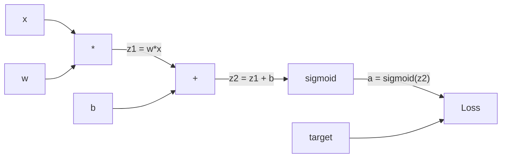
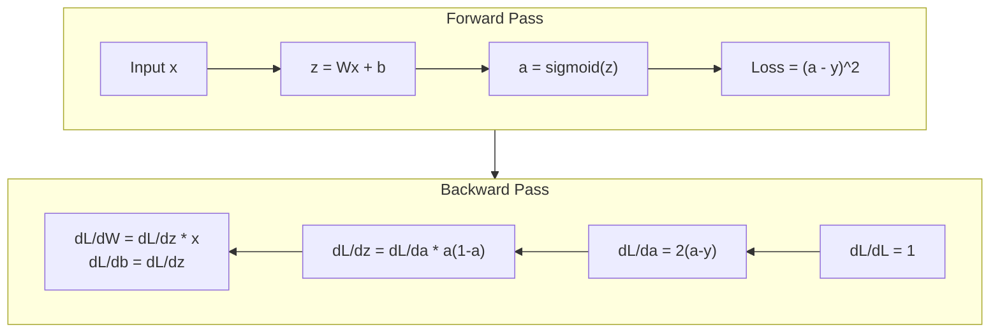
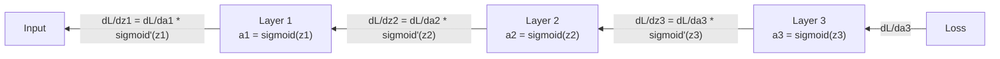

# İptalden geriye yayılma sıfırdan geriye yayılma

> Geri yayılma öğrenmeyi mümkün kılan algoritmadır.

> Bu yöntemin bir parçası olarak, öğrenme mümkün hale getirmek için bir algoritma oluşturulur.

> **【中文解读】**Karşı yönlü yayım, sinir ağının "bilme" için temel algoritmadır. Bu olmadan, sinir ağı sadece bir dizi rastgele sayının bir parçasıdır.

**Type:** Build
**Languages:** Python
**Prerequisites:** Lesson 03.02 (Multi-Layer Networks)
**Time:** ~120 minutes

## Öğrenme hedefleri

- Bilgisayar grafikini oluşturan ve topolojik sıralama yoluyla gradientleri hesaplayan değer tabanlı bir otograd motoru uygulayın
  Değer tabanlı otomatik küçük bölüm motoru gerçekleştirmek, hesaplama grafikleri oluşturmak ve sıralama hesaplama derecesi ile
- Zincir kuralını kullanarak ekleme, katılım ve sigmoid için geriye geçiş çıkar
  Çekiş kuralları ile, ekleme, çarpma ve sigmoid'in ters yönlü yayılması
- XOR ve çevreler sınıflandırması üzerinde çok katmanlı bir ağ eğitmek sadece sıfırdan geri yayılma motoru kullanarak
  Sadece XOR ve yuvarlak sınıflarda binayen bir çok katlı ağ üzerinde eğitim almak için sıfırdan inşa edilmiş bir ters yönlü yayım motorunu kullanın
- Derin sigmoid ağlarda kaybolan gradient sorunu tespit edin ve gradientlerin neden eksponansiyel olarak küçüldüğünü açıklayın
  识别深度 sigmoid 网络中的梯度消失问题, neden梯度会指数级缩小的解释

> **【中文解读】**Bu bölümün amacı: PyTorch Autograd'a benzer bir otomatik parçacık motor oluşturmak, zincir biçimindeki kurallarla ekleme, çarpma, simmondarın ters yönlü yayılması, XOR ve yuvarlak sınıfı görevlerini eğitmek, derece kaybı sorunu anlamak.

## Sorunlar. Sorunlar.

Ağınızdaki gizli bir katman var. 768 giriş ve 3072 çıkış var. Bu 2.359.296 ağırlık. Yanlış bir tahmin yaptı. Hangi ağırlıklar hatayı neden etti? Her ağırlığı bireysel olarak test etmek 2.3 milyon ileri geçişi demektir. Geri yayılma tek bir geri geçişi içinde tüm 2.3 milyon gradient hesaplar. Bu bir optimizasyon değil. Bu eğitimlenebilir ve imkansız arasındaki fark.

> Senin ağında 768 輸入、3072 輸出 gizli katman var. Bu 2,359,296 权重だ. Yanlış tahmin yaptı. Hangi 权重 yanlışlığa neden oldu?

Saçma yaklaşım: bir ağırlık al, onu küçük bir miktarla it, ileri geçiş tekrar çalış, kayıpın yükselmiş veya düşmüş olup olmadığını ölç. Bu size bu ağırlığın eğilimi verir. Şimdi bunu ağdaki her ağırlık için yapın. Binlerce eğitim adımıyla ve milyonlarca veri noktasıyla çoğaltın.

> シンプル方法: Get a weight, micro-modulate it, run again, before spreading, measurement loss is up or down 👍👍👍👍👍👍👍👍👍👍👍👍👍👍👍👍👍👍👍👍👍👍👍👍👍👍👍👍👍👍👍👍👍👍👍👍👍👍👍👍👍👍👍👍👍👍👍👍👍👍👍👍👍👍👍👍👍👍👍👍👍👍👍👍👍👍👍👍👍👍👍👍👍👍👍👍👍👍👍👍👍👍👍👍👍👍👍👍👍👍👍👍👍👍👍👍👍👍👍👍👍👍👍👍👍👍👍👍👍👍👍👍👍👍👍👍👍👍👍👍👍👍👍👍👍👍👍👍👍👍👍👍👍👍👍👍👍👍👍👍👍👍👍👍👍👍👍👍👍👍👍👍👍👍👍👍👍👍👍👍👍👍👍👍👍👍👍👍👍👍👍👍👍👍👍👍👍👍👍👍👍👍👍👍👍👍👍👍👍👍👍👍👍👍👍👍👍👍👍👍👍👍👍👍👍👍👍👍👍👍👍👍👍👍👍👍👍👍👍👍👍👍👍👍👍👍👍👍👍👍👍👍👍👍👍👍👍👍👍👍👍👍👍👍👍👍👍👍👍👍👍👍👍👍👍👍👍👍👍👍👍👍👍👍👍👍👍👍👍👍👍👍👍👍👍👍👍👍👍👍👍👍👍👍👍👍👍👍👍👍👍👍👍👍👍👍👍👍👍👍👍👍👍👍👍👍👍👍👍👍👍👍👍👍👍👍👍👍👍👍👍👍👍👍👍👍👍👍👍👍👍👍👍👍👍👍👍👍👍👍👍👍👍👍👍👍👍👍👍👍👍👍👍👍👍👍👍👍👍👍👍👍👍👍👍👍👍👍👍👍👍👍👍👍👍👍👍👍👍👍👍👍

Geriye yayılma bunu çözüyor. Bir ileri geçiş, bir geri geçiş, tüm gradientler hesaplanmış. Hile, hesaplama kuralından gelen zincir kuralıdır, sistematik olarak bir hesaplama grafikine uygulanır. Bu derin öğrenmeyi pratik yapan algoritmadır.

> Bir kere ileriye doğru yayılmak, bir kere geriye doğru yayılmak, tüm dereceler hesaplanıp tamamlanmak.

> **【中文解读】**Bir 235 milyon ağırlıklı ağ, eğer bireysel olarak bir dilimde bir dilim hesaplarsa, 235 milyon kez ileriye doğru yayılmalıdır.

## Konsepten bir şey.

### Ağı Kuralı, Ağlara Uygulanıyor.

Dönem 01, Ders 05'te zincir kuralını gördünüz. Hızlı bir şekilde özetle: eğer y = f(g(x) ise, dy/dx = f'(g(x)) * g'(x.

> Eğer y = f(g(x) ise, dy/dx = f'(g(x)) * g'(x) ――

Bir sinir ağında, " zincir " girişten kayba kadar işlemlerin sırasıdır. Her katman ağırlık uyguluyor, tarafsızlıklar ekliyor, bir etkinleştirme üzerinden geçiyor. Kayıp işlevi son çıkışı hedefe karşılaştırır. Geri yayılma bu zinciri geriye doğru izler ve her işlemin hataya nasıl katkıda bulunduğunu hesaplar.

> Sinir ağlarında, " zincir " girişten kayıplara kadar işlem sırasıdır. Her aşamada uygulama ağırlığı, ek kısıtlama, etkinleştirme fonksiyonu ile sonuç olarak işlev çıkışı ile hedefi karşılaştırılır.

> **【中文解读】**链式法则: Eğer y = f(g(x)),则 dy/dx = f'(g(x)) * g'(x) ・・・

> **【拓展：PyTorch autograd 的核心】**PyTorch'in `loss.backward()`İşte otomatik olarak yapılır bir zincir biçimi kuralı. Önde yayıldığı zaman kaydedilen hesaplama çizgisi, sonra geriye doğru yayılan derecede yapılan çizgiler boyunca, bu dersin elini gerçekleştirdiğini anladık, PyTorch otogradının tüm prensiplerini anladık.

### Hesaplama Grafikleri .

Her ileri geçiş bir grafik oluşturur. Her düğüm bir işlemdir (çıkartmak, eklemek, sigmoid). Her kenar ileri bir değer ve geriye bir eğilimi taşır.

> Her bir önceki yönde yayımlanmış olan bir çizim oluşturur. Her bir nokta bir işlemdir.



Önceki geçiş: değerler soldan sağa akıyor. x ve w z1 = w*x elde eder. z2 elde etmek için b ekleyin. Sigmoid aktivasyonu a verir. Kayıp işlevi kullanarak a ile hedefi y ile karşılaştırın.

> Ön yönde yayılma: değer soldan sağa akıştı. x 和 w 产生 z1 = w*x。加 b 得到 z2。Sigmoid 给出激活 a。用损失函数将 a 与目标 y 进行比较。

Geriye geç: gradientler sağdan sola akıyor. dL/da ile başlayın (aktifikasyonla kayıpların nasıl değişmesi). da/dz2 ile çarpın (sigmoid türev). Bu dL/dz2 verir. dL/dz2'ye bölün (dL/dz2'ye eşit olduğundan z2 = z1 + b) ve dL/dz1.

> DL/dz2 (dL/dz1 * x,dL/dx = dL/dz1 * w。)

Grafdaki her düğümün geriye geçiş sırasında bir işi vardır: yukarıdan gelen eğilimi alın, yerel türevine çarpın ve aşağıya geçin.

> 图中各节点在反向传播中只有一个任务:接收上传的梯度,乘以自己的局部导数,传递下去──

> **【中文解读】**計算圖中的各節 (乘法、加法、sigmoid) 計算圖中的各節 (乘法、加法、sigmoid) 計算圖中的各節 (乘法、加法、sigmoid) 計算圖中的各節 (乘法、加法、 sigmoid) 計算圖中的各節 (乘法、加法、 sigmoid) 計算圖中的各節 (乘法、加法、 sigmoid) 計算圖中的各節 (乘法、加法、 sigmoid) 計算圖中的各節 (乘法、加法、 sigmoid) 計算圖中的各節 (乘法、加法、 sigmoid) 計算圖中的各節 (乘法、加法、 sigmoid) 計算圖中的各節 (乘法、加法、加法、 sigmoid) 計算圖中的各節 (乘法、加法、加法、 sigmoid) 計算圖中的各節 (乘法、加法、加法、加法), 計算圖中的各節 (乘法), 計算圖中的各節 (乘法), 計算圖中) 計算圖中各節 (乘法), 計算圖中, 計算圖中, 計算中, 計算中, 計算中, 計算中, 計算中, 計算中, 計算中, 計算中, 計算中, 計算, 計算, 計算, 計算, 計算, 計算, 計算, 計算, 計算, 計算, 計算, 計算, 計算, 計算, 計算, 計算, 計算, 計算, 計算, 計算, 計算, 計算, 計算, 計算, 計算, 計算, 計算, 計算, 計算, 計算, 計算, 計算, 計算, 計算, 計算, 計算, 計算, 計算, 計算, 計算, 計算, 計算, 計算, 計算, 計算, 計算, 計算, 計算, 計算, 計算, 計算, 計算, 計算, 計算, 計算, 計算, 計算, 計算, 計算, 計算, 計算, 計算, 計算, 計算, 計算, 計算, 計算

### Önceki vs Geriye dönük



Ön geçit her orta değerleri saklar: z, a, her katman girişleri. Geri geçit gradientleri hesaplamak için bu kaydedilen değerlere ihtiyaç duyar. Bu, geri geçitlerin kalbindeki bellek-bilgisayar pazarlamasıdır.

> Önceki yönde yayımlanan depoların tüm orta değerleri:z、a、 her katın girişleri. Önceki yönde yayımlanan depoların değerleri hesaplama derecesine ihtiyaç duyar. Bu, önceki yönde yayımlanan çekirdeğin内存-hesabalama ağırlığıdır.

> **【中文解读】**Önceki gelişme depolarının tüm orta değeri (z、a、 her aşama giriş), önceki gelişme bu değerlerin seviyesini hesaplamak için gereklidir. Bu, önceki gelişme depolarının temel ağırlığıdır.

### Bir ağ üzerinden dereceli akış.

Üç katmanlı bir ağ için, her katman boyunca gradient zinciri:

> 对于3层网络,梯度通过每一层链接传递:



Her katman, gradient sigmoid türevli tarafından çarpılır. Sigmoid türevli bir * (1 - a) olarak, maksimum 0.25'te (a = 0.5) çıkarılır.

> Her bir katda, gradient de sigmoid'in yönlendirme sayısı olarak çarpılır.

### Kaybolan Gradientler.

Bu, kaybolan gradient sorunu. Sigmoid, çıkışını 0 ile 1 arasında sıkıştırır. Doğrulanması her zaman 0.25'ten daha azdır.

> İşte merdiven kayboluşu sorunu. Sigmoid, çıkışın sıfırlanmasını 0 ve 1 arasında yapar. Onun yönlendirmesi sayısı her zaman 0.25'ten daha küçüktür.

```
sigmoid(z):     Output range [0, 1]              # 输出范围 [0, 1]
sigmoid'(z):    Max value 0.25 (at z = 0)        # 导数最大值 0.25（在 z = 0 时）

After 5 layers:   gradient * 0.25^5 = 0.001x original       # 5 层后梯度缩到 0.001 倍
After 10 layers:  gradient * 0.25^10 = 0.000001x original    # 10 层后梯度几乎为零
```

Bu nedenle derin sigmoid ağları eğitmek neredeyse imkansızdır. Bu düzeltme - ReLU ve onun çeşitleri - Ders 04'ün konusu. Şimdilik, arka destek mükemmel şekilde çalışır. Sorun, neyle çalıştığını anlamaktır.

> Bu yüzden derinlik sigmoid   net neredeyse imkansız eğitim. Çözüm  RELU  ve onun değişikleri                                                                                                                                                                                                                                                                                                                                                                                                                                                                                                   

> **【中文解读】**梯度消失:sigmoid'in gidid sayısı maksimum 0.25, her geçen bir kat merdivenin sayısı en fazla 0.25──5 kat sonra sadece 0.001.10 kat sonra sadece milyonlardan biri kalır.

> **【拓展：Transformer 中的梯度流】**Transformer UZ残差连接(Residual Connection) çözme 梯度消失 problemi:`output = x + sublayer(x)` Bu seviyede, GPT-3'ün 96 katı da eğitim alabilmesi için, alt katı direk yayılabilir.

### İki katlı ağ için gradient çıkarmak.

Giriş x, sigmoid ile gizli katman, sigmoid ile çıkış katman ve MSE kaybı ile bir ağ için beton matematik.

> 具体推导一个具有输入 x、sigmoid 隐藏层、sigmoid 输出层和MSE 损失的网络──

Ön geçit:
```
z1 = W1 * x + b1          # 隐藏层线性变换
a1 = sigmoid(z1)           # 隐藏层激活
z2 = W2 * a1 + b2          # 输出层线性变换
a2 = sigmoid(z2)           # 输出层激活
L = (a2 - y)^2             # MSE 损失
```

Geriye geçiş (çeşitli bir zincir kuralını adım adım uygulayarak):
```
dL/da2 = 2(a2 - y)                              # 损失对输出的梯度
da2/dz2 = a2 * (1 - a2)                         # sigmoid 导数
dL/dz2 = dL/da2 * da2/dz2 = 2(a2 - y) * a2 * (1 - a2)  # 链式法则

dL/dW2 = dL/dz2 * a1                            # 输出层权重梯度
dL/db2 = dL/dz2                                  # 输出层偏置梯度

dL/da1 = dL/dz2 * W2                             # 梯度传播到隐藏层
da1/dz1 = a1 * (1 - a1)                          # sigmoid 导数
dL/dz1 = dL/da1 * da1/dz1                        # 链式法则

dL/dW1 = dL/dz1 * x                              # 隐藏层权重梯度
dL/db1 = dL/dz1                                   # 隐藏层偏置梯度
```

Her gradient kayıptan sonra gelen yerel türevlerin bir ürünüdür.

> Her derece, kayıpların geriye doğru yönlendirmesinin yerleşik yönlendirmesinin çarpımasıdır.

> **【中文解读】**双层网络的梯度推导: Kayıp işlevi ile başlayarak, zincir biçimindeki kurallarla adım adım geri hesaplanır.

## Yapın.
```figure
backprop-vanishing
```

## Yapın

### Adım 1: Değer düğmesi Değer noktası

Hesaplamalarımızdaki her sayı bir Değer olur. Verilerini, gradientlerini ve nasıl yaratıldığını saklar (böylece gradientleri geriye doğru nasıl hesaplayacağını bilir).

> Hesaplamalarımızdaki her sayı bir değer haline gelir. Verileri depolar, dereceler ve nasıl oluşturulduğunu bilir. Böylece hesaplama derecelerine nasıl ters düştüğünü bilir.

```python
class Value:
    def __init__(self, data, children=(), op=''):
        self.data = data                          # 这个节点的数值
        self.grad = 0.0                           # 损失对这个值的梯度（初始为 0）
        self._backward = lambda: None             # 反向传播函数（初始为空操作）
        self._children = set(children)            # 产生这个值的子节点（用于拓扑排序）
        self._op = op                             # 产生这个值的操作（用于调试可视化）
```

Henüz gradient yok (0.0). Henüz geriye doğru işlevi yok (op).`_children`Bu değerleri hangi değerler ürettiğini izleyelim. Böylece grafikleri topolojik olarak sıralayabiliriz.

> Daha fazla 梯度 yok.`_children`Bu değer daha sonra sıralama yapabilmek için                                                                                                                                                                                                                                                                                                                                                                                                                                                                                                                    

### Adım 2: Geriye doğru işlevi ile operasyonlar.

Her işlem yeni bir değer oluşturur ve gradientlerin nasıl geriye doğru akıştığını tanımlar.

> Her işlem yeni bir değer oluşturur ve nasıl geri akışta geçeceğini belirler.

```python
def __add__(self, other):
    other = other if isinstance(other, Value) else Value(other)
    out = Value(self.data + other.data, (self, other), '+')

    def _backward():
        self.grad += out.grad        # 加法的梯度：d(a+b)/da = 1，直接传递
        other.grad += out.grad       # d(a+b)/db = 1，直接传递

    out._backward = _backward
    return out

def __mul__(self, other):
    other = other if isinstance(other, Value) else Value(other)
    out = Value(self.data * other.data, (self, other), '*')

    def _backward():
        self.grad += other.data * out.grad   # 乘法的梯度：d(a*b)/da = b
        other.grad += self.data * out.grad   # d(a*b)/db = a

    out._backward = _backward
    return out
```

Eklemek için: d(a+b)/da = 1, d(a+b)/db = 1. Yani her iki giriş de çıkışın gradiyentiyi doğrudan alır.

> 加法:d(a+b)/da = 1,d(a+b)/db = 1。 bu yüzden iki giriş doğrudan çıkış seviyesini elde eder.

Karıştırma için: d(a*b)/da = b, d(a*b)/db = a. Her giriş diğerinin değerini çıkış gradiyentiyle çarpır.

> 乘法:d(a*b)/da = b,d(a*b)/db = a。 her giriş başka bir değer elde eder 乘以输出梯度。

- Evet .`+=`Bir değer birden fazla işlemde kullanılabilir.

> `+=`Bir değer birden fazla işlemde kullanılabilir.

> **【中文解读】**Daha fazla işlemsel işlemsel işlemsel işlemsel işlemsel işlemsel işlemsel işlemsel işlemsel işlemsel işlemsel işlemsel işlemsel işlemsel işlemsel işlemsel işlemsel işlemsel işlemsel işlemsel işlemsel işlemsel işlemsel işlemsel işlemsel işlemsel işlemsel işlemsel işlemsel işlemsel işlemsel işlemsel işlemsel işlemsel işlemsel işlemsel işlemsel işlemsel işlemsel işlemsel işlemsel işlemsel işlemsel işlemsel işlemsel işlemsel işlemsel işlemsel işlemsel işlemsel işlemsel işlemsel işlemsel işlemsel işlemsel işlemsel işlemsel işlemsel işlemsel işlemsel işlemsel işlemsel işlemsel işlemsel işlemsel işlemsel işlemsel işlemsel işlemsel işlemsel işlemsel işlemsel işlemsel işlemsel işlemsel işlemsel işlemsel işlemsel işlemsel işlemsel işlemsel işlemsel işlemsel işlemsel işlemsel işlemsel işlemsel işlemsel işlemsel işlemsel işlemsel işlemsel işlemsel işlemsel işlemsel işlemsel işlemsel işlemsel işlemsel işlemsel işlemsel işlemsel işlemsel işlemsel işlemsel işlemsel işlemsel işlemsel işlemsel işlemsel işlemsel işlemsel işlemsel işlemsel işlemsel işlemsel işlemsel işlemsel işlemsel işlemsel işlemsel işlemsel işlemsel işlemsel işlemsel işlemsel işlemsel işlemsel işlemsel işlemsel işlemsel işlemsel işlemsel işlemsel işlemsel işlemsel işlemsel işlemsel işlemsel işlemsel işlemsel işlemsel işlemsel işlemsel işlemsel işlemsel işlemsel işlemsel işlemsel işlemsel işlemsel işlemsel işlemsel işlemsel işlemsel işlemsel işlemsel işlemsel işlemsel işlemsel işlemsel işlemsel işlemsel işlemsel işlemsel işlemsel işlemsel işlemsel işlemsel işlemsel işlemsel işlemsel işlemsel işlemsel işlemsel işlemsel işlemsel işlemsel işlemsel işlemsel işlemsel işlemsel işlemsel işlemsel işlemsel işlemsel işlemsel işlemsel işlemsel işlemsel işlemsel işlemsel işlemsel işlemsel işlemsel işlemsel işlemsel işlemsel işlemsel işlemsel işlemsel işlemsel işlemsel işlemsel işlemsel işlemsel işlemsel işlemsel işlemsel işlemsel işlemsel işlemsel işlemsel işlemsel işlemsel işlemsel işlemsel işlemsel işlemsel işlemsel işlemsel işlemsel işlemsel işlemsel işlemsel işlemsel işlemsel işlemsel işlemsel işlemsel işlemsel işlemsel işlemsel işlemsel işlemsel işlemsel işlemsel işlemsel işlemsel işlemsel işlemsel işlemsel işlemsel işlemsel işlemsel işlemsel işlemsel işlemsel işlemsel işlemsel işlemsel işlemsel işlemsel işlemsel`+=`Hayır.`=`Bir değer birden fazla işlemde kullanılabilir, bu nedenle tüm yollardan bir derece eklenmesi gerekir.

### Adım 3: Sigmoid ve Kayıp

```python
import math

def sigmoid(self):
    x = self.data
    x = max(-500, min(500, x))    # 裁剪防止溢出
    s = 1.0 / (1.0 + math.exp(-x))  # 前向：计算 sigmoid
    out = Value(s, (self,), 'sigmoid')

    def _backward():
        self.grad += (s * (1 - s)) * out.grad  # 反向：sigmoid 导数 = σ(x) * (1 - σ(x))

    out._backward = _backward
    return out
```

Sigmoid türev: sigmoid(x) * (1 - sigmoid(x)). Biz ileri geçiş sırasında sigmoid(x) = s hesapladık.

> Sigmoid 导数:sigmoid(x) * (1 - sigmoid(x))。

```python
def mse_loss(predicted, target):
    diff = predicted + Value(-target)  # predicted - target
    return diff * diff                  # (predicted - target)^2
```

Tek bir çıkış için MSE: ( öngörülmüş - hedef) ^ 2. Kısıtlama, bir negatif değer ile bir ek olarak ifade edilir.

> 单输出 MSE:( öngörülen - hedef) ^2。 我们将减法表示为加上取反的值──

### Dördüncü adım: Geriye doğru geçiş.

Topolojik sınıflandırma, düğümleri doğru sırada işlemeyi sağlar. Bir düğümün gradiyenti, ondan yayılmadan önce tamamen toplanır.

> 拓排序 拓排序 拓排序 拓排序 拓排序 拓排序 拓排序 拓排序 拓排序 拓排序 拓排序 拓排序 拓排序 拓排序 拓排序 拓排序 拓排序 拓排序 拓排序 拓排序 拓排序 拓排序 拓排序 拓排序 拓排序 拓排序 拓排序 拓排序 拓排序 拓排序 拓排序 拓排序 拓排序 拓排序 拓排序 拓排序 拓排序 拓排序 拓排序 拓排序 排序 排序 排序 排序 排序 排序 排序 排序 排序 排序 排序 排序 排序 排序 排序 排序 排序 排序 排序 排序 排序 排序 排序 排序 排序 排序 排序 排序 排序 排序 排序 排序 排序 排序 排序 排序 排序 排序 排序 排序 排序 排序 排序 排序 排序 排序 排 排 排 排 排 排 排 排 排 排 排 排 排 排 排 排 排 排 排 排 排 排 排 排 排 排 排 排 排 排 排 排 排 排 排 排 排 排 排 排 排 排 排 排 排 排 排 排 排 排 排 排 排 排 排 排 排 排 排 排 排 排 排 排 排 排 排 排 排 排 排 排 排 排 排 排 排 排 排 排 排 排 排 排 排 排

```python
def backward(self):
    topo = []                         # 拓扑排序结果
    visited = set()

    def build_topo(v):
        if v not in visited:
            visited.add(v)
            for child in v._children:    # 先访问所有子节点
                build_topo(child)
            topo.append(v)               # 子节点都访问完后，再把自己加入列表

    build_topo(self)
    self.grad = 1.0                     # 损失对自己的梯度 = 1（dL/dL = 1）
    for v in reversed(topo):            # 逆序遍历（从输出到输入）
        v._backward()                   # 每个节点执行自己的反向传播函数
```

Kayıptan başlayın (gradient = 1.0, dL/dL = 1).`_backward`Çocuklarına doğru eğilimi zorlar.

> Kayıptan başlayan 梯度 = 1.0, çünkü dL/dL = 1)──逆序遍历排序后的计算图──每个节点的 `_backward`Bu da bir dereceye kadar uzanır.

> **【中文解读】**拓排序保证: Bir düğümün 梯度 tamamıyla累加后,才往它的子节点传播──从损失(梯度=1)开始,逆序遍历计算图,每个节点将梯度传递给产生它的子节点──这是 PyTorch`loss.backward()`Çeviri:

### Adım 5: Katman ve Ağ

```python
import random

class Neuron:
    def __init__(self, n_inputs):
        scale = (2.0 / n_inputs) ** 0.5   # He 初始化缩放因子，防止 sigmoid 饱和
        self.weights = [Value(random.uniform(-scale, scale)) for _ in range(n_inputs)]
        self.bias = Value(0.0)

    def __call__(self, x):
        act = sum((wi * xi for wi, xi in zip(self.weights, x)), self.bias)  # 加权求和 + 偏置
        return act.sigmoid()  # sigmoid 激活

    def parameters(self):
        return self.weights + [self.bias]   # 返回所有可训练参数


class Layer:
    def __init__(self, n_inputs, n_outputs):
        self.neurons = [Neuron(n_inputs) for _ in range(n_outputs)]

    def __call__(self, x):
        out = [n(x) for n in self.neurons]
        return out[0] if len(out) == 1 else out  # 单神经元时直接返回值

    def parameters(self):
        params = []
        for n in self.neurons:
            params.extend(n.parameters())
        return params


class Network:
    def __init__(self, sizes):
        self.layers = []
        for i in range(len(sizes) - 1):
            self.layers.append(Layer(sizes[i], sizes[i + 1]))  # 按尺寸列表构建层

    def __call__(self, x):
        for layer in self.layers:
            x = layer(x)                    # 逐层前向传播
            if not isinstance(x, list):
                x = [x]
        return x[0] if len(x) == 1 else x

    def parameters(self):
        params = []
        for layer in self.layers:
            params.extend(layer.parameters())
        return params

    def zero_grad(self):
        for p in self.parameters():
            p.grad = 0.0    # 清零所有梯度（每次反向传播前必须调用）
```

Bir nöron girişleri alır, ağırlıklı toplam + tarafsızlığı hesaplar ve sigmoid uyguluyor. Daha derin ağlarda sigmoid doymuşluğunun önlenmesi için kilo başlangıç ölçekleri sqrt(2/n_input) ile. Bir katman nöronların bir listesi. Bir ağ katmanların bir listesi.`parameters()`Metod, öğrenilebilir değerleri toplar böylece onları güncelleyebiliriz.

> Nöronlar yiçici giriş, hesaplama 加权和加偏置, sonra sigmoidı uygulamak. 权重初始化按平方(2/n_inputs) 缩放以防止更深层网络中 sigmoid 和──层是 Neuron的列表──网络是层的列表──`parameters()`Öğrenilebilir tüm değerleri toplama yöntemleri, böylece yenilebilir.

> **【中文解读】**Neuron = bir sinir elementleri, Ağ = bir katman,`parameters()`收集所有可训练参数,`zero_grad()`清零梯度 (Hızlı bir eğitim)`model.parameters()`和 `optimizer.zero_grad()`- Evet.

### Adım 6: XOR'da eğitim.

```python
random.seed(42)
net = Network([2, 4, 1])  # 2 输入 → 4 隐藏神经元 → 1 输出

xor_data = [
    ([0.0, 0.0], 0.0),
    ([0.0, 1.0], 1.0),
    ([1.0, 0.0], 1.0),
    ([1.0, 1.0], 0.0),
]

learning_rate = 1.0

for epoch in range(1000):
    total_loss = Value(0.0)
    for inputs, target in xor_data:
        x = [Value(i) for i in inputs]
        pred = net(x)                          # 前向传播
        loss = mse_loss(pred, target)          # 计算损失
        total_loss = total_loss + loss         # 累积损失

    net.zero_grad()           # 清零梯度
    total_loss.backward()     # 反向传播：计算所有参数的梯度

    for p in net.parameters():
        p.data -= learning_rate * p.grad      # 梯度下降更新权重

    if epoch % 100 == 0:
        print(f"Epoch {epoch:4d} | Loss: {total_loss.data:.6f}")

print("\nXOR Results:")
for inputs, target in xor_data:
    x = [Value(i) for i in inputs]
    pred = net(x)
    print(f"  {inputs} -> {pred.data:.4f} (expected {target})")
```

Rastgele tahminlerden XOR çıkışlarını düzeltmeye kadar, tamamen geri yayılma bilgisayar gradientleri ve doğru yönde ağırlıkların itirilmesi ile yönlendirilir.

> 观察损失下降──随机预测到正确的XOR 输出, tamamen ters yönlü yayılma hesaplama derecesinden ve ağırlığın doğru yönde yönlendirmesi ile yönlendirilir──

> **【中文解读】**訓練循環:前向传播 → 計算損失 → 反向传播 → 更新权重──四步就是所有深度学习训练的核心──高低的损失,随机的预测,全部由反向传播计算梯度来驱动──

### Adım 7: Çember sınıflandırması

Ders 02, çember sınıflandırması için ağırlıkları elle ayarladınız.

> 2. Sınıfta, sen elle yuvarlak sınıfların ağırlığını düzenledin. Şimdi kendi kendine bunları öğrenmeye başla.

```python
random.seed(7)

def generate_circle_data(n=100):
    data = []
    for _ in range(n):
        x1 = random.uniform(-1.5, 1.5)
        x2 = random.uniform(-1.5, 1.5)
        label = 1.0 if x1 * x1 + x2 * x2 < 1.0 else 0.0   # 距原点 < 1 则为"内部"
        data.append(([x1, x2], label))
    return data

circle_data = generate_circle_data(80)

circle_net = Network([2, 8, 1])  # 2-8-1 网络
learning_rate = 0.5

for epoch in range(2000):
    random.shuffle(circle_data)       # 打乱数据顺序
    total_loss_val = 0.0
    for inputs, target in circle_data:
        x = [Value(i) for i in inputs]
        pred = circle_net(x)
        loss = mse_loss(pred, target)
        circle_net.zero_grad()         # 清零梯度
        loss.backward()                # 反向传播
        for p in circle_net.parameters():
            p.data -= learning_rate * p.grad  # 更新权重
        total_loss_val += loss.data

    if epoch % 200 == 0:
        correct = 0
        for inputs, target in circle_data:
            x = [Value(i) for i in inputs]
            pred = circle_net(x)
            predicted_class = 1.0 if pred.data > 0.5 else 0.0
            if predicted_class == target:
                correct += 1
        accuracy = correct / len(circle_data) * 100
        print(f"Epoch {epoch:4d} | Loss: {total_loss_val:.4f} | Accuracy: {accuracy:.1f}%")
```

Burada online SGD kullanıyoruz. Tüm partiyi toplamak yerine her örnekten sonra ağırlıkları güncelleyelim. Bu simetriyi daha hızlı bozar ve tüm kayıp manzarasında sigmoid doymuşluğu önler. Verileri her dönemle karıştırmak ağın sırayı ezberlemesini engeller.

> Bu, tüm satırları toplamak yerine, her örnekten sonra yükünü yenilemek için çevrimiçi SGD'yi kullanır. Bu, tüm kayıp eğri yüzeyinde sigmoid 和── oluşmasını önleyebilir.

Bu, arka planlama gücünün bir parçasıdır: mimari, kayıp fonksiyonu ve verileri tanımlarsınız.

> 无需手动调权重――网络自学画圆形决策边界――这是反向传播的力量:你定义架构、损失函数和数据,算法自己找到正确权重――

> **【中文解读】**Bu, çevrimiçi SGD (samples update) değil toplu yenilemedir. Bu, yapı tanımlamanın, kayıp fonksiyonlarının ve verilerin, algoritmanın kendi kendine doğru ağırlığı bulmasıdır.

## Bunu uygulamak için kullanın.

PyTorch yukarıdaki her şeyi birkaç satırla yapar. Temel fikir aynıdır. Autograd ileri geçiş sırasında bir hesaplama grafiği oluşturur ve geriye doğru gradient hesaplamak için izler.

> PyTorch, birkaç satır kod kullanarak yukarıdaki tüm işlevleri tamamladı.

```python
import torch
import torch.nn as nn

model = nn.Sequential(
    nn.Linear(2, 4),       # 对应我们的 Layer(2, 4)
    nn.Sigmoid(),           # 对应 sigmoid 激活
    nn.Linear(4, 1),       # 对应我们的 Layer(4, 1)
    nn.Sigmoid(),
)
optimizer = torch.optim.SGD(model.parameters(), lr=1.0)  # 对应我们的手动梯度下降
criterion = nn.MSELoss()  # 对应我们的 mse_loss

X = torch.tensor([[0,0],[0,1],[1,0],[1,1]], dtype=torch.float32)
y = torch.tensor([[0],[1],[1],[0]], dtype=torch.float32)

for epoch in range(1000):
    pred = model(X)                  # 前向传播
    loss = criterion(pred, y)        # 计算损失
    optimizer.zero_grad()            # 清零梯度（对应 net.zero_grad()）
    loss.backward()                  # 反向传播（对应 total_loss.backward()）
    optimizer.step()                 # 更新权重（对应 p.data -= lr * p.grad）

print("PyTorch XOR Results:")
with torch.no_grad():                # 推理模式，不计算梯度
    for i in range(4):
        pred = model(X[i])
        print(f"  {X[i].tolist()} -> {pred.item():.4f} (expected {y[i].item()})")
```

`loss.backward()`Senin mi ?`total_loss.backward()`- Evet .`optimizer.step()`Bu senin el kitabın mı?`p.data -= lr * p.grad`- Evet .`optimizer.zero_grad()`Senin mi ?`net.zero_grad()`PyTorch GPU hızlandırmasını, karışık hassaslığı, gradient kontrol noktasını ve yüzlerce katman türünü işliyor.

> `loss.backward()`İşte seninki.`total_loss.backward()`- Evet.`optimizer.step()`İşte senin elini.`p.data -= lr * p.grad`- Evet.`optimizer.zero_grad()`İşte seninki.`net.zero_grad()` Aynı algoritma, endüstriyel aşama gerçekleşmesi PyTorch  işlem GPU hızlanma 混合精度 梯度 kontrol noktası ve yüzlerce katman tipi ama ters yönlü yayılma aynı zincir biçiminin kuralları aynı hesaplama şablonları için uygulanır

Eğitim ileri geçiş, sonra geri geçiş, sonra ağırlıkları güncelleştirir. İndirim sadece ileri geçiş yapar. - Ne de yükseltme, ne de güncelleme. Bu fark önemlidir çünkü sonuç üretimde olan şeydir. Claude veya GPT gibi bir API'yi aradığınızda, sonuç çıkarıyorsunuz. Cevap ağda ilerliyor ve tokenler diğer ucundan çıkıyor. Ağırlık değişmez. Arka tarafı anlamak önemlidir çünkü bu ağdaki her ağırlığı şekillendirdi.

> 訓練运行前向传播,然后反向传播,然后更新权重──推理只运行前向传播──没有梯度,没有更新── bu fark önemlidir, çünkü推理, üretim ortamında gerçekleşen bir şeydir──When you call Claude or GPT etc API 时, you run is推理你的提示词前向流过网络,token from the other side of output──权重不变──理解反向传播很重要,因为它塑造了网络中的每一个权重──

> **【中文解读】**PyTorch'in `loss.backward()`- Yazdığımızı.`backward()`- Evet .`optimizer.step()`- Yazdığımızı.`p.data -= lr * p.grad`◊ eğitim sırasında yapma önbürük + karşıbürük + yenile, ◊ sadece önbürük yapar. ◊ GPT/Claude API ◊ kullanırken, ◊ ◊ ◊ ◊ ◊ ◊ ◊ ◊ ◊ ◊ ◊ ◊ ◊ ◊ ◊ ◊ ◊ ◊ ◊ ◊ ◊ ◊ ◊ ◊ ◊ ◊ ◊ ◊ ◊ ◊ ◊ ◊ ◊ ◊ ◊ ◊ ◊ ◊ ◊ ◊ ◊ ◊ ◊ ◊ ◊ ◊ ◊ ◊ ◊ ◊ ◊ ◊ ◊ ◊ ◊ ◊ ◊ ◊ ◊ ◊ ◊ ◊ ◊ ◊ ◊ ◊ ◊ ◊ ◊ ◊ ◊ ◊ ◊ ◊ ◊ ◊ ◊ ◊ ◊ ◊ ◊ ◊ ◊ ◊ ◊ ◊ ◊ ◊ ◊ ◊ ◊ ◊ ◊ ◊ ◊ ◊ ◊ ◊ ◊ ◊ ◊ ◊ ◊ ◊ ◊ ◊ ◊ ◊ ◊ ◊ ◊ ◊ ◊ ◊ ◊ ◊ ◊ ◊ ◊ ◊ ◊ ◊ ◊ ◊ ◊ ◊ ◊ ◊ ◊ ◊ ◊ ◊ ◊ ◊ ◊ ◊ ◊ ◊ ◊ ◊ ◊ ◊ ◊ ◊ ◊ ◊ ◊ ◊ ◊ ◊ ◊ ◊ ◊ ◊ ◊ ◊ ◊ ◊ ◊ ◊ ◊ ◊ ◊ ◊ ◊ ◊ ◊ ◊ ◊ ◊ ◊ ◊ ◊ ◊ ◊ ◊ ◊ ◊ ◊ ◊ ◊ ◊ ◊ ◊ ◊ ◊ ◊ ◊ ◊ ◊ ◊ ◊ ◊ ◊ ◊ ◊ ◊ ◊ ◊ ◊ ◊ ◊ ◊ ◊ ◊ ◊ ◊ ◊ ◊ ◊ ◊ ◊ ◊ ◊ ◊ ◊ ◊ ◊ ◊ ◊ ◊ ◊ ◊ ◊ ◊ ◊ ◊ ◊ ◊ ◊ ◊ ◊ ◊ ◊

## Gönder .

Bu ders şunları ortaya çıkarır:
- `outputs/prompt-gradient-debugger.md`-- herhangi bir sinir ağında gradient sorunlarını (kayıp çıkmak, patlama, NaN) teşhis etmek için tekrar kullanılabilir bir istek.

> 本课产 出:`outputs/prompt-gradient-debugger.md`- Bir tekrarlanabilir teşhis herhangi bir sinir ağının orta dereceli sorun (((kayıp 爆発、NaN)

## Egzersizler.

1. Bir ekle`__sub__`Değer sınıfına (a - b = a + (-1 * b)).`__neg__`A - b) ^ 2 gibi basit bir ifade için manuel hesaplama ile karşılaştırarak gradientlerin doğru olduğunu kontrol edin.
   > **练习 1：**给 Value 类加减法和取负操作──手动计算验证 (a - b) ^ 2 的梯度是否正确──

2. Bir ekle`relu`Bu, bir simgelik olarak, bir simgelik olarak, bir simgelik olarak, bir simgelik olarak, bir simgelik olarak, bir simgelik olarak, bir simgelik olarak, bir simgelik olarak, bir simgelik olarak, bir simgelik olarak, bir simgelik olarak, bir simgelik olarak, bir simgelik olarak, bir simgelik olarak, bir simgelik olarak, bir simgelik olarak, bir simgelik olarak, bir simgelik olarak, bir simgelik olarak, bir simgelik olarak, bir simgelik olarak, bir simgelik olarak, bir simgelik olarak, bir simgelik olarak, bir simgelik olarak, bir simgelik olarak, bir simgelik olarak, bir simgelik olarak, bir simgelik olarak, bir simgelik hızını karşılaştırın.
   > **练习 2：**给 Value 添加 ReLU 方法──用 ReLU 替换隐藏层的sigmoid,训练 XOR 并对比收速度──ReLU 应该更快──这是下一课的预览──

3. A.`__pow__`Tam sayı güçleri için değer üzerinde yöntem.`mse_loss`- Evet.`(predicted - target) ** 2`Bu ifade, orijinal uygulamaya uygun olduğunu doğrula.
   > **练习 3：**给 Value 添加运算方法, use it to rewrite MSE 损失――验证梯度与原始实现一致――

4. Eğitim döngüsüne gradient kesimi ekleyin: çağrıdan sonra `backward()`... tüm gradientleri [-1, 1'e] ayırın. Daha derin bir ağ (sigmoid ile 4+ katman) çalıştırın ve kayıp eğrilerini kesme ile ve kesmeden karşılaştırın. Bu patlama gradientlerine karşı ilk savunmanız.
   > **练习 4：**Eğitim döngüsünde kat kat kesim yapısı (cuts to [-1, 1]) ◊ Eğitim 4+ katlı sigmoid 网络, △/ △/ △/ △/ △/ △/ △

5. Bir görselleştirme oluşturun: XOR üzerinde eğitim aldıktan sonra, ağdaki her parametrenin gradiyenti basın. En küçük gradiyenti olan katmanın kim olduğunu belirleyin. Bu, Konsep bölümünde okuduğunuz kaybolan gradiyenti sorunu gösterir.
   > **练习 5：**訓練 XOR 后, her parametre'nin 梯度¬ı çap et.

## Anahtar Terimler

| Term | What people say | What it actually means |
|------|----------------|----------------------|
| Backpropagation | "The network learns" | An algorithm that computes dL/dw for every weight by applying the chain rule backward through the computational graph |
| Computational graph | "The network structure" | A directed acyclic graph where nodes are operations and edges carry values (forward) and gradients (backward) |
| Chain rule | "Multiply the derivatives" | If y = f(g(x)), then dy/dx = f'(g(x)) * g'(x) -- the mathematical foundation of backpropagation |
| Gradient | "The direction of steepest ascent" | The partial derivative of the loss with respect to a parameter -- tells you how to change that parameter to reduce the loss |
| Vanishing gradient | "Deep networks don't learn" | Gradients shrink exponentially as they propagate through layers with saturating activations like sigmoid |
| Forward pass | "Running the network" | Computing the output from inputs by sequentially applying each layer's operations and storing intermediate values |
| Backward pass | "Computing gradients" | Traversing the computational graph in reverse, accumulating gradients at each node using the chain rule |
| Learning rate | "How fast it learns" | A scalar that controls the step size when updating weights: w_new = w_old - lr * gradient |
| Topological sort | "The right order" | An ordering of graph nodes where each node appears after all nodes it depends on -- ensures gradients are fully accumulated before propagation |
| Autograd | "Automatic differentiation" | A system that builds computational graphs during forward computation and automatically computes gradients -- what PyTorch's engine does |

| 术语 | 通俗说法 | 实际含义 |
|------|---------|---------|
| 反向传播 (Backpropagation) | "网络在学习" | 用链式法则沿计算图反向计算每个权重的 dL/dw 的算法 |
| 计算图 (Computational graph) | "网络结构" | 有向无环图，节点是操作，边传递值（前向）和梯度（反向） |
| 链式法则 (Chain rule) | "把导数乘起来" | y = f(g(x)) → dy/dx = f'(g(x)) * g'(x)——反向传播的数学基础 |
| 梯度 (Gradient) | "最陡上升方向" | 损失对参数的偏导数——告诉你怎么改参数能降低损失 |
| 梯度消失 (Vanishing gradient) | "深层网络学不动" | 梯度经过饱和激活函数（如 sigmoid）逐层指数级缩小 |
| 前向传播 (Forward pass) | "跑网络" | 从输入逐层计算输出，存储中间值 |
| 反向传播过程 (Backward pass) | "算梯度" | 逆序遍历计算图，用链式法则逐节点累加梯度 |
| 学习率 (Learning rate) | "学多快" | 控制权重更新步长的标量：w_new = w_old - lr * gradient |
| 拓扑排序 (Topological sort) | "正确的顺序" | 保证每个节点的梯度完全累加后再往下传播的节点排列 |
| 自动微分 (Autograd) | "自动求导" | 前向时构建计算图，自动计算梯度的系统——PyTorch 引擎的核心 |

## Daha fazla okumak

- Rumelhart, Hinton & Williams, "Back-propagation errors" (1986) - Back-propagation mainstream ve kilitlenmemiş çok katmanlı ağ eğitimi yapan makale
  Rumelhart、Hinton 和 Williams,通过反向传播误差学习表示(1986)让反向传播成为主流并解锁多层网络训练的论文
- 3Blue1Brown, "Nöral Ağlar" serisi (https://www.youtube.com/playlist?list=PLZHQObOWTQDNU6R1_67000Dx_ZCJB-3pi) -- ağlardaki geri yayılma ve gradient akışının en iyi görsel açıklaması
  3Blue1Brown,  Neural Networks  Series                                                                                                                                                                                                                                                        
