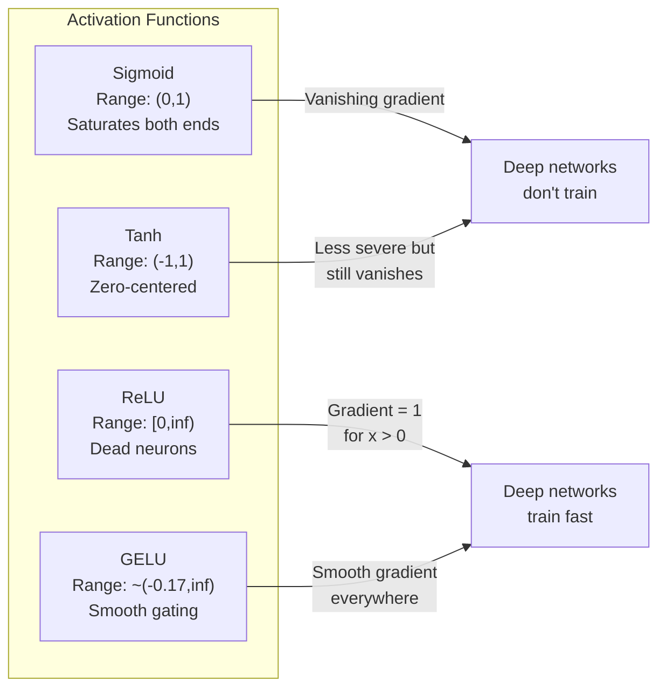
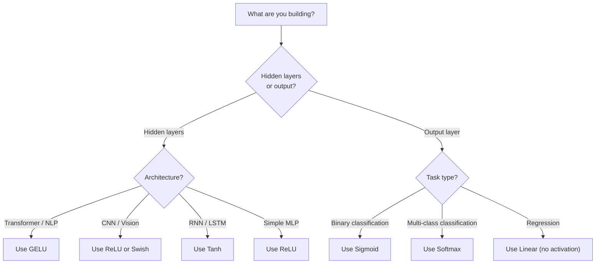

# Aktif Etme Fonksiyonları

> Düzsel olmayan bir şey olmadan, 100 katlı ağınız, bir matris çarpımı gibi.

> **【中文解读】**没有非线性激活函数,100 层网络等价于一个矩阵乘法──因为两个线性变换的复合还是线性:W2(W1x+b1)+b2 = (W2W1)x+ (W2b1+b2)──激活函数打破这种线性叠加,让每个层都能为网络增加真正的表达能力──

**Type:** Build
**Languages:** Python
**Prerequisites:** Lesson 03.03 (Backpropagation)
**Time:** ~75 minutes

## Öğrenme hedefleri

- Sigmoid, tanh, ReLU, Leaky ReLU, GELU, Swish ve softmax'ı sıfırdan türevleri ile uygulayın
- Farklı aktivasyonlarla 10+ katman boyunca etkinlik büyüklüklerini ölçerek kaybolan gradient sorunu teşhis edin
- Bir ReLU ağındaki ölü nöronları tespit edin ve GELU ' nun bu başarısızlık modundan neden kaçınılmasını açıklayın .
- Verilmiş bir mimarlık için doğru etkinleştirme fonksiyonunu seçin (transformer, CNN, RNN, çıkış katmanı)

> **【中文解读】**Bu bölümün amacı: 7 tür aktif fonksiyon ve yönlendirmeler gerçekleştirmek, deney teşhis ve kaybolma sorunu ile, ReLU'daki ölüm sinirlerini incelemek, farklı yapılara uygun aktif fonksiyon seçmek,

## Sorunlar. Sorunlar.

İki doğrusal dönüşüm y = W2 ((W1x + b1) + b2. Genişle: y = W2W1x + W2b1 + b2. Bu sadece y = Ax + c - tek bir doğrusal dönüşümdür. Ne kadar doğrusal katmanı yığarsanız, sonuç bir matris çarpması olarak çökür. 100 katlı ağınızın tek bir katla aynı temsil gücü vardır.

> 堆叠两层线性变换:y = W2(W1x + b1) + b2。展开后:y = W2W1x + W2b1 + b2。

Bu teorik bir merak değil. Bu anlamı derin bir çizgisi ağı kelimenin tam anlamıyla XOR öğrenemez, bir spiral veri kümesini sınıflandıramaz, bir yüzü tanımamaktadır.

> Bu teorik bir merak değil. Bu, derinlik linear ağının XOR'u öğrenemeyeceği, bir spiral veri kümesini ayırt edemeyeceği, insan yüzünü tanımamayacağı anlamına gelir.

Aktiflik fonksiyonları çizgisini kırıyor. Her katmanın çıkışını çizgi olmayan bir fonksiyonla çarpıtırlar, ağın karar sınırlarını eğme, keyfi fonksiyonları yaklaşımlandırma ve aslında öğrenme yeteneğini verirler. Ama yanlış bir etkinleştirme seçerseniz gradiyensiniz sıfıra (deep networklerde sigmoid) kaybolur, sonsuzlukta patlar (yaklaşık bir başlangıç olmadan sınırsız etkinleştirmeler) veya nöronlarınız kalıcı olarak ölür (RELU büyük negatif önyargılarla). Aktifleştirme fonksiyonunun seçimi ağınızın öğrenmeyeceğini doğrudan belirler.

> aktifi fonksiyonları 线性                                                                                                                                                                                                                                                          

> **【中文解读】**堆叠两层线性变换 y = W2(W1x+b1) +b2 展开后就是一个线性变换 y = Ax+c。不管叠加多少层,结果都等于一个矩阵乘法深度是假的。激活函数打破线性,让网络能曲决策边界、逼近任意函数──选择错误激活函数会导致梯度消失(sigmoid)、元梯度爆炸或神经死亡(ReLU)。

## Konsepten bir şey.

### Neden doğrusallık gereklidir? Neden doğrusallık gereklidir?

Matrix çarpımı bileşilebilir. Bir vektörü A ile çarpmak, sonra B ile çarpmak AB ile çarpmaya eşittir. Bu, 10 doğrusal katmanı yığmanın bir büyük matrisle bir doğrusal katmanın matematiksel olarak eşdeğer olduğunu gösterir. Tüm bu parametreler, tüm bu derinlik - boşa harcanmış. Zinciri kırmak için bir şeye ihtiyacınız var.

> 矩乘法 组合的──先矩 A 乘向量,再矩 B 乘, AB 乘等等等等等等等等等等等等等等等等等等等等等等等等等等等等等等等等等等等等等等等等等等等等等等等等等等等等等等等等等等等等等等等等等等等等等等等等等等等等等等等等等等等等等等等等等等等等等等等等等等等等等等等等等等等等等等等等等等等等等等等等等等等等等等等等等等等等等等等等等等等等等等等等等等等等等等等等等等等等等等等等等等等等等等等等等等等等等等等等等等等等等等等等等等等等等等等等等等等等等等等等等等等等等等等等等等等等等等等等等等等等等等等等等等等等等等等等等等等等等等等等等等等等等等等等等等等等等等等等等等等等等等等等等等等等等等等等等等等等等等等等等等等等等等等等等等等等等等等等等等等等等等等等等等等等等等等等等等等等等等等等等等等等等等等等等等等等等等等等等等等等等等等等等等等等等等等等等等等等等等等等等等等等等等等等等等等等等等等等等等等等等等等等等等等等等等等等等等等等等等等等等等等等等等等等等等等等等等等等等等等等等等等等等等等等等等等等等等等等等等等等等等等等等等等等等等等等等等等等等等等等等等等等等等等等等等等等等等等等等等等等等等等等

Bu kanıt. Bir doğrusal katman f ((x) = Wx + b hesaplar.

```
Layer 1: h = W1 * x + b1         # 第一层线性变换
Layer 2: y = W2 * h + b2         # 第二层线性变换
```

Yer değiştiren:

```
y = W2 * (W1 * x + b1) + b2      # 代入 h
y = (W2 * W1) * x + (W2 * b1 + b2)  # 展开
y = A * x + c                     # 合并为单一矩阵——深度消失了！
```

Bir katman. Katmanlar arasında bir çizgi olmayan aktivasyon g() ekleyin:

```
h = g(W1 * x + b1)               # 加入非线性激活
y = W2 * h + b2
```

Şimdi yerine getirme kesildi. W2 * g(W1 * x + b1) + b2 tek bir doğrusal dönüşümle azaltılamaz. Ağ doğrusal olmayan fonksiyonları temsil edebilir. Bir etkinleştirme ile her ek katman temsil kapasiteyi ekler.

> 代入被打破了──W2 * g(W1 * x + b1) + b2 単一線性变化に簡化できない──网络可表示非線性函数──每个带激活函数的附加层都增加表示能力──

> **【中文解读】**Matematik kanıt: iki liner değişikliğin karmaşıklığı veya lineridir. Ancak, g (() 后,W2 * g ((W1x + b1) + b2 无法合并为单一矩阵每多带激活的层,网络的表达能力就真正增加了──

### Sigmoid

Nöral ağlar için orijinal etkinleştirme fonksiyonu.

> Nervous Network'in ilk aktif fonksiyonu:

```
sigmoid(x) = 1 / (1 + e^(-x))
```

Çıktı aralığı: (0, 1). Düzgün, farklılaştırılabilir, herhangi bir gerçek sayıyı olasılık benzeri bir değere haritası yapar.

> 输出范围:(0, 1)──平滑、可微, herhangi bir gerçek sayı olasılıkla benzer bir değer olarak görüntülenir.

Derivat:

> Onun önderliği:

```
sigmoid'(x) = sigmoid(x) * (1 - sigmoid(x))
```

Bu türevin maksimum değeri 0,25'dir, x = 0'da meydana gelir. Geri yayılmada, gradientler katmanlar boyunca çoğalabilir.

> Bu yönlü sayının en büyük değeri 0.25'dir, x = 0 时.

```
0.25^10 = 0.000000953674     # 不到原始信号的百万分之一
```

İlk sinyalin milyonda birinden azı. Bu kaybolan gradient sorunu. İlk katmanlarda gradientler o kadar küçük olur ki ağırlıklar neredeyse güncellenmez. Ağ öğrenir gibi görünüyor - daha sonraki katmanlarda kayıp azalır - ama ilk katmanlar donmuştur. Derin sigmoid ağlar sadece eğitim görmez.

> İlk sinyallerin milyonlarından biri değil. Bu, derecenin kaybolması sorunu. Ön seviyelerin derecesi o kadar küçük hale geldi ki, ağırlık neredeyse yenilmez.

Ek bir sorun: sigmoid çıkışlar her zaman pozitifdir (0 ila 1), bu da ağırlıklarda gradientlerin her zaman aynı işaret olduğunu gösterir.

> 额外问题:sigmoid 输出总是正数(0~1), bu da ağırlığın 梯度总是同号―― anlamına gelir.

> **【中文解读】**Sigmoid'in en büyük yönlendirme sayısı sadece 0.25,10 kat kat kat kat kat kat kat kat kat kat kat kat kat kat kat kat kat kat kat kat kat kat kat kat kat kat kat kat kat kat kat kat kat kat kat kat kat kat kat kat kat kat kat kat kat kat kat kat kat kat kat kat kat kat kat kat kat kat kat kat kat kat kat kat kat kat kat kat kat kat kat kat kat kat kat kat kat kat kat kat kat kat kat kat kat kat kat kat kat kat kat kat kat kat kat kat kat kat kat kat kat kat kat kat kat kat kat kat kat kat kat kat kat kat kat kat kat kat kat kat kat kat kat kat kat kat kat kat kat kat kat kat kat kat kat kat kat kat kat kat kat kat kat kat kat kat kat kat kat kat kat kat kat kat kat kat kat kat kat kat kat kat kat kat kat kat kat kat kat kat kat kat kat kat kat kat kat kat kat kat kat kat kat kat kat kat kat kat kat kat kat kat kat kat kat kat kat kat kat kat kat kat kat kat kat kat kat kat kat kat kat kat kat kat kat kat kat kat kat kat kat kat kat kat kat kat kat kat kat kat kat kat kat kat kat kat kat kat kat kat kat kat kat kat kat kat kat kat kat kat kat kat kat kat kat kat kat kat kat kat kat kat kat kat kat kat kat kat kat kat kat kat kat kat kat kat kat kat kat kat kat kat kat kat kat kat kat kat kat kat kat kat kat kat kat kat kat kat kat kat kat kat kat kat kat kat kat kat kat kat kat kat kat kat kat kat kat kat kat kat kat kat kat kat kat kat kat kat kat kat kat kat kat kat kat kat kat kat kat kat kat kat kat kat kat kat kat kat kat kat kat kat kat kat kat kat kat kat kat kat kat kat kat kat kat kat kat kat kat kat kat kat kat kat kat kat kat kat kat kat kat kat kat kat kat kat kat kat kat kat kat kat kat kat kat kat kat kat kat kat kat kat kat kat kat kat kat kat kat kat kat kat kat kat kat kat kat kat kat kat kat kat kat kat kat kat kat kat kat kat kat kat kat kat kat kat kat kat kat kat kat kat kat kat kat kat kat kat kat kat kat kat kat kat kat kat kat kat kat kat kat kat kat kat kat kat kat kat kat kat kat kat kat kat kat kat kat kat kat kat kat kat kat kat kat kat kat kat kat kat kat kat kat kat

> **【拓展：Sigmoid 在现代 AI 中的位置】**Sigmoid, artık gizli katmanlarda kullanılmaya başlasa da, iki sınıflı çıkış katmanlarında hâlâ kullanılmaktadır.

### Tanh

Sigmoid'in merkezi versiyonu.

> Sigmoid'in 0 merkez versiyonu:

```
tanh(x) = (e^x - e^(-x)) / (e^x + e^(-x))
```

Çıktı aralığı: (-1, 1). Zıfır merkezli, bu da zig-zag sorunu ortadan kaldırır.

> 输出范围:(-1, 1)──零中心化, 形问题──

Derivat:

> Onun önderliği:

```
tanh'(x) = 1 - tanh(x)^2
```

Maksimum türev, x = 0'da 1.0'dur. Sigmoid'den dört kat daha iyidir. Ama kaybolan gradient sorunu hala var. Büyük olumlu veya negatif girişler için, türev sıfıra yaklaşır. On kat hala gradienti ezir, sadece daha az agresifce.

> Maksimum dizgin sayısı 1.0 ((x = 0 时)  Sigmoid'den iyi 4 倍── ama dizgin kaybı sorunu hala var── büyük doğru veya negatif girişler için, dizgin sayısı neredeyse sıfırına doğru ilerliyor──10 katı hala dizginleme süreci altında kalıyor, sadece o kadar ciddi değil──

> **【中文解读】**Tanh is sigmoid'in零中心 versiyonu,输出范围 (-1, 1),导数最大值 1.0(比 sigmoid 好 4 倍) ・・・ ancak büyük giriş zaman导数 hâlâ sıfıra yakın, 梯度消失问题仍然存在,只是没那么严重──

> **【拓展：LSTM 中的 Tanh】**LSTM 网络的隐藏状态和候选记忆用tanh(把值压缩到-1到1) ⋅ Transformer 已经基本取代了LSTM,但理解 tanh对理解RNN 系列模型很重要──

### ReLU: Yürüyüş.

Düzeltilmiş Hattı Birim. 2010'da Nair ve Hinton tarafından derin öğrenme için popülerleştirilmiştir (fonksiyonun kendisi Fukushima'nın 1969 çalışmalarına dayanıyor), her şeyi değiştirmiştir.

> 修正线性单元── Nair 和 Hinton tarafından 2010 yılında yayımlanan derin öğrenme için kullanıldı. Bu işlev kendisinin Fukushima 1969 çalışmalarına kadar uzanır.

```
relu(x) = max(0, x)
```

Çıktı aralığı: [0, sonsuzluk).

```
relu'(x) = 1  if x > 0
           0  if x <= 0
```

Pozitif girişler için kaybolan bir gradient yok. gradient tam olarak 1, doğruca geçiyor. Bu yüzden derin ağlar çalışılabilir hale geldi. ReLU katmanlar boyunca gradient büyüklüğünü korur.

> Giriş, ılımlılık kaybı sorunu yok. ılımlılık doğru bir, doğrudan aktarılır. Bu nedenle derinlik ağı eğitimli hale gelmiştir. RLU, ılımlılık genişliğini seviyelerde korumak için 

Ancak bir başarısızlık modudur: ölü nöron sorunu. Eğer bir nöronun ağırlıklı giriş her zaman negatifse (büyük bir negatif önyargı veya şanssız ağırlık başlangıcı nedeniyle), çıkışı her zaman sıfırdır, gradiyenti her zaman sıfırdır ve hiç güncellenmez. Kalıcı olarak ölüdür.

> Ancak bir başarısızlık modeli vardır: ölüm sinirleri sorunu. Eğer bir sinirlerin yükseliş yükü daima negatifse, onun çıkışı daima sıfırdır, derecesi daima sıfırdır, asla yenilmez.

> **【中文解读】**ReLU'nun doğru giriş derecesinin 1'e ulaşması, tamamen azalmadığı için bu derinlik ağının eğitimlenebilmesi nedenidir. Ancak "ölüm sinirleri" sorunu vardır: Eğer bir sinirlerin yüklü girişleri daima negatifse, 0'dan çıkış yapar, 0'dan çıkışlar yapar, asla geri kazanılmazlar.

> **【拓展：ReLU 在 CNN 中的统治地位】**ResNet、VGG、EfficientNet 等 CNN yapıları tümüyle ReLU( veya diğer değişikleri ile birlikte.

### Sızan ReLU

Ölü nöronlar için en basit çözüm.

> Ölüm sinirlerini onarmanın en basit yolu:

```
leaky_relu(x) = x        if x > 0
                alpha * x if x <= 0
```

Alfa küçük bir sabit olduğu yerde, tipik olarak 0.01. Negatif tarafı sıfır yerine küçük bir eğilime sahiptir, bu yüzden ölü nöronlar hala bir gradient sinyali alır ve iyileşebilir.

> Bunlardan alfa, genellikle 0.01 olarak küçük bir sabitdir. Negatif tarafta sıfır yerine küçük bir eğrilik vardır. Bu nedenle ölüm nöronu hala seviye sinyalini elde edebilir ve geri dönebilir.

> **【中文解读】**Sızan ReLU, negatif bölgede küçük bir eğrilik seviyesini korudu.

### Modern Default.

Gaussian Error Linear Unit. 2016 yılında Hendrycks ve Gimpel tarafından tanıtıldı. BERT, GPT ve çoğu modern transformörde öntanımlı etkinleştirme.

> 高斯差差线性单元── Hendrycks 和 Gimpel tarafından 2016 yılında önerilmiş──BERT、GPT 和大多数现代 Transformer'ın öntanımlı aktive function──

```
gelu(x) = x * Phi(x)
```

Phi ((x) standart normal dağılımın kumülatyonel dağılım fonksiyonu olduğu yerde.

```
gelu(x) ~= 0.5 * x * (1 + tanh(sqrt(2/pi) * (x + 0.044715 * x^3)))
```

GELU her yerde düzdür, küçük negatif değerlere izin verir (ReLU'dan farklı olarak sıfıra sabitleme yapar) ve olasılıklı bir yorumuna sahiptir: Gaussian dağılım altında ne kadar olumlu olması olasılığı ile her giriş ağırlaştırır. Bu düz kaplama, daha iyi bir gradient akışı sağladığı ve ölü nöron sorununu tamamen önlediği için transformatör mimarlıklarında ReLU'yu üst kat eder.

> GELU'da düzlemli, küçük bir negatif değer olmasına izin verir. Bu, daha iyi bir dereceli akış sağladığı için Transformer yapılarında daha iyi bir düzlemli kontrolü sağlar ve ölüm sinirsel sorunlarını tamamen önler.

> **【中文解读】**GELU, BERT、GPT 和 çoğu modern Transformer'ın öntanımlı etkinleştirme işlevi olmaktadır. Bu, daha iyi bir derecede akış sağlar ve ölüm sinirsel sorunları tamamen önler.

> **【拓展：GPT/BERT 中的 GELU】**Transformer'ın FFN (FN) içinde, standart yapı `Linear → GELU → Linear`✿PyTorch'ın ✿`nn.GELU()`和 `F.gelu()`İşte bu fonksiyon. GPT-2/3/4、BERT、ROBERTA 等 modeller GELU kullanıyor.

### Swish / SiLU

Ramachandran et al. tarafından 2017 yılında otomatik arama yoluyla keşfedilen kendi kendine kapalı etkinleştirme.

```
swish(x) = x * sigmoid(x)
```

Swish resmi olarak x * sigmoid ((x) olarak tanımlanır. Google bunu aktifleştirme fonksiyon alanındaki otomatik arama yoluyla keşfetti.

GELU gibi, düz, monoton olmayan ve küçük negatif değerlere izin verir. Fark hafif: Swish, kaplama için sigmoid kullanırken GELU Gaussian CDF kullanır.

> **【中文解读】**Swish = x * sigmoid(x), otomatik arama yoluyla bulunmak için (Neural Networks Design)  GELU 性能 hampir identic, 微分別是 Swish Using Sigmoid 门控、GELU Using高斯 CDF 门控──Swish Using EfficientNet 等视觉模型,GELU 统治语言模型──

### Softmax: Çıktı Aktivasyonu

Gizli katmanlarda kullanılmıyor. Softmax, ham puan vektörünü (logits) olasılık dağılımına dönüştürür.

```
softmax(x_i) = e^(x_i) / sum(e^(x_j) for all j)
```

Her çıkış 0 ile 1 arasında olur. Tüm çıkışlar toplamı 1'e çıkar. Bu da onu çok sınıf sınıflandırma için standart son etkinleştirme yapar. En büyük logit en yüksek olasılığı alır, ancak argmax'den farklı olarak softmax farklılaştırılabilir ve göreceli güvenle ilgili bilgileri korur.

> **【中文解读】**Softmax, gizli katman için kullanılmaz, tersine, dışarı çıkış katmanı 把原始分数(logits) olasılıkla dağılmaya dönüştürür. Tüm çıkışlar 0-1 之间且总和为 1── en büyük分数 en yüksek olasılıkla elde edilir, ancak argmax ile farklıdır, softmax yönlendirilir ve güvenilir bilgiyi korur.

> **【拓展：Softmax 在 Transformer 中无处不在】**Transformer'ın kendi kendine dikkat etmesi mekanizması softmax ile dikkat etmesi ağırlığını hesaplar:`attention = softmax(Q·K^T / sqrt(d_k))`❖ Her katmanın dikkatli olması için en fazla yumuşaklık gösterilmelidir.

### Şekiller ile şekiller karşılaştırması



### Hangi Aktifasyon Ne Zaman Ne Aktif Etme Fonksiyonu Kullanılır



> **【中文解读】**经验法则:Transformer/NLP GELU,CNN/视觉 ReLU,RNN/LSTM 用 tanh──输出层:二分类用 sigmoid,多分类用软max,归归不用激活──

## Yapın.
```figure
softmax-temperature
```

## Yapın

### Adım 1: Tüm aktive etme fonksiyonlarını türevlerle uygulayın

Her fonksiyon tek bir yüzen alır ve bir yüzen gönderir. Her türevli fonksiyon aynı giriş alır ve gradiyenti gönderir.

```python
import math

def sigmoid(x):
    x = max(-500, min(500, x))  # 裁剪防止溢出
    return 1.0 / (1.0 + math.exp(-x))  # σ(x) = 1/(1+e^(-x))

def sigmoid_derivative(x):
    s = sigmoid(x)
    return s * (1 - s)  # sigmoid 导数 = σ(x)(1 - σ(x))，最大值 0.25

def tanh_act(x):
    return math.tanh(x)  # 双曲正切

def tanh_derivative(x):
    t = math.tanh(x)
    return 1 - t * t  # tanh 导数 = 1 - tanh²(x)，最大值 1.0

def relu(x):
    return max(0.0, x)  # 正区间透传，负区间归零

def relu_derivative(x):
    return 1.0 if x > 0 else 0.0  # 正区间梯度=1，负区间梯度=0

def leaky_relu(x, alpha=0.01):
    return x if x > 0 else alpha * x  # 负区间保留小斜率

def leaky_relu_derivative(x, alpha=0.01):
    return 1.0 if x > 0 else alpha  # 负区间梯度=alpha

def gelu(x):
    # GELU 近似公式，用于 GPT/BERT 等 Transformer
    return 0.5 * x * (1 + math.tanh(math.sqrt(2 / math.pi) * (x + 0.044715 * x ** 3)))

def gelu_derivative(x):
    phi = 0.5 * (1 + math.erf(x / math.sqrt(2)))  # 标准正态 CDF
    pdf = math.exp(-0.5 * x * x) / math.sqrt(2 * math.pi)  # 标准正态 PDF
    return phi + x * pdf

def swish(x):
    return x * sigmoid(x)  # Swish = x * σ(x)，用于 EfficientNet

def swish_derivative(x):
    s = sigmoid(x)
    return s + x * s * (1 - s)  # Swish 导数 = σ(x) + x·σ(x)(1-σ(x))

def softmax(xs):
    max_x = max(xs)  # 数值稳定性：减去最大值
    exps = [math.exp(x - max_x) for x in xs]
    total = sum(exps)
    return [e / total for e in exps]  # 所有输出和为 1
```

### Adım 2: Gradyentlerin öldüğü yeri görselleştir .

-5'ten 5'e kadar 100 eşit aralıklı noktada gradiyenti hesaplayın. Her aktivasyonun gradiyenti sıfıra yakın olduğunu gösteren bir metin histogramı yazdırın.

```python
def gradient_scan(name, derivative_fn, start=-5, end=5, n=100):
    step = (end - start) / n
    near_zero = 0
    healthy = 0
    for i in range(n):
        x = start + i * step
        g = derivative_fn(x)
        if abs(g) < 0.01:       # 梯度接近零的区域
            near_zero += 1
        else:
            healthy += 1
    pct_dead = near_zero / n * 100
    print(f"{name:15s}: {healthy:3d} healthy, {near_zero:3d} near-zero ({pct_dead:.0f}% dead zone)")

gradient_scan("Sigmoid", sigmoid_derivative)
gradient_scan("Tanh", tanh_derivative)
gradient_scan("ReLU", relu_derivative)
gradient_scan("Leaky ReLU", leaky_relu_derivative)
gradient_scan("GELU", gelu_derivative)
gradient_scan("Swish", swish_derivative)
```

### Adım 3: Kaybolma Gradyent Deneyi

Sigmoid vs ReLU kullanarak sinyalleri N katmanlardan ileriye aktarın. Aktiflik büyüklüğünün nasıl değiştiğini ölçün.

```python
import random

def vanishing_gradient_experiment(activation_fn, name, n_layers=10, n_inputs=5):
    random.seed(42)
    values = [random.gauss(0, 1) for _ in range(n_inputs)]

    print(f"\n{name} through {n_layers} layers:")
    for layer in range(n_layers):
        weights = [random.gauss(0, 1) for _ in range(n_inputs)]
        z = sum(w * v for w, v in zip(weights, values))  # 加权求和
        activated = activation_fn(z)  # 激活
        magnitude = abs(activated)
        bar = "#" * int(magnitude * 20)
        print(f"  Layer {layer+1:2d}: magnitude = {magnitude:.6f} {bar}")  # 观察 magnitude 是否逐层缩小
        values = [activated] * n_inputs

vanishing_gradient_experiment(sigmoid, "Sigmoid")  # sigmoid 的 magnitude 会快速缩小
vanishing_gradient_experiment(relu, "ReLU")        # ReLU 的 magnitude 不会缩小
vanishing_gradient_experiment(gelu, "GELU")        # GELU 介于两者之间
```

### Dördüncü adım: Ölü Nöron Detektörü.

Bir ReLU ağı oluşturun, rastgele girişleri geçirin, kaç nöron ateş etmiyor sayın.

```python
def dead_neuron_detector(n_inputs=5, hidden_size=20, n_samples=1000):
    random.seed(0)
    weights = [[random.gauss(0, 1) for _ in range(n_inputs)] for _ in range(hidden_size)]
    biases = [random.gauss(0, 1) for _ in range(hidden_size)]

    fire_counts = [0] * hidden_size  # 记录每个神经元的激活次数

    for _ in range(n_samples):
        inputs = [random.gauss(0, 1) for _ in range(n_inputs)]
        for neuron_idx in range(hidden_size):
            z = sum(w * x for w, x in zip(weights[neuron_idx], inputs)) + biases[neuron_idx]
            if relu(z) > 0:           # ReLU 激活 > 0 算"激活"
                fire_counts[neuron_idx] += 1

    dead = sum(1 for c in fire_counts if c == 0)          # 从未激活 = 死亡
    rarely_fire = sum(1 for c in fire_counts if 0 < c < n_samples * 0.05)  # 极少激活
    healthy = hidden_size - dead - rarely_fire

    print(f"\nDead Neuron Report ({hidden_size} neurons, {n_samples} samples):")
    print(f"  Dead (never fired):     {dead}")
    print(f"  Barely alive (<5%):     {rarely_fire}")
    print(f"  Healthy:                {healthy}")
    print(f"  Dead neuron rate:       {dead/hidden_size*100:.1f}%")

    for i, c in enumerate(fire_counts):
        status = "DEAD" if c == 0 else "WEAK" if c < n_samples * 0.05 else "OK"
        bar = "#" * (c * 40 // n_samples)
        print(f"  Neuron {i:2d}: {c:4d}/{n_samples} fires [{status:4s}] {bar}")

dead_neuron_detector()
```

### Adım 5: Eğitim karşılaştırması - Sigmoid vs ReLU vs GELU  Eğitim karşılaştırması

Çember veri kümesinde aynı iki katlı ağı (çemberin içindeki noktalar = sınıf 1, dışındaki noktalar = sınıf 0) üç farklı etkinleştirme ile çalıştırın.

```python
def make_circle_data(n=200, seed=42):
    random.seed(seed)
    data = []
    for _ in range(n):
        x = random.uniform(-2, 2)
        y = random.uniform(-2, 2)
        label = 1.0 if x * x + y * y < 1.5 else 0.0  # 距原点 < sqrt(1.5) 为"内部"
        data.append(([x, y], label))
    return data


class ActivationNetwork:
    """使用指定激活函数的两层网络，用于对比不同激活函数的训练效果"""
    def __init__(self, activation_fn, activation_deriv, hidden_size=8, lr=0.1):
        random.seed(0)
        self.act = activation_fn       # 激活函数
        self.act_d = activation_deriv  # 激活函数导数
        self.lr = lr
        self.hidden_size = hidden_size

        self.w1 = [[random.gauss(0, 0.5) for _ in range(2)] for _ in range(hidden_size)]  # 隐藏层权重
        self.b1 = [0.0] * hidden_size   # 隐藏层偏置
        self.w2 = [random.gauss(0, 0.5) for _ in range(hidden_size)]  # 输出层权重
        self.b2 = 0.0                    # 输出层偏置

    def forward(self, x):
        self.x = x
        self.z1 = []
        self.h = []
        for i in range(self.hidden_size):
            z = self.w1[i][0] * x[0] + self.w1[i][1] * x[1] + self.b1[i]  # 线性变换
            self.z1.append(z)
            self.h.append(self.act(z))  # 激活（这里对比不同激活函数的效果）

        self.z2 = sum(self.w2[i] * self.h[i] for i in range(self.hidden_size)) + self.b2
        self.out = sigmoid(self.z2)  # 输出层用 sigmoid（二分类标准）
        return self.out

    def backward(self, target):
        error = self.out - target
        d_out = error * self.out * (1 - self.out)  # 输出层梯度

        for i in range(self.hidden_size):
            d_h = d_out * self.w2[i] * self.act_d(self.z1[i])  # 隐藏层梯度
            self.w2[i] -= self.lr * d_out * self.h[i]           # 更新输出层权重
            for j in range(2):
                self.w1[i][j] -= self.lr * d_h * self.x[j]     # 更新隐藏层权重
            self.b1[i] -= self.lr * d_h                          # 更新隐藏层偏置
        self.b2 -= self.lr * d_out                               # 更新输出层偏置

    def train(self, data, epochs=200):
        losses = []
        for epoch in range(epochs):
            total_loss = 0
            correct = 0
            for x, y in data:
                pred = self.forward(x)
                self.backward(y)
                total_loss += (pred - y) ** 2
                if (pred >= 0.5) == (y >= 0.5):
                    correct += 1
            avg_loss = total_loss / len(data)
            accuracy = correct / len(data) * 100
            losses.append(avg_loss)
            if epoch % 50 == 0 or epoch == epochs - 1:
                print(f"    Epoch {epoch:3d}: loss={avg_loss:.4f}, accuracy={accuracy:.1f}%")
        return losses


data = make_circle_data()

configs = [
    ("Sigmoid", sigmoid, sigmoid_derivative),    # 预期：收敛慢，梯度消失
    ("ReLU", relu, relu_derivative),              # 预期：收敛快
    ("GELU", gelu, gelu_derivative),              # 预期：收敛快且平滑
]

results = {}
for name, act_fn, act_d_fn in configs:
    print(f"\n=== Training with {name} ===")
    net = ActivationNetwork(act_fn, act_d_fn, hidden_size=8, lr=0.1)
    losses = net.train(data, epochs=200)
    results[name] = losses

print("\n=== Final Loss Comparison ===")
for name, losses in results.items():
    print(f"  {name:10s}: start={losses[0]:.4f} -> end={losses[-1]:.4f} (improvement: {(1 - losses[-1]/losses[0])*100:.1f}%)")
```

## Bunu uygulamak için kullanın.

PyTorch bunların hepsini hem fonksiyonel hem de modül formları olarak sunar:

```python
import torch
import torch.nn as nn
import torch.nn.functional as F

x = torch.randn(4, 10)  # 4 个样本，每个 10 维

relu_out = F.relu(x)           # ReLU：对应我们的 relu()
gelu_out = F.gelu(x)           # GELU：对应我们的 gelu()
sigmoid_out = torch.sigmoid(x)  # Sigmoid：对应我们的 sigmoid()
swish_out = F.silu(x)          # Swish/SiLU：对应我们的 swish()

logits = torch.randn(4, 5)     # 4 个样本，5 个类别
probs = F.softmax(logits, dim=1)  # Softmax：对应我们的 softmax()

model = nn.Sequential(
    nn.Linear(10, 64),
    nn.GELU(),          # Transformer 标配：GELU
    nn.Linear(64, 32),
    nn.GELU(),
    nn.Linear(32, 5),   # 输出层：不加激活（logits）
)
```

Bir transformatörde gizli katmanlar: GELU. CNN'de gizli katmanlar: ReLU. Sınıflandırma için çıkış katmanı: softmax. Geri dönüş için çıkış katmanı: hiç (lineer). Muhtemelenlik için çıkış katmanı: sigmoid. İşte bu. Bu öntanımlılardan başlayın. Sadece kanıtınız olduğunda değiştirin.

RNN ve LSTM'ler gizli durum için tanh ve kapı için sigmoid kullanırlar, ama bugün sıfırdan inşa ediyorsanız, muhtemelen RNN'leri kullanmıyorsunuz. ReLU ağınızda nöronlar ölüyorsa, GELU'ya geçin.

> **【中文解读】**PyTorch  tüm aktive işlevlerinin funksional biçimi ve modüler biçimi API'si sunmuştur.

## Gönder .

Bu ders şunları ortaya çıkarır:
- `outputs/prompt-activation-selector.md`-- her bir mimarlık için doğru etkinleştirme fonksiyonunu seçmenize yardımcı olan tekrar kullanılabilir bir istek.

## Egzersizler.

1. Negatif eğim alfa öğrenilebilir bir parametreden ibaret olan parametrik ReLU (PReLU) uygulayın.
   > **练习 1：**                                                                                                                                                                                                                                                              

2. Kayıp gradient deneyini 10 yerine 50 kat ile çalıştırın. Sigmoid, tanh, ReLU ve GELU için her kattaki büyüklüğü çizin.
   > **练习 2：**Bu deney 50 katına kadar genişledi. Hangi aktif fonksiyonun sinyalleri önce sıfıra geri döndü?

3. ELU (Eksponansiyel Düzsel Birim) uygulamak: elu(x) = x > 0, alfa * (e^x - 1) x <= 0. Eğer ölü nöron oranını aynı ağdaki ReLU ile karşılaştırın.
   > **练习 3：** ELU'yu gerçekleştirmek, aynı ağda ELU ve ReLU'nun ölüm oranına karşı.

4. Eğitim sırasında çalışacak bir "gradyen sağlığı monitörü" oluşturun: her dönem boyunca, her katmanın ortalama gradient büyüklüğünü hesaplayın.
   > **练习 4：** "Tevre Sağlık Denetimi"  her turda hesaplanan ortalama seviyeler                                                                                                                                                                                                                                                    

5. Eğitim karşılaştırmasını değiştirerek, çember yerine Ders 01'den XOR veri kümesini kullanın. Hangi etkinlik XOR'da en hızlı bir şekilde birleşti? Bu neden çember sonuçlarından farklıdır?
   > **练习 5：**XOR verileri kullanarak, döngüsal verileri karşılaştırın. Hangi aktif fonksiyon en hızlı olarak elde edilir?

## Anahtar Terimler

| Term | What people say | What it actually means |
|------|----------------|----------------------|
| Activation function | "The nonlinear part" | A function applied to each neuron's output that breaks linearity, enabling the network to learn nonlinear mappings |
| Vanishing gradient | "Gradients disappear in deep networks" | Gradients shrink exponentially through layers when the activation's derivative is less than 1, making early layers untrainable |
| Exploding gradient | "Gradients blow up" | Gradients grow exponentially through layers when the effective multiplier exceeds 1, causing unstable training |
| Dead neuron | "A neuron that stopped learning" | A ReLU neuron whose input is permanently negative, producing zero output and zero gradient |
| Sigmoid | "Squishes values to 0-1" | The logistic function 1/(1+e^-x), historically important but causes vanishing gradients in deep networks |
| ReLU | "Clips negatives to zero" | max(0, x) -- the activation that made deep learning practical by preserving gradient magnitude |
| GELU | "The transformer activation" | Gaussian Error Linear Unit, a smooth activation that weights inputs by their probability of being positive |
| Swish/SiLU | "Self-gated ReLU" | x * sigmoid(x), discovered through automated search, used in EfficientNet |
| Softmax | "Turns scores into probabilities" | Normalizes a vector of logits into a probability distribution where all values are in (0,1) and sum to 1 |
| Leaky ReLU | "ReLU that doesn't die" | max(alpha*x, x) where alpha is small (0.01), preventing dead neurons by allowing small negative gradients |
| Saturation | "The flat part of sigmoid" | Regions where an activation's derivative approaches zero, blocking gradient flow |
| Logit | "The raw score before softmax" | The unnormalized output of the final layer before applying softmax or sigmoid |

| 术语 | 通俗说法 | 实际含义 |
|------|---------|---------|
| 激活函数 (Activation function) | "非线性那部分" | 施加在每个神经元输出上的函数，打破线性，使网络能学习非线性映射 |
| 梯度消失 (Vanishing gradient) | "深层梯度消失" | 导数小于 1 的激活函数导致梯度逐层指数缩小，前面的层无法训练 |
| 梯度爆炸 (Exploding gradient) | "梯度爆炸" | 有效乘数超过 1 时梯度逐层指数增长，训练不稳定 |
| 死亡神经元 (Dead neuron) | "停止学习的神经元" | ReLU 神经元输入永远为负，输出和梯度永远为零 |
| Sigmoid | "压到 0-1" | 逻辑函数 1/(1+e^-x)，历史重要但深层网络中梯度消失 |
| ReLU | "负数变零" | max(0, x)——通过保持梯度幅度让深度学习变得可行的激活函数 |
| GELU | "Transformer 激活" | 高斯误差线性单元，按输入为正的概率加权的平滑激活 |
| Swish/SiLU | "自门控 ReLU" | x * sigmoid(x)，通过自动搜索发现，用于 EfficientNet |
| Softmax | "分数变概率" | 把 logits 归一化为概率分布，所有值在 (0,1) 且和为 1 |
| Leaky ReLU | "不会死的 ReLU" | max(alpha*x, x)，负区间保留小梯度防止神经元死亡 |
| 饱和 (Saturation) | "sigmoid 的平坦区" | 激活函数导数趋近于零的区域，阻断梯度流 |
| Logit | "softmax 前的原始分" | 最终层未归一化的输出 |

## Daha fazla okumak

- Nair & Hinton, "Düzeltilmiş Hattı Birimler Sınırlı Boltzmann Makineleri İyileştirir" (2010) - ReLU'yu tanıtan ve derin ağların eğitimini sağlayan makale
- Hendrycks & Gimpel, "Gaussian Error Linear Units (GELUs) " (2016) -- transformörler için varsayılan olan etkinleştirme fonksiyonunu tanıttı
- Ramachandran et al., "Aktifasyon Fonksiyonları Arama" (2017) -- Swish'i keşfetmek için otomatik arama kullanıldı, etkinleştirme tasarımı otomatik hale gelebileceğini gösterdi
- Glorot & Bengio, "Deep Feedforward sinir ağlarının eğitilmesi zorluğunu anlamak" (2010) - kaybolan / patlayan gradientleri teşhis eden ve Xavier başlangıç önerisi
- Goodfellow, Bengio, Courville, "Deep Learning" 6.3 (https://www.deeplearningbook.org/) -- Gizli birimlerin ve etkinleştirme işlevlerinin titiz bir şekilde işlenmesi
