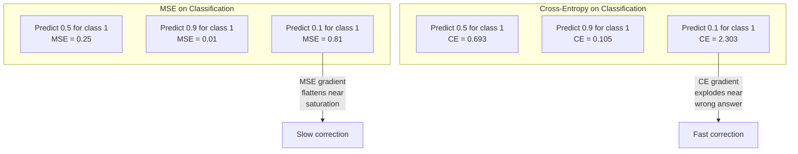
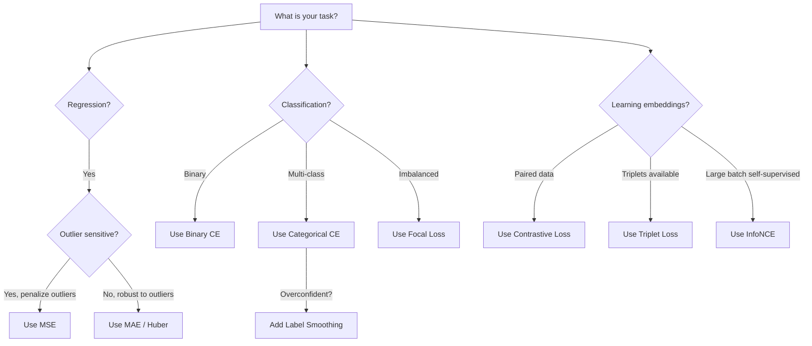

# Fonksiyon kaybı.

> Ağınız bir tahmin yapar. Yer gerçekliği bunun aksini söyler. Ne kadar yanlış? Bu sayı kaybı. Yanlış kaybı işlevi seçin ve modeliniz tamamen yanlış şey için optimize eder.

> **【中文解读】**失失函数, modelin tek optimizasyon amacıdır  精度率 değil F1 分数 değil, 失失值. 失失函数 seçilir, model, "hiçbir matematiksel kayıp" yolu bulur, aslında istediğiniz sonuç yerine onu karşılar.

**Type:** Build
**Languages:** Python
**Prerequisites:** Lesson 03.04 (Activation Functions)
**Time:** ~75 minutes

## Öğrenme hedefleri

- MSE, ikili çapraz entropi, kategorik çapraz entropi ve kontrast kaybı (InfoNCE) sıfırdan kendi gradientleriyle uygulanmalıdır
- MSE'nin sınıflandırılmayı neden başarısız ettiğini, "her şey için tahmin 0.5" başarısızlık modunu göstererek açıklayın.
- Etiketleme düzeltmesini çapraz entropiye uygulayın ve aşırı güvenli tahminlerin nasıl önlendiğini açıklayın
- Regresiyon, ikili sınıflandırma, çoklu sınıflandırma ve öğrenme görevlerini yerleştirmek için doğru kayıp fonksiyonunu seçin

> **【中文解读】**Bu bölümün amacı: 5 çeşit kayıp işlevi ve derecesi gerçekleştirmek, neden sınıflandırma görevleri MSE ile kullanılamıyor anlamak, etiketlemeyi öğrenmek, kayıplara karşı düzeltme ve karşılaştırma, görevlere göre doğru kayıp işlevi seçmek,

## Sorunlar. Sorunlar.

Bir sınıflandırma sorunu üzerinde MSE'yi en aza indirgenen bir model, her şey için güvenle 0.5 tahmin eder. Kayıpları en aza indirgenir.

> Bir sınıf sorunu üzerinde en azlaştırılmış MSE modeli tüm giriş tahminlerine güvenle 0.5 olarak değerlendirecektir.

Kayıp işlevi, modelinizin gerçekten optimize ettiği tek şeydir. Kesinlik yok. F1 puanı değil. Yöneticine rapor ettiğin herhangi bir metrik değil. Optimizer kayb fonksiyonunun gradiyentiyi alır ve bu sayıyı daha küçük hale getirmek için ağırlıkları ayarlar. Kayıp işlevi önemsediğiniz şeyi yakalamıyorsa, model matematik açısından onu tatmin etmenin en ucuz yolunu bulacaktır ve bu yol neredeyse asla istediğiniz şey değildir.

> 損失 işlevi, modelinizin gerçekte iyileştirilmesinin tek amacıdır. F1 oranı değil. F1 oranı değil. Yöneticisine rapor ettiğiniz herhangi bir gösterge değildir. 損失 işlevi, optimizerlerin kayb işlevi derecesini elde edip, bu rakamı daha küçük hale getirme yetkisini düzenlemektedir. Eğer kayb işlevi size önem veren şeyi ele almazsa, model matematikte onu karşılamak için en uygun yolu bulacaktır.

İşte bir örnek. İkili sınıflandırma görevin var. İki sınıf, 50/50 bölünmüş. Kaybın olarak MSE kullanıyorsun. Modeldeki her giriş için 0.5 öngörülüyor. Ortalama MSE 0.25'dir. Bu, hiçbir şey öğrenmeden mümkün olan en az. Model sıfır ayrımcılık yeteneğine sahip ama teknik olarak kaybı fonksiyonunuzu en aza indirmiştir. Çarpıcı entropiye geçin ve aynı model tahminleri 0 veya 1'e doğru itmek zorunda kalır çünkü -log(0.5) = 0.693 korkunç bir kayıp, -log(0.99) = 0.01 doğru tahminlere güvenen ödüller. Kayıp fonksiyonunun seçimi, öğrenen bir model ile metrik oynayan bir model arasındaki farktır.

> 具体例:二元分类任务,两类各占50%──你使用MSE 作为损失──模型对每输入都预测0.5──平均MSE为0.25,实际上没有学到任何东西的情况下可能的最小值──模型没有任何区分能力,但技术上已经最小化了你的损失函数──换成交叉后,同样的模型被迫推推预测到0或1,因为 -log(0.5) =0.693是一个非常差的损失,而 -log(0.99) =0.01 会奖励自信的正确预测──损失函数的选择决定了模型学习还在系统的空中.

Daha da kötüleşir. Kendini denetleyen öğrenmede etiketlerin bile bulunmuyor. Kontrast kaybı öğrenme sinyalleri tamamen tanımlar: ne benzer, ne farklı sayılır ve model onları ne kadar zorlukla birbirinden ayırmalı. Kontrast kaybı yanlış elde eder ve yerleşimleriniz tek bir noktaya çökür - her giriş haritası aynı vektöre. Teknik olarak sıfır kaybı. Tamamen değersiz.

>  Daha da kötüsü, kendi kontrolüyle öğrenirken, sen bile etiket yok.                                                                                                                                                                                                                                                     

> **【中文解读】**MSE yapmak分类时,模型发现预测 0.5 is the safest strategy损失最小但没有区分能力──交叉则通过 -log (log) 惩罚不自信的预测:-log (log)  (log)  (log)  (log)  (log)  (log)  (log)  (log)  (log)  (log)  (log)  (log)  (log)  (log)  (log)  (log)  (log)  (log)  (log)  (log)  (log)  (log)  (log)  (log)  (log)  (log)  (log)  (log)  (log) )  (log)  (log)  (log)  (log)  (log)  (log) )  (log)  (log)  (log)  (log) )  (log)  (log)  (log)  (log)  (log)  (log)  (log) )  (log)  (log)  (log)  (log)  (log)  (log)  (log)  (log)  (log)  (log) )  (log)  (log)  ()  ()  ()  ( ()  ()  ()  ()  ( ()  ()  () () () () ( () () () () ( () () () () () () () () () () () () () ( () () () () () () () () () () () () ()

## Konsepten bir şey.

### Ortalama Karakter Hata (MSE)                                                                                                                                                                                                                                                                                                                                                                                                                                                                                                                     

Geri dönüş için varsayılan. Tahmin ve hedef arasındaki kareden farkı hesaplayın, tüm örnekler üzerinde ortalama.

> Geri dönüş görevlerinin öntanımlı seçimi, tüm örneklere karşı ortalama hesaplama tahmin değeri ile hedef değeri arasındaki kareler farkı.

```
MSE = (1/n) * sum((y_pred - y_true)^2)
```

Neden karıştırmak önemlidir: büyük hataları karadrat olarak cezalandırır. 2'nin bir hatası 1'in bir hatası kadar 4 kat pahalı. 10'un bir hatası 100 kat pahalı. Bu da MSE'yi dış değerlere karşı hassas hale getirir.

> Neden kare önemli: Büyük hatalara ikinci kez cezalandırılmalıdır. 2'nin fiyatı 1'in 4 katıdır. 10'un fiyatı 100 katıdır. Bu durum MSE'nin anormal değerlere karşı hassaslığını gösterir.

Gerçek rakamlar: Eğer modeliniz konut fiyatlarını tahmin ederse ve $10,000 on most houses but off by $Bir sarayda 200.000, MSE saldırganca bu bir sarayı düzeltmeye çalışacak. Diğer 99 evin performansını etkileyebilir.

> 具体数字: Eğer modeliniz tahmin ev fiyatı, çoğu ev öte $10,000，但一栋豪宅偏差 $200.000 MSE, evin diğer 99 evinin performansını etkileyebilecek bir konut onarmaya çalışıyor.

Bir tahminle ilgili MSE'nin eğilimi:

> MSE'ye göre:

```
dMSE/dy_pred = (2/n) * (y_pred - y_true)      # 梯度与误差成线性关系
```

Hatada doğrusal. Büyük hatalar daha büyük gradientler elde eder. Bu bir gerileme özelliği (büyük hatalar büyük düzeltmeler gerektirir) ve sınıflandırma için bir hata (güvenli yanlış cevapları doğrusal değil, eksponensel olarak cezalandırmak istiyorsunuz).

> Bu da bir avantajdır. Büyük hata büyük düzeltme gerektirir. Ancak, sınıflandırma eksikliği için, güvene sahip yanlış cevaplara göre, çizgi cezası yerine, bir dizi cezalandırma yapmayı düşünüyorsun.

> **【中文解读】**MSE, geri dönüş görevinin öntanımlı kaybıdır: hataların ortalaması: büyük hataların daha yüksek bir bedel ödemesini sağlar.

> **【拓展：MSE 在 AI 中的应用】**MSE 常用回归任务 (回归任务) 房价预测、温度预测) ⋅ 在图像生成模型 (stable diffusion) ⇒ Stable Diffusion (Stayed Diffusion) ⇒ 中, MSE 常用回归任务 (回归任务) 房价预测、温度预测) ⋅ ⇒                                                                                                                                                                                                                       `F.mse_loss(pred, target)`- Evet.

### Çarpışıklık Kayıpları

Klasifikasyon için kayıp fonksiyonu. Bilgi teorisi'nde kök salmış -- tahmin edilen olasılık dağılımıyla gerçek dağılım arasındaki ayrımı ölçüyor.

> Sorumluluk Kayıpları Fonksiyonu, bilgi teorisine dayanarak tahmin olasılığı dağılımıyla gerçek dağılım arasındaki farkı ölçer.

**Binary Cross-Entropy (BCE) | 二元交叉熵：**

```
BCE = -(y * log(p) + (1 - y) * log(1 - p))
```

Burada y gerçek etiket (0 veya 1) ve p öngörülen olasılık.

> Bu da gerçek bir 标签dir.

-log(p) neden işe yarıyor: gerçek etiket 1 olduğunda ve p = 0.99 olduğunu tahmin ettiğinizde, kaybı -log(0.99) = 0.01 olur.

> Neden -log(p) 有效:当真标签为1 且你预测 p = 0.99 时,损失为 -log(0.99) = 0.01──当你预测 p = 0.01 时,损失为 -log(0.01) = 4.6──那460 倍的差就是交叉有效的原因──它残酷地惩罚自信的错预测,而对自信的正确预测几乎没有惩罚──

Bu eğilimi aynı hikayeyi anlatıyor:

```
dBCE/dp = -(y/p) + (1-y)/(1-p)     # 梯度在预测错误时极大
```

Y = 1 ve p sıfıra yakın olduğunda, gradient -1/p'dir ve bu da negatif sonsuzluğu yaklaşır. Modelle hatalarını düzeltmek için muazzam bir sinyal verilir. p 1'e yakın olduğunda gradient küçüktür.

> **【中文解读】**交叉是分类任务的标配──核心是 -log(p):预测正确且自信(p=0.99) 时损失只有0.01,预测错误且自信(p=0.01) 时损失高达4.6460倍差距!梯度在预测错误时趋近无穷大,给模型强烈的修改信号──

> **【拓展：交叉熵在 Transformer 中】**GPT'nin eğitim kaybı ise交叉预测下一个代币的交叉──每个位置预测词表中的哪个词,交叉衡量预测和真实的差距──PyTorch: `F.cross_entropy(logits, labels)`- Evet.

**Categorical Cross-Entropy | 多类交叉熵：**

Tek sıcak kodlanmış hedeflerle çoklu sınıflandırma için.

```
CCE = -sum(y_i * log(p_i))          # 只有真实类别贡献损失
```

Sadece gerçek sınıf kaybına katkıda bulunur (çünkü diğer tüm y_i sıfırdır). Eğer 10 sınıf varsa ve doğru sınıf 0.1 olasılığı alırsa (hassasi tahmin), kaybı -log(0.1) = 2.3. Doğru sınıf 0.9 olasılığı alırsa, kaybı -log(0.9) = 0.105.

### Neden MSE sınıflandırmayı başarısız ediyor ?



MSE gradiyentiler, tahminlerin 0 veya 1 yakın olduğu zaman düzlenir (sigmoid doymuşluğu nedeniyle).

> **【中文解读】**MSE'nin derecesi, tahminlerde 0 veya 1 时变平 (sigmoid 和 nedeniyle) yakınlaşır. Bu da düzeltme yavaşlamasına yol açar.

### Etiket: Düzeltme

Standart bir sıcak etiketler "Bu %100 sınıf 3 ve %0 diğer her şey". diyor.

> 標準のワンホット 標签は"Bu %100 クラス 3, diğerleri ise %0"だ.

```
smooth_label = (1 - alpha) * one_hot + alpha / num_classes
```

Alfa = 0,1 ve 10 sınıfları ile: [0, 0, 1, 0, ...] yerine hedef [0, 01, 0.01, 0.91, 0.01, ...] olur.

> Alfa = 0.1、10 个类别时:目标从 [0, 0, 1, 0, ...] 变成 [0.01, 0.01, 0.91, 0.01, ...]──模型目标从 1.0 变成 0.91──

Bu neden işe yarıyor: tam olarak 1.0'u softmax üzerinden çıkartmaya çalışan bir model logitleri sonsuzluğa doğru itmek zorunda. Bu aşırı güven neden olur, genelleşmeyi incitir ve modelin dağılım kayması için kırılgan hale gelir. Etiket düzeltme hedefi 0.9'a (alfa = 0.1) kapatır, logitleri makul bir aralığında tutar. GPT ve çoğu modern model etiket düzeltmesini veya eşdeğerini kullanır.

> Neden etkili: Softmax'in 1.0'a doğru çıkmasını sağlamak için, logit'i ışığa doğru doğru doğru atmak gerekir. Bu aşırı güven, zarar ve genelleşmeye yol açar.

> **【中文解读】**标签平滑把硬标签 [0, 0, 1, 0, ...] 变成软标签 [0.01, 0.01, 0.91, 0.01, ...]──因为要让软max 输出 1.0 需要logit 趋近无穷大,这会导致过拟合和过度自信──标签平滑把目标上限降至0.9,保持logit在合理范围内──GPT 和大多数现代模型都使用标签平滑──

### Karşılıklı Kayıplar Kayıplara Karşı

Etiketler yok, sınıflar yok, sadece giriş çiftleri ve soru: bunlar birbirine benzer mi yoksa farklı mı?

> 没有标签.没有类别. 只有输入对和这个问题:它们相似还是不同?

**SimCLR-style contrastive loss (NT-Xent / InfoNCE):**

Bir görüntü alın. İki artı görüntü oluşturun (çırpın, döndürün, renk kaygısı). Bunlar "pozitif çift"lerdir - benzer yerleşimlere sahip olmalıdırlar.

> 取一张图像──创建两个增强视图(剪剪,旋转,颜色动)──这是"正对"它们应该有相似嵌入式──批量中的其他图像形成"负对"它们应该有不同的嵌入式──

```
L = -log(exp(sim(z_i, z_j) / tau) / sum(exp(sim(z_i, z_k) / tau)))
```

Sim() kozin benzerliği olduğu yerde, z_i ve z_j pozitif çiftlerdir, toplam tüm negatiflerin üzerinde ve tau (temperatür) dağılımın ne kadar keskin olduğunu kontrol eder.

> **【中文解读】**Bir resim için iki yenileme yapılır. Diğer resimler ise "negatif" olarak kullanılır.

> **【拓展：对比学习在 RAG 和嵌入模型中】**OpenAI'nin metin gömülmesi-ada-002、BGE、E5等 gömülme modelleri, öğrenme eğitimine karşı kullanılır. RAG'de, arama cihazının iyiliği gömülme kalitesine bağlıdır, gömülme kalitesi ise kaybın karşılaştırma tasarımına bağlıdır. SimCLR、CLIP、SimCSE bu paradigmadır.

### odak kaybı .

Düzsel olmayan veri kümeleri için. Standart çapraz entropi tüm doğru sınıflandırılmış örneklere eşit şekilde davranır.

> Çözümsel olmayan bir veri kümesi tasarımı. 標準交叉.  Tüm doğru sınıf örneklere eşit davranmak. 焦点損失.  basit örneklerin ağırlığını azaltmak:

```
FL = -alpha * (1 - p_t)^gamma * log(p_t)
```

P_t gerçek sınıfın öngörülen olasılık olduğu ve gamma odaklanmayı kontrol ettiği yerde. gamma = 0, bu standart çapraz entropi. gamma = 2 (devayla):

> İçinde p_t is true类别的预测概率,gamma 控制聚焦程度──gamma = 0 时退化为标准交叉──gamma = 2 时(默认值):

- Basit örnek (p_t = 0,9): ağırlık = (0,1) ^ 2 = 0,01. Etkili olarak göz ardı edildi.
  简单样本(p_t = 0.9):权重 = (0.1) ^2 = 0.01──实际被忽略──
- Sert örnek (p_t = 0.1): ağırlık = (0.9) ^ 2 = 0.81. Tam gradient sinyali.
  困难样本(p_t = 0.1):权重 = (0.9) ^2 = 0.81。完整梯度信号。

> **【中文解读】**Fokal Kayıp için sınıf: dengesiz tasarım. 简单样本: p_t=0.9) 权重: 0.01 差不多忽略;困难样本: 0.81 权重: p_t=0.1) 获得完整梯度信号──这让模型专注于困难案例──用于目标检测(RetinaNet),99% 是背景、1% 是目标──

### Kayıp Fonksiyon Karar Ağacı Kayıp Fonksiyon Seçim Karar Ağacı



> **【中文解读】**选择经验: MSE/Huber,二分类 BCE, CCE, Borealançlı olmayan odak kaybı,学嵌入式对比损失──

## Yapın.
```figure
cross-entropy-loss
```

## Yapın

### Adım 1: MSE ve derecesi

```python
def mse(predictions, targets):
    n = len(predictions)
    total = 0.0
    for p, t in zip(predictions, targets):
        total += (p - t) ** 2            # 平方误差
    return total / n                      # 取平均

def mse_gradient(predictions, targets):
    n = len(predictions)
    grads = []
    for p, t in zip(predictions, targets):
        grads.append(2.0 * (p - t) / n)  # 梯度 = 2*(pred - true) / n
    return grads
```

### Adım 2: İkili çapraz entropiyası

log(0) sorunu gerçek. Eğer model pozitif bir örnek için tam olarak 0'yu öngörürse, log(0) = negatif sonsuzluk.

```python
import math

def binary_cross_entropy(predictions, targets, eps=1e-15):
    n = len(predictions)
    total = 0.0
    for p, t in zip(predictions, targets):
        p_clipped = max(eps, min(1 - eps, p))  # 裁剪防止 log(0)
        total += -(t * math.log(p_clipped) + (1 - t) * math.log(1 - p_clipped))  # -[y*log(p) + (1-y)*log(1-p)]
    return total / n

def bce_gradient(predictions, targets, eps=1e-15):
    grads = []
    for p, t in zip(predictions, targets):
        p_clipped = max(eps, min(1 - eps, p))
        grads.append(-(t / p_clipped) + (1 - t) / (1 - p_clipped))  # 梯度 = -y/p + (1-y)/(1-p)
    return grads
```

### Adım 3: Softmax ile Kategorik çapraz entropiy

```python
def softmax(logits):
    max_val = max(logits)  # 数值稳定性
    exps = [math.exp(x - max_val) for x in logits]
    total = sum(exps)
    return [e / total for e in exps]

def categorical_cross_entropy(logits, target_index, eps=1e-15):
    probs = softmax(logits)
    p = max(eps, probs[target_index])
    return -math.log(p)  # -log(真实类别的概率)

def cce_gradient(logits, target_index):
    probs = softmax(logits)
    grads = list(probs)              # 复制 softmax 输出
    grads[target_index] -= 1.0      # 真实类别减 1：softmax 输出 - one-hot
    return grads
```

Softmax + çapraz entropi gradiyenti güzel bir şekilde basitleştiriyor: sadece gerçek sınıf için ( öngörülen olasılık - 1) ve diğer tüm sınıflar için ( öngörülen olasılık). Bu zarif basitleştirme tesadüf değil - bu yüzden softmax ve çapraz entropi çiftleştirilmiştir.

> **【中文解读】**Softmax + 交叉的梯度简化为:预测概率减去一热目标──真实类别是p-1,其他类别是p──

### Dördüncü adım: Etiket Düzeltme.

```python
def label_smoothed_cce(logits, target_index, num_classes, alpha=0.1, eps=1e-15):
    probs = softmax(logits)
    loss = 0.0
    for i in range(num_classes):
        if i == target_index:
            smooth_target = 1.0 - alpha + alpha / num_classes  # 目标类别：0.9（alpha=0.1, 10 类）
        else:
            smooth_target = alpha / num_classes                 # 非目标类别：0.01
        p = max(eps, probs[i])
        loss += -smooth_target * math.log(p)
    return loss
```

### Adım 5: Karşılıklı Kayıp (Simplified InfoNCE) Kayıplara karşı.

```python
def cosine_similarity(a, b):
    dot = sum(x * y for x, y in zip(a, b))        # 点积
    norm_a = math.sqrt(sum(x * x for x in a))      # 向量 a 的模
    norm_b = math.sqrt(sum(x * x for x in b))      # 向量 b 的模
    if norm_a < 1e-10 or norm_b < 1e-10:
        return 0.0
    return dot / (norm_a * norm_b)                  # 余弦相似度

def contrastive_loss(anchor, positive, negatives, temperature=0.07):
    sim_pos = cosine_similarity(anchor, positive) / temperature     # 正对相似度 / 温度
    sim_negs = [cosine_similarity(anchor, neg) / temperature for neg in negatives]  # 负对相似度

    max_sim = max(sim_pos, max(sim_negs)) if sim_negs else sim_pos  # 数值稳定性
    exp_pos = math.exp(sim_pos - max_sim)
    exp_negs = [math.exp(s - max_sim) for s in sim_negs]
    total_exp = exp_pos + sum(exp_negs)

    return -math.log(max(1e-15, exp_pos / total_exp))  # -log(正对概率)
```

### Adım 6: MSE vs. Cross-Entropy on Classification. MSE vs.交叉 分类对比

Aynı ağı ders 04'ten (daha fazla veri) iki kayıp işlevi ile çalıştırın.

```python
import random

def sigmoid(x):
    x = max(-500, min(500, x))
    return 1.0 / (1.0 + math.exp(-x))

def make_circle_data(n=200, seed=42):
    random.seed(seed)
    data = []
    for _ in range(n):
        x = random.uniform(-2, 2)
        y = random.uniform(-2, 2)
        label = 1.0 if x * x + y * y < 1.5 else 0.0
        data.append(([x, y], label))
    return data


class LossComparisonNetwork:
    """用不同损失函数训练的网络，对比 MSE 和 BCE 的收敛速度"""
    def __init__(self, loss_type="bce", hidden_size=8, lr=0.1):
        random.seed(0)
        self.loss_type = loss_type  # "mse" 或 "bce"
        self.lr = lr
        self.hidden_size = hidden_size

        self.w1 = [[random.gauss(0, 0.5) for _ in range(2)] for _ in range(hidden_size)]
        self.b1 = [0.0] * hidden_size
        self.w2 = [random.gauss(0, 0.5) for _ in range(hidden_size)]
        self.b2 = 0.0

    def forward(self, x):
        self.x = x
        self.z1 = []
        self.h = []
        for i in range(self.hidden_size):
            z = self.w1[i][0] * x[0] + self.w1[i][1] * x[1] + self.b1[i]
            self.z1.append(z)
            self.h.append(max(0.0, z))  # ReLU 激活

        self.z2 = sum(self.w2[i] * self.h[i] for i in range(self.hidden_size)) + self.b2
        self.out = sigmoid(self.z2)  # 输出层 sigmoid
        return self.out

    def backward(self, target):
        # 根据损失类型选择不同的梯度
        if self.loss_type == "mse":
            d_loss = 2.0 * (self.out - target)  # MSE 梯度：线性
        else:
            eps = 1e-15
            p = max(eps, min(1 - eps, self.out))
            d_loss = -(target / p) + (1 - target) / (1 - p)  # BCE 梯度：在错误预测时极大

        d_sigmoid = self.out * (1 - self.out)
        d_out = d_loss * d_sigmoid

        for i in range(self.hidden_size):
            d_relu = 1.0 if self.z1[i] > 0 else 0.0
            d_h = d_out * self.w2[i] * d_relu
            self.w2[i] -= self.lr * d_out * self.h[i]
            for j in range(2):
                self.w1[i][j] -= self.lr * d_h * self.x[j]
            self.b1[i] -= self.lr * d_h
        self.b2 -= self.lr * d_out

    def compute_loss(self, pred, target):
        if self.loss_type == "mse":
            return (pred - target) ** 2
        else:
            eps = 1e-15
            p = max(eps, min(1 - eps, pred))
            return -(target * math.log(p) + (1 - target) * math.log(1 - p))

    def train(self, data, epochs=200):
        losses = []
        for epoch in range(epochs):
            total_loss = 0.0
            correct = 0
            for x, y in data:
                pred = self.forward(x)
                self.backward(y)
                total_loss += self.compute_loss(pred, y)
                if (pred >= 0.5) == (y >= 0.5):
                    correct += 1
            avg_loss = total_loss / len(data)
            accuracy = correct / len(data) * 100
            losses.append((avg_loss, accuracy))
            if epoch % 50 == 0 or epoch == epochs - 1:
                print(f"    Epoch {epoch:3d}: loss={avg_loss:.4f}, accuracy={accuracy:.1f}%")
        return losses
```

## Bunu uygulamak için kullanın.

PyTorch, tüm standart kayb fonksiyonlarını sayısal istikrarla oluşturuyor:

```python
import torch
import torch.nn as nn
import torch.nn.functional as F

predictions = torch.tensor([0.9, 0.1, 0.7], requires_grad=True)
targets = torch.tensor([1.0, 0.0, 1.0])

mse_loss = F.mse_loss(predictions, targets)              # MSE：回归
bce_loss = F.binary_cross_entropy(predictions, targets)   # BCE：二分类

logits = torch.randn(4, 10)                              # 4 个样本，10 类
labels = torch.tensor([3, 7, 1, 9])
ce_loss = F.cross_entropy(logits, labels)                # CCE：多分类（推荐用法）
ce_smooth = F.cross_entropy(logits, labels, label_smoothing=0.1)  # 带标签平滑
```

Kullanım`F.cross_entropy`(Hayır)`F.nll_loss`Bu, log-softmax ve negatif log- olasılıklarını bir sayısal olarak sabit işlemde birleştirir.

Karşıtlıklı öğrenme için, çoğu ekip özel uygulamalar veya kütüphaneler kullanır.`lightly`veya `pytorch-metric-learning`.Küresel döngü her zaman aynıdır: çiftlik benzerlikleri hesaplayın, olumlu ve olumsuz üzerinde yumuşak maksimum oluşturun, geri yayılın.

> **【中文解读】**PyTorch 中直接用 `F.cross_entropy(logits, labels)`It's internal combined log-softmax 和 NLL, 數值最稳定──不要手動 softmax 再取 log──對比學習通常使用 `lightly`Ya da`pytorch-metric-learning`- Evet.

## Gönder .

Bu ders şunları ortaya çıkarır:
- `outputs/prompt-loss-function-selector.md`-- doğru kayıp fonksiyonunu seçmek için tekrar kullanılabilir bir ipucu
- `outputs/prompt-loss-debugger.md`- Kayıp eğri yanlış görünse , teşhis için bir ipucu .

## Egzersizler.

1. Küçük hatalar için MSE ve büyük hatalar için MAE olan Huber kaybını uygulayın. Y = sin(x'i tahmin eden bir gerileme ağı eğitmek için MSE vs Huber ile eğitim hedeflerinin% 5'inin rastgele gürültü eklendiği zaman (outliers) çalıştırın.
   > **练习 1：**实现Huber 损失(MSE ile küçük hata, MAE ile büyük hata) ⋅ % 5 异常值的数据上对MSE 和Huber。

2. İkili sınıflandırma eğitim döngüsüne odak kaybını ekleyin. Dengezsiz bir veri kümesi oluşturun (90% sınıf 0, 10% sınıf 1). 200 dönemden sonra azınlık sınıfı geri çağırışında standart BCE vs. odak kaybı (gamma=2) karşılaştırın.
   > **练习 2：**90:10'da dengesizlik verileri ile karşılaştırıldığında, Gamma=2'nin az sayıdaki çağrı oranı ve odak kaybı

3. Yarım sert negatif madencilik ile üçlü kaybı uygulayın. 5 sınıf için 2D gömleme verileri oluşturun. Her bir demir için, pozitifden daha uzak olan en sert negatif bulun.
   > **练习 3：**实现带半困难负样本挖掘的三元组损失,随机选择负样本收速度相对──

4. MSE vs. çapraz entropi karşılaştırmasını çalıştırın, ancak eğitim sırasında her katmandaki gradient büyüklüklerini izleyin.
   > **练习 4：**追踪 MSE 和交叉訓練中各層梯度大小,验证交叉早期产生更大的梯度──

5. KL farklılık kaybını uygulayın ve KL(gerçek olarak tahmin edilen) KL'yi en aza indirmenin gerçek dağılım bir sıcak olduğunda çapraz entropi ile aynı gradientler verdiğini kontrol edin.
   > **练习 5：**实现 KL 散度损失,验证在一个热的真实分布时与交叉梯度相同――然后尝试知识蒸中的软目标――

## Anahtar Terimler

| Term | What people say | What it actually means |
|------|----------------|----------------------|
| Loss function | "How wrong the model is" | A differentiable function mapping predictions and targets to a scalar that the optimizer minimizes |
| MSE | "Average squared error" | Mean of squared differences between predictions and targets; penalizes large errors quadratically |
| Cross-entropy | "The classification loss" | Measures divergence between predicted probability distribution and true distribution using -log(p) |
| Binary cross-entropy | "BCE" | Cross-entropy for two classes: -(y*log(p) + (1-y)*log(1-p)) |
| Label smoothing | "Softening the targets" | Replacing hard 0/1 targets with soft values (e.g., 0.1/0.9) to prevent overconfidence and improve generalization |
| Contrastive loss | "Pull together, push apart" | A loss that learns representations by making similar pairs close and dissimilar pairs far in embedding space |
| InfoNCE | "The CLIP/SimCLR loss" | Normalized temperature-scaled cross-entropy over similarity scores; treats contrastive learning as classification |
| Focal loss | "The imbalanced data fix" | Cross-entropy weighted by (1-p_t)^gamma to down-weight easy examples and focus on hard ones |
| Triplet loss | "Anchor-positive-negative" | Pushes anchor closer to positive than negative by at least a margin in embedding space |
| Temperature | "Sharpness knob" | A scalar divisor on logits/similarities that controls how peaked the resulting distribution is; lower = sharper |

| 术语 | 通俗说法 | 实际含义 |
|------|---------|---------|
| 损失函数 (Loss function) | "模型错多少" | 把预测和目标映射为标量的可导函数，优化器最小化这个值 |
| MSE | "平方误差平均" | 预测与目标的平方差的均值；对大误差二次惩罚 |
| 交叉熵 (Cross-entropy) | "分类损失" | 用 -log(p) 衡量预测分布和真实分布的差异 |
| 二元交叉熵 (BCE) | "二分类损失" | 两类的交叉熵：-(y*log(p) + (1-y)*log(1-p)) |
| 标签平滑 (Label smoothing) | "软化目标" | 把硬标签 0/1 换成软值（如 0.1/0.9），防止过度自信 |
| 对比损失 (Contrastive loss) | "拉近推远" | 让相似样本嵌入接近、不同样本嵌入远离的损失 |
| InfoNCE | "CLIP/SimCLR 损失" | 温度缩放的相似度交叉熵；把对比学习变成分类问题 |
| Focal Loss | "不平衡数据修复" | 交叉熵乘以 (1-p_t)^gamma，降低简单样本权重，聚焦困难样本 |
| 三元组损失 (Triplet loss) | "锚-正-负" | 让锚点离正样本比离负样本近至少一个边距 |
| 温度 (Temperature) | "尖锐度旋钮" | logits/相似度的除数，控制分布尖锐程度；越低越尖锐 |

## Daha fazla okumak

- Lin et al., "Dense Object Deteksiyonu için odak kaybı" (2017) -- nesne tespitinde aşırı sınıf dengesizliğini ele almak için odak kaybı tanıtıldı (RetinaNet)
- Chen et al., "Vizual Temsillerin Kontrastlı Öğrenmesi için Basit Bir Çerçeve" (SimCLR, 2020) -- NT-Xent kaybı ile modern kontrastlı öğrenme borusunu tanımladı
- Szegedy et al., "Inception Architecture'ı Yeniden Düşünmek" (2016) -- etiket düzeltmesini düzenleme tekniği olarak tanıttı, şimdi çoğu büyük modelde standart
- Hinton et al., "Neural Ağdaki Bilgiyi Destile etmek" (2015) -- Yumuşak hedefler kullanarak bilgi destilasyonu ve KL farklılığı, model sıkıştırma için temel
