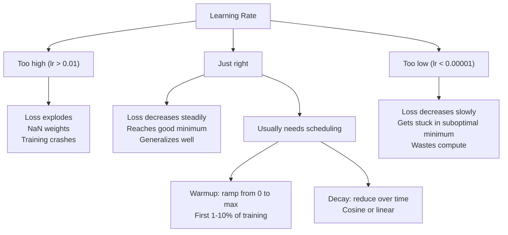
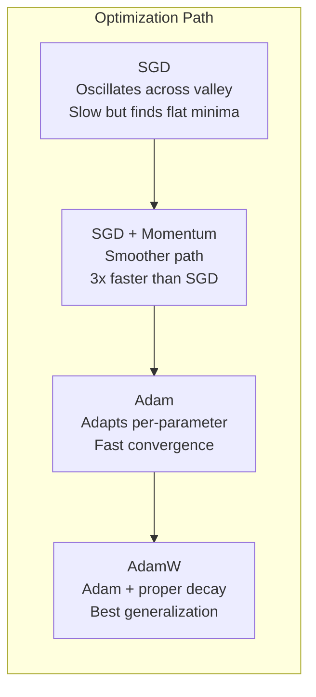
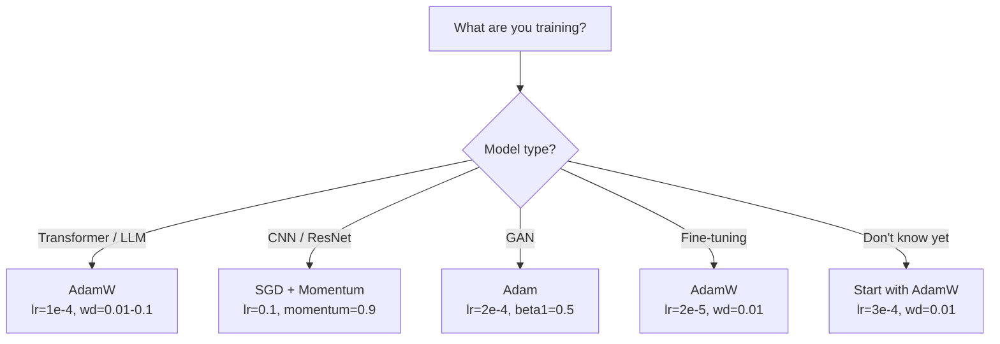

# Optimizerler.

> İndirme derecesi hangi yönde hareket edeceğinizi söyler. Ne kadar uzakta ne kadar hızlı olduğunu söylemez. SGD bir pusula. Adam trafik verileri ile GPS.

> **【中文解读】**梯度下降告诉你方向,但不说步幅和速度──SGD 像指南针只知道方向──Adam 像带实时路况的GPS根据历史信息调整策略──本章从零实现 SGD → Momentum → Adam → AdamW,理解每一步优化的直觉──

**Type:** Build
**Languages:** Python
**Prerequisites:** Lesson 03.05 (Loss Functions)
**Time:** ~75 minutes

## Öğrenme hedefleri

- Python'da SGD, SGD ve AdamW optimizerlerini sıfırdan uygulayın
- Adam'ın tarafsızlık düzeltmesi, erken eğitim aşamalarında sıfır başlangıçlı moment tahminlerini nasıl telafi ettiğini açıklayın.
- AdamW'nin aynı görevde L2 düzenlenmesi ile Adam'dan daha iyi genelleşmeyi neden ürettiğini gösterin.
- Transformatörler, CNN'ler, GAN'lar ve ince ayarlar için uygun optimizer ve varsayılan hiperparametre seçin

## Sorunlar. Sorunlar.

Eğer bu değerleri hesapladığınızda, 4.721'in ağırlığının kaybı azaltmak için 0.003'e düşmesi gerektiğini biliyorsunuz. Ama 0.003 hangi birimlerde? Ne kadar ölçeklendirilmiş? Ve 1. adımda 1.000'de olduğu kadar aynı miktarı hareket ettirmek mi gerekiyor?

> Siz dereceyi hesapladınız. Biliyor musunuz, ağırlık 4,721'in kaybı azaltmak için 0,003'ü azaltmalı. Ama 0,003 nedir? Hangi oranla azaltılır?

Vanilla gradient düşüşü, her adımdaki her parametrede aynı öğrenme hızını uyguluyor: w = w - lr * gradient. Bu, pratikte sinir ağlarını eğitmeyi acı verici hale getiren üç sorun yaratır.

> Orijinal gradient her adımda her parametre için aynı öğrenme oranının düşüşünü: w = w - lr * gradient. Bu da pratikte çok acı veren üç sorun yaratmıştır.

Öncelikle, titreşim. Kayıp manzarası nadiren bir kavanoz şeklinde oluşur. Daha çok uzun ve dar bir vadide. Merdiven, vadinin üzerinden (tırtlak yönde) değil, onun boyunca (kuyu yönde) işaretler. Devamlı düşüş, dar boyut boyunca ileri-geri atlayıp yararlı boyut boyunca küçük ilerlemeler yaparken. Bunu gördünüz: kayıp platolardan daha hızlı düşer, modelin birleştiği için değil, dalgalanması nedeniyle.

> İlk olarak, 振荡──损失曲面很少像平滑的碗──它更像长而窄的山谷──梯度指向山谷的横向 (横向) 方向),而不是纵向 (浅方向) ──梯度下降在狭维度上跳跳跳,而在有用方向上小小进步──

İkinci olarak, tüm parametreler için bir öğrenme hızı yanlışdır. Bazı ağırlıkların büyük güncellemelere ihtiyacı vardır (önce, uygunsuz aşamadalar). Diğerlerinin küçük güncellemelere ihtiyacı vardır (optimal değerlerine yakınlar).

> İkincisi, tüm parametreler bir öğrenme oranını paylaşır. Bazıları büyük bir yenilenme gerektirir.

Üçüncü olarak, otlak noktaları. Yüksek boyutlarda, kayıp manzarası, gradientin sıfıra yakın geniş düz bölgelere sahiptir. Vanilla SGD, gradientin hızıyla bu bölgeleri tarar, bu da aslında sıfır. Modeldeki görünüş sıkışmış.

> Üçüncü,  nokta. Yüksek seviyede, kayıp eğri yüzeyinde büyük bir düz bölge vardır, dilim sıfıra yakındır. Asıl SGD bu dilimlerden geçmek için aslında sıfır hızla tırmanır.

Adam üçünü de çözer. Parametre başına iki çalışkan ortalama tutar - ortalama gradient (momentum, ossilasyonu ele alır) ve ortalama kare gradient (adaptif hız, farklı ölçekleri ele alır). İlk birkaç adım için tarafsızlık düzeltmesi ile birlikte, size standart hiperparametre ile ilgili sorunların %80'inde çalışan tek bir optimizer verir. Bu ders, onu sıfırdan inşa eder böylece diğer %20'de ne zaman ve neden başarısız olduğunu tam olarak anlarsınız.

> Adam  tüm üç sorunu çözdü. Bu, her bir parametrenin iki işlevi ortalama değerini korumak için geçerlidir.

> **【中文解读】**İlk SGD'de üç sorun var: 振荡 (sız bir vadide geri dönüp atlamak) 単一学習率 (bütün parametrelere uygun değil) ✓平坦区域 (平坦区域) ✓梯度接近零就卡住) ✓ Adam Aynı zamanda bu üç sorunu çözüyor: 振荡 振荡 阻害量 ✓ 振荡 ✓ 适应学习率 ✓ 偏差修正 ✓ 偏差修正 ✓ ✓ ✓ ✓ ✓ ✓ ✓ ✓ ✓ ✓ ✓ ✓ ✓ ✓ ✓ ✓ ✓ ✓ ✓ ✓ ✓ ✓ ✓ ✓ ✓ ✓ ✓ ✓ ✓ ✓ ✓ ✓ ✓ ✓ ✓ ✓ ✓ ✓ ✓ ✓ ✓ ✓ ✓ ✓ ✓ ✓ ✓ ✓ ✓ ✓ ✓ ✓ ✓ ✓ ✓ ✓ ✓ ✓ ✓ ✓ ✓ ✓ ✓ ✓ ✓ ✓ ✓ ✓ ✓ ✓ ✓ ✓ ✓ ✓ ✓ ✓ ✓ ✓ ✓ ✓ ✓ ✓ ✓ ✓ ✓ ✓ ✓ ✓ ✓ ✓ ✓ ✓ ✓ ✓ ✓ ✓ ✓ ✓ ✓ ✓ ✓ ✓ ✓ ✓ ✓ ✓ ✓ ✓ ✓ ✓ ✓ ✓ ✓ ✓ ✓ ✓ ✓ ✓ ✓ ✓ ✓ ✓ ✓ ✓ ✓ ✓ ✓ ✓ ✓ ✓ ✓ ✓ ✓ ✓ ✓ ✓ ✓ ✓ ✓ ✓ ✓ ✓ ✓ ✓ ✓ ✓ ✓ ✓ ✓ ✓ ✓ ✓ ✓ ✓ ✓ ✓ ✓ ✓ ✓ ✓ ✓ ✓ ✓ ✓ ✓ ✓ ✓ ✓  ✓      ✓         ✓                                                   

## Konsepten bir şey.

### Stochastic Gradient Descent (SGD) 随机梯度下降

En basit optimizör. Mini seri üzerinde gradient hesaplayın ve ters yöne adım atın.

> En basit optimizer. Küçük bir miktarda hesaplama derecesi, sonra ters yönde bir adım ilerler.

```
w = w - lr * gradient    # 最简单的参数更新公式
```

"Stochastik" demek, tüm veri kümesi yerine, gradiyenti tahmin etmek için rastgele bir alt kümesi (mini-batch) verileri kullanmak demektir. Bu gürültü aslında yararlıdır - keskin yerel minimumlardan kaçmaya yardımcı olur. Ama gürültü aynı zamanda titreşimlere neden olur.

> "Aslan" ise, tüm veri kümesi yerine, bir dizi veriyi tahmin etmek için kullanmanızı ifade eder. Bu gürültü aslında yararlıdır.

Öğrenme hızı tek bir düğmedir. Çok yüksek: kayıplar farklıdır. Çok düşük: eğitim sonsuza dek sürer. Optimal değer mimarlığa, verilere, parti boyutuna ve eğitimin mevcut aşamasına bağlıdır. Modern ağlarda vanilya SGD için tipik değerler 0.01 ile 0.1 arasında değişir.

> Öğrenme oranı, tek bir dönüm noktasıdır. Çok yüksek: kaybı yayılmaktadır. Çok düşük: eğitim sonsuza dek tamamlanmamıştır. En iyi değer, yapı, veri, miktar ve eğitimin mevcut aşamasına bağlıdır.

### Hareket. Hareket.

Top-tükük-tük analogiyi çok fazla kullanır ama doğru. Sadece gradiyenti geçmek yerine, past gradients toplanan bir hız koruruz.

> 球滚下山坡'nun mecazi çok fazla kullanılır ama çok doğru.

```
m_t = beta * m_{t-1} + gradient    # 速度 = 衰减 × 历史速度 + 当前梯度
w = w - lr * m_t                    # 沿速度方向更新
```

Beta (genellikle 0.9) ne kadar tarih tutmak için kontrol eder. beta = 0.9, momentum yaklaşık olarak son 10 gradientlerin ortalamasıdır (1 / (1 - 0.9) = 10.

> Beta (öntemde 0.9) kontrol ederken, kontrolden kaç tane kalır?

Bu neden dalgalanmayı düzeltir: aynı yönde gösteren gradientler birikir. Kötü yönde ters giden gradientler iptal edilir. O dar vadide, "çetesi" bileşen her adımını işaret eder ve dümdüz edilir. "Yüzde" bileşen tutarlı kalır ve güçlenir. Sonuç yararlı yönde düzgün bir hızlandırma olur.

> Neden bu can canlandırıcı titreşim: aynı yönde merdivenlerin birikmesi. Aynı yönde dönüşümlü merdivenlerin birbirine karşı karşılığı.

Gerçek rakamlar: SGD'nin tek başına kötü koşullu bir kayıp manzarasında 10.000 adım alabilir. İstihbaratlı SGD (beta = 0,9) genellikle aynı sorunda 3.000-5.000 adım alır. Hızlanma sınırlı değildir.

> 具体数字: 差条件の損失曲面上,单独 SGD 10.000 步が必要である. 带动量(beta=0.9) ⇒ 带动量 (beta=0.9) ⇒ 带动量 (geçimi) ⇒ 带动量 (geçimi) △ △ △ △ △ △ △ △ △ △ △ △ △ △ △ △ △ △ △ △ △ △ △ △ △ △ △ △ △ △ △ △ △ △ △ △ △ △ △ △ △ △ △ △ △ △ △ △ △ △ △ △ △ △ △ △ △ △ △ △ △ △ △ △ △ △ △ △ △ △ △ △ △ △ △ △ △ △ △ △ △ △ △ △ △ △ △ △ △ △ △ △ △ △ △ △ △ △ △ △ △ △ △ △ △ △ △ △ △ △ △ △ △ △ △ △ △ △ △ △ △ △ △ △ △ △ △                                                                                               

> **【拓展：SGD + Momentum 的 resurgence】**Adam'ın seçimi birer seçeneğe göre olsa da, 2023'te yapılan bir makalede SGD+Momentum'un belirli görevlerde hala avantajları olduğunu göstermiştir. ResNet 系列(ImageNet bölümü şampiyon) ve birçok Kaggle  yarışmayı kazananlar SGD+Momentum'u (lr=0.1, momentum=0.9) kullanıyorlar.

### RMSP'in her tarafı yayılıyor.

Hinton tarafından Coursera dersi (resmi olarak hiç yayınlanmamış) önerilen, gerçekte işe yarayan ilk parametreki adaptatif öğrenme oranı yöntemi.

> İlk gerçekten etkili her parametre kendi kendine uyum öğrenme oranı yöntemi.

```
s_t = beta * s_{t-1} + (1 - beta) * gradient^2
w = w - lr * gradient / (sqrt(s_t) + epsilon)
```

s_t, karede gradientlerin geçerli ortalamasını takip eder. Sürekli büyük gradientler olan parametreler büyük bir sayıyla bölünür (küçük etkili öğrenme oranı). Küçük gradientler olan parametreler küçük bir sayıyla bölünür (yüksek etkili öğrenme oranı).

> S_t                                                                                                                                                                                                                                                                                                                                                                                                                                                                                                                           

Bu, "her parametre için bir öğrenme hızı" sorunu çözüyor. Büyük güncellemeler alıyor olan bir ağırlık muhtemelen hedefine yakın -- yavaşlatıyor. Küçük güncellemeler alan bir ağırlık az eğitimli olabilir -- hızlandırıyor.

> Bu, "her bir parametrenin bir öğrenme oranını paylaşması" sorunu çözmektedir. Birinde büyük bir yenilenme ağırlığı elde edilen bir kişi hedefe yakın olabilir.

Epsilon (genellikle 1e-8) bir parametrenin güncelleştirilmediği zaman sıfırla bölünmeyi engeller.

> Epsilon( genellikle 1e-8) parametre yenilenmemiş zaman ayrılmış olarak yok edilmesini önler.

### Adam: Momentum + RMSProp . Adam:动量 +自适应学习率

Adam her parametre için iki eksponensial hareketli ortalama tutar.

> Adam iki düşünceyi birleştirdi. Her bir parametre için iki gösterge hareket ortalaması vardır:

```
m_t = beta1 * m_{t-1} + (1 - beta1) * gradient        (first moment: mean)        # 一阶矩：梯度均值
v_t = beta2 * v_{t-1} + (1 - beta2) * gradient^2       (second moment: variance)   # 二阶矩：梯度方差
```

**Bias correction**Bu, bir açıklama atlatmadığı anahtar ayrıntıdır. 1 adım, m_1 = (1 - beta1) * gradient. beta1 = 0.9 ile, bu 0.1 * gradient -- on kat daha küçük. Hareketli ortalama henüz ısınmadı.

> **偏差修正**Bu, birincil olarak, birincil olarak, birincil olarak, birincil olarak, birincil olarak, birincil olarak, birincil olarak, birincil olarak, birincil olarak, birincil olarak, birincil olarak, birincil olarak, birincil olarak, birincil olarak, birincil olarak, birincil olarak, birincil olarak, birincil olarak, birincil olarak, birincil olarak, birincil olarak, birincil olarak, birincil olarak, birincil olarak, birincil olarak, birincil olarak, birincil olarak, birincil olarak, birincil olarak, birincil olarak, birincil olarak, birincil olarak, birincil olarak, birincil olarak, birincil olarak, birincil olarak, birincil olarak, birincil olarak, birincil olarak, birincil olarak, birincil olarak, birincil olarak, birincil olarak, birincil olarak, birincil olarak, birincil olarak, birincil olarak, birincil olarak, birincil olarak, birincil olarak, birincil olarak, birincil olarak, birincil olarak, birincil olarak, birincil olarak, birincil olarak, birincil olarak, birincil olarak, birincil olarak, birincil olarak, birincil olarak, birincil olarak, birincil olarak, birincil olarak, birincil olarak, birincil olarak, "incil olarak, "incil olarak, "incil olarak, "incil olarak, "incil olarak, "incil olarak, "incil olarak, "incil olarak, "incil olarak, "incil olarak, "incil olarak, "incil "incil " " " " " " " " " " " " " " " " " " " " " " " " " " " " " " " " " " " " " " " " " " " " " " " " " " " " " " " " " " " " " " " " " " " " " " " " " " " " " " " " " " " " " " " " " " " " " " " " " " " " " " " " " " " " " " " " " " " " "

```
m_hat = m_t / (1 - beta1^t)
v_hat = v_t / (1 - beta2^t)
```

Beta1 = 0.9 olan 1. adımda: m_hat = m_1 / (1 - 0.9) = m_1 / 0.1 = gerçek kaydırma. 100'de: (1 - 0.9^100) yaklaşık 1.0'dır, bu nedenle düzeltme ortadan kalkar.

> 第 1 步 beta1 = 0.9 时:m_hat = m_1 / (1 - 0.9) = m_1 / 0.1 = 实际梯度──第 100 步:(1 - 0.9^100) 大约等于 1.0,修正消失──偏差修正对前 ~10 步重要,~50 步后无关紧要──

Güncelleme:

> Yeni bir resmi:

```
w = w - lr * m_hat / (sqrt(v_hat) + epsilon)
```

Adam'ın öntanımlı özellikleri: lr = 0.001, beta1 = 0.9, beta2 = 0.999, epsilon = 1e-8. Bu öntanımlı özellikler sorunların %80'inde çalışır.

> Adam 默认值:lr = 0.001,beta1 = 0.9,beta2 = 0.999,epsilon = 1e-8。 bunlar %80'lik sorunlara uygundur。

> **【拓展：Adam 的局限性】**Adam'ın en sık kullanılan optimizer olmasına rağmen, mükemmel değildir: 1) Bazı konveks  sorunlarda SGD'den farklı gelir; 2) Adam'ın genelleşmesi SGD'den farklıdır; çünkü kendi kendine uyum sağlama öğrenme oranı aşırı uyarlamalara neden olabilir; 3) Adam'ın内存开销ı SGD'nin 2-3 katıdır;

### Kilo kaybı doğru yapıldı.

L2 düzenlenmesi kaybı lambda * w^2 ekler. vanilya SGD'de bu ağırlık kaybına eşittir (her adımda lambda * w'yi ağırlıktan çıkarır).

> L2 düzeltme lambda * w^2 kaybına kadar artı­racak. İlk SGD'de, bu değer, ağırlık kaybına eşit olur.

Loshchilov & Hutter'ın anlayışı: L2'yi kaybına eklediğinizde ve sonra Adam gradiyenti işlediğinde, adaptatif öğrenme hızı düzenleme terimini de ölçeyor. Büyük gradiyent varyasyonu olan parametreler daha az düzenlenir. Küçük varyasyonu olan parametreler daha fazla düzenlenir. Bu istediğiniz şey değil - gradiyent istatistiklerine bakılmaksızın birer düzenlenme istiyorsunuz.

> Loshchilov ve Hutter'ın anlayışı: L2'yi kaybın içinde eklerken ve sonra Adam  梯度yi işlediğinde, öz-adapta öğrenme oranı da düzeltme programlarını küçültür. 梯度 梯度 梯度 梯度 梯度 梯度 梯度 梯度 梯度 梯度 梯度 梯度 梯度 梯度 梯度 梯度 梯度 梯度 梯度 梯度 梯度 梯度 梯度 梯度 梯度 梯度 梯度 梯度 梯度 梯度 梯度 梯度 梯度 梯度 梯度 梯度 梯度 梯度 梯度 梯度 梯度 梯度 梯度 梯度 梯度 梯度 梯度 梯度 梯度 梯度 梯度 梯度 梯度 梯度 梯度 梯度 梯度 梯度 梯度 梯度 梯度 梯度 梯度 梯度 梯度 梯度 梯度 梯度 梯度 梯度 梯度 梯度 梯度 梯度 梯度 梯度 梯度 梯度 梯度 梯度 梯度 梯度 梯度 梯 梯 梯度 梯 梯 梯 梯 梯 梯 梯 梯 梯 梯 梯 梯 梯 梯 梯 梯 梯 梯 梯 梯 梯 梯 梯 梯 梯 梯 梯 梯 梯 梯 梯 梯 梯 梯 梯 梯 梯 梯 梯 梯 梯 梯 梯 梯 梯 梯 梯 梯 梯 梯 梯 梯 梯 梯 梯 梯 梯 梯 梯 梯 梯 梯 梯 梯 梯 梯 梯 梯 梯 梯 梯 梯 梯 梯 梯 梯 梯 梯 梯 梯 梯 梯 梯 梯 梯 梯 梯 梯 梯 梯 梯 梯 梯 梯 梯 梯 梯 梯 梯 梯 梯

AdamW, bu durumu, Adam güncelleştirmesinden sonra ağırlık kaybını doğrudan ağırlıklara uygulayarak düzeltir:

```
w = w - lr * m_hat / (sqrt(v_hat) + epsilon) - lr * lambda * w    # Adam 更新 + 解耦权重衰减
```

Ağırlık kaybı terimi (lr * lambda * w) Adem'in uyarlama faktörü ile ölçemez.

Bu küçük bir detay gibi görünüyor. Hayır. AdamW neredeyse her görevde Adam + L2 düzenlenmesinden daha iyi çözümlere yaklaşıyor. PyTorch'de dönüştürücülerin, difüzyon modellerinin ve çoğu modern mimarinin eğitimi için varsayılan optimizördür. BERT, GPT, LLaMA, Stable Diffusion - hepsi AdamW ile eğitilmiştir.

> **【中文解读】**AdamW'nin anahtar gelişmeleri: Adam'ın kendi kendine uyumlu kısaltılması, doğrudan etkisi olan parametre.

> **【拓展：LoRA 微调中的 AdamW】**LoRA 微调 LLM 时, genellikle AdamW(lr=2e-5~1e-4, ağırlık_decay=0.01) ・・・LoRA sadece bu yeni parametrelerin boyutunu kontrol etmesine yardımcı olur.

### Öğrenme oranı: En Önemli Hiperparametr.



Eğer bir hiperparametre ayarladığınızda öğrenme hızını ayarlayın. Öğrenme hızında 10 katlık bir değişiklik, herhangi bir mimari kararınızdan daha önemlidir.

> Eğer sadece bir süperparametrü ayarlarsanız, ayarlama öğrenme oranı. Öğrenme oranının herhangi bir yapısal karar verimden 10 kat daha fazla değişmesi önemlidir.

- SGD: lr = 0.01 ila 0.1
  SGD:lr = 0.01 ila 0.1
- Adam/AdamW: lr = 1e-4 ile 3e-4
  Adam/AdamW:lr = 1e-4 3e-4
- Düzgün ayarlama öncesi eğitilmiş modeller: lr = 1e-5 ile 5e-5 arasında
  微调预训模型:lr = 1e-5 ~ 5e-5
- Öğrenme hızının yükselmesi: ilk adımların % 1-10'unda çizgilik rampa
  Öğrenme oranı ısınma: Önceki 1-10%                                                                                                                                                                                                                                                                                                                                                                                                                                                                                                               

### Optimizer karşılaştırma  Optimizer karşılaştırma



### Her Optimizer Kazandığında



> **【拓展：深度学习中优化器的演进】**2012 yılında AlexNet'in SGD+Momentum'undan 2014 yılında Adam'ın önerisiyle, 2017 yılında AdamW'nin doğuşundan sonra geliştirme makinesi geliştirilmesi, eğitim "harca birkaç hafta ayarlama"dan "devre parameter on can run" haline gelmesine neden oldu. Llama 3 405B'nin eğitimleri, AdamW, zirve değer lr=3e-4, 16384 blok H100 GPU'da 30.8M GPU'da eğitildi.

## Yapın.

> **【中文解读】**Aşağıda aşağıda dört optimizer gerçekleştirilmektedir:SGD → SGD+Momentum → Adam → AdamW── her biri önceki bir temel üzerinde bir anahtar mekanizma ekliyor── dikkat edin Adam'ın fark düzeltmesi ve AdamW'nin çözümü  ağırlık düşüşü bu, görüşme sıkı sınavının bilgi noktasıdır──
```figure
optimizer-trajectory
```

## Yapın

### Adım 1: Vanilla SGD.

> İlk SGD: Parametrler doğrudan öğrenme oranı kat katılıkta azaltılır.

```python
class SGD:
    def __init__(self, lr=0.01):
        self.lr = lr

    def step(self, params, grads):
        for i in range(len(params)):
            params[i] -= self.lr * grads[i]
```

### Adım 2: Süreklilik ile SGD.

> SGD+Momentum: Geçiş değişimi,累积历史梯度──指向一致方向的梯度相互叠加,振荡方向相互抵消──

```python
class SGDMomentum:
    def __init__(self, lr=0.01, beta=0.9):
        self.lr = lr
        self.beta = beta
        self.velocities = None

    def step(self, params, grads):
        if self.velocities is None:
            self.velocities = [0.0] * len(params)
        for i in range(len(params)):
            self.velocities[i] = self.beta * self.velocities[i] + grads[i]
            params[i] -= self.lr * self.velocities[i]
```

### Adım 3: Adam.

> Adam:维护一阶矩 m(梯度平均值) ve二阶矩 v(梯度方差),加上偏差修正──80%'nin sorunu varsayılan parametrelerle kanıtılan.

```python
import math

class Adam:
    def __init__(self, lr=0.001, beta1=0.9, beta2=0.999, epsilon=1e-8):
        self.lr = lr
        self.beta1 = beta1
        self.beta2 = beta2
        self.epsilon = epsilon
        self.m = None
        self.v = None
        self.t = 0

    def step(self, params, grads):
        if self.m is None:
            self.m = [0.0] * len(params)
            self.v = [0.0] * len(params)

        self.t += 1

        for i in range(len(params)):
            self.m[i] = self.beta1 * self.m[i] + (1 - self.beta1) * grads[i]
            self.v[i] = self.beta2 * self.v[i] + (1 - self.beta2) * grads[i] ** 2

            m_hat = self.m[i] / (1 - self.beta1 ** self.t)
            v_hat = self.v[i] / (1 - self.beta2 ** self.t)

            params[i] -= self.lr * m_hat / (math.sqrt(v_hat) + self.epsilon)
```

### Adım 4: AdamW.

> AdamW: Adam'ın temelinde ağırlık kaybını, m ve v'nin küçülmesinden sonra, doğrudan elementlerin kendi başına düşürmek için çözmek.

```python
class AdamW:
    def __init__(self, lr=0.001, beta1=0.9, beta2=0.999, epsilon=1e-8, weight_decay=0.01):
        self.lr = lr
        self.beta1 = beta1
        self.beta2 = beta2
        self.epsilon = epsilon
        self.weight_decay = weight_decay
        self.m = None
        self.v = None
        self.t = 0

    def step(self, params, grads):
        if self.m is None:
            self.m = [0.0] * len(params)
            self.v = [0.0] * len(params)

        self.t += 1

        for i in range(len(params)):
            self.m[i] = self.beta1 * self.m[i] + (1 - self.beta1) * grads[i]
            self.v[i] = self.beta2 * self.v[i] + (1 - self.beta2) * grads[i] ** 2

            m_hat = self.m[i] / (1 - self.beta1 ** self.t)
            v_hat = self.v[i] / (1 - self.beta2 ** self.t)

            params[i] -= self.lr * m_hat / (math.sqrt(v_hat) + self.epsilon)
            params[i] -= self.lr * self.weight_decay * params[i]
```

### Adım 5: Eğitim karşılaştırması Beşinci adım: Eğitim karşılaştırması

Dört optimizörle 05. dersden beri döngü verileri üzerinde aynı iki katmanlı ağı çalıştırın.

> 5. Sınıf'ın yuvarlak veri kümesi eğitimi ile aynı iki katlı ağın, dört optimizer'in karşılaştırma hızına karşı.

```python
import random

def sigmoid(x):
    x = max(-500, min(500, x))
    return 1.0 / (1.0 + math.exp(-x))

def make_circle_data(n=200, seed=42):
    random.seed(seed)
    data = []
    for _ in range(n):
        x = random.uniform(-2, 2)
        y = random.uniform(-2, 2)
        label = 1.0 if x * x + y * y < 1.5 else 0.0
        data.append(([x, y], label))
    return data


class OptimizerTestNetwork:
    def __init__(self, optimizer, hidden_size=8):
        random.seed(0)
        self.hidden_size = hidden_size
        self.optimizer = optimizer

        self.w1 = [[random.gauss(0, 0.5) for _ in range(2)] for _ in range(hidden_size)]
        self.b1 = [0.0] * hidden_size
        self.w2 = [random.gauss(0, 0.5) for _ in range(hidden_size)]
        self.b2 = 0.0

    def get_params(self):
        params = []
        for row in self.w1:
            params.extend(row)
        params.extend(self.b1)
        params.extend(self.w2)
        params.append(self.b2)
        return params

    def set_params(self, params):
        idx = 0
        for i in range(self.hidden_size):
            for j in range(2):
                self.w1[i][j] = params[idx]
                idx += 1
        for i in range(self.hidden_size):
            self.b1[i] = params[idx]
            idx += 1
        for i in range(self.hidden_size):
            self.w2[i] = params[idx]
            idx += 1
        self.b2 = params[idx]

    def forward(self, x):
        self.x = x
        self.z1 = []
        self.h = []
        for i in range(self.hidden_size):
            z = self.w1[i][0] * x[0] + self.w1[i][1] * x[1] + self.b1[i]
            self.z1.append(z)
            self.h.append(max(0.0, z))

        self.z2 = sum(self.w2[i] * self.h[i] for i in range(self.hidden_size)) + self.b2
        self.out = sigmoid(self.z2)
        return self.out

    def compute_grads(self, target):
        eps = 1e-15
        p = max(eps, min(1 - eps, self.out))
        d_loss = -(target / p) + (1 - target) / (1 - p)
        d_sigmoid = self.out * (1 - self.out)
        d_out = d_loss * d_sigmoid

        grads = [0.0] * (self.hidden_size * 2 + self.hidden_size + self.hidden_size + 1)
        idx = 0
        for i in range(self.hidden_size):
            d_relu = 1.0 if self.z1[i] > 0 else 0.0
            d_h = d_out * self.w2[i] * d_relu
            grads[idx] = d_h * self.x[0]
            grads[idx + 1] = d_h * self.x[1]
            idx += 2

        for i in range(self.hidden_size):
            d_relu = 1.0 if self.z1[i] > 0 else 0.0
            grads[idx] = d_out * self.w2[i] * d_relu
            idx += 1

        for i in range(self.hidden_size):
            grads[idx] = d_out * self.h[i]
            idx += 1

        grads[idx] = d_out
        return grads

    def train(self, data, epochs=300):
        losses = []
        for epoch in range(epochs):
            total_loss = 0.0
            correct = 0
            for x, y in data:
                pred = self.forward(x)
                grads = self.compute_grads(y)
                params = self.get_params()
                self.optimizer.step(params, grads)
                self.set_params(params)

                eps = 1e-15
                p = max(eps, min(1 - eps, pred))
                total_loss += -(y * math.log(p) + (1 - y) * math.log(1 - p))
                if (pred >= 0.5) == (y >= 0.5):
                    correct += 1
            avg_loss = total_loss / len(data)
            accuracy = correct / len(data) * 100
            losses.append((avg_loss, accuracy))
            if epoch % 75 == 0 or epoch == epochs - 1:
                print(f"    Epoch {epoch:3d}: loss={avg_loss:.4f}, accuracy={accuracy:.1f}%")
        return losses
```

> **【拓展：GPT 训练中的优化器选择】**OpenAI'nın GPT 系列全部使用 Adam 优化器(GPT-4 推测也使用 AdamW) 』訓練时一个常见技巧: 嵌入层和输出层 采用不同的学习率──在 PyTorch 中通过参数组实现:`optimizer = AdamW([{'params': base_params}, {'params': head_params, 'lr': lr*0.1}])`- Evet.

## Çerçeveyi kullanın.

> **【中文解读】**PyTorch 中的训练循环模式:zero_grad → forward → loss → backward → clip → step → schedule──这个顺序不能搞错──CNN 用 SGD+Momentum(lr=0.1),Transformer 用 AdamW(lr=1e-4)──

PyTorch optimizörleri parametre gruplarını, gradient kesimini ve öğrenme hızının programlamasını işliyor:

```python
import torch
import torch.optim as optim

model = torch.nn.Sequential(
    torch.nn.Linear(784, 256),
    torch.nn.ReLU(),
    torch.nn.Linear(256, 10),
)

optimizer = optim.AdamW(model.parameters(), lr=3e-4, weight_decay=0.01)

scheduler = optim.lr_scheduler.CosineAnnealingLR(optimizer, T_max=100)

for epoch in range(100):
    optimizer.zero_grad()
    output = model(torch.randn(32, 784))
    loss = torch.nn.functional.cross_entropy(output, torch.randint(0, 10, (32,)))
    loss.backward()
    torch.nn.utils.clip_grad_norm_(model.parameters(), max_norm=1.0)
    optimizer.step()
    scheduler.step()
```

Bu düzen her zaman: zero_grad, forward, loss, backward, (clip), step, (schedule) şeklinde kalır. Bu sırayı ezberleyin.

CNN'ler için, birçok uygulayıcı hala SGD + momentum (lr=0.1, momentum=0.9, weight_decay=1e-4) ve bir adım veya cosine programı tercih eder. SGD genellikle daha iyi genelleştirilen düz minimumlar bulur. Transformatörler ve LLM için, ısıtma + cosine çöküşü ile AdamW evrensel varsayımdır. Ölçülmüş bir neden olmadan bir fikir birliği ile mücadele etmeyin.

## İndirin . Ürünler .

Bu ders şunları ortaya çıkarır:
- `outputs/prompt-optimizer-selector.md`-- herhangi bir mimarlık için doğru optimizer ve öğrenme oranı seçmek için bir karar uyarısı

## Egzersizler.

1. Nesterov momentum uygulamak, mevcut pozisyon yerine "lookhead" pozisyonunda (w - lr * beta * v) gradiyenti hesaplamak.
   > **练习 1：**实现 Nesterov 动量 (→→→→→→→→→→→→→→→→→→→→→→→→→→→→→→→→→→→→→→→→→→→→→→→→→→→→→→→→→→→→→→→→→→→→→→→→→→→→→→→→→→→→→→→→→→→→→→→→→→→→→→→→→→→→→→→→→→→→→→→→→→→→→→→→→→→→→→→→→→→→→→→→→→→→→→→→→→→→→→→→→→→→→→→→→→→→→→→→→→→→→→→→→→→→→→→→→→→→→→→→→→→→→→→→→→→→→→→→→→→→→→→→→→→→→→→→→→→→→→→→→→→→→→→→→→→→→→→→→→→→→→→→→→→→→→→→→→→→→→→→→→→→→→→→→→→→→→→→→→→→→→→→→→→→→→→→→→→→→→→→→→→→→→→→→→→→→→→→→→→→→→→→→→→→→→→→→→→→→→→→→→→→→→→→→→→→→→→→→→→→→→→→→→→→→→→→→→→→→→→→→→→→→→→→→→→→→→→→→→→→→→→→→→→→→→→→→→→→→→→→→→→→→→→→→→→→→→→→→→→→→→→→→→→→→→→→→→→→→→→→→→→→→→→→→→→→→→→→→→→→→

2. Öğrenme hızı ısınma programını uygulayın: eğitim adımlarının ilk 10%'inde 0'dan maksimum_lr'e kadar çizgi ramp, sonra kozin çöküşü 0. Adam + ısınma ile ısınmadan ısınma ile ısınma.
   > **练习 2：**实现变暖 + 化衰变 学习率调度, 变暖/无变暖 达到90% 准确率的轮数――

3. Adam eğitiminde her parametrenin etkili öğrenme oranını takip edin. Etkin oran lr * m_hat / (sqrt(v_hat) + eps). 10, 50 ve 200 adımdan sonra etkili oranların dağılımını çizin. Tüm parametreler aynı hızda güncellenir mi?
   > **练习 3：**                                                                                                                                                                                                                                                                                                                                                                                                                                                                                                                             

4. Yüksek öğrenme oranı (lr=0.01 için Adam) kullanarak ve kesmeden eğitilmek. Ne kadar koşunun ayrıldığı (kayıp NaN'e gider) sayın.
   > **练习 4：**                                                                                                                                                                                                                                                                                                                       

5. Adam vs. AdamW'yi büyük ağırlıklar olan bir ağda karşılaştırın. Tüm ağırlıkları rastgele değerlere [-5, 5] (normalden çok daha büyük) initialize edin. 200 dönem boyunca weight_decay=0.1 ile çalışın.
   > **练习 5：**Büyük başlangıç ağırlığı altında, Adam ve AdamW'ye göre, ağırlık kaybı etkisinin farkını gözlemle.

## Anahtar Terimler

| Term | What people say | What it actually means |
|------|----------------|----------------------|
| Learning rate | "Step size" | The scalar multiplier on the gradient update; the single most impactful hyperparameter in training |
| SGD | "Basic gradient descent" | Stochastic gradient descent: update weights by subtracting lr * gradient, computed on a mini-batch |
| Momentum | "Rolling ball analogy" | Exponential moving average of past gradients; dampens oscillation and accelerates consistent directions |
| RMSProp | "Adaptive learning rate" | Divides each parameter's gradient by the running RMS of its recent gradients; equalizes learning rates |
| Adam | "The default optimizer" | Combines momentum (first moment) and RMSProp (second moment) with bias correction for the initial steps |
| AdamW | "Adam done right" | Adam with decoupled weight decay; applies regularization directly to weights rather than through the gradient |
| Bias correction | "Warmup for running averages" | Dividing by (1 - beta^t) to compensate for the zero-initialization of Adam's moment estimates |
| Weight decay | "Shrink the weights" | Subtracting a fraction of the weight value at each step; a regularizer that penalizes large weights |
| Learning rate schedule | "Changing lr over time" | A function that adjusts the learning rate during training; warmup + cosine decay is the modern default |
| Gradient clipping | "Capping the gradient norm" | Scaling down the gradient vector when its norm exceeds a threshold; prevents exploding gradient updates |

| 术语 | 通俗说法 | 实际含义 |
|------|---------|---------|
| 学习率 (Learning rate) | "步长" | 梯度更新的标量乘数；训练中影响最大的超参数 |
| SGD | "基础梯度下降" | 随机梯度下降：用小批量梯度更新 w -= lr * grad |
| 动量 (Momentum) | "滚球的类比" | 历史梯度的指数移动平均；抑制振荡、加速一致方向 |
| RMSProp | "自适应学习率" | 除以梯度平方的移动平均根；均衡各参数学习速度 |
| Adam | "默认优化器" | 动量 + RMSProp + 偏差修正的统一优化器 |
| AdamW | "正确的 Adam" | Adam + 解耦权重衰减；直接对参数施加正则化 |
| 偏差修正 (Bias correction) | "运行平均的热身" | 除以 (1-beta^t) 补偿 Adam 矩估计的零初始化偏差 |
| 权重衰减 (Weight decay) | "缩小权重" | 每步减去权重的一小部分；惩罚大权重的正则化手段 |
| 学习率调度 (LR schedule) | "随时间改变 lr" | 训练中调整学习率的函数；warmup + cosine decay 是现代标配 |
| 梯度裁剪 (Gradient clipping) | "限制梯度范数" | 梯度范数超限时缩小梯度；防止梯度爆炸 |

## Daha fazla okumak

- Kingma & Ba, "Adam: Stochastic Optimization için Bir Yöntem" (2014) - konverjense analizi ve önyargı düzeltme çıkarımı ile orijinal Adam kağıdı
- Loshchilov & Hutter, "Kısıtlı Ağırlık Kayıp Düzenlemesi" (2017) -- L2 düzenlemesinin ve kilo kaybının Adam'da eşdeğer olmadığını kanıtladı ve AdamW'yi önerdi
- Smith, "Trening Neural Networks için Siklik Öğrenme Sınıfları" (2017) -- sabit bir öğrenme oranını ayarlamanın gereksinimini ortadan kaldıran LR aralığı testi ve siklik programları tanıttı
- Ruder, "Gradient Descent Optimization Algorithms'in Özetleri" (2016) - tüm optimizer çeşitlerinin en iyi tek anketini, net karşılaştırmalar ve sezgisellikler ile
