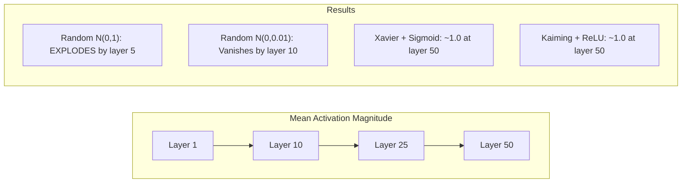
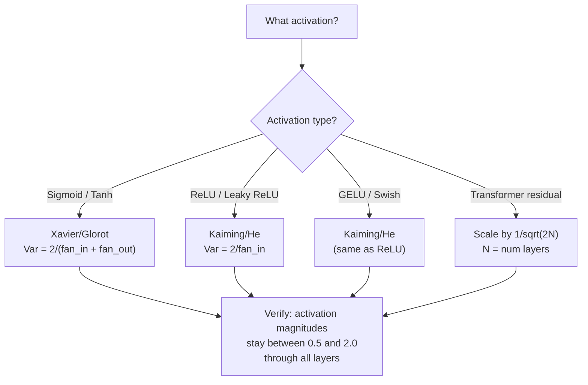

# Ağırlık Başlatma ve Eğitim Kalıcılığı

> Yanlış bir başlangıç yaparsan hiç bir zaman çalışmaya başlamaz.

> **【中文解读】**İlk başlama hatası, eğitim asla başlamaz 50 katlı ağın sinyalleri 50 katlı eğitimler ve 3 katlı eğitimler Xavier ilk başlama Sigmoid/tanh) ve Kaiming ilk başlama ReLU/GELU) modern derinlik öğrenme temel taşıdır

**Type:** Build
**Languages:** Python
**Prerequisites:** Lesson 03.04 (Activation Functions), Lesson 03.07 (Regularization)
**Time:** ~90 minutes

## Öğrenme hedefleri

- sıfır, rastgele, Xavier/Glorot ve Kaiming/He başlangıç stratejilerini uygulayın ve 50 katman boyunca etkinlik büyüklüklerine etkilerini ölçün
- Xavier init'in Var(w) = 2/(fan_in + fan_out) ve Kaiming'in Var(w) = 2/fan_in'i neden kullandığını öğrenin.
- sıfır başlangıç ile simetri sorunu gösterin ve rastgele ölçeklerin neden yeterli olmadığını açıklayın.
- Doğru başlangıç stratejisi ile etkinleştirme fonksiyonu eşleştir: Xavier sigmoid/tanh için, Kaiming ReLU/GELU için

> **【中文解读】**Bu bölümde, "Hazırlı ve Kötü" adlı bir yayının başlıklı başlıklı başlıklı başlıklı başlıklı başlıklı başlıklı başlıklı başlıklı başlıklı başlıklı başlıklı başlıklı başlıklı başlıklı başlıklı başlıklı başlıklı başlıklı başlıklı başlıklı başlıklı başlıklı başlıklı başlıklı başlıklı başlıklı başlıklı başlıklı başlıklı başlıklı başlıklı başlıklı başlıklı başlıklı başlıklı başlıklı başlıklı başlıklı başlıklı başlıklı başlıklı başlıklı başlıklı başlıklı başlıklı başlıklı başlıklı başlıklı başlıklı başlıklı başlıklı başlıklı başlıklı başlıklı başlıklı başlıklı başlıklı başlıklı başlıklı başlıklı başlıklı başlıklı başlıklı başlıklı başlıklı başlıklı başlıklı başlıklı başlıklı başlıklı başlıklı başlıklı başlıklı başlıklı başlıklı başlıklı başlıklı başlıklı başlıklı başlıklı başlıklı başlıklı başlıklı başlıklı başlıklı başlıklı başlıklı başlıklı başlıklı başlıklı başlıklı başlıklı başlıklı başlıklı başlıklı başlıklı başlıklı başlıklı başlıklı başlıklı başlıklı başlıklı başlıklı başlıklı başlıklı başlıklı başlıklı başlıklı başlıklı başlıklı başlıklı başlıklı başlıklı başlıklı başlıklı başlıklı başlıklı başlıklı başlıklı başlıklı başlıklı başlıklı başlıklı başlıklı başlıklı başlıklı başlıklı başlıklı başlıklı başlıklı başlıklı başlıklı başlıklı başlıklı başlıklı başlıklı başlıklı başlıklı başlıklı başlıklı başlıklı başlıklı başlık olarak öne cevap olarak "Hasasasasasasasasasasasasasasasasasasasasasasasasasasasasasasasasasasasasasasasasasasasasasasasasasasasasasas

## Sorunlar. Sorunlar.

Tüm ağırlıkları sıfıra başlatın. Hiçbir şey öğrenmez. Her nöron aynı işlevi hesaplar, aynı gradiyenti alır ve aynı şekilde güncelleştirir. 10.000 dönemden sonra, 512 nöronlu gizli katmanınız hâlâ aynı nöronun 512 kopyasıdır. 512 parametre için ödeme yaptınız ve 1 aldınız.

> Bu sayede, her sinir aynı işlevi hesaplar, aynı derecede alır ve aynı şekilde yenilir. 10.000 çağın ardından, 512 sinirinin gizli katmanı hâlâ aynı sinirlerin 512 kopyası olarak kalıyor.

Bu sayede, bir dizi değişkenlik, bir dizi değişkenlik ve bir dizi değişkenlik oluşur.

> İlk olarak çok büyüktür. Ağda patlayan aktif değerler 10. katına kadar, 1e15'e ulaşan değerler 20. katına kadar, aynı yoldaki yolları takip eden, sonsuz büyüklükte yayılırlar.

Bu, normal bir dağılımdan rastgele olarak başlatılır. 3 katman için çalışır. 50 katmanlarda, sinyal, rastgele ölçekin biraz fazla küçük veya biraz fazla büyük olup olmadığından bağlı olarak sıfıra düşer veya sonsuza kadar patlar. "İş" ve "kırık" arasındaki sınır keskin ince.

> Standart normal ortam dağılımından ise, "işleyici" ve "kötü" arasındaki sınır çok zayıf olması, sinyallerin sıfır veya uçsuzluk olarak küçülmesi ve genişlemesi ile ilgili olarak, "işleyici" ve "kötü" arasındaki sınırların çok zayıf olmasıdır.

Ağırlık başlangıcı derin öğrenme konusunda en az değerlendirilmiş bir karar. Mimarlık kağıtlar alır. Optimizeciler blog yayınları alır. Başlangıç bir ayaknot alır. Ama yanlış yapın ve başka bir şey önemli değil - eğitim başlamadan önce ağınız öldü.

> 权重初始化, derin öğrenimdeki en düşük değerlendirilmiş kararlardır. 架构能发文──优化器能写博客──初始化只能得到一个脚注──但是如果错误了,一切都不重要你的网络在训练开始之前已经死了──

> **【中文解读】**İlk başlama, derin öğrenimdeki en düşük değerlendirilmiş kararlardır. İlk başlama ise, tüm sinir bilimindeki benzer şeyleri karşılaştırmaya neden olur.

> **【拓展：GPT-2 的残差缩放技巧】**GPT-2'de 1 karelik bir bölgeye ayrılmış bir bölgeye ayrılmış bir bölgeye ayrılmış bir bölgeye ayrılmış bir bölgeye ayrılmış bir bölgeye ayrılmış bir bölgeye ayrılmış bir bölgeye ayrılmış bir bölgeye ayrılmış bir bölgeye ayrılmış bir bölgeye ayrılmış bir bölgeye ayrılmış bir bölgeye ayrılmış bir bölgeye ayrılmış bir bölgeye ayrılmış bir bölgeye ayrılmış bir bölgeye ayrılmış bir bölgeye ayrılmış bir bölgeye ayrılmış bir bölgeye ayrılmış bir bölgeye ayrılmış bir bölgeye ayrılmış bir bölgeye ayrılmış bir bölgeye ayrılmış bir bölgeye ayrılmış bir bölgeye ayrılmış bir bölgeye ayrılmış bir bölgeye ayrılmış bir bölgeye ayrılmış bir bölgeye ayrılmış bir bölgeye ayrılmış bir bölgeye ayrılmış bir bölgeye ayrılmış bir bölgeye ayrılmış bir bölgeye ayrılmış bir bölgeye ayrılmış bir bölgeye ayrılmış bir bölgeye ayrılmış bir bölgeye ayrılmış bir bölgeye ayrılmış bir bölgeye ayrılmış bir bölgeye ayrılmış bir bölgeye ayrılmış bir bölgeye ayrılmış bir bölgeye ayrılmış bir bölgeye ayrılmış bir bölgeye ayrılmış bir bölgeye ayrılmış bir bölgeye ayrılmış bir bölgeye ayrılmış bir bölgeye ayrılmış bir bölgeye ayrılmış bölgeye ayrılmış bir bölgeye ayrılmış bir bölgeye ayrılmış bölgeye ayrılmış bölgeye bölgeye ayrılmış bölgeye bölgeye bölgeye bölgeye bölgeye bölgeye bölge bölge bölge bölge bölge bölge bölge bölge bölge bölge bölge bölge bölge bölge bölge bölge bölge bölge bölge bölge bölge bölge bölge bölge bölge bölge bölge bölge bölge bölge bölge bölge bölge bölge bölge bölge bölge bölge bölge bölge bölge bölge bölge bölge bölge bölge bölge bölge bölge bölge bölge bölge bölge bölge bölge bölge bölge bölge bölge bölge bölge bölge bölge bölge bölge bölge bölge bölge bölge bölge bölge

## Konsepten bir şey.

### Simetri sorunu.

Bir katmadaki her nöronun aynı yapısı vardır: girdiler ağırlıklarla çarpın, tarafsızlık ekleyin, etkinleştirme uygulayın. Eğer tüm ağırlıklar aynı değerden başlarsa (sıfır son durumdur), her nöron aynı çıkışı hesaplar. Geri yayılma sırasında, her nöron aynı gradiyenti alır. Güncelleme aşamasında, her nöron aynı miktarda değişir.

> Bir katmanın her nörosu aynı yapıya sahiptir: giriş ağırlığı çarpı ̊ ek özetleme ̊ uygulama etkinleştirme işlevi。 eğer sahip olduğu ağırlık aynı değerden başlarsa ̊ ̊ ̊ ̊ ̊ ̊ ̊ ̊ ̊ ̊ ̊ ̊ ̊ ̊ ̊ ̊ ̊ ̊ ̊ ̊ ̊ ̊ ̊ ̊ ̊ ̊ ̊ ̊ ̊ ̊ ̊ ̊ ̊ ̊ ̊ ̊ ̊ ̊ ̊ ̊ ̊ ̊ ̊ ̊ ̊ ̊ ̊ ̊ ̊ ̊ ̊ ̊ ̊ ̊ ̊ ̊ ̊ ̊ ̊ ̊ ̊ ̊ ̊ ̊ ̊ ̊ ̊ ̊ ̊ ̊ ̊ ̊ ̊ ̊ ̊ ̊ ̊ ̊ ̊ ̊ ̊ ̊ ̊ ̊ ̊ ̊ ̊ ̊ ̊ ̊ ̊ ̊ ̊ ̊ ̊ ̊ ̊ ̊ ̊ ̊ ̊ ̊ ̊ ̊ ̊ ̊ ̊ ̊ ̊ ̊ ̊ ̊ ̊ ̊ ̊ ̊ ̊ ̊ ̊ ̊ ̊ ̊ ̊ ̊ ̊ ̊ ̊ ̊ ̊ ̊ ̊ ̊ ̊ ̊ ̊ ̊ ̊ ̊ ̊ ̊ ̊ ̊ ̊ ̊ ̊ ̊ ̊ ̊ ̊ ̊ ̊ ̊ ̊ ̊ ̊ ̊ ̊ ̊ ̊ ̊ ̊ ̊ ̊ ̊ ̊ ̊ ̊ ̊ ̊ ̊ ̊ ̊ ̊ ̊ ̊ ̊ ̊ ̊ ̊ ̊ ̊ ̊ ̊ ̊ ̊ ̊ ̊ ̊ ̊ ̊ ̊ ̊ ̊ ̊ ̊ ̊ ̊ ̊ ̊ ̊ ̊ ̊ ̊ ̊ ̊ ̊ ̊ ̊ ̊ ̊ ̊ ̊ ̊ ̊ ̊ ̊ ̊ ̊ ̊ ̊ ̊ ̊ ̊ ̊ ̊ ̊ ̊ ̊ ̊ ̊ ̊ ̊ ̊ 

Ağda yüzlerce parametre var ama hepsi birbiriyle hareket ediyor. Buna simetri deniyor ve rastgele başlangıç, onu kırmanın yoludur. Her nöron ağırlık alanındaki farklı bir noktada başlar, böylece her biri farklı bir özelliği öğrenir.

> Sen bir anda kalktın. Ağda yüzlerce parametredir, ama hepsi aynı anda hareket eder. Buna karşılaştırma denir.

Ancak "hassasiyet" yeterli değildir. *hassasiyetin ölçeği* ağın tren olup olmadığını belirler.

> Ama "as-sa-sa-sa-sa" da yeterli değil.

### Varyansa Yayınları Dönemler üzerinden yayılıyor.

Fan_in girişleri olan tek bir katman düşünün:

> 考虑一个有风扇_in 个输入的单层:

```
z = w1*x1 + w2*x2 + ... + w_n*x_n
```

Eğer her ağırlık wi Var(w) varanslı bir dağılımdan çıkarılırsa ve her girişi xi Var(x varanslıysa, çıkış varansı:

> Eğer her bir ağırlık ve her bir giriş var var var var var var var var var var var var var var var var var var var var var var var var var var var var var var var var var var var var var var var var var var var var var var var var var var var var var var var var var var var var var var var var var var var var var var var var var var var var var var var var var var var var var var var var var var var var var var var var var var var var var var var var var var var var var var var var var var var var var var var var var var var var var var var var var var var var var var var var var var var var var var var var var var var var var var var var var var var var var var var var var var var var var var var var var var var var var var var var var var var var var var var var var var var var var var var var var var var var var var var var var var var var var var var var var var var var var var var var var var var var var var var var var var var var var var var var var var var var var var var var var var var var var var var var var var var var var var var var var var var var var var var var var var var var var var var var var var var var var var var var var var var var var var var var var var var var var var var var var var var var var var var var var var var var var var var var var var var var var var var var var var var var var var var var var var var var var var var var var var var var var var var var var var var var var var var var var var var var var var var var var var var var var var var var var var var var var var var var var var var var var var var var var var var var var var var var var var var var var var var var var var var var var var var var var var var var var var var var var var var var var var var var var var var var var var var var var var var var var var var var var var var var var var var var var var var var var var var var var var var var var var var var var var var var var var var var var var var var var var var var var var var var var var var var var var var var var var var var var var var var var

```
Var(z) = fan_in * Var(w) * Var(x)
```

Var(w) = 1 ve fan_in = 512, çıkış varyansi girişi varyansi 512x. 10 kat sonra: 512^10 = 1.2e27.

> Eğer Var(w) = 1 ve fan_in = 512, output 方差 is input 方差 of 512 倍──10 層后:512^10 = 1.2e27── senin sinyal patlamıştı──

Var ((w) = 0.001 ise, çıkış varyansi katman başına 0.001 * 512 = 0.512 ile küçülür. 10 katman sonra: 0.512^10 = 0.00013. Sinyaliniz kayboldu.

> Eğer Var(w) = 0.001,输出方差每层缩小 0.001 * 512 = 0.512──10 层后:0.512^10 = 0.00013──你的信号已经消失──

Amaç: Var(w) seçin, böylece Var(z) = Var(x). Sinyal büyüklüğü katmanlar boyunca sabit kalır.

> 目標:选择 Var(w) 使 Var(z) = Var(x)。 sinyal boyutu her katı boyunca恒定──

> **【中文解读】**方差传播的数学:Var(z) = fan_in * Var(w) * Var(x)。 Eğer fan_in=512 且 Var(w) =1,输出方差是输入的 512 倍──10 层后:512^10 = 1.2e27,信号爆炸──Xavier 和 Kaiming'in hedefleri ise Var(z) = Var(x), böylece sinyal boyutları her katı sabit tutulur。

### Xavier/Glorot Başlangıç

Glorot ve Bengio (2010) sigmoid ve tanh aktivasyonları için çözüm elde ettiler.

> Glorot 和 Bengio (2010) sigmoid 和 tanh  aktivasyon fonksiyonunun çözümü önermiştir.

```
Var(w) = 2 / (fan_in + fan_out)
```

Uygulamalarda ağırlıklar aşağıdakilerden alınır:

> 实践中,权重从以下分布抽取:

```
w ~ Uniform(-limit, limit)  where limit = sqrt(6 / (fan_in + fan_out))
```

veya:

```
w ~ Normal(0, sqrt(2 / (fan_in + fan_out)))
```

Bu, sigmoid ve tanh'ın sıfır yakınlarında yaklaşık olarak doğrusal olduğu için çalışır.

> Bu nedenle, sigmoid ve tanh sıfırın yakınında büyük ölçüde doğrusal olduğu için geçerlidir.

### Kaiming / O Başlatma / Kaiming / O Başlatma

ReLU çıkışların yarısını öldürür (eşitsiz olan her şey sıfır olur). Etkin fan_in yarıya düşürülür çünkü ortalama girdilerin yarısı sıfırdır. Xavier init bunu hesaplamaz - gerekli varyansiyi küçümser.

> ReLU tüm negatif değerlerin yarısını çıkış değerine sıfır bırakacaktır.

He et al. (2015) formülü düzeltti:

> He 等人 (2015) 调整了公式:

```
Var(w) = 2 / fan_in
```

Ağırlıklar aşağıdakilerden alınır:

> 权重从以下分布抽取:

```
w ~ Normal(0, sqrt(2 / fan_in))
```

2 katı, ReLU'nun aktifleşmelerin yarısını sıfırlamasını telafi eder. Bu olmadan, sinyal kat başına ~0.5x küçülür. 50 katı ile: 0.5^50 = 8.8e-16. Kaiming init bunu önler.

> Çünkü 2   kompensasyon ReLU'nun yarısını aktive değerini sıfırdan ayırır.

> **【拓展：PyTorch 的默认初始化】**PyTorch'ın nn.Linear 默认使用 Kaiming Uniform 初始化(`nn.init.kaiming_uniform_`,mode='fan_in'), LeakyReLU'nun negatif_sslope=sqrt(5) ‒ bu senin yazdığın zaman anlamına gelir`nn.Linear(784, 256)`时,PyTorch 已经帮你选择好初始化――但自定义架构(Transformer、混合专家模型) 手动调整──

### Transformer Başlatma Transformer Başlatma

GPT-2 farklı bir desen ortaya koydu. Geri kalan bağlantılar her alt katmanın çıkışını girişine ekler:

> GPT-2 farklı bir modület içeriyor.

```
x = x + sublayer(x)
```

Her eklem varyansiyi arttırır. N kalan katmanlarla varyansi N'ye oranla büyür. GPT-2 kalan katmanların ağırlığını 1/sqrt(2N ile ölçeyor, burada N katman sayısıdır. Bu, toplanan sinyal büyüklüğünü istikrarlı tutar.

> Her katılımda bir fark vardır. N'de bir fark vardır. N'de bir fark vardır. N'de bir fark vardır.

Llama 3 (405B parametreleri, 126 katman) benzer bir şema kullanır. Bu ölçeklendirme olmadan, kalan akım 126 katman dikkat ve geri dönüş blokları boyunca sınırsız büyüyecektir.

> Llama 3 ((4050 milyar parametre,126 kat) benzer bir program kullanıyor.

> **【拓展：混合专家模型（MoE）的初始化挑战】**Mixtral 8x7B 和 GPT-4 等 modeli MoE 架构, her token sadece aktiv bölüm uzmanı kullanır. Başlangıçta emin olmak gerekir: router'in başlangıç yükü tüm tokenleri aynı uzmanı seçmesine izin veremez. Genel uygulama küçük başlangıç farkı + gürültü yönlendirme, başlangıç yolu tümünü sağlamak. Başlangıç yanlışlığı "yol çöküşüne" neden olur.

```mermaid
flowchart TD
    subgraph "Zero Init"
        Z1["Layer 1<br/>All weights = 0"] --> Z2["Layer 2<br/>All neurons identical"]
        Z2 --> Z3["Layer 3<br/>Still identical"]
        Z3 --> ZR["Result: 1 effective neuron<br/>regardless of width"]
    end

    subgraph "Xavier Init"
        X1["Layer 1<br/>Var = 2/(fan_in+fan_out)"] --> X2["Layer 2<br/>Signal stable"]
        X2 --> X3["Layer 50<br/>Signal stable"]
        X3 --> XR["Result: Trains with<br/>sigmoid/tanh"]
    end

    subgraph "Kaiming Init"
        K1["Layer 1<br/>Var = 2/fan_in"] --> K2["Layer 2<br/>Signal stable"]
        K2 --> K3["Layer 50<br/>Signal stable"]
        K3 --> KR["Result: Trains with<br/>ReLU/GELU"]
    end
```



### 50 katman boyunca 50 katman etkinleştirme boyutu deneyi



### Doğru başlangıç seçmek



## Yapın.
```figure
weight-init-variance
```

## Yapın

> **【中文解读】**实验设计:让信号通过 50 层网络,测量每层的激活幅度──零初始化 → 所有神经元相同;随机 N(0,1) → 爆炸;随机 N(0,0.01) → 消失;Xavier+tanh / Kaiming+ReLU → 稳定──

### Adım 1: Başlatma Stratejisi.

Bir ağırlık matrisini başlangıç yapmanın dört yolu. Her biri fan_in sütunları ve fan_out satırları ile listelerin bir listesini (bir 2 boyutlu matris) gönderir.

> 4 farklı başlangıç ağırlıklı metin biçimi.

```python
import math
import random


def zero_init(fan_in, fan_out):
    return [[0.0 for _ in range(fan_in)] for _ in range(fan_out)]


def random_init(fan_in, fan_out, scale=1.0):
    return [[random.gauss(0, scale) for _ in range(fan_in)] for _ in range(fan_out)]


def xavier_init(fan_in, fan_out):
    std = math.sqrt(2.0 / (fan_in + fan_out))
    return [[random.gauss(0, std) for _ in range(fan_in)] for _ in range(fan_out)]


def kaiming_init(fan_in, fan_out):
    std = math.sqrt(2.0 / fan_in)
    return [[random.gauss(0, std) for _ in range(fan_in)] for _ in range(fan_out)]
```

### Adım 2: Aktifleştirme fonksiyonları

Her bir init stratejisini amaçlı etkinleştirmesiyle test etmek için sigmoid, tanh ve ReLU'ya ihtiyacımız var.

> Biz her başlangıç stratejisi ve karşılama aktivasyonu fonksiyonlarının birleştirmesini test etmek için sigmoid, tanh ve ReLU'ya ihtiyacımız var.

```python
def sigmoid(x):
    x = max(-500, min(500, x))
    return 1.0 / (1.0 + math.exp(-x))


def tanh_act(x):
    return math.tanh(x)


def relu(x):
    return max(0.0, x)
```

### Adım 3: 50 katman geçiş.

Toplantı verilerini derin bir ağ üzerinden aktarın ve her katmandaki ortalama etkinlik büyüklüğünü ölçün.

> Derinlik ağı üzerinden veriyi zamanla kullanarak her katmanın ortalama etkinlik oranını ölçmek.

```python
def forward_deep(init_fn, activation_fn, n_layers=50, width=64, n_samples=100):
    random.seed(42)
    layer_magnitudes = []

    inputs = [[random.gauss(0, 1) for _ in range(width)] for _ in range(n_samples)]

    for layer_idx in range(n_layers):
        weights = init_fn(width, width)
        biases = [0.0] * width

        new_inputs = []
        for sample in inputs:
            output = []
            for neuron_idx in range(width):
                z = sum(weights[neuron_idx][j] * sample[j] for j in range(width)) + biases[neuron_idx]
                output.append(activation_fn(z))
            new_inputs.append(output)
        inputs = new_inputs

        magnitudes = []
        for sample in inputs:
            magnitudes.append(sum(abs(v) for v in sample) / width)
        mean_mag = sum(magnitudes) / len(magnitudes)
        layer_magnitudes.append(mean_mag)

    return layer_magnitudes
```

### Dördüncü adım: Deneyim.

Tüm kombinasyonları çalıştırın: sıfır init, rastgele N(0,1), rastgele N(0,0.01), Xavier sigmoid, Xavier tanh, Kaiming ReLU ile. Büyüklüğü anahtar katmanlarda yazdırın.

> 运行所有组合:零初始化、随机 N(0,1)、随机 N(0,0.01)、Xavier + sigmoid、Xavier + tanh、Kaiming + ReLU。打印关键层的幅度──

```python
def run_experiment():
    configs = [
        ("Zero init + Sigmoid", lambda fi, fo: zero_init(fi, fo), sigmoid),
        ("Random N(0,1) + ReLU", lambda fi, fo: random_init(fi, fo, 1.0), relu),
        ("Random N(0,0.01) + ReLU", lambda fi, fo: random_init(fi, fo, 0.01), relu),
        ("Xavier + Sigmoid", xavier_init, sigmoid),
        ("Xavier + Tanh", xavier_init, tanh_act),
        ("Kaiming + ReLU", kaiming_init, relu),
    ]

    print(f"{'Strategy':<30} {'L1':>10} {'L5':>10} {'L10':>10} {'L25':>10} {'L50':>10}")
    print("-" * 80)

    for name, init_fn, act_fn in configs:
        mags = forward_deep(init_fn, act_fn)
        row = f"{name:<30}"
        for idx in [0, 4, 9, 24, 49]:
            val = mags[idx]
            if val > 1e6:
                row += f" {'EXPLODED':>10}"
            elif val < 1e-6:
                row += f" {'VANISHED':>10}"
            else:
                row += f" {val:>10.4f}"
        print(row)
```

### Adım 5: Simetri Gösterisi

Null init'in aynı nöron ürettiğini göster.

> 展示零初始化 tamamen aynı sinirlerin oluşmasını sağlar.

```python
def symmetry_demo():
    random.seed(42)
    weights = zero_init(2, 4)
    biases = [0.0] * 4

    inputs = [0.5, -0.3]
    outputs = []
    for neuron_idx in range(4):
        z = sum(weights[neuron_idx][j] * inputs[j] for j in range(2)) + biases[neuron_idx]
        outputs.append(sigmoid(z))

    print("\nSymmetry Demo (4 neurons, zero init):")
    for i, out in enumerate(outputs):
        print(f"  Neuron {i}: output = {out:.6f}")
    all_same = all(abs(outputs[i] - outputs[0]) < 1e-10 for i in range(len(outputs)))
    print(f"  All identical: {all_same}")
    print(f"  Effective parameters: 1 (not {len(weights) * len(weights[0])})")
```

### Adım 6: Katman-katman büyüklük raporunu.

50 katman boyunca etkinleştirme büyüklüklerinin görsel bir çubuğu çiz.

> 印 50 kat katı aktivasyon boyutunun görülebilir 条形图――

```python
def magnitude_report(name, magnitudes):
    print(f"\n{name}:")
    for i, mag in enumerate(magnitudes):
        if i % 5 == 0 or i == len(magnitudes) - 1:
            if mag > 1e6:
                bar = "X" * 50 + " EXPLODED"
            elif mag < 1e-6:
                bar = "." + " VANISHED"
            else:
                bar_len = min(50, max(1, int(mag * 10)))
                bar = "#" * bar_len
            print(f"  Layer {i+1:3d}: {bar} ({mag:.6f})")
```

## Çerçeveyi kullanın.

> **【中文解读】**PyTorch 内置 `nn.init.xavier_uniform_`- Evet.`nn.init.kaiming_normal_`等函数──nn.Linear 默认 Kaiming Uniform,所以简单网络"开箱即用"──但自定义架构需要手动调用这些函数──

PyTorch bunları yerleşik fonksiyon olarak sağlar:

> PyTorch bunları bir içe gömülü işlev olarak sunacak:

```python
import torch
import torch.nn as nn

layer = nn.Linear(512, 256)

nn.init.xavier_uniform_(layer.weight)
nn.init.xavier_normal_(layer.weight)

nn.init.kaiming_uniform_(layer.weight, nonlinearity='relu')
nn.init.kaiming_normal_(layer.weight, nonlinearity='relu')

nn.init.zeros_(layer.bias)
```

Aradığın zaman .`nn.Linear(512, 256)`Bu yüzden çoğu basit ağ "sadece çalışır" - PyTorch zaten doğru seçim yaptı. Ama özel mimarileri oluşturduğunuzda veya 20 katmadan daha derinlere giderseniz, ne olduğunu anlamanız ve potansiyel olarak öntanımlı olanı geçersiz kılmanız gerekir.

> - Ne ? - Ne ?`nn.Linear(512, 256)`时,PyTorch 默认使用Kaiming 均初始化──这就是为什么大多数简单网络"开箱即用"PyTorch 已经帮助你做了正确选择──但是当你构建自定义架构或超过20层时,你需要理解正在发生的情况并可能覆盖默认值──

Transformatörler için HuggingFace modelleri genellikle özleri ile başlangıç yapmayı işliyor.`_init_weights`GPT-2 uygulaması geri kalan projeksiyonları 1/sqrt ((N) ile ölçeyor. Eğer sıfırdan bir transformatör inşa ediyorsanız, bunu kendiniz eklemelisiniz.

> Transformer, HuggingFace için genellikle`_init_weights`方法中处理初始化──GPT-2 realization将残差投影缩缩为1/sqrt(N)── Eğer transformörü sıfırdan inşa ederseniz, kendinize eklemeniz gerekir──

## İndirin . Ürünler .

Bu ders şunları ortaya çıkarır:
- `outputs/prompt-init-strategy.md`- ağırlık başlangıç problemlerini teşhis eden ve doğru strateji öneren bir istek.

> 本课产 出:`outputs/prompt-init-strategy.md`- bir teşhis yetkisi ve başlangıç sorunu ve doğru strateji önerisi

## Egzersizler.

1. LeCun başlangıcı ekleyin (Var = 1/fan_in, SELU etkinleştirme için tasarlanmıştır). LeCun init + tanh ile 50 katlı deneyi çalıştırın ve Xavier + tanh ile karşılaştırın.

   1. 添加 LeCun 初始化(Var = 1/fan_in,为 SELU 激活设计) ・・・用 LeCun 初始化 + tanh 跑 50 层实验,和Xavier + tanh对比──

2. GPT-2 kalıntı ölçeklemesini uygulayın: kalıntı akımına eklemeden önce her katmanın çıkışını 1/sqrt ((2*N) ile çarpın. 50 katı ölçeklemeden ve ölçeklemeden çalıştırın, kalıntı büyüklüğünün ne kadar hızlı büyüdüğünü ölçün.

   2. 实现 GPT-2残差缩放:把每层输出乘以1/sqrt(2*N) 再加到残差流──跑 50层有缩放和无缩放,测量残差幅度增速──

3. Bir ağın katman boyutlarını ve etkinleştirme türünü alan, ardından doğru başlangıç önerilen ve mevcut init sorunlara neden olacaksa uyarılan bir "init sağlık kontrolü" işlevi oluşturun.

   3. 创建"初始化健康检查" işlevi:接收网络层维度和激活类型, 推正确初始化,警告当前初始化是否会导致问题──

4. Xavier ve Kaiming fan_in'e uyarlar, ama rastgele init yapmaz. "işler" ve "sıkıntılar" arasındaki boşluğu daha büyük katmanlarla nasıl genişletiyor olduğunu gösterin.

   4. FAN_IN = 16 和 fan_IN = 1024 跑实验──Xavier 和 Kaiming kendini adapt fan_in, ama随机初始化不会──展示"能用"和"崩" arasındaki farkın kat kat büyümüş ve genişletilmesi──

5. Ortogonal başlangıç uygulaması (hassasi bir matris oluşturun, SVD'sini hesaplayın, ortogonal matris U'yu kullanın). 50 katmanlı ReLU ağları için Kaiming ile karşılaştırın.

   5. 实现正交初始化(生成随机矩阵,计算 SVD,用正交矩阵 U) ⋅在 50 层 ReLU 网络上和 Kaiming对比──

## Anahtar Şartlar .

| Term | What people say | What it actually means |
|------|----------------|----------------------|
| Weight initialization | "Set starting weights randomly" | The strategy for choosing initial weight values that determines whether a network can train at all |
| Symmetry breaking | "Make neurons different" | Using random initialization to ensure neurons learn distinct features instead of computing identical functions |
| Fan-in | "Number of inputs to a neuron" | The number of incoming connections, which determines how input variance accumulates in the weighted sum |
| Fan-out | "Number of outputs from a neuron" | The number of outgoing connections, relevant for maintaining gradient variance during backpropagation |
| Xavier/Glorot init | "The sigmoid initialization" | Var(w) = 2/(fan_in + fan_out), designed to preserve variance through sigmoid and tanh activations |
| Kaiming/He init | "The ReLU initialization" | Var(w) = 2/fan_in, accounts for ReLU zeroing half the activations |
| Variance propagation | "How signals grow or shrink through layers" | The mathematical analysis of how activation variance changes layer by layer based on weight scale |
| Residual scaling | "GPT-2's init trick" | Scaling residual connection weights by 1/sqrt(2N) to prevent variance growth through N transformer layers |
| Dead network | "Nothing trains" | A network where poor initialization causes all gradients to be zero or all activations to saturate |
| Exploding activations | "Values go to infinity" | When weight variance is too high, causing activation magnitudes to grow exponentially through layers |

| 术语 | 俗称 | 实际含义 |
|------|------|---------|
| Weight initialization / 权重初始化 | "随机设置初始权重" | 选择初始权重值的策略，决定网络能否训练 |
| Symmetry breaking / 对称性破除 | "让神经元不同" | 用随机初始化确保神经元学到不同特征，而不是计算相同函数 |
| Fan-in / 输入连接数 | "神经元的输入数" | 入连接数，决定加权和里输入方差如何累积 |
| Fan-out / 输出连接数 | "神经元的输出数" | 出连接数，与反向传播时保持梯度方差相关 |
| Xavier/Glorot init / Xavier 初始化 | "sigmoid 初始化" | Var(w) = 2/(fan_in + fan_out)，旨在通过 sigmoid/tanh 保持方差 |
| Kaiming/He init / Kaiming 初始化 | "ReLU 初始化" | Var(w) = 2/fan_in，补偿 ReLU 把一半激活置零 |
| Variance propagation / 方差传播 | "信号在层间如何放大或缩小" | 关于激活方差如何基于权重尺度逐层变化的数学分析 |
| Residual scaling / 残差缩放 | "GPT-2 的初始化技巧" | 把残差连接权重缩放 1/sqrt(2N)，防止 N 个 Transformer 层后方差增长 |
| Dead network / 死亡网络 | "什么都不训练" | 初始化不当导致所有梯度为零或所有激活饱和的网络 |
| Exploding activations / 激活爆炸 | "值到无穷" | 权重方差太高，激活幅度在层间指数增长 |

## Daha fazla okumak

- Glorot & Bengio, "Deep Feedforward sinir ağlarını eğitmenin zorluğunu anlamak" (2010) - orijinal Xavier başlangıç makalesi varyansa analizi ile
  Glorot & Bengio, anlayış eğitimi derinlik ön sinir ağının zorlukları(2010)原始 Xavier 初始化论文,包含方差分析
- He et al., "Dep Diving into Rectifiers" (2015) -- ReLU ağları için Kaiming başlangıçını tanıttı
  He 等人,深入研究修正器(2015) 为 ReLU 网络引入 Kaiming 初始化
- Radford et al., "Dil Modelleri Gözlemsiz Çok Görevli Öğrencilerdir" (2019) -- Geri kalan ölçekleme başlangıcı ile GPT-2 kağıdı
  Radford 等人,语言模型是无监督多任务学习器(2019) GPT-2 论文,残差缩放初始化包含残差缩放初始化
- Mishkin & Matas, "All You Need is a Good Init" (2016) -- katmanlı sıralama birim-varians başlangıcı, analitik formüllere bir empiri alternatif
  Mishkin & Matas,You Only Need a Good Initiation(2016) Layer Order Unit Fare Initiation,解析公式的经验替代方案
