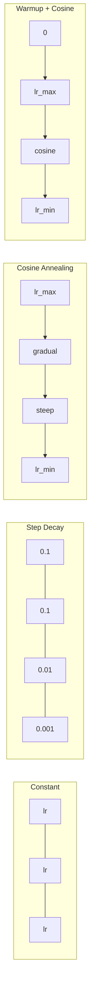
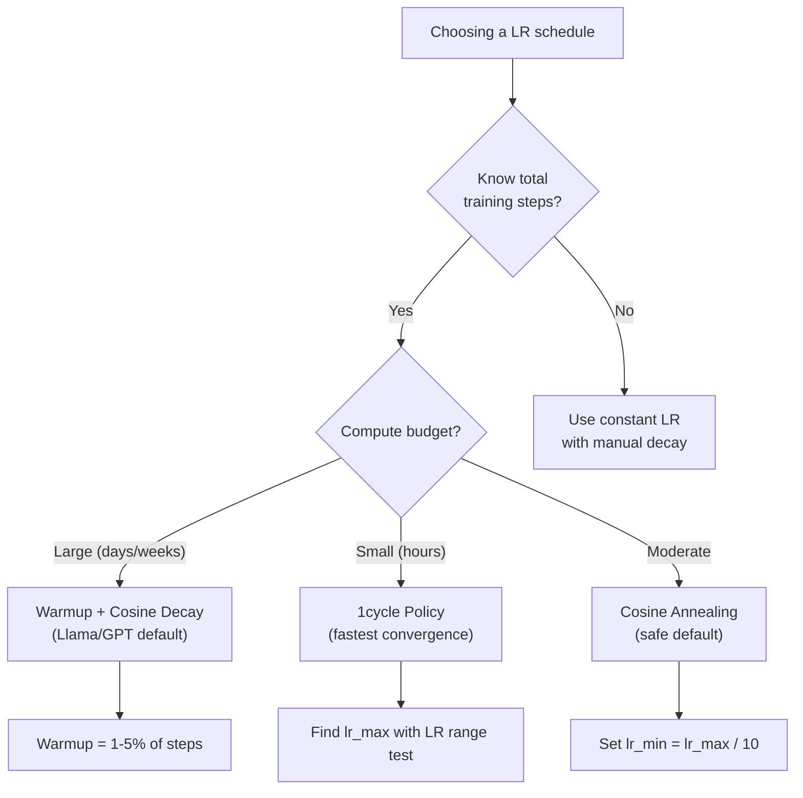
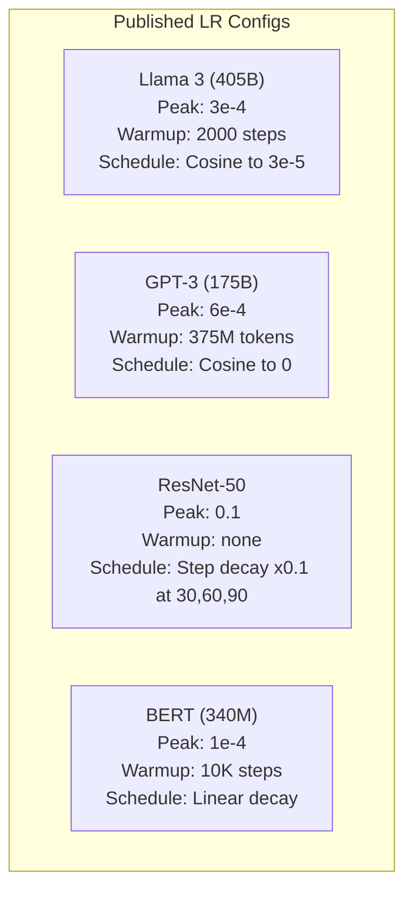

# Öğrenme oranı Programları ve ısınma

> Öğrenme hızı en önemli hiperparametre. Arsitür değil. Veriler kümesi boyutu değil. Aktiflik fonksiyonu değil. Öğrenme hızı.

> **【中文解读】**Öğrenme oranı en önemli süperparametridir. Yapı değil, veri miktarı değil, öğrenme oranı. Llama 3'ün zirve değerini lr=3e-4 + 2000 步 warmup + cosine decay olarak kullanır. GPT-3'ün lr=6e-4 +  θερμανlığı.

**Type:** Build
**Languages:** Python
**Prerequisites:** Lesson 03.06 (Optimizers), Lesson 03.08 (Weight Initialization)
**Time:** ~90 minutes

## Öğrenme hedefleri

- Sürekli, adım adım çöküş, cosine annealing, warmup + cosine ve 1 döngü öğrenme hızı programlarını sıfırdan uygulamak
- Öğrenme oranının seçimi için üç başarısızlık modunu gösterin: ayrım (çok yüksek), durgunluk (çok düşük) ve dalgalanma (kayıp yok)
- Adam'a dayalı optimizasyoncular için neden ısıtma gerekli olduğunu ve erken eğitimin nasıl istikrarlı olduğunu açıklayın
- Aynı görevdeki beş programın da birbiriyle yakınlaşma hızını karşılaştırın ve belirli bir eğitim bütçesi için uygun olanı seçin

> **【中文解读】**Bu bölümde beş farklı öğrenme oranı düzenlenmesi:恒定、阶梯衰减、余弦退火、warmup+余弦、1cycle 策略。现代大模型的标准配置是温暖的 (前 1-5% 步数线性升温) +宇宙衰退的 (kozsin çöküşü) 余弦衰减到接近零) ⋅ ⋅ ⇒ ⇒ ⇒ ⇒ ⇒ ⇒ ⇒ ⇒ ⇒ ⇒ ⇒ ⇒ ⇒ ⇒ ⇒ ⇒ ⇒ ⇒ ⇒ ⇒ ⇒ ⇒ ⇒ ⇒ ⇒ ⇒ ⇒ ⇒ ⇒ ⇒ ⇒ ⇒ ⇒ ⇒ ⇒ ⇒ ⇒ ⇒ ⇒ ⇒ ⇒ ⇒ ⇒ ⇒ ⇒ ⇒ ⇒ ⇒ ⇒ ⇒ ⇒ ⇒ ⇒ ⇒ ⇒ ⇒ ⇒ ⇒ ⇒ ⇒ ⇒ ⇒ ⇒ ⇒ ⇒ ⇒ ⇒ ⇒ ⇒ ⇒ ⇒ ⇒ ⇒ ⇒ ⇒ ⇒ ⇒ ⇒ ⇒ ⇒ ⇒ ⇒ ⇒ ⇒ ⇒ ⇒ ⇒ ⇒ ⇒ ⇒ ⇒ ⇒ ⇒ ⇒ ⇒ ⇒ ⇒ ⇒ ⇒ ⇒ ⇒ ⇒ ⇒ ⇒ ⇒ ⇒ ⇒ ⇒ ⇒ ⇒ ⇒ ⇒ ⇒ ⇒ ⇒ ⇒ ⇒ ⇒ ⇒ ⇒ ⇒ ⇒ ⇒ ⇒ ⇒ ⇒ ⇒ ⇒ ⇒ ⇒ ⇒ ⇒ ⇒ ⇒ ⇒ ⇒ ⇒ ⇒ ⇒ ⇒ ⇒ ⇒ ⇒ ⇒ ⇒ ⇒ ⇒ ⇒ ⇒ ⇒ ⇒ ⇒ ⇒ ⇒ ⇒ ⇒ ⇒ ⇒ ⇒ ⇒ ⇒ ⇒ ⇒ ⇒ ⇒ ⇒ ⇒ ⇒ ⇒ ⇒ ⇒ ⇒ ⇒ ⇒ ⇒                                                                          

## Sorunlar. Sorunlar.

Eğitim oranını 0.1'e ayarlayın. Eğitim ayrılır - kayıp 3 adımla sonsuzluğa atlar. 0.0001'e ayarlayın. Eğitim sürüklenir - 100 dönemden sonra model neredeyse rastgeleden geçmedi. 0.01'e ayarlayın. Eğitim 50 dönem boyunca çalışır, sonra kayıp asla ulaşamayacağı bir minimum etrafında dalga geçirir çünkü adımlar çok büyüktür.

> Bu süre içinde, öğrenme oranı 0.1 olarak belirlenir. Eğitim süreci 0.1 olarak belirlenir. Eğitim süreci 0.0001 olarak belirlenir. Eğitim süreci 0.01 olarak belirlenir. Eğitim süreci 0.01 olarak belirlenir. Eğitim süreci 50 olarak belirlenir.

Optimal öğrenme hızı sabit değildir. Eğitim sırasında değişir. Başta, büyük adımların toprağı hızlı bir şekilde kaplamasını istersin. Eğitimin sonuna kadar, küçük adımların keskin bir minimumda yerleşmesini istersin. 90% doğru bir model ile 95% doğru bir model arasındaki fark genellikle sadece programdır.

> En iyi öğrenme oranı bir adet değildir. Eğitim sürecinde değişir. İlk dönemlerde, büyük adımlar yapmak istersin.

Son üç yılda yayınlanan her büyük model öğrenme oranı çizelgesini kullanır. Llama 3 2000 ısınma adımları ile zirve lr = 3e-4 ve 3e-5'e kadar cosine çöküşünü kullanır. GPT-3 375 milyon tokenden fazla ısınma ile lr = 6e-4 kullanır. Bunlar keyfi olmayan seçimler değildir.

> 过去三年发表的每个主要模型都使用学习率调度──Llama 3 使用峰值 lr=3e-4,2000 步骤暖化 和余弦衰减至3e-5──GPT-3 使用 lr=6e-4,暖化 覆盖3.75 milyar token── bunlar istese de seçilmez── bunlar milyonlarca dolar harcadılar çok fazla süperparametre arama sonuçları──

Bu nedenle, programları anlamalısınız çünkü öntanımlı programlar sorununuz için işe yaramayacaktır. Önceden eğitilmiş bir modeli inceleme yaptığınızda, doğru program sıfırdan eğitimden farklıdır.

> Düzenleme programını anlamalısınız, çünkü öntanımlı değer sizin sorunuza uymamaktadır. Düzenleme modeli, başlangıç eğitiminden farklıdır.

> **【中文解读】**Öğrenme oranı çok yüksek →                                                                                                                                                                                                                                                           

> **【拓展：大模型的学习率配置】**Llama 3 405B: peak lr=3e-4, warmup=2000 步, cosine decay 到 3e-5, 训练 1.8T token。GPT-3 175B: peak lr=6e-4, warmup=375M token。BERT-base: peak lr=1e-4, warmup=10K 步, linear decay。规律:模型越大,学习率通常越小;预训比微调的学习率高 10-100 倍。

## Konsepten bir şey.

### Sürekli öğrenme oranı .

En basit yaklaşım, bir sayı seçip her adımda kullan.

> En basit yöntem. Bir rakam seç, her adımda kullan.

```
lr(t) = lr_0
```

Bu, eğitim sonuna kadar çok yüksek (minimum civarında kayganlık) veya başlangıç için çok düşük (küçük adımlarda boşa harcanmış hesaplama).

> 很少是最优的──要么对训练末期来说太高;;在极小值附近振荡),要么对训练初步来说太低;;微小步长浪费计算)──适用于小模型和调试──对训练超过一小时的任务来说是糟糕的选择──

### Adım Kırıklığı .

ResNet döneminden gelen eski okul yaklaşımı.

> ResNet 时代的老派方法── belirli bir dönemde öğrenme oranını bir faktörden düşürür (öntenlikle 10 kat)──

```
lr(t) = lr_0 * gamma^(floor(epoch / step_size))
```

Gamma = 0.1 ve step_size = 30'un anlamı: lr her 30 dönemde 10 kat düşüyor. ResNet-50 bunu kullanıyor -- lr = 0.1, 30, 60 ve 90 dönemlerde 10 kat düşüyor.

> gamma = 0.1 且 step_size = 30 anlamı: her 30 时代学习率降低10倍──ResNet-50 kullanmış bu lr=0.1,30、60 和 90 时代各降低10倍──

Sorun: optimal çöküş noktaları veri kümesine ve mimarlığa bağlıdır. Farklı bir soruna geçin ve düşme zamanı yeniden ayarlamanız gerekir. Değişiklikler ani bir şekilde gerçekleşir.

> 问题:最优衰减点取决于数据集和架构――另一个问题就需要重新调整何时降低――过渡是突然的学习率突然变化时损失可能升――

### Cosine Annealing.

En yüksek öğrenme hızından en azına doğru, cosine eğri boyunca düzgün bir çöküş:

> En büyük öğrenme oranından en az öğrenme oranının düzlemsiz düşüşüne kadar,余弦曲線'a uyun:

```
lr(t) = lr_min + 0.5 * (lr_max - lr_min) * (1 + cos(pi * t / T))
```

Burada t mevcut adım ve T toplam adım sayısıdır.

> T'in içinde mevcut adım sayısı, T'in içinde tüm adım sayısı vardır.

t=0, kozin terimi 1'dir, bu nedenle lr = lr_max. t=T'de, kozin terimi -1, bu nedenle lr = lr_min.

> t=0 时,余弦项为1,所以 lr = lr_max──t=T 时,余弦项为 -1,所以 lr = lr_min──衰减开始平缓,中间加速,末期又变平缓──

Bu, çoğu modern eğitim için varsayılan standart. lr_max ve lr_min'in ötesinde ayarlanacak hiperparametre yoktur. Kosinus şekli, çoğu öğrenmenin eğitimin ortasında gerçekleşeceği empiriyel gözlemle uyuyor. Bu kritik dönemde makul adım boyutlarını istiyorsunuz.

> Bu, çoğu modern eğitim programının öntanımlı seçeneği. Lr_max ve lr_min hariç, dıştan herhangi bir düzeltme gerektirmez.

### Neden Küçük Başlayın                                                                                                                                                                                                                                                                                                                                                                                                                                                                                                                          

Adam ve diğer uyarlayıcı optimizörler gradient ortalama ve varyansın çalışkan tahminlerini sürdürürler. 0 adımda bu tahminler sıfıra initialize edilir. İlk birkaç gradient güncelleştirmesi çöp istatistiklerine dayanır. Eğer bu dönemde öğrenme hızınız büyükse, model büyük, kötü yönlendirilmiş adımlar atar.

> Adam ve diğer özdeyiş optimizerlerinin ortalama ve ortalama farkı çalışma tahminleri. 0'cu aşamada, bu tahminler sıfır olarak başlangıç yapılmıştır.

Warmup bunu düzeltir. Küçük bir öğrenme hızıyla başlayın (sık sık lr_max / warmup_steps veya hatta sıfır) ve ilk N adımlar boyunca lineer olarak lr_max'e yükseltsin. Tam öğrenme hızına ulaştığınızda, Adam'ın istatistikleri istikrarlanmıştır.

>                                                                                                                                                                                                                                                               

```
lr(t) = lr_max * (t / warmup_steps)     for t < warmup_steps
```

Tipik ısınma: toplam eğitim adımlarının %1-5. Llama 3 yaklaşık 1.8 trilyon token için eğitim aldı ve 2000 adım için ısındı. GPT-3 375 milyon tokenden fazla ısındı.

> **【拓展：Warmup 的数学解释】**Adam'ın önyargısı düzeltmesi (m_hat = m_t / (1-beta1^t)) Önceki birkaç aşamada telafi eksikliği için. Örneğin, 1. aşamada m_1 = 0.1*gradient, ayırarak (1-0.9) = 0.1 doğru dereceli bir tahmin elde edilir.

### Hattı ısınma + kozmik çöküş 线性 ısınma + 余弦衰减

Modern standart, çizgi olarak yüksel, sonra da kosinus ile çürü.

```
if t < warmup_steps:
    lr(t) = lr_max * (t / warmup_steps)
else:
    progress = (t - warmup_steps) / (total_steps - warmup_steps)
    lr(t) = lr_min + 0.5 * (lr_max - lr_min) * (1 + cos(pi * progress))
```

Bu, Llama, GPT, PaLM ve çoğu modern transformatörün kullandığı bir yöntemdir.

> Bu Llama、GPT、PaLM 和大多数现代 Transformer 使用的方法──warmup 防止早期不稳定──余弦衰减使模型稳定到一个好的极小值──

### Bir döngü politikası

Leslie Smith'in keşfi (2018): eğitimin ilk yarısında öğrenme oranını düşük değerden yüksek değerlere yükseltmek, sonra ikinci yarıda geriye düşürmek.

> Leslie Smith'in bulguları (2018): Eğitimin ilk yarısında öğrenme oranı düşük değerden yüksek değerlere yükselmiş, ikinci yarıda tekrar düşmüştür.

Teorisi: yüksek öğrenme oranı, optimize trajektörüne gürültü ekleyerek düzenlendirme olarak hareket eder. Model, ramp-up aşamasında kayıp manzarasının daha fazlasını keşfeder ve daha iyi havuzlar bulur.

> 理論: Yüksek öğrenme oranı, iyileştirilmiş yollarla gürültü artışına doğrulaştırma etkisine ulaşır.

```
Phase 1 (0 to T/2):    lr ramps from lr_max/25 to lr_max
Phase 2 (T/2 to T):    lr ramps from lr_max to lr_max/10000
```

1cycle genellikle sabit bir hesaplama bütçesi için cosine annealing'den daha hızlı trenler.

> 1 döngü sabit hesaplama bütçesi altında genellikle öbür sinir geri dönüşü eğitimi daha hızlıdır.

> **【拓展：微调时的学习率策略】**微调预训练模型((((BERT、Llama gibi) 时,学习率通常比预训小 10-100倍。LoRA 微调 Llama:lr=2e-5~1e-4,warmup=总步数的3%,cosine decay。关键技巧:对不同层使用不同学习率底层(接近输入) 用更小的 lr(因为通用特征已经学好了),顶层(接近输出) 用更大的 lr因为需要适应新任务) PyTorch 通过参数组实现──

### Program şekilleri 调度形状对比



### Karar Akış Haritası



### Yayınlanmış Modellerden Gerçek Sayılar Yayınlanmış Modellerin Gerçek Parametri



## Yapın.
```figure
lr-schedule
```

## Yapın

> **【中文解读】**Aşağıda, sıfırdan beş farklı düzenleme stratejisini gerçekleştirmekle birlikte, aynı döngü ile veri kümesi eğitim ağının karşılaştırma sonuçlarını göstermek için deney yapılır: Yüksek öğrenme oranı, yayılmaya neden olur, düşük öğrenme oranı, durgunluğa neden olur, uygun düzenleme, eğitimin hızlı ve istikrarlı olmasına neden olur.

### Adım 1: Program Fonksiyonları.

Her fonksiyon mevcut adımları alır ve bu adımlarda öğrenme hızını iade eder.

> Her fonksiyon, önceki adım sayısını alır, bu adımın öğrenme oranına geri döner.

```python
import math


def constant_schedule(step, lr=0.01, **kwargs):
    return lr


def step_decay_schedule(step, lr=0.1, step_size=100, gamma=0.1, **kwargs):
    return lr * (gamma ** (step // step_size))


def cosine_schedule(step, lr=0.01, total_steps=1000, lr_min=1e-5, **kwargs):
    if step >= total_steps:
        return lr_min
    return lr_min + 0.5 * (lr - lr_min) * (1 + math.cos(math.pi * step / total_steps))


def warmup_cosine_schedule(step, lr=0.01, total_steps=1000, warmup_steps=100, lr_min=1e-5, **kwargs):
    if total_steps <= warmup_steps:
        return lr * (step / max(warmup_steps, 1))
    if step < warmup_steps:
        return lr * step / warmup_steps
    progress = (step - warmup_steps) / (total_steps - warmup_steps)
    return lr_min + 0.5 * (lr - lr_min) * (1 + math.cos(math.pi * progress))


def one_cycle_schedule(step, lr=0.01, total_steps=1000, **kwargs):
    mid = max(total_steps // 2, 1)
    if step < mid:
        return (lr / 25) + (lr - lr / 25) * step / mid
    else:
        progress = (step - mid) / max(total_steps - mid, 1)
        return lr * (1 - progress) + (lr / 10000) * progress
```

### Adım 2: Tüm programları görselleştir.

Her programın eğitim boyunca nasıl geliştiğini gösteren bir metin tabanlı tablo yazdırın.

> 印文圖表, göstermek için eğitim sürecinde her düzenlemenin gelişimi

```python
def visualize_schedule(name, schedule_fn, total_steps=500, **kwargs):
    steps = list(range(0, total_steps, total_steps // 20))
    if total_steps - 1 not in steps:
        steps.append(total_steps - 1)

    lrs = [schedule_fn(s, total_steps=total_steps, **kwargs) for s in steps]
    max_lr = max(lrs) if max(lrs) > 0 else 1.0

    print(f"\n{name}:")
    for s, lr_val in zip(steps, lrs):
        bar_len = int(lr_val / max_lr * 40)
        bar = "#" * bar_len
        print(f"  Step {s:4d}: lr={lr_val:.6f} {bar}")
```

### Adım 3: Eğitim ağı.

Bir çevrede iki katlı ağ, önceki derslerdeki gibi, ama şimdi programı değiştiriyoruz.

> Bu, önceki derslerle aynı, ancak şimdi düzenleme programını değiştirmişizdir.

```python
import random


def sigmoid(x):
    x = max(-500, min(500, x))
    return 1.0 / (1.0 + math.exp(-x))


def relu(x):
    return max(0.0, x)


def relu_deriv(x):
    return 1.0 if x > 0 else 0.0


def make_circle_data(n=200, seed=42):
    random.seed(seed)
    data = []
    for _ in range(n):
        x = random.uniform(-2, 2)
        y = random.uniform(-2, 2)
        label = 1.0 if x * x + y * y < 1.5 else 0.0
        data.append(([x, y], label))
    return data


def train_with_schedule(schedule_fn, schedule_name, data, epochs=300, base_lr=0.05, **kwargs):
    random.seed(0)
    hidden_size = 8
    total_steps = epochs * len(data)

    std = math.sqrt(2.0 / 2)
    w1 = [[random.gauss(0, std) for _ in range(2)] for _ in range(hidden_size)]
    b1 = [0.0] * hidden_size
    w2 = [random.gauss(0, std) for _ in range(hidden_size)]
    b2 = 0.0

    step = 0
    epoch_losses = []

    for epoch in range(epochs):
        total_loss = 0
        correct = 0

        for x, target in data:
            lr = schedule_fn(step, lr=base_lr, total_steps=total_steps, **kwargs)

            z1 = []
            h = []
            for i in range(hidden_size):
                z = w1[i][0] * x[0] + w1[i][1] * x[1] + b1[i]
                z1.append(z)
                h.append(relu(z))

            z2 = sum(w2[i] * h[i] for i in range(hidden_size)) + b2
            out = sigmoid(z2)

            error = out - target
            d_out = error * out * (1 - out)

            for i in range(hidden_size):
                d_h = d_out * w2[i] * relu_deriv(z1[i])
                w2[i] -= lr * d_out * h[i]
                for j in range(2):
                    w1[i][j] -= lr * d_h * x[j]
                b1[i] -= lr * d_h
            b2 -= lr * d_out

            total_loss += (out - target) ** 2
            if (out >= 0.5) == (target >= 0.5):
                correct += 1
            step += 1

        avg_loss = total_loss / len(data)
        accuracy = correct / len(data) * 100
        epoch_losses.append(avg_loss)

    return epoch_losses
```

### Dördüncü adım: Tüm programları karşılaştırın.

Her programla aynı ağı çalıştırın ve son kaybı ve dönüş davranışlarını karşılaştırın.

> Her düzenleme eğitimi ile bir ağ, son kaybı ve kazanç davranışını karşılaştırın.

```python
def compare_schedules(data):
    configs = [
        ("Constant", constant_schedule, {}),
        ("Step Decay", step_decay_schedule, {"step_size": 15000, "gamma": 0.1}),
        ("Cosine", cosine_schedule, {"lr_min": 1e-5}),
        ("Warmup+Cosine", warmup_cosine_schedule, {"warmup_steps": 3000, "lr_min": 1e-5}),
        ("1cycle", one_cycle_schedule, {}),
    ]

    print(f"\n{'Schedule':<20} {'Start Loss':>12} {'Mid Loss':>12} {'End Loss':>12} {'Best Loss':>12}")
    print("-" * 70)

    for name, schedule_fn, extra_kwargs in configs:
        losses = train_with_schedule(schedule_fn, name, data, epochs=300, base_lr=0.05, **extra_kwargs)
        mid_idx = len(losses) // 2
        best = min(losses)
        print(f"{name:<20} {losses[0]:>12.6f} {losses[mid_idx]:>12.6f} {losses[-1]:>12.6f} {best:>12.6f}")
```

### Adım 5: LR Çok Yüksek vs Çok Düşük .

Üç başarısızlık modunu gösterin: çok yüksek (ayrılık), çok düşük (crawling) ve doğru.

> 展示三种失败模式: 太高(发散) 太低(爬行) 刚好。

```python
def lr_sensitivity(data):
    learning_rates = [1.0, 0.1, 0.01, 0.001, 0.0001]

    print("\nLR Sensitivity (constant schedule, 100 epochs):")
    print(f"  {'LR':>10} {'Start Loss':>12} {'End Loss':>12} {'Status':>15}")
    print("  " + "-" * 52)

    for lr in learning_rates:
        losses = train_with_schedule(constant_schedule, f"lr={lr}", data, epochs=100, base_lr=lr)
        start = losses[0]
        end = losses[-1]

        if end > start or math.isnan(end) or end > 1.0:
            status = "DIVERGED"
        elif end > start * 0.9:
            status = "BARELY MOVED"
        elif end < 0.15:
            status = "CONVERGED"
        else:
            status = "LEARNING"

        end_str = f"{end:.6f}" if not math.isnan(end) else "NaN"
        print(f"  {lr:>10.4f} {start:>12.6f} {end_str:>12} {status:>15}")
```

## Çerçeveyi kullanın.

> **【中文解读】**PyTorch  15+ 种调度器提供──最常用的是CosineAnnealingLR 和 HuggingFace 的 get_cosine_schedule_with_warmup──微调预训练模型时,使用热升 = 总步数的 3-5% + cosine decay 是最安全的选择──

PyTorch , `torch.optim.lr_scheduler`- ...

```python
import torch
import torch.optim as optim
from torch.optim.lr_scheduler import CosineAnnealingLR, OneCycleLR, StepLR

model = nn.Sequential(nn.Linear(10, 64), nn.ReLU(), nn.Linear(64, 1))
optimizer = optim.Adam(model.parameters(), lr=3e-4)

scheduler = CosineAnnealingLR(optimizer, T_max=1000, eta_min=1e-5)

for step in range(1000):
    loss = train_step(model, optimizer)
    scheduler.step()
```

                                        `get_cosine_schedule_with_warmup`HuggingFace'dan:

> 对于热点 +余弦,使用 lambda 调度器或 HuggingFace 的 `get_cosine_schedule_with_warmup`- ...

```python
from transformers import get_cosine_schedule_with_warmup

scheduler = get_cosine_schedule_with_warmup(
    optimizer,
    num_warmup_steps=2000,
    num_training_steps=100000,
)
```

HuggingFace fonksiyonu, çoğu Llama ve GPT ince ayarlama senaryolarında kullanılan bir fonksiyondur.

> HuggingFace'nin işlevi en çok Llama ve GPT 微调脚本使用的──不确定时,使用暖化 +余弦,暖化为总步数的 3-5%──几乎适用于所有场景──

## İndirin . Ürünler .

Bu ders şunları ortaya çıkarır:
- `outputs/prompt-lr-schedule-advisor.md`- eğitim ayarınız için doğru öğrenme oranı programını ve hiperparametri öneren bir istek.

> 本课产 出:`outputs/prompt-lr-schedule-advisor.md`- Bir önerim doğru öğrenme oranı düzenleme ve süper parametre ipucu kelime

## Egzersizler.

1. Eksponansiyel bozulma uygulayın: lr(t) = lr_0 * gamma^t burada gamma = 0,999.

   1. 实现指数衰减:lr(t) = lr_0 * gamma^t, gamma = 0.999──在圆形数据集上和余弦退火对比──

2. Öğrenme hız aralığı testi uygulayın (Leslie Smith): LR'yi 1e-7'den 1'e artırken birkaç yüz adım için eğit.

   2. 实现学习率范围测试(Leslie Smith): 训练几百步,同时把LR从1e-7指数增加到1──绘制损失对 LR曲线──最优最大LR是损失 开始上升前的值──

3.                                                                                                                                                                                                                                                               

   3. 余弦 antrenmanı ile 长度:总步数的0%、1%、5%、10%、20%──

4. Sıcak yeniden başlatma ile kozin annealing uygulamak: öğrenme hızını her T adımında lr_max'e yeniden ayarlayın ve tekrar bozulun.

   4. 实现带热重启的余弦退火(SGDR): her T 步把学习率重置为 lr_max 并再次衰退──在更长的训练上和标准余弦对比──

5. Eğitim kaybını izleyen ve kaybı istikrarlı olduğunda otomatik olarak ısıtmadan cosine geçen ve kaybı çok uzun sürerse lr azaltan bir "şerur programı" oluşturun.

   5. 构建调度医生:监控训练损失,损失 稳定时自动变暖 转变到余弦,损失 停滞太久时降低 lr。

## Anahtar Şartlar .

| Term | What people say | What it actually means |
|------|----------------|----------------------|
| Learning rate | "How fast the model learns" | The scalar that multiplies the gradient to determine the parameter update size |
| Schedule | "Change the LR over time" | A function that maps training step to learning rate, designed to optimize convergence |
| Warmup | "Start with a small LR" | Linearly ramping the LR from near-zero to the target value over the first N steps to stabilize optimizer statistics |
| Cosine annealing | "Smooth LR decay" | Decreasing the LR following a cosine curve from lr_max to lr_min over training |
| Step decay | "Drop LR at milestones" | Multiplying the LR by a factor (usually 0.1) at fixed epoch intervals |
| 1cycle policy | "Up then down" | Leslie Smith's method of ramping LR up then down in a single cycle for faster convergence |
| LR range test | "Find the best learning rate" | Training briefly while increasing LR to find the value where loss starts diverging |
| Cosine with warm restarts | "Reset and repeat" | Periodically resetting the LR to lr_max and decaying again (SGDR) |
| Eta min | "The floor for the LR" | The minimum learning rate that the schedule decays to |
| Peak learning rate | "The maximum LR" | The highest LR reached during training, typically after warmup |

| 术语 | 俗称 | 实际含义 |
|------|------|---------|
| Learning rate / 学习率 | "模型学得多快" | 乘以梯度决定参数更新大小的标量 |
| Schedule / 调度 | "随时间变 LR" | 把训练步数映射到学习率的函数，旨在优化收敛 |
| Warmup / 预热 | "从小 LR 开始" | 在前 N 步把 LR 从近零线性升到目标值，稳定优化器统计 |
| Cosine annealing / 余弦退火 | "平滑 LR 衰减" | 训练中按余弦曲线从 lr_max 降到 lr_min |
| Step decay / 阶梯衰减 | "里程碑式降 LR" | 在固定 epoch 间隔把 LR 乘以一个因子（通常 0.1） |
| 1cycle policy / 1cycle 策略 | "先升后降" | Leslie Smith 的方法：单周期内先升 LR 后降，加速收敛 |
| LR range test / LR 范围测试 | "找最佳学习率" | 短训练中增加 LR，找到 loss 开始发散的点 |
| Cosine with warm restarts / 带热重启的余弦 | "重置并重复" | 周期性把 LR 重置为 lr_max 再次衰减（SGDR） |
| Eta min / 最小学习率 | "LR 的下限" | 调度衰减到的最小学习率 |
| Peak learning rate / 峰值学习率 | "最大 LR" | 训练期间达到的最高 LR，通常在 warmup 之后 |

## Daha fazla okumak

- Loshchilov & Hutter, "SGDR: Stochastic Gradient Descent with Warm Restarts" (2017) -- cosine annealing ve sıcak restarts tanıtıldı
  Loshchilov & Hutter,SGDR:带热重启的随机梯度下降(2017)引入余弦退火和热重启
- Smith, "Süper-Könüşüm: Büyük Öğrenme Sınıflarını Kullanarak Nöral Ağların Çok Hızlı Eğitimi" (2018) -- 1 döngü politika kağıdı
  Smith,超收: Using University习率快速训练神经网络(2018)1cycle 策略论文
- Touvron et al., "Llama 2: Open Foundation and Fine-Tuned Chat Models" (2023) -- ölçekte kullanılan ısınma + cosine programını belgelendirir
  Touvron  et al.,Llama 2: Open Basis y Micro调聊天模型(2023) büyük çapta kullanım 余弦调度 + 余弦调度 kaydedildi
- Goyal et al., "Düzgün, Büyük Minibatch SGD: 1 Saatte Eğitim ImageNet" (2017) -- lineer ölçekleme kuralları ve büyük batch eğitim için ısınma
  Goyal 等人,精确大批量 SGD:1 小时训练 ImageNet(2017) 线性缩放规则和大批量训练的热升
