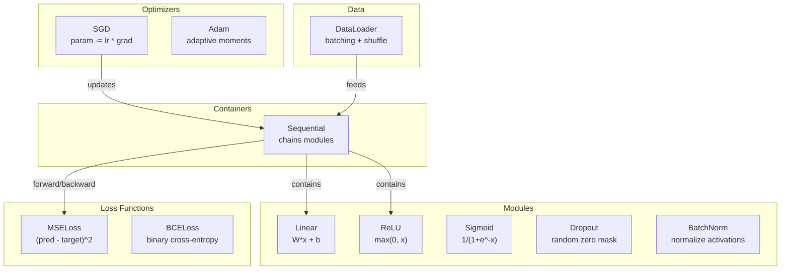
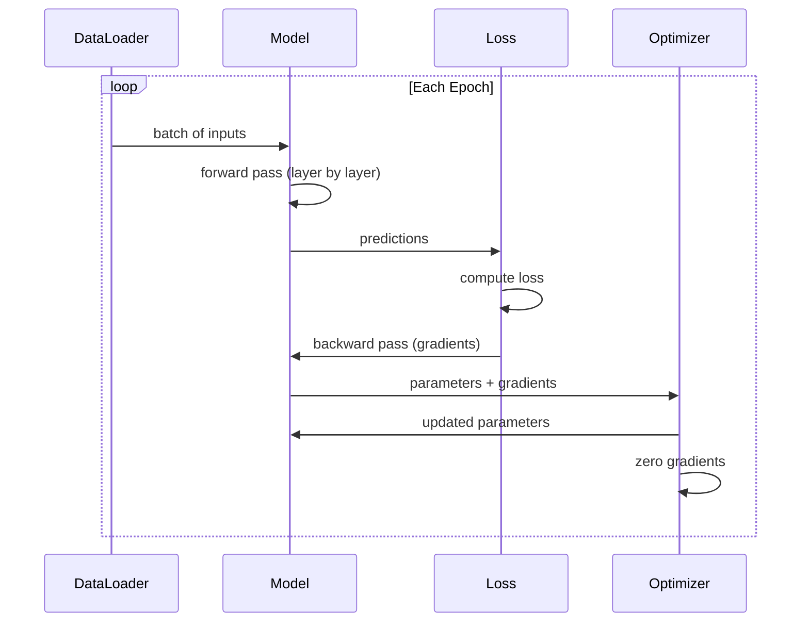
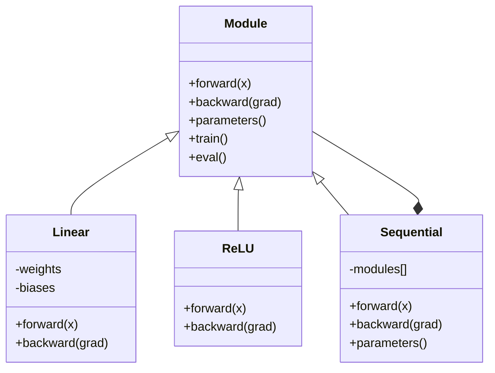

# Kendi Mini Çerçeve'nizi oluşturun. Kendi mini çerçeve'nizi oluşturun.

> Nöronları, katmanları, ağları, arka destekleri, aktivasyonları, kayb fonksiyonlarını, optimizerleri, düzenleme, başlangıç ve LR programlarını oluşturdun. Hepsi ayrı parçalar olarak. Şimdi onları bir çerçeveye bağla. PyTorch değil. TensorFlow değil.

> **【中文解读】**Önceki tüm derslerin konseptini bütünleştirmek için tam bir çerçeve oluşturmak: otomatik parçacık motor, çok katlı türler, optimizer, düzenleme, eğitim döngüsü.

**Type:** Build
**Languages:** Python
**Prerequisites:** All of Phase 03 (Lessons 01-09)
**Time:** ~120 minutes

## Öğrenme hedefleri

- Modül, Linear, ReLU, Sigmoid, Dropout, BatchNorm, Sequential, kayb fonksiyonları, optimizerler ve DataLoader ile tam bir derin öğrenme çerçevesini (~ 500 satır) oluşturun
- Modül soyutlamasını (yukarı, geri, parametreler) ve neden tren/eval modunun değiştirilmesi gerekliliğini açıklayın.
- Tüm bileşenleri, dört katmanlı bir ağı döngü sınıflandırması üzerine eğiten bir çalışma eğitim döngüsüne bağlayın
- Çerçevenin her bileşenini PyTorch eşdeğeri (nn.Module, nn.Sequential, optim.Adam, DataLoader) ile çiz.

> **【中文解读】**Bu bölüm, 3. aşamada bütün kavramları bir bütünlü ~500 行 çerçevesine çevirmek için bir bölümdür.

## Sorunlar. Sorunlar.

- 10 tane dersiniz var.`Value`Bir ağı eğitmek için beş farklı dersden kopya yapıştırıp elle birleştirirsin.

> On sınıfın yapı modülleri farklı dosyalarda yayılmış.`Value`Bir sınıf, orada bir eğitim döngüsü, diğer dosya ise ağırlık başlangıcı, diğerinde öğrenme oranı düzenlemesi vardır. Bir ağı eğitmek için 5-6 farklı dersden kopyalama yapıştırma ve elden birleştirme gerekir.

PyTorch size bu konuda bir çözüm sunuyor.`nn.Module`- Evet .`nn.Sequential`- Evet .`optim.Adam`- Evet .`DataLoader`TensorFlow size birleştirir.`keras.Layer`- Evet .`keras.Sequential`- Evet .`keras.optimizers.Adam`Bunlar sihir değil, her seferinde tesisatları yeniden icat etmeden ağları tanımlamanın, eğitmenin ve değerlendirmenin mümkün olduğunu sağlayan örgütleşim kalıpları.

> İşte bu çerçeve çözme sorunu.`nn.Module`- Evet.`nn.Sequential`- Evet.`optim.Adam`- Evet.`DataLoader`Ve onları bir araya getirir.`keras.Layer`- Evet.`keras.Sequential`- Evet.`keras.optimizers.Adam`Bunlar sihirli değillerdir. Bunlar örgütleme modelleri, her seferinde bir tür tüp yeniden geliştirmek zorunda kalmadan, ağları tanımlamanıza, eğitmenize ve değerlendirmenize izin verirler.

Python'un 500 satırında aynı şeyi yapacaksınız. Numpy yok. Dış bağımlılık yok. Herhangi bir feedforward ağı tanımlayabilen, SGD veya Adam ile eğitilebilen, verileri toplayabilen, çıkış ve parti normallaşımı uygulayabilen, herhangi bir etkinleştirmeyi kullanabilen ve öğrenme hızını planlayabilen bir çerçeve.

> Siz yaklaşık 500 行 Python ile aynı şeyi yapılandırırsınız. Numpy gerekmez. Dış bağımlılık yoktur. Bir önceki herhangi bir ağı tanımlayabilir. SGD veya Adam tarafından eğitilmiştir.

İşini bitirdiğinde, yazma sırasında ne olduğunu tam olarak anlayacaksın.`model = nn.Sequential(...)`Nedenini anlayacaksınız.`model.train()`ve `model.eval()`Neden olduğunu anlayacaksın.`optimizer.zero_grad()`Her şeyi anlayacaksın, çünkü sen hepsini inşa ettin.

> Bitirdikten sonra, PyTorch'da yazmayı tam olarak anlayacaksın.`model = nn.Sequential(...)`Ne oldu, sen de anlamış olacaksın.`model.train()`和 `model.eval()`Varlık varlık. Neden olduğunu anlayacaksın.`optimizer.zero_grad()`Bu sadece bir düzenlemedir. Her şeyi sen anlayacaksın. Çünkü sen her şeyi kendi kendine inşa ettin.

> **【中文解读】**框架的核心价值:把散落的组件统一到一个接口下――Module is everything's basisLinear、ReLU、Dropout、BatchNorm 都是Module──Sequential is组合模式一堆Module 串起还是一个Module──这与PyTorch的设计完全一致──

> **【拓展：PyTorch 框架的设计哲学】**PyTorch'in çekirdek tasarımı sadece 5 kavramdan ibarettir: Tensor (data) ̊nn.Module (model) ̊autograd (auto) ̊ Automatic micro) ̊ Optimizer (optimizer) ̊ Optimizer (optimizer) ̊ DataLoader (data load) ̊).

## Konsepten bir şey.

### Modül Abstraksiyonu Modül 抽象

PyTorch ' un her tabakası , `nn.Module`Modülün üç sorumluluğu vardır:

> PyTorch 中 每一层都继承自`nn.Module`❖ Bir Modül üç sorumluluk vardır:

1. **forward()**-- verilen girişlerin çıkışını hesaplayın
   **forward()**-- 给定输入计算输出
2. **parameters()**- ... bütün eğitimli ağırlıkları geri getir .
   **parameters()**-- 返回所有可训练权重
3. **backward()**-- hesaplama gradientleri (PyTorch'de otograd tarafından işlenir, bizimki açıkça)
   **backward()**-- 計算梯度(PyTorch 中由自格rad 处理, framework中显然实现的需要)

Bir Linear katman bir Modül. Bir ReLU etkinleştirme bir Modül. Bir düşüş katmanı bir Modül. Bir parti normallaştırma katmanı bir Modül. Hepsi aynı arayüzüne sahiptir.

> Linear 层 is a Module。ReLU 激活 is a Module。Dropout 层 is a Module。BatchNorm 层 is a Module。 bunların hepsi aynı bağlantılara sahiptir。

### Sequential Container Sequential Container

`nn.Sequential`Modüller. Önceki geçiş: Modül 1, sonra Modül 2, sonra Modül 3. Geri geçiş: zinciri tersine çevirin. konteyner kendisi bir Modül - ileriye (((), parametrelerine ((() ve geriye ((() sahiptir. Bu karmaşık örnektir: Modüller dizisi kendisi bir Modüldür.

> `nn.Sequential`Bu modülün bir parçasıdır. Bu modülün bir parçasıdır. Bu modülün bir parçasıdır.

> **【拓展：真实框架的额外功能】**Kendi kendine otomatik olarak otomatik olarak yazmak için elden yazmak gerekmiyor. 1) GPU desteği, 2) CUDA内存管理 ve kernel 调度.) 3) 分布式训练 (DDP、FSDP、DeepSpeed); 4) 混合精度训练 (AMP); 5) 模型序列化 (state_dict + save/load) ⋅ PyTorch'in kod kutubu 100 milyon satırdan fazla, ancak çekirdek çekim bu 5 satırın gerçekleştirdiğini gösteriyor.

### Eğitim vs. Değerlendirme Modu Eğitim ve değerlendirme Modu

İptal, eğitim sırasında rastgele nöronları sıfırlıyor, ancak değerlendirme sırasında her şeyi geçer.`train()`ve `eval()`Bu davranışları değiştirmek için kullanılan yöntemler.`training`Bayrak.

> Eğitim sırasında düşüş, nefesleri sıfırdan çıkarır, ancak değerlendirme sırasında tüm geçiyor.`train()`和 `eval()`Bu davranışı değiştirmek için bir yöntem var.`training`- Evet.

### Optimizer.

Optimizer, parametreleri gradientlerini kullanarak güncelleyecektir.`param -= lr * grad`Adam: momentum ve varyansa tahminlerini korur, sonra güncelleştirir. Optimizer ağ mimarisini bilmiyor - sadece parametre ve gradientlerinin düz bir listesini görür.

> 优化器用梯度更新参数──SGD:`param -= lr * grad`❖ Adam:维护动量和方差估算后再更新──优化器 net yapı bilmez sadece 平的参数列表和它们的梯度──

### Veri yükleyici

Batchleme iki nedenden dolayı önemlidir. Birincisi, büyük sorunlar için tüm veri kümesini hafıza içine yerleştiremezsiniz. İkincisi, mini-batch gradient düşüşü yerel minimumlardan kaçmaya yardımcı olan gürültü sağlar. DataLoader verileri partilere ayırır ve seçeneğiyle dönemler arasında karıştırır.

> Bölümsel önemli nedenler vardır. Birincisi, büyük sorunun tüm veri kümesi kaydedilmemektedir.

> **【拓展：DataLoader 在大模型训练中的演进】**PyTorch'ın DataLoader is单机的. 大模型训练需要分布式 DataLoader:(1) WebDataset, akış yükleme TB 级数据;(2) Meta'nın SPDL (Streaming Parallel Data Loader) 支持从S3/GCS 直接流式加载;(3) HuggingFace dataset 库使用内存映射文件处理超大数据集──Llama 3'ün eğitimleri

### Çerçeve mimarisi.



### Eğitim Çemberleri Eğitim Çemberleri



### Modül Hierarşi .



## Yapın.

> **【中文解读】**Aşağıda sırayla yapılandırma çerçevesinin her bileşimi:Module 基类 → Sınırlı 层 → 激活函数 → Dropout → BatchNorm → Sequential 容器 → 损失函数 → 优化器 → DataLoader → 完整训练循环──PyTorch'ın bir çekirdek sınıfına karşı her adım
```figure
gradient-clipping
```

## Yapın

### Adım 1: Modül Üssü Sınıf

Her katmanın uyguladığı soyut bir arayüz.

> Her aşama gerçekleşmiş bir çekim bağlantısı.

```python
class Module:
    def __init__(self):
        self.training = True

    def forward(self, x):
        raise NotImplementedError

    def backward(self, grad):
        raise NotImplementedError

    def parameters(self):
        return []

    def train(self):
        self.training = True

    def eval(self):
        self.training = False
```

### Adım 2: Düz Layer.

Temel yapı taşı. Ağırlıkları ve tarafsızlıkları depolar, Wx + b'yi ileriye ve ağırlık / giriş gradiyentilerini geriye hesaplar.

> 基本构建块──存储权重和偏置,前向计算 Wx + b,反向计算权重/输入梯度──

> Düzsel 层是 PyTorch `nn.Linear`Yazdırma: için her output neyron i, hesaplama`sum(W[i][j] * x[j]) + b[i]`◊ ⇒ ⇒ ⇒ ⇒ ⇒ ⇒ ⇒ ⇒ ⇒ ⇒ ⇒ ⇒ ⇒ ⇒ ⇒ ⇒ ⇒ ⇒ ⇒ ⇒ ⇒ ⇒ ⇒ ⇒ ⇒ ⇒ ⇒ ⇒ ⇒ ⇒ ⇒ ⇒ ⇒ ⇒ ⇒ ⇒ ⇒ ⇒ ⇒ ⇒ ⇒ ⇒ ⇒ ⇒ ⇒ ⇒ ⇒ ⇒ ⇒ ⇒ ⇒ ⇒ ⇒ ⇒ ⇒ ⇒ ⇒ ⇒ ⇒ ⇒ ⇒ ⇒ ⇒ ⇒ ⇒ ⇒ ⇒ ⇒ ⇒ ⇒ ⇒ ⇒ ⇒ ⇒ ⇒ ⇒ ⇒ ⇒ ⇒ ⇒ ⇒ ⇒ ⇒ ⇒ ⇒ ⇒ ⇒ ⇒ ⇒ ⇒ ⇒ ⇒ ⇒ ⇒ ⇒ ⇒ ⇒ ⇒ ⇒ ⇒ ⇒ ⇒  ⇒ ⇒ ⇒   ⇒  ⇒   ⇒    ⇒     ⇒ ⇒                 ⇒                                                                                                                                                                                                                                                               `grad[i] * input[j]`, giriş derecesi `grad[i] * W[i][j]`△ dikkat fan_in 维度初始化用 Kaiming(`std = sqrt(2/fan_in)`),适配 ReLU¬¬¬¬¬¬¬¬¬¬¬¬¬¬¬¬¬¬¬¬¬¬¬¬¬¬¬¬¬¬¬¬¬¬¬¬¬¬¬¬¬¬¬¬¬¬¬¬¬¬¬¬¬¬¬¬¬¬¬¬¬¬¬¬¬¬¬¬¬¬¬¬¬¬¬¬¬¬¬¬¬¬¬¬¬¬¬¬¬¬¬¬¬¬¬¬¬¬¬¬¬¬¬¬¬¬¬¬¬¬¬¬¬¬¬¬¬¬¬¬¬¬¬¬¬¬¬¬¬¬¬¬¬¬¬¬¬¬¬¬¬¬¬¬¬¬¬¬¬¬¬¬¬¬¬¬¬¬¬¬¬¬¬¬¬¬¬¬¬¬¬¬¬¬¬¬¬¬¬¬¬¬¬¬¬¬¬¬¬¬¬¬¬¬¬¬¬¬¬¬¬¬¬¬¬¬¬¬¬¬¬¬¬¬¬¬¬¬¬¬¬¬¬¬¬¬¬¬¬¬¬¬¬¬¬¬¬¬¬¬¬¬¬¬¬¬¬¬¬¬¬¬¬¬¬¬¬¬¬¬¬¬¬¬¬¬¬¬¬¬¬¬¬¬¬¬¬¬¬¬¬¬¬¬¬¬¬¬¬¬¬¬¬¬¬¬¬¬¬¬¬¬¬¬¬¬¬¬¬¬¬¬¬¬¬¬¬¬¬¬¬¬¬¬¬¬¬¬¬¬¬¬¬¬¬¬¬¬¬¬¬¬¬¬¬¬¬¬¬¬¬¬¬¬¬¬¬¬¬¬¬¬¬¬¬¬¬¬¬¬¬¬¬¬¬¬¬¬¬¬¬¬¬¬¬¬¬¬¬¬¬¬¬¬¬¬¬¬¬¬¬¬¬¬¬¬¬¬¬¬¬¬¬¬¬¬¬¬¬¬¬¬¬¬¬¬¬¬¬¬¬¬¬¬¬¬¬¬¬¬¬¬¬¬¬¬¬¬¬¬¬¬¬¬¬¬¬¬¬¬¬¬¬¬¬¬¬¬¬¬¬¬¬¬¬¬¬¬¬¬¬¬¬¬¬¬¬¬¬¬¬¬¬¬¬¬¬¬¬¬¬¬¬¬

```python
import math
import random


class Linear(Module):
    def __init__(self, fan_in, fan_out):
        super().__init__()
        std = math.sqrt(2.0 / fan_in)
        self.weights = [[random.gauss(0, std) for _ in range(fan_in)] for _ in range(fan_out)]
        self.biases = [0.0] * fan_out
        self.weight_grads = [[0.0] * fan_in for _ in range(fan_out)]
        self.bias_grads = [0.0] * fan_out
        self.fan_in = fan_in
        self.fan_out = fan_out
        self.input = None

    def forward(self, x):
        self.input = x
        output = []
        for i in range(self.fan_out):
            val = self.biases[i]
            for j in range(self.fan_in):
                val += self.weights[i][j] * x[j]
            output.append(val)
        return output

    def backward(self, grad):
        input_grad = [0.0] * self.fan_in
        for i in range(self.fan_out):
            self.bias_grads[i] += grad[i]
            for j in range(self.fan_in):
                self.weight_grads[i][j] += grad[i] * self.input[j]
                input_grad[j] += grad[i] * self.weights[i][j]
        return input_grad

    def parameters(self):
        params = []
        for i in range(self.fan_out):
            for j in range(self.fan_in):
                params.append((self.weights, i, j, self.weight_grads))
            params.append((self.biases, i, None, self.bias_grads))
        return params
```

### Adım 3: Aktiflik Modüleri.

ReLU, Sigmoid ve Tanh modüller olarak, her biri geriye geçiş için gerekenleri saklar.

> ReLU、Sigmoid 和 Tanh 作为模块──每个缓存反向传播所需的信息──

```python
class ReLU(Module):
    def __init__(self):
        super().__init__()
        self.mask = None

    def forward(self, x):
        self.mask = [1.0 if v > 0 else 0.0 for v in x]
        return [max(0.0, v) for v in x]

    def backward(self, grad):
        return [g * m for g, m in zip(grad, self.mask)]


class Sigmoid(Module):
    def __init__(self):
        super().__init__()
        self.output = None

    def forward(self, x):
        self.output = []
        for v in x:
            v = max(-500, min(500, v))
            self.output.append(1.0 / (1.0 + math.exp(-v)))
        return self.output

    def backward(self, grad):
        return [g * o * (1 - o) for g, o in zip(grad, self.output)]


class Tanh(Module):
    def __init__(self):
        super().__init__()
        self.output = None

    def forward(self, x):
        self.output = [math.tanh(v) for v in x]
        return self.output

    def backward(self, grad):
        return [g * (1 - o * o) for g, o in zip(grad, self.output)]
```

### Dördüncü adım: Çıkış Modülü.

Elemleri eğitim sırasında rastgele sıfırlıyor. kalan elementleri 1/(1-p) ile ölçeyor, böylece beklenen değerler aynı kalıyor.

> 訓練時随机将元素置零──按 1/(1-p) 縮小剩余元素,使期望值不变──评估时不做任何操作──

```python
class Dropout(Module):
    def __init__(self, p=0.5):
        super().__init__()
        self.p = p
        self.mask = None

    def forward(self, x):
        if not self.training:
            return x
        self.mask = [0.0 if random.random() < self.p else 1.0 / (1 - self.p) for _ in x]
        return [v * m for v, m in zip(x, self.mask)]

    def backward(self, grad):
        if self.mask is None:
            return grad
        return [g * m for g, m in zip(grad, self.mask)]
```

### Adım 5: BatchNorm Module.

Batçadaki özellikler için aktivasyonları sıfır ortalama ve birim varyansına normalleştirir.

> Aktif değerleri, bir grup arasındaki sıfır ortalama değer ve birimlik fark olarak birleştirmek için kullanılmaktadır.

```python
class BatchNorm(Module):
    def __init__(self, size, momentum=0.1, eps=1e-5):
        super().__init__()
        self.size = size
        self.gamma = [1.0] * size
        self.beta = [0.0] * size
        self.gamma_grads = [0.0] * size
        self.beta_grads = [0.0] * size
        self.running_mean = [0.0] * size
        self.running_var = [1.0] * size
        self.momentum = momentum
        self.eps = eps
        self.x_norm = None
        self.std_inv = None
        self.batch_input = None

    def forward_batch(self, batch):
        batch_size = len(batch)
        output_batch = []

        if self.training:
            mean = [0.0] * self.size
            for sample in batch:
                for j in range(self.size):
                    mean[j] += sample[j]
            mean = [m / batch_size for m in mean]

            var = [0.0] * self.size
            for sample in batch:
                for j in range(self.size):
                    var[j] += (sample[j] - mean[j]) ** 2
            var = [v / batch_size for v in var]

            self.std_inv = [1.0 / math.sqrt(v + self.eps) for v in var]

            self.x_norm = []
            self.batch_input = batch
            for sample in batch:
                normed = [(sample[j] - mean[j]) * self.std_inv[j] for j in range(self.size)]
                self.x_norm.append(normed)
                output = [self.gamma[j] * normed[j] + self.beta[j] for j in range(self.size)]
                output_batch.append(output)

            for j in range(self.size):
                self.running_mean[j] = (1 - self.momentum) * self.running_mean[j] + self.momentum * mean[j]
                self.running_var[j] = (1 - self.momentum) * self.running_var[j] + self.momentum * var[j]
        else:
            std_inv = [1.0 / math.sqrt(v + self.eps) for v in self.running_var]
            for sample in batch:
                normed = [(sample[j] - self.running_mean[j]) * std_inv[j] for j in range(self.size)]
                output = [self.gamma[j] * normed[j] + self.beta[j] for j in range(self.size)]
                output_batch.append(output)

        return output_batch

    def forward(self, x):
        result = self.forward_batch([x])
        return result[0]

    def backward(self, grad):
        if self.x_norm is None:
            return grad
        for j in range(self.size):
            self.gamma_grads[j] += self.x_norm[0][j] * grad[j]
            self.beta_grads[j] += grad[j]
        return [grad[j] * self.gamma[j] * self.std_inv[j] for j in range(self.size)]

    def parameters(self):
        params = []
        for j in range(self.size):
            params.append((self.gamma, j, None, self.gamma_grads))
            params.append((self.beta, j, None, self.beta_grads))
        return params
```

### Adım 6: Sequential Container.

Zincir modülleri. Önüne sola sağa gidiyor, geriye doğru sola gidiyor.

> 串联模块──前向左到右,反向右到左──

> Sequential 容器实现组合模式它本身是一个模块,但内部维护一个模块列表`train()`和 `eval()`递归调用每个子模块──`parameters()`聚合所有子模块的参数──--------------------------------------------------------------------------------------------------------------------------------------------------------------------------------------------------------------------------------------------------------------------------------------------------------------------------------------------------------------------------------------------------------------------------------------------------------------------------------------------------------------------------------------------------------------------------------------------------------------------------------------------------------------------------------------------------------------------------------------------------------------------------------------------------------------------------------------------------------------------------------------------------------------------------------------------------------------------------------------------------------------------------------------`nn.Sequential`Çevreyi açmak için.

```python
class Sequential(Module):
    def __init__(self, *modules):
        super().__init__()
        self.modules = list(modules)

    def forward(self, x):
        for module in self.modules:
            x = module.forward(x)
        return x

    def backward(self, grad):
        for module in reversed(self.modules):
            grad = module.backward(grad)
        return grad

    def parameters(self):
        params = []
        for module in self.modules:
            params.extend(module.parameters())
        return params

    def train(self):
        self.training = True
        for module in self.modules:
            module.train()

    def eval(self):
        self.training = False
        for module in self.modules:
            module.eval()
```

### Adım 7: Fonksiyon kaybı.

MSE ve Binary Cross-Entropy. Her biri kayıp değerini iade eder ve gradiyenti iade eden bir geriye doğru (() sağlar.

> MSE 和二元交叉──每回损失值,并提供回归梯度的倒退 (MSE 和二元交叉──) 方法──

> 損失 işlevi, antrenman döngüsünün başlangıç noktasıdır                                                                                                                                                                                                                                                                                                                                                                                                                                                                                                             `2 * (pred - target) / n`,BCE'nin derecesi `(-target/p + (1-target)/(1-p)) / n`注意 BCE 中要使用 eps 剪剪防止 log ((0) 

```python
class MSELoss:
    def __call__(self, predicted, target):
        self.predicted = predicted
        self.target = target
        n = len(predicted)
        self.loss = sum((p - t) ** 2 for p, t in zip(predicted, target)) / n
        return self.loss

    def backward(self):
        n = len(self.predicted)
        return [2 * (p - t) / n for p, t in zip(self.predicted, self.target)]


class BCELoss:
    def __call__(self, predicted, target):
        self.predicted = predicted
        self.target = target
        eps = 1e-7
        n = len(predicted)
        self.loss = 0
        for p, t in zip(predicted, target):
            p = max(eps, min(1 - eps, p))
            self.loss += -(t * math.log(p) + (1 - t) * math.log(1 - p))
        self.loss /= n
        return self.loss

    def backward(self):
        eps = 1e-7
        n = len(self.predicted)
        grads = []
        for p, t in zip(self.predicted, self.target):
            p = max(eps, min(1 - eps, p))
            grads.append((-t / p + (1 - t) / (1 - p)) / n)
        return grads
```

### Adım 8: SGD ve Adam Optimizerleri

Her ikisi de bir parametre listesini alır ve gradientleri kullanarak ağırlıkları güncelleir.

> 两者都接收参数列表,使用梯度更新权重──

> SGD 简单:参数 -= 学习率 × 梯度。Adam 维护一阶矩 m 和二阶矩 v,加上偏差修正(前几步梯度估计有偏差), sonuç çoğunluk görevlerinde SGD。AdamW 在 Adam 基础上加解权重衰减。参数 listedeki her element is (容器, i, j, 梯度容器) 四组,j=None元表示偏置(一维)。

```python
class SGD:
    def __init__(self, parameters, lr=0.01):
        self.params = parameters
        self.lr = lr

    def step(self):
        for container, i, j, grad_container in self.params:
            if j is not None:
                container[i][j] -= self.lr * grad_container[i][j]
            else:
                container[i] -= self.lr * grad_container[i]

    def zero_grad(self):
        for container, i, j, grad_container in self.params:
            if j is not None:
                grad_container[i][j] = 0.0
            else:
                grad_container[i] = 0.0


class Adam:
    def __init__(self, parameters, lr=0.001, beta1=0.9, beta2=0.999, eps=1e-8):
        self.params = parameters
        self.lr = lr
        self.beta1 = beta1
        self.beta2 = beta2
        self.eps = eps
        self.t = 0
        self.m = [0.0] * len(parameters)
        self.v = [0.0] * len(parameters)

    def step(self):
        self.t += 1
        for idx, (container, i, j, grad_container) in enumerate(self.params):
            if j is not None:
                g = grad_container[i][j]
            else:
                g = grad_container[i]

            self.m[idx] = self.beta1 * self.m[idx] + (1 - self.beta1) * g
            self.v[idx] = self.beta2 * self.v[idx] + (1 - self.beta2) * g * g

            m_hat = self.m[idx] / (1 - self.beta1 ** self.t)
            v_hat = self.v[idx] / (1 - self.beta2 ** self.t)

            update = self.lr * m_hat / (math.sqrt(v_hat) + self.eps)

            if j is not None:
                container[i][j] -= update
            else:
                container[i] -= update

    def zero_grad(self):
        for container, i, j, grad_container in self.params:
            if j is not None:
                grad_container[i][j] = 0.0
            else:
                grad_container[i] = 0.0
```

### Adım 9: DataLoader.

Verileri seriye ayırır, her dönemleri seçeneğiyle karıştırır.

> Verileri bölmek için her dönemden bir seçim yapılır.

```python
class DataLoader:
    def __init__(self, data, batch_size=32, shuffle=True):
        self.data = data
        self.batch_size = batch_size
        self.shuffle = shuffle

    def __iter__(self):
        indices = list(range(len(self.data)))
        if self.shuffle:
            random.shuffle(indices)
        for start in range(0, len(indices), self.batch_size):
            batch_indices = indices[start:start + self.batch_size]
            batch = [self.data[i] for i in batch_indices]
            inputs = [item[0] for item in batch]
            targets = [item[1] for item in batch]
            yield inputs, targets

    def __len__(self):
        return (len(self.data) + self.batch_size - 1) // self.batch_size
```

### Adım 10: Dört katmanlı bir ağı döngü sınıflandırması üzerine eğitmek.

Bir model tanımla, bir kayıp seç, bir optimizer seç, eğitim döngüsünü çalıştır.

> Tüm bunları bir araya getirmek, model tanımlamak, kayıp işlevi seçmek, optimizer seçmek, çalışma eğitim döngüsü seçmek.

> 訓練循环的標準模式:每个时代 遍历所有批次中:(1) sıfır_grad 清零梯度;(2) ileri 前向计算预测;(3) 计算损失;(4) geriye反向传播梯度;(5) optimizer.step() 更新参数。圆形分类任务:点是 (x, y),标签是 x2+y2<1.5 → 1,否则 0。

```python
def make_circle_data(n=500, seed=42):
    random.seed(seed)
    data = []
    for _ in range(n):
        x = random.uniform(-2, 2)
        y = random.uniform(-2, 2)
        label = 1.0 if x * x + y * y < 1.5 else 0.0
        data.append(([x, y], [label]))
    return data


def train():
    random.seed(42)

    model = Sequential(
        Linear(2, 16),
        ReLU(),
        Linear(16, 16),
        ReLU(),
        Linear(16, 8),
        ReLU(),
        Linear(8, 1),
        Sigmoid(),
    )

    criterion = BCELoss()
    optimizer = Adam(model.parameters(), lr=0.01)

    data = make_circle_data(500)
    split = int(len(data) * 0.8)
    train_data = data[:split]
    test_data = data[split:]

    loader = DataLoader(train_data, batch_size=16, shuffle=True)

    model.train()

    for epoch in range(100):
        total_loss = 0
        total_correct = 0
        total_samples = 0

        for batch_inputs, batch_targets in loader:
            batch_loss = 0
            for x, t in zip(batch_inputs, batch_targets):
                pred = model.forward(x)
                loss = criterion(pred, t)
                batch_loss += loss

                optimizer.zero_grad()
                grad = criterion.backward()
                model.backward(grad)
                optimizer.step()

                predicted_class = 1.0 if pred[0] >= 0.5 else 0.0
                if predicted_class == t[0]:
                    total_correct += 1
                total_samples += 1

            total_loss += batch_loss

        avg_loss = total_loss / total_samples
        accuracy = total_correct / total_samples * 100

        if epoch % 10 == 0 or epoch == 99:
            print(f"Epoch {epoch:3d} | Loss: {avg_loss:.6f} | Train Accuracy: {accuracy:.1f}%")

    model.eval()
    correct = 0
    for x, t in test_data:
        pred = model.forward(x)
        predicted_class = 1.0 if pred[0] >= 0.5 else 0.0
        if predicted_class == t[0]:
            correct += 1
    test_accuracy = correct / len(test_data) * 100
    print(f"\nTest Accuracy: {test_accuracy:.1f}% ({correct}/{len(test_data)})")

    return model, test_accuracy
```

## Çerçeveyi kullanın.

> **【中文解读】**Aşağıdaki PyTorch kodu ve senin küçük çerçeve yapısı tamamen uyumlu: Sequential、Linear、ReLU、Sigmoid、BCELoss、Adam、zero_grad、backward、step、train、eval。 tek fark PyTorch'ın otomatik otomatik hesaplama derecesini kullanmasıdır, ancak el yazmanız gerekir.

İşte şimdi inşa ettiğiniz PyTorch eşdeğeri:

> Aşağıda, yeni inşa ettiğiniz PyTorch ve diğer uygulamaların çerçevesidir:

> PyTorch'in `nn.Sequential`- Evet.`nn.Linear`- Evet.`nn.ReLU`- Evet.`nn.Sigmoid`- Evet.`nn.BCELoss`- Evet.`torch.optim.Adam`Küçük çerçeve ile en büyük farkı ise PyTorch'ın otomatik otomatik hesaplama derecesi ile yapılmasıdır.

```python
import torch
import torch.nn as nn
from torch.utils.data import DataLoader, TensorDataset

model = nn.Sequential(
    nn.Linear(2, 16),
    nn.ReLU(),
    nn.Linear(16, 16),
    nn.ReLU(),
    nn.Linear(16, 8),
    nn.ReLU(),
    nn.Linear(8, 1),
    nn.Sigmoid(),
)

criterion = nn.BCELoss()
optimizer = torch.optim.Adam(model.parameters(), lr=0.01)

for epoch in range(100):
    model.train()
    for inputs, targets in dataloader:
        optimizer.zero_grad()
        predictions = model(inputs)
        loss = criterion(predictions, targets)
        loss.backward()
        optimizer.step()

    model.eval()
    with torch.no_grad():
        test_predictions = model(test_inputs)
```

Yapı aynı.`Sequential`- Evet .`Linear`- Evet .`ReLU`- Evet .`Sigmoid`- Evet .`BCELoss`- Evet .`Adam`- Evet .`zero_grad`- Evet .`backward`- Evet .`step`- Evet .`train`- Evet .`eval`Her konsept bir-bir haritası yapar. Farklılık şu ki PyTorch otomatik olarak otogradı (her modülde geriye doğru uygulamanın gerekliliği yoktur) ele alır, GPU'da çalışır ve yıllardır optimize edilmiştir.

> 構造 tamamen aynı.`Sequential`- Evet.`Linear`- Evet.`ReLU`- Evet.`Sigmoid`- Evet.`BCELoss`- Evet.`Adam`- Evet.`zero_grad`- Evet.`backward`- Evet.`step`- Evet.`train`- Evet.`eval`△ her kavramın bir bir karşı karşılığı vardır. △ fark PyTorch otomatik işlem otomatik olarak yapılır.

PyTorch kodunu gördüğünüzde her satırda ne olduğunu tam olarak biliyorsunuz.

> Şimdi PyTorch kodunu gördüğünde, her satırda ne olduğunu gerçekten biliyorsun.

## İndirin . Ürünler .

Bu ders şunları ortaya çıkarır:
- `outputs/prompt-framework-architect.md`-- çerçeve soyutlamalarını kullanarak sinir ağ mimarlıklarını tasarlama için bir ipucu

> 本课产 出:`outputs/prompt-framework-architect.md`- bir çerçeve kullanma özet tasarım

> Bu tip kelimesi, LLM'yi görev özelliklerine göre yönlendirecektir. Bu tip deliller, giriş boyutları, çıkış türleri, veri miktarları ve bu tip deliller ile ilgili olarak, uygun bir ağ yapısı önerir.

## Egzersizler.

1. Bir ekle`SoftmaxCrossEntropyLoss`Sınıflar arasında sınıflandırma için sınıf. Yumuşak tahminleri artırın, çapraz entropi kaybını hesaplayın ve kombinasyon geriye geçiş yapın.

   1. 添加 `SoftmaxCrossEntropyLoss`类用于多类──对预测做软max,计算交叉损失,处理组合反向传播──在 3类螺旋数据集上测试──

2. Optimizer'de öğrenme hızının programlanmasını uygulayın: bir  ekleyin`set_lr()`9. Ders'ten sonra, sistem ve telin, cosine çizelgesinde kullanılır.

   2. Önemlendirme Aracında Öğrenme Rate Düzenlemesini Gerçekleştirmek: Ekle`set_lr()`方法,接入第9 课的余弦调度──用热点+余弦训练圆形分类器,与恒定 LR对比──

3. Bir ekle`save()`ve `load()`Sequential'e yöntemi tüm ağırlıkları bir JSON dosyasına seriye eder ve geri yükler.

   3. 给 序列加 `save()`和 `load()`方法, all rights re-sequerize to JSON file and load back. 方法, all rights re-sequerize to JSON file and load back. 方法, all rights re-sequerize to JSON file and load back. 方法, all rights re-sequerize to JSON file and load back. 方法, all rights re-sequerize to JSON file and load back. 方法, all rights re-sequerize to JSON 文件 and load. 方法, all rights re-sequerize to JSON 文件 and original model                                                                                                                                                                                                                                                                                                                                                                                    

4. Adam optimizerinde kilo kaybı (L2 düzenlenmesi) uygulayın.`weight_decay`Her adımda ağırlıkları sıfıra doğru küçültür.

   4. Adam 优化器中实现权重衰减 (L2) 正则化 (L2) 添加`weight_decay`参数, her adım ağırlığı sıfırdan küçültmek için.

5. Örnek başına yapılan eğitim döngüsünü uygun mini-batch gradient birikimi ile değiştirin: bir partideki tüm örnekler boyunca gradient birikimi yapın, sonra parti boyutuna bölün ve bir optimizer adımını atın. Bu, yakınlaşma hızı değiştirir mi ölçün.

   5. Doğru mini-batch 梯度累积替换每样训练循环: bir batch içinde tüm örneklerin 梯度lerini toplamak, sonra bir batch olarak ayırmak, bir kez optimization step in içine yapmak.

## Anahtar Şartlar .

| Term | What people say | What it actually means |
|------|----------------|----------------------|
| Module | "A layer" | The base abstraction in a framework -- anything with forward(), backward(), and parameters() |
| Sequential | "Stack layers in order" | A container that chains modules, applying them in sequence for forward and reverse for backward |
| Forward pass | "Run the network" | Computing the output by passing input through each module in order |
| Backward pass | "Compute gradients" | Propagating the loss gradient through each module in reverse to compute parameter gradients |
| Parameters | "The trainable weights" | All values in the network that the optimizer can update -- weights and biases |
| Optimizer | "The thing that updates weights" | An algorithm that uses gradients to update parameters, implementing SGD, Adam, or other rules |
| DataLoader | "The thing that feeds data" | An iterator that splits a dataset into batches, optionally shuffling between epochs |
| Training mode | "model.train()" | A flag that enables stochastic behavior like dropout and batch normalization with batch stats |
| Evaluation mode | "model.eval()" | A flag that disables dropout and uses running statistics for batch normalization |
| Zero grad | "Clear the gradients" | Resetting all parameter gradients to zero before computing the next batch's gradients |

| 术语 | 俗称 | 实际含义 |
|------|------|---------|
| Module / 模块 | "一层" | 框架中的基础抽象——任何有 forward()、backward()、parameters() 的对象 |
| Sequential / 顺序容器 | "按顺序叠层" | 一个把模块串联起来的容器，前向按顺序、反向按逆序 |
| Forward pass / 前向传播 | "跑网络" | 把输入依次通过每个模块计算输出 |
| Backward pass / 反向传播 | "算梯度" | 把损失梯度反向通过每个模块计算参数梯度 |
| Parameters / 参数 | "可训练权重" | 网络中优化器能更新的所有值——权重和偏置 |
| Optimizer / 优化器 | "更新权重的东西" | 用梯度更新参数的算法，实现 SGD、Adam 或其他规则 |
| DataLoader / 数据加载器 | "喂数据的东西" | 把数据集切成批次的迭代器，可选地在 epoch 间打乱 |
| Training mode / 训练模式 | "model.train()" | 启用 Dropout、BN 用 batch 统计等随机行为的标志 |
| Evaluation mode / 评估模式 | "model.eval()" | 关闭 Dropout、BN 用运行统计量的标志 |
| Zero grad / 清零梯度 | "清掉梯度" | 在计算下一批梯度前把所有参数梯度重置为零 |

## Daha fazla okumak

- Paszke et al., "PyTorch: Bir İmperatif Stylo, Yüksek Performanslı Derin Öğrenme Kütüphanesi" (2019) -- PyTorch'in tasarım kararlarını açıklayan makale
  Paszke 等人,PyTorch: a way of orderly style of high performance deep learning库(2019) describe PyTorch  design decision sınıfı
- Chollet, "Python ile Derin Öğrenme, İkinci Sürüm" (2021) -- 3. bölüm aynı modül/katman soyutlaması ile Keras içsellerini kapsar
  Chollet,Python derin öğrenme İkinci baskı (2021)第 3 bölüm aynı modül / kat katman soyutlama anlatımı Keras 内部机制
- Johnson, "Tiny-DNN" (https://github.com/tiny-dnn/tiny-dnn) -- sadece başlıklı bir C++ derin öğrenme çerçevesini çerçeve içsellerini anlamak için
  Johnson,Tiny-DNN C++ derin öğrenme çerçevesinin iç mekanizmasını anlamak için kullanılan bir saf başrak
