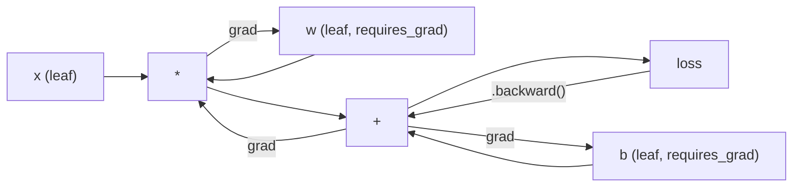
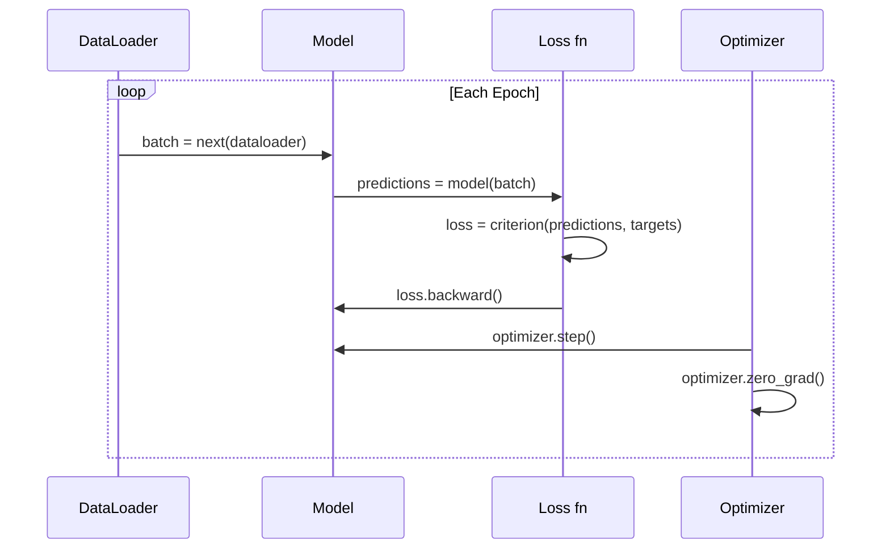

# PyTorch Giriş

> Motorları pistonlardan ve şarjlardan yaptın.

> **【中文解读】**Sizden sıfırdan yapılandırmışsınız tüm yapıların. Şimdi öğrenmek için kullanılıyor.

**Type:** Build
**Languages:** Python
**Prerequisites:** Lesson 03.10 (Build Your Own Mini Framework)
**Time:** ~75 minutes

## Öğrenme hedefleri

- PyTorch'ın nn.Module, nn.Sequential ve autograd kullanarak sinir ağlarını oluşturun ve eğitiniz
- PyTorch tensörleri, GPU hızlandırması ve standart eğitim döngüsünü kullanın (zero_grad, ileri, kayb, geri, adım)
- Yeriye mini çerçeve bileşenlerini PyTorch eşdeğerlerine dönüştürün
- Profil ve aynı görev için saf Python çerçevesiniz ve PyTorch arasındaki eğitim hızı karşılaştırın

> **【中文解读】**本章 迷你框架过渡到 PyTorch──核心对应关系:Module → nn.Module、手写倒退() → autograd、Python 循环 → GPU 并行──你已经在第10 课中理解底层原理,现在学习工业级实现──

## Sorunlar. Sorunlar.

İşleyen mini çerçeve var. Düz katman, ReLU, çıkış, seri norm, Adam, bir DataLoader, bir eğitim döngüsü. Temiz Python'da bir döngü sınıflandırma sorunu üzerinde 4 katmanlı bir ağı eğitir.

> Bir miniatür çerçeve var. Linear Layer, ReLU, dropout, batch integration, Adam, DataLoader, eğitim döngüsü.

Aynı sorunda PyTorch'tan 500 kat daha yavaş.

> Ama aynı sorunun üstesinden PyTorch'a göre 500 kat daha yavaş geliyor.

Mini çerçevenin bir anda bir örnekle bir örneği, örümlü Python döngüleri ile işliyor. PyTorch aynı işlemleri GPU'da çalışan optimize edilmiş C++/CUDA çekirdeklerine gönderir. Tek bir NVIDIA A100'de PyTorch, ResNet-50'i (parametri 25,6M) ImageNet'de (1.28M görüntü) yaklaşık 6 saatte eğitir.

> Bu işlemler, bir CPU'da çalıştırılırken, bir CPU'da çalıştırılır. Bu işlemler, bir CPU'da çalıştırılırken, bir CPU'da çalıştırılırken, bir CPU'da çalıştırılır.

Hız tek boşluk değildir. Çerçevenin GPU desteği yok. Otomatik farklılık yok - her modül için el yazmışsınız.

> 速度不是唯一差距──你的框架没有 GPU 支持──没有自动微分你为每块手写回后的()──没有序列化──没有分布式训练──没有混合精度──没有不用打印语句就能调试梯度流的方法──

PyTorch bu boşlukların her birini dolduruyor. ve bunu zaten inşa ettiğiniz aynı zihinsel modelde tutarak yapar: Modül, ileri(), parametreler(), geriye(), optimizer.step(). Anlaşmalar birbiri aktarılır. Sintaks neredeyse aynıdır. Fark şu ki PyTorch, sıfırdan tasarladığınız aynı arayüzün arkasında bir on yıllık sistem mühendisliği kapsıyor.

> PyTorch  tüm bu farkları doldurdu. Ayrıca, oluşturduğunuz tamamen aynı zihinsel modelde kalmıştır: Modül, ileriye, parametrelere, geriye, optimizeci adımlara, neredeyse aynı dil yöntemine sahip.

> **【中文解读】**PyTorch'tan daha yavaş 500 kat daha hızlı bir şekilde işlenir. Python'un her birini bir arada bir işlem yapması için, PyTorch'in C++/CUDA'da bir çekirdek işlem yapması gerekir.

> **【拓展：PyTorch 为什么赢了 TensorFlow】**2017 yılında PyTorch  yayımlandığında,TensorFlow  %80 pazar payını ele aldı. Ancak PyTorch'ın gayretli uygulanması( hemen gerçekleştirilmesini sağladı) Yapımcıların deneyimleri, geliştirme ve orijinal modellerin TF 1.x'ten daha uzak olması için basitleştirilmiştir.

## Konsepten bir şey.

## Konsepten bir şey.

### PyTorch neden kazandı PyTorch neden kazandı

TensorFlow'un 2015 yılında bir şey çalıştırmadan önce statik bir hesaplama grafiği tanımlamanızı istedi. Grafi oluşturdu, birleştirdi, sonra da veriyi içeri soktu. Debugging, grafik görselleştirmelerine bakmak anlamına geliyordu. Arsitekturayı değiştirmek, grafi sıfırdan yeniden inşa etmek anlamına geliyordu.

> 2015 yılında, TensorFlow                                                                                                                                                                                                                                                                                                                                                                                                                                                                                                                       

PyTorch 2017'de farklı bir felsefe ile başlatıldı: hevesli bir şekilde yürütülür. Python yazıyorsunuz. Hemen çalışır.`y = model(x)`Aslında şimdi y'yi hesaplıyor, "y'yi daha sonra hesaplayacak bir grafikte bir düğüm ekleme" değil. Bu, standart Python debugging araçları çalıştı demek. print() çalıştı. pdb çalıştı. if/else in your forward pass worked.

> PyTorch 2017 yılında başlatıldı, farklı felsefeyi benimsemiş:即时执行──你写 Python──它立即运行──`y = model(x)`Şimdi, "Y" yerine "Y" yazılmasını tercih eder.

Piytorch'un ML araştırma makalelerinde payı %7 (2017)'den %75'e (2022) yükseldi. Meta, Google DeepMind, OpenAI, Anthropic ve Hugging Face hepsi PyTorch'i ana çerçevesini kullanıyor. TensorFlow 2.x, PyTorch'un tasarımının doğru olduğunu sessiz kabul ederek, buna karşılık hevesli bir yürütme uyguladı.

> Piyasa 2020 yılına kadar cevap verdi. Python'un ML araştırma makalelerinde payı %7'den 2017'de %75'e kadar büyüdü.

Ders: Geliştiricilerin deneyimleri bileşikler. Her seferinde debug etmek için %10 daha yavaş ama %50 daha hızlı bir çerçeve kazanır.

> Öğrenim: Geliştiriciler deneyimler toplanır. Bir yavaş %10 ama bir düzene göre %50 çerçeve her zaman kazanır.

### Tensiyoncular 张量

Tensor, üç kritik özelliği olan çok boyutlu bir dizi: şekil, dtype ve cihaz.

> 张量是有三个关键属性多维数组:形状、数据类型和设备──

```python
import torch

x = torch.zeros(3, 4)           # shape: (3, 4), dtype: float32, device: cpu
x = torch.randn(2, 3, 224, 224) # batch of 2 RGB images, 224x224
x = torch.tensor([1, 2, 3])     # from a Python list
```

**Shape**Bir skalar şekil (), bir vektör (n), bir matris (m, n), bir görüntü parti (batch, kanallar, yüksekliği, genişliği).

> **Shape**△ △ △ △ △ △ △ △ △ △ △ △ △ △ △ △ △ △ △ △ △ △ △ △ △ △ △ △ △ △ △ △ △ △ △ △ △ △ △ △ △ △ △ △ △ △ △ △ △ △ △ △ △ △ △ △ △ △ △ △ △ △ △ △ △ △ △ △ △ △ △ △ △ △ △ △ △ △ △ △ △ △ △ △ △ △ △ △ △ △ △ △ △ △ △ △ △ △ △ △ △ △ △ △ △ △ △ △ △ △ △ △ △ △ △ △ △ △ △ △ △ △ △ △ △ △ △ △ △ △ △ △ △ △ △ △ △ △ △ △ △ △ △ △ △ △ △ △ △ △ △ △ △ △ △ △ △ △ △ △ △ △ △ △ △ △ △ △ △ △ △ △ △ △ △ △ △ △ △ △ △ △ △ △ △ △ △ △ △ △ △ △ △ △ △ △ △ △ △ △ △ △ △ △ △ △ △ △ △ △ △ △ △ △ △ △ △ △ △ △ △ △ △ △ △ △ △ △ △ △ △ △ △ △ △ △ △ 

**Dtype**Düzgünliği ve hafıza kontrolü.

> **Dtype**Kontrol etmem ve kaydetmem.

| dtype | Bits | Range | Use case |
|-------|------|-------|----------|
| float32 | 32 | ~7 decimal digits | Default training |
| float16 | 16 | ~3.3 decimal digits | Mixed precision |
| bfloat16 | 16 | Same range as float32, less precision | LLM training |
| int8 | 8 | -128 to 127 | Quantized inference |

**Device**hesaplamaların nerede olduğunu belirler.

> **Device**Ne olduğunu hesaplamak için karar ver.

```python
device = torch.device("cuda" if torch.cuda.is_available() else "cpu")
x = torch.randn(3, 4, device=device)
x = x.to("cuda")
x = x.cpu()
```

Her işlem aynı cihaza tüm tenzorları gerektirir.`RuntimeError: Expected all tensors to be on the same device`Hesaplama öncesi her şeyi aynı cihaze taşıyarak düzelt.

> Her işlem aynı cihazda tüm miktarları gerektirir. Bu ilk başlayanın ilk büyük PyTorch hatasıdır.`RuntimeError: Expected all tensors to be on the same device`                                                                                                                                                                                                                                                              

**Reshaping**sürekli zaman -- metadataları değiştirir, verileri değil.

> **重塑**Normal zaman işlemidir. Verileri değiştirir, değiştirmez.

```python
x = torch.randn(2, 3, 4)
x.view(2, 12)      # reshape to (2, 12) -- must be contiguous
x.reshape(6, 4)    # reshape to (6, 4) -- works always
x.permute(2, 0, 1) # reorder dimensions
x.unsqueeze(0)     # add dimension: (1, 2, 3, 4)
x.squeeze()        # remove size-1 dimensions
```

### Autograd otomatik olarak ayrılır.

PyTorch, tüm tensörler üzerinde yapılan her işlemini yönlendirilmiş bir asiklik grafiğe (sayım grafiği) kaydeder ve sonra bu grafiği tersine geçerek otomatik olarak gradiyenti hesaplar.

> Senin küçük çerçevesinde her modül için geriye doğru gerçekleştirmenizi gerektirir.



PyTorch, kaset tabanlı otomatik kaydetmeyi kullanır. Her işlem ileri geçiş sırasında bir "kasete" eklenir.`.backward()`Kaseti tersine çevirir.

> Çerçeveye dayalı otomatik bir parçayı kullanmak için PyTorch kullanılır.`.backward()`Karşıya geriye geriye geriye.

```python
x = torch.randn(3, requires_grad=True)
y = x ** 2 + 3 * x
z = y.sum()
z.backward()
print(x.grad)  # dz/dx = 2x + 3
```

Autograd'ın üç kuralı:

> Autograd'ın üç条规则:

1. Sadece  ile yaprak tenzorları`requires_grad=True`toplanan gradientler
   Çeviri: sadece ayarlandı`requires_grad=True`Yapacakları miktarı bir araya getirmek için
2. Gradyentler varsayılan olarak biriktirir -- çağrı `optimizer.zero_grad()`Her geriye geçmeden önce
   Çinçe Çevirimi: 梯度默认累积                                                                                                                                                                                                                                                                                                                                                                                                                                                                                                               `optimizer.zero_grad()`
3. `torch.no_grad()`gradient izlemesini engelleyebilir (değerlendirme sırasında kullanılır)
   Çeviri:`torch.no_grad()`禁用梯度追踪 (Hazırlama)

> **【拓展：混合精度训练如何加速】**A100/H100'in float16 吞吐量是 float32'in 2-4 倍──PyTorch'in `torch.amp.autocast`Otomatik olarak matç çarpma ve yuvarlak dönüşümü float16, aynı zamanda yumuşaklık ve kayıpları float32 üzerinde tutmak. GradScaler'ı birlikte kullanmak.

### Nörolojik ağ modülü

`nn.Module`PyTorch'in versiyonu, otomatik parametre kayıt, rekürsiv modül keşfi, cihaz yönetimi ve durum dikt serileştirimi ekler.

> `nn.Module`PyTorch'un versiyonu otomatik olarak birer parametreler kayıtlarını artırır, geri dönüştürücü modül keşiflerini, cihaz yönetimlerini ve devlet diyetleri sıralanmasını artırır.

```python
import torch.nn as nn

class MLP(nn.Module):
    def __init__(self, input_dim, hidden_dim, output_dim):
        super().__init__()
        self.layer1 = nn.Linear(input_dim, hidden_dim)
        self.relu = nn.ReLU()
        self.layer2 = nn.Linear(hidden_dim, output_dim)

    def forward(self, x):
        x = self.layer1(x)
        x = self.relu(x)
        x = self.layer2(x)
        return x
```

Bir görev verdiğinde`nn.Module`veya `nn.Parameter``__init__`PyTorch otomatik olarak kaydediyor.`model.parameters()`Bu yüzden mini çerçeve gibi ağırlıkları asla elden toplamak zorunda değilsiniz.

> Sen de varken`__init__`- Ben .`nn.Module`Ya da`nn.Parameter`-PyTorch'in kendiliğinden kayıtlı olması.`model.parameters()`Bu yüzden her kayıt için bir manuel toplama hakkı asla ihtiyacın olmayacak.

Ana yapı taşları:

> 关键构建块:

| Module | What it does | Parameters |
|--------|-------------|------------|
| nn.Linear(in, out) | Wx + b | in*out + out |
| nn.Conv2d(in_ch, out_ch, k) | 2D convolution | in_ch*out_ch*k*k + out_ch |
| nn.BatchNorm1d(features) | Normalize activations | 2 * features |
| nn.Dropout(p) | Random zeroing | 0 |
| nn.ReLU() | max(0, x) | 0 |
| nn.GELU() | Gaussian error linear | 0 |
| nn.Embedding(vocab, dim) | Lookup table | vocab * dim |
| nn.LayerNorm(dim) | Per-sample normalization | 2 * dim |

### Kayıp İşlevleri ve Optimizerleri

PyTorch, sizin inşa ettiğiniz her şeyin üretime hazır versiyonlarını gönderir.

> PyTorch, tüm yapılandırma işlevlerini üreten bir sürüm sağladı.

**Loss functions**(dan `torch.nn`):

> **损失函数**(Bundan geliyor)`torch.nn`):

| Loss | Task | Input |
|------|------|-------|
| nn.MSELoss() | Regression | Any shape |
| nn.CrossEntropyLoss() | Multi-class classification | Logits (not softmax) |
| nn.BCEWithLogitsLoss() | Binary classification | Logits (not sigmoid) |
| nn.L1Loss() | Regression (robust) | Any shape |
| nn.CTCLoss() | Sequence alignment | Log probabilities |

Not: `CrossEntropyLoss`birleşik `LogSoftmax`+ `NLLLoss`Bu, sessizce yanlış gradient üreten yaygın bir hata.

> Dikkat:`CrossEntropyLoss`İçeride bir araya geldi.`LogSoftmax`+ `NLLLoss`◊ ◊ ◊ ◊ ◊ ◊ ◊ ◊ ◊ ◊ ◊ ◊ ◊ ◊ ◊ ◊ ◊ ◊ ◊ ◊ ◊ ◊ ◊ ◊ ◊ ◊ ◊ ◊ ◊ ◊ ◊ ◊ ◊ ◊ ◊ ◊ ◊ ◊ ◊ ◊ ◊ ◊ ◊ ◊ ◊ ◊ ◊ ◊ ◊ ◊ ◊ ◊ ◊ ◊ ◊ ◊ ◊ ◊ ◊ ◊ ◊ ◊ ◊ ◊ ◊ ◊ ◊ ◊ ◊ ◊ ◊ ◊ ◊ ◊ ◊ ◊ ◊ ◊ ◊ ◊ ◊ ◊ ◊ ◊ ◊ ◊ ◊ ◊ ◊ ◊ ◊ ◊ ◊ ◊ ◊ ◊ ◊ ◊ ◊ ◊ ◊ ◊ ◊ ◊ ◊ ◊ ◊ ◊ ◊ ◊ ◊ ◊ ◊ ◊ ◊ ◊ ◊ ◊ ◊ ◊ ◊ ◊ ◊ ◊ ◊ ◊ ◊ ◊ ◊ ◊ ◊ ◊ ◊ ◊ ◊ ◊ ◊ ◊ ◊ ◊ ◊ ◊ ◊ ◊ ◊ ◊ ◊ ◊ ◊ ◊ ◊ ◊ ◊ ◊ ◊ ◊ ◊ ◊ ◊ ◊ ◊ ◊ ◊   ◊ ◊                                                                                                                                                                                  

**Optimizers**(dan `torch.optim`):

> **优化器**(Bundan geliyor)`torch.optim`):

| Optimizer | When to use | Typical LR |
|-----------|-------------|-----------|
| SGD(params, lr, momentum) | CNNs, well-tuned pipelines | 0.01--0.1 |
| Adam(params, lr) | Default starting point | 1e-3 |
| AdamW(params, lr, weight_decay) | Transformers, fine-tuning | 1e-4--1e-3 |
| LBFGS(params) | Small-scale, second-order | 1.0 |

### Eğitim Çemberinin Eğitim Çemberini

Her PyTorch eğitim döngüsü aynı 5 adımlı bir kalıp izler.

> Her PyTorch eğitim döngüsü aynı beş adımlı bir modelle uyar.



Kanonik örneği:

> 标准模式:

```python
for epoch in range(num_epochs):
    model.train()
    for inputs, targets in train_loader:
        inputs, targets = inputs.to(device), targets.to(device)
        optimizer.zero_grad()
        outputs = model(inputs)
        loss = criterion(outputs, targets)
        loss.backward()
        optimizer.step()
```

Bu, bir dizi metin, bir dizi metin, bir dizi metin, bir dizi metin, bir dizi metin, bir dizi metin, bir dizi metin, bir dizi metin, bir dizi metin, bir dizi metin, bir dizi metin, bir dizi metin, bir dizi metin, bir dizi metin, bir dizi metin, bir dizi metin, bir dizi metin, bir dizi metin, bir dizi metin, bir dizi metin, bir dizi metin, bir dizi metin, bir dizi metin, bir dizi metin, bir dizi metin, bir dizi metin, bir dizi metin, bir dizi metin, bir dizi metin, bir dizi metin, bir dizi metin, bir dizi metin, bir dizi metin, bir dizi metin, bir dizi metin, bir dizi metin, bir dizi metin, bir dizi metin, bir dizi metin, bir dizi metin, bir dizi metin, bir dizi metin, bir dizi metin, bir dizi metin, bir dizi metin, bir dizi metin, bir bir bir metin, bir metin, bir metin, bir metin, bir metin, bir metin, bir metin, bir metin, bir metin, bir metin, bir metin, bir metin, bir metin, bir metin, bir metin, bir metin, bir metin, bir metin, bir metin, bir metin, bir metin, bir metin, bir metin, bir metin, bir metin, bir metin, bir metin, bir metin, bir metin, bir metin, bir metin, bir metin, bir metin, bir metin, bir metin, bir metin, bir metin, bir metin, bir metin, bir metin, bir metin, bir metin, bir metin, bir metin, bir metin, bir metin, bir metin, bir metin, bir metin, bir metin, bir metin, bir metin, bir metin, bir metin, bir metin, bir metin, bir metin, bir metin, bir metin, bir metin, bir metin, bir metin, bir metin, bir metin, bir metin, bir metin, bir metin, bir metin, bir metin,

> 批量循环内五行代码──训练了 GPT-4、稳散和 LLaMA的五行代码──架构会变──数据会变──这五行不变──

### Veri kümesi ve veri yükleyici

PyTorch'in `Dataset`iki yöntemle bir soyut sınıf: `__len__`ve `__getitem__`- Evet .`DataLoader`serileme, karıştırma ve çok işlemli veri yükleme ile sarılır.

> PyTorch'in `Dataset`Bir çöp türü, iki yöntem vardır:`__len__`和 `__getitem__`- Evet.`DataLoader`Bu yüzden, bu işlemi yaparak, bu işlemi yaparak, bu işlemi yaparak, bu işlemi yaparak, bu işlemi yaparak, bu işlemi yaparak, bu işlemi yaparak, bu işlemi yaparak, bu işlemi yaparak, bu işlemi yaparak, bu işlemi yaparak, bu işlemi yaparak, bu işlemi yaparak, bu işlemi yaparak, bu işlemi yaparak, bu işlemi yaparak, bu işlemi yaparak, bu işlemi yaparak, bu işlemi yaparak, bu işlemi yaparak, bu işlemi yaparak, bu işlemi yaparak, bu işlemi yaparak, bu işlemi yaparak, bu işlemi yaparak, bu işlemi yaparak, bu işlemi yaparak, bu işlemi yaparak, bu işlemi yaparak, bu işlemi yaparak, bu işlemi yaparak, bu işlemi yaparak, bu işlemi yaparak, bu işlemi yaparak, bu işlemi yaparak, bu işlemi yaparak, bu işlemi yaparak,

```python
from torch.utils.data import Dataset, DataLoader

class MNISTDataset(Dataset):
    def __init__(self, images, labels):
        self.images = images
        self.labels = labels

    def __len__(self):
        return len(self.labels)

    def __getitem__(self, idx):
        return self.images[idx], self.labels[idx]

loader = DataLoader(dataset, batch_size=64, shuffle=True, num_workers=4)
```

`num_workers=4`GPU, mevcut partide çalışarak verileri paralel olarak yüklemek için 4 işlem oluşturur. Disk bağlı iş yüklerinde (büyük görüntüler, ses), bu tek başına eğitim hızı ikiye katlayabilir.

> `num_workers=4`产生 4 进程并行加载数据, GPU 当前批次上训练──在磁盘限量工作负载大图像、音频) 上, 只有一个项目就能使训练速度翻倍──

### GPU Eğitim GPU Eğitim

Bir modelin GPU'ya geçmesi:

> Model GPU'ya geçecek:

```python
device = torch.device("cuda" if torch.cuda.is_available() else "cpu")
model = model.to(device)
```

Bu, her parametreyi ve tamponu GPU'ya geri dönüşlü olarak taşıyor.

> Bu dönüşüm, her parametre ve buhur bölgesi GPU'ya taşınır.

```python
inputs, targets = inputs.to(device), targets.to(device)
```

**Mixed precision**modern GPU'larda (A100, H100, RTX 4090) hafıza kullanımını ikiye katlayarak ve ana ağırlıkları float32'de tutarken float16'da ileri/geri yürüterek geçiş hızını ikiye katlayarak:

> **混合精度**通過在 float16 中运行前向/反向传播,同时保持主权重在 float32 中,在现代 GPU(A100、H100、RTX 4090) 上将内存使用减半,吞吐量翻倍:

```python
from torch.amp import autocast, GradScaler

scaler = GradScaler()
for inputs, targets in loader:
    with autocast(device_type="cuda"):
        outputs = model(inputs)
        loss = criterion(outputs, targets)
    scaler.scale(loss).backward()
    scaler.step(optimizer)
    scaler.update()
    optimizer.zero_grad()
```

### Benzer: Mini Framework vs PyTorch vs JAX

| Feature | Mini Framework (L10) | PyTorch | JAX |
|---------|---------------------|---------|-----|
| Autodiff | Manual backward() | Tape-based autograd | Functional transforms |
| Execution | Eager (Python loops) | Eager (C++ kernels) | Traced + JIT compiled |
| GPU support | No | Yes (CUDA, ROCm, MPS) | Yes (CUDA, TPU) |
| Speed (MNIST MLP) | ~300s/epoch | ~0.5s/epoch | ~0.3s/epoch |
| Module system | Custom Module class | nn.Module | Stateless functions (Flax/Equinox) |
| Debugging | print() | print(), pdb, breakpoint() | Harder (JIT tracing breaks print) |
| Ecosystem | None | Hugging Face, Lightning, timm | Flax, Optax, Orbax |
| Learning curve | You built it | Moderate | Steep (functional paradigm) |
| Production use | Toy problems | Meta, OpenAI, Anthropic, HF | Google DeepMind, Midjourney |

## Yapın.

> **【中文解读】**Aşağıda tam PyTorch ile 3 katlı MLP eğitimi yapın MNIST 手写数字分类(784→256→128→10) ・・・参数 sadece 235K, ancak eğitim modeli ve büyük modeli tamamen uyumludur:DataLoader → model.train() → zero_grad → ileri → geri → adım → model.eval() ・・・10 个 epox 达到 ~97.8% 测试准确率。
```figure
dropout-mask
```

## Yapın

MNIST'te eğitimli 3 katlı bir MLP, sadece PyTorch primitiflerini kullanıyor.`torchvision.datasets`Hâlâ kendiliğimizden veriyi indiririz ve analiz ediyoruz.

> Tam PyTorch'i kullanın.`torchvision.datasets` 我们自己下载和分析原始数据──

### Adım 1: Çizim Dosyalardan MNIST yükle

MNIST 4 gzip dosya olarak gönderir: eğitim görüntüleri (60.000 x 28 x 28), eğitim etiketleri, test görüntüleri (10.000 x 28 x 28), test etiketleri.

> MNIST 以 4 个 gzip 文件提供:训练图像(60,000 x 28 x 28) ✓训练标签、测试图像(10,000 x 28 x 28) ✓测试标签──我们下载它们并解析二进制格式──

```python
import torch
import torch.nn as nn
import struct
import gzip
import urllib.request
import os

def download_mnist(path="./mnist_data"):
    base_url = "https://storage.googleapis.com/cvdf-datasets/mnist/"
    files = [
        "train-images-idx3-ubyte.gz",
        "train-labels-idx1-ubyte.gz",
        "t10k-images-idx3-ubyte.gz",
        "t10k-labels-idx1-ubyte.gz",
    ]
    os.makedirs(path, exist_ok=True)
    for f in files:
        filepath = os.path.join(path, f)
        if not os.path.exists(filepath):
            urllib.request.urlretrieve(base_url + f, filepath)

def load_images(filepath):
    with gzip.open(filepath, "rb") as f:
        magic, num, rows, cols = struct.unpack(">IIII", f.read(16))
        data = f.read()
        images = torch.frombuffer(bytearray(data), dtype=torch.uint8)
        images = images.reshape(num, rows * cols).float() / 255.0
    return images

def load_labels(filepath):
    with gzip.open(filepath, "rb") as f:
        magic, num = struct.unpack(">II", f.read(8))
        data = f.read()
        labels = torch.frombuffer(bytearray(data), dtype=torch.uint8).long()
    return labels
```

### Adım 2: Model tanımlayın.

Üç katlı MLP: 784 -> 256 -> 128 -> 10. ReLU etkinleştirmeleri. Düzenlenmesi için bırak.

> Bir 3 katlı MLP:784 -> 256 -> 128 -> 10。ReLU 激活──Dropout 正则化──为简单起见不用BatchNorm──

```python
class MNISTModel(nn.Module):
    def __init__(self):
        super().__init__()
        self.net = nn.Sequential(
            nn.Linear(784, 256),
            nn.ReLU(),
            nn.Dropout(0.2),
            nn.Linear(256, 128),
            nn.ReLU(),
            nn.Dropout(0.2),
            nn.Linear(128, 10),
        )

    def forward(self, x):
        return self.net(x)
```

Çıktı katman 10 çiğ logit (her rakamda bir) üretir.`CrossEntropyLoss`Bunu içsel olarak ele alıyor.

> 输出层产生 10 个原始logits(每个数字一个) ――不需要软max`CrossEntropyLoss`İçişleme

Parametre sayısı: 784*256 + 256 + 256*128 + 128 + 128*10 + 10 = 235.146.

> 参数:784*256 + 256 + 256*128 + 128 + 128*10 + 10 = 235.146。

### Adım 3: Eğitim Çemberleri

Kanonik ileri-kayıp-geri adım örneği.

> 標準的 ileri-kayıp-geri adım 模式──

```python
def train_one_epoch(model, loader, criterion, optimizer, device):
    model.train()
    total_loss = 0
    correct = 0
    total = 0
    for images, labels in loader:
        images, labels = images.to(device), labels.to(device)
        optimizer.zero_grad()
        outputs = model(images)
        loss = criterion(outputs, labels)
        loss.backward()
        optimizer.step()
        total_loss += loss.item() * images.size(0)
        _, predicted = outputs.max(1)
        correct += predicted.eq(labels).sum().item()
        total += labels.size(0)
    return total_loss / total, correct / total


def evaluate(model, loader, criterion, device):
    model.eval()
    total_loss = 0
    correct = 0
    total = 0
    with torch.no_grad():
        for images, labels in loader:
            images, labels = images.to(device), labels.to(device)
            outputs = model(images)
            loss = criterion(outputs, labels)
            total_loss += loss.item() * images.size(0)
            _, predicted = outputs.max(1)
            correct += predicted.eq(labels).sum().item()
            total += labels.size(0)
    return total_loss / total, correct / total
```

Not:`torch.no_grad()`Bu, otomatik derecelendirmeyi devre dışı bırakır, hafıza kullanımını azaltır ve sonuçları hızlandırır.

> Dikkatli değerlendirme zamanı `torch.no_grad()`-Autograd'ı devre dışı bırakıyor, bellek kullanımı azalıyor ve düşünceleri hızlandırıyor.

### Dördüncü adım: Her şeyi bir araya getir.

```python
def main():
    device = torch.device("cuda" if torch.cuda.is_available() else "cpu")

    download_mnist()
    train_images = load_images("./mnist_data/train-images-idx3-ubyte.gz")
    train_labels = load_labels("./mnist_data/train-labels-idx1-ubyte.gz")
    test_images = load_images("./mnist_data/t10k-images-idx3-ubyte.gz")
    test_labels = load_labels("./mnist_data/t10k-labels-idx1-ubyte.gz")

    train_dataset = torch.utils.data.TensorDataset(train_images, train_labels)
    test_dataset = torch.utils.data.TensorDataset(test_images, test_labels)
    train_loader = torch.utils.data.DataLoader(
        train_dataset, batch_size=64, shuffle=True
    )
    test_loader = torch.utils.data.DataLoader(
        test_dataset, batch_size=256, shuffle=False
    )

    model = MNISTModel().to(device)
    criterion = nn.CrossEntropyLoss()
    optimizer = torch.optim.Adam(model.parameters(), lr=1e-3)

    num_params = sum(p.numel() for p in model.parameters())
    print(f"Device: {device}")
    print(f"Parameters: {num_params:,}")
    print(f"Train samples: {len(train_dataset):,}")
    print(f"Test samples: {len(test_dataset):,}")
    print()

    for epoch in range(10):
        train_loss, train_acc = train_one_epoch(
            model, train_loader, criterion, optimizer, device
        )
        test_loss, test_acc = evaluate(
            model, test_loader, criterion, device
        )
        print(
            f"Epoch {epoch+1:2d} | "
            f"Train Loss: {train_loss:.4f} | Train Acc: {train_acc:.4f} | "
            f"Test Loss: {test_loss:.4f} | Test Acc: {test_acc:.4f}"
        )

    torch.save(model.state_dict(), "mnist_mlp.pt")
    print(f"\nModel saved to mnist_mlp.pt")
    print(f"Final test accuracy: {test_acc:.4f}")
```

10 dönemden sonra beklenen çıkış: ~97.8% test doğruluğu. CPU'da eğitim süresi: ~30 saniye. GPU'da: ~5 saniye. Aynı mimari olan mini çerçeve üzerinde: ~45 dakika.

> 10 个时代 后预期输出:~97.8% 测试准确率──CPU 训练时间:~30 秒──GPU:~5 秒──用迷你框架相同架构:~45 分钟──

> **【拓展：从 MNIST 到大模型】**MNIST MLP  Sadece 235K 参数。Modern model'in boyutu:GPT-2 küçük 124M、BERT-base 110M、Llama 3 8B。 Parametr oranı ~1000x büyüyor, ancak eğitim döngüsünün beş adımlı modeli tamamen değişmiyor。 fark:

## Çerçeveyi kullanın.

> **【中文解读】**迷你框架和 PyTorch'ın接口几乎一致──关键区别:PyTorch Autograd 自动微分(不需要手写倒退的((、支持 GPU(model.to("cuda")) 、支持混合精度训练──保存模型用 state_dict() (可移植的参数典),直接不 模型对象──

### Hızlı karşılaştırma: Mini Framework vs PyTorch

| Mini Framework (Lesson 10) | PyTorch |
|---------------------------|---------|
| `model = Sequential(Linear(784, 256), ReLU(), ...)` | `model = nn.Sequential(nn.Linear(784, 256), nn.ReLU(), ...)` |
| `pred = model.forward(x)` | `pred = model(x)` |
| `optimizer.zero_grad()` | `optimizer.zero_grad()` |
| `grad = criterion.backward()` then `model.backward(grad)` | `loss.backward()` |
| `optimizer.step()` | `optimizer.step()` |
| No GPU | `model.to("cuda")` |
| Manual backward for every module | Autograd handles everything |

Ara yüzü neredeyse aynı, farkı kapının altındaki her şey.

> 接口 neredeyse aynıdır.

### Kaydetme ve yükleme modelleri

```python
torch.save(model.state_dict(), "model.pt")

model = MNISTModel()
model.load_state_dict(torch.load("model.pt", weights_only=True))
model.eval()
```

Her zaman sakla .`state_dict()`Bu, bir sistemin bir parçası olarak, bir sistemin bir parçası olarak, bir sistemin bir parçası olarak, bir sistemin bir parçası olarak, bir sistemin bir parçası olarak, bir sistemin bir parçası olarak, bir sistemin bir parçası olarak, bir sistemin bir parçası olarak, bir sistemin bir parçası olarak, bir sistemin bir parçası olarak, bir sistemin bir parçası olarak, bir sistemin bir parçası olarak, bir sistemin bir parçası olarak, bir sistemin bir parçası olarak, bir sistemin bir parçası olarak, bir sistemin bir parçası olarak, bir sistemin bir parçası olarak, bir sistemin bir parçası olarak, bir sistemin bir parçası olarak, bir sistemin bir parçası olarak, bir sistemin bir diğerine, bir sistemin bir parçası olarak, bir sistemin bir diğerine, bir sistemin bir diğerine, bir diğerine, bir diğerinin, bir diğerine, bir diğerine, bir diğerine, bir diğerine, bir diğerine, bir diğerine, bir diğerine, bir diğerine, bir diğerine, bir diğerine, bir diğerine, bir diğerine, bir diğerine, bir diğerine, bir diğerine, bir diğerine, bir diğerine, bir diğerine, bir diğerine, bir diğerine, bir diğerine, bir diğerine, bir diğerine, bir diğerine, bir diğerine, bir diğerine, bir diğerine, bir diğerine, diğerine, diğerine, diğerine, diğerine, diğerine, diğerine, diğerine, diğerine, diğerine, diğerine, diğerine, diğerine, diğerine, diğerine, diğerine, diğerine, diğerine, diğerine, diğerine, diğerine, diğerine, diğerine, diğerine, diğerine, diğerine, diğerine, diğerine, diğerine, diğerine, diğerine, diğerine, diğerine, diğerine, diğerine, diğerine, diğerine, diğerine, diğerine, diğerine, diğerine, diğerine, diğerine, diğerine, diğerine, diğerine, diğerine, diğerine, diğerine, diğerine, diğerine, diğerine, diğerine, diğerine, diğerine, diğerine de, diğerine, diğerine de, diğerine, diğerine de, diğerine, diğerine, diğerine, diğerine de, diğerine, diğerine de, diğerine de, diğerine, diğerine de, diğerine, diğerine, diğerine de

> 始终保存 `state_dict()`(参数字典), model对象 değil, 保存模型对象 kullanımı hapı, yeniden yapılandırmak zaman 破坏します。Devlet dikti ise ise taşınabilir。

### Öğrenme oranı programlama

```python
scheduler = torch.optim.lr_scheduler.CosineAnnealingLR(
    optimizer, T_max=10
)
for epoch in range(10):
    train_one_epoch(model, train_loader, criterion, optimizer, device)
    scheduler.step()
```

PyTorch 15+ programcı gönderir: StepLR, ExponentialLR, CosineAnnealingLR, OneCycleLR, ReduceLROnPlateau. Hepsi aynı optimizer arayüzüne bağlanır.

> PyTorch 提供15+ 种调度器:StepLR、ExponentialLR、CosineAnnealingLR、OneCycleLR、ReduceLROnPlateau──所有都插入相同优化器接口──

## İndirin . Ürünler .

Bu ders iki eser üretir:

> Bu ders iki dosya ile sonuçlandı:

- `outputs/prompt-pytorch-debugger.md`-- PyTorch eğitiminde yaygın hataların teşhis edilmesi için bir uyarı
  Çeviri:`outputs/prompt-pytorch-debugger.md`- 诊断常见 PyTorch 训练故障的提示词
- `outputs/skill-pytorch-patterns.md`-- PyTorch eğitim modelleri için bir beceri referansı
  Çeviri:`outputs/skill-pytorch-patterns.md`- PyTorch  training mode's skill reference

## Egzersizler.

1. **Add batch normalization.**Ekle `nn.BatchNorm1d`Her doğrusal katmanın ardından (aktivasyondan önce). Test doğruluğu ve eğitim hızı ile sadece bırakma sürümünün karşılaştırın.

2. **Implement a learning rate finder.**Bir dönem boyunca, öğrenme oranının (1e-7'den 1.0) eksponansal olarak artması ile eğitim verin.

3. **Port to GPU with mixed precision.**Ekle`torch.amp.autocast`ve `GradScaler`A100'de, ~2x hızlanma bekleyin.

4. **Build a custom Dataset.**Moda-MNIST'i (MNIST ile aynı biçimde ancak giyim eşyalarıyla) indir.`FashionMNISTDataset(Dataset)`sınıfı `__getitem__`ve `__len__`Aynı MLP'yi çalıştırıp doğruluğu karşılaştır. Fashion-MNIST daha zor -- %88 vs. %98 bekleyin.

5. **Replace Adam with SGD + momentum.**Tren ile `SGD(params, lr=0.01, momentum=0.9)`-Könbürgenlik eğrilerini karşılaştırın.`CosineAnnealingLR`Bir programlama yapıp SGD'nin 10'a kadar Adam'ı yakaladığını gör.

## Anahtar Şartlar .

| Term | What people say | What it actually means |
|------|----------------|----------------------|
| Tensor | "A multi-dimensional array" | A typed, device-aware array with automatic differentiation support baked into every operation |
| Autograd | "Automatic backprop" | A tape-based system that records operations during forward pass, then replays them in reverse to compute exact gradients |
| nn.Module | "A layer" | The base class for any differentiable computation block -- registers parameters, supports nesting, handles train/eval modes |
| state_dict | "The model weights" | An OrderedDict mapping parameter names to tensors -- the portable, serializable representation of a trained model |
| .backward() | "Compute gradients" | Traverse the computational graph in reverse, computing and accumulating gradients for every leaf tensor with requires_grad=True |
| .to(device) | "Move to GPU" | Recursively transfer all parameters and buffers to the specified device (CPU, CUDA, MPS) |
| DataLoader | "The data pipeline" | An iterator that batches, shuffles, and optionally parallelizes data loading from a Dataset |
| Mixed precision | "Use float16" | Train with float16 forward/backward for speed while keeping float32 master weights for numerical stability |
| Eager execution | "Run it now" | Operations execute immediately when called, not deferred to a later compilation step -- the core design choice that differentiates PyTorch from TF 1.x |
| zero_grad | "Reset gradients" | Set all parameter gradients to zero before the next backward pass, since PyTorch accumulates gradients by default |

## Daha fazla okumak

- Paszke et al., "PyTorch: Bir İmperatif Stylo, Yüksek Performanslı Derin Öğrenme Kütüphanesi" (2019) -- PyTorch'in tasarım anlaşmaları açıklayan orijinal makale
  Paszke 等人,PyTorch: a way of orderly style of high performance deep learning库(2019)解释 PyTorch 设计权衡的原始论文
- PyTorch Tutorial: "PyTorch'i Örneklerle Öğrenmek" (https://pytorch.org/tutorials/beginner/pytorch_with_examples.html) -- tenzorlardan nn.Module'ye resmi yol
  PyTorch Öğrenim:  Örnekle öğren PyTorch  张量 to nn.Module  官方路径
- PyTorch Performance Tuning Guide (https://pytorch.org/tutorials/recipes/recipes/tuning_guide.html) -- karışık hassasiyet, DataLoader çalışanları, sabit hafıza ve diğer üretim optimizasyonları
  PyTorch  Performance调优指南混合精度、DataLoader 工作进程、固定内存和其他生产优化
- Horace He, "Deep Learning Go Brrrr" (Dünyöğrenmeyi Dönüştürmek)https://horace.io/brrr_intro.html) -- neden GPU eğitimi hızlı, PyTorch spesifik optimizasyon stratejileri ile
  Horace He, 让深度学习飞速运行为什么GPU 训练快,以及 PyTorch 特定优化策略
