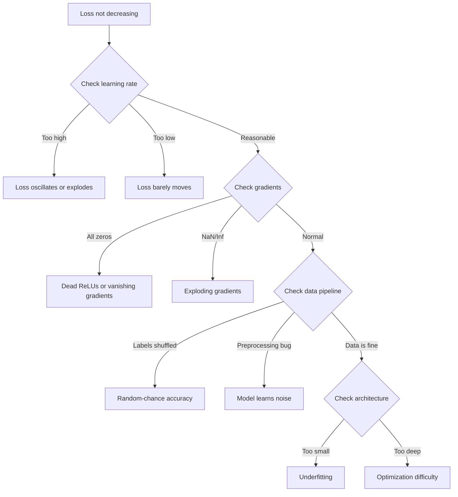
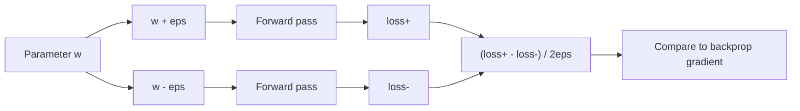
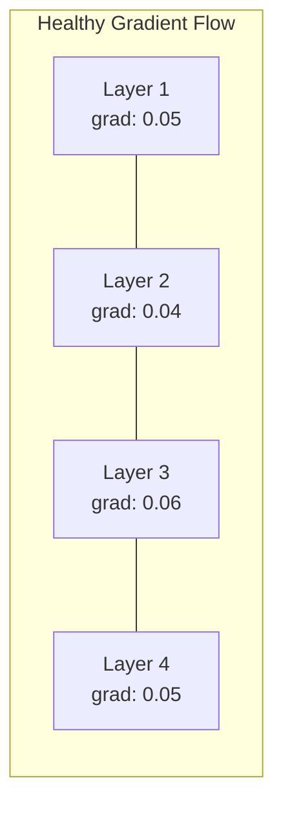
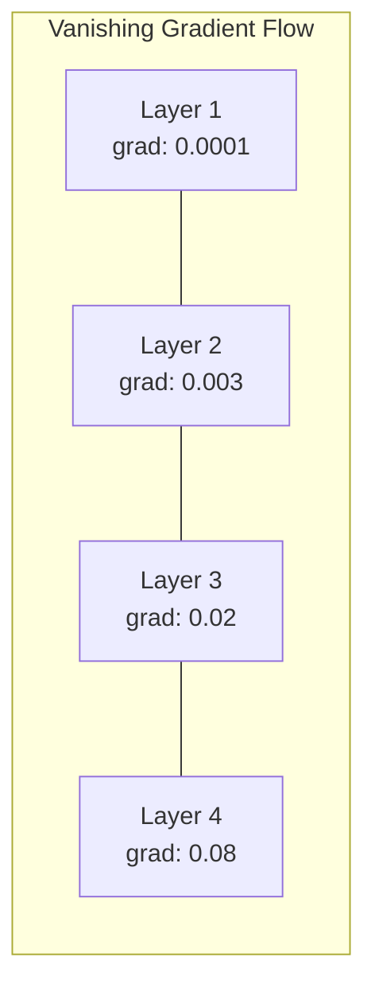
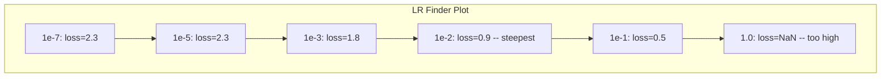

# Sinir ağlarını düzeltmek.

> Ağınız oluşturuldu. Çalıştı. Bir sayı üretti. Sayı yanlış ve hiçbir şey çökmedi. En zor türde düzeltme için hoş geldiniz.

> **【中文解读】**网络编译了、运行了、输出了数字但数字是错的,没有报错信息――这是最难的调试:没有错信息――本章系统介绍深度学习的调试方法论:过拟合单批 → 检查梯度 → 追踪数值稳定性 → 诊断学习率问题――

**Type:** Practice
**Type:** Build
**Languages:** Python, PyTorch
**Prerequisites:** Phase 03 Lessons 01-10 (especially backpropagation, loss functions, optimizers)
**Time:** ~90 minutes

## Öğrenme hedefleri

- Sistematik debugging stratejileri kullanarak yaygın sinir ağı hatalarını (NaN kaybı, düz kayb eğri, aşırı uyum, ossilasyon) teşhis etmek
- Model mimarlığınızın ve eğitim döngüsünün doğru olup olmadığını kontrol etmek için "bir partiye fazla uygun" tekniğini uygulayın
- Kayıp / patlayan kayma sorunlarını belirlemek için gradient büyüklüklerini, aktivasyon dağılımlarını ve ağırlık normlarını incelemek
- Veriler boru hattını, model mimarisini, kayıp işlevi, optimizer ve öğrenme oranı sorunlarını kapsayan bir defegleme kontrol listesini oluşturun

> **【中文解读】**本章系统化地教你调试神经网络──核心方法论:过拟合单批(验证代码正确性)→ 梯度检查(验证反向传播)→ 激活统计(发现死 ReLU)→ 学习率搜索(找到合适的 lr)──60-70% 的 ML 调试时间花在"静默错误"上程序不报错但不对──

## Sorunlar. Sorunlar.

Geleneksel yazılım bozulduğunda çöker. Bir sıfır işaretçi bir istisna atır. Bir tür eşleşmezliği bir düzenleme sırasında başarısız olur. Bir tek hata açıkça yanlış bir çıkış üretir.

> 傳統軟件在出問題時會崩──空指针抛出异常──类型不匹配在编译時失败──差一错产生明显错误的输出──

Sinir ağları size bu lüksü vermez.

> Neural ağ size böyle bir lüks vermez.

Kırık bir sinir ağı tamamlanıp, kayıp değeri yazdırır ve tahminler yapar. Kayıplar azaltabilir. Tahminler makul görünebilir. Ama model sessizce yanlış -- kısayolları öğrenmek, gürültü ezberlemek, veya işe yaramaz bir yerel minimum'a yaklaşmak. Google araştırmacıları, ML debugging süresinin %60-70'inin hata üretmeyen, ancak model kalitesini düşüren "sessiz" hatalar üzerinde harcandığını tahmin etti.

> Bir sorunlu sinir ağı tamamlanana kadar çalışabilir, yazım kaybı değerini, çıkış tahminini, kaybı düşebilir.

İşlemli ve kırık bir model arasındaki fark genellikle tek bir yanlış çizgidir: eksik bir çizgi `zero_grad()`, bir geçiş boyutu, öğrenme oranı 10x. Kanonik "Nöral Ağ Eğitimi Tarifi" (2019) şöyle başlar: "En yaygın sinir ağ hataları çökmeyen hatalardır".

> Kullanılabilir model ve bozuk model arasındaki fark genellikle sadece bir satır yanlış konumlandırma kodudur: eksiklik .`zero_grad()`、 ̊度转置错误、学习率差 10 倍──经典的"训练神经网络的方法" (Train Neural Network's Methods) 2019 开头写道:"En yaygın sinir ağ hataları çökmeyeceği bir hata değildir──"

Bu ders size bu böcekleri bulmayı öğretiyor.

> Bu dersi bu böcekleri nasıl bulacağınızı öğretir.

> **【中文解读】**傳統軟件有明顯的錯誤信号 ((异常、編譯錯誤) ∼ 神經網絡中最難調度的地方在"静默錯誤"程序正常运行、損失也在下降,但模型地学错了──最常见的三坑:忘记零_grad()、度转置错、学习率差10倍──

> **【拓展：大模型训练中的调试】**訓練 Llama 3 405B şaka model(16384 blok H100,30.8M GPU 小時), bir kez başarısızlık yapan bir eğitim maliyeti birkaç milyon dolar kadar.

## Konsepten bir şey.

### Çürütme zihniyetini.

Baskı ve pray debugging'i unutun. Nöral ağ debugging sistematik bir yaklaşım gerektirir çünkü geri bildirim döngüsü yavaş (öğrenme koşusu başına dakikalar saatler) ve semptomlar belirsiz (kötü kayıp 20 farklı şeyi ifade edebilir).

> 忘掉打印和祈祷调试――神经网络调试需要系统化方法,因为反循环很慢 (doğru süre içinde birkaç dakika veya birkaç saat sürebilir)

Altın kural:**start simple, add complexity one piece at a time, and verify each piece independently.**

> 黄金法则:**从简单开始，一次只加一个复杂度，独立验证每个组件。**

> **【中文解读】**调试神经网络的黄金法则: En basit durumdan başlayarak, her seferinde sadece bir bileşen ekle, her bileşeninin bağımsız olarak denetlenmesini sağlamak için.



### Simptom 1: Kayıp azalmıyor.

Bu en yaygın şikayet. Ekipler geçiyor, kaybı düz kalıyor ya da vahşice dalgalanıyor.

> Bu en sık görülen şikayetlerdir. Ekipler birbiri ardınca koşarak dönüyor, ama kaybı sürekli hareketsiz ya da şiddetli bir sarsıntıyla.

**Wrong learning rate.**Çok yüksek: kayıp dalgalanır veya NaN'ye atlar. Çok düşük: kayıp çok yavaş azalır ve düz görünür. Adam için 1e-3'den başlayın. SGD için, 1e-1 veya 1e-2'den başlayın.

> **学习率错误。**太高:損失 振荡或跳到NaN──太低:損失下降得太慢,看起来像不动──Adam 1e-3 开始──SGD 1e-1 或 1e-2 开始──在下结论说有其他问题之前,先尝试3个学习率(相差10倍,如1e-2、1e-3、1e-4)──

**Dead ReLUs.**Bir ReLU nöronu büyük bir negatif giriş alırsa, 0 çıkışı yapar ve gradiyenti 0 olur. Bir daha asla etkinleştirmez. Yeterince nöron ölürse, ağ öğrenemez. Kontrol: her ReLU katmanından sonra tam olarak 0 olan etkinliklerin bölümü basın.

> **死亡 ReLU。**Eğer ReLU sinirleri büyük negatif giriş alırsa, 0'dan çıkıyor, 0'dan çıkıyorsa, asla yeniden aktifleşmeyecek. Eğer ölürse, netleşen sinirler yeterince fazladır.

**Vanishing gradients.**Sigmoid veya tanh etkinleştirmeleri olan derin ağlarda, gradientler geriye yayıldıkça eksponansiyel olarak küçülürler. İlk katmana ulaştıklarında, ~ 0'durlar. İlk katmanlar öğrenmeyi durdurur. Düzelt: ReLU/GELU kullanın, kalan bağlantılar ekleyin veya parti normallaşımı kullanın.

> **梯度消失。**Sigmoid veya tanh  aktif derin kat ağlarında, gradient ters yönde yayılma zaman indeks seviyesi küçülüyor.

**Exploding gradients.**RNN'lerde ve çok derin ağlarda yaygın olan kayıplar NaN'e atlıyor.`torch.nn.utils.clip_grad_norm_`), öğrenme oranını düşürmek veya normalleşmeyi eklemek.

> **梯度爆炸。**Öte yandan, bu oranın artışı ve artışı, RNN'de görülüyor.`torch.nn.utils.clip_grad_norm_`) 、 öğrenme oranını düşürmek 、 veya birleştirme aşamasına eklenmek 、

### Simptom 2: Kayıp azalıyor ama model kötü.

Kayıplar azalır. Eğitim doğruluğu %99'a ulaşır. Ama test doğruluğu %55'dir. Ya da model gerçek veriler üzerinde anlamsız sonuçlar üretir.

> Kayıplar düşüyor. Eğitim doğruluğu oranı %99'a ulaşmaktadır. Ama test doğruluğu oranı sadece %55'dir.

**Overfitting.**Model eğitim verilerini öğrenme kalıpları yerine ezberler. Eğitim ve doğrulama kaybı arasındaki boşluk zamanla büyür. Düzelt: daha fazla veri, düşüş, kilo kaybı, erken durma, veri artırımı.

> **过拟合。**模型在背诵训练数据而不是学习规律──训练损失与验证损失之间的差随时间扩大──修复:更多数据、Dropout、权重减、早停、数据增强──

**Data leakage.**Test verileri eğitimde sızdı.Düşünçlü bir doğruluk.Çık sık nedenler: bölmeden önce karıştırma, tüm veri kümesinden istatistiklerle önceden işleme, bölünmüştürler üzerinden kopyalama örnekleri.Düzeltme: ilk bölünme, ikinci preprocess, kopyalamaları kontrol et.

> **数据泄漏。**测试数据混入了训练――准确率高可可疑――常见原因:划分前先打乱、整个数据集的统计量进行预处理、跨划分的重复样本──修复:先划分再预处理、检查重复──

**Label errors.**Çoğu gerçek veri kümesindeki etiketlerin %5-10'u yanlış (Northcutt et al., 2021 -- "Test kümelerindeki yaygın etiket hataları"). Model gürültüyü öğrenir. Düzelt: yanlış etiketlenen örnekleri bulmak ve düzeltmek için güvenli öğrenmeyi kullanın veya yüksek kayıplı örnekleri görmezden gelmek için kayıp kesimini kullanın.

> **标签错误。**%5-10'ın etiketi yanlıştır. %5-20'in etiketi yanlıştır. %5-20'in etiketi yanlıştır. %5-20'in etiketi yanlıştır. %5-20'in etiketi yanlıştır. %5-20'in etiketi yanlıştır. %5-20'in etiketi yanlıştır. %5-20'in etiketi yanlıştır. %5-20'in etiketi yanlıştır. %5-20'in etiketi yanlıştır. %5-20'in etiketi yanlıştır. %5-20'in etiketi yanlıştır. %5-20'in etiketi yanlıştır. %5-20'in etiketi yanlıştır. %5-20'in etiketi yanlıştır. %5-2021'in etiketi yanlıştır. %5-2021'in etiketi yanlıştır. %5-2021'in etiketi yanlıştır. %5-2021'in etiketi yanlıştır. %5-2021'in etiketi yanlıştır. %5-2021'in etiketi yanlıştır. %5-2021'in etiketi yanlıştır. %5-2021'in etiketi yanlıştır. %5-2021'in etiketi yanlıştır. %5-2021'in etiketi yanlıştır. %5-2021'in etiketi yanlıştır. %5-2021'in etiketi yanlışlık. %5-2021'in etiketi yanlışlık %5-2021'in etiketi yanlışlık %5'in etiketi %5'in etiketi %5'in etiketi %5'in etiketi %5'in etiketi %5'in etiketi %5'in etiketi %5'in etiketi %5'i%%%%%%%%%%%%%%%%%%%%%%%%%%%%%%%%%%%%%%%%%%%%%%%%%%%%%%%%%%%%%%%%%%%%%%%%%%%%%%%%%%%%%%%%%%%%%%%%%%%%%%%%%%%%%%%%%%%%%%%%%%%%%%%%%%%%%%%%%%%%%%%%%%%%%%%%%%%%

### Simptom 3: NaN veya Inf Kayıpta                                                                                                                                                                                                                                                                                                                                                                                                                                                                                                                    

Kayıp değeri `nan`veya `inf`Eğitim bitti.

> Kayıp değeri dönüştü`nan`Ya da`inf`❖ Öldü.

**Learning rate too high.**Geliştirmeler ağırlıkların patlaması için aşırı ilerliyor.

> **学习率太高。**梯度更新过冲到权重爆炸──修复:降低10倍──

**log(0) or log(negative).**Çaplak entropik kaybı hesaplamaları `log(p)`Eğer modeliniz tam olarak 0 veya negatif bir olasılık çıkarsa, kayıt patlar.`[eps, 1-eps]`nerede`eps=1e-7`- Evet .

> **log(0) 或 log(负数)。**交叉损失计算 `log(p)` Eğer model çıkışı doğruysa 0 veya negatif olasılığı, log 会爆炸──修复:把预测值制到`[eps, 1-eps]`, içinden `eps=1e-7`- Evet.

**Division by zero.**Batch normallaşması standart sapma ile bölünür. Sürekli değerleri olan bir batch std=0'dur. Düzelt: isimlendiriciye epsilon ekleyin (PyTorch bunu varsayılan olarak yapar, ancak özel uygulamalar olmayabilir).

> **除以零。**批归一化要除以标准差──一个常数值的批的 std=0──修复:分母加 epsilon(PyTorch 默认这样做,但自定义实现可能没有)

**Numerical overflow.**Büyük aktivasyonlar `exp()`Bu nedenle, bu işlemin en yüksek oranı, en yüksek oranı eksponansyalılaştırmadan önce çıkarmak için yapılması gerekir.

> **数值溢出。**Büyük aktiv değer giriş`exp()`Bu nedenle, bu konularda, en büyük değerlerin en azı, en azı, en azı, en azı, en azı, en azı, en azı, en azı, en azı, en azı, en azı, en azı, en azı, en azı, en azı, en azı, en azı, en azı, en azı, en azı, en azı, en azı, en azı, en azı, en azı, en azı, en azı, en azı, en azı, en azı, en azı, en azı, en azı, en azı, en azı, en azı, en azı, en azı, en azı, en azı, en azı, en azı, en azı, en azı, en azı, en azı, en azı, en azı, en azı, en azı, en azı, en azı, en azı, en azı, en azı, en azı, en azı, en azı, en azı, en azı, en azı, en azı, en azı, en azı, en azı, en azı, en azı, en azı, en azı, en azı, en azı, en azı, en azı, en azı, en azı, en azı, en azı, en azı, en azı, en azı, en azı, en azı, en azı, en azı, en azı, en azı, en azı, en azı, en azı, en azı, en azı, en azı, en azı, en azı, en azı, en azı, en azı, en azı, en azı, en azı, en azı, en azı, en azı, en azı, en azı, en azı, en azı, en azı, en azı, azı, en azı, azı, azı, azı, azı, azı, azı, azı, azı, azı, azı, azı, azı, azı, azı, azı, azı, azı, azı, az

### Teknik 1: Devamlı Kontrol

Analiz gradiyentilerinizi (backprop'dan) sayısal gradiyentilere (sınırlı farklılıklardan) karşılaştırın.

> Çözüm derecenizi (R) ve sayı derecenizi (R) karşılaştırın. Eğer ikisi de aynı değilse, sizin R (R) de bir hata vardır.

Parametre için sayısal gradient `w`- ...

> 参数 `w`∆ ∆ ∆ ∆ ∆ ∆ ∆ ∆ ∆ ∆ ∆ ∆ ∆ ∆ ∆ ∆ ∆ ∆ ∆ ∆ ∆ ∆ ∆ ∆ ∆ ∆ ∆ ∆ ∆ ∆ ∆ ∆ ∆ ∆ ∆ ∆ ∆ ∆ ∆ ∆ ∆ ∆ ∆ ∆ ∆ ∆ ∆ ∆ ∆ ∆ ∆ ∆ ∆ ∆ ∆ ∆ ∆ ∆ ∆ ∆ ∆ ∆ ∆ ∆ ∆ ∆ ∆ ∆ ∆ ∆ ∆ ∆ ∆ ∆ ∆ ∆ ∆ ∆ ∆ ∆ ∆ ∆ ∆ ∆ ∆ ∆ ∆ ∆ ∆ ∆ ∆ ∆ ∆ ∆ ∆ ∆ ∆ ∆ ∆ ∆ ∆ ∆ ∆ ∆ ∆ ∆ ∆ ∆ ∆ ∆ ∆ ∆ ∆ ∆ ∆ ∆ ∆ ∆ ∆ ∆ ∆ ∆ ∆ ∆ ∆ ∆ ∆ ∆ ∆ ∆ ∆ ∆ ∆ ∆ ∆ ∆ ∆ ∆ ∆ ∆ ∆ ∆ ∆ ∆ ∆ ∆ ∆ ∆ ∆ ∆ ∆ ∆ ∆ ∆ ∆ ∆ ∆ ∆ ∆ ∆ ∆ ∆ ∆ ∆ ∆ ∆ ∆ ∆ ∆ ∆ ∆ ∆ ∆ ∆ ∆ ∆ ∆ ∆ ∆ ∆ ∆ ∆ ∆ ∆ ∆ ∆ ∆ ∆ ∆ ∆ ∆ ∆ ∆ ∆ ∆ ∆ ∆ ∆ ∆ ∆ ∆ ∆ ∆ ∆ ∆ ∆ ∆ ∆ ∆ ∆ ∆ ∆ ∆ ∆ ∆ ∆ ∆ ∆ ∆ ∆ ∆ ∆ ∆ ∆ ∆ ∆ ∆ ∆ ∆ ∆ ∆ ∆ ∆ ∆ ∆ ∆ ∆ ∆ ∆ ∆ ∆ ∆ ∆ ∆ ∆ ∆ ∆ ∆ ∆ ∆ ∆ ∆ ∆ ∆ ∆

```
grad_numerical = (loss(w + eps) - loss(w - eps)) / (2 * eps)
```

Anlaşmanın ölçüsü (sarefli fark):

>                                                                                                                                                                                                                                                               

```
rel_diff = |grad_analytical - grad_numerical| / max(|grad_analytical|, |grad_numerical|, 1e-8)
```

- Eğer`rel_diff < 1e-5`Doğru.`rel_diff > 1e-3`- Kesinlikle bir böcek.

> Eğer `rel_diff < 1e-5`Doğru.`rel_diff > 1e-3`Neredeyse kesinlikle bir böcek var.



### Teknik 2: Aktifleştirme İstatistikleri

Eğitim sırasında her katman sonrasında etkinliklerin ortalama ve standart sapmalarını izleyin. Sağlıklı ağlar, normalleşmeden sonra 0 ve std yakınlarında (normalleşmeden sonra) veya en az sınırlı olarak etkinliklerin ortalamasını sürdürür.

> 訓練時監視 訓練時監視 訓練時監視 訓練時監視 訓練時監視 訓練時監視 訓練時監視 訓練時監視 訓練時監視 訓練時監視 訓練時監視 訓練時監視 訓練時監視 訓練時監視 訓練時監視 訓練時監視 訓練時監視 訓練時監視 訓練時監視 訓練時監視 訓練時監視 訓練時監視 訓練時監視 訓練時監視 訓練時監視 訓練時監視 訓練時監視 訓練時監視 訓練時監視 訓練時監視 訓練時監視 訓練時監視 訓練時監視 訓練時監視 訓練時監視 訓練時監視 訓練時監視 訓練時監視 訓練時監視 訓練時監視 訓練時監視 訓練時監視 訓練時監視 訓練時監視 訓練時監視 訓練時監視 訓練時監視 訓練時監視 訓練時監視 訓練時訓練時訓練時訓練時訓練時訓練時訓練 訓練時訓練時訓練時訓練時訓練時訓練時訓練時訓練時訓練時訓練時訓練時訓練時訓練時訓練時訓練時訓練時訓練時訓練時訓練時訓練時訓練時時時時時訓練時時時時時時時時時時時時時時時時時時時時時時時時時時時時時時時時時時時時時時時時時時時時時時時時時時時時時時時時時時時時時時時時時時時時時時時時時時時時時時時時時時時時時時時時時時時時時時時時時時時時時時時時時時時時時時時時時時時時時時時時時時時時時時時時時時時時時時時時時時時時時時時時時時時時時時時時時時時時時時時時時時時時時時時時時時時時時時時時時時時時時時時時時時時時時時時時時時時時時時時時時時時時時時時時時時時時時時時時時時時時時時時時時時時時時時時時時時時時時時時時時時時時時時時時時時時時

| Health indicator | Mean | Std | Diagnosis |
|-----------------|------|-----|-----------|
| Healthy | ~0 | ~1 | Network is learning normally |
| Saturated | >>0 or <<0 | ~0 | Activations stuck at extreme values |
| Dead | 0 | 0 | Neurons are dead (all zeros) |
| Exploding | >>10 | >>10 | Activations growing without bound |

| 健康指标 | 均值 | 标准差 | 诊断 |
|---------|------|--------|------|
| 健康 | ~0 | ~1 | 网络正常学习中 |
| 饱和 | >>0 或 <<0 | ~0 | 激活卡在极端值 |
| 死亡 | 0 | 0 | 神经元死了（全零） |
| 爆炸 | >>10 | >>10 | 激活无界增长 |

### Teknik 3: Gradient Flow Vizüalizasyon

Her katman için ortalama gradient büyüklüğünü çizin. Sağlıklı bir ağda, gradient büyüklükleri katmanlar arasında yaklaşık olarak benzer olmalıdır. Eğer ilk katmanların daha sonraki katmanlardan 1000 kat daha küçük gradientleri varsa, kaybolan gradientler vardır.

> Tavreyi bir ağda çizmek. Tavreyi bir ağda çizmek. Tavreyi bir ağda çizmek. Tavreyi bir ağda çizmek. Tavreyi bir ağda çizmek. Tavreyi bir ağda çizmek. Tavreyi bir ağda çizmek. Tavreyi bir ağda çizmek. Tavreyi bir ağda çizmek. Tavreyi bir ağda çizmek. Tavreyi bir ağda çizmek. Tavreyi bir ağda bir ağda belirmek. Tavreyi bir ağda belirmek. Tavreyi bir ağda belirmek. Tavreyi bir ağda kaybolmak sorunu ortaya çıkarmak.





### Teknik 4: Tek parti testinin üstü. Tek parti testinin üstü.

Derin öğrenmede en önemli debugging tekniği.

> Derin öğrenme sırasında en önemli tek bir inceleme tekniği vardır.

Bir küçük partiyi alın (8-32 örnek). 100'den fazla iterasyon için üzerinde çalışın. Kayıp neredeyse sıfıra ulaşmalı ve eğitim doğruluğu %100'e ulaşmalıdır.

> 取一个小批量(8-32个样本) ・・・在上训练100+ 次代──损失应降至接近零,训练准确率应达到100%──如果不,你的模型或训练循环有根本的错 不要进入完整训练──

Bu test:
- Kırık kayıp fonksiyonları
- Kırık geri geçişler
- Verileri temsil etmek için çok küçük bir mimarlık
- Model parametrelerine bağlı olmayan optimizer
- Veriler ve etiketler yanlış ayarlandı

> Bu test: Kötü olan kaybı işlevi, kötü olan yön yönlü yayılma, yapı çok küçük, verileri gösteremez, optimizer, model parametrelerine bağlanmamış, veriler ve etiketler eşleşmez.

Bu 30 saniye sürer ve saatlerce tam antrenman çalışmasını kurtarır.

> Bu sadece 30 saniye sürer, birkaç saatlik tam antrenman zamanını tasarruf edebilirsiniz.

> **【拓展：Andrej Karpathy 的调试建议】**Karpathy, "Trening Neural Networks Recipe" de verdiği öneriler: 1) Performansı kontrol etmeyin, kayıpı doğru hesaplayın; 2) sabit küçük veri kümesi üzerinde overadaptasyon yapın; 3) sayısal ve değeri ile ätetimetimetimetimetimetimetimetimetimetimetimetimetimetimetimetimetimetimetimetimetimetimetimetimetimetimetimetimetimetimetimetimetimetimetimetimetimetimetimetimetimetimetimetimetimetimetimetimetimetimetimetimetimetimetimetimetimetimetimetimetimetimetimetimetimetimetimetimetimetimetimetimetimetimetimetimetimetimetimetimetimetimetimetimetimetimetimetimetimetimetimetimetimetimetimetimetimetimetimetimetimetimetimetimetimetimetimetimetimetimetimetimetimetimetimetimetimetimetimetimetimetimetimetimetimetimetimetimetimetimetimetimetimetimetimetimetimetimetimetimetimetimetimetimetimetimetimetimetimetimetimetimetimetimetimetimetimetimetimetimetimetimetimetimetimetimetimetimetimetimetimetimetimetimetimetimetimetimetimetimetimetimetimetimetimetimetimetimetimetimetimetimetimetimetimetimetimetimetimetimetimetimetimetimetimetimetimetimetimetimetimetimetimetimetimetimetimetimetimetimetimetimetimetimetimetimetimetimetimetimetimetimetimetimetimetimetimetimetimetimetimetimetimetimetimetimetimetimetimetimetimetimetimetimetimetimetimetimetimetimetimetimetimetimetimetimetimetimetimetimetimetimetimetimetimetimetimetimetimetimetimetimetimetimetimetimetimetimetimetimetimetimetimetimetimetimetimetimetimetimetimetimetimetimetimetimetimetimetimetimetimetimetimetimetimetimetimetimetimetimetimetimetimetimetimetimetimetimetimetimetimetimetimetimetimetimetimetimetimetimetimetimetimetimetimetimetimetimetimetimetimetimetimetimetimetimetimetimetimetimetimetimetimetimetimetimetimetimetimetimetimetimetimetimetimetimetimetimetimetimetimetimetimetimetimetimetimetimetimetimetimetimetimetimetimetimetimetimetimetimetimetimetimetimetimetimetimetimetimetimetimetimetimetimetimetimetimetimetimetimetimetimetimetimetimetimetimetimetimetimetimetimetimetimetimetimetimetimetimetimetimetimetimetimetimetimetimetimetimetimet

### Teknik 5: Öğrenme oranı arayan. Teknik 5: Öğrenme oranı arayan.

Leslie Smith (2017) bir dönem boyunca öğrenme oranını çok küçükden (1e-7) çok büyük (10) bir süre boyunca kaydetmeyi önerdi.

> Leslie Smith(2017) bir dönem içinde öğrenme oranını 极小(1e-7)扫到极大(10), aynı zamanda kayıp kayıplarını, resim kayıplarını ve öğrenme oranı eğilimi ile birlikte kayıplarını ortaya koydu.



Bu örnekte en iyi LR: ~1e-3 (en dik noktanın öncesinde büyüklük bir sıralama).

> Bu örnekte en iyi öğrenme oranı: ~ 1e-3(

### Ortak PyTorch Böcekleri .

PyTorch topluluğunda en kolektif saatleri harcadıkları böcekler bunlar:

> Bunlar PyTorch'in en fazla zaman kaybı olan hataları:

> **【拓展：大模型训练中的 loss spike】**Geliştirilmiş bir model olarak, GPT-4 ̊Llama 3 gibi, normal değerden aniden yüksek bir şekilde atlamak için bir kez daha kayıplar meydana gelir.

| Bug | Symptom | Fix |
|-----|---------|-----|
| Forgetting `optimizer.zero_grad()` | Gradients accumulate across batches, loss oscillates | Add `optimizer.zero_grad()` before `loss.backward()` |
| Forgetting `model.eval()` at test time | Dropout and batch norm behave differently, test accuracy varies between runs | Add `model.eval()` and `torch.no_grad()` |
| Wrong tensor shapes | Silent broadcasting produces wrong results, no error | Print shapes after every operation during debugging |
| CPU/GPU mismatch | `RuntimeError: expected CUDA tensor` | Use `.to(device)` on model AND data |
| Not detaching tensors | Computation graph grows forever, OOM | Use `.detach()` or `with torch.no_grad()` |
| In-place operations breaking autograd | `RuntimeError: modified by in-place operation` | Replace `x += 1` with `x = x + 1` |
| Data not normalized | Loss stuck at random-chance level | Normalize inputs to mean=0, std=1 |
| Labels as wrong dtype | Cross-entropy expects `Long`, got `Float` | Cast labels: `labels.long()` |

| Bug | 症状 | 修复 |
|-----|------|------|
| 忘记 `optimizer.zero_grad()` | 梯度跨 batch 累积，loss 振荡 | 在 `loss.backward()` 前加 `optimizer.zero_grad()` |
| 测试时忘记 `model.eval()` | Dropout 和 BN 行为不同，测试准确率波动 | 加 `model.eval()` 和 `torch.no_grad()` |
| 张量形状错误 | 静默广播产生错误结果，无报错 | 调试时每个操作后打印形状 |
| CPU/GPU 不匹配 | `RuntimeError: expected CUDA tensor` | 模型和数据都用 `.to(device)` |
| 没有分离张量 | 计算图永远增长，OOM | 用 `.detach()` 或 `with torch.no_grad()` |
| 原地操作破坏 autograd | `RuntimeError: modified by in-place operation` | 把 `x += 1` 改成 `x = x + 1` |
| 数据未归一化 | Loss 卡在随机猜测水平 | 把输入归一化到 mean=0, std=1 |
| 标签 dtype 错误 | 交叉熵要 `Long`，得到了 `Float` | 转换标签：`labels.long()` |

### Üstün Çözme Masası 调试总表

| Symptom | Likely cause | First thing to try |
|---------|-------------|-------------------|
| Loss stuck at -log(1/num_classes) | Model predicting uniform distribution | Check data pipeline, verify labels match inputs |
| Loss NaN after a few steps | Learning rate too high | Reduce LR by 10x |
| Loss NaN immediately | log(0) or division by zero | Add epsilon to log/division operations |
| Loss oscillating wildly | LR too high or batch size too small | Reduce LR, increase batch size |
| Loss decreasing then plateaus | LR too high for fine-tuning phase | Add LR schedule (cosine or step decay) |
| Training acc high, test acc low | Overfitting | Add dropout, weight decay, more data |
| Training acc = test acc = chance | Model not learning anything | Run overfit-one-batch test |
| Training acc = test acc but both low | Underfitting | Bigger model, more layers, more features |
| Gradients all zero | Dead ReLUs or detached computation graph | Switch to LeakyReLU, check `.requires_grad` |
| Out of memory during training | Batch too large or graph not freed | Reduce batch size, use `torch.no_grad()` for eval |

| 症状 | 可能原因 | 首选尝试 |
|------|---------|---------|
| Loss 卡在 -log(1/num_classes) | 模型预测均匀分布 | 检查数据管线，验证标签与输入匹配 |
| 几步后 Loss 变 NaN | 学习率太高 | 学习率降低 10 倍 |
| Loss 立即变 NaN | log(0) 或除以零 | 给 log/除法操作加 epsilon |
| Loss 剧烈振荡 | LR 太高或 batch 太小 | 降低 LR，增大 batch |
| Loss 下降后停滞 | 微调阶段 LR 太高 | 加 LR 调度（cosine 或阶梯衰减） |
| 训练 acc 高，测试 acc 低 | 过拟合 | 加 Dropout、权重衰减、更多数据 |
| 训练 acc = 测试 acc = 随机水平 | 模型没学到东西 | 跑过拟合单 batch 测试 |
| 训练 acc = 测试 acc 都低 | 欠拟合 | 更大模型、更多层、更多特征 |
| 梯度全零 | Dead ReLU 或计算图被 detach | 换 LeakyReLU，检查 `.requires_grad` |
| 训练时 OOM | Batch 太大或计算图未释放 | 减小 batch，eval 时用 `torch.no_grad()` |

## Yapın.

> **【中文解读】** NetworkDebugger  teşhis aracı oluşturmak: PyTorch'in ön hokunu ve arka hokunu kullanarak otomatik olarak her katın aktif statistik ve gradient statistikasını kaydetmek.
```figure
learning-curves
```

## Yapın

Bir ağı kasıtlı olarak kırıp her sorunu teşhis etmek için araç kümesini kullanırsınız.

> Bir kontrol etkin değer, derece ve kaybı  eğrilik teşhis araç paketleri.

### Adım 1: Ağ Çözücü Sınıfı.

Bir katman başına aktivasyon ve gradient istatistiklerini kaydetmek için PyTorch modeli ile bağlanır.

> PyTorch'a bir model ver ve her katın aktivasyon ve derecesi kaydet.

> NetworkDebugger PyTorch'ın ön hookunu kullanarak ve arka hookunu kullanarak Otomatik kontrol her katılık。 Sağlık kontrolü logiki: kaybı  kontrolü(NaN/振荡/不下降)、激活检查(>50% 零值→死亡 ReLU,时时时时时时时时时时时时时时时时时时时时时时时时时时时时时时时时时时时时时时时时时时时时时时时时时时时时时时时时时时时时时时时时时时时时时时时时时时时时时时时时时时时时时时时时时时时时时时时时时时时时时时时时时时时时时时时时时时时时时时时时时时时时时时时时时时时时时时时时时时时时时时时时时时时时时时时时时时时时时时时时时时时时时时时时时时时时时时时时时时时时时时时时时时时时时时时时时时时时时时时时时时时时时时时时时时时时时时时时时时时时时时时时时时时时时时时时时时时时时时时时时时时时时时时时时时时时时时时时时时时时时时时时时时时时时时时时时时时时时时时时时时时时时时时时时时时时时时时时时时时时时时时时时时时时时时时时时时时时时时时时时时时时时时时时时时时时时时时时时时时时时时时时时时时时时时时时时时时时时时时时时时时时时时时时时时时时时时时时时时时时时时时时时时时时时时时时时时时时时时时时时时时时时时时时时时时时时时时时时时时时时时时时时时时时时时时时时时时时时时时时时`print_report()`输出综合诊断报告──

```python
import torch
import torch.nn as nn
import math


class NetworkDebugger:
    def __init__(self, model):
        self.model = model
        self.activation_stats = {}
        self.gradient_stats = {}
        self.loss_history = []
        self.lr_losses = []
        self.hooks = []
        self._register_hooks()

    def _register_hooks(self):
        for name, module in self.model.named_modules():
            if isinstance(module, (nn.Linear, nn.Conv2d, nn.ReLU, nn.LeakyReLU)):
                hook = module.register_forward_hook(self._make_activation_hook(name))
                self.hooks.append(hook)
                hook = module.register_full_backward_hook(self._make_gradient_hook(name))
                self.hooks.append(hook)

    def _make_activation_hook(self, name):
        def hook(module, input, output):
            with torch.no_grad():
                out = output.detach().float()
                self.activation_stats[name] = {
                    "mean": out.mean().item(),
                    "std": out.std().item(),
                    "fraction_zero": (out == 0).float().mean().item(),
                    "min": out.min().item(),
                    "max": out.max().item(),
                }
        return hook

    def _make_gradient_hook(self, name):
        def hook(module, grad_input, grad_output):
            if grad_output[0] is not None:
                with torch.no_grad():
                    grad = grad_output[0].detach().float()
                    self.gradient_stats[name] = {
                        "mean": grad.mean().item(),
                        "std": grad.std().item(),
                        "abs_mean": grad.abs().mean().item(),
                        "max": grad.abs().max().item(),
                    }
        return hook

    def record_loss(self, loss_value):
        self.loss_history.append(loss_value)

    def check_loss_health(self):
        if len(self.loss_history) < 2:
            return "NOT_ENOUGH_DATA"
        recent = self.loss_history[-10:]
        if any(math.isnan(v) or math.isinf(v) for v in recent):
            return "NAN_OR_INF"
        if len(self.loss_history) >= 20:
            first_half = sum(self.loss_history[:10]) / 10
            second_half = sum(self.loss_history[-10:]) / 10
            if second_half >= first_half * 0.99:
                return "NOT_DECREASING"
        if len(recent) >= 5:
            diffs = [recent[i+1] - recent[i] for i in range(len(recent)-1)]
            if max(diffs) - min(diffs) > 2 * abs(sum(diffs) / len(diffs)):
                return "OSCILLATING"
        return "HEALTHY"

    def check_activations(self):
        issues = []
        for name, stats in self.activation_stats.items():
            if stats["fraction_zero"] > 0.5:
                issues.append(f"DEAD_NEURONS: {name} has {stats['fraction_zero']:.0%} zero activations")
            if abs(stats["mean"]) > 10:
                issues.append(f"EXPLODING_ACTIVATIONS: {name} mean={stats['mean']:.2f}")
            if stats["std"] < 1e-6:
                issues.append(f"COLLAPSED_ACTIVATIONS: {name} std={stats['std']:.2e}")
        return issues if issues else ["HEALTHY"]

    def check_gradients(self):
        issues = []
        grad_magnitudes = []
        for name, stats in self.gradient_stats.items():
            grad_magnitudes.append((name, stats["abs_mean"]))
            if stats["abs_mean"] < 1e-7:
                issues.append(f"VANISHING_GRADIENT: {name} abs_mean={stats['abs_mean']:.2e}")
            if stats["abs_mean"] > 100:
                issues.append(f"EXPLODING_GRADIENT: {name} abs_mean={stats['abs_mean']:.2e}")
        if len(grad_magnitudes) >= 2:
            first_mag = grad_magnitudes[0][1]
            last_mag = grad_magnitudes[-1][1]
            if last_mag > 0 and first_mag / last_mag > 100:
                issues.append(f"GRADIENT_RATIO: first/last = {first_mag/last_mag:.0f}x (vanishing)")
        return issues if issues else ["HEALTHY"]

    def print_report(self):
        print("\n=== NETWORK DEBUGGER REPORT ===")
        print(f"\nLoss health: {self.check_loss_health()}")
        if self.loss_history:
            print(f"  Last 5 losses: {[f'{v:.4f}' for v in self.loss_history[-5:]]}")
        print("\nActivation diagnostics:")
        for item in self.check_activations():
            print(f"  {item}")
        print("\nGradient diagnostics:")
        for item in self.check_gradients():
            print(f"  {item}")
        print("\nPer-layer activation stats:")
        for name, stats in self.activation_stats.items():
            print(f"  {name}: mean={stats['mean']:.4f} std={stats['std']:.4f} zero={stats['fraction_zero']:.1%}")
        print("\nPer-layer gradient stats:")
        for name, stats in self.gradient_stats.items():
            print(f"  {name}: abs_mean={stats['abs_mean']:.2e} max={stats['max']:.2e}")

    def remove_hooks(self):
        for hook in self.hooks:
            hook.remove()
        self.hooks.clear()
```

### İkinci adım: Tek parti testinin üstü.

> Bu işlev tek bir seri üzerinde 200 adım üzerinde çalıştırılır. Bu işlev, test kaybının %100'e yakın düşebileceğini gösterir. Eğer bu mümkün değilse, çalıştırma döngüsü temel sorunlara sahip olabilir.

```python
def overfit_one_batch(model, x_batch, y_batch, criterion, lr=0.01, steps=200):
    optimizer = torch.optim.Adam(model.parameters(), lr=lr)
    model.train()
    print("\n=== OVERFIT ONE BATCH TEST ===")
    print(f"Batch size: {x_batch.shape[0]}, Steps: {steps}")

    for step in range(steps):
        optimizer.zero_grad()
        output = model(x_batch)
        loss = criterion(output, y_batch)
        loss.backward()
        optimizer.step()

        if step % 50 == 0 or step == steps - 1:
            with torch.no_grad():
                preds = (output > 0).float() if output.shape[-1] == 1 else output.argmax(dim=1)
                targets = y_batch if y_batch.dim() == 1 else y_batch.squeeze()
                acc = (preds.squeeze() == targets).float().mean().item()
            print(f"  Step {step:3d} | Loss: {loss.item():.6f} | Accuracy: {acc:.1%}")

    final_loss = loss.item()
    if final_loss > 0.1:
        print(f"\n  FAIL: Loss did not converge ({final_loss:.4f}). Model or training loop is broken.")
        return False
    print(f"\n  PASS: Loss converged to {final_loss:.6f}")
    return True
```

### Adım 3: Öğrenme oranı arayan.

> Bu işlevi, çok küçük öğrenme oranından çok büyük öğrenme oranına kadar (~1e-7) oranı, her adım kayıp, sonuç olarak "kayıp, en hızlı noktaya kadar bir miktar seviyesine kadar" öğrenme oranını önerir.

```python
def find_learning_rate(model, x_data, y_data, criterion, start_lr=1e-7, end_lr=10, steps=100):
    import copy
    original_state = copy.deepcopy(model.state_dict())
    optimizer = torch.optim.SGD(model.parameters(), lr=start_lr)
    lr_mult = (end_lr / start_lr) ** (1 / steps)

    model.train()
    results = []
    best_loss = float("inf")
    current_lr = start_lr

    print("\n=== LEARNING RATE FINDER ===")

    for step in range(steps):
        optimizer.zero_grad()
        output = model(x_data)
        loss = criterion(output, y_data)

        if math.isnan(loss.item()) or loss.item() > best_loss * 10:
            break

        best_loss = min(best_loss, loss.item())
        results.append((current_lr, loss.item()))

        loss.backward()
        optimizer.step()

        current_lr *= lr_mult
        for param_group in optimizer.param_groups:
            param_group["lr"] = current_lr

    model.load_state_dict(original_state)

    if len(results) < 10:
        print("  Could not complete LR sweep -- loss diverged too quickly")
        return results

    min_loss_idx = min(range(len(results)), key=lambda i: results[i][1])
    suggested_lr = results[max(0, min_loss_idx - 10)][0]

    print(f"  Swept {len(results)} steps from {start_lr:.0e} to {results[-1][0]:.0e}")
    print(f"  Minimum loss {results[min_loss_idx][1]:.4f} at lr={results[min_loss_idx][0]:.2e}")
    print(f"  Suggested learning rate: {suggested_lr:.2e}")

    return results
```

### Dördüncü adım: Dörtüncü adım: Dörtüncü adım: Dörtüncü adım: Dörtüncü adım: Dörtüncü adım: Dörtüncü adım:

> 梯度检查器: her parametre karşı yönde yayılması hesaplanan çözünürlük 梯度 ve sınırlı fark elde edilen sayı değer 梯度`rel_diff < 1e-5`Doğruyu göster.`> 1e-3`几乎肯定有错误──注意需要双精度 (iki kat) 为了减小值差──

```python
def _flat_to_multi_index(flat_idx, shape):
    multi_idx = []
    remaining = flat_idx
    for dim in reversed(shape):
        multi_idx.insert(0, remaining % dim)
        remaining //= dim
    return tuple(multi_idx)


def gradient_check(model, x, y, criterion, eps=1e-4):
    model.train()
    x_double = x.double()
    y_double = y.double()
    model_double = model.double()

    print("\n=== GRADIENT CHECK ===")
    overall_max_diff = 0
    checked = 0

    for name, param in model_double.named_parameters():
        if not param.requires_grad:
            continue

        layer_max_diff = 0

        model_double.zero_grad()
        output = model_double(x_double)
        loss = criterion(output, y_double)
        loss.backward()
        analytical_grad = param.grad.clone()

        num_checks = min(5, param.numel())
        for i in range(num_checks):
            idx = _flat_to_multi_index(i, param.shape)
            original = param.data[idx].item()

            param.data[idx] = original + eps
            with torch.no_grad():
                loss_plus = criterion(model_double(x_double), y_double).item()

            param.data[idx] = original - eps
            with torch.no_grad():
                loss_minus = criterion(model_double(x_double), y_double).item()

            param.data[idx] = original

            numerical = (loss_plus - loss_minus) / (2 * eps)
            analytical = analytical_grad[idx].item()

            denom = max(abs(numerical), abs(analytical), 1e-8)
            rel_diff = abs(numerical - analytical) / denom

            layer_max_diff = max(layer_max_diff, rel_diff)
            checked += 1

        overall_max_diff = max(overall_max_diff, layer_max_diff)
        status = "OK" if layer_max_diff < 1e-5 else "MISMATCH"
        print(f"  {name}: max_rel_diff={layer_max_diff:.2e} [{status}]")

    model.float()

    print(f"\n  Checked {checked} parameters")
    if overall_max_diff < 1e-5:
        print("  PASS: Gradients match (rel_diff < 1e-5)")
    elif overall_max_diff < 1e-3:
        print("  WARN: Small differences (1e-5 < rel_diff < 1e-3)")
    else:
        print("  FAIL: Gradient mismatch detected (rel_diff > 1e-3)")
    return overall_max_diff
```

### Adım 5: Kasıtlı olarak kırılmış ağlar.

Şimdi araç kitini kırık ağlara uygulayın ve her birini teşhis edin.

> Şimdi bu araçları yıkılmış ağlara uygulayarak, bire bire teşhis etmektedir. Üç amaçlı bug üretilmiştir: 1) Öğrenme oranı çok yüksek, 2) kayıpları yayılmış, 2) yanlış başlangıç yaparak ReLU ölümüne yol açmaktadır.

```python
def demo_broken_networks():
    torch.manual_seed(42)
    x = torch.randn(64, 10)
    y = (x[:, 0] > 0).long()

    print("\n" + "=" * 60)
    print("BUG 1: Learning rate too high (lr=10)")
    print("=" * 60)
    model1 = nn.Sequential(nn.Linear(10, 32), nn.ReLU(), nn.Linear(32, 2))
    debugger1 = NetworkDebugger(model1)
    optimizer1 = torch.optim.SGD(model1.parameters(), lr=10.0)
    criterion = nn.CrossEntropyLoss()
    for step in range(20):
        optimizer1.zero_grad()
        out = model1(x)
        loss = criterion(out, y)
        debugger1.record_loss(loss.item())
        loss.backward()
        optimizer1.step()
    debugger1.print_report()
    debugger1.remove_hooks()

    print("\n" + "=" * 60)
    print("BUG 2: Dead ReLUs from bad initialization")
    print("=" * 60)
    model2 = nn.Sequential(nn.Linear(10, 32), nn.ReLU(), nn.Linear(32, 32), nn.ReLU(), nn.Linear(32, 2))
    with torch.no_grad():
        for m in model2.modules():
            if isinstance(m, nn.Linear):
                m.weight.fill_(-1.0)
                m.bias.fill_(-5.0)
    debugger2 = NetworkDebugger(model2)
    optimizer2 = torch.optim.Adam(model2.parameters(), lr=1e-3)
    for step in range(50):
        optimizer2.zero_grad()
        out = model2(x)
        loss = criterion(out, y)
        debugger2.record_loss(loss.item())
        loss.backward()
        optimizer2.step()
    debugger2.print_report()
    debugger2.remove_hooks()

    print("\n" + "=" * 60)
    print("BUG 3: Missing zero_grad (gradients accumulate)")
    print("=" * 60)
    model3 = nn.Sequential(nn.Linear(10, 32), nn.ReLU(), nn.Linear(32, 2))
    debugger3 = NetworkDebugger(model3)
    optimizer3 = torch.optim.SGD(model3.parameters(), lr=0.01)
    for step in range(50):
        out = model3(x)
        loss = criterion(out, y)
        debugger3.record_loss(loss.item())
        loss.backward()
        optimizer3.step()
    debugger3.print_report()
    debugger3.remove_hooks()

    print("\n" + "=" * 60)
    print("HEALTHY NETWORK: Correct setup for comparison")
    print("=" * 60)
    model_good = nn.Sequential(nn.Linear(10, 32), nn.ReLU(), nn.Linear(32, 2))
    debugger_good = NetworkDebugger(model_good)
    optimizer_good = torch.optim.Adam(model_good.parameters(), lr=1e-3)
    for step in range(50):
        optimizer_good.zero_grad()
        out = model_good(x)
        loss = criterion(out, y)
        debugger_good.record_loss(loss.item())
        loss.backward()
        optimizer_good.step()
    debugger_good.print_report()
    debugger_good.remove_hooks()

    print("\n" + "=" * 60)
    print("OVERFIT-ONE-BATCH TEST (healthy model)")
    print("=" * 60)
    model_test = nn.Sequential(nn.Linear(10, 32), nn.ReLU(), nn.Linear(32, 2))
    overfit_one_batch(model_test, x[:8], y[:8], criterion)

    print("\n" + "=" * 60)
    print("LEARNING RATE FINDER")
    print("=" * 60)
    model_lr = nn.Sequential(nn.Linear(10, 32), nn.ReLU(), nn.Linear(32, 2))
    find_learning_rate(model_lr, x, y, criterion)

    print("\n" + "=" * 60)
    print("GRADIENT CHECK")
    print("=" * 60)
    model_grad = nn.Sequential(nn.Linear(10, 8), nn.ReLU(), nn.Linear(8, 2))
    gradient_check(model_grad, x[:4], y[:4], criterion)
```

## Çerçeveyi kullanın.

> **【中文解读】**PyTorch 内置调试工具:`torch.autograd.detect_anomaly()`捕获 NaN/Inf`model.named_parameters()`遍历参数和梯度──生产环境用重量&偏差 (wandb) 或 TensorBoard 实时监控损失、梯度直方图、权重分布──关键, sorun olduğunda hızlı bir şekilde belirlenmek, hangi aşamada sorun ortaya çıktı──

### PyTorch İçeri Kaldırılmış Araçlar

> PyTorch 内置工具:`detect_anomaly()`Bu nedenle, bu durumun bir sonraki aşamasında, bu aşamalar, bir sonraki aşamalarda, bir sonraki aşamalarda, bir sonraki aşamalarda, bir sonraki aşamalarda, bir sonraki aşamalarda, bir sonraki aşamalarda, bir sonraki aşamalarda, bir sonraki aşamalarda, bir sonraki aşamalarda, bir sonraki aşamalarda, bir sonraki aşamalarda, bir sonraki aşamalarda, bir sonraki aşamalarda, bir sonraki aşamalarda, bir sonraki aşamalarda, bir sonraki aşamalarda, bir sonraki aşamalarda, bir sonraki aşamalarda, bir sonraki aşamalarda, bir sonraki aşamalarda, bir sonraki aşamalarda, bir sonraki aşamalarda, bir sonraki aşamalarda, bir sonraki aşamalarda, bir sonraki aşamalarda, bir sonraki aşamalarda, bir aşamalarda, bir aşamalarda, bir aşamalarda, bir diğer aşamalarda, bir şekilde, bir şekilde, bir şekilde, bir şekilde, bir şekilde, bir şekilde, bir şekilde, bir şekilde, bir şekilde, bir şekilde, bir şekilde, bir şekilde, bir şekilde, bir şekilde, bir şekilde, bir şekilde, bir şekilde, bir şekilde, bir şekilde, bir şekilde, bir şekilde, bir şekilde, bir şekilde, bir şekilde, bir şekilde, bir şekilde, bir şekilde, bir şekilde, bir şekilde, bir şekilde, bir şekilde, bir şekilde, bir şekilde, bir şekilde, bir şekilde, bir şekilde, bir şekilde, bir şekilde, bir şekilde, bir şekilde, bir şekilde, bir şekilde, bir şekilde, bir şekilde, bir şekilde, bir şekilde, bir şekilde, bir şekilde, bir şekilde, bir şekilde, bir şekilde, bir şekilde, bir şekilde, bir şekilde, bir şekilde, bir şekilde, bir şekilde, bir şekilde, bir şekilde, bir şekilde, bir şekilde, bir şekilde, bir şekilde, bir şekilde, bir şekilde, bir şekilde, bir şekilde, bir şekilde, bir şekilde, bir şekilde, bir şekilde, bir şekilde, bir şekilde, bir şekilde, bir şekilde, bir şekilde, bir şekilde, bir şekilde, bir şekilde, bir şekilde, bir şekilde, bir şekilde, bir şekilde, bir şekilde, bir şekilde, bir şekilde, bir şekilde, bir şekilde, bir şekilde, bir şekilde, bir şekilde, bir şekilde, bir şekilde, bir şekilde, bir şekilde, bir şekilde, bir şekilde, bir şekilde, bir şekilde, bir şekilde, bir şekilde, bir şekilde, bir, bir şekilde, bir şekilde, bir şekilde`named_parameters()`Tüm parametreler ve dereceleri çap edilebilir dereceleri ortalama değer belirlenmiş ölüm seviyesi。 üretim ortamı  Wandb/TensorBoard  sürekli denetim

```python
import torch
import torch.nn as nn

model = nn.Sequential(
    nn.Linear(768, 256),
    nn.ReLU(),
    nn.Linear(256, 10),
)

with torch.autograd.detect_anomaly():
    output = model(input_tensor)
    loss = criterion(output, target)
    loss.backward()

for name, param in model.named_parameters():
    if param.grad is not None:
        print(f"{name}: grad_mean={param.grad.abs().mean():.2e}")
```

### Ağırlıklar ve Taraflar Entegre edilmesi

> W&B 集成: her dönem  kayıp kayıpları 学習率、梯度范数,并 için her parametre kayıp kayıpları 直方图──線上仪表盘实时显示训练曲线,能快速发现损失尖、梯度爆炸或参数和──

```python
import wandb

wandb.init(project="debug-training")

for epoch in range(100):
    loss = train_one_epoch()
    wandb.log({
        "loss": loss,
        "lr": optimizer.param_groups[0]["lr"],
        "grad_norm": torch.nn.utils.clip_grad_norm_(model.parameters(), float("inf")),
    })

    for name, param in model.named_parameters():
        if param.grad is not None:
            wandb.log({f"grad/{name}": wandb.Histogram(param.grad.cpu().numpy())})
```

### TensorBoard . TensorBoard görünümlü .

> TensorBoard 可視化:`add_scalar`记录标量(kayıp、 hassaslık、 öğrenme oranı),`add_histogram`记录权重和梯度的分布──训练时运行 `tensorboard --logdir=runs/`启动本地仪表盘,实时查看训练曲线和参数分布变化──

```python
from torch.utils.tensorboard import SummaryWriter

writer = SummaryWriter("runs/debug_experiment")

for epoch in range(100):
    loss = train_one_epoch()
    writer.add_scalar("Loss/train", loss, epoch)

    for name, param in model.named_parameters():
        writer.add_histogram(f"weights/{name}", param, epoch)
        if param.grad is not None:
            writer.add_histogram(f"gradients/{name}", param.grad, epoch)
```

### Çözümlü Çözümlü Listesi (Tüm Eğitimden Önce)

1. Bir seri test yapın, eğer başarısız olursa durun.
2. Baskı model özetini -- parametre sayısını doğrulamak makul.
3. Rastgele verilerle tek bir ileri geçiş yapın. Çıkış şeklini kontrol edin.
4. 5 dönem için tren... Kayıpların azalmasını kontrol edin.
5. Aktiflik istatistiklerini kontrol edin. Ölmüş katmanlar, patlamalar yok.
6. Değişken akışını kontrol edin. Yok yok, patlama yok.
7. Veri hattını doğrulayın. Etiketlerle 5 rastgele örnek yazdırın.

> 调试清单(完整训练前):
> 1. 跑過拟合单批 测试──失败就停止──
> 2. 打印模型摘要 验证参数数合理──
> 3. İletişim ve veriyi kontrol et.
> 4. 5 dönem  验证 kaybı 在下降──
> 5. Kontrolün aktifleşmesi, patlama yok.
> 6. Çekim 梯度流 没有消失 没有爆炸
> 7. 验证数据管线 印 5 个标签随机样本的

## İndirin . Ürünler .

Bu ders şunları ortaya çıkarır:
- `outputs/prompt-nn-debugger.md`-- sinir ağı eğitimi başarısızlıklarını teşhis için bir uyarı
- `outputs/skill-debug-checklist.md`-- Debug eğitim sorunları için bir karar ağacı kontrol listesini

Çözümleme için ana dağıtım kalıpları:
- Üretim eğitim senaryolarına izleme kancalarını ekle
- Günlük aktivasyonu ve gradient istatistikleri W&B veya TensorBoard'a her N adımda
- NaN kaybı, ölü nöronlar (> 80% sıfır) veya gradient patlaması için otomatik uyarılar uygulanmalıdır.
- Arsitektirleri veya veri borularını değiştirirken her zaman bir serili overfit testini çalıştırın

> 本课产 出:
> - `outputs/prompt-nn-debugger.md` Diagnosis Neural Network Training Failoru
> - `outputs/skill-debug-checklist.md`调试训练 sorunları kararlılık 树清单
>
> 调试的关键部署模式:
> - 给生产训练脚本加监控子
> - Her adım W & B veya TensorBoard'a kadar aktifleştirildi.
> - 实现自动告警:NaN kaybı 死亡神经元(>80% 零) 梯度爆炸
> - 改架或数据管线时永远先跑过拟合单批 测试

## Egzersizler.

1. **Add an exploding gradient detector.**Değiştir `NetworkDebugger`Bu, gradientlerin bir eşiği aştığını tespit etmek ve otomatik olarak gradient kesme değerini önermek için.

   **添加梯度爆炸检测器。**修改 `NetworkDebugger`Test seviyesinin değerden fazla olduğu zaman otomatik olarak test seviyesinin kesilmesi önerilir.

2. **Build a dead neuron resurrector.**Ölü ReLU nöronlarını tanımlayan (her zaman 0 çıkaran) ve gelen ağırlıklarını Kaiming başlangıcı ile yeniden başlatır bir işlev yazın. Bu, nöronların %70'inin öldüğü bir ağı geri aldığını gösterin.

   **构建死亡神经元复活器。**写一个函数识别死亡 ReLU 神经元(始终输出 0), Kaiming başlangıçlı yeniden başlatın onların giriş hâkimiyetleri.

3. **Implement the learning rate finder with plotting.**Uzaklaştırma`find_learning_rate`sonuçları bir CSV olarak kaydetmek ve CSV'yi okuyan ve matplotlib kullanarak LR vs kayb eğriyi görüntüleyen ayrı bir senaryo yazmak için.

   **实现带绘图的学习率搜索器。**扩展 `find_learning_rate`, Resultayı CSV olarak kaydet, ve CSV'yi okumak için bağımsız bir script yaz.

4. **Create a data pipeline validator.**Tren/test bölükleri üzerinde ikili örnekler, etiket dağılım dengesizliği (> 10:1 oranı), giriş normalleşmesi (ortalama 0, std yakın 1), ve verilerdeki NaN/Inf değerlerini kontrol eden bir işlev yazın.

   **创建数据管线验证器。**写一个函数检查:训练/测试划分间的重复样本、标签分布不平衡(>10:1 比例) 输入归结(平均值接近 0,std 接近 1)、数据中的 NaN/Inf 值──故意损坏的数据集上运行──

5. **Debug a real failure.**10. Dersten mini çerçeveyi alın, ince bir hata (örneğin ağırlık matrisini geriye doğru naklet) ve hangi parametre yanlış gradientlere sahip olduğunu tam olarak bulmak için gradient kontrolünü kullanın.

   **调试一个真实失败。**取第十 课的迷你框架, introduced a hidden bug (eğer bir hata varsa) 取第十 课的迷你框架, introduced a hidden bug (eğer bir hata varsa) 取第十 课的迷你框架, introduced a hidden bug (eğer bir hata varsa) 取第十 课的迷你框架, introduced a hidden bug (eğer bir hata varsa) 取第十 课的迷你框架, introduced a hidden bug (eğer bir hata varsa) 取第十 课的迷你框架, introduced a hidden bug (e.g. 取第十 课的迷你框架, introduced a hidden bug) 取第十 课的迷你框架, introduced a hidden bug (e.g. 取第十 课的迷你框架, introduced a hidden bug) 取第十 课的迷你框架, introduced a hidden bug (e.g.g. 取第十 条的 梯度检查精确定哪个参数是哪个参数是不对的的).

## Anahtar Şartlar .

| Term | What people say | What it actually means |
|------|----------------|----------------------|
| Silent bug | "It runs but gives bad results" | A bug that produces no error but degrades model quality -- the dominant failure mode in ML |
| Dead ReLU | "The neurons died" | A ReLU neuron whose input is always negative, so it outputs 0 and receives 0 gradient permanently |
| Vanishing gradients | "Early layers stop learning" | Gradients shrink exponentially through layers, making weights in early layers effectively frozen |
| Exploding gradients | "Loss went to NaN" | Gradients grow exponentially through layers, causing weight updates so large they overflow |
| Gradient checking | "Verify backprop is correct" | Comparing analytical gradients from backprop to numerical gradients from finite differences |
| Overfit-one-batch | "The most important debug test" | Training on a single small batch to verify the model CAN learn -- if it cannot, something is fundamentally broken |
| LR finder | "Sweep to find the right learning rate" | Exponentially increasing the learning rate over one epoch and picking the rate just before loss diverges |
| Data leakage | "Test data leaked into training" | When information from the test set contaminates training, producing artificially high accuracy |
| Activation statistics | "Monitor layer health" | Tracking mean, std, and zero-fraction of each layer's output to detect dead, saturated, or exploding neurons |
| Gradient clipping | "Cap the gradient magnitude" | Scaling gradients down when their norm exceeds a threshold, preventing exploding gradient updates |

| 术语 | 俗称 | 实际含义 |
|------|------|---------|
| Silent bug / 静默 bug | "能跑但结果差" | 不产生错误但降低模型质量的 bug——ML 中主要的失败模式 |
| Dead ReLU / 死亡 ReLU | "神经元死了" | 输入始终为负的 ReLU 神经元，永远输出 0、梯度为 0 |
| Vanishing gradients / 梯度消失 | "前面层停止学习" | 梯度穿过层时指数缩小，使前面层的权重实际上被冻结 |
| Exploding gradients / 梯度爆炸 | "Loss 变 NaN" | 梯度穿过层时指数增长，权重更新过大而溢出 |
| Gradient checking / 梯度检查 | "验证反向传播正确" | 把反向传播的解析梯度和有限差分的数值梯度做比较 |
| Overfit-one-batch / 过拟合单 batch | "最重要的调试测试" | 在单个小 batch 上训练，验证模型能学习——如果不能，就是根本性错误 |
| LR finder / 学习率搜索器 | "扫一遍找合适学习率" | 一个 epoch 内指数级增加学习率，挑发散前一刻的学习率 |
| Data leakage / 数据泄漏 | "测试数据泄漏到训练" | 测试集信息污染了训练，产生虚假的高准确率 |
| Activation statistics / 激活统计 | "监控层健康" | 追踪每层输出的均值、标准差、零比例，检测死亡、饱和或爆炸神经元 |
| Gradient clipping / 梯度裁剪 | "限制梯度幅度" | 当梯度范数超过阈值时按比例缩小，防止梯度爆炸更新 |

## Daha fazla okumak

- Smith, "Trening Neural Networks için Siklik Öğrenme Sınıfları" (2017) - Öğrenme Sınıfı Testini Tanıtım Eden Kağıt (LR Finder)
- Northcutt et al., "Test Setlerinde Yaygın Etiket Hataları Makineler Öğrenme Benchmarks'i Durdurabilirleştirir" (2021) -- ImageNet, CIFAR-10 ve diğer büyük referans değerlerinin %3-6'unun yanlış olduğunu gösterir
- Zhang et al., "Deep Learning Understanding Requires Re-Thinking Generalization" (2017) - nöral ağların rastgele etiketleri hatırlayabileceğini gösteren makale, bu yüzden overfit-one-batch testinin işe yaraması
- PyTorch belgesi `torch.autograd.detect_anomaly`ve `torch.autograd.set_detect_anomaly`İçeriye yerleştirilmiş NaN/Inf tespit için

> 延伸阅读:
> - Smith,Trening Neural Networks için Siklik Öğrenme Sınıfları(2017)提出学习率范围测试(LR finder) 的论文
> - Northcutt 等人,Test Setlerinde yaygın etiket hataları Makine Öğrenimi Benchmarks'i (2021)  kanıt ImageNet、CIFAR-10等主要基准的标签 3-6% 是错的
> - Zhang 等人,Deep Learning Anlayışı Geri Düşünmeyi Gerektirir (2017) 证明神经网络能记住随机标签, işte bunun nedeni 测试有效的过拟合单批
> - PyTorch 文档关于 `torch.autograd.detect_anomaly`和 `torch.autograd.set_detect_anomaly`İçeride kullanılır NaN/Inf 检测
