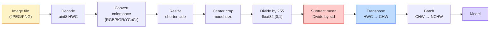
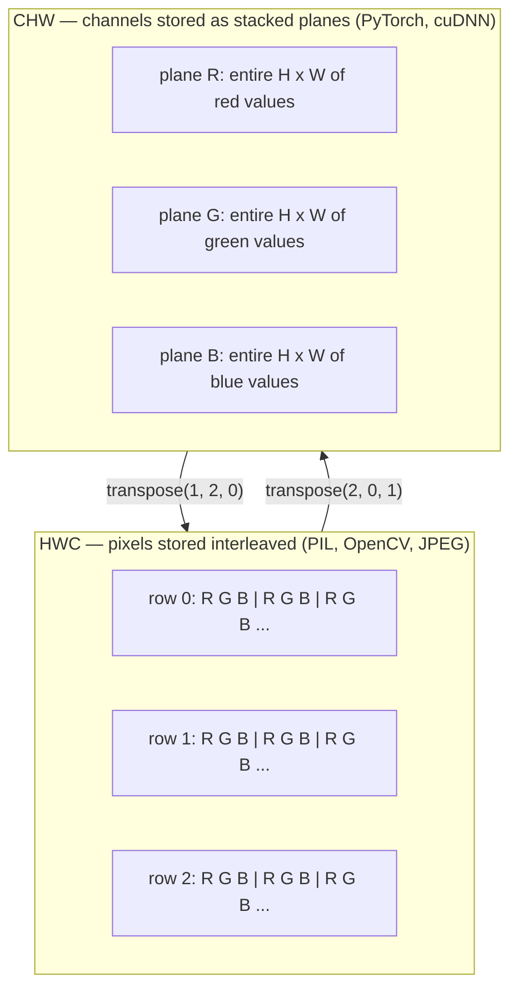

# Resim Temelleri  Pikseller, Kanallar, Renk Alanları  Resim Temelleri  Renk alanı 

> Bir görüntü, ışık örneklerinin bir tensörüdür. Kullandığınız her görüntü modeli bu tek gerçekten başlar.

> **【中文解读】**图像本质上是一组光线采样值的张量多维数组) ⋅手机拍照、自动驾驶还是GPT-4V, tüm görsel modeller bu temel gerçeğin arkasından ortaya çıkar.  Bilgelerin, geçitlerin ve veri biçimlerinin anlamı, "model eating error data" bu tür bir hata saklama anahtarıdır.

**Type:** Build | **类型:** 动手
**Languages:** Python | **语言:** Python
**Prerequisites:** Phase 1 Lesson 12 (Tensor Operations), Phase 3 Lesson 11 (Intro to PyTorch) | **前置知识:** Phase 1 Lesson 12（张量运算）、Phase 3 Lesson 11（PyTorch 入门）
**Time:** ~45 minutes | **时间:** ~45 分钟

## Öğrenme hedefleri

- Sürekli bir sahne nasıl piksellere ayrılır ve örnekleme/kvantisalatma kararlarının her aşağı akımlı modelde tavan belirlemesini açıklayın.
  Çinçe Çevirimi: Sınayı nasıl bir biçim olarak ayırt ettiğini ve neden tüm aşağıdaki modellerin üst sınırlarını belirlediğini açıklayın.
- NumPy dizileri olarak görüntüleri okuyun, kesin ve kontrol edin ve HWC ve CHW düzenleri arasında akıcı olarak geçin
  Çinçe Çevirim:读取、切片、检查图像的NumPy 数组表示,并自如切换在HWC和CHW布局之间
- RGB, gri ölçek, HSV ve YCbCr arasında dönüştürün ve her renk alanının neden var olduğunu açıklayın
  Çince Çevirimi: RGB、灰度、HSV ve YCbCr arasında dönüşüm, ve her türlü renk alanının varlığının nedenini açıklar
- Piksel düzeyinde önceden işleme uygulayın (normalleştir, standartlaştır, boyutlandır, kanal önce) önceden eğitilmiş PyTorch görme modelleri beklediği gibi
  Çinçe çevirisi:精确按照预训练 PyTorch 视觉模型的期望做像素级预处理(归一化、标准化、缩放、通道前置)

## Sorunlar. Sorunlar.

Okuduğunuz her makale, indirdiğiniz her önceden eğitilmiş ağırlık, aradığınız her görüntü API'si girenin belirli bir kodlamasını varsayıyor.`uint8`Model istediği görüntü`float32`Bu da bir hata oluşturmaz. RGB'de eğitimli bir ağ için BGR'yi besleyin ve doğruluk on puan düşer. Bir model kanallar - kanalları beklediğinde son giriş - ilk ve ilk konfor katmanının yüksekliği bir özellik kanalı olarak ele alması. Bunların hiçbirisi hata atmaz. Sadece ölçümlerinizi mahvediyor ve dosyayı nasıl yüklediğinizde yaşayan bir hata için bir hafta avlarsınız.

> Okuduğunuz her makale, indirdikleriniz, yayınladığınız her eğitim, düzenlediğiniz her görüntü API'si, belirli bir giriş kodlaması var.`uint8`                                                                                                                                                                                                                                                                                                                                                                                                                                                                                                                             `float32`Modelle, hala çalışır, ama sessizce çöpe sonuç verir. RGB üzerinde eğitimli bir ağ için BGR'yi kullanır, doğru oranı yüzde on düşer. Son girişinde bir yol gönderir, en önceki modelde bir yuvarlak katman yükseklik olarak bir özellik yol olarak değerlendirir. Bunlar hata atmaz, sadece göstergeyi yok eder, bir hafta boyunca bir hata aramanızı sağlar.

> **【中文解读】**Bu bilgisayar görsel mühendisliği en yaygın "hüşüntü hatası" kaynağıdır: veriler biçimi uyumsuz değildir. Modeller hata rapor etmez, ancak sonuçlar tamamen yanlışdır. Örneğin, BGR'yi RGB olarak kullanmak için bir açık CV'yi kullanmak için bir açık CV'yi kullanmak için bir açıklama yapılır.

Bir konvulsiyon, neyin kaydı olduğunu bildiğinizde karmaşık değildir. Zor kısmı, "bir görüntü" nin bir kamera, JPEG dekodörü, PIL, OpenCV, torchvision ve CUDA çekirdeği için farklı şeyler anlamına gelmesidir. Her yığının kendi eksis sırası, bayt aralığı ve kanal konvansiyonu vardır.

> Bir kez bildikten sonra, üzerinde kaydırılan bir devrede, karmaşık değildir. Zorluğun bir kısmı, "resim" ile ilgili bir "fotoğraf"dır. JPEG çözücü, PIL, OpenCV, torchvision ve CUDA 内核 farklı şeyler anlamına gelir.

Bu ders temelini sabitler, böylece kalan aşama da buna dayanır. Sonuna kadar bir piksel ne olduğunu, bir piksel yerine neden üç sayı olduğunu, "ImageNet istatistikleriyle normalleştirmek"in aslında ne yaptığını ve bu aşamada diğer her dersinin öngördüğü iki veya üç düzen arasında nasıl hareket edeceğini bileceksiniz.

> Bu ders, bu aşamada kalan derslerin üzerine kurulabilmesi için temel oluşturur. Öğrenince, bir resim nedir, neden her bir resim bir değil üç sayısal bir resim var, "ImageNet'in istatistik birleştirmesi" ile ne yapıldığını ve kalan derslerin tahmin ettiği iki üç düzene nasıl geçiş yapacağını öğreneceksiniz.

> **【拓展：数据标注与质量】**视觉任务的效果高度依赖标签数据质――Label Studio、CVAT is the mainstream tagging tool――在工业场景中,主动学习(Active Learning) 标签成本ı azaltabilir:模型对不确定的样本请求人工标签,确定性的样本自动标签──

## Konsepten bir şey.

### Tüm preprocessing borusu bir bakışta.

Her üretim görme sistemi aynı dönüşümlü dönüşümler sırasıdır. Bir adım yanlış atarsan model eğitiminden farklı bir giriş görür.

> Her üretim seviyesinde görsel sistem aynı ters değişen değişim sırasıdır.



İki kırmızı ve mavi kutuda sessiz başarısızlıkların %80'inin yaşadığı yerler: standartlaşmanın eksikliği ve yanlış düzenlemeler.

> Kırmızı ve mavi iki çubuğu %80'lik bir sessizlik başarısızlığı: standartlaşma eksikliği ve yanlış bir düzenlemenin bulunmasıdır.

> **【中文解读】**% 80'in gizli hataları iki bölümde yoğunlaşmıştır: 1) standartlaştırılmamıştır, 2) verilerin düzenlenmesi hata yapmıştır, 2) HWC vs CHW.

### Bir piksel bir örnek, bir kare değil.

Kamera sensörü, küçük detektörler arasında yer alan fotonları sayır. Her detektör saniyenin bir kısmında ışığı birleştirir ve ona çarpan foton sayısına orantılı bir voltaj yayar.

> Fotoğrafı, fotoğrafı, fotoğrafı, fotoğrafı, fotoğrafı, fotoğrafı, fotoğrafı, fotoğrafı, fotoğrafı, fotoğrafı, fotoğrafı, fotoğrafı, fotoğrafı, fotoğrafı, fotoğrafı, fotoğrafı, fotoğrafı, fotoğrafı, fotoğrafı, fotoğrafı, fotoğrafı, fotoğrafı, fotoğrafı, fotoğrafı, fotoğrafı, fotoğrafı, fotoğrafı, fotoğrafı, fotoğrafı, fotoğrafı, fotoğrafı, fotoğrafı, fotoğrafı, fotoğrafı, fotoğrafı, fotoğrafı, fotoğrafı, fotoğrafı, fotoğrafı, fotoğrafı, fotoğrafı, fotoğrafı, fotoğrafı, fotoğrafı, fotoğrafı, fotoğrafı, fotoğrafı, fotoğrafı, fotoğrafı, fotoğrafı, fotoğrafı, fotoğrafı, fotoğrafı, fotoğrafı, fotoğrafı, fotoğrafı, fotoğrafı, fotoğrafı, fotoğrafı, fotoğrafı, fotoğrafı, fotoğrafı, fotoğrafı, fotoğrafı, fotoğrafı, fotoğrafı, fotoğrafı, fotoğrafı, fotoğrafı, fotoğrafı, fotoğrafı, fotoğrafı, fotoğrafı, fotoğrafı, fotoğrafı, fotoğrafı, fotoğrafı, fotoğrafı, fotoğrafı, fotoğrafı, fotoğrafı, fotoğrafı, fotoğrafı, fotoğrafı, fotoğrafı, fotoğrafı, fotoğrafı, fotoğrafı, fotoğrafı, fotoğrafı ile ilgili bir kişiyefaktı ile ilgili bir kişiye kadar çok güzel bir şey, bir şey, haberde bulundu.

```
Continuous scene                 Sensor grid                     Digital image
(infinite detail)                (H x W detectors)               (H x W integers)

    ~~~~~                        +--+--+--+--+--+                 210 198 180 155 120
   # # # # # # # # # # # # # # # # # # # # # # # # # # # # # # # # # # # # # # # # # # # # # # # # # # # # # # # # # # # # # # # # # # # # # # # # # # # # # # # # # # # # # # # # # # # # # # # # # # # # # # # # # # # # # # # # # # # # # # # # # # # # # # # # # # # # # # # # # # # # # # # # # # # # # # # # # # # # # # # # # # # # # # # # # # # # # # # # # # # # # # # # # # # # # # # # # # # # # # # # # # # # # # # # # # # # # # # # # # # # # # # # # # # # # # # # # # # # # # # # # # # # # # # # # # # # # # # # # # # # # # # # # # # # # # # # # # # # # # # # # # # # # # # # # # # # # # # # # # # # # # # # # # # # # # # # # # # # # # # # # # # # # # # # # # # # # # # # # # # # # # # # # # # # # # # # # # # # # # # # # # # # # # # # # # # # # # # # # # # # # # # # # # # # # # # # # # # # # # # # # # # # # # # # # # # # # # # # # # # # # # # # # # # # # # # # # # # # # # # # # # # # # # # # # # # # # # # # # # # # # # # # # # # # # # # # # # # # # # # # # # # # # # # # # # # # # # # # # # # # # # # # # # # # # #
  - ...> +--+--+--+--+--+----> 200 190 175 150 115
   ~~~~~                         |  |  |  |  |  |                 195 185 170 148 112
                                 +--+--+--+--+--+                 188 180 165 145 108
```

Bu aşamada iki seçenek vardır ve aşağıdaki her şeyin tavanını düzeltirler:

- **Spatial sampling**Bu, bir sahne derecesine göre kaç detektör belirler. Çok az, kenarları bozulur. Çok fazla, depolama ve hesaplama patlar.
  Çinçe Çevirisi:空间采样决定场景每度有多少探测器──太少则边缘出现(混叠)──太多则储量和计算量暴增──
- **Intensity quantization**8 bit 256 seviye verir ve görüntüleme için standarttır. 10, 12, 16 bit tıbbi görüntüleme, HDR ve ham sensör boru hattları için daha düzgün bir kaydırma ve madde verir.
  Çinçe çevirisi: 强度量化决定电压被分得多细――8位给给出 256 级别,是显示的标准――10、12、16位提供更平滑的梯度,对医学成像、HDR 和原始传感器流水线很重要――

Bir piksel, alanı olan renkli bir kare değil. Tek bir ölçümdür. Boyut değiştirdiğinizde veya döndüğünüzde, ölçüm şebekesini yeniden örneklersiniz.

> 像素, genişliğe sahip bir renkli kare değil. Bu bir ölçüm.

> **【中文解读】**像素, küçük bir kare blok değil, bir örnek noktası 传感器 tarafından belirli bir uzay konumunda ölçülen bir sayı değeridir. 缩写或旋转图像时,实际上对采样网格进行重采样.

### Neden üç kanal?

Bir detektör, tüm görünür spektrumda foton sayır  yani gri ölçek. Renk elde etmek için, sensör, ağı kırmızı, yeşil ve mavi filtrelerin mozaikleriyle kaplar. Demosaik yapıldıktan sonra, her uzay konumunun üç tam sayı vardır: kırmızı filtreli detektörün tepkisi, yeşil filtreli ve mavi filtreli yakınlarda. Bu üç tam sayı bir piksel RGB üçlüdür.

> Bir dedektörün istatistikleri tüm görünür spektraldeki ışınlar 那就是灰度── renk elde etmek için, sensörler kırmızı、绿、蓝光片の马赛克覆盖网格を使っています.

```
One pixel in memory:

    (R, G, B) = (210, 140, 30)   <- reddish-orange

An H x W RGB image:

    shape (H, W, 3)     stored as   H rows of W pixels of 3 values
                                    each in [0, 255] for uint8
```

Üç sihirli değildir. Derinlik kameraları bir Z kanalı ekler. Uydular kızılötesi ve ultraviyole bantlar ekler. Tıbbi taramalar genellikle bir kanal (X-ışını, CT) veya birçok (hiperspektral) vardır. Kanal sayısı son eksendir; konv katmanları karışmayı öğrenir.

> Üç değil sihirli. Z yolu. Uydular, kırmızı ve kırmızı ışın dalgalarını artırabilir.

> **【拓展：多通道图像】**Uydu uzaktan algılama görüntüleri genellikle kırmızı  ultraviolet                                                                                                                                                                                                                                                       

### İki düzenleme konferansı: HWC ve CHW.

Aynı tenzor, iki sıralama.

> Aynı 张量, iki sıralama.

```
HWC (height, width, channels)           CHW (channels, height, width)

   W ->                                    H ->
  +-----+-----+-----+                     +-----+-----+
H |R G B|R G B|R G B|                   C |R R R R R R|
| +-----+-----+-----+                   | +-----+-----+
v |R G B|R G B|R G B|                   v |G G G G G G|
  +-----+-----+-----+                     +-----+-----+
                                          |B B B B B B|
                                          +-----+-----+

   PIL, OpenCV, matplotlib,              PyTorch, most deep learning
   almost every image file on disk       frameworks, cuDNN kernels
```

CHW, konvulsiyon çekirdeklerinin H ve W'ye kaydırılması nedeniyle var. Kanal eksisini önce tutmak, her çekirdekin her kanal için bir bitişik 2 boyutlu düzlem görmesini, temiz bir şekilde vektörleştirmesini sağlar. Disk formatları HWC'yi tutar çünkü bu bir sensörden tarama çizgilerinin nasıl çıktığına uyuyor.

> CHW 之所以存在,是因为卷积核在H 和 W 上滑动──保持通道轴在最前面的意思是每个核看到的每通道的连续2D平面,可干净地向量化──磁盘格式保持HWC──因为它匹配传感器扫描线的输出方式──

> **【中文解读】**HWC(高×宽×通道) PIL、OpenCV 等库'nun öntanımlı biçimi, aynı zamanda disk üzerinde depolanmış görüntü dosyalarının da depolanma biçimi──CHW(通道×高×宽) PyTorch 和 GPU 计算(cuDNN) kullanımı biçimi, çünkü yuvarlak çekirdeği H 和 W 上滑时,通道前置使每个核看到连续的2D平面,计算效率更高── ikisi arasında dönüşüm her gün yazılması gereken sayısız işlemlerdir──

Tek satırlı dönüşümü bin kez yazacaksınız:

> Binlerce kez bir tek yolla çevirirsin.

```
img_chw = img_hwc.transpose(2, 0, 1)      # NumPy
img_chw = img_hwc.permute(2, 0, 1)        # PyTorch tensor
```

Anıtlama düzenlemesi, görselleştirilmiş:

> İç Kayıt:



### Bayt aralıkları ve d tipi 字节 aralığı ve veri tipi

Üç büyük ibadetin baskısı:

> Üç çeşit baskın konum:

| Convention | dtype | Range | Where you see it |
|------------|-------|-------|------------------|
| Raw | `uint8` | [0, 255] | Files on disk, PIL, OpenCV output |
| Normalized | `float32` | [0.0, 1.0] | After `img.astype('float32') / 255` |
| Standardized | `float32` | roughly [-2, +2] | After subtracting mean and dividing by std |

Konvülsiyonel ağlar standart girişler üzerinde eğitildi.`mean=[0.485, 0.456, 0.406]`- Evet .`std=[0.229, 0.224, 0.225]`Bu, üç kanalın tüm ImageNet eğitim kümesi üzerinde normalleştirilmiş piksellerle hesaplanan aritmetik ortalaması ve standart sapmasıdır.`uint8`Standartlaşmış yüzerlik bekleyen bir modelde uygulanan görmede en yaygın sessiz başarısızlık tekdir.

> 卷积网络                                                                                                                                                                                                                                                                                                                                                                                                                                                                                                                          `mean=[0.485, 0.456, 0.406]`- Evet.`std=[0.229, 0.224, 0.225]`Bu, tüm ImageNet 訓練集三通の算術平均值和標準差, 归化像素上計算中 [0, 1] 归化像素上計算中.`uint8` Standartlaştırılmış bir sayı beklentisi modeli uygulamada en yaygın sessizlik başarısızlığıdır.

> **【中文解读】**Üç种数据范围:(1) uint8 [0,255] 文件/PIL/OpenCV'nin orijinal çıkışı;(2) float32 [0,1] 归化后;(3) float32 ≈[-2,+2]  ImageNet 标准化后──把 uint8 直接给期望标准化输入的模型,是最常见的"静默失败"──ImageNet'in ortalama değerleri ve standart farkları, neredeyse tüm eğitim modelleri tarafından bu grup sayısını kullanmaktadır.

### Renk alanları ve neden var oldukları

RGB, yakalama biçimidir ancak bir model için her zaman en yararlı temsil değildir.

> RGB bir yakalama biçimidir, ancak model için her zaman en kullanışlı ifade değildir.

```
 RGB               HSV                       YCbCr / YUV

 R red             H hue (angle 0-360)       Y luminance (brightness)
 G green           S saturation (0-1)        Cb chroma blue-yellow
 B blue            V value/brightness (0-1)  Cr chroma red-green

 Linear to         Separates color from      Separates brightness from
 sensor output     brightness. Useful for    color. JPEG and most video
                   color thresholding, UI    codecs compress the chroma
                   sliders, simple filters   channels harder because the
                                             human eye is less sensitive
                                             to chroma detail than to Y.
```

Çoğu CNN'de RGB'yi beslerken diğer alanlarla karşılaşırken:

>                                                                                                                                                                                                                                                               

- **HSV** klasik CV kodu, renk tabanlı segmentasyon, beyaz dengeleme.
  Çinçe Çevirim: klasik CV 代码、基于颜色的分分、白平衡──
- **YCbCr** JPEG içsellerini, video boru hattlarını, sadece Y üzerinde çalışan süper çözünürlüklü modellerini okumak.
  Çinçe çevirisi:读取 JPEG 内部结构、视频流水线、仅在Y通道上操作的超分辨率模型──
- **Grayscale** OCR, belge modelleri, renk sinyal yerine rahatsızlık değişken olduğu her durum.
  Çinçe Çevirimiçi:OCR、文档模型、色是干扰变量而不是信号的任何场景──

RGB'den gri ölçek, ortalama değil, ağırlıklı bir toplamdır, çünkü insan gözü kırmızı veya maviye göre yeşilye daha duyarlıdır:

> RGB'den 转灰度, ortalama değere değil, artıvericidir, çünkü insan gözü kırmızı veya mavi renklere göre yeşil renklere daha duyarlıdır:

```
Y = 0.299 R + 0.587 G + 0.114 B       (ITU-R BT.601, the classic weights)
```

### Aspekt oranı, boyut değiştirme ve interpolasyon.

Her modelde sabit bir giriş boyutu vardır (224x224 çoğu ImageNet sınıflandırıcıları için, 384x384 veya 512x512 modern dedektörler için).

> Her modelin sabit bir giriş boyutu vardır. Çoğu ImageNet sınıflandırma cihazı 224x224, modern tester 384x384 veya 512x512)

- **Resize shorter side, then center crop** Standart ImageNet tarifi. Görüntü oranını korur, kenar piksel çizgisini atır.
  Çinçe Çevirim:缩放短边然后中心裁剪标准 ImageNet 做法──保持宽高比,丢弃一条边像素──
- **Resize and pad** boyut oranını ve her pikselini korur, siyah çubuklar ekler.
  Çinçe çevirisi: küçültmek ve doldurmak, genişlik ve her bir resim için, kara kenar eklemek, incelemek ve OCR standart uygulamaları eklemek
- **Resize directly to target**Bilgiyi uzatır, ucuz, geometriyi çarpıtır, birçok sınıflandırma görevi için iyi.
  Çinçe Çevirimiçi: doğrudan hedef boyutlara küçültülmüş, düşük maliyetli, çarpık bir geometrik biçim, ama birçok kategori görevi için yeterli.

Interpolasyon yöntemi, yeni şebekenin eski şebekeninle uyumlu olmadığı zaman ara pikselilerin nasıl hesaplandığını belirler:

> 插值方法 decide when new net格 and old net格 disagree when how to calculate middle image:

```
Nearest neighbour     fastest, blocky, only choice for masks/labels
Bilinear              fast, smooth, default for most image resizing
Bicubic               slower, sharper on upscaling
Lanczos               slowest, best quality, used for final display
```

Basamak kural: eğitim için binlinear, bakılacak varlık için iki küp veya lanczos, tam sayı sınıfı kimlikleri içeren herhangi bir şey için en yakın.

> 経験法则: iki 線性 ile eğitilmek, iki üç kez veya lanczos ile gösterilmek, yakın komşuların tümüyle sınıf ID'lerini içerir.

> **【中文解读】**缩放时的插值方法选择:近邻 (近邻) 速度最快但会产生,只用于掩码/标签图;双线性 (双线性) 又快又平滑,是训练时的默认选择;双三次 (双立方) 慢但放大时更清晰;Lanczos 最慢但质量最好;;

> **【拓展：工业部署中的视觉系统】**Gerçek endüstriye dağıtımında, görsel modeller gecikme, model büyüklüğü, kenar cihazların uyumlu olması gibi sorunları düşünmelidir. TensorRT, ONNX Runtime, OpenVINO, yaygın olarak kullanılan bir görsel model hızlandırma aracıdır.
```figure
conv-output-size
```

## Yapın.

### Adım 1: Bir görüntü tensörü oluşturun ve şeklini kontrol edin.

Deterministik sentetik bir görüntü ile başlayın, böylece ilk laboratuvar sadece NumPy ile çevrimdışı çalıştırılır. Dosya dekodlaması ayrı bir sınırdır: bir JPEG veya PNG dekodörü RGB baytları döndürdükten sonra, aşağıdaki her tensor işlem aynıdır.

> Bir kesin bir şekilde oluşturulan bir görüntüden başlayarak, ilk deney sadece NumPy'nin çevrimiçi çalışmaya ihtiyacı var. Dosya çözümü diğer bir sınırdır: JPEG veya PNG çözücü RGB 字节ini döndüğünde, aşağıdaki her işlem aynıdır.

```python
import numpy as np

def synthetic_rgb(h=128, w=192, seed=0):
    rng = np.random.default_rng(seed)
    yy, xx = np.meshgrid(np.linspace(0, 1, h), np.linspace(0, 1, w), indexing="ij")
    r = (np.sin(xx * 6) * 0.5 + 0.5) * 255
    g = yy * 255
    b = (1 - yy) * xx * 255
    rgb = np.stack([r, g, b], axis=-1) + rng.normal(0, 6, (h, w, 3))
    return np.clip(rgb, 0, 255).astype(np.uint8)

arr = synthetic_rgb()

print(f"type:   {type(arr).__name__}")
print(f"dtype:  {arr.dtype}")
print(f"shape:  {arr.shape}     # (H, W, C)")
print(f"min:    {arr.min()}")
print(f"max:    {arr.max()}")
print(f"pixel at (0, 0): {arr[0, 0]}")
```

Beklenen üretim: `shape: (H, W, 3)`- Evet .`dtype: uint8`, aralığı `[0, 255]`Bu, baytların bir kamera, bir görüntü dekodörü veya bu sentetik jeneratörden geldiği için kanonik olarak çözülmüş bir temsil.

> 预期输出:`shape: (H, W, 3)`- Evet.`dtype: uint8`、 kapsamı `[0, 255]`Bu, şifreyi bir fotoğraf çözücüden veya bir yapımcıdan aldığımızı ifade eder.

### Adım 2: Kanalları bölün ve düzenlemeyi yeniden düzenle.

R, G, B'yi ayrı ayrı çıkarın ve sonra PyTorch için HWC'den CHW'ye dönüştürün.

> R、G、B'yi ayırıp sonra HWC'yi CHW'ye çevirir ve PyTorch kullanımı için kullanır.

```python
R = arr[:, :, 0]
G = arr[:, :, 1]
B = arr[:, :, 2]
print(f"R shape: {R.shape}, mean: {R.mean():.1f}")
print(f"G shape: {G.shape}, mean: {G.mean():.1f}")
print(f"B shape: {B.shape}, mean: {B.mean():.1f}")

arr_chw = arr.transpose(2, 0, 1)
print(f"\nHWC shape: {arr.shape}")
print(f"CHW shape: {arr_chw.shape}")
```

CHW sadece ekseleri yeniden düzenler; hafıza düzenlemesi izin verdiğinde hiçbir veri kopyası zorunlu olarak gerekmez.

> Üç tane dereceli düzlem, her yol bir. CHW sadece yeniden düzenlenme şekli; iç kayıt düzeni izin verdiğinde, verilerin kopyalanması zorunlu değildir.

### Adım 3: Gri ölçek ve HSV dönüşümleri .

Ağırlıklı toplam gri ölçek, sonra da RGB-HSV manuel.

> RGB'yi değiştirmek için, daha sonra HSV'yi gerçekleştirmek için.

```python
def rgb_to_grayscale(rgb):
    weights = np.array([0.299, 0.587, 0.114], dtype=np.float32)
    return (rgb.astype(np.float32) @ weights).astype(np.uint8)

def rgb_to_hsv(rgb):
    rgb_f = rgb.astype(np.float32) / 255.0
    r, g, b = rgb_f[..., 0], rgb_f[..., 1], rgb_f[..., 2]
    cmax = np.max(rgb_f, axis=-1)
    cmin = np.min(rgb_f, axis=-1)
    delta = cmax - cmin

    h = np.zeros_like(cmax)
    mask = delta > 0
    argmax = np.argmax(rgb_f, axis=-1)
    rmax = mask & (argmax == 0)
    gmax = mask & (argmax == 1)
    bmax = mask & (argmax == 2)
    h[rmax] = ((g[rmax] - b[rmax]) / delta[rmax]) % 6
    h[gmax] = ((b[gmax] - r[gmax]) / delta[gmax]) + 2
    h[bmax] = ((r[bmax] - g[bmax]) / delta[bmax]) + 4
    h = h * 60.0

    s = np.divide(delta, cmax, out=np.zeros_like(delta), where=cmax > 0)
    v = cmax
    return np.stack([h, s, v], axis=-1)

gray = rgb_to_grayscale(arr)
hsv = rgb_to_hsv(arr)
print(f"gray shape: {gray.shape}, range: [{gray.min()}, {gray.max()}]")
print(f"hsv   shape: {hsv.shape}")
print(f"hue range: [{hsv[..., 0].min():.1f}, {hsv[..., 0].max():.1f}] degrees")
print(f"sat range: [{hsv[..., 1].min():.2f}, {hsv[..., 1].max():.2f}]")
print(f"val range: [{hsv[..., 2].min():.2f}, {hsv[..., 2].max():.2f}]")
```

Hue dereceler, doymak ve değer olarak çıkar.`hsv_full`Anlaşma.

> Renkçe oranlı olarak, 和度和明度在 [0, 1] 范围内── bu OpenCV 之 之 之 之 之 之 之 之 之 之 之 之 之 之 之 之 之 之 之 之 之 之 之 之 之 之 之 之 之 之 之 之 之 之 之 之 之 之 之 之 之 之 之 之 之 之 之 之 之 之 之 之 之 之 之 之 之 之 之 之 之 之 之 之 之 之 之 之 之 之 之 之 之 之 之 之 之 之 之 之 之 之 之 之 之 之 之 之 之 之 之 之 之 之 之 之 之 之 之 之 之 之 之 之 之 之 之 之 之 之 之 之 之 之 之 之 之 之 之 之 之 之 之 之 之 之 之 之 之 之 之 之 之 之 之 之 之 之 之 之 之 之 之 之 之 之 之 之 之 之 之 之 之 之 之 之 之 之 之 之 之 之 之 之 之 之 之 之 之 之 之 之 之 之 之 之 之 之 之 之 之 之 之 之 之 之 之 之 之 之 之 之 之 之 之 之 之 之 之 之 之 之 之 之 之 之 之 之 之`hsv_full`约定一致。

### Dördüncü adım: Normalleştir, standartlaştır ve tersine çevir. Dördüncü adım: yeniden birleştirme, standartlaştırma ve ters değişim.

Çizil baytlardan, önceden eğitilmiş bir ImageNet modeli beklediği tam tensora git ve sonra geri dön.

> ImageNet 模型期望的精确张量,再返回──

```python
mean = np.array([0.485, 0.456, 0.406], dtype=np.float32)
std = np.array([0.229, 0.224, 0.225], dtype=np.float32)

def preprocess_imagenet(rgb_uint8):
    x = rgb_uint8.astype(np.float32) / 255.0
    x = (x - mean) / std
    x = x.transpose(2, 0, 1)
    return x

def deprocess_imagenet(chw_float32):
    x = chw_float32.transpose(1, 2, 0)
    x = x * std + mean
    x = np.clip(x * 255.0, 0, 255).astype(np.uint8)
    return x

x = preprocess_imagenet(arr)
print(f"preprocessed shape: {x.shape}     # (C, H, W)")
print(f"preprocessed dtype: {x.dtype}")
print(f"preprocessed mean per channel:  {x.mean(axis=(1, 2)).round(3)}")
print(f"preprocessed std  per channel:  {x.std(axis=(1, 2)).round(3)}")

roundtrip = deprocess_imagenet(x)
max_diff = np.abs(roundtrip.astype(int) - arr.astype(int)).max()
print(f"roundtrip max pixel diff: {max_diff}    # should be 0 or 1")
```

Kanal başına ortalama sıfır, std bir yakın olmalıdır.`transforms.Normalize`Telefon, kapuk altında.

> Her geçitinin ortalama değeri sıfıra yakın, standart farkı bire yakın.`transforms.Normalize`Yapılan işlerin altını kullanmak.

### Adım 5: sıfırdan yeniden boyutlandırın.

En yakın komşu çevreler, her çıkış koordinatını bir kaynak pikseline çevirir. İkizli interpolasyon, çevresindeki dört pikselyi bulur ve onları mesafe ile birleştirir. Aşağıdaki her iki uygulamada son noktalara uyumlu koordinatlar kullanılır, böylece ilk ve son kaynak pikselleri sabit kalır.

> Sonraki iki uygulama, bir sonraki ve son bir sonraki kaynağı pozisyona hareketsiz kalmak için, her bir çıkış koordinatını dört farklı bir kaynak görüntüsüne yerleştirdi.

```python
def resize_coordinates(source_length, target_length):
    if target_length == 1:
        return np.zeros(1, dtype=np.float32)
    return np.linspace(0, source_length - 1, target_length, dtype=np.float32)

def nearest_resize(image, target_height, target_width):
    y = np.rint(resize_coordinates(image.shape[0], target_height)).astype(int)
    x = np.rint(resize_coordinates(image.shape[1], target_width)).astype(int)
    return image[y[:, None], x[None, :]]

def bilinear_resize(image, target_height, target_width):
    y = resize_coordinates(image.shape[0], target_height)
    x = resize_coordinates(image.shape[1], target_width)
    y0 = np.floor(y).astype(int)
    x0 = np.floor(x).astype(int)
    y1 = np.minimum(y0 + 1, image.shape[0] - 1)
    x1 = np.minimum(x0 + 1, image.shape[1] - 1)
    wy = (y - y0)[:, None, None]
    wx = (x - x0)[None, :, None]

    source = image.astype(np.float32)
    top = source[y0[:, None], x0[None, :]] * (1 - wx)
    top += source[y0[:, None], x1[None, :]] * wx
    bottom = source[y1[:, None], x0[None, :]] * (1 - wx)
    bottom += source[y1[:, None], x1[None, :]] * wx
    result = top * (1 - wy) + bottom * wy
    return np.clip(np.rint(result), 0, 255).astype(image.dtype)

target_height = arr.shape[0] * 3
target_width = arr.shape[1] * 3
nearest = nearest_resize(arr, target_height, target_width)
bilinear = bilinear_resize(arr, target_height, target_width)

def local_roughness(x):
    gy = np.diff(x.astype(float), axis=0)
    gx = np.diff(x.astype(float), axis=1)
    return float(np.abs(gy).mean() + np.abs(gx).mean())

for name, out in [("nearest", nearest), ("bilinear", bilinear)]:
    print(f"{name:>8}  shape={out.shape}  roughness={local_roughness(out):6.2f}")
```

En yakınları sert kenarları koruduğu için kabalık konusunda en yüksek puanlar verir. Bilinear daha düzgüntür çünkü her yeni piksel her eksede iki pozisyonu birleştirir. Çekilebilir eş aynı ayrılabilir fikri bir eksede dört komşuya Catmull-Rom küp çekirdeği ile uzattır, sonra resim kütüphanesi olmadan tüm üç sonucu da yazdırır.

> Yakın komşuların kabalığı en yüksek puan aldı, çünkü sert kenarını korudu. İki yönlü daha düz, çünkü her yeni görüntü her aksideki iki konum karışımıdır.

> **【中文解读】**Yeni baskısı 5. adım "PIL'in boyutunu değiştirmek" değiştirmek için "ZERO'dan yakın komşu ile iki liniye" için "Bu Bu Build It 精神的归归:先用纯NumPy理解插值的坐标映射(`np.linspace`端点对齐 + 索引集),再去看库的封装──配套的`code/main.py`Catmull-Rom 双三次核, aynı eşsiz ayırılabilir ağırlıklı en yakın/bilinear/bikubik üç tür sonuç karşılığı ile gerçekleştirildi.

## Bunu uygulamak için kullanın.

PyTorch, toplu, cihaz farkındalıklı tensörlerde aynı işlemleri yapar. Aşağıdaki kod daha kısa tarafı boyutlandırır, bir merkez biçimini alır, her kanalı standartlaştırır ve önceden eğitilmiş bir model beklediği NCHW tensörü üretir.

> PyTorch, toplu olarak ̋anlama cihazlarının ̋anlama ̋anlama ̋anlama ̋anlama ̋anlama ̋an aynı işlemleri gerçekleştirir. Aşağıdaki kod kısaltılır, merkezi kesim ̋anlama ̋anlama ̋anlama ̋anlama ̋anlama ̋anlama ̋anlama ̋anlama ̋anlama ̋anlama ̋anlama ̋anlama ̋anlama ̋anlama ̋anlama ̋anlama ̋anlama ̋anlama ̋anlama ̋anlama ̋anlama ̋anlama ̋anlama ̋anlama ̋anlama ̋anlama ̋anlama ̋anlama ̋anlama ̋anlama ̋anlama ̋anlama ̋anlama ̋anlama ̋anlama ̋anlama ̋anlama ̋anlama ̋anlama ̋anlama ̋anlama ̋anlama ̋anlama ̋anlama ̋anlama ̋anlama ̋anlama ̋anlama ̋anlama ̋anlama ̋anlama ̋anlama ̋anlama ̋anlama ̋anlama ̋anlama ̋anlama ̋anlama ̋anlama ̋anlama ̋an ̋anlama ̋an ̋anlama ̋an ̋an ̋an ̋an ̋an ̋an ̋an ̋an ̋an ̋an ̋an ̋an ̋an ̋an ̋an                                                                                                                                                             

```python
import torch
import torch.nn.functional as F

image_hwc = torch.from_numpy(synthetic_rgb(256, 320))
batch = image_hwc.permute(2, 0, 1).unsqueeze(0).float() / 255.0

height, width = batch.shape[-2:]
scale = 256 / min(height, width)
resized_height = round(height * scale)
resized_width = round(width * scale)
batch = F.interpolate(
    batch,
    size=(resized_height, resized_width),
    mode="bilinear",
    align_corners=False,
    antialias=True,
)

top = (resized_height - 224) // 2
left = (resized_width - 224) // 2
batch = batch[:, :, top:top + 224, left:left + 224]

mean = torch.tensor([0.485, 0.456, 0.406]).view(1, 3, 1, 1)
std = torch.tensor([0.229, 0.224, 0.225]).view(1, 3, 1, 1)
batch = (batch - mean) / std

print(f"tensor dtype: {batch.dtype}")
print(f"batched shape: {tuple(batch.shape)}")
print(f"per-channel mean: {batch.mean(dim=(0, 2, 3)).tolist()}")
print(f"per-channel std:  {batch.std(dim=(0, 2, 3)).tolist()}")
```

Dört adım, bu tam sırada: baytları yüzerek değiştirin ve HWC'yi NCHW'ye değiştirin, daha kısa tarafın boyutunu 256'ya değiştirin, 224x224 merkez biçimini alın, ardından ImageNet ortalamasını çıkarın ve standart sapma ile bölün. Bu sırayı ters çevirmek, modelin ulaştığını sessizçe değiştirir.

> Dört adım, bu kesin sırayla: HWC'yi NCHW'ye çevirir, kısa kenarını 256'ye küçültür, 224x224'in merkezi kesimini alır ve ImageNet'in  ortalama değerini ve standart değerini çıkarır. Bu sırayla modelin aldığı içeriği sessizçe değiştirilir.

> **【中文解读】**Yeni baskısı "Uz çerçeve实现"`torchvision.transforms`Çıplak olmuş .`torch`+ `torch.nn.functional`:permute→unpress 换布局、`F.interpolate`缩放短边(注意 `antialias=True`ile`align_corners=False`Bu iki üretim seviyesinin öntanımlı değeri) 张量切片做中心剪剪播减平均值除标准差──`transforms.Compose`底下每一步的真实形状变化批量 维(N)始终在第0轴──

## Gönder , teslimat , ürünü gönder .

Bu ders şunları ortaya çıkarır:

> 本课产 出:

- `outputs/prompt-vision-preprocessing-audit.md` herhangi bir model kartı veya veri kümesi kartını bir takımın yerine getirmesi gereken tam önceden işleme değişkenlerinin kontrol listesine dönüştüren bir istek.
  Çeviri:`outputs/prompt-vision-preprocessing-audit.md` Bir takımın ön işlem değişmezlik listesinin önerisini takip etmesi gereken herhangi bir model kartı veya veri kümesi kartı dönüştürmek.
- `outputs/skill-image-tensor-inspector.md` herhangi bir görüntü şeklinde tensor veya dizi verildiğinde dtip, düzen, aralığı ve çiğ, normalleştirilmiş veya standartlaştırılmış görünüşü rapor eden bir beceri.
  Çeviri:`outputs/skill-image-tensor-inspector.md` Bir beceri: herhangi bir görüntü şekli miktarı veya bir dizi, onun dtipi, düzen, değer aralığını rapor etmek ve orijinal, birleştirilmiş veya standartlanmış gibi görünmek.

## Egzersizler.

> **【中文解读】**练习题按照易/中级/难三度递进;;建议至少完成中级题,Hard级适合深入研究或面试准备;;

1. **(Easy)**2x2 RGB oluştur`uint8`HWC'yi CHW'ye çevir ve geriye, her iki şeklini de yazdır ve dönüş yolculuğunun her değerini koruduğunu kanıtla.
   Çinçe Çevirisi: 4 farklı renk içeren bir 2x2 RGB oluşturun`uint8`HWC ve CHW arasında dönüşüm için iki şekil yazdırın ve dönüşüm için her değerin kalmış olduğunu kanıtlayın.
2. **(Medium)**Yazmın .`standardize(img, mean, std)`ve bunun tersine birlikte bir `roundtrip_max_diff <= 1`Uint8 görüntülerini test et. fonksiyonlarınız HWC'deki tek bir görüntüde ve aynı çağrı ile NCHW'deki bir partide çalışmalıdır.
   Çeviri: Çeviri: Çeviri: Çeviri: Çeviri: Çeviri: Çeviri: Çeviri: Çeviri: Çeviri: Çeviri: Çeviri: Çeviri: Çeviri: Çeviri: Çeviri: Çeviri: Çeviri: Çeviri: Çeviri: Çeviri: Çeviri: Çeviri: Çeviri: Çeviri: Çeviri: Çeviri: Çeviri: Çeviri: Çeviri: Çeviri: Çeviri: Çeviri: Çeviri: Çeviri: Çeviri: Çeviri: Çeviri: Çeviri: Çeviri: Çeviri: Çeviri: Çeviri: Çeviri: Çeviri: Çeviri: Çeviri: Çeviri: Çeviri: Çeviri: Çeviri: Çeviri: Çeviri: Çeviri: Çeviri: Çeviri: Çeviri: Çeviri: Çeviri: Çeviri`standardize(img, mean, std)` ve ters işlevi, istekli uint8 图像上通过 `roundtrip_max_diff <= 1`测试,且同调用既支持单张图(HWC)也支持批量(NCHW)。
3. **(Hard)**3 kanallı ImageNet standartlaştırılmış bir tensör alın ve RGB'nin ağırlıklı karışımını bir gri ölçekli kanal olarak öğrenen 1x1 konforu üzerinden çalıştırın.`[0.299, 0.587, 0.114]`, dondur ve çıkışın el kitabına uyuyor olduğunu kontrol et.`rgb_to_grayscale`Hangi klasik renk- uzay dönüşümleri 1x1 dönüşümleri olarak yazılabilir?
   Çinçe çevirisi: Get a Three-way ImageNet  標準化张量,送入一个把 RGB 加权混合成单通道灰度的 1x1卷积──把权重初始化为`[0.299, 0.587, 0.114]`İşlemi, denetim, çıkış ve el işlemleri`rgb_to_grayscale`Düşün: 1x1 卷 olarak yazılabilecek klasik renk alanı değişimi nedir?

## Anahtar Terimler

| Term | What people say | What it actually means |
|------|----------------|----------------------|
| Pixel | "A coloured square" | One sample of light intensity at one grid location — three numbers for colour, one for grayscale |
| Channel | "The colour" | One of the parallel spatial grids stacked into an image tensor; last axis in HWC, first in CHW |
| HWC / CHW | "The shape" | Axis orderings for an image tensor; disk and PIL use HWC, PyTorch and cuDNN use CHW |
| Normalize | "Scale the image" | Divide by 255 so pixels live in [0, 1] — necessary but not sufficient |
| Standardize | "Zero-center" | Subtract mean and divide by std per channel so the input distribution matches what the model was trained on |
| Grayscale conversion | "Average the channels" | A weighted sum with coefficients 0.299/0.587/0.114 that matches human luminance perception |
| Interpolation | "How resize picks pixels" | The rule that decides output values when the new grid does not align with the old one — nearest for labels, bilinear for training, bicubic for display |
| Aspect ratio | "Width over height" | The ratio that distinguishes "resize and pad" from "resize and stretch" |

> 术语对照:Pixel=像素、Channel=通道、Normalize=归一化、Standardize=标准化、Grey-scale conversion=灰度转换、Interpolation=插值、Aspect ratio=宽高比──完整中文释义见 zh.md 的术语表──

## Daha fazla okumak

- [Charles Poynton — A Guided Tour of Color Space](https://poynton.ca/PDFs/Guided_tour.pdf) rengin neden bu kadar çok olduğunu ve her birinin ne zaman önemli olduğunu açık bir teknik tedavi
  Çince çevirisi:Charles Poynton色彩空间导览解释为什么有如此多色空间、各自何时重要最清晰技术论述──
- [PyTorch Vision Transforms Docs](https://pytorch.org/vision/stable/transforms.html) üretim sırasında oluşturduğunuz transformasyonların tüm hattı
  Çinçe Çevirim:PyTorch Vision Transforms 文档生产环境中你真正要组合的完整变换流水线──
- [How JPEG Works (Colt McAnlis)](https://www.youtube.com/watch?v=F1kYBnY6mwg) krom alt örnekleme, DCT'nin keskin bir görsel turunu ve JPEG'nin RGB yerine YCbCr'yi neden kodlaması
  Çinçe çevirisi:JPEG is how工作的(视频)色度子采样、DCT 以及 JPEG neden YCbCr değil RGB'nin直观讲解──
- [ImageNet Preprocessing Conventions (torchvision models)](https://pytorch.org/vision/stable/models.html) gerçeğin kaynağı`mean=[0.485, 0.456, 0.406]`ve hayvanat bahçesindeki her model neden bunu bekliyor?
  Çeviri:Torchvision 模型的 ImageNet 预处理约定`mean=[0.485, 0.456, 0.406]`Bu yüzden tüm model kullanıyor.
