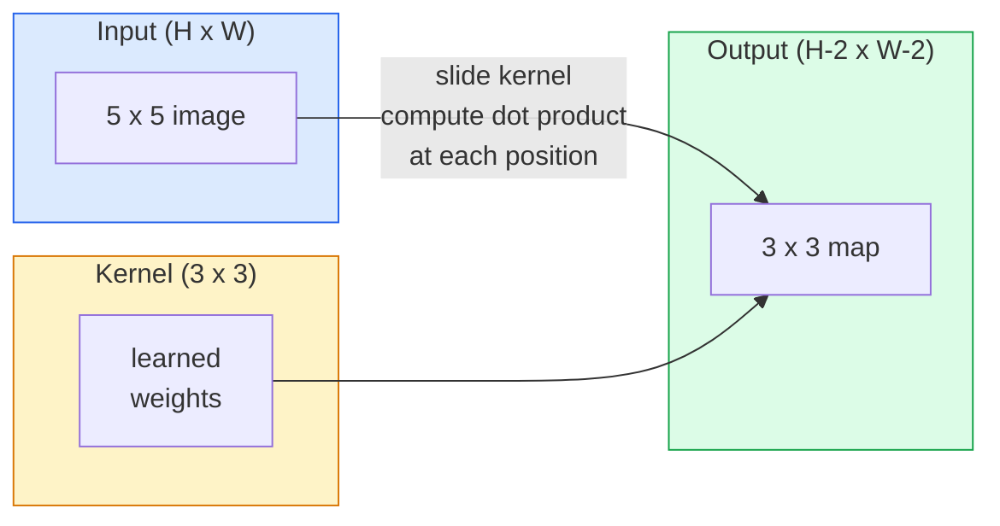
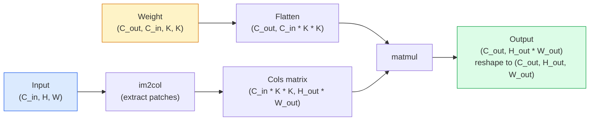

# İndirmeler sıfırdan sıfırdan gerçekleşmeler

> Bir kıvrım, bir görüntü üzerinden kaydırılan, her yerde aynı ağırlıkları paylaşan küçük yoğun bir katmandır.

> **【中文解读】**Çubuk aslında "sızdırıcı küçük tüm bağlantı katmanı"  ile aynı grupta bir görüntüde her konumdaki ağırlığı hesaplama noktası                                                                                                                                                                                                                                              

**Type:** Build | **类型:** 动手
**Languages:** Python | **语言:** Python
**Prerequisites:** Phase 3 (Deep Learning Core), Phase 4 Lesson 01 (Image Fundamentals) | **前置知识:** Phase 3（深度学习核心），Phase 4 Lesson 01（图像基础）
**Time:** ~75 minutes | **时间:** ~75 分钟

## Öğrenme hedefleri

- Nested-loop versiyonu ve vektörlü bir versiyonu da dahil olmak üzere sadece NumPy kullanarak sıfırdan 2 boyutlu konvulsiyon uygulayın `im2col`versiyon
   Sadece NumPy ile sıfırdan 2D volculuğu gerçekleştirmek, gömülü döngülü sürüm ve voluminizasyon im2col  sürüm dahil
- Giriş boyutu, çekirdek boyutu, dolgu ve adımların herhangi bir kombinasyonu için çıkış alan boyutunu hesaplayın ve `(H - K + 2P) / S + 1`formül
  計算任意输入大小、核大小、填充和步幅组合下输出尺寸,理解公式 `(H - K + 2P) / S + 1`
- El tasarım çekirdekleri (kır, bulanık, keskin, Sobel) ve neden her birinin yaptığı etkinleştirme modelini ürettiğini açıklayın
  Hand Handelenme tasarım çekirdekleri, çetelerinde kontrol, kalıplama, kalıplama ve kontrol sistemleri,
- Bir özellik çıkarıcıya yığın dönüşümleri ve yığın derinliğini kabul alanının boyutuna bağlamak
  Bir çok katman toplamak, derinlik ve büyüklük arasındaki ilişkiyi anlamak

> **【中文解读】**Öğrenme hedefi, ders bitirilmesinden sonra öğrenilmesi gereken temel becerileri listeler.


## Sorunlar. Sorunlar.

224x224 RGB görüntüde tamamen bağlantılı bir katman, nörona 224 * 224 * 3 = 150.528 giriş ağırlığına ihtiyaç duyar. 1000 ünite olan bir gizli katman, yararlı bir şey öğrenmeden önce 150 milyon parametre. Daha da kötüsü, bu katman, yukarı solda bir köpeğin ve alt sağda bir köpeğin aynı kalıp olduğunu düşünmüyor. Her piksel pozisyonunu bağımsız olarak değerlendirir, bu da görüntüler için tam olarak yanlış: Bir kedinin üç pikselle çevrilmesi ağı kavramı yeniden öğrenmeye zorlamamalı.

> 224x224 RGB resimde tüm bağlantı katmanları her sinir için 224 * 224 * 3 = 150,528 giriş ağırlığı gerekir. Bir 1.000 üniteden sadece bir gizli katmanın zaten 1.5 milyar parametri var. Önceden herhangi bir işe yarayacak bir şey öğrenmiş olursunuz. Daha da kötüsü, bu katman sol köşedeki köpek ve sağ köşedeki köpeklerin aynı modeli bilmiyor.

> **【中文解读】**Tüm bağlantı katman işleme görüntü iki ölümcül sorunu vardır: 1) Parametr patlaması224x224  Ressamın her sinirinin 150.000 ağırlık ihtiyacı vardır; 2)                                                                                                                                                                                                                                                                                                                                                                                                                                                                                  

Bir görüntü modeli için gerekli olan iki özellik **translation equivariance**(çıkış değişimi giriş değişimiyle birlikte değişir) ve **parameter sharing**Sık katmanlar size hiçbirini vermez. Konvolisyon size her ikisini de ücretsiz verir.

> 图像模型需要的两个特点是**平移等变性**(input hareketli,output hareketli) ve**参数共享**(Hem aynı özellikli denetçi tüm konumlarda çalışır)

Konvolusiyon derin öğrenme için icat edilmedi. JPEG sıkıştırmasını, Photoshop'ta Gaussian blur, endüstriyel vizyonda kenar algılama ve şimdiye kadar gönderilen her ses filtresiyle güçlendiren aynı işlemdir. CNN'lerin 2012-2020 yılları arasında ImageNet'e egemen olmasının nedeni, konvolusiyon yakın değerlerin ilişkili olduğu ve aynı kalıpın herhangi bir yerde görülebileceği veriler için doğru önlemdir.

> 卷积并非为深度学习而发明──它驱动JPEG 压缩、Photoshop 高斯模糊、工业视觉边缘检测和所有频波器的相同操作──CNN 2012-2020 yılları arasında ImageNet'in hüküm sürmesinin nedeni, 卷积ın komşu değerlerle ilgili olması ve aynı modelin herhangi bir konumdaki veriler için doğru bir öncü olmasıdır──

> **【拓展：CNN 的工业应用】**卷积并非深度学习发明的──JPEG 压缩、Photoshop 模糊、工业视觉边缘检测、音频波器都使用卷积──AI alanında, CNN 驱动自动驾驶中的目标检测(YOLO)、医学影像分析、人脸识别(FaceNet) 等核心应用──

## Konsepten bir şey.

### Bir çekirdek, kaydırıcı bir çekirdek, kaydırıcı bir resim

2 boyutlu bir konvolusiyon çekirdeği (veya filtre) olarak adlandırılan küçük bir ağırlık matrisini alır, giriş üzerinden kaydırır ve her yerde element bilge ürünlerin toplamını hesaplar. Bu toplam bir çıkış piksel haline gelir.

> 2D 卷积取一个称为核 (核) 波器 (波器) 的小权重矩阵,在输入上滑动它,在每个位置计算每个元素乘积之和和──────────────────────────────────────────────────────────────────────────────────────────────────────────────────────────────────────────────────────────────────────────────────────────────────────────────────────────────────────────────────────────────────────────────────────────────────────────────────────────────────────────────────────────────────────────────────────────────────────────────────────────────────────────────────────────────────────────────────────────────────────────────────────────────────────────────────────────────────────────────────────────────────────────────────────────────────────────────────────────────────────────────────────────────────────────────────────────────────────────────────────────────────────────────────────────────────────────────────────────────────────────────────────────────────────────────────────────────────────────────────────────────────────────────────────────────



5x5 giriş üzerinde beton 3x3 örneği (toplama yok, adım 1):

> 5x5 输入上具体 3x3示例(无填充,步幅 1):

```
Input X (5 x 5):                Kernel W (3 x 3):

  1  2  0  1  2                   1  0 -1
  0  1  3  1  0                   2  0 -2
  2  1  0  2  1                   1  0 -1
  1  0  2  1  3
  2  1  1  0  1

The kernel slides across every valid 3 x 3 window. Output Y is 3 x 3:

 Y[0,0] = sum( W * X[0:3, 0:3] )
 Y[0,1] = sum( W * X[0:3, 1:4] )
 Y[0,2] = sum( W * X[0:3, 2:5] )
 Y[1,0] = sum( W * X[1:4, 0:3] )
 ... and so on
```

Bu tek formül  **shared weights, locality, sliding window**Diğer her şey muhasebe.

> O bir formül**共享权重、局部性、滑动窗口**就是全部思想──其他都是簿记──

> **【中文解读】**卷积的全部思想缩写到三点:共享权重(同一组参数在所有位置复用) 局部性(每次只看一个小窗口) 滑动窗口(次次遍历所有位置) ;;输出 Y'nin her unsuru, nörel ve giriş penceresinin noktalarıdır.

### Çıktı boyut formülü

Giriş alanının büyüklüğü göz önüne alındığında `H`, çekirdek boyutu `K`, dolandırıcılık`P`, adım at `S`- ...

```
H_out = floor( (H - K + 2P) / S ) + 1
```

Bunu ezberleyin. Arsitektur başına onlarca kez hesaplayacaksınız.

> Bu formülü hatırla. Her bir yapıtaşın içinde birkaç kez hesaplayacaksın.

> **【中文解读】**输出尺寸公式 `H_out = floor((H - K + 2P) / S) + 1`Bu nedenle 3x3 nükleer en popüler  bu en küçük nükleer, açık bir merkez noktası vardır.

| Scenario | H | K | P | S | H_out | 中文说明 |
|----------|---|---|---|---|-------|--------|
| Valid conv, no padding | 32 | 3 | 0 | 1 | 30 | 无填充，尺寸缩小 |
| Same conv (preserves size) | 32 | 3 | 1 | 1 | 32 | 同填充，保持尺寸 |
| Downsample by 2 | 32 | 3 | 1 | 2 | 16 | 步幅2，下采样 |
| Pool 2x2 | 32 | 2 | 0 | 2 | 16 | 池化层 |
| Large receptive field | 32 | 7 | 3 | 2 | 16 | 大感受野 |

"Eşit doldurma" demek, H_out == H olarak seçmek anlamına gelir. S == 1. Eşsiz K için, bu P = (K - 1) / 2.

### - Yükle.

Yükleme olmadan, her kıvrım özellik haritasını küçültür. 20'i yığarak 224x224 görüntü 184x184 olur. Bu sınırdaki hesaplamaları boşa çıkarır ve eşleşen şekiller gerektiren kalan bağlantıları karmaşıklaştırır.

> 没有填充,每次卷积都缩小特征图――堆积后20层你的224x224图像变成184x184,浪费了边界计算,并使需要匹配形的残差连接变得复杂――

```
Zero padding (P = 1) on a 5 x 5 input:

  0  0  0  0  0  0  0
  0  1  2  0  1  2  0
  0  0  1  3  1  0  0
  0  2  1  0  2  1  0       Now the kernel can centre on pixel
  0  1  0  2  1  3  0       (0, 0) and still have three rows and
  0  2  1  1  0  1  0       three columns of values to multiply.
  0  0  0  0  0  0  0
```

Pratikte karşılaştığınız modlar:`zero`(en yaygın), `reflect`(sırın aynası, üreticilerdeki sert sınırlardan kaçınır),`replicate`(Konu kopyalayın), `circular`(turoidal sorunlarda kullanılır).

> 实践中遇到的模式:`zero`(En sık görülen)`reflect`(镜像边缘,避免生成模型中的硬边界)`replicate`(Küpleme Kenarında)`circular`(Arap, çevre sorunları için kullanılır)

### İşe çık.

İlerleme, slaytın adım boyutudur. `stride=1`- Default.`stride=2`Bu, uzay boyutlarını yarıya çıkarır ve CNN'nin içindeki örnekleri ayrı bir birleştirme katmanı olmadan indirmek için klasik bir yoldur.

> 步幅是滑动的步长──`stride=1`- Evet.`stride=2`Cnns içinde tek tek bir hücrelik katmanı kullanmayarak yapılmış olan bu yöntemleri kullanmak için, uzay boyutunu yarıya indirmek için, her modern yapı için (ResNet,ConvNeXt,MobileNet) her yerde en büyük hücrelik yerine bir adımlık kullanmak gerekir.

```
Stride 1 on a 5 x 5 input, 3 x 3 kernel:

  starts: (0,0) (0,1) (0,2)        -> output row 0
          (1,0) (1,1) (1,2)        -> output row 1
          (2,0) (2,1) (2,2)        -> output row 2

  Output: 3 x 3

Stride 2 on the same input:

  starts: (0,0) (0,2)              -> output row 0
          (2,0) (2,2)              -> output row 1

  Output: 2 x 2
```

### Çoklu giriş kanalları.

Gerçek görüntüler üç kanaldan oluşur. RGB girişindeki 3x3 konvoluyonu aslında 3x3x3 hacmi: giriş kanalına bir 3x3 dilim. Her uzaylı pozisyonda, üç dilim boyunca çarpır ve toplam yaparak bir önyargı eklersiniz.

> Gerçek görüntü üç yollu bir görüntüdir. RGB  girişindeki 3x3  dönüşüm aslında 3x3x3  dönüşümün bir parçasıdır. Her giriş yolu bir 3x3  dönüşümün bir parçasıdır.

```
Input:   (C_in,  H,  W)        3 x 5 x 5
Kernel:  (C_in,  K,  K)        3 x 3 x 3 (one kernel)
Output:  (1,     H', W')       2D map

For a layer that produces C_out output channels, you stack C_out kernels:

Weight:  (C_out, C_in, K, K)   e.g. 64 x 3 x 3 x 3
Output:  (C_out, H', W')       64 x 3 x 3

Parameter count: C_out * C_in * K * K + C_out   (the + C_out is biases)
```

Bu son satır bir model planladığınızda hesaplayacağınız satırdır.`64 * 3 * 3 * 3 + 64 = 1,792`Parametre.

> Son bir satır da planlama modelinde hesaplamak zorunda olduğun şey.`64 * 3 * 3 * 3 + 64 = 1,792`个参数―― çok uygun.

> **【中文解读】**Çok yol kapsamının parametreleri hesaplanır: parametre = C_out × C_in × K × K + C_out (Yarım) ⋅ bir 3 输入通道、64 输出通道 3x3 卷积 sadece 1,792 个参数 gerektirir, tüm bağlantı katından çok azdır. Bu,卷积ın parametre verimliliğini ortaya koyuyor.

### İm2col numarasını.

Yuvalar kolayca okunur ama yavaş. GPU'lar büyük matris çarpımlarını ister. Trick: girişin her kabul alan penceresini büyük bir matrisin bir sütununa düzeltmek, çekirdeği bir sıra haline getirmek ve tüm kıvrım tek bir matmul haline gelir.

> 嵌套循环易读但慢──GPU 需要大矩阵乘法──: 输入的每个感受野窗口展平为大矩阵的一列,将核展平为一行,整个卷积就变成一次矩阵乘法──



Her üretim conv uygulaması bu artı önbelleği-tıllama hilelerinin bir çeşitidir (büyük çekirdekler için doğrudan conv, Winograd, FFT conv). im2col'u anlayın ve çekirdeği anlarsınız.

> Her üretim seviyesinin devresi gerçekleşir. Bu bir çeşit değişimdir.

> **【拓展：GPU 加速卷积】**Tüm GPU'ların üstündeki devrim gerçekleştirmek (cuDNN) im2col'un değişikliği, ek olarak缓存分块优化 (direkt devrim, Winograd, FFT devrim) ⋅ im2col'u anlamak, derin öğrenme çerçevesinde devrim hızlandırmasının temel prensibini anlamak demektir.

### - Merak alanı.

Tek 3x3 konvoy 9 giriş pikselini görür. iki 3x3 konvoyunu yığar ve ikinci katmadaki bir nöron 5x5 giriş pikselini görür.

> 单个3x3卷积看 9 输入像素――堆叠两个3x3卷积,第二层神经元看 5x5 输入像素――三个3x3卷积给出7x7――一般而言:

```
RF after L stacked K x K convs (stride 1) = 1 + L * (K - 1)

With strides:   RF grows multiplicatively with stride along each layer.
```

"3x3 tüm aşağıya kadar" çalışmasının tüm nedeni (VGG, ResNet, ConvNeXt) iki 3x3 konvoyunun bir 5x5 konvoy ile aynı giriş alanını görmesidir ancak daha az parametreler ve aralarında ekstra bir çizgizliği vardır.

> "VGG、ResNet、ConvNeXt) geçişinin tüm nedenleri, iki 3x3 卷积 görülen giriş bölgesi ile 5x5 卷积 aynıdır, ancak parametreler daha az, orta bir katman daha fazla olmayan 線性。

> **【中文解读】**堆叠 L 层 K×K 卷积(步幅为1) 的感受野 = 1 + L × (K-1) ・・・ İşte VGG、ResNet 等网络 "full use 3x3" nedenleri: iki 3x3 卷积 感受野 bir 5x5 ≠ bir, ancak参数 daha az, ortasında da bir kat daha fazla olmayan 线性激活──
```figure
convolution-kernel
```

## Yapın

## Yapın.

### Adım 1: Array'ı doldurun.

En küçük primitif ile başlayın: H x W dizisi etrafında sıfırlarla dolanan bir fonksiyon.

> En ufak bir orijinal dilden başlamak: H x W sayılarının etrafında sıfırın bir işlevi doldurulur.

```python
import numpy as np

def pad2d(x, p):
    if p == 0:
        return x
    h, w = x.shape[-2:]
    out = np.zeros(x.shape[:-2] + (h + 2 * p, w + 2 * p), dtype=x.dtype)
    out[..., p:p + h, p:p + w] = x
    return out

x = np.arange(9).reshape(3, 3)
print(x)
print()
print(pad2d(x, 1))
```

Arka yastık hilesi .`x.shape[:-2]`Aynı fonksiyon üzerinde çalışır `(H, W)`- Evet .`(C, H, W)`veya`(N, C, H, W)`Değişiklik yapmadan.

> 尾轴技巧 `x.shape[:-2]`Aynı fonksiyon için kullanılabilir.`(H, W)`- Evet.`(C, H, W)`Ya da`(N, C, H, W)`- Evet.

### Adım 2: 2D yuvarlaklı yuvarlaklı 2D yuvarlaklı yuvarlaklı yuvarlaklı 2D yuvarlaklı yuvarlaklı

Referans uygulanması  yavaş ama net.`torch.nn.functional.conv2d`- İlke olarak öyle.

> 参考实现慢,但无歧义──`torch.nn.functional.conv2d`Yapılacak şeyler.

```python
def conv2d_naive(x, w, b=None, stride=1, padding=0):
    c_in, h, w_in = x.shape       # 输入：通道数、高、宽
    c_out, c_in_w, kh, kw = w.shape  # 权重：输出通道、输入通道、核高、核宽
    assert c_in == c_in_w          # 输入通道数必须匹配

    x_pad = pad2d(x, padding)     # 填充输入
    h_out = (h + 2 * padding - kh) // stride + 1  # 输出高度
    w_out = (w_in + 2 * padding - kw) // stride + 1  # 输出宽度

    out = np.zeros((c_out, h_out, w_out), dtype=np.float32)
    for oc in range(c_out):               # 遍历每个输出通道
        for i in range(h_out):            # 遍历输出高度
            for j in range(w_out):        # 遍历输出宽度
                hs = i * stride           # 输入中的起始行
                ws = j * stride           # 输入中的起始列
                patch = x_pad[:, hs:hs + kh, ws:ws + kw]  # 提取感受野窗口
                out[oc, i, j] = np.sum(patch * w[oc])      # 点积求和
        if b is not None:
            out[oc] += b[oc]              # 加偏置
    return out
```

Dört yuva (çıkış kanalı, satır, sütun, artı içerikli toplam C_in, kh, kw). Bu her hızlı uygulamanın karşısında kontrol edeceğiniz temel gerçekliktir.

> Dört katlı yerleşim döngüsü (输出通道、行、列,加上对 C_in、kh、kw 的隐式求和) ⋅

### Adım 3: El tasarımı çekirdeği ile onaylayın.

Dök bir Sobel çekirdeği yapın, sentetik bir adım görüntüsüne uygulayın ve dik kenarın aydınlanmasını izleyin.

>                                                                                                                                                                                                                                                               

```python
def synthetic_step_image():
    img = np.zeros((1, 16, 16), dtype=np.float32)
    img[:, :, 8:] = 1.0
    return img

sobel_x = np.array([
    [[-1, 0, 1],
     [-2, 0, 2],
     [-1, 0, 1]]
], dtype=np.float32)[None]

x = synthetic_step_image()
y = conv2d_naive(x, sobel_x, padding=1)
print(y[0].round(1))
```

7. sütunda büyük pozitif değerler bekleyin (soldan sağa parlaklık artışı) ve diğer yerlerde sıfırlar.

> 预期第7 列有大正值 ((左到右亮度增加),其他地方为零──那一次印就是数学是否正确的完整性检查──

### Dördüncü adım: İ2col  İ2col  Mükemmellik

Girişteki her çekirdek büyüklüğündeki pencereni bir matris sütununa dönüştürün.`C_in=3, K=3`, her sütun 27 numara.

> Girişlerdeki her nükleer büyüklüğündeki pencerenin bir sıraya dönüştürülmesi.`C_in=3, K=3`Her sıra 27'dir.

```python
def im2col(x, kh, kw, stride=1, padding=0):
    c_in, h, w = x.shape
    x_pad = pad2d(x, padding)
    h_out = (h + 2 * padding - kh) // stride + 1
    w_out = (w + 2 * padding - kw) // stride + 1

    cols = np.zeros((c_in * kh * kw, h_out * w_out), dtype=x.dtype)
    col = 0
    for i in range(h_out):
        for j in range(w_out):
            hs = i * stride
            ws = j * stride
            patch = x_pad[:, hs:hs + kh, ws:ws + kw]
            cols[:, col] = patch.reshape(-1)
            col += 1
    return cols, h_out, w_out
```

Hala Python bir döngüsü ama artık ağır yükleme tek vektörlü bir matmul olacak.

> Bu hala Python döngüsü, ama şimdi ağır iş bir yönlü metrik çarpma biçimi olacaktır.

### Adım 5: Im2col + matmul üzerinden hızlı bir dönüşüm.

Dörtlü döngüyü bir matris çarpımı ile değiştirin.

> Bir kez dört döngü değiştirmek için bir matraj çarpma yöntemini kullanın.

```python
def conv2d_im2col(x, w, b=None, stride=1, padding=0):
    c_out, c_in, kh, kw = w.shape
    cols, h_out, w_out = im2col(x, kh, kw, stride, padding)
    w_flat = w.reshape(c_out, -1)
    out = w_flat @ cols
    if b is not None:
        out += b[:, None]
    return out.reshape(c_out, h_out, w_out)
```

Doğruluğu kontrol etmek: her iki uygulamayı da çalıştırın ve karşılaştırın.

> Doğruluk kontrolü: iki gerçekleştirilen işlemler

```python
rng = np.random.default_rng(0)
x = rng.normal(0, 1, (3, 16, 16)).astype(np.float32)
w = rng.normal(0, 1, (8, 3, 3, 3)).astype(np.float32)
b = rng.normal(0, 1, (8,)).astype(np.float32)

y_naive = conv2d_naive(x, w, b, padding=1)
y_im2col = conv2d_im2col(x, w, b, padding=1)

print(f"max abs diff: {np.max(np.abs(y_naive - y_im2col)):.2e}")
```

`max abs diff`Etrafta olmalı .`1e-5`Fark, kaygan nokta birikimi sırası, bir hata değil.

> `max abs diff`- Olmalı .`1e-5`左右差异是浮点累加顺序造成的,不是 bug──

### Adım 6: El tasarımı çekirdekler bankası

Bir tek konfor katmanının herhangi bir eğitimden önce ne ifade edebileceğini gösteren beş filtre.

> 5 波器 herhangi bir antrenmana kadar bir tek bir yuvarlak aşama gösterdi.

```python
KERNELS = {
    "identity": np.array([[0, 0, 0], [0, 1, 0], [0, 0, 0]], dtype=np.float32),
    "blur_3x3": np.ones((3, 3), dtype=np.float32) / 9.0,
    "sharpen": np.array([[0, -1, 0], [-1, 5, -1], [0, -1, 0]], dtype=np.float32),
    "sobel_x": np.array([[-1, 0, 1], [-2, 0, 2], [-1, 0, 1]], dtype=np.float32),
    "sobel_y": np.array([[-1, -2, -1], [0, 0, 0], [1, 2, 1]], dtype=np.float32),
}

def apply_kernel(img2d, kernel):
    x = img2d[None].astype(np.float32)
    w = kernel[None, None]
    return conv2d_im2col(x, w, padding=1)[0]
```

Her türlü gri ölçekli görüntüye uygulanır, bulanıklaşır, keskin kenarları yükseltir, Sobel-x dikey kenarları aydınlatır, Sobel-y yatay kenarları aydınlatır. Bunlar AlexNet ve VGG'deki * ilk* eğitilmiş konfor katmanının öğrendiği  gibi desenlerdir. Çünkü iyi bir görüntü modeli, daha sonra ne iş olursa olsun kenar ve pürüzük algılayıcılarına ihtiyaç duyar.

>                                                                                                                                                                                                                                                               

> **【拓展：经典卷积核与 CNN 学习】**AlexNet、VGG ve diğer ağların ilk devrim katmanının öğrendiği özellikler neredeyse her zaman bu el yapımı tasarımların nükleer yüksekliğine benzer bir kenar denetleyicisi ve renk nokta denetleyicisi olmuştur. Bu, görevin ne olduğu her ne olursa olsun, alt katman görsel özellikleri ([[Kemer]], yapısı) genel olarak kullanılabilir olarak görülmektedir.

## Bunu uygulamak için kullanın.

PyTorch'in `nn.Conv2d`Bu işlem aynı işlemleri otomatik derecede, CUDA çekirdekleri ve cuDNN optimizasyonu ile tamamlıyor.

> PyTorch'in `nn.Conv2d`Kendiliğinden küçük bölüm, CUDA 内核, cuDNN 优化封装了相同的操作──形形语义完全相同──

```python
import torch
import torch.nn as nn

conv = nn.Conv2d(in_channels=3, out_channels=64, kernel_size=3, stride=1, padding=1)
print(conv)
print(f"weight shape: {tuple(conv.weight.shape)}   # (C_out, C_in, K, K)")
print(f"bias shape:   {tuple(conv.bias.shape)}")
print(f"param count:  {sum(p.numel() for p in conv.parameters())}")

x = torch.randn(8, 3, 224, 224)
y = conv(x)
print(f"\ninput  shape: {tuple(x.shape)}")
print(f"output shape: {tuple(y.shape)}")
```

Değişme`padding=1`için`padding=0`ve çıkış 222x222'e düşer.`stride=1`için`stride=2`Ve 112x112'ye düşer. Yukarıda ezberlediğiniz formül.

> - Ne ?`padding=1`换成 `padding=0`, Output aşağı 222x222  `stride=1`换成 `stride=2`Bu da 112x112'e düştü. Yukarıda hatırladığın formülün aynısı.


> **【拓展：工业部署中的视觉系统】**Gerçek endüstriye dağıtımında, görsel modeller gecikme, model büyüklüğü, kenar cihazların uyumlu olması gibi sorunları düşünmelidir. TensorRT, ONNX Runtime, OpenVINO, yaygın olarak kullanılan bir görsel model hızlandırma aracıdır.

## Gönder , teslimat , ürünü gönder .

Bu ders şunları ortaya çıkarır:

> 本课产 出:

- `outputs/prompt-cnn-architect.md` giriş boyutunu, parametre bütçesini ve hedef alıcı alanı göz önüne alındığında, bir yığın tasarlayan bir istek `Conv2d`her adımda doğru K/S/P ile katmanlar.
  Çinçe Çevirimi: 给定输入尺寸、参数预算和目标感受野,设计每步具有正确 K/S/P 的 `Conv2d`层堆的提示词──
- `outputs/skill-conv-shape-calculator.md` Bir ağ spesifikasyonını katman katman olarak yürüten ve her blok için çıkış şeklini, kabul alanını ve parametreler sayısını geri veren bir beceri.
  Çinçe çevirisi: her blokun çıkış şekli, duygular ve parametre sayısı becerileri.

## Egzersizler.

> **【中文解读】**练习题按照易/中级/难三度递进;;建议至少完成中级题,Hard级适合深入研究或面试准备;;


1. **(Easy | 简单)**128x128 gri ölçekli giriş ve bir yığın `[Conv3x3(s=1,p=1), Conv3x3(s=2,p=1), Conv3x3(s=1,p=1), Conv3x3(s=2,p=1)]`, her katmanın çıkış alanının boyutunu ve kabul alanını el ile hesaplayın.`nn.Sequential`- Yapay konvoylar.
   Hand Hand calculation four-layer roll cum output size and sensitiv field, PyTorch 验证──

2. **(Medium | 中等)**Uzaklaştırma`conv2d_naive`ve `conv2d_im2col`Bir `groups`- Bunu göster.`groups=C_in=C_out`derinlik açısından bir kıvrım üretir ve parametrelerinin sayısının `C * K * K`yerine`C * C * K * K`- Evet .
   扩展卷积函数支持组 参数,验证深度卷积的参数数从C×C×K×K 降至C×K×K。

3. **(Hard | 困难)**  Geriye geçiş uygulaması`conv2d_im2col`El ile: çıkış gradiyenti verildiğinde, `x`ve `w`- Kontrol et .`torch.autograd.grad`İ2col'un eğilimi,`col2im`, ve üst üste duran pencereleri toplamak zorunda.
   Hand动实现 im2col 卷积的反向传播, torch.autograd.grad 验证──关键:im2col 的梯度是 col2im,需要累加重叠窗口──

## Anahtar Terimler

| Term | What people say | What it actually means | 中文释义 |
|------|----------------|----------------------|---------|
| Convolution | "Sliding a filter" | A learnable dot product applied at every spatial location with shared weights; mathematically a cross-correlation, but everyone calls it convolution | 卷积：在所有空间位置用共享权重做可学习的点积 |
| Kernel / filter | "The feature detector" | A small weight tensor of shape (C_in, K, K) whose dot product with a window of input produces one output pixel | 核/滤波器：小型权重张量，与输入窗口做点积产生一个输出像素 |
| Stride | "How far you jump" | The step size between consecutive kernel placements; stride 2 halves each spatial dimension | 步幅：核每次滑动的步长，步幅2将空间维度减半 |
| Padding | "Zeros on the edges" | Extra values added around the input so the kernel can centre on border pixels; `same` padding keeps output size equal to input size | 填充：在输入边缘补零，使核能对齐边界像素 |
| Receptive field | "How much the neuron sees" | The patch of original input that a given output activation depends on, growing with depth and stride | 感受野：一个输出激活值所依赖的原始输入区域 |
| im2col | "The GEMM trick" | Rearranging every receptive window into columns so convolution becomes one big matrix multiply — the core of every fast conv kernel | im2col：将感受野窗口重排为列，使卷积变成矩阵乘法 |
| Depthwise conv | "One kernel per channel" | A conv with `groups == C_in`, computing each output channel from only its matching input channel; the backbone of MobileNet and ConvNeXt | 深度卷积：每通道独立卷积，MobileNet/ConvNeXt 的核心组件 |
| Translation equivariance | "Shift in, shift out" | Property that shifting the input by k pixels shifts the output by k pixels; comes for free with shared weights | 平移等变性：输入平移k像素，输出也平移k像素 |


> **【拓展：数据标注与质量】**视觉任务的效果高度依赖标签数据质――Label Studio、CVAT is the mainstream tagging tool――在工业场景中,主动学习(Active Learning) 标签成本ı azaltabilir:模型对不确定的样本请求人工标签,确定性的样本自动标签──

## Daha fazla okumak

> **【中文解读】**延伸阅读, derinlemesine öğrenme için yüksek kaliteli kaynaklar sağladı. Bu makaleler ve dersler, derinlemesine anlama ihtiyacı olan okuyuculara uygun olarak bu alanın klasik referanslarıdır.


- [A guide to convolution arithmetic for deep learning (Dumoulin & Visin, 2016)](https://arxiv.org/abs/1603.07285) her ders sessizce kopyaladığı dolgu/ adım/ genişleme sonlu şablonları
- [CS231n: Convolutional Neural Networks for Visual Recognition](https://cs231n.github.io/convolutional-networks/) orijinal im2col açıklaması dahil olmak üzere kanonik ders notları
- [The Annotated ConvNet (fast.ai)](https://nbviewer.org/github/fastai/fastbook/blob/master/13_convolutions.ipynb) Elden kıvrımdan eğitimli bir rakam sınıflandırıcıya giden bir defter
- [Receptive Field Arithmetic for CNNs (Dang Ha The Hien)](https://distill.pub/2019/computing-receptive-fields/) kapsamlı alan hesaplamalarının kağıt kalitesi ile etkileşimli açıklayıcı
