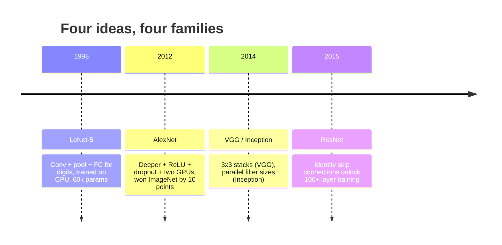
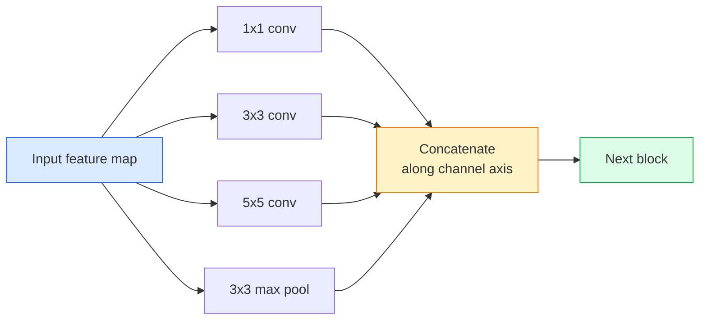
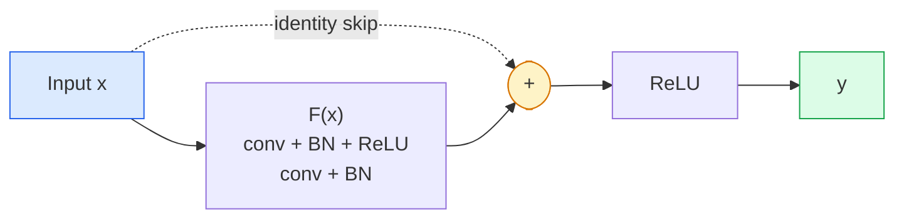

# CNN'ler LeNet'ten ResNet'e CNN'in yapısal gelişmeleri LeNet'ten ResNet'e

> Son otuz yılın her büyük CNN'i aynı konvansiyonu ile aynı bir yeni fikirle birlikte.

> **【中文解读】**Geçtiğimiz üç yıl boyunca tüm önemli CNN hepsi aynı modeldi. Bu yenilikler sadece görüntüyü değiştirmedi, Transformer ve LLM'ye de geçti.

**Type:** Learn + Build | **类型:** 学习 + 动手
**Languages:** Python | **语言:** Python
**Prerequisites:** Phase 3 Lesson 11 (PyTorch), Phase 4 Lesson 01 (Image Fundamentals), Phase 4 Lesson 02 (Convolutions from Scratch) | **前置知识:** Phase 3 Lesson 11（PyTorch），Phase 4 Lesson 01（图像基础），Phase 4 Lesson 02（从零实现卷积）
**Time:** ~75 minutes | **时间:** ~75 分钟

## Öğrenme hedefleri

- LeNet-5 -> AlexNet -> VGG -> Başlangıç -> ResNet mimari soyunu izleyin ve her aileye katılan tek yeni fikri belirtin
- PyTorch'te LeNet-5 uygulaması, VGG tarzı bir blok ve ResNet BasicBlock, her biri 40 satırın altında
- Geri kalan bağlantılar neden 1.000 katmanlı bir ağı eğitimsizden en son teknolojiye dönüştürdüğünü açıklayın.
- Modern bir omurganı okuyun (ResNet-18, ResNet-50) ve kaynağa bakmadan önce çıkış şeklini, kabul alanını ve parametrelerin sayısını tahmin edin

> **【中文解读】**Öğrenme hedefi, ders bitirilmesinden sonra öğrenilmesi gereken temel becerileri listeler.


## Sorunlar. Sorunlar.

2011'de en iyi ImageNet sınıflandırıcısı %74 arasında en iyi 5 doğruluk elde etti. 2012 yılında AlexNet %85 puan aldı. ResNet'in 2015 yılında yüzde 96 puanı vardı. Yeni veriler yok. Yeni GPU nesil yok. Kazançlar mimari fikirlerden geldi. Çalışan bir vizyon mühendisi hangi kağıttan hangi fikir geldiğini bilmeli çünkü 2026'da gönderdiğiniz her üretim omurgası aynı parçaların bir yeniden birleşimidir  ve fikirler sürekli aktarılmaktadır: gruplandırılmış konvoylar CNN'lerden transformatörlere, kalan bağlantılar ResNet'ten var olan her LLM'ye geçti, parti normallaşması difüzyon modellerinde yaşar.

> 2011 yılında en iyi ImageNet sınıflandırma makinesi ilk 5 ı doğrulama oranı yaklaşık %74'di. 2012 yılında AlexNet %85'e ulaştı. 2015 yılında ResNet %96'a ulaştı. Yeni veriler yok. Yeni GPU'lar yok. Bu artışlar yapı düşüncesinden kaynaklanıyor. 2026 yılında dağıtılan her üretim köken ağının aynı parçaların yeniden yapılandırılması nedeniyle, bir kalifiye görsel mühendis hangi makaleden gelen bir fikir olduğunu bilmeli.

> **【中文解读】**2011-2015 yılları arasında ImageNet 准确率 % 74 跳起至 96% 跳起至%,靠的不是新数据或新GPU,而是架构创新──这些创新至今仍在被重复使用:分组卷积从CNN 转移到变压器,残差连接从ResNet 扩展到所有LLM,批量归化用于扩散模型──理解每个思想的来源,是现代视觉工程师的基本功劳──

Bu ağları incelemek aynı zamanda yaygın bir hata karşılığını sağlar: LeNet büyüklüğündeki bir ağın sorunu çözeceği en büyük mevcut modelin ulaşılması. MNIST'in ResNet'e ihtiyacı yoktur.

> 按顺序学习这些网络还能让你避免一个常见错误: LeNet'in büyük ağları bir sorun çözmeye çalışırken, en büyük kullanılabilir modeli kullanmak gerekir. MNIST'in ResNet'e ihtiyacı yoktur.

## Konsepten bir şey.

### Görüşü değiştiren dört fikir bilgisayar görüşünü değiştiren dört fikir



Klasik görme alanında bu dört atlayış kadar önemli bir şey yoktu.

> Klasik görüntüde bu dört atılımdan daha önemli bir şey yok.

### LeNet-5 (1998) İlk CNN

Yann LeCun'un rakam tanıtıcısı. 60.000 parametre. İki konfor havuzu blokları, iki tamamen bağlantılı katman, tanh etkinleştirmeleri.

> Yann LeCun'un dijital tanımlayıcıı, 60.000 parametre, iki bölük-bölümleme blok, iki tam bağlantı katmanı, tanh  aktiv.

```
input (1, 32, 32)
  conv 5x5 -> (6, 28, 28)
  avg pool 2x2 -> (6, 14, 14)
  conv 5x5 -> (16, 10, 10)
  avg pool 2x2 -> (16, 5, 5)
  flatten -> 400
  dense -> 120
  dense -> 84
  dense -> 10
```

Modern dünya CNN'e  değişik dönüşümler ve küçük sınıflandırıcı başı  ile beslenme örneklemesi diyen her şey LeNet daha fazla katman, daha büyük kanallar ve daha iyi etkinleştirmeler ile.

> Modern dünya CNN'in tüm değişimlerinin bir küçük sınıflandırma makinesi olarak adlandırılmasının nedeni daha fazla katman, daha büyük kanal ve daha iyi aktif bir LeNet olmasıdır.

> **【中文解读】**LeNet-5 tüm CNN'in temel modulesini tanımladı:卷积 → 池化 → 卷积 → 池化 → 全连接── sadece 60.000 parametreler, ancak derin öğrenme görsel sisteminin temel yapısını oluşturdu──

### AlexNet (2012) derin öğrenme patlama noktası

ImageNet'i birleştiren üç değişiklik:

> Üç değişim ImageNet'i kopardı:

1. **ReLU**Bu yüzden, bu kadar çok şey yapmamalıyız.
2. **Dropout**Düzenleştiricilik bir hile değil, bir katman olur.
3. **Depth and width**Beş katman, üç katman, 60M parametreleri, iki GPU'da eğitilmiş ve model bölünmüş.

Kağıtın 2. Şekili hala GPU'yu iki paralel akış olarak ayırır. Bu paralellik bir donanım çözümüydi, mimari bir anlayış değil  ama yukarıdaki üç fikir hala kullandığınız her modelde var.

> Raporun 2. şablonunda hala GPU'nun iki paralel akışa bölünmesi gösterilmiştir. Bu paralellik, yapısal bir fikir değil, ancak yukarıdaki üç fikir hala kullandığınız her modelde yer alıyor.

> **【拓展：AlexNet 的遗产】**AlexNet'in başlatılan üç yenilik şu ana kadar var: 1) ReLU  aktivasyon fonksiyonu, dereceli yok oluş sorununu çözdü; 2) Kayıp düzeltme, aşırı uyum önlemesi; 3) derinlik + genişlik ölçeklendirme düşüncesi.

### VGG (2014)  3x3 卷积的极致堆积

VGG sordu: Sadece 3x3 kıvrımları kullanırsanız ne olur ve derinlere giderseniz?

> VGG 问道: Eğer sadece 3x3 卷积 ve derinleştirirsen ne olur?

```
stack:   conv 3x3 -> conv 3x3 -> pool 2x2
repeat:  16 or 19 conv layers
```

İki 3x3 konvoy aynı 5x5 giriş alanını bir 5x5 konvoy olarak görür, ancak daha az parametrelerle (2 * 9 * C^2 = 18C^2 vs 25 * C^2) ve aralarında ekstra bir ReLU ile. VGG bu gözlemini tüm bir mimari haline getirdi.

> 2 * 9 * C^2 = 18C^2 vs 25*C^2), ortalarında ek bir ReLU。VGG vardır. Bu gözlem tam bir yapı haline gelecektir。简洁性  块类型, tekrar kullanımı                                                                                                                                                                                                                                     

Masraf: 138M parametre, yavaş çalıştırılır, sonuçlama için pahalı.

> 代价1.38 milyar参数, training slow,推理昂贵──

### Başlangıç (2014, aynı yıl)

Google'ın "ne tür bir çekirdek boyutu kullanmalıyım?" sorusuna verdiği cevap: hepsi paralel olarak.

> Google'ın "Neyle büyük bir nükleer kullanmalı?" cevabı:



Her dal kanal karıştırma için 1x1, yerel doku için 3x3, daha büyük desenler için 5x5, değişim değişmeyen özellikler için birleştirme için  ve konkat, bir sonraki katmanın hangi dalı kullanışlı olduğunu seçmesine izin verir. Başlangıç v1 parametre sayısını akılda tutmak için her dalın içinde 1x1 sarsıntıları bir şişlik olarak kullanmıştır.

> Her bir bölge farklı yönlerden ayrılır. 1x1 yol karışımı için kullanılır, 3x3 yerel yapılar için kullanılır, 5x5 daha büyük bir model için kullanılır, birleştirme için kullanılır.

### Degrasyon sorunu.

2015 yılına gelindiğinde VGG-19 işe yaradı ve VGG-32 işe yaramadı. Derinlik yardımcı olması gerekiyordu, ancak ~ 20 kat daha sonra hem eğitim hem de test kaybı kötüleşti. Bu aşırı uygun değil. Bu, optimizeci yararlı ağırlıkları bulmayı başarısız eder çünkü gradientler her kat boyunca çarpıcı olarak küçülür.

> 2015 yılına kadar, VGG-19 能工作但 VGG-32 不行──深度应该有助,但超过20层后训练和测试损失都变得更差──那不是过拟──那就是优化器因为梯度在每层乘法缩小而无法找到有用权重──

```
Plain deep network:
  y = f_L( f_{L-1}( ... f_1(x) ... ) )

Gradient wrt early layer:
  dL/dW_1 = dL/dy * df_L/df_{L-1} * ... * df_2/df_1 * df_1/dW_1

Each multiplicative term has magnitude roughly (weight magnitude) * (activation gain).
Stack 100 of them with gains < 1 and the gradient is effectively zero.
```

VGG, 19 katman üzerinde çalıştı çünkü parti normı (bir arada yayınlanan) etkinleştirmeleri iyi ölçeklendirdi.

> VGG'nin 19 kat kat kat çalışmaları, toplu birleştirme nedeniyle (birlikte yayınlanmış) aktif olarak iyi bir şekilde kısaltılmış durumda.

### ResNet (2015)  REST 差连接 深度学习突破

O, Zhang, Ren, Sun her şeyi düzelten bir değişiklik önerdi:

> Zhang Ren Sun, her şeyi düzeltmek için bir değişiklik önerdi.

```
standard block:   y = F(x)
residual block:   y = F(x) + x
```

- Evet .`+ x`Yani katman her zaman araba kullanarak hiçbir şey yapmayı seçebilir.`F(x)`Bu yüzden, bu sistemin en iyi yönü, her blokun *bir miktar* yararlı olmasını ve 100 kez yığılmış olarak, biraz yararlı olmasını sağlayacaktır.

> `+ x`Yani bu aşama her zaman geçebilir.`F(x)`趋向零来选择什么都不做―― 1000 katlı ResNet şimdi en çok 1 katlı bir ağ kadar farklıdır, çünkü her ek blokun basit bir kaçış yolu vardır― garanti var, optimizer istekli olarak her blok* biraz* yararlı, 100 kez toplanmış, en gelişmiş olanı yapar―



Her yerde iki çeşit blok görünebilir:

> 两种块变体无处不在:

- **BasicBlock**ResNet-18, ResNet-34: İki 3x3 konvoy, her ikisini de atlayın.
  Çeviri: Çeviri: Çeviri: Çeviri: Çeviri: Çeviri: Çeviri: Çeviri: Çeviri: Çeviri: Çeviri: Çeviri: Çeviri: Çeviri: Çeviri: Çeviri: Çeviri: Çeviri: Çeviri: Çeviri: Çeviri: Çeviri: Çeviri: Çeviri: Çeviri: Çeviri: Çeviri: Çeviri: Çeviri: Çeviri: Çeviri: Çeviri: Çeviri: Çeviri: Çeviri: Çeviri: Çeviri: Çeviri: Çeviri: Çeviri: Çeviri: Çeviri: Çeviri: Çeviri: Çeviri: Çeviri: Çeviri: Çeviri: Çeviri: Çeviri: Çeviri: Çeviri
- **Bottleneck**ResNet-50, -101, -152): 1x1 aşağı, 3x3 orta, 1x1 yukarı, üçlüyi atlayın.
  Çinçe Çevirimi: 瓶块1x1 降维、3x3 中间、1x1 升维,跨三者跳──通道数高时更便宜──

Atlamak bir aşağı örnek (adım = 2) geçmesi gerektiğinde, kimlik yolu şekillerle eşleşmek için 1x1 adım = 2 konvoy ile değiştirilir.

> Atlamak için geçmek gerekirken, adım = 2 olarak değişir.

### Geri kalanlar neden görselden daha önemli ?

Bu fikir aslında görüntü sınıflandırması değildi. Bu derin ağları "barmakların çaprazından ve umud gradientleri hayatta kalmak"dan güvenilir, ölçeklenebilir bir mühendislik aracı haline getirmekle ilgiliydi.

> Bu fikir aslında resim sınıflandırması hakkında değil. Bu derinlik ağını "dua merdivenleri hayatta kalabilir" den güvenilir, genişletilebilir bir mühendislik aracı haline getirmekle ilgili.

> **【拓展：残差连接与 Transformer】**Rast差 bağlantısı sadece görselliği değiştirmedi, derinlik ağının "dua gradiente canvirvir" ından güvenilir bir mühendislik aracı haline gelmesine izin verdi. GPT,BERT,Claude'un arkasındaki model dahil olmak üzere her bir Transformer blokı tamamen aynı sıçrama bağlantısını kullanıyor.`y = F(x) + x`Derin öğrenmenin en önemli yöntemlerinden biri de olabilir.

> **【拓展：工业部署中的视觉系统】**Gerçek endüstriye dağıtımında, görsel modeller gecikme, model büyüklüğü, kenar cihazların uyumlu olması gibi sorunları düşünmelidir. TensorRT, ONNX Runtime, OpenVINO, yaygın olarak kullanılan bir görsel model hızlandırma aracıdır.

```figure
pooling
```

## Yapın

## Yapın.

### Adım 1: LeNet-5'i gerçekleştirin.

Tanh aktivasyonları, ortalama birleştirme.`nn.CrossEntropyLoss`Orijinal Gaussian bağlantılarının yerine akıntıda.

> Bir en azlaştırılmış 、 sadık LeNet ٬ Tan                                                                                                                                                                                                                                                                                                                                                                                                                                                                                                                `nn.CrossEntropyLoss`Asıl yüksek bağlantı değil.

```python
import torch
import torch.nn as nn
import torch.nn.functional as F

class LeNet5(nn.Module):
    def __init__(self, num_classes=10):
        super().__init__()
        self.conv1 = nn.Conv2d(1, 6, kernel_size=5)
        self.conv2 = nn.Conv2d(6, 16, kernel_size=5)
        self.pool = nn.AvgPool2d(2)
        self.fc1 = nn.Linear(16 * 5 * 5, 120)
        self.fc2 = nn.Linear(120, 84)
        self.fc3 = nn.Linear(84, num_classes)

    def forward(self, x):
        x = self.pool(torch.tanh(self.conv1(x)))
        x = self.pool(torch.tanh(self.conv2(x)))
        x = torch.flatten(x, 1)
        x = torch.tanh(self.fc1(x))
        x = torch.tanh(self.fc2(x))
        return self.fc3(x)

net = LeNet5()
x = torch.randn(1, 1, 32, 32)
print(f"output: {net(x).shape}")
print(f"params: {sum(p.numel() for p in net.parameters()):,}")
```

Beklenen üretim: `output: torch.Size([1, 10])`- Evet .`params: 61,706`Bu, modern vizyonun başlangıcı olan tüm rakam sınıflandırıcısı.

> 预期输出:`output: torch.Size([1, 10])`- Evet.`params: 61,706`                                                                                                                                                                                                                                                              

### Adım 2: VGG blokunu gerçekleştirin.

Tekrar kullanılabilir blok: iki 3x3 konvoy, ReLU, parti norm, maksimum havuz.

> Bir tekrarlanabilir blok: iki 3x3 卷积、ReLU、批量归归归归归归归归归最大池归归──

```python
class VGGBlock(nn.Module):
    def __init__(self, in_c, out_c):
        super().__init__()
        self.conv1 = nn.Conv2d(in_c, out_c, kernel_size=3, padding=1)
        self.bn1 = nn.BatchNorm2d(out_c)
        self.conv2 = nn.Conv2d(out_c, out_c, kernel_size=3, padding=1)
        self.bn2 = nn.BatchNorm2d(out_c)
        self.pool = nn.MaxPool2d(2)

    def forward(self, x):
        x = F.relu(self.bn1(self.conv1(x)))
        x = F.relu(self.bn2(self.conv2(x)))
        return self.pool(x)

class MiniVGG(nn.Module):
    def __init__(self, num_classes=10):
        super().__init__()
        self.stack = nn.Sequential(
            VGGBlock(3, 32),
            VGGBlock(32, 64),
            VGGBlock(64, 128),
        )
        self.head = nn.Sequential(
            nn.AdaptiveAvgPool2d(1),
            nn.Flatten(),
            nn.Linear(128, num_classes),
        )

    def forward(self, x):
        return self.head(self.stack(x))

net = MiniVGG()
x = torch.randn(1, 3, 32, 32)
print(f"output: {net(x).shape}")
print(f"params: {sum(p.numel() for p in net.parameters()):,}")
```

CIFAR büyüklüğündeki giriş üzerinde üç VGG blok, adaptatif bir havuz, bir çizgi katman. ~290k parametreleri. CIFAR-10 için yeterli.

> CIFAR  ölçümlü giriş üzerindeki üç VGG 块、自适应池化、一线性层──約29万参数──对 CIFAR-10 有余──

### Adım 3: ResNet BasicBlock uygulaması ResNet  BasicBlock uygulaması

ResNet-18 ve ResNet-34'ün temel yapı taşı.

> ResNet-18 ve ResNet-34'ün temel yapılama blokları:

```python
class BasicBlock(nn.Module):
    def __init__(self, in_c, out_c, stride=1):
        super().__init__()
        self.conv1 = nn.Conv2d(in_c, out_c, kernel_size=3, stride=stride, padding=1, bias=False)
        self.bn1 = nn.BatchNorm2d(out_c)
        self.conv2 = nn.Conv2d(out_c, out_c, kernel_size=3, stride=1, padding=1, bias=False)
        self.bn2 = nn.BatchNorm2d(out_c)
        if stride != 1 or in_c != out_c:
            self.shortcut = nn.Sequential(
                nn.Conv2d(in_c, out_c, kernel_size=1, stride=stride, bias=False),
                nn.BatchNorm2d(out_c),
            )
        else:
            self.shortcut = nn.Identity()

    def forward(self, x):
        out = F.relu(self.bn1(self.conv1(x)))
        out = self.bn2(self.conv2(out))
        out = out + self.shortcut(x)
        return F.relu(out)
```

`bias=False`Bu nedenle, bu konfor kısıtlamaları da bir atık.`shortcut`Sadece adım veya kanal sayısının değişmesi durumunda gerçek bir konuma ihtiyaç duyulur; aksi takdirde bu bir işleme yapılmaz kimliktir.

> 卷积层上 `bias=False`Bu yüzden, birikimle birimlenme biçiminde birimlenme biçiminde birimlenme biçiminde birimlenme biçimi kullanılır.`shortcut`Sadece adım boyutunda veya yol sayısında değişiklik olduğunda gerçek bir kıvrım gerektirir; aksi takdirde bu işlemsiz bir sabitliktir.

### Dördüncü adım: Küçük bir ResNet oluşturun.

CIFAR büyüklüğündeki girişler için çalışan bir ResNet elde etmek için BasicBlocks'in dört grubu yığılsın.

> 堆叠四组 BasicBlock 以获得适用于 CIFAR 尺寸输入工作ResNet。

```python
class TinyResNet(nn.Module):
    def __init__(self, num_classes=10):
        super().__init__()
        self.stem = nn.Sequential(
            nn.Conv2d(3, 32, kernel_size=3, stride=1, padding=1, bias=False),
            nn.BatchNorm2d(32),
            nn.ReLU(inplace=True),
        )
        self.layer1 = self._make_group(32, 32, num_blocks=2, stride=1)
        self.layer2 = self._make_group(32, 64, num_blocks=2, stride=2)
        self.layer3 = self._make_group(64, 128, num_blocks=2, stride=2)
        self.layer4 = self._make_group(128, 256, num_blocks=2, stride=2)
        self.head = nn.Sequential(
            nn.AdaptiveAvgPool2d(1),
            nn.Flatten(),
            nn.Linear(256, num_classes),
        )

    def _make_group(self, in_c, out_c, num_blocks, stride):
        blocks = [BasicBlock(in_c, out_c, stride=stride)]
        for _ in range(num_blocks - 1):
            blocks.append(BasicBlock(out_c, out_c, stride=1))
        return nn.Sequential(*blocks)

    def forward(self, x):
        x = self.stem(x)
        x = self.layer1(x)
        x = self.layer2(x)
        x = self.layer3(x)
        x = self.layer4(x)
        return self.head(x)

net = TinyResNet()
x = torch.randn(1, 3, 32, 32)
print(f"output: {net(x).shape}")
print(f"params: {sum(p.numel() for p in net.parameters()):,}")
```

Her iki bloktan oluşan dört grup. 2, 3, 4 grupların başında 2. adım. Her aşağı örnekte kanal sayısı iki katına çıkar. Yaklaşık 2.8M parametreler.

> 4 grup her grup iki blok. 2. 3. 4. 2. 2. 2. 2. 2. 2. 2. 2. 2. 2. 2. 2. 2. 2. 2. 2. 2. 2. 2. 2. 2. 2. 2. 2. 2. 2. 2. 2. 2. 2. 2. 2. 2. 2. 2. 2. 2. 2. 2. 2. 2. 2. 2. 2. 2. 2. 2. 2. 2. 2. 2. 2. 2. 2. 2. 2. 2. 2. 2. 2. 2. 2. 2. 2. 2. 2. 2. 2. 2. 2. 2. 2. 2. 2. 2. 2. 2. 2. 2. 2. 2. 2. 2. 2. 2. 2. 2. 2. 2. 2. 2. 2. 2. 2. 2. 2. 2. 2. 2. 2. 2. 2. 2. 2. 2. 2. 2. 2. 2. 2. 2. 2. 2. 2. 2. 2. 2. 2. 2. 2. 2. 2. 2. 2. 2. 2. 2. 2. 2. 2. 2. 2. 2. 2. 2. 2. 2. 2. 2. 2. 2. 2. 2. 2. 2. 2. 2. 2. 2. 2. 2. 2. 2. 2. 2. 2. 2. 2. 2. 2. 2. 2. 2. 2. 2. 2. 2. 2. 2. 2. 2. 2. 2. 2. 2. 2. 2. 2. 2. 2. 2. 2. 2. 2. 2. 2. 2. 2. 2. 2. 2. 2. 2. 2. 2. 2. 2. 2. 2. 2. 2. 2. 2. 2. 2. 2. 2. 2. 2. 2. 2. 2. 2. 2. 2. 2. 2. 2. 2. 2. 2. 2. 2. 2. 2. 2. 2. 2. 2. 2. 2. 2. 2. 2. 2. 2. 2. 2. 2. 2. 2. 2. 2. 2. 2. 2. 2. 2. 2. 2. 2. 2. 2. 2. 2. 2. 2. 2. 2. 2. 2. 2. 2. 2. 2. 2. 2. 2. 2. 2. 2. 2. 2. 2. 2. 2. 2. 2. 2. 2. 2. 2. 2. 2. 2. 2. 2. 2. 2. 2. 2. 2. 2. 2. 2. 2. 2. 2. 2. 2. 2. 2. 2. 2. 2. 2. 2. 2. 2. 2. 2. 2. 2. 2. 2. 2. 2. 2. 2. 2. 2. 2. 2. 2. 2. 2. 2. 2. 2. 2. 2. 2. 2. 2. 2. 2. 2. 2. 2. 2. 2. 2. 2. 2. 2. 2. 2. 2. 2. 2. 2. 2. 2. 2. 2. 2. 2. 2. 2. 2. 2. 2. 2. 2. 2. 2. 2. 2. 2. 2. 2. 2. 2. 2. 2. 2. 2. 2. 2. 2. 2. 2. 2. 2. 2. 2. 2. 2. 2. 2. 2. 2. 2. 2. 2. 2. 2. 2. 2. 2. 2. 2. 2. 2. 2. 2. 2. 2. 2. 2. 2. 2. 2. 2. 2. 2. 2. 2. 2. 2. 2. 2. 2. 2. 2. 2. 2. 2. 2. 2. 2. 2. 2. 2. 2. 2. 2. 2. 2. 2. 2. 2. 2. 2. 2. 2. 2. 2. 2. 2. 2. 2. 2. 2. 2. 2. 2. 2. 2. 2. 2. 2. 2. 2. 2. 2. 2. 2. 2. 2. 2. 2. 2. 2. 2. 2. 2. 2. 2. 2. 2. 2. 2. 2. 2. 2. 2. 2. 2. 2. 2. 2. 2. 2. 2. 2. 2. 2. 2. 2.

### Adım 5: Parametre-karakteristik verimliliği karşılaştırın.

Üç ağda aynı girişleri çalıştırın ve parametrelerin sayısını karşılaştırın.

> Aynı giriş tüm üç ağ üzerinden yapılır ve parametre sayısı karşılaştırılır.

```python
def summary(name, net, x):
    y = net(x)
    params = sum(p.numel() for p in net.parameters())
    print(f"{name:12s}  input {tuple(x.shape)} -> output {tuple(y.shape)}  params {params:>10,}")

x = torch.randn(1, 3, 32, 32)
summary("LeNet5",     LeNet5(),       torch.randn(1, 1, 32, 32))
summary("MiniVGG",    MiniVGG(),      x)
summary("TinyResNet", TinyResNet(),   x)
```

CIFAR-10 doğruluğu için yaklaşık olarak: LeNet 60%, MiniVGG 89%, TinyResNet 93% birkaç eğitim döneminden sonra.

> Üç model, üç zaman, üç sayı seviyesine göre CIFAR-10 准确率 için, birkaç dönem için eğitilmek 后大致需要:LeNet 60%、MiniVGG 89%、TinyResNet 93%。


## Bunu uygulamak için kullanın.

`torchvision.models`Bu, yukarıdaki tümlerin önceden eğitilmiş versiyonlarını verir.

> `torchvision.models`                                                                                                                                                                                                                                                              

```python
from torchvision.models import resnet18, ResNet18_Weights, vgg16, VGG16_Weights

r18 = resnet18(weights=ResNet18_Weights.IMAGENET1K_V1)
r18.eval()

print(f"ResNet-18 params: {sum(p.numel() for p in r18.parameters()):,}")
print(r18.layer1[0])
print()

v16 = vgg16(weights=VGG16_Weights.IMAGENET1K_V1)
v16.eval()
print(f"VGG-16   params: {sum(p.numel() for p in v16.parameters()):,}")
```

ResNet-18'in 11.7M parametresi var. VGG-16'ın 138M. Aynı ImageNet top-1 doğruluğu (69.8% vs 71.6%). Geri kalan bağlantılar size 12x parametreler verimliliği kazanır. Bu nedenle ResNet'in değişikleri 2016'dan 2021'de ViT'ye kadar baskın olmuştur ve hala hesaplama engelli olduğu gerçek dünya dağıtımlarında baskın olmuştur.

> **【中文解读】**ResNet-18(1170 milyon parametre) vs VGG-16(1.38 milyar parametre),ImageNet 准确率相近, fakat parametre verimliliği 12 kat daha farklıdır.

Transfer öğrenimi için, tarif her zaman aynıdır: önceden eğitilmiş yük, omurganı dondurma, sınıflandırıcı başını değiştir.

>                                                                                                                                                                                                                                                               

```python
for p in r18.parameters():
    p.requires_grad = False
r18.fc = nn.Linear(r18.fc.in_features, 10)
```

Şimdi, ImageNet'in ödediği temsilleri miras alan 10 sınıflı bir CIFAR sınıflandırıcınız var.

> Üç sıra kod. Şimdi bir 10 sınıf CIFAR sınıflandırma makinesi var ve ImageNet'in 付费得到的表示を继承している.


> **【拓展：数据标注与质量】**视觉任务的效果高度依赖标签数据质――Label Studio、CVAT is the mainstream tagging tool――在工业场景中,主动学习(Active Learning) 标签成本ı azaltabilir:模型对不确定的样本请求人工标签,确定性的样本自动标签──

## Gönder , teslimat , ürünü gönder .

Bu ders şunları ortaya çıkarır:

> 本课产 出:

- `outputs/prompt-backbone-selector.md` verilen görev, veri kümesi boyutu ve hesaplama bütçesini belirleyen doğru CNN ailesini (LeNet/VGG/ResNet/MobileNet/ConvNeXt) seçen bir istek.
  Çinçe çevirisi:给定任务、数据集大小和计算预算,选择正确 CNN 家族的提示词──
- `outputs/skill-residual-block-reviewer.md` PyTorch modülü okuyan ve bağlantı atlama hatalarını işaretleyen bir beceri (yolu değişiminde kısayol eksikliği, kısayol etkinleştirme sırası, eklenmeye göre BN yerleştirme).
  Çinçe Çevirimi:读取 PyTorch 模块并标记跳跃连接错误的技能──

## Egzersizler.

> **【中文解读】**练习题按照易/中级/难三度递进;;建议至少完成中级题,Hard级适合深入研究或面试准备;;


1. **(Easy | 简单)**Parametreyi el ile say `TinyResNet`Katman katman.`sum(p.numel() for p in net.parameters())`Parametre bütçesinin çoğunluğu nereye gider?
   Layer by layer Layer by layer Layer by layer Layer by layer Layer by layer Layer by layer Layer by layer Layer by layer Layer by layer Layer by layer Layer by layer Layer by layer Layer by layer Layer by layer Layer by layer Layer by layer Layer by layer Layer by layer Layer by layer Layer by layer Layer by layer Layer by layer Layer by layer Layer by layer Layer by layer Layer by layer Layer by layer Layer by layer Layer by layer Layer by layer Layer by layer Layer by layer Layer by layer Layer by layer Layer by layer Layer by layer Layer by layer Layer by layer Layer by layer Layer by layer Layer by layer Layer by Layer by 

2. **(Medium | 中等)**Botulyo blokunu uygulayın (1x1 -> 3x3 -> 1x1 atlamakla) ve onu CIFAR için ResNet-50 tarzında bir ağ oluşturmak için kullanın.`TinyResNet`- Evet .
   实现 Bottleneck 块, ResNet-50 风格网络,对比参数──

3. **(Hard | 困难)** Çıkış bağlantısını kaldır`BasicBlock`CIFAR-10'da 34 bloklu "sırın" ağ ve 34 bloklu ResNet'i her biri 10 dönem boyunca çalıştırın. Her ikisi için de plan eğitim kaybı vs. dönem. He et al. Şekil 1 sonucu, düz derin ağın daha sığ ikizinden daha yüksek kaybı karşılaştığı zaman üretin.
   Bu nedenle, bu konularda, "sadece" ve "sadece" bağlantıların oluşturulması için, "sadece" bağlantıların oluşturulması için, "sadece" bağlantıların oluşturulması için, "sadece" bağlantıların oluşturulması için, "sadece" bağlantıların oluşturulması için, "sadece" bağlantıların oluşturulması için, "sadece" bağlantıların oluşturulması için, "sadece" bağlantıların oluşturulması için, "sadece" bağlantıların oluşturulması için, "sadece" bağlantıların oluşturulması için, "sadece" bağlantıların oluşturulması için, "sadece" bağlantıların oluşturulması için, "sadece" bağlantıların oluşturulması için, "sadece" oluşturulması için, "sadece" oluşturulması için, "sadece" oluşturulması için, "sadece" oluşturulması için, "sadece" yapılması için, "sadece" yapılması için, "sadece" yapılması için, "sadece" yapılması için, "sadece" yapılması gereken bir şey yapılması gerekir.

## Anahtar Terimler

| Term | What people say | What it actually means | 中文释义 |
|------|----------------|----------------------|---------|
| Backbone | "The model" | The stack of convolutional blocks that produces the feature map fed to the task head | 骨干网络：产生特征图的卷积块堆叠 |
| Residual connection | "Skip connection" | `y = F(x) + x`; lets the optimiser learn identity by setting F to zero, which makes arbitrary depth trainable | 残差连接/跳跃连接：让任意深度可训练 |
| BasicBlock | "Two 3x3 convs with a skip" | The ResNet-18/34 building block: conv-BN-ReLU-conv-BN-add-ReLU | 基本块：ResNet-18/34 的构建单元 |
| Bottleneck | "1x1 down, 3x3, 1x1 up" | The ResNet-50/101/152 block; cheap at high channel counts because the 3x3 runs on a reduced width | 瓶颈块：1x1降维-3x3卷积-1x1升维 |
| Degradation problem | "Deeper is worse" | Past ~20 plain conv layers, both training and test error increase; solved by residual connections, not by more data | 退化问题：层数加深后训练和测试误差都增大 |
| Stem | "The first layer" | The initial conv that converts 3-channel input into the base feature width; usually 7x7 stride 2 for ImageNet, 3x3 stride 1 for CIFAR | 茎部：网络的初始卷积层 |
| Head | "The classifier" | The layers after the final backbone block: adaptive pool, flatten, linear(s) | 头部：骨干网络之后的分类器层 |
| Transfer learning | "Pretrained weights" | Loading a backbone trained on ImageNet and fine-tuning only the head on your task | 迁移学习：加载预训练权重，只微调头部 |

## Daha fazla okumak

> **【中文解读】**延伸阅读, derinlemesine öğrenme için yüksek kaliteli kaynaklar sağladı. Bu makaleler ve dersler, derinlemesine anlama ihtiyacı olan okuyuculara uygun olarak bu alanın klasik referanslarıdır.


- [Deep Residual Learning for Image Recognition (He et al., 2015)](https://arxiv.org/abs/1512.03385)ResNet makalesi; her rakamın incelemeye değer
- [Very Deep Convolutional Networks (Simonyan & Zisserman, 2014)](https://arxiv.org/abs/1409.1556) VGG kağıdı; hala "neden 3x3" için en iyi referans
- [ImageNet Classification with Deep CNNs (Krizhevsky et al., 2012)](https://papers.nips.cc/paper_files/paper/2012/hash/c399862d3b9d6b76c8436e924a68c45b-Abstract.html) AlexNet; el yapımı özellik çağını sona erdiren kağıt
- [Going Deeper with Convolutions (Szegedy et al., 2014)](https://arxiv.org/abs/1409.4842) Başlangıç v1; hala görme transformörlerinde görünen paralel filtre fikri
