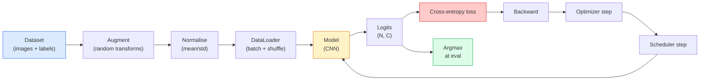

# Resim sınıflandırması

> Bir sınıflandırıcı, pikselden sınıflardaki olasılık dağılımına kadar bir fonksiyon.

> **【中文解读】**图像分类器本质上是从像素到类概率分布函数――检测(分类区域) 、分割(分类像素) 、检索(分类相似度排序) Sonuçta hepsi分类――掌握分类的完整流水线――数据集、增强、训练、评估) tüm görsel görevlerin temelidir――

**Type:** Build | **类型:** 动手
**Languages:** Python | **语言:** Python
**Prerequisites:** Phase 2 Lesson 09 (Model Evaluation), Phase 3 Lesson 10 (Mini Framework), Phase 4 Lesson 03 (CNNs) | **前置知识:** Phase 2 Lesson 09（模型评估），Phase 3 Lesson 10（迷你框架），Phase 4 Lesson 03（CNN）
**Time:** ~75 minutes | **时间:** ~75 分钟

## Öğrenme hedefleri

- CIFAR-10 üzerinde sonundan sonuna kadar bir görüntü sınıflandırma boru hattı oluşturmak: veri kümesi, artırma, model, eğitim döngüsü, değerlendirme
- Her bileşenin rolünü açıklayın (veriler yükleyici, kayb, optimizer, programlayıcı, artırma) ve kayb eğrisinde bunların herhangi birinin nasıl kırıldığını tahmin edin
- Karıştırma, kesme ve etiket düzeltme uygulaması sıfırdan başlayın ve her birinin eklenmeye değer olduğunu haklı çıkarın
- Toplam doğruluğundan daha fazla veri kümesi ve model hatalarını teşhis etmek için bir karıştırma matrisi ve sınıf başına doğru/içini geri çeken tablo okuyun

> **【中文解读】**Öğrenme hedefi, ders bitirilmesinden sonra öğrenilmesi gereken temel becerileri listeler.


## Sorunlar. Sorunlar.

Gönderen her görüntü görevi bir düzeyde görüntü sınıflandırmasına düşürülür. Deteksiyon bölgeleri sınıflandırır. Segmentasyon pikselleri sınıflandırır. Arama sınıfı centroidlere benzerlik göstererek sıralamaktadır. sınıflandırma doğru elde etmek  veri kümesi döngüsü, artırma politikası, kaybı, değerlendirme  aşamada diğer tüm görevlere aktarılan beceri.

> Her teslimat görsel görev, bir ölçüde görüntü sınıfına bağlanır. Kontrol sınıfı bölgeleri. Bölüm sınıfları. Sınıf merkezi ile benzerlik sıralanması.

> **【中文解读】**Tüm gerçek dağıtımların görsel görevleri aslında görüntü sınıfına bağlanabilir: hedef sınıfı " Bölge sınıfına " , " Bölge sınıfına " , " Görüntü sınıfına " , " Kategoryen merkez benzerlik düzenine göre " , " Görüntü arayışı " sınıfın akış hattının her bölümünü açıklamak, bu aşamada tüm sonraki derslerin anahtarını ele almak,

Çoğu sınıflandırma hataları modelde yok. Onlar bir boru hattında yaşıyorlar: bozuk bir normallaşma, bir düzenlenmemiş eğitim kümesi, etiketleri çarpıtan büyütme, eğitim verileri ile kirlenmiş bir doğrulama bölümü, çağ 30'dan sonra sessizce farklılaşan bir öğrenme oranı. Doğru bir ayarla CIFAR-10'da %93'e ulaşan bir CNN, genellikle kırık bir ayarla %70-75 puan alır ve kayıp eğri her zaman makul görünür.

> Büyük çoğunluk sınıfı hataları modellerde bulunmuyor. Bunlar akış su hattında bulunur: yanlış birleştirme, bozulmamış eğitim kümeleri, çarpık etiketlerin güçlendirilmesi, eğitilmiş veri kirliliğinin doğrulanması kümeleri, 30. dönemde  sessiz yayılma sonrası öğrenme oranı. Doğru bir konutlama CIFAR-10'da %93'e ulaşabilir, yanlış konutlama altında genellikle sadece %70-75'e ulaşabilir ve kayıp eğri oldukça mantıklı görünüyor.

Bu ders tüm boru hattını el ile kablolar böylece her parça kontrol edilebilir.`torchvision.datasets`Bu bir böcek saklayabilir.

> Bu ders tüm su hattını kontrol edilebilir hale getirir.`torchvision.datasets`İçinde saklanabilecek herhangi bir şey var.

> **【中文解读】**Çoğu sınıf hataları, modelin kendisinde değil, akış su hattında: birleştirme, hata yapmak, eğitim kümesi çelişkiyi yok etmek, etiketi bozanın arttırılması, verileme kümesi eğitilmiş veri kirliliği, öğrenme oranı cıl yayılmasıdır. Düzgün konutlama %93'e ulaşır, yanlış konutlama %70-75'e ulaşır ve kayıp eğri normal görünüyor.

## Konsepten bir şey.

### Sınıflandırma boru hattı



Bu döngünün her satırı bir böcek yaşayabileceği bir yer.`model(x).softmax()`Kayıp sessizce yanlış bir eğilimi hesaplamadan önce.

> Bu döngünün her satırı bir hata olabilir.`model(x).softmax()`Şehir sessizce hesaplama hatası derecesini.

> **【中文解读】**流水线中每一行都可能藏有 bug──交叉接收的是原始logits(未经 softmax 的值), eğer önce softmax 再传入损失 函数 yapılırsa, gradi度计算就完全错了但不会报错── 增量只适用于输入, not labels  except for mixup, which mixes both. `optimizer.zero_grad()`Bu hatalar, öğrenme eğriğini bir hata yapmadan düzeltir.

### Çarşı entropi, logit ve softmax

Bir sınıflandırıcı üretir `C`Logit olarak adlandırılan bir görüntü başına sayı. Softmax uygulaması onları olasılık dağılımına dönüştürür:

> Klasörler için her resim üretilmektedir`C`个数字, logits olarak adlandırılır. Softmax uygulaması onları概率 dağılımına dönüştürür:

```
softmax(z)_i = exp(z_i) / sum_j exp(z_j)
```

Çarşı entropi doğru sınıfın negatif log olasılığını ölçer:

> 交叉 ölçmek doğru sınıfların negatif karşı sayı olasılığı:

```
CE(z, y) = -log( softmax(z)_y )
        = -z_y + log( sum_j exp(z_j) )
```

Sağdaki form sayısal olarak sabit olan (log-sum-exp) PyTorch'ın `nn.CrossEntropyLoss`softmax + NLL'i bir çalışmada birleştirir ve doğrudan çiğ logitleri alır. softmax'ı önce kendiniz uygulayarak neredeyse her zaman bir hata  log(softmax(softmax(z)) hesaplarsınız), anlamsız bir miktar.

> Sağ kenarlı formasi = sabit sayı değerleri`nn.CrossEntropyLoss`Bir işlem içinde fuse edildi softmax + NLL, doğrudan orijinal logitleri almak.

> **【中文解读】**PyTorch'in `nn.CrossEntropyLoss`内部已融合了软max + 负对数似然,直接传入原始logits 即可── Eğer önce softmax'ı manuel olarak ayarlarsanız, tekrar kaybı aktarırsanız, iki softmax'ı yapmanız eşittir, gradient hesaplama tamamen yanlış──

### Neden artış işe yarıyor?

Bir CNN'in çeviri için indüktif bir önyargısı vardır (vez paylaşımından), ancak ürünlere, atışlara, renk gerginliğine veya okluksiyona herhangi bir değişim yoktur. Bu değişimleri öğretmenin tek yolu, bunları uygulayan pikselleri göstermektir. Eğitim sırasında her rastgele dönüşüm: "bu iki görüntü aynı etiketlere sahiptir; farkı görmezden gelen özellikleri öğrenin".

> CNN, düzlemlere özgü bir ayrımcılık (o zamanki ağırlık paylaşımından gelir), ancak kesim, dönüşüm, renk                                                                                                                                                                                                                                                

> **【拓展：数据增强与模型泛化】**Veri artırma, modern AI'nin en güçlü ücretsiz düzenleme aracıdır. ResNet, EfficientNet ve diğer klasik model eğitimlerinde, güçlendirme stratejisinin iyi kötü yönlerinin doğrudan 3-5% doğruluk oranını etkisi vardır. Google'ın RandAugment ve AutoAugment ile arama yöntemleri otomatik olarak en iyi güçlendirme kombinasyonunu seçerken, ImageNet'de yaygın olarak doğrulanmıştır.

```
Original crop:  "dog facing left"
Flip:           "dog facing right"       <- same label, different pixels
Rotate(+15):    "dog, slight tilt"
Colour jitter:  "dog in warmer light"
RandomErasing:  "dog with patch missing"
```

Kural: büyütme etiketini korumalıdır. Bir rakamdaki kesim ve dönüşüm "6" 'ı "9'e çevirir; bu veri kümesi için daha küçük dönüş aralıkları kullanır ve rakamlara özgü invariansaları saygı gösteren büyütmeleri seçersiniz.

> 規則:增强必須保持标签不变──数字yi örtmek ve dönüştürmek için "6" '9'a dönüştürmek mümkündür; o veri kümesi için, daha küçük dönüş aralığını kullanır,并选择尊重数字特定不变性的增强──

### Karıştırma ve kesme

Normal artış pikselleri dönüştürür ama etiketleri tek sıcak tutar.**Mixup**ve **cutmix**Her ikisini de araştıracak şekilde bunu çözebilirsiniz.

> Normalde bir tane sıcaklık için etiketleme yapılır.**Mixup**和 **cutmix**Bu iki tarafın da bu noktayı bozması ile sonuçlandı.

```
Mixup:
  lambda ~ Beta(a, a)
  x = lambda * x_i + (1 - lambda) * x_j
  y = lambda * y_i + (1 - lambda) * y_j

Cutmix:
  paste a random rectangle of x_j into x_i
  y = area-weighted mix of y_i and y_j
```

Neden işe yarıyor: model, dikenli bir-sıcak hedefleri hatırlamayı bırakır ve sınıflar arasında interpolasyon yapmayı öğrenir. Eğitim kaybı artıyor, test doğruluğu artıyor. Bu, herhangi bir sınıflandırıcı için en ucuz dayanıklılık yükseltmesidir.

> Neden yardımcı oluyor: model durdurmak hatıra zirvesi bir-sıcak  hedef, sınıflar arasında birleştirme ≠ değer.

> **【拓展：Mixup 在大模型中的应用】**Karıştırma düşüncesi NLP alanına yayılmıştır. Metin yerleştirme için ekleme değerleri karıştırılmıştır. ChatGPT ve diğer LLM eğitimlerinde, etiket düzeltme ve soft etiketleme teknolojisi de yaygın olarak kullanılır, modellerin daha kalifiye olasılığı çıkışını oluşturmasına yardımcı olur, aşırı güven azaltır.

### Etiket düzeltme

Karışık bir kuzen.`[0, 0, 1, 0, 0]`, karşı tren`[eps/C, eps/C, 1-eps, eps/C, eps/C]`Küçük bir şey için .`eps`Bu, modelin keyfi keskinliklerle keskin bir şekilde keskin bir şekilde üretmesini engeller ve kalibrasyonu neredeyse hiç bir maliyetle iyileştirir.`nn.CrossEntropyLoss(label_smoothing=0.1)`PyTorch 1.10'dan beri.

> Karıştırma ∼ Not used `[0, 0, 1, 0, 0]` antrenman yapmak yerine kullanmak `[eps/C, eps/C, 1-eps, eps/C, eps/C]`, içinden `eps`0.1 ⋅ modellerin herhangi bir akıcı logit üretmesini engelleme, neredeyse hiç maliyetli bir kalifi­asyon geliştirme ⋅ PyTorch 1.10                                                                                                                                                                                                                                                                                                                                                                                                                                                                                        `nn.CrossEntropyLoss(label_smoothing=0.1)`İçeride.

### Düzgünlüğü aşan değerlendirme

Toplam doğruluk dengesizliği saklar. 90-10 ikili sınıflandırıcı her zaman çoğunluk sınıfının puanını tahmin eder.

> 总体准确率藏藏不平衡──一总是预测多数类90-10 二分类器能获得90%──真正告诉你发生了什么工具:

- **Per-class accuracy** sınıf başına bir sayı; hemen düşük performanslı kategoriler ortaya çıkar.
  Çinçe Çevirimiçi: Her sınıf bir rakam; hemen ortaya çık kötü performans gösterir.
- **Confusion matrix** C x C çizgi i col j = sınıf j olarak öngörülen gerçek sınıfın sayısı; diyagonal doğru, diyagonal dışı diyagonallar modelinizin yaşadığı yerdir.
  Çinçe çevirisi:混矩阵C x C 网格,行 i 列 j = 真实类别 i 被预测为类别 j 的计量;对角线是正确的,非对角线是你的模型出错的地方──
- **Top-1 / Top-5** doğru sınıfın en iyi 1 veya en iyi 5 tahminte olup olmadığını; Top-5'ün ImageNet için önemli olduğu "Norwich terrier" vs "Norfolk terrier" gibi sınıflar gerçekten belirsiz olduğu için.
  Çinçe Çevirimi:Top-1 / Top-5 正确类别是否在前 1 或前 5 个预测中;Top-5对 ImageNet 很重要,因为像"Norwich Terrier" vs. "Norfolk Terrier" 这样的类别确实模两可──
- **Calibration (ECE)** 0.8 güven tahminleri zamanın %80'inde doğru mu? Modern ağlar sistematik olarak aşırı güvenlidir; sıcaklık ölçeklendirilmesi veya etiket düzeltmesi ile düzeltin.
  Çinçe çevirisi:校准(ECE) 0.8 置信度的预测 80% 的时间是对的吗?

> **【拓展：工业部署中的视觉系统】**Gerçek endüstriye dağıtımında, görsel modeller gecikme, model büyüklüğü, kenar cihazların uyumlu olması gibi sorunları düşünmelidir. TensorRT, ONNX Runtime, OpenVINO, yaygın olarak kullanılan bir görsel model hızlandırma aracıdır.


## Yapın.

> **【中文解读】**Bu bölüm kodla sıfırdan gerçekleştirilen çekirdek algoritmasıdır. Bu "sıfırdan" yöntem çerçevenin arkasındaki prensipleri anlama yardımcı olur.

```figure
receptive-field
```

## Yapın

### Adım 1: Determinizm sentetik veri kümesi

CIFAR-10 disk üzerinde yaşıyor. Bu dersi tekrarlanabilir ve hızlı yapmak için modelin öğrenmesi gereken sınıf-specifik yapısı olan CIFAR  32x32 RGB görüntülerine benzeyen sentetik bir veri kümesi oluşturduk.

> CIFAR-10'un disk üzerinde varlığı. Bu dersi hızlı ve tekrarlanabilir hale getirmek için, CIFAR'ın yapılmış veri kümesi gibi görünen bir yapı oluşturduk.

```python
import numpy as np
import torch
from torch.utils.data import Dataset


def synthetic_cifar(num_per_class=1000, num_classes=10, seed=0):
    rng = np.random.default_rng(seed)
    X = []
    Y = []
    for c in range(num_classes):
        centre = rng.uniform(0, 1, (3,))
        freq = 2 + c
        for _ in range(num_per_class):
            yy, xx = np.meshgrid(np.linspace(0, 1, 32), np.linspace(0, 1, 32), indexing="ij")
            r = np.sin(xx * freq) * 0.5 + centre[0]
            g = np.cos(yy * freq) * 0.5 + centre[1]
            b = (xx + yy) * 0.5 * centre[2]
            img = np.stack([r, g, b], axis=-1)
            img += rng.normal(0, 0.08, img.shape)
            img = np.clip(img, 0, 1)
            X.append(img.astype(np.float32))
            Y.append(c)
    X = np.stack(X)
    Y = np.array(Y)
    idx = rng.permutation(len(X))
    return X[idx], Y[idx]


class ArrayDataset(Dataset):
    def __init__(self, X, Y, transform=None):
        self.X = X
        self.Y = Y
        self.transform = transform

    def __len__(self):
        return len(self.X)

    def __getitem__(self, i):
        img = self.X[i]
        if self.transform is not None:
            img = self.transform(img)
        img = torch.from_numpy(img).permute(2, 0, 1)
        return img, int(self.Y[i])
```

Her sınıf kendi renk paleti ve frekans kalıbı, ayrıca modelin pixelleri ezberlemek yerine sinyali öğrenmesini zorlamak için Gaussian gürültüsü elde eder.

> Her sınıfın kendi düzenleme tablosu ve frekans modeli vardır. Yüksek sesle birlikte, öğrenme sinyallerini, hatırlama görüntülerini değil, zorla öğrenme sinyallerini zorlamak için kullanılır.

### Adım 2: Normalleştirme ve artırma

Her görme borusunun sahip olduğu iki dönüşüm.

> Her görüntü akımında iki değişim vardır.

```python
def standardize(mean, std):
    mean = np.array(mean, dtype=np.float32)
    std = np.array(std, dtype=np.float32)
    def _fn(img):
        return (img - mean) / std
    return _fn


def random_hflip(p=0.5):
    def _fn(img):
        if np.random.random() < p:
            return img[:, ::-1, :].copy()
        return img
    return _fn


def random_crop(pad=4):
    def _fn(img):
        h, w = img.shape[:2]
        padded = np.pad(img, ((pad, pad), (pad, pad), (0, 0)), mode="reflect")
        y = np.random.randint(0, 2 * pad)
        x = np.random.randint(0, 2 * pad)
        return padded[y:y + h, x:x + w, :]
    return _fn


def compose(*fns):
    def _fn(img):
        for fn in fns:
            img = fn(img)
        return img
    return _fn
```

Yemekten önce yansıtacak bir çubuğu, sıfır çubuğu değil, çünkü siyah sınırlar, modelin önemsiz bir şekilde görmezden gelmeyi öğrendiği bir sinyal.

> 剪前使用反射填充而非零填充, çünkü siyah sınırlar, model birliği tarafından kullanılmayan bir şekilde göz ardı edilen bir sinyaltir.

### Adım 3: Karıştırma

Eğitim aşamasının içinde iki görüntü ve iki etiket karıştırır.

> Eğitim aşamasında iki görüntü ve iki etiket karışımı vardır.

```python
def mixup_batch(x, y, num_classes, alpha=0.2):
    if alpha <= 0:
        return x, torch.nn.functional.one_hot(y, num_classes).float()
    lam = float(np.random.beta(alpha, alpha))
    idx = torch.randperm(x.size(0), device=x.device)
    x_mixed = lam * x + (1 - lam) * x[idx]
    y_onehot = torch.nn.functional.one_hot(y, num_classes).float()
    y_mixed = lam * y_onehot + (1 - lam) * y_onehot[idx]
    return x_mixed, y_mixed


def soft_cross_entropy(logits, soft_targets):
    log_probs = torch.log_softmax(logits, dim=-1)
    return -(soft_targets * log_probs).sum(dim=-1).mean()
```

`soft_cross_entropy`Hedef tam olarak bir sıcaktan sonra, normal bir sıcaktan aşağı düşer.

> `soft_cross_entropy`Hedef bir ısınma ︎ olduğunda, normal bir ısınma ︎ haline dönüşür.

### 4. Adım: Eğitim döngüsü

Tam tarif: verileri bir kez geçmek, her partiye bir kez gradientler, zamanlama bir kez adım atmak.

> 完整方案: verileri bir kez tekrar, her birimi bir kez seviyeye, her dönem için 调度一次学习率

```python
import torch
import torch.nn as nn
from torch.utils.data import DataLoader
from torch.optim import SGD
from torch.optim.lr_scheduler import CosineAnnealingLR

def train_one_epoch(model, loader, optimizer, device, num_classes, use_mixup=True):
    model.train()
    total, correct, loss_sum = 0, 0, 0.0
    for x, y in loader:
        x, y = x.to(device), y.to(device)
        if use_mixup:
            x_m, y_soft = mixup_batch(x, y, num_classes)
            logits = model(x_m)
            loss = soft_cross_entropy(logits, y_soft)
        else:
            logits = model(x)
            loss = nn.functional.cross_entropy(logits, y, label_smoothing=0.1)
        optimizer.zero_grad()
        loss.backward()
        optimizer.step()
        loss_sum += loss.item() * x.size(0)
        total += x.size(0)
        # Training accuracy vs the un-mixed labels `y` is only an approximation
        # when mixup is on (the model saw soft targets, not y). Treat it as a
        # rough progress signal; rely on val accuracy for real performance.
        with torch.no_grad():
            pred = logits.argmax(dim=-1)
            correct += (pred == y).sum().item()
    return loss_sum / total, correct / total


@torch.no_grad()
def evaluate(model, loader, device, num_classes):
    model.eval()
    total, correct = 0, 0
    loss_sum = 0.0
    cm = torch.zeros(num_classes, num_classes, dtype=torch.long)
    for x, y in loader:
        x, y = x.to(device), y.to(device)
        logits = model(x)
        loss = nn.functional.cross_entropy(logits, y)
        pred = logits.argmax(dim=-1)
        for t, p in zip(y.cpu(), pred.cpu()):
            cm[t, p] += 1
        loss_sum += loss.item() * x.size(0)
        total += x.size(0)
        correct += (pred == y).sum().item()
    return loss_sum / total, correct / total, cm
```

Her antrenman döngüsünü yazdığında kontrol ettiğin beş değişkenlik:

> Her yazma antrenman döngüsünde kontrolün beş değişikliği:

1. `model.train()`Eğitimden önce,`model.eval()`değerlendirme yapmadan önce  düşüş ve seri norm davranışlarını tersine çevirir.
2. `.zero_grad()`Daha önce`.backward()`- Evet .
3. `.item()`Eğer bir hesaplama grafikini canlı tutmak için hiçbir şey yok.
4. `@torch.no_grad()`değerlendirme sırasında  hafıza ve zaman tasarrufu sağlar, ince kazaları önler.
5. Argmax çiğ logitlere karşı, softmax değil  aynı sonuç, bir operasyon daha az.

### Adım 5: Bir araya getirin

Kullanın `TinyResNet`Önceki dersden, birkaç dönem için eğitim, değerlendirme.

> Uygulayacak ders`TinyResNet`, birkaç dönem eğitimi, değerlendirme,

```python
from main import synthetic_cifar, ArrayDataset
from main import standardize, random_hflip, random_crop, compose
from main import mixup_batch, soft_cross_entropy
from main import train_one_epoch, evaluate
# TinyResNet comes from the previous lesson (03-cnns-lenet-to-resnet).
# Adjust the import path to wherever you stored the previous lesson's code.
from cnns_lenet_to_resnet import TinyResNet  # example placeholder

X, Y = synthetic_cifar(num_per_class=500)
split = int(0.9 * len(X))
X_train, Y_train = X[:split], Y[:split]
X_val, Y_val = X[split:], Y[split:]

mean = [0.5, 0.5, 0.5]
std = [0.25, 0.25, 0.25]
train_tf = compose(random_hflip(), random_crop(pad=4), standardize(mean, std))
eval_tf = standardize(mean, std)

train_ds = ArrayDataset(X_train, Y_train, transform=train_tf)
val_ds = ArrayDataset(X_val, Y_val, transform=eval_tf)

train_loader = DataLoader(train_ds, batch_size=128, shuffle=True, num_workers=0)
val_loader = DataLoader(val_ds, batch_size=256, shuffle=False, num_workers=0)

device = "cuda" if torch.cuda.is_available() else "cpu"
model = TinyResNet(num_classes=10).to(device)
optimizer = SGD(model.parameters(), lr=0.1, momentum=0.9, weight_decay=5e-4, nesterov=True)
scheduler = CosineAnnealingLR(optimizer, T_max=10)

for epoch in range(10):
    tr_loss, tr_acc = train_one_epoch(model, train_loader, optimizer, device, 10, use_mixup=True)
    va_loss, va_acc, _ = evaluate(model, val_loader, device, 10)
    scheduler.step()
    print(f"epoch {epoch:2d}  lr {scheduler.get_last_lr()[0]:.4f}  "
          f"train {tr_loss:.3f}/{tr_acc:.3f}  val {va_loss:.3f}/{va_acc:.3f}")
```

Sentetik veri kümesi üzerinde, bu beş dönem içinde neredeyse mükemmel bir doğrulama doğruluğuna ulaşır, bu da noktayı oluşturur: boru hattı doğru, model neyi öğrenebilir. Veri kümesini gerçek CIFAR-10 için değiştirin ve aynı döngü trenleri değişikliksiz olarak ~ 90%'e ulaşır.

> Yapılandırılmış veri kümesi, beş dönemde mükemmel bir verifikasyon doğruluğu oranına yaklaşabilmektedir, bu da bir önlemdir: akım hattı doğru, model öğrenilebilir bir şey olacaktır.

### Adım 6: Kafas karışıklığı matrisi okuyun

Sadece doğruluk, modelin nerede başarısız olduğunu asla söylemez.

> Tek bir doğruluk oranı, modelin hangi yerde başarısız olduğunu asla söylemez.

```python
def print_confusion(cm, labels=None):
    c = cm.shape[0]
    labels = labels or [str(i) for i in range(c)]
    print(f"{'':>6}" + "".join(f"{l:>5}" for l in labels))
    for i in range(c):
        row = cm[i].tolist()
        print(f"{labels[i]:>6}" + "".join(f"{v:>5}" for v in row))
    print()
    tp = cm.diag().float()
    fp = cm.sum(dim=0).float() - tp
    fn = cm.sum(dim=1).float() - tp
    prec = tp / (tp + fp).clamp_min(1)
    rec = tp / (tp + fn).clamp_min(1)
    f1 = 2 * prec * rec / (prec + rec).clamp_min(1e-9)
    for i in range(c):
        print(f"{labels[i]:>6}  prec {prec[i]:.3f}  rec {rec[i]:.3f}  f1 {f1[i]:.3f}")

_, _, cm = evaluate(model, val_loader, device, 10)
print_confusion(cm)
```

Satırlar gerçek sınıflardır, sütunlar tahminlerdir. 3 ve 5 sınıflar arasında diyagonal dışı sayılar bir kümesi model bu iki şeyi karıştırır ve size hedeflenen veri toplama veya sınıf-özel bir artış için bir başlangıç noktası verir.

> 行是真类,列是预测──类 3 ve 5 之间非对角线计数的聚集意味着模型混合了这两个类,并为您提供了针对性的数据收集或类特定增强的起点──


## Çerçeveyi kullanın.

> **【中文解读】**Bu bölümde, PyTorch, HuggingFace gibi olgun çerçeveler nasıl kullanılacağını gösterir.


`torchvision`Gerçek CIFAR-10 için tüm boru hattı dört satır ve bir eğitim döngüsü.

> `torchview`Yukarıdaki tüm içeriği alışkanlıklı bir bileşen olarak kaplayacak. Gerçek CIFAR-10 için, tam bir akış hattı dört satır kod ve bir eğitim döngüsü vardır.

```python
from torchvision.datasets import CIFAR10
from torchvision.transforms import Compose, RandomCrop, RandomHorizontalFlip, ToTensor, Normalize

mean = (0.4914, 0.4822, 0.4465)
std = (0.2470, 0.2435, 0.2616)
train_tf = Compose([
    RandomCrop(32, padding=4, padding_mode="reflect"),
    RandomHorizontalFlip(),
    ToTensor(),
    Normalize(mean, std),
])
eval_tf = Compose([ToTensor(), Normalize(mean, std)])

train_ds = CIFAR10(root="./data", train=True,  download=True, transform=train_tf)
val_ds   = CIFAR10(root="./data", train=False, download=True, transform=eval_tf)
```

Dikkat edilmesi gereken iki şey var: ortalama/std **dataset-specific** CIFAR-10 eğitim kümesi üzerinde hesaplanmıştır, ImageNet değil  ve refleks padı topluluk-devay ürün politikasıdır.

> 两点注意事项: ortalama değer/standard差**数据集特定的** CIFAR-10                                                                                                                                                                                                                                                                                                                                                                                                                                                                                                                        


> **【拓展：数据标注与质量】**视觉任务的效果高度依赖标签数据质――Label Studio、CVAT is the mainstream tagging tool――在工业场景中,主动学习(Active Learning) 标签成本ı azaltabilir:模型对不确定的样本请求人工标签,确定性的样本自动标签──

## İndirin . Ürünler .

> **【中文解读】**Bu bölümde modellerin kullanılabilir ürünler için nasıl dağıtılacağı üzerinde yoğunlaşmaktadır.


Bu ders şunları ortaya çıkarır:

- `outputs/prompt-classifier-pipeline-auditor.md` yukarıdaki beş değişken için bir eğitim senaryosunu denetleyen ve ilk ihlal ortaya çıkan bir istek.
- `outputs/skill-classification-diagnostics.md` Bir karışıklık matrisi ve sınıf isimlerinin bir listesine göre sınıf başına başarısızlıkları özetleyen ve en etkili tek düzeltmeyi öneren bir beceri.

> **【中文解读】**练习题按照易/中级/难三度递进;;建议至少完成中级题,Hard级适合深入研究或面试准备;;


## Egzersizler.

1. **(Easy | 简单)**Aynı modelin sentez veriler kümesinde beş dönem boyunca karışıklık ve karışıklık olmadan çalıştırılmasını sağlayın.
   Ayrılık var / karışıklık yok  eğitim 5 ırk, çizim eğitim ve test kaybı  eğilimi, açıklama neden karışıklık  eğitim kaybı daha yüksek ama test doğruluk oranı farklı değildir.

2. **(Medium | 中等)**Kürtme  her eğitim görüntüsünde rastgele 8x8 kare sıfırlayın  ve bir ablasyon vs hiçbir artış, hflip+crop, hflip+crop+cutout, hflip+crop+mixup çalıştırın.
   实现 Cutout (随机遮 8x8 区域),对无增强、翻转+裁剪、翻转+裁剪+Cutout、翻转+裁剪+Mixup 四种方案做消融实验,报告验证准确率──

3. **(Hard | 困难)**CIFAR-100 borusunu oluşturun (100 sınıf, aynı giriş boyutu) ve ResNet-34 eğitimini yayınlanan doğruluğun % 1'i içinde yeniden üretin. Ekstra: üç öğrenme oranını ve iki ağırlık kaybını tarayın, yerel bir CSV'ye giriş yapın, son karışıklık-matris-üstün karışıklık tablounu oluşturun.
   CIFAR-100 流水线(100 类) kurulması, ResNet-34'in eğitim sonuçlarını %1 olarak yeniden oluşturmak ve %1 olarak yeniden oluşturmak için.

## Anahtar Terimler

| Term | What people say | What it actually means | 中文释义 |
|------|----------------|----------------------|---------|
| Logits | "Raw outputs" | The pre-softmax vector of C numbers per image; cross-entropy expects these, not softmaxed values | Logits：softmax 之前的原始输出向量，交叉熵直接接收它 |
| Cross-entropy | "The loss" | Negative log-probability of the correct class; combines log-softmax and NLL in one stable op | 交叉熵：正确类别的负对数概率，融合了 log-softmax 和 NLL |
| DataLoader | "The batcher" | Wraps a dataset with shuffling, batching, and (optional) multi-worker loading; gets blamed for half of training bugs | 数据加载器：封装数据集的打乱、分批、多进程加载 |
| Augmentation | "Random transforms" | Any pixel-level transform at training time that preserves the label; teaches invariances the CNN does not have natively | 数据增强：训练时保持标签不变的像素级变换，教会模型 CNN 天生不具备的不变性 |
| Mixup / Cutmix | "Mix two images" | Blend both inputs and labels so the classifier learns smooth interpolations instead of hard boundaries | Mixup/Cutmix：混合两张图像及其标签，让分类器学习平滑插值 |
| Label smoothing | "Softer targets" | Replace one-hot with (1-eps, eps/(C-1), ...); improves calibration and slightly boosts accuracy | 标签平滑：用软标签替代 one-hot，改善概率校准 |
| Top-k accuracy | "Top-5" | The correct class is in the k highest-probability predictions; used on datasets with genuinely ambiguous classes | Top-k 准确率：正确类别在前 k 个预测中即算对 |
| Confusion matrix | "Where errors live" | C x C table where entry (i, j) counts images of true class i predicted as j; diagonal is right, off-diagonal tells you what to fix | 混淆矩阵：C×C 表格，对角线是正确预测，非对角线揭示混淆的类别对 |

> **【中文解读】**延伸阅读, derinlemesine öğrenme için yüksek kaliteli kaynaklar sağladı. Bu makaleler ve dersler, derinlemesine anlama ihtiyacı olan okuyuculara uygun olarak bu alanın klasik referanslarıdır.


## Daha fazla okumak

- [CS231n: Training Neural Networks](https://cs231n.github.io/neural-networks-3/) Tek sayfada eğitim borusunun en net gezisi
- [Bag of Tricks for Image Classification (He et al., 2019)](https://arxiv.org/abs/1812.01187) Toplu olarak, ResNet'in doğruluğuna % 3-4 katkı sağlayan her küçük numara
- [mixup: Beyond Empirical Risk Minimization (Zhang et al., 2017)](https://arxiv.org/abs/1710.09412) orijinal karışıklık kağıdı; üç sayfa teorik ve ikna edici deneyler
- [Why temperature scaling matters (Guo et al., 2017)](https://arxiv.org/abs/1706.04599) modern ağların yanlış kalibrlendiğini kanıtlayan kağıt ve bir skalar parametresi ile sabitledi
