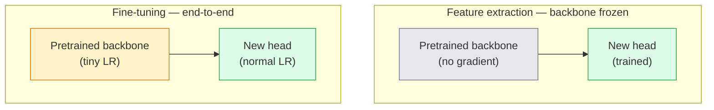

# Transfer Learning & Fine-Tuning                                                                                                                                                                                                                                                                                                                                                                                                                                                                                                                       

> Başka biri bir milyon GPU saatini bir ağı kenarların, dokuların ve nesnelerin nasıl göründüğünü öğretmeye harcadı.

> **【中文解读】**别人花了百万 GPU 小时教会网络识别边缘、纹理和物体部件──你应该在训练自己的模型之前先借这些特征──迁移学习是AI 工程中最实用技术预训骨干 +自定义分类头 = 几行代码就能解决新任务──

> **【拓展：迁移学习在工业界的应用】**几乎所有生产级视觉系统都使用迁移学习:医疗影像(ImageNet 预训练 + 医学数据微调) 工业质检、自动驾驶――训练 ResNet-50 需要 ~2000 GPU 小时,但微调只需要几分――

**Type:** Build | **类型:** 动手
**Languages:** Python | **语言:** Python
**Prerequisites:** Phase 4 Lesson 03 (CNNs), Phase 4 Lesson 04 (Image Classification) | **前置知识:** Phase 4 Lesson 03（CNN），Phase 4 Lesson 04（图像分类）
**Time:** ~75 minutes | **时间:** ~75 分钟

## Öğrenme hedefleri

- Özellik çıkarımı ince ayarlardan ayırt edin ve veriler kümesi boyutuna, alan mesafesine ve hesaplama bütçesine göre doğru olanı seçin
- Önceden eğitilmiş bir omurgan yükleyin, sınıflandırıcı başını değiştirin ve sadece başı 20 satırdan daha az bir çalışma başlangıç çizgisine doğru eğitin
- Ayrımcı öğrenme oranları olan katmanları yavaş yavaş çözün. Böylece erken genel özellikler geç görev spesifik olanlardan daha küçük güncellemeler alır.
- Üç ortak başarısızlığı teşhis edin: donmamış bloklarda çok yüksek LR'den özellik sürüklenmesi, küçük veri kümelerinde BN istatistiklerinin çökmesi ve felaketli unutulma

> **【中文解读】**Öğrenme hedefi, ders bitirilmesinden sonra öğrenilmesi gereken temel becerileri listeler.


## Sorunlar. Sorunlar.

ResNet-50'i ImageNet'te eğitmek yaklaşık 2.000 GPU saatine mal olur. Çok az ekip gönderdiği her görev için bu bütçeye sahiptir. Neredeyse her ekip aslında gönderdiği şey, birkaç yüz veya birkaç bin görev-özel görüntü üzerinde eğitilmiş yeni bir başla önceden eğitilmiş bir omurgan.

> ResNet-50'yi eğitmek için yaklaşık 2000 GPU gerekir. Küçük bir ekip, her teslimat görev için bu kadar fazla bütçeye sahiptir. Neredeyse tüm ekipler aslında bir önceden eğitim kemik ağı ve birkaç yüz veya binlerce görev için belirli bir görüntü üzerinde eğitilen yeni bir başlık sağlar.

> **【中文解读】**ResNet-50'den ise yaklaşık 2000 GPU'ya ihtiyaç duyulur, ancak göç öğrenmesi sadece birkaç dakika sürer.

Bu bir kısayol değil. ImageNet tarafından eğitilen herhangi bir CNN'in ilk konaklama bloku kenarları ve Gabor benzeri filtreleri öğrenir. Sonraki birkaç blok, dokuları ve basit motifleri öğrenir. Orta bloklar nesne parçalarını öğrenir. Son bloklar, 1000 ImageNet kategorisine benzeyen kombinasyonları öğrenir. Bu hiyerarşinin ilk %90'ı neredeyse değişmeden tıbbi görüntüleme, endüstriyel denetim, uydu verileri ve diğer tüm görme görevlerine aktarılır  çünkü doğa sınırlı bir kenar ve doku sözcüklüğe sahiptir. Son %10'u aslında eğitmen.

> Bu bir kısa yol değildir. ImageNet'te eğitim gören herhangi bir CNN'in ilk bölümü öğrenme blokları ve sınıflar Gabor 波器。 Sonraki birkaç blok öğrenme biçimi ve basit biçimleri。 Orta blok öğrenme nesnelerinin bileşenleri。 Son birkaç blok öğrenme biçimi 1000 ImageNet sınıfının bir araya gelmesi gibi görünüyor。 Bu aşama yapısının ilk %90'ı neredeyse değişmez olarak tıbbi görüntüleme, endüstriyel inceleme, uydu verileri ve diğer tüm görsel görevlere taşınır. Çünkü doğal kenarlık ve biçim kelimeleri sınırlıdır。 Son %10'u sizin gerçek eğitiminizdir.

Transfer sağlanmak için üç hata bekliyor: çok yüksek öğrenme oranı olan önceden eğitilmiş özellikleri yok etmek, çok fazla dondurarak bilgi modelini aç bırakmak ve BatchNorm'un çalışmakta olan istatistiklerinin ağın geri kalanının hiç öğrenmediği küçük bir veri kümesine doğru sürüklenmesine izin vermek. Bu ders, bunların her birini amaçlı olarak yürütüyor.

> Doğrudan göç öğrenimi üç hata vardır: Aşırı öğrenme oranı ile önceden eğitim özelliklerini bozarak, çok fazla sonuçlar ile model bilgisi eksikliği, BatchNorm'un çalışma istatistiklerinin bir ağın geri kalan kısmının hiç öğrenmediği küçük veri kümelerine taşınmasına neden olur.

> **【中文解读】**迁移学习'ın en yaygın üç cığır: 1) Öğrenme oranı çok yüksek olması ön eğitim özelliklerini bozuyor; 2) çok fazla aşama sonucu modellerin uygunsuz olmasına neden oluyor; 3) BatchNorm'un istatistikleri küçük veri kitlesinde漂移──本课逐一步坑并提供解决方案──

## Konsepten bir şey.

> **【中文解读】**Bu bölümde temel kavramlar ve teoriler hakkında konuşuluyor. Bu kavramları öğrenmek, sonradan gerçekleştirilme önemi, aynı zamanda, görüşmeler ve mühendislik uygulamalarında yüksek sıklıkta yapılan incelemelerin bilgi noktasıdır.


### Özellik çıkarma vs ince ayarlama

İki rejim, önceden eğitilmiş özelliklere ne kadar güvendiğine ve ne kadar veriye sahip olduğuna göre seçilir.

> İki seçenek, güvenin ve bilginin çokluğuna bağlı.



Basamak kuralları:

> 经验法则:

| Dataset size / 数据量 | Domain distance / 领域距离 | Recipe / 方案 |
|--------------|-----------------|--------|
| < 1k images | close to ImageNet / 接近 ImageNet | Freeze backbone, train head only / 冻结骨干，只训头部 |
| 1k-10k | close / 接近 | Freeze first 2-3 stages, fine-tune the rest / 冻结前2-3阶段，微调其余 |
| 10k-100k | any / 任意 | Fine-tune end-to-end with discriminative LR / 用判别性学习率端到端微调 |
| 100k+ | far / 远 | Fine-tune everything; consider training from scratch if domain is far enough / 全量微调；领域足够远则考虑从头训练 |

"ImageNet'e yakın" yaklaşık olarak nesne benzeri içeriğe sahip doğal RGB fotoğrafları anlamına gelir. Tıp TC taramaları, üst uydudan görüntüler ve mikroskobik uzak alanlardır  özellikler hala yardımcı olur, ancak daha fazla katman uyarlanmasına izin vermelisiniz.

> "Kokus ImageNet" büyük ölçüde, doğal RGB fotoğrafları, maddeler içeren bir nesne ile ifade edilir.

> **【拓展：迁移学习策略选择】**Endüstriyel uygulamalarda, veri kümesi büyüklüğü ve alan mesafesi göç stratejisini belirledi:<1k 张且与 ImageNet 接近结结骨干训练头部;10k 张就全量微调;;医疗影像、卫星图等远领域需要解更多层;;Stable Diffusion U-Net 和 CLIP'in görsel kodlayıcıları büyük ölçekli önceden eğitimden sonra küçük düzenlemelerin tipik örneklerilerdir;;

### Neden dondurma işe yarıyor ?

ImageNet'in CNN'in öğrendiği gibi, 1000 kategoride uzmanlaşmamıştır. Doğal görüntülerin istatistiklerine uzmanlaşmışlardır: belirli yönelimlerde kenarlar, dokular, kontrast kalıpları, şekil primitipleri. Bu istatistikler neredeyse her görsel alanda sabit. Bu nedenle ImageNet'de eğitilmiş ve CIFAR-10'da sıfır çekim değerlendirilen bir model, sadece yeni bir çizgi başla (ekim kemiğinin ince ayarlanmaması) %80+ doğruluğa ulaşır. Baş, bu görevi yerine getirmek için zaten öğrenilen özelliklerden hangisini öğrenmeye çalışıyor.

> CNN'den öğrenilen ImageNet özellikleri 1000 sınıf için özel değildir. Bunlar doğal görüntülerin istatistik özelliklerine özel olarak kullanılır: belirli yönlü kenarlıklar, yapılar, karşılaştırma biçimleri, şekil temelleri. Bu istatistik özellikler neredeyse tüm insan tarafından adlandırılabilen görsel alanlarda sabitdir. Bu nedenle ImageNet'te eğitim gören bir model, yalnızca yeni bir doğalı başlık kullanır.

### Ayrımcılıklı öğrenme oranları

Dondurma işlemini yaparken, erken katmanlar geç katmanlardan daha yavaş çalışmalıdır. erken katmanlar korumak istediğiniz genel özellikleri kodlar.

> Çözüldüğünde, erken aşamalar geç aşamalardan daha yavaş çalışmalıdır.

```
Typical recipe:

  stage 0 (stem + first group): lr = base_lr / 100    (mostly fixed)
  stage 1:                       lr = base_lr / 10
  stage 2:                       lr = base_lr / 3
  stage 3 (last backbone group): lr = base_lr
  head:                          lr = base_lr  (or slightly higher)
```

PyTorch'de bu sadece optimizere aktarılan parametreler grubunun bir listesidir.

> PyTorch'de, bu sadece optimizer'in parametrelerinin listesi olarak aktarılır.

### BatchNorm sorunu

BN katmanları tut`running_mean`ve `running_var`Buffer'ler ImageNet'te hesaplanmıştır. Eğer göreviniz farklı bir piksel dağılımına sahipse  farklı aydınlatma, farklı sensör, farklı renk alanı  bufferler yanlış.

> BN 层持在 ImageNet 上计算的 `running_mean`和 `running_var`缓冲区── Eğer göreviniz farklı bir görüntü dağılımına sahipse  farklı ışıklandırma  farklı sensörler  farklı renk alanı    farklı renk alanları  缓冲区就是错的── öncelikli sıraya göre üç seçenek vardır:

1. **Fine-tune with BN in train mode.**BN'nin çalıştırma istatistiklerini diğer her şeyle birlikte güncellemesine izin verin.
2. **Freeze BN in eval mode.**ImageNet istatistiklerini tut ve sadece ağırlıkları eğit.
3. **Replace BN with GroupNorm.**GPU başına parti boyutu küçük olduğu tespit ve segmentasyon omurgasında kullanılır.

Bu hatayı yaparak sessizce doğruluğu %5-15% oranında artırıyor.

> Bu durum 5-15%'lik bir doğruluk oranını düşürüyor.

### Baş tasarımı

Klasör başı 1-3 doğrusal katman artı bir seçeneği düşüş.

> Bölüm başı 1-3 个线性层加一个可选的落下点──每个火视觉 骨干网络都附带一个你替换的默认头:

```
backbone.fc = nn.Linear(backbone.fc.in_features, num_classes)          # ResNet
backbone.classifier[1] = nn.Linear(..., num_classes)                    # EfficientNet, MobileNet
backbone.heads.head = nn.Linear(..., num_classes)                       # torchvision ViT
```

Küçük veri kümeleri için, genellikle tek bir çizgi katman yeterli olur. Gizli bir katman eklemek (Linear -> ReLU -> Dropout -> Linear) görev dağılımının omurgasının eğitim dağılımından daha uzak olduğu zaman yardımcı olur.

>  Küçük veri kümesi için, tek bir 线性层通常十分.  Görev dağılımıyla骨干网络ın eğitim dağılım farkı daha büyük olduğunda, gizli katman eklemek yardımcı olacaktır.

### Katmanlı LR çürümesi

Modern ince ayarlarda kullanılan ayrımcı LR'nin daha düzgün bir versiyonu (BEiT, DINOv2, ViT-B ince ayarları).

> 现代微调 (BET, DINOv2, ViT-B) 微调) arasında kullanılan ayırt edici öğrenme oranının daha düz versiyonu.

```
lr_layer_k = base_lr * decay^(L - k)
```

Çürüme = 0,75 ve L = 12 transformatör blokları ile ilk blok trenleri `0.75^11 ≈ 0.04x`Transformer ince tonları için CNN'ler için daha önemlidir, genellikle sahne gruplandırılmış LR'lar yeterli.

> Bu durumda, ilk blok baştan öğrenme oranı ile değişir.`0.75^11 ≈ 0.04x`訓練── Transformer 微调比 CNN daha önemlisi, CNN orta aşamada bölük grupları öğrenme oranı genellikle yeterli.

### Neyi değerlendirelim

Transfer öğrenme koşularında iki sayı gerekir.

- **Pretrained-only accuracy**Başın doğruluğu omurgası donmuşken.
- **Fine-tuned accuracy**- Sonundan sonuna kadar eğitimden sonra aynı model.

Eğer ince ayarlı olan sadece önceden eğitilmiş olanlardan daha azsa, öğrenme oranınız ya da BN hatalarınız olur.

> **【中文解读】**Bu bölüm kodla sıfırdan gerçekleştirilen çekirdek algoritmasıdır. Bu "sıfırdan" yöntem çerçevenin arkasındaki prensipleri anlama yardımcı olur.

> **【拓展：工业部署中的视觉系统】**Gerçek endüstriye dağıtımında, görsel modeller gecikme, model büyüklüğü, kenar cihazların uyumlu olması gibi sorunları düşünmelidir. TensorRT, ONNX Runtime, OpenVINO, yaygın olarak kullanılan bir görsel model hızlandırma aracıdır.


## Yapın.
```figure
transfer-learning
```

## Yapın

### Adım 1: Önceden eğitilmiş bir omurgan yükleyin ve kontrol edin

```python
import torch
import torch.nn as nn
from torchvision.models import resnet18, ResNet18_Weights

backbone = resnet18(weights=ResNet18_Weights.IMAGENET1K_V1)
print(backbone)
print()
print("classifier head:", backbone.fc)
print("feature dim:", backbone.fc.in_features)
```

`ResNet18`Dört aşamada (`layer1..layer4`) bir gövde ve bir `fc`Her bir bakış kemiri benzer bir yapıya sahiptir.

### Adım 2: Özellik çıkarma  her şeyi dondur, başı değiştir

```python
def make_feature_extractor(num_classes=10):
    model = resnet18(weights=ResNet18_Weights.IMAGENET1K_V1)
    for p in model.parameters():
        p.requires_grad = False
    model.fc = nn.Linear(model.fc.in_features, num_classes)
    return model

model = make_feature_extractor(num_classes=10)
trainable = sum(p.numel() for p in model.parameters() if p.requires_grad)
frozen = sum(p.numel() for p in model.parameters() if not p.requires_grad)
print(f"trainable: {trainable:>10,}")
print(f"frozen:    {frozen:>10,}")
```

Sadece .`model.fc`Omurgası donmuş bir özellik çıkarıcıdır.

### Adım 3: Ayrımcılıklı ince ayarlama

Adım-specifik öğrenme oranları ile parametreler gruplarını oluşturan bir araç.

```python
def discriminative_param_groups(model, base_lr=1e-3, decay=0.3):
    stages = [
        ["conv1", "bn1"],
        ["layer1"],
        ["layer2"],
        ["layer3"],
        ["layer4"],
        ["fc"],
    ]
    groups = []
    for i, names in enumerate(stages):
        lr = base_lr * (decay ** (len(stages) - 1 - i))
        params = [p for n, p in model.named_parameters()
                  if any(n.startswith(k) for k in names)]
        if params:
            groups.append({"params": params, "lr": lr, "name": "_".join(names)})
    return groups

model = resnet18(weights=ResNet18_Weights.IMAGENET1K_V1)
model.fc = nn.Linear(model.fc.in_features, 10)
for p in model.parameters():
    p.requires_grad = True

groups = discriminative_param_groups(model)
for g in groups:
    print(f"{g['name']:>10s}  lr={g['lr']:.2e}  params={sum(p.numel() for p in g['params']):>8,}")
```

`decay=0.3`Bu, bir sonraki trenin hızının %30'u ile her aşamalı tren anlamına gelir. `fc`- Evet .`base_lr`- Evet .`layer4`- Evet .`0.3 * base_lr`- Evet .`conv1`- Evet .`0.3^5 * base_lr ≈ 0.00243 * base_lr`- Çok yüksek ses, empiri olarak işe yarıyor.

### 4. Adım: BatchNorm kullanım

BN'nin ağırlıklarını dondurmadan çalıştırma istatistiklerini dondurmaya yardımcı olur.

```python
def freeze_bn_stats(model):
    for m in model.modules():
        if isinstance(m, (nn.BatchNorm1d, nn.BatchNorm2d, nn.BatchNorm3d)):
            m.eval()
            for p in m.parameters():
                p.requires_grad = False
    return model
```

- Söyleyin .`model.train()`Her çağın başında.`model.train()`Bu da sadece BN katmanları için tersine çeviriyor.

### Adım 5: En az bir son-son ince ayarlama döngüsü

```python
from torch.optim import SGD
from torch.utils.data import DataLoader
from torch.optim.lr_scheduler import CosineAnnealingLR
import torch.nn.functional as F

def fine_tune(model, train_loader, val_loader, device, epochs=5, base_lr=1e-3, freeze_bn=False):
    model = model.to(device)
    groups = discriminative_param_groups(model, base_lr=base_lr)
    optimizer = SGD(groups, momentum=0.9, weight_decay=1e-4, nesterov=True)
    scheduler = CosineAnnealingLR(optimizer, T_max=epochs)

    for epoch in range(epochs):
        model.train()
        if freeze_bn:
            freeze_bn_stats(model)
        tr_loss, tr_correct, tr_total = 0.0, 0, 0
        for x, y in train_loader:
            x, y = x.to(device), y.to(device)
            logits = model(x)
            loss = F.cross_entropy(logits, y, label_smoothing=0.1)
            optimizer.zero_grad()
            loss.backward()
            optimizer.step()
            tr_loss += loss.item() * x.size(0)
            tr_total += x.size(0)
            tr_correct += (logits.argmax(-1) == y).sum().item()
        scheduler.step()

        model.eval()
        va_total, va_correct = 0, 0
        with torch.no_grad():
            for x, y in val_loader:
                x, y = x.to(device), y.to(device)
                pred = model(x).argmax(-1)
                va_total += x.size(0)
                va_correct += (pred == y).sum().item()
        print(f"epoch {epoch}  train {tr_loss/tr_total:.3f}/{tr_correct/tr_total:.3f}  "
              f"val {va_correct/va_total:.3f}")
    return model
```

CIFAR-10 için yukarıdaki tarife ile beş dönem geçiyor `ResNet18-IMAGENET1K_V1`Başı tek başına omurgasına dokunmadan %86 civarında yerleşecek.

### Adım 6: Gelişen dondurma

Bir zamanın sonundan başına kadar her aşama bir aşama çözünür.

```python
def progressive_unfreeze_schedule(model):
    stages = ["layer4", "layer3", "layer2", "layer1"]
    yielded = set()

    def start():
        for p in model.parameters():
            p.requires_grad = False
        for p in model.fc.parameters():
            p.requires_grad = True

    def unfreeze(epoch):
        if epoch < len(stages):
            name = stages[epoch]
            yielded.add(name)
            for n, p in model.named_parameters():
                if n.startswith(name):
                    p.requires_grad = True
            return name
        return None

    return start, unfreeze
```

Arama .`start()`Birinci çağın öncesinde.`unfreeze(epoch)`Her dönem başında, çalıştırılabilir parametreler kümesi değişirken optimizayı yeniden oluşturun, aksi takdirde donmuş parametreler hala onu karıştıran önbelleğe alınmış anları tutmaktadır.


## Çerçeveyi kullanın.

> **【中文解读】**Bu bölümde, PyTorch, HuggingFace gibi olgun çerçeveler nasıl kullanılacağını gösterir.


Gerçek görevlerin çoğu için,`torchvision.models`- 3 satır yeter. - ...kitaphanenin öntanımlı yapılarının çözemeyeceği sorunlarla karşılaştığınızda, üzerinde ağır makineler önemlidir.

```python
from torchvision.models import resnet50, ResNet50_Weights

model = resnet50(weights=ResNet50_Weights.IMAGENET1K_V2)
model.fc = nn.Linear(model.fc.in_features, num_classes)
optimizer = torch.optim.AdamW(model.parameters(), lr=1e-4, weight_decay=1e-4)
```

Üretim derecesinde iki defaul:

- `timm`Gemiye ~ 800 uyumlu bir API ile önceden eğitilmiş görme omurgası (`timm.create_model("resnet50", pretrained=True, num_classes=10)`Torchvision hayvanat bahçesinin dışında herhangi bir ince ayar için standart.
- Transformerler için,`transformers.AutoModelForImageClassification.from_pretrained(name, num_labels=N)`Bu, metin modelleri ile aynı yükleme semantikası ile ViT / BEiT / DeiT verir.

> **【中文解读】**Bu bölümde modellerin kullanılabilir ürünler için nasıl dağıtılacağı üzerinde yoğunlaşmaktadır.


> **【拓展：数据标注与质量】**视觉任务的效果高度依赖标签数据质――Label Studio、CVAT is the mainstream tagging tool――在工业场景中,主动学习(Active Learning) 标签成本ı azaltabilir:模型对不确定的样本请求人工标签,确定性的样本自动标签──

## İndirin . Ürünler .

Bu ders şunları ortaya çıkarır:

- `outputs/prompt-fine-tune-planner.md` bir istek, veri kümesi boyutuna, alan mesafesine ve hesaplama bütçesine göre özellik çıkarma vs. ilerici vs. sonundan sonuna kadar ince ayarlama seçer.
- `outputs/skill-freeze-inspector.md` PyTorch modeli verildiğinde hangi parametrelerin eğitilebilir olduğunu, BatchNorm katmanlarının değerlendirme modunda olduğunu ve optimizer'in aslında eğitilebilir parametrelerle besleniyor olup olmadığını bildiren bir beceri.

> **【中文解读】**练习题按照易/中级/难三度递进;;建议至少完成中级题,Hard级适合深入研究或面试准备;;


## Egzersizler.

1. **(Easy | 简单)**Tren A`ResNet18`Aynı sentetik CIFAR veri kümesi üzerinde bir çizgi zond olarak (ekek kemeri donmuş) ve tam ince ayar olarak.
   Bölüm: İletişim, Sınıf ve Sınıf (Sınıf)

2. **(Medium | 中等)**Bir hatayı kasıtlı olarak içeri sok: set `base_lr = 1e-1`Deneyim kaybının patladığını gösterin, sonra `discriminative_param_groups`Her aşamasın farklılaşmaya başladığı LR'yi kaydet.
   Önemli bir ayar.`base_lr = 1e-1` Yapım hataları, gözlemleme eğitim kaybı 爆, sonra 判別式学習率 ile yeniden kurulmak──记录每段開始发散的学习率──

3. **(Hard | 困难)**Tıp görüntüleme verileri (örneğin CheXpert-small, PatchCamelyon veya HAM10000) alın ve üç rejimle karşılaştırın: (a) ImageNet tarafından önceden eğitilmiş dondurulmuş omurgan + doğrusal baş; (b) ImageNet tarafından önceden eğitilmiş ince ayarlama sonucu son; (c) çizim eğitimi. Her biri için doğruluğu ve hesaplama maliyetlerini bildirin.
   Bu nedenle, bu programın en düşük miktarı, en az bir miktarı, en az bir miktarı, en az bir miktarı, en az bir miktarı, en az bir miktarı, en az bir miktarı, en az bir miktarı, en az bir miktarı, en az bir miktarı, en az bir miktarı, en az bir miktarı, en az bir miktarı, en az bir miktarı, en az bir miktarı, en az bir miktarı, en az bir miktarı, en az bir miktarı, en az bir miktarı, en az bir miktarı, en az bir miktarı, en az bir miktarı, en az bir miktarı, en az bir miktarı, en az bir miktarı, en az bir miktarı, en az bir miktarı, en az bir miktarı, en az bir miktarı, en az bir miktarı, en az bir miktarı, en azı, en azı, en azı, en azı, en azı, en azı, en azı, en azı, en azı, en azı, en azı, en azı, en azı, en azı, en azı, en azı, en azı, en azı, en azı, en azı, en azı, en azı, en azı, en azı, en azı, en azı, en azı, en azı, en azı, en azı, en azı, en azı, en azı, en azı, en azı, en azı, en azı, en azı,

## Anahtar Terimler

| Term | What people say | What it actually means | 中文释义 |
|------|----------------|----------------------|---------|
| Feature extraction | "Freeze and train head" | Backbone parameters frozen, only the new classifier head receives gradient | 特征提取：冻结骨干参数，只训练新的分类头 |
| Fine-tuning | "Retrain end-to-end" | All parameters trainable, usually with much smaller LR than scratch training | 微调：所有参数可训练，学习率远小于从零训练 |
| Discriminative LR | "Smaller LR for early layers" | Optimizer parameter groups where early-stage LR is a fraction of late-stage LR | 判别式学习率：早期层用更小的学习率 |
| Layer-wise LR decay | "Smooth LR gradient" | Per-layer LR multiplied by decay^(L - k); common in transformer fine-tunes | 逐层学习率衰减：每层 LR 乘以衰减系数 |
| Catastrophic forgetting | "The model lost ImageNet" | A too-high LR overwrites pretrained features before the new task signal is learnt | 灾难性遗忘：学习率过高导致预训练特征被覆盖 |
| BN statistics drift | "Running mean is wrong" | BatchNorm running_mean/var computed on a different distribution than the current task, silently hurting accuracy | BN 统计漂移：BatchNorm 的统计量与当前任务分布不匹配 |
| Linear probe | "Frozen backbone + linear head" | Evaluation of pretrained features — accuracy of the best linear classifier on top of the frozen representation | 线性探针：冻结骨干上训练线性分类器，评估预训练特征质量 |
| Catastrophic collapse | "Everything predicts one class" | Happens when fine-tuning with an LR high enough to destroy features before gradients from the head can stabilise | 灾难性崩塌：模型只预测一个类别 |

> **【中文解读】**延伸阅读, derinlemesine öğrenme için yüksek kaliteli kaynaklar sağladı. Bu makaleler ve dersler, derinlemesine anlama ihtiyacı olan okuyuculara uygun olarak bu alanın klasik referanslarıdır.


## Daha fazla okumak

- [How transferable are features in deep neural networks? (Yosinski et al., 2014)](https://arxiv.org/abs/1411.1792) Katmanlar arası taşınabilirliği ölçen kağıt
- [Universal Language Model Fine-tuning (ULMFiT, Howard & Ruder, 2018)](https://arxiv.org/abs/1801.06146) orijinal ayrımcı LR / ilerleyici dondurma tarifi; fikirler doğrudan vizyonlara aktarılır
- [timm documentation](https://huggingface.co/docs/timm) modern görme omurgası referansları ve eğitilen tam ince ayarlama standartları
- [A Simple Framework for Linear-Probe Evaluation (Kornblith et al., 2019)](https://arxiv.org/abs/1805.08974) Neden doğrusal araştırma doğruluğu önemlidir ve nasıl doğru şekilde rapor edilebilir
