# Nesne tespitimi YOLO sıfırdan                                                                                                                                                                                                                                                                                                                                                                                                                                                                                                                   

> Deteksiyon sınıflandırma artı gerileme, bir özellik haritasındaki her pozisyonda çalıştırılır, sonra maksimum olmayan bastırma ile temizlenir.

> **【中文解读】**目標检测 = 分类 + 回归, karakter grafikindeki her konum üzerinde çalıştırılsın, sonra aşırı değeri olmayan bir kısıtlama kullanılarak 目標检测框──YOLO (YOLO) ının temel düşüncesi: 検测 sorununu yoğun bir öngörüş soruna dönüştürür, bir kez ileriye doğru yayılır ve aynı zamanda tüm hedeflerin sınıf ve konumlarını öngörür.

> **【拓展：YOLO 在自动驾驶中的应用】**YOLO, otomobil sürüşünde en sık kullanılan gerçek zamanlı hedef kontrol algoritmasıdır, aynı zamanda yolcuları, araçları, trafik işaretlerini ve diğerlerini de kontrol edebilir. YOLOv1'den YOLOv8'e kadar hız ve hassasiyet sürekli artan, endüstri dünyasında en popüler test çerçevelerinden biridir.

**Type:** Build | **类型:** 动手
**Languages:** Python | **语言:** Python
**Prerequisites:** Phase 4 Lesson 03 (CNNs), Phase 4 Lesson 04 (Image Classification), Phase 4 Lesson 05 (Transfer Learning) | **前置知识:** Phase 4 Lesson 03（CNN），Phase 4 Lesson 04（图像分类），Phase 4 Lesson 05（迁移学习）
**Time:** ~75 minutes | **时间:** ~75 分钟

## Öğrenme hedefleri

- Deteksiyonu yoğun bir tahmin sorunu haline getiren şerit ve demirleme tasarımını açıklayın ve çıkış tensöründeki her sayı ne anlama geldiğini belirtin
- Kutuplar arasındaki kesimleri hesaplayın ve sıfırdan maksimum olmayan silinmeyi uygulayın
- Klasikasyon, nesnelik ve kutu gerileme kaybı dahil olmak üzere, önceden eğitilmiş bir omurganın üzerine minimal bir YOLO tarzı baş yapın
- Deteksiyon metrik satırını okuyun (precision@0.5, hatırlat, mAP@0.5, mAP@0.5:0.95) ve hangi düğmeyi bir sonraki dönüşeceğinizi seçin

> **【中文解读】**Öğrenme hedefi, ders bitirilmesinden sonra öğrenilmesi gereken temel becerileri listeler.


## Sorunlar. Sorunlar.

Sınıflama "Bu görüntü bir köpek" diyor. "Detection" diyor "Pikselelerde bir köpek var (112, 40, 280, 210), çerçeveye bir kedi var (400, 180, 560, 310), ve başka bir şey yok". Bu tek yapısal değişiklik  bir görüntü başına bir etiket yerine etiketlenmiş kutuların değişken bir sayısını öngörmek  her özerk sistem, her gözetim ürünü, her belge düzenleme analizcisi ve her fabrika görüş çizgisi bağımlıdır.

> 分类说"Bu resim bir köpek"──检测说"在像素 (112, 40, 280, 210) 处有一只狗,在 (400, 180, 560, 310) 处有一只猫,画面中没有其他东西──"Bu yapısal değişim预测可变数带标签框而不是每图片一个标签是每个自动驾驶系统每个监控产品、每个文档版面解析器和每条工厂视觉产线都依赖的──"

> **【中文解读】**分类说" bu张图是一只狗",检测说"狗在 (112,40,280,210),猫在 (400,180,560,310) "──Bu yapısal değişim bir etiketinin öngörülmesinden belirsiz sayıda bir etiketle değişmesi için 带标签框是自动驾驶,安全监控,文档版面分析和工厂质检的核心能力──

Ayrıca görme alanındaki her mühendislik anlaşması hemen ortaya çıkıyor. Doğru kutular (regesyon başı), her kutu için doğru sınıfı (telif başı) istiyorsunuz, modelin tespit edilecek hiçbir şey olmadığı zaman bilmesini istiyorsunuz (objectness skor), ve gerçek nesne başına tam bir tahmin istiyorsunuz (maksimum olmayan bastırma). Bunlardan herhangi birini kaçırırken boru hattı ya nesneleri kaçırır, halüsinasyonlu kutuları rapor eder ya da aynı nesneyi biraz farklı pozisyonlarda on beş kez tahmin eder.

> 检测也是视觉中所有的工程权衡同时出现的地方──你要框准确(回归头),你要每个框的类别正确(分类头),你要模型知道哪里没有什么要检测(目标性分数),你要每个真实物体恰好一个预测(非极大值抑制)──缺少任何一个,流水线要么漏检测物体,要么报告幻觉框,要么把同一物体在略微不同的位置预测十五次──

YOLO (You Only Look Once, Redmon et al. 2016) tüm bu çalışmayı bir konfor ağının tek ileri geçmesiyle gerçek zamanlı olarak yapan tasarımdı ve aynı yapısal kararlar hala modern dedektörlerin omurgası (YOLOv8, YOLOv9, YOLO-NAS, RT-DETR).

> YOLO(You Only Look Once, Redmon 等 2016) tüm bu gerçek zamanlı çalışmaların tasarımı için tek bir devrimden sonra yayılmış bir ağdır. Aynı yapısal kararlar hala modern denetleme makinesi olarak kalır.

> **【中文解读】**检测是视觉中所有工程权衡的交汇点:框要准确 (回归头) 类别要正确 (回归头) 类别要正确 (分类头) 要知道哪里没有物体 (无物体)  检测)  检测是视觉中所有工程权衡的交汇点:框要准确 (回归头) 类别要正确 (回归头) 类别要正确 (回归头) 类别要正确 (回归头) 类别要正确 (回归头) 类别要正确 (回归头) 类别)  要知道哪里没有物体 (无物体)  检测)   个物体只检测一次 (只检测一次)  NMS (只检测)                                                                                                                                                           

## Konsepten bir şey.

> **【中文解读】**Bu bölümde temel kavramlar ve teoriler hakkında konuşuluyor. Bu kavramları öğrenmek, sonradan gerçekleştirilme önemi, aynı zamanda, görüşmeler ve mühendislik uygulamalarında yüksek sıklıkta yapılan incelemelerin bilgi noktasıdır.


### Denetim yoğun bir tahmin olarak

Bir sınıflandırıcı görüntü başına C sayıları çıkardı.`(S x S x (5 + C))`S'nin yerlik ağ boyutu olduğu bir görüntü başına sayılar.

> C 个数字---YOLO 风格的检测器 每张图像输出 `(S x S x (5 + C))`个数字,其中 S 是空间网格大小──

```mermaid
flowchart LR
    IMG["Input 416x416 RGB"] --> BB["Backbone<br/>(ResNet, DarkNet, ...)"]
    BB --> FM["Feature map<br/>(C_feat, 13, 13)"]
    FM --> HEAD["Detection head<br/>(1x1 convs)"]
    HEAD --> OUT["Output tensor<br/>(13, 13, B * (5 + C))"]
    OUT --> DEC["Decode<br/>(grid + sigmoid + exp)"]
    DEC --> NMS["Non-max suppression"]
    NMS --> RESULT["Final boxes"]

    style IMG fill:#dbeafe,stroke:#2563eb
    style HEAD fill:#fef3c7,stroke:#d97706
    style NMS fill:#fecaca,stroke:#dc2626
    style RESULT fill:#dcfce7,stroke:#16a34a
```



Her biri `S * S`Grid hücreleri tahmin ediyor `B`Her kutu için:

> Her biri .`S * S`网格单元预测 `B`个框──对于每个框:

- 4 sayı geometriyi tanımlar: `tx, ty, tw, th`- Evet .
  Çeviri: 4 个数字描述几何形状:`tx, ty, tw, th`(Centre偏移和宽高缩放)
- 1 sayı nesnelik puanıdır: "Bu hücrede merkezde bir nesne var mı?"
  Çinçe çevirisi: 1 个数字是目标性分数:"Bu birim merkezinde bir nesne var mı?"
- C sayıları sınıf olasılıklarıdır.
  Çinçe Çevirim:C 个数字是类别概率──

Hücre başına toplam: `B * (5 + C)`. VOC için `S=13, B=2, C=20`Bu, hücre başına 50 sayı.

> Birim toplamı:`B * (5 + C)`❖ VOC verileri için,`S=13, B=2, C=20`, yani her birim 50 sayı.

### Neden ağlar ve demirler

Basit bir gerileme tahmin eder .`(x, y, w, h)`Bu, bir konfor ağı için zor çünkü görüntüyi çevirmek tüm tahminleri aynı miktarda çevirmemelidir  her nesne uzaylı olarak demirlenmiştir.

> Her şeyi geri alacağım.`(x, y, w, h)` Asbest Sitting to Predict Bu, bir yuvarlak ağ için zor bir durumdur, çünkü düz görüntüler tüm tahminleri aynı ölçüde düz hareket ettirmemelidir Uzaydaki her nesne bağımsızdır                                                                                                                                                                                                                                      

Anchorlar ikinci bir sorunu çözüyor. 3x3 konforu, 500 piksel genişliğinde bir kutuyu 16 piksellik bir alan özelliği hücresinden kolayca geri çeviremez.`B`Bu model, hücre başına küçük deltaları tahmin ederek, doğru demir seçmeyi ve hiçbir şeyden geri çekilmek yerine doğru demir seçmeyi öğrenir.

> 框 solve second problem──3x3 卷积 难从16 像素感受野的特征单元归归 500 像素宽的框──因此我们为每单元预定义 `B`个先验框形 (?? 框),并预测对每框的小偏移量──模型学习选择正确的框并微调,而不是从零回归──

```
Anchor box priors (example for 416x416 input):

  small:   (30,  60)
  medium:  (75,  170)
  large:   (200, 380)

At each grid cell, every anchor emits (tx, ty, tw, th, obj, c_1, ..., c_C).
```

Modern detektörler genellikle çözünürlük başına farklı demir kümeleri olan FPN'leri kullanırlar  yüzeysel yüksek çözünürlüklü haritalarda küçük demirler, derin düşük çözünürlüklü haritalarda büyük demirler. Aynı fikir, daha fazla ölçek.

> Modern denetçiler genellikle FPN (FPN) kullanır, farklı çözünürlüklerde farklı çerçeveler kullanır.

### Decooding tahminleri

Çiğ`tx, ty, tw, th`kutu koordinatları değil, çizim yapmadan önce dönüştürülecek gerileme hedefleri:

> Önemli olan`tx, ty, tw, th`Çizimlerin bir çerçeve olarak belirlenmesi gerekmez.

```
centre x  = (sigmoid(tx) + cell_x) * stride
centre y  = (sigmoid(ty) + cell_y) * stride
width     = anchor_w * exp(tw)
height    = anchor_h * exp(th)
```

`sigmoid`hücrenin içinde merkez karıştırmalarını tutar. `exp`genişlik ölçeğini bir işaretleme olmadan demirden serbest bırakır.`stride`Bu dekodlama adımı, v2'den bu yana YOLO'nun her sürümünde aynıdır.

> `sigmoid`Merkez hareketini birim içinde sınırlamak.`exp`让宽度可以从框自由缩放而不需要符号翻转.`stride`Bu çözümü YOLOv2'den başlayarak tüm YOLO  sürümlerinde aynıdır.

### Bu

İki kutu arasındaki algılama evrensel benzerlik metrikası:

> 检测中 iki çerçeve arasındaki genel benzerlik ölçüsü:

```
IoU(A, B) = area(A intersect B) / area(A union B)
```

IoU = 1 aynı anlamına gelir; IoU = 0 üst üstelik bir üst üstelik yoktur. Bir tahminin gerçek bir doğru olarak sayılıp sayılmayacağını belirleyen şey, tahmin ile temel gerçeklik kutusunun arasındaki IoU'dur (genellikle IoU >= 0.5).

> IoU = 1 tamamen aynı ifade;IoU = 0 tamamen üst üste değil ifade ediyor.

### Maksimum olmayan baskı

Yakınlı demirlere eğitim verilen bir konfor ağı genellikle aynı nesne için üst üste olan kutuları tahmin eder. NMS en yüksek güvenli tahminleri tutar ve bir eşiğin üzerinde IoU ile diğer tüm tahminleri siler.

> Komşu çerçevelerde yapılan eğitimlerin devrim ağı genellikle aynı nesneyi bir çok üst üstelik bir çerçeve olarak tahmin eder. NMS, en yüksek güvenilirlik tahminini korur ve bu tahminle birlikte, u  değerinin herhangi bir diğer tahminini aşırır.

```
NMS(boxes, scores, iou_threshold):
    sort boxes by score descending
    keep = []
    while boxes not empty:
        pick the top-scoring box, add to keep
        remove every box with IoU > iou_threshold to the picked box
    return keep
```

Tipik eşiği: nesne tespit için 0,45 . Son tespit cihazları standart NMS'i `soft-NMS`- Evet .`DIoU-NMS`, veya doğrudan baskı öğrenmek (RT-DETR) ama yapısal amaç aynı.

> 典型值:目标检测用 0.45──最近检测器用 `soft-NMS`- Evet.`DIoU-NMS`替代标准 NMS,或直接学习抑制策略 (RT-DETR), ancak yapısal amaç aynıdır.

### Kayıp

YOLO kaybı , ağırlıklarla birlikte üç kaybı içerir .

> YOLO  kaybı üç kaybı işlevi + hak ve talep:

```
L = lambda_coord * L_box(pred, target, where obj=1)
  + lambda_obj   * L_obj(pred, 1,     where obj=1)
  + lambda_noobj * L_obj(pred, 0,     where obj=0)
  + lambda_cls   * L_cls(pred, target, where obj=1)
```

Sadece bir nesne içeren hücreler kutu geri dönüşü ve sınıflandırma kayıplarına katkıda bulunur. nesnelersiz hücreler sadece nesnelik kayıpına katkıda bulunur (modelle sessiz kalmayı öğretir). `lambda_noobj`Genellikle küçük (~ 0,5) çünkü hücrelerin büyük çoğunluğu boştur ve aksi takdirde toplam kayıpta baskın olacaktır.

> ☐ Sadece içeren nesnelerin birimleri çerçeve geri dönüşü ve sınıf kaybına katkıda bulunmaktadır.`lambda_noobj`Genellikle çok küçük (yaklaşık 0.5), çünkü birimlerin büyük çoğunluğu boştur, yoksa toplam kayıpları yönlendirecektir.

Modern çeşitler MSE kutu kaybını CIoU / DIoU ile değiştirir (ki IoU'yu doğrudan optimize eder), sınıf dengesizliği için odak kaybını kullanır ve nesneyi kalite odak kaybıyla dengeleir.

> 现代变体用 CIoU/DIoU(直接优化 IoU) MSE 框损失,焦失用处理类别不平衡,质量焦失平衡目标性──三组件结构不变──

### Deteksiyon ölçütleri

Düzgünlik tespit için geçerli değil.

> 准确率不适用于检测──四个有用的指标:

- **Precision@IoU=0.5** olumlu olarak sayılan tahminlerden, kaçının aslında doğru olduğu.
  Çeviri:**Precision@IoU=0.5** Doğru tahminlerde, çok şey gerçek doğru.
- **Recall@IoU=0.5**Gerçek nesnelerden kaç tane bulduk.
  Çeviri:**Recall@IoU=0.5**Gerçek nesneler arasında, biz çok şey bulduk.
- **AP@0.5** IoU eşiğinde 0,5'lik kesinlik geri alma eğri alanı; sınıf başına bir sayı.
  Çeviri:**AP@0.5** IoU 值 0.5 下的精确率-召回率曲线面积;每个类别一个数──
- **mAP@0.5:0.95** AP'nin ortalaması IoU eşiğinde 0,5, 0,55, ..., 0,95.
  Çeviri:**mAP@0.5:0.95** AP U  değer 0.5、0.55、...、0.95                                                                                                                                                                                                                                                      

Dörtünü de rapor edin. mAP@0.5'de güçlü ama mAP@0.5:0.95'de zayıf olan bir detektör kabaca yerleşik hale getiriyor ancak sıkı değil; daha iyi kutu geri dönüş kaybı ile düzeltir. Yüksek hassasiyet ve düşük geri çağırma ile bir detektör çok koruyucu; güven eşiğini düşürür veya nesne ağırlığını artırır.

> Rapor tüm dört göstergeyi oluşturur. MAP@0.5'de bir yukarı güçlü, ama mAP@0.5:0.95'de bir yukarı zayıf denetçi konumlama kaba ama kesin değildir. Daha iyi bir çerçeve ile geri dönüş kaybı ile onarmak için.

> **【拓展：工业部署中的视觉系统】**Gerçek endüstriye dağıtımında, görsel modeller gecikme, model büyüklüğü, kenar cihazların uyumlu olması gibi sorunları düşünmelidir. TensorRT, ONNX Runtime, OpenVINO, yaygın olarak kullanılan bir görsel model hızlandırma aracıdır.

> **【拓展：数据标注与质量】**视觉任务的效果高度依赖标签数据质――Label Studio、CVAT is the mainstream tagging tool――在工业场景中,主动学习(Active Learning) 标签成本ı azaltabilir:模型对不确定的样本请求人工标签,确定性的样本自动标签──


## Yapın.

> **【中文解读】**Bu bölüm kodla sıfırdan gerçekleştirilen çekirdek algoritmasıdır. Bu "sıfırdan" yöntem çerçevenin arkasındaki prensipleri anlama yardımcı olur.

```figure
object-detection-nms
```

## Yapın

### Adım 1:

Tüm derslerin iş atı.`(x1, y1, x2, y2)`format.

> Bu dersin temel araçları:`(x1, y1, x2, y2)`格式的框──

```python
import numpy as np

def box_iou(boxes_a, boxes_b):
    ax1, ay1, ax2, ay2 = boxes_a[:, 0], boxes_a[:, 1], boxes_a[:, 2], boxes_a[:, 3]
    bx1, by1, bx2, by2 = boxes_b[:, 0], boxes_b[:, 1], boxes_b[:, 2], boxes_b[:, 3]

    inter_x1 = np.maximum(ax1[:, None], bx1[None, :])
    inter_y1 = np.maximum(ay1[:, None], by1[None, :])
    inter_x2 = np.minimum(ax2[:, None], bx2[None, :])
    inter_y2 = np.minimum(ay2[:, None], by2[None, :])

    inter_w = np.clip(inter_x2 - inter_x1, 0, None)
    inter_h = np.clip(inter_y2 - inter_y1, 0, None)
    inter = inter_w * inter_h

    area_a = (ax2 - ax1) * (ay2 - ay1)
    area_b = (bx2 - bx1) * (by2 - by1)
    union = area_a[:, None] + area_b[None, :] - inter
    return inter / np.clip(union, 1e-8, None)
```

Bir  gönderir`(N_a, N_b)`Çiftlik yolundaki IoU'ların matrisi.`(1, 4)`- Evet .

> Geri dön .`(N_a, N_b)`Bu sayıların bir kısmı da oluşabilir.`(1, 4)`形形即可对单个真实框使用──

### Adım 2: Maksimum olmayan baskı

```python
def nms(boxes, scores, iou_threshold=0.45):
    order = np.argsort(-scores)
    keep = []
    while len(order) > 0:
        i = order[0]
        keep.append(i)
        if len(order) == 1:
            break
        rest = order[1:]
        ious = box_iou(boxes[[i]], boxes[rest])[0]
        order = rest[ious <= iou_threshold]
    return np.array(keep, dtype=np.int64)
```

Determinist,`O(N log N)`Bu türden ve `torchvision.ops.nms`Aynı girişler üzerinde.

> 确定性的,排序复杂度 `O(N log N)`, aynı giriş ile `torchvision.ops.nms`Etkinlik bir davranış.

### Adım 3: Kutunun kodlanması ve çözümü

Piksel koordinatları ile `(tx, ty, tw, th)`Ağın aslında geriye dönmesi.

```python
def encode(box_xyxy, cell_x, cell_y, stride, anchor_wh):
    x1, y1, x2, y2 = box_xyxy
    cx = 0.5 * (x1 + x2)
    cy = 0.5 * (y1 + y2)
    w = x2 - x1
    h = y2 - y1
    tx = cx / stride - cell_x
    ty = cy / stride - cell_y
    tw = np.log(w / anchor_wh[0] + 1e-8)
    th = np.log(h / anchor_wh[1] + 1e-8)
    return np.array([tx, ty, tw, th])


def decode(tx_ty_tw_th, cell_x, cell_y, stride, anchor_wh):
    tx, ty, tw, th = tx_ty_tw_th
    cx = (sigmoid(tx) + cell_x) * stride
    cy = (sigmoid(ty) + cell_y) * stride
    w = anchor_wh[0] * np.exp(tw)
    h = anchor_wh[1] * np.exp(th)
    return np.array([cx - w / 2, cy - h / 2, cx + w / 2, cy + h / 2])


def sigmoid(x):
    return 1.0 / (1.0 + np.exp(-x))
```

Test: bir kutuyu kodlayın sonra kodunu çözün  orijinaline çok yakın bir şey geri alınmalıdır (sigmoid tersine kadar mükemmel olarak dönüştürülebilir değilken `tx`Sigmoid sonrası aralığında değildir).

### Dördüncü adım: En az YOLO başı

Bir 1x1 konumu bir özellik haritasında, yeniden şekillendirilmek için `(B, S, S, num_anchors, 5 + C)`- Evet .

```python
import torch
import torch.nn as nn

class YOLOHead(nn.Module):
    def __init__(self, in_c, num_anchors, num_classes):
        super().__init__()
        self.num_anchors = num_anchors
        self.num_classes = num_classes
        self.conv = nn.Conv2d(in_c, num_anchors * (5 + num_classes), kernel_size=1)

    def forward(self, x):
        n, _, h, w = x.shape
        y = self.conv(x)
        y = y.view(n, self.num_anchors, 5 + self.num_classes, h, w)
        y = y.permute(0, 3, 4, 1, 2).contiguous()
        return y
```

Çıktıran biçimi: `(N, H, W, num_anchors, 5 + C)`Son boyut devam ediyor .`[tx, ty, tw, th, obj, cls_0, ..., cls_{C-1}]`- Evet .

### Adım 5: Temel hakikat görevleri

Her temel gerçek kutu için hangisini seçin.`(cell, anchor)`Sorumlu.

```python
def assign_targets(boxes_xyxy, classes, anchors, stride, grid_size, num_classes):
    num_anchors = len(anchors)
    target = np.zeros((grid_size, grid_size, num_anchors, 5 + num_classes), dtype=np.float32)
    has_obj = np.zeros((grid_size, grid_size, num_anchors), dtype=bool)

    for box, cls in zip(boxes_xyxy, classes):
        x1, y1, x2, y2 = box
        cx, cy = 0.5 * (x1 + x2), 0.5 * (y1 + y2)
        gx, gy = int(cx / stride), int(cy / stride)
        bw, bh = x2 - x1, y2 - y1

        ious = np.array([
            (min(bw, aw) * min(bh, ah)) / (bw * bh + aw * ah - min(bw, aw) * min(bh, ah))
            for aw, ah in anchors
        ])
        best = int(np.argmax(ious))
        aw, ah = anchors[best]

        target[gy, gx, best, 0] = cx / stride - gx
        target[gy, gx, best, 1] = cy / stride - gy
        target[gy, gx, best, 2] = np.log(bw / aw + 1e-8)
        target[gy, gx, best, 3] = np.log(bh / ah + 1e-8)
        target[gy, gx, best, 4] = 1.0
        target[gy, gx, best, 5 + cls] = 1.0
        has_obj[gy, gx, best] = True
    return target, has_obj
```

Anchor seçimi "en iyi şekil IoU ile yer gerçeği"  YOLOv2/v3 görevine uyan ucuz bir vekil. v5 ve daha sonra aynı fikri artan daha sofistike stratejiler (iş-ağırlaştırılmış eşleşme, dinamik k) kullanın.

### Adım 6: Üç kayıp

```python
def yolo_loss(pred, target, has_obj, lambda_coord=5.0, lambda_obj=1.0, lambda_noobj=0.5, lambda_cls=1.0):
    has_obj_t = torch.from_numpy(has_obj).bool()
    target_t = torch.from_numpy(target).float()

    # box-regression loss: only on cells with objects
    box_pred = pred[..., :4][has_obj_t]
    box_true = target_t[..., :4][has_obj_t]
    loss_box = torch.nn.functional.mse_loss(box_pred, box_true, reduction="sum")

    # objectness loss
    obj_pred = pred[..., 4]
    obj_true = target_t[..., 4]
    loss_obj_pos = torch.nn.functional.binary_cross_entropy_with_logits(
        obj_pred[has_obj_t], obj_true[has_obj_t], reduction="sum")
    loss_obj_neg = torch.nn.functional.binary_cross_entropy_with_logits(
        obj_pred[~has_obj_t], obj_true[~has_obj_t], reduction="sum")

    # classification loss on cells with objects
    cls_pred = pred[..., 5:][has_obj_t]
    cls_true = target_t[..., 5:][has_obj_t]
    loss_cls = torch.nn.functional.binary_cross_entropy_with_logits(
        cls_pred, cls_true, reduction="sum")

    total = (lambda_coord * loss_box
             + lambda_obj * loss_obj_pos
             + lambda_noobj * loss_obj_neg
             + lambda_cls * loss_cls)
    return total, {"box": loss_box.item(), "obj_pos": loss_obj_pos.item(),
                   "obj_neg": loss_obj_neg.item(), "cls": loss_cls.item()}
```

YOLO'nun her öğretim programının ya sert kodlar yazması ya da temizlemesi gereken beş hiper-parametre.`lambda_coord=5, lambda_noobj=0.5`YOLOv1 kağıtını yansıtır ve yine de makul bir özelliği olarak çalışır.

### Adım 7: İndirim boru hattı

Çizilme başının çiğ çıkışını çözün, sigmoid/exp, nesnelik eşiği ve NMS uygulayın.

```python
def postprocess(pred_tensor, anchors, stride, img_size, conf_threshold=0.25, iou_threshold=0.45):
    pred = pred_tensor.detach().cpu().numpy()
    grid_h, grid_w = pred.shape[1], pred.shape[2]
    num_anchors = len(anchors)

    boxes, scores, classes = [], [], []
    for gy in range(grid_h):
        for gx in range(grid_w):
            for a in range(num_anchors):
                tx, ty, tw, th, obj, *cls = pred[0, gy, gx, a]
                score = sigmoid(obj) * sigmoid(np.array(cls)).max()
                if score < conf_threshold:
                    continue
                cls_idx = int(np.argmax(cls))
                cx = (sigmoid(tx) + gx) * stride
                cy = (sigmoid(ty) + gy) * stride
                w = anchors[a][0] * np.exp(tw)
                h = anchors[a][1] * np.exp(th)
                boxes.append([cx - w / 2, cy - h / 2, cx + w / 2, cy + h / 2])
                scores.append(float(score))
                classes.append(cls_idx)

    if not boxes:
        return np.zeros((0, 4)), np.zeros((0,)), np.zeros((0,), dtype=int)
    boxes = np.array(boxes)
    scores = np.array(scores)
    classes = np.array(classes)
    keep = nms(boxes, scores, iou_threshold)
    return boxes[keep], scores[keep], classes[keep]
```

> **【中文解读】**Bu bölümde, PyTorch, HuggingFace gibi olgun çerçeveler nasıl kullanılacağını gösterir.


Bu tam değerlendirme yolu: baş -> çözme -> eşiğ -> NMS.


> **【拓展：视觉模型的持续学习】**Üretim ortamında, görsel modeller yeni verilere sürekli uyum sağlamak gerekir. Yeni ürünler, yeni sahne, yeni ışık koşulları. Sürekli öğrenme. Sürekli öğrenme.

## Çerçeveyi kullanın.

`torchvision.models.detection`Bu, aynı konseptsel yapıya sahip üretim dedektörleri ile birlikte.

```python
import torch
from torchvision.models.detection import fasterrcnn_resnet50_fpn_v2

model = fasterrcnn_resnet50_fpn_v2(weights="DEFAULT")
model.eval()
with torch.no_grad():
    predictions = model([torch.randn(3, 400, 600)])
print(predictions[0].keys())
print(f"boxes:  {predictions[0]['boxes'].shape}")
print(f"scores: {predictions[0]['scores'].shape}")
print(f"labels: {predictions[0]['labels'].shape}")
```

Gerçek zamanlı sonuçlar için,`ultralytics`(YOLOv8/v9) standart:`from ultralytics import YOLO; model = YOLO('yolov8n.pt'); model(img)`. Modelle içsel olarak kodlama ve NMS işlemi yapılır ve aynı şeyi iade eder `boxes / scores / labels`Yukarıda yaptığın üç kat.

> **【中文解读】**Bu bölümde modellerin kullanılabilir ürünler için nasıl dağıtılacağı üzerinde yoğunlaşmaktadır.


## İndirin . Ürünler .

Bu ders şunları ortaya çıkarır:

- `outputs/prompt-detection-metric-reader.md` bir uyarı bir `precision, recall, AP, mAP@0.5:0.95`Bir satırlı teşhis ve en faydalı bir sonraki deney.
- `outputs/skill-anchor-designer.md` temel gerçeklik kutuları verilerinden oluşan bir dizi veri kümesi verildiğinde k- ortalamaları kullanan bir beceri `(w, h)`ve FPN seviyesine göre demirleme setlerini ve doğru demirleme sayısını seçmek için gereken kapsam istatistiklerini gönderir.

> **【中文解读】**练习题按照易/中级/难三度递进;;建议至少完成中级题,Hard级适合深入研究或面试准备;;


## Egzersizler.

1. **(Easy | 简单)**Uygulama`box_iou`Ve karşıya koy .`torchvision.ops.box_iou`1000 rastgele kutu çiftinde.`1e-6`- Evet .
    gerçekleştirmek `box_iou`Ve torchvision'in gerçekleştirilmesi 1000'e karşı olarak, test en büyük hata < 1e-6。

2. **(Medium | 中等)**Port `yolo_loss`kullanan bir versiyona`CIoU`MSE yerine kutu kaybı. 100 görüntü sentetik veri kümesinde CIoU'nun aynı sayıda dönemde MSE'den daha iyi bir son mAP@0.5:0.95'e doğru yakın olduğunu göster.
   - Ben de .`yolo_loss`改为使用CIoU 框损失(替代MSE), cIoU 收到更高的mAP──

3. **(Hard | 困难)**Çok ölçekli sonuçlandırma uygulayın: model aracılığıyla aynı görüntüyi üç çözünürlükte besleyin, kutu tahminlerini birleştirin ve sonunda tek bir NMS çalıştırın.
   实现多尺度推理: သုံး分辨率分检测,合并预测框后统一做NMS,测量相比单尺度的mAP 提升──

## Anahtar Terimler

| Term | What people say | What it actually means | 中文释义 |
|------|----------------|----------------------|---------|
| Anchor | "Box prior" | A pre-defined box shape at each grid cell from which the network predicts deltas instead of absolute coordinates | 锚框：预定义的框形状，网络只预测相对于锚框的偏移量 |
| IoU | "Overlap" | Intersection-over-union of two boxes; the universal similarity measure in detection | IoU：交并比，检测中通用的相似度度量 |
| NMS | "Deduplicate" | Greedy algorithm that keeps highest-score predictions and removes overlapping ones above a threshold | NMS：非极大值抑制，去除重复检测框 |
| Objectness | "Is there something here" | Per-anchor, per-cell scalar predicting whether an object is centred in that cell | 置信度/目标性：预测该位置是否有物体 |
| Grid stride | "Downsample factor" | Pixels per grid cell; a 416-px input with a 13-grid head has stride 32 | 网格步长：每个网格单元对应的像素数 |
| mAP | "Mean average precision" | Average of the area under the precision-recall curve, averaged over classes and (for COCO) IoU thresholds | mAP：平均精度均值，检测的核心评估指标 |
| AP@0.5 | "PASCAL VOC AP" | Average precision with IoU threshold 0.5; the lenient version of the metric | AP@0.5：IoU 阈值 0.5 的平均精度（宽松版） |
| mAP@0.5:0.95 | "COCO AP" | Average over IoU thresholds 0.5..0.95 step 0.05; the strict version and current community standard | mAP@0.5:0.95：多个 IoU 阈值的平均（严格版，COCO 标准） |

> **【中文解读】**延伸阅读, derinlemesine öğrenme için yüksek kaliteli kaynaklar sağladı. Bu makaleler ve dersler, derinlemesine anlama ihtiyacı olan okuyuculara uygun olarak bu alanın klasik referanslarıdır.


## Daha fazla okumak

- [YOLOv1: You Only Look Once (Redmon et al., 2016)](https://arxiv.org/abs/1506.02640) kuruluş kağıdı; her YOLO bu yapının bir gelişmesidir
- [YOLOv3 (Redmon & Farhadi, 2018)](https://arxiv.org/abs/1804.02767) çok ölçekli FPN tarzı başlıkları tanıtan kağıt; hala en net şablon
- [Ultralytics YOLOv8 docs](https://docs.ultralytics.com) mevcut üretim referansı; veri kümesi biçimlerini, genişlemeleri, eğitim tariflerini kapsar
- [The Illustrated Guide to Object Detection (Jonathan Hui)](https://jonathan-hui.medium.com/object-detection-series-24d03a12f904) tam detektör hayvanat bahçesinin en iyi basit İngilizce turunu; DETR, RetinaNet, FCOS ve YOLO'nun nasıl birleştiğini anlamak için paha biçilmez
