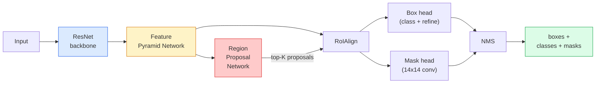

# Örnek Bölüm  Maske R-CNN    örnek bölüm  Maske R-CNN

> Hızlı R-CNN algılayıcısına küçük bir maske dalını ekleyin ve örnek bölümü elde edin.

> **【中文解读】**Hızlı R-CNN denetleyicisine bir gizlenme bölümü eklemek, örnek bölünmesini sağlar. Zorluk, farklı büyüklükteki aday bölgeleri sabit boyutlu özellikler çizgisine göre düzenlemede ve boşluk hassasiyetini korumada bulunur.

> **【拓展：实例分割的应用】**Maske R-CNN  geniş çapta otomatik sürüş için kullanılır 区分不同车辆和行人) 机器人抓取 识别单个物体轮) 视频编辑 精确图)  RoIAlign 技术后来也被用于视觉变压器的适配器中──

**Type:** Build + Learn | **类型:** 动手 + 学习
**Languages:** Python | **语言:** Python
**Prerequisites:** Phase 4 Lesson 06 (YOLO), Phase 4 Lesson 07 (U-Net) | **前置知识:** Phase 4 Lesson 06（YOLO），Phase 4 Lesson 07（U-Net）
**Time:** ~75 minutes | **时间:** ~75 分钟

## Öğrenme hedefleri

- Mask R-CNN mimarisinin sonundan sona kadar izlenmesi: omurgan, FPN, RPN, RoIAlign, kutu başı, mask başı
- RoIAlign' i baştan başlatın ve RoIPool' un neden artık kullanılmadığını açıklayın.
- Şimşek görgü tanesini kullan `maskrcnn_resnet50_fpn_v2`üretim kalitesi maskeleri için önceden eğitilmiş model ve çıkış biçimini doğru şekilde okuyun
- Küçük özel veri kümesine ince ayarlama Maske R-CNN, kutu ve maske başlarını değiştirerek omurganı dondurarak

> **【中文解读】**Öğrenme hedefi, ders bitirilmesinden sonra öğrenilmesi gereken temel becerileri listeler.


## Sorunlar. Sorunlar.

Semantik bölünme size sınıf başına bir maske verir. Bir nesne bölünmesi iki nesne bir sınıfı paylaşırken bile size bir nesne başına bir maske verir. bireyleri saymak, çerçeveleri takip etmek ve şeyleri ölçmek (duvardaki her tuğla, mikroskop görüntüsündeki her hücre) hepsi örnek bölünmesini gerektirir.

> 语义分割给你每一类一个掩码――实例分割给你每一物体一个掩码―― iki nesne bile aynı sınıfın içinde olsa bile――数个体、跨跟踪和测量东西――壁内每块的边界框、显微镜图像中每细胞) 实例分割 (örneğin ayrılması)

Mask R-CNN (He et al., 2017) bu durumu, örnek segmentasyonunu tespit-daha-mask olarak yeniden çerçevelemekle çözdü. Tasarım o kadar temizti ki önümüzdeki beş yıl boyunca neredeyse her örnek segmentasyon kağıdı Mask R-CNN variansıydı ve meşale görme uygulaması hala küçük ve orta ölçekli veri kümeleri için üretim öntanımlısıdır.

> Mask R-CNN (Maske R-CNN) [1] [2] 2017 yılında, örnek bölümü olarak yeniden tanımlanmıştır. Bu sorunu çözmek için test ve gizleme yapıldı.

Zorlu mühendislik sorunu örnekleme: köşeleri piksel sınırlarına uymayan bir önerme kutusu içinde sabit boyutlu bir özellik bölgesi nasıl kesilir?

> 困难的工程问题是采样: 困难的工程问题是采样: 困难的工程问题是采样: 困难的工程问题是采样: 困难的工程问题是采样: 困难的工程问题是采样: 困难的工程问题是采样: 困难的工程问题是采样: 困难的工程问题是采样: 困难的工程问题是采样: 困难的工程问题是采样: 困难的工程问题是采样: 困难的工程问题是采样: 困难的工程问题是如何从角点不与像边界对齐的候选框中切断从角点不与像边框中切断从固定大小的特征区域? 困难的工程问题是如何从角点不与像边框中切断从固定大小的特征区域? 弄错这个在所有地方都会损失零点几个mAP――Royallign就是答案――

## Konsepten bir şey.

> **【中文解读】**Bu bölümde temel kavramlar ve teoriler hakkında konuşuluyor. Bu kavramları öğrenmek, sonradan gerçekleştirilme önemi, aynı zamanda, görüşmeler ve mühendislik uygulamalarında yüksek sıklıkta yapılan incelemelerin bilgi noktasıdır.


### Mimarlık



Anlamak için beş parça:

1. **Backbone**ResNet-50 veya ResNet-101 ImageNet üzerinde eğitilmiştir. 4, 8, 16, 32 adımlarında özellik haritalarının bir hiyerarşisini üretir.
   Çinçe çevirisi: ImageNet'de eğitim gören ResNet-50 veya ResNet-101 olarak üretilen 4、8、16、32 seviye özellikleri resimleri.
2. **FPN (Feature Pyramid Network)** üst-yağı + her seviyede C kanalları semantik zengin özellikler veren yan bağlantılar.
   Çinçe Çevirisi: C 个通道 的语义丰富特征, C 个通道 的语义丰富特征, C 个通道 的语义丰富特征, C 个通道 的语义丰富特征, C 个通道 的语义丰富特征, C 个通道 的语义丰富特征, C 个通道 的语义丰富特征, C 个通道 的语义丰富特征, C 个通道 的语义丰富特征, C 个通道 的语义丰富特征, C 个通道 的语义丰富特征, C 个通道 的语义丰富特征, C 个通道 的语义丰富特征, C 个通道 的语义丰富特征, C 个通道 的语义丰富特征, C 个通道 的语义丰富特征, C 个通道 的语义丰富特征, C 个通道 的语义丰富的语义丰富性, C 个个个体的比例的 FPN 个级等级, C 个体的比例的比例的比例的比例的比例的比例的比例.
3. **RPN (Region Proposal Network)** her demir pozisyonunda "burada bir nesne var mı?" ve "saldırı nasıl düzeltirim?" diye tahmin eden küçük bir konfor başlığı.
   Çinçe çevirisi: 一小的卷积头,在每个点位置预测" Burada hiç bir şey var mı?"和"边界框 nasıl düzeltilir?"──每张图像产生约1000个候选区──
4. **RoIAlign** FPN düzeyinde herhangi bir kutudan sabit boyutlu (örneğin 7x7) bir özellik patçası örneklemesi.
   Çinçe Çevirisi: Herhangi bir FPN  seviyesi  seviyesi  seviyesi  seviyesi  seviyesi  seviyesi  seviyesi  seviyesi  seviyesi  seviyesi                                                                                                                                                                                                                                                                                                                                                                                                                                                                                    
5. **Heads** kutuyu temizleyen ve bir sınıf seçen iki katmanlı kutu başı, ek olarak bir küçük konfor başı çıkartır `28x28`Her teklif için ikili maske.
   Çinçe çevirisi: iki katlı çerçeve başlığı, her aday bölgesi için küçük bir çerçeve başlığı ekleyerek, sınırı çerçeveyi düzeltmek için kullanılır.`28x28`Bu da bir şey.

### RoIAlign neden RoIPool değil?

Orijinal Fast R-CNN, bir önerme kutusunu bir çubuğa ayırarak, her hücreden maksimum özelliği alan ve tüm koordinatları tam sayılarla yuvarlayan RoIPool'u kullandı. Bu yuvarlaklık, özellik haritasını giriş pixel koordinatlarından tam bir özellik haritası pixel  küçük bir görüntüde 224x224'e kadar yanlış ayarlar.

> Orijinal Fast R-CNN RoIPool kullanılarak, aday çerçevesini ağ şeklinde ayırır, her bir parçacıkta en büyük özellik değerini alır ve tüm sitelerinin dörtte beşini tam sayıya ayırır. Bu siteler, 224x224'in resimlerinde bir özellik bileşeni üzerinde büyük bir etkisi olan bir özellik bileşeni oluşturur.

```
RoIPool:
  box (34.7, 51.3, 98.2, 142.9)
  round -> (34, 51, 98, 142)
  split grid -> round each cell boundary
  misalignment accumulates at every step

RoIAlign:
  box (34.7, 51.3, 98.2, 142.9)
  sample at exact float coordinates using bilinear interpolation
  no rounding anywhere
```

RoIAlign, AP maskesi COCO'da 3-4 puan ücretsiz olarak kaldırıyor. Yerleşim konusunda önem veren her detektör şimdi bunu  YOLOv7 seg, RT-DETR, Mask2Former gibi kullanıyor.

> RoIAlign en COCO 上免费提升掩码 AP 3-4 个点──每个关心定位精度检测器现在都使用它YOLOv7 seg、RT-DETR、Mask2Former 无一例外──

### RPN'de bir paragraf

Özellik haritasının her pozisyonunda, farklı boyut ve şekillerdeki K demir kutularını yerleştirin. Her bir demir için bir nesne puanı ve bir geri dönüş oranı tahmin edin. En üst 1000 kutuyu puanla tut, NMS'i IoU 0.7'de uygula ve hayatta kalanları başlarına teslim et. RPN kendi mini kaybı ile eğitilmiştir  Ders 6 ' dan YOLO kaybı ile aynı yapı , sadece iki sınıf (objek / hiç nesne).

> Özellik çizgisinin her yerinde K 个 个 个 个 个 个 个 个 个 个 个 个 个 个 个 个 个 个 个 个 个 个 个 个 个 个 个 个 个 个 个 个 个 个 个 个 个 个 个 个 个 个 个 个 个 个 个 个 个 个 个 个 个 个 个 个 个 个 个 个 个 个 个 个 个 个 个 个 个 个 个 个 个 个 个 个 个 个 个 个 个 个 个 个 个 个 个 个 个 个 个 个 个 个 个 个 个 个 个 个 个 个 个 个 个 个 个 个 个 个 个 个 个 个 个 个 个 个 个 个 个 个 个 个 个 个 个 个 个 个 个 个 个 个 个 个 个 个 个 个 个 个 个 个 个 个 个 个 个 个 个 个 个 个 个 个 个 个 个 个 个 个 个 个 个 个 个 个 个 个 个 个 个 个 个 个 个 个 个 个 个 个 个 个 个 个 个 个 个 个 个 个 个 个 个 个 个 个 个 个 个 个 个 个 个 个 个 个 个 个 个 个 个 个 个 个 个 个 个 个 个 个 个 个 个 个 个 个 个 个 个 个 个 个 个 个 个 个 个 个 个 个 个 个 个 个 个 个 个 个 个

### Maske başı

Her öneride (RoIAlign'den sonra) maskede küçük bir FCN bulunur: dört 3x3 konvu, 2x deconv, son 1x1 konvu üretir.`num_classes``28x28`Bu, maske tahminini sınıflandırmadan ayırır.

>                                                                                                                                                                                                                                                               `28x28`Çözüm oranı `num_classes`个输出通道―― sadece tahmin sınıfı ile karşı karşıya gelen geçitleri koruyor; kalan geçitler göz ardı edilmektedir―― bu da tahmin ile tahmin sınıfı çözümü­ne örtbas eder.

Son ikili maskesi üretmek için 28x28 maskesini önerinin orijinal piksel boyutuna kadar örnekleyin.

> 28x28 掩码 üzerinde seçilen seçilen bölgenin orijinal görüntüsünün büyüklüğüne, son iki değerli掩码 üretmek için.

### Kayıplar

Mask R-CNN'in toplam 4 kayıpı var:

> Maske R-CNN 4 kayıp fonksiyonu ile birlikte:

```
L = L_rpn_cls + L_rpn_box + L_box_cls + L_box_reg + L_mask
```

- `L_rpn_cls`- Evet .`L_rpn_box` RPN önerileri için nesnelik + kutu gerileme.
  Çinçe çevirisi:RPN 候选区的目标性和边界框归归损失──
- `L_box_cls` baş sınıflandırıcısında (C+1) sınıflar üzerindeki çapraz entropi (geriye bakış da dahil olmak üzere).
  Çinçe Çevirimiçi:头部分类器上 (C+1) 个类别(含背景) 的交叉损失──
- `L_box_reg` baş kutuyu düzeltmek için düzgün L1.
  Çinçe Çevirisi:头部边界框修正的平滑 L1 损失──
- `L_mask` 28x28 maske çıkışında pixel başına ikili çapraz entropi.
  ÇINCE TRÜBLİK: 28x28 掩码输出上逐像素二元交叉损失──

Her kayıpın kendi varsayılan ağırlığı vardır; meşale görme uygulaması onları yapılandırıcı argümanları olarak ortaya çıkarır.

> Her kayıpın kendi belirlenmiş ağırlığı vardır; torchvision  gerçekleştirmek onları yapılandırma fonksiyonları için açığa çıkarmak 

### Çıktı biçimi

`torchvision.models.detection.maskrcnn_resnet50_fpn_v2`Dict listesi, her görüntü için bir dict listesi gönderir:

```
{
    "boxes":  (N, 4) in (x1, y1, x2, y2) pixel coordinates,
    "labels": (N,) class IDs, 0 = background so indices are 1-based,
    "scores": (N,) confidence scores,
    "masks":  (N, 1, H, W) float masks in [0, 1] — threshold at 0.5 for binary,
}
```

> **【中文解读】**Bu bölüm kodla sıfırdan gerçekleştirilen çekirdek algoritmasıdır. Bu "sıfırdan" yöntem çerçevenin arkasındaki prensipleri anlama yardımcı olur.


Maske tam görüntü çözünürlüğünde zaten. 28x28 baş çıkışı içten olarak örneklendi.

> **【拓展：工业部署中的视觉系统】**Gerçek endüstriye dağıtımında, görsel modeller gecikme, model büyüklüğü, kenar cihazların uyumlu olması gibi sorunları düşünmelidir. TensorRT, ONNX Runtime, OpenVINO, yaygın olarak kullanılan bir görsel model hızlandırma aracıdır.

> **【拓展：数据标注与质量】**视觉任务的效果高度依赖标签数据质――Label Studio、CVAT is the mainstream tagging tool――在工业场景中,主动学习(Active Learning) 标签成本ı azaltabilir:模型对不确定的样本请求人工标签,确定性的样本自动标签──


## Yapın.
```figure
cv3-roialign-sampling
```

## Yapın

### Adım 1: Baştan başlayan RoIAline

Bu Mask R-CNN'in kod olarak anlaması, prozeden daha kolay olan bir bileşeni.

> Bu R-CNN Mask'de kod kullanan tek, yazılından daha kolay anlaşılabilen bir bileşen.

```python
import torch
import torch.nn.functional as F

def roi_align_single(feature, box, output_size=7, spatial_scale=1 / 16.0):
    """
    feature: (C, H, W) single-image feature map
    box: (x1, y1, x2, y2) in original image pixel coordinates
    output_size: side of the output grid (7 for box head, 14 for mask head)
    spatial_scale: reciprocal of the feature map stride
    """
    C, H, W = feature.shape
    x1, y1, x2, y2 = [c * spatial_scale - 0.5 for c in box]
    bin_w = (x2 - x1) / output_size
    bin_h = (y2 - y1) / output_size

    grid_y = torch.linspace(y1 + bin_h / 2, y2 - bin_h / 2, output_size)
    grid_x = torch.linspace(x1 + bin_w / 2, x2 - bin_w / 2, output_size)
    yy, xx = torch.meshgrid(grid_y, grid_x, indexing="ij")

    gx = 2 * (xx + 0.5) / W - 1
    gy = 2 * (yy + 0.5) / H - 1
    grid = torch.stack([gx, gy], dim=-1).unsqueeze(0)
    sampled = F.grid_sample(feature.unsqueeze(0), grid, mode="bilinear",
                            align_corners=False)
    return sampled.squeeze(0)
```

Her sayı iki çizgilik bir şekilde örneklenmiş bir pozisyonda.

> Her sayı ikili bir konumdadır.

### Adım 2: Torchvision'in RoIAlign ile karşılaştır

```python
from torchvision.ops import roi_align

feature = torch.randn(1, 16, 50, 50)
boxes = torch.tensor([[0, 10, 20, 100, 90]], dtype=torch.float32)  # (batch_idx, x1, y1, x2, y2)

ours = roi_align_single(feature[0], boxes[0, 1:].tolist(), output_size=7, spatial_scale=1/4)
theirs = roi_align(feature, boxes, output_size=(7, 7), spatial_scale=1/4, sampling_ratio=1, aligned=True)[0]

print(f"shape ours:   {tuple(ours.shape)}")
print(f"shape theirs: {tuple(theirs.shape)}")
print(f"max|diff|:    {(ours - theirs).abs().max().item():.3e}")
```

- Evet .`sampling_ratio=1`ve `aligned=True`, iki kişi de içe eşleşir .`1e-5`- Evet .

> - Evet .`sampling_ratio=1`Ve`aligned=True`时, ikisi arasındaki fark `1e-5`İçinde.

### Adım 3: Önceden eğitilmiş bir maske R-CNN yükleyin

```python
import torch
from torchvision.models.detection import maskrcnn_resnet50_fpn_v2, MaskRCNN_ResNet50_FPN_V2_Weights

model = maskrcnn_resnet50_fpn_v2(weights=MaskRCNN_ResNet50_FPN_V2_Weights.DEFAULT)
model.eval()
print(f"params: {sum(p.numel() for p in model.parameters()):,}")
print(f"classes (including background): {len(model.roi_heads.box_predictor.cls_score.out_features * [0])}")
```

46M parametreleri, 91 sınıf (COCO). Birinci sınıf (id 0) arka plan; modelin aslında algıladığı her şey id 1'den başlar.

> 46000000 parameters,91 个类别(COCO)。第一个类别(id 0) 背景;模型实际检测所有类别从 id 1 开始。

### Dördüncü adım: Tahminleri çalıştır

```python
with torch.no_grad():
    x = torch.randn(3, 400, 600)
    predictions = model([x])
p = predictions[0]
print(f"boxes:  {tuple(p['boxes'].shape)}")
print(f"labels: {tuple(p['labels'].shape)}")
print(f"scores: {tuple(p['scores'].shape)}")
print(f"masks:  {tuple(p['masks'].shape)}")
```

Maske tenzörü şekillidir .`(N, 1, H, W)`. 0.5 ' den bir nesne için ikili bir maske elde etmek için:

> 掩码张量形为                                                                                                                                                                                                                                                                                                                                                                                                                                                                                                                       `(N, 1, H, W)`❖ 0.5 değerinde elde edilen her nesne için iki değerli bir gizleme:

```python
binary_masks = (p['masks'] > 0.5).squeeze(1)  # (N, H, W) boolean
```

### Adım 5: Özel sınıf sayımı için başları değiştirin

Genel ince ayarlama tarifi: omurganı, FPN ve RPN'i yeniden kullanın; iki sınıflandırıcı başını değiştirin.

> 常见的微调方案: 复用骨干网络、FPN 和 RPN; iki sınıf başını değiştirmek

```python
from torchvision.models.detection.faster_rcnn import FastRCNNPredictor
from torchvision.models.detection.mask_rcnn import MaskRCNNPredictor

def build_custom_maskrcnn(num_classes):
    model = maskrcnn_resnet50_fpn_v2(weights=MaskRCNN_ResNet50_FPN_V2_Weights.DEFAULT)
    in_features = model.roi_heads.box_predictor.cls_score.in_features
    model.roi_heads.box_predictor = FastRCNNPredictor(in_features, num_classes)
    in_features_mask = model.roi_heads.mask_predictor.conv5_mask.in_channels
    hidden_layer = 256
    model.roi_heads.mask_predictor = MaskRCNNPredictor(in_features_mask, hidden_layer, num_classes)
    return model

custom = build_custom_maskrcnn(num_classes=5)
print(f"custom cls_score.out_features: {custom.roi_heads.box_predictor.cls_score.out_features}")
```

`num_classes`Arka plan sınıfı içermelidir, bu nedenle 4 nesne sınıfı olan bir veri kümesi kullanır `num_classes=5`- Evet .

> `num_classes`背景类 içermelidir, bu nedenle 4 nesne sınıfı veri kümesi kullanılır `num_classes=5`- Evet.

### Adım 6: Eğitmeye gerek olmayan şeyleri dondur

Küçük veri kümelerinde omurganı ve FPN'yi dondur. Sadece RPN nesnelik + geri dönüş ve iki baş öğrenir.

> Küçük veri kümelerinde, 结骨干网络和FPN──只有RPN的目标性+归归和两个头部参与学习──

```python
def freeze_backbone_and_fpn(model):
    # torchvision Mask R-CNN packs the FPN inside `model.backbone` (as
    # `model.backbone.fpn`), so iterating `model.backbone.parameters()` covers
    # both the ResNet feature layers and the FPN lateral/output convs.
    for p in model.backbone.parameters():
        p.requires_grad = False
    return model

custom = freeze_backbone_and_fpn(custom)
trainable = sum(p.numel() for p in custom.parameters() if p.requires_grad)
print(f"trainable after freeze: {trainable:,}")
```

> **【中文解读】**Bu bölümde, PyTorch, HuggingFace gibi olgun çerçeveler nasıl kullanılacağını gösterir.


500 görüntü verisi kümelerinde bu, yakınlık ve aşırı uyum arasındaki fark.


> **【拓展：视觉模型的持续学习】**Üretim ortamında, görsel modeller yeni verilere sürekli uyum sağlamak gerekir. Yeni ürünler, yeni sahne, yeni ışık koşulları. Sürekli öğrenme. Sürekli öğrenme.

## Çerçeveyi kullanın.

Mask R-CNN için torchvision'deki tam eğitim döngüsü 40 satırdır ve görevler arasında  değişim veri kümeleri ve git arasında anlamlı bir değişim yoktur.

```python
def train_step(model, images, targets, optimizer):
    model.train()
    loss_dict = model(images, targets)
    losses = sum(loss for loss in loss_dict.values())
    optimizer.zero_grad()
    losses.backward()
    optimizer.step()
    return {k: v.item() for k, v in loss_dict.items()}
```

- Evet .`targets`listede resim başına diktler olmalı.`boxes`- Evet .`labels`ve`masks`(Tüm`(num_instances, H, W)`Modeldeki ikili tenzorlar) eğitim sırasında dört kayıpın diktini ve eval sırasında tahminlerin bir listesini gönderir.`model.training`- Evet .

- Evet .`pycocotools`evaluator hem kutular için hem de maskeler için mAP@IoU=0.5:0.95 üretir; kutu başının veya maske başının şişek boynuz olup olmadığını bilmek için her iki numara da gerekir.

> **【中文解读】**Bu bölümde modellerin kullanılabilir ürünler için nasıl dağıtılacağı üzerinde yoğunlaşmaktadır.


## İndirin . Ürünler .

Bu ders şunları ortaya çıkarır:

> **【中文解读】**练习题按照易/中级/难三度递进;;建议至少完成中级题,Hard级适合深入研究或面试准备;;


- `outputs/prompt-instance-vs-semantic-router.md` üç soru soran ve örnek vs. semantik vs. panoptik ve başlangıç için tam model seçen bir istek.
- `outputs/skill-mask-rcnn-head-swapper.md` yeni bir teknolojiye göre, herhangi bir meşale görme algılama modeli üzerinde başları değiştirmek için 10 satır kod oluşturan bir beceri `num_classes`- Evet .

## Egzersizler.

1. **(Easy)**RoIAlign ' i kontrol et .`torchvision.ops.roi_align`100 rastgele kutuda. Maksimum mutlak farkı bildirin. RoIPool (2017 öncesi davranış) da çalıştırın ve sınırın yakınındaki kutularda ~ 1-2 özellik haritası pikselinden ayrılır.
2. **(Medium)**- Güzel sesli .`maskrcnn_resnet50_fpn_v2`50 resimden oluşan özel bir veri kümesi (her iki sınıf: balonlar, balıklar, çukurlar, logolar)
3. **(Hard)**Mask R-CNN'in maskesi başını 28x28 yerine 56x56 oranında tahmin eden bir maskeden değiştirin. mAP@IoU=0.75 ön ve sonrasını ölçün. Kazanç (veya bir eksikliğin) neden beklenen sınır-tamam / hafıza değişikliğine uyduğunu açıklayın.

> **【中文解读】**术语表中的"İnsanların ne dediği" vs "Gerçekten ne anlama geldiği" 区分日常口语和精确技术含义──在团队协作中,统一术语定义可以避免大量沟通误解──


## Anahtar Şartlar .

| Term | What people say | What it actually means |
|------|----------------|----------------------|
| Mask R-CNN | "Detection plus masks" | Faster R-CNN + a small FCN head that predicts a 28x28 mask per proposal per class |
| FPN | "Feature pyramid" | Top-down + lateral connections that give every stride level C channels of semantic-rich features |
| RPN | "Region proposer" | A small conv head that produces ~1000 object/no-object proposals per image |
| RoIAlign | "No-rounding crop" | Bilinearly samples a fixed-size feature grid from any float-coordinate box |
| RoIPool | "Pre-2017 crop" | Same purpose as RoIAlign but rounds box coordinates; obsolete |
| Mask AP | "Instance mAP" | Average precision computed with mask IoU instead of box IoU; the COCO instance segmentation metric |
| Binary mask head | "Per-class mask" | Predicts one binary mask per class for each proposal; only the predicted class's channel is kept |
| Background class | "Class 0" | The catch-all "no object" class; indices for real classes start at 1 |

> **【中文解读】**延伸阅读, derinlemesine öğrenme için yüksek kaliteli kaynaklar sağladı. Bu makaleler ve dersler, derinlemesine anlama ihtiyacı olan okuyuculara uygun olarak bu alanın klasik referanslarıdır.


## Daha fazla okumak

- [Mask R-CNN (He et al., 2017)](https://arxiv.org/abs/1703.06870) makale; RoIAlign'in 3. bölümünde eleştirel bir okuma bulunmaktadır.
- [FPN: Feature Pyramid Networks (Lin et al., 2017)](https://arxiv.org/abs/1612.03144) FPN kağıdı; her modern dedektör onu kullanır
- [torchvision Mask R-CNN tutorial](https://pytorch.org/tutorials/intermediate/torchvision_tutorial.html) ince ayarlama döngüsüne ilişkin referans
- [Detectron2 model zoo](https://github.com/facebookresearch/detectron2/blob/main/MODEL_ZOO.md) Neredeyse her tespit ve segmentasyon varianti için eğitimli ağırlıklar ile üretim uygulamalar
