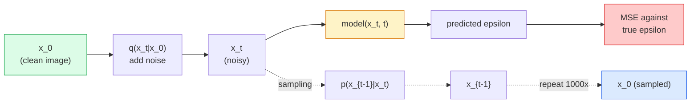

# Resim Yükleme  Yayınlama Modelleri  Resim Yükleme  Yayınlama Modelli

> Bir difüzyon modeli, denosiyon yapmayı öğrenir. Şımarık bir görüntüden küçük bir gürültü çıkarmak için eğitilir, bunu bin kez geriye tekrarlar ve bir görüntü jeneratörüne sahip olursunuz.

> **【中文解读】**扩散模型学习去噪音:训练网络从加点噪音图像中删除噪音,反向重复1000次就能从纯噪音中生成图像──扩散模型是稳定扩散、DALL-E、Midjourney等图像生成工具的核心技术──

> **【拓展：扩散模型的革命】**扩散模型在 2022年后取代GAN 成为图像生成的主流──Stable Diffusion 使用潜在空间扩散──Latent Diffusion) önemli ölçüde hesaplama maliyetini düşürür,DDIM 采样器 1000 步骤 down to 20 步骤 推理步数. 扩散模型也被应用于视频生成(Sora)、3D 生成、音频生成等领域──

**Type:** Build | **类型:** 动手
**Languages:** Python | **语言:** Python
**Prerequisites:** Phase 4 Lesson 07 (U-Net), Phase 1 Lesson 06 (Probability), Phase 3 Lesson 06 (Optimizers) | **前置知识:** Phase 4 Lesson 07（U-Net），Phase 1 Lesson 06（概率），Phase 3 Lesson 06（优化器）
**Time:** ~75 minutes | **时间:** ~75 分钟

## Öğrenme hedefleri

- Önüne gelen gürültü sürecini çıkar `x_0 -> x_1 -> ... -> x_T`Ve neden kapalı biçim olduğunu açıklayın.`q(x_t | x_0)`t için geçerli
- Her adımda eklenen gürültüyü geriye çeviren ve saf gürültüden görüntüye geriye giden bir örnekleme hedefi uygulayın.
- Zaman koşullu bir U-Net oluşturun (CPU'da eğitilmek için yeterince küçük) herhangi bir zaman aşamasında gürültüyi tahmin eder
- DDPM ve DDIM örneklemesi arasındaki farkı ve her biri uygun olduğunda açıklayın (Leçon 23 akış eşleşmesini ve derinlikteki düzeltilmiş akışı kapsar)

> **【中文解读】**Öğrenme hedefi, ders bitirilmesinden sonra öğrenilmesi gereken temel becerileri listeler.


## Sorunlar. Sorunlar.

GAN'lar tek çekim oluşturur: gürültü içeri, görüntü dışarı, bir ileri geçiş. Hızlı ve eğitilmesi zor. Diffüzyon modelleri tekrar tekrar üretir: saf gürültüden başlayarak, küçük adımlarla denetleştirir, görüntü ortaya çıkar. Yavaş ve kolay eğitilmektedirler. Son beş yıldır son özellik baskın olmuştur: küçük bir ekip bir difüzyon modeli eğitime ve makul örnekler alabilir; GAN eğitimi yıllarca başarısız koşularda öğrenilen bir meslektir.

> GAN bir kez oluşur: ses girişleri, görüntü çıkışı, bir kez yayılma hızları; fakat eğitimlenmesi zor. Genişleme modeli Genereasyon: saf gürültüden başlayarak, küçük adımlarla gürültüye doğru, görüntüler yavaş yavaş ortaya çıkar.

Eğitim istikrarının ötesinde, difüzyonun tekrarlayıcı yapısı modern görüntü üretimi yapan her şeyi açar: metin koşullandırması, boyalama, görüntü düzenleme, süper çözünürlük, kontrol edilebilir stil. Örnekleme döngüsünün her aşaması yeni bir kısıtlama enjeksiyonu için bir yer. Bu kanca, Stable Diffusion, Imagen, DALL-E 3, Midjourney ve kullanacağınız her kontrol edilebilir görüntü modeli'nin nedenini gösteriyor.

> Stabilans, genişleme çağının yapılarını modern görüntü üretimi için yapılan her şeyi çözüyor: metin koşullandırması, görüntü düzeltmesi, görüntü düzenleme, aşırı çözünürlük, kontrol edilebilir biçim.

Bu ders minimal DDPM'yi oluşturur: ileri gürültü, geriye denoizing, eğitim döngüsü. Bir sonraki ders (Stable Diffusion) onu bir VAE, bir metin kodlayıcı ve sınıflandırıcısız rehberlik ile bir üretim sistemine bağlar.

> Bu ders en az DDPM oluşturur: Önceki gelişme ̊ geride giderme ̊ ses ̊ eğitim döngüsü。 Sonraki ders ̊ Stabil Diffusion) onu üretim sistemine bağlayacak, içeren VAE、文本编码器和无分类器引导。

## Konsepten bir şey.

> **【中文解读】**Bu bölümde temel kavramlar ve teoriler hakkında konuşuluyor. Bu kavramları öğrenmek, sonradan gerçekleştirilme önemi, aynı zamanda, görüşmeler ve mühendislik uygulamalarında yüksek sıklıkta yapılan incelemelerin bilgi noktasıdır.


### İlerleme süreci

Bir resim çek .`x_0`Biraz Gaussian gürültüsü ekle .`x_1`Biraz daha ekleyip alacağız .`x_2`T adımlarını devam ettir .`x_T`Bu, saf Gaussian gürültüsünden neredeyse ayırt edilemez.

> Bir resim çek .`x_0`Biraz daha yüksek sesler çıkıyor.`x_1`Bir kere daha al .`x_2`, devam et T                                                                                                                                                                                                                                                                                                                                                                                                                                                                                                                          `x_T`Tam yüksek sesle neredeyse ayırt edilemez.

```
q(x_t | x_{t-1}) = N(x_t; sqrt(1 - beta_t) * x_{t-1},  beta_t * I)
```

`beta_t`T=1000 adım üzerinde tipik olarak 0.0001'den 0.02'e kadar doğrusal küçük bir varyansa programıdır.

> `beta_t`Bu, genellikle T=1000 adım içinde 0.0001 線性成長から 0.02 線性成長である.

### Kapalı atlama

Bir adım sonra gürültü eklemek Markov zinciri, ama matematik katlanır: örnekleyebilirsiniz `x_t`Doğrudan `x_0`Bir adımdan sonra.

> Bir adım daha fazla gürültü bir çok şeyle bağlantılıdır. Ama matematikte çarpıtılabilir.`x_0`采样 `x_t`- Evet.

```
Define alpha_t = 1 - beta_t
Define alpha_bar_t = prod_{s=1..t} alpha_s

Then:
  q(x_t | x_0) = N(x_t; sqrt(alpha_bar_t) * x_0,  (1 - alpha_bar_t) * I)

Equivalently:
  x_t = sqrt(alpha_bar_t) * x_0 + sqrt(1 - alpha_bar_t) * epsilon
  where epsilon ~ N(0, I)
```

Bu tek denklem, yaymanın pratik olmasının tek nedeni.`t`, örnek`x_t`Doğrudan `x_0`, ve tek bir adımla tren  tüm Markov zincirinin simülasyonu gerekmiyor.

> Bu bir denklem, genişleme modelinin pratik olarak kullanılması için tüm nedenlerdir.`t`Doğrudan .`x_0`采样 `x_t`Bu, bir adım daha tamamlanarak, tüm bir Markov zinciri oluşturmak için gerekli değildir.

### Geri dönüşüm süreci

Önüme doğru ilerleme süreci sabit.`p(x_{t-1} | x_t)`Bu, sinir ağının öğrendiği şeydir.`x_{t-1}`Doğrudan; gürültüyü tahmin ediyorlar `epsilon`T adımında eklenir ve matematik çıkarır `x_{t-1}`- Bu yüzden.

> Ön yön süreci kesin.`p(x_{t-1} | x_t)`Bu, neörolojik bir ağ.`x_{t-1}`Onlar da bir sonraki adımın gürültüsünü tahmin ediyorlar.`epsilon`Sonra matematikle yönlendirilir.`x_{t-1}`- Evet.



### Eğitim kaybı

Her eğitim aşaması için:

> Her antrenman aşaması:

1. Gerçek bir görüntü örneklemesi `x_0`- Evet .
   Çönsel Türkçe: 采样一张真实图像`x_0`- Evet.
2. Zaman aşamasını örnekleyin `t`[1, T'den] eşit olarak.
   中文翻译: 中均采样一个时间步 `t`- Evet.
3. Örnek gürültü`epsilon ~ N(0, I)`- Evet .
   Çeviri: Çeviri: Çeviri: Çeviri: Çeviri: Çeviri: Çeviri: Çeviri: Çeviri: Çeviri: Çeviri: Çeviri: Çeviri: Çeviri: Çeviri: Çeviri: Çeviri: Çeviri: Çeviri: Çeviri: Çeviri: Çeviri: Çeviri: Çeviri: Çeviri: Çeviri: Çeviri: Çeviri: Çeviri: Çeviri: Çeviri: Çeviri: Çeviri: Çeviri: Çeviri: Çeviri: Çeviri: Çeviri: Çeviri: Çeviri: Çeviri: Çeviri: Çeviri: Çeviri: Çeviri: Çeviri: Çeviri: Çeviri: Çeviri: Çeviri: Çeviri: Çeviri: Çeviri: Çeviri: Çeviri: Çeviri: Çeviri: Çeviri: Çeviri: Çeviri: Çeviri: Çeviri: Çeviri: Çeviri: Çeviri: Çeviri: Çeviri: Çeviri: Çeviri: Çeviri: Çeviri: Çeviri: Çeviri: Çeviri: Çeviri: Çeviri: Çeviri: Çeviri: Çeviri`epsilon ~ N(0, I)`- Evet.
4. Hesaplama`x_t = sqrt(alpha_bar_t) * x_0 + sqrt(1 - alpha_bar_t) * epsilon`- Evet .
   Çeviri: Kürt`x_t = sqrt(alpha_bar_t) * x_0 + sqrt(1 - alpha_bar_t) * epsilon`- Evet.
5. Önceden tahmin et .`epsilon_theta(x_t, t)`Ağla.
   Çevreye dönük bir tarih`epsilon_theta(x_t, t)`- Evet.
6. En azı `|| epsilon - epsilon_theta(x_t, t) ||^2`- Evet .
   Çeviri: Çeviri: Çeviri: Çeviri: Çeviri: Çeviri: Çeviri: Çeviri: Çeviri: Çeviri: Çeviri: Çeviri: Çeviri: Çeviri: Çeviri: Çeviri: Çeviri: Çeviri: Çeviri: Çeviri: Çeviri: Çeviri: Çeviri: Çeviri: Çeviri: Çeviri: Çeviri: Çeviri: Çeviri: Çeviri: Çeviri: Çeviri: Çeviri: Çeviri: Çeviri: Çeviri: Çeviri: Çeviri: Çeviri: Çeviri: Çeviri: Çeviri: Çeviri: Çeviri: Çeviri: Çeviri: Çeviri: Çeviri: Çeviri: Çeviri: Çeviri: Çeviri: Çeviri: Çeviri: Çeviri: Çeviri: Çeviri: Çeviri: Çeviri: Çeviri: Çeviri: Çeviri: Çeviri: Çeviri`|| epsilon - epsilon_theta(x_t, t) ||^2`- Evet.

Neural ağ her zamanki gürültüyü tahmin etmeyi öğrenir. Kayıp MSE.

> İşte böyle. Neural Network Learning Forecasting herhangi bir zaman aşamasının gürültüsü.

### Örnekleme (DDPM)

Yaratmak için: `x_T ~ N(0, I)`Ve bir adım sonra geriye doğru yürüyüşe devam et.

```
for t = T, T-1, ..., 1:
    eps = model(x_t, t)
    x_{t-1} = (1 / sqrt(alpha_t)) * (x_t - (beta_t / sqrt(1 - alpha_bar_t)) * eps) + sqrt(beta_t) * z
    where z ~ N(0, I) if t > 1, else 0
return x_0
```

Anahtar şu ki, ters koşul genel olarak kapalı biçimde bilinmese de, bu özel Gaussian ileri süreci için öyle.

> Anahtar şu ki, genel olarak ters yönlü olasılıkların kapalı bir çözümü olmasa da, belirli bir yüksek yönlü süreç için vardır.

### Neden 1000 adım atıyorsun?

Önceki gürültü programı seçilir, böylece her adım, geri adım neredeyse Gaussian olması için yeterli gürültü ekler. Çok az adım ve geri adım Gaussian'dan uzak, ağ iyi bir şekilde modelleyebilir. Çok fazla adım ve örnekleme giderek azalır kazanç ile pahalı hale gelir. T = 1000 bir çizgi programı DDPM varsayılanıdır.

> Ön tarafa ses düzenlemesi tasarımı, her adım için yeterince az gürültü artırdığını, böylece ön tarafa yaklaşımdaki adımların yükseklere doğru ilerlemesini sağladı.

### DDIM: 20 kat daha hızlı örnekleme

DIM (Song et al., 2020) yeniden eğitim almadan zaman adımlarını atlayan bir belirleyici ters süreç tanımlar. DDIM ile 50 adımdan örnek almak yaklaşık 1000 adım DDPM kalitesini verir. Her üretim sistemi DDIM veya daha hızlı bir variansı kullanır (DPM-Solver, Euler ataları).

> 訓練方式不變,采样方式改变──DDIM(Song等,2020) belirgin bir ters yön süreci tanımladı, zaman adımlarını atlayabilir ve yeniden eğitilmeye gerek kalmaz──DDIM ile 50 adımlık 采样式 1000 adımlık DDPM kalitesine yaklaşabilmektedir── her üretim sistemi DDIM veya daha hızlı değişimleri kullanmaktadır──DPM-Solver、Euler ataları)──

### Zaman şartlandırması

Ağ `epsilon_theta(x_t, t)`Modern difüzyon modelleri enjekte eder.`t`Sinusoidal zaman gömülmeleri (transformatörlerde konum kodlaması gibi aynı fikir) ile, her U-Net seviyesindeki özellik haritalarına eklenir.

> 网络 `epsilon_theta(x_t, t)`Modern genişleme modeli, Transformer'ın içinde olduğu gibi yerleşik bir şekilde,`t`, her U-Net seviyesindeki özellikler üzerinde bir artış.

```
t_embedding = sinusoidal(t)
feature_map += MLP(t_embedding)
```

Zaman koşullandırılmadan ağ, işlevsel ancak daha az örnek verimli olan ses seviyesini görüntüden tahmin etmek zorunda.

> Zaman koşulları olmadan, ağlar görüntülerin kendisinden gürültü seviyesini tahmin etmelidir.

> **【拓展：工业部署中的视觉系统】**Gerçek endüstriye dağıtımında, görsel modeller gecikme, model büyüklüğü, kenar cihazların uyumlu olması gibi sorunları düşünmelidir. TensorRT, ONNX Runtime, OpenVINO, yaygın olarak kullanılan bir görsel model hızlandırma aracıdır.

> **【拓展：数据标注与质量】**视觉任务的效果高度依赖标签数据质――Label Studio、CVAT is the mainstream tagging tool――在工业场景中,主动学习(Active Learning) 标签成本ı azaltabilir:模型对不确定的样本请求人工标签,确定性的样本自动标签──


## Yapın.

> **【中文解读】**Bu bölüm kodla sıfırdan gerçekleştirilen çekirdek algoritmasıdır. Bu "sıfırdan" yöntem çerçevenin arkasındaki prensipleri anlama yardımcı olur.

```figure
cv-diffusion-image
```

## Yapın

### Adım 1: Ses programı

```python
import torch

def linear_beta_schedule(T=1000, beta_start=1e-4, beta_end=2e-2):
    return torch.linspace(beta_start, beta_end, T)


def precompute_schedule(betas):
    alphas = 1.0 - betas
    alphas_cumprod = torch.cumprod(alphas, dim=0)
    return {
        "betas": betas,
        "alphas": alphas,
        "alphas_cumprod": alphas_cumprod,
        "sqrt_alphas_cumprod": torch.sqrt(alphas_cumprod),
        "sqrt_one_minus_alphas_cumprod": torch.sqrt(1.0 - alphas_cumprod),
        "sqrt_recip_alphas": torch.sqrt(1.0 / alphas),
    }

schedule = precompute_schedule(linear_beta_schedule(T=1000))
```

Bir kez önceden hesaplayın, eğitim ve örnekleme sırasında indeksle toplayın.

> 预计算一次,训练和采样时通过索引取用──

### Adım 2: Önceki yayılma (q_sampl)

```python
def q_sample(x0, t, noise, schedule):
    sqrt_a = schedule["sqrt_alphas_cumprod"][t].view(-1, 1, 1, 1)
    sqrt_one_minus_a = schedule["sqrt_one_minus_alphas_cumprod"][t].view(-1, 1, 1, 1)
    return sqrt_a * x0 + sqrt_one_minus_a * noise
```

Tek satırlı kapalı form.`t`Zaman aşamaları bir seri, partideki her görüntü için bir tane.

> Birlikte bir şekilde.`t`Bir zamanın bir parçası, bir resim.

### Adım 3: Küçük bir zaman koşullu U-Net

```python
import torch.nn as nn
import torch.nn.functional as F
import math

def timestep_embedding(t, dim=64):
    half = dim // 2
    freqs = torch.exp(-math.log(10000) * torch.arange(half, device=t.device) / half)
    args = t[:, None].float() * freqs[None]
    emb = torch.cat([args.sin(), args.cos()], dim=-1)
    return emb


class TinyUNet(nn.Module):
    def __init__(self, img_channels=3, base=32, t_dim=64):
        super().__init__()
        self.t_mlp = nn.Sequential(
            nn.Linear(t_dim, base * 4),
            nn.SiLU(),
            nn.Linear(base * 4, base * 4),
        )
        self.t_dim = t_dim
        self.enc1 = nn.Conv2d(img_channels, base, 3, padding=1)
        self.enc2 = nn.Conv2d(base, base * 2, 4, stride=2, padding=1)
        self.mid = nn.Conv2d(base * 2, base * 2, 3, padding=1)
        self.dec1 = nn.ConvTranspose2d(base * 2, base, 4, stride=2, padding=1)
        self.dec2 = nn.Conv2d(base * 2, img_channels, 3, padding=1)
        self.time_proj = nn.Linear(base * 4, base * 2)

    def forward(self, x, t):
        t_emb = timestep_embedding(t, self.t_dim)
        t_emb = self.t_mlp(t_emb)
        t_proj = self.time_proj(t_emb)[:, :, None, None]

        h1 = F.silu(self.enc1(x))
        h2 = F.silu(self.enc2(h1)) + t_proj
        h3 = F.silu(self.mid(h2))
        d1 = F.silu(self.dec1(h3))
        d2 = torch.cat([d1, h1], dim=1)
        return self.dec2(d2)
```

İki seviye U-Net, zaman koşullandırması ile şişe boynunda enjekte edilir.

> 双层 U-Net, 瓶层注入时间条件化──对真实图像,可以增加深度和宽度──

### 4. Adım: Eğitim döngüsü

```python
def train_step(model, x0, schedule, optimizer, device, T=1000):
    model.train()
    x0 = x0.to(device)
    bs = x0.size(0)
    t = torch.randint(0, T, (bs,), device=device)
    noise = torch.randn_like(x0)
    x_t = q_sample(x0, t, noise, schedule)
    pred = model(x_t, t)
    loss = F.mse_loss(pred, noise)
    optimizer.zero_grad()
    loss.backward()
    optimizer.step()
    return loss.item()
```

Bu eğitim döngüsü, hiçbir GAN oyunu, özel bir kayıp, tek bir MSE çağrısı.

> Bu, tüm antrenman döngüsü.

### Adım 5: Örnekleme (DDPM)

```python
@torch.no_grad()
def sample(model, schedule, shape, T=1000, device="cpu"):
    model.eval()
    x = torch.randn(shape, device=device)
    betas = schedule["betas"].to(device)
    sqrt_one_minus_a = schedule["sqrt_one_minus_alphas_cumprod"].to(device)
    sqrt_recip_alphas = schedule["sqrt_recip_alphas"].to(device)

    for t in reversed(range(T)):
        t_batch = torch.full((shape[0],), t, dtype=torch.long, device=device)
        eps = model(x, t_batch)
        coef = betas[t] / sqrt_one_minus_a[t]
        mean = sqrt_recip_alphas[t] * (x - coef * eps)
        if t > 0:
            x = mean + torch.sqrt(betas[t]) * torch.randn_like(x)
        else:
            x = mean
    return x
```

Gerçek kodda bunu DDIM 50 adımlı örnekleme cihazı ile değiştirirsin.

> 1000 defa yayılmak için bir örnek üretmek için.

### Adım 6: DDIM örnekleme (deterministik, ~ 20 kat daha hızlı)

```python
@torch.no_grad()
def sample_ddim(model, schedule, shape, steps=50, T=1000, device="cpu", eta=0.0):
    model.eval()
    x = torch.randn(shape, device=device)
    alphas_cumprod = schedule["alphas_cumprod"].to(device)

    ts = torch.linspace(T - 1, 0, steps + 1).long()
    for i in range(steps):
        t = ts[i]
        t_prev = ts[i + 1]
        t_batch = torch.full((shape[0],), t, dtype=torch.long, device=device)
        eps = model(x, t_batch)
        a_t = alphas_cumprod[t]
        a_prev = alphas_cumprod[t_prev] if t_prev >= 0 else torch.tensor(1.0, device=device)
        x0_pred = (x - torch.sqrt(1 - a_t) * eps) / torch.sqrt(a_t)
        sigma = eta * torch.sqrt((1 - a_prev) / (1 - a_t) * (1 - a_t / a_prev))
        dir_xt = torch.sqrt(1 - a_prev - sigma ** 2) * eps
        noise = sigma * torch.randn_like(x) if eta > 0 else 0
        x = torch.sqrt(a_prev) * x0_pred + dir_xt + noise
    return x
```

> **【中文解读】**Bu bölümde, PyTorch, HuggingFace gibi olgun çerçeveler nasıl kullanılacağını gösterir.


`eta=0`tam olarak belirleyici (aynı gürültü giriş her zaman aynı çıkış üretir). `eta=1`DDPM'yi kurtarır.

> `eta=0`Bu durum tamamen kesin. Aynı sesli giriş her zaman aynı çıkış üretir.`eta=1`则退化为 DDPM。


> **【拓展：视觉模型的持续学习】**Üretim ortamında, görsel modeller yeni verilere sürekli uyum sağlamak gerekir. Yeni ürünler, yeni sahne, yeni ışık koşulları. Sürekli öğrenme. Sürekli öğrenme.

## Çerçeveyi kullanın.

Üretim işlerinde kullanın `diffusers`- ...

```python
from diffusers import DDPMScheduler, UNet2DModel

unet = UNet2DModel(sample_size=32, in_channels=3, out_channels=3, layers_per_block=2)
scheduler = DDPMScheduler(num_train_timesteps=1000)
```

Kütüphane hazır programlayıcıları (DDPM, DDIM, DPM-Solver, Euler, Heun), yapılandırılabilir U-Nets, metin-resim ve resim-resim için boru hattları ve LoRA ince ayarlama yardımcıları gönderir.

Araştırma için.`k-diffusion`(Katherine Crowson) en sadık referans uygulamalar ve en iyi örnekleme varianlarına sahiptir.

> **【中文解读】**Bu bölümde modellerin kullanılabilir ürünler için nasıl dağıtılacağı üzerinde yoğunlaşmaktadır.


## İndirin . Ürünler .

Bu ders şunları ortaya çıkarır:

- `outputs/prompt-diffusion-sampler-picker.md` kalite hedefine, gecikme bütçesine ve şartlandırma türüne göre DDPM / DDIM / DPM-Solver / Euler'i seçen bir istek.
- `outputs/skill-noise-schedule-designer.md` T ve hedef bozukluk seviyesini vererek, bir çizgi, cosine veya sigmoid beta programı üreten bir beceri, ayrıca zaman içinde sinyal-gürültü oranının teşhis planları.

> **【中文解读】**练习题按照易/中级/难三度递进;;建议至少完成中级题,Hard级适合深入研究或面试准备;;


## Egzersizler.

1. **(Easy)**Önümüzdeki süreci görselleştirin: Bir görüntü ve bir çizgi alın `x_t`- ...`t in [0, 100, 250, 500, 750, 1000]`- Bunu kontrol et .`x_1000`saf Gaussian sesi gibi görünüyor.
2. **(Medium)**TinyUNet'i 20 dönem boyunca sentetik döngüler verisi üzerinde eğit ve 16 döngü örnekleyin. DDPM (1000 adım) ve DDIM (50 adım) örneklemesini karşılaştırın.
3. **(Hard)**Kosine gürültü programını uygula (Nichol & Dhariwal, 2021):`alpha_bar_t = cos^2((t/T + s) / (1 + s) * pi / 2)`Aynı modeli çizgi ve kozin çizelgeleri ile çalıştırın ve kozin düşük adım sayısında daha iyi örnekler verdiğini gösterin.

> **【中文解读】**术语表中的"İnsanların ne dediği" vs "Gerçekten ne anlama geldiği" 区分日常口语和精确技术含义──在团队协作中,统一术语定义可以避免大量沟通误解──


## Anahtar Şartlar .

| Term | What people say | What it actually means |
|------|----------------|----------------------|
| Forward process | "Add noise over time" | Fixed Markov chain that corrupts an image into Gaussian noise over T steps |
| Reverse process | "Denoise step by step" | Learned distribution that walks back from noise to image |
| Epsilon prediction | "Predict the noise" | The training target: `epsilon_theta(x_t, t)` predicts the noise added at step t |
| Beta schedule | "Noise amounts" | Sequence of T small variances that define how much noise enters per step |
| alpha_bar_t | "Cumulative retain factor" | Product of (1 - beta_s) up to time t; bigger t means less signal left |
| DDPM sampler | "Ancestral, stochastic" | Samples each x_{t-1} from its conditional Gaussian; 1000 steps |
| DDIM sampler | "Deterministic, fast" | Rewrites sampling as a deterministic ODE; 20-100 steps with similar quality |
| Time conditioning | "Tell the model which t" | Sinusoidal embedding of t injected into the U-Net so it knows the noise level |

> **【中文解读】**延伸阅读, derinlemesine öğrenme için yüksek kaliteli kaynaklar sağladı. Bu makaleler ve dersler, derinlemesine anlama ihtiyacı olan okuyuculara uygun olarak bu alanın klasik referanslarıdır.


## Daha fazla okumak

- [Denoising Diffusion Probabilistic Models (Ho et al., 2020)](https://arxiv.org/abs/2006.11239) yayımı pratik yapan ve FID'de GAN'ları yenen kağıt
- [Improved DDPM (Nichol & Dhariwal, 2021)](https://arxiv.org/abs/2102.09672) Kosinus programı ve v parametreleme
- [DDIM (Song, Meng, Ermon, 2020)](https://arxiv.org/abs/2010.02502) gerçek zamanlı sonuçlandırmayı mümkün kılan belirleyici örnekleme
- [Elucidating the Design Space of Diffusion (Karras et al., 2022)](https://arxiv.org/abs/2206.00364) her difüzyon tasarım seçeneğinin tek bir görünümü; mevcut en iyi referans
