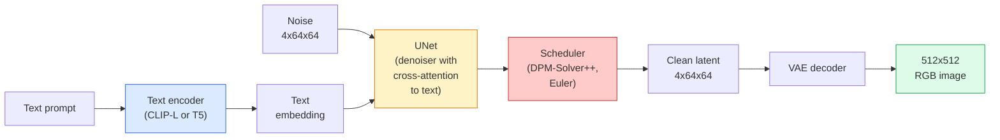

# Dayanıklı Diffusion  Memurlık ve Fine-Tuning  Dayanıklı Diffusion  Yapı ve biçim

> Stable Diffusion, önceden eğitilmiş bir VAE'nin gizli alanında çalışan, çapraz dikkat yoluyla metine koşullanmış, hızlı bir belirleyici ODE çözücü ile örneklenen ve sınıflandırıcı dışı rehberlik ile yönlendirilmiş bir DDPM'dir.

> **【中文解读】**Stabil Diffusion, VAE'nin potansiyel alanında çalışan yayılma modelidir,交叉注意力 (gözde dikkat) ile metin koşullarını kabul ederek, hızlı belirlenme ODE (Hazırlama) kullanarak, sınıflandırıcısız rehberlik (Hazırlama) ile yönetim oluşturma kalitesi (Hazırlama) ile yönetilir.

> **【拓展：Stable Diffusion 生态】**Stable Diffusion  LoRA ️Light Quantity ️Light Module ️ControlNet ️Control Gest态/边缘 ️IP-Adapter ️Images Tip) ️Low ️Low ️Low ️Low ️Low ️Low ️Low Low Low Low Low Low Low Low Low Low Low Low Low Low Low Low Low Low Low Low Low Low Low Low Low Low Low Low Low Low Low Low Low Low Low Low Low Low Low Low Low Low Low Low Low Low Low Low Low Low Low Low Low Low Low Low Low Low Low Low Low Low Low Low Low Low Low Low Low Low Low Low Low Low Low Low Low Low Low Low Low Low Low LLow Low Low Low Low Low Low Low Low Low Low Low Low Low Low Low Low Low Low LLow Low Low Low

**Type:** Learn + Use | **类型:** 学习 + 应用
**Languages:** Python | **语言:** Python
**Prerequisites:** Phase 4 Lesson 10 (Diffusion), Phase 7 Lesson 02 (Self-Attention) | **前置知识:** Phase 4 Lesson 10（扩散模型），Phase 7 Lesson 02（自注意力）
**Time:** ~75 minutes | **时间:** ~75 分钟

## Öğrenme hedefleri

- Stable Diffusion borusunun beş parçasını izleyin: VAE, metin kodlayıcı, U-Net, programlayıcı, güvenlik kontrolcisi  ve bunların her biri aslında ne yapar
- Gizli difüzyonunu ve 4x64x64 gizli alanlarda (3x512x512 görüntü yerine) eğitim yapmanın neden kalite kaybı olmadan hesaplamaları 48 kat azalttığını açıklayın.
- Kullanım`diffusers`Resim üretmek, resimden resme çalıştırmak, boyalama ve ControlNet tarafından yönlendirilmiş jenerasyon
- Küçük özel veri kümesine LoRA ile sabit difüsiyon ve LoRA adaptörünü sonuçta yükle

> **【中文解读】**Öğrenme hedefi, ders bitirilmesinden sonra öğrenilmesi gereken temel becerileri listeler.


## Sorunlar. Sorunlar.

DDPM'yi doğrudan 512x512 RGB görüntülerinde eğitmek pahalıdır. Her eğitim adımı 3x512x512 = 786,432 giriş değerlerini gören bir U-Net üzerinden geriye doğru ilerler ve örnekleme aynı U-Net üzerinden 50+ ileri geçiş alır. Stable Diffusion 1.5 (2022'de yayınlanan) kalite seviyesinde, piksel-uzayı difüsiyon yaklaşık 256 GPU-aylık eğitim ve tüketici GPU'da bir görüntü başına 10-30 saniye gerekecektir.

> DDPM'de 512x512 RGB görüntü üzerinde doğrudan eğitim almak çok pahalı. Her eğitim aşaması 3x512x512 = 786.432 ′ giriş değerini gören bir U-Net'in geriye doğru yayılması, örnekleme aynı U-Net'ten 50+ kez daha ileri doğru yayılması gerekir.

Açık ağırlığı olan metin-resim uygulamasını sağlayan numara:**latent diffusion**(Rombach et al., CVPR 2022). 3x512x512 resmini 4x64x64 gizli tensöre ve geriye harcayacak bir VAE eğit, sonra bu gizli alanda yayım yapın.`(3*512*512)/(4*64*64) = 48x`- Aynı GPU'da örneği almak on saniyelik bir düşüşten iki saniyeye kadar düşüyor.

> Açık yazıyı resimden çekmek için kullanılabilir teknikler:**潜空间扩散**(Rombach 等,CVPR 2022) ◊ VAE'yi eğitmek 3x512x512 图像映射到4x64x64 潜张量并恢复,然后在那潜空间中进行扩散──计算量降低 ◊`(3*512*512)/(4*64*64) = 48x`Aynı GPU'da birkaç saniyelik bir süreye kadar düştü.

Neredeyse her modern görüntü üretimi modeli  SDXL, SD3, FLUX, HunyuanDiT, Wan-Video  otomatik kodlayıcı, tanımlayıcı (U-Net veya DiT) ve metin koşullandırmasıdaki değişikliklerle gizli bir yayılma modelidir.

> 几乎每一个现代图像生成模型SDXL、SD3、FLUX、HunyuanDiT、Wan-Video都是潜空间扩散模型,自编码器、去噪器(U-Net veya DiT) 和文本条件化上有所不同──学会 稳定传播 就学会了模板──

## Konsepten bir şey.

> **【中文解读】**Bu bölümde temel kavramlar ve teoriler hakkında konuşuluyor. Bu kavramları öğrenmek, sonradan gerçekleştirilme önemi, aynı zamanda, görüşmeler ve mühendislik uygulamalarında yüksek sıklıkta yapılan incelemelerin bilgi noktasıdır.


### - Boru hattı



- **VAE** dondurulmuş oto kodlayıcı. Kodlayıcı görüntüyi latente (img2img ve eğitim için kullanılır).
  Çinçe Çevirimi:VAE结的自编码器──编码器将图像转换为潜变量(用于img2img 和训练),解码器将潜变量还原为图像──
- **Text encoder** CLIP metin kodlayıcı (SD 1.x/2.x), CLIP-L + CLIP-G (SDXL) veya T5-XXL (SD3/FLUX).
  ÇXL veya T5-XXL (SD3/FLUX) ⋅ oluşturmak için bir dizi token 嵌入──
- **U-Net** denoiser. Her çözünürlük düzeyinde yerleştirilen metne latentlerden katılan çapraz dikkat katmanlarına sahiptir.
  Çinçe Çevirimiçi:U-Net de noise器──包含交叉注意力层,在每个分辨率级别上从潜变量关订本嵌入──
- **Scheduler** örnekleme algoritması (DDIM, Euler, DPM-Solver++). Sigmaları seçer, öngörülen gürültüyü geri gizli içine karıştırır.
  Çine dilinde:调度器采样算法 (DDIM、Euler、DPM-Solver++) ⋅选择 sigma 值,将预测的噪音混合回潜变量──)
- **Safety checker** çıkış görüntüsünde seçmeli NSFW / yasadışı içerik filtresi.
  Çinçe Çevirimi: güvenlik kontrol cihazı 可选的 NSFW / 违规内容过器,作用于输出图像──

### Sınıflandırıcıdan Çekilmeyen Rehberlik (CFG)

Basit metin koşullandırması öğrenir `epsilon_theta(x_t, t, c)`Her çağrısı için .`c`CFG aynı ağı `c`Bu nedenle, bu durumun sonucunda, hem koşullu hem de koşulsuz gürültüyi tahmin eden tek bir model oluşturuldu.

> 纯文本条件化学习 `epsilon_theta(x_t, t, c)`Her bir ipucu için`c`◊CFG                                                                                                                                                                                                                                                                                                                                                                                                                                                                                                                          `c`(hayır yerleşme için değiştirilmiştir), bir zaman içinde bir durum durum durum durum durum durum durum durum durum durum durum durum durum durum durum durum durum durum durum durum durum durum durum durum durum durum durum durum durum durum durum durum durum durum durum durum durum durum durum durum durum durum durum durum durum durum durum durum durum durum durum durum durum durum durum durum durum durum durum durum durum durum durum durum durum durum durum durum durum durum durum durum durum durum durum durum durum durum durum durum durum durum durum durum durum durum durum durum durum durum durum durum durum durum durum durum durum durum durum durum durum durum durum durum durum durum durum durum durum durum durum durum durum durum durum durum durum durum durum durum durum durum durum durum durum durum durum durum durum durum durum durum durum durum durum durum durum durum durum durum durum durum durum durum durum durum durum durum durum durum durum durum durum durum durum durum durum durum durum durum durum durum durum durum durum durum durum durum durum durum durum durum durum durum durum durum durum durum durum durum durum durum durum durum durum durum durum durum durum durum durum durum durum durum durum durum durum durum durum durum durum durum durum durum durum durum durum durum durum durum durum durum durum durum durum durum durum durum durum durum durum durum durum durum durum durum durum durum durum durum durum durum durum durum durum durum durum durum durum durum durum durum durum durum durum durum durum durum durum durum durum durum durum durum durum durum durum durum durum durum durum durum durum durum durum durum durum durum durum durum durum durum durum durum durum durum durum durum durum durum durum durum durum durum durum durum durum durum durum durum durum durum durum durum durum durum durum durum durum durum durum durum durum durum durum durum durum durum durum durum durum durum durum durum durum durum durum durum durum durum durum durum durum durum durum durum durum durum durum durum durum durum durum durum durum durum durum durum durum durum durum durum durum durum durum durum durum durum durum durum durum durum durum durum durum durum durum durum durum durum durum durum durum durum durum durum durum durum durum durum durum durum durum durum durum durum durum durum durum durum durum durum durum durum durum durum durum durum durum durum durum durum durum durum durum durum durum durum durum durum durum durum durum durum durum durum durum durum durum durum durum durum durum durum durum durum durum durum durum durum durum durum durum durum durum durum durum durum durum durum durum durum durum durum durum durum durum durum durum durum durum durum durum durum durum durum durum durum durum durum durum durum durum durum durum durum durum durum durum durum durum durum durum durum durum durum durum durum durum durum durum durum durum durum durum durum durum durum durum durum durum durum durum durum durum durum durum durum durum durum durum durum durum durum durum

```
eps = eps_uncond + w * (eps_cond - eps_uncond)
```

`w`- Bu yönlendirme ölçeği.`w=0`Şartsızdır.`w=1`- Kesinlikle şartlı.`w>1`SD standart olarak `w=7.5`- Evet .

> `w`- Yapacak bir boyut.`w=0`- Şartsız oluştu.`w=1`Normal şartlar oluşur.`w>1`Çeşitlilik karşılığında üretim için daha fazla çaba harcayarak, daha fazla üretime yol açmak.`w=7.5`- Evet.

CFG, metin-resim kalitesi için çalışmanın nedenidür.

> CFG, metin-ya-resim-i üretim seviyesinde kalite altında çalışmanın nedenidir.

### Latent uzay geometrisinin

VAE'nin 4 kanallı gizli görüntüsü sadece sıkıştırılmış bir görüntü değil. Bu, aritmetiklerin yaklaşık olarak semantik düzenlemelere (sürekli mühendislik + interpolasyon her ikisi de burada yaşar) karşılık geldiği ve U-Net'in tüm modelleme bütçesini harcamak için eğitildiği bir çeşitliliktir. Rastgele bir 4x64x64 latenti çözme rastgele görünen bir görüntü üretmez  çöp üretir, çünkü yalnızca belirli bir alt çeşitlilikte latenler geçerli görüntülere çözür.

> VAE'nin 4 yolu alt değişimi sadece sıkıştırılmış görüntü değildir. Bu bir akışıdır, üzerinde algoritma çalışmaları burada gerçekleşir.

İki sonuç:

> İki sonuç:

1. **Img2img**= görüntüyi gizli olarak kodlayın, kısmi gürültü ekleyin, denosörü çalıştırın, dekode edin. Görüntü yapısı, kodlamanın dönüştürülebilir olması nedeniyle hayatta kalır; içeriği istek üzerine göre değişir.
   Çeviri:**Img2img**= Görüntü kodlamasını, bir kısmını gürültüye eklemeyi, bir kısmını gürültüye eklemeyi, bir kısmını sesle değiştirmeyi, bir kısmını sesle değiştirmeyi, bir kısmını sesle değiştirmeyi, bir kısmını sesle değiştirmeyi, bir kısmını sesle değiştirmeyi, bir kısmını sesle değiştirmeyi, bir kısmını sesle değiştirmeyi, bir kısmını sesle değiştirmeyi, bir kısmını sesle değiştirmeyi, bir kısmını sesle değiştirmeyi, bir kısmını sesle değiştirmeyi, bir kısmını sesle değiştirmeyi, bir kısmını sesle değiştirmeyi, bir kısmını sesle değiştirmeyi, bir kısmını sesle değiştirmeyi, bir kısmını sesle değiştirmeyi, bir kısmını sesle değiştirmeyi, bir kısmını sesle değiştirmeyi, bir kısmını sesle değiştirmeyi, bir kısmını değiştirmeyi, bir kısmını değiştirmeyi, bir kısmını değiştirmeyi, bir kısmını değiştirmeyi, bir kısmını değiştirmeyi, bir kısmını değiştirmeyi, bir kısmını değiştirmeyi, bir kısmını değiştirmeyi, bir kısmını değiştirmeyi, bir kısmını değiştirmeyi, bir kısmını değiştirmeyi, bir kısmını değiştirmeyi, bir kısmını değiştirmeyi, bir kısmına değiştirmeyi, bir kısmına değiştirmeyi, bir kısmına çevirmeyi, bir kısmına çevirmeyi, bir kısmına çevirmeyi, bir kısmına çevirmeyi, bir kısmına çevirmeyi, bir kısmına çevirmek, bir kısmına çevirmek, bir kısmına çevirmek, bir kısmına çevirmek, bir kısmına çevirmek, bir kısmına çevirmek, bir kısmına çevirmek, bir kısmına çevirmek, bir şekilde değiştirmek, bir şekilde değiştirmek, bir şekilde değiştirmek, bir şekilde değiştirmek, bir şekilde, bir şekilde, bir şekilde, bir şekilde, bir şekilde değiştirmek, bir şekilde, bir şekilde, bir şekilde, bir şekilde, bir şekilde, bir şekilde, bir şekilde, bir şekilde, bir şekilde, bir şekilde, bir şekilde, bir şekilde, bir şekilde, bir şekilde, bir şekilde, bir şekilde, bir şekilde, bir şekilde, bir şekilde, bir şekilde, bir şekilde, bir şekilde, bir şekilde, bir şekilde, bir şekilde, bir şekilde, bir şekilde, bir şekilde, bir şekilde, bir şekilde, bir şekilde, bir şekilde, bir şekilde, bir şekilde, bir şekilde, bir şekilde, bir şekilde, bir şekilde, bir şekilde, bir şekilde, bir şekilde, bir
2. **Inpainting**= img2img ile aynı ama denoiser sadece maskeli bölgeleri güncelleyebilir; maskeli olmayan bölgeler kodlanmış gizli olarak tutulur.
   Çeviri:**Inpainting**= Img2img ile aynı, ancak giderilen gürültü cihazı sadece gizlenmiş bölgeyi yenilemektedir; gizlenmemiş bölge, kodlama sonrası potansiyel değişimleri için korunmaktadır.

### U-Net mimarisi

SD U-Net, Ders 10'dan TinyUNet'in büyük bir versiyonu ve üç eklemedir:

> SD'nin U-Net'i, TinyUNet'in büyük sürümü olan 10. sınıf, üç bileşeni ekledi:

- **Transformer blocks**Her boşluk çözünürlüğünde, kendi dikkatini + metin yerleştirilmesine karşı dikkatini içerir.
  Çinçe Çevirim: Her uzay çözünürlüğündeki Transformer blokları, kendi dikkatini içerir + metin içine yerleştirilen bir geçiş dikkatini içerir.
- **Time embedding**Sinusoidal kodlama üzerinden MLP.
  Çinçe Çevirim: MLP 处理正弦编码的时间嵌入──
- **Skip connections**Eşleşen çözünürlüklerde kodlayıcı ve dekodör arasında.
  Çinçe Çevirimiçi:编码器和码器在匹配分辨率之间跳连接──

SD 1.5'deki toplam parametreler: ~860M. SDXL: ~2.6B. FLUX: ~12B. Paramlarda atlama çoğunlukla dikkat katmanlarında gerçekleşir.

> SD 1.5                                                                                                                                                                                                                                                                                                                                                                                                                                                                                                                            

### LoRA ince ayarlama

Stable Diffusion'un tam ince ayarlaması 20 GB'dan fazla VRAM gerektirir ve 860M parametreleri güncelleyebilir. LoRA (Low-Rank Adaptation) temel modelin dondurulmasını sağlar ve dikkat katmanlarına küçük sıra-karşılaşma matrislerini enjekte eder. SD için bir LoRA adaptörü tipik olarak 10-50 MB'dir, tek bir tüketici GPU'da 10-60 dakika boyunca çalışır ve bir düşüş değiştirimi olarak sonuçlama zamanında yüklenir.

> Stable Diffusion'un toplam miktarı 20+ GB 显存并更新 8.6 亿参数。LoRA(低秩适应) temel model 结, dikkat seviyesi içinde küçük düzen parçalanma矩阵注入する.SD'nin LoRA 适配器ı genellikle sadece 10-50 MB, tek 张消费级 GPU'da 10-60 dakika, önerme sırasında hemen ekleme için yapılan değişiklik yüklenmesi olarak kullanılır.

```
Original: W_q : (d_in, d_out)   frozen
LoRA:     W_q + alpha * (A @ B)   where A : (d_in, r), B : (r, d_out)

r is typically 4-32.
```

LoRA, neredeyse tüm toplulukların ince sesleri dağıtma şekli. CivitAI ve Hugging Face milyonlarca sesini evlat edinir.

> LoRA neredeyse tüm toplulukların küçük bir bölge şeklidir.

### Gördüğün zamanlamalar

- **DDIM** Deterministik, ~50 adım, basit.
  ÇINÇAMAN TRÜBLİK:DDIM kesinlik, yaklaşık 50 步,简单――
- **Euler ancestral** Stochastic, 30-50 adım, biraz daha yaratıcı örnekler.
  Çinçe Çevirim:Euler Ataları 随机性,30-50 步,样本更具创意──
- **DPM-Solver++ 2M Karras** Deterministik, 20-30 adım, üretim default.
  Çeviri:DPM-Solver++ 2M Karras kesinlik,20-30 步,生产环境默认选择──
- **LCM / TCD / Turbo** tutarlılık modelleri ve destilli çeşitleri; 1-4 adım bir kalite masrafı.
  Çinçe Çevirim:LCM / TCD / Turbo一致性模型和蒸变体;1-4 步,代价是一些质量损失──

Programlamaları değiştirmek , bir satırlık bir değişimdir .`diffusers`Ve bazen de herhangi bir yeniden eğitim olmadan örnek sorunlarını düzeltir.

> - Evet .`diffusers`Çıkarıcı sadece bir satır kod gerektiriyor, bazen de yeniden eğitilmeye gerek yok.

> **【中文解读】**Bu bölüm kodla sıfırdan gerçekleştirilen çekirdek algoritmasıdır. Bu "sıfırdan" yöntem çerçevenin arkasındaki prensipleri anlama yardımcı olur.

> **【拓展：工业部署中的视觉系统】**Gerçek endüstriye dağıtımında, görsel modeller gecikme, model büyüklüğü, kenar cihazların uyumlu olması gibi sorunları düşünmelidir. TensorRT, ONNX Runtime, OpenVINO, yaygın olarak kullanılan bir görsel model hızlandırma aracıdır.

> **【拓展：数据标注与质量】**视觉任务的效果高度依赖标签数据质――Label Studio、CVAT is the mainstream tagging tool――在工业场景中,主动学习(Active Learning) 标签成本ı azaltabilir:模型对不确定的样本请求人工标签,确定性的样本自动标签──


## Yapın.
```figure
cv3-latent-compression
```

## Yapın

Bu ders kullanıyor .`diffusers`Bu nedenle, bu programın temelinde, yeni bir sistem oluşturmak için, yeni bir sistem oluşturmak için, yeni bir sistem oluşturmak için, yeni bir sistem oluşturmak için, yeni bir sistem oluşturmak için, yeni bir sistem oluşturmak için, yeni bir sistem oluşturmak için, yeni bir sistem oluşturmak için, yeni bir sistem oluşturmak için, yeni bir sistem oluşturmak için, yeni bir sistem oluşturmak için, yeni bir sistem oluşturmak için, yeni bir sistem oluşturmak için, yeni bir sistem oluşturmak için, yeni bir sistem oluşturmak için, yeni bir sistem oluşturmak için, yeni bir sistem oluşturmak için, yeni bir sistem oluşturmak için, yeni bir sistem oluşturmak için, yeni bir sistem oluşturmak için, yeni bir sistem oluşturmak için, yeni bir sistem oluşturmak için, yeni bir sistem oluşturmak için, yeni bir sistem oluşturmak için, yeni bir sistem oluşturmak için, yeni bir sistem oluşturmak için, yeni bir sistem oluşturmak için, yeni bir sistem oluşturmak için, yeni bir sistem oluşturmak için, yeni bir sistem oluşturmak için, yeni bir sistem oluşturmak için, yeni bir sistem oluşturmak için, yeni bir sistem oluşturmak için, yeni bir sistem oluşturmak için, yeni bir sistem oluşturmak için, bir sistem oluşturmak için, bir sistem oluşturmak için, bir sistem oluşturmak için, bir sistem oluşturmak için, bir sistem oluşturmak için, bir sistem oluşturmak için, bir temel oluşturmak için, bir amaç, bir temel oluşturmak için, bir temel oluşturmak için, bir amaç, bir temel oluşturmak için, bir temel oluşturmak için, bir temel oluşturmak için, bir temel oluşturmak için, bir temel oluşturmak için, bir temel oluşturmak için, bir temel oluşturmak için, bir temel oluşturmak, bir temel oluşturmak için, bir temel oluşturmak için, bir temel oluşturmak, bir temel oluşturmak,

> 本课端到端使用 `diffusers`Bu, Stable Diffusion'dan değil, her tür özel bir ders için yeniden inşa edilmesi gereken bir yapılandırma sistemidir.

### Adım 1: Resme metin

```python
import torch
from diffusers import StableDiffusionPipeline

pipe = StableDiffusionPipeline.from_pretrained(
    "runwayml/stable-diffusion-v1-5",
    torch_dtype=torch.float16,
).to("cuda")

image = pipe(
    prompt="a dog riding a skateboard in tokyo, studio ghibli style",
    guidance_scale=7.5,
    num_inference_steps=25,
    generator=torch.Generator("cuda").manual_seed(42),
).images[0]
image.save("dog.png")
```

`float16`Görülebilir bir kalite kaybı olmadan VRAM' ı yarıya çıkarır. `num_inference_steps=25`Öntanımlı DPM-Solver++ eşleşmeleri ile `num_inference_steps=50`DDIM ile.

> `float16`                                                                                                                                                                                                                                                                                                                                                                                                                                                                                                                             `num_inference_steps=25`DDIM'i kullanmak için geçerli.`num_inference_steps=50`- Evet.

### Adım 2: Programlayıcıyı değiştir

```python
from diffusers import DPMSolverMultistepScheduler, EulerAncestralDiscreteScheduler

pipe.scheduler = DPMSolverMultistepScheduler.from_config(pipe.scheduler.config)
pipe.scheduler = EulerAncestralDiscreteScheduler.from_config(pipe.scheduler.config)
```

Programlayıcı durum U-Net ağırlıklarından koparılmış. DDPM üzerinde eğitim alabilir ve herhangi bir programcı ile örnek alabilirsiniz.

> 调度器状态与 U-Net 权重解── DDPM 上训练,任何调度器采样──

### Adım 3: Resimden resme

```python
from diffusers import StableDiffusionImg2ImgPipeline
from PIL import Image

img2img = StableDiffusionImg2ImgPipeline.from_pretrained(
    "runwayml/stable-diffusion-v1-5",
    torch_dtype=torch.float16,
).to("cuda")

init_image = Image.open("dog.png").convert("RGB").resize((512, 512))
out = img2img(
    prompt="a dog riding a skateboard, oil painting",
    image=init_image,
    strength=0.6,
    guidance_scale=7.5,
).images[0]
```

`strength`Bu, denoze edilmeden önce ne kadar gürültü eklenmesi (0,0 = değişmez, 1.0 = tam yenilenme) anlamına gelir.

> `strength`控制去噪音前添加多少噪音(0.0 = 不变,1.0 = 完全重新生成) ・0.5-0.7 是风格迁移的标准范围──

### Dördüncü adım: Boyanma

```python
from diffusers import StableDiffusionInpaintPipeline

inpaint = StableDiffusionInpaintPipeline.from_pretrained(
    "runwayml/stable-diffusion-inpainting",
    torch_dtype=torch.float16,
).to("cuda")

image = Image.open("dog.png").convert("RGB").resize((512, 512))
mask = Image.open("dog_mask.png").convert("L").resize((512, 512))

out = inpaint(
    prompt="a cat",
    image=image,
    mask_image=mask,
    guidance_scale=7.5,
).images[0]
```

Maskedeki beyaz pikseller yenilenmek için alan.

> 掩码中白色像素是需要重生区域,黑色像素被保留──

### Adım 5: LoRA yükleme

```python
pipe.load_lora_weights("sayakpaul/sd-lora-ghibli")
pipe.fuse_lora(lora_scale=0.8)

image = pipe(prompt="a village square in ghibli style").images[0]
```

`lora_scale`Güç kontrolü; 0.0 = hiçbir etki, 1.0 = tam etki. `fuse_lora`Adaptörü hız için yerindeki ağırlıklara pişirir ama değişimi engeller.`pipe.unfuse_lora()`Farklı bir adaptör yüklenmeden önce.

> `lora_scale`Kontrol Güçü;0.0 = 无效,1.0 = 完全效果──`fuse_lora`Adaptörlerin ağırlık arasında birleşmesi hızını artırır, ancak değişimi engeller.`pipe.unfuse_lora()`- Evet.

### Adım 6: LoRA eğitimi (sketç)

Gerçek LoRA eğitimleri hayatın içinde `peft`veya `diffusers.training`- Şekil:

> Gerçek LoRA eğitiminde .`peft`Ya da`diffusers.training`İçinde bulunur:

```python
# Pseudocode
for step, batch in enumerate(dataloader):
    images, prompts = batch
    latents = vae.encode(images).latent_dist.sample() * 0.18215

    t = torch.randint(0, num_train_timesteps, (batch_size,))
    noise = torch.randn_like(latents)
    noisy_latents = scheduler.add_noise(latents, noise, t)

    text_emb = text_encoder(tokenizer(prompts))

    pred_noise = unet(noisy_latents, t, text_emb)  # LoRA weights injected here

    loss = F.mse_loss(pred_noise, noise)
    loss.backward()
    optimizer.step()
```

> **【中文解读】**Bu bölümde, PyTorch, HuggingFace gibi olgun çerçeveler nasıl kullanılacağını gösterir.


Sadece LoRA matrisleri gradient alır; temel U-Net, VAE ve metin kodlayıcı dondurulmuştur.

>                                                                                                                                                                                                                                                               


> **【拓展：视觉模型的持续学习】**Üretim ortamında, görsel modeller yeni verilere sürekli uyum sağlamak gerekir. Yeni ürünler, yeni sahne, yeni ışık koşulları. Sürekli öğrenme. Sürekli öğrenme.

## Çerçeveyi kullanın.

Üretim sırasında, gerçekte aldığınız kararlar:

- **Model family**: SD 1.5 açık kaynaklı topluluk ince tonları için, SDXL daha yüksek sadakat için, SD3 / FLUX son teknoloji ve sıkı lisans gereksinimleri için.
- **Scheduler**: DPM-Solver++ 20 ila 30 adım için 2M Karras, 1 saniye altında geciktiğinde LCM-LoRA.
- **Precision**- Evet .`float16`4080/4090'da, `bfloat16`A100 ve daha yeni,`int8`(den)`bitsandbytes`veya `compel`) VRAM sıkıken.
- **Conditioning**: düz metin çalışması; daha güçlü kontrol için, temel boru hattının üstüne ControlNet (sıkı, derin, poz) ekleyin.

> **【中文解读】**Bu bölümde modellerin kullanılabilir ürünler için nasıl dağıtılacağı üzerinde yoğunlaşmaktadır.


Satır üretimi için,`AUTO1111`- Ne ?`ComfyUI`Topluluk araçları; üretim API'leri için,`diffusers`+ `accelerate`veya `optimum-nvidia`TensorRT komisyonu ile.


## İndirin . Ürünler .

Bu ders şunları ortaya çıkarır:

- `outputs/prompt-sd-pipeline-planner.md` SD 1.5 / SDXL / SD3 / FLUX'i ve programlayıcıyı ve bir gecikme bütçesi, sadakat hedefi ve lisans kısıtlaması göz önüne alındığında kesinliği seçen bir istek.
- `outputs/skill-lora-training-setup.md` Başlıkları, sıralama, parti boyutu ve öğrenme oranı dahil olmak üzere özel bir veri kümesi için tam bir LoRA eğitim yapılandırmasını yazma becerisi.

> **【中文解读】**练习题按照易/中级/难三度递进;;建议至少完成中级题,Hard级适合深入研究或面试准备;;


## Egzersizler.

1. **(Easy)**Aynı istekleri oluştur `guidance_scale`İçeride`[1, 3, 5, 7.5, 10, 15]`- Resim nasıl değişiyor?
2. **(Medium)**Gerçek fotoğraflar çek, onları tarayın.`StableDiffusionImg2ImgPipeline`- ...`strength`İçeride`[0.2, 0.4, 0.6, 0.8, 1.0]`1.0. neden girişleri tamamen görmezden gelir?
3. **(Hard)**Bir tek konuyu (bir evcil hayvan, logo, bir karakter) oluşturan 10-20 görüntü üzerinde LoRA'yı eğit ve bu konuyu içeren yenilikçi sahneler oluştur.

> **【中文解读】**术语表中的"İnsanların ne dediği" vs "Gerçekten ne anlama geldiği" 区分日常口语和精确技术含义──在团队协作中,统一术语定义可以避免大量沟通误解──


## Anahtar Şartlar .

| Term | What people say | What it actually means |
|------|----------------|----------------------|
| Latent diffusion | "Diffuse in latents" | Run the entire DDPM in the VAE latent space (4x64x64) instead of pixel space (3x512x512); 48x compute saving |
| VAE scale factor | "0.18215" | Constant that rescales the VAE's raw latent to roughly unit variance; hardcoded in every SD pipeline |
| Classifier-free guidance | "CFG" | Mix conditional and unconditional noise predictions; the single most impactful inference knob |
| Scheduler | "Sampler" | The algorithm that turns noise + model predictions into a denoised latent trajectory |
| LoRA | "Low-rank adapter" | Small rank-decomposition matrices that fine-tune attention layers without touching base weights |
| Cross-attention | "Text-image attention" | Attention from latent tokens to text tokens; injects prompt information at every U-Net level |
| ControlNet | "Structure conditioning" | A separately-trained adapter that steers SD with an extra input (canny, depth, pose, segmentation) |
| DPM-Solver++ | "The default scheduler" | Second-order deterministic ODE solver; best quality at low step counts (20-30) in 2026 |

> **【中文解读】**延伸阅读, derinlemesine öğrenme için yüksek kaliteli kaynaklar sağladı. Bu makaleler ve dersler, derinlemesine anlama ihtiyacı olan okuyuculara uygun olarak bu alanın klasik referanslarıdır.


## Daha fazla okumak

- [High-Resolution Image Synthesis with Latent Diffusion (Rombach et al., 2022)](https://arxiv.org/abs/2112.10752) Stable Diffusion kağıdı; tasarımı haklı çıkaran her bir ablation içerir
- [Classifier-Free Diffusion Guidance (Ho & Salimans, 2022)](https://arxiv.org/abs/2207.12598) CFG kağıdı
- [LoRA: Low-Rank Adaptation of Large Language Models (Hu et al., 2021)](https://arxiv.org/abs/2106.09685) LoRA ilk olarak NLP'yi kullanmış; neredeyse hiç değişim olmadan SD'ye aktarılmış.
- [diffusers documentation](https://huggingface.co/docs/diffusers) her SD / SDXL / SD3 / FLUX boru hattı için referans
