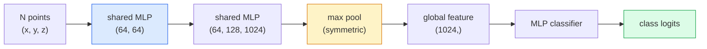

# 3D Görüş  Nokta Bulutları & NeRFs  3D Görüş  NERF ile Nokta Bulutları

> 3 boyutlu görüntü iki farklı şekilde ortaya çıkar. Nokta bulutları sensörün çiğ çıkışıdır. NeRF'ler öğrenilen boyutsal alandır. Her ikisi de "uzayda nerede" cevabını verir.

> **【中文解读】**3D vizyon iki tip vardır: nokta cloud is a sensor (LiDAR、深度相机) orijinal çıkış; NeRF(nervous radiation field) öğrenilen büyüklük alanıdır.

> **【拓展：3D 视觉的应用】**NeRF, virtual reality/增强现实 (VR/AR) 、建筑可视化、自动驾驶场景重建──3D Gaussian Splatting(下一课) olarak kullanılır.

**Type:** Learn + Build | **类型:** 学习 + 动手
**Languages:** Python | **语言:** Python
**Prerequisites:** Phase 4 Lesson 03 (CNNs), Phase 1 Lesson 12 (Tensor Operations) | **前置知识:** Phase 4 Lesson 03（CNN），Phase 1 Lesson 12（张量运算）
**Time:** ~45 minutes | **时间:** ~45 分钟

## Öğrenme hedefleri

- Açık (nokta bulutu, ağ, voksel) ve içerikli (işaretlenmiş mesafe alanı, NeRF) 3D temsillerini ayırt edin ve her biri ne zaman kullanılır
- PointNet'in simetrik fonksiyon hilesini anlayın. Bu da sinir ağının düzensiz bir nokta kümesi üzerinde değişken bir değişkenlik gösterir.
- NeRF ileri geçişini izleyin: ışın dökümleri, volumetrik renderi, konum kodlaması, MLP yoğunluğu+ renk başlığı
- Kullanım`nerfstudio`veya `instant-ngp`Küçük bir dizi poz görüntüden önceden eğitilmiş 3D rekonstrüksiyon için

> **【中文解读】**Öğrenme hedefi, ders bitirilmesinden sonra öğrenilmesi gereken temel becerileri listeler.


## Sorunlar. Sorunlar.

Bir kamera 2 boyutlu bir görüntü üretir. Bir LIDAR, düzenlenmeden 3 boyutlu noktaların bir dizi üretir. Bir yapı-hareket boru hattı, 3 boyutlu anahtar noktaların nadir bir bulutunu üretir. Bir NeRF, bir avuç poz görüntüden tüm 3 boyutlu bir sahneyi yeniden oluşturur. Bunların hepsi "görüş" dir, ancak hiçbirleri CNN'nin istediği yoğun tensöre benzememiştir.

> 相机产生 2D图像──LiDAR 产生一组无序的3D点──运动恢复结构流水线产生稀疏的3D 关键点云──NeRF birkaç konumdaki姿像图像重建整个3D场景── bunlar "görüş"tir, ancak CNN'in istediği yoğun 张量──

3D görüntü önemli çünkü neredeyse her yüksek değerli robot görevi 3D'de çalışır: yakalama, engellerden kaçınma, navigasyon, AR gizleme, 3D içeriği yakalama. Sadece 2D görüntüleri anlayan bir görme mühendisi alanın en hızlı büyüyen kesiminden (AR / VR içeriği, robotik, otonom sürüş yığınları, emlak veya inşaat için NeRF tabanlı 3D yeniden inşaat) uzaklaştırılır.

> 3D vizyonu önemlidir, çünkü neredeyse her yüksek değerli makinenin görevi 3D'de çalışır: kavrayıp engellemeden, yolculuk yaparak, AR 遮、3D içeriği yakalamak. Sadece 2D görüntülerin görsel mühendislerinin bu alanda en hızlı büyüyen bölümden dışarıda kilitlendiğini anlamak için.

İki temsil farklı nedenlerle baskın. Nokta bulutları sensörlerin size ücretsiz olarak verdiği şeydir. NeRF'ler ve onların ardıcılleri (3D Gaussian splating, sinirsel SDF'ler) bir nöro ağından bir sahneyi öğrenmesini istediğinizde elde ettiğiniz şeydir.

> 两种表示因不同原因占据主导──点云是传感器免费给你──NeRF 及其后继者(3D 高斯、神经SDF) 时让神经网络学习场景时得到──

## Konsepten bir şey.

> **【中文解读】**Bu bölümde temel kavramlar ve teoriler hakkında konuşuluyor. Bu kavramları öğrenmek, sonradan gerçekleştirilme önemi, aynı zamanda, görüşmeler ve mühendislik uygulamalarında yüksek sıklıkta yapılan incelemelerin bilgi noktasıdır.


### Bıçak bulutları

Bir nokta bulutu, R^3'te N noktaların düzensiz bir kümesidir, seçeneği olarak her biri özelliklere (renk, yoğunluk, normal) sahiptir.

> 点云是 R^3 中 N 个点的无序集合, her nokta özelliği vardır.

```
cloud = [
  (x1, y1, z1, r1, g1, b1),
  (x2, y2, z2, r2, g2, b2),
  ...
  (xN, yN, zN, rN, gN, bN),
]
```

İki özellik sinir ağları için zorlaştırıyor:

> 没有网格,没有连接关系―― iki özellik sinir ağına çok zorluk yaratıyor:

- **Permutation invariance** çıkış nokta sırasından bağımsız olmalıdır.
  Çeviri:**置换不变性** Dışarı çıkış noktaların sırasına bağlı olamaz.
- **Variable N** tek bir model farklı boyutlu bulutları ele almalıdır.
  Çeviri:**可变 N** tek bir model farklı büyüklükteki noktaları ele almalıdır.

PointNet (Qi et al., 2017) her ikisini de bir fikirle çözdü: her noktaya ortak bir MLP uygulayın, sonra simetrik bir fonksiyonla (maksimum bir havuz) toplayın. Sonuç, sıraya bağlı olmayan sabit boyutlu bir vektördür.

> PointNet ((Qi 等,2017) bir fikirle iki sorunu çözdü: her noktayı bir uygulama paylaşmak için MLP, sonra da bir işlevi için kullanmak için (((maksimum birikim) birleştirmek için. Sonuç bir dizi ile ilişkisi olmayan sabit büyüklükteki bir kütle olacaktır.

```
f(P) = max_{p in P} MLP(p)
```

Bu, PointNet'in tüm çekirdeğidir. Daha derin çeşitler (PointNet++, Point Transformer) hiyerarşik örnekleme ve yerel birleştirme ekler, ancak simetrik fonksiyon hilesi değişmez.

> İşte PointNet'in tüm çekirdeği. Daha derin bir değişim (PointNet++、Point Transformer) aşama şeklinde birleştirme ve yerel birleştirme artışını gösterdi, ancak işlevi teknikleri değişmedi.

### PointNet mimarisi



"Bağışlanmış MLP", her noktada bağımsız olarak aynı MLP çalıştırılır.

> "Köşeldik MLP" aynı MLP'nin her noktada bağımsız olarak çalışmasını ifade eder.

### Nöral Radyans Alanları (NeRF)

NeRF (Mildenhall et al., 2020) "N fotoğraflardan 3D sahneyi yeniden yapılandırabilir miyiz?" sorusunu aldı ve sahne olan bir nöron ağıyla cevap verdi.`(x, y, z, viewing_direction)`- ...`(density, colour)`Yeni bir görüntü vermek, bu ağ üzerinde ışın yayım döngüsüdür.

> NeRF(Mildenhall et,2020) "N 张照片 场景重建能否?" sorusuna cevap verdi.`(x, y, z, 观察方向)`映射到 `(密度, 颜色)`染新视角, bu ağ üzerinde ışık atış döngüsü yapmakla ilgilidir.

```
NeRF MLP:  (x, y, z, theta, phi) -> (sigma, r, g, b)

To render a pixel (u, v) of a new view:
  1. Cast a ray from the camera through pixel (u, v)
  2. Sample points along the ray at distances t_1, t_2, ..., t_N
  3. Query the MLP at each point
  4. Composite the colours weighted by (1 - exp(-sigma * dt))
  5. The sum is the rendered pixel colour
```

Bir kayıp, render edilmiş pikselle eğitim fotoğraflarında yerçekimsel gerçeklik pikseline karşılaştırılır. Renderleme adımları aracılığıyla arka plan MLP'yi güncelleyebilir. 3D yerçekimsel gerçeklik, açık bir jeometri yoktur.

> 失误函数 染像素与训练照片中的真相像素──通过 染步骤的反向传播更新 MLP──无3D真值,无显式几何场景存储在 MLP 权重中──

### NeRF'de pozisyon kodlaması

Vanilya MLP ' de .`(x, y, z)`NeRF, bu durumu, her koordinatın MLP'den önce bir Fourier özelliği vektörüne kodlanarak düzeltir:

> Normal MLP `(x, y, z)`Ünlü olarak, MLP 频谱 eğilimi düşük frekansta olduğu için, yukarı yüksek frekans detaylarını gösteremez.

```
gamma(p) = (sin(2^0 pi p), cos(2^0 pi p), sin(2^1 pi p), cos(2^1 pi p), ...)
```

L=10 frekans seviyelerine kadar. Bu, pozisyonlar için kullanılan aynı hile transformörleridir ve difüzyon zaman şartlandırmasında tekrar ortaya çıkar (Desin 10).

> En fazla L=10 个频率级── Transformer ile aynı pozisyon teknikleri kullanılır, ayrıca tekrar yayılma modelinin zaman koşullama içinde ortaya çıkmaktadır.

### Volumetrik görüntüleme

```
C(r) = sum_i T_i * (1 - exp(-sigma_i * delta_i)) * c_i

T_i  = exp(- sum_{j<i} sigma_j * delta_j)
delta_i = t_{i+1} - t_i
```

`T_i`i.I.I.I.I.I.I.I.I.I.I.I.I.I.I.I.I.I.I.I.I.I.I.I.I.I.I.I.I.I.I.I.I.I.I.I.I.I.I.I.I.I.I.I.I.I.I.I.I.I.I.I.I.I.I.I.I.I.I.I.I.I.I.I.I.I.I.I.I.I.I.I.I.I.I.I.I.I.I.I.I.I.I.I.I.I.I.I.I.I.I.I.I.I.I.I.I.I.I.I.I.I.I.I.I.I.I.I.I.I.I.I.I.I.I.I.I.I.I.I.I.I.I.I.I.I.I.I.I.I.I.I.I.I.I.I.I.I.I.I.I.I.I.I.I.I.I.I.I.I.I.I.I.I.I.I.I.I.I.I.I.I.I.I.I.I.I.I.I.I.I.I.I.I.I.I.I.I.I.I.I.I.I.I.I.I.I.I.I.I.I.I.I.I.I.I.I.I.I.I.I.I.I.I.I.I.I.I.I.I.I.I.I.I.I.I.I.I.I.I.I.I.I.I.I.I.I.I.I.I.I.I.I.I.I.I.I.I.I.I.I.I.I.I.I.I.I.I.I.I.I.I.I.I.I.`(1 - exp(-sigma_i * delta_i))`i. noktada bulanıklık.`c_i`Son piksel ışın boyunca ağırlanan bir toplamdır.

> `T_i`                                                                                                                                                                                                                                                              `(1 - exp(-sigma_i * delta_i))`Bu da bir açıklık değil.`c_i`Renkler. Son görünümler ışığın üzerinde artışlar.

### NeRF'lerin yerini ne aldı?

Saf NeRF'ler eğitiminde (saatler) ve görüntüleme sırasında (bir görüntü başına saniyeler) yavaş.

> 純 NeRF 訓練慢(小時級) 且染慢(每张图像秒级) 』后续发展:

- **Instant-NGP**(2022)  hash-grid kodlaması MLP'nin pozisyon girişini değiştirir; saniyeler içinde trenler.
  Çeviri:**Instant-NGP**(2022) 哈希网格编码替代 MLP 的位置输入;秒级训练──
- **Mip-NeRF 360** sınırsız sahne ve anti-aliasing ile başa çıkıyor.
  Çeviri:**Mip-NeRF 360**处理无界场景和抗──
- **3D Gaussian Splatting**(2023) , volumetrik alanı milyonlarca 3D Gaussians ile değiştirir; trenler dakikalarda, gerçek zamanlı olarak rendere eder.
  Çeviri:**3D 高斯泼溅**(2023)  Millionalarca 3D Yükseklik Değişik Bütükenlik Alanı;分钟级训练,实时染──当前生产默认方案──

2026'da neredeyse tüm gerçek NeRF ürünleri aslında 3 boyutlu Gaussian splattering.

> 2026 yılında neredeyse tüm gerçek NeRF ürünleri aslında 3D yüksek seviyede.

### Verim kümeleri ve referans değerleri

- **ShapeNet** 3D CAD modellerinin nokta bulutları olarak sınıflandırılması ve bölünmesi.
  Çinçe Çevirim:ShapeNet3D CAD 模型的点云分类和分割──
- **ScanNet** bölümleşme için gerçek iç taramalar.
  Çeviri:ScanNet 真实室内扫描,用于分割──
- **KITTI** Özerk sürücü için açık LIDAR nokta bulutları.
  Çeviri:KITTI 户外 LiDAR 点云, otomatik sürüş için kullanılır
- **NeRF Synthetic**- Ne ?**Blended MVS** Görünüm sentezi için poz görüntü verileri.
  NeRF Sinteetik / Karıştırılmış MVS带位姿的图像数据集,用于视角合成──
- **Mip-NeRF 360**Veri kümesi  sınırsız gerçek sahne.
  Çeviri:Mip-NeRF 360 数据集 无界真实场景

> **【中文解读】**Bu bölüm kodla sıfırdan gerçekleştirilen çekirdek algoritmasıdır. Bu "sıfırdan" yöntem çerçevenin arkasındaki prensipleri anlama yardımcı olur.

> **【拓展：工业部署中的视觉系统】**Gerçek endüstriye dağıtımında, görsel modeller gecikme, model büyüklüğü, kenar cihazların uyumlu olması gibi sorunları düşünmelidir. TensorRT, ONNX Runtime, OpenVINO, yaygın olarak kullanılan bir görsel model hızlandırma aracıdır.

> **【拓展：数据标注与质量】**视觉任务的效果高度依赖标签数据质――Label Studio、CVAT is the mainstream tagging tool――在工业场景中,主动学习(Active Learning) 标签成本ı azaltabilir:模型对不确定的样本请求人工标签,确定性的样本自动标签──


## Yapın.
```figure
nerf-rays
```

## Yapın

### Adım 1: PointNet sınıflandırıcısı

```python
import torch
import torch.nn as nn

class PointNet(nn.Module):
    def __init__(self, num_classes=10):
        super().__init__()
        self.mlp1 = nn.Sequential(
            nn.Conv1d(3, 64, 1),    nn.BatchNorm1d(64),   nn.ReLU(inplace=True),
            nn.Conv1d(64, 64, 1),   nn.BatchNorm1d(64),   nn.ReLU(inplace=True),
        )
        self.mlp2 = nn.Sequential(
            nn.Conv1d(64, 128, 1),  nn.BatchNorm1d(128),  nn.ReLU(inplace=True),
            nn.Conv1d(128, 1024, 1), nn.BatchNorm1d(1024), nn.ReLU(inplace=True),
        )
        self.head = nn.Sequential(
            nn.Linear(1024, 512),   nn.BatchNorm1d(512),  nn.ReLU(inplace=True),
            nn.Dropout(0.3),
            nn.Linear(512, 256),    nn.BatchNorm1d(256),  nn.ReLU(inplace=True),
            nn.Dropout(0.3),
            nn.Linear(256, num_classes),
        )

    def forward(self, x):
        # x: (N, 3, num_points) — transposed for Conv1d
        x = self.mlp1(x)
        x = self.mlp2(x)
        x = torch.max(x, dim=-1)[0]       # (N, 1024)
        return self.head(x)

pts = torch.randn(4, 3, 1024)
net = PointNet(num_classes=10)
print(f"output: {net(pts).shape}")
print(f"params: {sum(p.numel() for p in net.parameters()):,}")
```

1.6M'lik bir parametre, bulut başına 1.024 puan.

> 1600.000 parametre... her noktayı 1024 noktayı işleyelim.

### Adım 2: Pozisyon kodlaması

```python
def positional_encoding(x, L=10):
    """
    x: (..., D) -> (..., D * 2 * L)
    """
    freqs = 2.0 ** torch.arange(L, dtype=x.dtype, device=x.device)
    args = x.unsqueeze(-1) * freqs * 3.141592653589793
    sinc = torch.cat([args.sin(), args.cos()], dim=-1)
    return sinc.reshape(*x.shape[:-1], -1)

x = torch.randn(5, 3)
y = positional_encoding(x, L=10)
print(f"input:  {x.shape}")
print(f"encoded: {y.shape}     # (5, 60)")
```

 ile çarpma`2^l * pi`Bu da sürekli olarak daha yüksek frekanslar verir.

> - Yukarı .`2^l * pi` aşamalı olarak yükselen frekans oluşur.

### Adım 3: Küçük NeRF MLP

```python
class TinyNeRF(nn.Module):
    def __init__(self, L_pos=10, L_dir=4, hidden=128):
        super().__init__()
        self.L_pos = L_pos
        self.L_dir = L_dir
        pos_dim = 3 * 2 * L_pos
        dir_dim = 3 * 2 * L_dir
        self.trunk = nn.Sequential(
            nn.Linear(pos_dim, hidden), nn.ReLU(inplace=True),
            nn.Linear(hidden, hidden),  nn.ReLU(inplace=True),
            nn.Linear(hidden, hidden),  nn.ReLU(inplace=True),
            nn.Linear(hidden, hidden),  nn.ReLU(inplace=True),
        )
        self.sigma = nn.Linear(hidden, 1)
        self.color = nn.Sequential(
            nn.Linear(hidden + dir_dim, hidden // 2), nn.ReLU(inplace=True),
            nn.Linear(hidden // 2, 3), nn.Sigmoid(),
        )

    def forward(self, x, d):
        x_enc = positional_encoding(x, self.L_pos)
        d_enc = positional_encoding(d, self.L_dir)
        h = self.trunk(x_enc)
        sigma = torch.relu(self.sigma(h)).squeeze(-1)
        rgb = self.color(torch.cat([h, d_enc], dim=-1))
        return sigma, rgb

nerf = TinyNeRF()
x = torch.randn(128, 3)
d = torch.randn(128, 3)
s, c = nerf(x, d)
print(f"sigma: {s.shape}   rgb: {c.shape}")
```

NeRF'nin orijinaline kıyasla küçük (Dikamet 8'e sahip olan 2 MLP gövdesi)

> İlk NeRF ile karşılaştırıldığında çok küçük.

### Adım 4: Bir ışın boyunca boyutsal görüntüleme

```python
def volumetric_render(sigma, rgb, t_vals):
    """
    sigma: (..., N_samples)
    rgb:   (..., N_samples, 3)
    t_vals: (N_samples,) distances along the ray
    """
    delta = torch.cat([t_vals[1:] - t_vals[:-1], torch.full_like(t_vals[:1], 1e10)])
    alpha = 1.0 - torch.exp(-sigma * delta)
    trans = torch.cumprod(torch.cat([torch.ones_like(alpha[..., :1]), 1.0 - alpha + 1e-10], dim=-1), dim=-1)[..., :-1]
    weights = alpha * trans
    rendered = (weights.unsqueeze(-1) * rgb).sum(dim=-2)
    depth = (weights * t_vals).sum(dim=-1)
    return rendered, depth, weights


N = 64
t_vals = torch.linspace(2.0, 6.0, N)
sigma = torch.rand(N) * 0.5
rgb = torch.rand(N, 3)
rendered, depth, weights = volumetric_render(sigma, rgb, t_vals)
print(f"rendered colour: {rendered.tolist()}")
print(f"depth:           {depth.item():.2f}")
```

> **【中文解读】**Bu bölümde, PyTorch, HuggingFace gibi olgun çerçeveler nasıl kullanılacağını gösterir.


Bir ışın, 64 örnek, tek bir RGB piksel ve derinlik ile birleşik.

> Bir ışık, 64 个样点,合成一个RGB 像素和深度值.


> **【拓展：视觉模型的持续学习】**Üretim ortamında, görsel modeller yeni verilere sürekli uyum sağlamak gerekir. Yeni ürünler, yeni sahne, yeni ışık koşulları. Sürekli öğrenme. Sürekli öğrenme.

## Çerçeveyi kullanın.

Gerçek iş için:

- `nerfstudio`(Tancik et al.)  NeRF / Instant-NGP / Gaussian Splatting için mevcut referans kütüphanesi. Komut satırı ve bir web izleyicisi.
- `pytorch3d`(Meta)  Farklı gösterim, nokta bulut yardımları, ağ operasyonları.
- `open3d` nokta bulut işleme, kayıt, görselleştirme.

> **【中文解读】**Bu bölümde modellerin kullanılabilir ürünler için nasıl dağıtılacağı üzerinde yoğunlaşmaktadır.


3D Gaussian splating, saf NeRF'leri büyük ölçüde değiştirdi çünkü 100 kat daha hızlı hale getirdi.


## İndirin . Ürünler .

Bu ders şunları ortaya çıkarır:

> **【中文解读】**练习题按照易/中级/难三度递进;;建议至少完成中级题,Hard级适合深入研究或面试准备;;


- `outputs/prompt-3d-task-router.md` görev ve giriş verilerine dayalı doğru 3D temsiline (nokta bulut, ağ, voksel, NeRF, Gaussian splat) yönlendiren bir istek.
- `outputs/skill-point-cloud-loader.md`Bir PyTorch yazma yeteneği.`Dataset`Doğru normallaştırma, merkezleme ve nokta örneklemesi ile .ply / .pcd / .xyz dosyaları için.

## Egzersizler.

1. **(Easy)**PointNet'in permutasyon değişikliğinden farklı olduğunu gösterin: aynı bulutu iki kez, bir kez noktaları karıştırarak çalıştırın.
2. **(Medium)**Kamera içsellikleri ve pozları göz önüne alındığında, H x W görüntüsünün her pikseli için ışın kökenleri ve yönlerini üreten minimal bir ışın üretimi fonksiyonu uygulayın.
3. **(Hard)**TinyNeRF'yi renk küpünün (differensiyal rendering veya basit bir ışın izleyicisi ile oluşturulan) gösterilen görüntülerin sentetik bir veri kümesine uygulayın. 1, 10 ve 100 dönemlerde gösterilen kayıp raporlarını bildirin.

> **【中文解读】**术语表中的"İnsanların ne dediği" vs "Gerçekten ne anlama geldiği" 区分日常口语和精确技术含义──在团队协作中,统一术语定义可以避免大量沟通误解──


## Anahtar Şartlar .

| Term | What people say | What it actually means |
|------|----------------|----------------------|
| Point cloud | "3D points from LIDAR" | Unordered set of (x, y, z) + optional features per point |
| PointNet | "First neural net on point clouds" | Shared MLP per point + symmetric (max) pool; permutation-invariant by construction |
| NeRF | "MLP that is the scene" | Network mapping (x, y, z, dir) to (density, colour); rendered by ray casting |
| Positional encoding | "Fourier features" | Encode each coordinate into sin/cos at multiple frequencies to overcome MLP low-frequency bias |
| Volumetric rendering | "Ray integration" | Composite samples along a ray into a single pixel using transmittance and alpha |
| Instant-NGP | "Hash-grid NeRF" | Replaces NeRF's coordinate MLP with a multi-resolution hash grid; 100-1000x faster |
| 3D Gaussian splatting | "Millions of Gaussians" | Scene = collection of 3D Gaussians; renders in real time, trains in minutes |
| SDF | "Signed distance field" | Function returning signed distance to the nearest surface; another implicit representation |

> **【中文解读】**延伸阅读, derinlemesine öğrenme için yüksek kaliteli kaynaklar sağladı. Bu makaleler ve dersler, derinlemesine anlama ihtiyacı olan okuyuculara uygun olarak bu alanın klasik referanslarıdır.


## Daha fazla okumak

- [PointNet (Qi et al., 2017)](https://arxiv.org/abs/1612.00593) Permutasyon değişken sınıflandırıcısı
- [NeRF (Mildenhall et al., 2020)](https://arxiv.org/abs/2003.08934)Fotoğraflardan 3 boyutlu rekonstrüksiyonu sinir ağı sorunu haline getiren kağıt
- [Instant-NGP (Müller et al., 2022)](https://arxiv.org/abs/2201.05989) Haş şebekeleri, 1000 kat hızlandırma
- [3D Gaussian Splatting (Kerbl et al., 2023)](https://arxiv.org/abs/2308.04079) üretimdeki NeRF'leri değiştiren mimarlık
