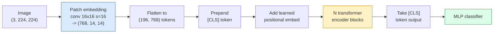

# Görme Transformerleri (ViT)

> Resmi parçalara ayır, her parça bir kelime gibi davran, standart bir transformatör çalıştır.

> **【中文解读】**Fotoğrafı küçük parçalara ayırıp bir parça yapıştırmak, her bir yama bir kelime olarak yaptırmak, sonra standart Transformer ile işlemek.

> **【拓展：ViT 与 GPT-4V】**ViT GPT-4V、Claude'un görme yeteneği、LLaVA等多模态大模型の视觉编码器──2021 yılından bugüne kadar, ViT, CLIP、SAM、DINO等 gibi çekirdek modeller için kullanılan bilgisayar görme altyapısı haline geldi.

**Type:** Build | **类型:** 动手
**Languages:** Python | **语言:** Python
**Prerequisites:** Phase 7 Lesson 02 (Self-Attention), Phase 4 Lesson 04 (Image Classification) | **前置知识:** Phase 7 Lesson 02（自注意力），Phase 4 Lesson 04（图像分类）
**Time:** ~45 minutes | **时间:** ~45 分钟

## Öğrenme hedefleri

- En az bir ViT oluşturmak için, patch embed, öğrenilmiş pozisyon embed, sınıf jetonu ve transformatör kodlayıcı bloklarını sıfırdan uygulamak
- DeiT ve MAE'nin aksi olduğunu kanıtlamadan önce ViT'nin büyük bir miktar ön eğitim verisine ihtiyacı olduğunu neden düşündüğünü açıklayın.
- ViT, Swin ve ConvNeXt'i mimari öncüleri ile karşılaştırın (hiçbir, yerel pencere dikkat, konfor omurgası)
- Önceden eğitilmiş bir ViT' yi küçük bir veri kümesine ayarlayın.`timm`ve standart çizgi-sürekli / ince ayarlama tarifi

> **【中文解读】**Öğrenme hedefi, ders bitirilmesinden sonra öğrenilmesi gereken temel becerileri listeler.


## Sorunlar. Sorunlar.

Bir on yıl boyunca, konvulsiyon bilgisayar görme ile eş anlamlıydı. CNN'lerin yerleşim, çeviri eşdeğerliği 'nin değiştirilebileceğini düşünmeyen güçlü indüktif önyargıları vardı. Sonra Dosovitskiy et al. (2020) düzleştirilmiş görüntü yamalarına uygulanan basit bir transformatörün, konvulsiyon makinesi olmadan, ölçekte en iyi CNN'lere eşleşebileceğini veya yenmeyebileceğini gösterdi.

> On yıl boyunca, yuvarlaklık bilgisayar görme için bir isimdir. CNN'de çok güçlü bir yuvarlaklık var. Yerellik, düz hareket ve değişim  Kimse bunu değiştirebileceğini düşünmedi.

ImageNet-1k'daki ViT, ResNet'e kaybetti. ViT, ImageNet-21k veya JFT-300M üzerinde önceden eğitilmiş ve ImageNet-1k'da daha iyi ayarlanmış. Sonuç, transformatörlerin yararlı önlerinde eksik olduğu ama yeterli veriyle öğrenebildiği oldu. Sonraki çalışmalar (DeiT, MAE, DINO) doğru eğitim tarifleri ile  güçlü büyütme, kendi kendine denetimli ön eğitim, destilasyon  ViTs küçük veriler üzerinde de iyi eğitim gösterdiğini gösterdi.

> 陷是"大规模上"──ViT on ImageNet-1k on Transferred to ResNet── on ImageNet-21k on JFT-300M on Pre-training then on ImageNet-1k on Up Micro-modulation on ViT won── sonuç şu ki, Transformer 缺乏有用的先验但可以从足够的数据中学到──后续工作(DeiT、MAE、DINO) doğru eğitim programı 强增强、自监督预训、蒸ViT on small data can also train very well──

2026 yılına kadar saf CNN'ler hala kenar cihazlarda rekabetçi (ConvNeXt en güçlüdür), ancak transformatörler diğer her şeye hakim: segmentasyon (Mask2Former, SegFormer), algılama (DETR, RT-DETR), multimodal (CLIP, SigLIP), video (VideoMAE, VJEPA).

> 2026 yılına kadar, saf CNN'in kenarında olan cihazlar üzerinde hala rekabet gücü var. Ancak Transformer diğer her şeyi yönetti: bölmek, kontrol etmek, kontrol etmek, kontrol etmek, kontrol etmek, kontrol etmek, kontrol etmek, kontrol etmek, kontrol etmek, kontrol etmek, kontrol etmek, kontrol etmek, kontrol etmek, kontrol etmek, kontrol etmek, kontrol etmek, kontrol etmek, kontrol etmek, kontrol etmek, kontrol etmek ve kontrol etmek.

## Konsepten bir şey.

> **【中文解读】**Bu bölümde temel kavramlar ve teoriler hakkında konuşuluyor. Bu kavramları öğrenmek, sonradan gerçekleştirilme önemi, aynı zamanda, görüşmeler ve mühendislik uygulamalarında yüksek sıklıkta yapılan incelemelerin bilgi noktasıdır.


### - Boru hattı



Yedi adım. Patches -> tokens -> attention -> classifier. Her variant (DeiT, Swin, ConvNeXt, MAE öncesi eğitim) yedi'den birini veya ikisini değiştirir ve geri kalanı yalnız bırakır.

> 七步──补丁 -> token -> 注意力 -> 分类器──每个变体(DeiT、Swin、ConvNeXt、MAE 预训) sadece yedi adımdan birini değiştirir, kalanı değişmez──

### Çizgileme yerleştirme

İlk konvert sırrıdır. Kernel boyutu 16, adım 16, böylece 224x224 görüntü 16x16 çubuklardan oluşan 14x14 bir ağ haline gelir, her biri 768 boyutlu bir gömleğe projekte edilir.

> Birinci tomurcuğun gizli olduğu yer. Nükleer büyüklük 16, boyut 16, böylece 224x224'in resmi 14x14'ün 16x16'sı bir düzeltme şeklinde, her düzeltme 768'lik bir yerleşim ile birlikte tamamlanmıştır.

```
Input:  (3, 224, 224)
Conv (3 -> 768, k=16, s=16, no padding):
Output: (768, 14, 14)
Flatten spatial: (196, 768)
```

196 yama = 196 token. Her token'un özellik boyutu 768 (ViT-B), 1024 (ViT-L) veya 1280 (ViT-H) dir.

> 196 个补丁 = 196 个代币──每个代币的特征维度为 768(ViT-B)、1024(ViT-L) 或 1280(ViT-H)。

### Sınıf simgesi

Bir tek öğrenilmiş vektör dizine önceden bağlı:

> Bir öğrenilme ıntılısı dizinin önüne eklenir:

```
tokens = [CLS; patch_1; patch_2; ...; patch_196]   shape (197, 768)
```

N transformatör bloklarından sonra `[CLS]`Çıkış, küresel görüntü temsilidir.

> Transformer bloklarından sonra,`[CLS]`Çıkışı tümsel görüntü ifade etmektedir.

### Konum yerleştirme

Transformatörlerin yerleşik bir konum anlayışı yoktur.

> Transformer 没有内置的空间位置概念── her bir simgeye bir öğrenilme 量 kat:

```
tokens = tokens + learned_pos_embedding   (also shape (197, 768))
```

Eklenti, modelin bir parametresidir; gradient tabanlı eğitim onu 2 boyutlu görüntü yapısına uyarlar. Sinusoidal 2 boyutlu alternatifler vardır ancak pratikte nadiren kullanılır.

> 嵌入式 (嵌入式) modelin parametreleridir; 梯度 (梯度) tabanlı eğitim, 2D 图像结构 (图像结构)  适应的训练使之; 嵌入式 (嵌入式) modeli için 2D 形象结构 (图像结构)  适应的训练使之; 嵌入式 (嵌入式) modeli için 2D 替代方案 vardır, ancak pratikte çok az kullanılır.

### Transformer kodlayıcı blok

Standart, çok başlı kendine dikkat, MLP, kalıntı bağlantıları, pre-LayerNorm.

> 标准结构──多头自注意力、MLP、残差连接、前置 LayerNorm──

```
x = x + MSA(LN(x))
x = x + MLP(LN(x))

MLP is two-layer with GELU: Linear(d -> 4d) -> GELU -> Linear(4d -> d)
```

ViT-B/16 bu bloklardan 12'ini, her biri 12 dikkat başlığı ile toplamda 86M parametresi ile yığar.

> ViT-B/16 12 tane bu tip blok topladı, her birinde 12 dikkat başı vardı, toplam 86 milyon parametre vardı.

### Neden LN öncesi

LN sonrası kullanılan ilk transformatörler (`x = LN(x + sublayer(x))`Bu nedenle, bu eğitimden sonra, bir süre sonra, bir süre sonra, bir süre sonra, bir süre sonra, bir süre sonra, bir süre sonra, bir süre sonra, bir süre sonra, bir süre sonra, bir süre sonra, bir süre sonra, bir süre sonra, bir süre sonra, bir süre sonra, bir süre sonra, bir süre sonra, bir süre sonra, bir süre sonra, bir süre sonra, bir süre sonra, bir süre sonra, bir süre sonra, bir süre sonra, bir süre sonra, bir süre sonra, bir süre sonra, bir süre sonra, bir süre sonra, bir süre sonra, bir süre sonra, bir süre sonra, bir süre sonra, bir süre sonra, bir süre sonra, bir süre sonra, bir süre sonra, bir süre sonra, bir süre sonra, bir süre sonra, bir süre sonra, bir süre sonra, bir süre sonra, bir süre sonra, bir süre sonra, bir süre sonra, bir süre sonra, bir süre sonra, bir süre sonra, bir süre sonra, bir süre sonra, bir süre sonra, bir süre sonra, bir süre sonra, bir süre sonra, bir süre sonra, bir süre sonra, bir süre sonra, bir süre sonra, bir süre sonra, bir süre sonra, bir süre sonra, bir süre sonra, bir süre sonra, bir süre, bir süre sonra, bir süre, bir süre sonra, bir süre, bir süre sonra, bir süre sonra, bir süre sonra, bir süre, bir süre sonra, bir süre, bir süre sonra, bir süre sonra, bir süre, bir süre sonra, bir süre, bir süre sonra, bir süre, bir süre, bir süre, bir süre, bir süre sonra, bir süre, bir sürecececececececececececececececececececececececececececececececececececececececececececececececececececececececececececececececececececececececececececececececececececececececececececececececececececececececececececececececececececececececececececececececececececececececececececececececececececececececececececececececececececececececece`x = x + sublayer(LN(x))`Bu nedenle, bu programlar, daha derin ağları, daha da derinleştirilmiş ve daha da sıcak hale getirilmemiş olarak trenler.

> 早期 Transformer 使用后置 LN(`x = LN(x + sublayer(x))`), çok zor bir durumdur.`x = x + sublayer(LN(x))`) önceden hazırlanmıştır. Daha derin bir ağı oluşturmak için daha derin bir eğitim gerekmez.

### Patch boyutunda değişim

- 16x16 yama -> 196 token, standart.
  ÇINÇAN TRÜBLİK: 16x16 补丁 -> 196 个代币,标准配置。
- 32x32 patches -> 49 token, daha hızlı ama daha düşük çözünürlük.
  Çin Çeviri: 32x32 补丁 -> 49 个代币, daha hızlı ama çözünürlük daha düşük.
- 8x8 patches -> 784 token, daha ince ama O(n^2) dikkat masrafı ölçekleri kötü.
  Çin Çeviri: 8x8 补丁 -> 784 个代币, daha精细但 O(n^2) dikkat güç maliyeti ciddi bir şekilde büyüdü。

Daha büyük yamalar = daha az token = daha hızlı ama daha az alan ayrıntıları. SwinV2 hiyerarşik pencerelerde 4x4 yamalar kullanır.

> Daha büyük eklem = daha az token = daha hızlı ama uzay ayrıntıları daha az。SwinV2 dilimleme penceresinde 4x4 eklem kullanılır。

### DeiT'nin ImageNet-1k'da ViT'yi eğitmek için reçeti

Orijinal ViT'ye CNN'leri yenmek için JFT-300M'ye ihtiyaç vardı. DeiT (Touvron et al., 2020) ViT-B'yi sadece ImageNet-1k'da dört değişiklikle 81.8% üst 1'e yetiştirdi:

> İlk ViT  JFT-300M 才能打败 CNN──DeiT(Touvron 等,2020) sadece dört değişiklikle ImageNet-1k'de bulunarak 上将 ViT-B 训练到81.8% top-1:

1. Ağır artış: RandAugment, Mixup, CutMix, Random Erasing.
   中文翻译:强数据增强:RandAugment、Mixup、CutMix、Random Erasing。
2. Stochastic derinliği (öğrenme sırasında tüm blokları rastgele düşürün).
   Çinçe Çevirim:随机深度(训练时随机丢弃整个块)
3. Tekrarlanan artış (her partide 3 kez aynı görüntü örneği alınmıştır).
   Çinçe Çevirim:重复增强 (重复增强)
4. CNN öğretmeninden bir destillasyon (vepse, doğruluğu daha da artırır).
   Çinçe Çevirimi: CNN'den öğretmen modeli蒸(可选,进一步提升精度)

Her modern ViT eğitim tarifi DeiT'den geliyor.

> Her modern ViT eğitim programı DeiT'den kaynaklanıyor.

### Swin vs ConvNeXt

- **Swin**(Liu et al., 2021)  Pencere tabanlı dikkat. Her blok yerel bir pencere içinde çalışır; alternatif bloklar pencereleri arasında bilgi karıştırmak için pencereyi değiştirir. Dikkat operatörünü tutarak CNN benzeri bir yerelliği geri getirir.
  Çeviri:**Swin**(Liu 等,2021)  Pencereye dayalı dikkat. Her blok yerel pencere içinde dikkat eder; blok hareketli pencereyi pencereler arası karışık bilgi ile değiştirir. CNN'in yerel öncüliğini yeniden kazanırken dikkat hesaplarını korur.
- **ConvNeXt**(Liu et al., 2022)  Swin'in mimari seçimlerine uyan CNN'yi yeniden tasarladı ( derinlikteki konvs, LayerNorm, GELU, ters şişe boynuz).
  Çeviri:**ConvNeXt**(Liu 等,2022)  Yeniden tasarlanmış CNN, Swin'in yapısal seçimlerine uygun olarak  LayerNorm、GELU、倒置瓶)  gösterir.

2026 yılında, ConvNeXt-V2 ve Swin-V2 her ikisi de üretim derecesindedir; doğru seçim sonuç yığınınıza (ConvNeXt kenar için daha iyi bir şekilde oluşturur) ve önceden eğitim korpusuna bağlıdır.

> 2026 yıl,ConvNeXt-V2 和 Swin-V2 hepsi üretim sınıfı programı; doğru seçim önerilmesine bağlıdır

### MAE öncesi eğitim

Maskeli Otomatik Kodlayıcı (He et al., 2022): Kasıtlı olarak %75 yama maskesi, kodlayıcıyı yalnızca görünen %25'i işlemeyi eğit, kodlayıcı çıkışından maskeli yamaları yeniden yapılandırmak için küçük bir dekodörü eğit. Önceden eğitildikten sonra dekodörü atın ve kodlayıcıyı ince ayarlayın.

> 掩码自编码器(He等,2022):随机掩藏 75%补丁,训练编码器只处理可见的25%,训练一个小解码器从编码器输出重建被掩藏的补丁──预训后丢弃解码器,微调编码器──

MAE, ViT'yi yalnızca ImageNet-1k'da eğitimlenebilir hale getirir, SOTA'yı vurur ve mevcut varsayılan kendiliğinden denetim yapılmış bir tariftir.

> MAE kullanmak ViT  sadece ImageNet-1k 上可训练, SOTA ulaşmak,  is currently默认的自监督训练方案

> **【中文解读】**Bu bölüm kodla sıfırdan gerçekleştirilen çekirdek algoritmasıdır. Bu "sıfırdan" yöntem çerçevenin arkasındaki prensipleri anlama yardımcı olur.

> **【拓展：工业部署中的视觉系统】**Gerçek endüstriye dağıtımında, görsel modeller gecikme, model büyüklüğü, kenar cihazların uyumlu olması gibi sorunları düşünmelidir. TensorRT, ONNX Runtime, OpenVINO, yaygın olarak kullanılan bir görsel model hızlandırma aracıdır.

> **【拓展：数据标注与质量】**视觉任务的效果高度依赖标签数据质――Label Studio、CVAT is the mainstream tagging tool――在工业场景中,主动学习(Active Learning) 标签成本ı azaltabilir:模型对不确定的样本请求人工标签,确定性的样本自动标签──


## Yapın.
```figure
batchnorm-inference
```

## Yapın

### Adım 1: Patch yerleştirme

```python
import torch
import torch.nn as nn

class PatchEmbedding(nn.Module):
    def __init__(self, in_channels=3, patch_size=16, dim=192, image_size=64):
        super().__init__()
        assert image_size % patch_size == 0
        self.proj = nn.Conv2d(in_channels, dim, kernel_size=patch_size, stride=patch_size)
        num_patches = (image_size // patch_size) ** 2
        self.num_patches = num_patches

    def forward(self, x):
        x = self.proj(x)
        return x.flatten(2).transpose(1, 2)
```

Bir konvert, bir düzeltme, bir transpose.

> Bir yuvarlak, bir uzantı, bir dönüşüm.

### Adım 2: Transformer blok

Pre-LN, çok başlı kendine dikkat, GELU ile MLP, kalıntı bağlantıları.

> Önceki yazı: LN、多头自注意力、带 GELU'nun MLP、残差连接──

```python
class Block(nn.Module):
    def __init__(self, dim, num_heads, mlp_ratio=4, dropout=0.0):
        super().__init__()
        self.ln1 = nn.LayerNorm(dim)
        self.attn = nn.MultiheadAttention(dim, num_heads, dropout=dropout, batch_first=True)
        self.ln2 = nn.LayerNorm(dim)
        self.mlp = nn.Sequential(
            nn.Linear(dim, dim * mlp_ratio),
            nn.GELU(),
            nn.Dropout(dropout),
            nn.Linear(dim * mlp_ratio, dim),
            nn.Dropout(dropout),
        )

    def forward(self, x):
        a, _ = self.attn(self.ln1(x), self.ln1(x), self.ln1(x), need_weights=False)
        x = x + a
        x = x + self.mlp(self.ln2(x))
        return x
```

`nn.MultiheadAttention`Başlara bölünmeyi, ölçeklendirilmiş nokta ürünü ve çıkış projeksiyonunu ele alır. `batch_first=True`Yani şekiller `(N, seq, dim)`- Evet .

> `nn.MultiheadAttention`处理多头拆分、缩放点积和输出投影──`batch_first=True`Bu şekil`(N, seq, dim)`- Evet.

### Adım 3: ViT

```python
class ViT(nn.Module):
    def __init__(self, image_size=64, patch_size=16, in_channels=3,
                 num_classes=10, dim=192, depth=6, num_heads=3, mlp_ratio=4):
        super().__init__()
        self.patch = PatchEmbedding(in_channels, patch_size, dim, image_size)
        num_patches = self.patch.num_patches
        self.cls_token = nn.Parameter(torch.zeros(1, 1, dim))
        self.pos_embed = nn.Parameter(torch.zeros(1, num_patches + 1, dim))
        self.blocks = nn.ModuleList([
            Block(dim, num_heads, mlp_ratio) for _ in range(depth)
        ])
        self.ln = nn.LayerNorm(dim)
        self.head = nn.Linear(dim, num_classes)
        nn.init.trunc_normal_(self.pos_embed, std=0.02)
        nn.init.trunc_normal_(self.cls_token, std=0.02)

    def forward(self, x):
        x = self.patch(x)
        cls = self.cls_token.expand(x.size(0), -1, -1)
        x = torch.cat([cls, x], dim=1)
        x = x + self.pos_embed
        for blk in self.blocks:
            x = blk(x)
        x = self.ln(x[:, 0])
        return self.head(x)

vit = ViT(image_size=64, patch_size=16, num_classes=10, dim=192, depth=6, num_heads=3)
x = torch.randn(2, 3, 64, 64)
print(f"output: {vit(x).shape}")
print(f"params: {sum(p.numel() for p in vit.parameters()):,}")
```

Yaklaşık 2.8M parametreleri  küçük bir ViT CPU üzerinde işlenebilir. Gerçek ViT-B 86M; aynı sınıf tanımı `dim=768, depth=12, num_heads=12`- Evet .

> Yaklaşık 2.80 milyon parametre CPU'da eğitimlenebilen küçük bir ViT. Gerçek ViT-B'de 8.6 milyon parametre vardır. Aynı sınıf tanımlaması, sadece gerekli.`dim=768, depth=12, num_heads=12`- Evet.

### Adım 4: Akıl sağlığı kontrolü  tek görüntü sonucu

```python
logits = vit(torch.randn(1, 3, 64, 64))
print(f"logits: {logits}")
print(f"probs:  {logits.softmax(-1)}")
```

> **【中文解读】**Bu bölümde, PyTorch, HuggingFace gibi olgun çerçeveler nasıl kullanılacağını gösterir.


Bu hata olmadan çalışmalı.

> 应无错运行──概率之和为1──


> **【拓展：视觉模型的持续学习】**Üretim ortamında, görsel modeller yeni verilere sürekli uyum sağlamak gerekir. Yeni ürünler, yeni sahne, yeni ışık koşulları. Sürekli öğrenme. Sürekli öğrenme.

## Çerçeveyi kullanın.

`timm`Tüm ViT çeşitlerini ImageNet'in önceden eğitilmiş ağırlıklarıyla gönderir.

```python
import timm

model = timm.create_model("vit_base_patch16_224", pretrained=True, num_classes=10)
```

`timm`2026 yılında görme transformörleri için üretim standartıdır. Aynı API altında ViT, DeiT, Swin, Swin-V2, ConvNeXt, ConvNeXt-V2, MaxViT, MViT, EfficientFormer ve düzinelerce diğerini destekler.

Çok modal çalışma için (resim + metin), `transformers`Bu gemiler CLIP, SigLIP, BLIP-2, LLaVA.

> **【中文解读】**Bu bölümde modellerin kullanılabilir ürünler için nasıl dağıtılacağı üzerinde yoğunlaşmaktadır.


## İndirin . Ürünler .

Bu ders şunları ortaya çıkarır:

- `outputs/prompt-vit-vs-cnn-picker.md` bir ViT, bir ConvNeXt veya bir Swin arasında bir bilgi kümesi boyutuna, hesaplama ve sonuç yığınına göre seçim yapan bir istek.
- `outputs/skill-vit-patch-and-pos-embed-inspector.md` bir ViT'nin yama gömülmesini ve pozisyonal gömülme şekillerinin modelin beklenen dizilerin uzunluğuna uygun olduğunu doğrulayan bir beceri, en yaygın portlama hatalarını yakalar.

> **【中文解读】**练习题按照易/中级/难三度递进;;建议至少完成中级题,Hard级适合深入研究或面试准备;;


## Egzersizler.

1. **(Easy)**Yukarıdaki küçük ViT'den ileriye geçmek için her orta tenzorun şekillerini basın.`(N, 3, 64, 64)`-> yamalar `(N, 16, 192)`-> CLS ile `(N, 17, 192)`-> sınıflandırıcı girişleri `(N, 192)`-> çıkış `(N, num_classes)`- Evet .
2. **(Medium)**- Önceden eğitilmiş bir kişiyi ince ayarlayın .`timm`4. dersdeki sentetik-CIFAR veri kümesi üzerinde ViT-S/16'i aynı veriler üzerinde ResNet-18 ince ayarlamalarına karşı karşılaştırın.
3. **(Hard)**Küçük ViT için MAE öncesi eğitimi uygulayın: %75 yama maskesi, maskelenmiş yamaları yeniden oluşturmak için kodlayıcıyı + küçük bir dekodörü eğit.

> **【中文解读】**术语表中的"İnsanların ne dediği" vs "Gerçekten ne anlama geldiği" 区分日常口语和精确技术含义──在团队协作中,统一术语定义可以避免大量沟通误解──


## Anahtar Şartlar .

| Term | What people say | What it actually means |
|------|----------------|----------------------|
| Patch embedding | "The first conv" | A conv with kernel size = stride = patch size; turns the image into a grid of token embeddings |
| Class token | "[CLS]" | A learned vector prepended to the token sequence; its final output is the global image representation |
| Positional embedding | "Learned pos" | A learned vector added to every token so the transformer knows where each patch came from |
| Pre-LN | "LayerNorm before sublayer" | The stable transformer variant: `x + sublayer(LN(x))` instead of `LN(x + sublayer(x))` |
| Multi-head attention | "Parallel attention" | Standard transformer attention split into num_heads independent subspaces, concatenated afterwards |
| ViT-B/16 | "Base, patch 16" | The canonical size: dim=768, depth=12, heads=12, patch_size=16, image=224; ~86M params |
| DeiT | "Data-efficient ViT" | ViT trained on ImageNet-1k alone with strong augmentation; proved large pretraining datasets are not strictly required |
| MAE | "Masked autoencoder" | Self-supervised pretraining: mask 75% of patches, reconstruct; the dominant ViT pretraining recipe |

> **【中文解读】**延伸阅读, derinlemesine öğrenme için yüksek kaliteli kaynaklar sağladı. Bu makaleler ve dersler, derinlemesine anlama ihtiyacı olan okuyuculara uygun olarak bu alanın klasik referanslarıdır.


## Daha fazla okumak

- [An Image is Worth 16x16 Words (Dosovitskiy et al., 2020)](https://arxiv.org/abs/2010.11929) ViT kağıdı
- [DeiT: Data-efficient Image Transformers (Touvron et al., 2020)](https://arxiv.org/abs/2012.12877) Tek başına ImageNet-1k'de ViT'yi nasıl eğitebilirsiniz
- [Masked Autoencoders are Scalable Vision Learners (He et al., 2022)](https://arxiv.org/abs/2111.06377) MAE öncesi eğitim
- [timm documentation](https://huggingface.co/docs/timm) üretiminde kullanacağınız her görme transformatörüne ilişkin referans
