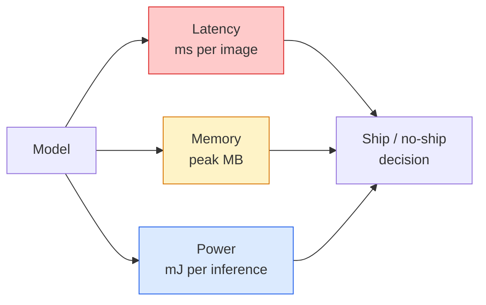

# Gerçek Zaman Görüşü  Kısım Taşıma  Gerçek Zaman Görüşü   Kenar Taşıma

> Kenar çıkarım, 90 doğruluklu bir modelin 2 GB RAM'li bir cihazda 30 fps hızında çalışmasını sağlamak için disiplindir.

> **【中文解读】**边缘推理 bir dengecilik sanatıdır: %90 doğruluk oranının sadece 2GB'lik bir depolama cihazında 30fps'te çalışmasına izin verin.

> **【拓展：边缘 AI 的应用】**边缘部署在智能手机 (智能手机) 的人脸解锁,拍照美化) 无人机 (实时目标检测) 工业物联网 (IoT) 缺陷检测) 及自动驾驶 (车载推理) 边缘部署在智能手机 (人脸解锁,拍照美化) 无人机 (无人机) 实时目标检测) 工业物联网 (IoT) 缺陷检测) 及自动驾驶 (车载推理) 边缘部署在智能手机 (人脸解锁,拍照美化) 无人机 (无人机) 无人机 (人机) 实时目标检测) 工业物联网 (IoT) 缺陷检测) 及自动驾驶推理 (车载推理) 中至关重要──MobileNet、YOLO-nano、EfficientNet 常见的轻量级模型──

**Type:** Learn + Build | **类型:** 学习 + 动手
**Languages:** Python | **语言:** Python
**Prerequisites:** Phase 4 Lesson 04 (Image Classification), Phase 10 Lesson 11 (Quantization) | **前置知识:** Phase 4 Lesson 04（图像分类），Phase 10 Lesson 11（量化）
**Time:** ~75 minutes | **时间:** ~75 分钟

## Öğrenme hedefleri

- Herhangi bir PyTorch modeli için sonuç geçiciliği, en yüksek hafıza ve geçiş ölçümleri ve FLOPs / params / latency trade-off'u okuyun
- PyTorch'ın eğitim sonrası kuantitasyonunu kullanarak bir görme modelini INT8'e kadar kuantite edin ve doğruluk kaybını < 1%'e doğru tutun
- ONNX'e ihraç ve ONNX Runtime veya TensorRT ile oluşturmak; en yaygın üç ihraç hata ve onların düzeltmeleri
- Kenar kısıtlama için MobileNetV3, EfficientNet-Lite, ConvNeXt-Tiny veya MobileViT'yi ne zaman seçmeyi açıklayın

> **【中文解读】**Öğrenme hedefi, ders bitirilmesinden sonra öğrenilmesi gereken temel becerileri listeler.


## Sorunlar. Sorunlar.

Eğitim zamanında görme modeli yüzen nokta canavarıdır. 100M parametreleri, ileri geçiş başına 10 GFLOP, 2 GB VRAM. Bunların hiçbiri bir telefona, bir aracın infotainment birimine, endüstriyel bir kameraya veya bir drone'a uymamaktadır. Görme sistemini göndermek aynı tahminleri 100 kat daha küçük bir bütçeye uymak anlamına gelir.

> 訓練時の視モデル bir 浮点数怪物──1 milyar parametredir── her seferinde 10 GFLOP、2 GB 显存── bunlar da elde edemez, araç içi bilgi eğlence sistemi、 sanayi kamera veya insansız makineler── teslim edilmek için aynı tahminleri 100 kat daha az bütçeye yüklemek anlamına gelir──

İşin büyük kısmını üç düğme yapar: model seçimi (aynı tarifle daha küçük bir mimarlık), kuantitasyon (FP32 yerine INT8) ve sonuç çalıştırma süresi (ONNX Runtime, TensorRT, Core ML, TFLite).

> Üç旋 büyük bir kısmını işledi: model seçimi (short model) 量化 (size)                                                                                                                                                                                                                                                                                                                                                                                                                                                                                                      

Bu ders önce ölçüm disiplini ayarlar ( ölçemediğiniz şeyi optimize edemezsiniz), sonra üç düğmeyi yürütür. Amaç her kenar çalıştırma zamanını öğrenmek değil, hangi kaldıraçların olduğunu bilmek ve her birinin düşündüğünüz şeyi nasıl yaptığını nasıl doğrulayacağınızı bilmek.

> Bu ders önce ölçüm kurallarını oluşturur, sonra üç döngüden geçer. Amaç her kenarın üzerinde çalışırken öğrenmek değil, hangi değerin olduğunu ve her değerin yaptığını nasıl doğruladığını öğrenmek.

## Konsepten bir şey.

> **【中文解读】**Bu bölümde temel kavramlar ve teoriler hakkında konuşuluyor. Bu kavramları öğrenmek, sonradan gerçekleştirilme önemi, aynı zamanda, görüşmeler ve mühendislik uygulamalarında yüksek sıklıkta yapılan incelemelerin bilgi noktasıdır.


### Üç bütçe



- **Latency**Ortalama sadece p50'de gerçek zamanlı sistemler için önemli olan kuyruğu davranışları gizlenir.
  Çeviri:**延迟**Bu nedenle, bu değerler, gerçek zaman sisteminin önemli son bölümlerini oluşturur.
- **Peak memory**Bu, cihazın gördüğü maksimum, sabit durum ortalaması değil.
  Çeviri:**峰值内存**: cihazlar gördüğü en büyük değer, sabit ortalama değeri değil. OOM'un yerleştirilmiş hedefler üzerinde ölümcül olduğu için önemlidir.
- **Power / energy**Batarya ile çalışan bir cihazda: her sonuca göre millijoules.
  Çeviri:**功耗/能量**Batarya güç tedarik cihazları üzerinde her kez yapılan tahminlerin sayısı.

Bir kenar kararının alınması için bir tablo (model, gecikme, bellek, doğruluk) kullanılır. Her hücre hedef cihazda ölçülür, iş istasyonunda değil.

> Bir 张 (模型, 延迟, 内存, 精度) şablonu, sınırda yerleşim kararlarına dayanmaktadır.

### Ölçüm disiplinleri

Her kenar profili takip etmesi gereken üç kural:

> Her kenar performans analizi üç kural izlenmelidir:

1. **Warm up**Bu nedenle, bu testlerin en önemli sonuçları, ölçümden önce 5-10 numara ileriye geçiş yaparak elde edilebilir.
   Çeviri:**预热** ölçüm öncesi 5-10 kez virtual öncesi yayılma öncesi sıcaklık modeli。 soğuk depolama ve JIT 编译会产生不具代表性的初始数据。
2. **Synchronise**GPU iş yükleri `torch.cuda.synchronize()`Bu olmadan çekirdek gönderisini ölçersiniz, çekirdek yürütmesini değil.
   Çeviri:**同步**                                                                                                                                                                                                                                                              `torch.cuda.synchronize()`Aynı zamanda GPU 工作负载──否则你测量是内核调度,不是内核执行──
3. **Fix input sizes**224x224'de gecikme 512x512'de gecikme değil.
   Çeviri:**固定输入尺寸** üretim çözünürlüğünü kullanmak──224x224  上的延迟不等于 512x512 上的延迟──

### FLOPs bir vekil olarak

FLOPs (doğru sonuçlar için kayarak nokta işlemleri) gecikme için ucuz, cihaz bağımsız bir vekildir. Mimarlık karşılaştırması için yararlı, mutlak duvar saati gibi yanıltıcıdır. %10 daha fazla FLOP'li bir model, donanım dostu ops kullanıldığı için pratikte 2 kat daha hızlı olabilir ( derinlik konvoyları iyi bir şekilde oluşturur, büyük 7x7 konvoyları değil).

> FLOPs (FLOPs) (FLOPs) (FLOPs) (FLOPs) (FLOPs) (FLOPs) (FLOPs) (FLOPs) (FLOPs) (FLOPs) (FLOPS) (FLOPS) (FLOPS) (FLOPS) (FLOPS) (FLOPS) (FLOPS) (FLOPS) (FLOPS) (FLOPS) (FLOPS) (FLOPS) (FLOPS) (FLOPS) (FLOPS) (FLOPS) (FLOPS) (FLOPS) (FLOPS) (FLOPS) (FLOPS) (FLOPS) (FLOPS) (FLOPS) (FLOPS) (FLOPS) (FLOPS) (FLOPS) (FLOPS) (FLOPS) (FLOPS) (FLOPS) (FLOPS) (FLOPS) (FLOPS) (FLOPS) (FLOPS) (FLOPS) (FLOPS) (FLOPS) (FLOPS) (FLOPS) (FLOPS) (FLOPS) (FLOPS) (FLOPS) (FLOPS) (FLOPS) (FLOPS) (FLOPS) (FLOPS) (FLOPS) (FLOPS) (FLOPS) (F) (FLOPS) (FLOPS) (F) (FLOPS) (F) (FLOPS) (FLOPS) (F) (F) (F) (F) (F) (FLOPS) (F) (F) (F) (F) (F) (F) (F) (F) (F) (F) (F) (F) (F) (F) (F) (F) (F) (F) (F) (F) (F) (F) (F) (F) (F) (F) (F) (F) (F) (F) (F) (F) (F) (F) (F) (F) (F) (F) (F) (F) (F) (F) (F) (F) (

Kural: mimarlık aramaları için FLOP'ler kullanın, yerleştirme kararları için cihazda gecikme kullanın.

> FLOP'ler kullanarak yapı aramaları yapın, cihazlarda geç saatler kullanarak kararlar verin.

### Bir paragrafdaki miktar

Model boyutu 4x düşer, bellek bant genişliği 4x düşer, hesaplama INT8 çekirdekleri olan donanımlarda 2-4x düşer (her modern mobil SoC, Tensor Cores ile her NVIDIA GPU). Görme görevlerinde doğruluk kaybı tipik olarak eğitim sonrası statik kvantizasyonla 0.1-1 yüzde puan.

> FP32  ağırlık ve aktif değiştirmek için INT8 ⋅ model büyüklüğü 4 kat azalmıştır,内存带宽ı 4 kat azalmıştır, INT8 内核硬件 üzerinde hesaplama miktarı 2-4 kat azalmıştır.

Tipler:

> 类型:

- **Dynamic** INT8'e kadar kuantit ağırlıkları, FP'de hesaplanan aktivasyonlar.
  Çeviri:**动态** Aktif değer INT8 olarak 权重化以 FP 计算──简单,加速有限──
- **Static (post-training)** kuantit ağırlıkları + kalibrasyon aktivasyonu aralıkları küçük bir kalibrasyon seti üzerinde.
  Çeviri:**静态（训练后）**量化权重 + 在小校准集上校准激活范围──比动态快得多──
- **Quantisation-aware training (QAT)** eğitim sırasında kuantitasyonu simüle etmek, böylece model etrafında öğrenir.
  Çeviri:**量化感知训练（QAT）** eğitim zamanı, 模拟量化, 让模型学会适应──精度最好,需要标签数据──

Görme için, eğitim sonrası statik kvantizasyon, çabaların %5'inde %95'iyle fayda sağlar.

> Görsel görevler için, eğitim sonrası duruşsal ölçümlerin %5'lik çabalarının %95'i elde edilmesi için elde edilen faydalar. PTQ'nın hassaslık kaybı kabul edilemez olduğunda QAT kullanılır.

### Kesim ve destilasyon

- **Pruning** önemli olmayan ağırlıkları (büyüklük tabanlı) veya kanalları (strüküratürlü) kaldırmak.
  Çeviri:**剪枝**                                                                                                                                                                                                                                                              
- **Distillation** küçük bir öğrenciyi büyük bir öğretmenin logitlerini taklit etmek için eğitmek. Genellikle modelin küçültülmesiyle kaybedilen doğrulukun çoğunu geri kazanır.
  Çeviri:**蒸馏**训练小模型 (学生) 模仿大模型 ( Öğretmen) 的逻辑──通常能恢复缩小模型损失的大部分精度──生产级边缘模型的标准做法──

### Sonuçlama çalışma zamanları

- **PyTorch eager** yavaş, kullanımı için değil.
  Çeviri:**PyTorch eager**慢,部署 için kullanılmıyor.
- **TorchScript** mirası.`torch.compile`ve ONNX ihracatı.
  Çeviri:**TorchScript**遗留方案──已被 `torch.compile`Ve ONNX 导出取代。
- **ONNX Runtime**CPU, CUDA, CoreML, TensorRT, OpenVINO hepsi ONNX sağlayıcıları var.
  Çeviri:**ONNX Runtime**中性运行时──CPU、CUDA、CoreML、TensorRT、OpenVINO hepsi ONNX 提供者── buradan başlayın──
- **TensorRT**NVIDIA'nın en iyi gecikme süresi (workstation ve Jetson). ONNX Runtime veya standalone ile entegre.
  Çeviri:**TensorRT**NVIDIA'nın编译器──在NVIDIA GPU(工作站和 Jetson) 上延迟最低──
- **Core ML** Apple'ın iOS/macOS için çalıştırma zamanı.`.mlmodel`veya `.mlpackage`- Evet .
  Çeviri:**Core ML**Apple'ın iOS/macOS 运行时──需要 `.mlmodel`Ya da`.mlpackage`- Evet.
- **TFLite** Google'ın Android/ARM için çalıştırma zamanı. Gereksinimler `.tflite`- Evet .
  Çeviri:**TFLite**Google'ın Android/ARM 运行时──需要 `.tflite`- Evet.
- **OpenVINO** Intel'in CPU/VPU çalıştırma süresi.`.xml`+ `.bin`- Evet .
  Çeviri:**OpenVINO**Intel'in CPU/VPU 运行时──需要 `.xml`+ `.bin`- Evet.

Uygulama: PyTorch -> ONNX -> export. ONNX, hedef için çalıştırma zamanı seçin.

> 实践中:导出 PyTorch -> ONNX -> 选择目标运行时。ONNX 是通用语言。

### Kenar mimarlık seçicisi

| Budget | Model | Why |
|--------|-------|-----|
| < 3M params | MobileNetV3-Small | Compiles everywhere, good baseline |
| 3-10M | EfficientNet-Lite-B0 | Best accuracy per param on TFLite |
| 10-20M | ConvNeXt-Tiny | Best accuracy-per-param, CPU-friendly |
| 20-30M | MobileViT-S or EfficientViT | Transformer with ImageNet accuracy |
| 30-80M | Swin-V2-Tiny | If stack supports window attention |

Tüm bunları INT8'e kadar miktarlandırın, eğer yapmamaya kesin bir nedeniniz yoksa.

> **【中文解读】**Bu bölüm kodla sıfırdan gerçekleştirilen çekirdek algoritmasıdır. Bu "sıfırdan" yöntem çerçevenin arkasındaki prensipleri anlama yardımcı olur.

> **【拓展：工业部署中的视觉系统】**Gerçek endüstriye dağıtımında, görsel modeller gecikme, model büyüklüğü, kenar cihazların uyumlu olması gibi sorunları düşünmelidir. TensorRT, ONNX Runtime, OpenVINO, yaygın olarak kullanılan bir görsel model hızlandırma aracıdır.

> **【拓展：数据标注与质量】**视觉任务的效果高度依赖标签数据质――Label Studio、CVAT is the mainstream tagging tool――在工业场景中,主动学习(Active Learning) 标签成本ı azaltabilir:模型对不确定的样本请求人工标签,确定性的样本自动标签──


## Yapın.
```figure
cnn-param-count
```

## Yapın

### Adım 1: Gecikme sürelerini doğru bir şekilde ölçün

```python
import time
import torch

def measure_latency(model, input_shape, device="cpu", warmup=10, iters=50):
    model = model.to(device).eval()
    x = torch.randn(input_shape, device=device)
    with torch.no_grad():
        for _ in range(warmup):
            model(x)
        if device == "cuda":
            torch.cuda.synchronize()
        times = []
        for _ in range(iters):
            if device == "cuda":
                torch.cuda.synchronize()
            t0 = time.perf_counter()
            model(x)
            if device == "cuda":
                torch.cuda.synchronize()
            times.append((time.perf_counter() - t0) * 1000)
    times.sort()
    return {
        "p50_ms": times[len(times) // 2],
        "p95_ms": times[int(len(times) * 0.95)],
        "p99_ms": times[int(len(times) * 0.99)],
        "mean_ms": sum(times) / len(times),
    }
```

                                                                                                                                                                                                                                                                                                                                                                                                                                                                                                                             `time.perf_counter()`- Rapor yüzdeleri, sadece kötü değil.

> 预热、同步、使用 `time.perf_counter()`% % % % % % % % % % % % % % % % % % % % % % % % % % % % % % % % % % % % % % % % % % % % % % % % % % % % % % % % % % % % % % % % % % % % % % % % % % % % % % % % % % % % % % % % % % % % % % % % % % % % % % % % % % % % % % % % % % % % % % % % % % % % % % % % % % % % % % % % % % % % % % % % % % % % % % % % % % % % % % % % % % % % % % % % % % % % % % % % % % % % % % % % % % % % % % % % % % % % % % % % % % % % % % % % % % % % % % % % % % % % % % % % % % % % % % % % % % % % % % % % % % % % % % % % % % % % % % % % % % % % % % % % % % % % % % % % % % % % % % % % % % % % % % % % % % % % % % % % % % % % % % % % % % % % % % % % % % % % % % % % % % % % % % % % % % % % % % % % % % % % % % % % % % % % % % % % % % % % % % % % % % % % % % % % % % % % % % % % % % % % % % % % % % % % % % % % % % % % % % % % % % % % % % % % % % % % % % % % % % % % % % % % % % % % % % % % % % % % % % % % % % % % % % % % % % % % % % % % % % % % % % % % % % % % % % % % % % % % % % % % % % % % % % % % % % % % % % % % % % % % % % % % % % % %

### Adım 2: Parametr ve FLOP sayıları

```python
def parameter_count(model):
    return sum(p.numel() for p in model.parameters())

def flops_estimate(model, input_shape):
    """
    Rough FLOP count for a conv/linear-only model. For production use `fvcore` or `ptflops`.
    """
    total = 0
    def conv_hook(m, inp, out):
        nonlocal total
        c_out, c_in, kh, kw = m.weight.shape
        h, w = out.shape[-2:]
        total += 2 * c_in * c_out * kh * kw * h * w
    def linear_hook(m, inp, out):
        nonlocal total
        total += 2 * m.in_features * m.out_features
    hooks = []
    for m in model.modules():
        if isinstance(m, torch.nn.Conv2d):
            hooks.append(m.register_forward_hook(conv_hook))
        elif isinstance(m, torch.nn.Linear):
            hooks.append(m.register_forward_hook(linear_hook))
    model.eval()
    with torch.no_grad():
        model(torch.randn(input_shape))
    for h in hooks:
        h.remove()
    return total
```

Gerçek projeler için kullanmak `fvcore.nn.FlopCountAnalysis`veya `ptflops`; her modül türünü doğru şekilde ele alırlar.

> Gerçek proje kullanımı`fvcore.nn.FlopCountAnalysis`Ya da`ptflops`Bu modüller her türlü modül türünü doğru şekilde işleyebilir.

### Adım 3: Eğitim sonrası statik miktarlandırma

```python
def quantise_ptq(model, calibration_loader, backend="x86"):
    import torch.ao.quantization as tq
    model = model.eval().cpu()
    model.qconfig = tq.get_default_qconfig(backend)
    tq.prepare(model, inplace=True)
    with torch.no_grad():
        for x, _ in calibration_loader:
            model(x)
    tq.convert(model, inplace=True)
    return model
```

Üç adım: yapılandırma, hazırlama (güzülmüş gözlemciler ekle), gerçek verilerle kalibrasyon, dönüştürme (füz + kuantit).`Conv -> BN -> ReLU`-> `ConvBnReLU`), ki `torch.ao.quantization.fuse_modules`Elleri.

> Üç adım: yapılandırma 準備 插入观察器) 、用真实数据校准 转换 融合 + 量化)  ihtiyaç modelleri 融合 `Conv -> BN -> ReLU`-> `ConvBnReLU`),`torch.ao.quantization.fuse_modules`Bu işi halledelim.

### 4. Adım: ONNX'e ihracat

```python
def export_onnx(model, sample_input, path="model.onnx"):
    model = model.eval()
    torch.onnx.export(
        model,
        sample_input,
        path,
        input_names=["input"],
        output_names=["output"],
        dynamic_axes={"input": {0: "batch"}, "output": {0: "batch"}},
        opset_version=17,
    )
    return path
```

`opset_version=17`2026'da güvenli bir default.`dynamic_axes`ONNX modelini kendiliğinden seri boyutları ile çalıştırmak için.

> `opset_version=17`2026 yılı için güvenlik şartı.`dynamic_axes`允许 ONNX 模型以任意批量大小运行──

### Adım 5: Sistemi değerlendir ve karşılaştır

```python
import torch.nn as nn
from torchvision.models import mobilenet_v3_small

def compare_regimes():
    model = mobilenet_v3_small(weights=None, num_classes=10)
    params = parameter_count(model)
    flops = flops_estimate(model, (1, 3, 224, 224))
    lat_fp32 = measure_latency(model, (1, 3, 224, 224), device="cpu")
    print(f"FP32 MobileNetV3-Small: {params:,} params  {flops/1e9:.2f} GFLOPs  "
          f"p50={lat_fp32['p50_ms']:.2f}ms  p95={lat_fp32['p95_ms']:.2f}ms")
```

Aynı işlevi  için çalıştır`resnet50`- Evet .`efficientnet_v2_s`ve`convnext_tiny`ve yerleşim kararı için ihtiyacınız olan karşılaştırma tablosu var.

> - Evet .`resnet50`- Evet.`efficientnet_v2_s`和 `convnext_tiny`Aynı işlevi çalıştırmak, deploym kararına ihtiyaç duyulan oranı göstergesini elde etmelisin.

> **【中文解读】**Bu bölümde, PyTorch, HuggingFace gibi olgun çerçeveler nasıl kullanılacağını gösterir.


> **【拓展：视觉模型的持续学习】**Üretim ortamında, görsel modeller yeni verilere sürekli uyum sağlamak gerekir. Yeni ürünler, yeni sahne, yeni ışık koşulları. Sürekli öğrenme. Sürekli öğrenme.

## Çerçeveyi kullanın.

Üretim yığınları üç yoldan birinde birleşti:

- **Web / serverless**PyTorch -> ONNX -> ONNX Runtime (CPU veya CUDA sağlayıcısı).
- **NVIDIA edge (Jetson, GPU server)**En iyi gecikme, en büyük mühendislik çabaları.
- **Mobile**PyTorch -> ONNX -> Core ML (iOS) veya TFLite (Android).

> **【中文解读】**Bu bölümde modellerin kullanılabilir ürünler için nasıl dağıtılacağı üzerinde yoğunlaşmaktadır.


Ölçüm için, `torch-tb-profiler`- Evet .`nvprof`- Ne ?`nsys`, ve macOS'taki araçlar katman-katman ayrıntıları verir. `benchmark_app`(OpenVINO) ve `trtexec`(TensorRT) bağımsız CLI numaraları verin.


## İndirin . Ürünler .

> **【中文解读】**练习题按照易/中级/难三度递进;;建议至少完成中级题,Hard级适合深入研究或面试准备;;


Bu ders şunları ortaya çıkarır:

- `outputs/prompt-edge-deployment-planner.md` omurganı, kuantitasyon stratejisini ve hedef cihaz ve gecikme SLA'yı verilen çalıştırma zamanını seçen bir istek.
- `outputs/skill-latency-profiler.md`                                                                                                                                                                                                                                                              

## Egzersizler.

1. **(Easy)** için p50 gecikme ölçüm`resnet18`- Evet .`mobilenet_v3_small`- Evet .`efficientnet_v2_s`ve`convnext_tiny`CPU'da 224x224'e göre. Tabloyu rapor edin ve hangi mimarinin en iyi doğruluğu olduğunu belirleyin.
2. **(Medium)**                                                                                                                                                                                                                                                                                                                                                                                                                                                                                                                             `mobilenet_v3_small`. CIFAR-10 veya benzeri bir alt kümede FP32 vs INT8 gecikme ve doğruluk kaybını bildirin.
3. **(Hard)**Dışarıya Çekilme`convnext_tiny`ONNX'e, geçin.`onnxruntime`- ... ...`CPUExecutionProvider`, ve gecikmeyi PyTorch'ın istekli tabanına karşılaştırın. ONNX çalıştırma süresi daha hızlı olan ilk katmanı belirleyin ve nedenini açıklayın.

> **【中文解读】**术语表中的"İnsanların ne dediği" vs "Gerçekten ne anlama geldiği" 区分日常口语和精确技术含义──在团队协作中,统一术语定义可以避免大量沟通误解──


## Anahtar Şartlar .

| Term | What people say | What it actually means |
|------|----------------|----------------------|
| Latency | "How fast" | Time from input to output; p50/p95/p99 percentiles, not mean |
| FLOPs | "Model size" | Floating-point ops per forward pass; rough proxy for compute cost |
| INT8 quantisation | "8-bit" | Replace FP32 weights/activations with 8-bit integers; ~4x smaller, 2-4x faster |
| PTQ | "Post-training quantisation" | Quantise a trained model without retraining; easy, usually enough |
| QAT | "Quantisation-aware training" | Simulate quantisation during training; best accuracy, requires labelled data |
| ONNX | "The neutral format" | Model exchange format supported by every mainstream inference runtime |
| TensorRT | "NVIDIA compiler" | Compiles ONNX into an optimised engine for NVIDIA GPUs |
| Distillation | "Teacher -> student" | Train a small model to mimic a big model's logits; recovers most lost accuracy |

> **【中文解读】**延伸阅读, derinlemesine öğrenme için yüksek kaliteli kaynaklar sağladı. Bu makaleler ve dersler, derinlemesine anlama ihtiyacı olan okuyuculara uygun olarak bu alanın klasik referanslarıdır.


## Daha fazla okumak

- [EfficientNet (Tan & Le, 2019)](https://arxiv.org/abs/1905.11946) verimli mimariler için bileşik ölçeklendirme
- [MobileNetV3 (Howard et al., 2019)](https://arxiv.org/abs/1905.02244) H-swish ve squeeze-excite ile mobil ilk mimarisi
- [A Practical Guide to TensorRT Optimization (NVIDIA)](https://developer.nvidia.com/blog/accelerating-model-inference-with-tensorrt-tips-and-best-practices-for-pytorch-users/) Kağıtdaki geçiş sayısını nasıl elde edebilirsiniz
- [ONNX Runtime docs](https://onnxruntime.ai/docs/) Kvantisaj, grafik optimizasyonu, tedarikçi seçimi
