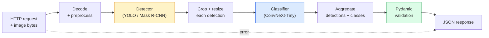

# Tamamlanmış Görüş Kökü inşa edin  Capstone  Tamamlanmış Görüş Kökü inşa edin  毕业项目

> Bir üretim vizyonu sistemi, verilerle bağlanmış bir model ve kural zinciridir.

> **【中文解读】**Üretim Sınıfı Görüş Sistemleri, veri anlaşması ile bağlantılı olarak oluşturulan bir zincir zincirinin bir parçasıdır. Bu aşamada önde gelen kurs her bir bileşeni kapsar. Bu lisans projesi, verilerin yüklenmesi, önceden işlenmesi, model düşüncesi, sonrası işlenmesi ve sonuç çıkışı dahil olmak üzere, onları bir araya getirir.

**Type:** Build | **类型:** 动手
**Languages:** Python | **语言:** Python
**Prerequisites:** Phase 4 Lessons 01-15 | **前置知识:** Phase 4 Lessons 01-15
**Time:** ~120 minutes | **时间:** ~120 分钟

## Öğrenme hedefleri

- Nesneleri algılayan, sınıflandırır ve her başarısızlık yolu ile yapılandırılmış JSON  yayarken bir üretim vizyon boru hattı tasarlayın
- Bir detektörü (Maske R-CNN veya YOLO), bir sınıflandırıcı (ConvNeXt-Tiny) ve bir veri sözleşmesi (Pydantic) tek bir hizmette bağlayın
- Sonundan sonuna kadar olan boru hattını referanslandırın ve ilk şişek boynuzunu belirleyin (genellikle önceden işleme, sonra detektör)
- Resim yüklemesini kabul eden, boru hattını çalıştıran ve sınıflandırmalarla tespitleri geri veren en az FastAPI hizmeti gönderin

> **【中文解读】**Öğrenme hedefi, ders bitirilmesinden sonra öğrenilmesi gereken temel becerileri listeler.


## Sorunlar. Sorunlar.

Bireysel görme modelleri yararlıdır; görme ürünleri bunlardan zincirlerdir. Bir perakende raf denetimi bir detektör artı bir ürün sınıflandırıcısı artı bir fiyat-OCR boru hattıdır. Otonom sürüş bir 2 boyutlu detektör artı bir 3 boyutlu detektör artı bir segmenter artı bir izleyici artı bir planlayıcıdır. Bir tıbbi ön ekran bir segmenter artı bir bölge sınıflandırıcısı artı bir klinik kullanıcı kullanımıdır.

> 单个视觉模型有用;视觉产品是它们的链条;;零售货架审计是检测器加产品分类器加价 OCR 流水线;;自动驾驶是2D检测器加3D检测器加分器加跟踪器加规划器;;医疗预测是分器加区域分类器加临床 UI;;

Bu zincirleri kablolamak, bir ML prototipini bir üründen ayıran bir parçasıdır. Modeller arasındaki her arayüz hatalar için yeni bir yerdir. Her koordinat dönüşümü, her normallaşım, her maskelerin boyutu sessiz bir başarısızlık adayıdır. Bir boru hattı en zayıf arayüzü kadar güçlüdür.

> 连接这些链条是将ML原型与产品区分开来的部分――模型之间的每个接口都是错误的新处――每次坐标变化、每次归化、每次掩码缩放都是默默失败的候选――流水线的强度取决于最弱的接口――

Bu kap taşı en az uygulanabilir boru hattını oluşturur: tespit + sınıflandırma + yapılandırılmış çıkış + bir servis katmanı. Bu iskeletin 4. aşamasındaki diğer her şey: YOLOv8 için Maske R-CNN'i değiştirin, bir OCR başlığı ekleyin, bir segmentasyon dalı ekleyin, bir izleyici ekleyin. Arsitektur istikrarlıdır; parçalar bağlanabilir.

> Bu eğitim projesi en az yapılabilir su hattı inşa eder:检测 + 分类 + 结构化输出 + 服务层。 dördüncü aşamada diğer her şey bu yapıtaş içine yerleştirilmiştir: YOLOv8 olarak değiştirilmiştir, OCR başı eklenmiştir, bölünmüş bölükler eklenmiştir, takip cihazı eklenmiştir。 yapıtaşın sabit olduğu; bileşenlerin birbirine geçirilebileceği。

## Konsepten bir şey.

> **【中文解读】**Bu bölümde temel kavramlar ve teoriler hakkında konuşuluyor. Bu kavramları öğrenmek, sonradan gerçekleştirilme önemi, aynı zamanda, görüşmeler ve mühendislik uygulamalarında yüksek sıklıkta yapılan incelemelerin bilgi noktasıdır.


### - Boru hattı



İki model aşama pahalı, diğer beş aşama böceklerin yaşadığı yer.

> İki model aşaması pahalı, kalan beş aşaması ise böceklerin bir parçasıdır.

### Pydantic ile veri sözleşmeleri

Her model sınır bir tipleme nesne haline gelir. Bu sessiz başarısızlıkları yüksek sesli olanlara dönüştürür.

> Her model sınırları tipleştirilmiş nesneye dönüşür. Bu da sessizliğin başarısızlığı açık bir hataya dönüşür.

```
Detection(
    box: tuple[float, float, float, float],   # (x1, y1, x2, y2), absolute pixels
    score: float,                              # [0, 1]
    class_id: int,                             # from detector's label map
    mask: Optional[list[list[int]]],           # RLE-encoded if present
)

PipelineResult(
    image_id: str,
    detections: list[Detection],
    classifications: list[Classification],
    inference_ms: float,
)
```

Bir detektör kutuları geri döndüğünde `(cx, cy, w, h)`yerine`(x1, y1, x2, y2)`Pydantic'in onaylaması sınırda başarısız olur ve sessizce boş bölgeleri geri dönen bir akıntıyı düzeltmek yerine hemen öğrenirsiniz.

> Çekimci geri döner`(cx, cy, w, h)`Hayır.`(x1, y1, x2, y2)`格式框时,Pydantic'in testı sınırda başarısız oldu, sorunları hemen görebilirdiniz, değil de 调试下游剪切时发现它静默返回空区域──

### Gecikme nerede gider

Neredeyse her görüş hattında üç gerçek var:

> Neredeyse her video su akışı üç gerçekle oluşuyor:

1. **Preprocessing is often the biggest single block.**JPEG'leri çözmek, renk boşluklarını dönüştürmek, 'yi yeniden boyutlandırmak bunlar CPU'ya bağlı ve unutulması kolay.
   Çeviri:**预处理通常是最大的单一开销。**解码 JPEG、转换色空间、缩放 Bunlar CPU yoğunlu, kolayca unutulma­ ̆
2. **The detector dominates GPU time.**GPU zamanının %70-90'ı tespit ön geçidinde.
   Çeviri:**检测器占据 GPU 时间的主导。**GPU'nun %70-90%'ı test yapmadan önce yayılmaya geçiyor.
3. **Postprocessing (NMS, RLE encode/decode) is cheap on GPU, expensive on CPU.**Her zaman gerçek hedefe profil.
   Çeviri:**后处理（NMS、RLE 编解码）在 GPU 上便宜，在 CPU 上昂贵。**始终在实际目标上分析──

Paylaşımı bilmek optimizasyonu öncelikli bir listeye dönüştürüyor.

>                                                                                                                                                                                                                                                               

### Başarısızlık modları

- **Empty detections**- Boş listesi geri gönder, çökme.
  Çeviri:**空检测结果** Return to the empty list, don't crash──记录日志──
- **Out-of-bounds boxes** Kırtmadan önce resmin boyutuna sıkış.
  Çeviri:**越界框**裁剪前限制到图像尺寸内──
- **Tiny crops** sınıflandırıcının en az girişinden küçük kutular için sınıflandırmayı atlayın.
  Çeviri:**微小裁剪**                                                                                                                                                                                                                                                              
- **Corrupt upload** 500 değil, belirli bir hata kodu ile 400 cevap.
  Çeviri:**损坏的上传** Return with specific error code of 400 响应, değil 500 ⋅
- **Model load failure** servis başlatılmasında başarısız olur, ilk istek üzerine değil.
  Çeviri:**模型加载失败**İlk istek yerine, ilk başlama sırasında başarısızlık.

Bir üretim boru hattı bunların her birini generiği yazmadan ele alır `try/except`Her başarısızlık bir isimli kod ve bir cevap alır.

> Üretim seviyesinin su akışı her durumda başarısızlıktan saklanmak zorunda kalmaz.`try/except`                                                                                                                                                                                                                                                              

### Toplama

Bir üretim hizmeti birden fazla müşteriye hizmet verir. İstekler arasında parti tespitleri ve sınıflandırmalar geçişin kat katını artırır. İşlem: bir parti doldurulmasını beklemekten ekstra gecikme. Tipik kurulum: 20 ms'a kadar talepler toplamak, partiyi bir araya getirmek, işleme, cevapları dağıtmak. `torchserve`ve `triton`Bu, kendi kendi mikro-batcherlerini kullanan, öngörülebilir yüklü küçük servisler için doğaldır.

> Üretim hizmetleri aynı zamanda birçok müşteriye hizmet eder. Biliklerin toplama talepleri en fazla 20 ms, toplama talepleri, toplama işlemleri, toplama yanıtları.`torchserve`和 `triton`Doğal destek; yüklenebilir küçük servis kendiliğinden gerçekleşebilir mikrobatch işlemci.

> **【拓展：工业部署中的视觉系统】**Gerçek endüstriye dağıtımında, görsel modeller gecikme, model büyüklüğü, kenar cihazların uyumlu olması gibi sorunları düşünmelidir. TensorRT, ONNX Runtime, OpenVINO, yaygın olarak kullanılan bir görsel model hızlandırma aracıdır.

> **【拓展：数据标注与质量】**视觉任务的效果高度依赖标签数据质――Label Studio、CVAT is the mainstream tagging tool――在工业场景中,主动学习(Active Learning) 标签成本ı azaltabilir:模型对不确定的样本请求人工标签,确定性的样本自动标签──

> **【拓展：合成数据与数据增强】**Gerçek veriler eksik olduğunda, sintetizasyon verileri (örneğin Blender, Unity 染) ve veri artırımı (örneğin albümleşme kütüpleri) iki etkili stratejilerdir. NVIDIA'nın Omniverse platformu yüksek kaliteli sintetizasyon eğitim verileri üretebilir.


## Yapın.

> **【中文解读】**Bu bölüm kodla sıfırdan gerçekleştirilen çekirdek algoritmasıdır. Bu "sıfırdan" yöntem çerçevenin arkasındaki prensipleri anlama yardımcı olur.

```figure
v4-vision-pipeline
```

## Yapın

### Adım 1: Veriler için sözleşmeler

```python
from pydantic import BaseModel, Field
from typing import List, Optional, Tuple

class Detection(BaseModel):
    box: Tuple[float, float, float, float]
    score: float = Field(ge=0, le=1)
    class_id: int = Field(ge=0)
    mask_rle: Optional[str] = None


class Classification(BaseModel):
    detection_index: int
    class_id: int
    class_name: str
    score: float = Field(ge=0, le=1)


class PipelineResult(BaseModel):
    image_id: str
    detections: List[Detection]
    classifications: List[Classification]
    inference_ms: float
```

Beş saniyelik kod ciddi bir boru hattında bir saatlik bir defektörlük tasarruf eder.

> 5 saniyelik kod, su hattındaki herhangi bir saatlik ayarlama tasarrufu sağlayabilir.

### Adım 2: En az bir boru hattı sınıfı

```python
import time
import numpy as np
import torch
from PIL import Image

class VisionPipeline:
    def __init__(self, detector, classifier, class_names,
                 device="cpu", min_crop=32):
        self.detector = detector.to(device).eval()
        self.classifier = classifier.to(device).eval()
        self.class_names = class_names
        self.device = device
        self.min_crop = min_crop

    def preprocess(self, image):
        """
        image: PIL.Image or np.ndarray (H, W, 3) uint8
        returns: CHW float tensor on device
        """
        if isinstance(image, Image.Image):
            image = np.asarray(image.convert("RGB"))
        tensor = torch.from_numpy(image).permute(2, 0, 1).float() / 255.0
        return tensor.to(self.device)

    @torch.no_grad()
    def detect(self, image_tensor):
        return self.detector([image_tensor])[0]

    @torch.no_grad()
    def classify(self, crops):
        if len(crops) == 0:
            return []
        batch = torch.stack(crops).to(self.device)
        logits = self.classifier(batch)
        probs = logits.softmax(-1)
        scores, cls = probs.max(-1)
        return list(zip(cls.tolist(), scores.tolist()))

    def run(self, image, image_id="anonymous"):
        t0 = time.perf_counter()
        tensor = self.preprocess(image)
        det = self.detect(tensor)

        crops = []
        detections = []
        valid_indices = []
        for i, (box, score, cls) in enumerate(zip(det["boxes"], det["scores"], det["labels"])):
            x1, y1, x2, y2 = [max(0, int(b)) for b in box.tolist()]
            x2 = min(x2, tensor.shape[-1])
            y2 = min(y2, tensor.shape[-2])
            detections.append(Detection(
                box=(x1, y1, x2, y2),
                score=float(score),
                class_id=int(cls),
            ))
            if (x2 - x1) < self.min_crop or (y2 - y1) < self.min_crop:
                continue
            crop = tensor[:, y1:y2, x1:x2]
            crop = torch.nn.functional.interpolate(
                crop.unsqueeze(0),
                size=(224, 224),
                mode="bilinear",
                align_corners=False,
            )[0]
            crops.append(crop)
            valid_indices.append(i)

        class_preds = self.classify(crops)

        classifications = []
        for valid_idx, (cls_id, cls_score) in zip(valid_indices, class_preds):
            classifications.append(Classification(
                detection_index=valid_idx,
                class_id=int(cls_id),
                class_name=self.class_names[cls_id],
                score=float(cls_score),
            ))

        return PipelineResult(
            image_id=image_id,
            detections=detections,
            classifications=classifications,
            inference_ms=(time.perf_counter() - t0) * 1000,
        )
```

Her arayüz yazılır. Her başarısızlık yolu belirli bir yönetim kararı vardır.

> Her bir bağlantı tipleştirilmiştir. Her bir başarısızlık yolu, belirli bir çözümle sonuçlanır.

### Adım 3: Bir dedektör ve sınıflandırıcı telleştir

```python
from torchvision.models.detection import maskrcnn_resnet50_fpn_v2
from torchvision.models import convnext_tiny

# Use ImageNet-pretrained weights for a realistic pipeline without training
detector = maskrcnn_resnet50_fpn_v2(weights="DEFAULT")
classifier = convnext_tiny(weights="DEFAULT")
class_names = [f"imagenet_class_{i}" for i in range(1000)]

pipe = VisionPipeline(detector, classifier, class_names)

# Smoke test with a synthetic image
test_image = (np.random.rand(400, 600, 3) * 255).astype(np.uint8)
result = pipe.run(test_image, image_id="demo")
print(result.model_dump_json(indent=2)[:500])
```

### 4. Adım: FastAPI hizmeti

```python
from fastapi import FastAPI, UploadFile, HTTPException
from io import BytesIO

app = FastAPI()
pipe = None  # initialised on startup

@app.on_event("startup")
def load():
    global pipe
    detector = maskrcnn_resnet50_fpn_v2(weights="DEFAULT").eval()
    classifier = convnext_tiny(weights="DEFAULT").eval()
    pipe = VisionPipeline(detector, classifier, class_names=[f"c{i}" for i in range(1000)])

@app.post("/detect")
async def detect_endpoint(file: UploadFile):
    if file.content_type not in {"image/jpeg", "image/png", "image/webp"}:
        raise HTTPException(status_code=400, detail="unsupported image type")
    data = await file.read()
    try:
        img = Image.open(BytesIO(data)).convert("RGB")
    except Exception:
        raise HTTPException(status_code=400, detail="cannot decode image")
    result = pipe.run(img, image_id=file.filename or "upload")
    return result.model_dump()
```

Çabuk koş .`uvicorn main:app --host 0.0.0.0 --port 8000`- Test .`curl -F 'file=@dog.jpg' http://localhost:8000/detect`- Evet .

> Kullan .`uvicorn main:app --host 0.0.0.0 --port 8000`- Evet.`curl -F 'file=@dog.jpg' http://localhost:8000/detect`测试──

### Adım 5: Boru hattını işaretleyin

```python
import time

def benchmark(pipe, num_runs=20, image_size=(400, 600)):
    img = (np.random.rand(*image_size, 3) * 255).astype(np.uint8)
    pipe.run(img)  # warm up

    stages = {"preprocess": [], "detect": [], "classify": [], "total": []}
    for _ in range(num_runs):
        t0 = time.perf_counter()
        tensor = pipe.preprocess(img)
        t1 = time.perf_counter()
        det = pipe.detect(tensor)
        t2 = time.perf_counter()
        crops = []
        for box in det["boxes"]:
            x1, y1, x2, y2 = [max(0, int(b)) for b in box.tolist()]
            x2 = min(x2, tensor.shape[-1])
            y2 = min(y2, tensor.shape[-2])
            if (x2 - x1) >= pipe.min_crop and (y2 - y1) >= pipe.min_crop:
                crop = tensor[:, y1:y2, x1:x2]
                crop = torch.nn.functional.interpolate(
                    crop.unsqueeze(0), size=(224, 224), mode="bilinear", align_corners=False
                )[0]
                crops.append(crop)
        pipe.classify(crops)
        t3 = time.perf_counter()
        stages["preprocess"].append((t1 - t0) * 1000)
        stages["detect"].append((t2 - t1) * 1000)
        stages["classify"].append((t3 - t2) * 1000)
        stages["total"].append((t3 - t0) * 1000)

    for stage, times in stages.items():
        times.sort()
        print(f"{stage:12s}  p50={times[len(times)//2]:7.1f} ms  p95={times[int(len(times)*0.95)]:7.1f} ms")
```

CPU'da tipik çıkış: önceden işleme ~ 3 ms, 300-500 ms algılama, 20-40 ms sınıflandırma, toplam 350-550 ms. GPU'da algılama 20-40 ms'dir ve önceden işleme + sınıflandırma göreceli olarak daha önemli olmaya başlar.

> CPU'da tipik çıkış: önceden işleme yaklaşık 3 ms, inceleme 300-500 ms, inceleme 20-40 ms, toplam 350-550 ms, inceleme yaklaşık 20-40 ms, GPU'da, önceden işleme ve inceleme sınıfların oran oranı daha önemli hale geldi.

> **【中文解读】**Bu bölümde, PyTorch, HuggingFace gibi olgun çerçeveler nasıl kullanılacağını gösterir.


> **【拓展：视觉模型的持续学习】**Üretim ortamında, görsel modeller yeni verilere sürekli uyum sağlamak gerekir. Yeni ürünler, yeni sahne, yeni ışık koşulları. Sürekli öğrenme. Sürekli öğrenme.

## Çerçeveyi kullanın.

Üretim şablonları aynı yapıya birleşiyor, artı:

- **Model versioning** cevapta her zaman model adı ve ağırlıkları kaydet.
- **Per-request trace IDs** Her istek için her aşama zamanlamasını kaydet, böylece yavaş cevapları aşamalarla ilişkilendirebilirsiniz.
- **Fallback path** sınıflandırıcı sona erirse, tüm talebi başarısız etmek yerine sınıflandırma yapmadan tespitleri geri gönderin.
- **Safety filters** NSFW / PII filtreleri, tepki hizmeti terk etmeden önce sınıflandırmadan sonra çalıştırılır.
- **Batch endpoint** a `/detect_batch`Toplu işleme için görüntü URL listesi kabul edilmesi.

Üretim servisleri için,`torchserve`- Evet .`Triton Inference Server`ve`BentoML`İbadet, versiyon, ölçüm ve sağlık kontrollerini kontrol et.`FastAPI`İlk modeller ve küçük ölçekli ürünler için uygun.

> **【中文解读】**Bu bölümde modellerin kullanılabilir ürünler için nasıl dağıtılacağı üzerinde yoğunlaşmaktadır.


## İndirin . Ürünler .

Bu ders şunları ortaya çıkarır:

- `outputs/prompt-vision-service-shape-reviewer.md` bir görüntü hizmetinin sözleşme/ yanıt şekli ihlallerini gözden geçiren ve ilk kırılma hatasının adını veren bir istek.
- `outputs/skill-pipeline-budget-planner.md` hedef gecikme ve geçiş verildiği için, her boru hattı aşamasına bir zaman bütçesi belirleyen ve hangi aşamasın bütçesini ilk kaçırılacağını belirleyen bir beceri.

> **【中文解读】**练习题按照易/中级/难三度递进;;建议至少完成中级题,Hard级适合深入研究或面试准备;;


## Egzersizler.

1. **(Easy)**Açık bir veri kümesinden 10 görüntü üzerinde boru hattını çalıştırın.
2. **(Medium)**Maske çıkış alanını `Detection`JSON'un 10 nesnelik bir görüntü için bile 1 MB'den az olduğunu kontrol edin.
3. **(Hard)**Sınıflandırıcının önüne bir mikro-batcher ekleyin: 10 ms'a kadar ürünleri toplayın, hepsini bir GPU çağrısında sınıflandırın, her istek başına sonuçlar gönderin.

> **【中文解读】**术语表中的"İnsanların ne dediği" vs "Gerçekten ne anlama geldiği" 区分日常口语和精确技术含义──在团队协作中,统一术语定义可以避免大量沟通误解──


## Anahtar Şartlar .

| Term | What people say | What it actually means |
|------|----------------|----------------------|
| Pipeline | "The system" | An ordered chain of preprocessing, inference, and postprocessing steps with a typed interface between each pair |
| Data contract | "The schema" | Pydantic / dataclass definitions that every stage input and output conforms to; catches integration bugs at the boundary |
| Preprocessing | "Before the model" | Decoding, colour conversion, resizing, normalising; usually the biggest CPU time sink |
| Postprocessing | "After the model" | NMS, mask resize, threshold, RLE encode; cheap on GPU, expensive on CPU |
| Microbatcher | "Collect then forward" | Aggregator that waits a fixed window for multiple requests, runs a single batched forward pass |
| Trace ID | "Request id" | Per-request identifier logged at every stage so slow requests can be traced end-to-end |
| Failure code | "Named error" | Specific error code per failure class instead of generic 500; enables client retry logic |
| Health check | "Readiness probe" | Cheap endpoint that reports whether the service can answer; loadbalancers rely on this |

> **【中文解读】**延伸阅读, derinlemesine öğrenme için yüksek kaliteli kaynaklar sağladı. Bu makaleler ve dersler, derinlemesine anlama ihtiyacı olan okuyuculara uygun olarak bu alanın klasik referanslarıdır.


## Daha fazla okumak

- [Full Stack Deep Learning — Deploying Models](https://fullstackdeeplearning.com/course/2022/lecture-5-deployment/) üretim ML dağıtımının kanonik genel bakış
- [BentoML docs](https://docs.bentoml.com) Batch, versiyon ve ölçümlerle hizmet çerçevesini
- [torchserve docs](https://pytorch.org/serve/)PyTorch'in resmi hizmet kütüphanesi
- [NVIDIA Triton Inference Server](https://developer.nvidia.com/triton-inference-server) Toplama ve çok model destekle yüksek üretim servisi
