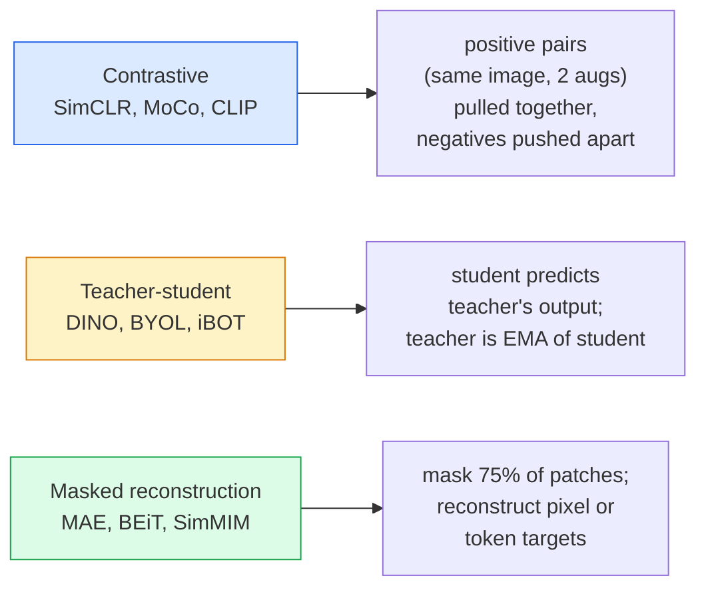

# Kendini Gözetim SimCLR, DINO, MAE

> Etiketler denetimli görmenin şişeneği. Kendini denetimli bir öncülük onları ortadan kaldırır: 100 milyon etiketsiz görüntüden görsel özellikler öğrenir, 10 bin etiketli görüntüde ince ayarlar yapar.

> **【中文解读】**标签是监督学习的瓶──自监督预训消除了这个限制: 1 milyar张无标签图像中学习视觉特征,然后在1万张标签图像上微调──三种主流方法:SimCLR(对比学习)、DINO(自蒸)、MAE(掩码自编码器)

> **【拓展：自监督学习是 GPT 的秘密】**GPT 就是一种自我监督模型通过预测下一个词来学习──在视觉领域,MAE 通过预测被遮盖的补丁 来学习,DINO 通过自蒸学习语义特征──DINOv2 已成为许多视觉任务的基础模型──

**Type:** Learn + Build | **类型:** 学习 + 动手
**Languages:** Python | **语言:** Python
**Prerequisites:** Phase 4 Lesson 04 (Image Classification), Phase 4 Lesson 14 (ViT) | **前置知识:** Phase 4 Lesson 04（图像分类），Phase 4 Lesson 14（ViT）
**Time:** ~75 minutes | **时间:** ~75 分钟

## Öğrenme hedefleri

- Üç büyük kendi kendine denetimli aileyi izleyin  kontrast (SimCLR), öğretmen-öğrenci (DINO), maskeli yeniden inşaat (MAE)  ve her birinin neyi optimize ettiğini belirtin
- InfoNCE kaybını sıfırdan uygulayın ve 512'nin bir parti neden işe yarıyor ama 32'nin bir parti neden başarısız olduğunu açıklayın
- MAE'nin 75% maske oranının neden keyfi olmadığını ve metin için BERT'nin 15% oranından nasıl farklı olduğunu açıklayın.
- Dinov2 veya MAE ImageNet kontrol noktalarını, doğrusal araştırma ve sıfır çekim çekimleri için kullanın.

> **【中文解读】**Öğrenme hedefi, ders bitirilmesinden sonra öğrenilmesi gereken temel becerileri listeler.


## Sorunlar. Sorunlar.

Gözetim ImageNet'in, kaydedilmesi için tahmini 10 milyon dolarlık maliyetli 1.3 milyon etiketli görüntü var. Tıp ve endüstriyel veri kümeleri daha küçük ve etiketlemek daha pahalıdır. Her vizyon ekibi soruyor: ucuz etiketsiz veri üzerinde önceden eğitim alabilir miyiz?

> 监督式 ImageNet'in 130 milyon işaretleme resmi var, işaretleme maliyeti tahmin edilince 10 milyon dolar. 医学 ve sanayi verileri daha küçük, işaretleme maliyeti daha yüksek.  प्रत्येक görüntü ekibi soruyor: ucuz olmayan işaretleme verileri üzerinde önceden eğitim alabilir miyiz? YouTube  网络爬爬取,网络摄像头录像,卫星扫描 sonra küçük işaretleme paketlerine en aza indirmek?

Kendini denetleyen öğrenme cevabıdır. LAION veya JFT üzerinde eğitilen modern kendi kendine denetlenen ViT, ince ayarlandığında denetlenen ImageNet doğruluğuna ulaşır veya yener. Ayrıca denetlenen ön eğitimden daha iyi aşağı akıntılı görevlere (kaşif, segmentasyon, derinlik) aktarır. DINOv2 (Meta, 2023) ve MAE (Meta, 2022) aktarılabilir görüş özellikleri için mevcut üretim öntanımlılarıdır.

> Kendi kontrolüyle öğrenmek budur cevap. Laon veya JFT'de eğitim gören modern kendi kontrolüyle eğitilen ViT 微调后达到或超过监督式 ImageNet 准确率──它也向下游任务(检测、分割、深度) 迁移优于监督预训──DINOv2(Meta,2023) 和 MAE(Meta,2022) 迁移视觉特征的当前生产默认选择──

Konsep değişikliği, bahane görevinin  modelin yapması için eğitilmiş olduğu şey 'nin aşağıdaki görev olması gerektiği anlamına gelmez. Önemli olan modelin yararlı özellikleri öğrenmesini zorlamasıdır. Gri ölçekli görüntülerin rengini tahmin edin, görüntüleri döndürün ve modelden dönümleri sınıflandırmasını isteyin, yamaları maskelenin ve yeniden yapılandırın  hepsi işe yaradı. Bu ölçekle ilgili üç yaklaşım kontrastlı öğrenme, öğretmen-öğrenci distilasyonu ve maskeli yeniden inşaat.

> Konsepsel dönüşüm, önceden görev yapılmasıdır. Model eğitilmiş olan bir şey değildir. Önemli olan, modelin yararlı özellikleri öğrenmesini zorlar.

## Konsepten bir şey.

> **【中文解读】**Bu bölümde temel kavramlar ve teoriler hakkında konuşuluyor. Bu kavramları öğrenmek, sonradan gerçekleştirilme önemi, aynı zamanda, görüşmeler ve mühendislik uygulamalarında yüksek sıklıkta yapılan incelemelerin bilgi noktasıdır.


### Üç aile



### Kontrastlı öğrenme (SimCLR)

Bir görüntü alın, iki rastgele artış uygulayın, iki görüntü alın. Her ikisini de aynı kodla bir projeksiyon başlığı ile besleyin. "Bu iki yerleşim yakın olmalı" ve "bu yerleşim partideki diğer tüm görüntülerin yerleşimlerinden uzak olmalıdır" diyen bir kayıpı en aza indir.

> 取一张图像,施加两种随机增强,获得两种视图――将两者通过同一编码器加投影头――最小化一个损失函数:"Bu iki yerleşim yakındır" ve "Bu yerleşim tüm diğer görüntü yerleşimlerinden uzak olmalıdır"―

```
Loss for positive pair (z_i, z_j) among 2N views per batch:

   L_ij = -log( exp(sim(z_i, z_j) / tau) / sum_k in batch \ {i} exp(sim(z_i, z_k) / tau) )

sim = cosine similarity
tau = temperature (0.1 standard)
```

Bu InfoNCE kaybı. Pozitif başına birçok negatif gerektirir, bu nedenle seri boyutu önemlidir. SimCLR 512-8192 gerektirir. MoCo, negatif sayıyı seri boyutundan ayırmak için geçmiş partilerin bir momentum kuyrukunu tanıttı.

> Bu InfoNCE  kaybı. Bu, her doğru örneğe birçok olumsuz örneğe karşı karşı gelmek için ihtiyaç duyar, bu yüzden toptan büyüklük çok önemlidir. SimCLR 512-8192 gerekir.

### Öğretmen-öğrenci (DINO)

Aynı mimari olan iki ağ: öğrenci ve öğretmen. Öğretmen öğrencinin ağırlıklarının eksponensel hareketli ortalamasıdır. Her ikisi de görüntüde artış görüyor. Öğrencinin çıkışı öğretmenin  açık negatifleri ile eşleşecek şekilde eğitilmiştir.

> 两个相同结构的网络:学生和教师――教师权重指数移动平均(EMA) öğrenci权重的指数移动平均――学生权重的指数Ema) öğrenci权重的指数移动平均――学生权重的指数移动平均――学生权重的指数移动平均――学生权重的指数移动平均――学生权重的指数移动平均――学生权重的指数移动指数移动指数移动指数移动指数移动指数移动指数移动指数移动指数移动指数移动指数移动指数移动指数移动指数移动指数移动指数移动指数移动指数移动指数移动指数移动指数移动指数移动指数移动指数移动指数移动指数移动指数移动指数移动指数移动指数移动指数移动指数移动指数移动指数移动指数移动指数移动指数移动指数移动指数移动指数移动指数移动指数移动指数移动指数移动指数移动指数移动指数移动指数的指数; student output output output output output of student output of student output of student output of student is trained to match teacher is trained to match teacher  student  student output of teacher  student  student  student  student  student  student  student  student  student  student  student  student  student  student  student  student  student  student  student  student  student  student  student  student  student  student  student  student  student  student  student  student  student  student   student  student      student    student   student      student       student                                                                                  

```
loss = CE( student_output(view_1),  teacher_output(view_2) )
     + CE( student_output(view_2),  teacher_output(view_1) )

teacher_weights = m * teacher_weights + (1 - m) * student_weights   (m ≈ 0.996)
```

"Bir sabit tahmin etmek" için neden çökmez: öğretmenin çıkışı merkezi (ölüm ortalamasını çıkar) ve keskinleştirilmiştir (küçük sıcaklıkla bölünür).

> Neden çıkmaz "büyük bir tahmin" için: öğretmenlerin çıkma oranı çıkma oranı çıkma oranı çıkma oranı çıkma oranı çıkma oranı çıkma oranı çıkma oranı çıkma oranı çıkma oranı çıkma oranı çıkma oranı çıkma oranı çıkma oranı çıkma oranı çıkma oranı çıkma oranı çıkma oranı çıkma oranı çıkma oranı çıkma oranı çıkma oranı çıkma oranı çıkma oranı çıkma oranı çıkma oranı çıkma oranı çıkma oranı çıkma oranı çıkma çmak çıkma çma çıkma çma çmak çıkma çma çmak çmak çmak çmak çmak çmak çmak çmak çmak çmak çmak çmak çmak çmak çmak çmak çmak çmak çmak ç çç ç çç ç çç ç çç çç ç mak çç ç çç ç ççç çç ç ççç ç ççç ç ç ç çç ç çç ç çç ç çç ç çç çççç ç çç ç çç ç çç ç ççç ç ççç ççç 

DINO, DINOv2'nin 142M kurate görüntüde ölçeklendirdiği şeydir.

> DINO, 1.42 milyar 张 seçilmiş görüntüde genişletilmiş DINOv2'nin temelidir.

### Maskeli Yeniden Yapım (MAE)

ViT girişinin %75'ini maskeye alın. Görünen %25'i sadece kodlayıcı üzerinden geçirir. Küçük bir dekoder maske pozisyonlarında kodlayıcıın çıkışını ve maske tokenlerini alır ve maske patchlerin piksellerini yeniden yapılandırmak için eğitilir.

> 掩蔽 ViT 输入的75% 补丁──只有将见的25% 通过编码器──一个小解码器接收编码器输出加上掩码位置的掩码代币,训练重建被掩饰补丁的像素──

```
Encoder:  visible 25% of patches -> features
Decoder:  features + mask tokens at masked positions -> reconstructed pixels
Loss:     MSE between reconstructed and original pixels on masked patches only
```

MAE'nin çalışmasını sağlayan temel tasarım seçenekleri:

> MAE 生效的关键设计选择:

- **75% mask ratio** yüksek. Kodlayıcıyı semantik özellikleri öğrenmeye zorlar; %25'i yeniden yapılandırmak neredeyse önemsiz olurdu (komşu pikseller CNN'in çivileyebileceği kadar ilişkili).
  Çeviri:**75% 掩码率**很高──迫使编码器学习语义特征; yeniden inşa 25% 几乎是平凡的(相邻像素高度相关,一个CNN 就能做到) 
- **Asymmetric encoder/decoder** büyük ViT kodlayıcı sadece görünür yamalar görür; küçük bir dekoder (8 katlı, 512 boyutlu) yeniden yapılandırmayı ele alır.
  Çeviri:**非对称编码器/解码器** Büyük ViT 编码器只看可见补丁;小型解码器(8层,512 维) yeniden inşa edilmesini işlemek。比朴素 BEiT 预训练快3 倍。
- **Pixel-space reconstruction target** BEiT'in simgesel hedefinden daha basit ve ViT'de daha iyi çalışır.
  Çeviri:**像素空间重建目标**BET'in simgesel 化 目標 daha basit, ViT'de 上效果更好──

Eğitimden önce, dekodörü atın.

> 预训后丢弃解码器──编码器就是特征提取器──

### Neden %75'i %15'i değil?

BERT, tokenlerin %15'ini, MAE'nin %75'ini maske eder.

> BERT %15'i gizliyor. MAE %75'i gizliyor.

- Doğal dil, her token için yüksek entropiye sahiptir. Tokenlerin %15'ini tahmin etmek hala zor çünkü her maskeli pozisyonun birçok makul tamamlaması vardır.
  Çinçe çevirisi:                                                                                                                                                                                                                                                            
- Resim yamalarının entropisi düşüktür. maskeli bir mahalle genellikle maskeli yama piksellerini neredeyse tam olarak belirler. Tahmin yapmak için semantik anlayış gerektirir, agresif bir şekilde maske yapmanız gerekir.
  Çinçe çevirisi: resim düzeltme 低未掩蔽的邻域通常几乎完全决定被掩蔽补丁的像素──预测的需要语义理解,必须激进地掩蔽──

%75 basit uzaysal ekstrapolasyonun görevi çözemeyeceği kadar yüksek; kodlayıcı görüntü içeriğini temsil etmelidir.

> %75 yüksek basit boşluk dışı sürüm çözülemez; kodlayıcı görüntü içeriğini göstermelidir.

### Düzsel araştırma değerlendirme

Kendini denetleyen bir eğitim öncesi eğitimden sonra standart değerlendirme bir **linear probe**: kodlayıcıyı dondurmak, ImageNet etiketlerinde üstte tek bir çizgi sınıflandırıcı çalıştırmak.

> Özenle ilgili eğitimden sonra standart değerlendirme**线性探测**: 结编码器, on ImageNet 标签上训练单个线性分类器──报告 top-1 准确率──

- SimCLR ResNet-50: ~71% (2020)
- DINO ViT-S/16: ~77% (2021)
- MAE ViT-L/16: ~76% (2022)
- DINOv2 ViT-g/14: ~86% (2023)

Düzsel araştırma, özellik kalitesi için saf bir ölçümdür; ince ayarlama genellikle 2-5 puan ekler, ancak aynı zamanda kafa yeniden eğitimi etkisinde karışır.

> Linear test, özellik kalitesi saf bir ölçümdür; küçük düzenler genellikle 2-5 yüzde puan artırır, ancak başın yeniden eğitilmesinin etkilerini de karıştırır.

> **【拓展：工业部署中的视觉系统】**Gerçek endüstriye dağıtımında, görsel modeller gecikme, model büyüklüğü, kenar cihazların uyumlu olması gibi sorunları düşünmelidir. TensorRT, ONNX Runtime, OpenVINO, yaygın olarak kullanılan bir görsel model hızlandırma aracıdır.

> **【拓展：数据标注与质量】**视觉任务的效果高度依赖标签数据质――Label Studio、CVAT is the mainstream tagging tool――在工业场景中,主动学习(Active Learning) 标签成本ı azaltabilir:模型对不确定的样本请求人工标签,确定性的样本自动标签──


## Yapın.

> **【中文解读】**Bu bölüm kodla sıfırdan gerçekleştirilen çekirdek algoritmasıdır. Bu "sıfırdan" yöntem çerçevenin arkasındaki prensipleri anlama yardımcı olur.

```figure
data-augmentation
```

## Yapın

### Adım 1: İki görüntü artıran boru hattı

```python
import torch
import torchvision.transforms as T

two_view_train = lambda: T.Compose([
    T.RandomResizedCrop(96, scale=(0.2, 1.0)),
    T.RandomHorizontalFlip(),
    T.ColorJitter(0.4, 0.4, 0.4, 0.1),
    T.RandomGrayscale(p=0.2),
    T.ToTensor(),
])


class TwoViewDataset(torch.utils.data.Dataset):
    def __init__(self, base):
        self.base = base
        self.aug = two_view_train()

    def __len__(self):
        return len(self.base)

    def __getitem__(self, i):
        img, _ = self.base[i]
        v1 = self.aug(img)
        v2 = self.aug(img)
        return v1, v2
```

Her biri .__getitem__Aynı görüntünün iki eklenmiş görüntüsü gönderir; etiketlere gerek yoktur.

> Her seferinde .`__getitem__`Aynı resmin iki büyütme görüntüsünü geri gönderin; etiket gerektirmez.

### Adım 2: InfoNCE kaybı

```python
import torch.nn.functional as F

def info_nce(z1, z2, tau=0.1):
    """
    z1, z2: (N, D) L2-normalised embeddings of paired views
    """
    N, D = z1.shape
    z = torch.cat([z1, z2], dim=0)  # (2N, D)
    sim = z @ z.T / tau              # (2N, 2N)

    mask = torch.eye(2 * N, dtype=torch.bool, device=z.device)
    sim = sim.masked_fill(mask, float("-inf"))

    targets = torch.cat([torch.arange(N, 2 * N), torch.arange(0, N)]).to(z.device)
    return F.cross_entropy(sim, targets)
```

L2 çağrıdan önce yerleştirmeleri normalleştir. `tau=0.1`SimCLR'nin varsayılan değeridir; düşük kayıp daha keskin hale gelir ve daha fazla negatif gerektirir.

> 调用前对嵌入做 L2 归一化──`tau=0.1`SimCLR'nin kaybedilmesi ve kaybedilmesi için daha fazla negatif örnek gerekmektedir.

### Adım 3: InfoNCE akıl sağlığı kontrolü

```python
z1 = F.normalize(torch.randn(16, 32), dim=-1)
z2 = z1.clone()
loss_same = info_nce(z1, z2, tau=0.1).item()
z2_random = F.normalize(torch.randn(16, 32), dim=-1)
loss_random = info_nce(z1, z2_random, tau=0.1).item()
print(f"InfoNCE with identical pairs:  {loss_same:.3f}")
print(f"InfoNCE with random pairs:     {loss_random:.3f}")
```

Aynı çiftler düşük bir kaybı (büyük bir parti ve soğuk sıcaklık için 0'ya yakın) vermektedir.

> Aynı zamanda, bu durumun da bir sonucu olarak, bu durumun da bir sonucu olarak ortaya çıkması gerektiği belirtilmiştir.

### 4. adım: MAE tarzı maskeli

```python
def random_mask_indices(num_patches, mask_ratio=0.75, seed=0):
    g = torch.Generator().manual_seed(seed)
    n_keep = int(num_patches * (1 - mask_ratio))
    perm = torch.randperm(num_patches, generator=g)
    visible = perm[:n_keep]
    masked = perm[n_keep:]
    return visible.sort().values, masked.sort().values


num_patches = 196
visible, masked = random_mask_indices(num_patches, mask_ratio=0.75)
print(f"visible: {len(visible)} / {num_patches}")
print(f"masked:  {len(masked)} / {num_patches}")
```

> **【中文解读】**Bu bölümde, PyTorch, HuggingFace gibi olgun çerçeveler nasıl kullanılacağını gösterir.


Gerçek MAE uygulamalar bunu bir seri olarak toplayıp örnek maskelerini tutarlar.

> 简单、快速、对特定种子确定性――实际 MAE 实现会批量处理并保留每个样本的掩码――


> **【拓展：视觉模型的持续学习】**Üretim ortamında, görsel modeller yeni verilere sürekli uyum sağlamak gerekir. Yeni ürünler, yeni sahne, yeni ışık koşulları. Sürekli öğrenme. Sürekli öğrenme.

## Çerçeveyi kullanın.

DINOv2 2026'da üretim standartıdır:

```python
import torch
from transformers import AutoImageProcessor, AutoModel

processor = AutoImageProcessor.from_pretrained("facebook/dinov2-base")
model = AutoModel.from_pretrained("facebook/dinov2-base")
model.eval()

# Per-image embeddings for zero-shot retrieval
with torch.no_grad():
    inputs = processor(images=[pil_image], return_tensors="pt")
    outputs = model(**inputs)
    embedding = outputs.last_hidden_state[:, 0]  # CLS token
```

Sonuç olarak 768 boyutlu bir yerleşim, modern görüntü alım, yoğun bir karşılıklılık ve sıfır çekim transfer boru hattının omurgasıdır.

Resim metni yerleştirmeler için SigLIP veya OpenCLIP eşdeğerdir. MAE tarzı ince ayarlama için `timm`Her MAE kontrol noktasında repo gemileri gönderiliyor.

> **【中文解读】**Bu bölümde modellerin kullanılabilir ürünler için nasıl dağıtılacağı üzerinde yoğunlaşmaktadır.


## İndirin . Ürünler .

> **【中文解读】**练习题按照易/中级/难三度递进;;建议至少完成中级题,Hard级适合深入研究或面试准备;;


Bu ders şunları ortaya çıkarır:

- `outputs/prompt-ssl-pretraining-picker.md` bir istek SimCLR / MAE / DINOv2'yi seçer veri kümesi boyutu, hesaplama ve aşağıdaki görev verildi.
- `outputs/skill-linear-probe-runner.md` dondurulmuş kodlayıcı + etiketlenen veri kümesi için çizgi-sonde değerlendirmesini yazma becerisi.

## Egzersizler.

1. **(Easy)**İyi uyumlu yerleşimlerde sıcaklık düştüğünde ve rastgele yerleşimlerde sıcaklık düştüğünde yükseldiğinde InfoNCE kaybının düştüğünü kontrol edin.`tau in [0.05, 0.1, 0.2, 0.5]`Kayıp karşısında.
2. **(Medium)**DINO tarzı merkez tamponu uygulayın. Merkezleme olmadan öğrencinin birkaç dönem içinde sabit bir vektöre düştüğünü gösterin.
3. **(Hard)**CIFAR-100'de TinyUNet'i omurgası olarak kullanarak MAE'yi eğit. 10, 50 ve 200 dönemlerde çizgi-sonde doğruluğunu bildirin. MAE'den önceden eğitilmiş bir çizgi-sonde aynı 1000 görüntü alt kümesinde sıfırdan denetim altında olan bir çizgi-sondeyi yendiğini gösterin.

> **【中文解读】**术语表中的"İnsanların ne dediği" vs "Gerçekten ne anlama geldiği" 区分日常口语和精确技术含义──在团队协作中,统一术语定义可以避免大量沟通误解──


## Anahtar Şartlar .

| Term | What people say | What it actually means |
|------|----------------|----------------------|
| Self-supervised | "Label-free" | A pretext task that produces useful representations from unlabelled data |
| Pretext task | "The fake task" | The objective used during SSL (reconstruct patches, match views); discarded after pretraining |
| Linear probe | "Frozen encoder + linear head" | Standard SSL evaluation: train only a linear classifier on top of frozen features |
| InfoNCE | "Contrastive loss" | softmax over cosine similarities; positive pair is the target class, all others are negatives |
| EMA teacher | "Moving-average teacher" | Teacher whose weights are an exponential moving average of the student's; used by BYOL, MoCo, DINO |
| Mask ratio | "% of patches hidden" | Fraction of patches masked during MAE; 75% for vision, 15% for text |
| Representation collapse | "Constant output" | SSL failure where the encoder outputs a constant vector for all inputs; prevented by centring, sharpening, or negatives |
| DINOv2 | "Production SSL backbone" | Meta's 2023 self-supervised ViT; strongest general-purpose image features in 2026 |

> **【中文解读】**延伸阅读, derinlemesine öğrenme için yüksek kaliteli kaynaklar sağladı. Bu makaleler ve dersler, derinlemesine anlama ihtiyacı olan okuyuculara uygun olarak bu alanın klasik referanslarıdır.


## Daha fazla okumak

- [SimCLR (Chen et al., 2020)](https://arxiv.org/abs/2002.05709) Kontrastlı öğrenme referansı
- [DINO (Caron et al., 2021)](https://arxiv.org/abs/2104.14294) Eğitim, merkez, keskinleşme ile öğretmen-öğrenci
- [MAE (He et al., 2022)](https://arxiv.org/abs/2111.06377) Maskeli oto kodlayıcı
- [DINOv2 (Oquab et al., 2023)](https://arxiv.org/abs/2304.07193) Kendiliğinden denetimli ViT'yi üretim özelliklerine ölçeklendirme
