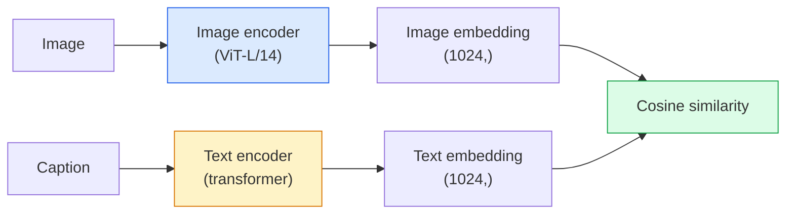

# Açık Sözcük Görüşü  CLIP  开放词汇视觉  CLIP

> Bir resim kodlayıcı ve bir metin kodlayıcıyı birlikte çalıştırın ki eşleşen çiftler (resim, başlık) paylaşım alanında aynı noktada yerleşsin.

> **【中文解读】**CLIP aynı zamanda resim kodlayıcı ve metin kodlayıcıyı, paylaşım alanındaki aynı noktaya uyumlu bir şekilde ((şekil, açıklama) kullanır. Bu da basit bir şekilde, sıfır örnek sınıflandırma mümkün hale getirir.

> **【拓展：CLIP 是多模态 AI 的基石】**CLIP DALL-E ̳Stable Diffusion ̳LVA ̳GPT-4V ̳等 çok modoldaki modellerin temel bileşenidir.

**Type:** Build + Use | **类型:** 动手 + 应用
**Languages:** Python | **语言:** Python
**Prerequisites:** Phase 4 Lesson 14 (ViT), Phase 4 Lesson 17 (Self-Supervised) | **前置知识:** Phase 4 Lesson 14（ViT），Phase 4 Lesson 17（自监督）
**Time:** ~45 minutes | **时间:** ~45 分钟

## Öğrenme hedefleri

- CLIP'in iki kulelik mimarisi ve karşılaştırmalı eğitim hedefini açıklayın
- Zira atış sınıflandırması için görev spesifik eğitim olmadan önceden eğitilmiş bir CLIP (veya SigLIP) kullanın
- sıfır çekim sınıflandırmasını sıfırdan uygula: kod sınıfı istekleri, kosinus benzerliği hesaplama, argmax al
- CLIP, SigLIP, OpenCLIP ve LLaVA/LLaMA vizyon modelleri arasında ayrım yapın  2026'da her biri için ne

> **【中文解读】**Öğrenme hedefi, ders bitirilmesinden sonra öğrenilmesi gereken temel becerileri listeler.


## Sorunlar. Sorunlar.

Geleneksel sınıflandırıcılar kapalı sözcüklüdür: 1000 sınıflı bir ImageNet modeli sadece 1000 etiket tahmin edebilir. Her yeni kategoride etiketlenen veriler ve yeniden eğitilmiş bir baş gerekir.

> 传统分类器是封闭词汇的:1000 类的 ImageNet 模型只能预测1000 标签──每个新类都需要标签数据和重新训练的头──

CLIP (Radford et al., OpenAI 2021) web'den kaydedilen 400M (resim, başlık) çift üzerinde eğitim, sadece doğal dilde açıklanan bir sonuca göre herhangi bir kategoride sınıflandırılabilen bir model ürettiğini gösterdi.

> CLIP(Radford 等,OpenAI 2021) net çekilen 4 milyar resim, başlıkta) üzerinde eğitimden oluşan modellerin, saf doğal dilde açıklanan herhangi bir sınıf topluluğuna denklem sırasında sınıflandırılabileceğini göstermektedir.

Bu yetenek  sıfır çekim transfer  her modern görme sisteminin CLIP ailesi kontrol noktasıyla başlamasının nedeni budur.

> O kapasiteden 零样本迁移就是为什么每个现代视觉系统都从CLIP家族的检查点开始――检测(Grounding DINO、OWL-ViT) 、分割(CLIPSeg、SAM) 、检索、内容审核、VLM 和文本到图像生成都建立在CLIP 风格的联合嵌入上──

## Konsepten bir şey.

> **【中文解读】**Bu bölümde temel kavramlar ve teoriler hakkında konuşuluyor. Bu kavramları öğrenmek, sonradan gerçekleştirilme önemi, aynı zamanda, görüşmeler ve mühendislik uygulamalarında yüksek sıklıkta yapılan incelemelerin bilgi noktasıdır.


### İki kule



Her iki kodlayıcı da aynı yerleştirme boyutuna (512 CLIP-B/32, 1024 CLIP-L/14 için) lineer bir projeksiyonla sona erer. L2-normalleştir ve hesapla cosine benzerliği.

> 两个编码器都以线性投影到相同嵌入维度结尾(CLIP-B/32为 512维,CLIP-L/14为 1024维);;L2 归结后计算余弦相似度;;

### Amaç

N (resim, başlık) çiftlerinin bir partiyi vererek, NxN benzerlik matrisi oluşturun. Her iki kodlayıcıyı çalıştırın, böylece diyagonal (eşitli çiftler) yüksek benzerlik gösterir ve dış diyagonallar (eşitli olmayan) düşük benzerlik gösterir.

> 给定一批 N 个 (图像,标题) 对,构建 NxN相似度矩阵――训练两个编码器使对角线 (tıpkı) 相似度高,非对角线 (tıpkı) 没有相匹对) 相似度低――

```
sim_matrix = image_embeddings @ text_embeddings.T / tau

loss_i2t = cross_entropy(sim_matrix,       targets=arange(N))
loss_t2i = cross_entropy(sim_matrix.T,     targets=arange(N))
loss = (loss_i2t + loss_t2i) / 2
```

Hem resimden metne hem de metinden görüntüye geri alım işlemeli. `tau`(temperatura) genellikle 0,07 olarak initialize edilen bir skalar parametresi olarak öğrenilir.

> Bu nedenle, resimlerin metin ve metinlerin resimlerin kontrolü geçerli olmalıdır.`tau`(temperatura) genellikle bir matematik öğrenimi olarak 0.07 olarak başlar.

### Siglip: daha iyi bir kayıp .

SigLIP (Zhai et al., 2023) softmax'ı çift başına sigmoid ile değiştirdi:

> SigLIP ((Zhai et, 2023) ile sigmoid  softmax değiştirildi:

```
loss = mean over pairs of log(1 + exp(-y_ij * sim_ij))
y_ij = +1 if matching, -1 otherwise
```

Çift başına kaybı, CLIP'in gerektirdiği parti seviyesindeki normallaşmayı ortadan kaldırır. SigLIP, küçük parti boyutlarında daha iyi çalışır ve eşit verilerde CLIP'den daha fazla veya daha fazla eşleşir.

>                                                                                                                                                                                                                                                               

### sıfır atış sınıflandırması

Eğitimli bir CLIP'den dolayı:

> 给定训练好的CIP:

1. Her sınıf için bir istek yazın: "bir sınıfın fotoğrafı".
   Çeviri: Çeviri: Çeviri: Çeviri: Çeviri: Çeviri: Çeviri: Çeviri: Çeviri: Çeviri: Çeviri: Çeviri: Çeviri: Çeviri: Çeviri: Çeviri: Çeviri: Çeviri: Çeviri: Çeviri: Çeviri: Çeviri: Çeviri: Çeviri: Çeviri: Çeviri: Çeviri: Çeviri: Çeviri: Çeviri: Çeviri: Çeviri: Çeviri: Çeviri: Çeviri: Çeviri: Çeviri: Çeviri: Çeviri: Çeviri: Çeviri: Çeviri: Çeviri: Çeviri: Çeviri: Çeviri: Çeviri: Çeviri: Çeviri: Çeviri: Çeviri: Çeviri: Çeviri: Çeviri: Çeviri: Çeviri: Çeviri: Çeviri: Çeviri: Çeviri: Çeviri: Çeviri: Çeviri: Çeviri: Çeviri: Çeviri: Çeviri: Çeviri: Çeviri: Çeviri: Çeviri: Çeviri: Çeviri: Çeviri: Çeviri: Çeviri: Çeviri: Çeviri: Çeviri: Çeviri: Çeviri: Çeviri: Çeviri: Çeviri: Çeviri: Çeviri: Çeviri: Çeviri: Çeviri: Çeviri: Çeviri: Çeviri: Çeviri: Çeviri: Çeviri: Çeviri: Çeviri: Çeviri: Çeviri: Çeviri: Çeviri: Çeviri: Çeviri: Çeviri: Çeviri: Çeviri: Çeviri: Çeviri: Çeviri: Çeviri: Çeviri: Çeviri: Çeviri: Çeviri: Çeviri: Ç Ç Çeviri: Çeviri: Ç Ç Çeviri: Ç Ç Ç Ç Ç Ç Ç Ç Ç Ç Ç Ç Ç Ç Ç Ç Ç Ç Ç Ç Ç Ç Ç Ç Ç Ç Ç Ç Ç Ç Ç Ç Ç Ç
2. Tüm sınıf isteklerini metin kodlayıcısı ile kodlayın -> `T`şekli (C, d).
   Çeviri: Çeviri: Çeviri: Çeviri: Çeviri: Çeviri: Çeviri: Çeviri: Çeviri: Çeviri: Çeviri: Çeviri: Çeviri: Çeviri: Çeviri: Çeviri: Çeviri: Çeviri: Çeviri: Çeviri: Çeviri: Çeviri: Çeviri: Çeviri: Çeviri: Çeviri: Çeviri: Çeviri: Çeviri: Çeviri: Çeviri: Çeviri: Çeviri: Çeviri: Çeviri: Çeviri: Çeviri: Çeviri: Çeviri: Çeviri: Çeviri: Çeviri: Çeviri: Çeviri: Çeviri: Çeviri: Çeviri: Çeviri: Çeviri: Çeviri: Çeviri: Çeviri: Çeviri: Çeviri`T`形状 (C, d)
3. Test görüntüsünü kodlayın -> `I`şekli (1, d).
   Çeviri: Çeviri: Çeviri: Çeviri: Çeviri: Çeviri: Çeviri: Çeviri: Çeviri: Çeviri: Çeviri: Çeviri: Çeviri: Çeviri: Çeviri: Çeviri: Çeviri: Çeviri: Çeviri: Çeviri: Çeviri: Çeviri: Çeviri: Çeviri: Çeviri: Çeviri: Çeviri: Çeviri: Çeviri: Çeviri: Çeviri: Çeviri: Çeviri: Çeviri: Çeviri: Çeviri: Çeviri: Çeviri: Çeviri: Çeviri: Çeviri: Çeviri: Çeviri: Çeviri: Çeviri: Çeviri: Çeviri: Çeviri: Çeviri: Çeviri: Çeviri: Çeviri: Çeviri: Çeviri: Çeviri: Çeviri: Çeviri: Çeviri: Çeviri: Çeviri: Çeviri: Çeviri: Çeviri`I`形状 (1, d) ・・・
4. Benzerlik = `I @ T.T`şekli (1, C).
   Çeviri: `I @ T.T`形状 (1, C) ・・・
5. Argmax -> öngörülen sınıf.
   Çeviri:Argmax -> 预测类别。

OpenAI, ImageNet için 80 hızlı şablon yayınladı ("bir {} fotoğrafı", "bir {} bulanık bir fotoğrafı", "bir {} eskizi", ...).

> 提示词工程 çok önemlidir.OpenAI için ImageNet 80 提示模板 yayınladı. Her sınıfın tüm modelleri ortalama olarak % 1-3'lik bir artışla yükselecek.

### 2026 yılında CLIP tarzında modeller kullanıldığında

- **Zero-shot classification** doğrudan kullanımı.
  Çeviri:**零样本分类**直接使用。
- **Image retrieval** Tüm resimleri bir kez kodlayın, sonuçta sorgu ekleyin.
  Çeviri:**图像检索** Bir kez tüm resimleri kodlama, soru sorguları yerleştirme.
- **Text-conditioned detection**DINO'yu yerleştirmek, OWL-ViT bir detektörün etrafında bir CLIP metin kulesini sarmak.
  Çeviri:**文本条件检测**DINO OWL-ViT OWL-ViT OWL-ViT OWL-ViT 
- **Text-conditioned segmentation** CLIPSeg; SAM, CLIP üzerinden metin tesisi girişimlerini kullanır.
  Çeviri:**文本条件分割**CLIPSeg;SAM 通过 CLIP 使用文本提示输入──
- **VLMs** LLaVA, Qwen-VL, InternVL bir LLM'ye CLIP ailesi görme kodlayıcısını bağlar.
  Çeviri:**VLM**LLaVA、Qwen-VL、InternVL CLIP ailesinin görsel kodlayıcılarını LLM'ye bağlayacaktır.
- **Text-to-image gen** Dall-E 3 şartı, CLIP metin yerleştirmelerinde sabit difüsiyon.
  Çeviri:**文本到图像生成**Stable Diffusion、DALL-E 3  CLIP tabanlı 文本嵌入进行条件化。

Paylaşılan yerleştirme alanınız olduğunda, her görme + dil görevi bir mesafe hesaplaması haline gelir.

> Paylaşılan yerleşim alanı olduğunda, her görme + dil görevleri mesafe hesaplama haline gelir.

> **【中文解读】**Bu bölüm kodla sıfırdan gerçekleştirilen çekirdek algoritmasıdır. Bu "sıfırdan" yöntem çerçevenin arkasındaki prensipleri anlama yardımcı olur.

> **【拓展：工业部署中的视觉系统】**Gerçek endüstriye dağıtımında, görsel modeller gecikme, model büyüklüğü, kenar cihazların uyumlu olması gibi sorunları düşünmelidir. TensorRT, ONNX Runtime, OpenVINO, yaygın olarak kullanılan bir görsel model hızlandırma aracıdır.

> **【拓展：数据标注与质量】**视觉任务的效果高度依赖标签数据质――Label Studio、CVAT is the mainstream tagging tool――在工业场景中,主动学习(Active Learning) 标签成本ı azaltabilir:模型对不确定的样本请求人工标签,确定性的样本自动标签──


## Yapın.
```figure
clip-contrastive
```

## Yapın

### Adım 1: İki kulelik küçük bir model

Gerçek CLIP ViT + transformatördür. Bu ders için kuleler önceden çıkarılan özelliklere küçük MLP'lerdir, böylece eğitim sinyali CPU'da görünür.

> Gerçek CLIP, ViT + Transformer'dir. Bu ders, CPU'da görülebilir bir eğitim sinyali için, özellikleri önceden belirleyen küçük MLP'dir.

```python
import torch
import torch.nn as nn
import torch.nn.functional as F


class TwoTower(nn.Module):
    def __init__(self, img_in=128, txt_in=64, emb=64):
        super().__init__()
        self.image_proj = nn.Sequential(nn.Linear(img_in, 128), nn.ReLU(), nn.Linear(128, emb))
        self.text_proj = nn.Sequential(nn.Linear(txt_in, 128), nn.ReLU(), nn.Linear(128, emb))
        self.logit_scale = nn.Parameter(torch.ones([]) * 2.6592)  # ln(1/0.07)

    def forward(self, img_feats, txt_feats):
        i = F.normalize(self.image_proj(img_feats), dim=-1)
        t = F.normalize(self.text_proj(txt_feats), dim=-1)
        return i, t, self.logit_scale.exp()
```

İki projeksiyon, paylaşılan sönük çıkış, öğrenilen sıcaklık.

> 两个投影、共享维度输出、可学习温度──与真正的CLIP API 形状相同──

### Adım 2: Karşılıklı kayıp

```python
def clip_loss(image_emb, text_emb, logit_scale):
    N = image_emb.size(0)
    sim = logit_scale * image_emb @ text_emb.T
    targets = torch.arange(N, device=sim.device)
    l_i = F.cross_entropy(sim, targets)
    l_t = F.cross_entropy(sim.T, targets)
    return (l_i + l_t) / 2
```

Daha yüksek logit_scale = daha keskin softmax = daha güvenli ama istikrarsızlık riski.

> Daha yüksek bir logit_scale = daha yüksek bir softmax = daha fazla güven ama daha fazla kararsızlık vardır.

### Adım 3: sıfır atış sınıflandırıcısı

```python
@torch.no_grad()
def zero_shot_classify(model, image_feats, class_text_feats, class_names):
    """
    image_feats:      (N, img_in)
    class_text_feats: (C, txt_in)   one averaged embedding per class
    """
    i = F.normalize(model.image_proj(image_feats), dim=-1)
    t = F.normalize(model.text_proj(class_text_feats), dim=-1)
    sim = i @ t.T
    pred = sim.argmax(dim=-1)
    return [class_names[p] for p in pred.tolist()]
```

Bu, üretim kontrol noktası ile kullanılan tam sıfır çekim prosedürü.

> Her adım bir satır. Bu üretim seviyesinde CLIP kontrol noktasının kullanımı için kesin bir örnekleme süreci.

### 4. Adım: Akıl sağlığı kontrolü

```python
torch.manual_seed(0)
model = TwoTower()

img = torch.randn(8, 128)
txt = torch.randn(8, 64)
i, t, scale = model(img, txt)
loss = clip_loss(i, t, scale)
print(f"batch size: {i.size(0)}   loss: {loss.item():.3f}")
```

Kayıplar yakın olmalı .`log(N) = log(8) = 2.08` henüz yapı öğrenilmediği zaman simetrik çapraz entropi hedefi.

> Başlangıç modelinin kaybı yaklaşır.`log(N) = log(8) = 2.08` henüz yapı zamanında öğrenilmemiş  hedefler

> **【中文解读】**Bu bölümde, PyTorch, HuggingFace gibi olgun çerçeveler nasıl kullanılacağını gösterir.


> **【拓展：视觉模型的持续学习】**Üretim ortamında, görsel modeller yeni verilere sürekli uyum sağlamak gerekir. Yeni ürünler, yeni sahne, yeni ışık koşulları. Sürekli öğrenme. Sürekli öğrenme.

## Çerçeveyi kullanın.

OpenCLIP 2026'da topluluktan öntanımlı olarak:

```python
import open_clip
import torch
from PIL import Image

model, _, preprocess = open_clip.create_model_and_transforms("ViT-B-32", pretrained="laion2b_s34b_b79k")
tokenizer = open_clip.get_tokenizer("ViT-B-32")

image = preprocess(Image.open("dog.jpg")).unsqueeze(0)
text = tokenizer(["a photo of a dog", "a photo of a cat", "a photo of a car"])

with torch.no_grad():
    image_features = model.encode_image(image)
    text_features = model.encode_text(text)
    image_features = image_features / image_features.norm(dim=-1, keepdim=True)
    text_features = text_features / text_features.norm(dim=-1, keepdim=True)
    probs = (100.0 * image_features @ text_features.T).softmax(dim=-1)

> **【中文解读】** 本节关注如何将模型部署为可用的产品。从原型到生产级系统需要考虑性能优化、错误处理、监控等多个维度。


print(probs)
```

SigLIP daha yeni, küçük ölçeklerde daha iyi trenler ve yeni iş için tercih edilir: `google/siglip-base-patch16-224`- Her iki yüz gemisini de kucaklıyor.


## İndirin . Ürünler .

> **【中文解读】**练习题按照易/中级/难三度递进;;建议至少完成中级题,Hard级适合深入研究或面试准备;;


Bu ders şunları ortaya çıkarır:

- `outputs/prompt-zero-shot-class-picker.md` sınıfların ve bir alanın bir listesini verdiği sıfır atışlı CLIP için sınıf şablonlarını tasarlayan bir ipucu.
- `outputs/skill-image-text-retriever.md` herhangi bir CLIP kontrol noktasıyla bir görüntü gömme endeksi oluşturan bir beceri, metin ve görüntü açısından sorguya destek verir.

## Egzersizler.

1. **(Easy)**Önceden eğitilmiş OpenCLIP ViT-B/32 kullanın ve 80 şablon önlem kümesi ile CIFAR-10'da sıfır çekim sınıflandırmasını yapın.
2. **(Medium)**Aynı CIFAR-10 görevi için tek şablon ("a {} bir fotoğrafı") vs 80 şablon ortalama gömülmeler karşılaştırın.
3. **(Hard)**sıfır çekim görüntü alım indeksini oluşturun: CLIP ile 1.000 görüntü yerleştirin, FAISS indeksini oluşturun, doğal dil açıklaması ile sorgu yapın.

> **【中文解读】**术语表中的"İnsanların ne dediği" vs "Gerçekten ne anlama geldiği" 区分日常口语和精确技术含义──在团队协作中,统一术语定义可以避免大量沟通误解──


## Anahtar Şartlar .

| Term | What people say | What it actually means |
|------|----------------|----------------------|
| Two-tower | "Dual encoder" | Separate image and text encoders ending in a shared-dim projection head |
| Zero-shot | "No task-specific training" | Classify into classes described only by text at inference; no labels touched |
| Temperature / logit_scale | "tau" | Learned scalar that scales the similarity matrix before softmax |
| Prompt template | "A photo of a {}" | Natural-language wrapper around class names; averaging many templates boosts zero-shot accuracy |
| CLIP | "Image+text model" | The 2021 OpenAI model; vocabulary of the field in 2026 |
| SigLIP | "Sigmoid CLIP" | Swaps softmax for per-pair sigmoid; trains better at small batches |
| OpenCLIP | "Open reproduction" | Community-trained CLIP variants on LAION; production default for open-source pipelines |
| VLM | "Vision-language model" | A CLIP-family encoder plus an LLM, trained to answer questions about images |

> **【中文解读】**延伸阅读, derinlemesine öğrenme için yüksek kaliteli kaynaklar sağladı. Bu makaleler ve dersler, derinlemesine anlama ihtiyacı olan okuyuculara uygun olarak bu alanın klasik referanslarıdır.


## Daha fazla okumak

- [CLIP: Learning Transferable Visual Models from Natural Language Supervision (Radford et al., 2021)](https://arxiv.org/abs/2103.00020)
- [SigLIP: Sigmoid Loss for Language-Image Pre-Training (Zhai et al., 2023)](https://arxiv.org/abs/2303.15343)
- [OpenCLIP](https://github.com/mlfoundations/open_clip) Topluluk kod tabanı
- [DINOv2 vs CLIP vs MAE: a features comparison](https://huggingface.co/blog/dinov2) Yan yan kullanım durumları ile HF rehberi
