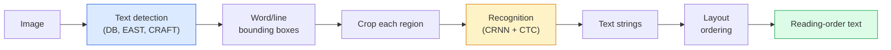

# OCR & Document Anlayışı OCR & Document Anlayışı

> OCR üç aşamalı bir boru hattıdır.

> **【中文解读】**OCR(光学字符识别) is three phase流水线:检测文本框 → 识别字符 → 布局分析。 modern OCR 系统将这些阶段重新排序或合并──文档理解不仅识别文字,还理解表格、图表、版面结构──

> **【拓展：文档理解的金融应用】**OCR ve dosya anlayışı finans alanında geniş bir şekilde uygulanmaktadır: banka akışı, çeklerin otomatik işlenmesi, sözleşme akıllı inceleme, mali raporlar analizleri, LayoutLM, Donut ve diğer modeller, video ve metin bilgisini birleştirir ve sonuna kadar dosya anlayışını gerçekleştirir.

**Type:** Learn + Use | **类型:** 学习 + 应用
**Languages:** Python | **语言:** Python
**Prerequisites:** Phase 4 Lesson 06 (Detection), Phase 7 Lesson 02 (Self-Attention) | **前置知识:** Phase 4 Lesson 06（目标检测），Phase 7 Lesson 02（自注意力）
**Time:** ~45 minutes | **时间:** ~45 分钟

## Öğrenme hedefleri

- Klasik OCR borusunu (detekte -> tanıma -> düzenleme) ve modern uçtan uç alternatiflerini (Donut, Qwen-VL-OCR) izle
- İlişkici Zamanlı Sınıflandırma (CTC) Kayıpları, OCR eğitiminin sırayla gerçekleşmesi için uygulanmalıdır
- Üretim belgeleri eğitimsiz analiz için PaddleOCR veya EasyOCR kullanın
- OCR, düzenleme analiz ve belge anlayışını ayırt edin  ve her görev için doğru aracı seçin

> **【中文解读】**Öğrenme hedefi, ders bitirilmesinden sonra öğrenilmesi gereken temel becerileri listeler.


## Sorunlar. Sorunlar.

Metinlerle dolu görüntüler her yerde bulunur: makbuzlar, faturalar, kimlik kimlikleri, tarama kitapları, formlar, beyaz levhalar, işaretler, ekran görüntüleri.

> 字符充满的图像无处不在:收据,发票,身份证,扫描书籍,表格,白板,标志,截图――den yapılandırılmış verileri almak sadece karakterler değil, "bu toplam miktar"  en yüksek değerli uygulama görsel sorunlarından biridir.

Bu alan üç beceri katmanına ayrılmıştır:

> Bu alan üç beceri seviyesine ayrılmıştır:

1. **OCR proper**: pikselleri metne dönüştürün.
2. **Layout parsing**: grup OCR çıkışı bölgelere (şefkat, çerçeve, tablo, başlık)
3. **Document understanding**: düzenlenmiş alanları ("invoice_total = $42.50") çıkarın.

Her katman klasik ve modern yaklaşımlara sahiptir ve "Bir resmeden metin istiyorum" ve "Bu makbuzdan toplam miktarı istiyorum" arasındaki boşluk çoğu ekip fark ettiğinden daha büyüktür.

> Her katılımcıda klasik ve modern yöntemler vardır. "Şekillerden yazıyı elde etmek istiyorum" ve "Bu toplam miktarı almam gerekiyor" arasındaki fark çoğu ekip fark ettiğinden daha büyüktür.

## Konsepten bir şey.

> **【中文解读】**Bu bölümde temel kavramlar ve teoriler hakkında konuşuluyor. Bu kavramları öğrenmek, sonradan gerçekleştirilme önemi, aynı zamanda, görüşmeler ve mühendislik uygulamalarında yüksek sıklıkta yapılan incelemelerin bilgi noktasıdır.


### Klasik boru hattı



- **Text detection**Satır başına veya kelime başına dörtgenler üretir.
  Çeviri:**文本检测**Çevre şeklinde bir çerçeve oluşturur.
- **Recognition**her bölgeyi sabit bir yüksekliğe çıkarır, bir karakter dizisini oluşturmak için CNN + BiLSTM + CTC çalıştırır.
  Çeviri:**识别**Her bölgeyi sabit bir yüksekliğe keserek CNN + BiLSTM + CTC oluşturmak için bir karakter dizisi oluşturun.
- **Layout**okuma sırasını yeniden oluşturur (Latin için yukarıdan aşağıya, soldan sağa; Arapça için farklı, Japonca için).
  Çeviri:**布局**重建阅读顺序(Latin文从上到下、从左到右;Arabic文和日文不同)

### Tek paragrafdaki CTC

OCR tanıma, sabit uzunluklu bir özellik haritasından değişken uzunluklı bir dizini üretir. CTC (Graves et al., 2006) karakter düzeyde bir uyumsuzluk olmadan bunu eğitmenizi sağlar. Model her zaman adımında bir dağılım (sözlü + boş) çıkarır; CTC kaybı, tekrarları birleştirdikten ve boşlukları kaldırduktan sonra hedef metine indirgen tüm birimleri kenara çıkarır.

> OCR  tanımlama sabit uzunluk özelliklerinden çizim oluşturur değişen uzunluk serisi──CTC(Graves et.,2006) size hiç karakter seviyesinin tamamlanması için yeterli eğitim sağlar.

```
raw output: "h h h _ _ e e l l _ l l o _ _"
after merge repeats and remove blanks: "hello"
```

CTC, CRNN'in 2015 yılında çalışmasının ve hala 2026'da üretilen çoğu OCR modeli eğitmesinin nedeni.

> CTC, 2015 yılında CRNN'de geçerli olan ve 2026 yılında da OCR modellerinin üretilmesinin nedenlerinden birçoğunun eğitimini sürdürdüğü bir ülkedir.

### Modern uçtan uç modelleri

- **Donut**(Kim et al., 2022)  bir ViT kodlayıcı + bir metin dekodörü; bir görüntü okuyor ve doğrudan JSON yayar.
  Çeviri:**Donut**(Kim 等,2022) ViT 编码器 + 文本解码器;读取图像直接输出 JSON──无需文本检测器或布局模块──
- **TrOCR** ViT + transformatör decoder, çizgi seviyesindeki OCR.
  Çeviri:**TrOCR**ViT + Transformer 解码器, 行级 OCR için kullanılır。
- **Qwen-VL-OCR / InternVL** OCR görevleri için ince ayarlanmış tam görme dil modelleri; karmaşık belgeler üzerinde 2026 yılında en iyi doğruluk.
  Çeviri:**Qwen-VL-OCR / InternVL** OCR  görevleri için 微调的完整视觉语言模型;2026 yıl içinde karmaşık dosyalarda en yüksek hassasiyet
- **PaddleOCR** Klasik DB + CRNN boru hattı olgun bir üretim paketi; hala açık kaynaklı iş atı.
  Çeviri:**PaddleOCR**成熟生产包中的经典 DB + CRNN 流水线; hâlâ açık kaynaklı

Sonundan sonuna kadarki modeller daha fazla veri ve hesaplama gerektiriyor ancak çok aşamalı boru hattlarının hata birikimini atlatıyor.

> Son model daha fazla veri ve hesaplama gerektiriyor, ancak çok aşamalı akış hatası birikimi atladı.

### Yapılandırma analizleri

Yapılandırılmış belgeler için her bölgeyi etiketleyen bir düzenleme dedektörü (LayoutLMv3, DocLayNet) çalıştırın: Başlık, Paragraf, Şekil, Tablo, Ayağa Not. Okumak sırası daha sonra "örnekler boyunca düzenlemede tekrarlanır, bir zincir".

> 对于结构化文档,运行布局检测器(LayoutLMv3、DocLayNet) 标记每个区域:标题、段落、图、表、脚注。阅读顺序变成"布局顺序遍历区域,拼接"──

Formular için kullan **Key-Value extraction**Modeller (görünen zengin belgeler için donut, düz taramalar için LayoutLMv3) görüntü + tespit edilen metin + konumları alır ve yapılandırılmış anahtar-değer çiftlerini tahmin eder.

> 对于表单,使用**键值提取**模型(视觉丰富文档用 Donut,普通扫描用 LayoutLMv3)。 bunlar görüntü + 检测到的文本 + 位置,预测结构化的键值对──

### Değerlendirme ölçümleri

- **Character Error Rate (CER)** Levenshtein mesafe / referans uzunluğu. Daha düşük daha iyi. Üretim hedefi: temiz taramalarda < 2%
  Çeviri:**字符错误率（CER）**编辑距离 / 参考文本长度──越低越好──生产目标:清晰扫描上<2%──
- **Word Error Rate (WER)** kelime seviyesinde aynı.
  Çeviri:**词错误率（WER）**词级的同样标标――
- **F1 on structured fields** Ana değerli görevler için;`{invoice_total: 42.50}`Doğru görünüyor.
  Çeviri:**结构化字段 F1**Keyvalue tâşının göstergesi; ölçüm `{invoice_total: 42.50}`Evet, evet.
- **Edit distance on JSON** sonundan sonuna kadar belge analizleri için; Donut kağıdı, standart ağaç düzenleme mesafesini tanıttı.
  Çeviri:**JSON 编辑距离**端到端文档解析的指标;Donut 论文引入归一化树编辑距离──

> **【中文解读】**Bu bölüm kodla sıfırdan gerçekleştirilen çekirdek algoritmasıdır. Bu "sıfırdan" yöntem çerçevenin arkasındaki prensipleri anlama yardımcı olur.

> **【拓展：工业部署中的视觉系统】**Gerçek endüstriye dağıtımında, görsel modeller gecikme, model büyüklüğü, kenar cihazların uyumlu olması gibi sorunları düşünmelidir. TensorRT, ONNX Runtime, OpenVINO, yaygın olarak kullanılan bir görsel model hızlandırma aracıdır.

> **【拓展：数据标注与质量】**视觉任务的效果高度依赖标签数据质――Label Studio、CVAT is the mainstream tagging tool――在工业场景中,主动学习(Active Learning) 标签成本ı azaltabilir:模型对不确定的样本请求人工标签,确定性的样本自动标签──


## Yapın.
```figure
cv3-ctc-collapse
```

## Yapın

### Adım 1: CTC kaybı + açgözlü dekodör

```python
import torch
import torch.nn as nn
import torch.nn.functional as F


def ctc_loss(log_probs, targets, input_lengths, target_lengths, blank=0):
    """
    log_probs:      (T, N, C) log-softmax over vocab including blank at index 0
    targets:        (N, S) int targets (no blanks)
    input_lengths:  (N,) per-sample time steps used
    target_lengths: (N,) per-sample target length
    """
    return F.ctc_loss(log_probs, targets, input_lengths, target_lengths,
                      blank=blank, reduction="mean", zero_infinity=True)


def greedy_ctc_decode(log_probs, blank=0):
    """
    log_probs: (T, N, C) log-softmax
    returns: list of index sequences (blanks removed, repeats merged)
    """
    preds = log_probs.argmax(dim=-1).transpose(0, 1).cpu().tolist()
    out = []
    for seq in preds:
        decoded = []
        prev = None
        for idx in seq:
            if idx != prev and idx != blank:
                decoded.append(idx)
            prev = idx
        out.append(decoded)
    return out
```

`F.ctc_loss`Bu açgözlülükle decoder, bir ışın araması ile daha basit ve genellikle %1 CER'nin içinde.

> `F.ctc_loss`Kullanılabilir zamanlarda yüksek verimlilikli CuDNN 实现───                                                                                                                                                                                                                                                      

### Adım 2: Küçük CRNN tanıtıcısı

Satır OCR için en az CNN + BiLSTM.

> OCR'nin en küçük CNN + BiLSTM kullanmak için kullanılmıştır.

```python
class TinyCRNN(nn.Module):
    def __init__(self, vocab_size=40, hidden=128, feat=32):
        super().__init__()
        self.cnn = nn.Sequential(
            nn.Conv2d(1, feat, 3, 1, 1), nn.BatchNorm2d(feat), nn.ReLU(inplace=True),
            nn.MaxPool2d(2),
            nn.Conv2d(feat, feat * 2, 3, 1, 1), nn.BatchNorm2d(feat * 2), nn.ReLU(inplace=True),
            nn.MaxPool2d(2),
            nn.Conv2d(feat * 2, feat * 4, 3, 1, 1), nn.BatchNorm2d(feat * 4), nn.ReLU(inplace=True),
            nn.MaxPool2d((2, 1)),
            nn.Conv2d(feat * 4, feat * 4, 3, 1, 1), nn.BatchNorm2d(feat * 4), nn.ReLU(inplace=True),
            nn.MaxPool2d((2, 1)),
        )
        self.rnn = nn.LSTM(feat * 4, hidden, bidirectional=True, batch_first=True)
        self.head = nn.Linear(hidden * 2, vocab_size)

    def forward(self, x):
        # x: (N, 1, H, W)
        f = self.cnn(x)                # (N, C, H', W')
        f = f.mean(dim=2).transpose(1, 2)  # (N, W', C)
        h, _ = self.rnn(f)
        return F.log_softmax(self.head(h).transpose(0, 1), dim=-1)  # (W', N, vocab)
```

Sıkı yükseklik girimi (CNN maksimum yüksekliği 1'e kadar belirler). Genişlik, CTC için zaman boyutudur.

> 固定高度输入 (CNN)                                                                                                                                                                                                                                                           

### Adım 3: Sentetik OCR

Sonundan sonuna duman testi için siyah beyaz parmaklık iplerini oluşturun.

> 生成白底黑字符串, uçtan uçta duman test için kullanılır

```python
import numpy as np

def synthetic_line(text, height=32, char_width=16):
    W = char_width * len(text)
    img = np.ones((height, W), dtype=np.float32)
    for i, c in enumerate(text):
        x = i * char_width
        shade = 0.0 if c.isalnum() else 0.5
        img[6:height - 6, x + 2:x + char_width - 2] = shade
    return img


def build_batch(strings, vocab):
    H = 32
    W = 16 * max(len(s) for s in strings)
    imgs = np.ones((len(strings), 1, H, W), dtype=np.float32)
    target_lengths = []
    targets = []
    for i, s in enumerate(strings):
        imgs[i, 0, :, :16 * len(s)] = synthetic_line(s)
        ids = [vocab.index(c) for c in s]
        targets.extend(ids)
        target_lengths.append(len(ids))
    return torch.from_numpy(imgs), torch.tensor(targets), torch.tensor(target_lengths)


vocab = ["_"] + list("0123456789abcdefghijklmnopqrstuvwxyz")
imgs, targets, lengths = build_batch(["hello", "world"], vocab)
print(f"images: {imgs.shape}   targets: {targets.shape}   lengths: {lengths.tolist()}")
```

Gerçek bir OCR veri kümesi şriftleri, gürültü, dönüm, bulanıklık ve renk ekler. Yukarıdaki boru hattı aynıdır.

> Gerçek OCR verileri toplanarak yazı tipi, ses, dönüm, kalıp ve renk artıyor.

### 4. Adım: Eğitim çizelgesi

```python
model = TinyCRNN(vocab_size=len(vocab))
opt = torch.optim.Adam(model.parameters(), lr=1e-3)

for step in range(200):
    strings = ["abc" + str(step % 10)] * 4 + ["xyz" + str((step + 1) % 10)] * 4
    imgs, targets, target_lens = build_batch(strings, vocab)
    log_probs = model(imgs)  # (W', 8, vocab)
    input_lens = torch.full((8,), log_probs.size(0), dtype=torch.long)
    loss = ctc_loss(log_probs, targets, input_lens, target_lens, blank=0)
    opt.zero_grad(); loss.backward(); opt.step()
```

> **【中文解读】**Bu bölümde, PyTorch, HuggingFace gibi olgun çerçeveler nasıl kullanılacağını gösterir.


Bu önemsiz sentetik veriler üzerinde 200 adımdan ~3'den ~0.2'ye düşmek gerekir.

> Bu basit yapım verilerine göre, 200 adımlık kayıp yaklaşık 3'den yaklaşık 0,2'ye düşmüştür.


> **【拓展：视觉模型的持续学习】**Üretim ortamında, görsel modeller yeni verilere sürekli uyum sağlamak gerekir. Yeni ürünler, yeni sahne, yeni ışık koşulları. Sürekli öğrenme. Sürekli öğrenme.

## Çerçeveyi kullanın.

Üç üretim yolu:

- **PaddleOCR** olgun, hızlı, çok dilli.`paddleocr.PaddleOCR(lang="en").ocr(image_path)`- Evet .
- **EasyOCR**Python-devli, çok dilli, PyTorch omurgası.
- **Tesseract** klasik; hala eski tarayılan belgeler için kullanışlı modeller mücadele ederken.

Sonundan sonuna kadar belge analizleri için Donut veya VLM kullanın:

```python
from transformers import DonutProcessor, VisionEncoderDecoderModel

processor = DonutProcessor.from_pretrained("naver-clova-ix/donut-base-finetuned-cord-v2")
model = VisionEncoderDecoderModel.from_pretrained("naver-clova-ix/donut-base-finetuned-cord-v2")
```

> **【中文解读】**Bu bölümde modellerin kullanılabilir ürünler için nasıl dağıtılacağı üzerinde yoğunlaşmaktadır.


Kitsler, faturalar ve tekrarlanabilir yapısı olan formlar için Donut'u ince ayarlayın. Bilinmeyen belgeler veya nedenlerle OCR için, Qwen-VL-OCR gibi bir VLM geçerli varsayımdır.


## İndirin . Ürünler .

> **【中文解读】**练习题按照易/中级/难三度递进;;建议至少完成中级题,Hard级适合深入研究或面试准备;;


Bu ders şunları ortaya çıkarır:

- `outputs/prompt-ocr-stack-picker.md` Tesseract / PaddleOCR / Donut / VLM-OCR'i belirtilen belge türünü, dili ve yapısını seçen bir istek.
- `outputs/skill-ctc-decoder.md` uzunluk normallendirme dahil açgözlülük ve ışın araması CTC decoders sıfırdan yazma becerisi.

## Egzersizler.

> **【中文解读】**术语表中的"İnsanların ne dediği" vs "Gerçekten ne anlama geldiği" 区分日常口语和精确技术含义──在团队协作中,统一术语定义可以避免大量沟通误解──


1. **(Easy)**TinyCRNN'i 500 adım boyunca 5 rakamlı rastgele sayısal iplere uygulayın.
2. **(Medium)**Açgözlü çözümü ışın araması ile değiştirin (beam_width=5). CER delta raporunu gönderin.
3. **(Hard)**20 risit, çizgi öğeleri çıkarmak ve {item_name, price} çiftleri için el etiketli zemin gerçeği karşı F1 hesaplamak için PaddleOCR kullanın.

## Anahtar Şartlar .

| Term | What people say | What it actually means |
|------|----------------|----------------------|
| OCR | "Text from pixels" | Turning image regions into character sequences |
| CTC | "Alignment-free loss" | Loss that trains a sequence model without per-timestep labels; marginalises over alignments |
| CRNN | "Classic OCR model" | Conv feature extractor + BiLSTM + CTC; the 2015 baseline still used in production |
| Donut | "End-to-end OCR" | ViT encoder + text decoder; emits JSON directly from image |
| Layout parsing | "Find regions" | Detect and label Title/Table/Figure/Paragraph regions in a document |
| Reading order | "Text sequence" | Ordering of recognised regions into a sentence; trivial for Latin, non-trivial for mixed layouts |
| CER / WER | "Error rates" | Levenshtein distance / reference length at character or word granularity |
| VLM-OCR | "LLM that reads" | A vision-language model trained or prompted for OCR tasks; current SOTA on complex documents |

> **【中文解读】**延伸阅读, derinlemesine öğrenme için yüksek kaliteli kaynaklar sağladı. Bu makaleler ve dersler, derinlemesine anlama ihtiyacı olan okuyuculara uygun olarak bu alanın klasik referanslarıdır.


## Daha fazla okumak

- [CRNN (Shi et al., 2015)](https://arxiv.org/abs/1507.05717) orijinal CNN+RNN+CTC mimarisi
- [CTC (Graves et al., 2006)](https://www.cs.toronto.edu/~graves/icml_2006.pdf) orijinal CTC kağıdı; algoritmik fikirlerle yoğun bir şekilde doldurulmuş
- [Donut (Kim et al., 2022)](https://arxiv.org/abs/2111.15664) OCR'den uzak bir belge anlayış transformörü
- [PaddleOCR](https://github.com/PaddlePaddle/PaddleOCR) açık kaynaklı üretim OCR yığın
