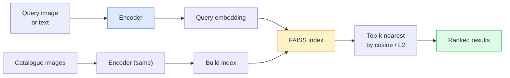

# Resim Alım ve Metrik Öğrenim.

> Bir çekim sistemi, adayları yerleşim alanında mesafe ile sıralar. Metrik öğrenme, bu alanı şekillendirmenin disiplini, böylece mesafeler istediğiniz şeyi ifade eder.

> **【中文解读】**检索系统 嵌入空间中的距离对候选图像排序──量学习就是塑造这个空间,使距离反映你想要的语义关系相似图像接近,不相似图像离远──对比损失 (相反损失) 和三元组损失 (三元组损失) 是核心方法──

> **【拓展：检索系统的应用】**E图搜图(Google Images、淘宝拍照搜) 、人脸识别(FaceNet) 、推系统(Pinterest) hepsi ölçüm öğrenmeye bağlıdır。CLIP'in karşılaştırma önceden eğitimin doğası da ölçüm öğrenme biçimidir。

**Type:** Build | **类型:** 动手
**Languages:** Python | **语言:** Python
**Prerequisites:** Phase 4 Lesson 14 (ViT), Phase 4 Lesson 18 (CLIP) | **前置知识:** Phase 4 Lesson 14（ViT），Phase 4 Lesson 18（CLIP）
**Time:** ~45 minutes | **时间:** ~45 分钟

## Öğrenme hedefleri

- Üçlü, kontrastlı ve vekili tabanlı metrik öğrenme kaybını açıklayın ve verilen bir veri kümesi için doğru olanı seçin
- L2 normallaşımı ve kozin benzerliği doğru bir şekilde uygulayacak ve "aynı madde" ve "aynı sınıf" geri alım arasındaki farkı denetleyecektir.
- FAISS indeksini oluşturun, metin ve resim ile sorgulayın ve beklenmiş sorgu kümesi için recall@K raporlayın
- DINOv2, CLIP ve SigLIP'i raf dışı omurgan olarak kullanın ve her birinin ne zaman kazandığını bilin

> **【中文解读】**Öğrenme hedefi, ders bitirilmesinden sonra öğrenilmesi gereken temel becerileri listeler.


## Sorunlar. Sorunlar.

İsteğe bağlı olarak, bu görüntüde, "Bu sorgu görüntüsünü göz önüne alarak, kataloğumu sıralayın".

> 检索在生产视觉中无处不在:重复检测、反向图像搜索、视觉搜索("寻找相似产品") 的人脸重识别、监管人员重识别、电商实例级匹配──产品问题总是相同:"给定这张查询图像,对我的目录排序──"

İki tasarım kararı tüm sistemi şekillendirir. Ekleme  hangi model vektörleri üretir. İndeks  ölçekte en yakın komşuları nasıl bulursunuz. Her ikisi de 2026'da malzeme (ekleme için DINOv2, indeks için FAISS), bu da çubuğu yükseltir: zor kısmı uygulamanız için * benzer olarak sayılan * neyi tanımlamak, ardından ekleme alanını şekillendirmeyi uzaklıkların eşleşmesini sağlar.

> 两个设计决策塑造整个系统――嵌入什么模型产生向量――索引如何大规模找到近邻――两者都是商品(DINOv2嵌入用,FAISS索引用), bu da standartları yükseltti:困难的部分是为您的应用定义*什么算相似*,然后塑造嵌入空间使距离匹配――

Bu şekillendirme, ölçülü öğrenme. Küçük ama yüksek dereceli bir disiplin.

> O biçim biçimlendirme ölçülü öğrenme biçimidir.

## Konsepten bir şey.

> **【中文解读】**Bu bölümde temel kavramlar ve teoriler hakkında konuşuluyor. Bu kavramları öğrenmek, sonradan gerçekleştirilme önemi, aynı zamanda, görüşmeler ve mühendislik uygulamalarında yüksek sıklıkta yapılan incelemelerin bilgi noktasıdır.


### Bir bakışta bir çıkış



### Dört kaybeden aile

| Loss | Requires | Pros | Cons |
|------|----------|------|------|
| **Contrastive** | (anchor, positive) + negatives | Simple, works with any pair label | Slow to converge without many negatives |
| **Triplet** | (anchor, positive, negative) | Intuitive; direct margin control | Hard-triplet mining is expensive |
| **NT-Xent / InfoNCE** | Pairs + batch-mined negatives | Scales to large batches | Needs big batch or momentum queue |
| **Proxy-based (ProxyNCA)** | Class labels only | Fast, stable, no mining | Can overfit to proxies on small datasets |

Çoğu üretim kullanım vakaları için, önceden eğitilmiş bir omurganla başlayın ve test setinizde raf dışı gömülmeler düşük performans gösterirse metrik öğrenme ince ayarını ekleyin.

>  Çoğu üretim sahnesinde, önceden eğitim kemik ağından başlayarak, sadece hazırda test kitlesinde yerleştirilen performansın kötü olduğu zaman, ölçüm öğrenme biçimlerini artırmak için.

### Üçlü kayıp resmi olarak

```
L = max(0, ||f(a) - f(p)||^2 - ||f(a) - f(n)||^2 + margin)
```

Ankarı çek .`a`- Evet .`p`, negatifden uzaklaştır .`n`, bir `margin`Üç görüntü yapısı, herhangi bir benzerlik düzenlemesine genel hale gelir.

> - Ben de .`a`拉近正样本 `p`, 推远负样本 `n`, `margin`确保间隔──三图像结构可推广到任何相似度排序──

Madencilik: kolay üçlü (`n`Çok uzakta .`a`) sıfır kaybı katkıda bulunur; ağı sadece sert üçlüler öğretir.`n``p`2016 FaceNet tarifi ve hala hakim.

> 挖掘很重要:简单三元组`n`已远离 `a`% % % % % % % % % % % % % % % % % % % % % % % % % % % % % % % % % % % % % % % % % % % % % % % % % % % % % % % % % % % % % % % % % % % % % % % % % % % % % % % % % % % % % % % % % % % % % % % % % % % % % % % % % % % % % % % % % % % % % % % % % % % % % % % % % % % % % % % % % % % % % % % % % % % % % % % % % % % % % % % % % % % % % % % % % % % % % % % % % % % % % % % % % % % % % % % % % % % % % % % % % % % % % % % % % % % % % % % % % % % % % % % % % % % % % % % % % % % % % % % % % % % % % % % % % % % % % % % % % % % % % % % % % % % % % % % % % % % % % % % % % % % % % % % % % % % % % % % % % % % % % % % % % % % % % % % % % % % % % % % % % % % % % % % % % % % % % % % % % % % % % % % % % % % % % % % % % % % % % % % % % % % % % % % % % % % % % % % % % % % % % % % % % % % % % % % % % % % % % % % % % % % % % % % % % % % % % % % % % % % % % % % % % % % % % % % % % % % % % % % % % % % % % % % % % % % % % % % % % % % % % % % % % % % % % % % % % % % % % % % % % % % % % % % % % % % % % % % % % % % % % % % % % % % % % %`n`- Hayır .`p`远但在边缘内) 2016 yılında FaceNet'in bir programı, bugüne kadar hâlâ baskın konumdadır.

### Cosine benzerliği vs L2

İki ölçüm, iki sözleşme:

> İki çeşit ölçüm, iki çeşit düzen:

- **Cosine**L2 normallaştırılmış yerleşimler gerektirir.
  Çeviri:**余弦**L2 归一化的嵌入──
- **L2**: Euclidean mesafe. Çöm veya normalleştirilmiş yerleşimlerde çalışır, ancak genellikle L2-normalleştirilmiş + kare L2 ile eşleştirilmektedir.
  Çeviri:**L2**: 欧氏距離── orijinal veya 归化嵌入 için uygundur, ancak genellikle L2 归化 + 平方 L2 配对使用──

Çoğu modern ağ için ikisi eşittir: `||a - b||^2 = 2 - 2 cos(a, b)`Ne zaman ?`||a|| = ||b|| = 1`-Embedding eğitimine uygun bir konferans seçin; onları sessizce karıştırmak "en yakın" anlamına gelen şeyi değiştirir.

> 对于大多数现代网络,两者等价:当 `||a|| = ||b|| = 1`时,`||a - b||^2 = 2 - 2 cos(a, b)`❖ Seçim ve yerleştirme eğitimine uygun bir düzenleme;混用会静默改变"近"的含义──

### Hatırlat @ K

Standart geri alma metrikası:

```
recall@K = fraction of queries where at least one correct match is in the top K results
```

Rapor hatırlatma@1, @5, @10 yan yana. 0.95'in üzerinde hatırlatma@10 ve 0.5'in altında hatırlatma@1 yerleştirme alanının doğru yapısına sahip olduğu anlamına gelir, ancak sıralama gürültülü  daha uzun ince tonlar veya yeniden sıralama adımlarını deneyin.

> Not: Not: Not: Not: Not: Not: Not: Not: Not: Not: Not: Not: Not: Not: Not: Not: Not: Not: Not: Not: Not: Not: Not: Not: Not: Not: Not: Not: Not: Not: Not: Not: Not: Not: Not: Not: Not: Not: Not: Not: Not: Not: Not: Not: Not: Not: Not: Not: Not: Not: Not: Not: Not: Not: Not: Not: Not: Not: Not: Not: Not: Not: Not: Not: Not: Not: Not: Not: Not: Not: Not: Not: Not: Not: Not: Not: Not: Not: Not: Not: Not: Not: Not: Not: Not: Not: Not: Not: Not: Not: Not: Not: Not: Not: Not: Not: Not: Not: Not: Not: Not: Not: Not: Not: Not: Not: Not: Not: Not: Not: Not: Not: Not: Not: Not: Not: Not: Not: Not: Not: Not: Not: Not: Not: Not: Not: Not: Not: Not: Not: Not: Not: Not: Not: Not: Not: Not: Not: Not: Not: Not: Not: Not: Not: Not: Not: Not: Not: Not: Not: Not: Not: Not: Not: Not: Not: Not: Not: Not: Not: Not: Not: Not: Not: Not: Not: Not: Not: Not: Not: Not: Not: Not: Not: Not: Not: Not: Not: Not: Not: Not: Not: Not: Not: Not: Not: Not: Not: Not: Not: Not: Not: Not: Not: Not: Not: Not: Not: Not: Not: Not: Not: Not: Not: Not: Not: Not: Not: Not: Not: Not: Not: Not: Not: Not: Not: Not: Not: Not: Not: Not: Not: Not: Not: Not: Not: Not: Not: Not: Not: Not: Not: Not: Not: Not: Not: Not: Not: Not: Not: Not: Not: Not: Not: Not: Not: Not: Not: Not: Not: Not: Not: Not: Not: Not:

Çift tespit için, doğruluk@K daha önemlidir çünkü her yanlış pozitif kullanıcı tarafından görünür bir hatadır. Görsel arama için, hatırlatmak@K ürün sinyalidır.

> 对于重复检测,precision@K 更重要,因为每个假阳性都是用户可见的错误――对视觉搜索,recall@K 是产品信号――

### FAISS tek bir paragraf

Facebook AI benzerlik Arama. En yakın komşu araması için gerçek kütüphanesi. Üç indeks seçeneği:

> Facebook AI benzerlik aramaları.

- `IndexFlatIP`- Ne ?`IndexFlatL2`- Kötü güç, tam, eğitim yok. ~ 1M vektörlere kadar kullan.
  Çeviri:`IndexFlatIP`- Ne ?`IndexFlatL2` Şiddetli arama, kesin, gereksiz eğitim.
- `IndexIVFFlat`K hücrelerine bölün, sadece en yakın birkaç hücreyi arayın. Yaklaşık, hızlı, eğitim verilerine ihtiyaç vardır.
  Çeviri:`IndexIVFFlat`K 个单元, sadece son birkaç单元を検索します──近似、快速,需要訓練データ──
- `IndexHNSW` Grafik tabanlı, birçok sorgu için en hızlı, büyük indeks boyutu.
  Çeviri:`IndexHNSW` Şekil üzerine, çok soru soruldu, en hızlı, indeks büyük küçük büyük

100 bin vektör için muhtemelen isteyeceksin .`IndexFlatIP`10M için istediğiniz şey`IndexIVFFlat`. 100M+ ile birlikte ürün miktarı (`IndexIVFPQ`)

> 100.000 ′′`IndexFlatIP`余弦相似度即可──1000万用 `IndexIVFFlat`❖ 1 milyar veya daha fazla `IndexIVFPQ`)。

### Durum seviyesinde ve kategoride geri alınma

Aynı isimle iki farklı sorun var:

> Aynı ama çok farklı sorunlar:

- **Category-level** "katalogumda kedileri bul". Sınıf koşulları benzerliği; raf dışı CLIP / DINOv2 yerleşimleri iyi çalışır.
  Çeviri:**类别级**"在我的目录中找猫"──类别条件相似度;现成的 CLIP / DINOv2 嵌入即可──
- **Instance-level** "katalogumda *bu tam ürünü bul". Aynı sınıfın görsel olarak benzer nesneler arasında ince ayrımcılığa ihtiyaç duyulur; raf dışı gömülmeler düşük performans gösterir; metrik öğrenme konularında ince ayarlama yapılır.
  Çeviri:**实例级**"Bu özel ürünü benim katalogumda bul""""""""""""""""""""""""""""""""""""""""""""""""""""""""""""""""""""""""""""""""""""""""""""""""""""""""""""""""""""""""""""""""""""""""""""""""""""""""""""""""""""""""""""""""""""""""""""""""""""""""""""""""""""""""""""""""""""""""""""""""""""""""""

Her zaman bir model seçmeden önce hangisini çözmeye çalıştığını sor.

> Seçim modelinden önce, hangi sorunu çözmekte olduğunuzu açıkça sormalısınız.

> **【中文解读】**Bu bölüm kodla sıfırdan gerçekleştirilen çekirdek algoritmasıdır. Bu "sıfırdan" yöntem çerçevenin arkasındaki prensipleri anlama yardımcı olur.

> **【拓展：工业部署中的视觉系统】**Gerçek endüstriye dağıtımında, görsel modeller gecikme, model büyüklüğü, kenar cihazların uyumlu olması gibi sorunları düşünmelidir. TensorRT, ONNX Runtime, OpenVINO, yaygın olarak kullanılan bir görsel model hızlandırma aracıdır.

> **【拓展：数据标注与质量】**视觉任务的效果高度依赖标签数据质――Label Studio、CVAT is the mainstream tagging tool――在工业场景中,主动学习(Active Learning) 标签成本ı azaltabilir:模型对不确定的样本请求人工标签,确定性的样本自动标签──


## Yapın.
```figure
metric-embedding
```

## Yapın

### Adım 1: Üçlü kayıp

```python
import torch
import torch.nn.functional as F

def triplet_loss(anchor, positive, negative, margin=0.2):
    d_ap = F.pairwise_distance(anchor, positive, p=2)
    d_an = F.pairwise_distance(anchor, negative, p=2)
    return F.relu(d_ap - d_an + margin).mean()
```

L2 standartlaştırılmış veya ham gömülmeler üzerinde çalışır.

> Birçe kod. L2 归一化或原始嵌入 हेतु适用.

### İkinci adım: Yarım sert madencilik

Bir sürü yerleşim ve etiket verildiğinde, her bir demir için en sert yarı sert negatif bul.

>                                                                                                                                                                                                                                                               

```python
def semi_hard_negatives(emb, labels, margin=0.2):
    dist = torch.cdist(emb, emb)
    same_class = labels[:, None] == labels[None, :]
    diff_class = ~same_class
    N = emb.size(0)

    positives = dist.clone()
    positives[~same_class] = float("-inf")
    positives.fill_diagonal_(float("-inf"))
    pos_idx = positives.argmax(dim=1)

    semi_hard = dist.clone()
    semi_hard[same_class] = float("inf")
    d_ap = dist[torch.arange(N), pos_idx].unsqueeze(1)
    semi_hard[dist <= d_ap] = float("inf")
    neg_idx = semi_hard.argmin(dim=1)

    fallback_mask = semi_hard[torch.arange(N), neg_idx] == float("inf")
    if fallback_mask.any():
        hardest = dist.clone()
        hardest[same_class] = float("inf")
        neg_idx = torch.where(fallback_mask, hardest.argmin(dim=1), neg_idx)
    return pos_idx, neg_idx
```

Her demir sınıfındaki en sert olumlu ve olumlu'dan daha uzak ama kenarlıkta olan yarı sert bir negatif elde eder.

> Her  puanı aynı sınıfın en zor gerçek örneklerini ve bir gerçek örnekten uzak ama marj içinde yarım zor negatif örnekleri elde etmek için kullanır.

### Adım 3: Hatırlat

```python
def recall_at_k(query_emb, gallery_emb, query_labels, gallery_labels, k=1):
    sim = query_emb @ gallery_emb.T
    _, top_k = sim.topk(k, dim=-1)
    matches = (gallery_labels[top_k] == query_labels[:, None]).any(dim=-1)
    return matches.float().mean().item()
```

L2 normalleştirilmiş yerleşimlerde iç ürünün üst-k, cosine üst-k'e eşit. En az bir doğru komşu ile sorguların ortalama oranını bildirin.

> L2 归结嵌入内积 top-k等于余弦 top-k―― rapor en az bir doğru komşu sorgu ortalama oranı vardır―

### Dördüncü adım: Bir araya getirmek

```python
import torch
import torch.nn as nn
from torch.optim import Adam

class Encoder(nn.Module):
    def __init__(self, in_dim=128, emb_dim=64):
        super().__init__()
        self.net = nn.Sequential(
            nn.Linear(in_dim, 128), nn.ReLU(),
            nn.Linear(128, emb_dim),
        )

    def forward(self, x):
        return F.normalize(self.net(x), dim=-1)

torch.manual_seed(0)
num_classes = 6
protos = F.normalize(torch.randn(num_classes, 128), dim=-1)

def sample_batch(bs=32):
    labels = torch.randint(0, num_classes, (bs,))
    x = protos[labels] + 0.15 * torch.randn(bs, 128)
    return x, labels

enc = Encoder()
opt = Adam(enc.parameters(), lr=3e-3)

for step in range(200):
    x, y = sample_batch(32)
    emb = enc(x)
    pos_idx, neg_idx = semi_hard_negatives(emb, y)
    loss = triplet_loss(emb, emb[pos_idx], emb[neg_idx])
    opt.zero_grad(); loss.backward(); opt.step()
```

> **【中文解读】**Bu bölümde, PyTorch, HuggingFace gibi olgun çerçeveler nasıl kullanılacağını gösterir.


Birkaç yüz adımdan sonra yerleştirme kümeleri her sınıf için bir kümesi oluşturur.

> Birkaç yüz adım sonra, her sınıfı bir ── oluşturmak için bir araya gelmek.


> **【拓展：视觉模型的持续学习】**Üretim ortamında, görsel modeller yeni verilere sürekli uyum sağlamak gerekir. Yeni ürünler, yeni sahne, yeni ışık koşulları. Sürekli öğrenme. Sürekli öğrenme.

## Çerçeveyi kullanın.

2026'da üretim aşamaları:

- **DINOv2 + FAISS**Genel amaçlı görsel çekim.
- **CLIP + FAISS** sorular mesaj olarak gönderildiğinde.
- **Fine-tuned DINOv2 + FAISS** örnek düzeyde geri alım, yüz yeniden tanımlama, moda, e-ticaret.
- **Milvus / Weaviate / Qdrant** FAISS veya HNSW etrafında yönetilen vektör DB ambalajları.

> **【中文解读】**Bu bölümde modellerin kullanılabilir ürünler için nasıl dağıtılacağı üzerinde yoğunlaşmaktadır.


SOTA örnek kurtarma için reçete: DINOv2 omurgası, ekleme başlığı, üçlü veya InfoNCE kaybı ile ekleme etiketlenmiş çiftler, FAISS'te indeks eklenir.


## İndirin . Ürünler .

> **【中文解读】**练习题按照易/中级/难三度递进;;建议至少完成中级题,Hard级适合深入研究或面试准备;;


Bu ders şunları ortaya çıkarır:

- `outputs/prompt-retrieval-loss-picker.md` belirli bir çekim sorunu için triplet / InfoNCE / ProxyNCA seçen bir istinta.
- `outputs/skill-recall-at-k-runner.md` bir yetenek, tren/val/galeriden ayrılmış ve uygun veri sözleşmesi ile recall@K için temiz bir değerlendirme harnesini yazıyor.

## Egzersizler.

1. **(Easy)**Yukarıdaki oyuncak örneğini çalıştırın.
2. **(Medium)**ProxyNCA kaybı uygulamasını ekleyin: sınıf başına bir "proxy" öğrenildi, kosinus benzerliği üzerinde standart çapraz entropi. Oyuncak verileri üzerinde üçlü kaybı karşılaştır.
3. **(Hard)**1000 ImageNet onay görüntülerini HuggingFace üzerinden DINOv2 ile gömün, FAISS düz bir indeks oluşturun ve sorulardaki aynı görüntülere (1.0 olmalıdır) ve ImageNet etiketleri ile yerle bir gerçek olarak ayrılmış bir bölüme karşı hatırlama@{1, 5, 10} rapor edin.

> **【中文解读】**术语表中的"İnsanların ne dediği" vs "Gerçekten ne anlama geldiği" 区分日常口语和精确技术含义──在团队协作中,统一术语定义可以避免大量沟通误解──


## Anahtar Şartlar .

| Term | What people say | What it actually means |
|------|----------------|----------------------|
| Metric learning | "Shape the space" | Training an encoder so distances in its output space reflect a target similarity |
| Triplet loss | "Pull and push" | L = max(0, d(a, p) - d(a, n) + margin); the canonical metric-learning loss |
| Semi-hard mining | "Useful negatives" | Negatives further from the anchor than the positive but within margin; empirically the most informative |
| Proxy-based loss | "Class prototypes" | One learned proxy per class; cross-entropy over similarity-to-proxies; no pair mining |
| Recall@K | "Top-K hit rate" | Fraction of queries with at least one correct result in the top K |
| Instance retrieval | "Find this exact thing" | Fine-grained matching; off-the-shelf features usually underperform |
| FAISS | "The NN library" | Facebook's nearest-neighbour library; supports exact and approximate indexes |
| HNSW | "Graph index" | Hierarchical navigable small world; fast approximate NN with small memory overhead |

> **【中文解读】**延伸阅读, derinlemesine öğrenme için yüksek kaliteli kaynaklar sağladı. Bu makaleler ve dersler, derinlemesine anlama ihtiyacı olan okuyuculara uygun olarak bu alanın klasik referanslarıdır.


## Daha fazla okumak

- [FaceNet: A Unified Embedding for Face Recognition (Schroff et al., 2015)](https://arxiv.org/abs/1503.03832) üçlü kayıp / yarı sert madencilik kağıdı
- [In Defense of the Triplet Loss for Person Re-Identification (Hermans et al., 2017)](https://arxiv.org/abs/1703.07737) Üçlü ince ayarlama için pratik rehber
- [FAISS documentation](https://github.com/facebookresearch/faiss/wiki) her endeks, her ticaret
- [SMoT: Metric Learning Taxonomy (Kim et al., 2021)](https://arxiv.org/abs/2010.06927) Modern kayıplar ve bağlantıları
