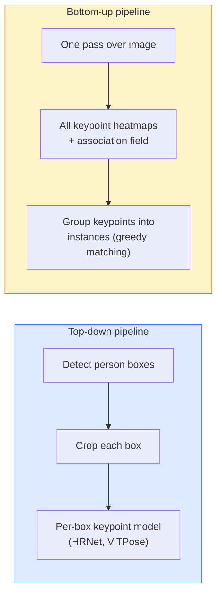

# Anahtar Nokta Deteksiyon ve Pozisyon Tahmini .

> Bir poz, sıralanmış anahtar noktaları bir dizi, bir anahtar nokta detektörü bir sıcaklık haritası geri dönüştürücüdür, diğer her şey muhasebe.

> **【中文解读】**姿态, 姿态, 姿态, 姿态, 姿态, 姿态, 姿态, 姿态, 姿态, 姿态, 姿态, 姿态, 姿态, 姿势, 姿势, 姿势, 姿势, 姿势, 姿势, 姿势, 姿势, 姿势, 姿势, 姿势, 姿势, 姿势, 姿势, 姿势, 姿势, 姿势, 姿势, 姿势, 姿势, 姿势, 姿势, 姿势, 姿势, 姿势, 姿势, 姿势, 姿势, 姿势, 姿势, 姿势, 姿势, 姿势, 姿势, 姿势, 姿势, 姿势, 姿势, 姿势, 姿, 姿, 姿, 姿, 姿, 姿, 姿, 姿, 姿, 姿, 姿, 姿, 姿, 姿, 姿, 姿, 姿, 姿, 姿, 姿, 姿, 姿, 姿, 姿, 姿, 姿, 姿, 姿, 姿, 姿, 姿, 姿, 姿, 姿, 姿, 姿, 姿, 姿, 姿, 姿, 姿, 姿, 姿, 姿, 姿, 姿, 姿, 姿, 姿,  姿, 姿,                                                                                                                                                    

> **【拓展：姿态估计的应用】**OpenPose、MediaPipe、YOLO-Pose is a common usage of gesture estimation tool── uygulama sahnesi:

**Type:** Build | **类型:** 动手
**Languages:** Python | **语言:** Python
**Prerequisites:** Phase 4 Lesson 06 (Detection), Phase 4 Lesson 07 (U-Net) | **前置知识:** Phase 4 Lesson 06（目标检测），Phase 4 Lesson 07（U-Net）
**Time:** ~45 minutes | **时间:** ~45 分钟

## Öğrenme hedefleri

- Yukarıdan aşağı ve altdan yukarı pozisyon tahminini ayırt edin ve her birinin ne zaman kullanıldığını belirtin
- K anahtar noktaları için regres sıcaklık haritaları, anahtar noktasına Gaussian hedef ve çıkarma keypoint koordinatları ile
- Bölüm Affinity Alanlarını (PAF) ve alt yukarı boru hattlarının anahtar noktaları örneklere nasıl bağladığını açıklayın
- Üretim anahtar noktasının tahmininde MediaPipe Pose veya MMPose kullanın ve çıkış formatlarını anlayın

> **【中文解读】**Öğrenme hedefi, ders bitirilmesinden sonra öğrenilmesi gereken temel becerileri listeler.


## Sorunlar. Sorunlar.

Ana nokta görevleri birçok isim altında saklanır: insan pozesi (17 vücut eklemleri), yüz simgesi (68 veya 478 puan), el (21 puan), hayvan pozesi, robot nesne pozesi, tıbbi anatomi simgesi.

> 关键点任务藏在许多名称下:人体姿态(17 个身体关节) 面部特征点(68 个点) 、手部(21 个点) 、动物姿态、机器人物体姿态、医学解剖标志── her birinin aynı yapısı vardır: denetim nesnesindeki K 个离散点并输出它们的 (x, y) 坐标──

Poz tahminleri hareket yakalama, fitness uygulamaları, spor analitiği, hareket kontrolü, animasyon, AR deneyi ve robotik yakalama temelini oluşturur. 2 boyutlu durum olgunlaşmıştır; 3 boyutlu poz (tek bir kamera ile dünya koordinatlarında ortak pozisyonların tahmin edilmesi) mevcut araştırma sınırıdır.

> 姿態估算是动作捕捉、健身應用、運動分析、手势控制、动画、AR 试穿和机器人抓取的基础──2D 情形已成熟;3D 姿態(单个相机估计世界坐标中的关节位置) 是当前研究前沿──

Tek görüntü, tek kişilik poz 20 ms bir problem. 30 fps'de kalabalıkta çok kişilik poz farklı mimarlıklarla farklı bir problem.

> 工程 sorunları boyutlardır. Tek görüntü, tek kişinin duruşu 20 ms'lik bir sorunlardır.

## Konsepten bir şey.

> **【中文解读】**Bu bölümde temel kavramlar ve teoriler hakkında konuşuluyor. Bu kavramları öğrenmek, sonradan gerçekleştirilme önemi, aynı zamanda, görüşmeler ve mühendislik uygulamalarında yüksek sıklıkta yapılan incelemelerin bilgi noktasıdır.


### Yukarıdan aşağıya karşı aşağıya



- **Top-down** önce insanları tespit edin, sonra her ürün üzerinde kişi başına bir anahtar nokta modeli çalıştırın.
  Çeviri:**自顶向下** önce insan bedenini incelemek, sonra her kesim bölgesinde çalışmak için tek kişilik anahtar nokta modeli;; en yüksek hassasiyet; insan sayısı ile linear genişleme;;
- **Bottom-up** bir ileri geçiş tüm anahtar noktaları artı bir ilişki alanını öngörür; onları gruplandırır.
  Çeviri:**自底向上**一次前向传播预测所有关键点加关联场;然后分组── ne olursa olsun insan topluluğu büyüklüğü, zamanın daimi sayısı──

Yukarı-yukarı (HRNet, ViTPose) doğruluk lideri; alt yukarı (OpenPose, HigherHRNet) kalabalık sahneler için geçiş lideri.

> Öz üstü aşağıya (HRNet、ViTPose) doğru liderdir; Öz alt üstü (OpenPose、HigherHRNet) sıkıntılı bir sahneyi yansıtan bir nüfuz lideridir.

### Sıcaklık haritası geri dönüşü

Geri çekilmek yerine`(x, y)`Doğrudan, bir tahmin`H x W`Anahtar noktası başına bir sıcaklık haritası gerçek konuma odaklanan Gaussian bir bulut ile.

> Doğrudan geri dönme`(x, y)`Ama her bir anahtar noktası için bir öne çıkıyor .`H x W`热力图, gerçek konum merkezinde yüksek noktalara yerleştirmek.

```
target[k, y, x] = exp(-((x - cx_k)^2 + (y - cy_k)^2) / (2 sigma^2))
```

Sonuç olarak, her bir ısıtma haritasının argmax'i tahmin edilen anahtar nokta konumudur.

Sıcaklık haritalarının doğrudan gerilemeden daha iyi çalışmasının nedeni: Ağın uzay yapısı (conv özellik haritası) doğal olarak uzay çıkışı ile uyum sağlar. Gaussian hedefleri de düzenlenir  küçük bir yerleşim hatası sıfır yerine küçük bir kayıp yaratır.

> Neden sıcaklık çizgisinin doğrudan geri dönüşten daha iyi olması gerekir:  küçük konum hatalarının sıfır yerine küçük kayıplar meydana getirmesi.

### Alt piksel yerleşimi

Argmax tam sayı koordinatları verir. Alt piksel hassasiyeti için, argmax ve komşularına bir parabola yerleştirerek veya bilinen ofset kullanarak mükemmelleştirin `(dx, dy) = 0.25 * (heatmap[y, x+1] - heatmap[y, x-1], ...)`Yön.

> Argmax                                                                                                                                                                                                                                                                                                                                                                                                                                                                                                                            

### Bölüm Affinity Alanları (PAF)

OpenPose'un alt-yukarı ilişki hilesi. Bağlı anahtar noktaların her çiftine (örneğin sol omuzdan sol dirsek) bir omuzdan diğerine işaret eden birim vektörünü kodlayan 2 kanallı bir alan öngörün. Bir omuzu dirsekle ilişkilendirmek için, aday çiftleri birbirine bağlayan çizgi boyunca PAF'yi entegre edin; en yüksek bütünlü olan çift eşleşir.

```
For each connection (limb):
  PAF channels: 2 (unit vector x, y)
  Line integral: sum over sample points of (PAF . line_direction)
  Higher integral = stronger match
```

Elegant ve kişi başına ürün olmadan keyfi kalabalık boyutlarına kadar ölçekli.

### COCO Anahtar Noktalar

Standart vücut poz verisi: kişi başına 17 anahtar nokta, PCK (Sağ Anahtar Nokta Yüzde) ve OKS (Object Keypoint Similarity) ölçümler olarak. OKS IoU'nun anahtar nokta analogudur ve COCO mAP@OKS'in bildirdiği şeydir.

> 标准人体姿态数据集:每人 17 个关键点,PCK(正确关键点百分比) y OKS(目标关键点相似度) olarak ölçüm olarak。OKS 关键点版 IoU,  COCO mAP@OKS 报告的内容──

### 2D vs 3D

- **2D pose** görüntü koordinatları; üretim kalitesi ile çözülmüştür (MediaPipe, HRNet, ViTPose).
- **3D pose** dünya/kamera koordinatları; hala aktif araştırma.
  - Küçük bir MLP (VideoPose3D) ile 2D tahminlerini 3D'ye kaldırın.
  - Resimden doğrudan 3D geri dönüş (PyMAF, MHFormer).
  - Yeraltı gerçeği için çok görüntü ayarları (CMU Panoptic).

> **【中文解读】**Bu bölüm kodla sıfırdan gerçekleştirilen çekirdek algoritmasıdır. Bu "sıfırdan" yöntem çerçevenin arkasındaki prensipleri anlama yardımcı olur.

> **【拓展：工业部署中的视觉系统】**Gerçek endüstriye dağıtımında, görsel modeller gecikme, model büyüklüğü, kenar cihazların uyumlu olması gibi sorunları düşünmelidir. TensorRT, ONNX Runtime, OpenVINO, yaygın olarak kullanılan bir görsel model hızlandırma aracıdır.

> **【拓展：数据标注与质量】**视觉任务的效果高度依赖标签数据质――Label Studio、CVAT is the mainstream tagging tool――在工业场景中,主动学习(Active Learning) 标签成本ı azaltabilir:模型对不确定的样本请求人工标签,确定性的样本自动标签──


## Yapın.
```figure
cv3-pose-heatmap
```

## Yapın

### Adım 1: Gaussian ısı haritası hedefi

```python
import numpy as np
import torch

def gaussian_heatmap(size, cx, cy, sigma=2.0):
    yy, xx = np.meshgrid(np.arange(size), np.arange(size), indexing="ij")
    return np.exp(-((xx - cx) ** 2 + (yy - cy) ** 2) / (2 * sigma ** 2)).astype(np.float32)

hm = gaussian_heatmap(64, 32, 32, sigma=2.0)
print(f"peak: {hm.max():.3f} at ({hm.argmax() % 64}, {hm.argmax() // 64})")
```

Bir kanal eksesi boyunca yığılmış anahtar noktası ısıtma haritaları, tam hedef tensörü verir.

> Her anahtar noktanın sıcaklık çizelgesi, yolun üzerinde birer çerçeveye yığılır ve tam bir hedef 张量 oluşturur.

### Adım 2: Küçük bir anahtar nokta başlığı

K ısı haritası kanallarını çıkaran U-Net tarzı bir model.

> Bir U-Net 风格的模型,输出 K 个热力图通道──

```python
import torch.nn as nn
import torch.nn.functional as F

class TinyKeypointNet(nn.Module):
    def __init__(self, num_keypoints=4, base=16):
        super().__init__()
        self.down1 = nn.Sequential(nn.Conv2d(3, base, 3, 2, 1), nn.ReLU(inplace=True))
        self.down2 = nn.Sequential(nn.Conv2d(base, base * 2, 3, 2, 1), nn.ReLU(inplace=True))
        self.mid = nn.Sequential(nn.Conv2d(base * 2, base * 2, 3, 1, 1), nn.ReLU(inplace=True))
        self.up1 = nn.ConvTranspose2d(base * 2, base, 2, 2)
        self.up2 = nn.ConvTranspose2d(base, num_keypoints, 2, 2)

    def forward(self, x):
        h1 = self.down1(x)
        h2 = self.down2(h1)
        h3 = self.mid(h2)
        u1 = self.up1(h3)
        return self.up2(u1)
```

Giriş`(N, 3, H, W)`, çıkış `(N, K, H, W)`Kayıp, Gaussian hedeflerine karşı pixel başına MSE.

### Adım 3: İndirim  anahtar nokta koordinatlarını çıkar

```python
def heatmap_to_coords(heatmaps):
    """
    heatmaps: (N, K, H, W)
    returns:  (N, K, 2) float coordinates in image pixels
    """
    N, K, H, W = heatmaps.shape
    hm = heatmaps.reshape(N, K, -1)
    idx = hm.argmax(dim=-1)
    ys = (idx // W).float()
    xs = (idx % W).float()
    return torch.stack([xs, ys], dim=-1)

coords = heatmap_to_coords(torch.randn(2, 4, 32, 32))
print(f"coords: {coords.shape}")  # (2, 4, 2)
```

Bir çizgi sonucu çıkarmak için alt piksel rafineliği için argmax etrafında interpolat.

### 4. Adım: Sintez anahtar nokta verisi kümesi

Basit bir şekilde: Beyaz bir kumaşta dört nokta çiz ve tahmin etmeyi öğren.

```python
def make_synthetic_sample(size=64):
    img = np.ones((3, size, size), dtype=np.float32)
    rng = np.random.default_rng()
    kps = rng.integers(8, size - 8, size=(4, 2))
    for cx, cy in kps:
        img[:, cy - 2:cy + 2, cx - 2:cx + 2] = 0.0
    hms = np.stack([gaussian_heatmap(size, cx, cy) for cx, cy in kps])
    return img, hms, kps
```

Küçük bir model için bir dakikada öğrenmesi yeterince kolay.

### Adım 5: Eğitim

```python
model = TinyKeypointNet(num_keypoints=4)
opt = torch.optim.Adam(model.parameters(), lr=3e-3)

for step in range(200):
    batch = [make_synthetic_sample() for _ in range(16)]
    imgs = torch.from_numpy(np.stack([b[0] for b in batch]))
    hms = torch.from_numpy(np.stack([b[1] for b in batch]))
    pred = model(imgs)
    # Upsample pred to full resolution
    pred = F.interpolate(pred, size=hms.shape[-2:], mode="bilinear", align_corners=False)
    loss = F.mse_loss(pred, hms)
    opt.zero_grad(); loss.backward(); opt.step()
```

> **【中文解读】**Bu bölümde, PyTorch, HuggingFace gibi olgun çerçeveler nasıl kullanılacağını gösterir.


> **【拓展：视觉模型的持续学习】**Üretim ortamında, görsel modeller yeni verilere sürekli uyum sağlamak gerekir. Yeni ürünler, yeni sahne, yeni ışık koşulları. Sürekli öğrenme. Sürekli öğrenme.

## Çerçeveyi kullanın.

- **MediaPipe Pose** Google'ın üretim poz tahmincisi; WebGL + mobil çalıştırma zamanlarını 10 ms'ın altındaki gecikme ile gönderir.
- **MMPose**(OpenMMLab)  kapsamlı araştırma kod tabanı; önceden eğitilmiş ağırlıklar ile her SOTA mimarisi.
- **YOLOv8-pose** tek ileri geçişle en hızlı gerçek zamanlı çok kişi pozları.
- **transformers HumanDPT / PoseAnything** açık sözcük pozları için daha yeni görme dili yaklaşımları (herhangi bir nesne, her anahtar nokta kümesi).

> **【中文解读】**Bu bölümde modellerin kullanılabilir ürünler için nasıl dağıtılacağı üzerinde yoğunlaşmaktadır.


## İndirin . Ürünler .

> **【中文解读】**练习题按照易/中级/难三度递进;;建议至少完成中级题,Hard级适合深入研究或面试准备;;


Bu ders şunları ortaya çıkarır:

- `outputs/prompt-pose-stack-picker.md` MediaPipe / YOLOv8-pose / HRNet / ViTPose'yi seçen bir istek, gecikme, kalabalık boyutu ve 2D vs 3D ihtiyacını göz önüne alır.
- `outputs/skill-heatmap-to-coords.md` her üretim poz modeli tarafından kullanılan alt piksel sıcaklık haritası-koordinat rutinini yazma becerisi.

## Egzersizler.

1. **(Easy)**Sintez 4 nokta verisi üzerinde küçük anahtar nokta modeli çalıştırın. 200 adımdan sonra tahmin edilen ve doğru anahtar noktaları arasındaki L2 hatası rapor ortalaması.
2. **(Medium)**Alt piksel rafineliği ekleyin: argmax konumunu göz önüne alarak, komşu piksellerden x ve y boyunca 1 boyutlu bir parabola koyun.
3. **(Hard)**Her görüntüde 4 anahtar noktası kalıbının iki örneğini gösteren 2 kişilik bir sentetik veri kümesi oluşturun. Hangi anahtar noktasının hangi örneğe ait olduğunu tahmin eden PAF ile altdan yukarı bir boru hattı çalıştırın ve OKS değerlendirin.

> **【中文解读】**术语表中的"İnsanların ne dediği" vs "Gerçekten ne anlama geldiği" 区分日常口语和精确技术含义──在团队协作中,统一术语定义可以避免大量沟通误解──


## Anahtar Şartlar .

| Term | What people say | What it actually means |
|------|----------------|----------------------|
| Keypoint | "A landmark" | A specific ordered point on an object (joint, corner, feature) |
| Pose | "The skeleton" | An ordered set of keypoints belonging to one instance |
| Top-down | "Detect then pose" | Two-stage pipeline: person detector + per-crop keypoint model; highest accuracy |
| Bottom-up | "Pose first, group later" | Single-pass all-keypoint prediction + grouping; constant time in crowd size |
| Heatmap | "Gaussian target" | H x W tensor per keypoint with peak at the true location; the preferred regression target |
| PAF | "Part Affinity Field" | 2-channel unit vector field encoding limb directions; used to group keypoints into instances |
| OKS | "Keypoint IoU" | Object Keypoint Similarity; the COCO metric for pose |
| HRNet | "High-Resolution Net" | The dominant top-down keypoint architecture; preserves high-res features throughout |

> **【中文解读】**延伸阅读, derinlemesine öğrenme için yüksek kaliteli kaynaklar sağladı. Bu makaleler ve dersler, derinlemesine anlama ihtiyacı olan okuyuculara uygun olarak bu alanın klasik referanslarıdır.


## Daha fazla okumak

- [OpenPose (Cao et al., 2017)](https://arxiv.org/abs/1812.08008) PAF'lerle alt yukarı; hala yaklaşımın en iyi yazısı
- [HRNet (Sun et al., 2019)](https://arxiv.org/abs/1902.09212) yukarıdan aşağıya referans mimarisi
- [ViTPose (Xu et al., 2022)](https://arxiv.org/abs/2204.12484) poses omurgası olarak basit ViT; birçok referans değerinde mevcut SOTA
- [MediaPipe Pose](https://developers.google.com/mediapipe/solutions/vision/pose_landmarker) üretim gerçek zamanlı poz; 2026'da en hızlı dağıtılan yığın
