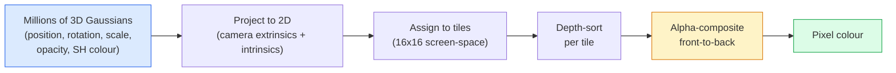

# 3D Gaussian Splating sıfırdan sıfırdan 3D gerçekleştirme

> Bir sahne, milyonlarca 3 boyutlu Gaussians bulutudur. Her birinin konum, yönelim, ölçek, bulanıklık ve bakış yönüne bağlı bir rengi vardır.

> **【中文解读】**3D 高(3DGS) milyonlarca 3D 高球 kullanarak sahneyi gösterir. Her bir高'da konum, yönelim, küçülme, şeffaflık ve bakış açısı ile ilgili renkler vardır.

> **【拓展：3DGS vs NeRF】**3D Gaussian Splating, NeRF'nin gerçek zamanlı bir alternatifidir. NeRF rüntüsü yavaş ama kaliteli yüksek, 3DGS rüntüsü 3D rüntüsü net şekilde gerçek zamanlı rüntüsü gerçekleştirirken, aynı zamanda yüksek kaliteli rüntüsü korur. VR/AR rüntüsü rüntüsü rüntüsü rüntüsü rüntüsü rüntüsü rüntüsü rüntüsü rüntüsü rüntüsü rüntüsü rüntüsü rüntüsü rüntüsü rüntüsü rüntüsü rüntüsü rüntüsü rüntüsü rüntüsü rüntüsü rüntüsü rüntüsü rüntüsü rüntüsü rüntüsü rüntüsü rüntüsü rüntüsü rüntüsü rüntüsü rüntüsü rüntüsü rüntüsü rüntüsü rüntüsü rüntüsü rüntüsü rüntü rüntü rüntü rüntü rüntü rüntü rüntü rüntü rüntü rüntü rüntü rüntü rüntü rüntü rüntü rüntü rüntü rüntü rüntü rüntü rüntü rüntü rüntü rüntü rüntü rüntü rüntü rüntürürürürürürürürürürürürürürürürürürürürürürürürürürürürürürür

**Type:** Build | **类型:** 动手
**Languages:** Python | **语言:** Python
**Prerequisites:** Phase 4 Lesson 13 (3D Vision & NeRF), Phase 1 Lesson 12 (Tensor Operations), Phase 4 Lesson 10 (Diffusion basics optional) | **前置知识:** Phase 4 Lesson 13（3D 视觉与 NeRF），Phase 1 Lesson 12（张量运算），Phase 4 Lesson 10（扩散基础，可选）
**Time:** ~90 minutes | **时间:** ~90 分钟

## Öğrenme hedefleri

- 3D Gaussian Splatting'in 2026 yılında fotorealist 3D yeniden inşaat için üretim standartı olarak NeRF'i neden değiştirdiğini açıklayın.
- Gaussian'a göre altı parametreni (maddesi, döngü dörtleme, ölçek, bulanıklık, küresel harmoniklerin rengi, seçmeli özellik) ve her bir flotun kaç katkı sağladığını belirtin.
- 2D Gaussian splatting rasterizer uygulamak sıfırdan `alpha`3D olayın aynı döngüye nasıl projekte edildiğini göstermek için
- Kullanım`nerfstudio`- Evet .`gsplat`veya`SuperSplat`Bir sahneyi 20-50 fotoğraftan yeniden inşa etmek ve `KHR_gaussian_splatting`glTF uzantısı veya OpenUSD 26.03 `UsdVolParticleField3DGaussianSplat`Şema

> **【中文解读】**Öğrenme hedefi, ders bitirilmesinden sonra öğrenilmesi gereken temel becerileri listeler.


## Sorunlar. Sorunlar.

Bir NeRF, bir sahneyi bir MLP'nin ağırlıkları olarak kaydeder. Her render piksel bir ışın boyunca yüzlerce MLP sorusu içerir. Eğitim saatler alır, renderleme saniyeler alır ve ağırlıklar düzenlenemez.

> NeRF, sahne depolamalarını MLP'nin ağırlığı olarak tasarladı. Her bir görüntü ışığın üzerinde yüzlerce MLP sorusuyla oluştu. Eğitim birkaç saat, rüntesi birkaç saniye, ağırlık düzenlenemez.

3D Gaussian Splatting (Kerbl, Kopanas, Leimkühler, Drettakis, SIGGRAPH 2023) bunların hepsini değiştirdi. Bir sahne açıkça 3 boyutlu Gaussians'ın bir dizi. Rendering, GPU'nın 100+ fps'de rasterleşmesidir. Eğitim birkaç dakika sürer. Düzenleme doğrudan: Gaussians bir alt kümesi çevirin ve sandalyeyi taşıdınız. 2026 yılına kadar Khronos Grubu Gaussian splatlar için bir glTF uzantısı onayladı, OpenUSD 26.03 Gaussian splat şeması ile birlikte bir gayrimenkul gönderdi, Zillow ve Apartments.com da bu ürünlerle birlikte gayrimenkul üretti ve 3D yeniden inşa üzerine yapılan yeni araştırma makalelerinin çoğu 3DGS temel fikrine dair bir variandır.

> 3D 高斯(Kerbl、Kopanas、Leimkühler、Drettakis,SIGGRAPH 2023) bunların hepsini değiştirdi. Szenin açık bir 3D 高斯 染は100+ fps'li GPU 化── eğitimi sadece birkaç dakika sürüyor. Edit direkt:平移部分高斯就移动椅子──2026 yılına kadar, Khronos Grubu 已批准高斯                                                                                                                                                                                                              

Zihinsel model basit, matematikte yeterince hareketli parçalar var ki çoğu giriş rasterizasyonla başlar ve projeksiyonları ve küresel harmonikleri geçirir. Bu ders bütün şeyi inşa eder  önce 2D versiyonu, sonra 3D uzantısı.

> Kalpsel model çok basit, matematik yeterli bir bölümde, çoğu tanıtım ışıklandırma başlatılmasından proje ve toplama fonksiyonlarından geçerek yapılmıştır.

## Konsepten bir şey.

> **【中文解读】**Bu bölümde temel kavramlar ve teoriler hakkında konuşuluyor. Bu kavramları öğrenmek, sonradan gerçekleştirilme önemi, aynı zamanda, görüşmeler ve mühendislik uygulamalarında yüksek sıklıkta yapılan incelemelerin bilgi noktasıdır.


### Gausyalıların taşıdığı şeyler

3 boyutlu Gaussian bir noktası, bu özelliklere sahip bir parametrik noktasıdır:

```
position         mu         (3,)    centre in world coordinates
rotation         q          (4,)    unit quaternion encoding orientation
scale            s          (3,)    log-scales per axis (exponentiated at render time)
opacity          alpha      (1,)    post-sigmoid opacity [0, 1]
SH coefficients  c_lm       (3 * (L+1)^2,)   view-dependent colour
```

Dönüş + ölçek 3x3 bir kovarians oluşturur: `Sigma = R S S^T R^T`Bu, 3 boyutlu Gaussian'ın şeklidir. Sferik harmonikler, renk yönünde renk değişimini sağlar  spekülasyonlu en üst noktaları, ince parlaklık, görüntü bağımlısı parlaklık  görüntüleme boyutları saklanmadan. SH derecesi 3 ile renk kanalı başına 16 koeficient elde edilir, sadece renk için Gaussian başına 48 yüzer.

> 旋转 + 缩放构建 3x3 协方差矩阵:`Sigma = R S S^T R^T`Bu, 3 boyutlu bir boyuttur. Bu, renkleri gözlem yönünde değişmesine izin verir. 高光、微微的光泽、视角相关发光无需存储每视角纹理──SH 度 3 下每色通道 16系数, 只有色有48浮点数──

Bir sahne tipik olarak 1-5 milyon Gaussian'a sahiptir. Her biri yaklaşık 60 yüzerik (3 + 4 + 3 + 1 + 48 + misc) depolar. Bu, beş milyon Gaussian sahne için 240 MB 'dir.

> Bir tipik sahne 100-500 milyon altını taşır. Her bir tanesi 60 altını taşır.

### Rasterize, ışın yürüyüşü değil



Beş adım, hepsi GPU dostu, piksel başına MLP sorgu yok, tek bir RTX 3080 Ti, 147 fps hızında 6 milyon yer verir.

> 五步,全部 GPU 友好──无需每像素 MLP 查询──单张 RTX 3080 Ti 以 147 fps 染 600万──

### Projesiyon aşaması

Dünya pozisyonunda 3 boyutlu Gaussian .`mu`3D kovarianslı `Sigma`Ekran pozisyonunda 2D Gaussian'a proje yapın `mu'`2D kovarianslı `Sigma'`- ...

```
mu' = project(mu)
Sigma' = J W Sigma W^T J^T          (2 x 2)

W = viewing transform (rotation + translation of camera)
J = Jacobian of the perspective projection at mu'
```

2D Gaussian'ın ayak izi bir elipsi. Onun ekseleri `Sigma'`Bu elipsin içindeki her piksel Gaussian'ın katkılarını alır.`exp(-0.5 * (p - mu')^T Sigma'^-1 (p - mu'))`- Evet .

### Alfa Yapıştırma Kuralı

Bir piksel için, kaplayan Gaussians ön-öne sıralanır (veya ters formülle eşdeğer ön-öne). Renk 1980'lerden beri her yarı şeffaf rasterizer ile aynı denklemle oluşur:

```
C_pixel = sum_i alpha_i * T_i * c_i

T_i = prod_{j < i} (1 - alpha_j)       transmittance up to i
alpha_i = opacity_i * exp(-0.5 * d^T Sigma'^-1 d)   local contribution
c_i = eval_SH(SH_i, view_direction)    view-dependent colour
```

Bu ...**the same equation as NeRF's volumetric render**Bu kimlik, neden Rendering kalitesi aynı NeRF  her ikisi de aynı ışınlık alan denklemini entegre ediyor.

> Bu**与 NeRF 的体积渲染方程相同**Bu eşitlik, renklendirme kalitesi ile NeRF'nin eşleşmesinin nedeni olarak görülür.

### Neden bu farklılık olabilir?

Her adım  projeksiyon, tile atama, alfa kompozisyon, SH değerlendirme  Gaussian parametreleri ile ilgili olarak farklılaştırılabilir.`(mu, q, s, alpha, c_lm)`Gaussians'ın yaklaşık 30.000 iterasyonunda doğru konumları, ölçekleri ve renkleri bulunur.

> Her adım  projection  瓦片 distribution  alpha 合成  SH 评估   高斯参数                                                                                                                                                                                                                                                `(mu, q, s, alpha, c_lm)`                                                                                                                                                                                                                                                              

### Densifikasyon ve kesim

Sıkı bir Gaussyen setinde karmaşık bir sahne kapsamayabilir.

> Sık sıkı durumlarda yüksek bir miktarda yükseklik, karmaşık durumları kapsayacak değildir.

- **Clone**Bir Gaussian, gradient büyüklüğü yüksekken ama ölçekleri küçükken mevcut konumunda  yeniden inşa edilmesi için daha fazla ayrıntı gerekmektedir.
  Çeviri:**克隆**                                                                                                                                                                                                                                                              
- **Split**Büyük bir Gaussian, dikme yüksek olduğunda iki küçük Gaussian'a bölünür.
  Çeviri:**分裂** Büyük boyut yüksekken, iki küçük bölgeye ayrılır.
- **Prune**Opakitesi bir eşiğin altında düşen Gaussians'lar katkıda bulunmuyorlar.
  Çeviri:**修剪**pâşınasızlık  değerinden düşük 高不贡献,修剪掉──

Densifikasyon her N iterasyonda çalışır. Bir sahne tipik olarak eğitim sonunda ~ 100k başlangıç Gaussians (SfM noktalarından tohum) ile 1-5M'ye kadar büyür.

> 密集化每N 次代运行一次──场景通常从约10万初始高斯 (SfM 点播种) 增长到训练结束时的100-500万──

### Bir paragraf içinde küresel harmonikler

Görünümden bağımsız renk bir fonksiyon.`c(direction)`Bu, birim küresi üzerinde.`L`Ve sen de .`(L+1)^2`Yeni bir görüntü için renk değerlendirmesi, öğrenilen SH katılımcıları ile görüntüleme yönünde değerlendirilmiş temel arasındaki nokta ürünüdür. 0 derecesi = bir katılımcı = sabit renk. 3 derecesi = 16 katılımcı = Lambertian gölgelik, ayna ve hafif yansıtmayı yakalamak için yeterli. SD Gaussian Splatting makaleleri varsayılan olarak 3 derecesi kullanır.

### 2026 üretim aşaması

```
1. Capture         smartphone / DJI drone / handheld scanner
2. SfM / MVS       COLMAP or GLOMAP derives camera poses + sparse points
3. Train 3DGS      nerfstudio / gsplat / inria official / PostShot (~10-30 min on RTX 4090)
4. Edit            SuperSplat / SplatForge (clean floaters, segment)
5. Export          .ply -> glTF KHR_gaussian_splatting or .usd (OpenUSD 26.03)
6. View            Cesium / Unreal / Babylon.js / Three.js / Vision Pro
```

### 4D ve jeneratif çeşitleri

- **4D Gaussian Splatting** Gaussians zaman fonksiyonlarıdır; volumetrik video için kullanılır (Superman 2026, A$AP Rocky'nin "Helikopteri").
- **Generative splats** Tüm sahneleri halüsinasyon yapan metin-to-splat modeller (Marble by World Labs).
- **3D Gaussian Unscented Transform** NVIDIA NuRec'in otonom sürüş simülasyonu için bir variansı.

> **【中文解读】**Bu bölüm kodla sıfırdan gerçekleştirilen çekirdek algoritmasıdır. Bu "sıfırdan" yöntem çerçevenin arkasındaki prensipleri anlama yardımcı olur.

> **【拓展：工业部署中的视觉系统】**Gerçek endüstriye dağıtımında, görsel modeller gecikme, model büyüklüğü, kenar cihazların uyumlu olması gibi sorunları düşünmelidir. TensorRT, ONNX Runtime, OpenVINO, yaygın olarak kullanılan bir görsel model hızlandırma aracıdır.

> **【拓展：数据标注与质量】**视觉任务的效果高度依赖标签数据质――Label Studio、CVAT is the mainstream tagging tool――在工业场景中,主动学习(Active Learning) 标签成本ı azaltabilir:模型对不确定的样本请求人工标签,确定性的样本自动标签──


## Yapın.
```figure
cv3-gaussian-splat
```

## Yapın

### Adım 1: 2 boyutlu Gaussian

Önce 2 boyutlu bir rasterizer yapıyoruz. 3 boyutlu kap proje sonrasında bu kadar azalıyor.

```python
import torch
import torch.nn as nn
import torch.nn.functional as F


def eval_2d_gaussian(means, covs, points):
    """
    means:  (G, 2)      centres
    covs:   (G, 2, 2)   covariance matrices
    points: (H, W, 2)   pixel coordinates
    returns: (G, H, W)  density at every pixel for every Gaussian
    """
    G = means.size(0)
    H, W, _ = points.shape
    flat = points.view(-1, 2)
    inv = torch.linalg.inv(covs)
    diff = flat[None, :, :] - means[:, None, :]
    d = torch.einsum("gpi,gij,gpj->gp", diff, inv, diff)
    density = torch.exp(-0.5 * d)
    return density.view(G, H, W)
```

`einsum`- Şekredeki şekli yapar mı ?`diff^T Sigma^-1 diff`Her çift için.

### Adım 2: 2D patlama rasterizeri

2 boyutlu derinlik anlamsız, bu yüzden sırayı öğrenen Gaussian ölçekli bir yöntemle kullanıyoruz.

```python
def rasterise_2d(means, covs, colours, opacities, depths, image_size):
    """
    means:     (G, 2)
    covs:      (G, 2, 2)
    colours:   (G, 3)
    opacities: (G,)     in [0, 1]
    depths:    (G,)     per-Gaussian scalar used for ordering
    image_size: (H, W)
    returns:   (H, W, 3) rendered image
    """
    H, W = image_size
    yy, xx = torch.meshgrid(
        torch.arange(H, dtype=torch.float32, device=means.device),
        torch.arange(W, dtype=torch.float32, device=means.device),
        indexing="ij",
    )
    points = torch.stack([xx, yy], dim=-1)

    densities = eval_2d_gaussian(means, covs, points)
    alphas = opacities[:, None, None] * densities
    alphas = alphas.clamp(0.0, 0.99)

    order = torch.argsort(depths)
    alphas = alphas[order]
    colours_sorted = colours[order]

    T = torch.ones(H, W, device=means.device)
    out = torch.zeros(H, W, 3, device=means.device)
    for i in range(means.size(0)):
        a = alphas[i]
        out += (T * a)[..., None] * colours_sorted[i][None, None, :]
        T = T * (1.0 - a)
    return out
```

Hızlı değil  gerçek bir uygulamada küfe tabanlı CUDA çekirdekleri kullanılır  ama tam doğru matematik ve tamamen farklılık.

### Adım 3: Eğitilebilir 2 boyutlu bir splat sahnesini oluşturmak

```python
class Splats2D(nn.Module):
    def __init__(self, num_splats=128, image_size=64, seed=0):
        super().__init__()
        g = torch.Generator().manual_seed(seed)
        H, W = image_size, image_size
        self.means = nn.Parameter(torch.rand(num_splats, 2, generator=g) * torch.tensor([W, H]))
        self.log_scale = nn.Parameter(torch.ones(num_splats, 2) * math.log(2.0))
        self.rot = nn.Parameter(torch.zeros(num_splats))  # single angle in 2D
        self.colour_logits = nn.Parameter(torch.randn(num_splats, 3, generator=g) * 0.5)
        self.opacity_logit = nn.Parameter(torch.zeros(num_splats))
        self.depth = nn.Parameter(torch.rand(num_splats, generator=g))

    def covs(self):
        s = torch.exp(self.log_scale)
        c, si = torch.cos(self.rot), torch.sin(self.rot)
        R = torch.stack([
            torch.stack([c, -si], dim=-1),
            torch.stack([si, c], dim=-1),
        ], dim=-2)
        S = torch.diag_embed(s ** 2)
        return R @ S @ R.transpose(-1, -2)

    def forward(self, image_size):
        covs = self.covs()
        colours = torch.sigmoid(self.colour_logits)
        opacities = torch.sigmoid(self.opacity_logit)
        return rasterise_2d(self.means, covs, colours, opacities, self.depth, image_size)
```

`log_scale`- Evet .`opacity_logit`ve`colour_logits`Bu, 3DGS uygulaması için standart bir örnektir.

### Adım 4: 2D Gaussians'ı hedef görüntüsüne bağlayın

```python
import math
import numpy as np

def make_target(size=64):
    yy, xx = np.meshgrid(np.arange(size), np.arange(size), indexing="ij")
    img = np.zeros((size, size, 3), dtype=np.float32)
    # Red circle
    mask = (xx - 20) ** 2 + (yy - 20) ** 2 < 10 ** 2
    img[mask] = [1.0, 0.2, 0.2]
    # Blue square
    mask = (np.abs(xx - 45) < 8) & (np.abs(yy - 40) < 8)
    img[mask] = [0.2, 0.3, 1.0]
    return torch.from_numpy(img)


target = make_target(64)
model = Splats2D(num_splats=64, image_size=64)
opt = torch.optim.Adam(model.parameters(), lr=0.05)

for step in range(200):
    pred = model((64, 64))
    loss = F.mse_loss(pred, target)
    opt.zero_grad(); loss.backward(); opt.step()
    if step % 40 == 0:
        print(f"step {step:3d}  mse {loss.item():.4f}")
```

200 adımdan fazla olan 64 Gaussians iki şekilde yerleşir. Bu açık geometrik ilksellerde tüm fikir  gradient-descent.

### Adım 5: 2D'den 3D'ye

3D uzantısı aynı döngüyi koruyor.

1. Per-Gaussian dönüm, tek açıdan değil, dörtlüktür.
2. - Kovarians .`R S S^T R^T`- Evet .`R`Quaternion'dan inşa edilmiş ve`S = diag(exp(log_scale))`- Evet .
3. Proje `(mu, Sigma) -> (mu', Sigma')`kamera dışı ve perspektif projeksiyonunun Jacobian kullanır `mu`- Evet .
4. Renk, küresel-harmonik bir genişleme haline gelir; izleme yönünde değerlendirin.
5. Derinlik sıralaması, öğrenilmiş bir skalar yerine gerçek kamera-uzay z'den geliyor.

Her üretim uygulaması (`gsplat`- Evet .`inria/gaussian-splatting`- Evet .`nerfstudio`) GPU'da, tile tabanlı CUDA çekirdekleri ile aynen bunu yapar.

### Adım 6: Sferik harmoniklerin değerlendirilmesi

3 dereceden önce SH tabanı, her kanal için 16 terimden oluşur.

```python
def eval_sh_degree_3(sh_coeffs, dirs):
    """
    sh_coeffs: (..., 16, 3)   last dim is RGB channels
    dirs:      (..., 3)       unit vectors
    returns:   (..., 3)
    """
    C0 = 0.282094791773878
    C1 = 0.488602511902920
    C2 = [1.092548430592079, 1.092548430592079,
          0.315391565252520, 1.092548430592079,
          0.546274215296039]
    x, y, z = dirs[..., 0], dirs[..., 1], dirs[..., 2]
    x2, y2, z2 = x * x, y * y, z * z
    xy, yz, xz = x * y, y * z, x * z

    result = C0 * sh_coeffs[..., 0, :]
    result = result - C1 * y[..., None] * sh_coeffs[..., 1, :]
    result = result + C1 * z[..., None] * sh_coeffs[..., 2, :]
    result = result - C1 * x[..., None] * sh_coeffs[..., 3, :]

    result = result + C2[0] * xy[..., None] * sh_coeffs[..., 4, :]
    result = result + C2[1] * yz[..., None] * sh_coeffs[..., 5, :]
    result = result + C2[2] * (2.0 * z2 - x2 - y2)[..., None] * sh_coeffs[..., 6, :]
    result = result + C2[3] * xz[..., None] * sh_coeffs[..., 7, :]
    result = result + C2[4] * (x2 - y2)[..., None] * sh_coeffs[..., 8, :]

    # degree 3 terms omitted here for brevity; full 16-coefficient version in the code file
    return result
```

> **【中文解读】**Bu bölümde, PyTorch, HuggingFace gibi olgun çerçeveler nasıl kullanılacağını gösterir.


Öğrendiğim`sh_coeffs`Gaussian için "her yönde renk" kaydet. Render zamanında mevcut görüntü yönüne karşı değerlendirilir ve 3 vektör RGB elde edersiniz.


> **【拓展：视觉模型的持续学习】**Üretim ortamında, görsel modeller yeni verilere sürekli uyum sağlamak gerekir. Yeni ürünler, yeni sahne, yeni ışık koşulları. Sürekli öğrenme. Sürekli öğrenme.

## Çerçeveyi kullanın.

Gerçek 3DGS çalışması için kullan `gsplat`(Meta) veya `nerfstudio`- ...

```bash
pip install nerfstudio gsplat
ns-download-data example
ns-train splatfacto --data path/to/data
```

`splatfacto`Normal bir sahne için RTX 4090'da 10-30 dakika sürer.

2026'da önemli ihracat seçenekleri:

- `.ply` çiğ Gaussian bulut (gönülden taşınabilir, en büyük dosya).
- `.splat` PlayCanvas / SuperSplat kuantitatif biçimi.
- glTF `KHR_gaussian_splatting` Khronos standartı, izleyiciler arasında taşınabilir (Feb 2026 RC).
- OpenUSD `UsdVolParticleField3DGaussianSplat` NVIDIA Omniverse ve Vision Pro boru hattı için USD- doğuştan.

> **【中文解读】**Bu bölümde modellerin kullanılabilir ürünler için nasıl dağıtılacağı üzerinde yoğunlaşmaktadır.


4D / dinamik sahneler için, `4DGS`ve `Deformable-3DGS`Aynı makineyi zamanla değişen araçlar ve açıklıktan uzaklaştırmak.


## İndirin . Ürünler .

> **【中文解读】**练习题按照易/中级/难三度递进;;建议至少完成中级题,Hard级适合深入研究或面试准备;;


Bu ders şunları ortaya çıkarır:

- `outputs/prompt-3dgs-capture-planner.md` bir sahne tipi için bir çekim seansını (fotoğraf sayısı, kamera yolu, aydınlatma) planlayan bir istek.
- `outputs/skill-3dgs-export-router.md` doğru ihracat biçimini seçen bir beceri (`.ply`- Ne ?`.splat`/ glTF / USD) aşağıdaki görüntüleyici veya motor için verilir.

## Egzersizler.

1. **(Easy)**2D splat eğitimi yukarıda farklı bir sentetik görüntüde çalıştır.`num_splats`İçeride`[16, 64, 256]`ve her bir adım için MSE vs. adım çizimini göster.
2. **(Medium)**2D rasterizer'i 2 derecelik bir harmonik ile skalar bir "görme açısına" bağlı Gaussian RGB renkleri desteklemek için genişletin.
3. **(Hard)**Klon .`nerfstudio`ve tren .`splatfacto`Kullanmakta olduğunuz herhangi bir sahneyi (benzide, bitki, yüz, oda) 20 fotoğrafla yakalayın.`KHR_gaussian_splatting`ve bir izleyici aç (Three.js `GaussianSplats3D`Eğitim süresi, Gaussians sayısı ve fps gösterimleri rapor edin.

> **【中文解读】**术语表中的"İnsanların ne dediği" vs "Gerçekten ne anlama geldiği" 区分日常口语和精确技术含义──在团队协作中,统一术语定义可以避免大量沟通误解──


## Anahtar Şartlar .

| Term | What people say | What it actually means |
|------|----------------|----------------------|
| 3DGS | "Gaussian splats" | Explicit scene representation as millions of 3D Gaussians with per-Gaussian position, rotation, scale, opacity, SH colour |
| Covariance | "Shape of the Gaussian" | `Sigma = R S S^T R^T`; orientation and anisotropic scale of one Gaussian |
| Alpha compositing | "Back-to-front blend" | Same equation as NeRF's volumetric render, now over an explicit sparse set |
| Densification | "Clone and split" | Adaptive addition of new Gaussians where reconstruction is under-fit |
| Pruning | "Delete low-opacity" | Remove Gaussians that have collapsed to near-zero opacity during training |
| Spherical harmonics | "View-dependent colour" | Fourier basis on the sphere; stores colour as a function of viewing direction |
| Splatfacto | "nerfstudio's 3DGS" | The easiest path to training 3DGS in 2026 |
| `KHR_gaussian_splatting` | "glTF standard" | Khronos 2026 extension that makes 3DGS portable across viewers and engines |

> **【中文解读】**延伸阅读, derinlemesine öğrenme için yüksek kaliteli kaynaklar sağladı. Bu makaleler ve dersler, derinlemesine anlama ihtiyacı olan okuyuculara uygun olarak bu alanın klasik referanslarıdır.


## Daha fazla okumak

- [3D Gaussian Splatting for Real-Time Radiance Field Rendering (Kerbl et al., SIGGRAPH 2023)](https://repo-sam.inria.fr/fungraph/3d-gaussian-splatting/) orijinal kağıt
- [gsplat (Meta/nerfstudio)](https://github.com/nerfstudio-project/gsplat) Üretim kalitesi CUDA rasterizeri
- [nerfstudio Splatfacto](https://docs.nerf.studio/nerfology/methods/splat.html) Referans eğitim tarifi
- [Khronos KHR_gaussian_splatting extension](https://github.com/KhronosGroup/glTF/blob/main/extensions/2.0/Khronos/KHR_gaussian_splatting/README.md) 2026 taşınabilir biçimi
- [OpenUSD 26.03 release notes](https://openusd.org/release/) `UsdVolParticleField3DGaussianSplat`Şema
- [THE FUTURE 3D State of Gaussian Splatting 2026](https://www.thefuture3d.com/blog-0/2026/4/4/state-of-gaussian-splatting-2026) endüstri genel bakış
