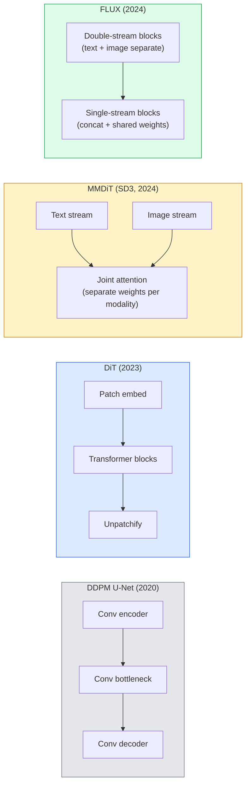

# Diffusion Transformers & Rectified Flow . Transformer ile tüm akım

> U-Net, yayılma sırrı değil. Transformer ile değiştir, gürültü programını düz çizgi akışla değiştir ve birden SD3, FLUX ve her 2026 metin-resim modeli var.

> **【中文解读】**U-Net'in sırrı yayılma modeli değil. U-Net'in sırrı, Transformer ile U-Net'i değiştirmek, düz hattı ile düzeltilmiş akışla gürültü düzenlemesini değiştirmek, SD3 ̊ FLUX ve diğerleri ile görüntü üretimi modeli oluşturmak.

> **【拓展：DiT 是 2024-2026 的趋势】**Diffusion Transformer(DiT) Transformer'ın genişletilmesi mümkün olacak.

**Type:** Learn + Build | **类型:** 学习 + 动手
**Languages:** Python | **语言:** Python
**Prerequisites:** Phase 4 Lesson 10 (Diffusion DDPM), Phase 4 Lesson 14 (ViT), Phase 7 Lesson 02 (Self-Attention) | **前置知识:** Phase 4 Lesson 10（扩散 DDPM），Phase 4 Lesson 14（ViT），Phase 7 Lesson 02（自注意力）
**Time:** ~75 minutes | **时间:** ~75 分钟

## Öğrenme hedefleri

- U-Net DDPM (Desin 10) 'den Diffusion Transformer (DiT), MMDiT (SD3) ve single+double-stream DiT (FLUX) 'e kadar evrimleri takip edin.
- Düzeltilmiş akış açıklayın: neden gürültü ve veriler arasındaki düz çizgi yoldaki modellerin 1000 yerine 20 adımla örnek almasına izin verir
- Küçük bir DiT blokunu ve düzeltilmiş akış eğitim döngüsünü, her ikisi de 100 satırın altında uygula
- Arsitektur, parametreler sayımı ve lisanslama ile model çeşitlerini (SD3, FLUX.1-dev, FLUX.1-schnell, Z-Image, Qwen-Image) ayırt edin

> **【中文解读】**Öğrenme hedefi, ders bitirilmesinden sonra öğrenilmesi gereken temel becerileri listeler.


## Sorunlar. Sorunlar.

Ders 10 bir U-Net denoiser ile DDPM inşa etti. Bu tarif 2020-2023'te baskın olmuştur: U-Net + beta programı + gürültü tahmin kaybı.

> Bölüm 10 U-Net'in ses çıkartma cihazı DDPM'yi oluşturdu. Bu program 2020-2023 yıllarında baskınlıkta bulundu: U-Net + beta 调度 + 噪音预测损失――

Her 2026 en son metin-resim modeli bundan geçti. Stable Diffusion 3, FLUX, SD4, Z-Image, Qwen-Image, Hunyuan-Image  hiçbiri U-Net kullanmıyor. Diffusion Transformers (DiT) kullanıyorlar. SD3 ve FLUX ayrıca DDPM gürültü programını düzeltilmiş akış için değiştirirler, bu da gürültüden veriye giden yolu düzeltir ve tutarlılık veya destil edilmiş varyantlarla 1-4 adımlı çıkarım sağlar.

> 2026 yılının en gelişmiş metin-işine modelleri hepsinden geçti. Stajıf Yayınlama 3 ̊ FLUX ̊ SD4 ̊ Z-İşine ̊ Qwen-İşine ̊ Hunyuan-İşine ̊ U-Net kullanan hiç bir tane yok.

Değişiklik önemlidir çünkü difüzyon tabanlı görüntü üretimi kontrol edilebilir, hızlı-düzgün (SD3/SD4 çözülmüş metin renderleme) ve üretim hızlı hale gelmesinin nedeni budur. DiT + düzeltilmiş akışı anlamak 2026 jeneratif görüntü yığını anlamak demektir.

> Bu dönüşüm önemlidir, çünkü genişletilmiş görüntü üretimi kontrol edilebilir hale gelmeye dayanır.

## Konsepten bir şey.

> **【中文解读】**Bu bölümde temel kavramlar ve teoriler hakkında konuşuluyor. Bu kavramları öğrenmek, sonradan gerçekleştirilme önemi, aynı zamanda, görüşmeler ve mühendislik uygulamalarında yüksek sıklıkta yapılan incelemelerin bilgi noktasıdır.


### U-Net'ten Transformer'e



- **DiT**(Peebles & Xie, 2023)  U-Net'i gizli yamalar üzerinde ViT benzeri bir transformatörle değiştirin. Adaptif katman normı (AdaLN) yoluyla kondisyone edilme.
  Çeviri:**DiT**(Peebles & Xie,2023)  VIT  U-Net  处理潜变量补丁──通过自适应层归归一化(AdaLN) 进行条件化──
- **MMDiT**(SD3, Esser et al., 2024)  ortak bir dikkat paylaşan metin ve görüntü belirtileri için ayrı ağırlıklara sahip iki akış.
  Çeviri:**MMDiT**(SD3,Esser vb,2024)  iki bölük arasında metin ve resim belirtilerini yeniden işleme hakkı vardır, ortak bir dikkat çekmek
- **FLUX**(Black Forest Labs, 2024)  ilk N blokları SD3 gibi çift akıntılı, daha sonraki bloklar daha yüksek derinlikte verimlilik için birleştirilmiş ve ağırlıkları paylaşmıştır.
  Çeviri:**FLUX**(Black Forest Labs,2024) 前 N 个块像 SD3 一样双流,后续块拼接并共享权重(单流) 深层的效率提高──
- **Z-Image**(2025)  "her bedelden ölçeklenme"le mücadele eden, 6B parametrelerindeki verimli tek akımlı DiT.
  Çeviri:**Z-Image**(2025) 60 milyar paramandan fazla yüksek verimlilik tek akımı, "Kost ekspansiyonı"nun düşüncesini meydan okuyor.

### Tek paragrafda düzeltilmiş akış

DDPM ileri süreci gürültülü bir SDE olarak tanımlar .`x_t`Öğrenilen ters yön, 1000 küçük adımla çözülen ikinci bir SDE'dir.

> DDPM, ön yön süreci, ses ve sesle ilgili küçük bir farklılık olarak tanımlanır.`x_t`漸漸被損壞──學習到的反向是第二個SDE,通過1000小步求解──

Düzeltilmiş akış bir **straight-line**Temiz veri ile saf gürültü arasındaki interpolasyon:

> Tüm akış net veri ve saf gürültü arasındaki bağlantıyı tanımladı**直线**插值:

```
x_t = (1 - t) * x_0 + t * epsilon,     t in [0, 1]
```

Hızını tahmin etmek için bir ağ eğit .`v_theta(x_t, t) = epsilon - x_0` temiz verilerden gürültüye doğru doğru doğru giden yol boyunca ileriye doğru (`dx_t/dt`) Örnekleme sırasında, bu hızı geriye doğru, gürültüden veriye doğru adım atmak için entegre edersiniz.

> 训练网络预测速度   eğitim                                                                                                                                                                                                                                                                                                                                                                                                                                                                                                                    `v_theta(x_t, t) = epsilon - x_0` Karanlık veri ile gürültü arasındaki düz yollardaki ön yönü`dx_t/dt`)。 örneğin, bu hızda gürültüden veriye doğru ilerlemek ODE'ye daha yakınlaşır, bu nedenle örneğin gereken sayı büyük ölçüde azalır。

SD3 bunu söylüyor .**Rectified Flow Matching**FLUX, Z-Image ve çoğu 2026 modeli aynı hedefi kullanır. Tipik sonuç: 20-30 Euler adımları (deterministik) vs. 50+ DDIM adımları eski DDPM rejiminde. Distilled / turbo / schnell / LCM varianları 1-4 adımlara düşürür.

> SD3 olarak adlandırılır .**整流流匹配**◊FLUX、Z-Image 和大多数 2026 yıl modelleri aynı hedefi kullanmaktadır.

### AdaLN kondisyone edilmesi

DiT koşulları zaman aşamasında ve sınıf/metin üzerinden **adaptive layer norm**Önceden tahmin etmek`scale`ve `shift`U-Nets'te FiLM tarzındaki modülasyon ve her modern DiT'de varsayılan modülasyondan çok daha temiz.

> Dönüşüm**自适应层归一化**Zaman ve sınıflar/metin için koşullandırma: koşul ve boyut tahmininden`scale`和 `shift`LayerNorm'un son uygulamaları U-Net'deki FiLM'den daha temiz bir şekilde düzenlenmektedir.

```
cond -> MLP -> (scale, shift, gate)
norm(x) * (1 + scale) + shift, then residual add * gate
```

### SD3 ve FLUX'deki metin kodlayıcıları

- **SD3**üç metin kodlayıcı kullanıyor: iki CLIP modeli + T5-XXL. İçeriye yerleştirmeler bağlanmış ve metin koşullaması olarak görüntü akışına girinmiştir.
- **FLUX**bir CLIP-L + T5-XXL kullanır.
- **Qwen-Image / Z-Image**Şirketler, temel LLM'lerine uyumlu kendi iç metin kodlayıcılarını kullanıyor.

Metin kodlayıcı, SD3/FLUX'in SD1.5'den çok daha iyi istekleri nedeninin büyük bir parçasıdır. T5-XXL tek başına 4.7B parametreleridir.

### Sınıflandırıcı dışı rehberlik hala geçerlidir

Düzeltme akışı, testlemeyi değil, örneklemeyi değiştirir. Sınıflandırıcı dışı rehberlik (öğrenme sırasında %10 olasılıkla dökme metni, sonuçta koşullu ve koşulsuz tahminleri karıştırmak) düzeltme akışı ile aynı şekilde çalışır. 2026 modellerinin çoğu SD1.5'in 7.5'inden 3.5-5  daha düşük rehberlik ölçeğini kullanır, çünkü düzeltme akışı modelleri öntanım olarak talimatları daha sıkı takip eder.

### Düzgünlük, Turbo, Schnell, LCM

Aynı fikre dört isim: yavaş bir çok adımlı modeli hızlı birkaç adımlı modele dönüştürün.

- **LCM (Latent Consistency Model)** final tahmin eden bir öğrenci eğitmek `x_0`herhangi bir aracından `x_t`Bir adımdan sonra.
- **SDXL Turbo / FLUX schnell** 1-4 aşamalı modeller, karşılaştırmalı difüzyon destillasyonla eğitilmiştir.
- **SD Turbo** OpenAI tarzı tutarlılık modelleri, gizli yayılmaya uyarlanmıştır.

Her yeni model geminin üretim servisinde hem "tam kalite" kontrol noktası hem de "turbo / schnell" varianti bulunur. Schnell ("çabuk" Almanca, Black Forest Labs'ın konvansiyonu) 1-4 adım içinde çalışır ve gerçek zamanlı boru hattlarına uymaktadır.

### 2026'da model manzara

| Model | Size | Architecture | License |
|-------|------|--------------|---------|
| Stable Diffusion 3 Medium | 2B | MMDiT | SAI Community |
| Stable Diffusion 3.5 Large | 8B | MMDiT | SAI Community |
| FLUX.1-dev | 12B | Double + Single Stream DiT | non-commercial |
| FLUX.1-schnell | 12B | same, distilled | Apache 2.0 |
| FLUX.2 | — | iterated FLUX.1 | mixed |
| Z-Image | 6B | S3-DiT (Scalable Single-Stream) | permissive |
| Qwen-Image | ~20B | DiT + Qwen text tower | Apache 2.0 |
| Hunyuan-Image-3.0 | ~80B | DiT | research |
| SD4 Turbo | 3B | DiT + distillation | SAI Commercial |

FLUX.1-schnell 2026 açık kaynaklı varsayılan. Z-Image verimlilik lideridir. FLUX.2 ve SD4 mevcut kalite ipuçlarıdır.

### Bu aşama değişikliğinin neden önemli olduğu

DDPM + U-Net çalıştı.**better, faster, and scales more cleanly**. Değişim RNN'lerden NLP'deki transformatörlere paraleldir: her iki mimarlık da aynı sorunu çözdü, ancak transformatörler ölçeklendiler ve şimdi hakim oldular. 2026'da görüntü, video veya 3D jenerasyon üzerine yapılan her bir makale DiT şeklinde bir denoiser kullanır ve genellikle düzeltilmiş akış hedefi kullanır. U-Net DDPM şimdi öncelikle eğitimsel (Disim 10).

> DDPM + U-Net 可行──DiT + 整流流**更好、更快、扩展更干净**◊ Bu dönüşüm NLP'de RNN'den Transformer'e geçişine benzer: iki yapı aynı sorunu çözmüştür, ancak Transformer daha genişletilenebilir ve son olarak yönlendirilir.

> **【拓展：工业部署中的视觉系统】**Gerçek endüstriye dağıtımında, görsel modeller gecikme, model büyüklüğü, kenar cihazların uyumlu olması gibi sorunları düşünmelidir. TensorRT, ONNX Runtime, OpenVINO, yaygın olarak kullanılan bir görsel model hızlandırma aracıdır.

> **【拓展：数据标注与质量】**视觉任务的效果高度依赖标签数据质――Label Studio、CVAT is the mainstream tagging tool――在工业场景中,主动学习(Active Learning) 标签成本ı azaltabilir:模型对不确定的样本请求人工标签,确定性的样本自动标签──


## Yapın.

> **【中文解读】**Bu bölüm kodla sıfırdan gerçekleştirilen çekirdek algoritmasıdır. Bu "sıfırdan" yöntem çerçevenin arkasındaki prensipleri anlama yardımcı olur.

```figure
cv3-rectified-flow
```

## Yapın

### Adım 1: AdaLN ile DiT bloklaması

```python
import torch
import torch.nn as nn


class AdaLNZero(nn.Module):
    """
    Adaptive LayerNorm with a gate. Predicts (scale, shift, gate) from the conditioning.
    Init such that the whole block starts as identity ("zero init").
    """

    def __init__(self, dim, cond_dim):
        super().__init__()
        self.norm = nn.LayerNorm(dim, elementwise_affine=False)
        self.mlp = nn.Linear(cond_dim, dim * 3)
        nn.init.zeros_(self.mlp.weight)
        nn.init.zeros_(self.mlp.bias)

    def forward(self, x, cond):
        scale, shift, gate = self.mlp(cond).chunk(3, dim=-1)
        h = self.norm(x) * (1 + scale.unsqueeze(1)) + shift.unsqueeze(1)
        return h, gate.unsqueeze(1)


class DiTBlock(nn.Module):
    def __init__(self, dim=192, heads=3, mlp_ratio=4, cond_dim=192):
        super().__init__()
        self.adaln1 = AdaLNZero(dim, cond_dim)
        self.attn = nn.MultiheadAttention(dim, heads, batch_first=True)
        self.adaln2 = AdaLNZero(dim, cond_dim)
        self.mlp = nn.Sequential(
            nn.Linear(dim, dim * mlp_ratio),
            nn.GELU(),
            nn.Linear(dim * mlp_ratio, dim),
        )

    def forward(self, x, cond):
        h, gate1 = self.adaln1(x, cond)
        a, _ = self.attn(h, h, h, need_weights=False)
        x = x + gate1 * a
        h, gate2 = self.adaln2(x, cond)
        x = x + gate2 * self.mlp(h)
        return x
```

`AdaLNZero`Bu, kimlikten uzaklaşan blokları hızla stabilize eder ve derin transformatör difüzyon modelleri çarpıcı bir şekilde dengeleyebilir.

### Adım 2: Küçük bir diT

```python
def timestep_embedding(t, dim):
    import math
    half = dim // 2
    freqs = torch.exp(-math.log(10000) * torch.arange(half, device=t.device) / half)
    args = t[:, None].float() * freqs[None]
    return torch.cat([args.sin(), args.cos()], dim=-1)


class TinyDiT(nn.Module):
    def __init__(self, image_size=16, patch_size=2, in_channels=3, dim=96, depth=4, heads=3):
        super().__init__()
        self.patch_size = patch_size
        self.num_patches = (image_size // patch_size) ** 2
        self.patch = nn.Conv2d(in_channels, dim, kernel_size=patch_size, stride=patch_size)
        self.pos = nn.Parameter(torch.zeros(1, self.num_patches, dim))
        self.time_mlp = nn.Sequential(
            nn.Linear(dim, dim * 2),
            nn.SiLU(),
            nn.Linear(dim * 2, dim),
        )
        self.blocks = nn.ModuleList([DiTBlock(dim, heads, cond_dim=dim) for _ in range(depth)])
        self.norm_out = nn.LayerNorm(dim, elementwise_affine=False)
        self.head = nn.Linear(dim, patch_size * patch_size * in_channels)

    def forward(self, x, t):
        n = x.size(0)
        x = self.patch(x)
        x = x.flatten(2).transpose(1, 2) + self.pos
        t_emb = self.time_mlp(timestep_embedding(t, self.pos.size(-1)))
        for blk in self.blocks:
            x = blk(x, t_emb)
        x = self.norm_out(x)
        x = self.head(x)
        return self._unpatchify(x, n)

    def _unpatchify(self, x, n):
        p = self.patch_size
        h = w = int(self.num_patches ** 0.5)
        x = x.view(n, h, w, p, p, -1).permute(0, 5, 1, 3, 2, 4).reshape(n, -1, h * p, w * p)
        return x
```

### Adım 3: Düzeltme akış eğitimi

```python
import torch.nn.functional as F

def rectified_flow_train_step(model, x0, optimizer, device):
    model.train()
    x0 = x0.to(device)
    n = x0.size(0)
    t = torch.rand(n, device=device)
    epsilon = torch.randn_like(x0)
    x_t = (1 - t[:, None, None, None]) * x0 + t[:, None, None, None] * epsilon

    target_velocity = epsilon - x0
    pred_velocity = model(x_t, t)

    loss = F.mse_loss(pred_velocity, target_velocity)
    optimizer.zero_grad()
    loss.backward()
    optimizer.step()
    return loss.item()
```

DDPM'nin gürültü tahmin kaybı ile karşılaştırın (Disim 10): aynı yapı, farklı hedef.`epsilon`, tahmin ediyoruz **velocity** `epsilon - x_0`, bu da doğru çizgi interpolasyon boyunca veriyi gürültüye doğru gösterir.

### 4. Adım: Euler örneği

Düzeltilmiş akış bir ODE. Euler'ın yöntemi en basit ve iyi eğitilmiş düzeltilmiş akış modeli için, 20+ adımlarda yüksek sıradaki çözücüler kadar neredeyse doğru.

```python
@torch.no_grad()
def rectified_flow_sample(model, shape, steps=20, device="cpu"):
    model.eval()
    x = torch.randn(shape, device=device)
    dt = 1.0 / steps
    t = torch.ones(shape[0], device=device)
    for _ in range(steps):
        v = model(x, t)
        x = x - dt * v
        t = t - dt
    return x
```

20 adım. Eğitimli bir modelde bu 1000 adım DDPM ile karşılaştırılabilir örnekler üretir.

### Adım 5: Sonundan sonuna kadar duman testi

```python
import numpy as np

def synthetic_blobs(num=200, size=16, seed=0):
    rng = np.random.default_rng(seed)
    out = np.zeros((num, 3, size, size), dtype=np.float32)
    yy, xx = np.meshgrid(np.arange(size), np.arange(size), indexing="ij")
    for i in range(num):
        cx, cy = rng.uniform(4, size - 4, size=2)
        r = rng.uniform(2, 4)
        mask = (xx - cx) ** 2 + (yy - cy) ** 2 < r ** 2
        colour = rng.uniform(-1, 1, size=3)
        for c in range(3):
            out[i, c][mask] = colour[c]
    return torch.from_numpy(out)
```

> **【中文解读】**Bu bölümde, PyTorch, HuggingFace gibi olgun çerçeveler nasıl kullanılacağını gösterir.


Tren A`TinyDiT`500 adımdan sonra, örneklenmiş çıkışlar hafif renkli lekeler gibi görünmelidir.


> **【拓展：视觉模型的持续学习】**Üretim ortamında, görsel modeller yeni verilere sürekli uyum sağlamak gerekir. Yeni ürünler, yeni sahne, yeni ışık koşulları. Sürekli öğrenme. Sürekli öğrenme.

## Çerçeveyi kullanın.

FLUX / SD3 / Z-Image ile gerçek görüntü oluşturmak için, `diffusers`Her biri tek bir API ile gemi:

```python
from diffusers import FluxPipeline, StableDiffusion3Pipeline
import torch

pipe = FluxPipeline.from_pretrained(
    "black-forest-labs/FLUX.1-schnell",
    torch_dtype=torch.bfloat16,
).to("cuda")

out = pipe(
    prompt="a golden retriever surfing a tsunami, hyperrealistic, studio lighting",
    guidance_scale=0.0,           # schnell was trained without CFG
    num_inference_steps=4,
    max_sequence_length=256,
).images[0]
out.save("surf.png")
```

Üç satır.`FLUX.1-schnell`Dört adımdan sonra.`black-forest-labs/FLUX.1-dev`CFG ile 20-30 adımlarda daha yüksek kalite için.

SD3 için:

> **【中文解读】**Bu bölümde modellerin kullanılabilir ürünler için nasıl dağıtılacağı üzerinde yoğunlaşmaktadır.


```python
pipe = StableDiffusion3Pipeline.from_pretrained(
    "stabilityai/stable-diffusion-3.5-large",
    torch_dtype=torch.bfloat16,
).to("cuda")
out = pipe(prompt, guidance_scale=3.5, num_inference_steps=28).images[0]
```


## İndirin . Ürünler .

> **【中文解读】**练习题按照易/中级/难三度递进;;建议至少完成中级题,Hard级适合深入研究或面试准备;;


Bu ders şunları ortaya çıkarır:

- `outputs/prompt-dit-model-picker.md` Kalite, gecikme ve lisans kısıtlamaları nedeniyle SD3, FLUX.1-dev, FLUX.1-schnell, Z-Image, SD4 Turbo arasında seçimler yapılır.
- `outputs/skill-rectified-flow-trainer.md`AdaLN DiT ve Euler örneklemesi ile düzeltilmiş akış için tam bir eğitim döngüsü yazar.

## Egzersizler.

1. **(Easy)**Yukarıdaki TinyDiT'yi sentetik blob veri kümesine 500 adım boyunca çalıştırın. 10, 20 ve 50 Euler adımlarıyla üretilen örnekleri karşılaştırın.
2. **(Medium)**Öğrenilmiş bir sınıf gömülmesini zaman gömülmesine bağlayarak metin koşullandırmasını ekleyin (10 renk "sınıflar" blob). 0, 5 ve 9 sınıflarıyla örnekleyin ve renklerin eşleşmesini doğrulayın.
3. **(Hard)**Aynı büyüklükteki ağın düzeltilmiş akış ve DDPM sürümlerinden üretilen örnekler arasındaki aynı adım sayısına göre aynı veriye dayanan Fréchet mesafesini (FID proxy) hesaplayın.

> **【中文解读】**术语表中的"İnsanların ne dediği" vs "Gerçekten ne anlama geldiği" 区分日常口语和精确技术含义──在团队协作中,统一术语定义可以避免大量沟通误解──


## Anahtar Şartlar .

| Term | What people say | What it actually means |
|------|----------------|----------------------|
| DiT | "Diffusion transformer" | Transformer that replaces the U-Net as the diffusion denoiser; operates on patchified latents |
| AdaLN | "Adaptive layer norm" | Timestep/text conditioning via learned scale, shift, gate applied after LayerNorm; standard in every modern DiT |
| MMDiT | "Multi-modal DiT (SD3)" | Separate weight streams for text and image tokens that share a joint self-attention |
| Single-stream / double-stream | "FLUX trick" | First N blocks double-stream (separate weights per modality), later blocks single-stream (concat + shared weights) for efficiency |
| Rectified flow | "Straight-line noise-to-data" | Linear interpolation between data and noise; network predicts velocity; fewer ODE steps needed at inference |
| Velocity target | "epsilon - x_0" | The regression target in rectified flow; points from clean data to noise |
| CFG guidance | "classifier-free guidance" | Mix conditional and unconditional predictions; still used in rectified-flow models |
| Schnell / turbo / LCM | "1-4 step distillation" | Small-step variants distilled from full-quality models; production real-time |

> **【中文解读】**延伸阅读, derinlemesine öğrenme için yüksek kaliteli kaynaklar sağladı. Bu makaleler ve dersler, derinlemesine anlama ihtiyacı olan okuyuculara uygun olarak bu alanın klasik referanslarıdır.


## Daha fazla okumak

- [Scalable Diffusion Models with Transformers (Peebles & Xie, 2023)](https://arxiv.org/abs/2212.09748) DiT kağıdı
- [Scaling Rectified Flow Transformers (Esser et al., SD3 paper)](https://arxiv.org/abs/2403.03206) MMDiT ve ölçekte düzeltilmiş akış
- [FLUX.1 model card and technical report (Black Forest Labs)](https://huggingface.co/black-forest-labs/FLUX.1-dev) Çift + tek akış detayları
- [Z-Image: Efficient Image Generation Foundation Model (2025)](https://arxiv.org/html/2511.22699v1) Tek akımlı DiT 6B
- [Elucidating the Design Space of Diffusion (Karras et al., 2022)](https://arxiv.org/abs/2206.00364) her difüzyon tasarım pazarlaması için referans
- [Latent Consistency Models (Luo et al., 2023)](https://arxiv.org/abs/2310.04378) LCM- LoRA' nın size 4 aşamalı sonuç vermesi
