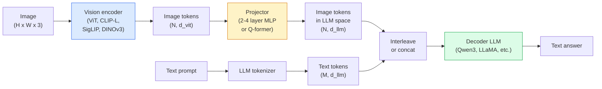

# Görme Dil Modelleri  ViT-MLP-LLM Şablonu 

> Bir görüntü kodlayıcı bir resmini jetonlara dönüştürür. Bir MLP projeksiyonu bu jetonları LLM'nin gömülme alanına haritası yapar.

> **【中文解读】**视觉编码器将图像转换为标志,MLP 投影层将这些标志映射到LLM'in嵌入空间,语言模型完成剩余工作──ViT-MLP-LLM, 2026 yılında tüm üretim sınıfı视觉语言模型 (VLM) 标准模式包括GPT-4V、Claude 3 Vision、LLaVA等──

> **【拓展：VLM 的应用】**VLM, birçok modoldaki AI'nin merkezi:GPT-4V(图像问答) Claude Vision(文档分析) ✓LLaVA(开源视觉对话) ✓Google Gemini(多模态推理)  Finansal alanda, VLM, mali haberler için kullanılabilir ✓ Kontrat akıllı inceleme、票据自动处理──

**Type:** Learn + Use | **类型:** 学习 + 应用
**Languages:** Python | **语言:** Python
**Prerequisites:** Phase 4 Lesson 14 (ViT), Phase 4 Lesson 18 (CLIP), Phase 7 Lesson 02 (Self-Attention) | **前置知识:** Phase 4 Lesson 14（ViT），Phase 4 Lesson 18（CLIP），Phase 7 Lesson 02（自注意力）
**Time:** ~75 minutes | **时间:** ~75 分钟

## Öğrenme hedefleri

- ViT-MLP-LLM mimarisini belirtin ve üç bileşenin her birinin katkısını açıklayın.
- Qwen3-VL, InternVL3.5, LLaVA-Next ve GLM-4.6V'yi parametre sayımı, bağlam uzunluğu ve referans performansı ile karşılaştırın
- DeepStack'i açıklayın: Niçin çok seviyeli ViT özellikleri, görme dili ayarlarını tek son katman özelliklerinden daha iyi sıkıştırıyor
- Üretimdeki VLM halüsinasyonunu çapraz modal hata oranı (CMER) ile ölç ve sinyali uyarın.

> **【中文解读】**Öğrenme hedefi, ders bitirilmesinden sonra öğrenilmesi gereken temel becerileri listeler.


## Sorunlar. Sorunlar.

CLIP (Fase 4 Ders 18) size görüntüler ve metin için paylaşılan gömleyici alan sağlar, bu sıfır çekim sınıflandırması ve kurtarma için yeterlidir. CLIP, "Bu görüntüde kaç kırmızı araba var?" cevabını veremez çünkü CLIP metin üretmez  sadece benzerlikleri puanlar.

> CLIP(IV.DURASI 18. Sınıf) size resim ve metin paylaşım yerleştirme alanı verir, bu da "Bu tabloda birkaç kırmızı araba var mı?" diye cevap veremez çünkü CLIP metin üretmez.

Görüş Dil Modelleri (VLM)  Qwen3-VL, InternVL3.5, LLaVA-Next, GLM-4.6V  bir CLIP ailesi görüntü kodlayıcıyı tam bir dil modeline bağlar. Model bir görüntü artı bir soru görür ve bir cevap üretir. 2026 yılında açık kaynaklı VLM'ler multimodal referanslar (MMMU, MMBench, DocVQA, ChartQA, MathVista, OSWorld) üzerinde GPT-5 ve Gemini-2.5-Pro ile rekabet eder veya yener.

> 视觉语言模型(VLM) Qwen3-VL、InternVL3.5、LLaVA-Next、GLM-4.6V CLIP ailesinin görüntü kodlayıcılarını tam bir dil modeliye bağlayacak.

Üç parça (ViT, projector, LLM) standarttır.Modeller arasındaki farklar ViT, hangi projector, hangi LLM, eğitim verileri ve uyum tarifidir.

> Üç Komponent (ViT、投影器、LLM) standart konfigürasyonlardır. Modeller arasındaki fark hangi ViT、 hangi projector、 hangi LLM、 eğitim verileri ve hazırlık programları ile bağlıdır.

## Konsepten bir şey.

> **【中文解读】**Bu bölümde temel kavramlar ve teoriler hakkında konuşuluyor. Bu kavramları öğrenmek, sonradan gerçekleştirilme önemi, aynı zamanda, görüşmeler ve mühendislik uygulamalarında yüksek sıklıkta yapılan incelemelerin bilgi noktasıdır.


### ViT-MLP-LLM mimarisi



1. **Vision encoder** önceden eğitilmiş bir ViT (CLIP-L/14, SigLIP, DINOv3 veya ince ayarlanmış bir variant).
   Çeviri:**视觉编码器**预训练的 ViT(CLIP-L/14、SigLIP、DINOv3 或微调变体)
2. **Projector** LLM'nin yerleştirme boyutuna görme simgelerini harcayacak küçük bir modül (2-4 kat MLP veya bir Q-former).
   Çeviri:**投影器**小型模块 (~ 2-4 層 MLP veya Q-former), görsel token 映射到LLM'in嵌入维度──
3. **LLM** sadece dekodörlü bir dil modeli (Qwen3, Llama, Mistral, GLM, InternLM). Görüş + metin işaretlerini sırayla okuyor, metin üretir.
   Çeviri:**LLM**仅解码器语言模型(Qwen3、Llama、Mistral、GLM、InternLM) ・・・顺序读取视觉 + 文本代币,生成文本。

Üç parça da prensip olarak eğitimlidir. Pratikte, görüntü kodlayıcı ve LLM çoğunlukla donmuş kalırken projektor  birkaç milyar sinyal parametreyi ucuz bir şekilde tren eder.

> Üç bölüm prensip üzerinde eğitimlidir. Uygulamalarda, görsel kodlayıcı ve LLM'de sadece projector eğitimi düşük maliyetle milyarlarca parametre sinyal elde eder.

### DeepStack

Vanilla projeksiyonu sadece son ViT katmanını kullanır. DeepStack (Qwen3-VL) örnekleri birden fazla ViT derinliklerinden özellikler ve onları yığar. Derin katmanlar yüksek düzeyde semantik taşır; daha derin katmanlar ince tanelerli uzaylı ve doku bilgileri taşır. LLM'ye ikisini de eklemek "resim ne içerir" (semantik) ve "tam olarak nerede" (yerli yerleşim) arasındaki boşluğu kapatır.

> 朴素投影只使用ViT 最后一层――DeepStack(Qwen3-VL) birden fazla ViT derinlikteki örnek özellikleri并堆叠──更深层携带高级语义;更浅层携带细粒度空间和纹理信息──将两者都送入 LLM 弥合了"图像包含什么"(语义) 和"具体在哪里" (rüzgârlı konumlandırma) arasındaki fark──

### Üç eğitim aşaması

Modern VLM'ler aşamalar halinde trenle:

1. **Alignment** ViT ve LLM dondurma. Sadece projekörü görüntü-başlık parları üzerinde eğit.
   Çeviri:**对齐**结 ViT 和 LLM── sadece görüntü-Üstü eğitim projektörü için  teach projector will visual space mapping to language space──
2. **Pre-training** her şeyi dondurmak. Büyük ölçekte birbirine karışmış görüntü-metin verileri (500M+ çift) üzerinde çalıştırmak.
   Çeviri:**预训练**解一切──大规模交织图像文本数据上训练(5亿+对)──构建模型的视觉知识──
3. **Instruction tuning** kurate edilmiş (resim, soru, cevap) üçlüler üzerinde ince ayarlama. Konuşma davranışını ve görev biçimlerini öğretir.
   Çeviri:**指令微调**在精选的(图像,问题,答案) 三元组上微调──教会对话行为和任务格式──这将"视觉感知 LM"转变为可用助手──

LoRA ince ayarlarının çoğu küçük bir etiketlenen veri kümesi ile 3. aşama hedefliyor.

### Model aile karşılaştırması (2026 başlarında)

| Model | Params | Vision encoder | LLM | Context | Strengths |
|-------|--------|----------------|-----|---------|-----------|
| Qwen3-VL-235B-A22B (MoE) | 235B (22B active) | custom ViT + DeepStack | Qwen3 | 256K | General SOTA, GUI agent |
| Qwen3-VL-30B-A3B (MoE) | 30B (3B active) | custom ViT + DeepStack | Qwen3 | 256K | Smaller MoE alternative |
| Qwen3-VL-8B (dense) | 8B | custom ViT | Qwen3 | 128K | Production dense default |
| InternVL3.5-38B | 38B | InternViT-6B | Qwen3 + GPT-OSS | 128K | Strong MMBench / MMVet |
| InternVL3.5-241B-A28B | 241B (28B active) | InternViT-6B | Qwen3 | 128K | Competitive with GPT-4o |
| LLaVA-Next 72B | 72B | SigLIP | Llama-3 | 32K | Open, easy to fine-tune |
| GLM-4.6V | ~70B | custom | GLM | 64K | Open-source, strong OCR |
| MiniCPM-V-2.6 | 8B | SigLIP | MiniCPM | 32K | Edge-friendly |

### Görsel ajanlar

Qwen3-VL-235B OSWorld'de en iyi global performansına ulaştı **visual agents**Bu modelle, bir ekran görüntüsü görür, kullanıcı aracını anlar ve eylemler (klik, yaz, kaydır) yayar. Araçlarla birleştirildiğinde, yaygın masaüstü görevlerinde döngüyü kapatır.

### Ajantik yetenekler + RoPE çeşitleri

VLM'ler bilmeli .**when**Qwen3-VL, T-RoPE'den (zamanlı dönüm pozisyonları yerleştirme) **text-based time alignment** video çerçeveleri ile birbirine karışmış açık bir zaman damgası metin işaretleri.`<timestamp 00:32>`"Sırırır, çabuk" ve zamanlı ilişkiler hakkında düşünüyor.

### Düzeltme sorunu

Arama verilerindeki görüntü-metin çiftlerinin %12'si görüntüde tamamen yerleşmeyen açıklamalar içerir. Bu konuda eğitilmiş bir VLM sessizce halüsinasyon yapmayı öğrenir  nesneler yapmayı, yanlış okuyan sayıları, ilişkileri icat etmeyi.

Skywork.ai , **Cross-Modal Error Rate (CMER)**Takip etmek için:

```
CMER = fraction of outputs where the text confidence is high but the image-text similarity (via a CLIP-family checker) is low
```

Yüksek CMER, modelin görüntülere dayanmayan şeyleri güvenle söylediğini gösterir. CMER'i izlemek ve onu bir üretim KPI olarak ele almak, uygulamalarında halüsinasyon oranını %35 oranında azaltır.

### LoRA / QLoRA ile ince ayarlama

70B VLM'nin tam ince ayarlaması çoğu takım için erişilemez. Dikkat + projektor katmanlarında LoRA (rank 16-64) veya 4 bit taban ağırlığı olan QLoRA, tek bir A100 / H100'e uygundur.$100-$5 bin hesaplama, 2-10 saat eğitim.

### Yerel mantık hala zayıf .

Mevcut VLM'ler, alansal mantıklama referansları (yukarı-aşağı, sol-sağ, sayım, mesafe) üzerinde %50-60% puan verir. Kullanım durumunuz "ne nesnenin üstünde" olduğuna bağlıysa,  genel VLM performansının insan altında olduğunu onaylayın. saf alan görevleri için VLM'den daha iyi alternatifler: özel bir anahtar nokta / poz tahmincisi, derinlik modeli veya kutu geometrisini sonrası işlenmiş bir tespit modeli.

> **【拓展：工业部署中的视觉系统】**Gerçek endüstriye dağıtımında, görsel modeller gecikme, model büyüklüğü, kenar cihazların uyumlu olması gibi sorunları düşünmelidir. TensorRT, ONNX Runtime, OpenVINO, yaygın olarak kullanılan bir görsel model hızlandırma aracıdır.

> **【拓展：数据标注与质量】**视觉任务的效果高度依赖标签数据质――Label Studio、CVAT is the mainstream tagging tool――在工业场景中,主动学习(Active Learning) 标签成本ı azaltabilir:模型对不确定的样本请求人工标签,确定性的样本自动标签──


## Yapın.

> **【中文解读】**Bu bölüm kodla sıfırdan gerçekleştirilen çekirdek algoritmasıdır. Bu "sıfırdan" yöntem çerçevenin arkasındaki prensipleri anlama yardımcı olur.

```figure
v4-vlm-projector
```

## Yapın

### Adım 1: Projector

En sık antrenman yapacağınız bölüm. 2-4 kat MLP ile GELU.

```python
import torch
import torch.nn as nn


class Projector(nn.Module):
    def __init__(self, vit_dim=768, llm_dim=4096, hidden=4096):
        super().__init__()
        self.net = nn.Sequential(
            nn.Linear(vit_dim, hidden),
            nn.GELU(),
            nn.Linear(hidden, llm_dim),
        )

    def forward(self, x):
        return self.net(x)
```

Giriş bir `(N_patches, d_vit)`- Çıktıranı.`(N_patches, d_llm)`LLM her çıkış satırını bir başka işaret olarak değerlendirir.

### Adım 2: ViT-MLP-LLM'yi sonundan sonuna monte edin

Ön geçitinin iskeletini en az bir VLM için kullanın.`transformers`Bu konseptal düzen.

```python
class MinimalVLM(nn.Module):
    def __init__(self, vit, projector, llm, image_token_id):
        super().__init__()
        self.vit = vit
        self.projector = projector
        self.llm = llm
        self.image_token_id = image_token_id  # placeholder token in text prompt

    def forward(self, image, input_ids, attention_mask):
        # 1. vision features
        vision_tokens = self.vit(image)                     # (B, N_patches, d_vit)
        vision_embeds = self.projector(vision_tokens)       # (B, N_patches, d_llm)

        # 2. text embeddings
        text_embeds = self.llm.get_input_embeddings()(input_ids)  # (B, M, d_llm)

        # 3. replace image placeholder tokens with vision embeds
        merged = self._merge(text_embeds, vision_embeds, input_ids)

        # 4. run LLM
        return self.llm(inputs_embeds=merged, attention_mask=attention_mask)

    def _merge(self, text_embeds, vision_embeds, input_ids):
        out = text_embeds.clone()
        expected = vision_embeds.size(1)
        for b in range(input_ids.size(0)):
            positions = (input_ids[b] == self.image_token_id).nonzero(as_tuple=True)[0]
            if len(positions) != expected:
                raise ValueError(
                    f"batch item {b} has {len(positions)} image tokens but vision_embeds has {expected} patches."
                    " Every sample in the batch must be pre-padded to the same number of image placeholder tokens.")
            out[b, positions] = vision_embeds[b]
        return out
```

- Evet .`<image>`Metinde yer tutan token gerçek görüntü yerleştirmeleri ile değiştirilmiştir  aynı LLaVA, Qwen-VL ve InternVL kullanımı.

### Adım 3: CMER hesaplama

Hafif bir çalışma süresi kontrolü.

```python
import torch.nn.functional as F


def cross_modal_error_rate(image_emb, text_emb, text_confidence, sim_threshold=0.25, conf_threshold=0.8):
    """
    image_emb, text_emb: embeddings of image and generated text (normalised internally)
    text_confidence:     mean per-token probability in [0, 1]
    Returns:             fraction of high-confidence outputs with low image-text alignment
    """
    image_emb = F.normalize(image_emb, dim=-1)
    text_emb = F.normalize(text_emb, dim=-1)
    sim = (image_emb * text_emb).sum(dim=-1)        # cosine similarity
    high_conf_low_sim = (text_confidence > conf_threshold) & (sim < sim_threshold)
    return high_conf_low_sim.float().mean().item()
```

CMER'i bir üretim KPI olarak ele alın. Son nokta, istintap tipi, müşteri başına izleyin. Yüksek CMER, modelin bazı giriş dağılımları hakkında halüsinasyon yapmaya başladığını gösterir.

### 4. adım: Oyuncak VLM sınıflandırıcısı (hareket edilebilir)

Sahte "ViT özellikleri" giriyor, küçük bir LLM tarzındaki bir simge bir sınıf öngörüyor.

```python
class ToyVLM(nn.Module):
    def __init__(self, vit_dim=32, llm_dim=64, num_classes=5):
        super().__init__()
        self.projector = Projector(vit_dim, llm_dim, hidden=64)
        self.head = nn.Linear(llm_dim, num_classes)

    def forward(self, vision_tokens):
        projected = self.projector(vision_tokens)
        pooled = projected.mean(dim=1)
        return self.head(pooled)
```

> **【中文解读】**Bu bölümde, PyTorch, HuggingFace gibi olgun çerçeveler nasıl kullanılacağını gösterir.


Bunu sentetik (önümselleme, sınıf) çiftlere 200 adımdan az bir süre içinde  projector örneğinin çalıştığı göstermek için yeterli olarak yerleştirebilirsiniz.


> **【拓展：视觉模型的持续学习】**Üretim ortamında, görsel modeller yeni verilere sürekli uyum sağlamak gerekir. Yeni ürünler, yeni sahne, yeni ışık koşulları. Sürekli öğrenme. Sürekli öğrenme.

## Çerçeveyi kullanın.

2026'da üretim ekiplerinin VLM'leri kullanmalarının üç yolu:

- **Hosted API** OpenAI Vision, Anthropic Claude Vision, Google Gemini Vision.
- **Open-source self-host** Qwen3-VL veya InternVL3.5 via `transformers`ve `vllm`Tam kontrol, daha yüksek ön çaba.
- **Fine-tune on domain** yükleme Qwen2.5-VL-7B veya LLaVA-1.6-7B, LoRA 5k-50k özel örnekler, hizmet ile `vllm`veya `TGI`- Evet .

```python
from transformers import AutoProcessor, AutoModelForVision2Seq
import torch
from PIL import Image

model_id = "Qwen/Qwen3-VL-8B-Instruct"
processor = AutoProcessor.from_pretrained(model_id)
model = AutoModelForVision2Seq.from_pretrained(model_id, torch_dtype=torch.bfloat16, device_map="auto")

messages = [{
    "role": "user",
    "content": [
        {"type": "image", "image": Image.open("plot.png")},
        {"type": "text", "text": "What does this chart show?"},
    ],
}]
inputs = processor.apply_chat_template(messages, add_generation_prompt=True, tokenize=True, return_dict=True, return_tensors="pt").to("cuda")
generated = model.generate(**inputs, max_new_tokens=256)
answer = processor.decode(generated[0][inputs["input_ids"].shape[1]:], skip_special_tokens=True)
```

> **【中文解读】**Bu bölümde modellerin kullanılabilir ürünler için nasıl dağıtılacağı üzerinde yoğunlaşmaktadır.


`apply_chat_template`- Saklıyor .`<image>`Yer tutma tokenizasyonu; model birleşmeyi içsel olarak ele alır.


## İndirin . Ürünler .

> **【中文解读】**练习题按照易/中级/难三度递进;;建议至少完成中级题,Hard级适合深入研究或面试准备;;


Bu ders şunları ortaya çıkarır:

- `outputs/prompt-vlm-selector.md` doğruluk, gecikme, bağlam uzunluğu ve bütçeye göre Qwen3-VL / InternVL3.5 / LLaVA-Next / API'yi seçer.
- `outputs/skill-cmer-monitor.md` bir üretim VLM uç noktasını, çapraz modal hata oranı, uç noktası için araçlama levhaları ve uyarı eşiği ile kod gönderir.

## Egzersizler.

1. **(Easy)**Beş görüntüde açılan herhangi bir VLM üzerinden üç çağrı ("bu nedir?", "objeleri sayın", "sehneni açıklayın") çalıştırın. Her cevabı doğru / kısmen doğru / el ile halüsinasyonlu olarak not edin. İlk geçiş CMER gibisi oranını hesaplayın.
2. **(Medium)**Hedef alanının 500 görüntüde LoRA (16 sıralama) ile ince ayarlama yapan Qwen2.5-VL-3B veya LLaVA-1.6-7B.
3. **(Hard)**VLM'nin görüntü kodlayıcısını varsayılan SigLIP/CLIP yerine DINOv3 ile değiştirin. Sadece projeksiyoncuyu (dondurulmuş LLM + dondurulmuş DINOv3) yeniden eğit.

> **【中文解读】**术语表中的"İnsanların ne dediği" vs "Gerçekten ne anlama geldiği" 区分日常口语和精确技术含义──在团队协作中,统一术语定义可以避免大量沟通误解──


## Anahtar Şartlar .

| Term | What people say | What it actually means |
|------|----------------|----------------------|
| ViT-MLP-LLM | "The VLM pattern" | Vision encoder + projector + language model; every 2026 VLM |
| Projector | "The bridge" | 2-4 layer MLP (or Q-former) that maps vision tokens into LLM embedding space |
| DeepStack | "Qwen3-VL feature trick" | Multi-level ViT features stacked rather than last-layer only |
| Image token | "<image> placeholder" | Special token in the text stream replaced by projected vision embeddings |
| CMER | "Hallucination KPI" | Cross-Modal Error Rate; high when text confidence is high but image-text similarity is low |
| Visual agent | "VLM that clicks" | VLM operating GUIs (OSWorld, mobile, web) with tool calls |
| Q-former | "Fixed-count token bridge" | BLIP-2 style projector producing a fixed number of visual query tokens |
| Alignment / pre-training / instruction tuning | "Three stages" | Standard VLM training pipeline |

> **【中文解读】**延伸阅读, derinlemesine öğrenme için yüksek kaliteli kaynaklar sağladı. Bu makaleler ve dersler, derinlemesine anlama ihtiyacı olan okuyuculara uygun olarak bu alanın klasik referanslarıdır.


## Daha fazla okumak

- [Qwen3-VL Technical Report (arXiv 2511.21631)](https://arxiv.org/abs/2511.21631)
- [InternVL3.5 Advancing Open-Source Multimodal Models (arXiv 2508.18265)](https://arxiv.org/html/2508.18265v1)
- [LLaVA-Next series](https://llava-vl.github.io/blog/2024-05-10-llava-next-stronger-llms/)
- [BentoML: Best Open-Source VLMs 2026](https://www.bentoml.com/blog/multimodal-ai-a-guide-to-open-source-vision-language-models)
- [MMMU: Multi-discipline Multimodal Understanding benchmark](https://mmmu-benchmark.github.io/)
- [VLMs in manufacturing (Robotics Tomorrow, March 2026)](https://www.roboticstomorrow.com/story/2026/03/when-machines-learn-to-see-like-experts-the-rise-of-vision-language-models-in-manufacturing/26335/)
