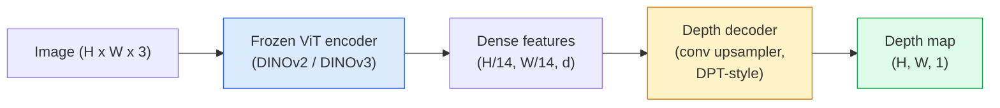

# Teklü derinlik ve jeometri tahminleri .

> Derinlik haritası, her pikselün kameradan uzaklıkta olduğu tek kanallı bir görüntüdür. Bir RGB çerçevesinden tahmin etmek eskiden stereo veya LiDAR olmadan imkansızdı. 2026 yılında dondurulmuş bir ViT kodlayıcı ek olarak hafif bir baş, yerçekiminin birkaç yüzdesi içinde olur.

> **【中文解读】**Derinlik grafikleri, tek kanal görüntüleridir, her bir görüntü değeri, bir fotoğrafın mesafesini ifade eder.

> **【拓展：深度估计的应用】**单目深度估计在自动驾驶 (自动驾驶) 补充 LiDAR) AR/VR (场景理解) 机器人导航、3D 照片效果 (背景虚化)                                                                                                                                                                                                                                    

**Type:** Build + Use | **类型:** 动手 + 应用
**Languages:** Python | **语言:** Python
**Prerequisites:** Phase 4 Lesson 14 (ViT), Phase 4 Lesson 17 (Self-Supervised Vision), Phase 4 Lesson 07 (U-Net) | **前置知识:** Phase 4 Lesson 14（ViT），Phase 4 Lesson 17（自监督视觉），Phase 4 Lesson 07（U-Net）
**Time:** ~60 minutes | **时间:** ~60 分钟

## Öğrenme hedefleri

- Her üretim modelesinin (MiDaS, Marigold, Depth Anything V3, ZoeDepth) çözdüğü görevi ve metrik derinliği ve durumu ayırt edin.
- DINOV2 omurgası) olarak, kalibrasyon olmadan keyfi bir görüntü için derinliği tahmin etmek için Depth Anything V3 kullanın
- Tek bir görüntüden (perspektiv işaretler, doku gradiyentileri, öğrenilen geçmişler) neden tek gözlü derinliği çalışmadığını ve neyi geri alamadığını açıklayın (absolut ölçek, gizlenmiş jeometri)
- 2D tespitlerini derinlik haritası ve pinhole kamerası içsellerini kullanarak 3D noktalara kaldırın

> **【中文解读】**Öğrenme hedefi, ders bitirilmesinden sonra öğrenilmesi gereken temel becerileri listeler.


## Sorunlar. Sorunlar.

Derinlik, 2 boyutlu bilgisayar görmesinde eksik olan eksik bir eksindir. RGB'yi göz önüne alarak, görüntü düzleminde nesnelerin nerede göründüğünü bilirsiniz; ne kadar uzakta olduklarını bilmiyorsunuz. Derinlik sensörleri (stereo makineleri, LiDAR, uçuş zamanı) bunu doğrudan çözür ancak pahalı, kırılgan ve menzil sınırlıdır.

> 2 boyutlu bilgisayar görmesinde eksik olan bir etektir. RGB verildiğinde, nesnelerin resim düzleminde bulunduğunu bilirsin; bunların ne kadar uzak olduğunu bilmezsin.

Monocular derinlik tahminleri  tek bir RGB çerçevesinden derinlik tahmin etmek  bulanık, güvenilir olmayan çıkış üretmek için kullanılır. 2026 yılına kadar büyük önceden eğitilmiş kodlayıcılar bunu değiştirdi: Depth Anything V3 dondurulmuş DINOv2 omurgasını kullanır ve kapalı, açık, tıbbi ve uydu alanlarında genelleştirilen derinlik haritalarını üretir. Marigold derinliği koşullu bir difüzyon sorunu olarak yeniden çerçeveliyor. ZoeDepth gerçek metrik mesafeleri geriye doğrular.

> 单目深度估算单个RGB 预测深度过去产生模糊、不可靠的输出──到2026年大型预训编码器改变了这一点:Deepth Anything V3 使用结的DINOv2 骨干并产生跨室内、室外、医学和卫星领域泛化的深度图──Marigold derinliği koşul genişletilmesi sorunları olarak yeniden tanımlayacak──ZoeDepth geri dönüş gerçek kamu mesafesine──

Derinlik ayrıca 2D algılama ve 3D anlayış arasındaki köprüdür: algılanan kutu piksellerini derinlik ile çarpıp 2D nesneyi 3D nokta bulutuna çıkarırsınız. Bu, her AR okluzyon sisteminin, her engellerden kaçınma borusunun ve her "çanç kaldır" robotunun çekirdeğidir.

> Derinlik 2D inceleme ve 3D anlama arasındaki köprüdür: inceleme yapılmış çerçevenin resmini derinlik katlayarak, 2D nesnelerin 3D noktaya yükseltilebilmesini sağlarsınız. Bu, her AR 遮 sisteminin, her engel akışı hattının ve her "çanağı kaldırma" makinesinin merkezi.

## Konsepten bir şey.

> **【中文解读】**Bu bölümde temel kavramlar ve teoriler hakkında konuşuluyor. Bu kavramları öğrenmek, sonradan gerçekleştirilme önemi, aynı zamanda, görüşmeler ve mühendislik uygulamalarında yüksek sıklıkta yapılan incelemelerin bilgi noktasıdır.


### Relatif vs metrik derinlik

- **Relative depth** sipariş edildi `z`"Pixel A, B'den daha yakındır, ancak mesafe oranı metreye bağlanmaz".
  Çeviri:**相对深度**有序的 `z`值,没有真实世界单位──"A'nın B'ye oranı yakın, ancak mesafe oranı belirsiz mi¬¬¬¬".
- **Metric depth** kamera'dan metreye göre mutlak mesafe.Modelin görüntü işaretleri ile gerçek mesafe arasındaki istatistik ilişkiyi öğrenmesini gerektirir.
  Çeviri:**度量深度** Fotoğrafın çıkışının mutlak mesafesinden 米)  ◊ model öğrenmek için görüntü bağlantısı ile gerçek mesafe arasındaki istatistik ilişki gerekir.

MiDaS ve Depth Anything V3 nispet derinlik üretir. Marigold nispet derinlik üretir. ZoeDepth, UniDepth ve Metric3D metrik derinlik üretir. Metrik modeller kamera içseline duyarlıdır; nispet modeller değildir.

> MiDaS 和 Depth Anything V3 产生对深度──Marigold 产生对深度──ZoeDepth、UniDepth 和 Metric3D 产生度深度──度模型对相机内参敏感;相对模型则不敏感──

### Kodlayıcı-dekoder örneği



Deep Anything V3 kodlayıcıyı donduruyor ve sadece DPT tarzı dekodörü eğitmektedir.

> Derinlik Herhangi bir V3 结编码器, sadece DPT 风格的解码器──编码器提供丰富特征;解码器将它们插值回图像分辨率并回归深度──

### Tek bir görüntü neden derinlik üretir?

2 boyutlu bir görüntü derinlik ile ilişkili birçok monokula işaret içerir:

> Bir 2 boyutlu görüntü derinlik ile ilgili birçok tek bir bakış açısını içerir:

- **Perspective** 3D paralel çizgiler 2D'de birleşti.
  Çeviri:**透视**3D ortalarında düz çizgi 2D ortalarında bir araya gelmek üzere.
- **Texture gradient** uzak yüzeylerde daha küçük, daha yoğun bir doku vardır.
  Çeviri:**纹理梯度**                                                                                                                                                                                                                                                              
- **Occlusion order** Yakın nesneler daha uzak nesnelerden uzaklaşır.
  Çeviri:**遮挡顺序**Yakınlık nesneyi gizler.
- **Size constancy** bilinen nesneler (maşınlar, insanlar) yaklaşık ölçek verir.
  Çeviri:**大小恒常性**已知物体 (車、人)                                                                                                                                                                                                                                                          
- **Atmospheric perspective** Uzak nesneler dışarıdaki sahnelerde daha sisli ve mavi görünür.
  Çeviri:**大气透视** Dış mekanlarda daha fazla mavi görünen nesneler.

Milyarlarca görüntü üzerinde eğitilmiş bir ViT bu ipuçlarını içe aktarır. Yeterince veriler ve güçlü bir omurgan ile, monokul derinliği açık 3 boyutlu denetim olmadan makul bir doğrulukta bulunur.

> Binlerce milyar görüntü üzerinde eğitim alan ViT bu ipuçlarını içerecek. Yeterince veri ve güçlü kemikleri olan, tek göz derinliği olmadan herhangi bir açık 3D izlemeyi sağlayacak.

### Tek gözlü derinlik ne yapamaz

- **Absolute metric scale**Şebekenin "çanağın kaşıktan iki kat uzakta" olduğunu tahmin edebilmesi için, kaşıkın 1 metre mi yoksa 10 metre mi uzakta olduğunu bilmeden.
- **Occluded geometry** bir sandalyenin arkası görünmez ve güvenilir bir şekilde çıkarılamaz.
- **Truly untextured / reflective surfaces** aynalar, cam, teker teker duvarlar.

### 2026'da V3'ün derinliği

- Vanilla DINOv2 ViT-L/14 kodlayıcı olarak (dondurulmuş).
- DPT dekodörü.
- Çeşitli kaynaklardan ortaya çıkan görüntü çiftleri üzerinde eğitilmiştir (fotometrik tutarlılıktan başka açık bir derinlik denetimi gerekmez).
-                                                                                                                                                                                                                                                                                                                                                                                                                                                                                                                              **an arbitrary number of visual inputs, with or without known camera poses**- Evet .
- Monocular derinlik, herhangi bir görüntü geometrisinde, görsel rendere, kamera poz tahmininde.

2026'da derinliklere ihtiyacınız olduğunda bu bir düşüş modeli.

> Bu 2026 yılında, derinlemesine ihtiyacınız olduğunda doğrudan kullanılacak bir model.

### Marigold  derinlik için yayılma

Marigold (Ke et al., CVPR 2024) derinlik tahminini koşullu görüntü-resim yayılması olarak yeniden çerçeveliyor. Kondisyonlama: RGB. Hedef: derinlik haritası. Önceden eğitilmiş Stable Diffusion 2 U-Net'i omurgası olarak kullanıyor. Çıktı derinlik haritaları nesnelerin sınırlarında olağanüstü derecede keskindir. Ticaret: ileriye aktarılan modellerden daha yavaş sonuçlama (10-50 adım tanımlayan).

> Marigold(Ke 等,CVPR 2024) derinlik tahminini yeniden çerçeveleme şekil şekil genişletilmesi için şartlar oluşturur.

### İçsel özellikler ve çubuklu kamera

Bir piksel kaldırmak için `(u, v)`derinliklerle`d`3 boyutlu bir noktaya kadar.`(X, Y, Z)`Kamera koordinatlarında:

```
fx, fy, cx, cy = camera intrinsics
X = (u - cx) * d / fx
Y = (v - cy) * d / fy
Z = d
```

İçseller EXIF metadata, kalibrasyon kalıpı veya monocular içsel değerlendirici (Perspective Fields, UniDepth) 'den gelir. İçseller olmadan, hala bir nokta bulutunu görüntüleme için kullanılabilir olan 60-70 ° FOV ve orta çözünürlük ilkelerini varsayarak göstermek mümkündür.

### Değerlendirme

İki standart metrik:

- **AbsRel**(kesin bir aksamlı hatası): `mean(|d_pred - d_gt| / d_gt)`Daha düşük daha iyidir.
- **delta < 1.25**(sırh doğruluğu): piksellerin bölümü,`max(d_pred/d_gt, d_gt/d_pred) < 1.25`Daha yüksek daha iyidir. SOTA için 0.9+.

Nispet derinlik için (Deepth Anything V3, MiDaS), değerlendirme her iki metrikin ölçek ve değişim değişmez sürümlerini kullanır.

> **【中文解读】**Bu bölüm kodla sıfırdan gerçekleştirilen çekirdek algoritmasıdır. Bu "sıfırdan" yöntem çerçevenin arkasındaki prensipleri anlama yardımcı olur.

> **【拓展：工业部署中的视觉系统】**Gerçek endüstriye dağıtımında, görsel modeller gecikme, model büyüklüğü, kenar cihazların uyumlu olması gibi sorunları düşünmelidir. TensorRT, ONNX Runtime, OpenVINO, yaygın olarak kullanılan bir görsel model hızlandırma aracıdır.

> **【拓展：数据标注与质量】**视觉任务的效果高度依赖标签数据质――Label Studio、CVAT is the mainstream tagging tool――在工业场景中,主动学习(Active Learning) 标签成本ı azaltabilir:模型对不确定的样本请求人工标签,确定性的样本自动标签──


## Yapın.
```figure
depth-sweep
```

## Yapın

### Adım 1: Derinlik ölçümleri

```python
import torch

def abs_rel_error(pred, target, mask=None):
    if mask is not None:
        pred = pred[mask]
        target = target[mask]
    return (torch.abs(pred - target) / target.clamp(min=1e-6)).mean().item()


def delta_accuracy(pred, target, threshold=1.25, mask=None):
    if mask is not None:
        pred = pred[mask]
        target = target[mask]
    ratio = torch.maximum(pred / target.clamp(min=1e-6), target / pred.clamp(min=1e-6))
    return (ratio < threshold).float().mean().item()
```

Değerlendirme öncesi her zaman geçersiz derinlik piksellerini (sıfır, NaN, doymuş) gizleyin.

### Adım 2: Ölçek ve değişim düzeni

Nispet derinlik modelleri için, hesaplama metriklerinden önce tahminleri temel gerçeğe uyumlandırın.`a * pred + b = target`- ...

```python
def align_scale_shift(pred, target, mask=None):
    if mask is not None:
        p = pred[mask]
        t = target[mask]
    else:
        p = pred.flatten()
        t = target.flatten()
    A = torch.stack([p, torch.ones_like(p)], dim=1)
    coeffs, *_ = torch.linalg.lstsq(A, t.unsqueeze(-1))
    a, b = coeffs[:2, 0]
    return a * pred + b
```

Çık .`align_scale_shift`Daha önce`abs_rel_error`MiDaS / Depth Anything değerlendirme sırasında.

### Adım 3: Derinliği nokta bulutuna kaldır

```python
import numpy as np

def depth_to_point_cloud(depth, intrinsics):
    H, W = depth.shape
    fx, fy, cx, cy = intrinsics
    v, u = np.meshgrid(np.arange(H), np.arange(W), indexing="ij")
    z = depth
    x = (u - cx) * z / fx
    y = (v - cy) * z / fy
    return np.stack([x, y, z], axis=-1)


depth = np.random.uniform(0.5, 4.0, (240, 320))
intr = (320.0, 320.0, 160.0, 120.0)
pc = depth_to_point_cloud(depth, intr)
print(f"point cloud shape: {pc.shape}  (H, W, 3)")
```

3D'de kaldırılan her uygulama bir işlevi, nokta bulutunu dışarıya aktarın.`.ply`MeshLab veya CloudCompare' de açılır.

### 4. Adım: Sintez derinlik sahnesine sahip duman testi

```python
def synthetic_depth(size=96):
    yy, xx = np.meshgrid(np.arange(size), np.arange(size), indexing="ij")
    # Floor: linear gradient from near (top) to far (bottom)
    depth = 1.0 + (yy / size) * 4.0
    # Box in the middle: closer
    mask = (np.abs(xx - size / 2) < size / 6) & (np.abs(yy - size * 0.6) < size / 6)
    depth[mask] = 2.0
    return depth.astype(np.float32)


gt = torch.from_numpy(synthetic_depth(96))
pred = gt + 0.3 * torch.randn_like(gt)  # simulated prediction
aligned = align_scale_shift(pred, gt)
print(f"before align  absRel = {abs_rel_error(pred, gt):.3f}")
print(f"after align   absRel = {abs_rel_error(aligned, gt):.3f}")
```

### Adım 5: V3 kullanımı (referans)

```python
import torch
from transformers import pipeline
from PIL import Image

pipe = pipeline(task="depth-estimation", model="LiheYoung/depth-anything-v2-large")

image = Image.open("street.jpg").convert("RGB")
out = pipe(image)
depth_np = np.array(out["depth"])
```

> **【中文解读】**Bu bölümde, PyTorch, HuggingFace gibi olgun çerçeveler nasıl kullanılacağını gösterir.


Üç satır.`out["depth"]`Bu, PIL gri ölçeği olarak kullanılır. Matematik için numpy olarak dönüştürülür.


> **【拓展：视觉模型的持续学习】**Üretim ortamında, görsel modeller yeni verilere sürekli uyum sağlamak gerekir. Yeni ürünler, yeni sahne, yeni ışık koşulları. Sürekli öğrenme. Sürekli öğrenme.

## Çerçeveyi kullanın.

- **Depth Anything V3**(Meta AI / ByteDance, 2024-2026)  nispet derinlik için varsayılan.
- **Marigold**(ETH, 2024)  En yüksek görsel kalitede, yavaş sonuçlandırma.
- **UniDepth**(ETH, 2024)  Kamera içsel değerlendirmesi ile metrik derinlik.
- **ZoeDepth**(Intel, 2023)  metrik derinlik; daha eski, hala güvenilir.
- **MiDaS v3.1** miras, ancak stabil; karşılaştırma için iyi bir temel.

Tipik entegrasyon modeli:

1. RGB çerçeveli geliyor.
2. Derinlik modeli derinlik haritasını üretir.
3. Detektor kutular üretir.
4. Altın kutu merkezlerini derinlikten 3D'ye kaldırın; mevcutsa nokta bulutlarıyla birleşin.
5. Aşağı akıntı: AR kapatma, yol planlaması, nesnelerin boyut tahminleri, stereo değiştirme.

> **【中文解读】**Bu bölümde modellerin kullanılabilir ürünler için nasıl dağıtılacağı üzerinde yoğunlaşmaktadır.


Gerçek zamanlı kullanım için, Depth Anything V2 Small (INT8 kuantist) bir tüketici GPU'da 518x518'de ~30 fps'e çarpar.


## İndirin . Ürünler .

> **【中文解读】**练习题按照易/中级/难三度递进;;建议至少完成中级题,Hard级适合深入研究或面试准备;;


Bu ders şunları ortaya çıkarır:

- `outputs/prompt-depth-model-picker.md` Depth Anything V3, Marigold, UniDepth, MiDaS arasında seçimler, gecikme, metrik karşısındaki ihtiyaç ve sahne tipi.
- `outputs/skill-depth-to-pointcloud.md` derinlik haritalarından nokta bulutları doğru özsel işlemle oluşturan ve dışarıya aktarılan bir beceri`.ply`- Evet .

## Egzersizler.

1. **(Easy)**Masaüstünüzün herhangi 10 görüntüde Depth Anything V2 çalıştırın. Gri boyutlu PNG'ler olarak derinliği kaydetin ve kontrol edin. Tahmin edilen derinliği yanlış görünen bir nesneyi tanımlayın ve monoküler işaretlerin neden başarısız olduğunu açıklayın.
2. **(Medium)**RGB + derinlik V2'den verildiğinde, bir nokta bulutuna kaldırın ve `open3d`İki sahneyi (daha / dış) karşılaştırın ve hangi sahne daha güvenilir görünüyorsa not edin.
3. **(Hard)**Bilinen bir nesnenin konumundan sadece farklı olan beş çift görüntü alın (örneğin şişe 30 cm daha yakınına taşındı). Her ikisinde de metrik derinliği tahmin etmek için UniDepth kullanın. Tahmin edilen mesafe delta ile gerçek 30 cm arasındaki mesafeyi bildirin.

> **【中文解读】**术语表中的"İnsanların ne dediği" vs "Gerçekten ne anlama geldiği" 区分日常口语和精确技术含义──在团队协作中,统一术语定义可以避免大量沟通误解──


## Anahtar Şartlar .

| Term | What people say | What it actually means |
|------|----------------|----------------------|
| Monocular depth | "Single-image depth" | Depth estimation from one RGB frame, no stereo or LiDAR |
| Relative depth | "Ordered depth" | Ordered z-values without real-world units |
| Metric depth | "Absolute distance" | Depth in metres; requires calibration or a model trained with metric supervision |
| AbsRel | "Absolute relative error" | Mean of |d_pred - d_gt| / d_gt; standard depth metric |
| Delta accuracy | "delta < 1.25" | Fraction of pixels with prediction within 25% of ground truth |
| Pinhole camera | "fx, fy, cx, cy" | The camera model used to lift (u, v, d) to (X, Y, Z) |
| DPT | "Dense Prediction Transformer" | The conv-based decoder used on top of frozen ViT encoders for depth |
| DINOv2 backbone | "The reason it works" | Self-supervised features that generalise across domains without depth labels |

> **【中文解读】**延伸阅读, derinlemesine öğrenme için yüksek kaliteli kaynaklar sağladı. Bu makaleler ve dersler, derinlemesine anlama ihtiyacı olan okuyuculara uygun olarak bu alanın klasik referanslarıdır.


## Daha fazla okumak

- [Depth Anything V3 paper page](https://depth-anything.github.io/) DINOv2 kodlayıcı ile SOTA monocular derinliği
- [Marigold (Ke et al., CVPR 2024)](https://marigoldmonodepth.github.io/) Diffüzyon tabanlı derinlik tahminleri
- [UniDepth (Piccinelli et al., 2024)](https://arxiv.org/abs/2403.18913) İçsel derinliklerle metrik derinlik
- [MiDaS v3.1 (Intel ISL)](https://github.com/isl-org/MiDaS) Kanonik nispet derinlik baseline
- [DINOv3 blog post (Meta)](https://ai.meta.com/blog/dinov3-self-supervised-vision-model/) derinlik doğruluğunu yükselten kodlayıcı ailesi
