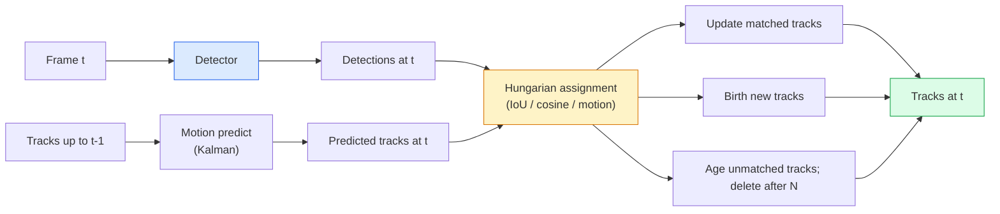

# Çoklu Nesne Takip & Video Hatırlama .

> Takip, tespit artı ilişki. Her çerçeveyi tespit edin. Bu çerçevenin tespitlerini son çerçevenin izlerine kimlik ile eşleştirin.

> **【中文解读】**Takip = 检测 + 关联── her 检测目标, sonra mevcut 检测 sonuçlarını 匹配──多目标跟踪──MOT ile ID 匹配──多目标跟踪──MOT) video anlama çekirdeği teknolojisi, 遮、消失、重现等 karmaşık durumları işleme ihtiyacı vardır──

> **【拓展：MOT 的应用】**Çok hedef takip etmek için güvenlik kontrolünde bulunmak gerekir.

**Type:** Build | **类型:** 动手
**Languages:** Python | **语言:** Python
**Prerequisites:** Phase 4 Lesson 06 (YOLO Detection), Phase 4 Lesson 08 (Mask R-CNN), Phase 4 Lesson 24 (SAM 3) | **前置知识:** Phase 4 Lesson 06（YOLO 检测），Phase 4 Lesson 08（Mask R-CNN），Phase 4 Lesson 24（SAM 3）
**Time:** ~60 minutes | **时间:** ~60 分钟

## Öğrenme hedefleri

- Arama-aradan tespit ile sorgu tabanlı takip arasında ayrım yapın ve algoritma aileleri (SORT, DeepSORT, ByteTrack, BoT-SORT, SAM 2 hafıza takipçisi, SAM 3.1 Object Multiplex) isimlendirin.
- Klasik izleme-iç tespit için IoU + Macar görevini sıfırdan uygula
- SAM 2'nin hafıza bankasını ve neden IoU tabanlı ilişkiden daha iyi bir şekilde okluzyona karşı çalışırken açıklayın.
- Üç takip ölçümünü okuyun (MOTA, IDF1, HOTA) ve belirli bir kullanım durumunda hangisinin önemli olduğunu seçin

> **【中文解读】**Öğrenme hedefi, ders bitirilmesinden sonra öğrenilmesi gereken temel becerileri listeler.


## Sorunlar. Sorunlar.

Bir detektor, nesnelerin tek bir çerçeve içinde nerede olduğunu söyler.`t`Çerçeve içinde bir tespit ile aynı nesne.`t-1`Bu olmadan, bir çizgiyi geçen nesneleri sayamazsınız, bir topun bir kapanış yoluyla takip edemezsiniz, ya da "4. araba 8 saniye boyunca pistteydi" bilemezsiniz.

> Bir denetçi bir nesneyi bir tekte bulduğunu söyler.`t`中哪个检测与第 `t-1` İçinde hangi denetim aynı nesneyi... yoksa, çizgiyi geçen nesnelerin sayısını hesaplayamazsın... korunan topu takip edemezsin, ya da "4 numaralı araba bu yolda 8 saniye sürmüştür" diyebilir.

Takip, her video ile ilgili ürün için gereklidir: spor analizi, izleme, otonom sürüş, tıbbi video analizi, vahşi yaşam izleme, kelime işaretleri sayımı. Temel yapı taşları paylaşılan: bir çerçeve detektörü, bir hareket modeli (Kalman filtre veya daha zengin bir şey), bir ilişki adım (Hungary algoritması IoU / cosine / öğrenilen özellikler) ve bir track yaşam döngüsü (doğum, güncelleme, ölüm).

> Following her video yönündeki ürünler için önemlidir: spor analizi, denetim, otomatik sürüş, tıbbi video analizi, vahşi hayvan gözlem, işareti sayıları.

2026 iki yeni model getirdi: **SAM 2 memory-based tracking**(gerçekli bir hareket modeli yerine özellik hafızası) ve **SAM 3.1 Object Multiplex**Bu ders önce klasik yığın, sonra da hafıza tabanlı yaklaşımı yürür.

> 2026 yılı iki yeni model getirir:**SAM 2 基于记忆的跟踪**(特征记忆替代运动模型关联) ve **SAM 3.1 Object Multiplex**(Bir kavramın birçok örneği ortak bir anı)

## Konsepten bir şey.

> **【中文解读】**Bu bölümde temel kavramlar ve teoriler hakkında konuşuluyor. Bu kavramları öğrenmek, sonradan gerçekleştirilme önemi, aynı zamanda, görüşmeler ve mühendislik uygulamalarında yüksek sıklıkta yapılan incelemelerin bilgi noktasıdır.


### İzleme-içinde tespit



2026'da karşılaştığınız her izleyici bu döngüde bir değişiklik.

> 2026 yılında karşılaştığınız her takipçi bu döngünün bir parçasıdır.

- **SORT**(2016): Kalman filtre + IoU Macar. Basit, hızlı, görünümsüz bir model.
  Çeviri:**SORT**(2016): Karlmann 波器 + IoU 匈牙利算法──简单、快速、无外观模型──
- **DeepSORT**(2017): SORT + bir CNN tabanlı görünüm özelliği (ReID gömülmesi).
  Çeviri:**DeepSORT**(2017):SORT + Her bir binanın CNN dış görünüm özellikleri
- **ByteTrack**(2021): düşük güven tespitlerini ikinci bir aşama olarak ilişkilendirir; MOT17'de en iyi performans gösteren özellikler dışında görünüş özellikleri gerekmez.
  Çeviri:**ByteTrack**(2021):将低信度检测作为第二阶段关联; 无需外观特征但在MOT17上表现最佳――
- **BoT-SORT**(2022): Byte + kamera hareketi tazminatı + ReID.
  Çeviri:**BoT-SORT**(2022):Byte + 相机运动补偿 + ReID。
- **StrongSORT / OC-SORT** Daha iyi hareket ve görünümlü ByteTrack soyları.
  Çeviri:**StrongSORT / OC-SORT**ByteTrack 后代,改进了运动和外观模型──

### Kalman filtre bir paragraf

Kalman filtreyi bir iz halinde tutar .`(x, y, w, h, dx, dy, dw, dh)`Her çerçeveye göre,**predict**O zaman sabit hız modeli kullanan devlet **update**Güncelleme, tahmin belirsizliği yüksek olduğunda tespite daha fazla güvenir. Bu, düzgün bir yoldur ve kısa bir kapanış boyunca bir iz devam etme yeteneğini sağlar (1-5 çerçeve).

> Her bir yolun durumunu korumak için.`(x, y, w, h, dx, dy, dw, dh)`和协方差──每先用恒速模型**预测** durumu, tekrar kullanın**更新**△ △ △ △ △ △ △ △ △ △ △ △ △ △ △ △ △ △ △ △ △ △ △ △ △ △ △ △ △ △ △ △ △ △ △ △ △ △ △ △ △ △ △ △ △ △ △ △ △ △ △ △ △ △ △ △ △ △ △ △ △ △ △ △ △ △ △ △ △ △ △ △ △ △ △ △ △ △ △ △ △ △ △ △ △ △ △ △ △ △ △ △ △ △ △ △ △ △ △ △ △ △ △ △ △ △ △ △ △ △ △ △ △ △ △ △ △ △ △ △ △ △ △ △ △ △ △ △ △ △ △ △ △ △ △ △ △ △ △ △ △ △ △ △ △ △ △ △ △ △ △ △ △ △ △ △ △ △ △ △ △ △ △ △ △ △ △ △ △ △ △ △ △ △ △ △ △ △ △ △ △ △ △ △ △ △ △ △ △ △ △ △ △ △ △ △ △ △ △ △ △ △ △ △ △ △ △ △ △ △ △ △ △ △ △ △ △ △ △ △ △ △ △ △ △ △ △ △ △ △ △ △ △ △ △ △ △ △ △ △ △ △ △ △ △ △ △ △ △ △ △ △ △ △ △

Her klasik izleyici hareket tahmin adımında Kalman filtre kullanır.

> Her klasik takipci, Carlman'ın bir süngül cihazı kullanıyor.

### Macar algoritması

Bir `M x N`maliyet matrisi (yollar x tespitler), toplam maliyeti en aza indirgenen bir-bir görevi bul.`1 - IoU(track_bbox, detection_bbox)`O(((M+N) ^3); M, N için ~ 1000'e kadar Python'da yeterince hızlıdır `scipy.optimize.linear_sum_assignment`- Evet .

> - Evet .`M x N`Bu nedenle, bu değerlerin en az bir kısmını değerlendirmek için, bir değerin en az bir kısmını değerlendirmek için kullanılır.`1 - IoU(轨迹框, 检测框)`veya dış görünüş özelliklerinin负余弦相似度──运行时间为 O(((M+N) ^3);M、N 约1000 以内在Python 中通过 `scipy.optimize.linear_sum_assignment`足足足快――

### ByteTrack'in anahtar fikri

Standart izleyici düşük güven tespitlerini düşürür (< 0, 5).**second-stage candidates**: Trailerleri yüksek güvenli tespitlerle eşleştirdikten sonra eşsiz trailer, düşük güvenli tespitlerle biraz gevşek bir IoU eşiği ile eşleştirmeye çalışırlar.

> 标准跟踪器丢弃低置信度检测(< 0.5) ・・・ByteTrack onları koruyacak**第二阶段候选**: Trajectory matching to high confidence test, unmatched trajectory attempt to slightly looser IoU value matching to low confidence test;; kısa bir şekilde kapatılmış ve sıkıntılı bir sahne içinde ID 切换;;

### SAM 2 hafıza tabanlı izleme

SAM 2 bir **memory bank**Bir çerçeve üzerinde bir istasyon (klik, kutu, metin) verildiğinde, istasyon hafıza içine kodlanır. Sonraki çerçevelerde, hafıza yeni çerçeve özelliklerine karşı çapraz olarak katılır ve dekodör yeni çerçeve içinde aynı istasyon için bir maska üretir.

Kalman filtre yok, Macar görev yok.

Avantajlar:
- Büyük okluzyona kadar sağlam (hatırlatma birçok çerçeve üzerinde örnek kimliğini taşır).
- SAM 3'ün metin uyarıları ile birleştirildiğinde açık kelime kaynağı.
- Ayrı bir hareket modeli olmadan çalışır.

Eksiler:
- Çok nesneyi izlemek için ByteTrack'dan daha yavaş.
- Hatıra bankası büyüyor; bağlam penceresini sınırlıyor.

### SAM 3.1 Nesne Çoklu

Önceki SAM 2 / SAM 3 izleme, her örnekte ayrı bir bellek bankasını tutar. 50 nesne için, 50 bellek bankası. Object Multiplex (Mart 2026) onları bir ortak bellek olarak çökertir.**per-instance query tokens**- Farklı durumlarda maliyet ölçekleri alt-linear olarak değişir.

2026'da kalabalık izleme için yeni standart çoklu: konser kalabalıkları, depo işçileri, trafik kavşağı.

### Bilmeniz gereken üç metrik

- **MOTA (Multi-Object Tracking Accuracy)** 1 - (FN + FP + ID anahtarları) / GT. Hata tipi ile ağırlaştırılmış; tespit ve ilişki hatalarını birleştiren tek bir metrik.
  Çeviri:**MOTA（多目标跟踪精度）**1 - (FN + FP + ID 切换) / GT── yanlış tip yükleme; 检测和关联失败混混的单一标点──
- **IDF1 (ID F1)** ID doğruluğu ve hatırlama konusunda uyumlu ortalama. Özellikle her yerçekim gerçeği izinin zaman içinde kimliğini ne kadar iyi koruduğuna odaklanır.
  Çeviri:**IDF1（ID F1）**ID 精确率和召回率调和平均──专注衡量每一个真实轨迹随时间保持 ID 的一致性──对 ID 切换敏感任务优于MOTA──
- **HOTA (Higher Order Tracking Accuracy)** Deteksi doğruluğu (DetA) ve ilişki doğruluğu (AssA) olarak parçalanır. 2020'den beri topluluk standardı; en kapsamlı.
  Çeviri:**HOTA（高阶跟踪精度）**分解为检测精度(DetA) 和关联精度(AssA) ――2020 yılından beri en kapsamlı olarak

İzleme için (kim kim): IDF1 rapor ettiğiniz şeydir. Spor analitiği için (sayım kartları için): HOTA. Genel akademik karşılaştırma için: HOTA.

> 监控(谁是谁): rapor IDF1──运动分析(计数传球):HOTA──一般学术比较:HOTA──

> **【拓展：工业部署中的视觉系统】**Gerçek endüstriye dağıtımında, görsel modeller gecikme, model büyüklüğü, kenar cihazların uyumlu olması gibi sorunları düşünmelidir. TensorRT, ONNX Runtime, OpenVINO, yaygın olarak kullanılan bir görsel model hızlandırma aracıdır.

> **【拓展：数据标注与质量】**视觉任务的效果高度依赖标签数据质――Label Studio、CVAT is the mainstream tagging tool――在工业场景中,主动学习(Active Learning) 标签成本ı azaltabilir:模型对不确定的样本请求人工标签,确定性的样本自动标签──


## Yapın.

> **【中文解读】**Bu bölüm kodla sıfırdan gerçekleştirilen çekirdek algoritmasıdır. Bu "sıfırdan" yöntem çerçevenin arkasındaki prensipleri anlama yardımcı olur.

```figure
cv3-track-assoc
```

## Yapın

### Adım 1: IoU tabanlı maliyet matrisi

```python
import numpy as np


def bbox_iou(a, b):
    """
    a, b: (N, 4) arrays of [x1, y1, x2, y2].
    Returns (N_a, N_b) IoU matrix.
    """
    ax1, ay1, ax2, ay2 = a[:, 0], a[:, 1], a[:, 2], a[:, 3]
    bx1, by1, bx2, by2 = b[:, 0], b[:, 1], b[:, 2], b[:, 3]
    inter_x1 = np.maximum(ax1[:, None], bx1[None, :])
    inter_y1 = np.maximum(ay1[:, None], by1[None, :])
    inter_x2 = np.minimum(ax2[:, None], bx2[None, :])
    inter_y2 = np.minimum(ay2[:, None], by2[None, :])
    inter = np.clip(inter_x2 - inter_x1, 0, None) * np.clip(inter_y2 - inter_y1, 0, None)
    area_a = (ax2 - ax1) * (ay2 - ay1)
    area_b = (bx2 - bx1) * (by2 - by1)
    union = area_a[:, None] + area_b[None, :] - inter
    return inter / np.clip(union, 1e-8, None)
```

### Adım 2: Minimum SORT tarzı izleyici

Kalman'ın sabit sabit hız tahminini kısaca atlattık  burada basit bir IoU ilişkisini kullanıyoruz; üretimde Kalman tahmininin önemli olduğu.`sort`Python paketi tam versiyonu sağlar.

```python
from scipy.optimize import linear_sum_assignment


class Track:
    def __init__(self, tid, bbox, frame):
        self.id = tid
        self.bbox = bbox
        self.last_frame = frame
        self.hits = 1

    def update(self, bbox, frame):
        self.bbox = bbox
        self.last_frame = frame
        self.hits += 1


class SimpleTracker:
    def __init__(self, iou_threshold=0.3, max_age=5):
        self.tracks = []
        self.next_id = 1
        self.iou_threshold = iou_threshold
        self.max_age = max_age

    def step(self, detections, frame):
        if not self.tracks:
            for d in detections:
                self.tracks.append(Track(self.next_id, d, frame))
                self.next_id += 1
            return [(t.id, t.bbox) for t in self.tracks]

        track_boxes = np.array([t.bbox for t in self.tracks])
        det_boxes = np.array(detections) if len(detections) else np.empty((0, 4))

        iou = bbox_iou(track_boxes, det_boxes) if len(det_boxes) else np.zeros((len(track_boxes), 0))
        cost = 1 - iou
        cost[iou < self.iou_threshold] = 1e6

        matched_track = set()
        matched_det = set()
        if cost.size > 0:
            row, col = linear_sum_assignment(cost)
            for r, c in zip(row, col):
                if cost[r, c] < 1.0:
                    self.tracks[r].update(det_boxes[c], frame)
                    matched_track.add(r); matched_det.add(c)

        for i, d in enumerate(det_boxes):
            if i not in matched_det:
                self.tracks.append(Track(self.next_id, d, frame))
                self.next_id += 1

        self.tracks = [t for t in self.tracks if frame - t.last_frame <= self.max_age]
        return [(t.id, t.bbox) for t in self.tracks]
```

60 satır. Her çerçeve tespitleri alır, her çerçeve iz kimliklerini gönderir. Gerçek sistemler Kalman tahminini, ByteTrack'in ikinci aşamalı tekrar eşleşmesini ve görünüm özelliklerini ekler.

### Adım 3: Sintez trajektör testi

```python
def synthetic_frames(num_frames=20, num_objects=3, H=240, W=320, seed=0):
    rng = np.random.default_rng(seed)
    starts = rng.uniform(20, 200, size=(num_objects, 2))
    velocities = rng.uniform(-5, 5, size=(num_objects, 2))
    frames = []
    for f in range(num_frames):
        dets = []
        for i in range(num_objects):
            cx, cy = starts[i] + f * velocities[i]
            dets.append([cx - 10, cy - 10, cx + 10, cy + 10])
        frames.append(dets)
    return frames


tracker = SimpleTracker()
for f, dets in enumerate(synthetic_frames()):
    tracks = tracker.step(dets, f)
```

Düz çizgilerde hareket eden üç nesne, kimliklerini 20 çerçeve boyunca tutmalıdır.

### 4. Adım: Kimlik anahtarı metrikası

```python
def count_id_switches(tracks_per_frame, gt_per_frame):
    """
    tracks_per_frame:  list of list of (track_id, bbox)
    gt_per_frame:      list of list of (gt_id, bbox)
    Returns number of ID switches.
    """
    prev_assignment = {}
    switches = 0
    for tracks, gts in zip(tracks_per_frame, gt_per_frame):
        if not tracks or not gts:
            continue
        t_boxes = np.array([b for _, b in tracks])
        g_boxes = np.array([b for _, b in gts])
        iou = bbox_iou(g_boxes, t_boxes)
        for g_idx, (gt_id, _) in enumerate(gts):
            j = iou[g_idx].argmax()
            if iou[g_idx, j] > 0.5:
                t_id = tracks[j][0]
                if gt_id in prev_assignment and prev_assignment[gt_id] != t_id:
                    switches += 1
                prev_assignment[gt_id] = t_id
    return switches
```

Bu basitleştirilmiş bir IDF1 yanlısı metriktir: bir yer gerçekliği nesnesinin verilen öngörülen iz kimliğini kaç kez değiştirdiğini sayın. Gerçek MOTA / IDF1 / HOTA araçları `py-motmetrics`ve `TrackEval`- Evet .

> **【中文解读】**Bu bölümde, PyTorch, HuggingFace gibi olgun çerçeveler nasıl kullanılacağını gösterir.


> **【拓展：视觉模型的持续学习】**Üretim ortamında, görsel modeller yeni verilere sürekli uyum sağlamak gerekir. Yeni ürünler, yeni sahne, yeni ışık koşulları. Sürekli öğrenme. Sürekli öğrenme.

## Çerçeveyi kullanın.

2026 yılında üretim izleyicileri:

- `ultralytics` YOLOv8 + ByteTrack / BoT-SORT içe kurulmuş. `results = model.track(source, tracker="bytetrack.yaml")`- Default.
- `supervision`(Roboflow)  ByteTrack kaplamaları ve notlama araçları.
- SAM 2 / SAM 3.1  hafıza tabanlı izleme üzerinden `processor.track()`- Evet .
- Özel yığın: Detektor (YOLOv8 / RT-DETR) + `sort-tracker`- Ne ?`OC-SORT`- Ne ?`StrongSORT`- Evet .

Seçim:

- Yürüyenler / arabalar / kutular 30+ fps: **ByteTrack with ultralytics**- Evet .
- Bir sınıfın kalabalıkta olduğu birçok örnek:**SAM 3.1 Object Multiplex**- Evet .
- Tanıdıcı görünümlü ağır okluzyonlar: **DeepSORT / StrongSORT**(ReID özellikleri).
- Spor / karmaşık etkileşimler: **BoT-SORT**veya öğrenilmiş takipçiler (MOTRv3).

> **【中文解读】**Bu bölümde modellerin kullanılabilir ürünler için nasıl dağıtılacağı üzerinde yoğunlaşmaktadır.


## İndirin . Ürünler .

> **【中文解读】**练习题按照易/中级/难三度递进;;建议至少完成中级题,Hard级适合深入研究或面试准备;;


Bu ders şunları ortaya çıkarır:

- `outputs/prompt-tracker-picker.md` SORT / ByteTrack / BoT-SORT / SAM 2 / SAM 3.1'i seçer.
- `outputs/skill-mot-evaluator.md` MOTA / IDF1 / HOTA için yeraltı gerçeği izlerine karşı tam bir değerlendirme harnesini yazıyor.

## Egzersizler.

1. **(Easy)**Yapay izleyiciyi yukarıda 3, 10 ve 30 nesne ile çalıştırın. Her durumda kimlik kimliği anahtarı sayısını bildirin.
2. **(Medium)**Birleştirme öncesi Kalman tahmin adım sabit hız ekleyin. Kısa (2-3 çerçeve) okluzyonların artık kimlik anahtarlarına neden olmadığını gösterin.
3. **(Hard)**SAM 2' nin hafıza tabanlı izleyicisini entegre edin (den `transformers`Hem SimpleTracker hem de SAM 2'yi 30 saniyelik bir kalabalığın klipinde çalıştırın ve 5 önemli kişi için yeraltı gerçek kimliklerini elle etiketlemekle kimlik değiştiricilerini sayarak karşılaştırın.

> **【中文解读】**术语表中的"İnsanların ne dediği" vs "Gerçekten ne anlama geldiği" 区分日常口语和精确技术含义──在团队协作中,统一术语定义可以避免大量沟通误解──


## Anahtar Şartlar .

| Term | What people say | What it actually means |
|------|----------------|----------------------|
| Tracking-by-detection | "Detect then associate" | Per-frame detector + Hungarian assignment on IoU / appearance |
| Kalman filter | "Motion predict" | Linear dynamics + covariance for smooth track predictions and occlusion handling |
| Hungarian algorithm | "Optimal assignment" | Solves the minimum-cost bipartite matching problem; `scipy.optimize.linear_sum_assignment` |
| ByteTrack | "Low-confidence second pass" | Re-match unmatched tracks to low-confidence detections to recover short occlusions |
| DeepSORT | "SORT + appearance" | Adds a ReID feature for cross-frame matching; better for ID preservation |
| Memory bank | "SAM 2 trick" | Per-instance spatio-temporal features stored across frames; cross-attention replaces explicit association |
| Object Multiplex | "SAM 3.1 shared memory" | Single shared memory with per-instance queries for fast many-object tracking |
| HOTA | "Modern tracking metric" | Decomposes into detection and association accuracy; community standard |

> **【中文解读】**延伸阅读, derinlemesine öğrenme için yüksek kaliteli kaynaklar sağladı. Bu makaleler ve dersler, derinlemesine anlama ihtiyacı olan okuyuculara uygun olarak bu alanın klasik referanslarıdır.


## Daha fazla okumak

- [SORT (Bewley et al., 2016)](https://arxiv.org/abs/1602.00763) minimum izleme-içinde tespit kağıdı
- [DeepSORT (Wojke et al., 2017)](https://arxiv.org/abs/1703.07402) görünüm özelliğini ekler
- [ByteTrack (Zhang et al., 2022)](https://arxiv.org/abs/2110.06864) Düşük güven ikinci geçiş
- [BoT-SORT (Aharon et al., 2022)](https://arxiv.org/abs/2206.14651) Kamera hareket tazminatı
- [HOTA (Luiten et al., 2020)](https://arxiv.org/abs/2009.07736) Çürüyen izleme metrikası
- [SAM 2 video segmentation (Meta, 2024)](https://ai.meta.com/sam2/) hafıza tabanlı izleyici
- [SAM 3.1 Object Multiplex (Meta, March 2026)](https://ai.meta.com/blog/segment-anything-model-3/)
