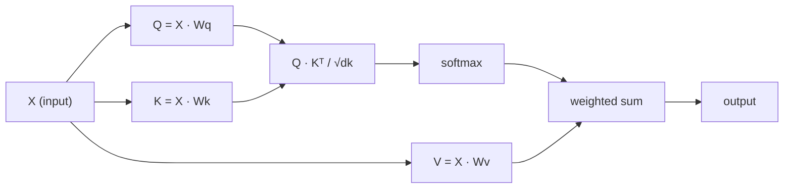

# Kendine Tam Bir Dikkat
# Kendine dikkat et

> Dikkat, her kelimenin "kim benim için önemli?" diye sorduğu ve cevabını öğrendiği bir arama tablosudur.

> Dikkat, bir arama tablosudur, her kelimenin "Kim benim için önemli?" sorusunda bulunur.

> **【中文解读】**Kendine Dikkat Transformer'in merkezi:Q*K^T  hesaplamak her bir token diğer token dikkatleri için ⋅ Anlamak Q/K/V'nin直觉 anlamı GPT/BERT temellidir ⋅

**Type:** Build | **类型:** 动手
**Language:**Python .**语言:**Python
**Prerequisites:** Phase 3 (Deep Learning Core), Phase 5 Lesson 10 (Sequence-to-Sequence) | **前置知识:** 阶段 3（深度学习基础），阶段 5 第 10 课（序列到序列）
**Time:** ~90 minutes | **时间:** ~90 分钟

## Öğrenme hedefleri

- Sorgu/kisel/değer projelerini ve softmax ağırlıklı toplamı dahil olmak üzere sadece NumPy kullanarak, ölçekli nokta ürün kendi dikkatini sıfırdan uygulamak
   Sadece NumPy kullanmak                                                                                                                                                                                                                                                           
- Başları bölüp paralel dikkat hesaplayan ve sonuçları birleştiren çok başlı bir dikkat katmanı oluşturun
   Konstrüksiyon çok yönlü dikkat katmanı, baş bölünmesini gerçekleştirmek  paralel dikkat hesaplama ve sonuçları yapıştırmak
- Dikkat matrisi token ilişkileri nasıl yakalar ve neden sqrt(d_k) ile ölçeklendirilmesi softmax doymuşluğunu engeller açıklayın
  追踪注意力矩阵 关系 符号 捕获方法,并解释为什么除以平方(d_k) 能防止软max 和
- İki yönlü dikkatin otomatik (dekoder tarzında) dikkatine dönüştürülmesi için nedensel maskeli uygulama
  应用因果掩码将双向注意力转换为自归归 (self-return) 解码器风格) dikkat

## Sorunlar. Sorunlar.

RNN'ler bir seferde bir token'ı sıralamayı işliyor. Token 50'ye ulaştığınızda, token 1'den gelen bilgiler 50 sıkıştırma adımıyla sıkıştırılmıştır. Uzun mesafeli bağımlılıklar sabit boyutlu bir gizli duruma  LSTM kaplamalarının hiçbir miktarının tam olarak çözmediği bir şişek boynuzuna sıkıştırılır.

> RNN  bireysel token  işlem sırası ⋅ 50'ye ulaştığınızda, 1'inci token'dan gelen bilgiler 50 kez sıkıştırılmıştır ⋅ uzun süreli bağımlılık sabit büyüklükte gizli bir duruma sıkıştırılmıştır ⋅ bu LSTM 门控无法完全解决的瓶──

2014 Bahdanau dikkat makalesi, düzeltmeyi gösterdi: dekodörün her kodlayıcı pozisyonuna geri bakmasına ve mevcut adım için hangisinin önemli olduğuna karar vermesine izin verin. Ama yine de bir RNN'ye bağlandı. 2017 "Eğer İhtiyacınız olan şey dikkat mi?" makalesinde daha keskin bir soru sordu: dikkat * tek* mekanizmadırsa ne olacak? Tekrarlanma yok.

> 2014 Bahdanau dikkat makalesi, bir düzeltme yöntemi gösterdi: Çözümcüye düzenleme cihazının her yerini gözden geçirsin, mevcut adımların neyin önemli olduğuna karar versin. Ancak 2017'de "Eğer dikkat tüm ihtiyacın var mı" makalesinde daha önemli bir soru ortaya konuldu: Eğer dikkat tek* mekanizmadırsa?

Kendine dikkat etmek, bir dizi konumdaki her pozisyonun diğer konumlara paralel bir adımla dikkat etmesine olanak sağlar.

> Bu nedenle Transformer'ın ızlı, genişleyebilir ve baskın konumunu kazanması için bir tek paralel adım içinde tüm diğer konumlara dikkat edilmesi gerekir.

> **【中文解读】**RNN'in bilgi aktarımı çok fazla adımdan sonra bilgi ciddi bir şekilde kayboldu. Bahdanau dikkat etmenizi sağladı kodlayıcıların her bir konumunu "önüne bak" ama yine de RNN'e bağımlıydı. Transformer'ın devrimciliği şuydu: tamamen bir döngüyi bırakın, sadece bir mekanizma ile dikkat edin.

## Konsepten bir şey.

### Veritaban Arama Analogisi Veritaban Arama Tipleri

Dikkatin yumuşak bir veritabanı arama olduğunu düşünün:

> Dikkatini bir veri tabanı olarak düşünmeye çalış:

```
Traditional database:
  Query: "capital of France"  -->  exact match  -->  "Paris"

Attention:
  Query: "capital of France"  -->  similarity to ALL keys  -->  weighted blend of ALL values
```

Her simge üç vektör oluşturur:
- **Query (Q)**"Ne arıyorum?"
  **查询 (Query, Q)**"Ben ne arıyorum?"
- **Key (K)**"Ne içermem?"
  **键 (Key, K)**"Ben ne içerim?"
- **Value (V)**"Seçilirse hangi bilgileri vereceğim?"
  **值 (Value, V)**"Seçilirsem, ne bilgi vereceğim?"

Bir sorgu ile tüm anahtarlar arasındaki nokta ürünü dikkat puanları üretir. Yüksek puan "bu anahtar sorguya uymaktadır". anlamına gelir. Bu puanlar değerleri ağırlaştırır. Çıktı değerlerin ağırlaştırılmış toplamıdır.

> 查询与所有键的点积产生注意分数――高分意味着"Bu anahtar benim sorularıma uygular"――这些分数对值进行加权――输出是值的加权求和――

> **【中文解读】**Dikkatli bir veri tabanı sınıfı, Q/K/V'yi anlamanın en iyi yoludır. Q "me ne buldum", K "benim ne varım", V "benim gerçek içerikim"dir.

> **【拓展：注意力机制在真实系统中的应用】**GPT 系列 因果自注意力 (her token sadece önceki token'ı görebilir);BERT usage双向自注意力 (her token 能看到所有 token'ı);交叉注意力 (交叉注意力) 交叉注意力 (cross-attention) 则在 T5 、稳定分散等模型中连接编码器和编码器──理解 Q/K/V 是理解所有这些变体的基础──

### Q, K, V hesaplama.

Her simge yerleştirme üç öğrenilen ağırlık matrisi ile projeleniyor:

> Her token üç öğrenme ağırlıklı matçın üzerinden yerleştirilmiştir:

```
Input embeddings (sequence of n tokens, each d-dimensional):

  X = [x1, x2, x3, ..., xn]       shape: (n, d)

Three weight matrices:

  Wq  shape: (d, dk)
  Wk  shape: (d, dk)
  Wv  shape: (d, dv)

Projections:

  Q = X @ Wq    shape: (n, dk)      each token's query
  K = X @ Wk    shape: (n, dk)      each token's key
  V = X @ Wv    shape: (n, dv)      each token's value
```

Görsel olarak, bir işaret için:

> Doğrudan bak, bir simge için:

```
             Wq
  x_i ------[*]------> q_i    "What am I looking for?"
       |
       |     Wk
       +----[*]------> k_i    "What do I contain?"
       |
       |     Wv
       +----[*]------> v_i    "What do I offer?"
```

### Dikkat Matrisi Dikkat Gücü Matrisi

Tüm simgeler için Q, K, V'ye sahip olduktan sonra dikkat puanları bir matris oluşturur:

> Tüm simgeleriniz varsa, dikkat dilimleri bir matron oluşturur:

```
Scores = Q @ K^T    shape: (n, n)

              k1    k2    k3    k4    k5
        +-----+-----+-----+-----+-----+
   q1   | 2.1 | 0.3 | 0.1 | 0.8 | 0.2 |   <- how much q1 attends to each key
        +-----+-----+-----+-----+-----+
   q2   | 0.4 | 1.9 | 0.7 | 0.1 | 0.3 |
        +-----+-----+-----+-----+-----+
   q3   | 0.2 | 0.6 | 2.3 | 0.5 | 0.1 |
        +-----+-----+-----+-----+-----+
   q4   | 0.9 | 0.1 | 0.4 | 1.7 | 0.6 |
        +-----+-----+-----+-----+-----+
   q5   | 0.1 | 0.3 | 0.2 | 0.5 | 2.0 |
        +-----+-----+-----+-----+-----+

Each row: one token's attention over the entire sequence
```

### Neden Scale? Neden küçültülsün?
Bir sorguyu bir seferde izleyin anahtarları tarayın: her satır her simgeyi puanlar, softmax puanları ağırlıklara dönüştürür ve bağlam vektörü değerlerin ağırlanmış karışımıdır.

```figure
attention-matrix
```

### Neden Ölçü?

Dots ürünleri dk boyut ile büyür. dk = 64, dots ürünleri onluk aralığında olabilir, softmax gradientlerin kaybolduğu bölgelerde itmek.

> Dk  büyüme                                                                                                                                                                                                                                                                                                                                                                                                                                                                                                                         

```
Scaled scores = (Q @ K^T) / sqrt(dk)
```

Bu, değerlerin softmax'ın yararlı gradientler ürettiği bir aralığında kalmasını sağlar.

> Bu değer, yararlı derecelerin bulunduğu bir aralığında kalıcı olarak kalıcı hale gelebilir.

> **【中文解读】**缩放因子 1/sqrt(dk) önemli fakat kolayca göz ardı edilebilen bir ayrıntıdır.

### Softmax puanları ağırlıklara dönüştürür. Softmax puanları ağırlığa dönüştürür.

Softmax, ham puanları her satır boyunca olasılık dağılımına dönüştürür:

> Softmax , orijinal sayıları bir satırlık olasılık dağılımına dönüştürecek:

```
Raw scores for q1:   [2.1, 0.3, 0.1, 0.8, 0.2]
                            |
                         softmax
                            |
Attention weights:   [0.52, 0.09, 0.07, 0.14, 0.08]   (sums to ~1.0)
```

Şimdi her simge, diğer simgeye ne kadar bakılması gerektiğini belirten bir dizi ağırlık vardır.

> Şimdi her bir token üzerinde bir grup bir güç var.

> **【拓展：注意力矩阵的可解释性】**dikkat reaksiyonu (N×N) Transformer açıklayıcı dikkat çekimi üzerinde çalışmanın önemli bir araçtır. Bu araç sayesinde model öğrenilen dil modelini bulabiliriz. Örneğin, "it" sözcüğü genellikle kendi göstergesi üzerine yoğunlaşır.

### Değerlerin ağırlıklı toplamı ve değer artışı

Her token için son çıkış, tüm değer vektörlerinin ağırlıklı bir toplamıdır:

> Her token'un son çıkışı tüm değer vektörlerinin artışı ve artarak:

```
output_i = sum( attention_weight[i][j] * v_j  for all j )

For token 1:
  output_1 = 0.52 * v1 + 0.09 * v2 + 0.07 * v3 + 0.14 * v4 + 0.08 * v5
```

### Tam boru hattı .



Tek satırlı formül:

> Birçe formül:

```
Attention(Q, K, V) = softmax( Q @ K^T / sqrt(dk) ) @ V
```

## Yapın.
```figure
softmax-attention-scaling
```

## Yapın

### Adım 1: Softmax sıfırdan. Adım 1: Softmax'ı sıfırdan gerçekleştirmek.

Softmax çiğ logitleri olasılıklara dönüştürür.

> Softmax, orijinal logitleri 概率 olarak dönüştürür.

```python
import numpy as np

def softmax(x):
    shifted = x - np.max(x, axis=-1, keepdims=True)
    exp_x = np.exp(shifted)
    return exp_x / np.sum(exp_x, axis=-1, keepdims=True)

logits = np.array([2.0, 1.0, 0.1])
print(f"logits:  {logits}")
print(f"softmax: {softmax(logits)}")
print(f"sum:     {softmax(logits).sum():.4f}")
```

### Adım 2: Düğüm- ürünün dikkatini ölçeklendirin. Adım 2: Düğüm-düğüm-düğüm dikkatini azaltın.

K, K, V matrisi alır ve dikkat çıkışı artı ağırlık matrisi gönderir.

> 核心函数──接收 Q、K、V 矩阵, geri dön dikkat output ve ağırlık矩阵──

```python
def scaled_dot_product_attention(Q, K, V):
    dk = Q.shape[-1]
    scores = Q @ K.T / np.sqrt(dk)
    weights = softmax(scores)
    output = weights @ V
    return output, weights
```

### Adım 3: Özgürlük sınıfı, projeksiyonları öğrenmekle.

Xavier'e benzer ölçeklendirme ile başlatılmış Wq, Wk, Wv ağırlık matrisleri ile tam bir kendi dikkat modülü.

> Bir tam öz dikkat modülü, Wq、Wk、Wv 权重矩阵 içerir, Xavier 式缩放初始化, kullanır.

```python
class SelfAttention:
    def __init__(self, d_model, dk, dv, seed=42):
        rng = np.random.default_rng(seed)
        scale = np.sqrt(2.0 / (d_model + dk))
        self.Wq = rng.normal(0, scale, (d_model, dk))
        self.Wk = rng.normal(0, scale, (d_model, dk))
        scale_v = np.sqrt(2.0 / (d_model + dv))
        self.Wv = rng.normal(0, scale_v, (d_model, dv))
        self.dk = dk

    def forward(self, X):
        Q = X @ self.Wq
        K = X @ self.Wk
        V = X @ self.Wv
        output, weights = scaled_dot_product_attention(Q, K, V)
        return output, weights
```

### Adım 4: Bir cümleyle çalıştırın.

Bir cümle için sahte yerleştirmeler yap ve dikkat ağırlıklarını izle.

> Bir cümle yaratmak, dikkat çekmek için.

```python
sentence = ["The", "cat", "sat", "on", "the", "mat"]
n_tokens = len(sentence)
d_model = 8
dk = 4
dv = 4

rng = np.random.default_rng(42)
X = rng.normal(0, 1, (n_tokens, d_model))

attn = SelfAttention(d_model, dk, dv, seed=42)
output, weights = attn.forward(X)

print("Attention weights (each row: where that token looks):\n")
print(f"{'':>6}", end="")
for token in sentence:
    print(f"{token:>6}", end="")
print()

for i, token in enumerate(sentence):
    print(f"{token:>6}", end="")
    for j in range(n_tokens):
        w = weights[i][j]
        print(f"{w:6.3f}", end="")
    print()
```

### Adım 5: ASCII 热力图 kullanarak dikkatinizi görselleştirin.

Hızlı bir görüntü için dikkat ağırlıklarını karakterlere harcama.

> Dikkat gücünü hızlı bir şekilde görüntülenmesi için harflere yeniden görüntülemek.

```python
def ascii_heatmap(weights, tokens, chars=" ░▒▓█"):
    n = len(tokens)
    print(f"\n{'':>6}", end="")
    for t in tokens:
        print(f"{t:>6}", end="")
    print()

    for i in range(n):
        print(f"{tokens[i]:>6}", end="")
        for j in range(n):
            level = int(weights[i][j] * (len(chars) - 1) / weights.max())
            level = min(level, len(chars) - 1)
            print(f"{'  ' + chars[level] + '   '}", end="")
        print()

ascii_heatmap(weights, sentence)
```

## Çerçeveyi kullanın.

PyTorch'in `nn.MultiheadAttention`Tam olarak biz inşa ettikleri şeyi yapar, ek olarak çok başlı bölünme ve çıkış projeksiyonu:

> PyTorch'in `nn.MultiheadAttention`İnşa ettiğimiz içeriği tamamıyla gerçekleştirdik.

```python
import torch
import torch.nn as nn

d_model = 8
n_heads = 2
seq_len = 6

mha = nn.MultiheadAttention(embed_dim=d_model, num_heads=n_heads, batch_first=True)

X_torch = torch.randn(1, seq_len, d_model)

output, attn_weights = mha(X_torch, X_torch, X_torch)

print(f"Input shape:            {X_torch.shape}")
print(f"Output shape:           {output.shape}")
print(f"Attention weight shape: {attn_weights.shape}")
print(f"\nAttn weights (averaged over heads):")
print(attn_weights[0].detach().numpy().round(3))
```

Ana fark: çok başlı dikkat, her biri kendi Q, K, V projeksiyonlarıyla paralel olarak çok sayıda dikkat fonksiyonunu yürütür.

> 关键区别:多头注意力并行运行多头注意力函数, her birinin kendi Q、K、V 投影,大小为 dk = d_model / n_heads,然后拼接结果──这让模型可以同时关注不同类型的关系──

> **【中文解读】**PyTorch'in `nn.MultiheadAttention`Zero'dan gerçekleştirdiğimiz tüm mantıkları kapsamlı kılmak ve proje çıkarmak. Büyük dikkatin avantajı, modelin aynı zamanda farklı tür ilişkilere odaklanmasında bulunmaktadır.

> **【拓展：多头注意力的生物学类比】**Çok dikkatli bir bakım, görsel kürenin çok farklı özellikli bir denetleyicisi gibi olabilir. V1 bölgesi farklı sinir elementlerinin farklı incelemesi gibi, farklı dikkatli bir bakım farklı tipleri arasındaki ilişkileri kavramayı öğrenir. Araştırmalar gösteriyor ki, Transformer'in farklı başları gerçekten farklı dil biçimlerini öğrendi: bazıları komşu kelimeyi, bazıları ifadeyi, bazıları da işaret ilişkileri üzerinde odaklanır.

## İndirin . Ürünler .

Bu ders şunları ortaya çıkarır:
- `outputs/prompt-attention-explainer.md` veritabanı arama analogi ile dikkatini açıklamak için bir ipucu

> 本课产生:
> - `outputs/prompt-attention-explainer.md` DATABAY SEARCH 类比解释注意力提示词

## Egzersizler.

1. Değiştir `scaled_dot_product_attention`Softmax'den önce belirli pozisyonları negatif sonsuzluğa ayarlayan bir seçmeli maske matrisini kabul etmek (kötü/dekoder maskeleme bu şekilde çalışır)
   修改 `scaled_dot_product_attention`Bu yüzden, bu yöntemle, bu yöntemle, bu yöntemle, bu yöntemle, bu yöntemle, bu yöntemle, bu yöntemle, bu yöntemle, bu yöntemle, bu yöntemle, bu yöntemle, bu yöntemle, bu yöntemle, bu yöntemle, bu yöntemle, bu yöntemle, bu yöntemle, bu yöntemle, bu yöntemle, bu yöntemle, bu yöntemle, bu yöntemle, bu yöntemle, bu yöntemle, bu yöntemle, bu yöntemle, bu yöntemle, bu yöntemle, bu yöntemle, bu yöntemle, bu yöntemle, bu yöntemle, bu yöntemle, bu yöntemle, bu yöntemle, bu yöntemle, bu yöntemle, bu yöntemle, bu yöntemle, bu yöntemle, bu yöntemle, bu yöntemle, bu yöntemle, bu yöntemle, bu yöntemle, bu yöntemle, bu yöntemle, bu yöntemle, bu yöntemle, bu yöntemle, bu yöntemle, bu yöntemle, bu yöntemle, bu yöntemle, bu yöntemle, bu yöntemle, bu yöntemle, bu yöntemle, bu yöntemle, bu yöntemle, bu yöntemle, bu yöntemle, bu yöntemle,

2. Çoklu başlı dikkatleri sıfırdan uygulayın: Q, K, V'ye bölün `n_heads`parçalar, dikkat her bir üzerinde çalıştırmak, birleştirmek ve son ağırlık matrisinin üzerinden proje Wo
   ZERO'dan çok kişiye dikkat: Q、K、V  ayrıştırmak`n_heads`块,分分运行注意力,拼接,并通过最终权重矩阵 Wo 投影

3. Aynı uzunlukta iki farklı cümleyi alıp, aynı SelfAttention örneğini kullanarak onları besleyip dikkat düzenlerini karşılaştırın.
   Tıpkı aynı SelfAttention örneğiyle aynı uzunlukta iki farklı cümleyi alın ve onların dikkat biçimiyle karşılaştırın.

## Anahtar Şartlar .

| Term | What people say / 人们怎么说 | What it actually means / 实际含义 |
|------|------------------------------|----------------------------------|
| Query (Q) | "The question vector" / "问题向量" | A learned projection of the input that represents what information this token is looking for. 输入的学习投影，表示这个 token 在寻找什么信息。 |
| Key (K) | "The label vector" / "标签向量" | A learned projection that represents what information this token contains, matched against queries. 学习投影，表示这个 token 包含什么信息，与查询匹配。 |
| Value (V) | "The content vector" / "内容向量" | A learned projection carrying the actual information that gets aggregated based on attention scores. 学习投影，携带根据注意力分数聚合的实际信息。 |
| Scaled dot-product attention | "The attention formula" / "注意力公式" | softmax(QK^T / sqrt(dk)) @ V — scaling prevents softmax saturation in high dimensions. softmax(QK^T / sqrt(dk)) @ V — 缩放防止高维时 softmax 饱和。 |
| Self-attention | "The token looks at itself and others" / "token 看自己和其他 token" | Attention where Q, K, V all come from the same sequence, letting every position attend to every other position. Q、K、V 都来自同一序列的注意力，让每个位置关注所有其他位置。 |
| Attention weights | "How much focus" / "多少关注" | A probability distribution over positions, produced by softmax over scaled dot products. 位置上的概率分布，由缩放点积上的 softmax 产生。 |
| Multi-head attention | "Parallel attention" / "并行注意力" | Running multiple attention functions with different projections, then concatenating results for richer representations. 使用不同投影运行多个注意力函数，然后拼接结果以获得更丰富的表示。 |

## Daha fazla okumak

- [Attention Is All You Need (Vaswani et al., 2017)](https://arxiv.org/abs/1706.03762) orijinal transformatör kağıdı
  Vaswani 等人(2017)  原始 Transformer 论文

- [The Illustrated Transformer (Jay Alammar)](https://jalammar.github.io/illustrated-transformer/) Tam mimarinin en iyi görsel geçişleri
  Jay Alammar'ın Görünüm Transformer   最佳完整架构可视化讲解

- [The Annotated Transformer (Harvard NLP)](https://nlp.seas.harvard.edu/annotated-transformer/) Açıklamalarla birlikte PyTorch'ın satır sonu uygulanması
  Harvard NLP'nin yorum versiyonu Transformer  逐行 PyTorch 实现与解释

> **【拓展：Flash Attention 与注意力优化】**標準自注意的 O(N^2) 内存开销是长序列处理的瓶──Flash Attention(2022) 分块计算和重计算策略, matematik sonuçları değişmeyen durumlarda内存 karmaşıklığı O(N) ⋅'e düşecek.
