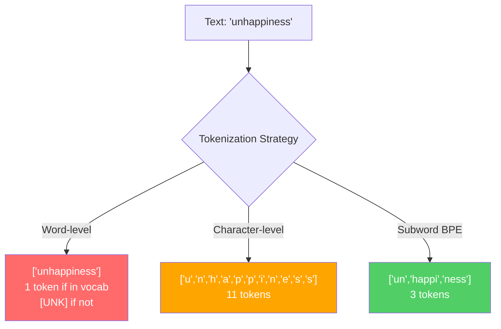
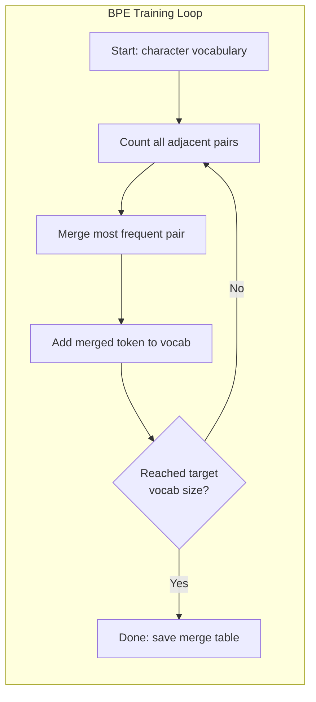
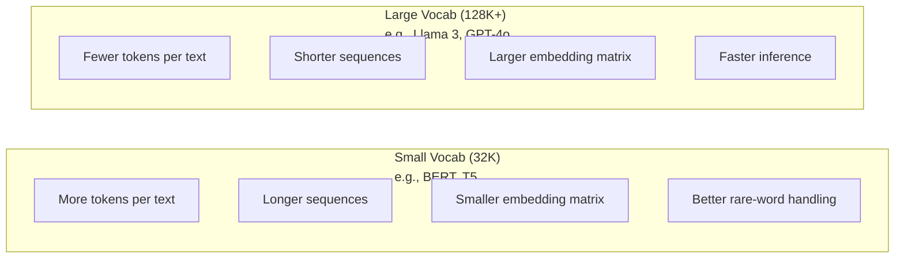

# Tokenizers: BPE, WordPiece, SentencePiece

> LLM'nin İngilizce okumayı, tam sayıları okumayı ve bu tam sayıları kullanıp kullanmayacağını belirlemesini sağlar.

> **【中文解读】**LLM 不读英文,它读整数──分词器决定这些整数是有意义还是浪费──子词分词(子词分词) sözcüğ sınıfı ve字符 sınıfı arasında bir dengeleme bulma noktası:

> **【拓展：BPE→GPT系列】**OpenAI'nin tüm modelleri(GPT-2、GPT-3、GPT-4) BPE 分词器──tiktoken is GPT 系列分词器库──分词质量直接影响上下文窗口利用率"kenetlendi" 拆分4 token vs 1 token,等上下文窗口缩水75%──

**Type:** Build
**Languages:** Python
**Prerequisites:** Phase 05 (NLP Foundations)
**Time:** ~90 minutes

## Öğrenme hedefleri

- BPE, WordPiece ve Unigram tokenizasyon algoritmaları sıfırdan uygulayın ve birleşme stratejilerini karşılaştırın
  BPE'yi sıfırdan gerçekleştirmek, WordPiece ve Unigram 分词算法, bunların birleşme stratejisini karşılaştırmak
- Sözcüklük boyutunun model verimliliğini nasıl etkilediğini açıklayın: Çok küçük uzun diziler oluşturur, çok büyük atıklar parametreleri yerleştirir
  解释词表大小 nasıl etkilenir modelleri verimlilik: çok küçük uzun bir dizi oluşur, çok büyük bir harcama
- Dil ve kodlar arasında tokenizasyon eserlerini analiz ederek belirli tokenizörlerin nerede parçalanıp parçalanmasını belirler
  跨语言和代码的分词边界情况的分析,特定分词器的失效点的找出
- Metni simgelemek ve elde edilen simge kimliklerini incelemek için tiktoken ve cümle parça kütüphanelerini kullanın
  Kullanım tiktoken 和 cümle parçası 库分词文本并检查生成的代码 ID

> **【中文解读】**Bu bölümün öğrenme hedefi, bölge sözcük makinesi etrafında dört boyut: gerçekleştirmek, anlamlamak, anlamlamak, anlamlamak, anlamlamak, anlamlamak, anlamlamak, anlamlamak, anlamlamak, anlamlamak, anlamlamak, anlamlamak, anlamlamak, anlamlamak, anlamlamak, anlamlamak, anlamlamak, anlamlamak, anlamlamak, anlamlamak, anlamlamak, anlamlamak, anlamlamak, anlamlamak, anlamlamak, anlamlamak, anlamlamak, anlamlamak, anlamlamak, anlamlamak, anlamlamak, anlamlamak, anlamlamak, anlamlamak, anlamlamak, anlamlamak, anlamlamak, anlamlamak, anlamlamak, anlamlamak, anlamlamak, anlamlamak, anlamlamak, anlamlamak, anlamlamak, anlamlamak, anlamlamak, anlamlamak, anlamlamak, anlamlamak, anlamlamak, anlamlamak, anlamlamak, anlamlamak, anlamlamak, anlamlamak, anlamlamak, anlamlamak, anlamlamak, anlamlamak, anlamlamak, anlamlamak, anlamlamak, anlamlamak, anlamlamak, anlamlamak, anlamlamak, anlamlamak, anlamlamak, anlamlamak, anlamlamak, anlamlamak, anlamlamak, anlamlamak, anlamlamak, anlamlamak, anlamlamak, anlamamak, anlamamak, anlamamak, anlamamak, anlamamak, anlamamak, anlamamak, anlamamak, anlamamak, anlamamak, anlamamak, anlamamak, anlamamak, anlamamak, anlamamak, anlamamak, anlamamak, anlamamak, anlamamak, anlamamak, anlamamak, anlamamak,

## Sorunlar. Sorunlar.

Yüksek Lisans'ın İngilizce okumayı, herhangi bir dil okumayı, sayı okumayı.

> Senin LLM'nin İngilizce okuması yok.

"Merhaba dünya!" ve [15496, 11, 995, 0] arasındaki boşluk, işaretlemeci. Bir modelin işleme yapabilmesi için her kelime, her boşluk, her noktalama işaretinin bir tam sayıya dönüştürülmesi gerekir. Bu dönüşüm tarafsız değildir. Daha sonra atlatılamayan varsayımları modelde pişirir.

> "Merhaba dünya!" ve [15496, 11, 995, 0] arasındaki köprü, bir sözcük makinesi. Her sözcük, her boşluk, her işaret noktası, bir bütün sayısına dönüştürülmelidir.

Yanlış anlayınca modeliniz çok sayıda token ile ortak kelimeleri kodlama kapasitesini harcıyor. "Ne yazık ki" bir yerine dört simge olur. 128K bağlam pencereniz çok silbeli kelimeler için %75'e küçültüldü. Doğru yaparsanız aynı bağlam penceresi iki kat daha fazla anlam taşıyor. "Bu model kodu iyi ele alır" ve "bu model Python'a boğulur" arasındaki fark genellikle tokenizer'in nasıl eğitildiğine bağlıdır.

> Yapma hatası, modelin bir çok token ile kapasite kaybedecek. "Ne yazık ki" bir değil dört token haline gelir. "128K'nın üst üst üst üst üst üst üst üst üst üst üst üst üst üst üst üst üst üst üst üst üst üst üst üst üst üst üst üst üst üst üst üst üst üst üst üst üst üst üst üst üst üst üst üst üst üst üst üst üst üst üst üst üst üst üst üst üst üst üst üst üst üst üst üst üst üst üst üst üst üst üst üst üst üst üst üst üst üst üst üst üst üst üst üst üst üst üst üst üst üst üst üst üst üst üst üst üst üst üst üst üst üst üst üst üst üst üst üst üst üst üst üst üst üst üst üst üst üst üst üst üst üst üst üst üst üst üst üst üst üst üst üst üst üst üst üst üst üst üst üst üst üst üst üst üst üst üst üst üst üst üst üst üst üst üst üst üst üst üst üst üst üst üst üst üst üst üst üst üst üst üst üst üst üst üst üst üst üst üst üst üst üst üst üst üst üst üst üst üst üst üst üst üst üst üst üst üst üst üst üst üst üst üst üst üst üst üst üst üst üst üst üst üst üst üst üst üst üst üst üst üst üst üst üst üst üst üst üst üst üst üst üst üst üst üst üst üst üst üst üst üst üst üst üst üst üst üst üst üst üst üst üst üst üst üst üst üst üst üst üst üst üst üst üst üst üst üst üst üst üst üst üst üst üst üst üst üst üst üst üst üst üst üst üst üst üst üst üst üst üst üst üst üst üst üst üst üst üst üst üst üst üst üst üst üst üst üst üst üst üst üst üst üst üst üst üst üst üst üst üst üst üst üst üst üst üst üst üst üst üst üst üst üst üst üst üst üst üst üst üst üst üst üst üst üst üst üst üst üst üst üst üst üst üst üst üst üst üst üst üst üst üst üst üst üst üst üst üst üst üst üst üst üst üst üst üst üst üst üst üst üst üst üst üst üst üst üst üst üst üst üst üst üst üst üst üst üst üst üst üst üst üst üst üst üst üst üst üst üst üst üst üst üst üst üst üst üst üst üst üst üst üst üst üst üst üst üst üst üst üst üst üst üst üst üst üst üst üst üst üst üst üst üst üst üst üst üst üst üst üst üst üst üst üst üst üst üst üst üst üst üst üst üst üst üst üst üst üst üst üst üst üst üst üst üst

GPT-4 veya Claude'a yaptığınız her API çağrısı bir token başına fiyatlandırılır. Modelinizin oluşturduğu her token hesaplama maliyetini ödüyor. Bir çıkışı temsil etmek için gereken daha az token, sonundan sonuna kadar sonuç daha hızlı olur. Tokenizasyon önceden işleme değildir. Mimarlıktır.

> GPT-4 veya Claude'un API'si kullanıldığında kullanılan her bir token 计费的. Model ürettiğiniz her token 消耗算力的.

> **【中文解读】**分词 basit bir önceden işleme adımları değil, model yapısının bir parçasıdır. GPT-4 API'si her seferinde belirti 计费, her belirti üretimi tüketim gücü olarak kullanılır.

> **【拓展：API 定价与分词效率】**GPT-4o                                                                                                                                                                                                                                                                                                                                                                                                                                                                                                                          $5/M input tokens、$15/M çıkış jetonları。 Aynı bir Çin文段落, GPT-2 分词器 ile 500 jeton tüketilebilir, GPT-4o'nun o200k_base 分词器 ile sadece 200 jeton gerekir, maliyet farkı 2.5 倍。 bu da neden Llama 3 字表 32K 扩展到 128K 降低非英语用户推理成本。

>  **【前置】**学本节前 Lütfen önce bilmelisiniz: 1) Eğlence 05 (NLP Temellikleri)  anlamak metinlerin 量化表示、词嵌入基础; 2) Python 字典/Counter 与贪心算法实现模式; 3) UTF-8 编码、Unicode 码点(codepoint) 字节 关系; 4) 概率论基础频率统计与互信息──不熟这些会难理解 BPE 的合并据判──

## Konsepten bir şey.

### Başarısız Olmuş Üç Yöntem (Ve Bir Yöntem)

Metni rakamlara dönüştürmenin üç yolu var. Bunlardan ikisi ölçekte çalışmaz.

> Metni rakamlara dönüştürmek için üç açık yöntem vardır. Bunlardan ikisi büyük ölçekte çalışamaz.

**Word-level tokenization**"Kedi oturdu" ("The", "cat", "sat"); basit. "Tokenizasyon" ya da "GPT-4o" ne demek?`[UNK]`Token -- modelin "Bunun ne olduğunu bilmiyorum" demesinin yolu. İngilizce'de tek başına bir milyondan fazla kelime şekli var.

> **词级分词**按空格和标点拆分──"Kedi oturdu" 变成 ["The", "cat", "sat"]──很简单──但"tokenization" 呢?"GPT-4o" 呢?或德语复合词 "Geschwindigkeitsbegrenzung" 呢?词级分词需要一个巨大的词表来覆盖每种语言的每个词──遗漏一个词就会出现可怕的`[UNK]`"I don't know what this is" diyor. Sadece İngilizce'de bir milyondan fazla kelime şekli vardır.

**Character-level tokenization**"hello" başka yöne gider. "h", "e", "l", "l", "o" olur. Sözlük küçüktür (bir kaç yüz karakter). Bilinmeyen işaretler yoktur. Ama diziler son derece uzun olur. 10 kelime seviyesindeki işaretler olacak bir cümle, 50 karakter seviyesindeki işaretler haline gelir.

> **字符级分词**走向另一个极端──"hello" 变成 ["h", "e", "l", "l", "o"]──词表很小(几百个字符)──永远不会出现未知符号──但序列变得极长──一个10个词级符号的句子变成50个字符级符号──模型必须学会 "t"、"h"、"e" 组合起来是"把注意容量浪费在人类三岁就学会的事上──

**Subword tokenization**"Büyük bir şey" kelimesi, "bir şey" kelimesini içerir ve "bir şey" kelimesini içerir. "Büyük bir şey" kelimesi, "bir şey" kelimesini içerir.

> **子词分词**找到了最佳平衡点──常见词保持完整:"the" 是一个代币──罕见词分解为有意的片段:"不快乐" 变成 ["un", "happy", "ness"]──词表保持在可控范围(30K~128K 个代币)──序列保持简短──未知代币 基本消失,因为任何词都可以由子词片段构建──

> **【中文解读】**词级分词 (词级分词) 词表爆炸英语有百万级词形,加上代码、URL、科学记数法和其他语言,词表会无限增长──字符级分词 (字符级分词) 字符级分词) 字符级分词 (字符级分词) 字表小,但序列太长,模型要学会 "t"+"h"+"e" 组合为"the",浪费注意力容量──子词分词在两者之间取得平衡:常见词保持完整,罕见词分成有意义的片段──

>  **【类比】**分词器像"乐高积木分类工厂":常见词("the") yapmak için bütün bir blok büyük积木直接用,罕见词("不快乐") parçalanmak için "un"+"happy"+"ness" 三块标准小积木拼起来;;词级是只卖整块定制积木(漏货就崩),字符级是只卖单个原点(拼一句话要100个);;BPE is "高频组合自动包包成块",自适应找到成本与表现力的平衡点;;

Her modern LLM'de alt sözcük işaretleme kullanılır. GPT-2, GPT-4, BERT, Llama 3, Claude.

> Her modern LLM'de hep bir sözcük vardır.



### BPE: Byte çift kodlama

BPE, tokenizasyon için yeniden tasarlanmış açgözlü bir sıkıştırma algoritmasıdır.

> BPE, bir dizinin birinde yazılabilecek kadar basit bir fikirde yeniden kullanılmış bir açgözlülük algoritmasıdır.

Tek tek karakterle başlayın. Eğitim kurpusundaki her yan çiftini sayın. En sık gelen çiftleri yeni bir simgeye birleştirin. Hedef kelime birikimi boyutuna ulaşana kadar tekrarlayın.

> Tek karakterden başlamak için, sayısal eğitim dilindeki tüm komşu karakterlere karşı ortaya çıkma sıklığı, yeni bir token için en yüksek sıklığın karşılanması için tekrarlanmak için hedef kelimenin büyüklüğüne ulaşıncaya kadar.
```figure
tokenizer-bpe
```

İşte BPE, küçük bir korpus üzerinde "en düşük", "en düşük" ve "en yeni" kelimeleri ile çalışıyor:

```
Corpus (with word frequencies):
  "lower"  x5
  "lowest" x2
  "newest" x6

Step 0 -- Start with characters:
  l o w e r       (x5)
  l o w e s t     (x2)
  n e w e s t     (x6)

Step 1 -- Count adjacent pairs:
  (e,s): 8    (s,t): 8    (l,o): 7    (o,w): 7
  (w,e): 13   (e,r): 5    (n,e): 6    ...

Step 2 -- Merge most frequent pair (w,e) -> "we":
  l o we r        (x5)
  l o we s t      (x2)
  n e we s t      (x6)

Step 3 -- Recount and merge (e,s) -> "es":
  l o we r        (x5)
  l o we s t      (x2)    <- 'es' only forms from 'e'+'s', not 'we'+'s'
  n e we s t      (x6)    <- wait, the 'e' before 'we' and 's' after 'we'

Actually tracking this precisely:
  After "we" merge, remaining pairs:
  (l,o): 7   (o,we): 7   (we,r): 5   (we,s): 8
  (s,t): 8   (n,e): 6    (e,we): 6

Step 3 -- Merge (we,s) -> "wes" or (s,t) -> "st" (tied at 8, pick first):
  Merge (we,s) -> "wes":
  l o we r        (x5)
  l o wes t       (x2)
  n e wes t       (x6)

Step 4 -- Merge (wes,t) -> "west":
  l o we r        (x5)
  l o west        (x2)
  n e west        (x6)

...continue until target vocab size reached.
```

Birleştirme tablosu, tokenizer'dir. Yeni metni kodlamak için, öğrenilen sırada birleştirmeler uygulayın. Eğitim korpusu hangi birleştirmeler olduğunu belirler ve bu seçim modelin gördüğünü kalıcı olarak şekillendirir.

> 合并表就是分词器──编码新文本时,学习顺序应用合并──训练语料决定了哪些合并存在,这个选择永久塑造了模型看到的内容──

> **【中文解读】**BPE'nin çekirdek eğitim döngüsü: tek bir karakterden başlayarak, tüm komşu karakterlerin ortaya çıkma sıklığı, en yüksek sıklığın yeni bir simge olarak birleşmesine, hedef kelimenin büyüklüğüne ulaşana kadar tekrarlanmasına, birleşim masası kendi başına ayrıntılı bir kelime biçiminde oluşmasına, birleştirme biçiminde oluşmasına, birleştirme biçiminde oluşmasına, birleştirme biçiminde oluşmasına, birleştirme biçiminde oluşmasına, birleştirme biçiminde oluşmasına, birleştirme biçiminde oluşmasına, birleştirme biçiminde oluşmasına, birleştirme biçiminde oluşmasına, birleştirme biçiminde oluşmasına, birleştirme biçiminde oluşmasına, birleştirme biçiminde oluşmasına, birleştirme biçiminde oluşmasına, birleştirme biçiminde oluşmasına, birleştirme biçiminde oluşmasına, birleştirme biçiminde oluşmasına, birleştirme biçiminde oluşmasına, birleştirme biçiminde oluşmasına, birleştirme biçiminde oluşmasına, birleştirme biçiminde oluşmasına, birleştirme biçiminde oluşmasına, birleştirme biçiminde oluşmasına, birleştirme biçiminde oluşmasına, birleştirme biçiminde oluşmasına, birleştirme biçiminde oluşmasına, birleştirme biçiminde oluşmasına, birleştirme biçiminde oluşmasına, birleştirme biçiminde oluşmasına, birleştirme biçiminde oluşmasına, birleştirme biçiminde oluşmasına, birleştirme biçiminde oluşması, birleştirme biçiminde oluşması, birleştirme, birleştirme, birleştirme biçiminde oluşma, birleştirme, birleştirme, birleştirme, birleştirme, birleştirme, birleştirme, birleştirme, birleştirme, birleştirme, birleştirme, birleştirme, birleştirme, birleştirme, birleştirme, birleştirme, birleştirme, birleştirme, birleştirme, birleştirme, birleştirme, birleştirme, birleştirme, birleştirme, birleştirme, birleştirme, birleştirme, birleştirme, birleştirme, birleştirme, birleştirme, birleştirme, birleştirme, birleştirme, birleştirme, birleştirme, bir

> **【拓展：BPE 的压缩原理】**BPE ilk olarak 1994 yılında kullanılan genel veri sıkıştırma algoritması olmuştur. Sennrich  et al., 2016 yılında NLP alanına girişti.

> ️ **【易错点】**Bir de bir de bir de bir de bir de bir de bir de bir de bir de bir de bir de bir de bir de bir de bir de bir de bir de bir de bir de bir de bir de bir de bir de bir de bir de bir de bir de bir de bir de bir de bir de bir de bir de bir de bir de bir de bir de bir de bir de bir de bir de bir de bir de bir de bir de bir de bir de bir de bir de bir de bir de bir de bir de bir de bir de bir de bir de bir de bir de bir de bir de bir de bir de bir de bir de bir de bir de bir de bir de bir de bir de bir de bir de bir de bir de bir de bir de bir de bir de bir de bir de bir de bir de bir de bir de bir de bir de bir de bir de bir de bir de bir de bir de bir de bir de bir de bir de bir de bir de bir de bir de bir de bir de bir de bir de bir de bir de bir de bir de bir de bir de bir de bir de bir de bir de bir de bir de bir de bir de bir de bir de bir de bir de bir de bir de bir de bir de bir de bir de bir de bir de bir de bir de bir de bir de bir de bir de bir de bir de bir de bir de bir de bir de bir de bir de bir de bir de bir de bir de bir de bir de bir de bir de bir de bir de bir de bir de bir de bir de bir de bir de bir de bir de bir de bir de bir de bir de bir de bir de bir de bir de bir de bir de bir de bir de bir de bir de bir de bir de bir de bir de bir de bir de bir de bir de bir de bir de bir de bir de bir de bir de bir de bir de bir de bir de bir de bir de bir de bir de bir de bir de bir de bir de bir de bir de bir de bir de bir de bir de bir de bir de bir de bir de bir de bir de bir de bir de bir de bir de bir de bir de bir de bir de bir de bir de bir de bir de bir de bir de bir de bir de bir de bir de bir de bir de bir de bir de bir de bir de bir de bir de bir de bir de bir de bir de bir de bir de bir de bir de bir de bir de bir de bir de bir de bir de**忘了每次合并后重新计数** doğrudan ilk çiftin sayılarına 上循环, 导致合并 "we" 后还在旧频次选 (e,s), 结果合并表全是噪音;(2) **合并顺序错乱**编码时必须根据训练时学到的合并级 严格从低到高应用,先合并 "th" 再合并 "the",颠倒会得到完全不同的代币;(3) **未做预分词（pre-tokenization）** doğrudan tüm语料 üzerinde BPE yapmak, ortaya çıkacak "e c" (e c)  "cat" (cat)  中的跨词合并), training出无意的跨词代币──修复: GPT-2'nin正则先切成词片段,每段独立做 BPE──



### Bite seviyesindeki BPE (GPT-2, GPT-3, GPT-4)

Standart BPE, Unicode karakterleri üzerinde çalışır. Byte seviyesindeki BPE çiğ bytelerde çalışır (0-255). Bu size tam olarak 256 temel kelime birikimi verir, herhangi bir dili veya kodlamayı ele alır ve asla bilinmeyen bir token üretmez.

> 标准 BPE 操作 Unicode 字符──字节级 BPE 操作原始字节(0-255)。 Bu size tam olarak 256 temel kelime listesi verir, herhangi bir dil veya koduyla işleyebilir, asla bilinmeyen bir token üretmez。

GPT-2 bu yaklaşımı tanıttı. Temel kelime birikimi her olası baytı kapsar. BPE bunun üzerine kurulur. OpenAI'nin tiktoken kütüphanesi bu kelime birikimi boyutları ile bayt seviyesindeki BPE'yi uyguluyor:

> GPT-2 bu yöntemi giriyor. BASEWORDS DATABASE DATABASE DATABASE DATABASE DATABASE DATABASE DATABASE DATABASE DATABASE DATABASE DATABASE DATABASE DATABASE DATABASE DATABASE DATABASE DATABASE DATABASE DATABASE DATABASE DATABASE DATABASE DATABASE DATABASE DATABASE DATABASE DATABASE DATABASE DATABASE DATABASE DATABASE DATABASE DATABASE DATABASE DATABASE DATABASE DATABASE DATABASE DATABASE DATABASE DATABASE DATABASE DATABASE DATABASE DATABASE DATABASE DATABASE DATABASE DATABASE DATABASE DATABASE DATABASE DATABASE DATABASE DATABASE DATABASE DATABASE DATABASE DATABASE DATABASE DATABASE DATABASE DATABASE DATABASE DATABASE DATABASE DATABASE DATABASE DATABASE DATABASE DATABASE DATABASE DATABASE DATABASE DATABASE DATABASE DATABASE DATABASE DATABASE DATABASE DATABASE DATABASE DATABASE DATABASE DATABASE DATABASE DATABASE DATABASE DATABASE DATABASE DATABASE DATABASE DATABASE DATABASE DATABASE DATABASE DATABASE DATABASE DATABASE DATABASE DATABASE DATABASE DATABASE DATABASE DATABASE DATABASE DATABASE DATABASE DATABASE DATABASE DATABASE DATABASE DATABASE DATABASE DATABASE DATABASE DATABASE DATABASE DATABASE DATABASE DATABASE DATABASE DATABASE DATAB

> **【中文解读】**字节级 BPE(Byte-level BPE)  GPT-2 引入的关键创新──传统 BPE 操作 Unicode 字符,而字节级 BPE 直接操作原始字节(0-255),基础词表恰好 256 个,理论上可处理任何语言或编码,永远不会出现 [UNK] token──这就是为什么GPT 系列模型能处理代码、emoji、多语言混合文本而不会"卡住"──

> 🤔 **【困惑】**S: Neden BPE'nin birleşim sırası bu kadar önemli? İyi bir biçim biçim biçimi "değiştir" mi? A: 合并序就是分词器的"程序"编码时必须严格按照训练时学到的级别从小到大应用:若级=5是"th",rank=100是"the",遇到"时先合成"th",再合成"the"――任意颠倒或单独跳过某步产生不同的符号序列――生产中**不要修改合并表**, çünkü bu ve modelin yerleştirilmesi 矩阵强绑定改一个代币的ID,模型会输出乱码――需要改变词表只能重训分词器 +重训模型嵌入――

- GPT-2: 50.257 token
- GPT-3.5/GPT-4: ~100,256 token (cl100k_base kodlaması)
- GPT-4o: 200,019 token (o200k_base kodlaması)

### WordPiece (BERT)

WordPiece, BPE'ye benzer bir görünüm taşır, ancak seçerleri farklı bir şekilde birleştiriyor.

> WordPiece, BPE'ye benzer görünüyor, ancak seçim yapım biçimi farklıdır.

```
BPE merge criterion:      count(A, B)
WordPiece merge criterion: count(AB) / (count(A) * count(B))
```

BPE: "En sık hangi çift ortaya çıkar?" diye sorar. WordPiece: "Hangi çift rastlantıdan beklediğinizden daha sık birlikte ortaya çıkar?" diye sorar. Bu ince fark farklı kelime birikimi üretir. WordPiece, eşleşmenin şaşırtıcı olduğu yerlerde birleşmeyi tercih eder, sadece sık değil.

> BPE 问:"WordPiece 问:"WordPiece 问:"WordPiece 问:"WordPiece 问:"WordPiece 问:"WordPiece 问:"WordPiece 问:"WordPiece 问:"WordPiece 问:"WordPiece 问:"WordPiece 问:"WordPiece 问:"WordPiece 问:"WordPiece 问:"WordPiece 问:"WordPiece 问:"WordPiece 问:"WordPiece 问:"WordPiece 问:"WordPiece 问:"WordPiece 问:"WordPiece 问:"WordPiece 问:"WordPiece 问:"WordPiece 问:"WordPiece 问:"WordPiece 问:"WordPiece "WordPiece "WordPiece "WordPiece "WordPiece "WordPiece "WordPiece "WordPiece "WordPiece "WordPiece "WordPiece WordPiece WordPiece WordPiece WordPiece WordPiece WordPiece WordPiece WordPiece WordPiece WordPiece WordPiece WordPiece WordPie"WordPiece WordPiece WordPiece WordPiece WordPiece WordPie"WordPie"WordPie"WordPie"WordPie"WordPie"WordPie"WordPie"WordPie"WordPie"WordPie"WordPie"WordPie"WordPie"WordPie"WordP"WordP"WordP"WordP"

WordPiece ayrıca devam alt kelimeler için "##" önlüğünü kullanır:

> WordPiece ayrıca "##" kullanıyor.

```
"unhappiness" -> ["un", "##happi", "##ness"]
"embedding"   -> ["em", "##bed", "##ding"]
```

"##" önbölgesi, bu parçayı önceki bir token'a devam ettirerek gösterir. BERT, 30.522 token sözlüğü olan WordPiece'yi kullanır. BERT'in her varianti - DistilBERT, RoBERTa'nın tokenizeri aslında BPE, ancak BERT'in kendisi WordPiece.

> "##" Ön size bu bölümden bir tane anlatın.

### CezaBöğüt (Llama, T5)

SentencePiece, girişleri beyaz alan da dahil olmak üzere Unicode karakterlerinin ham akışı olarak değerlendirir. Ön-tokenizasyon adımları yoktur. Sözcük sınırları hakkında dil-süsusi kurallar yoktur. Bu onu gerçekten dil-agnostik yapar - boşluklar kelimeleri ayırmayan Çin, Japon, Tayland ve diğer dillerde çalışır.

> SentencePiece, orijinal Unicode 字符流 olarak girilmeye başlayacak. Bu, Çin, Japon, Tayvan ve diğer boşluk ayırt edici kelimeler için geçerlidir.

SentencePiece iki algoritmayı destekler:

> Cevap: Piece 支持两种算法:

- **BPE mode**: standart BPE'ye benzer bir birleşme mantığı, çiğ karakter dizilerine uygulanır
  Çeviri:**BPE 模式**BPE'ye benzer bir ortaklık mantığı, orijinal karakter sırası için kullanılır
- **Unigram mode**BPE'nin tersine, birleşme yerine kesim.
  Çeviri:**Unigram 模式**BPE ile karşılaştırıldığında, 代移除对整体似然影响最小的符号──

Llama 2 32 bin token ile SentencePiece BPE kullanıyor. T5 32 bin token ile SentencePiece Unigram kullanıyor. Not: Llama 3 128.256 token ile tiktoken tabanlı bir bayt seviyesindeki BPE tokenize geçmiştir.

> Llama 2 使用 SentencePiece BPE,词表为 32,000 个代币。T5 使用 SentencePiece Unigram,词表为 32,000 个代币。注意:Llama 3 切换到了基于tiktoken的字节级 BPE 分词器,词表为 128,256 个代币。

> **【中文解读】**SentencePiece'nin özel özelliği, herhangi bir dilde bir ön ayrım sözcüğü yapmamasından kaynaklanıyor. Bu, Çince, Japon ve diğer dillerde boş ayrım sözcükler kullanmamasından dolayı iyi performans göstermektedir. İki algoritma desteklemektedir: BPE 模式 (BPE) ve Unigram 模式 (BPE) ⇒ Llama 2 SentencePiece BPE (BPE) ⇒ 32K 词表 (K) ile değiştirilmiştir.

> **【拓展：SentencePiece 在开源模型中的地位】**Google T5(110 milyar parametre)、Llama 2(7B-70B)、Mistral 7B 等开源模型都使用SentencePiece。 优点在于语言无关性与一个分词器可以处理100+种语言而不需要任何语言特定预处理规则──.

### Sözlük Boyutu Aralıklar

Bu gerçek bir mühendislik kararı ve ölçülebilir sonuçlar.

> Bu, gerçek bir tasarım kararıdır.



Konkrete sayı. 4.096 boyutlu yerleştirmeler olan 128K kelimeforu için, yerleştirme matrisi 128.000 x 4.096 = 524 milyon parametre. 32K kelimeforu için, 131 milyon parametre. Bu tek başına tokenizer seçeneğinden 400M parametre farkıdır.

> 具体数字── 128K 词表和 4,096 维嵌入, yalnızca嵌入矩阵 için 128,000 x 4,096 = 5.24 milyar参数── 32K 词表 için ise 1.31 milyar参数── sadece分词器选择就带来了4000000参数的差──

Ama daha büyük kelime hazineleri metni daha agresif sıkıştırır. Aynı İngilizce paragrafı, 32K kelime hazinesi ile 100 token alırsa, 128K kelime hazinesiyle 70 token alabilir. Bu, üretim sırasında %30 daha az ileri geçiş anlamına gelir. Milyonlarca talebi karşılayan bir model için, bu doğrudan hesaplama maliyetinde bir azalma demektir.

> Ancak daha büyük bir kelime şeması daha aktif bir şekilde sıkıştırılmış metinlerdir. 32K kelime şeması ile aynı İngilizce bölüm 100 tane token gerekebilir, 128K kelime şeması ile sadece 70 tane token gerekebilir. Bu, üretim zamanı %30 oranında azalması anlamına gelir.

GPT-2'de 50257 kullanıldı. GPT-4'de ~100K kullanıldı. Llama 3'de 128K kullanıldı. GPT-4o'da 200K kullanıldı.

> 趋势很明确:词表大小在增长──GPT-2 用 50,257──GPT-4 用约100K──Llama 3 用 128K──GPT-4o 用 200K──

| Model | Vocab Size | Tokenizer Type | Avg Tokens per English Word |
|-------|-----------|----------------|---------------------------|
| BERT | 30,522 | WordPiece | ~1.4 |
| GPT-2 | 50,257 | Byte-level BPE | ~1.3 |
| Llama 2 | 32,000 | SentencePiece BPE | ~1.4 |
| GPT-4 | ~100,256 | Byte-level BPE | ~1.2 |
| Llama 3 | 128,256 | Byte-level BPE (tiktoken) | ~1.1 |
| GPT-4o | 200,019 | Byte-level BPE | ~1.0 |

### Çok Dilli Vergi

Başlıca olarak İngilizce eğitimli tokenizerler diğer dillere karşı zalimce. GPT-2'nin tokenizerindeki Kore metni ortalama bir kelime başına 2-3 token tutar. Çin dili daha kötü olabilir. Bu, bir Koreli kullanıcının İngiliz kullanıcısının yarısı büyüklüğündeki bir bağlam penceresine sahip olduğu anlamına gelir.

> Başlıca İngilizce'de eğitim gören sözcükler diğer dillere karşı çok kötüdür. GPT-2'de sözcükler arasında ortalama sözcükler için 2-3 tane token vardır. Bu, İngilizce'de sadece kullanıcıların yarısı aynı fiyatı ödeyebiliyor, bilgi yoğunluğu daha düşüktür.

Bu nedenle Llama 3 sözlük birikimini 32K'den 128K'ye dört katına çıkarmıştır. İngilizce olmayan senaryolara adanmış daha fazla token diller arasında daha adil sıkıştırma anlamına gelir.

> Bu yüzden Llama 3 kelimenin 32K'den 128K'ye kadar genişletilmesini sağladı.

> **【中文解读】**Çok dilli vergi) ayrıntılı kelime makinesi tasarımında en kolay göz ardı edilen eşitlik sorunudır. GPT-2 分词器 örneği olarak,韩文 ortalama her kelime 2-3 tane jeton gerektirir,中文可能更糟── bu,韩文/中文 kullanıcılarının geçerli olduğu aşağıdaki pencerenin sadece İngilizce kullanıcılarının yarısı  ödediği aynı fiyatı, elde edilen bilgi yoğunluğu daha düşük olarak gösterir. Llama 3 kelimenin 32K'den 128K'ye kadar genişletilir, sadece İngilizce olmayan daha fazla jeton dağıtmak için, çapraz yazının adil sıkıştırılmasını gerçekleştirmek için.

> **【拓展：多语言分词的实际影响】**GPT-3.5'in cl100k_base bölme makinelerinde, bir bölüm 1000 字li Çinli yaklaşık olarak ~1500 token gerektirir, ve aynı miktarda İngilizce bilgi sadece ~500 token gerektirir. Bu, Çinli kullanıcıların API'si İngilizce kullanıcıların 3 katı oluştuğunu ifade eder. Llama 3'ün 128K kelime makinesi Çinli bir token verimliliğini yaklaşık 2 katı yükseltecek, ancak İngilizce ile karşılaştırıldığında hala fark vardır. Bu da Qwen gibi ulusal modellerin (Qwen, DeepSeek) özel olarak Çinli bir bölme makinesi için tasarlanmış olması için geçerlidir.

## Yapın.
```figure
tokenizer-tradeoff
```

## Yapın

### Adım 1: Karakter seviyesindeki Tokenizer

Temelden başlayın. Bir karakter seviyesindeki bir simgeci her karakterin Unicode kod noktasına haritasını yapar. Eğitim gerekmez. Bilinmeyen simgeler yok. Sadece doğrudan haritası.

> Temelden başlamak için, karakter sınıfı ayırıcı cihazı her karakterin Unicode'da yer aldığını gösterir.

```python
class CharTokenizer:
    def encode(self, text):
        return [ord(c) for c in text]

    def decode(self, tokens):
        return "".join(chr(t) for t in tokens)
```

"Merhaba" [104, 101, 108, 108, 111] olur. Her karakter kendi simgesidir. Bu, geliştirdiğimiz temel çizgidir.

> "Merhaba" 变成 [104, 101, 108, 108, 111]── her karakter kendi simgesidir──────────────────────────────────────────────────────────────────────────────────────────────────────────────────────────────────────────────────────────────────────────────────────────────────────────────────────────────────────────────────────────────────────────────────────────────────────────────────────────────────────────────────────────────────────────────────────────────────────────────────────────────────────────────────────────────────────────────────────────────────────────────────────────────────────────────────────────────────────────────────────────────────────────────────────────────────────────────────────────────────────────────────────────────────────────────────────────────────────────────────────────────────────────────────────────────────────────────────────────────────────────────────────────────────────────────────────────────────────────────────────────────────────────────────────────────────────────────────────────────────────────────

### Adım 2: BPE Tokenizer sıfırdan

Gerçek uygulamayı. Çöm byetleri (GPT-2 gibi) üzerinde çalışıyoruz, çiftleri sayıyoruz, en sık birleşir ve her birleşimi sırada kaydederiz.

> Gerçek gerçekleşme── 我们在原始字节上训练(如GPT-2),统计对频,合并最高频的,并按顺序记录每次合并──合并表就是分词器──

```python
from collections import Counter

class BPETokenizer:
    def __init__(self):
        self.merges = {}
        self.vocab = {}

    def _get_pairs(self, tokens):
        pairs = Counter()
        for i in range(len(tokens) - 1):
            pairs[(tokens[i], tokens[i + 1])] += 1
        return pairs

    def _merge_pair(self, tokens, pair, new_token):
        merged = []
        i = 0
        while i < len(tokens):
            if i < len(tokens) - 1 and tokens[i] == pair[0] and tokens[i + 1] == pair[1]:
                merged.append(new_token)
                i += 2
            else:
                merged.append(tokens[i])
                i += 1
        return merged

    def train(self, text, num_merges):
        tokens = list(text.encode("utf-8"))
        self.vocab = {i: bytes([i]) for i in range(256)}

        for i in range(num_merges):
            pairs = self._get_pairs(tokens)
            if not pairs:
                break
            best_pair = max(pairs, key=pairs.get)
            new_token = 256 + i
            tokens = self._merge_pair(tokens, best_pair, new_token)
            self.merges[best_pair] = new_token
            self.vocab[new_token] = self.vocab[best_pair[0]] + self.vocab[best_pair[1]]

        return self

    def encode(self, text):
        tokens = list(text.encode("utf-8"))
        for pair, new_token in self.merges.items():
            tokens = self._merge_pair(tokens, pair, new_token)
        return tokens

    def decode(self, tokens):
        byte_sequence = b"".join(self.vocab[t] for t in tokens)
        return byte_sequence.decode("utf-8", errors="replace")
```

Eğitim döngüsü BPE'nin çekirdeğidir: çift sayın, kazananı birleştirin, tekrarlayın. Her bir birleşme toplam token sayısını azaltır.`num_merges`Dönemlerde, kelime birikimi 256 (bası bayt) den 256 + num_merge'ye kadar büyüyor.

> 訓練循環 BPE'nin çekirdeğidir: 统计对频,合并胜者,重复──每次合并减少总代币 数──经过`num_merges`轮后,词表 256 基础字节) büyür 256 + num_merges──

Kodlama, öğrendikleri tam sırada birleşmeleri uyguluyor. Bu önemlidir. Eğer 1'yi birleştirerek "th" oluşturulur ve 5'yi birleştirerek "the" oluşturulursa, kodlama önce birleştirerek 1'yi uygulamalıdır, böylece "the" birleştirmede "th" + "e"den oluşabilir.

> 编码按学习的确顺序应用合并──这很重要──如果合并 1 创建"th",合并 5 创建"the",编码必须先应用合并 1,这样"the"才能在合并 5 中由"th" + "e" 形成──

Şifreleme tersidir: kelime kitapçığındaki her token kimliğini araştır, baytları birleştir, UTF-8'e şifreleme yap.

> 解码是逆过程: 在词表中查找每个代币 ID,拼接字节,解码为 UTF-8──

### Adım 3: Değişiklikleri kodlama ve çözme

```python
corpus = (
    "The cat sat on the mat. The cat ate the rat. "
    "The dog sat on the log. The dog ate the frog. "
    "Natural language processing is the study of how computers "
    "understand and generate human language. "
    "Tokenization is the first step in any NLP pipeline."
)

tokenizer = BPETokenizer()
tokenizer.train(corpus, num_merges=40)

test_sentences = [
    "The cat sat on the mat.",
    "Natural language processing",
    "tokenization pipeline",
    "unhappiness",
]

for sentence in test_sentences:
    encoded = tokenizer.encode(sentence)
    decoded = tokenizer.decode(encoded)
    raw_bytes = len(sentence.encode("utf-8"))
    ratio = len(encoded) / raw_bytes
    print(f"'{sentence}'")
    print(f"  Tokens: {len(encoded)} (from {raw_bytes} bytes) -- ratio: {ratio:.2f}")
    print(f"  Roundtrip: {'PASS' if decoded == sentence else 'FAIL'}")
```

Sıkıştırma oranı, tokenizerin ne kadar etkili olduğunu gösterir. 0,50 oranı, tokenizer'in metni çiğ byte kadar yarıya sıkıştırdığı anlamına gelir. Daha düşük daha iyidir. Eğitim kurpusunda oran iyi olacak. "Mutsuzluk" gibi dağıtım dışı metinlerde (korpusda görünmeyen), oran daha kötü olacaktır - tokenizer görünmeyen desenler için karakter seviyesindeki kodlamaya geri döner.

> 压缩比告诉你分词器的效率──比率0.50 压缩比率0.50 压缩比率0.50 压缩比率0.50 压缩比率0.50 压缩比率0.50 压缩比率0.50 压缩比率0.50 压缩比率0.50 压缩比率0.50 压缩比率0.50 压缩比率0.50 压缩比率0.50 压缩比率0.50 压缩比率0.50 压缩比率0.50 压缩比率0.50 压缩比率0.50 压缩比率0.50 压缩比率0.50 压缩比率0.50 压缩比率0.50 压缩比率0.50 压缩比率0.50 压缩比率0.50 压缩比率0.50 压缩比率0.50 压缩比率0.50 压缩比率0.50 压缩比率0.50 压缩比率0.50 压缩比率0.50 压缩比率0.50 压缩比率0.50 压缩比率0.50 压缩比率0.50 压缩比率0.50 压缩比率0.50 压缩比率0.50 压缩比率0.50 压缩比率0.50 压缩比率0.50 压缩比率0.50 压缩比率0.50 压缩比0.50 压缩比0.50 压缩比0.50 压缩比0.50 压缩比0.0.0.0.0.50 压缩比0.0.0.0.0.0.0.0.0.0.0.0.0.0.0.0.0.0.0.0.0.0.0.0.0.0.0.0.0.0.0.0.0.0.0.0.0.0.0.0.0.0.0.0.0.0.0.0.0.0.0.0.0.0.0.0.0.0.0.0.0.0.0.0.0.0.0.0.0.0.0.0.0.0.0.0.0.0.0.0.0.0.0.0.0.0.0.0.0.0.0.0.0.0.0.0.0.0.0.0.0.0.0.0.0.0.0.0.0.0.0.0.0.0.0.0.0.0.0.0.0.0.0.0.0.0.0.0.0.0.0.0.0.0.0.0.0.0.0.0.0.0.0.0.0.0.0.0.0.0.0.0.0.0.

### Adım 4: Tiktoken ile karşılaştır

```python
import tiktoken

enc = tiktoken.get_encoding("cl100k_base")

texts = [
    "The cat sat on the mat.",
    "unhappiness",
    "Hello, world!",
    "def fibonacci(n): return n if n < 2 else fibonacci(n-1) + fibonacci(n-2)",
    "Geschwindigkeitsbegrenzung",
]

for text in texts:
    our_tokens = tokenizer.encode(text)
    tiktoken_tokens = enc.encode(text)
    tiktoken_pieces = [enc.decode([t]) for t in tiktoken_tokens]
    print(f"'{text}'")
    print(f"  Our BPE:   {len(our_tokens)} tokens")
    print(f"  tiktoken:  {len(tiktoken_tokens)} tokens -> {tiktoken_pieces}")
```

tiktoken aynı algoritmayı kullanıyor ama 100 bin birleşim ile yüzlerce gigabytes metinde eğitim alıyor. Algoritm aynı. Fark eğitim verileri ve birleşim sayısıdır. 40 birleşim ile paragraf üzerinde eğitim alan tokenizeriniz tiktoken'in 100K birleşimleriyle yarışamaz. Ama mekanizma aynıdır.

> tiktoken tamamen aynı algoritmayı kullanır, ancak 100 GB metinde 100.000 kez birleştirilmiştir. Algoritme tamamen aynıdır. Fark, eğitim verisi ve birleştirilmiştir.

### Adım 5: Sözlük Analizi

```python
def analyze_vocabulary(tokenizer, test_texts):
    total_tokens = 0
    total_chars = 0
    token_usage = Counter()

    for text in test_texts:
        encoded = tokenizer.encode(text)
        total_tokens += len(encoded)
        total_chars += len(text)
        for t in encoded:
            token_usage[t] += 1

    print(f"Vocabulary size: {len(tokenizer.vocab)}")
    print(f"Total tokens across all texts: {total_tokens}")
    print(f"Total characters: {total_chars}")
    print(f"Avg tokens per character: {total_tokens / total_chars:.2f}")

    print(f"\nMost used tokens:")
    for token_id, count in token_usage.most_common(10):
        token_bytes = tokenizer.vocab[token_id]
        display = token_bytes.decode("utf-8", errors="replace")
        print(f"  Token {token_id:4d}: '{display}' (used {count} times)")

    unused = [t for t in tokenizer.vocab if t not in token_usage]
    print(f"\nUnused tokens: {len(unused)} out of {len(tokenizer.vocab)}")
```

Bu, sözlükte Zipf dağılımını ortaya çıkarır. Birkaç token (öreler, "the", "e") baskındır. Çoğu token nadiren kullanılır. Üretim tokenizörleri bu dağılım için optimize edilir - ortak desenler kısa token kimliklerini alır, nadir desenler daha uzun temsiller alır.

> **【中文解读】**词表分析 词表分析 词表分析 词表分析 词表分析 词表分析 词表分析 词表分析 词表分析 词表分析 词表分析 词表分析 词表分析 词表分析 词表分析 词表分析 词表分析 词表分析 词表分析 词表分析 词表分析 词表分析 词表分析 词表分析 词表分析 词表分析 词表分析 词表分析 词表分析 词表分析 词表分析 词表分析 词表分析 词表分析 词表分析 词表分析 词表分析 词表分析 词表分析 词表分析 词表分析 词表分析 词表分析 词表分析 词表分析 词表分析 词表分析 词表分析 词表分析 词表分析 词表分析 词表分析 词表 分析 词表 分析 词表 分析 词表 分析 词表 分析 词表 分析 词表 分析 词表 分析 分析 词表 分析 分析 词表 分析 分析 词表 分析 分析 词表 分析 分析              词表表表表表表表表表表 表表 表 表 表 表 表 表 表 表 表 表 表 表 表 表 表 表 表                                                                                                                                                                          

> **【拓展：生产环境的词表优化】**GPT-4o'nun o200k_base 词表ı 200,019 符号, ancak en yaygın kullanılan 1000 符号  günlük İngilizce metinlerinin yaklaşık %80'ini kapsar.

## Çerçeveyi kullanın.

Çizik BPE'nin işe yarıyor.

> BPE'nin gerçekleşmesi işe yaradı. Şimdi de üretim aletlerinin nasıl olduğunu gör.

### tiktoken (OpenAI)

```python
import tiktoken

enc = tiktoken.get_encoding("cl100k_base")

text = "Tokenizers convert text to integers"
tokens = enc.encode(text)
print(f"Tokens: {tokens}")
print(f"Pieces: {[enc.decode([t]) for t in tokens]}")
print(f"Roundtrip: {enc.decode(tokens)}")
```

tiktoken, Python bağlamaları ile Rust'de yazılmıştır. Sekunde milyonlarca tokeni kodlar. Aynı BPE algoritması, endüstriyel güç uygulaması.

> tiktoken kullanmak Rust 编写并提供 Python 绑定──每秒编码数百万代币──同样 BPE 算法,工业级实现──

### Kucaklayan Yüz Tokenizeri

```python
from tokenizers import Tokenizer
from tokenizers.models import BPE
from tokenizers.trainers import BpeTrainer
from tokenizers.pre_tokenizers import ByteLevel

tokenizer = Tokenizer(BPE())
tokenizer.pre_tokenizer = ByteLevel()

trainer = BpeTrainer(vocab_size=1000, special_tokens=["<pad>", "<eos>", "<unk>"])
tokenizer.train(["corpus.txt"], trainer)

output = tokenizer.encode("The cat sat on the mat.")
print(f"Tokens: {output.tokens}")
print(f"IDs: {output.ids}")
```

Hugging Face tokenizers kütüphanesi de Rust'ın altındaki. Gigabyte ölçekli korpuslarda saniyeler içinde BPE'yi eğitir.

> Yüzü sarmacıları 库底层也是Rust──它能在几秒内训练BPE在GB级语料上──这是你训练自己的模型时使用的工具──

### Llama'nın Tokenizer'ini yükleniyor

```python
from transformers import AutoTokenizer

tokenizer = AutoTokenizer.from_pretrained("meta-llama/Llama-3.1-8B")

text = "Tokenizers are the unsung heroes of LLMs"
tokens = tokenizer.encode(text)
print(f"Token IDs: {tokens}")
print(f"Tokens: {tokenizer.convert_ids_to_tokens(tokens)}")
print(f"Vocab size: {tokenizer.vocab_size}")

multilingual = ["Hello world", "Hola mundo", "Bonjour le monde"]
for text in multilingual:
    ids = tokenizer.encode(text)
    print(f"'{text}' -> {len(ids)} tokens")
```

Llama 3'ün 128K kelime birikimi İngilizce olmayan metni GPT-2'nin 50K kelime birikimine göre daha iyi sıkıştırır. Bunu kendiniz doğrulayabilirsiniz. Aynı cümleyi birden fazla dilde kodlayıp simgeler sayın.

> Llama 3'ün 128K 词表缩写非英文比 GPT-2'ün 50K 词表好得多──你可以自验证多种语言编码同一个句并计算代号──

## İndirin . Ürünler .

Bu ders bize çok yararlı .`outputs/prompt-tokenizer-analyzer.md`-- bir tekrar kullanılabilir işaretleme etkinliğini analiz eden bir tekrar kullanılabilir işaretleme istasyonu. herhangi bir metin ve model kombinasyonu için.

> 本课产 出 `outputs/prompt-tokenizer-analyzer.md` Bir tekrarlanabilir anket, herhangi bir metin ve model kombinasyonunun ayırt etme yeteneğini analiz eder.

## Egzersizler.

1. BPE işaretleyicisini her birleşme adımında kelime birikimini basmak için değiştirin. "t" + "h" nasıl "th" hale geldiğini, "th" + "e" nasıl "the" hale geldiğini izleyin.
   中文翻译:修改 BPE 分词器,在每次合并步骤打印词表──观察 "t" + "h" 如何变成 "th",然后 "th" + "e" 如何变成 "the"──追踪常见英文词汇如何被逐步组装──

2. Özel simgeler ekle (`<pad>`- Evet .`<eos>`- Evet .`<unk>`BPE'yi kullanmadan önce beyaz alanlarda bölünen bir pre-tokenizasyon aşamasını uygulayın.
   中文翻译:向 BPE 分词器添加特殊 token(`<pad>`- Evet.`<eos>`- Evet.`<unk>`)── paylaştırma ID 0、1、2 并相应移动其他代币──实现一个在运行 BPE 前按空格拆分的预分词步骤──

3. WordPiece birleşim kriterini uygulayın (sürekli yerine olasılık oranı). Aynı sayıda birleşme ile aynı korpusta BPE ve WordPiece'yi eğit. Sonuçta oluşan sözlükleri karşılaştırın - hangisi daha dil anlamlı alt kelimeler üretir?
   Çinçe Çevirimi: implement WordPiece 合并标准(似然比替代频率) ⋅ Aynı dilde aynı 合并次数 eğitimi kullanarak BPE 和 WordPiece ⋅ WordPiece ⋅ Compared generated word表 Hangi sözcük daha fazla dil anlamı doğurur?

4. Çok dilli bir tokenizer verimlilik referansını oluşturun. İngilizce, İspanyolca, Çinli, Koreli ve Arapça 10 cümle alın. Her birini tiktoken (cl100k_base) ile işaretleyin ve karakter başına ortalama tokenleri ölçün. Her dil için "çok dilli vergi" nçeçeçeçeçe.
   Çin dilinde:构建多语言分词效率基准──取英文、西班牙文、中文、韩文和阿拉伯文各 10 个句子──用 tiktoken(cl100k_base)分词并测量每字符平均代号 数──量化每种语言的"多语言税"──

5. BPE tokenizerinizi daha büyük bir korpus üzerinde çalıştırın (Wikipedia makalesini indir). Aynı metinde tiktoken oranının %10'unda bir sıkıştırma oranı elde etmek için birleşim sayısını ayarlayın. Bu, korpus boyutu, birleşim sayısı ve sıkıştırma kalitesi arasındaki ilişkiyi anlamanızı zorlar.
   Çinçe çevirisi: BPE 分词器 (BPE) üzerinde eğitim. Bu, dil büyüklüğü, 合并 횟수 ve 合并 質量 arasındaki ilişkiyi anlamanızı sağlar.

## Anahtar Şartlar .

| Term | What people say | What it actually means | 中文释义 |
|------|----------------|----------------------|---------|
| Token | "A word" | A unit in the model's vocabulary -- could be a character, subword, word, or multi-word chunk | 词元，模型词表中的基本单元 |
| BPE | "Some compression thing" | Byte Pair Encoding -- iteratively merge the most frequent adjacent pair of tokens until the target vocabulary size is reached | 字节对编码，贪心合并最高频相邻对 |
| WordPiece | "BERT's tokenizer" | Like BPE but merges maximize the likelihood ratio count(AB)/(count(A)*count(B)) instead of raw frequency | 基于似然比的子词分词，BERT 使用 |
| SentencePiece | "A tokenizer library" | A language-agnostic tokenizer that operates on raw Unicode without pre-tokenization, supporting BPE and Unigram algorithms | 语言无关的分词库，支持 BPE/Unigram |
| Vocabulary size | "How many words it knows" | The total number of unique tokens: GPT-2 has 50,257, BERT has 30,522, Llama 3 has 128,256 | 词表大小，直接影响嵌入矩阵参数量 |
| Fertility | "Not a tokenizer term" | Average number of tokens per word -- measures tokenizer efficiency across languages (1.0 is perfect, 3.0 means the model works three times harder) | 生育率，每词平均 token 数，衡量分词效率 |
| Byte-level BPE | "GPT's tokenizer" | BPE operating on raw bytes (0-255) instead of Unicode characters, guaranteeing no unknown tokens for any input | 字节级 BPE，基础词表恰好 256 个字节 |
| Merge table | "The tokenizer file" | Ordered list of pair merges learned during training -- this IS the tokenizer, and order matters | 合并表，训练学到的有序合并规则 |
| Pre-tokenization | "Splitting on spaces" | Rules applied before subword tokenization: whitespace splitting, digit separation, punctuation handling | 预分词，子词分词前的规则化拆分 |
| Compression ratio | "How efficient the tokenizer is" | Tokens produced divided by input bytes -- lower means better compression and faster inference | 压缩比，token 数/输入字节数，越低越好 |

## Daha fazla okumak

- [Sennrich et al., 2016 -- "Neural Machine Translation of Rare Words with Subword Units"](https://arxiv.org/abs/1508.07909)-- BPE'yi NLP için tanıtan makale, 1994'te basınç algoritmasını modern tokenizeleme temeline dönüştürdü.
- [Kudo & Richardson, 2018 -- "SentencePiece: A simple and language independent subword tokenizer"](https://arxiv.org/abs/1808.06226)-- çok dilli modeller pratik hale getiren dil-agnostik bir işaretleme
- [OpenAI tiktoken repository](https://github.com/openai/tiktoken)-- GPT-3.5/4/4o tarafından kullanılan Python bağlamaları ile Rust'te üretim BPE uygulaması
- [Hugging Face Tokenizers documentation](https://huggingface.co/docs/tokenizers)-- Rust performanslı üretim derecesi tokenizer eğitimi
