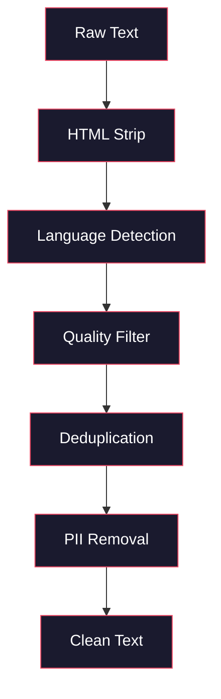
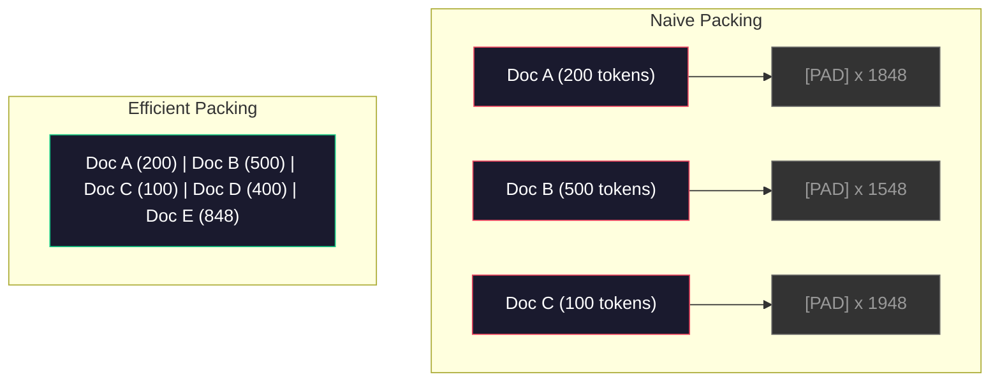

# Pre-Training için veri boruları

> Model bir ayna. Ona verdiğiniz verileri yansıtır. Çöpü besler, çöpü mükemmel akıcılıkla yansıtır.

> **【中文解读】**Model, verildiği verileri sadakatle yansıtır. Önceden yapılan eğitim verileri, ağırlıklı, dil testi, içerikli, akışlı, bölüklü, karışık ve toplu işlemler içerir. Tüm işlemler TB seviyesindeki veriler üzerinde kaydedilmeden yapılmalıdır.

> **【拓展：数据质量→GPT-4/Claude】**GPT-4 ve Claude'un yüksek kaliteli çıkışı, dikkatli tasarlanmış bir veri boru hattından kaynaklanıyor. Llama 3'ün ön eğitim verileri 15T tokeni içerir.

**Type:** Build
**Languages:** Python
**Prerequisites:** Phase 10, Lessons 01-02 (Tokenizers, Building a Tokenizer)
**Time:** ~90 minutes

## Öğrenme hedefleri

- Tümünü belleğe yüklemeden, tıklama, parça, karıştırma ve seri metin terabaytlarını simgeleyen akışlı veri borusunu oluşturun
  构建流式数据管线, TB 级文本上实现分词、分块、打乱和批处理,无需全部内存中装
- Gerçek eğitim öncesi borularda kullanılan veri kalitesi filtrelerini (dedulikasyon, dil tespit, içerik filtresi) uygula
  实现真实预训管线中使用的数据质量过器(去重、语言检测、内容过)
- Uygun dikkat maskeleri ve belge sınırları ile düzenli olarak uzunluklı eğitim dizilerini oluşturmak
   Doğru dikkatli bir saklama ve dosya sınırları işleme için sabit uzunluklı bir eğitim dizisi oluşturmak
- Profil boru hattı geçiş, veriler yükleyiciye GPU eğitim hızı ile uyum sağlamak için
  Analyze hattı nüfuzunu, veri yükleme hızını GPU  eğitim hızı ile takip emin

> **【中文解读】**Bu ders odaklanmak ön eğitim veri boru hattı LLM   kalitesi gerçek kararlı faktörlerdir.

## Sorunlar. Sorunlar.

Bir işaretçiniz var, şimdi verilere ihtiyacınız var.

> Bilgi alıyorsun.

Veriler kümesi değil, CSV dosyası değil. Terabyte metin temizlenmiş, kopyalanmış, kaliteli olarak filtrelenmiş, sabit uzunluklı dizilerde tokenize edilmiş ve 8 GPU'dan oluşan kümeniz bir sonraki seriyi beklemeyecek kadar hızlı rastgele seri olarak servis edilmiş.

> Not a data set. Not a CSV file. Numerous TB's text pass through cleaning, going to weight, quality over、分词 for fixed length sequence, and providing services as-as-a-batch, speed fast to your 8-GPU 集群 will never wait for the next batch of data.

Bir LLM eğitimi hakkında çoğu insan düşünür. Bu model mimarisi hakkında. Llama 3 15.6 trilyon jeton kullanmıştır. GPT-3 300 trilyon kullanmıştır. DeepSeek-V2 8.1 trilyon kullanmıştır. Üçün de mimarisi yaklaşık olarak aynıdır: dikkat ve geri dönüş katmanları olan yığılmış transformatör blokları.

> Büyük çoğunluk LLM'yi model yapısı hakkında eğitmek için kullanıyor.

DeepMind'in Chinchilla makalesi bunu tam olarak ortaya koydu. Verilmiş bir hesaplama bütçesi için, model parametrelerinin eğitim jetonlarına en uygun oranı vardır. Chinchilla 2022'deki çoğu modelin çok az eğitimli olduğunu gösterdi. Gördükleri veri miktarı için çok fazla parametre vardı. 1.4 trilyon token üzerinde eğitilen 70B parametre modeli (Chinchilla-optimal) 300 milyar token üzerinde eğitilen 280B modeli (Gopher) üzerinde performans gösterdi.

> DeepMind'in Chinchilla çalışması bunu net bir şekilde açıklıyor. Bu konuda verilen hesaplama bütçesi, model parametreleri ve eğitim tokenleri arasında en iyi oran vardır. Chinchilla, 2022'deki çoğu modelin ciddi olarak eğitimsiz olduğunu göstermektedir.

Verileriniz, modelinizin dil öğrenmesini veya gürültü öğrenmesini belirler.

> Verileriniz, öğrenme modelinizi dil mi ses mi belirler.

> **【中文解读】**Chinchilla 论文(DeepMind 2022) kanıt: sabit hesaplama bütçesinde, model parametri ve eğitim tokenleri sayı eşit oran genişletmek gerekir。Llama 3'ün 70B modeli 15.6T tokenlerinde yukarı tren far over Chinchilla en iyi oranı, ancak Meta bu "aşırı eğitim" üretilen model düşünce maliyeti daha düşük olduğunu buldu。

> **【拓展：数据混合比的工程经验】**Llama 3 açık verilerin oranı: %50'lik web sayfa verileri, %25'lik kodlar, %13'lik kitaplar ve makaleler, %8'lik matematik, %4'lik çok dilli web sayfalar.

>  **【前置】**学本节前 Lütfen önce bil:(1) Fase 10·01 和 02(分词器) 理解符号与字节流;(2) Fase 10·01 提到的Chinchilla ölçekleme yasası理解参数与符号数的最佳比例;(3) Python 生成器 / `IterableDataset`- Ne ?`datasets.stream`流式处理范式;(4) MinHash + LSH 近似去重算法(不熟请先看Llama 3 / RefinedWeb 论文的相关章节)

## Konsepten bir şey.

### Verilerin Kaynağı

Her büyük dil modeli bir karışım kaynaklara dayanarak eğitilmiştir. Tam bileşim çoğu laboratuvar için sıkı korunan bir sırdır, ama kategorileri anlayacak kadar biliyoruz.

> Her büyük dil modeli karıştırılmış veri kaynaklarında eğitilmiştir. Çoğu laboratuvarın tam olarak yapısı gizlidir, ancak her türü anlayabilmemiz için yeterince bilgi sahibiyiz.

| Source | Size | Quality | Used By |
|--------|------|---------|---------|
| Common Crawl | ~250 TB raw | Low (needs heavy filtering) | GPT-3, Llama, most open models |
| Wikipedia | ~20 GB | High | Every major LLM |
| GitHub code | ~1 TB+ | Medium (lots of duplicates, dead code) | StarCoder, CodeLlama, DeepSeek-Coder |
| Books (BookCorpus, Pile) | ~100 GB | High | GPT-2, GPT-3, early models |
| Academic papers (arXiv, S2ORC) | ~100 GB | High for STEM | Llama, Galactica |
| StackOverflow, Reddit | ~100 GB | Medium | Llama, Falcon |
| Curated web (C4, RefinedWeb) | ~5 TB | Medium-High (pre-filtered) | T5, Falcon |

Llama 3 veriler karışımını açıkladı: yaklaşık %50 web verileri, %25 kod, %13 kitap ve akademik makaleler, %8 matematik verileri ve %4 çok dilli web verileri.

> Llama 3 verilerini paylaştı: %50'lik web sayfa verileri, %25'lik kod, %13'lik kitaplar ve akademik makaleler, %8'lik matematik verileri ve %4'lik çok dilli web sayfa verileri.

Bu oranın da önemli olduğu kadar toplam boyut da önemlidir. Çok fazla web verisi ve model Reddit papağanı olur. Çok az kod ve programlanamaz. Çok az matematik ve mantık yürütmede başarısız olur. Bu karışımı doğru hale getirmek LLM eğitimin en zor kısımlarından biridir ve bir formül yoktur.

> Örneğin, toplam büyüklük ile aynı derecede önemlidir. 🏻 WEB sayfa verileri çok fazla, model Reddit 🏻 kod çok az, programlamayacak.

### Veriler Temizle

Çöp web verileri pisliktir.

> Bir tipik Common Crawl 转储包含:

- HTML etiketleri ve JavaScript
  Çeviri: HTML 标签和 JavaScript
- Kaynak plağı başlıkları, ayakkabıları, gezinti menüleri
  Çinçe Çevirimi:样板页眉、页脚、导航菜单
- Çift sayfalar (tam ve neredeyse çift sayfalar)
  Çinçe Çevirim:重复页面 (Çinçe Çevirim:重复页面)
- Makine tarafından oluşturulan spam
  Çöp içeriği: Çöp içeriği
- Kişisel olarak tanımlanabilir bilgiler (PII)
  Çeviri: Şahsenliğin Bilgi
- Düşük kaliteli metin (kilit kelimeler listesi, SEO spam)
  Çeviri: Çeviri: Çeviri: Çeviri: Çeviri: Çeviri: Çeviri: Çeviri: Çeviri: Çeviri: Çeviri: Çeviri: Çeviri: Çeviri: Çeviri: Çeviri: Çeviri: Çeviri: Çeviri: Çeviri: Çeviri: Çeviri: Çeviri: Çeviri: Çeviri: Çeviri: Çeviri: Çeviri: Çeviri: Çeviri: Çeviri: Çeviri: Çeviri: Çeviri: Çeviri: Çeviri: Çeviri: Çeviri: Çeviri
- Metin olarak kodlanan metin dışı içerik
  Çine dilinde:编码为文本的非文本内容

Bu temizlik seçeneği değildir. Koherent paragraflar üreten ve ürün listeleri ile karıştırılmış HTML etiketleri çıkaran bir model arasındaki fark.

> Temizleme seçeneği değildir. Bu, oluşturma ve çıkış karışık HTML etiketleri ile ürün listesi modelleri arasındaki farkı oluşturur.

>  **【类比】**数据管线像"自来水厂的多级过系统":原水(Common Crawl)→ 沉池(HTML 剥离)→ 沙(语言检测)→ 活性炭(质量分类器过 SEO 垃圾)→ 反透(MinHash 近似去重)→ 紫外线(PII 脱敏)→ 出水口(打包令牌片块) ・・・ Her bir sınıfın fışkı, son çıkan "su" on has杂质模型学到的就是杂质而非语言。Chinchilla论文指出, kararlaştırılan modelin kalitesi model değil, "su temizliği × 水量" olarak belirlenir.



Her adım bir gürültü kategorisini ortadan kaldırır:

> Her adım bir sınıf gürültü ortadan kaldırmak için:

**HTML stripping:**Tüm işaretlemeyi kaldırın. Sadece görünen metin içeriğini saklayın.`trafilatura`veya `readability`Navigasyon, reklamlar ve kaynaktan çıkartarak makale içeriğini çıkarın.

> **HTML 剥离：**Tüm işaretleri kaldırın. Sadece görünen metin içeriğini koruyun.`trafilatura`Ya da`readability`Üzerinde bir de yayın yaparak, yayın yaparak, yayın yaparak ve yayın yaparak.

**Language detection:**Her belgeyi sınıflandırmak için fastText'in dil tanımlama modeli (lid.176.bin) kullanın. Hedef dillerinize filtreleyin. 0.8'den az güvenle İngilizce olarak sınıflandırılmış bir belge muhtemelen temiz İngilizce değildir.

> **语言检测：**kullan fastText'in dil tanımlama modeli ({{lang-link.176.bin) }}) için her bir dosya sınıflandırılmıştır.

**Quality filtering:**Bu ilginç bir noktaya dönüşüyor. RefinedWeb (Falcon'un arkasındaki veri kümesi) karmaşıklığa dayalı bir filtre kullanıyor: Wikipedia'da küçük bir dil modeli eğitmek, sonra her belgeyi notlamak. Yüksek karmaşıklık belgeyi Wikipedia'ya benzemiyor demektir - muhtemelen spam, anahtar kelime listeleri veya makine tarafından oluşturulan içerik.

> **质量过滤：**Bu ilginç bir bölümdür. RefinedWeb (Falcon'un arkasındaki veri kümesi) karışıklığa dayalı filtreler kullanıyor: Wikipedia'da küçük bir dil modeli eğitmek, sonra her bir makaleye değer vermek. Yüksek karışıklık, Wikipedia'nın dışındaki bir makale anlamına geliyor.

**Deduplication:**En etkili temizleme adımları. Common Crawl çok sayıda kopya sayfası içerir. yasal hak çıkarma bildirimleri, çerez bildirimleri, hizmet şartları.

> **去重：**影響最大的清洗步骤──Common Crawl 包含大量重复页面法律声明、cookie 通知、服务条款──重复数据上训练浪费算力,也可能导致模型逐字记忆和复述特定段落──

**PII removal:**Adlar, e-posta adresleri, telefon numaraları, sosyal güvenlik numaraları, yapılandırılmış PII için Regex tabanlı tespit, bağlamda isimler için NER modelleri.

> **PII 移除：**姓名、电子邮件地址、电话号码、社会安全号码──结构化 PII 用正则检测,上下文中的姓名用 NER 模型──

> **【中文解读】**Data cleanup en önemli kısımdır. İlk web sayfalarındaki veri gürültüden doludur. HTML etiketi, navigasyon menüleri, makineler tarafından üretilen SEO çöp, kişisel gizlilik bilgileri.

> **【拓展：去重的工程影响】**Llama  takım raporundan sonra yaklaşık %38'i yeniden taşıdı. Common Crawl'un üçte birinden fazlası tekrar veya yakın tekrar içeriği içeriyor.

> ️ **【易错点】**Bu da bir şey .**整库加载进内存**`datasets.load_dataset("common_crawl", split="train")`Tüm 15T tokenleri kullanmak zorundadır.`streaming=True`Ya da`IterableDataset`;(2) **去重时把"高密度优质内容"误删**文档 A 包含整篇 Wikipedia(5KB),文档 B 只是引用一句的博客(500 字),MinHash 误判为高相似度──修复:在围上 之前对每篇文档归归一化长度,或对小文档用更保守的值;(3) 文档 B 仅引用一句的博客 (B 文档 引用一句的博客) 文档 B 仅引用一句的博客 (B 文档 引用一句的博客) 文档 MinHash 误判为高相似度──修复: 在围上 之前对每篇文档归一化长度,或对小文档用更保守的值;**打包（pack）跨文档 attention 漏 mask**2048'de bir tane de olsa, bir tane de olsa, bir tane de olsa, bir tane de olsa, bir tane de olsa, bir tane de olsa, bir tane de olsa, bir tane de olsa, bir tane de olsa, bir tane de olsa, bir tane de olsa, bir tane de olsa, bir tane de olsa, bir tane de olsa, bir tane de olsa, bir tane de olsa, bir tane de olsa, bir tane de olsa, bir tane de olsa, bir tane de olsa, bir tane de olsa, bir tane de olsa, bir tane de olsa, bir tane de olsa, bir tane de olsa, bir tane de olsa, bir tane de olsa, bir tane de olsa, bir tane de olsa, bir tane de olsa, bir tane de olsa, bir tane de olsa, bir tane de olsa, bir tane de olsa, bir tane de olsa, bir tane de olsa, bir tane de olsa, bir tane de olsa, bir tane de olsa, bir tane de olsa, bir tane de olsa, bir tane de bir tane de olsa, bir tane de bir tane de olsa, bir tane de bir tane de bir tane de bir tane de bir tane de bir tane de bir tane de bir tane de bir tane de bir tane de bir tane de bir tane de bir tane de bir tane de bir tane de bir tane de bir tane de bir tane de bir tane de bir tane de bir tane de bir tane de bir tane de bir tane de bir tane de bir tane de bir tane de bir tane de bir tane de bir tane de bir tane de bir tane de bir tane de bir tane de bir tane de bir tane de bir tane de bir tane de bir tane de bir tane de bir tane de bir tane de bir tane de bir tane de bir tane de bir tane de bir tane de bir tane de bir tane de bir tane de bir tane de bir tane de bir tane de bir tane de bir tane de bir tane de bir tane de bir tane de bir tane de bir tane de bir tane de bir tane de bir tane de bir tane de bir tane de bir tane de bir tane de bir tane de bir tane de bir tane de bir tane de bir de bir de bir tane de bir tane de bir tane de bir de bir de bir tane de bir de bir de bir de bir tane de bir de bir de bir de bir de bir de bir de bir de bir de bir de bir de bir de bir de bir de bir de bir de bir de bir de bir de bir de bir de bir de bir`varlen`接口 veya blok diyagonal dikkat maskası;(4) **配比（mix）在 epoch 间漂移**şeflet 时按"文档级"而非"token 级"采样,结果小文档被过度采样、大文档欠采样──

### MinHash ile deduplasyon

Tam deduplasyon kolay: her belgeyi hash edin, kopyaları kaldırın. Ama neredeyse kopyalar gerçek sorun. Çevresi biraz farklı reklamlarla aynı haber makalesinin iki kopyası neredeyse kopyalardır. İçeriği% 95 aynı, ancak bayt-bayt farklıdır.

> 精确去重很简单:对每文档哈希,移除重复──但近似重复才是真正的问题──同一新闻文章的两副本,周围广告略有不同,就是近似重复──内容 95%相同,但字节不同──

MinHash + Yerleşim Duyarlı Hashing (LSH) bunu verimli bir şekilde çözüyor.

> MinHash + 局部敏感哈希(LSH) 高效地解決了這個問題──


Fikir:

> 核心思想:

1. **Shingling:**Her belgeyi n-gram bir diziye dönüştürün (örneğin, 5 gram kelimeler veya karakterler).
   Çeviri:**Shingling：**将每篇文档转换为一组 n-gram 集合(如 5词或 5字符的 n-gram) ・・・"hızlı kahverengi tilki" 用 3词 shingle 变为 {"hızlı kahverengi", "hızlı kahverengi tilki"}。

2. **MinHash:**Her belgenin şingle seti için k hash değerlerini hesaplayın. Her şingle değeri farklı bir şingle işlevi altında tüm şingleler üzerinde minimum şingle değeri. Bu, herhangi iki belge arasında Jaccard benzerliğini yakınlaştıran sabit boyutlu bir " imza " oluşturur.
   Çeviri:**MinHash：**Her bir dosyanın şiling değerinin toplamı hesaplanır. Her bir şiling değerinin farklı şiling fonksiyonları altında en az şiling değeri vardır. Bu da herhangi bir dosyanın Jaccard benzerliğine benzer bir sabit büyüklükteki bir " imza" oluşturur.

3. **LSH:**MinHash imzasının bantlarına dayanarak belgeleri kovalara ayırın. Aynı kovadaki belgeleri aday neredeyse kopyalı. Bu her çiftin karşılaştırılmasını önler. Sadece adayları karşılaştırırsınız.
   Çeviri:**LSH：**MinHash'in imzaladığı条带'e göre, aynı kutudaki dosyalar adayların yakınlıklı tekrarlanmasını önler. Bu iki kişiyi sadece adaylara karşı karşı karşılaştırır.

4. **Verify:**Her aday çift için, tam Jaccard benzerliği hesaplayın.
   Çeviri:**验证：**Her aday için, hesaplama doğru Jaccard benzerliği. Eğer benzerlik  değerinden fazlasa, genellikle 0.8'dir.

Llama ekibi, web verilerinin yaklaşık% 38'ini deduplasyon yoluyla kaldırdığını bildirdi. Bu küçük bir sayı değil. Common Crawl'un üçte birinden fazlası çift veya neredeyse çift içerikli.

> Llama 团队 raporu, yaklaşık %38'lik web sayfa verilerini yeniden taşıdı. Bu küçük bir rakam değil.

### Sıradan Paketleme

Modeliniz sabit uzunluklı giriş dizilerini bekliyor. Belgeleriniz değişken uzunlukta. Bazıları 50 token. Bazıları 50.000 token.

> Senin model beklentilerinin uzunluğu sabitlenmiş. Dosyaların uzunluğu bir değil. Bazıları 50 tane simgelik. Bazıları 50.000 tane simgelik.

Naif yaklaşım: her belgeyi maksimum sekans uzunluğuna kadar doldur. Bu, öğrenmeye hiçbir katkıda bulunmayan tokenleri doldurmak için muazzam bir hesaplama harcamaktadır.

> 朴素方法:将每篇文档填充至最大序列长度──这浪费大量算力在贡献为零的填充代币上──

Daha iyi yaklaşım: birden fazla belgeyi tek bir dizide birleştirin, dizinin sonu belirtiler ile ayrılır. 2048 belirtiler dizisi, bunlar arasında [EOS] belirtilerle bağlanmış üç kısa belge içerebilir.

> Daha iyi yöntem:将多篇文档打包到单个序列中,序列结束符号 分隔──2048 bir token 序列可能包含三篇短文档,中间使用 [EOS] token 连接──

> 🤔 **【困惑】**S: 既然包装会跨文档污染,为什么不直接使用填充?多浪费点算力换正确性不是更稳定吗? A: 因为预训算力极其昂贵Llama 3 训练成本估计10亿美元。包装 序列平均填充率从 ~40%带填充) 升至 ~95%+,等于把训练成本砍掉一半以上(约省5000万美元)  正确做法不是退回填充,而是用文件边界的填充FlashAttention 的`cu_seqlens`Ya da blok-diyagonal dikkat) 1  son sorguyu görmezden 2  anahtar/değerı.



Dikkat maskası doğru şekilde ayarlanmalıdır. A belgesinden gelen tokenler aynı paketlenmiş sırada B belgesinden gelen tokenlere katılmamalıdır. Bu, blok diyagonal bir dikkat maskası gerektirir.

> dikkat çekmek için doğru bir şekilde ayarlanmalıdır. A'nın simgesi, B'nin simgesi, aynı şekilde ayarlanmalıdır.

Uzun belgeleri sırayla sınırlarda kısaltılır veya parçalara ayrılır. Bölüm noktası önemlidir: cümle ortasında bölünmek, modelin eksik düşünceleri görmesini zorlar.

> 长文档在序列边界处被切断或分分成块──分点很重要:在句子中分迫使模型看到不完整的思想──一些管线在可能时将分点对齐到段落或句子边界──

> **【中文解读】**序列打包(Sequence Packing) is going to change长文档 fill to fixed length training sequence's technique──朴素方法 with PAD 填充会浪费大量算力──高效方法 will多个短文档用 [EOS] 分隔拼接进同一序列, but needs block对角注意力掩码(block-diagonal attention mask)文档 A'nın belirgisi aynı sırada文档 B'nin belirgisini dikkate almamalıdır──

> **【拓展：Chinchilla 定律与过度训练】**Chinchilla'nın hukuku model parametri ve eğitim tokeninin sayılarının artması ile ilgili olarak düşünmektedir. Ancak Llama 3'ün 70B modeli 15T tokenlerinde eğitim alır.

### Chinchilla Ölçekleme Yasası

Sıkı bir hesaplama bütçesi C için (FLOP'lerde ölçülür) en uygun model boyutu N ve veri kümesi boyutu D aşağıdakiler:

> 固定计算预算 C(以 FLOPs 衡量),最优模型大小 N 和数据集大小 D 遵循:

```
N_opt ~ C^0.5
D_opt ~ C^0.5
```

Bu, pratikte model boyutunu ve veri kümesi boyutunu yaklaşık olarak eşit olarak ölçeklendirmeniz gerektiği anlamına gelir. 10 kat daha fazla parametre olan bir model aynı kayba ulaşmak için yaklaşık 10 kat daha fazla eğitim jetonu gerektirir.

> Bu, pratikte, model büyüklüğünü ve veri kümesi büyüklüğünü büyük bir oranla genişletmeniz gerektiği anlamına gelir.

| Model | Parameters | Training Tokens | Chinchilla-Optimal? |
|-------|-----------|----------------|-------------------|
| GPT-3 | 175B | 300B | No (undertrained 3-4x) |
| Chinchilla | 70B | 1.4T | Yes (by design) |
| Llama 2 | 70B | 2T | Overtrained (intentionally) |
| Llama 3 | 70B | 15T | Heavily overtrained |

Llama 3 bilerek Chinchilla yasasını ihlal eder. Meta, daha fazla veri üzerinde aşırı eğitim - hesaplama-optimal oranın çok ötesinde - sonucu çıkarmak için daha iyi modeller ürettiğini buldu. Ekstra eğitim maliyeti bir kez ödenir, ancak daha küçük model sonsuza kadar hizmet etmek için daha ucuz. Bu bazen " sonucu-optimal" ölçekleme yaklaşımı olarak adlandırılır ve 2024'ten beri endüstri standardı haline gelmiştir.

> Llama 3 Chinchilla'nın kanununu kasten ihlal etti. Meta'nın bulduğu gibi daha fazla veri aşırı eğitiminin  far over computation optimum ratio  daha iyi bir model üretebilmesi için daha iyi bir model üretmek için daha fazla veri kullanılabilir. Ekstra eğitim maliyeti sadece bir kez ödenir, ancak daha küçük modeller sürekli daha uygun hizmet sağlar. Bu bazen "Tarih optimum" olarak adlandırılır.

## Yapın.
```figure
l5-data-pipeline
```

## Yapın

### Adım 1: Metni Temizle

HTML'i çiz, beyaz alanı normalleştir, metin dışı içeriği kaldır. Küçük bir korpusumuz olarak kamu alanı metni (Project Gutenberg) kullanacağız.

> HTML'den ayrıldım, boş boşluklara dönüştüğüm, yayın içeriği dışında taşındım.

```python
import re

def clean_text(text):
    text = re.sub(r"<[^>]+>", "", text)
    text = re.sub(r"http\S+", "", text)
    text = re.sub(r"[^\x20-\x7E\n]", "", text)
    text = re.sub(r"\n{3,}", "\n\n", text)
    text = re.sub(r" {2,}", " ", text)
    return text.strip()

def quality_filter(text, min_words=50, max_ratio_caps=0.3, max_ratio_special=0.1):
    words = text.split()
    if len(words) < min_words:
        return False
    caps_ratio = sum(1 for w in words if w.isupper()) / len(words)
    if caps_ratio > max_ratio_caps:
        return False
    special_chars = sum(1 for c in text if not c.isalnum() and not c.isspace())
    if special_chars / max(len(text), 1) > max_ratio_special:
        return False
    return True
```

Kalite filtresi SEO spam (ALL CAPS), makine tarafından üretilen gürültü (yüksek özel karakter oranı) ve parça sayfaları (çok kısa) yakalar. Bu üç kontrol tek başına web taramalarından şaşırtıcı miktarda çöp çıkarır.

> 质量过器捕获 SEO 垃圾(全大写) 机器生成的噪音(高特殊字符比例) 和存根页面(太短) 👍

### Adım 2: MinHash Deduplasyonu

MinHash'i sıfırdan uygulamak.`hashlib`- Evet .

> MinHash'ı gerçekleştirmek için dış kaynaklara ihtiyaç yok.`hashlib`- Evet.

```python
import hashlib
from collections import defaultdict

def get_shingles(text, k=5):
    words = text.lower().split()
    if len(words) < k:
        return set()
    return {" ".join(words[i:i+k]) for i in range(len(words) - k + 1)}

def minhash_signature(shingles, num_hashes=128):
    signature = []
    for i in range(num_hashes):
        min_hash = float("inf")
        for shingle in shingles:
            h = int(hashlib.sha256(f"{i}:{shingle}".encode()).hexdigest(), 16)
            min_hash = min(min_hash, h)
        signature.append(min_hash)
    return signature

def lsh_buckets(signature, bands=16):
    rows_per_band = len(signature) // bands
    buckets = []
    for b in range(bands):
        start = b * rows_per_band
        band_data = tuple(signature[start:start + rows_per_band])
        bucket_hash = hashlib.md5(str(band_data).encode()).hexdigest()
        buckets.append((b, bucket_hash))
    return buckets

def deduplicate(documents, threshold=0.8, num_hashes=128, bands=16):
    signatures = []
    shingle_sets = []
    for doc in documents:
        shingles = get_shingles(doc)
        shingle_sets.append(shingles)
        signatures.append(minhash_signature(shingles, num_hashes))

    bucket_map = defaultdict(list)
    for doc_idx, sig in enumerate(signatures):
        for band_id, bucket_hash in lsh_buckets(sig, bands):
            bucket_map[(band_id, bucket_hash)].append(doc_idx)

    duplicate_pairs = set()
    for bucket_docs in bucket_map.values():
        if len(bucket_docs) < 2:
            continue
        for i in range(len(bucket_docs)):
            for j in range(i + 1, len(bucket_docs)):
                duplicate_pairs.add((bucket_docs[i], bucket_docs[j]))

    removed = set()
    for i, j in duplicate_pairs:
        if i in removed or j in removed:
            continue
        s1, s2 = shingle_sets[i], shingle_sets[j]
        if not s1 or not s2:
            continue
        jaccard = len(s1 & s2) / len(s1 | s2)
        if jaccard >= threshold:
            removed.add(j)

    return [doc for idx, doc in enumerate(documents) if idx not in removed], len(removed)
```

- Evet .`num_hashes=128`ve `bands=16`Daha fazla hash daha doğru benzerlik tahminleri verir. Daha fazla bant daha fazla yanlış pozitif maliyetinde hatırlama artırır. Bu değerler tipik web metni için iyi çalışır.

> `num_hashes=128`和 `bands=16`参数 kontrolü doğruluk-içleme oranının ağırlığı. Daha fazla hash değeri daha doğru benzerlik tahminini verir.

### Adım 3: Sekansları Tokenize ve Paket

Temiz, kopyalı metni alın, işaretleyin ve eğitim için sabit uzunluklı dizilerde paketleyin.

> 取清洗、去重后的文本,分词,打包为固定长度序列用于训练──

```python
def tokenize_corpus(documents, tokenizer):
    all_tokens = []
    for doc in documents:
        tokens = tokenizer.encode(doc)
        all_tokens.extend(tokens)
        all_tokens.append(tokenizer.eos_id)
    return all_tokens

def pack_sequences(token_ids, seq_length, pad_id=0):
    sequences = []
    attention_masks = []
    for i in range(0, len(token_ids), seq_length):
        seq = token_ids[i:i + seq_length]
        mask = [1] * len(seq)
        if len(seq) < seq_length:
            pad_count = seq_length - len(seq)
            seq = seq + [pad_id] * pad_count
            mask = mask + [0] * pad_count
        sequences.append(seq)
        attention_masks.append(mask)
    return sequences, attention_masks
```

### Adım 4: Eğitim için DataLoader

Eğitim döngüsü bu kadar tüketir.

> Bu, eğitim döngüsünün tüketiminin verileri.

```python
import random

class PreTrainingDataLoader:
    def __init__(self, sequences, attention_masks, batch_size, shuffle=True):
        self.sequences = sequences
        self.attention_masks = attention_masks
        self.batch_size = batch_size
        self.shuffle = shuffle

    def __len__(self):
        return (len(self.sequences) + self.batch_size - 1) // self.batch_size

    def __iter__(self):
        indices = list(range(len(self.sequences)))
        if self.shuffle:
            random.shuffle(indices)
        for start in range(0, len(indices), self.batch_size):
            batch_idx = indices[start:start + self.batch_size]
            batch_seqs = [self.sequences[i] for i in batch_idx]
            batch_masks = [self.attention_masks[i] for i in batch_idx]
            yield batch_seqs, batch_masks
```

### Adım 5: Veritahtıstatistikler

Önemli olan sayıları hesaplayın: toplam tokenler, benzersiz tokenler, sıkıştırma oranı, belge uzunluğu dağılım.

> 計算关键指标:总代号 数、唯一代号 数、压缩比、文档长度分布──

```python
from collections import Counter

def compute_statistics(documents, token_ids, sequences, tokenizer_vocab_size):
    total_chars = sum(len(d) for d in documents)
    total_tokens = len(token_ids)
    unique_tokens = len(set(token_ids))
    compression_ratio = total_chars / total_tokens

    doc_lengths = [len(d.split()) for d in documents]
    avg_doc_length = sum(doc_lengths) / max(len(doc_lengths), 1)
    max_doc_length = max(doc_lengths) if doc_lengths else 0
    min_doc_length = min(doc_lengths) if doc_lengths else 0

    token_counts = Counter(token_ids)
    top_tokens = token_counts.most_common(10)

    non_pad_tokens = sum(sum(1 for t in seq if t != 0) for seq in sequences)
    total_positions = sum(len(seq) for seq in sequences)
    utilization = non_pad_tokens / max(total_positions, 1)

    stats = {
        "total_documents": len(documents),
        "total_characters": total_chars,
        "total_tokens": total_tokens,
        "unique_tokens": unique_tokens,
        "vocab_utilization": unique_tokens / tokenizer_vocab_size,
        "compression_ratio": compression_ratio,
        "avg_doc_length_words": avg_doc_length,
        "max_doc_length_words": max_doc_length,
        "min_doc_length_words": min_doc_length,
        "num_sequences": len(sequences),
        "sequence_utilization": utilization,
        "top_10_tokens": top_tokens,
    }
    return stats
```

Sıkıştırma oranı, bu korpus üzerinde tokenizerin ne kadar verimli olduğunu gösterir. İngilizce metin tipik olarak her token başına yaklaşık 3-4 karakterle sıkıştırılır.

> 压缩比告诉你分词器在此语料上的效率──英文文本通常缩写到每个代币约3-4字符── eğer her bir deyişle 1.5字符 görürseniz,分词器分分过激进──如果看到8+,说明它学到了非常特定领域的合并──

Sequence utilization size paketlenen sıraların ne kadarı gerçek veri ile doldurma karşılaştırıldığında gösterir. %90'ın altında paketlemeniz verimsiz demektir -- paketleme tokenlerinde hesaplama harcadınız.

> 序列利用率 size 序列中多少是真数据与填充的比较. %90'dan düşük. Bu da 包装效率 düşük demektir.

## Çerçeveyi kullanın.

### HuggingFace verileri ile karşılaştır

Aynı corpus'u HuggingFace'ın veri kümesi kütüphanesi üzerinden yükle ve boru hattı hızını karşılaştır.

> HuggingFace'ın veri kümeleri ile aynı konuyu yükleme ve 管线速度的相比较量.

```python
from datasets import load_dataset
from transformers import AutoTokenizer

ds = load_dataset("wikitext", "wikitext-2-raw-v1", split="train")
tokenizer = AutoTokenizer.from_pretrained("meta-llama/Meta-Llama-3-8B")

import time

start = time.time()
tokenized = ds.map(
    lambda x: tokenizer(x["text"], truncation=True, max_length=2048),
    batched=True,
    num_proc=4,
)
hf_time = time.time() - start
total_tokens = sum(len(t) for t in tokenized["input_ids"])
print(f"HuggingFace: {total_tokens:,} tokens in {hf_time:.2f}s ({total_tokens/hf_time:,.0f} tokens/sec)")
```

HuggingFace boru hattı, kapının altında Rust tokenizörlerini kullanır ve 4 çekirdek boyunca paralel işleme yapar. Temiz Python boru hattınız 10-50 kat daha yavaş olacaktır. Bu boşluk, üretim ekiplerinin toplanmış tokenizörleri kullanmasının nedeni. Algoritm aynıdır. Uygulama dili farkıdır.

> HuggingFace 管线底层使用 Rust 分词器和 4 核并行处理。你的纯字thon 管线会慢10-50倍──这就是为什么生产团队使用编译分词器──算法相同──实现语言是区别──

## İndirin . Ürünler .

Bu ders, LLM eğitim boru hattlarında veri kalitesini doğrulamak ve düzeltmek için bir ipucu oluşturur.`outputs/prompt-data-quality-checker.md`- Evet .

> Bu dersler, LLM'yi test ve düzenlemek için hazırlanmıştır.`outputs/prompt-data-quality-checker.md`- Evet.

## Egzersizler.

1. **Easy:**Temizleme borusuna basit bir heuristik (harakter set analizi) kullanarak dil tespitini ekleyin. Sadece İngilizce belgeleri filtreleyin ve kaç belge kaldırıldığını ölçün.
2. **Medium:**SHA-256 hashleri ile birlikte MinHash yakın deduplasyonu ile doğru deduplasyon uygulayın.
3. **Hard:**Kafasını karışıklık tabanlı bir kalite filtre oluşturun. Wikipedia metni üzerinde küçük bir büyük metin dil modeli eğitiniz, her belgeyi karışıklık ile not edin ve alt 20%'i çıkarın. Filtreli ve filtre edilmemiş veriler üzerinde eğitim yaparken model çıkış kalitesini karşılaştırın.

## Anahtar Şartlar .

| Term | What people say | What it actually means | 中文释义 |
|------|----------------|----------------------|---------|
| Common Crawl | "The internet" | A non-profit that crawls the web monthly -- ~250TB raw, the starting point for most LLM training data | 通用爬虫，LLM 训练数据的起点 |
| MinHash | "Some hashing trick" | A technique to estimate Jaccard similarity between sets using fixed-size signatures -- enables near-duplicate detection at scale | 最小哈希，近似重复检测的核心技术 |
| LSH | "Locality-Sensitive Hashing" | A method to group similar items into the same bucket -- reduces pairwise comparisons from O(n^2) to near-linear | 局部敏感哈希，将 O(n^2) 降为近似线性 |
| Sequence packing | "Concatenating documents" | Fitting multiple documents into fixed-length sequences with proper attention masks -- eliminates padding waste | 序列打包，消除填充浪费 |
| Chinchilla scaling | "Train on more data" | For a fixed compute budget, optimal performance requires scaling model size and training tokens roughly equally | Chinchilla 缩放定律，参数和数据应等比增长 |
| Fertility | "Tokens per word" | Average number of tokens per word -- 1.3 for English in GPT-4, higher for non-Latin scripts | 生育率，每词 token 数 |
| Data mixing | "Choosing training data" | The ratio of code vs text vs math vs multilingual data -- no formula, requires experimentation | 数据混合比，需实验确定 |
| Perplexity filter | "Quality scoring" | Use a small language model to score documents -- high perplexity means the text is unlike clean reference data | 困惑度过滤，低质量文档评分高 |
| Deduplication | "Removing copies" | Eliminating exact and near-duplicate documents -- typically removes 30-40% of raw web data | 去重，通常移除 30-40% 网页数据 |
| Attention mask | "Which tokens to look at" | A binary mask that prevents attention across document boundaries in packed sequences | 注意力掩码，阻止跨文档注意力 |

## Daha fazla okumak

- [Hoffmann et al., 2022 -- Training Compute-Optimal Large Language Models (Chinchilla)](https://arxiv.org/abs/2203.15556)- verilerin ölçeklenmesi hakkında düşüncelerimizi değiştiren makale
- [Penedo et al., 2023 -- The RefinedWeb Dataset for Falcon LLM](https://arxiv.org/abs/2306.01116)-- Common Crawl'ı yüksek kaliteli filtrelemek için nasıl
- [Touvron et al., 2023 -- Llama 2: Open Foundation and Fine-Tuned Chat Models](https://arxiv.org/abs/2307.09288)-- Llama 2 için veri boru hattı detayları
- [Lee et al., 2022 -- Deduplicating Training Data Makes Language Models Better](https://arxiv.org/abs/2107.06499)- ...deplomasyon neden düşündüğünüzden daha önemli?
- [Broder, 1997 -- On the Resemblance and Containment of Documents](https://ieeexplore.ieee.org/document/666900)- Orijinal MinHash kağıdı
- [Meta, 2024 -- Llama 3 Technical Report](https://arxiv.org/abs/2407.21783)-- 15.6T tokens, veri karışımı oranları, filtrelenme borusu
