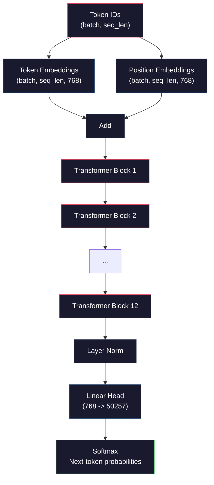
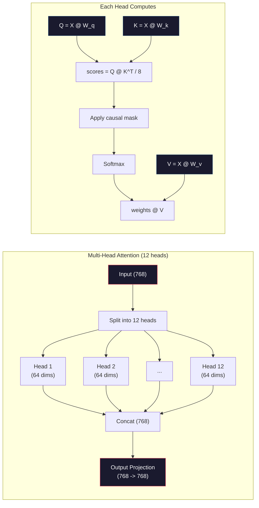
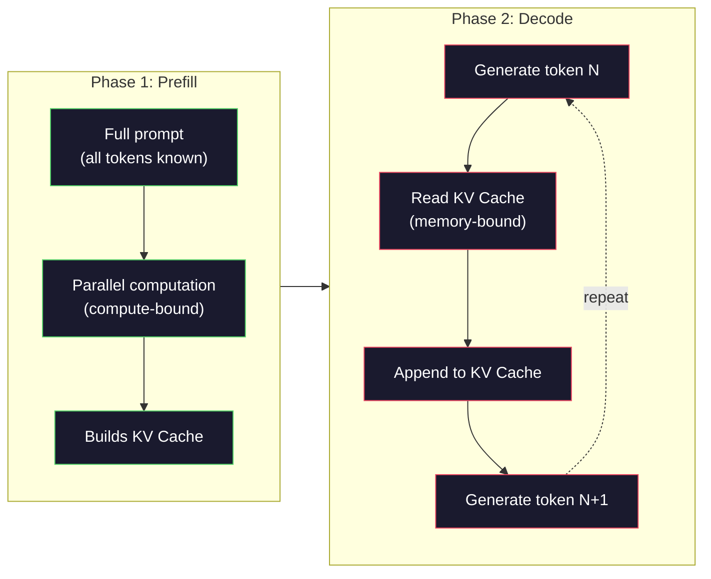

# Mini GPT'nin 124.000 parametreyi hazırlamak için.

> GPT-2 Small'ın 124 milyon parametre vardır. 12 transformatör katmanı, 12 dikkat başlığı ve 768 boyutlu yerleşim. Bir GPU'da birkaç saat içinde sıfırdan eğitilebilir. Çoğu insan bunu asla yapmaz. Önceden eğitilmiş kontrol noktalarını kullanırlar. Ama eğer kendiniz eğitilmezseniz, ürünlerini inşa ettiğiniz modelin içinde neler olup bittiğini anlamayacaksınız.

> **【中文解读】**GPT-2 Small 1.24 milyar parametre 12 kat Transformer  12  dikkat başı  768                                                                                                                                                                                                                                                                                                                                                                                                                                                                                                        

> **【拓展：大模型三阶段】**Büyük Model Eğitim Üç aşama:(1) 预训练(海量无标注数据,学习语言表示)→ (2) SFT(指令微调,学会跟随指令)→ (3) RLHF/DPO(对齐人类偏好)。本课是第一阶段,GPT-2 是所有GPT 系列的原型。

>  **【前置】**学本节前 Lütfen önce bilmelisiniz:(1) Fase 10·01-03(分词器、数据管线) 理解 token ID 序列如何输入模型;(2) Transformer 架构(Fase 05) 自我注意、LayerNorm、FFN;(3) numpy 矩阵运算、反向传播手算(Fase 03 微积分与链式法则);(4) 交叉损失函数的梯度推导──本课**用 numpy 实现**PyTorch Autograd'a güvenmeyi bırakıp kendi yazısını yazmayı başaracağım.`backward()`- Evet.

**Type:** Build
**Languages:** Python (with numpy)
**Prerequisites:** Phase 10, Lessons 01-03 (Tokenizers, Building a Tokenizer, Data Pipelines)
**Time:** ~120 minutes

## Öğrenme hedefleri

- GPT-2 mimarisi (124M parametresi) tamamını sıfırdan uygula: token yerleştirmeler, pozisyon yerleştirmeler, transformatör blokları ve dil model başlığı
  GPT-2 yapılarının tamamını gerçekleştirmek için: token 嵌入、位置嵌入、Transformer 块和语言模型头
- GPT modeli bir metin korpusunda, çapraz entropik kaybı ile bir sonraki belirti tahminini kullanarak çalıştır
  Use下一代币 预测和交叉损失在文本语料上训练 GPT 模型
- Temerate örneği ve üst-k/üst-p filtresi ile autoregressive metin oluşturulmasını uygula
  实现带温度采样和 top-k/top-p 过的自归文本生成
- Eğitim kaybı eğriliklerini izle ve modelin tutarlı dil kalıplarını öğrendiğini doğrulay
  监控训练损失曲线,验证模型学到了连贯的语言模式

> **【中文解读】**Bu ders, GPT-2'yi gerçekleştirmek için saf bir numpy kullanıyor. Küçük bir şey değil.

## Sorunlar. Sorunlar.

Transformatörün ne olduğunu biliyorsunuz. Şekilleri okudunuz. "İlgilenmek tek ihtiyacınız var" diye okuyabilir ve bir tahtaya "Kendi Başlı Dikkat" ile etiketlenmiş kutular çizersiniz.

> "Dikkat tüm ihtiyacınız var" diye bir cümle okuyabilir ve beyaz levha üzerinde "Kendi Dikkat" bir kutu çizer.

Bu hiçbir şey, bir model metin oluşturduğunda ne olduğunu anlamanızı anlamına gelmez.

> Bu, bir model oluştururken ne olduğunu anladığını göstermez.

GPT-2 Small'da 124.438.272 parametre bulunmaktadır. Her biri bir eğitim döngüsü ile ayarlandı: ileri geçiş, hesap kaybı, geri geçiş, güncelleme ağırlıkları. 12 transformatör blok. Her blokta 12 dikkat başlığı. 768 boyutlu bir yerleşim alanı. 50.257 tokenin bir kelime kaynağı. Model bir token oluşturduğunda, tüm 124 milyon parametre bir tek matris çarpma zincirine katılır ve bir dizi token kimliği alır ve bir sonraki token üzerinde olasılık dağılımını üretir.

> GPT-2 Small 124.438.272 个参数 (含权重共享) ⋅ her bir参数 eğitim döngüsü ile ayarlanmıştır: 前向传播、计算损失、反向传播、更新权重── 12 Transformer blokları, her blok 12 个注意力头,768 维嵌入空间,50,257 词表── her kez üretilen token, tüm 1.24 milyar参数链 katılımıyla, token ID 序列ini bir sonraki token'e dönüştürür.

Eğer bunu hiç kendi yapmadıyorsanız, kara kutuyla çalışıyorsunuz. API'yi kullanabilirsiniz. Düzeltme yapabilirsiniz. Ama bir şey ters gittiğinde -- model halüsinasyon yaparken, kendini tekrarlarken, talimatları izlemeyi reddederken -- neden için zihinsel bir modeliniz yok.

> Eğer bu modeli hiç kendi elinizle inşa etmemişseniz, bir kara kutu kullanıyorsunuz. API'yi ayarlayabilirsiniz, ayarlayabilirsiniz. Ama model kendini tekrarladığında veya talimatları reddettiğinde neden bilmiyorum.

Bu ders GPT-2'yi sıfırdan küçük olarak inşa ediyor. PyTorch'de değil. Numpy'de. Her matris çarpımı görünür. Her gradient koduyla hesaplanır.

> Bu ders GPT-2'yi sıfırdan inşa etmekten geçiyor. Küçük değil. PyTorch kullanmıyor. Numpy kullanıyor. Her bir matçın çarpması tam olarak görülüyor.

> Bu ders GPT-2'yi sıfırdan inşa etmekten geçiyor. Küçük değil. PyTorch kullanmıyor. Numpy kullanıyor. Her bir matçın çarpması tam olarak görülüyor.

## Konsepten bir şey.

### GPT Mimarlığı

İşte token ID'lerden sonraki token olasılıklarına kadar tüm hesaplama grafikleri:

> Aşağıda token ID'den aşağıdaki token  olasılıklarının tam hesaplama şablonu bulunmaktadır:

1. İşaret kimlikleri geliyor. Şekil: (batch_size, seq_len).
2. İşaret gömülme araması. Her kimlik 768 boyutlu bir vektör haritası. Şekil: (batch_size, seq_len, 768).
3. Yer yerleştirme araması. Her konum (0, 1, 2, ...) 768 boyutlu bir vektöre haritası. Aynı şekil.
4. Token yerleştirmeler + pozisyon yerleştirmeler ekleyin.
5. 12 transformatör blokundan geç.
6. Son katman normallaştırma.
7. Süzlük boyutuna çizgi projeksiyon. Şekil: (batch_size, seq_len, vocab_size).
8. - Muhtemelen, yumuşaklık.

Bu tüm model. Yıkışlar yok. Tekrarlanmak yok. Sadece yerleşimler, dikkat, geri dönüş ağları ve katman normları 12 kez yığılmış.

> İşte bütün model. Hiç bir devreler yok. Sadece yerleşim, dikkat, ön ağ ve katman birleştirme 12 kez toplanmıştır.

>  **【类比】**GPT 像一台"流水线打字机":纸带送进符号 ID → 印章 1(token embedding)盖出 768 维向量 → 印章 2( pozisyon embedding) 叠加位置 → 12道工人(Transformer blok) aşama aşama bu 量 modifiye → 末端喷墨头(LM başı) 50257 个候选词上喷概率分布 → 选最高概率的词输出 → 把新词同时再送回纸带开头,循环──一切秘都在那12道工人头上如何"修改"量量而自注意就是工人只用12眼眼注意) 的看序列里其他符号能力──



### Transformer Blok

12 bloktan her biri aynı kalıpta. Pre-norm mimarisi (GPT-2 orijinal transformatör gibi pre-norm, post-norm kullanır):

> 12 bloktan her biri aynı modelden sonra yapılır.

1. LayerNorm
2. Çok Başlı Kendine Dikkat
3. Geri kalan bağlantı (gönüllü giriş geri ekle)
4. LayerNorm
5. İlaçlı İlaçlı Ağ (MLP)
6. Geri kalan bağlantı (gönüllü giriş geri ekle)

Geriye doğru yayılma sırasında 1 blok'a ulaştıkları zaman gradientler kaybolur. Onlarla gradientler kayıptan herhangi bir katman boyunca "çıkış" yoluyla doğrudan akışabilir. Bu nedenle 12, 32, hatta 96 blok yığılabilir (GPT-4'in 120 kullanması söyleniyor).

> Geriye kalan fark bağlantısı önemli bir şeydir. Bunlar olmadan, gradient 1 blok kadar ters yönde yayılır ve kaybolur.

> **【中文解读】**GPT 架构的核心是变压器 解码器块的堆积──每个块包含:LayerNorm → 多头自注意力 →残差连接 → LayerNorm → 前网络(MLP)→残差连接──GPT-2 使用预规(先归归化再注意力),而非原始变压器的后规──残差连接是关键没有它,梯度在12层反向传播后会消失,无法训练深层网络──

> **【拓展：GPT 系列的架构演进】**GPT-2 Küçük(124M,12 katman 768 维)→ GPT-2 Orta(355M,24 katman 1024 维)→ GPT-2 Büyük(774M,36 katman 1280 维)→ GPT-2 XL(1.5B,48 katman 1600 维)→ GPT-3(175B,96 katman 12288 维)。 Yapılama temel olarak aynı, sadece katman sayısı ve boyut sürekli genişliyor。 GPT-4'in spesifik parametreleri açık değil, ancak tahminler yaklaşık 120 katman ve MoE(Yeksen uzmanı) yapıları kullanılmıştır。

### Dikkat: Temel Mekanizma

Kendine dikkat etmek, her simgeyi önceki simgeye bakıp her birine ne kadar katılacağına karar verir.

> Kendine dikkat et, her bir simgeyi gör, her bir simgeye ne kadar dikkat ver, aşağıdaki matematik formülüdür:

Her bir simge pozisyonu için girişten üç vektörü hesaplayın:
- **Query (Q)**"Ne arıyorum?"
  Çeviri:**查询（Q）**"Ben ne arıyorum?"
- **Key (K)**"Ne içermem?"
  Çeviri:**键（K）**"Ben ne içerim?"
- **Value (V)**"Ne tür bilgiler taşıyorum?"
  Çeviri:**值（V）**"Neyi taşıyorum?"

```
Q = input @ W_q    (768 -> 768)
K = input @ W_k    (768 -> 768)
V = input @ W_v    (768 -> 768)

attention_scores = Q @ K^T / sqrt(d_k)
attention_scores = mask(attention_scores)   # causal mask: -inf for future positions
attention_weights = softmax(attention_scores)
output = attention_weights @ V
```

GPT'yi otomatik olarak geriye dönük yapan sebep maskıdır. 5 pozisyon 0-5 pozisyonlarına bakabilir, ancak 6, 7, 8 ve benzeri pozisyonlara bakamaz. Bu, modelin eğitim sırasında gelecekteki jetonlara bakarak " aldatmasını" önler.

> Çünkü gizleme GPT'yi kendi kendine dönüştürüyor. 5 pozisyonu 0-5 konumunu fark edebilirsiniz, ama 6、7、8 vb.

**Multi-head attention**768 boyutlu alanı 64 boyutlu 12 başlara ayırır. Her baş farklı bir dikkat tarzı öğrenir. Bir baş sintaksis ilişkileri (subject-verb anlaşması) izleyebilir. Bir başkası semantik benzerliği (sinoonimleri) izleyebilir. Bir başkası konum yakınlığı (yakın kelime) izleyebilir.

> **多头注意力**Bir başı da bir başı da bir başı da bir başı da bir başı da bir başı da bir başı da bir başı da bir başı da bir başı da bir başı da bir başı da bir başı da bir başı da bir başı da bir başı da bir başı da bir başı da bir başı da bir başı da bir başı da bir başı da bir başı da bir başı da bir başı da bir başı da bir başı da bir başı da bir başı da bir başı da bir başı da bir başı da bir başı da bir başı da bir başı da bir başı da bir başı da bir başı da bir başı da bir başı da bir başı da bir başı da bir başı da bir başı da bir başı da bir başı da bir başı da bir başı da bir başı da bir başı da bir başı da bir başı da bir başı da bir başı da bir başı da bir başı da bir başı da bir başı da bir başı da bir başı da bir başı da bir başı da bir başı da bir başı da bir başı da bir başı da başı da bir başı da başı da başı da başı da başı da başı da başı da başı da başı da başı da başı da başı da başı da başı da başı başı başı başı da başı da başı başı başı başı başı başı da başı başı başı başı başı başı başı başı başı başı başı başı başı başı başı başı başı başı başı başı başı başı başı başı başı başı başı başı başı başı başı başı başı başı başı başı başı başı başı başı başı başı başı başı başı başı başı başı başı başı başı başı başı başı başı başı başı başı başı başı başı başı başı başı başı başı başı başı başı başı başı başı başı başı başı başı başı başı başı başı başı başı başı başı başı başı başı baş



Sqrt(d_k) - sqrt(64) = 8 - ile bölünme ölçeklendiriliyor. Bu olmadan nokta ürünleri yüksek boyutlu vektörler için büyür ve softmax'ı gradientlerin neredeyse sıfır olduğu bölgelere doğru itirir. Bu orijinal "Dikkat Tek İhtiyacınız Var" makalesindeki ana bilgilerden biriydi.

> Bu, "Atensiyon Tüm İhtiyacınız Var" makalesinin önemli fikirlerinden biridir.

### KV Cache: Neden Tahmin Hızlı

Eğitim sırasında tüm dizini bir anda işletiyorsunuz. Tahmin sırasında, bir seferde bir token oluşturursunuz. Optimize edilmeden, N tokenini oluşturmak, tüm N-1 önceki tokenleri için yeniden hesaplama dikkatini gerektirir. Bu, üretilen token başına O(N^2) veya uzunluğu N dizisi için toplam O(N^3)

> 訓練時,あなたは一度全体序列を処理します.推理時,あなたは個別生成トークン──無優化語,生成トークン N 需要所有 N-1 前のトークン 重新計算注意──これは各生成トークンの O(N^2),または長度 N の序列総総数 O(N^3)。

KV Cache bunu çözer. Her bir token için K ve V hesapladıktan sonra, onları saklayın. N+1 simgesini oluştururken, yeni simgesini Q'yu hesaplamanız ve önceki tüm simgelerden önbelleğe alınan K ve V'yi aramanız gerekir. Bu, K ve V hesaplamaları için token başına maliyetin O(N) 'den O(1) 'ye düşmesini sağlar. Dikkat puanı hesaplaması hala O(N) çünkü önceki tüm pozisyonlara dikkat edersiniz, ancak giriş üzerinde redundant matris çarpımlarından kaçınırsınız.

> KV 缓存 bu sorunu çözdü. KV 缓存 缓存 缓存 缓存 缓存 缓存 缓存 缓存 缓存 缓存 缓存 缓存 缓存 缓存 缓存 缓存 缓存 缓存 缓存 缓存 缓存 缓存 缓存 缓存 缓存 缓存 缓存 缓存 缓存 缓存 缓存 缓存 缓存 缓存 缓存 缓存 缓存 缓存 缓存 缓存 缓存 缓存 缓存 缓存 缓存 缓存 缓存 缓存 缓存 缓存 缓存 缓存 缓存 缓存 缓存 缓存 缓存 缓存 缓存 缓存 缓存 缓存 缓存 缓存 缓存 缓存 缓存 缓存 缓存 缓存 缓存 缓存 缓存 缓存 缓存 缓存 缓存 缓存 缓存 缓存 缓存 缓存 缓存 缓存 缓存 缓存 缓存 缓存 缓存 缓存 缓存 缓存 缓存 缓存 缓存 缓存 缓存 缓存 缓存 缓存 缓存 缓存 缓存 缓存 缓存 缓存 缓存 缓存 缓存 缓存 缓存 缓存 缓存 缓存 缓存 缓存 缓存 缓存 缓存 缓存 缓存 缓存 缓存 缓存 缓存 缓存 缓存 缓存 缓存 缓存 缓存 缓存 缓存 缓存 缓存 缓存 缓存 缓存 缓存 缓存 缓存 缓存 缓存 缓存 缓存 缓存 缓存 缓存 缓存 缓存 缓存 缓存 缓存 缓存 缓存 缓存 缓存 缓存 缓存 缓存 缓存 缓存 缓存 缓存 缓存 

12 katman ve 12 başlı GPT-2 için, KV önbelleği 2 (K + V) x 12 katman x 12 baş x 64 dims = 18.432 değerleri bir token için saklar. 1024-token dizisi için, bu FP32'de yaklaşık 75MB. 128 katmanlı Llama 3 405B için, tek bir dizide KV önbelleği 10GB'yi aştırabilir. Bu nedenle uzun bağlamlı sonuç belleğe bağlıdır.

> 12 katman 12 başlı GPT-2,KV 缓存  token depolama 2(K + V) x 12 katman x 12 baş x 64 维 = 18,432 个值。 1024 token sırası için, FP32'de yaklaşık 75MB。 128 katman Llama 3 405B için, tek bir sırası için KV 缓存 10GB'den fazla olabilir。 bu yüzden uzun bir süreli aşağıdaki düşünceye göre 内存 sınırları kabul edilir。

### Ön doldurma vs. Dekodlama: İki aşama

Bir LLM'ye bir istek gönderdiğinde, sonuç iki farklı aşamada gerçekleşir.

> LLM'ye gönderilme çağrısı gönderildiğinde, iki farklı aşamada gerçekleşen bir önerme vardır.

**Prefill**Tüm işaretler bilinir, böylece model tüm pozisyonlar için dikkatini aynı anda hesaplayabilir. Bu aşama hesaplama bağlıdır - GPU tam throughput'ta matris çarpmalarını yapıyor. A100'de 1000 işaretli bir işaret için, ön doldurma yaklaşık 20-50 ms sürer.

> **预填充（Prefill）**Ve tüm promptı işleme aşamasında bulunmaktadır. Tüm tokenler  bilinen, bu nedenle model tüm konumların dikkatini aynı anda hesaplayabilir. Bu aşamada, hesaplama yoğunluğunun GPU'sı olarak tüm yansıması ile bir matç çarpması yapılır. A100'de 1000 tokenin promptini işleme aşamasında, önceden doldurma yaklaşık 20-50 ms sürer.

**Decode**Tokenleri birer birer üretir. Her yeni token önceki tüm tokenlere bağlıdır. Bu aşama hafıza bağlanır -- şişe boynuzunda, GPU hafızasından model ağırlıklarını ve KV önbelleğini okuyoruz, matris matematikinin kendisi değil. GPU'nun hesap çekirdekleri çoğunlukla hafıza okumalarını beklerken hareketsiz kalır. GPT-2 için, her dekodlama adımı, matmuls'in kaç FLOP'ye ihtiyaç duyduğundan bağımsız olarak yaklaşık aynı zaman alır, çünkü hafıza bant genişliği kısıtlama.

> **解码（Decode）**个别生成代币――每个新代币依赖所有之前的代币――这个阶段是访问存储密集型瓶是从 GPU 内存读取模型权重和KV缓存,而不是矩阵运算本身――GPU'nun计算核心的大部分时间在内存读取等待中――对于GPT-2,每个解码步骤的时间大致相同,无论矩阵乘法需要多少 FLOP,因为内存宽度是限制的――

Bu fark üretim sistemleri için önemlidir. GPU hesaplama ile geçiş ölçeklerini önceden doldur (daha fazla FLOPS = daha hızlı önceden doldur). Anıt bant genişliği ile geçiş ölçeklerini çöz (hızlıca bellek = daha hızlı dekode). Bu nedenle NVIDIA'nın H100, A100'ye kıyasla bellek bant genişliği geliştirmelerine odaklandı - doğrudan jeton üretimini hızlandırıyor.

> Bu fark üretim sisteminde önemlidir. Yapımcılık için ön doldurma throughput oranı ve GPU  hesaplama kapasitesi oranı. Daha fazla FLOPS = daha hızlı prefill)  çözme throughput oranı ve daha hızlı内存 bandwidth oranı.



### Eğitim Çelişkisi

Bir LLM eğitimi bir sonraki belirti tahminidir. Tokenler [0, 1, 2, ..., N-1] verildiğinde, belirti belirtilerini [1, 2, 3, ..., N] tahmin edin. Kayıp işlevi modelin öngörülen olasılık dağılımıyla gerçek bir sonraki belirti arasındaki çapraz entropi.

> 訓練 LLM 就是下一代币 预测──给定代币 [0, 1, 2, ..., N-1],预测代币 [1, 2, 3, ..., N]──损失函数是模型预测的概率分布与实际下一代币 之间交叉──

Bir eğitim adım:

> Bir eğitim adım:

1. **Forward pass**: Parçayı tüm 12 bloktan geçirin. Her pozisyon için logitler alın.
2. **Compute loss**: Logit ve hedef tokenler arasındaki çapraz entropi (gelenek bir pozisyonla değiştirilmiştir).
3. **Backward pass**: Geri yayılma kullanarak tüm 124M parametreleri için gradient hesaplayın.
4. **Optimizer step**GPT-2'de Adam'ın öğrenme hızının yükselmesi ve kosinus bozulması için kullanılıyor.

Öğrenme oranı programı beklediğinizden daha önemlidir. GPT-2 ilk 2.000 adım boyunca 0'dan en yüksek öğrenme oranına kadar ısınır, sonra bir kozin eğri ardından bozulur. Yüksek öğrenme oranıyla başlayan model farklılaşır. Sürekli yüksek oranı korumak daha sonraki eğitimde kayıplara neden olur. ısınma-sonra bozulma modeli her büyük LLM tarafından kullanılır.

> Öğrenme oranı düzenlenmesi düşündüğünüzden daha önemlidir. GPT-2 ön 2000 adımdan 0 预热到峰值学习率, sonra余弦曲线下降―― yüksek öğrenme oranı ile model yayılmasına neden olur.

### GPT-2 Küçük: Sayılar

| Component | Shape | Parameters |
|-----------|-------|------------|
| Token embeddings | (50257, 768) | 38,597,376 |
| Position embeddings | (1024, 768) | 786,432 |
| Per-block attention (W_q, W_k, W_v, W_out) | 4 x (768, 768) | 2,359,296 |
| Per-block FFN (up + down) | (768, 3072) + (3072, 768) | 4,718,592 |
| Per-block LayerNorms (2x) | 2 x 768 x 2 | 3,072 |
| Final LayerNorm | 768 x 2 | 1,536 |
| **Total per block** | | **7,080,960** |
| **Total (12 blocks)** | | **85,054,464 + 39,383,808 = 124,438,272** |

Çıktı projeksiyon (logits başı) simge gömülme matrisi ile ağırlıkları paylaşır. Buna ağırlık bağlaması denir. Parametre sayısını 38M'ye düşürür ve performansını artırır, çünkü modelin giriş ve çıkış için aynı temsil alanını kullanmasını zorlar.

> **【中文解读】**GPT-2'nin parametre dağılım:token 嵌入层占 38.6M(50257 x 768),12 变压器块各占 7.1M,最终 LayerNorm 仅1.5K。权重共享(重量绑定) 让输出投影层复用代币 嵌入矩阵,减少38M 参数的同时还提升性能因为输入和输出被强制使用相同表示空间──

## Yapın.

### Adım 1: Katman Ekle

Token yerleşimleri, 50.257 olası tokenin her birini 768 boyutlu bir vektöre haritasıyor. Konum yerleşimleri, her tokenin sırada nerede yer aldığı hakkında bilgi ekliyor.

> Token 嵌入将 50,257 个可能的 token 各映射到一个768 维向量──位置嵌入 嵌入 添加每个 token 在序列中位置的信息──两者相加──

```python
import numpy as np

class Embedding:
    def __init__(self, vocab_size, embed_dim, max_seq_len):
        self.token_embed = np.random.randn(vocab_size, embed_dim) * 0.02
        self.pos_embed = np.random.randn(max_seq_len, embed_dim) * 0.02

    def forward(self, token_ids):
        seq_len = token_ids.shape[-1]
        tok_emb = self.token_embed[token_ids]
        pos_emb = self.pos_embed[:seq_len]
        return tok_emb + pos_emb
```

Başlangıç için 0.02 standart sapma GPT-2 kağıdından gelir. Çok büyük ve başlangıç ileri geçişleri eğitimyi istikrarsızlaştıran aşırı değerler üretir. Çok küçük ve başlangıç çıkışları tüm girişler için neredeyse aynıdır, bu da erken gradient sinyallerini işe yaramaz hale getirir.

> 0.02 標準差的初始化来自GPT-2 论文──太大则初始前向传播产生极端值,破坏训练稳定性──太小则所有输入的初始输出几乎相同,使早期梯度信号无用──

### Adım 2: Sebep Maskası ile Kendine Dikkat

İlk önce tek başlı dikkat. Sebep maskası, her pozisyonun sadece kendisini ve önceki pozisyonları takip edebilmesini sağlayan, yumuşak maksimumtan önce gelecek pozisyonları negatif sonsuzluğa ayarlar.

> Önceden tek bir dikkat yapın. Sonuçları gizleyerek, önceden de gelecekte olumsuz bir konum belirleyerek, her konum sadece kendi ve daha önceki konumunu fark edebilmesini sağlayın.

```python
def attention(Q, K, V, mask=None):
    d_k = Q.shape[-1]
    scores = Q @ K.transpose(0, -1, -2 if Q.ndim == 4 else 1) / np.sqrt(d_k)
    if mask is not None:
        scores = scores + mask
    weights = np.exp(scores - scores.max(axis=-1, keepdims=True))
    weights = weights / weights.sum(axis=-1, keepdims=True)
    return weights @ V
```

Softmax uygulaması, eksponenciye edilmeden önce maksimumı çıkarır. Bu olmadan, exp(large_number) sonsuzluğa akıyor. Bu, herhangi bir sabit c için softmax(x - c) = softmax(x) nedeniyle çıkışını değiştirmeyen bir sayısal istikrar hilesi.

> softmax 实现在取指数前减去最大值──没有这个,exp(large_number) 会溢出到无穷大──这是一个数值稳定性技巧,不改变输出,因为对任意常数 c,softmax(x - c) = softmax(x)。

### Üçüncü Adım: Çok Başlı Dikkat

768 boyutlu girişleri 64 boyutlu 12 başlara ayırın. Her baş dikkatini bağımsız olarak hesaplar. Sonuçları birleştirin ve 768 boyutlara geri gönderin.

> 768 维输入 分成 12 个 64 维的头──每个头独立计算注意力──拼接结果并投影回 768 维──

```python
class MultiHeadAttention:
    def __init__(self, embed_dim, num_heads):
        self.num_heads = num_heads
        self.head_dim = embed_dim // num_heads
        self.W_q = np.random.randn(embed_dim, embed_dim) * 0.02
        self.W_k = np.random.randn(embed_dim, embed_dim) * 0.02
        self.W_v = np.random.randn(embed_dim, embed_dim) * 0.02
        self.W_out = np.random.randn(embed_dim, embed_dim) * 0.02

    def forward(self, x, mask=None):
        batch, seq_len, d = x.shape
        Q = (x @ self.W_q).reshape(batch, seq_len, self.num_heads, self.head_dim).transpose(0, 2, 1, 3)
        K = (x @ self.W_k).reshape(batch, seq_len, self.num_heads, self.head_dim).transpose(0, 2, 1, 3)
        V = (x @ self.W_v).reshape(batch, seq_len, self.num_heads, self.head_dim).transpose(0, 2, 1, 3)

        scores = Q @ K.transpose(0, 1, 3, 2) / np.sqrt(self.head_dim)
        if mask is not None:
            scores = scores + mask
        weights = np.exp(scores - scores.max(axis=-1, keepdims=True))
        weights = weights / weights.sum(axis=-1, keepdims=True)
        attn_out = weights @ V

        attn_out = attn_out.transpose(0, 2, 1, 3).reshape(batch, seq_len, d)
        return attn_out @ self.W_out
```

Yeniden şekillendirmek-transpose-yeniden şekillendirmek dansı, çok başlı ilgi için en kafa karıştırıcı bir bölümdür. İşte ne oluyor: (batch, seq_len, 768) tensörü (batch, seq_len, 12, 64), sonra (batch, 12, seq_len, 64) olur. Şimdi 12 başın her birinin dikkatini çekecek kendi (seq_len, 64) matrisi var. Dikkat ettikten sonra, süreci tersine çeviririz: (batch, 12, seq_len, 64) becomes (batch, seq_len, 12, 64) becomes (batch, seq_len, 768).

> reshape-transpose-reshape'nın işlevi çok dikkatli bir süreçtir. Bu süreç şu şekilde devam ediyor: (batch, seq_len, 12, 64), 张量变为 (batch, seq_len, 12, 64), 张量变为 (batch, 12, seq_len, 64) 现在 12个头各有自己的 (seq_len, 64) 矩阵来运行注意力――注意力之后, 我们反转过程: ((batch, 12, seq_len, 64) 变为 (batch, seq_len, 12, 64) 变为 (batch, seq_len, 768) 变为 (batch, seq_len, 12, 64) 变为 (batch, seq_len, 768) 

### Dördüncü Adım: Transformer Blok

Tek tam transformatör bloğu: LayerNorm, kalıntılı bir çok başlı dikkat, LayerNorm, kalıntılı bir feedforward.

> Bir tam transformatör blok:LayerNorm、带残差的多头注意力、LayerNorm、带残差的前网络──

```python
class LayerNorm:
    def __init__(self, dim, eps=1e-5):
        self.gamma = np.ones(dim)
        self.beta = np.zeros(dim)
        self.eps = eps

    def forward(self, x):
        mean = x.mean(axis=-1, keepdims=True)
        var = x.var(axis=-1, keepdims=True)
        return self.gamma * (x - mean) / np.sqrt(var + self.eps) + self.beta


class FeedForward:
    def __init__(self, embed_dim, ff_dim):
        self.W1 = np.random.randn(embed_dim, ff_dim) * 0.02
        self.b1 = np.zeros(ff_dim)
        self.W2 = np.random.randn(ff_dim, embed_dim) * 0.02
        self.b2 = np.zeros(embed_dim)

    def forward(self, x):
        h = x @ self.W1 + self.b1
        h = np.maximum(0, h)  # GELU approximation: ReLU for simplicity
        return h @ self.W2 + self.b2


class TransformerBlock:
    def __init__(self, embed_dim, num_heads, ff_dim):
        self.ln1 = LayerNorm(embed_dim)
        self.attn = MultiHeadAttention(embed_dim, num_heads)
        self.ln2 = LayerNorm(embed_dim)
        self.ffn = FeedForward(embed_dim, ff_dim)

    def forward(self, x, mask=None):
        x = x + self.attn.forward(self.ln1.forward(x), mask)
        x = x + self.ffn.forward(self.ln2.forward(x))
        return x
```

Feedforward ağı 768 boyutlu girişini 3,072 boyutlara (4x) genişletir, bir çizgizliği uyguluyor, sonra 768'e geri proje eder. Bu genişleme-sıkıştırma örneği, modelin her pozisyonda çalışmak için "geniş" bir iç temsil sağlar. GPT-2 GELU etkinleştirmesini kullanır, ancak burada basitlik için ReLU kullanıyoruz - fark mimarisi anlamak için küçüktür.

> Ön ağ 768 维输入扩展到 3,072 维(4倍),非线性应用,然后投影回 768── bu genişleme-kuşama modeli, modelin her konumdaki işinin "geniş" iç göstergesini verir. GPT-2 GELU 激活函数 kullanır, ancak burada ReLU 'yi basit bir şekilde kullanmak için yapısal anlayış için fark çok küçüktür.

### Adım 5: Tam GPT modeli

12 transformatör blokunu yığ. Ön tarafta yerleştirme katmanı ve arka tarafta çıkış projeksiyonu ekle.

> 12 transformatör topluyor. Ön tarafı ekleyip, arkası da ekleyip, çıkış yaptırıyor.

```python
class MiniGPT:
    def __init__(self, vocab_size=50257, embed_dim=768, num_heads=12,
                 num_layers=12, max_seq_len=1024, ff_dim=3072):
        self.embedding = Embedding(vocab_size, embed_dim, max_seq_len)
        self.blocks = [
            TransformerBlock(embed_dim, num_heads, ff_dim)
            for _ in range(num_layers)
        ]
        self.ln_f = LayerNorm(embed_dim)
        self.vocab_size = vocab_size
        self.embed_dim = embed_dim

    def forward(self, token_ids):
        seq_len = token_ids.shape[-1]
        mask = np.triu(np.full((seq_len, seq_len), -1e9), k=1)

        x = self.embedding.forward(token_ids)
        for block in self.blocks:
            x = block.forward(x, mask)
        x = self.ln_f.forward(x)

        logits = x @ self.embedding.token_embed.T
        return logits

    def count_parameters(self):
        total = 0
        total += self.embedding.token_embed.size
        total += self.embedding.pos_embed.size
        for block in self.blocks:
            total += block.attn.W_q.size + block.attn.W_k.size
            total += block.attn.W_v.size + block.attn.W_out.size
            total += block.ffn.W1.size + block.ffn.b1.size
            total += block.ffn.W2.size + block.ffn.b2.size
            total += block.ln1.gamma.size + block.ln1.beta.size
            total += block.ln2.gamma.size + block.ln2.beta.size
        total += self.ln_f.gamma.size + self.ln_f.beta.size
        return total
```

Ağırlık bağlamasına dikkat edin: `logits = x @ self.embedding.token_embed.T`. Çıkış projeksiyonu, simge gömülme matrisini yeniden kullanır (transposed). Bu sadece parametre tasarruf hilesi değildir. Bu, modelin simgeyi (sürükleme) anlamak ve tahmin etmek için aynı vektör alanı kullanması anlamına gelir (sürükleme).

> Not:`logits = x @ self.embedding.token_embed.T`△输出投影 嵌入矩阵 (转置) △ bu sadece parametre tasarruf tekniği değildir.

### Adım 6: Eğitim Çubuğu

124M parametrelerinde gerçek bir eğitim çalışması için bir GPU ve PyTorch gerekir. Bu eğitim döngüsü, saf bir numpy'de çalışan küçük bir modelin mekaniğini gösterir.

>  124M 参数 için gerçek bir eğitim süreci için, GPU ve PyTorch gerekir. Bu eğitim döngüsü saf bir numpy 运行的小模型上演化机械です.

```python
def cross_entropy_loss(logits, targets):
    batch, seq_len, vocab_size = logits.shape
    logits_flat = logits.reshape(-1, vocab_size)
    targets_flat = targets.reshape(-1)

    max_logits = logits_flat.max(axis=-1, keepdims=True)
    log_softmax = logits_flat - max_logits - np.log(
        np.exp(logits_flat - max_logits).sum(axis=-1, keepdims=True)
    )

    loss = -log_softmax[np.arange(len(targets_flat)), targets_flat].mean()
    return loss


def train_mini_gpt(text, vocab_size=256, embed_dim=128, num_heads=4,
                   num_layers=4, seq_len=64, num_steps=200, lr=3e-4):
    tokens = np.array(list(text.encode("utf-8")[:2048]))
    model = MiniGPT(
        vocab_size=vocab_size, embed_dim=embed_dim, num_heads=num_heads,
        num_layers=num_layers, max_seq_len=seq_len, ff_dim=embed_dim * 4
    )

    print(f"Model parameters: {model.count_parameters():,}")
    print(f"Training tokens: {len(tokens):,}")
    print(f"Config: {num_layers} layers, {num_heads} heads, {embed_dim} dims")
    print()

    for step in range(num_steps):
        start_idx = np.random.randint(0, max(1, len(tokens) - seq_len - 1))
        batch_tokens = tokens[start_idx:start_idx + seq_len + 1]

        input_ids = batch_tokens[:-1].reshape(1, -1)
        target_ids = batch_tokens[1:].reshape(1, -1)

        logits = model.forward(input_ids)
        loss = cross_entropy_loss(logits, target_ids)

        if step % 20 == 0:
            print(f"Step {step:4d} | Loss: {loss:.4f}")

    return model
```

Kayıp, ln(vocab_size) yakınında başlar. 256 token bayt seviyesindeki sözlük için ln(256) = 5.55. Bir rastgele model her token'e eşit olasılık belirler. Eğitim ilerledikçe kayıp düşer çünkü model ortak desenleri tahmin etmeyi öğrenir: "th" "t" sonrası, bir dönem sonrası alan ve benzeri şeyler.

> 损失初始接近 ln(vocab_size)  256 个符号的字节级词表,即 ln(256) = 5.55。随机模型给每个符号 分配等概率──随着训练进行,损失下降,因为模型学会预测常见模式:"t" 后面是"th",句号后面是空格等──

Üretim sırasında, Adam optimizer'i gradient birikimi, öğrenme hızı ısınması ve gradient kesimi ile kullanırsınız. Önümüze geçme-kayıp-geriye geri güncelleme döngüsü aynıdır. Optimizer daha gelişmiştir.

> Üretim sırasında, Adam'ı kullanırsınız  optimizer    gradient cumulation                                                                                                                                                                                                                                                                                                                                                                                                                                                                                                          

### 7 . Adım: Metin Oluşturma

Generasyon, eğitilmiş modelle bir seferde bir token öngörüyor. Her tahmin çıkış dağılımından örnek alınır (veya argmax olarak açgözlülükle alınır).

> 生成 訓練用良好模型个别预测 token──每个预测从输出分布中采样(或贪心地取 argmax)──

```python
def generate(model, prompt_tokens, max_new_tokens=100, temperature=0.8):
    tokens = list(prompt_tokens)
    seq_len = model.embedding.pos_embed.shape[0]

    for _ in range(max_new_tokens):
        context = np.array(tokens[-seq_len:]).reshape(1, -1)
        logits = model.forward(context)
        next_logits = logits[0, -1, :]

        next_logits = next_logits / temperature
        probs = np.exp(next_logits - next_logits.max())
        probs = probs / probs.sum()

        next_token = np.random.choice(len(probs), p=probs)
        tokens.append(next_token)

    return tokens
```

Sıcaklık rastlantıyı kontrol eder. Sıcaklık 1.0 ham dağılım kullanır. Sıcaklık 0.5 onu keskinleştirir (öntemsel - model en iyi seçeneklerini daha sık seçer). Sıcaklık 1.5 onu düzeltir (sıcaklık daha fazla - düşük olasılık belirtiler daha büyük bir şans elde eder). Sıcaklık 0.0 açgözlü bir çözme (her zaman en yüksek olasılık belirtilerini seçin).

> 温度控制随机性──温度 1.0 使用原始分布──温度 0.5 使其更尖(更确定性模型更频繁地选择顶部候选)──温度 1.5 使其更平坦(更随机低概率代币 获得更大的机会)──温度 0.0 是贪心解码(始终选择最高概率代币)──

- Evet .`tokens[-seq_len:]`GPT-2 için maksimum bağlam uzunluğu (1024) olduğu için pencerenin olması gereklidir.

> `tokens[-seq_len:]`窗口是必要的,因为模型有最大上下文长度 ((GPT-2 为 1024);;; bir kez çıktığında, en eski şıkayı atmalısın;;;;;;;;;;;;;;;;;;;;;;;;;;;;;;;;;;;;;;;;;;;;;;;;;;;;;;;;;;;;;;;;;;;;;;;;;;;;;;;;;;;;;;;;;;;;;;;;;;;;;;;;;;;;;;;;;;;;;;;;;;;;;;;;;;;;;;;;;;;;;;;;;;;;;;;;;;;;;;;;;;;;;;;;;;;;;;;;;;;;;;;;;;;;;;;;;;;;;;;;;;;;;;;;;;;;;;;;;;;;;;;;;;;;;;;;;;;;;;;;;;;;;;;;;;;;;;;;;;;;;;;;;;;;;;;;;;;;;;;;;;;;;;;;;;;;;;;;;;;;;;;;;;;;;;;;;;;;;;;;;;;;;;;;;;;;;;;;;;;;;;;;;;;;;;;;;;;;;;;;;;;;;;;;;;;;;;;;;;;;;;;;;;;;;;;;;;;;;;;;;;;;;;;;;;;;;;;;;;;;;;;;;;;;;;;;;;;;;;;;;;;;;;;;;;;;;;;;;;;;;;;;;;;;;;;;;;

## Çerçeveyi kullanın.
```figure
sampling-decoder
```

## Kullan

### Tam Eğitim ve Nesil Demo

```python
corpus = """The transformer architecture has revolutionized natural language processing.
Attention mechanisms allow the model to focus on relevant parts of the input.
Self-attention computes relationships between all pairs of positions in a sequence.
Multi-head attention splits the representation into multiple subspaces.
Each attention head can learn different types of relationships.
The feedforward network provides nonlinear transformations at each position.
Residual connections enable gradient flow through deep networks.
Layer normalization stabilizes training by normalizing activations.
Position embeddings give the model information about token ordering.
The causal mask ensures autoregressive generation during training.
Pre-training on large text corpora teaches the model general language understanding.
Fine-tuning adapts the pre-trained model to specific downstream tasks."""

model = train_mini_gpt(corpus, num_steps=200)

prompt = list("The transformer".encode("utf-8"))
output_tokens = generate(model, prompt, max_new_tokens=100, temperature=0.8)
generated_text = bytes(output_tokens).decode("utf-8", errors="replace")
print(f"\nGenerated: {generated_text}")
```

Küçük bir modelle küçük bir korpusta, oluşturulan metin en iyi durumda yarı tutarlı olacaktır. Eğitim metniyle bazı bayt seviyesindeki desenleri öğrenecek, ancak GPT-2'nin 40GB eğitim verisi ve tam 124M parametresi mimarisi ile yaptığı gibi genelleştiremez. Konu çıkış kalitesi değil. Önemli olan her adımı takip edebilmeniz: yerleştirme arama, dikkat hesaplama, geri dönüşüm, logit projeksiyonu, softmax ve örnekleme. Her operasyon görünür.

> Küçük dil ve küçük modellerde, üretilen metin yükü miktarı yarı bağlanmıştır. Bu metinlerin eğitimden bazı metin seviyesine kadar öğrenilmesine rağmen, GPT-2 gibi 40GB ı eğitim verileri ve tam 124M ı parametreler yapısı üzerinde yaygınlaşamaz.

## İndirin . Ürünler .

Bu ders bize çok yararlı .`outputs/prompt-gpt-architecture-analyzer.md`-- herhangi bir GPT tarzı modelindeki mimari seçeneklerini analiz eden bir istek. Ona bir model kartı veya teknik rapor vererek parametrelerin tahsisini, dikkat tasarımını ve ölçekleme kararlarını parçaladı.

> 本课产 出 `outputs/prompt-gpt-architecture-analyzer.md` Bir analiz herhangi bir GPT 风格模型架构选择的提示──输入模型卡或技术报告, bu, parametrelerin dağılmasını, dikkat tasarımını ve küçültme kararlarını çözer.

## Egzersizler.

1. Modelle 12/12 yerine 24 kat ve 16 baş kullanmak için değişiklik yapın. Parametreyi sayın.

2. GELU etkinleştirme fonksiyonunu uygulayın (GELU(x) = x * 0.5 * (1 + erf(x / sqrt(2)))) ve ReLU'yu feedforward ağındaki değiştirin. Her etkinleştirme ile 500 adım boyunca eğitim uygulayın ve son kaybı karşılaştırın.

3. Generasyon fonksiyonuna bir KV önbelleği ekleyin. İlk ileri geçişten sonra her katman için K ve V tensörlerini saklayın ve sonraki jetonlar için tekrar kullanın. Hızlandırmayı ölçün: 200 jetonları önbelleği ile ve olmadan oluşturun ve duvar saatini karşılaştırın.

4. Üst-k örneklemeyi uygulayın (sadece en yüksek olasılıklı k simgeleri dikkate alın) ve üst-p örneklemeyi (nukleüs örnekleme: top-p=0.95 ile sıcaklık 0,8'de çıkış kalitesini karşılaştırın.

5. Bir eğitim kaybı eğri planı oluşturun. Modelini 1000 adım ve plan kaybı vs. adım için eğit. Üç aşamayı tanımlayın: hızlı başlangıç düşüşü (orta bayt öğrenme), daha yavaş orta aşama (biçim biçimleri öğrenme) ve plato (küçük korpus üzerinde üstü).

## Anahtar Şartlar .

| Term | What people say | What it actually means | 中文释义 |
|------|----------------|----------------------|---------|
| Autoregressive | "It generates one word at a time" | Each output token is conditioned on all previous tokens -- the model predicts P(token_n \| token_0, ..., token_{n-1}) | 自回归，逐 token 生成，每个 token 依赖之前所有 token |
| Causal mask | "It can't see the future" | An upper-triangular matrix of -infinity values that prevents attention to future positions during training | 因果掩码，防止看到未来位置 |
| Multi-head attention | "Multiple attention patterns" | Splitting Q, K, V into parallel heads (e.g., 12 heads of 64 dims each for GPT-2) so each head can learn different relationship types | 多头注意力，并行学习不同关系类型 |
| KV Cache | "Caching for speed" | Storing computed Key and Value tensors from previous tokens to avoid redundant computation during autoregressive generation | KV 缓存，避免重复计算已生成 token 的 K/V |
| Prefill | "Processing the prompt" | The first inference phase where all prompt tokens are processed in parallel -- compute-bound on GPU FLOPS | 预填充阶段，并行处理 prompt，计算密集 |
| Decode | "Generating tokens" | The second inference phase where tokens are generated one at a time -- memory-bound on GPU bandwidth | 解码阶段，逐 token 生成，访存密集 |
| Weight tying | "Sharing embeddings" | Using the same matrix for input token embeddings and the output projection head -- saves 38M params in GPT-2 | 权重共享，输入输出共用嵌入矩阵 |
| Residual connection | "Skip connection" | Adding the input directly to the output of a sublayer (x + sublayer(x)) -- enables gradient flow in deep networks | 残差连接，使深层网络梯度流通 |
| Layer normalization | "Normalizing activations" | Normalizing across the feature dimension to mean 0 and variance 1, with learnable scale and bias parameters | 层归一化，特征维度归一化 |
| Cross-entropy loss | "How wrong the predictions are" | -log(probability assigned to the correct next token), averaged over all positions -- the standard LLM training objective | 交叉熵损失，LLM 训练的标准目标函数 |

## Daha fazla okumak

- [Radford et al., 2019 -- "Language Models are Unsupervised Multitask Learners" (GPT-2)](https://cdn.openai.com/better-language-models/language_models_are_unsupervised_multitask_learners.pdf)-- 124M ile 1.5B parametreleri ailesini tanıtan GPT-2 kağıdı
- [Vaswani et al., 2017 -- "Attention Is All You Need"](https://arxiv.org/abs/1706.03762)-- orijinal transformatör kağıdı, ölçülü nokta ürün dikkat ve çok başlı dikkat ile
- [Llama 3 Technical Report](https://arxiv.org/abs/2407.21783)-- Meta 16K GPU ile GPT mimarisini 405B parametrelerine nasıl ölçeklendirdi
- [Pope et al., 2022 -- "Efficiently Scaling Transformer Inference"](https://arxiv.org/abs/2211.05102)-- prefill vs decode ve KV cache analizini resmileştiren kağıt
