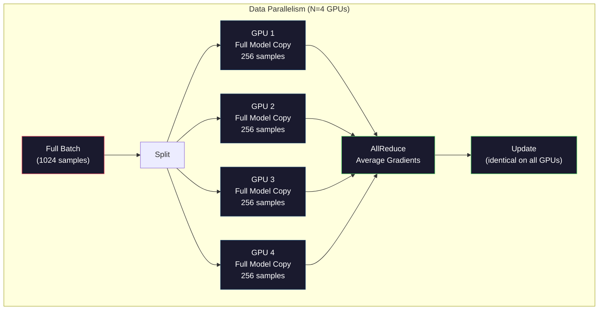
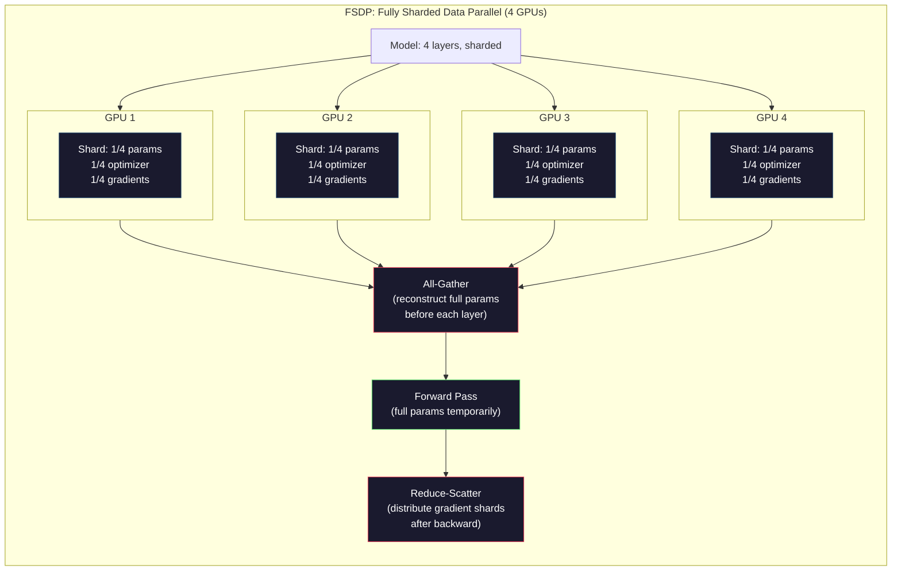
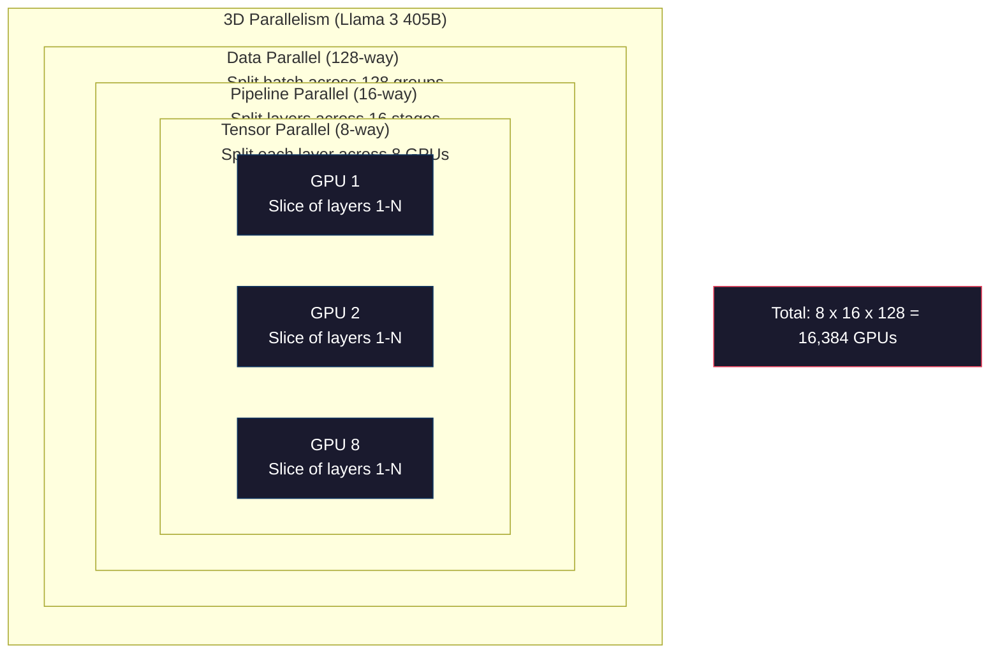

# Skalifikasyon: dağıtılan eğitim, FSDP, derin hız.

> 124M modeliniz bir GPU'da eğitim aldı. Şimdi 7 milyar parametre deneyin. Model hafıza girmiyor. Veriler tek bir makine üzerinde haftalar sürüyor.

> **【中文解读】**1.24 milyar model tek bir GPU üzerinde eğitim alıyor. Ancak 70 milyar parametre modeli açık kalmadı, tek bir makine eğitim verisi birkaç hafta gerektirir.

> **【拓展：DeepSeek-V3的2048卡训练】**DeepSeek-V3 2048 张 H800 GPU  eğitimi kullanmak, DualPipe 流水线并行 + MoE 专家并行── 专家并行── 分布式 eğitimi anlamak ön kenarındaki büyük modellerin nasıl eğitildiğini anlamak için temellidir──

>  **【前置】**学本节前 Lütfen önce bil:Fase 10·04(Pre-Training Mini GPT) Single GPU 训练基础;PyTorch DDP 概念;多 GPU 通信(NCCL、AllReduce)。本节是Fase 10·19(DualPipe) y Fase 10·20(DeepSeek-V3 Walkthrough) 的前置。

**Type:** Build
**Languages:** Python
**Prerequisites:** Phase 10, Lesson 04 (Pre-Training a Mini GPT)
**Time:** ~120 minutes

>  **【类比】**Bölünmüş bir eğitim = 多人合作搬大箱子──**数据并行**(DP) = 4 个个别搬一个相同的小箱子 (Deperiyor)**张量并行**(TP) = 4 kişi birlikte büyük bir kutuyun dört köşesini taşımak**流水线并行**(PP) = 4 个人流水线,第 1 人搬一层传给第二 人(模型按层切分)**FSDP**= DP + 把模型切片分到各卡,用时再聚合 (省显存) ――生产场景一般 3种组合用 (三维对称性) ――

> ️ **【易错点】**Bölüm 3 tane tren:**batch size 设错**单卡 bs=8,4 卡应该 bs=32(4×8)而非 bs=8; etkili parti boyutunu kullan 计算 lr──(2) **AllReduce 瓶颈**卡间通信 GPU 计算慢 10 倍,bs 太小会让 GPU 等通信;bs 至少 32+ 才划算──(3) **没设 seed** Her seferinde başlatılanlar farklıdır, sonuçlar geri alınmaz;`torch.manual_seed(42) + torch.cuda.manual_seed_all(42)`- Evet.

## Öğrenme hedefleri

- Üç paralellik türünü (veriler, tensör, boru hattı) ve model ve klüster boyutuna göre her biri ne zaman gerekli olduğunu açıklayın.
  解释三种并行类型(数据并行、张量并行、流水线并行) ve uygulanabilir durumları
- Çoklu GPU'lar arasında gradient senkronizasyonu ile PyTorch DDP kullanarak veri paralel eğitim uygula
  PyTorch DDP kullanmak  Çoklu GPU verileri gerçekleştirmek                                                                                                                                                                                                                                                                                                                                                                                                                                                                                                              
- En az donanımını belirlemek için verilen bir model boyutu için bellek bütçesini hesaplayın (boz + optimizer durumları + gradient + etkinleştirmeler)
  計算给定模型大小的显存预算(权重 + 优化器状态 + 梯度 + 激活值), en az硬件 ihtiyacını belirle
- FSDP veya DeepSpeed ZeRO aşamalarını GPU'lar arasında model durumlarını parçalayarak ve tek GPU bellekinden daha büyük olan uyumlu modeller için yapılandırın
  FSDP veya DeepSpeed ZeRO  aşamalarını biçimlendirme modelleşimi için yapılandırın, böylece tek bir kartın üzerinde bulunan modellerin eğitilmesi mümkün olur.

> **【中文解读】**Bu ders odaklan LLM trenmanının temel şişesi: görünümlü kayıplar, 7B model FP16'da sadece ağırlık 14GB'ye ihtiyaç duyar, ek olarak Adam  optimizer durumu ((28GB) ve gradient ((14GB), toplam 56GB'de henüz etkinleştirme değeri yok.

## Sorunlar. Sorunlar.

FP16'daki 7B parametre modeli sadece ağırlıklar için 14GB'ye ihtiyaç duyar. Adam optimizer her parametrenin iki ek kopyasını (birinci ve ikinci an tahminleri) saklar. Bu da 28GB'dir. Geri yayılma sırasında gradientler 14GB daha ekler. Tek bir etkinleştirme kaydedilmeden önce 56GB'ye ulaşırsınız.

> 7B 参数 modeli FP16'da aşağıda sadece 14GB'ye ihtiyaç vardır. Adam  optimizer her parametre ekstra depolama için iki kopyasını kullanır.

NVIDIA A100'in 80 GB hafızası var.

> NVIDIA A100'in 80 GB'sı var.

Kullanılan 80 GB'dan 56 GB. Bu da aktivasyonlar için 24 GB'yi bırakır. Ön geçiş sırasında hesaplanan orta değerler geri yayılmak için canlı tutulmalıdır. 4096 boyutlu bir model ile 2048-token dizisi için, tek katman aktivasyonları yaklaşık 64 MB kullanır. 32 katman ile, örnek başına 2 GB'ye ihtiyacınız var. 8'lik bir parti boyutu 16 GB'ya ihtiyaç duyar. 24 GB'ye sahipsiniz. 12'lik bir parti boyutu patlar.

> 80GB'de 56GB tüketilmiştir. Geri kalan 24GB'de aktif değer için kullanılan aktif değer 前向传播中計算の中間値,反向传播保存のために必須である. 2048 token 序列 ve 4096 维模型 için, tek katlı aktiv değer yaklaşık 64MB──32 katlı değer, her örnek 2GB──批量大小8 需要16GB──你有24GB──批量大小12 爆出存──

Şimdi 70B parametrelerini deneyin. Tek başına ağırlıklar: FP16'da 140GB. Bir GPU'ya uymuyor. Ağırlıkları tutmak için en az 2 A100'e (2 x 80GB = 160GB) ihtiyacınız var. Optimizer durumlarını ve gradientlerini ekleyin ve çok daha fazlasına ihtiyacınız var: 3+ GPU'lar minimum, ve parçalanma stratejisine bağlı olarak gerçekçi olarak 8-16'a.

> Şimdi deneyin 70B 参数。 sadece ağırlık:FP16 下 140GB。放不进一张 GPU。 en az 2 张 A100(2 x 80GB = 160GB) gerekir.

Llama 3 405B, 16.384 NVIDIA H100 GPU'da eğitildi.$100 million in compute. DeepSeek V3 trained a comparable model for roughly $5.6 milyon kişi mimari konusunda akıllı olmak (Ekspertlerin karışımı, her token için sadece parametrelerin bir kısmının etkinleştirilmesi anlamına gelir) ve eğitim verimliliği ile.

> Llama 3 405B 16.384 张 NVIDIA H100 GPU'da eğitim, hesaplama maliyeti tahminleri yaklaşık 1 milyar dolar.

Bu ders büyük ölçekli eğitim yapabilmek için dört stratejiyi kapsar: veri paralelliği, tensor paralelliği, boru hatt paralelliği ve tamamen parçalanmış veri paralelliği.

> Bu ders kapsamı büyük ölçekli eğitim için dört stratejiyi mümkün kılar: veri paralelliği, 张量 paralelliği, 流水线 paralelliği ve tam bir parça veri paralelliği.

## Konsepten bir şey.

### Neden dağıtılmalı

İşte gerçek modeller için hafıza matematiği. Her sayı hesaplanır, tahmin edilmez.

> Aşağıda gerçek modelin açık kalmış matematik hesaplaması yer alır. Her sayı hesaplanmıştır, tahmin değil.

| Model | Params | Weights (FP16) | Adam States | Gradients (FP16) | Total (no activations) |
|-------|--------|----------------|-------------|------------------|----------------------|
| GPT-2 Small | 124M | 248 MB | 992 MB | 248 MB | 1.5 GB |
| Llama 3 8B | 8B | 16 GB | 64 GB | 16 GB | 96 GB |
| Llama 3 70B | 70B | 140 GB | 560 GB | 140 GB | 840 GB |
| Llama 3 405B | 405B | 810 GB | 3,240 GB | 810 GB | 4,860 GB |

"Adam Devletleri" sütunu katildir. Adam, her parametresi için, her ikisi de FP32'de bir çalışkan ortalama (m) ve çalışkan bir varyans (v) kaydediyor. 70B modeli için, bu 70B x 4 byte x 2 = 560GB. Optimizer tek başına yedi A100'e ihtiyaç duyar.

> "Adam  durumu" sırası ölümcüldür. Adam için her parametre depolama bir çalışma ortalama değeri ((m) ve bir çalışma yönü farkı ((v), hepsi FP32。 70B için model, yani 70B x 4 字节 x 2 = 560GB。 sadece optimizer için 7 张 A100。

Tek bir H100'de 80GB'ye sahip. Llama 3 405B'nin ağırlıkları, optimizerleri ve gradientleri tutmak için en az 61 H100'e ihtiyacı var. Aktiflikleri ekleyin ve sayı daha da büyüyor. Meta 16,384 GPU'yu istedikleri için değil - çünkü yapmak zorunda kaldılar.

> 单张 H100 80GB vardır──Llama 3 405B En az 61 张 H100'e ihtiyaç vardır.

> **【中文解读】**显存预算是LLM 训练的第一道关卡──以 Llama 3 70B 举例:FP16 权重 140GB + Adam 优化器状态 560GB + 梯度 140GB = 840GB(不含激活值)──单张 H100 只有 80GB,至少需要11张 GPU 才能放下这些状态── Llama 3 405B 总需求高达4,860GB──Adam 优化器是显存杀手它为每个参数存储两个 FP32 的动量估计节量m和 v),参数 x 8 字 x 2──

> **【拓展：Llama 3 的 16384 GPU 训练】**Llama 3 405B, 16.384 张 H100 GPU'da 3D ve akışlı işlemler kullanılarak eğitim gördü.

### Veriler paralelliği

En basit dağıtılmış strateji. Tüm modelin N GPU'lara kopyasını yapın. Her eğitim partiyesini N eşit bölümlere ayırın. Her GPU, verilerin parçalarında ileri ve geri geçiş yapar. Geri geçişten sonra, tüm GPU'larda gradientleri ortalama yapın. Her GPU, tüm kopyaları senkronize ederek, ağırlık kopyasını aynı ortalama gradientlerle güncelleştirir.

> En basit dağıtım stratejisi: Tüm modelleri N 张 GPU'ya kopyalamak. Her bir eğitim bölümü N 等部分lere ayrılır. Her GPU'nun, tüm GPU'lar arasında ortalama derecede yayılmasından sonra, tüm GPU'ların ön ve ön tarafa yayılmasına karşı, tüm GPU'ların 间平均梯度¬ı kullanılarak, tüm kopyaların eşzamanlı tutulmasına rağmen, aynı ortalama derecede kendi ağırlık kopyasını yenilemek.

**The good:**Lineer geçiş ölçeklemesi. N GPU'lar adım başına N kat daha fazla veri işlemelidir. İletişim, hesaplama ile örtüşen gradient ortalaması ile sınırlıdır.

> **优点：**吞吐量线性扩展──N 张 GPU Her adım N 倍的数据的处理──通信只限在梯度平均,可与计算重叠──

**The bad:**Her GPU'da modelin, optimizer durumlarının ve gradientlerin tam bir kopyası bulunur. 70B model için her GPU'ya 840GB gerekmektedir. Veri paralelliği, GPU hafızası başına hiçbir şey azaltmaz. Sadece eğitim süresini azaltır.

> **缺点：**Her GPU'nun bir modeli vardır, optimizer durumunun ve derecesinin tam kopyası vardır. 70B model için her GPU'nun 840 GB'ye ihtiyacı vardır. Veriler giderek her GPU'nun kaydedilmesini azaltmaz.

**The math:**Etkili parti boyutu = per_gpu_batch_size x N. N=64 GPU'lar için, her GPU parti 16'sı ile, etkin parti 1.024. Llama 3 bir adım başına 16 milyon tokenlik etkili parti boyutu kullanmıştır.

> **数学：**Effetli birim büyüklüğü = Her GPU'nun birimi x N。 N=64 张 GPU için, her GPU'nun birimi 16 有效批量 1,024 ⋅ Llama 3 使用每步 1600万 符号的有效批量。



### Tensör paralelliği

GPU'lar arasında ayrı katmanları bölün. Tek bir matris çarpımı, sonuçların her bir hesaplama parçası olan GPU'lar arasında bölünür.

> Tek katmanı bir çok GPU'ya ayırmak. Bir kez bir matraj çarpımı bir çok GPU'ya dağıtmak, her bir hesaplama bölümünün sonucu olarak.

Bir ileri geri katman içinde bir ağırlık matrisi (8192, 8192) düşünün. 4 yönlü tensor paralelliği ile, her GPU bir (8192, 2048) parçacığı tutar. Her GPU girişini parçacığı ile çoğaltır, kısmi bir sonuç üretir.

> 考虑前层中形为 (8192, 8192) 的权重矩阵──使用4 路张量并行,每张 GPU 持有 (8192, 2048) 的分片──每张 GPU 将输入乘以其分片,产生部分结果──部分结果通过全归约或全收集组合为完整输出──

**The good:**Model ağırlıkları için GPU'da hafıza azaltır. 70B modeli 8 GPU'ya bölünmüş olması, her GPU'nun ~ 8.75B değerindeki ağırlıkları taşıdığı anlamına gelir.

> **优点：** 减模型权重的每 GPU 显存──70B 模型 分裂到8张 GPU 意思是每张 GPU 持有约8.75B 参数权重──

**The bad:**Her katman sonra hızlı GPU ara iletişim gerektirir. her matmul sonra tüm azaltmak gecikme ekler. Bu NVLink (900 GB / s aynı düğümde GPUlar arasında) ile iyi çalışır, ancak InfiniBand (400 Gb / s, yaklaşık 50 GB / s) ile bağlantılı düğümler arasında kötü.

> **缺点：**Her katman sonra hızlı GPU 间通信── her matç çarpma sonrası tüm dönüşüm artışı geciktirir── bu NVLink 间 间 900 GB/s 间 节点 GPU 间 间 节点 üzerinde iyi etkilidir, ancak InfiniBand 间 间 间 间 间 间 间 间 间 间 节点 间 间 间 间 间 节点 间 间 间 间 间 间 间 间 间 间 间 间 间 间 间 间 间 间 间 间 间 间 间 间 间 间 间 间 间 间 间 间 间 间 间 间 间 间 间 间 间 间 间 间 间 间 间 间 间 间 间 间 间 间 间 间 间 间 间 间 间 间 间 间 间 间 间 间 间 间 间 间 间 间 间 间 间 间 间 间 间 间 间 间 间 间 间 间 间 间 间 间 间 间 间 间 间 间 间 间 间 间 间 间 间 间 间 间 间 间 间 间 间 间 间 间 间 间 间 间 间 间 间 间 间 间 间 间 间 间 间 间  间 间 间 间 间 间 间 间 间 间 间 间 间 间 间 间  间 间 间  间 间 间 间 间 间  间 间 间 间 间     间     间 间    间 间    间 间                                                        

**Real usage:**Megatron-LM, tensor paralelliğine öncülük etti. Llama 3 405B her düğüm içinde 8 yönlü tensor paralelliğini kullanır.

> **实际使用：**Megatron-LM ilk olarak 张量并行を提案した. Llama 3 405B, her noktada 8 路张量并行を kullandı.

> **【中文解读】**张量并行(Tensor Paralelism) tek katmanlı bir matronun bir katmanlı bir matronun bir katmanlı GPU'ya bölünmesini sağlar. Örneğin, bir (8192, 8192) 权矩阵ı 4 路并行下, her GPU sadece depolama (8192, 2048) 分片.

> **【拓展：流水线并行的气泡问题】**流水线并行将模型层次分布到不同 GPUs(如 GPU1 跑 1-8层,GPU2 跑 9-16层) 但会产生"气泡"GPU空等着──GPipe 通过微批次(微批次) 重叠计算来缓解:4 个阶段使用16 个微批次,气泡率降至 (4-1)/16 = 18.75%──

### Pipeline paralelliği

GPU 1 katmanları 1-8 katmanları çalışır. GPU 2 katmanları 9-16 katmanları çalışır. GPU 3 katmanları 17-24 katmanları çalışır. GPU 4 katmanları 25-32 katmanları çalışır. Veriler boru hattı boyunca akıyor: GPU 1 katmanlarını hesaplar ve GPU 2'ye aktivasyonlar gönderir.

> 按层拆分模型──GPU 1 跑 1-8层──GPU 2 跑 9-16层──GPU 3 跑 17-24层──GPU 4 跑 25-32层──数据流过流水线:GPU 1 计算其层并将激活值发送给 GPU 2,GPU 2 计算其层并发送给 GPU 3,以此类推──

**The good:**GPU'lar arasındaki en az iletişim, sadece katman sınırlarındaki etkinleştirmeler, gradient veya ağırlıklarla karşılaştırıldığında küçüktür.

> **优点：**GPU 间通信最小 yalnızca katman sınırının etkin değeri, 梯度 veya ağırlık ile karşılaştırıldığında çok küçük; genişlik ihtiyacının düşük olduğu için 跨节点工作可.

**The bad:**Pipeline balonları. GPU 4 mikro-batch 1, GPU 1, 2 ve 3'ün ön geçişini hesapladığında, boştur (önce de kısımlarını öne göndermişlerdir). Geri geçiş sırasında, örnekteki kalıp tersine döner. Saçma borulama ile, GPU kullanımı sadece N boru hattı aşamaları için 1/N'dir.

> **缺点：**流水线气泡── GPU 4'ün hesaplama sırasında 1'ün küçük bölümünün ön yönde yayılması sırasında, GPU 1、2、3 空(Onlar kendi bölümlerini tamamlamışlardır)──反向传播时模式相反──朴素流水线下,N 个阶段 GPU kullanım oranı sadece 1/N──

**GPipe and PipeDream**M mikro-batch ve N aşamaları ile, kabarcık fraksiyonu (N-1) / M'ye düşer. N=4 aşamaları olan M=16 mikro-batch kullanın ve kabarcık 3/16 = 18.75% boş zaman.

> **GPipe 和 PipeDream**通過將批次分分為微批次來解決氣泡問題──GPU 1 一完成微批次 1 的前向传播就開始微批次 2──這在流水線阶段间重叠計算──M 个微批次和N 个阶段,氣泡比例降至 (N-1) /M──M=16 个微批次和N=4 个阶段,氣泡为3/16 = 18.75% 空时间──

### FSDP: Tamamen parçalanmış veriler paralel

FSDP, verilerin paralelliğinin ölçeklenebilirliğini parçalanma hafıza verimliliği ile birleştirir. Her GPU'nun modelin tam bir kopyasını tutması yerine, her GPU'nun parametre, gradient ve optimizer durumlarının sadece 1/N'ünü tutması gerekir.

> FSDP, verilerin paralelliklerinin genişletilmesi ve parçaların gösterilen kaydetme verimliliğini birleştirir.

Bir katmanın ileriye geçişinden önce, FSDP bir **all-gather**GPU'ların tüm parametrelerini her GPU'nun belleğine toplamak için. Ön geçişten sonra, her GPU yerel olmayan parametreleri atır. Geriye dönükte, gradient hesaplama için parametreleri yeniden yapılandırmak için tüm toplama tekrar çalışır. Geriye geçişten sonra, bir **reduce-scatter**gradient parçalarını dağıtır, böylece her GPU gradientlerin sadece 1/N'ini depolar.

> Bir katmanın ön tarafa yayılmasından önce, FSDP tüm toplama işlemlerini tüm GPU'lardan tüm tüm parametreleri toplayıp her GPU'nun görünen kaydına kadar yürütür. Ön tarafa yayılmasından sonra, her GPU'dan yerel olmayan parametreler bırakılır.

**The math for a 70B model on 8 GPUs:**

| Component | Without FSDP | With FSDP |
|-----------|-------------|-----------|
| Weights (FP16) | 140 GB per GPU | 17.5 GB per GPU |
| Adam States (FP32) | 560 GB per GPU | 70 GB per GPU |
| Gradients (FP16) | 140 GB per GPU | 17.5 GB per GPU |
| **Total** | **840 GB per GPU** | **105 GB per GPU** |

FSDP olmadan, 70B modelini tek 80GB GPU'da yerleştiremezsiniz. FSDP ile 8 GPU'da, her GPU 105GB kullanır - bekleyin, bu hala uyumlu değil. Her GPU'ya 80GB'den daha az ulaşmak için en az 16 GPU'ya ihtiyacınız var veya FSDP'yi etkinleştirme kontrol noktası ile birleştirirsiniz (değiştirme sırasında etkinleştirmeleri geriye hesaplayın, onları saklamak yerine).

> 没有FSDP,70B 模型不能放入单张80GB GPU──使用FSDP 在8张 GPU 上,每张 GPU 使用105GB等等,还是放不下──你需要至少16张 GPU 才能降至每卡80GB以下,或将FSDP与激活检查点结合(反向传播时重新计算激活值而不是存储它们) ⋅

Komünikasyon maliyeti, her katmanın öncesinde toplanan her şey nedeniyle vanilya verileri paralelliğinden daha yüksek. Ama hafıza tasarrufu daha önce imkansız olan eğitim çalışmalarını mümkün kılar.

> 通信 maliyeti sıradan veri işleminden daha yüksektür, çünkü her katman önce tüm toplama gerektirir.

> **【中文解读】**FSDP (Full split split data merge) ise, tüm GPU'lardan tüm tüm parametre toplanarak, tüm GPU'lardan tüm parametre toplayarak, tüm GPU'lardan tüm tüm parametre toplayarak, tüm GPU'lardan sonra, yerel olmayan parametreleri bırakarak, tüm GPU'larda sadece 1/N'lik bir parametreler depolanır.

> **【拓展：DeepSpeed ZeRO 的三个阶段】**ZeRO Etap 1 分片优化器状态(省 4x 显存),Etap 2 加上梯度分片(省 8x),Etap 3 加上参数分片(省 N 倍,N 为 GPU 数) ・FSDP 本质上是 ZeRO Etap 3 的 PyTorch 原生实现──Llama 3 405B  16,384 GPU 训练使用FSDP + 张量并行 + 流水线并行 3D组合──



### DeepSpeed ZeRO

DeepSpeed'in ZeRO (Zero Redundancy Optimizer) konseptel olarak FSDP ile aynıdır ancak Microsoft tarafından bağımsız olarak geliştirildi.

> DeepSpeed'in ZeRO (零冗余优化器) kavramda FSDP'ye benzer, ancak Microsoft tarafından bağımsız olarak geliştirilmiştir.

| Stage | Shards | Memory Savings | Communication |
|-------|--------|---------------|---------------|
| ZeRO-1 | Optimizer states only | ~4x reduction | Same as data parallel |
| ZeRO-2 | + Gradients | ~8x reduction | Slightly more |
| ZeRO-3 | + Parameters | ~Nx reduction (N GPUs) | All-gather per layer |

ZeRO-3 FSDP'ye eşittir. İsim farklıdır, mekanizma aynıdır. PyTorch, kavramı DeepSpeed kanıtladıktan sonra FSDP'yi yerel bir uygulamada ekledi.

> ZeRO-3 FSDP'ye benzer değildir. İsimleri farklı, mekanizmaları aynı.

DeepSpeed ayrıca ZeRO-Offload (CPU RAM'e daha ucuz ve daha büyük olan CPU optimizer durumları) ve ZeRO-Infinity (NVMe SSD'lere yükleme) tanıttı.

> DeepSpeed ayrıca ZeRO-Offload'u (ZERO-OFFload) ve ZeRO-Infinity'i (ZERO-OFFLORD) (NVMe SSD) olarak da tanıttı.

### Karışık Düzgünlük Eğitimleri

Modern eğitim aynı anda birden fazla yüzen nokta biçimini kullanır:

> 现代训练同时使用多种浮点格式:

- **Forward pass**FP16 veya BF16 (16-bit). FP32 hafızasının yarısı. Matmuls tenzor çekirdeklerinde 2 kat daha hızlı çalışır.
- **Master weights**: FP32 (32-bit). Ağırlık güncellemeleri sırasında sayısal hassasiyet için optimizör tarafından korunur.
- **Loss scaling**FP16 gradientlerinin sıfıra düşmesini önlemek için geriye geçmeden önce büyük bir sabitle kaybı çarpın. Optimizer adımı öncesinde aynı sabitle bölün.

BF16 (Brain Float 16) FP32 ile aynı eksponent aralığına sahiptir (8 eksponent bit) ancak düşük hassaslığa sahiptir (7 mantissa bit vs. FP32'nin 23). Aynı değer aralığını temsil edebileceği için nadiren kayıp ölçeklemesine ihtiyaç duyar. FP16 5 eksponent bit ve 10 mantissa bit - ince taneler değerlerini temsil edebilir, ancak aşırı büyüklüklerde aşırı akışlar / aşağı akışlar yapabilir.

Google'ın TPU'ları BF16'ı yerel olarak kullanır. NVIDIA'nın A100 ve H100'leri hem FP16 hem de BF16'ı destekler. Endüstri büyük ölçüde BF16'a geçti çünkü kayıp ölçekleme baş ağrısını ortadan kaldırır.

> **【中文解读】**混合精度训练是现代 LLM 训练的标准做法:前向传播用 BF16(16 位),优化器维护 FP32 主权重(32 位),损失缩放防止梯度下溢──BF16 与 FP32 有相同指数范围;;8 位),但精度降低(7 位尾数 vs 23 位),几乎不需要损失缩放──业界已从 FP16 全面显度转向 BF16──混合精为7B 模型节省约28GB ⋅

> **【拓展：3D 并行与 MoE 的经济性】**Llama 3 405B Kullanım 3D ve bağlantı:节点间数据并行 + 节点内 8 路张量并行 + 节点流水线并行。DeepSeek-V3 则使用 MoE(混合专家) yapısı düşük maliyet                                                                                                                                                                                                                              

**Memory comparison for a 7B model:**

| Precision | Weights | Optimizer | Gradients | Total |
|-----------|---------|-----------|-----------|-------|
| FP32 everywhere | 28 GB | 56 GB | 28 GB | 112 GB |
| Mixed (BF16 + FP32 master) | 14 GB | 56 GB | 14 GB | 84 GB |

Karışık hassasiyet bu modelde 28GB tasarruf eder. Optimizer durumları FP32'de kalır.

### Megatron-LM ve 3D paralellik

Gerçek büyük ölçekli eğitim, üç paralelliği birleştirir:

- **Data parallelism**Kodu grupları arasında (skala seri boyutu)
- **Tensor parallelism**bir düğüm içinde (sıkı bir şekilde 8 GPU'da bölünmüş katmanlar)
- **Pipeline parallelism**düğümler arasında (makineler arasında bölünmüş katman grupları)

Llama 3 405B 16.384 H100'de:
- Her düğümde 8 yönlü tensor paralelliği (8 düğüm başına GPU)
- 16 yollu boru hattı uzantılara paralellik (16 boru hattı aşaması)
- 128- yönlü veri paralelliği kalan boyut boyunca (16.384 / 8 / 16 = 128)

Bu 3 boyutlu parçalanma (8 x 16 x 128 = 16,384) binlerce GPU'ya kadar ölçeklendirilmesidir. Her GPU farklı bir veri parçacığını ( veri paralelini) görür, her katmanın bir parçası (tensor paralelini) tutar ve farklı bir katman kümesini (pipeline paralelini) hesaplar.

> Bu tür 3D bölünme ((8 x 16 x 128 = 16,384) nasıl binlerce GPU'ya kadar genişleteceğiniz bir yöntemdir.

DeepSeek V3 farklı bir yaklaşım izledi. Uzmanlar Arsitekturunun karışımı, her token için 671B parametrelerinden sadece 37B'yi etkinleştirir. Bu, her GPU'nun yalnızca aktif parametrelerin hesaplanması (ve etkinleştirmelerini depolaması) gerektiği anlamına gelir.$5.6M vs Meta's estimated $100M.

> DeepSeek V3 farklı yöntemler kullanmıştır. Onların karma uzmanlık yapısı her token için sadece 671B  parametrelerinden 37B'yi etkinleştirir. Bu, her GPU'nun sadece hesaplanması gereken bir işlem anlamına gelir.



## Yapın.
```figure
paged-kv-cache
```

## Yapın

### Adım 1: Verilerin paralelliğini simüle edin

Bir partiyi simülasyonlu GPU'lara bölün. Her GPU, parçacığı üzerinde bir ileri geçiş hesaplar. "Gradyenleri" ortalamalayın (onları kayıp değerleri olarak simüle ediyoruz).

> Bu, bir süre sonra bir GPU'ya bölünerek, bir GPU'ya bölünerek, bir GPU'ya bölünerek, bir GPU'ya bölünerek, bir GPU'ya bölünerek, bir GPU'ya bölünerek, bir GPU'ya bölünerek, bir GPU'ya bölünerek, bir GPU'ya bölünerek, bir GPU'ya bölünerek, bir GPU'ya bölünerek, bir GPU'ya bölünerek, bir GPU'ya bölünerek, bir GPU'ya bölünerek, bir GPU'ya bölünerek, bir GPU'ya bölünerek, bir GPU'ya bölünerek, bir GPU'ya bölünerek, bir GPU'ya bölünerek, bir GPU'ya bölünerek, bir GPU'ya bölünerek, bir GPU'ya bölünerek, bir GPU'ya bölünerek, bir GPU'ya bölünerek, bir GPU'ya bölünerek, bir GPU'ye bölünerek, bir GPU'ye bölünmüştür.

```python
import numpy as np

def simulate_data_parallelism(data, num_gpus, model_fn):
    batch_size = len(data)
    shard_size = batch_size // num_gpus
    remainder = batch_size % num_gpus

    gpu_losses = []
    gpu_gradients = []

    offset = 0
    for gpu_id in range(num_gpus):
        extra = 1 if gpu_id < remainder else 0
        shard = data[offset:offset + shard_size + extra]
        offset += shard_size + extra

        loss, grad = model_fn(shard)
        gpu_losses.append(loss)
        gpu_gradients.append(grad)

    avg_loss = np.mean(gpu_losses)
    avg_gradient = np.mean(gpu_gradients, axis=0)

    return avg_loss, avg_gradient
```

Tüm azaltma işlevi (ortalama gradiyentler) veri paralelliğindeki tek iletişimdir. Bu uygulama NVIDIA GPU'larda NCCL kütüphanesini kullanır. Bu uygulama ring all-reduce uygulamasını yapar: her GPU, gradientlerinin 1/N'ini komşusuna gönderir, diğer komşusundan 1/N alır ve N-1 adımlarından sonra her GPU'nun tam ortalaması vardır. Toplam iletişim hacmi: 2 x gradient_size x (N-1)/N, büyük N için gradient büyüklüğünün 2x'ine yaklaşmaktadır.

> Tüm Dönüşüm Operasyonu ({{lang-en_{{lang-en_en_en_en_en_en_en_en_en_en_en_en_en_en_en_en_en_en_en_en_en_en_en_en_en_en_en_en_en_en_en_en_en_en_en_en_en_en_en_en_en_en_en_en_en_en_en_en_en_en_en_en_en_en_en_en_en_en_en_en_en_en_en_en_en_en_en_en_en_en_en_en_en_en_en_en_en_en_en_en_en_en_en_en_en_en_en_en_en_en_en_en_en_en_en_en_en_en_en_en_en_en_en_en_en_en_en_en_en_en_en_en_en_en_en_en_en_en_en_en_en_en_en_en_en_en_en_en_en_en_en_en_en_en_en_en_en_en_en_en_en_en_en_en_en_en_en_en_en_en_en_en_en_en_en_en_en_en_en_en_en_en_en_en_en_en_en_en_en_en_en_en_en_en_en_en_en_en_en_en_en_en_en_en_en_en_en_en_en_en_en_en_en_en_en_en_en_en_en_en_en_en_en_en_en_en_en_en_en_en_en_en_en_en_en_en_en_en_en_en_en_en_en_en_en_en_en_en_en_en_en_en_en_en_en_en_en_en_en_en_en_en_en_en_en_en_en_

### Adım 2: Tensiyon paralelliğini taklit edin

Bir ağırlık matrisini GPU'lara bölün. Her GPU kısmi bir matris çarpımı hesaplar. Sonuçları birleştirin.

> Bu işlem, bir CPU'ya bölünmüştür.

```python
def simulate_tensor_parallelism(input_data, weight_matrix, num_gpus):
    d_in, d_out = weight_matrix.shape
    assert d_out % num_gpus == 0, f"d_out {d_out} not divisible by num_gpus {num_gpus}"
    shard_size = d_out // num_gpus

    partial_results = []
    for gpu_id in range(num_gpus):
        start = gpu_id * shard_size
        end = start + shard_size
        weight_shard = weight_matrix[:, start:end]

        partial = input_data @ weight_shard
        partial_results.append(partial)

    full_output = np.concatenate(partial_results, axis=-1)

    direct_output = input_data @ weight_matrix
    error = np.abs(full_output - direct_output).max()

    return full_output, error
```

Bu işlem, bir GPU'da tam matmul'i hesaplamakla aynı sonucu elde eder. Bölüm çıkış boyutuna uzanır, böylece her GPU farklı bir sütun parçası üretir ve bir zincirle birlikte tüm sonucu yeniden oluşturur.

> 误差恰好为零(或机器epsilon) ⋅张量并行在数学上是精确的它产生与在一张GPU上计算完整矩阵乘法相同的结果──分离沿输出维度进行,每张GPU 产生不同的列块,拼接重建完整结果──

Bir FFN transformatöründe, ilk lineer (genişleştirici) sütun paralelini kullanır ve ikinci lineer (kontrakt) sıra paralelini kullanır. Bu iki katman arasında tümüyle azaltılmaktan kaçınır.

> 对于列并行线性层(拆分输出维度),你拼接──对于行并行(拆分输入维度),你求和── 在变压器 FFN 中,第一个线性(扩展) 使用列并行,第二个线性(收缩) 使用行并行──这避免了两层之间的全归约──

### Adım 3: Pipeline paralelliğini taklit edin

Bir modelin katmanlarını sanal GPU'lara ayırın. İlk aşamaların boş durduğu ve sonraki aşamaların hesaplandığı balon problemini gösterin.

> Modelin katmanlarını görsel GPU'ya ayırmak, erken aşamada boşluk ve son aşamada hesaplama sırasında buhur sorunu göstermek.

```python
def simulate_pipeline_parallelism(num_layers, num_stages, num_microbatches):
    layers_per_stage = num_layers // num_stages

    timeline = {}
    clock = 0

    for mb in range(num_microbatches):
        for stage in range(num_stages):
            start_time = max(
                timeline.get((stage, mb - 1, "fwd"), (0, 0))[1] if mb > 0 else 0,
                timeline.get((stage - 1, mb, "fwd"), (0, 0))[1] if stage > 0 else 0,
            )
            end_time = start_time + layers_per_stage
            timeline[(stage, mb, "fwd")] = (start_time, end_time)

    last_fwd_end = max(v[1] for v in timeline.values())

    for mb in range(num_microbatches - 1, -1, -1):
        for stage in range(num_stages - 1, -1, -1):
            deps = [last_fwd_end]
            if mb < num_microbatches - 1 and (stage, mb + 1, "bwd") in timeline:
                deps.append(timeline[(stage, mb + 1, "bwd")][1])
            if stage < num_stages - 1 and (stage + 1, mb, "bwd") in timeline:
                deps.append(timeline[(stage + 1, mb, "bwd")][1])
            start_time = max(deps)
            end_time = start_time + layers_per_stage
            timeline[(stage, mb, "bwd")] = (start_time, end_time)

    total_time = max(v[1] for v in timeline.values())
    compute_time = num_microbatches * num_stages * layers_per_stage * 2
    bubble_fraction = 1.0 - compute_time / (total_time * num_stages)

    return timeline, total_time, bubble_fraction
```

4 aşama ve 1 mikrobatçlı, kabarcık bölümü %75'dir. 4 GPU'dan 3'ü herhangi bir zamanda hareketsiz. 16 mikrobatçlı, bu yaklaşık %19'a düşer.

> 4 aşama ve 1 küçük toptaki, buhar oranı %75'dir. 4'ün üçü GPU'da herhangi bir zaman boştur. 16 küçük toptaki zaman yaklaşık %19'a düşer. Buharların giderilmesi için maliyet belirgin bir şekilde kaydedilmiştir.

### 4. Adım: Hatıra Hesaplayıcı

Herhangi bir model boyutunda eğitim için tam bellek gereksinimlerini hesaplayın.

> 計算訓練任意模型大小的精确显存需求──

```python
def memory_calculator(
    params_billions,
    precision_bytes=2,
    optimizer="adam",
    num_gpus=1,
    sharding="none",
    sequence_length=2048,
    batch_size_per_gpu=1,
    hidden_dim=None,
    num_layers=None,
):
    params = params_billions * 1e9

    weight_memory = params * precision_bytes

    if optimizer == "adam":
        optimizer_memory = params * 4 * 2
    elif optimizer == "sgd":
        optimizer_memory = params * 4
    else:
        optimizer_memory = 0

    gradient_memory = params * precision_bytes

    total_no_activation = weight_memory + optimizer_memory + gradient_memory

    if hidden_dim and num_layers:
        activation_per_layer = (
            sequence_length * batch_size_per_gpu * hidden_dim * precision_bytes * 4
        )
        activation_memory = activation_per_layer * num_layers
    else:
        activation_memory = params * precision_bytes * 0.5

    if sharding == "fsdp" or sharding == "zero3":
        weight_memory /= num_gpus
        optimizer_memory /= num_gpus
        gradient_memory /= num_gpus
    elif sharding == "zero2":
        optimizer_memory /= num_gpus
        gradient_memory /= num_gpus
    elif sharding == "zero1":
        optimizer_memory /= num_gpus

    per_gpu_total = weight_memory + optimizer_memory + gradient_memory + activation_memory

    return {
        "params_billions": params_billions,
        "weights_gb": weight_memory / 1e9,
        "optimizer_gb": optimizer_memory / 1e9,
        "gradients_gb": gradient_memory / 1e9,
        "activations_gb": activation_memory / 1e9,
        "per_gpu_total_gb": per_gpu_total / 1e9,
        "total_across_gpus_gb": per_gpu_total * num_gpus / 1e9,
        "fits_on_80gb": per_gpu_total / 1e9 <= 80,
        "num_gpus": num_gpus,
        "sharding": sharding,
    }
```

Bu hesap makinesi, her ML mühendisi sorduğu soruya cevap verir: "Kaç GPU'ya ihtiyacım var?" model boyutunu besleyin ve uygun olup olmadığını görün.

> Bu hesaplayıcı her bir ML mühendisinin sorusuna yanıt verir:"Ben ne kadar GPU'ya ihtiyacım var?"

### Adım 5: Karışık Precision Simülasyonu

FP32, FP16 ve karışık hassaslık eğitimi arasındaki hafıza kullanımını karşılaştırın.

```python
def mixed_precision_comparison(params_billions):
    params = params_billions * 1e9

    fp32_weights = params * 4
    fp32_optimizer = params * 4 * 2
    fp32_gradients = params * 4
    fp32_total = fp32_weights + fp32_optimizer + fp32_gradients

    fp16_weights = params * 2
    fp16_master = params * 4
    fp16_optimizer = params * 4 * 2
    fp16_gradients = params * 2
    fp16_total = fp16_weights + fp16_master + fp16_optimizer + fp16_gradients

    mixed_weights = params * 2
    mixed_optimizer = params * 4 * 2
    mixed_gradients = params * 2
    mixed_total = mixed_weights + mixed_optimizer + mixed_gradients

    return {
        "fp32_total_gb": fp32_total / 1e9,
        "fp16_with_master_gb": fp16_total / 1e9,
        "mixed_bf16_gb": mixed_total / 1e9,
        "savings_vs_fp32": 1 - mixed_total / fp32_total,
    }
```

En büyük sürpriz çoğu insan için: karışık hassasiyet hafızayı yarıya azaltmaz. Optimizer durumları (Adam'ın m ve v) hassasiyetten bağımsız olarak FP32'de kalır. 7B modeli için FP32 eğitiminde 112GB kullanılır. karışık hassasiyet 84GB kullanır. Bu, %25 azaltma, %50 değil. Optimizer baskın.

> Çoğu insan için en büyük beklenmedik şey: karışık doğruluk belirgin kayıptan yarıya düşmez. Optimizer durumu.

## Çerçeveyi kullanın.

### Tüm Simülasyonları Çalıştır

```python
def run_all_demos():
    print("=" * 70)
    print("DATA PARALLELISM SIMULATION")
    print("=" * 70)

    np.random.seed(42)
    data = np.random.randn(64, 32)
    weight = np.random.randn(32, 16)

    def model_fn(batch):
        output = batch @ weight
        loss = np.mean(output ** 2)
        grad = 2 * batch.T @ (batch @ weight) / len(batch)
        return loss, grad

    for n_gpus in [1, 2, 4, 8]:
        loss, grad = simulate_data_parallelism(data, n_gpus, model_fn)
        print(f"  {n_gpus} GPUs: loss={loss:.4f}, grad_norm={np.linalg.norm(grad):.4f}")

    print()
    print("=" * 70)
    print("TENSOR PARALLELISM SIMULATION")
    print("=" * 70)

    x = np.random.randn(4, 8192)
    W = np.random.randn(8192, 8192)

    for n_gpus in [1, 2, 4, 8]:
        output, error = simulate_tensor_parallelism(x, W, n_gpus)
        print(f"  {n_gpus} GPUs: output_shape={output.shape}, max_error={error:.2e}")

    print()
    print("=" * 70)
    print("PIPELINE PARALLELISM SIMULATION")
    print("=" * 70)

    for n_mb in [1, 4, 8, 16, 32]:
        _, total_t, bubble = simulate_pipeline_parallelism(32, 4, n_mb)
        print(f"  {n_mb:2d} micro-batches: total_time={total_t:4d}, bubble={bubble:.1%}")

    print()
    print("=" * 70)
    print("MEMORY CALCULATOR")
    print("=" * 70)

    configs = [
        (7, "none", 1),
        (7, "fsdp", 8),
        (70, "none", 1),
        (70, "fsdp", 8),
        (70, "fsdp", 16),
        (405, "fsdp", 64),
        (405, "fsdp", 128),
    ]

    print(f"  {'Model':>8} {'Sharding':>8} {'GPUs':>5} {'Per-GPU':>10} {'Fits 80GB':>10}")
    print("  " + "-" * 50)
    for params, shard, gpus in configs:
        result = memory_calculator(params, num_gpus=gpus, sharding=shard)
        fits = "Yes" if result["fits_on_80gb"] else "No"
        print(f"  {params:>6}B {shard:>8} {gpus:>5} {result['per_gpu_total_gb']:>8.1f}GB {fits:>10}")

    print()
    print("=" * 70)
    print("MIXED PRECISION COMPARISON")
    print("=" * 70)

    for params_b in [7, 13, 70, 405]:
        result = mixed_precision_comparison(params_b)
        print(f"  {params_b}B: FP32={result['fp32_total_gb']:.0f}GB, "
              f"Mixed BF16={result['mixed_bf16_gb']:.0f}GB, "
              f"Savings={result['savings_vs_fp32']:.0%}")
```

## İndirin . Ürünler .

Bu ders bize çok yararlı .`outputs/prompt-distributed-training-planner.md`-- bir istek, model boyutunu ve mevcut donanımları alır, sonra tam bir dağıtılmış eğitim planı üretir: paralellik stratejisi, bellek bütçesi, iletişim genel maliyeti ve beklenen geçiş.

## Egzersizler.

1. Kontrol noktası ile, sadece her K-th katmanında etkinleştirmeleri saklayın (tipik K = 1, yani her şeyi yeniden hesaplayın).

2. PipeDream tarafından kullanılan 1F1B (bir ileri, bir geri) programını uygulamak için boru hattı paralellik simülasyonunu genişlet. 4 aşama ve 8 mikro-batch için saf programla kabarcık bölümü karşılaştırın. 1F1B programının daha küçük bir zirve hafızası olması gerekir çünkü geriye geçişleri daha erken başlar.

3. Bir gradient birikimi simülatörü uygulayın. Her mikro partiden sonra tüm azaltmak yerine, K adımları için gradientleri yerel olarak biriktirin, sonra tüm azaltın. Bu iletişimin K çarpı ile nasıl azaltıldığını gösterin, ancak aynı son gradientleri (ve böylece aynı eğitim) üretir.

4. Bir maliyet tahmincisi oluşturun.$2/hr, H100 at $3.50/saat) ve paralellik stratejisi, toplam eğitim maliyetini dolarlarda tahmin eder.$100M, DeepSeek V3 cost ~$5.6M.

5. ZeRO-Offload'u hafıza hesaplayıcısına ekleyin. CPU RAM'ının bir düğüm başına 512 GB olduğunu ve NVMe'nin 2TB olduğunu varsayın. CPU'ya optimizer yükleme durumlarını çıkartmanın 70B modelinin 16 yerine 4 GPU'da eğitilmesine nasıl izin verdiğini gösterin.

## Anahtar Şartlar .

| Term | What people say | What it actually means | 中文释义 |
|------|----------------|----------------------|---------|
| Data parallelism | "Copy the model to every GPU" | Each GPU processes a different data shard; gradients are averaged via all-reduce after each step | 数据并行，每 GPU 处理不同数据分片，通过 all-reduce 平均梯度 |
| Tensor parallelism | "Split a layer across GPUs" | Partition weight matrices so each GPU computes part of the matmul; requires fast NVLink interconnect | 张量并行，拆分权重矩阵到多 GPU，需要 NVLink 互连 |
| Pipeline parallelism | "Split layers across GPUs" | Each GPU runs a different group of layers; data flows through the pipeline with micro-batches to reduce bubbles | 流水线并行，每 GPU 运行不同层组，用微批次减少气泡 |
| FSDP | "Shard everything" | Fully Sharded Data Parallel -- each GPU holds 1/N of weights, gradients, and optimizer states; all-gather before compute | 完全分片数据并行，每 GPU 持有 1/N 的参数/梯度/优化器状态 |
| ZeRO | "DeepSpeed's version of FSDP" | Zero Redundancy Optimizer with 3 stages: shard optimizer (Stage 1), + gradients (Stage 2), + parameters (Stage 3) | 零冗余优化器，三阶段分片：优化器→梯度→参数 |
| All-reduce | "Average across GPUs" | Collective operation where every GPU ends with the sum (or average) of all GPUs' inputs -- typically implemented as ring all-reduce | 全归约，所有 GPU 最终获得全局总和/均值 |
| All-gather | "Collect from all GPUs" | Collective operation where every GPU ends with the concatenation of all GPUs' data -- used in FSDP to reconstruct full parameters | 全收集，每 GPU 获得所有 GPU 数据的拼接 |
| Reduce-scatter | "Sum and distribute" | Collective operation that reduces (sums) data and scatters different chunks to different GPUs -- used in FSDP for gradient sharding | 归约散射，求和后分发不同块到不同 GPU |
| Mixed precision | "Train in half precision" | Use FP16/BF16 for forward/backward and FP32 for optimizer states -- saves ~25% memory, not 50%, because the optimizer dominates | 混合精度，前向/反向用 16 位，优化器用 32 位，省约 25% 显存 |
| Pipeline bubble | "Idle time in the pipeline" | Fraction of time GPUs sit idle waiting for data from the previous stage -- reduced by using more micro-batches | 流水线气泡，GPU 空闲等待前一阶段数据的比例 |

## Daha fazla okumak

- [Rajbhandari et al., 2020 -- "ZeRO: Memory Optimizations Toward Training Trillion Parameter Models"](https://arxiv.org/abs/1910.02054)- DeepSpeed ZeRO kağıdı üç parçalanma aşamasını tanımladı
- [Shoeybi et al., 2020 -- "Megatron-LM: Training Multi-Billion Parameter Language Models Using Model Parallelism"](https://arxiv.org/abs/1909.08053)-- NVIDIA'nın transformörler için tensor paralelliği
- [Narayanan et al., 2021 -- "Efficient Large-Scale Language Model Training on GPU Clusters Using Megatron-LM"](https://arxiv.org/abs/2104.04473)- Verileri, tenzorları ve boru hattını birleştiren 3 boyutlu paralellik
- [Zhao et al., 2023 -- "PyTorch FSDP: Experiences on Scaling Fully Sharded Data Parallel"](https://arxiv.org/abs/2304.11277)-- PyTorch'in yerel FSDP uygulaması
- [Llama 3 Technical Report](https://arxiv.org/abs/2407.21783)-- 16.384 GPU eğitim 3D paralellik detayları ile
- [DeepSeek-V3 Technical Report](https://arxiv.org/abs/2412.19437)-- MoE mimarisi eğitim maliyetini büyüklük bir sıraya düşürüyor
