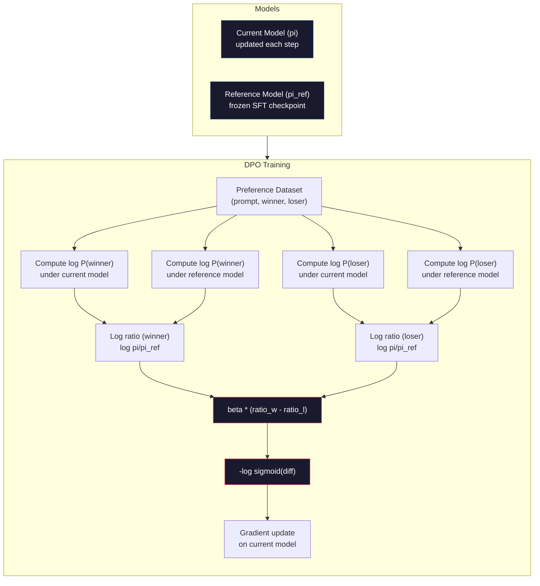

# DPO: Doğrudan Tercihleri Optimize

> RLHF işe yarıyor. Ayrıca üç model eğitimi (SFT, ödül modeli, politika), PPO'nun istikrarsızlığını yönetmek ve KL cezasını ayarlamak gerekir. DPO soruyor: Tüm bunları atlayabilirseniz ne olur? DPO doğrudan tercihleri çiftler üzerinde dil modelini optimize eder. Ödül modeli yoktur.

> **【中文解读】**RLHF 需要训练三个模型(SFT、奖励模型、策略), ayrıca PPO'nun dengesizliğini ele almak için.

> **【拓展：DPO→简化对齐】**DPO, 2023 yılında Stanford tarafından önerilen RLHF'nin alternatif programıdır ve Zephyr、Tulu gibi birçok açık kaynak modeli için ilk seçeneğe sahip bir yöntem haline gelmiştir.

>  **【前置】**Öğrenme bölümüne başlayın.Bunu öğrenmek için öncelikle öğrenin:Dava 10·07(RLHF) RLHF 流程和它的問題を理解する(3 个模型 + PPO 不稳定);PyTorch 监督学习基础──DPO is mathematical优雅的"RLHF without RL",理解为什么有效需要看原文推导──

**Type:** Build
**Languages:** Python (with numpy)
**Prerequisites:** Phase 10, Lesson 07 (RLHF)
**Time:** ~90 minutes

>  **【类比】**DPO vs RLHF = 直接教育 vs 訓練動物。RLHF:先训一个"教師" (RM) öğrencilere打分,再利用 PPO 让学生讨老师欢心3 个模型 + 复杂训练。DPO:直接给学生看"好答案"和"坏答案"对照,让它自己学1 个模型 + 简单交叉──数学 DPO'sı "偏好数据上做分类" (önlüstep ayrıntılı veriler üzerinde sınıflandırma) "RLHF'in en iyi çözümü" (省去了显然 RM。)

> ️ **【易错点】**DPO'nun 3 个坑:(1)**偏好数据质量决定一切**DPO Not Like RLHF There is RM Plain Noise, marked error's preference to direct school error;务必做 marked quality control──(2) **β 系数设错**太大(> 0.5)模型不变,太小(< 0.05)模型偏离 SFT 太远; tipik 0.1──(3) **没做 reference model**DPO kaybı 需要相对 SFT 模型的日志-prob 差分,忘记加载 ref model 会训练崩;用 `AutoModelForCausalLM.from_pretrained(sft_path)`İzle.

## Öğrenme hedefleri

- Ayrı bir ödül modeli olmadan tercihleri çiftler üzerinde bir dil modelini doğrudan optimize eden DPO eğitimi uygulanması
  DPO  eğitimi gerçekleştirmek, doğrudan tercihlere karşı optimize dil modeli, tek başına ödüllendirme modeli gerekmez
- DPO kaybı fonksiyonunu çıkarın ve politikanın kayıt olasılıkları üzerinden dolaylı olarak bir ödül modeli nasıl temsil ettiğini açıklayın
  推导 DPO 损失函数, nasıl bir strateji ile karşı karşılık olasılığı gizli olarak göstermek ödül modeli açıklamak
- DPO ile RLHF'yi eğitim istikrarı, hesaplama maliyeti ve gerekli model sayısı açısından karşılaştırın
  DPO ile RLHF arasındaki eğitim sabitliği, hesaplama maliyeti ve model sayısı açısından karşılaştırma
- Eğitimli politikaların referans modelinden ne kadar farklı olduğunu kontrol etmek için beta parametresini ayarlayın
  调节 beta 参数, kontrol eğitim stratejisi referans modeli derecesinden uzaklaştır

> **【中文解读】**Bu ders DPO (Direct Preference Optimization) uygulamasını,RLHF'nin basitleştirilmiş alternatif programını, DPO'nun temel anlayışı: En iyi ödüllendirme işlevi, dil modelinin kendi token  olasılık matematiği tarafından yönlendirilebilir, bu nedenle ayrı ödüllendirme modeli gerekmez.

## Sorunlar. Sorunlar.

Ders 07'de RLHF boru hattı inşa ettiniz. Üç aşama. Üç model. SFT modeli, ödül modeli ve PPO ile optimize edilen politika modeli. ödül modeli tek başına binlerce insan tercih çifti ve ayrı bir eğitim döngüsü gerektiriyordu. PPO'nun KL katı, öğrenme hızı, klip oranı ve dönem sayısının dikkatli ayarlanması gerekiyordu.

> 7. Sınıfta RLHF 管线──三段──三模型──SFT modeli──奖励模型──PPO 优化策略模型──仅奖励模型──数千个个人类偏好对和单独训练循环──PPO 需要仔细调整 KL系数、学习率、截断率和时代数──

Pratikte, PPO eğitimi çok dengesiz. Küçük hiperparametre değişiklikleri eğitimin farklılaşmasına neden olur. Ödül modeli insan tercihlerinin kusurlu bir vekilidir ve politika zayıflıklarını sömürmenin yollarını bulur. KL cezası yardımcı olur ama kendi ayarlamasını gerektirir - çok düşük ve ödül hackleme alırsınız, çok yüksek ve model neredeyse öğrenmez.

> 實踐中,PPO 訓練以不穩定著名──微小的超参数變化就可能导致訓練發散──獎勵模型是人類偏好的不完美代理,策略會找到方法利用其弱点──KL 罰有幫助但需要自己的调整太低會導致獎勵黑客,太高模型幾乎不學──

Bu karmaşıklık, InstructGPT'nin yayınlandıktan sonra çoğu açık kaynaklı modelin RLHF ile yıllarca mücadele etmesinin nedeni budur. Üç aşamalı boru hattı hassasdır. Her aşamalın kendi başarısızlık modları ve hata bileşikleri vardır.

> Bu karmaşıklık, InstructGPT'nin yayınlandıktan sonra çoğu açık kaynak modeli yıllarca RLHF'yi kullanmakta zorlanmasının nedeni olmuştur.

Mayıs 2023'te Rafael Rafailov, Archit Sharma ve Stanford'daki meslektaşları "Direct Preference Optimization: Your Language Model Is Secretly a Reward Model" adlı yayın yaptı. Anahtar anlayış: Ayrı bir ödül modeliye ihtiyacınız yok. Optimal ödül işlevi, dil modelinin kendi simge olasılığı ile matematiksel olarak belirlenir. Ödül modelini tamamen atlayabilir ve dil modelini doğrudan tercih çiftlerinde optimize edebilirsiniz.

> 2023 yılının 5 月, Rafael Rafailov、Archit Sharma 和 Stanford'daki meslektaşları "Direct Preference Optimization: Your Language Model Is Secretly a Reward Model" adlı yayın yayın yaptı.

DPO, RLHF'yi tek bir denetim altında öğrenme aşamasına düşürür. Bir model. Bir kayıp işlevi. Bir eğitim döngüsü. Tek bir güçlendirme öğrenimi yoktur. DPO'yu ölçekte kullanan ilk modellerden biri olan Zephyr-7B, tam RLHF ile eğitilmiş modellerle birkaç referans üzerinde eşleşti veya yendi. Meta, Llama 3'ün uyum boru hattının bir parçası olarak DPO'yu kullandı. Anthropic, uyum araştırmasında DPO tarzında yöntemler belirtti.

> DPO, RLHF'yi tek bir kontrol öğrenme adımlarına basitleştirecek. Bir model. Bir kayıp işlevi. Bir eğitim döngüsü.

> **【中文解读】**DPO, RLHF'nin üç büyük acı noktasını çözdü: 1) tek başına eğitim ödülleri modeli gerektirmez; 2) PPO'nun istikrarsızlığını ve süper parametre ayarlarını işleme gerektirmez; 3) üç model boru hattından tek bir eğitim döngüsüne basitleştirilmiştir. Zephyr-7B, DPO'nun ilk büyük çapta kullanılan modelleri arasında, birçok基准 üzerinde uyum sağlayan veya aşan bir şekilde tam RLHF eğitiminin kullanıldığı modellerden biridir. Llama 3'ün birleştirilmiş boru hattında da DPO kullanılmıştır.

> **【拓展：DPO 在开源社区的普及】**DPO 已成为开源模型对齐的首选方法──HuggingFace TRL 库原生支持 DPO,Zephyr、Tulu、OpenHermes 等知名开源模型都使用 DPO 替代 PPO──与RLHF 相比,DPO'nun eğitim maliyeti sonrakilerin 1/3 ↓ ↓ ↓ ↓ ↓ ↓ ↓ ↓ ↓ ↓ ↓ ↓ ↓ ↓ ↓ ↓ ↓ ↓ ↓ ↓ ↓ ↓ ↓ ↓ ↓ ↓ ↓ ↓ ↓ ↓ ↓ ↓ ↓ ↓ ↓ ↓ ↓ ↓ ↓ ↓ ↓ ↓ ↓ ↓ ↓ ↓ ↓ ↓ ↓ ↓ ↓ ↓ ↓ ↓ ↓ ↓ ↓ ↓ ↓ ↓ ↓ ↓ ↓ ↓ ↓ ↓ ↓ ↓ ↓ ↓ ↓ ↓ ↓ ↓ ↓ ↓ ↓ ↓ ↓ ↓ ↓ ↓ ↓ ↓ ↓ ↓ ↓ ↓ ↓ ↓ ↓ ↓ ↓ ↓ ↓ ↓ ↓ ↓ ↓ ↓ ↓ ↓ ↓ ↓ ↓ ↓ ↓ ↓ ↓ ↓ ↓ ↓ ↓ ↓ ↓ ↓ ↓ ↓ ↓ ↓ ↓ ↓ ↓ ↓ ↓ ↓ ↓ ↓ ↓ ↓ ↓ ↓ ↓ ↓ ↓ ↓ ↓ ↓ ↓ ↓ ↓ ↓ ↓ ↓ ↓ ↓ ↓ ↓ ↓ ↓ ↓ ↓ ↓ ↓ ↓ ↓ ↓ ↓ ↓ ↓ ↓ ↓ ↓ ↓ ↓ ↓ ↓ ↓ ↓ ↓ ↓ ↓ ↓ ↓ ↓ ↓ ↓ ↓ ↓ ↓ ↓ ↓ ↓ ↓ ↓ ↓ ↓ ↓ ↓ ↓ ↓ ↓ ↓ ↓ ↓ ↓ ↓ ↓ ↓ ↓ ↓ ↓ ↓ ↓ ↓ ↓ ↓ ↓ ↓ ↓ ↓ ↓ ↓ ↓ ↓ ↓ ↓ 

## Konsepten bir şey.

### Anahtar Bilgi

RLHF bu hedefi optimize eder:

> RLHF 优化这个目标:

R ödül modeli, pi politikası, pi_ref referans modeli ve beta KL katılamıdır.

> R, ödül modeli, pi, strateji, pi_ref, referans modeli, beta, KL sayılarıdır.

DPO makalesinde bu hedefin kapalı bir şekilde en iyi çözüme sahip olduğunu gösterildi.

> DPO makalesi bu hedefin kapalı biçimdeki en iyi çözümünü göstermektedir.

Z(x) normalleşen bir sabit olduğu yerde.

> Z(x) arasında birleştirilmiş normal sayı vardır.

Bu bir atılımdır. Ödül tamamen politika modelinin olasılıkları ve referans modelinin olasılıkları açısından ifade edilir. Ayrı bir ödül modeli eğitmek zorunda değilsiniz. Ödül * olasılık oranında * içeren *dir.

> Bu bir patlama. Ödül tamamen stratejik modellerin olasılık ve referans modellerinin olasılık ifadelerinden oluşur.

Bradley-Terry tercih modeli yerine:

> Bradley-Terry'nin tercih ettiği modelle değiştir:

Z(x) terimleri iptal edilir çünkü her iki cevap da aynı istek x'e bağlıdır. Geride kalan sadece politika modelinin log- olasılıklarının ve referans modelinin tercih edilen ve reddedilen cevaplardaki log- olasılıklarının bir fonksiyonu.

> Z(x) 项消去了, çünkü iki tekrar aynı prompt x 条件为为为为为为为为为为为为为为为为为为为为为为为为为为为为为为条件.

### DPO Kaybesi

```
L_DPO = -log(sigmoid(beta * (log pi(y_w|x)/pi_ref(y_w|x) - log pi(y_l|x)/pi_ref(y_l|x))))
```

Her parçayı çöpe alalım.

> Her bölümünü çözmemizi istiyorum .

- **y_w**= tercih edilen (kaza) tepki
- **y_l**= reddedilen (kaybeten) cevap
- **x**= hızlı
- **pi**= mevcut model (öğrenmekte)
- **pi_ref**= referans modeli (dondurulmuş SFT kontrol noktası)
- **beta**= referanstan sapmayı kontrol eden sıcaklık parametri (genellikle 0,1 ila 0,5)

> **【中文解读】**DPO 損失関ksının merkezi "sayı olasılığı oranı karşı sayı olasılığı oranı":beta * (log pi(y_w) /pi_ref(y_w) - log pi(y_l) /pi_ref(y_l))。

> **【拓展：DPO 的数学直觉】**DPO'nun başarısı RLHF'de ödüllendirme işlevi "hide" olarak ifade edilen strateji modeli ve referans modeli olasılığı oranında bulunmaktadır: R(x,y) = beta * log(pi(yüksek) / pi_ref ((yüksek)) + const. Bu, açıkça eğitilmiş ödüllendirme modeli gerektirmez anlamına gelir.

Rakip `log pi(y|x) / pi_ref(y|x)`Bu oran pozitif olduğunda, mevcut model, yanıt y'ye referansdan daha yüksek olasılık verir.

> %`log pi(y|x) / pi_ref(y|x)`Bu oran doğru zaman, mevcut modelde yanıt verildiğinde ve oranı oranından daha yüksek olan oranı paylaşıldığında, oranı negatif zaman, daha düşük olan oranı paylaşıldığında,

DPO kaybı, modelin tercih edilen yanıtlar için log- olasılık oranını artırmasını ve reddedilen yanıtlar için azaltmasını zorlar. Beta parametri modelin referanstan ne kadar agresif bir şekilde sapmalarını kontrol eder. Küçük beta büyük sapmalara izin verilir, büyük beta modelin referansın yakınında kalmasını sağlar.

> DPO  kaybı, destekleme modelinin ilk seçilen geri dönüş oranı oranını arttırır, geri dönüş oranını azaltır.



### Neden DPO Daha Basit

| Aspect | RLHF (PPO) | DPO |
|--------|-----------|-----|
| Models to train | 3 (SFT + reward + policy) | 1 (policy only) |
| Training loops | 3 (SFT, RM training, PPO) | 2 (SFT, DPO) |
| Hyperparameters | lr, KL coeff, clip ratio, RM lr, epochs x3 | lr, beta, epochs |
| Reward model | Required (separate training) | Implicit in model probabilities |
| RL algorithm | PPO (complex, unstable) | Supervised learning (stable) |
| GPU memory | 3-4 models in memory during PPO | 2 models (current + reference) |
| Training stability | Sensitive to hyperparameters | Robust, similar to SFT |

DPO'nun eğitim sırasında hafıza içinde iki model olması gerekiyor - mevcut model ve dondurulmuş referans. RLHF'ye üç veya dört tane gerek: politika, referans, ödül modeli ve seçeneği değer fonksiyonunun bir temel çizgisi. 70B modeli için, her kopyası FP16'da 140 GB'lık. ödül modelini ortadan kaldırmakla elde edilen hafıza tasarrufu önemli.

> DPO eğitimi sırasında iki model hafızada bulunmalıdır. RLHF'nin üç veya dört tane: strateji, referans, ödül modeli ve seçilebilir değer fonksiyonu temel çizgisi gerekir. 70B model için, her kopyası FP16'da 140GB'yi oluşturuyor.

### DPO RLHF'yi Yaptığında

**Small datasets.**5.000-20.000 tercih çiftleri ile, DPO genellikle RLHF ile eşleşir veya ötüyor. RLHF'deki ödül modeli genelleştirmek için yeterli veriye ihtiyaç duyar - sınırlı veri ile, aşırıya kaçır ve güvenilir olmayan ödül sinyalleri üretir. DPO, ödül modeline hiç ihtiyaç duymayarak bu sorunu atlar.

> **小型数据集。**5.000-20.000 kişilik tercihler varken, DPO genellikle RLHF ve RLHF'nin karşılaştırma veya ötesindeki ödül modellerine göre, bu sorunu çözmek için yeterli veri gerektirir.

**Limited compute.**DPO, tam RLHF'nin hesaplamanın yaklaşık üçte birini (üç yerine bir eğitim döngüsü) gerektirir.

> **有限算力。**DPO yaklaşık olarak sadece tam RLHF üçüncünün hesaplama miktarına ihtiyaç duyar.

**Rapid iteration.**En iyi modelin hangisi olduğunu görmek için 10 farklı tercih veri kümesini denemek ister misiniz? DPO size her deneyi saatler içinde çalıştırmanıza izin verir. RLHF her veri kümesi için ödül modeli yeniden eğitimi gerektirir.

> **快速迭代。**想尝试 10 farklı tercih edilen veri kümesi hangi modelin en iyi olduğunu görüyor musunuz?DPO 让你在几小时内运行每一次实验――RLHF 需要重新训练奖励模型――

### RLHF DPO'yu yendiğinde

**Large-scale training.**GPT-4 veya Claude'un ölçeğinde, RLHF'nin ayrı ödül modeli daha nüanslı tercih sinyallerini yakalayabilir. ödül modeli karmaşık kalite kriterlerine uyarlanan öğrenilmiş bir kaybı işlevi olarak hareket eder.

> **大规模训练。**GPT-4 veya Claude'un boyutunda, RLHF'nin bağımsız ödüllendirme modeli daha ayrıntılı tercih sinyallerini yakalayabilir. Ödüllendirme modeli, karmaşık kalite standartlarına uyum sağlayan öğrenme kaybı fonksiyonlarını yükler.

**Complex reward signals.**"En iyi" çok boyutlu olduğunda (karşılıklılık, zararsızlık, dürüstlük), bir ödül modeli bu çok objektif bir değişimi öğrenebilir. DPO her tercih çiftini ikili bir sinyal olarak değerlendirir - biri daha iyi, biri daha kötü - nedenini modellemeden.

> **复杂奖励信号。**"En iyi" çok yönlü bir değerlilik, zararlılık ve dürüstlükle ilgiliyse, ödül modeli bu çok amaçlı bir tartışma görevi öğrenebilir.

**Iterative alignment.**RLHF boru hattı, mevcut politika ile yeni yanıtlar oluşturabilir, insan tarafından değerlendirilebilir ve online bir döngüde ödül modeli yeniden eğitilebilir. DPO, sabit bir tercih çiftleri verisi kümesi üzerinde çalışır. Antropik'in yaklaşımı (Konsitüyonel AI) RLHF'nin bu tekrarlayıcı özelliğini geniş çapta kullanır.

> **迭代对齐。**RLHF 管线, mevcut stratejilerle yeni bir geri dönüş oluşturur, insan değerlendirmesini sağlar ve çevrimiçi döngülerde yeniden eğitilmiş ödül modelini kullanır.

### DPO'nun ötesinde: KTO, ORPO, SimPO

DPO, basitleştirilmiş uyum yöntemleri ailesini ilham etti.

> DPO, basitleştirilmiş bir dizi hazırlık yöntemini başlattı.

**KTO (Kahneman-Tversky Optimization, 2024):**Çiftlere bile ihtiyacın yok. KTO eşsiz geri bildirimlerle çalışır. Sadece her cevabı alternatif bir şeyle karşılaştırmadan "iyi" veya "kötü" olarak etiketleyin. Bu, verilerin toplanmasını önemli ölçüde basitleştirir. Notatörlere iki cevap göstermek ve " hangisi daha iyi?" sormak yerine, bir cevap göstererek "Bu iyi mi?" sorarsınız. Kayıp işlevi, beklenti teorisinden kayıp aversiyonunu uyguluyor: kötü cevaplar iyi cevaplardan daha fazla cezalandırılır.

> **KTO（Kahneman-Tversky 优化，2024）：**KTO kullanmak için, her bir cevapı "iyi" veya "kötü" olarak işaretlemek gerekir. Bu, veri toplamalarını çok basitleştirir.

**ORPO (Odds Ratio Preference Optimization, 2024):**SFT ve uyumluluğu tek bir eğitim adımında birleştirir. ORPO önce SFT yapıp sonra DPO yerine, SFT kaybını tercih sinyali dahil etmek için değiştirir. Kayıp iki terime sahiptir: tercih edilen yanıtlar üzerinde standart bir sonraki belirti tahmin kaybı, ek olarak tercih edilen ve reddedilen yanıt olasılıkları arasındaki boşluğu artıran bir oran oran oranı terimi.

> **ORPO（赔率比偏好优化，2024）：**Tek bir eğitim aşamasında SFT ve karşı karşı karşı karşı karşı karşı karşı karşı karşı karşı karşı karşı karşı karşı karşı karşı karşı karşı karşı karşı karşı karşı karşı karşı karşı karşı karşı karşı karşı karşı karşı karşı karşı karşı karşı karşı karşı karşı karşı karşı karşı karşı karşı karşı karşı karşı karşı karşı karşı karşı karşı karşı karşı karşı karşı karşı karşı karşı karşı karşı karşı karşı karşı karşı karşı karşı karşı karşı karşı karşı karşı karşı karşı karşı karşı karşı karşı karşı karşı karşı karşı karşı karşı karşı karşı karşı karşı karşı karşı karşı karşı karşı karşı karşı karşı karşı karşı karşı karşı karşı karşı karşı karşı karşı karşı karşı karşı karşı karşı karşı karşı karşı karşı karşı karşı karşı karşı karşı karşı karşı karşı karşı karşı karşı karşı karşı karşı karşı karşı karşı karşı karşı karşı karşı karşı karşı karşı karşı karşı karşı karşı karşı karşı karşı karşı karşı karşı karşı karşı karşı karşı karşı karşı karşı karşı karşı karşı karşı karşı karşı karşı karşı karşı karşı karşı karşı karşı karşı karşı karşı karşı karşı karşı karşı karşı karşı karşı karşı karşı karşı karşı karşı karşı karşı karşı karşı karşı karşı karşı karşı karşı karşı karşı karşı karşı karşı karşı karşı karşı karşı karşı karşı karşı karşı karşı karşı karşı karşı karşı karşı karşı karşı karşı karşı karşı karşı karşı karşı karşı karşı karşı karşı karşı karşı karşı karşı karşı karşı karşı karşı karşı karşı karşı karşı karşı karşı karşı karşı karşı karşı karşı karşı karşı karşı karşı karşı karşı karşı karşı karşı karşı karşı karşı karşı karşı karşı karşı karşı karşı karşı karşı karşı karşı karşı karşı karşı karşı karşı karşı karşı karşı karşı karşı karşı karşı karşı karşı karşı karşı karşı karşı karşı karşı karşı karşı karşı karşı karşı karşı karşı karşı karşı karşı karşı karşı karşı karşı karşı karşı karşı karşı karşı karşı karşı karşı karşı karşı karşı karşı karşı karşı karşı karşı karşı karşı karşı karşı karşı karşı karşı karşı karşı karşı karşı karşı karşı karşı karşı karşı karşı karşı karşı karşı karşı karşı karşı karşı karşı karşı karşı karşı karşı karşı karşı karşı karşı karşı karşı karşı karşı karşı karşı karşı karşı karşı karşı karşı karşı karşı karşı karşı karşı karşı karşı karşı karşı karşı karşı karşı karşı karşı karşı karşı karşı karşı karşı karşı karşı karşı karşı karşı karşı karşı karşı karşı karşı karşı karşı karşı karşı karşı karşı karşı karşı karşı karşı karşı karşı karşı karşı karşı karşı karşı karşı karşı karşı karşı karşı karşı karşı karşı karşı karşı karşı karşı karşı karşı karşı karşı karşı karşı karşı karşı karşı karşı karşı karşı karşı karşı karşı karşı karşı karşı karşı karşı karşı karşı karşı karşı karşı karşı karşı karşı karşı karşı karşı karşı karşı karşı karşı karşı karşı karşı karşı karşı karşı karşı karşı karşı karşı karşı karşı karşı karşı karşı karşı karşı karşı karşı karşı karşı karşı karşı karşı karşı karşı karşı karşı karşı karşı karşı karşı karşı karşı karşı karşı karşı karşı karşı karşı karşı karşı karşı karşı karşı karşı karşı karşı karşı karşı karşı

**SimPO (Simple Preference Optimization, 2024):**SimPO, kayda göre bir kayda göre bir kayda göre bir kayda göre bir kayda göre bir kayda göre bir kayda göre bir kayda göre bir kayda göre bir kayda göre bir kayda göre bir kayda göre bir kayda göre bir kayda göre bir kayda göre bir kayda göre bir kayda göre bir kayda göre bir kayda göre bir kayda göre bir kayda göre bir kayda göre bir kayda göre bir kayda göre bir kayda göre bir kayda göre bir kayda göre bir kayda göre bir kayda göre bir kayda göre bir kayda göre bir kayda göre bir kayda göre bir kayda göre bir kayda göre bir kayda göre bir kayda göre bir kayda göre bir kayda göre bir kayda göre bir kayda göre bir kayda göre bir kayda göre bir kayda göre bir kayda göre bir kayda göre bir kayda değer değer değerine göre bir kayda değerine göre bir kayda değerine göre bir kayda değerine göre bir kayda değerine göre bir kayda değerine göre bir kayda değerine göre bir kayda değerine kayda değerine kayda eder.

> **SimPO（简单偏好优化，2024）：**完全消除参考模型──SIMPO ⇒ ⇒ ⇒ ⇒ ⇒ ⇒ ⇒ ⇒ ⇒ ⇒ ⇒ ⇒ ⇒ ⇒ ⇒ ⇒ ⇒ ⇒ ⇒ ⇒ ⇒ ⇒ ⇒ ⇒ ⇒ ⇒ ⇒ ⇒ ⇒ ⇒ ⇒ ⇒ ⇒ ⇒ ⇒ ⇒ ⇒ ⇒ ⇒ ⇒ ⇒ ⇒ ⇒ ⇒ ⇒ ⇒ ⇒ ⇒ ⇒ ⇒ ⇒ ⇒ ⇒ ⇒ ⇒ ⇒ ⇒ ⇒ ⇒ ⇒ ⇒ ⇒ ⇒ ⇒ ⇒ ⇒ ⇒ ⇒ ⇒ ⇒ ⇒ ⇒ ⇒ ⇒ ⇒ ⇒ ⇒ ⇒ ⇒ ⇒ ⇒ ⇒ ⇒ ⇒ ⇒ ⇒ ⇒ ⇒ ⇒ ⇒ ⇒ ⇒ ⇒ ⇒ ⇒ ⇒ ⇒ ⇒ ⇒ ⇒ ⇒ ⇒ ⇒ ⇒ ⇒ ⇒ ⇒ ⇒ ⇒ ⇒ ⇒ ⇒ ⇒ ⇒ ⇒ ⇒ ⇒ ⇒ ⇒ ⇒ ⇒ ⇒ ⇒ ⇒ ⇒ ⇒ ⇒ ⇒ ⇒ ⇒ ⇒ ⇒ ⇒ ⇒ ⇒ ⇒ ⇒ ⇒ ⇒ ⇒ ⇒ ⇒ ⇒ ⇒ ⇒ ⇒ ⇒ ⇒ ⇒ ⇒ ⇒ ⇒ ⇒ ⇒ ⇒ ⇒ ⇒ ⇒ ⇒ ⇒ ⇒ ⇒ ⇒ ⇒ ⇒ ⇒ ⇒ ⇒ ⇒ ⇒ ⇒ ⇒ ⇒  ⇒ ⇒  ⇒ ⇒                  ⇒                                                                                                                              

| Method | Year | Models in Memory | Needs Pairs? | Needs Reference? | Training Loops |
|--------|------|-----------------|-------------|-----------------|----------------|
| RLHF | 2022 | 3-4 | Yes (for RM) | Yes | 3 |
| DPO | 2023 | 2 | Yes | Yes | 2 |
| KTO | 2024 | 2 | No (unpaired) | Yes | 2 |
| ORPO | 2024 | 1 | Yes | No | 1 |
| SimPO | 2024 | 1 | Yes | No | 1 |

Trend açık: Her yöntem bir karmaşıklık parçası daha ortadan kaldırır. RLHF bir ödül modeli ve PPO'ya ihtiyaç duyuyordu. DPO her ikisini de ortadan kaldırdı. KTO çiftleşmiş verileri ortadan kaldırdı. ORPO ayrı SFT aşamasını ortadan kaldırdı. SimPO referans modeli ortadan kaldırdı. Düzeltme vergisi - temel modelden düzeltilmiş modelye geçmenin hesaplama ve karmaşıklık maliyeti - düşmeye devam ediyor.

> 趋势很明确: Her türlü yöntem bir karmaşıklığı ortadan kaldırır. RLHF 需要奖励模型和PPO──DPO 消除了两者──KTO 消除了配对数据──ORPO 消除了单独的SFT 阶段──SIMPO 消除了参考模型──对齐税从基础模型到对齐模型的计算和复杂性成本持续下降──

### Gerçek DPO Deployment

**Zephyr-7B (HuggingFace, October 2023):**Mistral 7B tabanı, UltraChat'te SFT (200K örnekleri), ardından UltraFeedback'te DPO (60K tercih çiftleri). MT-Bench'de 6.47 puan aldı - o zamanlar en yüksek 7B modeli. karşılaştırmak için, Llama 2 Chat 70B 6.86 puan aldı.

> **Zephyr-7B（HuggingFace，2023 年 10 月）：**Mistral 7B 基礎模型, UltraChat (200K 样本) üzerinde SFT yaparak, sonra UltraFeedback (60K 偏好对) üzerinde DPO yaparak Mistral 7B 基礎模型, UltraChat (200K 样本) üzerinde DPO yaparak, MT-Bench'in 6.47  puan kazanması, o zamanlar en yüksek 7B modeli olarak Llama 2 Chat 70B'nin 6.86 puan kazanması, Zephyr'in sadece DPO ile DPO'ya karşı karşı 10 kat daha büyük bir modelin 94% seviyesine ulaşmasını sağlar.

**Llama 3 (Meta, April 2024):**İlk RLHF aşamalarından sonra kullanılan DPO. Bu kombinasyon DPO ve RLHF'nin tamamlayıcı olabileceğini gösteriyor.

> **Llama 3（Meta，2024 年 4 月）：**İlk RLHF aşamasında DPO kullanıldıktan sonra bu kombinasyon DPO ve RLHF'yi geniş bir uyum için kullanılabileceğini gösterir.

**Neural Magic / nm-chat (2024):**DPO, birden fazla açık kaynaklı modelde uygulanarak, sadece SFT'ler için temel çizgilerden ötürü uyumlama referans değerlerinde sürekli olarak %5-15% iyileşme göstermiştir.

> **Neural Magic / nm-chat（2024）：**DPO'yu çok sayıda açık kaynaklı modelde uygulayarak, saf SFT tabanından %5-15% artarak,

## Yapın.
```figure
dpo-loss
```

## Yapın

### Adım 1: Seçenek Verim kümesi

RLHF ile aynı format - (sürekli, tercih edilen, reddedilen) üçlü. DPO bu verileri doğrudan bir ara ödül modeli olmadan tüketir.

> 格式与 RLHF 相同(快速, 首选, 被拒绝) 三元组──DPO 直接消费这些数据,无需中间的奖励模型──

```python
import numpy as np
import sys
import os
sys.path.insert(0, os.path.join(os.path.dirname(__file__), "..", "..", "04-pre-training-mini-gpt", "code"))
from main import MiniGPT, LayerNorm, Embedding, TransformerBlock

PREFERENCE_DATA = [
    {
        "prompt": "What is the capital of France?",
        "preferred": "The capital of France is Paris.",
        "rejected": "France is a country in Europe. It has many cities. The capital is Paris. Paris is known for the Eiffel Tower.",
    },
    {
        "prompt": "Explain gravity in one sentence.",
        "preferred": "Gravity is the force that attracts objects with mass toward each other.",
        "rejected": "Gravity is something that makes things fall down when you drop them.",
    },
    {
        "prompt": "What is 15 times 7?",
        "preferred": "15 times 7 is 105.",
        "rejected": "Let me think about this. 15 times 7. Well, 10 times 7 is 70, and 5 times 7 is 35, so the answer might be around 105.",
    },
    {
        "prompt": "Name three programming languages.",
        "preferred": "Python, Rust, and TypeScript.",
        "rejected": "There are many programming languages. Some popular ones include various languages like Python and others.",
    },
    {
        "prompt": "What year did World War II end?",
        "preferred": "World War II ended in 1945.",
        "rejected": "World War II was a major global conflict. It involved many countries. The war ended in the mid-1940s, specifically in 1945.",
    },
    {
        "prompt": "Define machine learning.",
        "preferred": "Machine learning is a field where algorithms learn patterns from data to make predictions without being explicitly programmed.",
        "rejected": "Machine learning is a type of AI. AI stands for artificial intelligence. Machine learning uses data to learn.",
    },
]
```

### Adım 2: Sequence Log-Probability

DPO kaybı, bir istek verilmiş bir yanıtın toplam log- olasılıklarını hesaplamayı gerektirir. Bu, modeli tam (istek + yanıt) dizisi üzerinde çalıştırmak ve her yanıt tokeninin log- olasılıklarını toplamlamak anlamına gelir.

> DPO 損失ı hesaplanması gereken belirlenmiş prompt aşağıdaki tekrarlama toplam karşılama olasılığıdır. Bu, tamamlanmış (((sürekli + geri dönüş) dizisi üzerinde çalışmak anlamına gelir.

```python
def tokenize_sequence(text, vocab_size=256):
    return [min(t, vocab_size - 1) for t in list(text.encode("utf-8"))]


def compute_sequence_log_prob(model, prompt_tokens, response_tokens, max_seq_len=128):
    full_sequence = prompt_tokens + response_tokens
    if len(full_sequence) > max_seq_len:
        full_sequence = full_sequence[:max_seq_len]

    if len(full_sequence) < 2:
        return 0.0

    input_ids = np.array(full_sequence[:-1]).reshape(1, -1)
    target_ids = np.array(full_sequence[1:])

    logits = model.forward(input_ids)
    logits = logits[0]

    max_logits = logits.max(axis=-1, keepdims=True)
    log_probs = logits - max_logits - np.log(
        np.exp(logits - max_logits).sum(axis=-1, keepdims=True)
    )

    prompt_len = len(prompt_tokens)
    response_start = max(0, prompt_len - 1)
    response_end = len(target_ids)

    if response_start >= response_end:
        return 0.0

    response_log_probs = log_probs[response_start:response_end, :]
    response_targets = target_ids[response_start:response_end]

    total_log_prob = 0.0
    for i, target in enumerate(response_targets):
        total_log_prob += response_log_probs[i, target]

    return total_log_prob
```

Bu işlev DPO'nun iş atıdır. Her tercih çifti için dört kez çalışır: tercih edilen yanıt üzerinde model, reddedilen yanıt üzerinde model, tercih edilen yanıt üzerinde referans, reddedilen yanıt üzerinde referans. Bu, RLHF'nin jenerasyon + ödül puanlaması + değer tahmin + PPO güncelleştirmesi karşısında eğitim örneği başına 4 ileri geçiştir. Daha basit, daha hızlı, daha istikrarlı.

> Bu işlev DPO'nun ana gücüdür. Her bir tercih için dört kez çalışır: model ilk seçilen geri dönüşte, model reddedilen geri dönüşte, referans ilk seçilen geri dönüşte, referans reddedilen geri dönüşte, referans ilk seçilen geri dönüşte, referans ilk seçilen geri dönüşte, referans ilk 4 kez yayılırken RLHF + ödül puanı + değer değer değerlendirmesi + PPO 更新── daha basit, daha hızlı, daha istikrarlı.

### Adım 3: DPO Kaybesi

Kağıtın çekirdeği kodda. Bir fonksiyon. Bir kaybı. Ödül modeli yok.

> 论文核心的代码实现──一个函数──一个损失──无需奖励模型──

```python
def sigmoid(x):
    return np.where(
        x >= 0,
        1.0 / (1.0 + np.exp(-x)),
        np.exp(x) / (1.0 + np.exp(x))
    )


def dpo_loss(policy_logprob_preferred, policy_logprob_rejected,
             ref_logprob_preferred, ref_logprob_rejected, beta=0.1):
    preferred_ratio = policy_logprob_preferred - ref_logprob_preferred
    rejected_ratio = policy_logprob_rejected - ref_logprob_rejected

    logit = beta * (preferred_ratio - rejected_ratio)

    loss = -np.log(sigmoid(logit) + 1e-8)

    preferred_reward = beta * preferred_ratio
    rejected_reward = beta * rejected_ratio

    return loss, {
        "preferred_ratio": float(preferred_ratio),
        "rejected_ratio": float(rejected_ratio),
        "logit": float(logit),
        "implicit_preferred_reward": float(preferred_reward),
        "implicit_rejected_reward": float(rejected_reward),
        "reward_margin": float(preferred_reward - rejected_reward),
    }
```

- Evet .`preferred_ratio`ve `rejected_ratio`DPO'dan elde edilen log-probability oranlarıdır. Geçerli model tercih edilen yanıt için daha yüksek olasılık (referans ile ilişkili olarak) ve reddedilen yanıt için daha düşük olasılık belirlerken, logit olumlu ve kayıp düşüktür. Eğitim sinyali modeli tam olarak bu yönde itirir.

> `preferred_ratio`和 `rejected_ratio`DPO 推导中的对数概率比──当前模型给首选回复分配的概率更高的概率──当前模型给首选回复分配的概率更高的概率──当当前模型给首选回复分配的概率更低的概率──当当前模型给首选回复分配的概率更高的概率──当当前模型给首选回复分配的概率更低的概率──当前模型给首选回复分配的概率更高的概率──当前模型给首选回复分配的概率更低的概率──当当当前模型给首选回复分配的概率更高的概率──当当当当当前模型给首选回复分配的概率更低的概率──当当当当当当当当当当当当当当当当当当当当当当当当当当当当当当当当当当当当当当当当当当当当当当当当当当当当当当当当当当当当当当当当当当当当当当当当当当当当当当当当当当当当当当当当当当当当当当当当当当当当当当当当当当当当当当当当当当当当当当当当当当当当当当当当当当当当当当当当当当当当当当当当当当当当当当当当当当当当当当当当当当当当当当当当当当当当当当当当当当当当当当当当当当当当当当当当当当当当当当当当当当当当当当当当当当当当当当当当当当当当当当当当当当当当当当当当当当当当当当当当当当当当当当当当当当当当当当当当当当当当当当当当当当当当当当当当当当当当当当当当当当当当当当当当当当当当当当当当当当当当当当当当当当当当当当当当当当当当当当当当当当当当当当当

- Evet .`implicit_preferred_reward`ve `implicit_rejected_reward`DPO kaybı dolaylı olarak belirleyen ödüller. Eğitimin işe yaradığını kontrol etmek için onları çıkarmak gerekir.

> `implicit_preferred_reward`和 `implicit_rejected_reward`DPO'nun gizli olarak dağıtılması gereken ödüller vardır. Bu ödülleri kullanarak eğitimlerin etkin olup olmadığını kontrol edebilirsiniz.

### DPO Eğitim Çubuğu 4. Adım

Standart denetimli bir eğitim döngüsü, PPO yok, ödül modeli yok, sadece ileri geçişler ve gradient güncellemeleri.

> 標準的监督学习训练循环──无需PPO──无需奖励模型──只有前向传播和梯度更新──

```python
def copy_model_weights(source, target):
    target.embedding.token_embed = source.embedding.token_embed.copy()
    target.embedding.pos_embed = source.embedding.pos_embed.copy()
    target.ln_f.gamma = source.ln_f.gamma.copy()
    target.ln_f.beta = source.ln_f.beta.copy()
    for s_block, t_block in zip(source.blocks, target.blocks):
        t_block.attn.W_q = s_block.attn.W_q.copy()
        t_block.attn.W_k = s_block.attn.W_k.copy()
        t_block.attn.W_v = s_block.attn.W_v.copy()
        t_block.attn.W_out = s_block.attn.W_out.copy()
        t_block.ffn.W1 = s_block.ffn.W1.copy()
        t_block.ffn.W2 = s_block.ffn.W2.copy()
        t_block.ffn.b1 = s_block.ffn.b1.copy()
        t_block.ffn.b2 = s_block.ffn.b2.copy()
        t_block.ln1.gamma = s_block.ln1.gamma.copy()
        t_block.ln1.beta = s_block.ln1.beta.copy()
        t_block.ln2.gamma = s_block.ln2.gamma.copy()
        t_block.ln2.beta = s_block.ln2.beta.copy()


def dpo_train(policy_model, reference_model, preference_data,
              num_epochs=5, lr=5e-6, beta=0.1, max_seq_len=128):
    print(f"DPO Training: {len(preference_data)} pairs, {num_epochs} epochs, "
          f"lr={lr}, beta={beta}")
    print()

    losses = []
    margins = []

    for epoch in range(num_epochs):
        epoch_loss = 0.0
        epoch_margin = 0.0
        num_examples = 0

        indices = np.random.permutation(len(preference_data))

        for idx in indices:
            pair = preference_data[idx]

            prompt_tokens = tokenize_sequence(pair["prompt"])
            preferred_tokens = tokenize_sequence(pair["preferred"])
            rejected_tokens = tokenize_sequence(pair["rejected"])

            pi_logprob_w = compute_sequence_log_prob(
                policy_model, prompt_tokens, preferred_tokens, max_seq_len
            )
            pi_logprob_l = compute_sequence_log_prob(
                policy_model, prompt_tokens, rejected_tokens, max_seq_len
            )
            ref_logprob_w = compute_sequence_log_prob(
                reference_model, prompt_tokens, preferred_tokens, max_seq_len
            )
            ref_logprob_l = compute_sequence_log_prob(
                reference_model, prompt_tokens, rejected_tokens, max_seq_len
            )

            loss, metrics = dpo_loss(
                pi_logprob_w, pi_logprob_l,
                ref_logprob_w, ref_logprob_l, beta
            )

            update_direction = 1.0 if metrics["logit"] < 0 else -0.1
            for block in policy_model.blocks:
                block.ffn.W1 += lr * update_direction * np.random.randn(*block.ffn.W1.shape) * 0.01
                block.ffn.W2 += lr * update_direction * np.random.randn(*block.ffn.W2.shape) * 0.01

            epoch_loss += loss
            epoch_margin += metrics["reward_margin"]
            num_examples += 1
            losses.append(float(loss))
            margins.append(metrics["reward_margin"])

        avg_loss = epoch_loss / max(num_examples, 1)
        avg_margin = epoch_margin / max(num_examples, 1)

        print(f"  Epoch {epoch + 1}/{num_epochs} | Loss: {avg_loss:.4f} | "
              f"Avg Margin: {avg_margin:.4f}")

    return policy_model, losses, margins
```

Eğitim döngüsü RLHF'ye kıyasla çok basit. Her tercih çifti için: dört günlük olasılık hesaplayın (iki model, iki cevap), onları DPO kaybına bağlayın, gradiyenti hesaplayın, politikayı güncelleyin.

> RLHF'ye kıyasla, eğitim döngüsü basit ve göz kamaştırıcı bir şekilde yenilir.

### Adım 5: DPO ile RLHF karşılaştır

DPO'yu ders 07'den RLHF modeli ile karşılaştırmak için içten ödül marjilerini ve kayıt olasılık değişikliklerini ölçmek.

> DPO ile 7. sınıfın RLHF modeli karşılaştırılır.

```python
def evaluate_preference_accuracy(model, reference_model, preference_data, beta=0.1, max_seq_len=128):
    correct = 0
    total = 0

    for pair in preference_data:
        prompt_tokens = tokenize_sequence(pair["prompt"])
        preferred_tokens = tokenize_sequence(pair["preferred"])
        rejected_tokens = tokenize_sequence(pair["rejected"])

        pi_w = compute_sequence_log_prob(model, prompt_tokens, preferred_tokens, max_seq_len)
        pi_l = compute_sequence_log_prob(model, prompt_tokens, rejected_tokens, max_seq_len)
        ref_w = compute_sequence_log_prob(reference_model, prompt_tokens, preferred_tokens, max_seq_len)
        ref_l = compute_sequence_log_prob(reference_model, prompt_tokens, rejected_tokens, max_seq_len)

        preferred_reward = beta * (pi_w - ref_w)
        rejected_reward = beta * (pi_l - ref_l)

        if preferred_reward > rejected_reward:
            correct += 1
        total += 1

    return correct / max(total, 1)


def analyze_implicit_rewards(model, reference_model, preference_data, beta=0.1, max_seq_len=128):
    print("Implicit Reward Analysis:")
    print("-" * 65)
    print(f"  {'Prompt':<30} {'Pref Reward':>12} {'Rej Reward':>12} {'Margin':>10}")
    print("  " + "-" * 60)

    for pair in preference_data:
        prompt_tokens = tokenize_sequence(pair["prompt"])
        preferred_tokens = tokenize_sequence(pair["preferred"])
        rejected_tokens = tokenize_sequence(pair["rejected"])

        pi_w = compute_sequence_log_prob(model, prompt_tokens, preferred_tokens, max_seq_len)
        pi_l = compute_sequence_log_prob(model, prompt_tokens, rejected_tokens, max_seq_len)
        ref_w = compute_sequence_log_prob(reference_model, prompt_tokens, preferred_tokens, max_seq_len)
        ref_l = compute_sequence_log_prob(reference_model, prompt_tokens, rejected_tokens, max_seq_len)

        pref_reward = beta * (pi_w - ref_w)
        rej_reward = beta * (pi_l - ref_l)
        margin = pref_reward - rej_reward

        truncated = pair["prompt"][:28] + ".." if len(pair["prompt"]) > 30 else pair["prompt"]
        print(f"  {truncated:<30} {pref_reward:>12.4f} {rej_reward:>12.4f} {margin:>10.4f}")

    print()
```

### Adım 6: Beta Duyarlılık Analizi

Beta parametri, DPO'nun RLHF'deki KL katılayıcısına eşittir.

> Beta parametr DPO'da RLHF KL diliminin parametrelerine eşittir. Kontrol modelinin referans modelinden uzaklaştırılabilmesi mümkündür. Bu deney etkisini göstermektedir.

```python
def beta_sensitivity_analysis(sft_model, preference_data, betas, max_seq_len=128):
    print("Beta Sensitivity Analysis")
    print("-" * 60)
    print(f"  {'Beta':>8} {'Final Loss':>12} {'Final Margin':>14} {'Accuracy':>10}")
    print("  " + "-" * 55)

    results = []

    for beta in betas:
        policy = MiniGPT(
            vocab_size=256, embed_dim=128, num_heads=4,
            num_layers=4, max_seq_len=max_seq_len, ff_dim=512
        )
        reference = MiniGPT(
            vocab_size=256, embed_dim=128, num_heads=4,
            num_layers=4, max_seq_len=max_seq_len, ff_dim=512
        )
        copy_model_weights(sft_model, policy)
        copy_model_weights(sft_model, reference)

        policy, losses, margins_list = dpo_train(
            policy, reference, preference_data,
            num_epochs=3, lr=5e-6, beta=beta, max_seq_len=max_seq_len
        )

        accuracy = evaluate_preference_accuracy(
            policy, reference, preference_data, beta, max_seq_len
        )

        final_loss = losses[-1] if losses else 0
        final_margin = margins_list[-1] if margins_list else 0

        print(f"  {beta:>8.3f} {final_loss:>12.4f} {final_margin:>14.4f} {accuracy:>10.1%}")
        results.append({
            "beta": beta,
            "final_loss": final_loss,
            "final_margin": final_margin,
            "accuracy": accuracy,
        })

        print()

    return results
```

Küçük beta (0.01) modelin referanstan serbestçe sapmasına izin verir - hızlı öğrenme ama bozulma riski. Büyük beta (1.0) modelin referansın yakınında kalmasını sağlar - sabit ama yavaş öğrenme. Çoğu uygulama için tatlı nokta 0,1 ila 0,3'dir.

> Küçük beta(0.01) Modelin hızlı ama geri dönüşlü çözüm riskine yakın kalmasını sağlayın.

## Çerçeveyi kullanın.

### DPO Pipeline Demo

```python
if __name__ == "__main__":
    np.random.seed(42)

    print("=" * 70)
    print("DPO: DIRECT PREFERENCE OPTIMIZATION")
    print("=" * 70)
    print()

    print("STEP 1: Initialize SFT Model (from Lesson 06)")
    print("-" * 50)
    sft_model = MiniGPT(
        vocab_size=256, embed_dim=128, num_heads=4,
        num_layers=4, max_seq_len=128, ff_dim=512
    )
    print(f"  Parameters: {sft_model.count_parameters():,}")
    print()

    print("STEP 2: DPO Training")
    print("-" * 50)

    policy_model = MiniGPT(
        vocab_size=256, embed_dim=128, num_heads=4,
        num_layers=4, max_seq_len=128, ff_dim=512
    )
    reference_model = MiniGPT(
        vocab_size=256, embed_dim=128, num_heads=4,
        num_layers=4, max_seq_len=128, ff_dim=512
    )
    copy_model_weights(sft_model, policy_model)
    copy_model_weights(sft_model, reference_model)

    policy_model, losses, margins = dpo_train(
        policy_model, reference_model, PREFERENCE_DATA,
        num_epochs=5, lr=5e-6, beta=0.1
    )
    print()

    print("=" * 70)
    print("STEP 3: Evaluate")
    print("=" * 70)
    print()

    pre_accuracy = evaluate_preference_accuracy(
        sft_model, reference_model, PREFERENCE_DATA, beta=0.1
    )
    post_accuracy = evaluate_preference_accuracy(
        policy_model, reference_model, PREFERENCE_DATA, beta=0.1
    )

    print(f"  Preference accuracy (pre-DPO):  {pre_accuracy:.1%}")
    print(f"  Preference accuracy (post-DPO): {post_accuracy:.1%}")
    print()

    analyze_implicit_rewards(policy_model, reference_model, PREFERENCE_DATA, beta=0.1)

    print("=" * 70)
    print("STEP 4: Training Dynamics")
    print("=" * 70)
    print()

    if losses:
        print("  Loss curve:")
        window = max(1, len(losses) // 5)
        for i in range(0, len(losses), window):
            chunk = losses[i:i + window]
            avg = sum(chunk) / len(chunk)
            print(f"    Steps {i:3d}-{i + len(chunk) - 1:3d}: loss = {avg:.4f}")
        print()

    if margins:
        print("  Reward margin curve:")
        window = max(1, len(margins) // 5)
        for i in range(0, len(margins), window):
            chunk = margins[i:i + window]
            avg = sum(chunk) / len(chunk)
            print(f"    Steps {i:3d}-{i + len(chunk) - 1:3d}: margin = {avg:.4f}")
        print()

    print("=" * 70)
    print("STEP 5: Beta Sensitivity")
    print("=" * 70)
    print()

    beta_results = beta_sensitivity_analysis(
        sft_model, PREFERENCE_DATA, betas=[0.01, 0.1, 0.3, 1.0]
    )

    print("=" * 70)
    print("DPO vs RLHF COMPARISON")
    print("=" * 70)
    print()
    print("  DPO advantages:")
    print("    - 1 training loop (vs 3 for RLHF)")
    print("    - 2 models in memory (vs 3-4 for RLHF)")
    print("    - Supervised learning (vs RL, more stable)")
    print("    - No reward model to train or maintain")
    print()
    print("  RLHF advantages:")
    print("    - Separate reward model captures complex preferences")
    print("    - Online learning: generate, rate, retrain")
    print("    - Better for multi-objective alignment")
    print("    - Proven at largest scales (GPT-4, Claude)")
    print()
    print("  Practical guidance:")
    print("    - Start with DPO. It's simpler and often sufficient.")
    print("    - Switch to RLHF if DPO plateaus on your eval metrics.")
    print("    - Many production systems use both: RLHF first, DPO to refine.")
```

## İndirin . Ürünler .

Bu ders bize çok yararlı .`outputs/prompt-alignment-method-selector.md`- Kullanım durumunuz için doğru uyum yöntemi (SFT, RLHF, DPO, KTO, ORPO, SimPO) seçmenize yardımcı olan bir ipucu. Verilerin kullanılabilirliğini, hesaplama bütçenizi ve uyum hedeflerinizi göz önüne alarak, bir yöntem ve eğitim planı önerir.

> 本课产 出 `outputs/prompt-alignment-method-selector.md` Bir örnek olarak doğru bir hazırlık yöntemini seçmenize yardımcı olacak bir ipucu. SFT,RLHF,DPO,KTO,ORPO,SimPO.

## Egzersizler.

1. KTO'nun çiftlere ihtiyacı yoktur. Her yanıtı "iyi" veya "kötü" olarak etiketleyin. İyi bir yanıt için kayıp,`-log(sigmoid(beta * log_ratio))`ve kötü bir tepki için `-log(1 - sigmoid(beta * log_ratio))`Kötü tepki kaybına göre bir kayb aversiyon çarpıcı (genellikle 1,5x) ile. Aynı verileri (iyi ve kötü olarak bağımsız olarak reddedilenleri) kullanarak çalışın ve DPO ile doğruluğu karşılaştırın.
   Çinçe Çevirimi: KTO'yu gerçekleştirmek (Kahneman-Tversky 优化) ⋅ KTO 无需配对只需将每回复标记为"好"或"坏"──好回复的损失是`-log(sigmoid(beta * log_ratio))`, kötü geri dönüş kaybı `-log(1 - sigmoid(beta * log_ratio))`,并对坏回复损失应用损失厌恶乘数 (通常1.5倍) ⋅在相同数据上训练 (在同一数据上训练) ⋅首选视为"好",被拒视为"坏"),并与DPO比较准确率──

2. Uzunluk normallendirilmiş DPO uygulamak. Çiğ log olasılığı yerine, cevap simgelerinin sayısına bölün: `normalized_logprob = total_logprob / num_tokens`Bu, modelin daha kısa cevapları tercih etmesini engeller (toplam log-prob daha yüksek olanları).
   Çinçe Çevirimi: DPO'ya dönüştürülmüş uzunluğu gerçekleştirmek.`normalized_logprob = total_logprob / num_tokens`Bu, modelin daha kısa bir geri dönüşe doğru eğilimi önlemektedir.

3. ORPO tarzında bir kombinasyon kaybı oluşturun. DPO kaybına tercih edilen tepki üzerine standart bir sonraki belirti tahmin kaybı ekleyin: `L = L_sft(preferred) + alpha * L_dpo`. 0.1, 0.5 ve 1.0 alfa değerlerini deneyin. Birleştirilmiş kayıp, hem talimatları (SFT teriminden) izleyen hem de daha iyi tepkileri tercih eden bir model oluşturmalıdır.
   Çinçe Çevirimiçi: yapılandırmak ORPO 风格的组合损失──在 DPO 损失上添加首选回复的标准 下一条预测损失:`L = L_sft(preferred) + alpha * L_dpo` deneme alfa  değeri 0.1、0.5 和 1.0──组合损失应产生既能遵循指令;; SFT 项 (SFT 项) 项) 后偏好更好回复;; DPO 项) 模型, 消除单独 SFT 阶段的需要;;

4. DPO'yu 3 dönem boyunca çalıştırın, sonra eğitimli modelden yeni yanıtlar oluşturun, orijinal tercih edilen yanıtlarla yeni tercih çiftleri olarak çiftleştirin ve DPO'yu tekrar çalıştırın. Bu "kendini oynatma" sürecinin iki turunu.
   Çince çevirisi: DPO'nun 3 dönemini gerçekleştirmek, sonra da eğitimden sonra yeni bir model oluşturmak, onları yeni bir tercih karşısında yeniden çalıştırmak, DPO'nun iki döngü "kendine karşı" sürecini gerçekleştirmek.

5. DPO'yu farklı referans modelleriyle karşılaştırın. SFT kontrol noktasını referans olarak kullanmak yerine: (a) temel model (SFT öncesi), (b) DPO'nun 1. döneminden bir kontrol noktası, (c) politika modelinin eksponensel hareketli ortalaması deneyin.
   Çinçe Çevirimi:Biyetmek için farklı referans modellerinin DPO-larını kullanın. Referans olarak SFT'leri kullanmayın.

## Anahtar Şartlar .

| Term | What people say | What it actually means | 中文释义 |
|------|----------------|----------------------|---------|
| DPO | "RLHF without RL" | Direct Preference Optimization: a supervised learning algorithm that optimizes the language model directly on preference pairs, bypassing the reward model and PPO | 直接偏好优化，无需奖励模型和 PPO 的对齐方法 |
| Implicit reward | "The reward is in the model" | The reward function is determined by the log-probability ratio between the policy and reference models -- no separate reward model needed | 隐式奖励，由策略与参考模型的概率比决定 |
| Beta (DPO) | "The temperature" | Controls how far the policy can deviate from the reference model -- small beta allows large deviations, large beta keeps the model close | Beta 参数，控制策略偏离参考模型的程度 |
| Log-probability ratio | "How much the model changed" | log pi(y\|x) - log pi_ref(y\|x) -- positive means the current model assigns higher probability than the reference | 对数概率比，衡量策略相对参考模型的概率变化 |
| Reference model | "The frozen checkpoint" | A copy of the SFT model whose weights never change -- serves as the anchor for computing probability ratios | 参考模型，冻结的 SFT 检查点 |
| KTO | "DPO without pairs" | Kahneman-Tversky Optimization: works with unpaired "good" or "bad" labels instead of requiring preference pairs | 无需偏好对的优化方法，只需"好/坏"标签 |
| ORPO | "One-step alignment" | Odds Ratio Preference Optimization: combines SFT and alignment into a single training loop by adding a preference term to the SFT loss | 一步对齐，将 SFT 和对齐合并为单一训练循环 |
| SimPO | "No reference needed" | Simple Preference Optimization: eliminates the reference model by using length-normalized average log-probability as the implicit reward | 无需参考模型，用长度归一化概率作隐式奖励 |
| Alignment tax | "The cost of making models safe" | The additional compute, data, and complexity required to go from a base model to an aligned model -- DPO reduces this significantly | 对齐税，从基础模型到对齐模型的额外成本 |

## Daha fazla okumak

- [Rafailov et al., 2023 -- "Direct Preference Optimization: Your Language Model is Secretly a Reward Model"](https://arxiv.org/abs/2305.18290)-- RLHF'den denetimli öğrenmeye uyum sağlayan DPO makalesi
- [Tunstall et al., 2023 -- "Zephyr: Direct Distillation of LM Alignment"](https://arxiv.org/abs/2310.16944)-- Zephyr-7B, UltraFeedback'te DPO'nun RLHF'ye eşleşmesi gösterir.
- [Ethayarajh et al., 2024 -- "KTO: Model Alignment as Prospect Theoretic Optimization"](https://arxiv.org/abs/2402.01306)-- çiftli tercihlerin gerekliliğini ortadan kaldırmak
- [Hong et al., 2024 -- "ORPO: Monolithic Preference Optimization without Reference Model"](https://arxiv.org/abs/2403.07691)-- SFT ve uyumluluğu bir adımla birleştirmek
- [Meng et al., 2024 -- "SimPO: Simple Preference Optimization with a Reference-Free Reward"](https://arxiv.org/abs/2405.14734)-- Referans modelini tamamen ortadan kaldırmak
- [Llama 3 Technical Report](https://arxiv.org/abs/2407.21783)-- Meta'nın RLHF ve DPO'yu birleştiren bir uyum boru hattı
