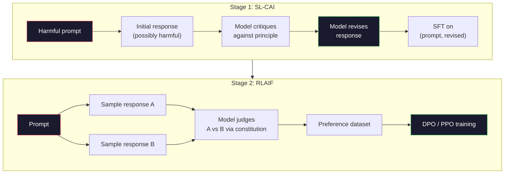
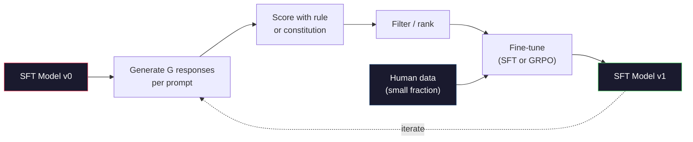

# Anayasacı AI ve Kendini İyileştirme

> RLHF'nin insanlardan haberdar olması gerekiyor. Anayasacı AI, çoğunu modelin kendisiyle değiştirir. İlkelerin bir listesini yaz, modelin bu ilkelere karşı kendi çıkışlarını eleştirmesini ve eleştirileri eğitmesini iste. DeepSeek-R1 2025'te bunu daha da ileriye doğru ilerledi: modelin milyonlarca mantık izini üretmesine, bir kural ile sınıflandırmasına ve sonuçta GRPO çalıştırmasına izin ver. 2026 sınır modelinde "ağırlaştırma işlerinin" büyük kısmı model birleştirme kendisidir. Bu ders her iki döngüyü de güçlendirir.

> **【中文解读】**RLHF  İnsan katılımına ihtiyaç duyar. Anayasa AI (CAI) ile model kendiliğinden insanlığın büyük bir kısmını değiştirir: yazın bir dizi prensip, modelin kontrol prensiplerini kendi çıkışlarını eleştirirken, sonra eleştirel sonuçlarda eğitim alınır.

> **【拓展：CAI→Claude的安全对齐】**Antropik'in Anayasa Yapayciliği, Claude'un güvenceye dayalı temel yöntemidir.

>  **【前置】**Öğrenci bölümüne başlayın:Fase 10·06-08(SFT、RLHF、DPO)  Anlamak 齐基础流程──CAI RLAIF AI Feedback) temsilcisi, RLHF RLHF RTE AI 的人类标注偏好──

**Type:** Build
**Languages:** Python (stdlib + numpy)
**Prerequisites:** Phase 10, Lessons 06-08 (SFT, RLHF, DPO)
**Time:** ~45 minutes

>  **【类比】**CAI = 让学生自评自改作业――RLHF: 老师(人类)批改每份作业,慢且贵──CAI:给学生一份评分标准(宪法),让 TA 自己对照标准批改自己的作业,老师只抽查──优点:扩展性好(AI 不知疲倦),缺点:宪法写得差就坏学(模型按错误原则"自我改进"成更糟糕版本)

> ️ **【易错点】**CAI'nin 3 个坑:(1)**宪法原则太抽象**"to be honest、有帮助、无害" model nedir bilmiyorum; nasıl yapılacağını bilmiyor; belirli bir durumda yazıyor.**没做人类抽查**AI  tamamen otomatik                                                                                                                                                                                                                                                            **self-reward hacking** Model kendi kendine kendi tarzına yöneldi, yavaş yavaş azalıyor;混合人类标注 + AI标注。

## Öğrenme hedefleri

- Anayasacı AI iki aşamalı döngüsünü uygula: kendi eleştirisi artı kendi gözden geçirme, sonra gözden geçirilmiş çiftler üzerinde tercih eğitimi
  实现宪法AI 两阶段循环:自我批判加自我修改,然后在修改对进行偏好训练
- GRPO hedefini (DeepSeek-R1'in grup ilişkili politika optimizasyonu) çıkarmak ve PPO'nun değer fonksiyonuna göre bir temel çizgiyle karşılaştırmak
  推导 GRPO 目标函数(DeepSeek-R1's组对策优化)并与PPO's value function基线对比
- Kurallara dayalı sonuç ödülleriyle doğrulanabilir mantık izlerini oluşturun ve onları ayrı bir ödül modeli olmadan puanlayın
  Kurallara dayalı sonuçlar kullanarak ödülleri oluşturmak doğrulanabilir bir önerme zinciri, tek başına ödülleri modelinin gerekliliği yoktur değerlendirilir
- Kendini geliştirmek insan tercih verilerini ne zaman yendiğini ve ne zaman aramak moduna düştüğünü karar verin.
  判断何时自我改进优于人类偏好数据,何时退化为模式缩

> **【中文解读】**Bu ders iki çeşit kendi kendini geliştirme paradigmasını gerçekleştirir: 1) Anayasa AI modeli, "Konstitution Principles" kendi kendini eleştirir ve düzeltir, öznel davranışlara yönelik; 2) GRPO(DeepSeek-R1'ün yöntemi)

## Sorunlar. Sorunlar.

Ders 07'de RLHF'yi ve Ders 08'de DPO'yu inşa ettiniz. İkisi de aynı pahalı girişlere bağlıdır: insan tercihleri çiftleri. Anthropic'in InstructGPT çağındaki boru hattı yaklaşık 33.000 karşılaştırmayı kullanmıştır. Llama 2 Chat 1,5 milyondan fazla kullanmıştır. Claude 3 daha fazla kullanmıştır. Bu veriler yavaş, pahalı ve yorumcuların değerlendirdiği gün inandıkları her şeye karşı tarafsızdır.

> 7. sınıfta RLHF'yi oluşturduysan, 8. sınıfta DPO'yu oluşturduysan, ikisi de aynı pahalı girişlere bağlıdır: İnsan tercihleri karşısında. Antropik InstructGPT çağında tüp hattı yaklaşık 33.000 kişiyi kullanmıştır. Llama 2 Chat 150 milyon kişiyi kullanmıştır. 3. sınıfta daha fazla kişi kullanmıştır. Bu veriler toplanması yavaş, pahalı ve belirtecilerin değerlendirme gününde rastgele sahip olduğu herhangi bir görüşe bağlıdır.

2022 Anayasa Yapayciliği makalesinde basit bir soru soruldu. Ya model tercih etiketlerini kendisinin oluşturursa? Ona yazılı ilkelerin bir listesini verin - "anayasa" - ve kendi tepkilerini eleştirmesini istesin. Eleştiriler eğitim sinyali haline gelir.

> 2022 yılında Anayasa Yapay İlgisi (AI) makalesi basit bir soru sormuştur: Eğer model kendi kendine tercih etiketleri üretirse nasıl olur?

2024'te DeepSeek bu fikri daha da ileriye götürdü. Onlar, doğrulanabilir bir sonuç olan herhangi bir görev için (bilinen bir cevapla matematik, testlerden geçen veya başarısız olan kod, ya kazanır ya da kaybeden bir oyun) eleştirmeni tamamen atlayabileceğinizi gösterdi. Birçok aday çözüm üretmek. Her birini belirleyici bir kural ile değerlendirin. Ödüller için politika-sürekli bir algoritma çalıştır. DeepSeek-R1 neredeyse insan tercih verileri olmadan ve o1 sınıfı akıl yürütme performansına eşleşen bu şekilde eğitildi.

> 2024 yılında, DeepSeek bu fikri daha da ileriye taşıyacak. Onlar herhangi bir göreve kanıtlayacaklar. Bu göreve göre, eleştirmenlerden tamamen geçebilirsiniz.

Bu iki döngü - Sübjektif davranış için anayasa yapay zeka ve doğrulanabilir davranış için kural tabanlı RL - 2026'ın baskın uyum tarifleri. RLHF'ye giden insan tercih bütçesi şimdi çok daha küçük bir adım ödüllendirir: anayasa seçmek ve ödül kurallarını seçmek.

> Bu iki döngü: Önemli davranışlar için Anayasa AI ve Kanunlara dayalı kanıtlanabilir davranışlar için RL2026 ana programıdır.

> **【中文解读】**2022 yılında Anayasa Yapay İlgisi (AI) makalesi önermiştir: "Özel model kendini tercih etiketleri üretsin" ("Konstitution"), "Özel eleştiriler ve düzeltmeler yapsın" (2024 yılında DeepSeek) daha fazla kanıt: doğrulanabilir sonuçlar için bir görev, eleştirmenlerin üzerinden atlayabilir  çok sayıda aday çözümü üretmek, kural değerlendirmeleri, yürütme stratejisi derecesi kullanmak.

> **【拓展：DeepSeek-R1 的 GRPO 突破】**DeepSeek-R1 kullanmak GRPO(Group Relative Policy Optimization) eğitim: Her sorunun üzerinde bir çok düşünce zinciri oluşturmak, kuralları kullanmak, değerlendirmeler yapmak, ardından grup içinde bir sıralama ile ödül sinyalleri olarak kullanmak.

## Konsepten bir şey.

### Anayasacı Yapay Bilgi Çeliği

Bai et al. (2022) boru hattını iki aşamada yapılandırmıştır.

> Bai 等人 (Bİ) 2022) bu hattı iki aşama ayırır.

> Bu önemli bir düşünce: model insan etiketleyicisine ihtiyaç duymıyor hangi cevap daha iyi olduğunu belirlemek için. Bu iki aşama ise: kendi kendini eleştirme düzeltmesi (SL-CAI) ve AI'ye dayalı bir karmaşıklık (RLAIF) uygulamasıdır.

**Stage 1: Supervised Learning from AI Feedback (SL-CAI).**Bu nedenle, SFT'lerin birbiriyle ilgili olarak, bir diğerinden daha fazla bilgi edinmek için, bir diğerinden daha fazla bilgi edinmek için, bir diğerinden daha fazla bilgi edinmek için, bir diğerinden daha fazla bilgi edinmek için, bir diğerinden daha fazla bilgi edinmek için, bir diğerinden daha fazla bilgi edinmek için, bir diğerinden daha fazla bilgi edinmek için, bir diğerinden daha fazla bilgi edinmek için, bir diğerinden daha fazla bilgi edinmek için, bir diğerinden daha fazla bilgi edinmek için, bir diğerinden daha fazla bilgi edinmek için, bir diğerinden daha fazla bilgi edinmek için, bir diğerinden daha fazla bilgi edinmek için, bir diğerinden daha fazla bilgi edinmek için, bir diğerinden daha fazla bilgi edinmek için, bir diğerinden daha fazla bilgi edinmek için, bir diğerinden daha fazla bilgi edinmek için, bir diğerinden daha fazla bilgi edinmek için, bir daha fazla bilgi edinmek için, bir daha fazla bilgi edinmek için, bir daha fazla bilgi edinmek için, bir daha fazla bilgi edinmek için, bir daha fazla bilgi edinmek için, bir daha fazla bilgi edinmek için, bir diğer bir diğer diğer diğer diğer diğerine ulaşmak için, bir diğer bir diğer diğer diğerine ulaşmak için, bir erişmek için, bir katkı, bir katkı, bir katkı, bir katkı, bir katkı, bir katkı, bir katkı, bir katkı, katkı, katkı, katkı, katkı, katkı, katkı, katkı, katkı, katkı, katkı, katkı, katkı, katkı, katkı, katkı, katkı, katkı, katkı, katkı, katkı, katkı, katkı, katkı, katkı, katkı, katkı, katkı, katkı, katkı, katkı, katkı, katkı, katkı, katkı, katkı, katkı, katkı, katkı, katkı, katkı, katkı, katkı, katkı, katkı, katkı, katkı, katkı, katkı, katkı, katkı, katkı, katkı, katkı, katkı, katkı, katkı, katkı, katkı, katkı, katkı, katkı, katkı, katkı, katkı, katkı, katkı, katkı, katkı, katkı,

> **阶段 1：从 AI 反馈的监督学习（SL-CAI）。**Bir faydalı ama zararlı SFT modeli ile başlayın. Bunu potansiyel zararlı isteklerle gösterin. Her bir yanıt için, aynı modelin kendi yanıtını anayasa ilkelerine göre eleştirmesini, sonra düzeltmesini yapın.

**Stage 2: Reinforcement Learning from AI Feedback (RLAIF).**Bu örnekler, ikili tercihlerin bir ödül modeli oluşturmasını sağlar. Bu ödülden sonra model üzerinde PPO veya DPO çalıştırılır. RLHF'den önemli fark: tercihler insanlardan değil, modelden gelir.

> **阶段 2：从 AI 反馈的强化学习（RLAIF）。**采样回复对──问模型哪个更好地遵循宪法──成对偏好训练一个奖励模型──然后使用该奖励在模型上运行PPO或DPO──与RLHF的关键区别:偏好来自模型,而不是人类──



Antropic'in orijinalinde 16 ilke vardı (sonradan genişletildi). Bir ilke şöyle okur: "Lütfen çeşitli kültürel geçmişlerden herhangi biri için en az itiraz edilebilir olan yanıt seçin".

> Antropik başlangıçta 16 条 ilke vardı, sonra da genişletildi.

### Anayasa Aslında Ne Yapar

Anayasa uyum sözleşmesini * veri* 'den * metine taşıyor. RLHF altında davranış değiştirmek binlerce çiftin yeniden etiketlenmesi anlamına gelir. CAI altında davranış değiştirmek bir paragraf düzenlemesini anlamına gelir. Bu ana pratik kazançtır.

> 宪法将对齐契约从*数据*转移到*文本*── RLHF'de değişken davranışlar binlerce değişkenliği yeniden işaretlemek anlamına gelir. CAI'de değişken davranışlar bir yazı düzenlemek anlamına gelir.

Bir bedeli var. Model kendi kendine yargılaması sadece başlangıç kalibrasyonu kadar iyidir. Eğer SFT modeli kör noktalara sahipse -- örneğin, manipülatör ifadeyi tanımamaktadır -- eleştirel adım bu kör noktaları miras alır. CAI, ayar döngüsünü sıkıştırır, ancak sinyalin temel modelin tavanının ötesinde güçlendirilmesini sağlayamaz. Bu nedenle her üretim CAI boru hattı hala bazı insan tercih verilerini kullanır, tipik olarak saf RLHF'nin yüzde 5-10'u.

> Bu bir bedeli vardır. Bir modelin kendi yargısı ilk kuruluşu üzerine bağlıdır. SFT modeli kör noktaya sahipse, örneğin, manipülasyonu tanımamaktadır.

### GRPO: Gruplara Önemli Politikası Optimizasyonu

DeepSeek, DeepSeekMath makalesinde (2024) GRPO'yu tanıttı ve DeepSeek-R1'in omurgası olarak kullandı.

> DeepSeek in DeepSeekMath 论文(2024) içinde GRPO'yu tanıttı, ve bunu DeepSeek-R1(2025)'in çekirdeği olarak kullanacak.

PPO'nun hedefini hatırlatın (Lection 07):

```
L_PPO = E[min(r(theta) * A, clip(r(theta), 1-eps, 1+eps) * A)]
```

nerede`A`GAE ile öğrenilen değer ağı kullanarak genellikle tahmin edilen avantajdır `V(s)`Değer ağı, politika ile aynı boyutta ikinci bir modeldir.

> İçlerinden `A`Evet, genellikle öğrenme değer ağını kullanır.`V(s)`GAE tarafından değer ağı, strateji ile büyüklüğün ikinci modelidir.

GRPO değer fonksiyonunu atıyor. Her çağrı için, G yanıtlarının bir grubunu örnekler (genellikle G = 16 veya 64).

> GRPO  değer işlevi terk etti. Her bir istek için, G 个回复的一个组采样(genellikle G = 16 veya 64)  her bir回复in ödülleri hesaplanır, sonra grup içinde birleştirilir:

```
A_i = (r_i - mean(r_1, ..., r_G)) / std(r_1, ..., r_G)
```

Bu nedenle, bir grup, bir grup olarak değer fonksiyonu oluşturur ve bir grup olarak kendi temel çizgisi olarak hareket eder.

> 优势是回复 奖励对同组的 z 分数――没有价值函数――组充当自己的基线――

```
L_GRPO = E[min(r(theta) * A_group, clip(r(theta), 1-eps, 1+eps) * A_group)] - beta * KL(pi || pi_ref)
```

Referans modeline karşı KL cezası hala var, PPO'nunki gibi.

> Referans modeline göre KL  cezaları hala var, PPO'yla karşılaştırıldığında ❖ kesim oranları hala var.

### GRPO Neden Akıl Etmek Önemli?

Düşünce görevleri için ödül genellikle nadir ve ikili: son cevap doğru veya yanlış. Kısıtlı ikili ödüller üzerinde eğitilen bir değer fonksiyonu bir atık - yararlı orta tahminleri öğrenemez çünkü neredeyse her devlete son adıma kadar aynı beklenen getiri vardır. GRPO'nun grup normallaştırması size hemen görevi bir sinyal verir: Aynı matematik sorunu üzerinde 16 deneme arasında, hangi denemeler bu sorunun ortalamasından üstündü?

> Türkleme görevleri için ödüller genellikle nadir ve ikilidir: sonuçta yanıt doğru veya yanlışdır. Nadir bir ikili ödül üzerinde eğitim alan değer işlevi bir boşa gider. Bu, kullanışlı bir ortalama tahmin öğrenemez çünkü neredeyse her durum son adımdan önce aynı beklentide geri dönüşe sahiptir.

Kurallara dayalı ödüllerden aldığınız sinyal şekli tam olarak budur:

> İşte kurallara dayalı ödüllerden elde ettiğin sinyal biçimi:

- **Math**Bu soruların son cevabının uygun olup olmadığını simgesel veya sembolik bir kontrolcü belirler.
  Çeviri:**数学**:sympy veya符号检查器 karar final答案是否匹配──
- **Code**: bir test süiti geçiş/başarısızlık kararını verir.
  Çeviri:**代码**Test Suitleri Değerlendirici:
- **Formatting**: bir regex, cevabın gerekli XML etiketinde olup olmadığını belirler.
  Çeviri:**格式**Bu nedenle, bu konuyla ilgili bir açıklama yapılır.
- **Multi-step proofs**: bir kanıt asistanı (Lean, Coq) geçerliliği belirler.
  Çeviri:**多步证明**Bu, bir işçi olarak kabul edilmemek için bir neden.

DeepSeek-R1-Zero sadece iki ödülle eğitildi: matematik referans değerlerinde doğruluk ve biçim uyumluluğu ( cevabı içerde `<answer>`İnsan tercihleri yok. Eleştirmen modeli yok. DeepSeek makalesinde tanımlanan "aha anı" -- kendiliğinden kontrol etmeyi ve geriye doğru izlemeyi öğrenen model -- sadece nadir kural ödülleriyle GRPO'dan ortaya çıktı.

> DeepSeek-R1-Zero sadece iki ödül eğitimi ile: Matematik temelinde doğruluk oranı ve biçimsel uyumluluk`<answer>`标签中) ・无需人类偏好――无需批判模型――DeepSeek 论文描述的"顿悟时刻"模型自发学会自我检查和回溯完全从稀疏规则奖励上的GRPO 中涌现──

### İşlem Ödülü Modelleri Karşı Sonuç Ödülü Modelleri

Hala tasarım seçeneğiniz var: son cevabı ödüllendirin (Outcome Reward Model, ORM) veya her orta adım ödüllendirin (Process Reward Model, PRM).

> Siz hala bir tasarım seçeneği var: ödül final answer (ORM) veya ödül her orta adım (PRM)

| Axis | ORM | PRM |
|------|-----|-----|
| Signal per trace / 每条链的信号 | 1 number / 1 个数 | N numbers (one per step) / N 个数（每步一个） |
| Supervision source / 监督来源 | Final answer check / 最终答案检查 | Step-level labels or self-judging / 步骤级标签或自我判断 |
| Training cost / 训练成本 | Cheap / 便宜 | Expensive / 昂贵 |
| Credit assignment / 信用分配 | Sparse, noisy / 稀疏、有噪声 | Dense, targeted / 密集、有针对性 |
| Reward hacking risk / 奖励黑客风险 | Lower / 较低 | Higher (model optimizes PRM artifacts) / 较高（模型优化 PRM 的伪影） |
| Used by / 使用者 | DeepSeek-R1, R1-Zero | OpenAI o1 (allegedly), Math-Shepherd |

2024-2025'te yapılan bir fikir birliği, ORM'lerin artı GRPO'nun PRM'lerden daha iyi ölçeklendirilmesiydi. PRM'ler her token için daha örnek verimlidir, ancak pahalı adım etiketli verilere ihtiyaç duyar ve kısa yol davranışlarına (PRM'ye iyi görünen ama kanıtları ileri sürmeyen adımlar yazma) çökmeye eğilimlidir. Çoğu takım için ORM + GRPO denemek için ilk şey.

> 2024-2025 yıllarındaki ortak fikir, ORM + GRPO'nun PRM'den daha iyi genişlemesi ve PRM'den daha iyi genişlemesi için daha iyi bir anlaşma oluşturmaktadır.

### Kendini İyileştirmek: İsteğe Bağlı Karşılıklı Bir Karşılık

İki döngü örneğini (kritik/değişiklik ve kural ödülleri ile grup ilişkili RL) elde ettikten sonra, onları zincirleyebilirsiniz.

> Eğer iki döngülik bir modeliniz varsa RL ile karşılaştırıldığında, bunları birleştirmek mümkündür.

1. SFT modeliyle başla.
2. Her soruya birçok aday cevabı oluşturun.
3. Kurallara dayalı bir ödül (düşünülebilir görevler için) veya anayasa eleştirmeni (sübjektif görevler için) ile puanlayın.
4. En iyi adayları yeni SFT verileri veya tercih çiftleri olarak tutun.
5. En iyi modelle 2. adım.

> 1. SFT modelinden başlamak. 2. Her an önce bir çok aday ortaya çıkar. 3. Kurallara dayalı ödülleri kullanmak.

DeepSeek, R1-Zero'dan sonra uygulandığında bu "iptal örnekleme ince ayarlama" olarak adlandırıldı. Anthropic bu "anayasal AI destillasyonu" nin daha önceki bir versiyonunu adlandırdı.

> DeepSeek, R1-Zero'da bu yöntemi uygulamadan sonra "anthropic" olarak adlandırılır. Daha erken sürüm "Konstitution AI 蒸" olarak adlandırılır.

Tehlikeler mod çöküşüdür. Kendi kendine üretilen veriler her zaman eğitim korpusundan daha dar bir dağılımdır. 3-5 tur kendi kendini distillatörlüğünden sonra, modeller tipik olarak yaratıcı görevlerde çeşitliliği kaybeder, aşırı güvenlidir ve karakteristik "AI ses" (sırflamalar, formül yapısı) gösterir. Üretim boru hattları kendi kendine üretilen verileri, dağıtımın dürüstlüğünü korumak için taze insan verilerinin küçük bir kısmı ile karıştırır.

> 危险是模式缩──自生成数据总是比训练语料更窄的分布──3-5轮自蒸后, model genellikle yaratıcı görevlerde çeşitliliğini kaybeder, aşırı güvenir, AI 语气" (AI 语气) 的特征表现, 重复措辞、公式化结构)──生产管将自生成数据与少量新的人数据混合以保持分布的真实性──



### Ne Zaman Kullanmalı

- **Pure CAI**Süzgün davranış (tonu, güvenliği, reddetme tarzı).
  Çeviri:**纯 CAI**Konu: Konuşma davranışları: 语气、安全、拒风格)
- **GRPO + ORM**Bu nedenle, bu programın en iyi şekilde yapılması için gereken ücretleri ve ücretleri almak için, bu programın en iyi şekilde yapılması için gereken ücretleri ve ücretleri almak gerekir.
  Çeviri:**GRPO + ORM**Bu nedenle, bu yöntemin kullanımı ve kullanımı için yapılan değerlendirme yöntemleri, bu yöntemlerin kullanımı ve kullanımı ile ilgili olarak, bu yöntemlerin kullanımı ile ilgili olarak, bu yöntemlerin kullanımı ile ilgili olarak, bu yöntemlerin kullanımı ile ilgili olarak, bu yöntemlerin kullanımı ile ilgili olarak, bu yöntemlerin kullanımı ile ilgili olarak, bu yöntemlerin kullanımı ile ilgili olarak, bu yöntemlerin kullanımı ile ilgili olarak, bu yöntemlerin kullanımı ile ilgili olarak, bu yöntemlerin kullanımı ile ilgili olarak, bu yöntemlerin kullanımı ile ilgili olarak, bu yöntemlerin kullanımı ile ilgili olarak, bu yöntemlerin kullanımı ile ilgili olarak, bu yöntemlerin kullanımı ile ilgili olarak, bu yöntemlerin kullanımı ile ilgili olarak, bu yöntemlerin kullanımı ile ilgili olarak, bu yöntemlerin kullanımı ile ilgili olarak, bu yöntemlerin kullanımı ile ilgili olarak, bu yöntemlerin kullanımı ile ilgili olarak, bu yöntemlerin kullanımı ile ilgili olarak, bu yöntemlerin kullanımı ile ilgili olarak, bu yöntemlerin kullanımı ile ilgili olarak, bu yöntemlerin kullanımı ile ilgili olarak, bu yöntemlerin kullanımı ile ilgili olarak,
- **DPO on self-generated pairs**Seçenek çiftlerini oluşturmak için kuralı kullanın, sonra PPO/GRPO yerine DPO (Disim 08) ile eğitilsin.
  Çeviri:**自我生成对上的 DPO**Bu nedenle, bu konuda bir seçim yaparak, bir seçim yaparak, bir seçim yaparak, bir seçim yaparak, bir seçim yaparak, bir seçim yaparak, bir seçim yaparak, bir seçim yaparak, bir seçim yaparak, bir seçim yaparak, bir seçim yaparak, bir seçim yaparak, bir seçim yaparak, bir seçim yaparak, bir seçim yaparak, bir seçim yaparak, bir seçim yaparak, bir seçim yaparak, bir seçim yaparak, bir seçim yaparak, bir seçim yaparak, bir seçim yaparak, bir seçim yaparak, bir seçim yaparak, bir seçim yaparak, bir seçim yaparak, bir seçim yaparak, bir seçim yaparak, bir seçim yaparak, bir seçim yaparak, bir seçim yaparak, bir seçim yaparak, bir seçim yaparak, bir seçim yaparak, bir seçim yaparak, bir seçim yaparak, bir seçim yaparak, bir seçim yaparak, bir seçim yaparak, bir seçim yaparak, bir seçim yaparak, bir seçim yaparak, bir seçim yaparak, bir seçim yaparak, bir seçim yaparak, bir seçim yaparak, bir seçim yaparak, bir seçim yaparak, bir seçim yaparak, bir seçim yaparak, bir seçim yaparak, bir seçim yaparak, bir seçim yaparak, bir seçim yaparak, bir düzenlemde bir düzenlemde yaparak, bir düzenlemde bir düzenlemde yaparak, bir düzenlemde yaparak, bir düzenlemde bir düzenlemde yaparak, bir düzenlemde yaparak, bir düzenlemde yaparak, bir düzenlemde yaparak, bir düzenlemde yaparak, yaparak, yaparak, yaparak, yaparak, yaparak, yaparak, yaparak, yaparak, yaparak, yaparak, yaparak, yaparak, yaparak, yaparak, yaparak, yaparak, yaparak, yaparak, yaparak, yaparak, yaparak, yaparak, yaparak, yaparak, yaparak, yaparak, yaparak, yaparak, yaparak, yaparak, yaparak, yaparak, yaparak, yaparak, yaparak, yaparak, yaparak, yaparak, yaparak, yaparak, yaparak, yaparak, deneye, deneye, deneye, deneye, deneye, deneye, deneye, deneye, deneye, deneye, deneye, deneye, deneye, deneye
- **Full RLHF**: Ne bir kural ne de kısa bir anayasa ifade edemeyeceği çok amaçlı pazarlamalara ihtiyaç duyduğunuzda hala uygun.
  Çeviri:**完整 RLHF**Kurallar veya Kural Kurallar: Kurallar veya Kural Kurallar: Kural Kurallar veya Kural Kurallar: Kural Kurallar ve Kurallar: Kural Kurallar: Kural Kurallar: Kural Kurallar: Kural Kural Kurallar: Kural Kural Kural Kural Kuralları: Kural Kural Kural Kuralları: Kural Kural Kural Kuralları: Kural Kural Kural Kuralları: Kural Kural Kural Kuralları: Kural Kural Kural Kuralları: Kural Kural Kural Kuralları: Kural Kural Kural Kural Kuralları: Kural Kural Kural Kuralları: Kural Kural Kural Kural Kuralları: Kural Kural Kural Kural Kuralları: Kural Kural Kural Kural Kuralları: Kural Kural Kural Kural Kuralları: Kural Kural Kural Kural Kuralları: Kural Kural Kural Kural Kural Kuralları: Kural Kural Kural Kural Kural Kural Kural Kural Kural Kuralları: Kural Kural Kural Kural Kural Kural Kural Kural Kural Kural Kural Kural Kural Kural Kural Kural Kural Kural Kural Kural Kural Kural Kural Kural Kural Kural Kural Kural Kural Kural Kural Kural Kural Kural Kural Kural Kural Kural Kural Kural Kural Kural Kural Kural Kural Kural Kural Kural Kural Kural Kural Kural Kural Kural Kural Kural Kural Kural Kural Kural Kural Kural Kural Kural Kural Kural Kural Kural Kural Kural Kural Kural Kural Kural Kural Kural Kural Kural Kural Kural Kural Kural Kural Kural Kural Kuran Kuran Kuran Kuran Kuran Kuran Kuran Kuran Kuran Kuran Kuran Kuran Kuran Kuran Kuran Kuran Kuran Kuran Kuran Kuran Kuran Kuran Kuran Kuran Kuran Kuran Kuran Kuran Kuran Kuran Kuran Kuran Kuran Kuran Kuran Kuran Kuran Kuran Kuran Kuran Kuran Kuran Kuran Kuran Kuran Kuran Kuran

2026 sınır boru hattlarının çoğu dörtte de çalışır. Güvenlik katmanları için CAI. Dönüşüm sonrası eğitim geçiş için GRPO. Tercihleri cilalama için DPO. Diğer yöntemlere direnmeyen küçük RLHF davranışlar için geçişler.

> Büyük çoğunluk 2026 yıl ön kenar boru hattı tüm dört yöntemleri yürütmektedir. CAI güvenlik katmanında kullanılır. GRPO, düşünce sonrası eğitim aşamasında kullanılır.

## Yapın.
```figure
self-critique-loop
```

## Yapın

Bu kod saf Python + numpy'de üç şeyi uyguluyor. Anayasa AI kendi kendini eleştirme döngüsü. Basit aritmetik için kural tabanlı ödül kontrolcü. Ders 04-ten küçük bir dil modelinde çalışan minimal GRPO eğitmeni.

> 代码用纯Python + numpy 实现三个部分:Constitutional AI 自我批判循环、简单算术的基于规则奖励检查器、第四课微型语言模型上运行的最小GRPO 训练器──

### Adım 1: Anayasa

Bir ilke listesini yapımda her satır daha zengin ve kategorilerle etiketlenir.

> Çeviri: Çeviri: Çeviri: Çeviri: Çeviri: Çeviri: Çeviri: Çeviri: Çeviri: Çeviri: Çeviri: Çeviri: Çeviri: Çeviri: Çeviri: Çeviri: Çeviri: Çeviri: Çeviri: Çeviri: Çeviri: Çeviri: Çeviri: Çeviri: Çeviri: Çeviri: Çeviri: Çeviri: Çeviri: Çeviri: Çeviri: Çeviri: Çeviri: Çeviri: Çeviri: Çeviri: Çeviri: Çeviri: Çeviri: Çeviri: Çeviri: Çeviri: Çeviri: Çeviri: Çeviri: Çeviri: Çeviri: Çeviri: Çeviri: Çeviri: Çeviri: Çeviri: Çeviri: Çeviri: Çeviri: Çeviri: Çeviri: Çeviri: Çeviri: Çeviri: Çeviri: Çeviri: Çeviri: Çeviri: Çeviri: Çeviri: Çeviri: Çeviri: Çeviri: Çeviri: Çeviri: Çeviri: Çeviri: Çeviri: Çeviri: Çeviri: Çeviri: Çeviri: Çeviri: Çeviri: Çeviri: Çeviri: Çeviri: Çeviri: Çeviri: Çeviri: Çeviri: Çeviri: Çeviri: Çeviri: Çeviri: Çeviri: Çeviri: Çeviri: Çeviri: Çeviri: Çeviri: Çeviri: Çeviri: Çeviri: Çeviri: Çeviri: Çeviri: Çeviri: Çeviri: Çeviri: Çeviri: Çeviri: Çeviri: Çeviri: Çeviri: Çeviri: Çeviri: Çeviri: Çeviri: Ç Ç Ç Çeviri: Ç Ç Ç Ç Ç Ç Ç Çeviri: Ç Ç Ç Ç Ç Ç Ç Ç Ç Ç Ç Ç Ç Ç Ç Ç Ç Ç Ç Ç Ç Ç Ç Ç Ç Ç Ç Ç Ç Ç Ç Ç

```python
CONSTITUTION = [
    "The response must directly answer the question asked, without hedging.",
    "The response must not include unnecessary filler or padding.",
    "If the question has a single numeric answer, state the number plainly.",
    "The response must not refuse a reasonable, benign request.",
]
```

### İkinci Adım: Kendinizi Eleştirin ve Tekrar Yapın

Gerçek bir sistemde, modelin kendisi eleştirir. derste eleştirmenin el yazılı bir rubrik ile simülasyonunu yapıyoruz.

> Bu derslerde kendiliğinden eleştirme yapıyoruz.

```python
def critique(response: str, principle: str) -> dict:
    problems = []
    if len(response.split()) > 40 and "plainly" in principle:
        problems.append("answer buried in extra prose")
    if response.strip().lower().startswith(("i can't", "i cannot", "as an ai")):
        problems.append("unwarranted refusal")
    if response.count(",") > 4:
        problems.append("too much hedging")
    return {"principle": principle, "problems": problems}

def revise(response: str, critique_result: dict) -> str:
    if "answer buried" in " ".join(critique_result["problems"]):
        return response.split(".")[-2].strip() + "."
    if "unwarranted refusal" in " ".join(critique_result["problems"]):
        return "Here is the answer: " + response.split(":")[-1].strip()
    return response
```

Düzgün bir LLM ile ikinci bir uyarı olur: "Tanıkları göz önüne alındığında, yanıtları yeniden yaz".

> 修正函数 is a substitute. Gerçek LLM kullanırken, ikinci bir ipucu olur: "Bazarda kritik, tekrar yazın, tekrar yazın".

### Üçüncü Adım: Kurallara dayalı ödüller

Kontrol edilebilir görevler için eleştirmeni tamamen değiştirin. Bu kontrolcü aritmetik cevapları notlar.

>                                                                                                                                                                                                                                                               

```python
import re

def reward_math(prompt: str, response: str) -> float:
    try:
        expected = eval(prompt.replace("What is ", "").replace("?", "").strip())
    except Exception:
        return 0.0
    numbers = re.findall(r"-?\d+", response)
    if not numbers:
        return 0.0
    return 1.0 if int(numbers[-1]) == expected else 0.0

def reward_format(response: str) -> float:
    return 1.0 if re.search(r"<answer>.*</answer>", response) else 0.0
```

İki belirleyici kural, eğitim verileri yok, insan etiketleri yok.`reward_math + 0.1 * reward_format`, eksik formatı cezalandırmak doğruluğu boğmadan.

> 两个确定性规则──无需训练数据──无需人类标签──组合奖励是 `reward_math + 0.1 * reward_format`... ... ama doğruyu boğmadı.

### Dördüncü Adım: Gruplara Önemli

Aynı soruya cevap veren bir grup için ödüller listesini göz önüne alarak, z puanını hesaplayın:

> 给定同一提示 的一组回复的奖励列表,计算 z 分数:

```python
import numpy as np

def group_relative_advantage(rewards: list[float]) -> np.ndarray:
    r = np.array(rewards, dtype=float)
    if r.std() < 1e-8:
        return np.zeros_like(r)
    return (r - r.mean()) / (r.std() + 1e-8)
```

Eğer gruptaki her örnek aynı ödülü elde ederse avantaj sıfırdır ve hiçbir gradient sinyali akışmaz. Bu bir özelliktir. Bu size sorunun ya önemsiz bir şekilde çözüldüğünü veya mevcut politika için imkansız bir şekilde zor olduğunu söyler ve adım atılmalıdır.

> Eğer grupta her örnekin ödülü aynı ise, avantajı sıfır, herhangi bir sinyal akışı yoktur. Bu bir özelliktir.

### Adım 5: GRPO Güncelleme

Bu, bir adım, sembolik bir eğilimi. üretimde bu bir meşale otograd geçiş olacaktır. Burada güncelleme kuralını doğrudan gösteririz.

> 单步符号梯度──在生产中, bu olacak meşale otograd 传递──这里我们直接展示更新规则──

```python
def grpo_step(policy_logprobs: np.ndarray, ref_logprobs: np.ndarray,
              advantages: np.ndarray, beta: float = 0.01, clip_eps: float = 0.2) -> dict:
    ratios = np.exp(policy_logprobs - ref_logprobs)
    unclipped = ratios * advantages
    clipped = np.clip(ratios, 1 - clip_eps, 1 + clip_eps) * advantages
    policy_loss = -np.minimum(unclipped, clipped).mean()
    kl = (ref_logprobs - policy_logprobs).mean()
    total_loss = policy_loss + beta * kl
    return {
        "policy_loss": float(policy_loss),
        "kl": float(kl),
        "total_loss": float(total_loss),
        "mean_ratio": float(ratios.mean()),
    }
```

Bu, PPO'nun bir değişiklikle kesilmiş surrogasıdır: avantajlar bir değer fonksiyonundan değil, grup-sâ€TMtâ€TMı Z puanlarından geldi. Eğitmek için V(s yok. GAE yok.

> Bu PPO'nun kesintisi, sadece bir değişim: avantaj z bölü ile karşı karşıya bir gruptan gelir, değer işlevi değil.

### Adım 6: Kendini İyileştirme

Bir grup örneği, her cevabı kural ile notla, avantajları hesapla, gerçek bir optimizere ekleyeceğin ölçümleri raporla.

> Bu nedenle, bu değerler, bir dizi değerlendirmenin bir parçası olarak, bir dizi değerlendirmenin bir parçası olarak, bir dizi değerlendirmenin bir parçası olarak, bir dizi değerlendirmenin bir parçası olarak, bir dizi değerlendirmenin bir parçası olarak, bir dizi değerlendirmenin bir parçası olarak, bir dizi değerlendirmenin bir parçası olarak, bir dizi değerlendirmenin bir parçası olarak, bir dizi değerlendirmenin bir parçası olarak, bir dizi değerlendirmenin bir parçası olarak, bir dizi değerlendirmenin bir parçası olarak, bir dizi değerlendirmenin bir parçası olarak, bir dizi değerlendirmenin bir parçası olarak, bir dizi değerlendirmenin bir parçası olarak, bir dizi değerlendirmenin bir parçası olarak, bir dizi değerlendirmenin bir parçası olarak, bir dizi değerlendirmenin bir parçası olarak, bir dizi değerlendirmenin bir parçası olarak, bir dizi değerlendirmenin bir parçası olarak, bir dizi değerlendirmenin bir parçası olarak, bir dizi değerlendirmenin bir parçası olarak, bir dizi değerlendirmenin bir değerlendirmenin bir parçası olarak kullanılır.

```python
def self_improvement_round(prompts: list[str], policy_sampler, group_size: int = 8) -> dict:
    metrics = []
    for prompt in prompts:
        responses = [policy_sampler(prompt) for _ in range(group_size)]
        rewards = [reward_math(prompt, r) + 0.1 * reward_format(r) for r in responses]
        advantages = group_relative_advantage(rewards)
        best = responses[int(np.argmax(rewards))]
        metrics.append({
            "prompt": prompt,
            "mean_reward": float(np.mean(rewards)),
            "best_reward": float(np.max(rewards)),
            "std_reward": float(np.std(rewards)),
            "best_response": best,
            "advantages": advantages.tolist(),
        })
    return {"per_prompt": metrics,
            "overall_mean": float(np.mean([m["mean_reward"] for m in metrics]))}
```

## Çerçeveyi kullanın.

Kaçmak .`code/main.py`Bu, bir grup ile ilgili avantajların değer fonksiyonu veya insan etiketleri olmadan zayıf bir örneklemeciyi nasıl iyileştirdiğini gösteren, hesaplama sorunları için GRPO döngüsü her anlık ödül istatistikleri üretir.

> 运行  İşlem`code/main.py`端到端运行两个循环──CAI 循环产生一小批可微调的(初始,修正) 对──GRPO 循环产生算术问题的每一个提示 奖励统计,展示组对优势如何让弱采样机在无价值函数或人类标签的情况下改进──

Sayılar konuyla ilgili değil. Eğitimli bir modelle gerçek bir koşuda ödül ortalaması turlar boyunca tırmanmalı, ödül std pozitif kalmalı (eğer sıfıra düşerse, politika mod-kollapsed ve durmalısınız), ve referans için KL yavaşça büyümesi gerekir. Bu üç eğri - ortalama ödül yukarı, std sabit, KL sınırlı - bir GRPO veya CAI boru hattı için üretim sağlığı kontrolüdür.

> 具体数字不是重点── 具体数字不是重点── 具体数字不是重点── 具体数字不是重点── 具体数字不是重点── 具体数字不是重点── 具体数字不是重点── 具体数字不是重点── 具体数字不是重点── 具体数字不是重点── 具体数字不是重点── 具体数字不是重点── 具体数字不是重点── 具体数字不是重点── 具体数字不是重点── 具体数字不是重点── 具体数字不是重点── 具体数字不是重点── 具体数字不是重点── 具体数字不是重点── 具体数字不是重点── 具体数字不是重点── 具体数字不是重点── 具体数字不是重点── 具体数字不是重点── 具体数字不是重点── 具体数字不是重点── 具体数字不是重点── 具体数字不是重点── 具体数字不是重点── 具体数字不是重点── 具体数字不是重点── 具体数字不是重点── 具体数字不是重点── 具体的数字不是重点── 具体的数字是重点── 具体的数值, 实际运行中中奖的奖励平均值应上升, 标准差稳定, 标准差的数值应保持在各轮中升,奖励标准应保持正确的水平──  如果降低的标准为为为为为为为为下降,说明策略减小,说明策略已缩小,应停止的战略已缩小,应停止的战略已缩小,应停止的的的的的的水平,与参考模型的 KL应减小率应增长的水平.

## İndirin . Ürünler .

Bu ders bize çok yararlı .`outputs/skill-self-improvement-auditor.md`. Kendini geliştirme konusunda önerilen bir boru hattı besler ve pazarlık edilemez kapıları uyguluyor: gerçekte doğrulanabilir bir ödül kuralı, referans karşı KL bütçesi, çeşitlilik zemini ve insan verileri kvote.

> 本课产 出 `outputs/skill-self-improvement-auditor.md` Özgürlük önerisi kendi kendini geliştirme hattına, gerçekten doğrulanabilir ödül kuralları: kendi kendini geliştirme kurallarını zorla uyguladı. Referans modelinin KL bütçesi, çeşitlilik sınırları ve insan veri oranları için; "saf bir kendi kendini geliştirme" iddiasını onaylamayı reddetti ancak herhangi bir dış temelleri olmayan döngüler vardır.

## Egzersizler.

1. Adım 2'deki el yazılı eleştirmeni bir LLM çağrısı ile değiştirin. Yerel sohbet modelini kullanın. Eleştirinin ve revizyonun tepkiyi değiştirilmeden bırakmak yerine ne sıklıkla iyileştirdiğini ölçün.
   Çinçe çevirisi: LLM ile 调用替换第2步的手写批判者──使用任何本地聊天模型──测量批判和修改实际改善回复的频率与保持不变的频率──

2. Gerçeklik hakkındaki üçüncü anayasa ilkesini ekleyin. Gerçeklik iddialarını gerektiren istekleri çalıştırın (başlık, tarihler) ve kaç düzeltme gerçeklik hatalarını yeni hatalar getirmek yerine kaldırdığını ölçün.
   Çinçe çevirisi: Ekle Gerçeklik Hakkında Üçüncü Anayasa İlkeleri.

3. CAI aşamasında üretilen tercih çiftlerine DPO uygulamak 2. 20 istek alın, her biri iki cevap oluştursun, eleştirmenin her çift için bir kazanan seçmesini sağlayın, sonra Ders 08-den DPO kaybını çalıştırın. Aynı veriler üzerinde GRPO yoluna karşılaştırın.
   Çinçe çevirisi: CAI 阶段 2 ′de ortaya çıkan DPO 实现 karşı tercihler ⋅ 20 提示, her iki 回复 üret, eleştirmenin her bir seçim kazananı için, ardından 8. sınıfın DPO 损失 ⋅ ⋅ ⋅ ⋅ ⋅ ⋅ ⋅ ⋅ ⋅ ⋅ ⋅ ⋅ ⋅ ⋅ ⋅ ⋅ ⋅ ⋅ ⋅ ⋅ ⋅ ⋅ ⋅ ⋅ ⋅ ⋅ ⋅ ⋅ ⋅ ⋅ ⋅ ⋅ ⋅ ⋅ ⋅ ⋅ ⋅ ⋅ ⋅ ⋅ ⋅ ⋅ ⋅ ⋅ ⋅ ⋅ ⋅ ⋅ ⋅ ⋅ ⋅ ⋅ ⋅ ⋅ ⋅ ⋅ ⋅ ⋅ ⋅ ⋅ ⋅ ⋅ ⋅ ⋅ ⋅ ⋅ ⋅ ⋅ ⋅ ⋅ ⋅ ⋅ ⋅ ⋅ ⋅ ⋅ ⋅ ⋅ ⋅ ⋅ ⋅ ⋅ ⋅ ⋅ ⋅ ⋅ ⋅ ⋅ ⋅ ⋅ ⋅ ⋅ ⋅ ⋅ ⋅ ⋅ ⋅ ⋅ ⋅ ⋅ ⋅ ⋅ ⋅ ⋅ ⋅ ⋅ ⋅ ⋅ ⋅ ⋅ ⋅ ⋅ ⋅ ⋅ ⋅ ⋅ ⋅ ⋅ ⋅ ⋅ ⋅ ⋅ ⋅ ⋅ ⋅ ⋅ ⋅ ⋅ ⋅ ⋅ ⋅ ⋅ ⋅ ⋅ ⋅ ⋅ ⋅ ⋅ ⋅ ⋅ ⋅ ⋅ ⋅ ⋅                                                                                                                                                                    

4. GRPO hedefine entropiyayı düzenlemeyi ekleyin.`-alpha * entropy(policy)`alfa=0.01 ile çeşitli örnekleme teşvik eder.
   Çine dilinde: 文訳:向 GRPO 目標添加正则化──项 `-alpha * entropy(policy)`(alfa=0.01) birçok örnek teşvik etmek için.

5. İki adımlı bir aritmetik sorunu için bir süreç ödül puanlayıcıyı oluşturun. "Ne (3+4) *5?" verildiğinde, model ortalama 3+4=7 adımını göstermelidir. Ortalama adımı son cevabın dışında derecelendir ve PRM ağırlıklı GRPO'yu 10 tur boyunca saf ORM ağırlıklı GRPO ile karşılaştırın.
   Çinçe çevirisi:为两步算术问题构建过程奖励评分器──给定 "Ne (3+4)*5?",模型必须展示中间步骤 3+4=7──分别对中间步骤和最终答案评分,比较PRM加权GRPO与纯ORM加权GRPO在10轮中的表现──

## Anahtar Şartlar .

| Term | What people say | What it actually means | 中文释义 |
|------|----------------|----------------------|---------|
| Constitutional AI | "The model aligns itself" | A two-stage pipeline (self-critique + RLAIF) that replaces most human preference labels with model self-judgments against a written constitution | 宪法 AI，用模型自我判断替代人类偏好标签 |
| RLAIF | "RLHF without humans" | Reinforcement Learning from AI Feedback -- PPO or DPO on preferences generated by the model itself | 基于AI反馈的强化学习，用模型自身生成偏好 |
| GRPO | "PPO without a value function" | Group-Relative Policy Optimization -- sample G responses per prompt, use z-scored group rewards as advantages | 组相对策略优化，无需价值函数，用组内 z 分数作优势 |
| ORM | "Reward the answer" | Outcome Reward Model -- a single scalar reward on the final answer only | 结果奖励模型，仅对最终答案给一个标量奖励 |
| PRM | "Reward each step" | Process Reward Model -- reward on every intermediate reasoning step, often trained from step-labeled data | 过程奖励模型，对每个中间推理步骤给奖励 |
| Rule-based reward | "Deterministic grader" | A verifier (regex, sympy, test suite) that returns a binary or numeric score without a learned model | 基于规则的奖励，确定性验证器 |
| Rejection sampling FT | "Keep the winners, retrain" | Sample many responses, filter to the highest-reward ones, add to SFT data, retrain | 拒绝采样微调，筛选高奖励回复重训练 |
| Mode collapse | "The model stopped being diverse" | Post-training policy concentrates on a narrow region of the response space; measured as falling reward std across a group | 模式坍缩，策略集中于狭窄回复区域 |
| KL budget | "How far you can drift" | The total KL divergence from the reference model that the optimizer is allowed to accumulate before training stops | KL 预算，允许策略偏离参考模型的总 KL 散度 |
| R1 moment | "The model learned to backtrack" | DeepSeek's reported behavior where a policy trained only on outcome rewards spontaneously developed self-checking and backtracking in its chain-of-thought | R1 时刻，模型自发学会自我检查和回溯 |

## Daha fazla okumak

- [Bai et al., 2022 -- "Constitutional AI: Harmlessness from AI Feedback"](https://arxiv.org/abs/2212.08073)-- Antropic'in orijinal CAI kağıdı iki aşamalı SL-CAI + RLAIF boru hattıyla
- [Shao et al., 2024 -- "DeepSeekMath: Pushing the Limits of Mathematical Reasoning in Open Language Models"](https://arxiv.org/abs/2402.03300)-- GRPO'yu tanıttı
- [DeepSeek-AI, 2025 -- "DeepSeek-R1: Incentivizing Reasoning Capability in LLMs via Reinforcement Learning"](https://arxiv.org/abs/2501.12948)-- R1 ve R1-Zero, GRPO + kural ödülleri ölçekte
- [Lightman et al., 2023 -- "Let's Verify Step by Step"](https://arxiv.org/abs/2305.20050)-- OpenAI'nin PRM800K ve süreç ödül modelleri için dava
- [Wang et al., 2024 -- "Math-Shepherd: Verify and Reinforce LLMs Step-by-step without Human Annotations"](https://arxiv.org/abs/2312.08935)-- Monte Carlo dağıtımları üzerinden otomatik olarak etiketlenmiş PRM
- [Huang et al., 2024 -- "Large Language Models Cannot Self-Correct Reasoning Yet"](https://arxiv.org/abs/2310.01798)-- dıştan bir temel almadan kendini geliştirme konusunda şüpheci bir karşıtlık
