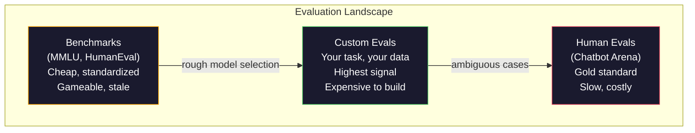
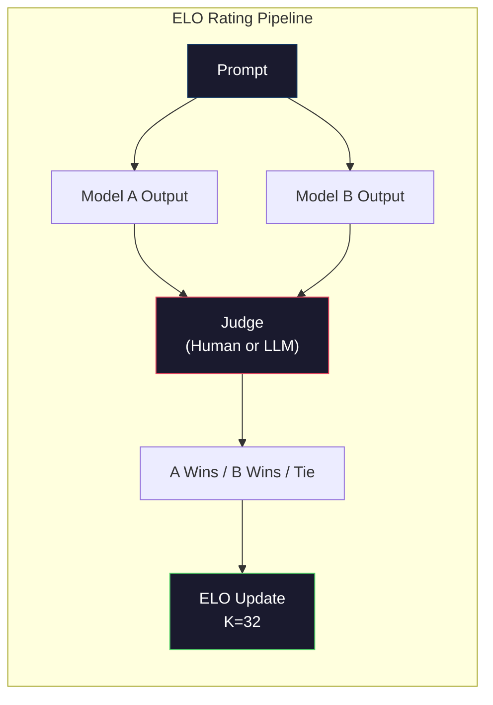

# Değerlendirme: Benchmarks, Evals, LM Harness

> Goodhart Kanunu: Bir ölçüm hedefe dönüştüğünde, iyi bir ölçüm olmaktan vazgeçirir. Her sınır laboratuvar oyunu referans değerleri. MMLU puanları yükselirken modeller hala "çilek"teki R sayısını güvenilir bir şekilde sayamazlar. Önemli olan tek değerlendirme, TAKKIN değerlendirme - TAKKIN, TAKKIN verileri ile.

> **【中文解读】**Eski bir belirtilmiş kural: Bir gösterge hedef olduğunda, artık iyi bir gösterge değildir. Önceki laboratuvarın yayım listesi, MMLU oranı artar, ancak model hala "çilek" içinde birkaç R vardır. Tek önemli değerlendirme kendi görev değerlendirmesidir.

> **【拓展：LLM评测→实际应用】**LLM 评测体系包括:MMLU (MMLU) 知识 (知识) 、HumanEval (HumanEval) 、MATH (Mathematics) 、Arena (Human Preference) ⋅ Ancak gerçek uygulamalarda en önemli olan kendi görev ve veri üzerinde test etmektir.

>  **【前置】**Önemli bir ders için ilk olarak öğrenmek için:Düyüm 10·01-05(LLM 基础);Düyüm 11·10(Önemlendirmek)

>  **【类比】**Genel referans değer = 全国高考(适合人,但和具体工作能力无关) ――自家 eval = 公司面试题 (株) ◎精准对应你的需求) ・选模型时高考分数 (MMLU) ◎初,最终要看面试 (株) ◎自家 eval) 表现──Goodhart 定律警告:刷高考分数的学生不一定工作能力强──

**Type:** Build
**Languages:** Python
**Prerequisites:** Phase 10, Lessons 01-05 (LLMs from Scratch)
**Time:** ~90 minutes

## Öğrenme hedefleri

- Çoklu seçim ve açık uç referansları ile dil modeline karşı çalışan özel bir değerlendirme harnesini oluşturun
  Constructing self-definition assessment tool, Language Model Operations Multi-selectional and Open-based KİPETT
- Standart referans değerlerinin (MMLU, HumanEval) neden doymuş ve sınır modelleri farklılaştıramadığını açıklayın
  解释为什么标准基准(MMLU、HumanEval) 会和且无法区分前沿模型
- Uygun ölçümlerle görev-özel değerlendirmeler uygula: tam eşleşme, F1, BLEU ve LLM-as-judge puanlaması
  实现带正确指标的任务特定评测:精确匹配、F1、BLEU 和 LLM-as-judge 评分
- Sadece kamu liderlik tablolarına güvenmek yerine özel kullanım durumunuza odaklanan özel bir değerlendirme kümesi tasarlayın
  Design specific use case's self-definition assessment kits, sadece kamu sıralamasına bağlı değil

> **【中文解读】**Bu ders odaklan LLM 评估的工程实践──核心观点:公共基准(MMLU、HumanEval) 和 tarafından 和,前沿模型的分数压缩在3 分范围内,差异是统计噪音而不是真实能力差──唯一重要的是你的任务、你的数据、你的失败模式下的评测──

## Sorunlar. Sorunlar.

MMLU, 2020 yılında 57 konu üzerinde 15.908 soru ile yayınlandı. Üç yıl içinde, sınır modelleri onu doydu. GPT-4 86,4% puan aldı. Claude 3 Opus 86,8% puan aldı. Llama 3 405B 88,6% puan aldı.

> MMLU 2020 yılında yayınlandı, 57 学科の 15,908 問題を含む. Üç yıl içinde, ön kenar modelde  ve                                                                                                                                                                                                                                                

Bu arada, aynı modeller 10 yaşındaki bir çocuğun düşünmeden yerine getirdiği görevlerde başarısız olurlar. Claude 3.5 Sonnet, MMLU'da %88,7 puan aldı. Başlangıçta "Strawberry" harflerini sayamıyordu. Bu bir görevdi. Dünyayı bilmemek ve akıl yürütmemek için sıfır bir şey gerektiriyordu. Sadece karakter düzeyinde tekrarlama. HumanEval 164 sorunla kod üretimi test ediyor. Modeller, %90'dan fazla puan alarak, hala herhangi bir genç geliştiricinin yakalayacağı uç durumlarda çöken kod üretmektedir.

> Bu arada, bu modeller 10 yaşındaki çocukların başarısızlıkla başaramayacaklarını düşünerek başarısız oldular. Claude 3.5 Sonnet MMLU %88.7 puan aldı, ancak başlangıçta "strawberry" içinde birkaç r'yi sayamadı. Bu görev herhangi bir dünya bilgisi veya düşünceye ihtiyaç duymadı, sadece karakter seviyesinde 代. HumanEval 164 sorularla test kod üretti. Model %90+ puan aldı, ancak yine de herhangi bir ilk sınıf geliştiricisinin yakalayabileceği kenar çöküş kodunu üretti.

Benchmark performansı ile gerçek dünya güvenilirliği arasındaki fark, LLM değerlendirme ile ilgili merkezi sorundur. Benchmarks size bir modelin benchmark üzerinde nasıl performans gösterdiğini söyler. Bu modelin belirli görevlerinizde, belirli verilerinizde, belirli başarısızlık modlarınızda nasıl performans göstereceği hakkında neredeyse hiçbir şey söylemezler. Müşteri desteği botunu oluşturursanız, MMLU önemsizdir. Eğer bir kod asistanı oluşturuyorsanız, HumanEval sadece fonksiyon düzeyinde jenerasyon kapsar -- dosyaların üzerinde hata düzeltme, yeniden faktörleme veya kod açıklama hakkında hiçbir şey söylemez.

> 基准 performansı ile gerçek dünya güvenilirliği arasındaki 沟是LLM 评估的核心问题――基准告诉你模型在基准上的表现――它们几乎没有说什么关于模型在你的具体任务,具体数据,具体失败模式下表现的信息―― Eğer bir müşteri desteği makinesi oluşturursanız, MMLU 无关紧要―― eğer bir kod asistanı oluşturursanız,HumanEval sadece işlevi aşamaları kapsar 对调试,重构或跨文件代码解释一无知――

Özel değerlendirmelere ihtiyacınız var. Benchmarks işe yaramaz olduğu için değil - kaba model seçimi için yararlıdırlar - ama nihai değerlendirme sizin yerleştirme koşullarınıza tam olarak uymalı olduğu için.

> Kılavuzların kullanılması gerekmiyor, çünkü temel değerlendirme, kargaşal model seçimi için yararlı değil, ama nihai değerlendirme, yerleşim koşullarına tam olarak uymalıdır.

> **【中文解读】**基准分数 ile gerçek dünya güvenilirliği arasındaki 沟 LLM 评估的核心问题──GPT-4 MMLU 86.4%、Claude 3 Opus 86.8%、Llama 3 405B 88.6%3 分差的差是统计噪音──但这些模型在"数草里有几个r"这样的简单任务上仍然失败──基准告诉你模型在基准上表现,几乎没有说什么关于它在你的具体任务上表现的信息──

> **【拓展：Arena 评测与 Elo 评分】**Chatbot Arena(LMSYS) Blind测 Elo 评分人类用户与两个匿名模型对话并投票选择更好的回复──这是目前公认的最可靠模型排名方式──GPT-4o、Claude 3.5 Sonnet、Gemini 1.5 Pro 在 Arena 上的 Elo 分数差距更真实地反映实际使用体验──

## Konsepten bir şey.

### Eval Manzarası

Her biri farklı maliyet ve sinyal kalitesi ile üç değerlendirme kategorisine ayrılmıştır.

> Üç sınıf değerlendirme vardır, her biri farklı maliyet ve sinyal kalitesi vardır.

**Benchmarks**Bu testler standartlaştırılmış test takımlarıdır. MMLU, HumanEval, SWE-bench, MATH, ARC, HellaSwag. Bir model ile referans değerine karşı çalıştırılır ve puan alırsınız. Avantaj: herkes aynı test kullanır, böylece modeller karşılaştırılabilir. Eksikliği: modeller ve eğitim verileri bu referans değerlerini giderek daha fazla kirletiyor. Laboratuvarlar referans soruları içeren veriler üzerinde eğitim alıyor. Notlar artıyor. Yeteneklilik olmayabilir.

> **基准**MMLU, HumanEval, SWE-bench, MATH, ARC, HellaSwag, You on a basis basis running model并获得分数.

**Custom evals**Bu test süitleri, belirli kullanım durumunuz için oluşturduğunuz test süitleri. Girişleri, beklenen çıkışları ve puanlama fonksiyonunu tanımlarsınız. Hukuki belge özetleyicisi yasal belgelere değerlendirilir. SQL jeneratörü veritabanı şeması üzerinde değerlendirilir. Bunlar oluşturmak pahalı ama üretim performansını tahmin eden tek değerlendirme onlardır.

> **自定义评估**Bu test süsülerin belirli bir kullanım için oluşturulduğu test süsüleri vardır. Giriş, İhtiyaç, İçelim ve Sınıf fonksiyonları tanımlanır.

**Human evals**Bu, bir diğer modelin değerlendirilmesi için kullanılacak bir araçtır. Bu araçlar, kullanılabilirlik, doğruluk, akıcılık ve güvenlik gibi kriterlere göre model sonuçlarını değerlendirmek için ücretli yorumcu kullanır.$0.10-$2.00'de) ve hız (saatler ve günler arasında).

> **人工评估**Uses pay tager based usefulness, correctness, flow, and safety e.g. standard evaluation model output. Bu, otomatik değerlendirmenin başarısız olduğu açık bir görev için altın standarttır. Chatbot Arena, 100+ model kapsamında 200 milyon kişilik tercih oylarını topladı.$0.10-$2.00) ve hız (((数小时到数天)



### Neden Değerlendirme Kayıpları

Üç mekanizma, referans puanlarının gerçek kapasiteyi yansıtmayı bırakmasına neden olur.

> Üç mekanizma, temel sınıfın gerçek kapasitesini yansıtmasına neden oluyor.

**Data contamination.**Eğitim kurumları internet'i kavrar. Benchmark soruları internette canlı yayımlanır. Modeller cevapları eğitim sırasında görür. Bu geleneksel anlamda aldatma değil - laboratuvarlar kasıtlı olarak referans verilerini içermez. Ama web ölçekli kavrama neredeyse dışlanmayı imkansız hale getirir.

> **数据污染。**訓練语料 from Internet 抓取──基准問題存在在互联网──模型在训练中看到了答案──これは传统意义上的欺骗ではない实验室は故意基准データを içermez──但是网络规模抓取使排除几乎不可能──

**Teaching to the test.**Laboratuvarlar, eğitim karışımlarını benchmark performans için optimize eder. Eğitim karışımının% 5'i MMLU tarzı çoklu seçim ise, model biçimi ve cevap dağılımını öğrenir. MMLU dört yönlü çoklu seçimdir.

> **应试训练。**实验室为基准性能优化训练混合――如果5%的训练混合是MMLU 风格的多选题,模型就学会了形式和答案分布――MMLU ise dört选一――模型学到答案分布大致均分布在A/B/C/D, hatta model bilmeyen cevapta tahmin etmeye yardımcı olur――

**Saturation.**Her sınır modeli bir referans değerinde 85-90% puan aldığında, referans ayrımcılığı durdurur. Geri kalan soruların 10-15%'i belirsiz, yanlış etiketlendirilmiş veya belirsiz alan bilgisi gerektirebilir. MMLU'da %87'den %89'a yükselmesi, modelin iki belirsiz soru daha akılda tutması anlamına gelebilir, daha akıllı hale gelmediği anlamına gelebilir.

> **饱和。**Önceki modellerin tüm temel noktada yüzde 85-90 puan aldığında, temel noktada artık fark yoktur. Geri kalan yüzde 10-15'in sorunu farklılık olabilir.

### Kafası karışık: Hızlı Bir Sağlık Kontrolü

Kafasızlık, bir modelin bir token dizisi tarafından ne kadar şaşırtıldığını ölçer.

> 困惑度測定模型对象序列的惊程度──形式上, it is an average negative对数似然的指数:

```
PPL = exp(-1/N * sum(log P(token_i | context)))
```

10'un karmaşıklığı, modelin her token pozisyonunda 10 seçenek arasında eşit seçimi kadar belirsiz olduğu anlamına gelir. Daha düşük daha iyidir. GPT-2 WikiText-103'de ~30'un karmaşıklığını alır. GPT-3 ~20'e ulaşır. Llama 3 8B ~7'e ulaşır.

> 困惑度 10 anlamlı model ortalaması olarak her bir simge 位置的不确定性等于在 10 个选项中均选择──越低越好──GPT-2 在 WikiText-103 上困惑度约30──GPT-3 约20──Llama 3 8B 约7──

Bir model, nadir ama önemli desenlerde kötüyken ortak desenleri tahmin ederek düşük karmaşıklığa sahip olabilir. Ayrıca talimatları takip etmek, akıl yürütmek veya gerçek doğruluğu hakkında hiçbir şey söylemez. Bunu bir akıl kontrolü olarak kullanın, son bir hüküm değil.

> 困惑度 aynı test kitlesinde bir model karşılaştırırken yararlıdır, ancak kör noktalar vardır. 困惑度 () model iyi tahmin düzenli bir şekilde düşük bir karışıklık elde edebilir, ancak nadir ama önemli bir düzen üzerinde çok düşük olabilir. 困惑度 () de talimatları izleme, düşünce veya gerçek doğruluğunu açıklayamaz.

### Yargıç olarak LLM

Güçlü bir model kullanın ve daha zayıf bir modelin çıkışını değerlendirin. Fikir basit: GPT-4o veya Claude Sonnet'e sorun. Doğru, yararlı ve güvenli bir cevap için 1-5 ölçeğinde bir cevap değerlendirsin. Bu, GPT-4o-mini ile bir yargı için yaklaşık 0.01 dolarlık bir değerlendirme ve insan yargılarıyla şaşırtıcı derecede iyi ilişkilidir.

> GPT-4o-mini ile her yargılama yaklaşık 0.01 dolar, insan yargıları ile ilişkisi iyi bir şekilde ortaya çıkıyor. Çoğu görevde yaklaşık %80 uyumluluk vardır.

Notlama sorunu, modelden daha önemlidir. Bilinmeyen bir sorunun ("Bu cevabı oranla") gürültülü skorlar üretir. Bir rubrika ile yapılandırılmış bir sorunun ("Ciddi bir cevap varsa 5 puan ve bir kaynağı belirtir, doğruysa 4 ama kaynaklanmamışsa, kısmen doğruysa 3 puan...") tutarlı, tekrarlanabilir puanlar üretir.

> 评分快速比模型更重要──模糊的快速("bu回复打分给这个回复打分") 杂的分数产生──带有评分标准的结构化快速(" eğer cevap gerçek doğru ise ve kaynaklı olarak 5 分, doğru ama kaynaklı olmayan şekilde 4 分,部分正确打 3 分...") 一致、可复现分数产生──

Başarısızlık modları: yargıç modelleri pozisyon tersi gösterir (bir çiftlik karşılaştırmalarda ilk tepkiyi tercih eder), sözcük tersi (uzun cevapları tercih eder) ve kendi tercihlerini (GPT-4 oranları GPT-4 çıkışları eşdeğer Claude çıkışlarından daha yüksektir).

> 失败模式:评审模型表现出位置偏见(成对比中偏好第一回复) 冗长偏见(偏好更长的回复) 和自我偏见(GPT-4 输出评分高于等价的Claude 输出) ◊缓解措施:随机化顺序、按长度归化、使用与被评审模型不同的评审──

### Çiftlik Karşılaştırmalar'dan ELO Notları

Chatbot Arena'nın yaklaşımı. Farklı modellerden aynı soruya iki yanıt göster. Bir insan (veya LLM yargıçı) daha iyi birini seçer. Bu binlerce karşılaştırmalardan, her model için ELO derecesini hesaplayın. Satrançta kullanılan aynı sistem.

> Chatbot Arena'nın yöntemleri:  göstermek farklı modellerden aynı istasyonun iki tekrarını görmektedir.  İnsanlık  veya LLM 评审) seçeneği daha iyi.  Her modelin ELO değerlendirmesi: 

ELO avantajları: nispet sıralama mutlak puanlamalardan daha güvenilirdir, bağları zarif bir şekilde ele alır ve her çıkışı bağımsız olarak puanlamanın daha az karşılaştırması ile birleşti. 2026'ın başından itibaren, Chatbot Arena sıralamaları GPT-4o, Claude 3.5 Sonnet ve Gemini 1.5 Pro'yu birbirinden 20 ELO puan içinde en üstte göstermektedir.

> ELO  avantaj:                                                                                                                                                                                                                                                             



### Eval Çerçeve

**lm-evaluation-harness**(EleutherAI): standart açık kaynak değerlendirme çerçevesidir. 200+ referans değerini destekler. Open LLM Leaderboard tarafından kullanılan bir komutla MMLU, HellaSwag, ARC vb. karşı herhangi bir Hugging Face modelini çalıştırın.

> **lm-evaluation-harness**(EleutherAI): standart open source评测框架──支持 200+基准──一条命令对任何 Hugging Face 模型运行 MMLU、HellaSwag、ARC等──Open LLM Leaderboard 使用──

**RAGAS**RAG boru hattları için özel olarak değerlendirme çerçevesidir. Dürüstlüğü ( cevabın alınan bağlamla uyumlu mu?), bağlamlılığı ( alınan bağlam soruya alakalı mı?), ve cevap doğruluğunu ölçer.

> **RAGAS**Bu nedenle, bu konuyla ilgili olarak, bu konuyla ilgili olarak, bu konuyla ilgili olarak, bu konuyla ilgili olarak, bu konuyla ilgili olarak, bu konuyla ilgili olarak, bu konuyla ilgili olarak, bu konuyla ilgili olarak, bu konuyla ilgili olarak, bu konuyla ilgili olarak, bu konuyla ilgili olarak, bu konuyla ilgili olarak, bu konuyla ilgili olarak, bu konuyla ilgili olarak, bu konuyla ilgili olarak, bu konuyla ilgili olarak, bu konuyla ilgili olarak, bu konuyla ilgili olarak, bu konuyla ilgili olarak, bu konuyla ilgili olarak, bu konuyla ilgili olarak, bu konuyla ilgili olarak, bu konuyla ilgili olarak, bu konuyla ilgili olarak, bu konuyla ilgili olarak, bu konuyla ilgili olarak, bu konuyla ilgili olarak, bu konuyla ilgili olarak, bu konuyla ilgili olarak, bu konuyla ilgili olarak, bu konuyla ilgili olarak, bu konuyla ilgili olarak, bu konuyla ilgili olarak, bu konuyla ilgili olarak, bu konuyla ilgili olarak, bu konuyla ilgili olarak, bu konuyla ilgili olarak, bu konuyla ilgili olarak, bu konuyla ilgili olarak, bu konuyla ilgili olarak, bu konuyuyuyuyuyuyuyuyuyuyuyuyuyuyuyuyuyuyuyuyuyuyuyuyuyuyuyuyuyuyuyuyuyuyuyuyuyuyuyuyuyuyuyuyuyuyuyuyuyuyuyuyuyuyuyuyuyuyuyuyuyuyuyuyuyuyuyuyuyuyuyuyuyuyuyuyuyuyuyuyuyuyuyuyuyuyuyuyuyuyuyuyuyuyuyuyuyuyuyuyuyuyuyuyuyuyuyuyuyuyuyuyuyuyuyuyuyuyuyuyuyuyuyuyuyuyuyuyuyuyuyuyuyuyuyuyuyuyuyuyuyuyuyuyuyuyuyuyuyuyuyuyuyuyuyuyuyuyuyuyuyuyuyuyuyuyuyuyuyuyuyuyuyuyuyuyuyuyuyuyuyuyuyuyuyuyuyuyuyuyuyuyuyuyuyuyuyuyuyuyuyuyuyuyuyuyuyuyuyuyuyuyuyuyuyuyuyuyuyuyuyuyuyuyuyu

**promptfoo**YAML'de test vakalarını tanımlayın, birden fazla modelle çalıştırın, bir geçiş/başarısızlık raporu alın. Geri dönüş test istekleri için yararlı - bir istekli değişiklik mevcut test vakalarını kırmaması için emin olun.

> **promptfoo**YAML'de test kullanım örneklerini tanımlamak, birçok model için çalışmak, geçiş/ başarısızlık raporları elde etmek, hızlı geri dönüş testlerini sağlamak için kullanılır.

### Özel Evaller Yapmak

Üretim için önemli olan tek değerlendirme.

> Ürün içinde tek önemli değerlendirme:

1. **Define the task.**"Soruları cevaplamak" çok belirsiz. "Bir müşteri şikayet e-postası verildiğinde, ürün adını, sorun kategorisini ve duygularını çıkarmak" değerlendirebileceğiniz bir görevdir.
   Çeviri: 1.**定义任务。**模型到底应该做什么? 应精确――"回答问题"太模糊――"给定客户投诉邮件,提取产品名称、问题类别和情感"                                                                                                                                                                                                                                         

2. **Create test cases.**Bir prototip eval için en az 50 , üretim için 200+. Her test vakaı bir (girin, beklenen_ürün) çifttir. Kenar vakaları dahil edin: boş girişler, karşıt girişler, belirsiz girişler, diğer dillerde girişler.
   Çeviri: 2**创建测试用例。**İlk tip değerlendirme en az 50'dir, üretimi 200+dır. Her test kullanımı örneği ise (input, 期望输出) ∼, kenar koşulları da dahil:空输入、对抗输入、有差义的输入、其他语言的输入──.

3. **Define scoring.**Yapılandırılmış çıkışlar için tam eşleşme. BLEU/ROUGE metin benzerliği için. LLM-as-judge açık kaliteli için. F1 çıkarma görevleri için.
   Çeviri: Çeviri: Çeviri: Çeviri: Çeviri: Çeviri: Çeviri: Çeviri: Çeviri: Çeviri: Çeviri: Çeviri: Çeviri: Çeviri: Çeviri: Çeviri: Çeviri: Çeviri: Çeviri: Çeviri: Çeviri: Çeviri: Çeviri: Çeviri: Çeviri: Çeviri: Çeviri: Çeviri: Çeviri: Çeviri: Çeviri: Çeviri: Çeviri: Çeviri: Çeviri: Çeviri: Çeviri: Çeviri: Çeviri: Çeviri: Çeviri: Çeviri: Çeviri: Çeviri: Çeviri: Çeviri: Çeviri: Çeviri: Çeviri: Çeviri: Çeviri: Çeviri: Çeviri: Çeviri: Çeviri: Çeviri: Çeviri: Çeviri: Çeviri: Çeviri: Çeviri: Çeviri: Çeviri: Çeviri: Çeviri: Çeviri: Çeviri: Çeviri: Çeviri: Çeviri: Çeviri: Çeviri: Çeviri: Çeviri: Çeviri: Çeviri: Çeviri: Çeviri: Çeviri: Çeviri: Çeviri: Çeviri: Çeviri: Çeviri: Çeviri: Çeviri: Çeviri: Çeviri: Çeviri Çeviri: Çeviri Çeviri Çeviri Çeviri Çeviri Çeviri Çeviri Çeviri Çeviri Çeviri Çeviri Çeviri Çeviri Çeviri Çeviri Çeviri Çeviri Çeviri Çeviri Çeviri Çeviri Çeviri Çeviri Çeviri Çeviri Çeviri Çeviri Çeviri Çeviri Çeviri Çeviri Çeviri Çeviri Çeviri Çeviri Çeviri Çeviri Çeviri Çeviri Çeviri Çeviri Çeviri Çeviri Çeviri Çeviri Çeviri Çeviri Çeviri Çeviri Çeviri Ç**定义评分。**结构化输出用精确匹配──文本相似度用 BLEU/ROUGE──开放式质量用 LLM-as-judge──抽取任务用 F1──组合多个指标并加权──

4. **Automate.**Her değerlendirme tek bir komutla çalışır. El adımları yoktur. Sonuçları zamanla karşılaştırmayı mümkün kılan bir formatta saklayın.
   Çeviri: Çeviri: Çeviri: Çeviri: Çeviri: Çeviri: Çeviri: Çeviri: Çeviri: Çeviri: Çeviri: Çeviri: Çeviri: Çeviri: Çeviri: Çeviri: Çeviri: Çeviri: Çeviri: Çeviri: Çeviri: Çeviri: Çeviri: Çeviri: Çeviri: Çeviri: Çeviri: Çeviri: Çeviri: Çeviri: Çeviri: Çeviri: Çeviri: Çeviri: Çeviri: Çeviri: Çeviri: Çeviri: Çeviri: Çeviri: Çeviri: Çeviri: Çeviri: Çeviri: Çeviri: Çeviri: Çeviri: Çeviri: Çeviri: Çeviri: Çeviri: Çeviri: Çeviri: Çeviri: Çeviri: Çeviri: Çeviri: Çeviri: Çeviri: Çeviri: Çeviri: Çeviri: Çeviri: Çeviri: Çeviri: Çeviri: Çeviri: Çeviri: Çeviri: Çeviri: Çeviri: Çeviri: Çeviri: Çeviri: Çeviri: Çeviri: Çeviri: Çeviri: Çeviri: Çeviri: Çeviri: Çeviri: Çeviri: Çeviri: Çeviri**自动化。**Her bir değerlendirme bir emir yürütülür.

5. **Track over time.**Bir değerlendirme puanı, tek başına anlamsızdır. Trend çizgisine ihtiyacınız var. Son çağrı değişiminden sonra puan iyileşti mi? Modeller değiştirildikten sonra geri mi düştü?
   Çeviri: 5**追踪趋势。**评测分数孤立看无意义──你需要趋势线── 上次提示更改后分数升升了吗?切换模型后退了吗?像版本化提示 一样版本化评测──

| Eval Type | Cost per judgment | Agreement with humans | Best for |
|-----------|------------------|----------------------|----------|
| Exact match / 精确匹配 | ~$0 | 100% (when applicable) / 100%（适用时） | Structured output, classification / 结构化输出、分类 |
| BLEU/ROUGE | ~$0 | ~60% | Translation, summarization / 翻译、摘要 |
| LLM-as-judge / LLM 评审 | ~$0.01 | ~80% | Open-ended generation / 开放式生成 |
| Human eval / 人工评估 | $0.10-$2.00 | N/A (is the ground truth) / N/A（即真实标准） | Ambiguous, high-stakes tasks / 有歧义、高风险任务 |

## Yapın.
```figure
perplexity-loss
```

## Yapın

### Adım 1: En az eşitlik çerçevesini oluşturmak

Temel soyutlamaları tanımlayın. Bir eval vaka bir giriş, beklenen bir çıkış ve bir seçeneği metadata dikt içerir. Bir skorlayıcı bir tahmin ve bir referans alır ve 0 ile 1 arasındaki bir puanı gönderir.

> 定義核心抽象──評测例有输入、期望输出和可选的元数据字典──評分器接受预测和参考并返回 0 到 1 之间的分数──

```python
import json
from collections import Counter

class EvalCase:
    def __init__(self, input_text, expected, metadata=None):
        self.input_text = input_text
        self.expected = expected
        self.metadata = metadata or {}

class EvalSuite:
    def __init__(self, name, cases, scorers):
        self.name = name
        self.cases = cases
        self.scorers = scorers

    def run(self, model_fn):
        results = []
        for case in self.cases:
            prediction = model_fn(case.input_text)
            scores = {}
            for scorer_name, scorer_fn in self.scorers.items():
                scores[scorer_name] = scorer_fn(prediction, case.expected)
            results.append({
                "input": case.input_text,
                "expected": case.expected,
                "prediction": prediction,
                "scores": scores,
            })
        return results
```

### Adım 2: İşlevleri değerlendirme

Tam eşleşme, F1 simülasyonu ve bir hakim olarak LLM puancı oluşturun.

> 构建精确匹配、代号 F1 和模拟的 LLM-as-judge 评分器──

```python
def exact_match(prediction, expected):
    return 1.0 if prediction.strip().lower() == expected.strip().lower() else 0.0

def token_f1(prediction, expected):
    pred_tokens = set(prediction.lower().split())
    exp_tokens = set(expected.lower().split())
    if not pred_tokens or not exp_tokens:
        return 0.0
    common = pred_tokens & exp_tokens
    precision = len(common) / len(pred_tokens)
    recall = len(common) / len(exp_tokens)
    if precision + recall == 0:
        return 0.0
    return 2 * (precision * recall) / (precision + recall)

def llm_judge_simulated(prediction, expected):
    pred_words = set(prediction.lower().split())
    exp_words = set(expected.lower().split())
    if not exp_words:
        return 0.0
    overlap = len(pred_words & exp_words) / len(exp_words)
    length_penalty = min(1.0, len(prediction) / max(len(expected), 1))
    return round(overlap * 0.7 + length_penalty * 0.3, 3)
```

### Adım 3: ELO derecelendirme sistemi

ELO güncellemeleri ile çiftli karşılaştırmalar uygulayın. Bu tam olarak Chatbot Arena'nın modelleri sıralamak için kullandığı sistemdir.

> 实现带 ELO 更新成对比较──这是Chatbot Arena'nın sıralama modeli için kullanılan sistemi──

```python
class ELOTracker:
    def __init__(self, k=32, initial_rating=1500):
        self.ratings = {}
        self.k = k
        self.initial_rating = initial_rating
        self.history = []

    def _ensure_player(self, name):
        if name not in self.ratings:
            self.ratings[name] = self.initial_rating

    def expected_score(self, rating_a, rating_b):
        return 1 / (1 + 10 ** ((rating_b - rating_a) / 400))

    def record_match(self, player_a, player_b, outcome):
        self._ensure_player(player_a)
        self._ensure_player(player_b)

        ea = self.expected_score(self.ratings[player_a], self.ratings[player_b])
        eb = 1 - ea

        if outcome == "a":
            sa, sb = 1.0, 0.0
        elif outcome == "b":
            sa, sb = 0.0, 1.0
        else:
            sa, sb = 0.5, 0.5

        self.ratings[player_a] += self.k * (sa - ea)
        self.ratings[player_b] += self.k * (sb - eb)

        self.history.append({
            "a": player_a, "b": player_b,
            "outcome": outcome,
            "rating_a": round(self.ratings[player_a], 1),
            "rating_b": round(self.ratings[player_b], 1),
        })

    def leaderboard(self):
        return sorted(self.ratings.items(), key=lambda x: -x[1])
```

### Dördüncü Adım: Kafası karışıklık hesaplama

Bu, bir olasılık dağılımıyla simüle ediliyor.

> Bu değerleri kullanmak için, bu değerleri kullanmak için, bu değerleri kullanmak için, bu değerleri kullanmak için, bu değerleri kullanmak için, bu değerleri kullanmak için, bu değerleri kullanmak için, bu değerleri kullanmak için, bu değerleri kullanmak için, bu değerleri kullanmak için, bu değerleri kullanmak için, bu değerleri kullanmak için kullanmak için, bu değerleri kullanmak için, bu değerleri kullanmak için kullanmak için, bu değerleri kullanmak için kullanmak için, bu değerleri kullanmak için kullanmak için, bu değerleri kullanmak için kullanmak için, bu değerleri kullanmak için kullanmak için, bu değerleri kullanmak için kullanmak için, bu değerleri kullanmak için kullanmak için, bu değerleri kullanmak için kullanmak için, bu değerleri kullanmak için kullanmak için, bu değerleri kullanmak için kullanmak için, bu değerleri kullanmak için kullanmak için, bu değerleri kullanmak için kullanmak için, bu değerleri kullanmak için kullanmak için kullanmak için,

```python
import numpy as np

def perplexity(log_probs):
    if not log_probs:
        return float("inf")
    avg_neg_log_prob = -np.mean(log_probs)
    return float(np.exp(avg_neg_log_prob))

def token_log_probs_simulated(text, model_quality=0.8):
    np.random.seed(hash(text) % 2**31)
    tokens = text.split()
    log_probs = []
    for i, token in enumerate(tokens):
        base_prob = model_quality
        if len(token) > 8:
            base_prob *= 0.6
        if i == 0:
            base_prob *= 0.7
        prob = np.clip(base_prob + np.random.normal(0, 0.1), 0.01, 0.99)
        log_probs.append(float(np.log(prob)))
    return log_probs
```

### Adım 5: Toplam Sonuçlar

Bir değerlendirme çalışması boyunca özetleme istatistiklerini hesaplayın: ortalama, ortalama, bir eşiğinde geçiş oranı ve per-metrik ayrıntılar.

> 計算評测运行的汇總计: 平均值、中位数、值通过率和每指标细分──

```python
def summarize_results(results, threshold=0.8):
    all_scores = {}
    for r in results:
        for metric, score in r["scores"].items():
            all_scores.setdefault(metric, []).append(score)

    summary = {}
    for metric, scores in all_scores.items():
        arr = np.array(scores)
        summary[metric] = {
            "mean": round(float(np.mean(arr)), 3),
            "median": round(float(np.median(arr)), 3),
            "std": round(float(np.std(arr)), 3),
            "min": round(float(np.min(arr)), 3),
            "max": round(float(np.max(arr)), 3),
            "pass_rate": round(float(np.mean(arr >= threshold)), 3),
            "n": len(scores),
        }
    return summary

def print_summary(summary, suite_name="Eval"):
    print(f"\n{'=' * 60}")
    print(f"  {suite_name} Summary")
    print(f"{'=' * 60}")
    for metric, stats in summary.items():
        print(f"\n  {metric}:")
        print(f"    Mean:      {stats['mean']:.3f}")
        print(f"    Median:    {stats['median']:.3f}")
        print(f"    Std:       {stats['std']:.3f}")
        print(f"    Range:     [{stats['min']:.3f}, {stats['max']:.3f}]")
        print(f"    Pass rate: {stats['pass_rate']:.1%} (threshold >= 0.8)")
        print(f"    N:         {stats['n']}")
```

### Adım 6: Tam boru hattını çalıştır

Bir görevi tanımlayın, test vakaları oluşturun, iki model simüle edin, değerlendirme çalıştırın, çiftliksel karşılaştırmalar üzerinden ELO hesaplayın ve sıralama tablosunu yazdırın.

> Tüm bölümleri birleştirmek, görevleri tanımlamak, test kullanımı örnekleri oluşturmak, iki model oluşturmak, değerlendirmeleri yürütmek, ELO'yu hesaplamak ve sıralamaları basmak.

```python
def demo_model_good(prompt):
    responses = {
        "What is the capital of France?": "Paris",
        "What is 2 + 2?": "4",
        "Who wrote Hamlet?": "William Shakespeare",
        "What language is PyTorch written in?": "Python and C++",
        "What is the boiling point of water?": "100 degrees Celsius",
    }
    return responses.get(prompt, "I don't know")

def demo_model_bad(prompt):
    responses = {
        "What is the capital of France?": "Paris is the capital city of France",
        "What is 2 + 2?": "The answer is four",
        "Who wrote Hamlet?": "Shakespeare",
        "What language is PyTorch written in?": "Python",
        "What is the boiling point of water?": "212 Fahrenheit",
    }
    return responses.get(prompt, "Unknown")

cases = [
    EvalCase("What is the capital of France?", "Paris"),
    EvalCase("What is 2 + 2?", "4"),
    EvalCase("Who wrote Hamlet?", "William Shakespeare"),
    EvalCase("What language is PyTorch written in?", "Python and C++"),
    EvalCase("What is the boiling point of water?", "100 degrees Celsius"),
]

suite = EvalSuite(
    name="General Knowledge",
    cases=cases,
    scorers={
        "exact_match": exact_match,
        "token_f1": token_f1,
        "llm_judge": llm_judge_simulated,
    },
)

results_good = suite.run(demo_model_good)
results_bad = suite.run(demo_model_bad)

print_summary(summarize_results(results_good), "Model A (concise)")
print_summary(summarize_results(results_bad), "Model B (verbose)")
```

"İyi" modeli tam cevaplar verir. "Kötü" modeli sözlü parafrases verir. Tam eşleşme sözlü modeli şiddetle cezalandırır. F1 simgesi ve yargıç olarak LLM daha bağışlayıcıdır. Bu, ölçüm seçiminin neden önemli olduğunu gösterir: aynı model, nasıl puan aldığımıza bağlı olarak harika veya korkunç görünüyor.

> "iyi" modeli kesin bir cevap veriyor. "kötü" modeli uzun bir cevap veriyor. "kötü" modeli sert bir ceza veriyor.

### Adım 7: ELO Turnuvası

Çoklu turlar boyunca modeller arasında çiftlik karşılaştırmalar yapın.

> Bu nedenle, bu durumun bir diğer nedeni de daha fazla bir gelişme göstermek.

```python
elo = ELOTracker(k=32)

for case in cases:
    pred_a = demo_model_good(case.input_text)
    pred_b = demo_model_bad(case.input_text)

    score_a = token_f1(pred_a, case.expected)
    score_b = token_f1(pred_b, case.expected)

    if score_a > score_b:
        outcome = "a"
    elif score_b > score_a:
        outcome = "b"
    else:
        outcome = "tie"

    elo.record_match("model_a_concise", "model_b_verbose", outcome)

print("\nELO Leaderboard:")
for name, rating in elo.leaderboard():
    print(f"  {name}: {rating:.0f}")
```

### Adım 8: Kafası karışıklık

Farklı kalite seviyelerindeki "modeller" arasında karmaşıklığı karşılaştırın.

> Farklı kalite seviyelerindeki "model"in karışıklığı:

```python
test_text = "The quick brown fox jumps over the lazy dog in the garden"

for quality, label in [(0.9, "Strong model"), (0.7, "Medium model"), (0.4, "Weak model")]:
    log_probs = token_log_probs_simulated(test_text, model_quality=quality)
    ppl = perplexity(log_probs)
    print(f"  {label} (quality={quality}): perplexity = {ppl:.2f}")
```

## Çerçeveyi kullanın.

### değerlendirme aletleri (EleutherAI)

Herhangi bir modelde referans değerlerini çalıştırmak için standart araç.

> Herhangi bir model üzerinde çalışmak için temel standart araçlar.

```python
# pip install lm-eval
# Command line:
# lm_eval --model hf --model_args pretrained=meta-llama/Llama-3.1-8B --tasks mmlu --batch_size 8

# Python API:
# import lm_eval
# results = lm_eval.simple_evaluate(
#     model="hf",
#     model_args="pretrained=meta-llama/Llama-3.1-8B",
#     tasks=["mmlu", "hellaswag", "arc_easy"],
#     batch_size=8,
# )
# print(results["results"])
```

### promptfoo

Hızlı mühendislik için yapılandırma yönlendirilen değerlendirme. YAML'de testleri tanımlayın ve birden fazla sağlayıcıya karşı çalıştırın.

> 配置驱动的提示 工程评测── YAML'de tanımlanmış test并多供应商运行──

```yaml
# promptfoo.yaml
providers:
  - openai:gpt-4o-mini
  - anthropic:claude-3-haiku

prompts:
  - "Answer in one word: {{question}}"

tests:
  - vars:
      question: "What is the capital of France?"
    assert:
      - type: contains
        value: "Paris"
  - vars:
      question: "What is 2 + 2?"
    assert:
      - type: equals
        value: "4"
```

### RAG değerlendirmesi için RAGAS

```python
# pip install ragas
# from ragas import evaluate
# from ragas.metrics import faithfulness, answer_relevancy, context_precision
#
# result = evaluate(
#     dataset,
#     metrics=[faithfulness, answer_relevancy, context_precision],
# )
# print(result)
```

RAGAS, genel değerlendirmelerin neyi eksik ettiğini ölçer: modelin cevabının alınan bağlamda yer aldığı, sadece cevabın soyut olarak "sağ" olup olmadığını değil.

> RAGAS 测量通用评测遗漏的东西:模型的答案是否基于查询上下文,而不是仅仅是答案在抽象意义上是否"正确"――

## İndirin . Ürünler .

Bu ders bize çok yararlı .`outputs/prompt-eval-designer.md`-- herhangi bir görev için özel değerlendirme süitlerini tasarlayan tekrar kullanılabilir bir istek. Ona bir görev açıklaması verin ve test vakaları, puanlama işlevleri ve geçme/başarısızlık eşiği önerisi üretir.

> 本课产 出 `outputs/prompt-eval-designer.md` Bir tekrarlanabilir istek, herhangi bir görev için tasarlanmış kendiliğinden tanımlanmış değerlendirme kitlesi。 verilen görev açıklaması, test kullanım örnekleri oluşturur、 değerlendirme işlevi ve geçiş/ başarısızlık  değer önerisi。

Ayrıca üretir `outputs/skill-llm-evaluation.md`-- görev türüne, bütçenize ve gecikme gereksinimlerine göre doğru değerlendirme stratejisini seçmek için bir karar çerçevesini.

> Üretim`outputs/skill-llm-evaluation.md` Görev türüne, bütçeye ve gecikme gereksinimlerine dayanarak doğru değerlendirme stratejileri için karar çerçevesini seçmek.

## Egzersizler.

1. Aynı girişleri model boyunca 5 kez çalıştıran ve çıkışların ne sıklıkla eşleştiğini ölçen bir " tutarlılık " puanlayıcıyı ekleyin. Deterministik girişler üzerinde tutarlı olmayan cevaplar kırılgan istekleri veya yüksek sıcaklık ayarlarını ortaya çıkarır.
   Çinçe çevirisi: "hükümlilik" değerlendiricisini ekle, aynı giriş model çalışması 5 kez ve ölçüm çıkış eşleşen sıklıkta olacaktır.

2. ELO izleyicisini birden fazla yargıç fonksiyonunu desteklemek için genişletin (exact match, F1, LLM-as-judge) ve ağırlıklandırın.
   Çinçe Çevirimi: Extendre ELO 跟踪器支持多种评审函数(精确匹配、F1、LLM-as-judge)并加权──比较重度加权精确匹配与重度加权 F1 时排行榜如何变化──

3. Özel bir görev için bir eval suite oluşturun: e-posta sınıflandırması 5 kategoride. Kısayol vakaları (birden fazla kategorilere ait olabilecek e-postalar, boş e-postalar, diğer dillerde e-postalar) dahil olmak üzere çeşitli örneklerle 100 test vakaları oluşturun. Farklı "modellerin" (kurallara dayalı, anahtar kelime eşleşimi, simüle edilen LLM) performansını ölçün.
   Çinçe Çevirimi: belirli görevler için yapılandırma değerlendirmeler:邮件分为5类. 100 测试用例创建,包括多样例和边缘情况.

4. Kirlilik tespitini uygulayın: bir dizi değerlendirme sorusu ve bir eğitim korpusuna göre, eğitim verilerinde değerlendirme sorularının (veya yakın parafrases) ne kadar yüzdesi bulunduğunu kontrol edin.
   Çinçe çevirisi: 污染检测:给定一组评测问题和训练语料,检查多少百分比的评测问题 (污染检测)  (污染检测)  (污染检测:给定一组评测问题和训练语料,检查多少百分比的评测问题,检查多少百分比的评测问题,检查多少百分比的评测问题,检查多少百分比的评测问题,检查多少百分比的评测问题,检查多少百分比的评测问题,检查多少百分比的评测问题,检查多少百分比的评测问题,检查多少百分比的评测问题,检查多少百分比的评测问题,检查多少百分比的评测问题,检查多少百分比的评测问题,检查多少百分比的评测方法,检查人员审计的有效性方法,

5. "Model Diff" aracı oluşturun. İki model sürümünden değerlendirme sonuçlarını göz önüne alarak, hangi özel test durumlarının iyileştiğini, hangilarının geri döndüğünü ve hangilarının aynı kalıpta kaldığını belirleyin. Bu, bir değişimin yarattığını veya zarar verdiğini anlamak için gerekli olan bir kod farklılığı değerlendirme eşdeğeri.
   Çin dilinde: yapılandırma "model diff" aracı. İki model sürümünün değerlendirmelerini belirle, hangi test kullanım örnekleri iyileştirilmiş, hangi adımlar geriye gitmiştir, hangi değişiklikler kalmamıştır. Bu değerlendirmenin kodunun farkı değişimi anlaması yardımcı veya zararlı bir anahtardır.

## Anahtar Şartlar .

| Term | What people say | What it actually means | 中文释义 |
|------|----------------|----------------------|---------|
| MMLU | "The benchmark" | Massive Multitask Language Understanding -- 15,908 multiple choice questions across 57 subjects, saturated above 88% by 2025 | 大规模多任务语言理解，57 科目 15908 题选择题 |
| HumanEval | "Code eval" | 164 Python function-completion problems from OpenAI, tests only isolated function generation | 代码评估，164 个 Python 函数补全题 |
| SWE-bench | "Real coding eval" | 2,294 GitHub issues from 12 Python repos, measures end-to-end bug fixing including test generation | 真实编码评估，2294 个 GitHub issue 端到端修复 |
| Perplexity | "How confused the model is" | exp(-avg(log P(token_i given context))) -- lower means the model assigns higher probability to the actual tokens | 困惑度，越低表示模型预测越准确 |
| ELO rating | "Chess ranking for models" | A relative skill rating computed from pairwise win/loss records, used by Chatbot Arena to rank 100+ models | Elo 等级分，来自成对比较的相对技能评分 |
| LLM-as-judge | "Using AI to grade AI" | A strong model scores a weaker model's outputs against a rubric, ~80% agreement with human judges at ~$0.01/judgment | LLM 评审，用强模型给弱模型打分，约 $0.01/次 |
| Data contamination | "The model saw the test" | Training data includes benchmark questions, inflating scores without improving real capability | 数据污染，训练数据包含基准题目 |
| Eval suite | "A bunch of tests" | A versioned collection of (input, expected_output, scorer) triples that measure a specific capability | 评测套件，版本化的测试集合 |
| Pass rate | "What percentage it gets right" | Fraction of eval cases scoring above a threshold -- more actionable than mean score because it measures reliability | 通过率，得分超过阈值的用例比例 |
| Chatbot Arena | "Model ranking website" | LMSYS platform with 2M+ human preference votes, producing the most trusted LLM leaderboard via ELO ratings | Chatbot Arena，200 万+人类偏好投票的模型排名平台 |

## Daha fazla okumak

- [Hendrycks et al., 2021 -- "Measuring Massive Multitask Language Understanding"](https://arxiv.org/abs/2009.03300)-- MMLU makalesi, still the most cited LLM benchmark despite its saturation
- [Chen et al., 2021 -- "Evaluating Large Language Models Trained on Code"](https://arxiv.org/abs/2107.03374)-- OpenAI'den HumanEval makalesi, kurulan kod üretimi değerlendirme metodolojisi
- [Zheng et al., 2023 -- "Judging LLM-as-a-Judge"](https://arxiv.org/abs/2306.05685)-- pozisyon ve sözcüksellik önyargısı bulguları dahil olmak üzere LLM'leri değerlendirmek için LLM'lerin kullanılması sistematik analiz
- [LMSYS Chatbot Arena](https://chat.lmsys.org/)-- 2M+ oyları olan, gerçek dünyadaki en güvenilir LLM sıralaması
