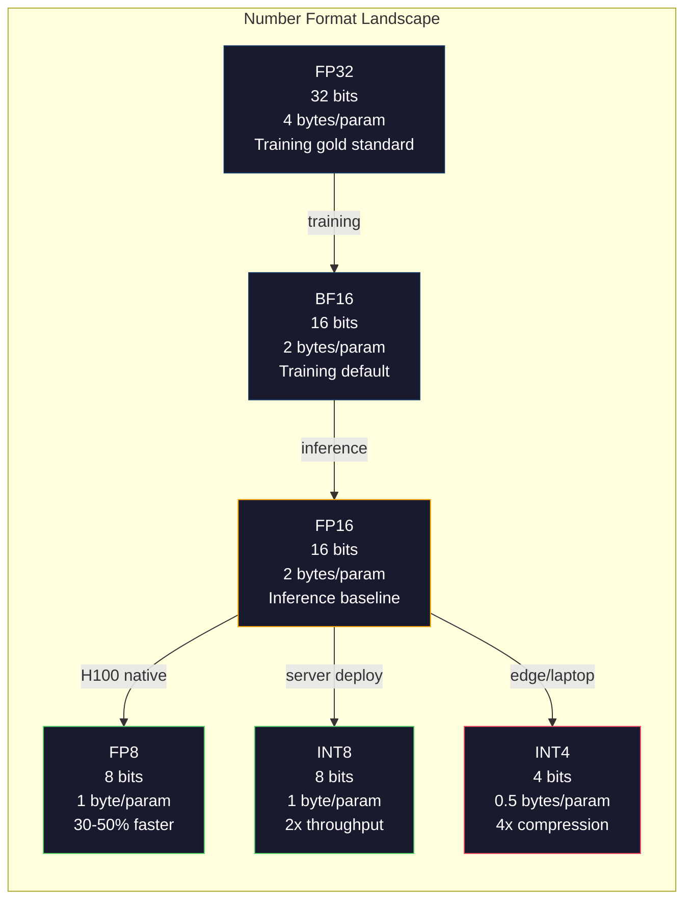
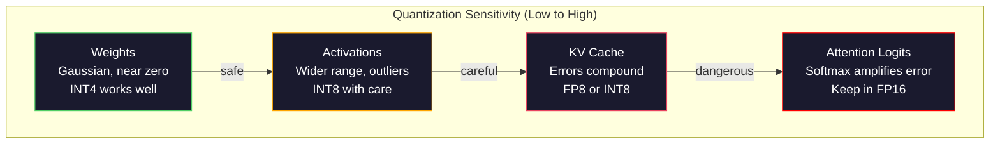
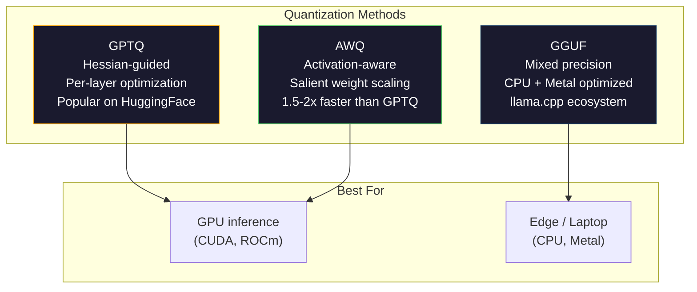

# Kvantisa: Modellerin Uygunlaşması

> FP16'da 70B modeline 140GB lazım. İki A100 sadece ağırlık için. FP8'e kadar miktarlandırın. Bir 80GB GPU. INT4: bir MacBook.

> **【中文解读】**70 milyar parametre modeli FP16'da 140GB 显存 (German) 需要[1][2] A100) ◊ FP8'e kadar ölçülmesi için sadece 80GB GPU'ya kadar ölçülmesi gerekir, INT4'e kadar ölçülmesi için MacBook'ta çalışabilmesi gerekir.

> **【拓展：量化→llama.cpp/GGUF】**llama.cpp 和 GGUF 格式使大模型能在消费级硬件上运行──GPTQ、AWQ、GGUF等量化方法是将70B+ 模型部署到本地设备的关键──理解量化是理解大模型部署的基础──

>  **【前置】**Öğrenci bölümleri önce öğrenmek için:Fase 10·01-10;L.L.M. 基础);浮点数表示(FP32/FP16/BF16/INT8/INT4);numpy 矩阵运算。

>  **【类比】**量化 = 压缩图片──原照片(FP16) 像素 başına 16 位,肉眼分辨不出和 8 位(FP8) 差,但文件大小一半──再压到4 位──INT4) 肉眼开始看到(精度损失),但文件小4 倍──模型量化同理:FP16→INT4 大小变 1/4,性能损失通常 <5%──GGUF 格式让你在 MacBook 上跑 Llama-70B──

**Type:** Build
**Languages:** Python (with numpy)
**Prerequisites:** Phase 10, Lessons 01-10 (LLMs from Scratch)
**Time:** ~120 minutes

## Öğrenme hedefleri

- Simetrik ve asimetrik kuantitasyon uygulamak, FP16'dan INT8 ve INT4'e kadar, ayrıca per-tensor ve per-kanal ölçeklendirme
  FP16'dan INT8 ve INT4'e doğru, ayrıca zaman ve zaman kapsamında kısaltma ile birlikte,
- Kvantisajdan gelen hafıza tasarrufu hesaplanıp belirli bir GPU'nun VRAM'ına hangi hassaslığın uygun olduğunu belirleyin
  計算量化顯存節省量, belirlenen GPU 顯存適度in doğruluğunu belirlemek
- Eğitim sonrası kuantitasyon (PTQ) ve kuantitasyon farkındalık eğitimi (QAT) arasındaki farkı açıklayın.
  解释训练后量化(PTQ) ve量化感知训练(QAT) arasındaki fark
- Gerçek bir modeli kuantitasyonlandırmak ve doğruluk-hüyeleme pazarlamasını bir referans değerinde ölçmek için GPTQ veya AWQ uygulayın
   GPTQ veya AWQ  ölçümsel gerçek model, ve temel olarak ölçüm doğruluk-arıza ağırlığı

> **【中文解读】**Bu ders, ölçümsellik tekniğini  hassaslık değişimi belirtilir ve hız kullanmak için kullanılmıştır.

## Sorunlar. Sorunlar.

Llama 3 70B'nin 70 milyar parametri var. Her parametre 16 bit yüzen nokta numarası. 140 milyar byte. 140 GB. Tek bir A100'in 80 GB VRAM'ı vardır. Tek bir GPU'da ağırlıkları yükleyemezsiniz, daha az da çıkarım yapamazsınız. Sadece bir model hizmet etmek için her biri 2 $ / saatlik iki A100'e ihtiyacınız var.

> Llama 3 70B 700 milyar parametre vardır. Her parametre 16 bit浮点数 vardır. Yani 1400 milyar by节, 140 GB.

Ancak her parametre 16 bit çok fazla zaman kaybı. Nöral ağ kümesindeki çoğu ağırlık sıfırın yakınında. FP16'ın tüm dinamik aralığı (0.000000059'dan 65.504) neredeyse tamamen kullanılmamıştır. Llama 3 70B'deki ağırlıkların gerçek dağılımını ölçerseniz, bunların %95'i -0.1 ile +0.1 arasında düşer.

> Ancak her parametre 16 bit kaybeden bir şey. Nörolojik ağlarda çoğu ağırlık neredeyse sıfır civarında toplanır. FP16'ın tam hareketli boyutu ise neredeyse tamamen kullanılmıyor. Llama 3 70B'nin ağırlık real dağılımını ölçerseniz, %95 -0.1 ile +0.1 arasında düşüyor.

Kvantisaj, yüksek hassaslıklı sayıların yerini daha düşük hassaslıklı sayılara alır. FP16 ile FP8 hafıza yarıya kesilir. FP16 ile INT4 arasında ise dörtte bir kısım kesilir. 140 GB model 35 GB olur. Tek bir tüketici GPU'ya uyar. 2 bitli kuantisaj (agresif, kayblı, ancak bazı görevler için kullanılabilir) yaptırın ve aynı model 16 GB dizüstü bilgisayarda çalışır.

> 量化用低精度数字替代高精度数字──FP16〜FP8 减半显存──FP16〜INT4 减至四分之一──140GB 模型成35GB──可放入单张消费级 GPU──推至2位量化(激进的、有损的,但可用于某些任务),同一模型可在16GB 笔记本上运行──

Bu nedenle, bu bilgiyi çıkarmak için kullanılan bir araç, bir araç veya bir araç veya bir araç veya bir araç veya bir araç veya bir araç veya bir araç veya bir araç veya bir araç veya bir araç veya bir araç veya bir araç veya bir araç veya bir araç veya bir araç veya bir araç veya bir araç veya bir araç veya bir araç veya bir araç veya bir araç veya bir araç veya bir araç veya bir araç veya bir araç veya bir araç veya bir araç veya bir araç veya bir araç veya bir araç veya bir araç veya bir araç veya bir araç veya bir araç veya bir araç veya bir araç veya bir araç veya bir araç veya bir araç veya bir araç veya bir araç veya bir araç veya bir araç veya bir araç veya bir araç veya bir araç veya bir araç veya bir araç veya bir araç veya bir araç veya bir araç veya bir araç veya bir araç veya bir araç veya bir araç veya bir araç veya bir araç veya bir araç veya bir araç veya bir araç veya bir araç veya bir araç veya bir araç veya bir araç veya bir araç veya bir araç veya bir araç veya bir araç veya bir araç veya bir araç veya bir araç veya bir araç veya bir araç veya bir araç veya bir araç veya bir araç veya bir araç veya bir araç veya bir araç veya bir araç veya bir araç veya bir araç veya bir araç veya bir araç veya bir araç veya bir araç veya bir araç veya bir araç veya bir araç veya bir araç veya bir araç veya bir araç veya bir araç veya bir araç veya bir aracı olarak kullanır veya bir şekilde kullanır.

> 代価は精度──毎移除一人一都破壊信息── soru, ne kadar精度 kaybettiniz ve nerede kaybettiniz. 量化 INT4 modelinin çoğunlukta temel olarak orijinal kalitenin %95-99'unu koruduğu noktasındadır.

GPTQ ile Llama 3 ile INT4 arasındaki toplumsal kvantizasyonlar, WikiText'te kaybedilen yaklaşık 1-2 karmaşıklık noktasını gösterir. Mistral, MMLU'da sıfır ölçülebilir kalite kaybı ile Mixtral 8x22B'nin FP8 kontrol noktalarını yayınladı. GGUF biçimi llama.cpp'i güçlendirir, M serisi çipleri olan MacBooks'larda 70B modellerini çalıştırır. Kvantizasyon bir hack değildir. 7B'den büyük her model için standart dağıtım yolu.

> 社区GPTQ ile Llama 3'ü INT4'e ölçecek, WikiText'te sadece 1-2 个困惑度点──Mistral Mixtral 8x22B'nin FP8 kontrol noktasını yayınladı, MMLU'da neredeyse sıfır kalitede kayıplar──GGUF biçimi sürücü llama.cpp, MacBook M serisi çiplerinde çalışan 70B model── ölçeğin hack edilmemesi── her 7B'den fazla modelin standart dağıtım yolu vardır──

> **【中文解读】**FP16'da her parametre 16 bit,70B modelinde 140GB'ye ihtiyaç vardır. Ama %95'in ağırlığı -0.1 ile +0.1 arasında yoğunlaşır. Bu değerlerin çok fazla harcanmış olduğunu ifade eden 16 bit kullanılarak FP16'da bu değerlerin değerleri azaltılır.

> **【拓展：量化生态】**量化生态 çok gelişmiş:GPTQ(gönüllü ikinci aşamalı bilgiyi aşamalı olarak 量化) 、AWQ(aktif algılama hakı 量化, protecting salient 权重) 、GGUF(llama.cpp'in量化 biçimi, 2-8 bit 混合精度) ✿llama.cpp 让70B 模型在MacBook M 系列芯片上运行,催生了本地大模型部署的生态;;Ollama、LM Studio等) ✿

## Konsepten bir şey.

### Sayı biçimleri: Her bitin ne işi var

Her kaygan nokta sayısının üç parçası vardır: işaret, gösterge ve mantissa (yani anlamlı olarak da adlandırılır). İşaret bir bittir. gösterge aralığı belirler (sayın ne kadar büyük veya küçük olabileceğini). mantissa hassasiyetini belirler (ne kadar onluk yerine ulaşabilirsiniz).

> Her bir taşınma noktası üç bölümüne sahiptir: 符号、指数和尾数(ya da geçerli sayı olarak adlandırılır) ・・・ 符号占者──指数决定范围(数可以多大或多小) ・・・尾数决定精度(有多少位小数) ・・・

```
FP32:  [1 sign] [8 exponent] [23 mantissa]  = 32 bits
FP16:  [1 sign] [5 exponent] [10 mantissa]  = 16 bits
BF16:  [1 sign] [8 exponent] [7  mantissa]  = 16 bits
FP8:   [1 sign] [4 exponent] [3  mantissa]  = 8  bits (E4M3)
FP8:   [1 sign] [5 exponent] [2  mantissa]  = 8  bits (E5M2)
INT8:  [1 sign] [7 value]                   = 8  bits (uniform steps)
INT4:  [1 sign] [3 value]                   = 4  bits (16 levels total)
```

**FP32**23 mantissa bit yaklaşık 7 onluk rakamını verir. aralığı: yaklaşık 1.2 x 10^-38 ile 3.4 x 10^38.

> **FP32**Bu nedenle, bu programın en iyi yönü, bu programın en iyi yönü ve en iyi yönü, bu programın en iyi yönü ve en iyi yönüdür.

**FP16**10 mantissa bit yaklaşık 3.3 onluk rakam verir. Eksponent 5 bit'e kadar küçülür ve aralığı çarpıcı bir şekilde azaltır (maksimum değer ~65,504). Bu, ağırlıklar için iyi (sıfırın yakınında toplananlar), ancak eğitim sırasında tırmanıp çıkabilecek aktivasyonlar ve gradientler için tehlikelidir. FP16 eğitiminde aşağı akışın önlenmesi için kayıp ölçeklemesini gerektirir.

> **FP16**Bu, ağırlık kaybı sorunudur, ancak eğitim sırasında aktifleşme ve yükselme seviyesi tehlikelidir.

**BF16**(Beyin yüzerek 16) 8 bitli göstergeyi FP32'den tutar ama mantissa'yı 7 bitle küçültür. FP32 ile aynı aralığı, FP16'dan daha az hassaslık. Google bunu özellikle derin öğrenme için tasarladı. İntüyüsyon: Nöral ağlar için mesafe, hassasiyetten daha önemlidir. FP16'da sıfıra doğru akışan 10^-20 bir eğilimi BF16'da hayatta kalır. BF16'da 0.07342'e doğru yuvarlanan bir ağırlık yeterince yakın. Her modern eğitim koşusu BF16 veya BF16/FP32 karışımı kullanır.

> **BF16**(Brain Float 16) FP32'nin 8 bit endeksini koruyacak ama son sayısı 7 bitlere düşecek. FP32'ye kıyasla, FP16'dan daha düşük bir doğruluk vardır. Google, derin öğrenme tasarımına özel olarak bakıyor.

**FP8**E4M3 (4 eksponent, 3 mantissa) sonucu çıkarma sırasında ağırlıklar ve aktivasyonlar için kullanılır. E5M2 (5 exponent, 2 mantissa) aralığın hassaslıktan daha önemli olduğu eğitim sırasında gradientler için kullanılır. H100 GPU'larda FP8 sonucu, ihmal edilebilir kalite kaybı ile FP16'a göre 30-50% hızlandırmayı sağlar.

> **FP8**E4M3;; 4 ̊ ̊ ̊ ̊ ̊ ̊ ̊ ̊ ̊ ̊ ̊ ̊ ̊ ̊ ̊ ̊ ̊ ̊ ̊ ̊ ̊ ̊ ̊ ̊ ̊ ̊ ̊ ̊ ̊ ̊ ̊ ̊ ̊ ̊ ̊ ̊ ̊ ̊ ̊ ̊ ̊ ̊ ̊ ̊ ̊ ̊ ̊ ̊ ̊ ̊ ̊ ̊ ̊ ̊ ̊ ̊ ̊ ̊ ̊ ̊ ̊ ̊ ̊ ̊ ̊ ̊ ̊ ̊ ̊ ̊ ̊ ̊ ̊ ̊ ̊ ̊ ̊ ̊ ̊ ̊ ̊ ̊ ̊ ̊ ̊ ̊ ̊ ̊ ̊ ̊ ̊ ̊ ̊ ̊ ̊ ̊ ̊ ̊ ̊ ̊ ̊ ̊ ̊ ̊ ̊ ̊ ̊ ̊ ̊ ̊ ̊ ̊ ̊ ̊ ̊ ̊ ̊ ̊ ̊ ̊ ̊ ̊ ̊ ̊ ̊ ̊ ̊ ̊ ̊ ̊ ̊ ̊ ̊ ̊ ̊ ̊ ̊ ̊ ̊ ̊ ̊ ̊ ̊ ̊ ̊ ̊ ̊ ̊ ̊ ̊ ̊ ̊ ̊ ̊ ̊ ̊ ̊ ̊ ̊ ̊ ̊ ̊ ̊ ̊ ̊ ̊ ̊ ̊ ̊ ̊ ̊ ̊ ̊ ̊ ̊ ̊ ̊ ̊ ̊ ̊ ̊ ̊ ̊ ̊ ̊ ̊ ̊ ̊ ̊ ̊ ̊ ̊ ̊ ̊ ̊ ̊ ̊ ̊ ̊ ̊ ̊ ̊ ̊ ̊ ̊ ̊ ̊ ̊ ̊     ̊                                                                                

**INT8**Bu aralıkta yüzen nokta ağırlıklarını harcama için bir ölçek faktörü gerekir. avantaj: tam sayı aritmetikleri yüzen noktalardan daha hızlı ve daha verimli. A100'de INT8 matris çarpımı 624 TOPS ile FP16 için 312 TFLOPS ile çalışır.

> **INT8**Bu, bir bütün sayı biçimidir. İndekssiz, son sayı değildir. Sadece 256                                                                                                                                                                                                                                                                                                                                                                                                                                                                                                          

**INT4**Bu, sadece 16 değerden daha ileriye doğru ilerlemektedir. Ölçü faktörü ağırlık kaldırır. Kalite tamamen ölçeği nasıl seçtiğine ve hangi ağırlıkları kuantiste ettiğine bağlıdır. En son INT4 yöntemleri (GPTQ, AWQ) orijinal model kalitesinin %95'ini koruyor.

> **INT4**Daha da ileriye kadar, sadece 16 个可能值, 缩放因子承担重任, 质量 tamamen, 缩放比例和量化权的如何选择, 权重的决定.



### Kvantizasyon Nasıl Çalışır

Temel işlem basit. Bir kaygan nokta değerlerinin tensörünü alın, bir ölçek faktörü bulun, çarpın, en yakın tam sayıya yuvarlayın ve tam sayıları artı ölçek faktörü kaydetin.

> 核心操作很简单──取一个浮点值张量,找到缩小因子,乘以它,四舍五进到最近整数,然后存储整数加上缩小因子──

**Quantize:**
```
scale = max(abs(tensor)) / max_int_value
quantized = round(tensor / scale)
```

**Dequantize:**
```
reconstructed = quantized * scale
```

Simetrik aralığı olan INT8 için (127 ila 127):
```
scale = max(abs(tensor)) / 127
quantized = clamp(round(tensor / scale), -128, 127)
```

Hata yuvarlama hatasıdır. Her değer en fazla `scale / 2`Bir katman boyunca toplam hata, kaç ağırlığınız olduğuna ve modelin bu ağırlıklarda oluşan rahatsızlıklara ne kadar hassas olduğuna bağlıdır.

> 误差四舍五入误差── her değer en fazla 偏离`scale / 2`❖ Bir katmanın genel hataları, ne kadar ağırlık sahibi olduğunuza ve modelin bu ağırlıkların rahatsızlığına ne kadar duyarlı olduğuna bağlıdır.

**Per-tensor vs per-channel quantization.**Per-tensor tüm ağırlık matrisi için bir ölçek faktörü kullanır. Basit ama kaybı: Bir sütunun büyük değerleri ve diğerinin küçük değerleri varsa, küçük değerler en çok hassaslığını kaybeder. Kanal başına çıkış kanalı başına bir ölçek faktörü kullanılır (koşullu matrisin her satırı veya sütunu için). Daha fazla genel maliyet (N ölçek faktörlerini 1 yerine saklarsınız), ancak çarpıcı olarak daha iyi kalitede. Her üretim kuantitasyon yöntemi, kanal başına veya daha ince bir granularlık kullanır.

> **逐张量 vs 逐通道量化。**张量对整权矩阵使用缩小因子――简单但有损: Eğer bir列有大值, diğer列有小值,小值会失失大部分精度――逐行对每输出通道 (输出通道) 权权矩阵的每行或每列) 缩小因子――开销更大 (储存因子 N 缩小因子而不是 1 个) 量显著更好――每个生产量化方法使用逐步通道或更细粒――

**Asymmetric quantization**sıfır nokta bir tazminat ekler: `quantized = round(tensor / scale) + zero_point`Bu, sıfırda merkezi olmayan dağılımları ele alır. ReLU etkinleştirmeleri, örneğin, her zaman negatif değildir. Simetrik kuantizasyon asla görünmeyen negatif değerlere tam sayı aralığının yarısını harcıyor. Asimetrik kuantizasyon gerçek aralığı [min, maksimum] tam sayı aralığına harcıyor.

> **非对称量化**添加零点偏移:`quantized = round(tensor / scale) + zero_point`◊ Bu işlem sıfır merkezli bir dağılım değildir. Örneğin ReLU  aktif değer总是非负的──对称量化将半整数范围浪费在从未出现的负值上──非对称量化将实际范围 [min, max] 映射到完整数范围──

### Duyarlılık Hierarşi

Bir modeldeki her şey kuantiteleri eşit olarak tolere etmez.

> Modeldeki tüm bölümlerin ölçümselliğe karşı toleransı aynı değil.

**Weights (most robust).**Model ağırlıklar eğitim sırasında yavaşça değişir ve sıfır yakınında merkezi bir Gaussian dağılım takip eder. İyi kuantizasyon yapar. Kanal başına ölçekler ile INT8 ağırlıklar neredeyse kayıpsız sonuçlar verir. INT4 daha gelişmiş yöntemler gerektirir ama çalışır.

> **权重（最鲁棒）。**模型 ağırlığı, eğitim sırasında yavaşça değişir, büyük ölçüde sıfır merkezli yüksek dağılımları takip eder. 它们量化效果好――带逐通缩的INT8 权重产生几乎无损的结果――INT4 需要更复杂的方法但可行――

**Activations (moderate sensitivity).**Aktifleştirmeler, sonuçlandırma sırasında ağda akışan orta değerlerdir. Ağırlıklardan daha geniş dinamik aralıkları vardır ve dış değerler içerir. Tek bir dikkat başı, ortalamadan 100 kat daha büyük aktivasyon değerleri üretebilir. Bu dış değerler model kalitesinde kritik önem taşır. Onları kuantitasyonla ölçmek bilgiyi sahtekarca yok eder. Çözümler: dış kanalleri daha yüksek bir hassasiyetle tutun (LLM.int8(), bir token veya bir kanal için etkinleştirme ölçeklerini kullanın.

> **激活（中等敏感度）。**激活は推理时流经网络的中值──它们比权重有更宽的动态范围并包含离群值──单个注意头可能产生比平均值大于100倍的激活值──这些离群值对模型质量至关重要──简化会破坏信息──解决方案:保持离群通道在更高精度(LLM.int8()),使用单代币或单代通动化缩放──

**KV cache (high sensitivity).**Anahtar değerli önbelleği, önceki tüm jetonlar için dikkat durumlarını saklar. Uzun bağlam uzunluklarında, KV önbelleği hafıza üzerinde egemenlik yapmaktadır. 32K bağlamında 70B model için, KV önbelleği FP16'da 40GB'dir. KV önbelleğini FP8 veya INT8'ye kvantize etmek büyük bir belleği korur, ancak tüm gelecek dikkat hesaplamalarında herhangi bir hata bileşikleri oluşturur. Kalite etkisi dizis uzunluğu ile ölçebilir.

> **KV 缓存（高敏感度）。**KV 缓存存储存储存储存储存储存储存储存储存储存储存储存储存储存储存储存储存储存储存储存储存储存储存储存储存储存储存储存储存储存储存储存储存储存储存储存储存储存储存储存储存储存储存储存储存储存储存储存储存储存储存储存储存储存储存储存储存储存储存储存储存储存储存储存储存储存储存储存储存储存储存储存储存储存储存储存储存储存储存储存储存储存储存储存储存储存储存储存储存储存储存储存储存储存储存储存储存储存储存储存储存储存储存储存储存储存储存储存储存储存储存储存储存储存储存储存储存储存储存储存储存储存储存储存储存储存储存储存储存储存储存储存储存储存储存储存储存储存储存储存储存储存储存储存储存储存储存储存储存储存储存储存储存储存储存储存储存储存储存储存储存储存储存储存储存储存储存储存储存储存储存储存储存储存储存储存储存储存储存储存储存储存储存储存储存储存储存储存储存储存储存储存储存储存储存储存储存储存储存储存储存储存储存储存储存储存储存储存储存储存储存储存储存储存储存储存储存储存储存储存储存储存储存储存储存储存储存储存储存储存储存储存储存储存储存储存储存储存储存储存储存储存储存储存储存储存储存储存储存储存储存储存储存

**Attention logits (most sensitive).**Dikkatte yumuşak maksimum, girişlerinde küçük değişikliklere karşı çok hassasdır. Pre-yumuşak maksimum logit'te 0.01'lik bir kuantitasyon hatası dikkat dağılımını anlamlı bir şekilde değiştirebilir.

> **注意力 logits（最敏感）。**Dikkatliğin softmax'ında, girişindeki küçük değişikliklere yüksek hassaslık vardır. Pre-softmax logitinde 0.01'in ölçüm hataları dikkat dağılımını önemli ölçüde değiştirebilir.



### PTQ vs. QAT

**Post-Training Quantization (PTQ)**Bu yöntemler, FP16 ağırlıklarını, hesaplama ölçek faktörlerini, yuvarlaklıkları ve dağıtımları alır. Hızlı (dakikadan saatlere) ve ucuz. INT8 ve FP8 için iyi çalışır. INT4 için, naif PTQ genellikle yuvarlaklama hataları biriktirildiği için kötü başarısız olur. Gelişmiş PTQ yöntemleri (GPTQ, AWQ) kalibrasyon verilerini kullanır.

> **训练后量化（PTQ）**量化已训练的模型──无需重训──取 FP16 权重,计算缩放因子,四舍五入,部署──快速(几分钟到几小时)且便宜──INT8 和 FP8 效果好──对 INT4,朴素PTQ 经常失败,因为四舍五入差累积──高级PTQ 方法(GPTQ、AWQ) 使用校准数据最小化量化差──

**Quantization-Aware Training (QAT)**Eğitim sırasında sahte kuantitasyon işlemlerini ileri geçiş içine ekler. Model, ağırlıklarını yuvarlama hatalarının küçük olduğu yerlere yerleştirmeyi öğrenir. Gradyentler, düz geçiş tahmincisi (STE) kullanarak sahte kuantitasyonda akıyor: yuvarlama işleminin gradiyenti 1 olduğunu varsayın. QAT, PTQ'den daha iyi INT4 ve INT2 modellerini üretir, ancak tam bir eğitim süreci gerektirir. Google, Gemini'nin verimli servisini için QAT'i kullandı. Meta bazı Llama yerleştirme hedefleri için QAT'i kullanmış.

> **量化感知训练（QAT）**Eğitim ön yönünde yayılma sırasında sahte ölçümsel işlemlere yerleştirilmektedir. Model Akademisi, dört dört dört beşlik yanlışlıkların küçük konumlarını yerleştirmektedir.

| Aspect | PTQ | QAT |
|--------|-----|-----|
| Cost / 成本 | Minutes to hours / 几分钟到几小时 | Full training run / 完整训练运行 |
| Quality at INT8 / INT8 质量 | Excellent (< 0.1% loss) / 优秀（< 0.1% 损失） | Excellent / 优秀 |
| Quality at INT4 / INT4 质量 | Good with GPTQ/AWQ (1-3% loss) / 配合 GPTQ/AWQ 良好（1-3% 损失） | Better (< 1% loss) / 更好（< 1% 损失） |
| Quality at INT2 / INT2 质量 | Poor / 差 | Usable for some tasks / 某些任务可用 |
| Calibration data / 校准数据 | 128-1024 examples / 128-1024 样本 | Full training dataset / 完整训练数据集 |
| When to use / 使用时机 | Deployment, iteration / 部署、迭代 | Maximum quality at low bit-width / 低比特宽度的最大质量 |

### GPTQ, AWQ, GGUF

**GPTQ (GPT Quantization)**tek atış PTQ yöntemi. Bir katman bir kez ağırlıkları ölçer ve küçük bir kalibrasyon verisi kümesi kullanır (128 örnek tipik) Hessian (sırınının her bir ağırlığa ne kadar hassas olduğu hakkında ikinci sıradaki bilgi) ölçer. Hessian'ın önemli olduğunu söylediği ağırlıklar daha dikkatli olarak ölçülür. GPTQ, LLM için INT4 kuantitasyonunu pratik hale getiren ilk yöntemdi. TheBloke on Hugging Face, GPTQ'yi yüzlerce modelin kuantistik versiyonlarını yayınlayarak popüler hale getirdi.

> **GPTQ**Hessian  Hessian                                                                                                                                                                                                                                                                                                                                                                                                                                                                                                                       

**AWQ (Activation-Aware Weight Quantization)**Bu nedenle, bu değerlerin küçük bir kısmının (yaklaşık %1) oransız derecede önemli olduğunu belirtir. AWQ, kalibrasyon verilerini kullanarak bu önemli ağırlıkları tanımlar ve onları kuantitasyon öncesi ölçeklendirir (den sonra ilgili etkinlikleri düşürür). Bu önemli ağırlıkları INT4 kuantitasyonunun doğru olduğu bir aralığında tutar. AWQ genellikle uygulanmak için 1,5-2 kat daha hızlıyken GPTQ kalitesine eşittir veya hafifçe geçiyor.

> **AWQ**观察到少部分权重 (約1%) çünkü büyük aktivasyon değeriyle çarpıktır ve çok önemlidir. AWQ kullanmak için kuralı verileri tanımlamak bu önemli权重ları ölçümle ölçümle ölçmeden önce büyütür.

**GGUF (GPT-Generated Unified Format)**llama.cpp ve ekosisteminin kullandığı dosya biçimi. Karışık kuantizasyonu destekler: farklı katmanlar farklı bit genişliği alır. İlk ve son katmanlar (eğlenme ve çıkış başları) genellikle daha yüksek bir hassasiyetle tutulur. Orta katmanlar INT4 veya INT3 olur. GGUF dosyaları kendiliğinden oluşur: ağırlıklar, tokenizer, metadata hepsi tek dosyada. Format CPU çıkarım ve Apple Silicon için tasarlanmıştır, burada tüm modelin belleğe yüklenmesi ve CPU veya Metal GPU'da matris çarpımlarını çalıştırmak standart yoldur. Q4_K_M, kalite ve boyut dengesini sağlayan en popüler GGUF kuantitasyon variandır.

> **GGUF**karma.cpp  ve onun ekolojik kullanımında dosya biçimi. Bu biçim, karma ölçümselliği destekler: farklı katmanların farklı bir genişlik elde etmesi. İlk katmanlar, yerleşim ve çıkış başları) genellikle daha yüksek bir hassasiyetle tutulmaktadır. Orta katman INT4 veya INT3 kullanır. GGUF dosyaları kendi içinde:权重、分词器、元数据都在一个文件中. Bu biçim, CPU 推理和 Apple Silicon 设计に専用. Q4_K_M, en popüler GGUF 量化変数,平衡质量和大小.



### Kalite Ölçümü

Kvant modelin hala iyi olup olmadığını nereden biliyorsun?

> Ölçümsel modelinizin hâlâ kullanışlı olduğunu nasıl değerlendirebilirsiniz?

**Perplexity.**En yaygın metrik. Daha düşük daha iyidir. Asıl ve kuantitasyonlu model için hem de kuantitasyonlu model için tutulan bir veri kümesinde (WikiText-2 standarttır) hesaplama karmaşıklığı. Delta size kuantitasyonun ne kadar bilgiyi yok ettiğini söyler.

> **困惑度。**En sık kullanılan gösterge──越低越好──在保留数据集(WikiText-2 is standard) 上计算原始和量化模型的困惑度──差值告诉你量化破坏了多少信息──体验法则:差值 < 0.5 优秀,0.5-1.0 良好,1.0-2.0 大多数任务可接受,> 2.0 说明有问题──

**Task-specific benchmarks.**Kvantizasyon, farklı yetenekleri eşitsiz olarak etkiler. Matematik ve kod görevleri genel bilgiye göre hassaslık kaybına daha duyarlıdır.

> **任务特定基准。**MMLU、HumanEval、GSM8K veya kendi kendini tanımlama değerlendirme kitlesinde çalıştırılan ölçümsel modeller.

**Output comparison.**Aynı sorular üzerine iki modelden de cevaplar oluşturun ve karşılaştırın. LLM-as-judge (Dene 10) burada iyi çalışır. Kazanma oranını hesaplayın: kuantistik model hangi sorulardan eşleşir veya orijinal modelden daha üstün?

> **输出比较。**İki modelden aynı tesellinin üzerinde üretilen bir tekrarlama ve karşılaştırma.

**Latency and throughput.**Kvantizasyon, modelleri daha hızlı ve daha ucuz hale getirmek için var. Sekundu başına jetonları ölçmek, ilk jetona zaman ayırmak ve hafıza kullanımı.

> **延迟和吞吐量。**量化 varlığının amacı, modelin daha hızlı ve daha ucuz olmasıdır. 量化模型は, her saniyede simgeyi ölçmek, sayı, simgeyi ölçmek, zaman ve hafıza kullanımı.

| Model | Format | Size | Perplexity (WikiText-2) | MMLU | Tokens/sec (A100) |
|-------|--------|------|------------------------|------|-------------------|
| Llama 3 70B | FP16 | 140GB | 3.12 | 79.5% | 38 |
| Llama 3 70B | FP8 | 70GB | 3.14 | 79.3% | 55 |
| Llama 3 70B | GPTQ INT4 | 35GB | 4.32 | 77.8% | 72 |
| Llama 3 70B | AWQ INT4 | 35GB | 4.18 | 78.1% | 75 |
| Llama 3 70B | GGUF Q4_K_M | 40GB | 4.25 | 77.9% | 28 (CPU) |

Model: FP8 neredeyse ücretsizdir. INT4 1-2 MMLU puan masraf eder, ancak geçiş gücü ve hafıza çeyreklerini ikiye katlar.

> 模式:FP8 几乎免费──INT4 代价 1-2  MMLU 点, ancak 吞吐量翻倍、内存降至四分之一── bu ağırlık neredeyse tüm dağıtımlara değer.

### Gerçek Sayılar

H100'de FP16'dan FP8'e: 30-50% sonuç hızlandırması, <0.1% kalite kaybı. Bu beyinsiz kuantizasyon. Her H100 dağıtımında kullanılması gerekir.

> H100'e FP16'a FP8:30-50%                                                                                                                                                                                                                                                                                                                                                                                                                                                                                                               

FP16 ile INT8 (LLM.int8()): 2x hafıza azaltımı, <0.5% kalite kaybı. Karışık hassaslık yaklaşımı, diğer her şeyi INT8'e kvantize ederken FP16'da daha dışı özellikleri korur.

> FP16'da INT8 ((LLM.int8()): 2 倍内存減少,< 0.5% 質量損失──混合精度方法保持离群特征在FP16而其他全部量化到INT8──

FP16 ile INT4 (GPTQ/AWQ): 4x hafıza azaltımı, model ve yöntemden bağımsız olarak% 1-3 kalite kaybı.

> FP16 INT4 (GPTQ/AWQ) 4: 倍内存減少,1-3% 質量損失, model ve yöntemden asılıdır.

FP16 ile INT4 (GGUF Q4_K_M): 3,5 kat hafıza azalımı, 1-2% kalite kaybı. CPU sonuçlandırması için optimize edilmiş. Q4_K_M'deki 70B modeli yaklaşık 40GB'dir ve 64GB'li bir M3 Max'de saniyede 10-15 token ile çalışır.

> FP16'ya INT4(GGUF Q4_K_M):3.5 倍内存減少,1-2% 質量損失──为 CPU 推理优化──Q4_K_M'in 70B 模型約40GB,在64GB M3 Max 上以 10-15 token/秒运行──

FP16'dan INT2'ye kadar: 8 kat hafıza azalması, 5-15% kalite kaybı. Sadece bozulmaya dayanabileceğiniz belirli dar görevler için uygulanabilir. Araştırma sınır, genel kullanım için üretime hazır değil.

> FP16 ~ INT2:8 倍内存減少,5-15% 質量損失── yalnızca dayanıklı geri dönüşü belirli dar görevlere uygundur──研究前沿,非通用生产就绪──

## Yapın.
```figure
quantization
```

## Yapın

### Adım 1: Sayı biçimi temsilleri

Her biçimin bit seviyesindeki temsilini oluşturup, tam olarak işaret, gösterge ve mantissa ne yapıldığını gör.

>  her biçimdeki sıralamaları oluşturmak, işaretlerin, göstergelerin ve son sayıların nasıl bir rol oynadığını açıkça görmek.

```python
import numpy as np


def float_to_fp32_bits(value):
    bits = np.float32(value).view(np.uint32)
    sign = (bits >> 31) & 1
    exponent = (bits >> 23) & 0xFF
    mantissa = bits & 0x7FFFFF
    return {"sign": int(sign), "exponent": int(exponent), "mantissa": int(mantissa),
            "exponent_bits": format(int(exponent), '08b'),
            "mantissa_bits": format(int(mantissa), '023b'),
            "value": float(value),
            "actual_exponent": int(exponent) - 127}


def float_to_fp16_bits(value):
    fp16 = np.float16(value)
    bits = fp16.view(np.uint16)
    sign = (bits >> 15) & 1
    exponent = (bits >> 10) & 0x1F
    mantissa = bits & 0x3FF
    return {"sign": int(sign), "exponent": int(exponent), "mantissa": int(mantissa),
            "exponent_bits": format(int(exponent), '05b'),
            "mantissa_bits": format(int(mantissa), '010b'),
            "value": float(fp16),
            "actual_exponent": int(exponent) - 15}


def float_to_bf16_bits(value):
    fp32_bits = np.float32(value).view(np.uint32)
    bf16_bits = (fp32_bits >> 16).astype(np.uint16)
    sign = (bf16_bits >> 15) & 1
    exponent = (bf16_bits >> 7) & 0xFF
    mantissa = bf16_bits & 0x7F
    reconstructed = np.uint32(bf16_bits.astype(np.uint32) << 16).view(np.float32)
    return {"sign": int(sign), "exponent": int(exponent), "mantissa": int(mantissa),
            "exponent_bits": format(int(exponent), '08b'),
            "mantissa_bits": format(int(mantissa), '07b'),
            "value": float(reconstructed),
            "actual_exponent": int(exponent) - 127}


def simulate_fp8_e4m3(value):
    sign = 1 if value < 0 else 0
    abs_val = abs(value)
    max_val = 448.0
    abs_val = min(abs_val, max_val)
    if abs_val == 0:
        return {"sign": sign, "exponent": 0, "mantissa": 0, "value": 0.0,
                "exponent_bits": "0000", "mantissa_bits": "000"}
    exp = int(np.floor(np.log2(abs_val)))
    exp = max(-6, min(8, exp))
    mantissa_val = abs_val / (2.0 ** exp) - 1.0
    mantissa_quant = round(mantissa_val * 8) / 8
    mantissa_quant = max(0, min(0.875, mantissa_quant))
    reconstructed = (1.0 + mantissa_quant) * (2.0 ** exp)
    if sign:
        reconstructed = -reconstructed
    mantissa_int = int(round(mantissa_quant * 8))
    return {"sign": sign, "exponent": exp + 7, "mantissa": mantissa_int,
            "exponent_bits": format(exp + 7, '04b'),
            "mantissa_bits": format(mantissa_int, '03b'),
            "value": float(reconstructed),
            "actual_exponent": exp}


def display_format_comparison(value):
    fp32 = float_to_fp32_bits(value)
    fp16 = float_to_fp16_bits(value)
    bf16 = float_to_bf16_bits(value)
    fp8 = simulate_fp8_e4m3(value)

    print(f"\n  Value: {value}")
    print(f"  {'Format':<8} {'Stored Value':>14} {'Error':>12} {'Sign':>5} {'Exp Bits':>10} {'Man Bits':>25}")
    print(f"  {'-'*76}")
    print(f"  {'FP32':<8} {fp32['value']:>14.6f} {abs(fp32['value'] - value):>12.8f} {fp32['sign']:>5} {fp32['exponent_bits']:>10} {fp32['mantissa_bits']:>25}")
    print(f"  {'FP16':<8} {fp16['value']:>14.6f} {abs(fp16['value'] - value):>12.8f} {fp16['sign']:>5} {fp16['exponent_bits']:>10} {fp16['mantissa_bits']:>25}")
    print(f"  {'BF16':<8} {bf16['value']:>14.6f} {abs(bf16['value'] - value):>12.8f} {bf16['sign']:>5} {bf16['exponent_bits']:>10} {bf16['mantissa_bits']:>25}")
    print(f"  {'FP8e4m3':<8} {fp8['value']:>14.6f} {abs(fp8['value'] - value):>12.8f} {fp8['sign']:>5} {fp8['exponent_bits']:>10} {fp8['mantissa_bits']:>25}")
```

### Adım 2: Simetrik Kvantizasyon (Tensor ve Kanal başına)

Temel kuantitasyon işlemleri. Per-tensor tüm matris için bir ölçek kullanır.

> 基本量化操作──逐张量对整个矩阵使用一个缩小因子──逐通道对每行或每列使用一个缩小因子──

```python
def quantize_symmetric(tensor, num_bits=8):
    qmin = -(2 ** (num_bits - 1))
    qmax = 2 ** (num_bits - 1) - 1
    abs_max = np.max(np.abs(tensor))
    if abs_max == 0:
        return np.zeros_like(tensor, dtype=np.int32), 1.0
    scale = abs_max / qmax
    quantized = np.clip(np.round(tensor / scale), qmin, qmax).astype(np.int32)
    return quantized, float(scale)


def dequantize_symmetric(quantized, scale):
    return quantized.astype(np.float64) * scale


def quantize_per_channel(tensor, num_bits=8, axis=0):
    qmin = -(2 ** (num_bits - 1))
    qmax = 2 ** (num_bits - 1) - 1

    if axis == 0:
        abs_max = np.max(np.abs(tensor), axis=1, keepdims=True)
    else:
        abs_max = np.max(np.abs(tensor), axis=0, keepdims=True)

    abs_max = np.where(abs_max == 0, 1.0, abs_max)
    scales = abs_max / qmax
    quantized = np.clip(np.round(tensor / scales), qmin, qmax).astype(np.int32)
    return quantized, scales.squeeze()


def dequantize_per_channel(quantized, scales, axis=0):
    if axis == 0:
        return quantized.astype(np.float64) * scales.reshape(-1, 1)
    else:
        return quantized.astype(np.float64) * scales.reshape(1, -1)


def quantize_asymmetric(tensor, num_bits=8):
    qmin = 0
    qmax = 2 ** num_bits - 1
    t_min = np.min(tensor)
    t_max = np.max(tensor)
    if t_max == t_min:
        return np.zeros_like(tensor, dtype=np.int32), 1.0, 0
    scale = (t_max - t_min) / (qmax - qmin)
    zero_point = int(np.round(qmin - t_min / scale))
    zero_point = max(qmin, min(qmax, zero_point))
    quantized = np.clip(np.round(tensor / scale + zero_point), qmin, qmax).astype(np.int32)
    return quantized, float(scale), int(zero_point)


def dequantize_asymmetric(quantized, scale, zero_point):
    return (quantized.astype(np.float64) - zero_point) * scale
```

### Üçüncü Adım: Kaliteli Ölçüm

Kvantizasyonun ne kadar bilgi yok ettiğini ölçmek. Ortalama kare hatası, sinyal-gürültü oranı ve orijinal ve yeniden yapılandırılmış tensörler arasındaki cosine benzerliği.

> 量化 量化 量化 量化 量化 量化 量化 量化 量化 量化 量化 量化 量化 量化 量化 量化 量化 量化 量化 量化 量化 量化 量化 量化 量化 量化 量化 量化 量化 量化 量化 量化 量化 量化 量化 量化 量化 量化 量化 量化 量化 量化 量化 量化 量化 量化 量化 量化 量化 量化 量化 量化 量化 量化 量化 量化 量化 量化 量化 量化 量化 量化 量化 量化 量化 量化 量化 量化 量化 量化 量化 量化 量化 量化 量化 量化 量化 量化 量化 量化 量化 量化 量化 量化 量化 量化 量化 量化 量化 量 量化 量化 量 量化 量化 量化 量 量化 量化 量 量化 量 量 量 量化 量 量 量 量化 量化 量 量 量 量 量 量 量 量 量 量 量 量 量 量 量 量 量 量 量 量 量 量 量 量 量 量 量 量 量 量 量 量 量 量 量 量 量 量 量 量 量 量 量 量 量 量 量 量 量 量 量 量 量 量 量 量 量 量 量 量 量 量 量 量 量 量 量 量 量 量 量 量 量 量 量 量 量 量 量 量 量 量 量 量 量 量 量 量 量 量 量 量 量 量 量

```python
def quantization_error(original, reconstructed):
    diff = original - reconstructed
    mse = float(np.mean(diff ** 2))
    rmse = float(np.sqrt(mse))
    max_error = float(np.max(np.abs(diff)))
    signal_power = float(np.mean(original ** 2))
    snr_db = 10 * np.log10(signal_power / max(mse, 1e-20))

    orig_flat = original.flatten()
    recon_flat = reconstructed.flatten()
    norm_orig = np.linalg.norm(orig_flat)
    norm_recon = np.linalg.norm(recon_flat)
    if norm_orig == 0 or norm_recon == 0:
        cosine_sim = 0.0
    else:
        cosine_sim = float(np.dot(orig_flat, recon_flat) / (norm_orig * norm_recon))

    return {"mse": mse, "rmse": rmse, "max_error": max_error,
            "snr_db": float(snr_db), "cosine_similarity": cosine_sim}


def compare_quantization_methods(tensor, num_bits=8):
    q_pt, s_pt = quantize_symmetric(tensor, num_bits)
    recon_pt = dequantize_symmetric(q_pt, s_pt)
    err_pt = quantization_error(tensor, recon_pt)

    q_pc, s_pc = quantize_per_channel(tensor, num_bits, axis=0)
    recon_pc = dequantize_per_channel(q_pc, s_pc, axis=0)
    err_pc = quantization_error(tensor, recon_pc)

    q_asym, s_asym, zp = quantize_asymmetric(tensor, num_bits)
    recon_asym = dequantize_asymmetric(q_asym, s_asym, zp)
    err_asym = quantization_error(tensor, recon_asym)

    print(f"\n  Quantization Comparison ({num_bits}-bit, tensor shape {tensor.shape}):")
    print(f"  {'Method':<20} {'MSE':>12} {'SNR (dB)':>10} {'Cosine Sim':>12} {'Max Error':>12}")
    print(f"  {'-'*68}")
    print(f"  {'Per-tensor sym':<20} {err_pt['mse']:>12.8f} {err_pt['snr_db']:>10.2f} {err_pt['cosine_similarity']:>12.8f} {err_pt['max_error']:>12.8f}")
    print(f"  {'Per-channel sym':<20} {err_pc['mse']:>12.8f} {err_pc['snr_db']:>10.2f} {err_pc['cosine_similarity']:>12.8f} {err_pc['max_error']:>12.8f}")
    print(f"  {'Asymmetric':<20} {err_asym['mse']:>12.8f} {err_asym['snr_db']:>10.2f} {err_asym['cosine_similarity']:>12.8f} {err_asym['max_error']:>12.8f}")

    return {"per_tensor": err_pt, "per_channel": err_pc, "asymmetric": err_asym}
```

### Dördüncü Adım: Biraz Genişlik Arama

Aynı tensörü farklı bit genişliklerinde (2, 3, 4, 8, 16) ölç ve her seviyede kaliteyi ölç. Bu, kalite uçurumun tam olarak nerede olduğunu gösterir.

> Bu da, her bir seviyesin kalitesini ölçmek için aynı miktarı ölçmek için bir uçurumda kalmış olması gerektiğini gösterir.

```python
def bit_width_sweep(tensor):
    print(f"\n  Bit-Width Sweep (tensor shape {tensor.shape}):")
    print(f"  {'Bits':>6} {'Levels':>8} {'MSE':>14} {'SNR (dB)':>10} {'Cosine Sim':>12} {'Compression':>12}")
    print(f"  {'-'*64}")

    results = []
    for bits in [2, 3, 4, 8, 16]:
        q, s = quantize_per_channel(tensor, bits, axis=0)
        recon = dequantize_per_channel(q, s, axis=0)
        err = quantization_error(tensor, recon)
        levels = 2 ** bits
        compression = 32.0 / bits

        print(f"  {bits:>6} {levels:>8} {err['mse']:>14.8f} {err['snr_db']:>10.2f} {err['cosine_similarity']:>12.8f} {compression:>11.1f}x")
        results.append({"bits": bits, "levels": levels, "error": err, "compression": compression})

    return results
```

### Adım 5: Duyarlılık Denemesi

Transformatörün farklı parçalarını kuantitasyonla simüle edin ve hangi bileşenlerin en hassas olduğunu ölçün.

> 模拟量化变压器的不同部分并测量哪些组件最敏感──这显示了敏感度层次:权重 < 激活 < KV 缓存 < 注意力──

```python
def simulate_transformer_layer(input_data, weights, kv_scale=1.0):
    hidden = input_data @ weights["qkv"]
    seq_len = hidden.shape[1]
    d_model = weights["qkv"].shape[1] // 3
    q, k, v = hidden[:, :, :d_model], hidden[:, :, d_model:2*d_model], hidden[:, :, 2*d_model:]

    attn_scores = (q @ k.transpose(0, 2, 1)) / np.sqrt(d_model) * kv_scale
    attn_max = np.max(attn_scores, axis=-1, keepdims=True)
    attn_exp = np.exp(attn_scores - attn_max)
    attn_weights = attn_exp / np.sum(attn_exp, axis=-1, keepdims=True)

    attn_output = attn_weights @ v
    output = attn_output @ weights["out"]
    return output, {"q": q, "k": k, "v": v, "attn_scores": attn_scores,
                    "attn_weights": attn_weights, "attn_output": attn_output}


def sensitivity_experiment(batch_size=2, seq_len=16, d_model=64, num_bits=8):
    np.random.seed(42)
    input_data = np.random.randn(batch_size, seq_len, d_model) * 0.1

    weights = {
        "qkv": np.random.randn(d_model, 3 * d_model) * (2.0 / d_model) ** 0.5,
        "out": np.random.randn(d_model, d_model) * (2.0 / d_model) ** 0.5,
    }

    baseline_output, baseline_internals = simulate_transformer_layer(input_data, weights)

    experiments = {}

    q_qkv, s_qkv = quantize_per_channel(weights["qkv"], num_bits, axis=0)
    q_out, s_out = quantize_per_channel(weights["out"], num_bits, axis=0)
    quantized_weights = {
        "qkv": dequantize_per_channel(q_qkv, s_qkv, axis=0),
        "out": dequantize_per_channel(q_out, s_out, axis=0),
    }
    weight_quant_output, _ = simulate_transformer_layer(input_data, quantized_weights)
    experiments["Weights only"] = quantization_error(baseline_output, weight_quant_output)

    _, fresh_internals = simulate_transformer_layer(input_data, weights)
    q_act, s_act = quantize_per_channel(
        fresh_internals["attn_output"].reshape(-1, d_model), num_bits, axis=0
    )
    quant_attn_out = dequantize_per_channel(q_act, s_act, axis=0).reshape(batch_size, seq_len, d_model)
    act_quant_output = quant_attn_out @ weights["out"]
    experiments["Activations only"] = quantization_error(baseline_output, act_quant_output)

    q_k, s_k = quantize_per_channel(fresh_internals["k"].reshape(-1, d_model), num_bits, axis=0)
    q_v, s_v = quantize_per_channel(fresh_internals["v"].reshape(-1, d_model), num_bits, axis=0)
    quant_k = dequantize_per_channel(q_k, s_k, axis=0).reshape(batch_size, seq_len, d_model)
    quant_v = dequantize_per_channel(q_v, s_v, axis=0).reshape(batch_size, seq_len, d_model)
    attn_scores_kv = (fresh_internals["q"] @ quant_k.transpose(0, 2, 1)) / np.sqrt(d_model)
    attn_max_kv = np.max(attn_scores_kv, axis=-1, keepdims=True)
    attn_exp_kv = np.exp(attn_scores_kv - attn_max_kv)
    attn_weights_kv = attn_exp_kv / np.sum(attn_exp_kv, axis=-1, keepdims=True)
    kv_quant_output = (attn_weights_kv @ quant_v) @ weights["out"]
    experiments["KV cache only"] = quantization_error(baseline_output, kv_quant_output)

    noise_scale = np.std(fresh_internals["attn_scores"]) * 0.05
    noisy_scores = fresh_internals["attn_scores"] + np.random.randn(*fresh_internals["attn_scores"].shape) * noise_scale
    noisy_max = np.max(noisy_scores, axis=-1, keepdims=True)
    noisy_exp = np.exp(noisy_scores - noisy_max)
    noisy_weights = noisy_exp / np.sum(noisy_exp, axis=-1, keepdims=True)
    attn_quant_output = (noisy_weights @ fresh_internals["v"]) @ weights["out"]
    experiments["Attention logits (5% noise)"] = quantization_error(baseline_output, attn_quant_output)

    print(f"\n  Sensitivity Experiment ({num_bits}-bit quantization):")
    print(f"  {'Component':<30} {'MSE':>14} {'SNR (dB)':>10} {'Cosine Sim':>12}")
    print(f"  {'-'*68}")
    for name, err in sorted(experiments.items(), key=lambda x: x[1]["mse"]):
        print(f"  {name:<30} {err['mse']:>14.8f} {err['snr_db']:>10.2f} {err['cosine_similarity']:>12.8f}")

    return experiments
```

### Adım 6: Simülasyon GPTQ

GPTQ, yuvarlama hatasını nasıl dağıtacağımızı belirlemek için Hessian'ı kullanarak bir seferde bir sütun miktarını ölçer.

```python
def simulated_gptq(weight_matrix, calibration_inputs, num_bits=4):
    n_in, n_out = weight_matrix.shape
    qmin = -(2 ** (num_bits - 1))
    qmax = 2 ** (num_bits - 1) - 1

    H = np.zeros((n_in, n_in))
    for x in calibration_inputs:
        x = x.reshape(-1, 1) if x.ndim == 1 else x
        for row in range(x.shape[0]):
            xi = x[row].reshape(-1, 1)
            H += xi @ xi.T
    H /= len(calibration_inputs)
    H += np.eye(n_in) * 1e-4

    weight_importance = np.diag(H)

    quantized = np.zeros_like(weight_matrix, dtype=np.int32)
    scales = np.zeros(n_out)
    errors = np.zeros(n_out)

    W = weight_matrix.copy()

    for col in range(n_out):
        w_col = W[:, col]
        abs_max = np.max(np.abs(w_col))
        if abs_max == 0:
            scales[col] = 1.0
            continue
        scale = abs_max / qmax
        scales[col] = scale

        q_col = np.clip(np.round(w_col / scale), qmin, qmax).astype(np.int32)
        quantized[:, col] = q_col

        quant_error = w_col - q_col * scale
        errors[col] = np.sqrt(np.mean(quant_error ** 2))

        if col < n_out - 1:
            importance_weights = weight_importance / (np.max(weight_importance) + 1e-10)
            for next_col in range(col + 1, min(col + 4, n_out)):
                compensation = quant_error * importance_weights * 0.1
                W[:, next_col] += compensation

    return quantized, scales, {"column_errors": errors,
                               "mean_error": float(np.mean(errors)),
                               "max_error": float(np.max(errors))}


def dequantize_gptq(quantized, scales):
    result = np.zeros_like(quantized, dtype=np.float64)
    for col in range(quantized.shape[1]):
        result[:, col] = quantized[:, col] * scales[col]
    return result
```

### Adım 7: AWQ Simülasyonu

AWQ belirgin ağırlıkları (büyük aktivasyonlarla çoğalanları) belirler ve onları kuantitasyon öncesi ölçeklendirme ile korur.

```python
def simulated_awq(weight_matrix, calibration_inputs, num_bits=4, salient_fraction=0.01):
    n_in, n_out = weight_matrix.shape
    qmin = -(2 ** (num_bits - 1))
    qmax = 2 ** (num_bits - 1) - 1

    activation_magnitudes = np.zeros(n_in)
    for x in calibration_inputs:
        if x.ndim == 1:
            activation_magnitudes += np.abs(x)
        else:
            activation_magnitudes += np.mean(np.abs(x), axis=0)
    activation_magnitudes /= len(calibration_inputs)

    n_salient = max(1, int(n_in * salient_fraction))
    salient_indices = np.argsort(activation_magnitudes)[-n_salient:]

    scale_factors = np.ones(n_in)
    for idx in salient_indices:
        col_max = np.max(np.abs(weight_matrix[idx, :]))
        if col_max > 0:
            scale_factors[idx] = min(4.0, 1.0 / (col_max + 1e-8) * np.mean(np.abs(weight_matrix)))

    scaled_weights = weight_matrix * scale_factors.reshape(-1, 1)

    quantized, scales = quantize_per_channel(scaled_weights, num_bits, axis=0)
    dequantized = dequantize_per_channel(quantized, scales, axis=0)

    result = dequantized / scale_factors.reshape(-1, 1)

    err = quantization_error(weight_matrix, result)

    return result, {"salient_indices": salient_indices,
                    "scale_factors": scale_factors[salient_indices],
                    "error": err,
                    "n_salient": n_salient}
```

### Adım 8: Tam boru hattı

Her şeyi bir araya getir. Aynı ağırlık matrisinde saf kuantitasyon, kanal, GPTQ ve AWQ ile karşılaştırın.

```python
def full_quantization_comparison(d_in=256, d_out=512, num_bits=4, n_calibration=32):
    np.random.seed(42)

    weight = np.random.randn(d_in, d_out) * 0.02
    outlier_rows = np.random.choice(d_in, size=5, replace=False)
    weight[outlier_rows] *= 10

    calibration = [np.random.randn(8, d_in) * 0.1 for _ in range(n_calibration)]

    q_naive, s_naive = quantize_symmetric(weight, num_bits)
    recon_naive = dequantize_symmetric(q_naive, s_naive)
    err_naive = quantization_error(weight, recon_naive)

    q_pc, s_pc = quantize_per_channel(weight, num_bits, axis=0)
    recon_pc = dequantize_per_channel(q_pc, s_pc, axis=0)
    err_pc = quantization_error(weight, recon_pc)

    q_gptq, s_gptq, gptq_info = simulated_gptq(weight, calibration, num_bits)
    recon_gptq = dequantize_gptq(q_gptq, s_gptq)
    err_gptq = quantization_error(weight, recon_gptq)

    recon_awq, awq_info = simulated_awq(weight, calibration, num_bits)
    err_awq = awq_info["error"]

    print(f"\n  Full Quantization Comparison ({num_bits}-bit, {d_in}x{d_out} matrix)")
    print(f"  Matrix has {len(outlier_rows)} outlier rows (10x scale)")
    print()
    print(f"  {'Method':<20} {'MSE':>14} {'SNR (dB)':>10} {'Cosine Sim':>12}")
    print(f"  {'-'*58}")
    print(f"  {'Naive per-tensor':<20} {err_naive['mse']:>14.8f} {err_naive['snr_db']:>10.2f} {err_naive['cosine_similarity']:>12.8f}")
    print(f"  {'Per-channel':<20} {err_pc['mse']:>14.8f} {err_pc['snr_db']:>10.2f} {err_pc['cosine_similarity']:>12.8f}")
    print(f"  {'Simulated GPTQ':<20} {err_gptq['mse']:>14.8f} {err_gptq['snr_db']:>10.2f} {err_gptq['cosine_similarity']:>12.8f}")
    print(f"  {'Simulated AWQ':<20} {err_awq['mse']:>14.8f} {err_awq['snr_db']:>10.2f} {err_awq['cosine_similarity']:>12.8f}")

    test_input = np.random.randn(4, d_in) * 0.1
    baseline = test_input @ weight
    output_naive = test_input @ recon_naive
    output_pc = test_input @ recon_pc
    output_gptq = test_input @ recon_gptq
    output_awq = test_input @ recon_awq

    print(f"\n  End-to-End Output Error (matmul with test input):")
    print(f"  {'Method':<20} {'Output MSE':>14} {'Output Cosine':>14}")
    print(f"  {'-'*50}")
    for name, output in [("Naive", output_naive), ("Per-channel", output_pc),
                          ("GPTQ", output_gptq), ("AWQ", output_awq)]:
        out_err = quantization_error(baseline, output)
        print(f"  {name:<20} {out_err['mse']:>14.8f} {out_err['cosine_similarity']:>14.8f}")

    return {"naive": err_naive, "per_channel": err_pc, "gptq": err_gptq, "awq": err_awq}


def memory_calculator(num_params_billions, bits_per_param):
    bytes_per_param = bits_per_param / 8
    total_bytes = num_params_billions * 1e9 * bytes_per_param
    total_gb = total_bytes / (1024 ** 3)
    return total_gb


def print_memory_table():
    print("\n  Memory Requirements by Model and Precision:")
    print(f"  {'Model':<15} {'FP32':>8} {'FP16':>8} {'FP8':>8} {'INT8':>8} {'INT4':>8} {'INT2':>8}")
    print(f"  {'-'*64}")
    for name, params in [("7B", 7), ("13B", 13), ("34B", 34), ("70B", 70), ("405B", 405)]:
        fp32 = memory_calculator(params, 32)
        fp16 = memory_calculator(params, 16)
        fp8 = memory_calculator(params, 8)
        int8 = memory_calculator(params, 8)
        int4 = memory_calculator(params, 4)
        int2 = memory_calculator(params, 2)
        print(f"  {name:<15} {fp32:>7.1f}G {fp16:>7.1f}G {fp8:>7.1f}G {int8:>7.1f}G {int4:>7.1f}G {int2:>7.1f}G")


if __name__ == "__main__":
    np.random.seed(42)

    print("=" * 70)
    print("QUANTIZATION: MAKING MODELS FIT")
    print("=" * 70)

    print("\nSTEP 1: Number Format Comparison")
    print("-" * 50)
    for val in [0.1, 3.14159, -0.00073, 42.5, 0.0000012]:
        display_format_comparison(val)

    print("\n\nSTEP 2: Memory Requirements")
    print("-" * 50)
    print_memory_table()

    print("\n\nSTEP 3: Quantization Methods Comparison")
    print("-" * 50)
    weight_matrix = np.random.randn(128, 256) * 0.02
    weight_matrix[0] *= 15
    weight_matrix[42] *= 8
    compare_quantization_methods(weight_matrix, num_bits=8)
    compare_quantization_methods(weight_matrix, num_bits=4)

    print("\n\nSTEP 4: Bit-Width Sweep")
    print("-" * 50)
    sweep_tensor = np.random.randn(64, 128) * 0.05
    bit_width_sweep(sweep_tensor)

    print("\n\nSTEP 5: Sensitivity Experiment")
    print("-" * 50)
    print("\n  INT8:")
    sensitivity_experiment(num_bits=8)
    print("\n  INT4:")
    sensitivity_experiment(num_bits=4)

    print("\n\nSTEP 6: GPTQ vs AWQ vs Naive (INT4)")
    print("-" * 50)
    full_quantization_comparison(d_in=256, d_out=512, num_bits=4)

    print("\n\nSTEP 7: Distribution Analysis")
    print("-" * 50)
    np.random.seed(0)
    simulated_weights = np.random.randn(1000) * 0.02
    abs_vals = np.abs(simulated_weights)
    pct_in_range = np.mean(abs_vals < 0.1) * 100
    print(f"\n  Simulated weight distribution (1000 params, std=0.02):")
    print(f"  Weights in [-0.1, 0.1]: {pct_in_range:.1f}%")
    print(f"  Weights in [-0.05, 0.05]: {np.mean(abs_vals < 0.05) * 100:.1f}%")
    print(f"  Weights in [-0.01, 0.01]: {np.mean(abs_vals < 0.01) * 100:.1f}%")
    print(f"  Max absolute value: {np.max(abs_vals):.6f}")
    print(f"  Mean absolute value: {np.mean(abs_vals):.6f}")

    histogram = np.histogram(simulated_weights, bins=20)
    print(f"\n  Weight histogram:")
    max_count = max(histogram[0])
    for i in range(len(histogram[0])):
        bar_len = int(histogram[0][i] / max_count * 40)
        lo = histogram[1][i]
        hi = histogram[1][i + 1]
        print(f"  [{lo:>7.4f}, {hi:>7.4f}] {'#' * bar_len} ({histogram[0][i]})")

    print("\n\n" + "=" * 70)
    print("DONE")
    print("=" * 70)
```

## Çerçeveyi kullanın.

### AutoGPTQ ile kuantitasyon

```python
# pip install auto-gptq transformers
# from auto_gptq import AutoGPTQForCausalLM, BaseQuantizeConfig
# from transformers import AutoTokenizer
#
# model_id = "meta-llama/Llama-3.1-8B"
# quantize_config = BaseQuantizeConfig(
#     bits=4,
#     group_size=128,
#     desc_act=False,
# )
#
# tokenizer = AutoTokenizer.from_pretrained(model_id)
# model = AutoGPTQForCausalLM.from_pretrained(model_id, quantize_config)
#
# calibration = [tokenizer(t, return_tensors="pt") for t in calibration_texts[:128]]
# model.quantize(calibration)
# model.save_quantized("llama-8b-gptq-int4")
```

### AutoAWQ ile kuantitasyon

```python
# pip install autoawq
# from awq import AutoAWQForCausalLM
# from transformers import AutoTokenizer
#
# model_id = "meta-llama/Llama-3.1-8B"
# model = AutoAWQForCausalLM.from_pretrained(model_id)
# tokenizer = AutoTokenizer.from_pretrained(model_id)
#
# model.quantize(tokenizer, quant_config={"zero_point": True, "q_group_size": 128, "w_bit": 4})
# model.save_quantized("llama-8b-awq-int4")
```

### GGUF'ye dönüştürülüyor

```bash
# pip install llama-cpp-python
# python convert_hf_to_gguf.py meta-llama/Llama-3.1-8B --outtype q4_k_m --outfile llama-8b-q4km.gguf
# llama-server -m llama-8b-q4km.gguf -c 4096 -ngl 99
```

### Kvantistik modellere hizmet vermek

```python
# pip install vllm
# vllm serve model-awq --quantization awq --dtype half --max-model-len 8192
```

vLLM, AWQ ve GPTQ modelleri doğal olarak destekler. Matrix çarpımı sırasında dequantisation ile ilgilenir ve KV önbelleği için pageed dikkat kullanır.`--dtype float8_e4m3fn`- Evet .

> vLLM 原生支持 AWQ 和 GPTQ 模型──它在矩阵乘法期间处理反量化,并使用分页注意力管理 KV 缓存──在 H100 上使用 FP8 时,添加 `--dtype float8_e4m3fn`- Evet.

## İndirin . Ürünler .

Bu ders bize çok yararlı .`outputs/skill-quantization.md`, doğru kuantitasyon stratejisini seçmek için bir karar çerçevesidir. Model boyutu, hedef donanım ve kalite gereksinimlerini göz önüne alarak, hangi biçim, yöntem ve doğrulama adımlarını kullanmanızı söyler.

> 本课产 出 `outputs/skill-quantization.md`, doğru ölçüm stratejisi seçmek için bir karar çerçevesidir. Önemli model büyüklüğü, hedef donanım ve kalite gereksinimleri, hangi biçimleri, yöntemleri ve doğrulama adımlarını kullanmanızı söyler.

## Egzersizler.

1. Grup kuantitasyonunu uygulayın. Bir kanal başına bir ölçek yerine, bir kanal içinde 128 ağırlıklı bir grup için bir ölçek kullanın. GPTQ ve AWQ'nın aslında kullandığı şey budur. Aynı ağırlık matrisinde 32, 64, 128 ve 256 grup boyutlarını karşılaştırın. Küçük gruplar daha iyi kalite verir, ancak ölçek faktörleri için daha fazla depolama genel maliyeti verir.
   Çinçe çevirisi:实现分组量化── her yolda bir küçültme faktörünü kullanmak yerine, yol içindeki her 128 权重一组一个缩缩因子── bu GPTQ 和 AWQ 实际使用的── 相同权重矩阵上较 32、64、128 和 256 组大小──较小组质量更好但缩因子的存储开销更大──

2. Karışık bir hassaslık kvantizatörü oluşturun. INT4'te orta katmanları kvantize ederken çok katmanlı bir ağın ilk ve son katmanlarını INT8'de kvantize edin.
   Çin dili: yapılandırmak karışık精度量化器──将多层网络首尾层量化为INT8,中层量化为INT4──将端到端输出质量与统一INT4 和统一INT8 比较──测量相比全INT8 的内存节省──

3. Kvantisajdan haberdar eğitim için doğrudan geçiş tahmincisi (STE) uygulamak. Regresyon görevinde eğitilmiş basit iki katmanlı bir ağın ileri geçişinde sahte kuantisaj/dequantisaj operasyonları ekleyin. Normal olarak eğitilmiş bir model (o zaman PTQ ile INT4) ile başlangıçtan QAT ile eğitilmiş bir model arasında son kaybı karşılaştırın.
   Çinçe çevirisi: gerçekleştirmek kuantitatif algılama eğitimi için doğrudan değerlendirme cihazı(STE) ―― eğitimden geri dönüş görevlerinin basit iki katlı ağının ön yönüyle yayılmasında sahte kuantitatif/antikwantitatif operasyonlara yerleştirmek── normal eğitimden sonra PTQ'nin INT4'e kadar olan modellerini, QAT'den eğitimdeki modellerin son kaybı ile karşılaştırmak──

4. LLM.int8:)) ile ilham alınan bir outlier-aware kuantitör oluşturun. Aktiflik büyüklüğü ortalamanın 6 katını aşan kanalları tespit edin. Bu kanalları FP16'da tutun ve diğer her şeyi INT8'ye kadar kuantitleştirin.

5. Kvantisalat kalitesi bir araç tablosunu uygulayın. Bir ağırlık matrisi göz önüne alındığında, hesaplayın ve görüntüleyin: ağırlık dağılım histogramı, kuantisalat hata dağılımı, kanal ölçeği faktörleri, en kötü olarak kuantisalatılan kanallar (en yüksek yeniden inşaat hatası) ve 100 rastgele giriş boyunca orijinal ve kuantisalatılan çıkışlar arasındaki kozin benzerliği. Hangi kanalları daha yüksek hassasiyetle tutmak gerektiğini belirleyin.

## Anahtar Şartlar .

| Term | What people say | What it actually means | 中文释义 |
|------|----------------|----------------------|---------|
| FP16 | "Half precision" | 16-bit float with 5 exponent bits and 10 mantissa bits, max value 65,504, standard inference format | 半精度浮点，5 位指数 10 位尾数 |
| BF16 | "Brain float" | 16-bit float with 8 exponent bits (same range as FP32) and 7 mantissa bits, designed by Google for training | 脑浮点，8 位指数与 FP32 相同范围 |
| FP8 | "Eight-bit float" | Two variants: E4M3 (inference, more precision) and E5M2 (training, more range), native on H100 | 8 位浮点，E4M3 用于推理，E5M2 用于训练 |
| INT8 | "Eight-bit integer" | 256 uniformly spaced values from -128 to 127, needs a scale factor to map from floats | 8 位整数，-128 到 127 均匀分布 |
| INT4 | "Four-bit integer" | 16 levels total, requires sophisticated methods (GPTQ, AWQ) to maintain quality | 4 位整数，仅 16 个级别 |
| Per-channel quantization | "One scale per row" | Uses a separate scale factor for each output channel instead of one for the whole tensor, dramatically reduces error | 逐通道量化，每个输出通道独立缩放 |
| GPTQ | "The Hessian method" | Post-training quantization using second-order information to minimize output error, one layer at a time | 基于二阶信息的训练后量化 |
| AWQ | "Activation-aware" | Scales salient weights (those multiplied by large activations) before quantization to protect them | 激活感知量化，保护关键权重 |
| GGUF | "The llama.cpp format" | Self-contained model file with mixed-precision layers, optimized for CPU and Apple Silicon inference | llama.cpp 格式，CPU 和 Apple Silicon 优化 |
| PTQ | "Quantize after training" | Convert a trained model's weights to lower precision without retraining, fast but limited at extreme compression | 训练后量化，不重新训练直接转换精度 |
| QAT | "Quantize during training" | Insert fake quantization into the forward pass so the model learns to tolerate rounding, better at INT4/INT2 | 量化感知训练，前向传播中插入伪量化 |
| Calibration data | "The 128 examples" | A small dataset run through the model to compute activation statistics for setting scale factors | 校准数据，少量样本计算激活统计 |
| Scale factor | "The multiplier" | Converts between floating-point range and integer range: `float_val = int_val * scale` | 缩放因子，浮点与整数范围的转换乘数 |
| Perplexity delta | "How much worse" | Difference in perplexity between original and quantized model, < 0.5 is excellent, > 2.0 is a problem | 困惑度差值，衡量量化后的质量损失 |

## Daha fazla okumak

- [Frantar et al., 2022 -- "GPTQ: Accurate Post-Training Quantization for Generative Pre-trained Transformers"](https://arxiv.org/abs/2210.17323)-- Hessian yönlendirilmiş ağırlık yuvarlaması kullanarak INT4 kuantitasyonunu LLM için pratik yapan makale
- [Lin et al., 2023 -- "AWQ: Activation-aware Weight Quantization for LLM Compression and Acceleration"](https://arxiv.org/abs/2306.00978)-- önemli ağırlıkları, kuantitasyon öncesi ölçeklendirme, eşleşme veya GPTQ'yi yenme yoluyla korumak
- [Dettmers et al., 2022 -- "LLM.int8(): 8-bit Matrix Multiplication for Transformers at Scale"](https://arxiv.org/abs/2208.07339)-- FP16'da daha farklı özellikleri koruyan karışık hassasiyetli INT8, kalite kaybı olmadan INT8 çıkarmasını sağlar
- [Xiao et al., 2023 -- "SmoothQuant: Accurate and Efficient Post-Training Quantization for Large Language Models"](https://arxiv.org/abs/2211.10438)-- W8A8 dağıtımında aktivasyonlardan ağırlıklara göç eden kuantitasyon zorluğu
- [Micikevicius et al., 2022 -- "FP8 Formats for Deep Learning"](https://arxiv.org/abs/2209.05433)-- NVIDIA/ARM/Intel'in E4M3 ve E5M2 biçimlerini tanımlayan makalesi şimdi H100'de doğuştan mevcut
