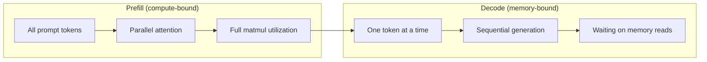
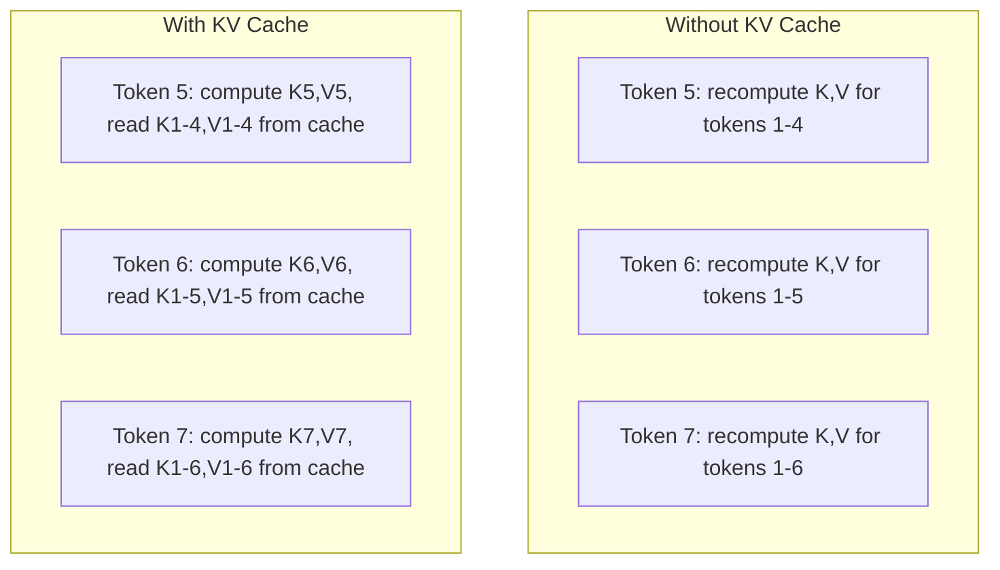
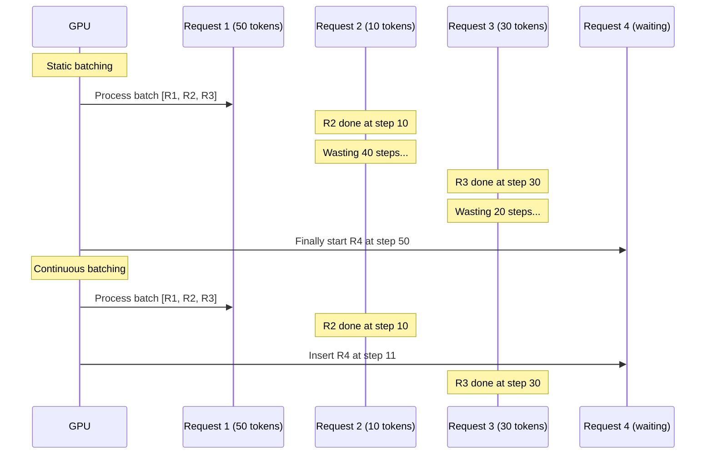
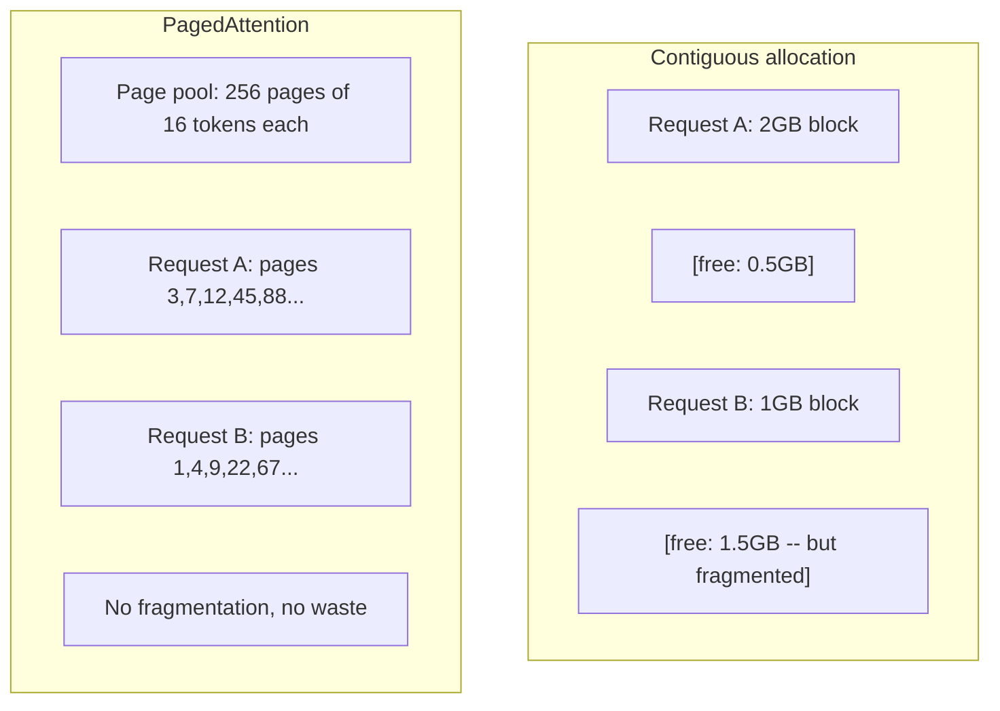
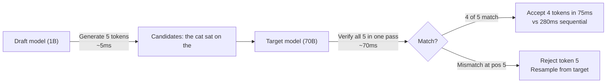

# İndirim Optimizasyonu

> İki aşama LLM çıkarımını tanımlar. Ön doldurun sorguyu paralel olarak işliyor -- hesaplama bağlı. Dekodlama birbiriyle token üretir -- bellek bağlı. Her optimizasyon bir veya her ikisini hedefliyor.

> **【中文解读】**LLM 推理分两阶段:预填充(并行处理快速,计算密集) 和码(逐代币 生成,显存带宽密集) ――KV-cache、连续批处理、投机解码都是针对这两个阶段的优化――

> **【拓展：推理优化→生产部署】**vLLM, TensorRT-LLM, TGI ve diğer düşünce çerçeveleri KV-cache yönetimi, sürekli toplama, paylaşılan dikkat ve diğer optimizasyonları gerçekleştirdi. Bu teknolojilerin büyük bir modelin üretim ortamına yerleştirilmesinin anahtarını anlamak.

>  **【前置】**Öğrenci bölümünün ilk aşamasında:Fase 10·01-08(Transformer 架构、Attention);GPU 计算 vs 显存带宽概念──本节是Fase 17 (İnfrastruktur & Üretim) 的前置生产 LLM 部署核心──

>  **【类比】**LLM 推理 = 读书 + 写读书笔记。**Prefill**(处理 prompt) = 快速翻完书(并行扫所有代币,计算密集);**Decode**(生成) = 逐字写笔记(一次写一个字,显存带宽密集)**KV cache**= 翻书时做书签(记住了每页关键信息,写笔记时不用重翻);**continuous batching**= 同时给多人读书会服务(动态拼组)

**Type:** Build
**Languages:** Python
**Prerequisites:** Phase 10, Lessons 01-08 (Transformer architecture, attention)
**Time:** ~120 minutes

## Öğrenme hedefleri

- Autoregressive token üretimi sırasında redundant hesaplamaları ortadan kaldırmak için KV-cache uygulaması
  实现 KV 缓存                                                                                                                                                                                                                                                                                                                                                                                                                                                                                                                       
- LLM sonuçlandırmasının önceden doldurma ve çözme aşamalarını ve her birinin neden farklı şişe boğazları olduğunu açıklayın (bilgisayar bağlı vs. hafıza bağlı)
  解释 LLM 推理的预填充与解码阶段及其不同瓶(计算密集 vs 访存密集)
- Dolayı taleplerde GPU kullanımını en üst düzeye çıkarmak için sürekli serileme ve PagedAttention kavramlarını uygula
  实现连续批处理和 PagedAttention 概念,并发请求下最大化GPU kullanım oranı
- İhtiyaçlı sonuçlar için optimallaşma tekniklerini (KV-cache, spekülatör çözme, akıl alıcı dikkat) ve onların geçiş/kenarlık oranlarını karşılaştırın.
  BİRİNİN ÖNİMİTİNİN TEKNİHİNİNİNİNİNİNİNİNİNİNİNİNİNİNİNİNİNİNİNİNİNİNİNİNİNİNİNİNİNİNİNİNİNİNİNİNİNİNİNİNİNİNİNİNİNİNİNİNİNİNİNİNİNİNİNİNİNİNİNİNİNİNİNİNİNİNİNİNİNİNİNİNİNİNİNİNİNİNİNİNİNİNİNİNİNİNİNİNİNİNİNİNİNİNİNİNİNİNİNİNİNİNİNİNİNİNİNİNİNİNİNİNİNİNİNİNİNİNİNİNİNİNİNİNİNİNİN

> **【中文解读】**Bu ders üzerinde yoğunlaşmak LLM 推理优化──两个核心概念:(1) Prefill 阶段并行处理 prompt, GPU 计算量(FLOPS;(2) Decode 阶段逐 token 生成,显存带宽──KV-cache 避免重复计算已生成的代币的K/V,连续批处理最大化 GPU 利用率,PagedAttention 解决 KV-cache 的存片问题──显

## Sorunlar. Sorunlar.

Llama 3 70B'yi 4xA100 GPU'da dağıtıyorsunuz. Tek bir kullanıcı saniyede yaklaşık 50 token alır. Hızlı hisseder. Sonra 100 kullanıcı aynı anda son noktaya ulaşır. Çıktım hızı 3 token/sekunde/kullanıcıya düşer. Aylık 25.000 dolarlık GPU faturalarınız bir insan tipinden daha yavaş cevaplar sunuyor.

> Llama 3 70B'de yerleştirilen 4xA100 GPU'da, tek kullanıcı yaklaşık 50 token/saniye elde ediyor.

Modelin kendisi 1 kullanıcı ile 100 kullanıcı arasında değişmez. Aynı ağırlıklar, aynı mimarlık, aynı matematik. İş programının değişmesi. Saçma sonuca varmak mevcut GPU hesaplamalarının %90'ını boşa harcıyor. Token 47'i bekleyen bir kullanıcı, GPU bellek otobüsü matmuls arasında hareketsiz dururken tüm bir seri boşluğu açık tutar. Bu arada, yeni bir kullanıcının 2.000 tokenli sorusu, bu ölü zamanı faydalı hesaplamalarla doldurabilir.

> Model kendisi 1 kullanıcı ve 100 kullanıcı arasında değişmez. Aynı ağırlık, aynı yapı, aynı matematiktir. Değişiklik, nasıl düzenleme işiniz olduğunu gösterir. Basit bir düşünce, kullanılabilir GPU  hesaplamalarının %90'ını boşa harcadı. 47'inci token kullanıcısının tüm satır boşluklarını ele geçirmesini beklerken, GPU 显存总线在矩阵乘法之间置.

Bu bir ölçekleme sorunu değil. Bu bir programlama sorunu. Bu dersdeki teknikler - KV önbelleği, sürekli serileme, PagedAttention, spekülatyonel dekode etme, önbelleği önbelleği - bir$25k/month inference bill from a $Ayda 5k. Aynı trafiğe hizmet veren bir.

> Bu genişleme değil, düzenleme sorunu. Bu ders tekniği KV 缓存、连续批处理、PagedAttention、投机解码、前缓存将每月$25k 推理账单降为服务相同流量的 $5k 账单的关键──

Llama 3 70B'yi 4xA100-80GB'de hizmet veren vLLM, düşük eşzamanlılıkta ~50 token / saniye / kullanıcı elde eder ve sürekli batching ve PagedAttention ile 100 eşzamanlı talebi ile 15-25 TPS / kullanıcıyı destekler. Bu optimize olmadan, aynı donanım aynı eşzamanlılıkta 5 TPS / kullanıcıya hizmet verir. Aynı GPU'lar, aynı model, 4x akış gücü.

> vLLM 4xA100-80GB 上サービス Llama 3 70B, düşük发发时达到约50 token/秒/user,通过连续批处理和PagedAttention 在 100 并发请求下维持15-25 TPS/user──没有这些优化,相同硬件在该并发下只服务5 TPS/user──相同GPU、相同模型、4倍吞吐量──

## Konsepten bir şey.

> **【中文解读】**LLM 推理'nin iki aşaması oldukça farklıdır: Ön doldurucu aşaması GPU FLOPS'e sınırlıdır, hesaplama miktarı, dekod aşaması açık depolama genişliğine sınırlıdır.

> **【拓展：vLLM 和 PagedAttention】**vLLM  Giriş PagedAttention, KV-cache'yi virtual内存 gibi yönetir, sabit büyüklükteki sayfa depo KV yönüne, belirgin depolama parçaları sorunu çözür. Bu, vLLM'nin toplama hızı HuggingFace TGI'den 2-4 倍 daha yüksek hale getirir.


### Ön doldurma vs. çözme

LLM sonuç isteklerinin iki farklı aşaması vardır.

> Her LLM                                                                                                                                                                                                                                                                                                                                                                                                                                                                                                                           

**Prefill**Tüm giriş isteklerini işliyor. Tüm jetonlar bilinir, bu yüzden dikkat tüm dizide paralel olarak hesaplanabilir. Bu büyük bir matris çarpımı - GPU çekirdekleri meşgul kalır. Şişeneği hesaplamak: donanımınız saniyede kaç FLOPS verebilir. A100 312 TFLOPS (BF16). 70B modelinde 4,096-token istekleri için önceden doldurmak tek bir A100'de ~400 ms alır.

> **预填充**Tüm giriş hızı işlemeyi  Tüm tokenler 已知,所以注意力可在完整序列上并行计算──这是大型矩阵乘法GPU 核心保持忙碌──瓶是计算:硬件每秒能提供多少 FLOPS──A100 做 312 TFLOPS(BF16)──70B 模型上 4,096-token prompt 的预填充在单张 A100 上约需要400ms──

**Decode**Bir seferde bir çıkış tokeni oluşturur. Her yeni token önceki tüm tokenlere katılır, ancak ileri geçiş başına sadece bir token üretilir. Ağırlık matrisleri, ön doldurma sırasında olduğu gibi büyüktür, ama matris yerine tek bir vektörle çarpıyorsunuz. GPU çekirdekleri mikrosekundlarda biter sonra hafızadan gelen bir sonraki ağırlık parçasını bekler. Boğaz bozukluğu hafıza bant genişliği: HBM'den hesaplama birimlerine model ağırlıklarını ne kadar hızlı aktarabilirsiniz. A100'in 2 TB/s bant genişliği var. FP16'da 70B modeli 140 GB'dır. Tam modelin bir kez okunması 70 saniye alır. Bu tek bir dekodleme adımınız için zemininiz.

> **解码**个别生成输出代币――每个新代币――关注所有前代币,但每次前向传播只产生一个代币――权力矩阵与预填时大小相同,但你使用单向量而不是矩阵与相乘――GPU 核心在微秒内完成,然后等待下一批权重从内存到内存.瓶是内存带宽:你能以多快的速度将模型权重从HBM 传输到计算单元――A100 有 2 TB/s 带宽――FP16 的 70B 模型是140 GB――读完整模型需要70ms这是单次解码步骤的下限.



- Evet .**ops:byte ratio**Bu işlem, hafızadan yüklenen bir byte başına kaç işlem yaptığınızı ölçer.

```
ops:byte ratio = FLOPs per token / bytes read from memory
```

4.096 token bir parti ile önceden doldururken, yüklenen ağırlık başına ~4.096 çarpma birikimi işlemini yaparsınız. oran yüksek - hesaplama bağlısınız. 1. parti boyutu ile dekode ederken yüklenen ağırlık başına ~1 işlem yaparsınız. oran düşük - hafıza bağlısınız.

Temel anlayış: *decode hafıza bağlanmıştır çünkü tek bir token üretmek için tüm modeli okuyorsunuz.* Aşağıdaki her optimizasyon okunduğunuzu azaltır, okuma başına işlenen tokenlerin miktarını arttırır veya okumaları tamamen önler.

> 核心洞察:* çözümü, tüm modelleri okuyarak tek bir token oluşturduğundan, bellek yoğunluğunda bir koddur. Aşağıdaki her bir optimizasyon, ya okuma miktarını azaltır, ya da her bir okuma işleminin tokenini 批次 artırır, ya da tamamen okumaktan kaçınır.

### KV Kayıt

Dikkat sırasında, her token'in sorguları önceki her token'in anahtar ve değer vektörlerine ilgi gösterir. Kaşlama olmadan, N token'i oluşturmak, tüm N-1 öncesindeki tokenler için anahtar ve değer tahminlerini yeniden hesaplamayı gerektirir. Token 1 token 2 oluşturduğunda, sonra tekrar token 3 için, sonra tekrar token 4 için projeleniyor. Token 1,000 ile, toplamda 999 kez token 1 projelendirmişsiniz.

> Dikkatli hesaplama sırasında, her token sorguları tüm önceki tokenlerin anahtar ve değerleri üzerinde odaklanır. Kaynak yokken, oluşturulan token N yeniden hesaplanmalıdır. tüm N-1 个 önceki tokenlerin anahtar ve değerleri atılmaktadır.

KV önbelleği, önceki tüm tokenlerden anahtar ve değer projeksiyonlarını saklar. N tokenini oluştururken, sadece N tokeninin anahtarı ve değerini hesaplar ve sonra 1 ila N tokenlerinden önbelleğe alınan K/V ile bağlarsınız.

> KV 缓存 depo tüm önceki token'ların anahtar ve değer projeksiyonu── oluşturmak token N 时, sadece hesap token N'in anahtar ve değer, sonra cache'ın token 1 ile N-1'nin K/V 拼接──



**Memory formula for KV cache:**

```
KV cache size = 2 * num_layers * num_kv_heads * head_dim * seq_len * bytes_per_param
```

Llama 3 70B için (80 katman, 8 KV başı GQA, baş_dim=128, BF16):

```
per token: 2 * 80 * 8 * 128 * 2 bytes = 327,680 bytes = 320 KB
at 4,096 tokens: 320 KB * 4,096 = 1.28 GB
at 128K tokens: 320 KB * 131,072 = 40 GB
```

Llama 3 70B için tek 128K bağlamlı bir konuşma 40 GB KV kaydını tüketir - A100'in yarısı hafızası. Her biri 4K jetonlarında 100 eşzamanlı kullanıcı ile, KV kaydının tek başına 128 GB gerektiriyor. Bu nedenle KV kaydının yönetimi sonuç optimizasyonunun merkezi zorunluluğudur.

> Llama 3 70B'nin tek 128K'sının tüketimi 40 GB KV 缓存半张 A100'ün内存──100 发发用户各4K token 时,只有 KV 缓存就需要128 GB──这就是为什么KV 缓存管理是推理优化的核心挑战──

### Sürekli Çöpçöleme

Statik parti, N talepleri bir parti gelene kadar bekler, onları birlikte işlemeyi ve yeni talepleri kabul etmeden önce * tüm * bitene kadar bekler. Bir talebin 500 token ve diğerinin 10'una ihtiyacı varsa, kısa talebi bittikten sonra 490 dekod adımları için boş kalır.

> 静态批处理 N 个请求的批发到来,一起处理,等待*所有*完成后再接受新请求―― eğer bir istek 500 个代币 gerektiriyorsa 另一个需要 10 个,短请求在完成后置 490 个解码步骤――

Sürekli serileme (yaklaşım düzeyinde serileme olarak da adlandırılır) herhangi bir istek tamamlandığında yeni istekleri partiye ekler. Her dekodlama aşamasında parti yeniden değerlendirilir. 10 tokenden sonra biten bir istek hemen bekleme istekleriyle değiştirilir.

> 连续批处理 (→→→→→→→→→→→→→→→→→→→→→→→→→→→→→→→→→→→→→→→→→→→→→→→→→→→→→→→→→→→→→→→→→→→→→→→→→→→→→→→→→→→→→→→→→→→→→→→→→→→→→→→→→→→→→→→→→→→→→→→→→→→→→→→→→→→→→→→→→→→→→→→→→→→→→→→→→→→→→→→→→→→→→→→→→→→→→→→→→→→→→→→→→→→→→→→→→→→→→→→→→→→→→→→→→→→→→→→→→→→→→→→→→→→→→→→→→→→→→→→→→→→→→→→→→→→→→→→→→→→→→→→→→→→→→→→→→→→→→→→→→→→→→→→→→→→→→→→→→→→→→→→→→→→→→→→→→→→→→→→→→→→→→→→→→→→→→→→→→→→→→→→→→→→→→→→→→→→→→→→→→→→→→→→→→→→→→→→→→→→→→→→→→→→→→→→→→→→→→→→→→→→→→→→→→→→→→→→→→→→→→→→→→→→→→→→→→→→→→→→→→→→→→→→→→→→→→→→→→→→→→→→→→→→→→→→→→→→→→→→→→→→→→→→→→→→→→→→→→→→→→→→→



Çıktılık gelişiminin ne kadar değişeceğine bağlıdır. Eşsiz uzunluklarda, sürekli partileşme statik partileşme ile eşleşir. Değişken uzunluklarda (sık durum), sürekli partileşme, GPU yuvaları asla boş kalmadığı için 2-5 kat daha yüksek bir geçiş sağlayabilir.

> 吞吐量 yükseltme, çıkış uzunluğunun değişmesine bağlıdır. △ △ △ △ △ △ △ △ △ △ △ △ △ △ △ △ △ △ △ △ △ △ △ △ △ △ △ △ △ △ △ △ △ △ △ △ △ △ △ △ △ △ △ △ △ △ △ △ △ △ △ △ △ △ △ △ △ △ △ △ △ △ △ △ △ △ △ △ △ △ △ △ △ △ △ △ △ △ △ △ △ △ △ △ △ △ △ △ △ △ △ △ △ △ △ △ △ △ △ △ △ △ △ △ △ △ △ △ △ △ △ △ △ △ △ △ △ △ △ △ △ △ △ △ △ △ △ △ △ △ △ △ △ △ △ △ △ △ △ △ △ △ △ △ △ △ △ △ △ △ △ △ △ △ △                                                                                           

### Sayfalarİzle

Her istek için KV önbelleği bir bitişik bellek bloğu. istekler geldiğinde ve gittiğinde, bellek parçaları - işletim sistemlerinde RAM parçalanması gibi. 4K-token istekleri bitişik 1.28 GB gerektirir. 2 GB ücretsiz toplamınız olsa bile, 1.28 GB * bitişik * olmayabilir.

> Her istek için KV 缓存 bir blok devamlı内存── istek geldiği ve gittiği zaman, devamlı内存 parçacığı oluşur operating systemdaki RAM fragmentation gibi──4K token istekleri 1.28 GB 连续空间── toplam 2 GB boşluk olsa bile, 1.28 GB *连续*空间── istekleri reddetmek ya da kaybedmek için gerekmektedir.

PagedAttention (vLLM'den) KV önbelleğine OS tarzında sanal belleği uyguluyor. Her istek için bir bitişik blok tahsis etmek yerine, sabit boyutlu "sayfalar" tahsis eder (genellikle her biri 16 jeton). Sayfalar fiziksel GPU belleğinde herhangi bir yerde olabilir. Bir sayfa tablosu her isteklerin mantıksal sırası konumlarını fiziksel sayfa konumlarına haritasıyor.

> PagedAttention( vLLM'den) Operasyon Sisteminin biçiminin sanal内存 KV 缓存 için uygulanır.



PagedAttention ayrıca **copy-on-write**paylaşılan öntanımlar için. 50 istek aynı sistem istekini paylaşırsa, bu sistem istekinin KV önbelleği sayfaları bir kez depolanır ve tüm 50 istekle referanslanır. Sadece bir istek farklı olduğunda (farklı kullanıcı mesajları) kendi sayfalarını alır. Bu paylaşılan sistem istekleri olan uygulamalarda bellek kullanımını önemli ölçüde azaltır.

vLLM, PagedAttention üzerinden neredeyse sıfır hafıza kaybı (% ~ 4% vs. ~ 60- 80% saf tahsis) rapor eder.

### Tahmin edici Çözümleme

Çözüm yavaş çünkü sıralıdır - bir token oluşturur, geri verir, bir sonraki oluşturur. Ama bir sonraki 5 token'ı ucuz tahmin edip hepsini bir anda doğrulayabilirseniz ne olur?

> Bu da bir token üretmenin sırasıdır, sonra bir tane daha üretmek için geri dönerken bir tane daha üretmek için. Ama eğer bir sonraki 5 token'ı tahmin edebilirseniz, sonra bir kez de bunu doğrulayabilir misiniz?

Tahmin edici bir kodlama küçük, hızlı bir kullanıyor.**draft model**K aday belirtilerini oluşturmak için.**target model**Bu, bir öngeçmiş olarak tüm K adaylarını işlemeyi sağlar. Eğer hedef model, proje modelinin tahminlerine uygunsa, bir hedef öngeçmişin zamanında tüm K tokenlerini kabul edersiniz. Eğer j pozisyonunda anlaşmazsa, 1'den j-1'e kadar olan tokenleri kabul eder ve geri kalanı atarsınız.

> 投机解码小而快的使用**草稿模型**生成 K 个候选符号──大型**目标模型**Sonra tek bir ön yönlü yayım sırasında tüm K 个候选人 (K) 个候选人 (K) 个候选人 (K) 个候选人 (K) 个候选人 (K) 个候选人 (K) 个候选人 (K) 个候选人 (K) 个候选人 (K) 个候选人 (K) 个候选人 (K) 个候选人 (K) 个候选人 (K) 个候选人 (K) 个候选人 (K) 个候选人 (K) 个候选人 (K) 个候选人 (K) 个候选人 (K) 个候选人 (K) 个候选人 (K) 个候选人 (K) 个候选人 (K) 个候选人 (K) 个候选人 (K) 个候选人 (K) 个候选人 (K) 个候选人 (K) 个候选人 (K) 个候选人 (K) 个候选人 (K) 个候选人 (K) 个候选人 (K) 个候选人 (个候选人) 个候选人 (个候选人) 个候选人 (个候选人) 个候选人 (个候选人) 个候选人 (个) 个) 个候选人 (个) 个) 个候选人 (个) 个) 个) 个 (个) 个 (个) 个) 个 (个) 个 (个) 个 (个) 个 (个) 个 (个) 个 (个) 个 (个) 个 (个) 个 (个) 个 (个) 个 (个) (个) (个) (个) (个) (个) (个) (个) (个) (个) (个) (个) (个) (个) (个) (个) (个) (个) (个) (个) (个) (个) (个) (个) (个) (个) (b) (b) (;



Hızlandırma hızlandırma **acceptance rate**Llama 3 8B'nin Llama 3 70B'nin hazırlanması için kabul oranları %70-85% olarak doğal dilde kullanılır.

> Süresi belirlenir**接受率**草稿模型的预测多频繁地匹配目标──Llama 3 8B 为 Llama 3 70B草稿 yaparken, doğal dilde kabul oranı genellikle 70-85% olmuştur── bu da çözümü hızlandırmanın 2-3 katına dönüşür──

Tahmin edici çözüme üç yaklaşım:

| Method | Draft source | Acceptance rate | Overhead |
|--------|-------------|-----------------|----------|
| Draft-target (Leviathan et al.) | Separate small model | 70-85% | Draft model memory |
| EAGLE (Li et al.) | Lightweight head on target | 75-90% | ~1% extra parameters |
| N-gram lookup | Token n-gram table | 40-60% | Negligible |

**EAGLE**Hedef modelinin gizli durumlarının üzerine küçük bir autoregressive başı eğitiyor. Hedef modelinin ikinci-son katman özelliklerini kullanarak bir sonraki token'ın yerleştirilmesini öngörüyor. Hedef modelinin kendi temsilleri (ayrı bir model değil) üzerinde çalışdığı için, minimum ek bellek ile daha yüksek kabul oranlarına ulaşır. EAGLE-2, bağlamına göre aday sayısını ayarlayan dinamik bir taslak ağacını ekler.

**N-gram speculative decoding**Eğer taslak aynı konuşmada daha önce ortaya çıkanlarla (tekrarlayıcı desenler, kod, yapılandırılmış çıkış) eşleşirse, sıfır sinir ağı genel masrafları ile ateş eder. Kabul oranları ortalama olarak daha düşüktür ancak her spekülasyonun maliyeti esasen ücretsizdir.

Spekülatör dekodlama * matematiksel olarak doğru * - çıkış dağılımı hedef modelin dağılımıyla aynıdır. Yaklaşım değildir. Doğrulama adımı, kabul edilen her tokenin hedef modelin tahsis ettiği olasılıkların tam olarak olduğuna güvence verir.

> 投机解码 (投机解码) * matematiği açısından doğru*  çıktı dağılımı hedef modelin dağılımıyla tamamen aynıdır.

### Önbellek Kayıtlama

Birçok istek aynı önbellek paylaşır. Bir chatbot sistem sorgulaması. Bir RAG bağlam blok. Birkaç atış örneği seti. Önbellek önbelleksiz, her istek bu paylaşılan jetonlar için KV önbellekini sıfırdan yeniden hesaplar.

> 许多请求共享相同前──聊天机器人系统 prompt──RAG 上下文块──少样本示例集──没有前缓存,每个请求从头重新计算这些共享代币的KV 缓存──

Önbellek önbellekleri KV önbelleklerini ortak önbellekler için saklar ve istekler arasında tekrar kullanır. Yeni bir istek bilinen bir önbellekle geldiğinde, sistem önbellek KV girişlerini kopyalar (veya referanslar) ve yalnızca benzersiz eksi için KV'yi hesaplar.

> Önceki 缓存存常见前的 KV 缓存并在请求间复用──当新请求带有已知前到达时,系统复制(或引用)缓存的 KV 条目,只计算唯一后的 KV──

Tüm istekler arasında paylaşılan 2.000 tokenli bir sistem istekleri için, önbellek önbellekleme istek başına ~400 ms ön doldurmayı ortadan kaldırır. 100 istek/sekundu ile, bu saniyede 40 saniye GPU hesaplama tasarruf eder - bir GPU'nın değeri üzerinde iş.

> Tüm paylaşımlı 2.000 tokenli istekler için, önbellek her istek için 400 ms'lik bir ön doldurma ortadan kaldırdı. 100 istek/saniye saatinde, her saniye 40 saniye tasarruf edildi.

### İndirim Motorları

Üç motor üretim LLM hizmet etmektedir:

| Engine | Key innovation | Best for |
|--------|---------------|----------|
| vLLM | PagedAttention, continuous batching | General-purpose serving, highest compatibility |
| SGLang | RadixAttention (prefix caching), structured generation | Multi-turn chatbots, constrained decoding |
| TensorRT-LLM | NVIDIA kernel fusion, FP8 quantization | Maximum single-GPU throughput on NVIDIA hardware |

**vLLM**Bu, en geniş model yelpazesini destekler, herhangi bir GPU satıcısı (NVIDIA, AMD, Intel) üzerinde çalışır ve PagedAttention + sürekli batching aracılığıyla güçlü bir geçiş sağlar. OpenAI uyumlu API, herhangi bir OpenAI API çağrısının yerine koyabileceğiniz anlamına gelir.

**SGLang**Eğer iş yükünüz çok yönlü konuşmalar, araç kullanımı veya kısıtlı dekodeleme (JSON çıkışı, regex yönlendirilmiş jenerasyon) içerirse, SGLang genellikle prefix tekrar kullanımı yoluyla vLLM'yi 2-5 kat daha iyi performans gösterir.

**TensorRT-LLM**Modellerin optimize edilmiş NVIDIA GPU çekirdeklerine dönüştürülmesini sağlar. İşlemleri (bir çekirdekte dikkat + doğrusal + etkinleştirme) birleştirir, H100 GPU'larda FP8 kullanır ve üretim dağıtımı için NVIDIA Triton İnference Server ile entegre edilir. NVIDIA donanımında en yüksek tek GPU çıkışını elde eder, ancak daha fazla kurulum gerektirir ve yalnızca NVIDIA GPU'larda çalışır.

Llama 3 70B için gerçek dünya numaraları (4xA100-80GB, BF16):

| Metric | vLLM | SGLang | TensorRT-LLM |
|--------|------|--------|---------------|
| Throughput (1 user) | ~50 TPS | ~55 TPS | ~65 TPS |
| Throughput (100 users) | ~2,500 total TPS | ~3,200 total TPS | ~3,000 total TPS |
| Time to first token | ~400ms | ~300ms (prefix hit) | ~350ms |
| Max context | 128K | 128K | 128K |

### Operasyon:Byte Çerçeve

Ölçmediğiniz şeyi optimize edemezsiniz. ops:byte oranı size bilgisayarla bağlanmış olup olmadığınızı veya hafıza ile bağlanmış olup olmadığınızı söyler.

```
Compute roof: peak FLOPS of the GPU
Memory roof:  peak bandwidth * ops:byte ratio
```

ops:byte düşük olduğunda (dekodlama, küçük partiler), hafıza bant genişliği çatısına çarparsınız. Daha fazla hesaplama (yüksek saat, daha fazla çekirdek) eklemek yardımcı olmaz. Daha kullanışlı iş boyunca okuyuşları amortize etmek için hafıza okumalarını azaltmanız veya parti boyutunu artırmanız gerekir.

Options:byte yüksek olduğunda (büyük seri, önceden doldurmak), hesaplama çatısına çarparsınız. Hatırlama bant genişliği optimizasyonu yardımcı olmaz. Daha fazla FLOPS sıkmak için daha hızlı GPU'lara, çekirdek füzyonuna veya az precesyona ihtiyacınız var.

| Scenario | ops:byte | Bound | Optimize with |
|----------|----------|-------|---------------|
| Prefill, batch=1 | ~4,096 | Compute | Kernel fusion, FP8 |
| Decode, batch=1 | ~1 | Memory | Quantization, KV compression |
| Decode, batch=32 | ~32 | Memory | Larger batch, continuous batching |
| Decode, batch=256 | ~256 | Transitioning | Both matter |
| Decode, batch=1024 | ~1,024 | Compute | Kernel fusion, tensor parallelism |

A100'deki çapraz nokta ops:byte = 156 (312 TFLOPS / 2 TB/s) civarındadır. 156'ın altında hafıza bağlanırsınız. 156'ın üzerinde ise hesaplama bağlanırsınız. Sürekli serileme, her iterasyonda daha fazla token paketiyle bu çaprazlığa doğru çözümü zorlar.

## Yapın.
```figure
context-window-slide
```

## Yapın

### Adım 1: KV Kayıtlı Başlangıçtan

Bir katman başına anahtar ve değer projeksiyonlarını saklayan ve hafıza büyümesi örneğini gösteren bir çok başlı KV önbelleği oluşturuyoruz.

```python
import numpy as np

class KVCache:
    def __init__(self, num_layers, num_heads, head_dim, max_seq_len, dtype=np.float16):
        self.num_layers = num_layers
        self.num_heads = num_heads
        self.head_dim = head_dim
        self.max_seq_len = max_seq_len
        self.dtype = dtype

        self.k_cache = np.zeros(
            (num_layers, num_heads, max_seq_len, head_dim), dtype=dtype
        )
        self.v_cache = np.zeros(
            (num_layers, num_heads, max_seq_len, head_dim), dtype=dtype
        )
        self.seq_len = 0

    def update(self, layer_idx, new_keys, new_values):
        num_new = new_keys.shape[1]
        end = self.seq_len + num_new
        self.k_cache[layer_idx, :, self.seq_len:end, :] = new_keys
        self.v_cache[layer_idx, :, self.seq_len:end, :] = new_values
        return (
            self.k_cache[layer_idx, :, :end, :],
            self.v_cache[layer_idx, :, :end, :]
        )

    def advance(self, num_tokens):
        self.seq_len += num_tokens

    def memory_bytes(self):
        return self.k_cache.nbytes + self.v_cache.nbytes

    def used_bytes(self):
        per_token = 2 * self.num_layers * self.num_heads * self.head_dim * np.dtype(self.dtype).itemsize
        return per_token * self.seq_len
```

### Adım 2: KV Kaşla Dikkat

KV önbelleğini kodlama adımları için kullanan basitleştirilmiş çok başlı bir dikkat.

```python
def scaled_dot_product_attention(query, keys, values):
    head_dim = query.shape[-1]
    scores = np.matmul(query, keys.transpose(0, 1, 3, 2)) / np.sqrt(head_dim)
    seq_len_q = scores.shape[-2]
    seq_len_k = scores.shape[-1]
    if seq_len_q > 1:
        mask = np.triu(np.ones((seq_len_q, seq_len_k), dtype=np.float32), k=seq_len_k - seq_len_q + 1)
        scores = scores + mask * (-1e9)
    max_scores = np.max(scores, axis=-1, keepdims=True)
    exp_scores = np.exp(scores - max_scores)
    attn_weights = exp_scores / np.sum(exp_scores, axis=-1, keepdims=True)
    return np.matmul(attn_weights, values)


class MultiHeadAttention:
    def __init__(self, d_model, num_heads):
        self.num_heads = num_heads
        self.head_dim = d_model // num_heads
        scale = np.sqrt(2.0 / d_model)
        self.W_q = np.random.randn(d_model, d_model).astype(np.float32) * scale
        self.W_k = np.random.randn(d_model, d_model).astype(np.float32) * scale
        self.W_v = np.random.randn(d_model, d_model).astype(np.float32) * scale
        self.W_o = np.random.randn(d_model, d_model).astype(np.float32) * scale

    def forward(self, x, kv_cache=None, layer_idx=0):
        batch, seq_len, d_model = x.shape
        Q = np.matmul(x, self.W_q).reshape(batch, seq_len, self.num_heads, self.head_dim).transpose(0, 2, 1, 3)
        K = np.matmul(x, self.W_k).reshape(batch, seq_len, self.num_heads, self.head_dim).transpose(0, 2, 1, 3)
        V = np.matmul(x, self.W_v).reshape(batch, seq_len, self.num_heads, self.head_dim).transpose(0, 2, 1, 3)

        if kv_cache is not None:
            K_full, V_full = kv_cache.update(layer_idx, K[0], V[0])
            K = K_full[np.newaxis, :, :, :]
            V = V_full[np.newaxis, :, :, :]
            if seq_len == 1:
                kv_cache.advance(1)

        attn_out = scaled_dot_product_attention(Q, K, V)
        attn_out = attn_out.transpose(0, 2, 1, 3).reshape(batch, -1, d_model)
        return np.matmul(attn_out, self.W_o)
```

### Adım 3: Sürekli Batching Simülatörü

Bu, statik ve sürekli serileme arasındaki programlama farkını simüle eder.

```python
import heapq

class Request:
    def __init__(self, request_id, prompt_tokens, output_tokens, arrival_step):
        self.request_id = request_id
        self.prompt_tokens = prompt_tokens
        self.output_tokens = output_tokens
        self.arrival_step = arrival_step
        self.tokens_generated = 0
        self.start_step = None
        self.end_step = None

    def is_done(self):
        return self.tokens_generated >= self.output_tokens


def simulate_static_batching(requests, batch_size):
    step = 0
    completed = []
    queue = list(requests)
    queue.sort(key=lambda r: r.arrival_step)

    while queue:
        batch = []
        while queue and len(batch) < batch_size:
            r = queue.pop(0)
            r.start_step = max(step, r.arrival_step)
            batch.append(r)

        if batch:
            step = max(step, max(r.start_step for r in batch))
            max_output = max(r.output_tokens for r in batch)
            for r in batch:
                r.tokens_generated = r.output_tokens
                r.end_step = step + max_output
            step += max_output
            completed.extend(batch)

    return completed


def simulate_continuous_batching(requests, batch_size):
    step = 0
    completed = []
    queue = sorted(requests, key=lambda r: r.arrival_step)
    queue_idx = 0
    active = []
    waiting = []

    while queue_idx < len(queue) or active or waiting:
        while queue_idx < len(queue) and queue[queue_idx].arrival_step <= step:
            waiting.append(queue[queue_idx])
            queue_idx += 1

        while waiting and len(active) < batch_size:
            r = waiting.pop(0)
            r.start_step = step
            active.append(r)

        if not active:
            if waiting:
                step += 1
                continue
            elif queue_idx < len(queue):
                step = queue[queue_idx].arrival_step
                continue
            else:
                break

        for r in active:
            r.tokens_generated += 1

        done = [r for r in active if r.is_done()]
        for r in done:
            r.end_step = step + 1
            completed.append(r)
        active = [r for r in active if not r.is_done()]

        step += 1

    return completed


def batching_stats(completed):
    latencies = [r.end_step - r.arrival_step for r in completed]
    total_time = max(r.end_step for r in completed) - min(r.arrival_step for r in completed)
    total_tokens = sum(r.output_tokens for r in completed)
    return {
        "avg_latency": np.mean(latencies),
        "p50_latency": np.median(latencies),
        "p99_latency": np.percentile(latencies, 99),
        "total_time": total_time,
        "throughput": total_tokens / total_time if total_time > 0 else 0,
    }
```

### Dördüncü Adım: Önbellek Kayıt

Paylaşılan önlükler için KV girişlerini saklayan bir tri tabanlı önlük önlüğü.

```python
class TrieNode:
    def __init__(self):
        self.children = {}
        self.kv_data = None
        self.hit_count = 0


class PrefixCache:
    def __init__(self, max_entries=1000):
        self.root = TrieNode()
        self.max_entries = max_entries
        self.total_entries = 0
        self.hits = 0
        self.misses = 0

    def _walk(self, token_ids):
        node = self.root
        depth = 0
        for tid in token_ids:
            if tid not in node.children:
                break
            node = node.children[tid]
            depth += 1
        return node, depth

    def lookup(self, token_ids):
        node, depth = self._walk(token_ids)
        if depth > 0:
            self.hits += 1
            current = self.root
            for tid in token_ids[:depth]:
                current = current.children[tid]
                current.hit_count += 1
            kv_entries = []
            current = self.root
            for tid in token_ids[:depth]:
                current = current.children[tid]
                if current.kv_data is not None:
                    kv_entries.append(current.kv_data)
            return depth, kv_entries
        self.misses += 1
        return 0, []

    def insert(self, token_ids, kv_per_token):
        node = self.root
        for i, tid in enumerate(token_ids):
            if tid not in node.children:
                if self.total_entries >= self.max_entries:
                    return i
                node.children[tid] = TrieNode()
                self.total_entries += 1
            node = node.children[tid]
            if i < len(kv_per_token):
                node.kv_data = kv_per_token[i]
        return len(token_ids)

    def hit_rate(self):
        total = self.hits + self.misses
        return self.hits / total if total > 0 else 0.0
```

### Adım 5: Tahmin edici Çözüm Simülatörü

Konfigürable kabul oranları ile proje hedefi spekülatör çözümü simülasyonu.

```python
class DraftModel:
    def __init__(self, vocab_size, acceptance_rate=0.8):
        self.vocab_size = vocab_size
        self.acceptance_rate = acceptance_rate

    def generate(self, context, num_tokens):
        tokens = np.random.randint(0, self.vocab_size, size=num_tokens)
        return tokens

    def get_probs(self, context, token):
        probs = np.random.dirichlet(np.ones(self.vocab_size))
        return probs


class TargetModel:
    def __init__(self, vocab_size):
        self.vocab_size = vocab_size

    def get_probs(self, context, tokens=None):
        if tokens is not None:
            return [np.random.dirichlet(np.ones(self.vocab_size)) for _ in tokens]
        return np.random.dirichlet(np.ones(self.vocab_size))


def speculative_decode(draft_model, target_model, context, num_speculative=5,
                       draft_cost=1.0, target_cost=10.0, verify_cost=12.0):
    total_tokens = 0
    total_cost = 0.0
    accepted_counts = []
    context = list(context)

    max_tokens = 100

    while total_tokens < max_tokens:
        draft_tokens = draft_model.generate(context, num_speculative)
        total_cost += draft_cost * num_speculative

        target_probs = target_model.get_probs(context, draft_tokens)
        total_cost += verify_cost

        accepted = 0
        for i, token in enumerate(draft_tokens):
            draft_p = draft_model.get_probs(context + list(draft_tokens[:i]), token)
            target_p = target_probs[i]

            r = np.random.random()
            acceptance_prob = min(1.0, target_p[token] / (draft_p[token] + 1e-10))

            if r < draft_model.acceptance_rate:
                accepted += 1
                context.append(token)
                total_tokens += 1
            else:
                new_token = np.random.choice(draft_model.vocab_size, p=target_p)
                context.append(new_token)
                total_tokens += 1
                break

        accepted_counts.append(accepted)

        if accepted == num_speculative:
            bonus_probs = target_model.get_probs(context)
            bonus_token = np.random.choice(draft_model.vocab_size, p=bonus_probs)
            context.append(bonus_token)
            total_tokens += 1

    sequential_cost = total_tokens * target_cost
    return {
        "total_tokens": total_tokens,
        "speculative_cost": total_cost,
        "sequential_cost": sequential_cost,
        "speedup": sequential_cost / total_cost if total_cost > 0 else 1.0,
        "avg_accepted": np.mean(accepted_counts),
        "acceptance_rate": np.mean(accepted_counts) / num_speculative,
    }


def compare_speculation_strategies(vocab_size=1000, num_trials=20):
    results = {}

    for name, acceptance_rate, spec_tokens in [
        ("Draft-target (8B->70B)", 0.78, 5),
        ("EAGLE", 0.85, 6),
        ("N-gram", 0.50, 4),
        ("No speculation", 0.0, 0),
    ]:
        if spec_tokens == 0:
            results[name] = {
                "speedup": 1.0,
                "acceptance_rate": 0.0,
                "avg_accepted": 0.0,
            }
            continue

        trial_results = []
        for _ in range(num_trials):
            draft = DraftModel(vocab_size, acceptance_rate=acceptance_rate)
            target = TargetModel(vocab_size)
            context = list(np.random.randint(0, vocab_size, size=10))
            result = speculative_decode(draft, target, context, num_speculative=spec_tokens)
            trial_results.append(result)

        results[name] = {
            "speedup": np.mean([r["speedup"] for r in trial_results]),
            "acceptance_rate": np.mean([r["acceptance_rate"] for r in trial_results]),
            "avg_accepted": np.mean([r["avg_accepted"] for r in trial_results]),
        }

    return results
```

### Adım 6: KV Kaş Hatırlama Profiler

Gerçek model yapılandırmaları için KV önbelleği bellek gereksinimlerini hesaplayın.

```python
MODEL_CONFIGS = {
    "Llama-3-8B": {
        "num_layers": 32, "num_kv_heads": 8, "head_dim": 128,
        "model_params_b": 8, "gqa": True,
    },
    "Llama-3-70B": {
        "num_layers": 80, "num_kv_heads": 8, "head_dim": 128,
        "model_params_b": 70, "gqa": True,
    },
    "Llama-3-405B": {
        "num_layers": 126, "num_kv_heads": 8, "head_dim": 128,
        "model_params_b": 405, "gqa": True,
    },
    "Mistral-7B": {
        "num_layers": 32, "num_kv_heads": 8, "head_dim": 128,
        "model_params_b": 7, "gqa": True,
    },
    "GPT-4-est": {
        "num_layers": 120, "num_kv_heads": 96, "head_dim": 128,
        "model_params_b": 1800, "gqa": False,
    },
}


def kv_cache_memory(config, seq_len, dtype_bytes=2):
    per_token = 2 * config["num_layers"] * config["num_kv_heads"] * config["head_dim"] * dtype_bytes
    total = per_token * seq_len
    return {
        "per_token_bytes": per_token,
        "per_token_kb": per_token / 1024,
        "total_bytes": total,
        "total_mb": total / (1024 ** 2),
        "total_gb": total / (1024 ** 3),
    }


def memory_budget(config, gpu_memory_gb, model_dtype_bytes=2, kv_dtype_bytes=2):
    model_memory_gb = config["model_params_b"] * 1e9 * model_dtype_bytes / (1024 ** 3)
    overhead_gb = gpu_memory_gb * 0.1
    available_for_kv = gpu_memory_gb - model_memory_gb - overhead_gb

    if available_for_kv <= 0:
        return {"error": "Model does not fit in GPU memory", "model_memory_gb": model_memory_gb}

    per_token = 2 * config["num_layers"] * config["num_kv_heads"] * config["head_dim"] * kv_dtype_bytes
    max_tokens = int(available_for_kv * (1024 ** 3) / per_token)

    return {
        "gpu_memory_gb": gpu_memory_gb,
        "model_memory_gb": round(model_memory_gb, 1),
        "overhead_gb": round(overhead_gb, 1),
        "available_for_kv_gb": round(available_for_kv, 1),
        "max_total_tokens": max_tokens,
        "max_users_at_2k": max_tokens // 2048,
        "max_users_at_4k": max_tokens // 4096,
        "max_users_at_32k": max_tokens // 32768,
    }
```

## Çerçeveyi kullanın.

VLLM ile:

```python
from vllm import LLM, SamplingParams

llm = LLM(
    model="meta-llama/Llama-3-70B-Instruct",
    tensor_parallel_size=4,
    enable_prefix_caching=True,
    max_model_len=8192,
    gpu_memory_utilization=0.9,
)

params = SamplingParams(temperature=0.7, max_tokens=256)
outputs = llm.generate(["Explain inference optimization in one paragraph."], params)
```

Önbellek önbelleği için SGLang ile + yapılandırılmış çıkış:

```python
import sglang as sgl

@sgl.function
def classify(s, text):
    s += sgl.system("You are a classifier. Output JSON only.")
    s += sgl.user(f"Classify this text: {text}")
    s += sgl.assistant(sgl.gen("result", regex=r'\{"label": "(positive|negative|neutral)"\}'))

runtime = sgl.Runtime(model_path="meta-llama/Llama-3-70B-Instruct", tp_size=4)
sgl.set_default_backend(runtime)

results = classify.run_batch([
    {"text": "This product is amazing!"},
    {"text": "Terrible experience."},
    {"text": "It was okay I guess."},
])
```

TensorRT-LLM ile:

```python
import tensorrt_llm
from tensorrt_llm.runtime import ModelRunner

runner = ModelRunner.from_dir("./llama-70b-trt-engine/", rank=0)

outputs = runner.generate(
    batch_input_ids=[tokenizer.encode("Explain KV caching.")],
    max_new_tokens=256,
    temperature=0.7,
)
```

## İndirin . Ürünler .

Bu ders şunları ortaya çıkarır:
- `outputs/skill-inference-optimization.md`-- LLM sonucu hizmetini teşhis ve optimize becerisi

> 本课产 出:
> - `outputs/skill-inference-optimization.md` Diagnostic and Optimization LLM Sevgiyi Önerme becerileri

## Egzersizler.

1. KV önbelleği profilini değiştirin ve FP16 vs FP8 vs INT4 KV önbelleği kuantitasyonunu karşılaştırın. Llama 3 70B için 4K bağlamında, her biri için maksimum eşzamanlı kullanıcıları 4xA100-80GB'de hesaplayın. KV kuantitasyonunun INT4'e yaklaşık olarak 4 katı kullanıcı kapasitesi olmalıdır.
   Çin dili: Modify KV 缓存分析器 Comparison FP16 vs FP8 vs INT4 KV 缓存量化。 4K için 上下文'in Llama 3 70B,计算 4xA100-80GB 上每种格式最大并发用户数──INT4 KV 量化应大约 4倍用户容量──

2. Sürekli seri simülatörü, GPU kullanımını izlemek için genişletin (adımda doldurulan seri boşluklarının bir kısmı). Sürekli seri kullanımının zaman içinde hem statik hem de sürekli seri için, çıkış uzunlukları Pareto dağılımını izleyen 50 talebe sahip olması gerekir (şekil = 1.5, ölçek = 20). Sürekli seri kullanımının % 80'lik bir kullanım tutması gerekir.
   Çinçe çevirisi: genişletilme devamlı döngü işlem modelici takip GPU kullanım oranı( her adımda槽位填充比例) ・・・ çizim静态和连续批处理随时间的利用率图,50 个请求的输出长度遵循帕累托分布(形=1.5,规模=20) ・・・ devamlı döngü işlem >80% kullanım oranı sürdürülmelidir。

3. KV önbelleğinin gruplandırılmış sorgu dikkat (GQA) sürümünü uygulayın .`num_kv_heads < num_query_heads`Llama 3 70B 64 sorgu başlığı kullanır ancak sadece 8 KV başlığı kullanır.
   Çinçe Çevirisi:实现分组查询注意力 (GQA) versiyonı`num_kv_heads < num_query_heads`❖ Llama 3 70B 64 sorgu başlığı ile ancak 8 KV başlığı ile ❖ hesaplama ile karşılaştırıldığında ❖ KV 缓存大小减少8倍)

4. LRU çıkarımı kullanan bir önbellek kaydını oluşturun. Maksimum girişleri 500'e ayarlayın ve %60'ın 5 ortak önbellekten birini paylaştığı 1,000 talebi oluşturun. Çıkış oranını ölçün ve sınırsız kaydıyla karşılaştırın. İyi çıkarımla, çıkış oranı %55'in üzerinde kalmalıdır.
   Çinçe çeviride: yapılandırmak LRU 淘汰的前缓存──設定 max_entries 为 500, generate 1,000 个请求, of which 60% 共享 5 个常见前之一──测量命中率并与无限缓存比较──良好淘汰下命中率应保持在 55% 以上──

5. Tahmin edici dekodlama simülatörünü ağaç tabanlı tahminleri uygulamak için genişletin (EAGLE-2 tarzı). K taslak jetonlarının tek bir zincirinin yerine, adayların bir ağacını oluşturun (örneğin, 3 seviyeden her birinde 2 dal = 8 yaprak adayları).
   Çinçe çevirme:扩展投机解码模拟器实现树状投机(EAGLE-2风格) ・・・ K 个草稿 token 单链的不是 K 个草稿 token 的单链,而是生成候选树(例如 3层每层 2 分支 = 8个叶选) ・・・比较每轮验证接受的代币 总数与线性投机──

## Anahtar Şartlar .

| Term | What people say | What it actually means | 中文释义 |
|------|----------------|----------------------|---------|
| Prefill | "Processing the prompt" | Computing attention over all input tokens in parallel -- compute-bound because the full matrix multiplication keeps GPU cores busy | 预填充，并行处理所有输入 token，计算密集 |
| Decode | "Generating tokens" | Producing one token per forward pass, reading the full model weights each time -- memory-bound because compute finishes before the next weights arrive | 解码，逐 token 生成，访存密集 |
| KV cache | "Caching attention states" | Storing the key and value projections for all previous tokens so they are not recomputed at each decode step -- trades memory for compute | KV 缓存，存储已生成 token 的 K/V 投影 |
| Continuous batching | "Dynamic batching" | Inserting new requests into the running batch as soon as any request finishes, evaluated at every decode iteration rather than waiting for the whole batch | 连续批处理，请求完成即插入新请求 |
| PagedAttention | "Virtual memory for KV cache" | Allocating KV cache in fixed-size pages instead of contiguous blocks, eliminating memory fragmentation and enabling copy-on-write for shared prefixes | 分页注意力，用固定大小页管理 KV 缓存 |
| Speculative decoding | "Draft and verify" | Using a fast draft model to propose multiple tokens, then verifying them all in one target model forward pass -- mathematically exact, 2-3x speedup | 投机解码，草稿模型提议+目标模型验证 |
| EAGLE | "Self-speculative decoding" | A speculative decoding variant that trains a lightweight head on the target model's own hidden states, achieving higher acceptance rates than a separate draft model | EAGLE，在目标模型隐藏状态上训练轻量草稿头 |
| Prefix caching | "Reusing system prompt KV" | Storing computed KV cache entries for common prefixes (system prompts, few-shot examples) and reusing them across requests to skip redundant prefill | 前缀缓存，复用系统提示的 KV 缓存 |
| Ops:byte ratio | "Arithmetic intensity" | The ratio of compute operations to memory bytes read -- determines whether a workload is compute-bound (high ratio) or memory-bound (low ratio) | 运算字节比，判断计算密集还是访存密集 |
| Time to first token | "TTFT" | Latency from receiving a request to producing the first output token -- dominated by prefill time for long prompts | 首 token 延迟，从接收请求到生成第一个 token |

## Daha fazla okumak

- Kwon et al., "PageedAttention ile Hizmet Eten Büyük Dil Modelleri için Etkili Hatırlama Yönetimi" (2023) - sayfa KV önbelleği yönetimi tanıtan vLLM makalesi, şimdi sonuçlandırma hizmetleri için endüstri standardı
- Leviathan et al., "Speculative Decoding via Fast Inference from Transformers" (2023) -- proje doğrulama spekülasyonunun 2-3 kat hızlandırma elde ederken tam hedef model dağıtımları ürettiğini kanıtlayan temel kağıt
- Li et al., "EAGLE: Speküel Örnekleme Özellik belirsizliği yeniden düşünmeyi gerektirir" (2024) -- ayrı bir taslak modeli kullanmak yerine bir başı hedef modelin kendi özellikleri üzerinde eğiterek daha yüksek kabul oranlarına ulaşır
- Zheng et al., "SGLang: Struktürlü Dil Model Programlarının Verimli İcra Etimi" (2024) -- prefiks önbelleği önbelleği için RadixAttention ve çok çağrılı LLM programları için bir programlama modeli tanıttı
- Williams et al., "Roofline: Multicore Arsitektürleri için An insightful Visual Performance Model" (2009) -- hesaplama vs bellek boğazları hakkında düşünme için ops:byte çerçevesini resmileştiren orijinal çatı çizgi kağıdı
