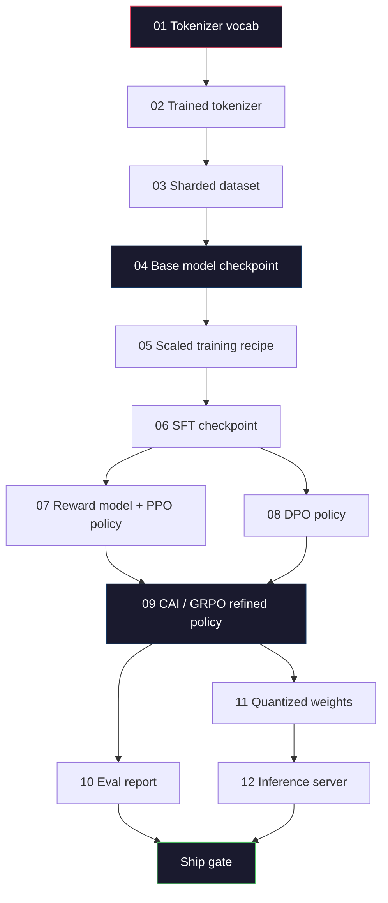
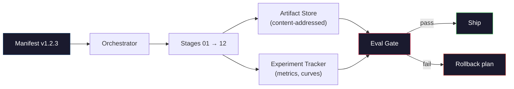

# Tam bir LLM boru hattı inşa etmek

> Derslerden 12.e kadar her şey bir boru hattının bir aşamasıdır. Bu ders, bu aşamaları tek bir uçtan sona doğru koşan bir heykelleye dönüştüren bir heykeldir: tokenize, pre-train, scale, SFT, align, evaluate, quantize, serve. 70B modelini bir dizüstü bilgisayarla eğitmeyeceksin. Orkestrasyon katmanı, manifesti, değerlendirme kapısı ve 2026 sınır ekibi tarafından neyi göndermeye karar vermek için kullanılacak geri dönüş planını üreteceksiniz. Bu, son taş.

> **【中文解读】**Bölüm 1 - 12. Ders bir boru hattının her aşamasında olacaktır. Bu ders onları biten bitene bağlayacak.

> **【拓展：端到端管线→生产实践】**Gerçek Büyük Model üretim hattı ayrıca içerir:数据版本管理、实验跟踪 (W&B)、模型注册、A/B 测试、回滚计划──

>  **【前置】**Bu, 10. aşamada yapılan bir başlık. 10'un tamamlanması gerekiyor.

>  **【类比】**完整LLM 管线 = 造车流水线。前面 12 课学了每个工位(发动机、装底盘、喷漆),本节是工厂设计师把这些工位按顺序串起来,加上"质检门"(eval gate) 、"返工通道"(rollback) 、"生产计划表"(manifest) ✿你不会亲手制造70B 模型,但你会写出让团队批量生产70B 模型的"造车手册"──

**Type:** Build
**Languages:** Python (stdlib)
**Prerequisites:** All Phase 10 lessons 01-12
**Time:** ~120 minutes

## Öğrenme hedefleri

- On bir önceki dersleri (tokenizer, veri, önceden eğitim, ölçekleme, SFT, RLHF, DPO, CAI, eval, kuantitasyon, sonuç) tek yeniden üretilebilir bir boru hattı spesifikasyonuna birleştirin.
  İlk sınıflar için, bir tek tekrarlanabilir boru hattı kuralları oluşturmak için, bir dizi metin, bir dizi metin, bir dizi metin, bir dizi metin, bir dizi metin, bir dizi metin, bir dizi metin, bir dizi metin, bir dizi metin, bir dizi metin, bir dizi metin, bir dizi metin, bir dizi metin, bir dizi metin, bir dizi metin, bir dizi metin, bir dizi metin, bir dizi metin, bir dizi metin, bir dizi metin, bir dizi metin, bir dizi metin, bir dizi metin, bir dizi metin, bir dizi metin, bir dizi metin, bir dizi metin, bir dizi metin, bir dizi metin, bir dizi metin, bir dizi metin, bir dizi metin, bir dizi metin, bir dizi metin, bir dizi metin, bir dizi metin, bir dizi metin, bir dizi metin, bir dizi metin, bir dizi metin, bir dizi metin, bir dizi metin, bir metin, bir metin, bir metin, bir metin, bir metin, bir metin, bir metin, bir metin, bir metin, bir metin, bir metin, bir metin, bir metin, bir metin, bir metin, bir metin, bir metin, bir metin, bir metin, bir metin, bir metin, bir metin, bir metin, bir metin, bir metin, bir metin, metin, bir metin, metin, metin, metin, metin, metin, metin, metin, metin, metin, metin, metin, metin, metin, metin, metin, metin, metin, metin, metin, metin, metin, metin, metin, metin, metin, metin, metin, metin, metin, metin, metin, metin, metin, metin, metin, metin, metin, metin, metin, metin, metin, metin, metin, metin, metin, metin, metin, metin, metin, metin, metin, metin, metin, metin, metin, metin, met
- Artifakt sözleşmesini aşamalar arasında tanımlayın: her aşama neyi tüketir, neyi üretir ve sonraki aşama girişleri nasıl doğruluyor
  定义阶段之间的产品契约: her aşamada ne tüketilir, ne üretilir, ne üretilir, nasıl veriliyor, nasıl veriliyor, nasıl veriliyor
- Deneyleri izleyen, eserleri hash eden ve değerlendirme eşiğinde kararları gönderen bir orkestrasyoncu oluşturun
  Közetleme cihazı oluşturmak, deneyleri takip                                                                                                                                                                                                                                                        
- Geri dönüş planını tasarlayın: Hangi eserlerin yeniden kullanımı ucuz, hangi eserlerin maliyeti yüksek ve bozuk bir kontrol noktasının maliyeti ne kadar
  设计回滚计划: hangi ürünler ucuz, hangi ürünler pahalı, hangi ürünler bozuklukla sonuçlanır

## Sorunlar. Sorunlar.

Önceki dersler her bir iş. Tokenizer eğitimi. Küçük GPT önceden eğitimi. SFT veri kümesi toplandı. Ödül modeli eğitimi. DPO çalışması. Evals ölçüldü. Kvantisasyon ağırlıkları ihraç edildi. İnferans sunucusu fırladı. Her biri bir not defteridir. Her birinin kendi sözleşmeleri, kendi çıkış yolları, kendi tohumları vardır.

> Önceki dersler her zaman çalışıyordu. 分词器训练了──迷你 GPT 预训练了──SFT 数据集组装了──奖励模型训练了──DPO 运行了──评估测量了──量化权重导出了──推理服务器启动了──每个都是一个笔记本──每个都有自己的约定,自己的输出路径──自己的种子──

Sınır eğitimleri bir defter değil. Llama 3 405B yaklaşık 54 gün boyunca 30 milyon H100 saat aldı. DeepSeek-V3 yaklaşık 2.8 milyon H800 saat kullandı. Bu süre içinde, bir bozuk kontrol noktası, bir veri kirliliği, bir değerleme geri dönüşü bir ekibe bir hafta divar saati ve bir aylık GPU bütçesine mal olabilir. Takımların bunu hayatta kalmasının yolu, boru hattı hijyeninden ibarettir: her aşamada belirleyici bir giriş, belirleyici bir çıkış, bir manifesto, bir hash ve bir kapı vardır.

> Ön kenar eğitim yürütülmesi bir not defteri değil. Llama 3 405B yaklaşık 3.000.000 H100 saat, yaklaşık 54 gün kullanmıştır. DeepSeek-V3 yaklaşık 2.80.000 H800 saat kullanmıştır. Bu arada, bir bozukluk kontrol noktası, bir kez veri kirliliği, bir kez değerlendirme geri dönüşü, takımın bir haftalık süren saat ve bir aylık GPU bütçesini kaybetmesine neden olabilir.

Bu son taş. Bir dizüstü bilgisayarda uçtan uçuna boru hattını çalıştırmayacaksınız. Adımları koordine eden orkestrayı, çalışmayı açıklayan manifestı, gemi kararlarını kontrol eden doğrulama cihazını ve üçüncü bir tarafın tek bir dosyadan çalışmanızı tekrar etmesine izin veren tekrarlama planını yazacaksınız.

> Bu en önemli ders. Yazdığın bir notun üstündeki bir işlev hattı değil. Hareketini açıklayan bir düzenleyici, işlevini açıklayan bir verifiyeci, ayrıca üçüncü tarafın tek bir dosyadan işinin yeniden çalışmasını sağlayan bir program yazacaksın.

Şekil 100M'den 1T'ye kadar değişmez. Aynı dört bileşen - manifesto, orkestrator, eval gate, artefakt depoları - Llama 3'yi çalıştırın ve hobiniz GPT'yi çalıştırın. Fark her aşamanın yapılandırmasında sayılardaki büyüklüktür, boru hattının şekli değil.

## Konsepten bir şey.

> **【中文解读】**Bu ders tüm bileşenleri tamamlanmış LLM için birleştirir                                                                                                                                                                                                                                                                                                                                                                                                                                                                                                                

> **【拓展：完整管线的成本估算】**Llama 3 70B sınıfı modelinin tam boru hattı maliyetleri: ön eğitim yaklaşık 200-500 milyon dolar (GPU 时间), SFT yaklaşık 1-50.000 dolar (SFT) (RHF/DPO) (RHF/DPO) (RHF/DPO) (RHF/DPO) (RHF/DPO) (RHF) (RHF) (RHF) (RHF) (RHF) (RHF) (RHF) (RHF) (RHF) (RHF) (RHF) (RHF) (RHF) (RHF) (RHF) (RHF) (RHF) (RHF) (RHF) (RHF) (RHF) (RHF) (RHF) (RHF) (RHF) (RHF) (RHF) (RHF) (RHF) (RHF) (RHF) (RH) (RH) (RH) (RH) (RH) (RH) (RH) (RH) (RH) (RH) (RH) (RH) (RH) (RH) (RH) (RH) (RH) (RH) (RH) (RH) (RH) (RH) (RH) (RH) (RH) (RH) (RH) (RH) (R) (RH) (R) (RH) (R) (R) (R) (RH) (R) (R) (R) (RH) (R) (R) (R) (R) (R) (R) (R) (R) (R) (R) (R) (R) (R) (R) (R) (R) (R) (R) (R) (R) (R) (R) (R) (R) (R) (R) (R) (R) (R) (R) (R) (R) (R) (R) (R) (R) (R) (R) (R) (R) (


### On İki Adım

Her 10. aşama dersi bir aşama. İşte tam bağımlılık grafiği.



7. ve 8. aşama paralel olarak çalışabilir. Diğer her şey zor bir bağımlılık. 2. aşamada bir değişiklik (tokenizer) her aşağı akımlı eserini geçersiz kılar. 10. aşamada bir değişiklik (eval) sadece gemi kararını geçersiz kılar.

> 阶段 07 和 08 可以并行运行──其他都是硬依赖──阶段 02(分词器) 变更使所有下游产品失效──阶段 10(评估) 变更使发布决策失效──

### Açıklama

Bir manifesto, bir çalışmayı tekrarlamak için yeterince tamamıyla tanımlayan tek bir dosyadır. Pipeline'nin ürettiği hiçbir şey manifestoda olmayan bir durumdan bağlı olmamalıdır. Alanlar sıkıcı ve zorunludur.

```
pipeline_version: 1.2.3
seed: 42
git_commit: a1b2c3d4
stages:
  01_tokenizer:
    recipe: bpe_32k
    input_hash: sha256:...
    output_hash: sha256:...
    wall_clock_sec: 3600
    cost_usd: 12
```

N aşamasının çıkış hashı N+1 aşamasının giriş hashıdır. Herhangi bir sapma ve boru hattı durur. Verilerin yolsuzluğunu erken yakalamanın yolu budur. Aynı zamanda farklı bir kıtadaki bir takım arkadaşının tekrarlamanın sizinkiyle aynı eser ürettiğini doğrulamasıdır.

Pratikte ekipler, küçük bir YAML şeması ve önceki başarılı çalışmaya karşı farklı bir manifesto kontrolcüsü kullanır.

### Sanatlı Tipleme

Her aşama çıkışı bir türden eser, bir dizin leke değil, bir çürük değil, bilinen bir şema ile isimli bir tip.

| Stage | Artifact Type | Key Fields |
|-------|--------------|-----------|
| 01-02 | Tokenizer | vocab.json, merges.txt, config.json, hash |
| 03 | Dataset | shards[], row count, token count, dedup stats |
| 04-05 | Checkpoint | weights.safetensors, config.json, optimizer state, step count |
| 06 | SFT Model | checkpoint + SFT recipe + data mix |
| 07 | Reward Model | RM checkpoint + preference data hash |
| 08-09 | Policy | checkpoint + reference hash + beta + KL budget consumed |
| 10 | Eval Report | benchmark scores + regression diffs + eval data hash |
| 11 | Quantized Model | quantized weights + calibration data + accuracy delta vs FP16 |
| 12 | Server Spec | endpoint + model hash + config + observability hooks |

Yazılama en yaygın hata modunu önler: aşama 06 giriş olarak aşama 08 çıkışı kullanmak, SFT yoluyla DPO eğitilmiş bir model göndermek. Yazılı eserler ve yazılı aşama imzaları bu hataları beş günlük başarısızlıklar değil, bir dizi oluşturma zamanında başarısızlıklar yapar.

### Eval Kapısı

Nakliye "eğitim bitti". Nakliye "eğitim bitti ve değerlendirme kapısı geçti". Kapısı koşunun başlamadan önce tanımlanır.

```
gates:
  mmlu:      >= baseline + 0.5   # no regression
  humaneval: >= baseline + 1.0
  truthfulqa: >= baseline         # no drop
  safety_refusal_rate: <= 0.05
  kl_from_reference: <= 25.0
  cost_total_usd: <= 50000
```

Her kapı sayısal bir eşiğdir. "iyi görünen" kapılar yoktur. Süsjatif işaretler yoktur. Her kapı geçerse, eser gönderilebilir olarak işaret edilir. Eğer herhangi bir kapı başarısız olursa, atılan bir değerlendirici tarafından açık bir şekilde geçerli olmasını bekleyen bir atama yapılır.

İki kapı en çok felaketleri yakalar. * gerileme* kapısı (yeni modelin temel referans değerleri ile ilgili önceki modelin en az aynı derecede iyi olması gerekir) eğitim hatalarını yakalar. * KL bütçe* kapısı (ağırlaştırılmış politika referansından X'den daha fazla uzaklaşmamalıdır) uyum aşımını yakalar. Her üretim borusunda her ikisi de vardır.

### Orkestratör

Bu, Airflow değil, Kubeflow değil. Boru hattı hijyenine göre, yazmış olduğun sıkıcı bir şey istersin.

Orkestratörün işi dar.

1. Günlüğü defterden çıkar.
2. Her aşama için beklenen çıkışın doğru hash'te zaten var olup olmadığını kontrol edin (eğer varsa atlayın).
3. Sahneyi çalıştır, stdout/stderr yakalay, duvar saati ve maliyetini ölç.
4. Çıktı hash'i aşağıdaki aşamada beklenen giriş hash'ine karşı doğrulayın.
5. Başarısız olduğunda, tam başarısızlık aşamasıyla kısmi bir manifesto yazın ve sıfır dışı çıkın.

Python'un 200 satırı.`code/main.py`Kapusun altında gerçek boru hattı kullanıyor.`torchrun`veya `ray`Gruplar üzerinde bireysel aşamaları yürütmek için, ama orkeströr tek bir kutu üzerinde çalışır.

### Deneyim Takip ve Sanatlı Sanatlılar Depolama

İki dış sistem boru hattını demirleştiriyor.

**Experiment tracker (wandb, neptune, mlflow).**Kayıt kaybı eğrilikleri, değerlendirme ölçümleri, sistem telemetrisi aşama başına. A ile B yarışını üç hafta sonra karşılaştırmak için gittiğiniz yer izleyici. Takımlar neredeyse her zaman bunun için barındırılmış bir izleyici kullanır. kendi yazınızı yazmak eğitim için gitmesi gereken zaman kaybeder.

**Artifact store (S3, R2, GCS).**Kontrol noktaları, veri kümeleri, tokenizerler, eval raporları için değişmez nesne depolama.`latest.pt`- Bir tabanca.`ckpt-7b-step-20000-sha256:abc123.safetensors`- Bu bir sözleşme.

Orkestratör her ikisine de yazıyor. Takipçi insan için haritaları izliyor. Sanatçı mağazası bir sonraki aşama için girişleri arıyor.

### Maliyet

Sınır koşusunda bir dolar numarası yer alır.

**Pre-run estimate.**Manifesto'dan, beklenen FLOPs'i (öğrenme öncesi için: 6 x param x token), beklenen GPU saatlerini (FLOPs / en yüksek throughput / utilization) ve dolar maliyetini mevcut kira oranıyla hesaplayın.

**In-run tracking.**Bu nedenle, bir süre sonra, bir süre sonra, bir süre sonra, bir süre sonra, bir süre sonra, bir süre sonra, bir süre sonra, bir süre sonra, bir süre sonra, bir süre sonra, bir süre sonra, bir süre sonra, bir süre sonra, bir süre sonra, bir süre sonra, bir süre sonra, bir süre sonra, bir süre sonra, bir süre sonra, bir süre sonra, bir süre sonra, bir süre sonra, bir süre sonra, bir süre sonra, bir süre sonra, bir süre sonra, bir süre sonra, bir süre sonra, bir süre sonra, bir süre sonra, bir süre sonra, bir süre sonra, bir süre sonra, bir süre sonra, bir süre sonra, bir süre sonra, bir süre sonra, bir süre sonra, bir süre sonra, bir süre sonra, bir süre sonra, bir süre sonra, bir süre sonra, bir süre sonra, bir süre sonra, bir süre sonra, bir süre sonra, bir süre sonra, bir süre sonra, bir süre sonra, bir süre sonra, bir süre sonra, bir süre sonra, bir süre sonra, bir süre sonra, bir süre sonra, bir sürece, bir sürece, bir sürece, bir sürece, bir sürece, bir sürece, bir sürece, bir sürece, bir sürece, bir sürececececece, bir sürececececececececececececececece, bir sürececececececececececececececececececececececececececececececececececececececececececececececececececececececececececececececececececececececececececececececececececececececececececececececececececececececececececececececececececececececececececececececececececececececececececececececececececececececececececececececececececececececececececececececececececececececececececececececececececececececececececececececececececececececececececece

Llama 3'ün rapor edilen maliyeti $61M. DeepSeek-V3 reported $Ana antrenman öncesi koşusu için 5.6M. oran çoğunlukla donanım verimliliği artı uzman karışımıdır -- ama özel maliyetler görünür çünkü her iki takım da her aşama için takip etti, her koşuya değil.

### Tekrarlanılabilirlik vs. Determinizm

Bunlar aynı değildir. * Tekrarlanılabilir* aynı manifesto artı aynı kod artı aynı altyapı, eşdeğer aşağı akım ölçümleri ile bir kontrol noktası üretir. * Deterministik* bit-tıpkı output anlamına gelir.

Modern LLM eğitiminin çoğaltılması mümkün ama belirleyici değildir. dağıtılmış eğitimlerin azaltma sırası, GPU çekirdeği belirsizliği (cuBLAS, flash-attn) ve karışık hassaslık yuvarlaması, koşular arasında 1e-5 düzeyinde farklı olan yüzenler üretmek için birleştirilir. Bu, hareket etmeyen son ölçüler için iyi. Bit seviyesindeki farklılıklarla hata yapmayı denerseniz ölümcül olur. Tedavi, her aşamanın giriş, çıkış ve başlık ölçümlerini kaydetmektir. Eğer bunlar eşleşirse, ağırlıklar bit-tıpkı aynı olmasa bile, koşus "sözlenir".



### Rollback Planı

Yarış başlamadan önce, her aşamanın başarısızlığından sonra neler olduğunu yazın.

- **Cheap to re-run**Tokenizer, eval, quantization, inference server.
- **Medium**(günler): SFT, DPO, CAI. Temel modelini koruyun; sadece uyum aşamalarını tekrar çalıştırın.
- **Expensive**Bu yüzden, bu programın amacı "son iyi kontrol noktasını kullanmak ve daha ucuz aşağıdaki aşamaları gözden geçirilmiş verilerle tekrar çalıştırmak".

Etap bağımlılıkları yazıldığı ve hash edildiği için orkeströr geri dönüş setini otomatik olarak hesaplayabilir: başarısız aşamayı ekleyerek her bir soyluyu geçersiz kılar. Etap 06'da bir başarısızlık 06, 07, 08, 09, 10, 11, 12'yi geçersiz kılar.

### 2026'da Yapım Reçepleri

Çoğu sınır takımları aynı iskelet üzerinde toplandı.

- 128k BPE, byte fallback ile.
- Ön eğitim: 10-20T tokenleri, çoğunlukla web + kod + sentetik. Muon veya AdamW optimizer. FSDP2 veya DeepSpeed ZeRO-3. Gradient kontrol noktası. BF16 ağırlıkları, FP32 ustası.
- SFT: 500k-2M talimat çiftleri, insan ve sentetik karışık, eval seti ile sıkı bir dedup ile.
- Uyum: DPO veya CAI + GRPO. RLHF sadece tercih sinyali DPO için çok çok boyutlu olduğunda.
- Eval: MMLU-Pro, MATH, HumanEval+, GPQA, SWE-Bench Verified, LiveBench, ek olarak halka hiç görünmeyen özel bir set.
- Kvantisa: Servis için 4 bit GPTQ veya AWQ, doğruluktan etkilenen güvenlik değerlendirmeleri için 8 bit.
- Servis: vLLM, TensorRT-LLM veya iç iç. Sürekli serileme. Speküel şifreleme. KV önbelleği çıkarma.

Sayılar altı ayda bir değişir.

```figure
beam-search
```

## Yapın

> **【拓展：训练管线的工程挑战】**完整LLM 训练管线的工程挑战包括:检查点管理(每 N 步保存模型状态,训练中断后可恢复) 日志和监控(WandB 追踪损失曲线、学习率、吞吐量) 超参数搜索、故障恢复──


## Yapın.

Dersin kodu on iki eğitim senaryosu değil, bir orkeströr ve bir manifesto kontrolçüsüdür. Her aşama doğru şekil ve hasş ile bir çıkış eser üreten bir yer tutucu ile simüle edilir. orkeströrün sonundan sonuna çalıştırılması, gerçek aşamalarda GPU parasını yakmadan önce boru hattının tesisat işlevlerini kanıtlar.

> Bu ders kodu, 12 eğitim kitabı değil, düzenleyici ve düzenleme denetleyicisi. Her aşamada, konum simülasyonu, doğru şekil ve hash çıkış ürünlerini üretmek için bir düzenleyici ve düzenleme kontrol cihazı kullanılır.

- Bu boru hattı .`main.py`Bu program, 12 yer tutma aşamasını çalıştırır, bir manifesto üretir ve bir yürütme çalışmasının nasıl göründüğünü göstermek için başarısız bir değerleme kapısı kullanır.

> `main.py`Orta boru hattı 12 pozisyon aşamasında çalışarak, bir liste çıkardı ve bir başarısız değerlendirme kontrolü denedi.

## Çerçeveyi kullanın.

Kanonik iş akışı üç komutdan oluşur.

> 標準工作流 üç emir vardır.

Çık .`plan`Çoğu boru hattı hataları planlama zamanında ortaya çıkar. Kayıp kapı eşiği, eski hash, bütçe aşmaları.`plan`- Özgür.`run`Pahalı tarafta böcek yakalayarak para biriktirir.

> Her seferinde.`plan`                                                                                                                                                                                                                                                              `plan`免费──运行 `run`昂贵――在便宜的一侧捕获 bug 省钱――

`gate`Ya da`SHIP`veya `HOLD: <reason>`. Bir yürütme başarısızlık değildir; bir karar noktasıdır. Adlı bir değerlendirici ya geçersiz kılar (ve geçersiz kılar kaydedilir), ya da geri dönüşü onaylar.

> `gate`Çıkışın`SHIP`Ya da`HOLD: <reason>`◊ ◊ ◊ ◊ ◊ ◊ ◊ ◊ ◊ ◊ ◊ ◊ ◊ ◊ ◊ ◊ ◊ ◊ ◊ ◊ ◊ ◊ ◊ ◊ ◊ ◊ ◊ ◊ ◊ ◊ ◊ ◊ ◊ ◊ ◊ ◊ ◊ ◊ ◊ ◊ ◊ ◊ ◊ ◊ ◊ ◊ ◊ ◊ ◊ ◊ ◊ ◊ ◊ ◊ ◊ ◊ ◊ ◊ ◊ ◊ ◊ ◊ ◊ ◊ ◊ ◊ ◊ ◊ ◊ ◊ ◊ ◊ ◊ ◊ ◊ ◊ ◊ ◊ ◊ ◊ ◊ ◊ ◊ ◊ ◊ ◊ ◊ ◊ ◊ ◊ ◊ ◊ ◊ ◊ ◊ ◊ ◊ ◊ ◊ ◊ ◊ ◊ ◊ ◊ ◊ ◊ ◊ ◊ ◊ ◊ ◊ ◊ ◊ ◊ ◊ ◊ ◊ ◊ ◊ ◊ ◊ ◊ ◊ ◊ ◊ ◊ ◊ ◊ ◊ ◊ ◊ ◊ ◊ ◊ ◊ ◊                                                                                                                                                                                                                                              

## İndirin . Ürünler .

Bu ders bize çok yararlı .`outputs/skill-llm-pipeline-reviewer.md`. Bu projeyi bir proje hattı manifesti ile besler ve tüm kontratları kontrol eder: aşama yazımı, hash zinciri, kapılar, geri dönüş planı, maliyet tahminleri.

> 本课产 出 `outputs/skill-llm-pipeline-reviewer.md`❖ İçeriye giriş önerisi için tüm anlaşmaları kontrol eder: aşama tipi, haşlı zincir, kontrol, geri dönüş planı, maliyet tahminleri.

## Egzersizler.

1. Orkestratörü 07 ve 08 aşamaların paralel çalıştırılmasını desteklemek için uzatın.`concurrent.futures`Modül. Son manifesto kayıtları her iki aşamalın çıkışlarını ve aşamalın 09 giriş hashinin her ikisinin de belirleyici bir kombinasyonu olduğunu doğrula.
   Çinçe Çevirisi:扩展编排器支持阶段 07 和 08 的并行执行──使用标准库 `concurrent.futures`模块──确认最终清单记录两阶段的输出,且阶段09 的输入哈希是两阶段的输入的确定性组合──

2. "Kontaminasyon kontrolü" kapısı ekleyin. eval veri kümesi hash ve eğitim veri kümesi parçalarını göz önüne alarak, üst üstelik (tam bir string eşleşimi veya 13 gram eşleşimi) hesaplayın.
   Çinçe çevirisi:                                                                                                                                                                                                                                                            

3. İlk ilkelerden maliyet tahmincisi uygulayın. 04 aşamada (öğrenmeden önce), FLOP'leri 6 x param x token olarak tahmin edin, H100'de %40 MFU (model FLOP kullanım) varsayın 989 TFLOPs BF16, saatte $2.50 / GPU. 2T tokenlerde eğitilmiş bir 7B modeli için tahmin bildirin. Yayınlanan Llama 2 sayıları ile karşılaştırın.
   Çinçe çevirme: from第一性原理实现成本估算器──对阶段 04(预训), FLOPs için 6 x 参数 x token,假设 H100 上 40% MFU(模型算力利用率),989 TFLOPS BF16, $2.50/GPU-小时──報告 7B 模型在 2T token 上训练的估算──与已发表的Llama 2 数据比较──

4. Bölümsel bir geri dönüş oluşturun. 9. aşamada bir başarısızlığı simüle edin (CAI), ardından 01-08'yi önbelleğe bırakırken 09 ila 12. aşamaları tekrar çalıştırın. Orkestratör önbelleğe alınmış eserleri hash ile algılamalı ve atlamalıdır.
   Çinçe çevirisi: yapı yapı kısası döner. 模拟阶段 09(CAI) başarısız, sonra tekrar koşmak için 09-12 同时保持 01-08 缓存。编排器应通过哈希检查缓存产品并跳过──测量相比完整重跑节省的挂钟时间──

5. Gözetilebilirliği ekleyin. Her aşama için OpenTelemetry alanlarını gönderin, parametre, görülen token, kayıp ve maliyet için özellikler bulunur. alanları yerel bir koleksiyoncuya çakın.
   Çin dilinde: 添加可观测性── için her aşamada OpenTelemetry uzadı,带参数、已见代币、损失和成本属性── 将跨度 管道到本地收集器──重点不是仪表盘;重点是每个阶段的健康可从单个追踪ID 追踪──

## Anahtar Şartlar .

| Term | What people say | What it actually means | 中文释义 |
|------|----------------|----------------------|---------|
| Manifest | "The recipe file" | YAML or JSON describing pipeline version, seed, per-stage config, and gate thresholds — sufficient to replay a run | 清单文件，描述管线版本、种子和每阶段配置 |
| Content-addressed | "By hash not name" | Artifacts stored by SHA-256 of their contents, so you can never confuse version A with version B | 内容寻址，按 SHA-256 哈希存储产物 |
| Eval gate | "The ship criteria" | Numeric thresholds on benchmark metrics and safety scores that must pass before an artifact is marked shippable | 评估门控，基准和安全分数必须达标才能发布 |
| KL budget | "How far alignment drifted" | A cap on cumulative KL(policy || reference) across alignment stages, enforced as a gate | KL 预算，对齐阶段累计 KL 散度的上限 |
| MFU | "How much of the GPU you used" | Model FLOPs Utilization — achieved FLOPs divided by theoretical peak. 40% is typical at 70B scale, 55% at 7B | 模型算力利用率，实际 FLOPs / 理论峰值 |
| Rollback plan | "What we do when it breaks" | Pre-written set of actions per stage on failure: re-run, fall back, retrain with revised inputs | 回滚计划，每个阶段失败时的预设行动方案 |
| Orchestrator | "The conductor" | The process that reads the manifest, dispatches stages, verifies hashes, halts on any contract violation | 编排器，读取清单、调度阶段、验证哈希 |
| Artifact store | "Versioned S3 for weights" | Immutable content-addressed object store — single source of truth for checkpoints, datasets, eval reports | 产物存储，不可变的内容寻址对象存储 |
| Reproducible | "Same metrics on replay" | Different bit-level weights but equivalent downstream metrics — the realistic target for distributed LLM training | 可复现，重跑时指标等价（权重可能不同） |
| Cost gate | "You cannot exceed X" | Pre-run cost estimate plus in-run tracker — the pipeline refuses to start if the estimate exceeds budget | 成本门控，预估超预算则拒绝启动 |

## Daha fazla okumak

- [Dubey et al., 2024 -- "The Llama 3 Herd of Models"](https://arxiv.org/abs/2407.21783)-- sınır boru hattının verileri, eğitim, uyum, değerlendirme dahil olmak üzere en detaylı kamu açıklaması
- [DeepSeek-AI, 2024 -- "DeepSeek-V3 Technical Report"](https://arxiv.org/abs/2412.19437)-- verimlilik ilk boru hattı yaklaşık olarak Llama 3 sınıfı eğitim maliyetinin onunda biri
- [Kaplan et al., 2020 -- "Scaling Laws for Neural Language Models"](https://arxiv.org/abs/2001.08361)-- orijinal hesaplama- veri-param ölçekleme ilişkisi
- [Hoffmann et al., 2022 -- "Training Compute-Optimal Large Language Models (Chinchilla)"](https://arxiv.org/abs/2203.15556)-- Kaplan'a yapılan düzeltme modern veri bütçelerini yeniden kalibrlemişti
- [PyTorch FSDP2 documentation](https://pytorch.org/docs/stable/fsdp.html)-- PyTorch 2.4+'de FSDP1'i değiştiren dağıtılmış eğitim primitif
- [Weights & Biases LLM Reports](https://wandb.ai/site/llms)-- açık kaynaklı LLM çalışmalar için gerçek manifestolar ve deney takipçisi çıkışı, plagiat edilebilir şablonlar olarak kullanışlı
