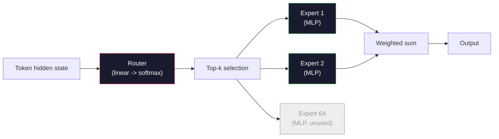

# Açık Modeller: Mimarlık Yürüyüşleri .

> Ders 04'te sıfırdan küçük bir GPT-2 yaptın. 2026'da sınır açık modeller beş veya altı tane değişikliğe sahip aynı aile. LayerNorm yerine RMSNorm. Gelü yerine SwiGLU. Öğrenilen pozisyonlar yerine RoPE. Tam bir MHA yerine GQA veya MLA. Uzmanların karışımı. Bildiğiniz matematik, bunların %95'ini kapsar. Bu ders Llama 3, DeepSeek-V3, Mixtral, Qwen ve Gemma'yı yan yana okuyor ve her mimarlığın ayrıldığı tam çizgiyi belirliyor.

> **【中文解读】**4. sınıfta GPT-2 Small'ı oluşturdu. 2026 yılının ön kenarındaki açık kaynak modeli sadece beş değişiklik yaptı: RMSNorm  LayerNorm  SwiGLU  GELU  RoPE  Learning Position Coding  GQA / MLA                                                                                                                                                                                                                                                                                                                                                                                                                                                                   

> **【拓展：DeepSeek架构】**DeepSeek-V3'in anahtarı yenilik:MLA(多头潜在注意力,压缩 KV-cache) 无助损失的MoE 负载均衡、MTP(多代币 预测) ve DualPipe 训练――理解这些架构选择是理解2025-2026年大模型发展方向的关键――

>  **【前置】**学本节前 請先掌握:Base 10·04(Pre-Training Mini GPT) 理解原始 GPT 架构;Base 10·05(Skaling);Base 10·12(Inference Optimization) 理解 KV cache 才能懂 MLA。本节是后续 15-22 节(架构创新详解) 的概览。

>  **【类比】**Gör 2026 开源模型 = 看不同品牌的电动车──Llama 3 = 特斯拉(务实,GQA + RoPE 标准配置);DeepSeek-V3 = 比亚迪(堆料王,MLA + MoE + MTP + DualPipe 全套);Mixtral = 大众 ID(MoE 老牌);Qwen = 小(多尺寸覆盖);Gemma = 沃尔沃(精简安全)──底层都是变压器(电动车底盘),差异在 5-6个关键模块──

**Type:** Learn
**Languages:** Python (stdlib)
**Prerequisites:** Phase 10, Lessons 04, 05, 12 (Pre-training, Scaling, Inference)
**Time:** ~45 minutes

## Öğrenme hedefleri

- Llama 3, Mistral, Mixtral, Gemma 2, Qwen 2.5 ve DeepSeek-V3'in config.json'unu okuyun ve her alanı açıklayın.
  Llama 3'ü okuyun, Mistral, Mixtral, Gemma 2'yi okuyun, Qwen 2.5 ve DeepSeek-V3'ün yapılandırması.
- Her modelin GPT-2 Small ile karşılaştırıldığında yapıldığı özel mimari değişikliğin adını verin ve ilk ilkelerden haklı çıkarın.
  Her modelin GPT-2 Küçük'ün özel yapısal değişikliklerini açıklamak, temel ilkelerden bahsetmek
- Hesaplama parametreleri sayımı, KV önbelleğinin boyutu ve yalnızca yapılandırmasından herhangi bir açık model için etkinleştirme belleği
  Configuration sadece herhangi bir açık kaynak modeli parametre sayısı hesaplamak  KV 缓存大小和激活内存
- Uygulama hedefi için doğru açık model seçin, gecikme, bellek ve kapasite kısıtlamaları verilir
  Geçit ̳ bellek ve kapasite sınırlarına göre, görevlendirme amacıyla uygun açık kaynak modeli seçmek

## Sorunlar. Sorunlar.

Ders 04'te 350 satır numpy yazdın ve GPT-2 şeklinde bir model aldın. Llama 3 405B'nin 200 sayfalık bir teknik raporu var. İçgüdülerin, bunlar farklı canavarlar. - Hayır, değiller. 200 sayfa aynı nesneyi beş veya altı iyi motive edilmiş değişiklikle ve ölçeklendirme ile ilgili binlerce uygulama ayrıntılarıyla tanımlar. Skelet - yerleşim, transformatör blokları, dikkat, MLP, norm, baş - değişmez.

> Dördüncü sınıfta 350 satır numpy'yi yazdın GPT-2 şekli modelini. Llama 3 405B'nin 200 sayfalık bir teknik raporu var. İnsiniz size bunların tamamen farklı şeyler olduğunu söylüyor. Aslında değil. 200 sayfa aynı nesneyi, sadece 5-6 tam olarak hareketli değişiklikleri ve genişleme gerçekleşmesi hakkında bin detayını anlatıyor.

Bu ders farklı bir ders. Her büyük açık model ailesi için, GPT-2'den neyin değiştiğini ve neden ve ne kadar maliyetini listedeceğiz.

> Bu ders bir farkı vardır. Her bir temel açık kaynaklı model ailesine göre GPT-2'nin neyi değiştirdiğini, neyi değiştirdiğini, neyi değiştirdiğini, neyi değiştirdiğini, neyi değiştirdiğini, neyi değiştirdiğini, tamamlandıktan sonra yeni bir model kartını okuyabilir ve beyninde GPT-2'nin temel hattını okuyabilirsiniz.

Meta'nın Llama 5 veya DeepSeek'in V4'i yayınladığı zaman yeni bir zihinsel modelye ihtiyacınız olmayacaktır. Yapılandırmaya bakacaksınız, bilinen düğmelerden hangisini taşıyacaksınız ve aşağıdaki etkileri ne olduğunu bileceksiniz. 2026 mimarileri bir sınırlı araç kutusu. Her yeni model farklı bir alt kümesi seçer.

> 实际收益是: Meta 发布时 Llama 5 或 DeepSeek 发布时 V4,你不需要新的心智模型──你看配置,看哪些已知旋被调整,就知道下游影响是什么──2026 yılının yapısı sınırlı bir araç kutusu──每个新模型选择不同的子集──

## Konsepten bir şey.

> **【中文解读】**Bu ders, bir sonraki ders için, bir sonraki ders için, bir sonraki ders için, bir sonraki ders için, bir sonraki ders için, bir sonraki ders için, bir sonraki ders için, bir sonraki ders için, bir sonraki ders için, bir sonraki ders için, bir sonraki ders için, bir sonraki ders için, bir sonraki ders için, bir sonraki ders için, bir sonraki ders için, bir sonraki ders için, bir sonraki ders için, bir sonraki ders için, bir sonraki ders için, bir sonraki ders için, bir sonraki ders için, bir sonraki ders için, bir sonraki ders için, bir sonraki ders için, bir sonraki ders için, bir sonraki ders için, bir sonraki ders için, bir sonraki ders için, bir sonraki ders için, bir sonraki ders için, bir sonraki ders için, bir sonraki ders için, bir sonraki ders için, bir sonraki ders için, bir sonraki ders için, bir sonraki ders için, bir sonraki ders için, bir sonraki ders için, bir sonraki ders için, bir sonraki ders için, bir sonraki ders için, bir ders için, bir sonraki ders için, bir ders için, bir sonraki ders için, bir ders için, bir sonraki ders için, bir ders için, bir ders için, bir ders için, bir ders için, bir ders için, bir ders için, bir ders, bir ders, bir ders, bir ders, bir ders, bir ders, bir ders, bir ders, bir ders, bir ders, bir ders, bir ders, bir ders, bir ders, bir ders, bir ders, bir ders, bir ders, bir ders, bir ders, bir ders, bir ders, bir ders, bir ders, bir ders, bir ders, bir ders, bir ders, bir ders, bir ders, bir ders, bir ders, bir ders, bir ders, bir ders, bir ders, bir ders, bir ders, bir ders, bir ders, bir ders, bir ders, bir ders, bir ders, bir ders,

> **【拓展：架构演进的趋势】**2024-2025 yıllarındaki yapı eğilimleri:RoPE  dönüşümlü konum kodları mutlak konum kodlarını değiştirdi,GQA 分组查询注意力) KV-cache'yi azalttı,SwiGLU 替代 ReLU 性能 yükseldi,RMSNorm 替代 LayerNorm 计算开销を減少させた──MoE 混合专家)稀疏激活により推理コストを低下させた,DeepSeek-V3'in MoE'si her seferde sadece 37B/671B 参数を激活した―


### Değişmeyen Çekirdek

Tüm autoregressive açık modeller paylaşır:

- Token yerleştirme matrisi (vocab_size x hidden_dim).
- N dekodör blokları: norm, kendinize dikkat, kalıntı, norm, MLP, kalıntı.
- Son norm ve doğrusal baş, vocab_size (sık sık gömülü ağırlıklı) olarak projeksine edilir.
- Sebep maskası, bir sonraki token çapraz entropi kaybı.

Bu şekil, geri kalanı düğümler.

### Aslında Hareket Eden Altı Kürek

2024-2026 yılları arasında her açık modelde aynı altı tasarım seçeneği tekrar tekrar seçilir:

1. **Normalization.**LayerNorm -> RMSNorm.
2. **Positional encoding.**Öğrenilmiş mutlak -> RoPE (daha farklılıklar: YaRN, NTK).
3. **Activation.**GELU -> SwiGLU (veya GeGLU).
4. **Attention head sharing.**MHA -> GQA -> MQA -> MLA.
5. **Dense vs sparse MLP.**Dense -> Uzmanların karışımı.
6. **Pre-norm placement.**Normalden önce kalır, normalden sonra yok.

Diğer her şey (öğrenme oranı programı, veri karışımı, parti boyutu, bağlam uzunluğu) mimarlıkta değil eğitim yapılandırmasında yaşar.

### Kürek 1: RMSNorm

LayerNorm ortalamayı çıkarır, std, ölçekler ve değişimler ile bölür. RMSNorm sadece ölçeği tutar:

```
RMSNorm(x) = x / sqrt(mean(x^2) + eps) * gamma
```

Bir tane daha az matmul. Zhang ve Sennrich (2019) makine çevirisi üzerinde LayerNorm'a eşleştiğini ve %10 daha hızlı olduğunu savundu.

Maliyet: hiç. Fayda: küçük bir geçiş kazanımı, daha basit bir kod.

### Kürek 2: RoPE

Öğrenilen pozisyon yerleşimleri GPT-2'de 1024 slot arama masasıydı. Kontext 1025 masanın sonundan uzakta.

Rotary Position Embedding (RoPE, Su et al. 2021) dikkat noktası ürününün önüne her Q ve K vektörünü çift olarak döndürerek pozisyonu enjekte eder. Dönüş açısı, konumların belirleyici bir fonksiyonu, bu yüzden öğrenilen ve tükenmesi gereken bir şey yok. Ölçekleme hileleri (NTK-Aydın Interpolasyon, YaRN), 8k bağlamında eğitilmiş bir model, ölçülü doğruluk kaybı ile 128k'ye kadar uzanabilir.

```
q_rotated = rotate(q, angle(pos))
k_rotated = rotate(k, angle(pos))
score = q_rotated . k_rotated
```

Her Llama, Mistral, Qwen, DeepSeek ve Gemma RoPE kullanır. Gemma 2 bir hibrid kullanır (çoğu katmanlarda RoPE, diğerlerinde yerel kaydırıcı pencere dikkat).

### Kürek 3: SwiGLU

GPT-2'nin MLP'si `x -> gelu(xW1 + b1) -> (...)W2 + b2`SwiGLU (Shazeer 2020) aktivasyonu kapalı bir ürünle değiştirir:

```
SwiGLU(x) = (xW1) * sigmoid(xW1) * xV
```

Bir yerine paralel olarak iki projeksiyon, Swish etkinleştirmesi ile kapalıdır. Parametre başına karmaşıklığa karşı empiri olarak daha güçlü. Llama 2 onu kabul etti, herkes takip etti. MLP'nin gizli boyutu genellikle toplam parametre sayısının orijinal yoğun MLP'ye eşleşmesi için ayarlanır: eğer GPT-2 kullanıldı `ff_dim = 4 * hidden`, SwiGLU kullanıyor `ff_dim = (2/3) * 4 * hidden = 8/3 * hidden`- Evet .

### Dörtüncü düğüm: Dikkat Baş Paylaşım

GPT-2 kullanıldı **Multi-Head Attention (MHA)**Her başın kendi Q, K, V projeksiyonu vardır.

**Multi-Query Attention (MQA, Shazeer 2019)**KV önbelleğini num_heads ile keser, bu da tipik bir modelde 12x ila 32x azaldır.

**Grouped-Query Attention (GQA, Ainslie et al. 2023)**orta nokta: Q başlarının G grupları bir K ve bir V paylaşır. Llama 3 8B 32 Q başı ve 8 KV başı ile GQA kullanır (G=8), bu nedenle KV önbelleği tam MHA ile karşılaştırıldığında 4 kat küçülür.

**Multi-Head Latent Attention (MLA, DeepSeek 2024)**K ve V'yi ortak bir düşük sıralama gizli bir hale sıkıştırır ve onları baş başına geri doğru yansıtır. Baş başına ifade gücünü korurken KV önbelleğini daha da azaltır. DeepSeek-V2 ve V3 uzun bağlamlı performansları için buna güveniyor.

| Scheme | KV Heads | KV Cache | Accuracy |
|--------|----------|----------|----------|
| MHA    | num_heads | full | best |
| GQA    | num_groups (G < num_heads) | num_heads / G reduction | near-MHA |
| MQA    | 1 | num_heads reduction | small hit |
| MLA    | latent, per-head decompression | smaller than MQA | near-MHA |

~ 13B parametrelerinden yüksek herhangi bir model için, GQA veya MLA etkin olarak zorunludur.

### 5. düğüm: Uzmanların karışımı

Dense bir MLP, her token için tüm parametrelerini etkinleştirir. MoE MLP'de blok başına K uzmanları ve bir yönlendiricisi vardır.

```
router_logits = xW_r
indices, weights = top_k(router_logits, k=2)
output = sum_i weights[i] * expert[indices[i]](x)
```

İstihbar: her bir tane 7B boyutlu 64 uzmanı olabilir (böylece toplam param sayı büyüktür) ve onlardan sadece 2 tane bir token için çalıştırılır (böylece token başına hesaplama yoğun bir 7B modeline eşleşir). Mixtral 8x7B'nin toplam parametreleri 47B'dir, ancak her token başına sadece 13B'yi etkinleştirir. DeepSeek-V3'nin toplam parametreleri 671B'dir, ancak her token başına sadece 37B'yi etkinleştirir.



Avantajlar: aynı hesaplama, daha fazla parametre, daha iyi kapasite. Ekspert belleği hala bir yerde yaşamalı (böylece servis yoğun bir eşdeğeri daha fazla VRAM gerektirir), yönlendiricinin yük dengeleme zor ve yönlendiricinin ayarlama sırasında ince ayarlanması kendi araştırma alanıdır.

### Kürek 6: Normalden önce kalır

GPT-2'den bu yana her açık model, her alt katmanın önüne * koymuştur. Pre-norm derinlikte eğitilmek için kesinlikle daha kolaydır.

### Model-Model Fark

İşte bütün bu betonları yapan masa.

| Model | Year | Total Params | Active Params | Norm | Activation | Position | Attention | MoE | Context |
|-------|------|-------------|---------------|------|-----------|----------|-----------|-----|---------|
| GPT-2 Small | 2019 | 124M | 124M | LayerNorm | GELU | Learned | MHA (12 heads) | no | 1k |
| Llama 3 8B | 2024 | 8B | 8B | RMSNorm | SwiGLU | RoPE | GQA (32/8) | no | 128k |
| Llama 3 70B | 2024 | 70B | 70B | RMSNorm | SwiGLU | RoPE | GQA (64/8) | no | 128k |
| Llama 3 405B | 2024 | 405B | 405B | RMSNorm | SwiGLU | RoPE | GQA (128/16) | no | 128k |
| Mistral 7B | 2023 | 7.2B | 7.2B | RMSNorm | SwiGLU | RoPE | GQA | no | 32k |
| Mixtral 8x7B | 2023 | 47B | 13B | RMSNorm | SwiGLU | RoPE | GQA | yes (8 experts, top-2) | 32k |
| Gemma 2 9B | 2024 | 9B | 9B | RMSNorm (pre+post) | GeGLU | RoPE + sliding | GQA | no | 8k |
| Qwen 2.5 72B | 2024 | 72B | 72B | RMSNorm | SwiGLU | RoPE (YaRN) | GQA (64/8) | no | 128k |
| DeepSeek V2 236B | 2024 | 236B | 21B | RMSNorm | SwiGLU | RoPE | MLA | yes (160 experts, top-6) | 128k |
| DeepSeek V3 | 2024 | 671B | 37B | RMSNorm | SwiGLU | RoPE | MLA | yes (256 experts, top-8) | 128k |

RMSNorm evrenseldir. SwiGLU veya GeGLU kuzenü evrenseldir. RoPE evrenseldir. GQA, MLA ile değiştirilmedikçe 7B'nin üzerinde evrenseldir. MoE üst ucundaki farklılık göstericidir.

### Bir config.json okuyorum

Llama 3 8B yapılandırması:

```
{
  "hidden_size": 4096,
  "intermediate_size": 14336,
  "num_hidden_layers": 32,
  "num_attention_heads": 32,
  "num_key_value_heads": 8,
  "max_position_embeddings": 131072,
  "rope_theta": 500000.0,
  "rms_norm_eps": 1e-5,
  "vocab_size": 128256
}
```

Her alan zaten uyguladığınız bir şeye karşılık gelir.

- `hidden_size`: yerleştirme boyutu.
- `intermediate_size`: MLP gizli boyutu (3.5x gizli -- SwiGLU matematik).
- `num_hidden_layers`: toplama derinliği.
- `num_attention_heads`- K başları.
- `num_key_value_heads`: KV başları (GQA).
- `max_position_embeddings`: eğitim bağlamı uzunluğu.
- `rope_theta`RoPE temel frekansı. Meta uzun bağlamlı ekstrapolasyon için öntanımlı 10k'ten 500k'e kadar ölçeklendirdi.
- `rms_norm_eps`: sayısal istikrar.
- `vocab_size`Tokenler.

Sadece bu değerlerden toplam parametreleri, KV önbelleği ve en yüksek etkinleştirme belleğini hesaplarsınız.`code/main.py`Tam formüller için.

### Aktifleştirme belleği bütçesi

Aktifleştirmeler birkaç milyar parametreden fazla eğitim hafızasında egemenlik kazanır.

```
activation_mem ~ batch_size * seq_len * hidden_size * num_layers * bytes_per_element
```

Llama 3 8B için 1 seri, sek 8192, BF16, 32 katman, gizli 4096: yaklaşık 8 GB sadece kontrol noktası ile etkinleştirme için, 40 GB olmadan. Bu yüzden akıl atış ve ring-atış önemli -- dikkat hesaplamaları yeniden yazıyorlar ki etkinleştirmeler uyumlu olsun.

### KV Kaynak bütçesi

Maksimum bağlamda sonuç için:

```
kv_cache = 2 * num_layers * num_kv_heads * head_dim * max_seq_len * bytes_per_element
```

Llama 3 8B 128k bağlamda, BF16, baş_dim = gizli / num_head = 128:
`2 * 32 * 8 * 128 * 131072 * 2 = 17.2 GB`Bir dizi.

8B ağırlıkları BF16'da 16 GB'dır. Tek 128k dizisi için KV önbelleği ağırlıklardan daha büyüktür. Bu GQA, MLA ve KV önbelleği kuantitasyon araştırmasını yönlendiren bellek basıncıdır.

### Her Model Kazanırken

- **Single 80GB GPU, no MoE**Llama 3 8B, Mistral 7B, Gemma 2 9B. Hizmet etmek kolay, geniş alet.
- **Single node (8x80GB), big capacity**Llama 3 70B, Qwen 2.5 72B. En yoğun açık kapasite.
- **Biggest open capability, accept MoE complexity**DeepSeek V3, Mixtral 8x22B. Aktif FLOP başına en iyi kapasite.
- **Long-context needs**: Llama 3 (128k RoPE ölçeklendirme), DeepSeek (MLA avantajı).
- **Low-latency serving**: Gemma 2 9B (slaying window cuts long-context computation).


> **【拓展：开源模型的选型指南】**2024-2025 yıl açık kaynak model seçimi tip:通用对话选 Llama-3-70B,推理任务选 DeepSeek-R1,代码生成选 DeepSeek-Coder-V2,长上下文选 Qwen-2.5-72B(128K 上下文),轻量级选 Llama-3-8B 或 Qwen-2.5-7B──


## Yapın.
```figure
rmsnorm-vs-layernorm
```

## Yapın

Dersin kodu bir hesap makinesi. herhangi bir config.json verildiğinde, bileşenler tarafından parametreler sayısını, maksimum bağlamda KV önbelleğini, SwiGLU MLP oranını ve mimari üzerine kısa bir hüküm (sık / GQA / MLA / MoE) yazdırır.

```python
config = {
    "hidden_size": 4096, "intermediate_size": 14336,
    "num_hidden_layers": 32, "num_attention_heads": 32,
    "num_key_value_heads": 8, "vocab_size": 128256,
    "max_position_embeddings": 131072,
}
```

Skenar, mimari alanı alanlar doğrultusunda yürür, yerleştirme, dikkat (GQA azaltımı ile), MLP (SwiGLU genişletilmesi ile), katman normları ve baş için param sayısını hesaplar.

Bakın .`code/main.py`uygulanması için.

## Çerçeveyi kullanın.

Kalkülüter, Llama 3 8B, Mistral 7B, Mixtral 8x7B ve DeepSeek V3 yapılandırmalarında çalıştırın. Parametr ayrıntılarını karşılaştırın.

Sonra yerel olarak sahip olduğunuz herhangi bir model için bir yapılandırma bağlayın, özetini okuyun ve GPU'ya uygun olup olmadığını karar verin.

## İndirin . Ürünler .

Bu ders bize çok yararlı .`outputs/skill-open-model-picker.md`. Bir dağıtım hedefi (GPU tipi, VRAM, bağlam uzunluğu, gecikme bütçesi) ve bir görev profili (çat, kod, mantık, uzun bağlam) göz önüne alındığında, açık bir model, ders 11'den bir kuantitasyon şeması ve ders 12'den bir sonucu yığın, altı mimari düğme hakkında açık bir mantıkla tavsiye edilir.

> 本课产 出 `outputs/skill-open-model-picker.md` GPU 型、显存、上下文长度、延迟预算) ve görev konumu  Chat chat 代码、推理、长上下文), açık kaynak modeli、 11. sınıfın ölçümsel programı ve 12. sınıfın önerileri , ve altı yapısal rotörün net bir önerisi 

## Egzersizler.

1. HuggingFace'den Qwen 2.5 72B yapılandırmasını okuyun. Toplam parametreleri sıfırdan hesaplayın. HF rapor edilen değerle karşılaştırın ve herhangi bir delta'nın nereden geldiğini belirleyin (başın zayıf yuvarlanması, KV paylaşım faktörü vb.).
   Çinçe Çevirim: Çıkar Face 上的 Qwen 2.5 72B 配置──零计算总参数── HF 报告值比较,找出差异来源(头维度舍入、KV 共享因子等)

2. DeepSeek V3 en üst 8 yönlendirme ile 256 uzman kullanır. Aktif uzmanların toplam uzmanlara oranını hesaplayın ve Mixtral 8x7B'nin en üst 2'si ile karşılaştırın.
   Çinçe çevirme:DeepSeek V3 256 专家 top-8 路由──计算激活专家与总专家的比率, Mixtral 8x7B'nin 8 ից 2 比較──稀疏 (kararsız) %25) 〜更密稀疏 (kararsız) %3 〜 FLOP 容量 karşındaki dönüşüm ile ne anlama gelir?

3. Llama 3 405B için KV önbelleğini FP8 ve BF16'da 128k bağlamda hesaplayın. FP8'de BF16 sayısının yarısıdır.
   Çinçe Çevirimi:计算 Llama 3 405B 在 128K 上下文 下 FP8 和 BF16 的 KV 缓存──FP8 BF16 缓存的一半──单个8xH100 节点(每张 80GB = 总共 640GB,减权重内存)能服务多少并行序列?

4. Gemma 2 tam dikkat ve kaydırma penceresi- dikkat katmanlarını değiştirir. Katmanların yarısı tam bağlam yerine 4096 jeton kaydırma penceresini kullanırken KV önbelleği için matematik yazın.
   Çinçe Çevirimi:Gemma 2 交替全注意力和滑动窗口注意力层──写出一半层使用4096-token 滑动窗口而非全上下文时 KV 缓存的数学公式──在 8K 总上下文省多少内存?

5. Bu ders yazıldıktan sonra yayınlanan son bir sınır açık modeli bulun. Altı düğümden hangisini seçtiğini ve yedinci düğümünü tanıttığını belirleyin. Yeni bir mimarlık kurulduğunda kurikulum güncel hissedecektir. Amaç zihinsel modelinizi yeniden inşa etmeden masayı güncelleştirmektir.
   Çinçe çevirisi: find a textbook editing post published's latest forefront open source model── identifiere it chose which of the six rotations and whether it introduced the seventh rotation── yeni bir yapı yayınlandığında ders geçmiştir.

## Anahtar Şartlar .

| Term | What people say | What it actually means | 中文释义 |
|------|----------------|----------------------|---------|
| RMSNorm | "LayerNorm without the mean" | Normalize by root mean square only, with a learned scale — cheaper and comparable to LayerNorm | 均方根归一化，仅按均方根归一化，更廉价 |
| RoPE | "Rotary positions" | Rotate each Q and K vector in 2D pairs by an angle that depends on position — extrapolates beyond training length with scaling tricks | 旋转位置编码，按位置旋转 Q/K 向量 |
| SwiGLU | "The new MLP activation" | Gated linear unit with Swish: `(xW1) * sigmoid(xW1) * xV` — standard in every 2024+ open model | SwiGLU 激活，门控线性单元，2024+ 模型标配 |
| GQA | "Middle ground attention" | Grouped-Query Attention: G groups of Q heads share one K and one V head — shrinks KV cache without MQA's accuracy hit | 分组查询注意力，Q 头分组共享 K/V |
| MLA | "DeepSeek's attention" | Multi-Head Latent Attention: compress K/V into a shared low-rank latent, decompress per head — smallest KV cache for large models | 多头潜在注意力，将 K/V 压缩为低秩潜在向量 |
| MoE | "Sparse experts" | Mixture of Experts: N MLPs per block, router picks top-k per token — huge total params, small active params | 混合专家，每块 N 个 MLP，路由器选 top-k |
| Top-k routing | "Pick k experts per token" | The router computes a score per expert and activates the k highest — typical k is 2 (Mixtral) to 8 (DeepSeek) | Top-k 路由，每个 token 激活 k 个专家 |
| YaRN | "Stretch RoPE" | Yet another RoPE extension — interpolates rotary angles to extend context from 8k to 128k+ at inference time | YaRN，通过插值旋转角度扩展上下文 |
| Sliding-window attention | "Don't attend to everything" | Each token attends only to the last W tokens — caps attention cost at O(W) per token, used in Gemma 2 and early Mistral | 滑动窗口注意力，每个 token 只关注最近 W 个 token |
| Active params | "What runs per token" | For MoE models, the parameter count that sees a forward pass per token (much smaller than total params) — governs per-token FLOPs | 激活参数，MoE 模型每 token 实际使用的参数量 |

## Daha fazla okumak

- [Dubey et al., 2024 -- "The Llama 3 Herd of Models"](https://arxiv.org/abs/2407.21783)-- yoğun Llama 3 ailesi için mimarlık ve eğitim referansı
- [DeepSeek-AI, 2024 -- "DeepSeek-V3 Technical Report"](https://arxiv.org/abs/2412.19437)-- MLA artı yardımcı kayıpsız yük dengeleme artı 671B MoE
- [Jiang et al., 2024 -- "Mixtral of Experts"](https://arxiv.org/abs/2401.04088)-- Kanonik MoE açık model kağıdı
- [Su et al., 2021 -- "RoFormer: Enhanced Transformer with Rotary Position Embedding"](https://arxiv.org/abs/2104.09864)-- RoPE kağıdı
- [Shazeer, 2020 -- "GLU Variants Improve Transformer"](https://arxiv.org/abs/2002.05202)- SwiGLU, GeGLU ve arkadaşlar
- [Ainslie et al., 2023 -- "GQA: Training Generalized Multi-Query Transformer Models"](https://arxiv.org/abs/2305.13245)-- GQA kağıdı
- [Gemma 2 Team, 2024 -- "Gemma 2: Improving Open Language Models at a Practical Size"](https://arxiv.org/abs/2408.00118)-- hibrit tam+slip dikkat, pre+post-norm
- [Qwen Team, 2024 -- "Qwen 2.5 Technical Report"](https://arxiv.org/abs/2412.15115)-- YaRN bağlamı uzatma ve uzun bağlamlı eğitim tarifleri
