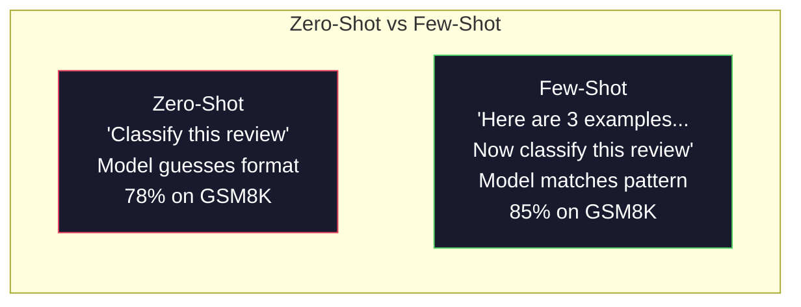
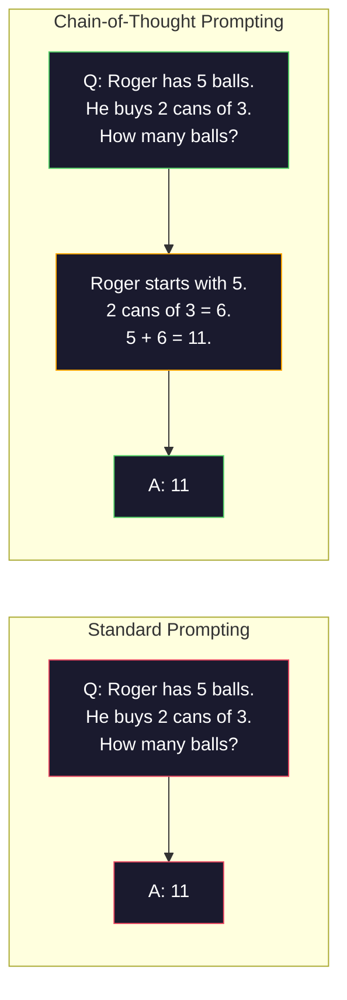
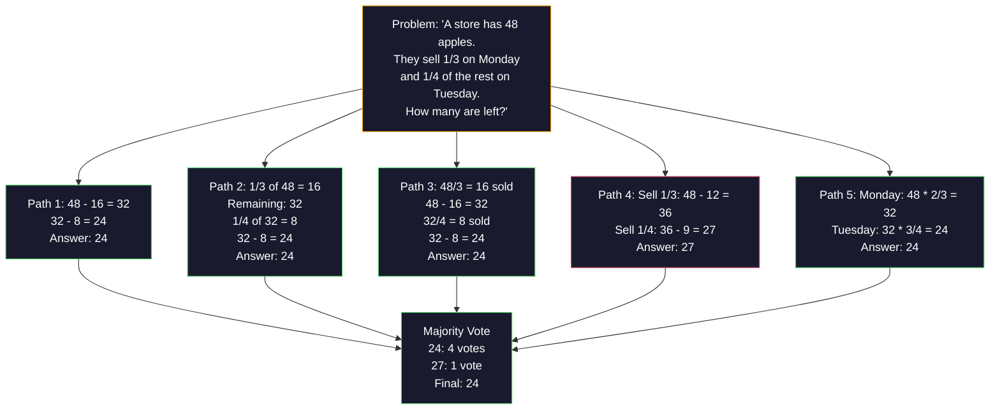
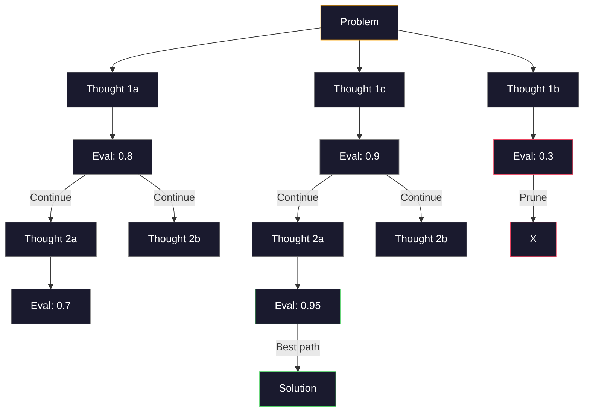

# Birkaç atış, düşünce zinciri, düşünce ağacı.

> Bir modelin ne yapması gerektiğini söylemek, ona nasıl düşünmesi gerektiğini göstermek mühendisliktir. Aynı model, aynı görev, aynı veriler üzerinde %78 ile %91 arasında bir fark daha iyi bir model değildir. Daha iyi bir akıl yürütme stratejisi.

> **【中文解读】**告诉模型"做什么"提示,展示"如何思考"才是工程――%78'den%91'e doğrulama oranının yükseltilmesi daha iyi bir modelle değil, daha iyi bir düşünce stratejisiyle yapılır.

> **【拓展：推理策略→AI Agent】**CoT/ToT/ReAct, modern AI Ajanının düşünce temelidir.

>  **【前置】**Öğrenci bölümünün ilk aşaması:Fase 11.01 (Prompt Engineering)  Sistem promptı, rolü, kısıtlamaları ve diğer temel modüleri anlamak.

**Type:** Build | **类型:** 构建
**Languages:** Python | **语言:** Python
**Prerequisites:** Lesson 11.01 (Prompt Engineering) | **前置知识:** Phase 11 · 01 (提示工程)
**Time:** ~45 minutes | **时间:** ~45 分钟

## Öğrenme hedefleri

- Görev doğruluğunu en üst düzeye çıkaran örnek gösterileri seçerek ve biçimlendirip birkaç çekimli isteklendirmeyi uygulayın
  通过选择和格式化示例演示来实现少样提示,最大化任务精准率
- Matematik kelime sorunları gibi çok adımlı problemlerde doğruluk geliştirmek için düşünce zinciri (CoT) mantıklamasını uygulayın
  应用链式思维 (CTO) çok adımlı sorunun doğruluğunu artırmak için öneriler
- Bir sürü düşünce yolu keşfeden ve en iyi olanı seçen bir düşünce ağacı sorgu yapın
  构建思维树提示,探索多条推理路并选择最佳路径
- Standart bir referans değerinde sıfır atış vs. birkaç atış vs. CoT'den doğruluk gelişmesini ölçmek
  Standart temelde ölçümde sıfır örnek vs. az örnek vs. CoT'nin doğruluk oranı yükseldi

> **【中文解读】**Bu ders hedefleri: birkaç atışlı bir ders (Örneğin, bir örnekle bir ders çıkarabilir) ve bir düşünce zinciri (Örneğin, bir düşünce zinciri) iki büyük teknikten biridir.


## Sorunlar. Sorunlar.

Matematik dersleri uygulaması oluşturursanız, sorgulamanız "Bu kelime sorunu çöz". GPT-5 standard bir lisensel matematik standartı olan GSM8K'de %94 doğru olur.

> Siz bir matematik rehberliği uygulaması oluşturduğunuzu söyleyin. Bu uygulamayı çözmek için, GSM8K standart matematik temelinde GPT-5'in doğruluk oranı %94'dir.

Beş kelime ekleyin -- "Hatırla adım adım" -- ve doğruluk 91%'e kadar yükselmiş. Birkaç çalıştırılmış örnek ekleyin ve bu yüzde 95'e ulaşır. Aynı model. Aynı sıcaklık. Aynı API maliyeti. Tek fark, modelin çizim kağıdı verildiği.

> Üstelik, bu konuda bir çok farklılık var. Bu nedenle, bu konuda bir çok farklılık vardır.

Bu bir hack değil. Düşünce işleminin işlevi budur. İnsanlar bir zihinsel sıçrayışta çok adımlı sorunları çözmezler. Transformatörler de. Bir modelin aralama jetonları üretmesine zorladığınızda, bu jetonlar bir sonraki jeton bağlamının bir parçası olur. Her bir düşünce adımını bir sonrakiye besler. Model kelimenin tam anlamıyla cevap için yollarını hesaplar.

> Bu bir fikir değil. Bu düşünce yöntemidir. İnsan bir kere birden çok adım sorunu tamamlamayacaktır. Transformer de olmaz. Eğer bir model zorla ortalama bir token oluşturursan, bu tokenlar bir sonraki tokenın üst-üstündeki kısmına dönüşür.

>  **【类比】**CoT gibi                                                                                                                                                                                                                                                              

> ️ **【易错点】**Çok az bir atış/CoT'ın 3 个坑:(1) **示例数量错误**0-şot CoT 加 "Hatırlayalım adım adım" 就足,再加 3-5 个少拍示例能再 2-5 点;**示例顺序敏感**A,B,C 排和C,B,A 排,准确率差 5-10%;务必把"最相关的示例"放最后(靠近问题)**CoT 不适用于简单任务**"Bugün birkaç号?"加 CoT反而让模型出错;CoT sadece birkaç adımdan fazla düşünceye göre geçerlidir.

Ama "adım adım düşün" son değil başlangıç. Beş mantık yolu örneğini alıp çoğunlukla oy alırsanız ne olur? modelin olasılık ağacını keşfetmesine, dalları değerlendirmesine ve kesmesine izin verirsen ne olur? mantıkla araç kullanımı arasında karıştırılırsanız ne olur? Bunlar hipotetik değil. Bunlar ölçülü gelişmelerle yayınlanan teknikler ve hepsini bu derste inşa edeceksiniz.

> Ancak " adım adım düşünme " sadece başlangıç, son değil. Eğer bir beş madde düşünce yolu seçerseniz ve çoğunlukla oy verirseniz nasıl olur? Eğer bir olasılık ağacını keşfetmek için bir model bırakırsanız, değerlendirme ve kesim nasıl olur? Eğer düşünce ve araç kullanımı ile değişim yapılırsa nasıl olur? Bunlar varsayımlar değildir. Bunlar yayınlanmış, ölçülü olarak geliştirilmiş teknikler, bu ders içinde tüm bu teknikleri inşa edeceksiniz.

## Konsepten bir şey.

> **【中文解读】**Küçük şablon öğrenme (少样本学习) (Few-shot) 和思维链 (Chain-of-Thought, CoT) (Chain-of-Thought, CoT) (Chain-of-Thought, CoT) (Chain-of-Thought, CoT) (Chain-of-Thought, CoT) (Chain-of-Thought, CoT) (Chain-of-Thought, CoT) (Chain-of-Thought, CoT) (Chain-of-Thought, CoT) (Chain-of-Thought, CoT) ), Prompt Mühendisyenin iki büyük çekirdeği.

> **【拓展：CoT 的推理提升效果】**Google 2022 yılında bir makale, CoT'nin matematik düşünce görevinde PaLM 540B'nin doğruluk oranını %17'den %56'ye yükselteceğini kanıtlıyor.

> 🤔 **【困惑】**S: 2026 yılında orijinal yaşam düşünce modeli ((Claude Extended Thinking、o3) 都自带 CoT 了,我还需要手写"think step by step" 吗? A: 不需要,但有前提:(1) 原生 düşünce modeli'ni desteklemek için kullanılır Claude 4.5+、GPT-5、o3、DeepSeek-R1 等;(2) 任务确实需要推理简单分类任务原生思考反而拖慢──对老模型(GPT-4、Claude 3) 或开源模型Llama 3) 仍然需要手写 CoT──判断:如果模型有`reasoning_effort`Ya da`thinking`参数, kullan; yoksa kullan prompt。


### Zero-Shot vs. Few-Shot: Örnekler talimatları yendiğinde

Zero-shot prompting, modelin bir görevi verir ve başka bir şey vermez.

> 零样本提示只给模型一个任务,不加其他内容――少样本提示则先给模型一个任务,不加其他内容――少样本提示则先给模型一个任务,不加其他内容――

Wei et al. (2022) bunu 8 referans değerinde ölçtü. Duygu sınıflandırması gibi basit görevler için, sıfır atış ve az atış birbirinden% 2'lik bir oranda gerçekleştirildi. Çok adımlı aritmetik ve sembolik akıl yürütme gibi karmaşık görevler için, az atış doğruluğu % 10-25% arttı.

> Wei 等人 (ş. 2022) bunu 8 temel noktada ölçtü. Sencepsiyon sınıfı gibi basit görevler için, sıfır örnek ve küçük örnek performansı farkı % 2'dir.

İntüyüsyon: örnekler sıkıştırılmış talimatlardır. Çıktı biçimi tanımlamak yerine gösterirsin. Düşünme sürecini açıklamak yerine gösterirsin. Model örneği soyut talimatları yorumlamaktan daha güvenilir bir şekilde örneklere eşleşir.

> 直觉: örnekler sıkıştırılmış bir talimatdır. Dışarı çıkış biçimini açıklamasıyla, doğrudan gösterilmemektedir.



**When few-shot wins:**biçim hassas görevler, sınıflandırma, yapılandırılmış çıkarma, alan-özel jargon, modelin belirli bir kalıpla uyumlu olması gereken herhangi bir görev.

> **少样本胜出的场景**: biçim hassas görev, sınıflandırma, yapılandırma, alan belirli terminleri, herhangi bir model belirli bir model görevi uyarlaması gerekir.

**When zero-shot wins:**Basit gerçek sorular, örneklerin yaratıcılığı kısıtladığı yaratıcı görevler, iyi örneklerin bulunması iyi talimatlardan daha zor olduğu görevler.

> **零样本胜出的场景**Bu nedenle, bu konularda, bir dizi farklı yönlendirmelerin oluşturulması ve bir dizi farklı yönlendirmelerin oluşturulması için daha kolay bir yöntem oluşturulmaktadır.

### Örnek Seçimi: Benzer Rastlar

Tüm örnekler eşit değildir. Hedef girişine benzer örnekleri seçmek sınıflandırma görevlerinde rastgele seçimi 5-15% oranında üst düzeyine çıkarır (Liu et al., 2022).

> Tüm örnekler aynı değil. Seçim ve hedef giriş benzer örnekler sınıflandırma görevlerinde sıradan seçim oranı %5-15% oranında yüksektir.

1. **Semantic similarity**: yerleştirme alanında girişlere en yakın örnekleri seçin
   **语义相似性**: seçmek en yakın giriş örneği içinde yerleşim alanı
2. **Label diversity**: örneklerindeki tüm çıkış kategorilerini kapsar
   **标签多样性**: örnekte tüm çıkış sınıflarını kapsar
3. **Difficulty matching**: hedef sorununun karmaşıklık seviyesine uygun
   **难度匹配**: Uygunluk hedef sorununun karmaşıklık derecesi

Çoğu görev için en uygun örnek sayısı 3-5'dir. 3'ün altında, modelin örneği çıkarmak için yeterli sinyal olmadığı görülür. 5'in üzerinde, azalmakta olan geri dönüşleri ve atık bağlam penceresi belirtilerini vurursunuz.

> Çoğu görevin en iyi örnek sayısı 3-5 ̊ ̊ ̊ ̊ ̊ ̊ ̊ ̊ ̊ ̊ ̊ ̊ ̊ ̊ ̊ ̊ ̊ ̊ ̊ ̊ ̊ ̊ ̊ ̊ ̊ ̊ ̊ ̊ ̊ ̊ ̊ ̊ ̊ ̊ ̊ ̊ ̊ ̊ ̊ ̊ ̊ ̊ ̊ ̊ ̊ ̊ ̊ ̊ ̊ ̊ ̊ ̊ ̊ ̊ ̊ ̊ ̊ ̊ ̊ ̊ ̊ ̊ ̊ ̊ ̊ ̊ ̊ ̊ ̊ ̊ ̊ ̊ ̊ ̊ ̊ ̊ ̊ ̊ ̊ ̊ ̊ ̊ ̊ ̊ ̊ ̊ ̊ ̊ ̊ ̊ ̊ ̊ ̊ ̊ ̊ ̊ ̊ ̊ ̊ ̊ ̊ ̊ ̊ ̊ ̊ ̊ ̊ ̊ ̊ ̊ ̊ ̊ ̊ ̊ ̊ ̊ ̊ ̊ ̊ ̊ ̊ ̊ ̊ ̊ ̊ ̊ ̊ ̊ ̊ ̊ ̊ ̊ ̊ ̊ ̊ ̊ ̊ ̊ ̊ ̊ ̊ ̊ ̊ ̊ ̊ ̊ ̊ ̊ ̊ ̊ ̊ ̊ ̊ ̊ ̊ ̊ ̊ ̊ ̊ ̊ ̊ ̊ ̊ ̊ ̊ ̊ ̊ ̊ ̊ ̊ ̊ ̊ ̊ ̊ ̊ ̊ ̊ ̊ ̊ ̊ ̊ ̊ ̊ ̊ ̊ ̊ ̊ ̊ ̊ ̊ ̊ ̊ ̊ ̊ ̊ ̊ ̊ ̊ ̊ ̊ ̊ ̊ ̊ ̊ ̊ ̊ ̊     ̊ ̊    ̊                                                                          

### Düşünce zinciri: Modeller Vermek

Google Brain'de Wei et al. (2022) tarafından düşünce zinciri (CoT) teşvik edilmesi başlatıldı.

> 链式思维(CoT)提示由Google Brain's Wei 等人(2022) 引入──思想很简单: sadece modelin cevap vermesini değil, önce düşünce adımlarını göstermesini gerektirir.



Bu işlem neden mekanik olarak çalışır? Bir transformatör tarafından üretilen her token, bir sonraki token için bağlam haline gelir. CoT olmadan, model tüm mantıklıyı tek ileri geçişin gizli durumuna sıkıştırmalıdır. CoT ile, model ortalama hesaplamaları jetonlar olarak dışa çıkarır. Her mantıklandırma jetonu etkili hesaplama derinliğini genişletiyor.

> Neden bu mekanizma üzerinde geçerli?Transformer üretilen her token bir sonraki token'ın üst altında yer alır. CoT olmadan, model tüm düşüncelerini bir önceki yayılma gizli durumuna sıkıştırmalı. CoT varsa, model orta hesaplama dışına çıkarılır.

**GSM8K benchmarks (grade-school math, 8.5K problems):**

| Model | Zero-Shot | Zero-Shot CoT | Few-Shot CoT |
|-------|-----------|---------------|--------------|
| GPT-4o | 78% | 91% | 95% |
| GPT-5 | 94% | 97% | 98% |
| o4-mini (reasoning) | 97% | — | — |
| Claude Opus 4.7 | 93% | 97% | 98% |
| Gemini 3 Pro | 92% | 96% | 98% |
| Llama 4 70B | 80% | 89% | 94% |
| DeepSeek-V3.1 | 89% | 94% | 96% |

**Note on reasoning models.**OpenAI'nin o-seri (o3, o4-mini) ve DeepSeek-R1 gibi modeller cevaplarını yayınlamadan önce içsel olarak düşünce zinciri çalıştırırlar.

> **关于推理模型的说明。**Bu modeller, OpenAI'nin o 系列 ((o3、o4-mini) ve DeepSeek-R1 gibi, çıkış yanıtlarından önce içsel bir şekilde çalıştırılır.

İki tatlı CoT:

> İki tür COT:

**Zero-shot CoT**Kojima et al. (2022) bu tek cümleyi aritmetik, akıl sağlığı ve sembolik mantıklama görevlerinde doğruluğu arttırdığını gösterdi.

> **零样本 CoT**Bu cümle, hesaplama, normallik ve simge düşünme görevlerinde doğruluk oranını artırabileceğini göstermektedir.

**Few-shot CoT**Bu, modelin beklediğiniz tam olarak mantık biçimini gördüğü için sıfır çekim CoT'den daha etkili.

> **少样本 CoT**Bu nedenle, bu yöntemler, daha çok farklı yöntemlere sahip olan ve daha çok farklı yöntemlere sahip olan bir modelin oluşturduğu bir yöntemdir.

**When CoT hurts**Bu nedenle, bir iş için bir başvuru olarak, bir başvuru olarak, bir başvuru olarak, bir başvuru olarak, bir başvuru olarak, bir başvuru olarak, bir başvuru olarak, bir başvuru olarak, bir başvuru olarak, bir başvuru olarak, bir başvuru olarak, bir başvuru olarak, bir başvuru olarak, bir başvuru olarak, bir başvuru olarak, bir başvuru olarak, bir başvuru olarak, bir başvuru olarak, bir başvuru olarak, bir başvuru olarak, bir başvuru olarak, bir başvuru olarak, bir başvuru olarak, bir başvuru olarak, bir başvuru olarak, bir başvuru olarak, bir başvuru olarak, bir başvuru olarak, bir başvuru olarak, bir başvuru olarak, bir başvuru olarak, bir başvuru olarak, bir başvuru olarak, bir başvuru olarak, bir başvuru olarak, bir başvuru olarak, bir başvuru olarak, bir başvuru olarak, bir başvuru olarak, bir başvuru olarak, bir başvuru olarak, bir başvuru olarak, bir başvuru olarak, bir başvuru olarak, bir başvuru olarak, bir başvuru olarak, bir başvuru olarak, bir başvuru olarak, bir başvuru olarak, bir başvuru olarak, bir başvuru olarak, bir başvuru olarak, bir başvuru olarak, bir başvuru olarak, bir başvuru olarak, başvuru olarak, başvuru olarak, başvuru olarak, başvuru olarak, başvuru olarak, başvuru olarak, başvuru olarak, başvuru olarak, başvuru olarak, başvuru olarak, başvuru olarak, başvuru olarak, başvuru olarak, başvuru olarak, başvuru olarak, başvuru olarak, başvuru olarak, başvuru olarak, başvuru olarak, başvuru olarak, başvuru olarak, başvuru olarak, başvuru olarak, başvuru olarak, başvuru olarak, başvuru olarak, başvuru, başvuru, başvuru, başvuru, başvuru, başvuru, başvuru, başvuru, başvuru, başvuru, başvuru,

> **CoT 何时有害**"Fransa'nın başlıca başı nedir?") ̇ ̇ ̇ ̇ ̇ ̇ ̇ ̇ ̇ ̇ ̇ ̇ ̇ ̇ ̇ ̇ ̇ ̇ ̇ ̇ ̇ ̇ ̇ ̇ ̇ ̇ ̇ ̇ ̇ ̇ ̇ ̇ ̇ ̇ ̇ ̇ ̇ ̇ ̇ ̇ ̇ ̇ ̇ ̇ ̇ ̇ ̇ ̇ ̇ ̇ ̇ ̇ ̇ ̇ ̇ ̇ ̇ ̇ ̇ ̇ ̇ ̇ ̇ ̇ ̇ ̇ ̇ ̇ ̇ ̇ ̇ ̇ ̇ ̇ ̇ ̇ ̇ ̇ ̇ ̇ ̇ ̇ ̇ ̇ ̇ ̇ ̇ ̇ ̇ ̇ ̇ ̇ ̇ ̇ ̇ ̇ ̇ ̇ ̇ ̇ ̇ ̇ ̇ ̇ ̇ ̇ ̇ ̇ ̇ ̇ ̇ ̇ ̇ ̇ ̇ ̇ ̇ ̇ ̇ ̇ ̇ ̇ ̇ ̇ ̇ ̇ ̇ ̇ ̇ ̇ ̇ ̇ ̇ ̇ ̇ ̇ ̇ ̇ ̇ ̇ ̇ ̇ ̇ ̇ ̇ ̇ ̇ ̇ ̇ ̇ ̇ ̇ ̇ ̇ ̇ ̇ ̇ ̇ ̇ ̇ ̇ ̇ ̇ ̇ ̇ ̇ ̇ ̇ ̇ ̇ ̇ ̇ ̇ ̇ ̇ ̇ ̇ ̇ ̇ ̇ ̇ ̇ ̇ ̇ ̇ ̇ ̇ ̇ ̇ ̇ ̇ ̇ ̇ ̇ ̇ ̇ ̇ ̇ ̇ ̇ ̇ ̇ ̇ ̇ ̇ ̇ ̇ ̇ ̇ ̇ ̇ ̇ ̇ ̇ ̇ ̇ ̇ ̇ ̇ ̇ ̇ ̇ ̇ ̇ ̇ ̇ ̇ ̇ ̇ ̇ ̇ ̇ ̇ ̇ ̇ ̇ ̇ ̇ ̇ ̇ ̇ ̇ ̇ ̇ ̇ ̇ ̇ ̇ 

### Kendi Katında Dayanıklılık: Birçok kişiyi örnekleyin, bir kez oy verin

Wang et al. (2023) kendi kendine tutarlılık tanıttı. Bakış açısı: tek bir CoT yolu mantıksal hatalar içerebilir.

> Wang 等人(2023) kendi uyumluluğu getirmiştir.



Otomatik tutarlılık, orijinal PaLM 540B deneylerinde N=40 ile GSM8K doğruluğunu %56,5'ten (tek CoT) %74,4'e yükseltti. GPT-5'de gelişme küçüktür (97% ila 98%) çünkü temel doğruluk zaten doymuştur. Tek yol hatası sık olduğu ama sistematik olmayan tatlı noktada, 60-85% temel CoT doğruluğu olan modellerde teknik en çok parlıyor. Dönüşüm modelleri (o serisi, R1) için kendi kendine tutarlılık, yerleşik iç örnekleme ile kabul edilir.

> Öz uyum içinde orijinal PaLM 540B  deneylerde GSM8K  doğruluk oranı %56.5'ten %74.4'e yükseltilecek.

N örnekler, API maliyetinin ve gecikme süresinin Nx'ini ifade eder.

> 权衡:N 个样本意味着N 倍的API 成本和延迟――实践中,N=5 获取了大部分收益――N=3 is the minimum requirement of meaningful voting―N > 10 for the majority of tasks 边际收益递减――

### Düşünce Ağacı: Tarımsal Araştırma

Yao et al. (2023) düşünce ağacını (ToT) tanıttı. CoT bir çizgisi mantık yolu izlediğinde, ToT devam etmeden önce en umut verici olan birçok dalı araştırır ve değerlendirir.

> Yao 等人(2023) düşünce ağacını (思维树) ;;CoT 沿一条线性推理路径前进, ToT 探索多分支并继续前进评估哪些有最前景──



ToT'nin üç bileşeni vardır:

> Üç bileşeni var:

1. **Thought generation**: bir çok aday sonraki adımları üretmek
   **思维生成**: çok sayıda adayın oluşması
2. **State evaluation**: her adayın puanı ( değerlendirici olarak LLM'yi kullanabilir)
   **状态评估**: için her aday打分(LLM kendiliğinden değerlendirme aracı olarak kullanabilirsiniz)
3. **Search algorithm**: BFS veya DFS ağaçtan geçerek, düşük puan alan dalları kesmek
   **搜索算法**BFS veya DFS üzerinden                                                                                                                                                                                                                                                            

24'ün Oyunda (24'ü yapmak için aritmetik kullanılarak 4 sayı birleştirin) standart uyarı ile GPT-4 sorunların %7,3'ünü çözür. CoT ile, %4,0'ü (CoT burada çok acı verir çünkü arama alanı geniş)

> 24 任务的游戏中,GPT-4 使用标准提示解决 7.3% 的问题――使用CoT 时为 4.0%

ToT pahalı. Ağaçtaki her düğüm LLM çağrısı gerektirir. 3 dallama faktörü ve derinliği 3 olan bir ağaç 39 LLM çağrısı gerektirir. Sadece arama alanı büyük ama değerlendirilebilir olan sorunlar için kullanın - planlama, bulmaca çözme, kısıtlamalarla yaratıcı sorun çözme.

> Ağacın her bir noktası bir kez LLM 调用 edilmesi gerekir. Bir bölge 3 ̊ derinlik 3 ̊ ağaçların en fazla 39 kez LLM 调用 edilmesi gerekir.

### Etkinleşme: Düşünme + Yaptırma

Yao et al. (2022) akıl etmenin izlerini eylemlerle birleştirdi.

> Yao 等人(2022)                                                                                                                                                                                                                                                           

```mermaid
graph LR
    Q["Question:\nWhat is the\npopulation of the\ncountry where\nthe Eiffel Tower\nis located?"]
    T1["Thought: I need to\nfind which country\nhas the Eiffel Tower"]
    A1["Action: search\n'Eiffel Tower location'"]
    O1["Observation:\nParis, France"]
    T2["Thought: Now I need\nFrance's population"]
    A2["Action: search\n'France population 2024'"]
    O2["Observation:\n68.4 million"]
    T3["Thought: I have\nthe answer"]
    F["Answer:\n68.4 million"]

    Q --> T1 --> A1 --> O1 --> T2 --> A2 --> O2 --> T3 --> F

    style Q fill:#1a1a2e,stroke:#ffa500,color:#fff
    style T1 fill:#1a1a2e,stroke:#51cf66,color:#fff
    style A1 fill:#1a1a2e,stroke:#e94560,color:#fff
    style O1 fill:#1a1a2e,stroke:#808080,color:#fff
    style T2 fill:#1a1a2e,stroke:#51cf66,color:#fff
    style A2 fill:#1a1a2e,stroke:#e94560,color:#fff
    style O2 fill:#1a1a2e,stroke:#808080,color:#fff
    style T3 fill:#1a1a2e,stroke:#51cf66,color:#fff
    style F fill:#1a1a2e,stroke:#51cf66,color:#fff
```



ReAct, bilgi yoğunluklu görevlerde saf CoT'yi üstün kılar çünkü mantıklı düşüncelerini gerçek verilere dayatabilir. HotpotQA (çokluklı soru cevaplama), GPT-4 ile ReAct, yalnızca CoT için %35,1'e karşı %29,4'e doğru bir eşleşme elde eder. Gerçek güç mantıklı düşüncelerle yanlışların düzeltilmesidir - model planını uygulanmanın ortasında güncelleyebilir.

> ReAct, bilgi yoğunluğu görevlerinde saf CoT'den üstündür, çünkü gerçek verilere dayalı düşünce yapabilir. HotpotQA'da, GPT-4 ile birlikte ReAct'in kesin bir uyum oranı %35,1'e ulaştığı, saf CoT ise %29,4'e ulaştığı için gerçek güç doğrulama hatasıyla bağlantılıdır.

ReAct, modern AI ajanlarının temelidir. Her ajan çerçevesinde (LangChain, CrewAI, AutoGen) Düşünce- eylem- gözlem döngüsünün bir çeşitliği uygulanır.

> ReAct, modern AI Ajanının temelidir. Her Ajanın çerçevesinde (LangChain, CrewAI, AutoGen) bir çeşit Düşünce- eylem- gözlem döngüsünün değişimleri gerçekleştirilmiştir.

### Yapılandırılmış Çözüm: XML Etiketleri, Delimitörler, Başlıklar

İstekler karmaşıklaştıkça, yapı modelin karıştırıcı bölümlerini engeller.

> Tipler karmaşıklaştıkça, yapı farklı bölümlere karışmasını önleyebilir.

**XML tags**(Claude ile en iyi çalışır, her yerde sağlam):
```
<context>
You are reviewing a pull request.
The codebase uses TypeScript and React.
</context>

<task>
Review the following diff for bugs, security issues, and style violations.
</task>

<diff>
{diff_content}
</diff>

<output_format>
List each issue with: file, line, severity (critical/warning/info), description.
</output_format>
```

**Markdown headers**(üçlü):
```
## Role
Senior security engineer at a fintech company.

## Task
Analyze this API endpoint for vulnerabilities.

## Input
{api_code}

## Rules
- Focus on OWASP Top 10
- Rate each finding: critical, high, medium, low
- Include remediation steps
```

**Delimiters**(minimum ama etkili):
```
---INPUT---
{user_text}
---END INPUT---

---INSTRUCTIONS---
Summarize the above in 3 bullet points.
---END INSTRUCTIONS---
```

### Hızlı zincirleme: Sıradan parçalanma

Bazı görevler tek bir istek için çok karmaşıkdır.

> Bazı görevler çok karmaşık, tek bir ipucu kullanılarak tamamlanamaz.


Zincirleme üç nedenden dolayı tek seferde çarpıyor:

> 链式优于单提示 için üç neden vardır:

1. **Each step is simpler**: model her şeyi zengellemek yerine tek bir odaklı görevi yerine
   **每个步骤更简单**Model: Tüm şeyleri aynı anda ele almak yerine, odaklanmış bir görevle uğraşmak.
2. **Intermediate outputs are inspectable**: adımlar arasında doğrulamayı ve düzeltmeyi yapabilirsiniz
   **中间输出可检查**Bu aşamada doğrulamayı ve düzeltmeyi yapabilirsin.
3. **Different steps can use different models**: çıkarmak için ucuz bir model kullanın, akıl yürütmek için pahalı bir model kullanın
   **不同步骤可以使用不同模型**Ucuz modelle alın, pahalı modelle düşünün.

### Performans karşılaştırması

| Technique | Best For | GSM8K Accuracy (GPT-5) | API Calls | Token Overhead | Complexity |
|-----------|----------|------------------------|-----------|----------------|------------|
| Zero-Shot | Simple tasks | 94% | 1 | None | Trivial |
| Few-Shot | Format matching | 96% | 1 | 200-500 tokens | Low |
| Zero-Shot CoT | Quick reasoning boost | 97% | 1 | 50-200 tokens | Trivial |
| Few-Shot CoT | Maximum single-call accuracy | 98% | 1 | 300-600 tokens | Low |
| Self-Consistency (N=5) | High-stakes reasoning | 98.5% | 5 | 5x token cost | Medium |
| Reasoning model (o4-mini) | Drop-in CoT replacement | 97% | 1 | hidden (2-10x internal) | Trivial |
| Tree-of-Thought | Search/planning problems | N/A (74% on Game of 24) | 10-40+ | 10-40x token cost | High |
| ReAct | Knowledge-grounded reasoning | N/A (35.1% on HotpotQA) | 3-10+ | Variable | High |
| Prompt Chaining | Complex multi-step tasks | 96% (pipeline) | 2-5 | 2-5x token cost | Medium |

Doğru teknik üç faktöre bağlıdır: doğruluk gereksinimleri, gecikme bütçesi ve maliyet toleransı.

> Doğru teknik üç faktöre bağlıdır: doğruluk oranı gereksinimleri, gecikme bütçesi ve maliyet toleransı. Çoğu üretim sistemi için, az örnekli TK'nin 3 örnekli öz uyumlulık rezervi %90'ı kapsayabilir.

## Yapın.
```figure
few-shot-curve
```

## Yapın

Birkaç atışlı istek, zincir düşünce akıl yürütme ve kendi kendine tutarlılıklı oylamaları bir tek boru hattına birleştiren bir matematik sorunu çözücüünü oluşturacağız. Sonra zor sorunlar için düşünce ağacını ekleyeceğiz.

> Biz bir matematik sorunu çözücü inşa edeceğiz, birkaç örnek önerim, bir zincir düşünce düşünce ve kendiliğinden uyumlu bir oylama topluluğu oluştururuz.

Tam olarak uygulanması `code/advanced_prompting.py`İşte ana bileşenler.

> 完整实现在 `code/advanced_prompting.py`Aşağıda belirtilen önemli bileşenler vardır.

### Adım 1: Az Çıkarma Örnek Dükkanı

İlk bileşen birkaç atışlı örnekleri yönetir ve belirli bir sorun için en uygun olanları seçer.

> İlk Komponent Management Küçük Örnek Örnek, ve verilen sorunun seçilmesi ile ilgili örnekler

```python
GSM8K_EXAMPLES = [
    {
        "question": "Janet's ducks lay 16 eggs per day. She eats three for breakfast every morning and bakes muffins for her friends every day with four. She sells every egg at the farmers' market for $2. How much does she make every day at the farmers' market?",
        "reasoning": "Janet's ducks lay 16 eggs per day. She eats 3 and bakes 4, using 3 + 4 = 7 eggs. So she has 16 - 7 = 9 eggs left. She sells each for $2, so she makes 9 * 2 = $18 per day.",
        "answer": "18"
    },
    ...
]
```

Her örnek üç parçaya sahiptir: soru, mantıksal zincir ve son cevap. mantıksal zincir, normal birkaç atış örneğini bir CoT birkaç atış örneğine dönüştürür.

> Her örnek üç bölümüne sahiptir: soru, önerme zinciri ve son cevap.

### İkinci Adım: Düşünce Zinciri Çabuk Oluşturma

İhtiyarlık yapıcı bir sistem mesajını, birkaç atış örneğini akıl zincirleriyle ve hedef soruyu tek bir istekle birleştirir.

> 提示 yapılandırıcı sistem mesajını 带推理链的少样例例和目标问题组装 into single tips──

```python
def build_cot_prompt(question, examples, num_examples=3):
    system = (
        "You are a math problem solver. "
        "For each problem, show your step-by-step reasoning, "
        "then give the final numerical answer on the last line "
        "in the format: 'The answer is [number]'."
    )

    example_text = ""
    for ex in examples[:num_examples]:
        example_text += f"Q: {ex['question']}\n"
        example_text += f"A: {ex['reasoning']} The answer is {ex['answer']}.\n\n"

    user = f"{example_text}Q: {question}\nA:"
    return system, user
```

Format kısıtlaması (" cevabı [sayı] ") kritikdir. Bu olmadan, kendi kendine tutarlılık örnekler arasındaki cevapları çıkarıp karşılaştıramaz.

> 格式约束 ((" Cevap [sayı] ")至关重要──没有它,自一致性无法在不同样本之间提取和比较答案──

### Adım 3: Kendi Katkılarındaki Oylama

N akıl yürütme yollarını örnekleyin ve çoğunluk cevabını alın.

> 采样 N 条推理路,取多数答案──

```python
def self_consistency_solve(question, examples, client, model, n_samples=5):
    system, user = build_cot_prompt(question, examples)

    answers = []
    reasonings = []
    for _ in range(n_samples):
        response = client.chat.completions.create(
            model=model,
            messages=[
                {"role": "system", "content": system},
                {"role": "user", "content": user}
            ],
            temperature=0.7
        )
        text = response.choices[0].message.content
        reasonings.append(text)
        answer = extract_answer(text)
        if answer is not None:
            answers.append(answer)

    vote_counts = Counter(answers)
    best_answer = vote_counts.most_common(1)[0][0] if vote_counts else None
    confidence = vote_counts[best_answer] / len(answers) if best_answer else 0

    return best_answer, confidence, reasonings, vote_counts
```

Temperatür 0,7 önemlidir. Temperatür 0,0'da tüm N örnekleri aynı olur ve amaçtan yoksun olur. Çeşitli akıl yürütme yolları için yeterince rastgelelik gerekir ama modelin saçmalık üretmesi kadar değil.

> Temperatür 0.7  çok önemlidir.                                                                                                                                                                                                                                                          

### Dördüncü Adım: Düşünce Ağacını Çözmek

Düzsel akıl yürütme başarısız olduğu sorunlar için, ToT birden fazla yaklaşımı araştırır ve hangi yönün en ümit verici olduğunu değerlendirir.

> Linear düşünce başarısızlığı sorunları için, birçok yönü keşfetmek ve hangi yönün en iyi geleceği değerlendirmek için.

```python
def tree_of_thought_solve(question, client, model, breadth=3, depth=3):
    thoughts = generate_initial_thoughts(question, client, model, breadth)
    scored = [(t, evaluate_thought(t, question, client, model)) for t in thoughts]
    scored.sort(key=lambda x: x[1], reverse=True)

    for current_depth in range(1, depth):
        next_thoughts = []
        for thought, score in scored[:2]:
            extensions = extend_thought(thought, question, client, model, breadth)
            for ext in extensions:
                ext_score = evaluate_thought(ext, question, client, model)
                next_thoughts.append((ext, ext_score))
        scored = sorted(next_thoughts, key=lambda x: x[1], reverse=True)

    best_thought = scored[0][0] if scored else ""
    return extract_answer(best_thought), best_thought
```

Değerlendirici kendiliğinden bir LLM çağrısı. Modelle sorarsanız: "0.0 ile 1.0 arasında bir ölçekte, bu düşünce yolu sorunu çözmek için ne kadar umut verici?" Bu ToT'nin temel anlayışıdır -- model kendi kısmi çözümlerini değerlendirir.

> 评估器本身就是一个LLM调用──你问模型:" 0.0~1.0 aralığında, bu düşünce yolu sorunun çözülmesi için nasıl bir gelecek var?"

### Adım 5: Tam boru hattı

Bu boru hattı tüm teknikleri bir tırmanış stratejisi ile birleştirir.

> 流水线结合所有技术与升级策略──

```python
def solve_with_escalation(question, examples, client, model):
    system, user = build_cot_prompt(question, examples)
    single_response = call_llm(client, model, system, user, temperature=0.0)
    single_answer = extract_answer(single_response)

    sc_answer, confidence, _, _ = self_consistency_solve(
        question, examples, client, model, n_samples=5
    )

    if confidence >= 0.8:
        return sc_answer, "self_consistency", confidence

    tot_answer, _ = tree_of_thought_solve(question, client, model)
    return tot_answer, "tree_of_thought", None
```

Aşama mantığı: Önce ucuz (tek CoT) deneyin. Eğer kendi kendine tutarlılık güveninin 0.8'in altında (beş örnekten 4'ten azı aynı fikirde) ise, ToT'ye aşın. Bu maliyet ve doğruluğu dengeleyecek. Çoğu sorun ucuz çözülecek, zor sorun daha fazla hesaplanacak.

> 升级逻辑:先尝试廉价的(单次 CoT) ⋅ Eğer kendi uyumluluk güvenliği 0.8 ⋅ 5 örnekten 4 ⋅ ≠ ≠ ≠ ≠ ≠ ≠ ≠ ≠ ≠ ≠ ∞ ise, ToT ⋅ ∞ ∞ ∞ ∞ ∞ ∞ ∞ ∞ ∞ ∞ ∞ ∞ ∞ ∞ ∞ ∞ ∞ ∞ ∞ ∞ ∞ ∞ ∞ ∞ ∞ ∞ ∞ ∞ ∞ ∞ ∞ ∞ ∞ ∞ ∞ ∞ ∞ ∞ ∞ ∞ ∞ ∞ ∞ ∞ ∞ ∞ ∞ ∞ ∞ ∞ ∞ ∞ ∞ ∞ ∞ ∞ ∞ ∞ ∞ ∞ ∞ ∞ ∞ ∞ ∞ ∞ ∞ ∞ ∞ ∞ ∞ ∞ ∞ ∞ ∞ ∞ ∞ ∞ ∞ ∞ ∞ ∞ ∞ ∞ ∞ ∞ ∞ ∞ ∞ ∞ ∞ ∞ ∞ ∞ ∞ ∞ ∞ ∞ ∞ ∞ ∞ ∞ ∞ ∞ ∞ ∞ ∞ ∞ ∞ ∞ ∞ ∞ ∞ ∞ ∞ ∞ ∞ ∞ ∞ ∞ ∞ ∞ ∞ ∞ ∞ ∞ ∞ ∞ ∞ ∞ ∞ ∞ ∞ ∞ ∞ ∞ ∞ ∞ ∞ ∞ ∞ ∞ ∞ ∞ ∞ ∞ ∞ ∞ ∞ ∞ ∞ ∞ ∞ ∞ ∞ ∞ ∞ ∞ ∞ ∞ ∞ ∞ ∞ ∞ ∞ ∞ ∞ ∞ ∞ ∞ ∞ ∞ ∞ ∞ ∞ ∞ ∞ ∞ ∞ ∞ ∞ ∞ ∞ ∞ ∞ ∞ ∞ ∞ ∞ ∞ ∞ ∞ ∞ ∞ ∞ ∞ ∞ ∞ ∞ ∞ ∞ ∞ ∞ ∞ ∞ ∞ ∞ ∞ ∞ ∞ ∞ ∞ ∞ ∞ ∞ ∞ ∞ ∞ ∞ ∞ ∞ ∞ ∞ 

## Çerçeveyi kullanın.

### Şablonlara dayalı birkaç çekim sorguları

LangChain, birkaç atış ve CoT kalıplarını basitleştiren hızlı şablonlar ve çıkış analizleri için yerleşik destek sağlar:

> LangChain'in basitleştirilmesi için küçük örnek ve CoT modelleri sunuyor.

```python
from langchain_core.prompts import FewShotPromptTemplate, PromptTemplate
from langchain_openai import ChatOpenAI

example_prompt = PromptTemplate(
    input_variables=["question", "reasoning", "answer"],
    template="Q: {question}\nA: {reasoning} The answer is {answer}."
)

few_shot_prompt = FewShotPromptTemplate(
    examples=examples,
    example_prompt=example_prompt,
    suffix="Q: {input}\nA: Let's think step by step.",
    input_variables=["input"]
)

llm = ChatOpenAI(model="gpt-4o", temperature=0.7)
chain = few_shot_prompt | llm
result = chain.invoke({"input": "If a train travels 120 km in 2 hours..."})
```

LangChain de bunu yaptı .`ExampleSelector`semantik benzerlik seçimi sınıfları:

> LangChain var .`ExampleSelector`类用于语义相似性选择:

```python
from langchain_core.example_selectors import SemanticSimilarityExampleSelector
from langchain_openai import OpenAIEmbeddings

selector = SemanticSimilarityExampleSelector.from_examples(
    examples,
    OpenAIEmbeddings(),
    k=3
)
```

### Toplanan İpuçlar

DSPy, istek stratejilerini optimize edilebilir modüller olarak değerlendirir. CoT isteklerini el yaparak yapmaktansa, bir imza tanımlar ve DSPy istekleri optimize etmesine izin verir:

> DSPy  Optimization 提示策略视为可优化模块──你定义一个签名,让 DSPy 优化提示,而不是手工编写 CoT 提示:

```python
import dspy

dspy.configure(lm=dspy.LM("openai/gpt-4o", temperature=0.7))

class MathSolver(dspy.Module):
    def __init__(self):
        self.solve = dspy.ChainOfThought("question -> answer")

    def forward(self, question):
        return self.solve(question=question)

solver = MathSolver()
result = solver(question="Janet's ducks lay 16 eggs per day...")
```

DSPy'nin `ChainOfThought`otomatik olarak mantık izleri ekler. `dspy.majority`Kendi kendine uyumlu bir şekilde uygulanır:

> DSPy'nin `ChainOfThought`Kendini kullanma.`dspy.majority`实现自一致性:

```python
result = dspy.majority(
    [solver(question=q) for _ in range(5)],
    field="answer"
)
```

### Karşılaştırma: Çizgi vs Çerçeve

| Feature | From-Scratch (this lesson) | LangChain | DSPy |
|---------|--------------------------|-----------|------|
| Control over prompt format | Full | Template-based | Automatic |
| Self-consistency | Manual voting | Manual | Built-in (`dspy.majority`) |
| Example selection | Custom logic | `ExampleSelector` | `dspy.BootstrapFewShot` |
| Tree-of-Thought | Custom tree search | Community chains | Not built-in |
| Prompt optimization | Manual iteration | Manual | Automatic compilation |
| Best for | Learning, custom pipelines | Standard workflows | Research, optimization |

## İndirin . Ürünler .

Bu ders iki eser üretir.

> Bu ders iki ürün üretir.

**1. Reasoning Chain Prompt**(`outputs/prompt-reasoning-chain.md`): kendi kendine tutarlı olan, üretime hazır bir önlenme şablonu.

> **1. 推理链提示**(`outputs/prompt-reasoning-chain.md`): bir üretim hazırlıklı küçük örnek CoT 配合自一致性提示模板──插入您的示例和问题领域即可使用──

**2. CoT Pattern Selection Skill**(`outputs/skill-cot-patterns.md`): Görev türüne, doğruluk gerekliliklerine ve maliyet kısıtlamalarına göre doğru akıl yürütme tekniğini seçmek için bir karar çerçevesidir.

> **2. CoT 模式选择技能**(`outputs/skill-cot-patterns.md`): Görev türüne göre, doğrulama oranı ihtiyaç ve maliyet kısıtlamaları doğru bir teknik düşünce biçiminin karar verme çerçevesini seçmek.

## Egzersizler.

1. **Measure the gap**Bu nedenle, bu konularda bir dizi farklılık vardır: 10 GSM8K sorunu alın. Her birini sıfır atış, birkaç atış, sıfır atış, ve birkaç atış ile çözebilirsiniz. Her biri için doğru bir kayda alın. Hangi teknik modelinizde en büyük yüksekliği sağlar?
   **测量差距**: Get 10 Way GSM8K 题目──用零样本、少样本、零样本 CoT 和少样本 CoT 分别求解──记录每种方法的准确率──哪种技术给你的模型带来最大提升?

2. **Example selection experiment**Aynı 10 sorunun için rastgele örnek seçimi ile elle seçilen benzer örnekleri karşılaştırın.
   **示例选择实验**Bu nedenle, bu örneklerin sayısı, örneklerin sayısı ve değerleri ile karşılaştırıldığında, örneklerin kalitesi daha önemlidir.

3. **Self-consistency cost curve**N = 1, 3, 5, 7, 10 ile 20 GSM8K sorunu üzerinde kendi kendine tutarlılık çalıştırın.
   **自一致性成本曲线**20 yolu GSM8K 题 üzerinde N=1、3、5、7、10 运行自一致性──绘制准确率 vs 成本(总代币)图──你的模型的拐点在哪里?

4. **Build a ReAct loop**: Kalkülülatör aracı ile boru hattını uzatın. Model bir matematik ifadesini oluşturduğunda, Python'un kullanımı ile çalıştırın `eval()`(bir kum kutusunda) ve sonuçları geri getirir.
   **构建 ReAct 循环**: using calculator tool expand flowwaterline── model matematik ifade oluştururken Python'un `eval()`(在沙箱中) 执行并将结果反────测量工具辅助的推理是否优于纯 COT────

5. **ToT for creative tasks**Bir düşünce ağacı çözücüünü yaratıcı bir yazma görevi için uyarın: "Hesap ve üzücü olan 6 kelime bir hikaye yaz".
   **ToT 用于创意任务**Bu nedenle, bu konuda bir araştırma yapmak için bir araştırma makinesi kullanın.

## Anahtar Şartlar .

| Term | What people say | What it actually means | 中文释义 |
|------|----------------|----------------------|---------|
| Few-shot prompting | "Give it some examples" / "给些示例" | Including input-output demonstrations in the prompt to anchor the model's output format and behavior | 少样本提示：在提示中包含输入/输出演示，锚定模型的输出格式和行为 |
| Chain-of-Thought | "Make it think step by step" / "让它一步步想" | Eliciting intermediate reasoning tokens that extend the model's effective computation before producing a final answer | 链式思维：引出中间推理 token，在产生最终答案之前扩展模型的有效计算 |
| Self-Consistency | "Run it multiple times" / "多跑几次" | Sampling N diverse reasoning paths at temperature > 0 and selecting the most common final answer by majority vote | 自一致性：在 temperature > 0 下采样 N 条多样推理路径，通过多数投票选择最常见的最终答案 |
| Tree-of-Thought | "Let it explore options" / "让它探索选项" | Structured search over reasoning branches where each partial solution is evaluated and only promising paths are expanded | 思维树：对推理分支进行结构化搜索，评估每个部分解，只扩展有前景的路径 |
| ReAct | "Thinking + tool use" / "思考+工具使用" | Interleaving reasoning traces with external actions (search, compute, API calls) in a Thought-Action-Observation loop | ReAct：在 Thought-Action-Observation 循环中交替推理轨迹与外部行动 |
| Prompt chaining | "Break it into steps" / "分成几步" | Decomposing a complex task into sequential prompts where each output feeds the next input | 提示链：将复杂任务分解为顺序提示，每个输出作为下一个输入 |
| Zero-shot CoT | "Just add 'think step by step'" / "加一句'一步步想'" | Appending a reasoning trigger phrase to a prompt without any examples, relying on the model's latent reasoning capability | 零样本 CoT：在提示末尾添加推理触发短语，不使用任何示例，依赖模型的潜在推理能力 |

## Daha fazla okumak

- [Chain-of-Thought Prompting Elicits Reasoning in Large Language Models](https://arxiv.org/abs/2201.11903)- Wei et al. 2022'de Google Brain'den orijinal CoT makalesini okuyun.
  Wei 等人 2022──Google Brain'ın orijinal CoT 论文──阅读第 2-3 节获取核心结果──
- [Self-Consistency Improves Chain of Thought Reasoning in Language Models](https://arxiv.org/abs/2203.11171)- Wang et al. 2023. kendi kendine tutarlılık kağıdı.
  Wang 等人 2023──自一致性论文──表 1 包含你需要的所有数据──
- [Tree of Thoughts: Deliberate Problem Solving with Large Language Models](https://arxiv.org/abs/2305.10601)Yao et al. 2023 ToT makalesi. Bölüm 4'teki 24 oyunun sonuçları en önemli noktada.
  Yao 等人 2023──思维树论文──第 4 节的24 oyunun sonucu 亮点──
- [ReAct: Synergizing Reasoning and Acting in Language Models](https://arxiv.org/abs/2210.03629)Yao et al. 2022'de, modern Yapay zeka ajanlarının temeli. Bölüm 3 düşünce- eylem- gözlem döngüsünü açıklıyor.
  Yao 等人 2022。现代 AI Agent'ın temeli。第 3 节 düşündürdü Düşünce- eylem- gözlem döngüsü。
- [Large Language Models are Zero-Shot Reasoners](https://arxiv.org/abs/2205.11916)Kojima et al. 2022'de "Hatırla adım adım" makalesini.
  Kojima 等人 2022──"Hatırla adım adım" 论文──如此简单却出奇地有效──
- [DSPy: Compiling Declarative Language Model Calls into Self-Improving Pipelines](https://arxiv.org/abs/2310.03714)- Khattab et al. 2023. Kurulum sorunu olarak uyarı ile ilgilenir.
  Hattab 等人 2023──将提示视为编译问题── Eğer sizden fazla bir manuel提示工程 düşünüyorsanız, bunu okumaya değer──
- [OpenAI — Reasoning models guide](https://platform.openai.com/docs/guides/reasoning)- Satıcı rehberliği, düşünce zinciri ne zaman iç, fiyatlı bir token "düşünme" moduna dönüşecek.
  OpenAI                                                                                                                                                                                                                                                                                                                                                                                                                                                                                                                            
- [Lightman et al., "Let's Verify Step by Step" (2023)](https://arxiv.org/abs/2305.20050)-- bir zincirin her adımı derecelendiren süreç ödül modeli (PRM); sadece sonuç ödüllerini başaran akıl yürütme denetim sinyali.
  过程奖励模型 (PRM), zincirdeki her adımı değerlendirir; sadece sonuçları ödüllendiren bir düşünce izleme sinyalini aşar.
- [Snell et al., "Scaling LLM Test-Time Compute Optimally" (2024)](https://arxiv.org/abs/2408.03314)-- CoT uzunluğu, kendi kendine tutarlılık örneği ve MCTS sistematik çalışması; "adım adım düşünün" zaman doğruluk daha çok zaman zamanından önem verir.
  CoT 长度"",自一致性采样" ve MCTS'in sistemli araştırması için; doğrulama oranı gecikmeden daha önemli olduğunda "adım adım düşünme"in gelişme yönü­nü­nü­n;
