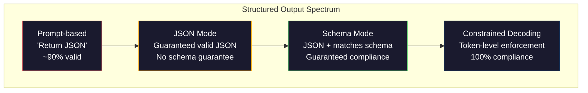
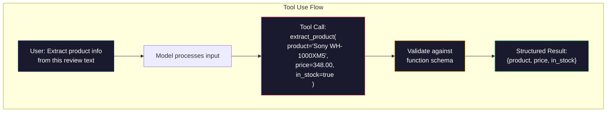

# Yapılandırılmış Çıktımlar: JSON, Şema Doğrulama, Sınırlı Çözümle.

> LLM'iniz bir dizileri gönderir. Uygulama JSON'a ihtiyaç duyar. Bu boşluk herhangi bir model halüsinasyonundan daha fazla üretim sistemini çöktürdü. Yapılandırılmış çıkış doğal dil ve yazılmış veriler arasındaki köprüdür. Doğru yapın ve LLM'iniz güvenilir bir API olur. Yanlış yapın ve regex ile serbest metni sabah 3'te analiz ediyorsunuz.

> **【中文解读】**LLM  dönüşüm satırı, ancak uygulama JSON gerektirir. Yapısal çıkış, doğal dil ve tipleştirme verileri arasındaki köprüdür.

> **【拓展：结构化输出→AI应用开发】**结构化输出是函数调用、RAG管道、数据提取等 AI 应用的基础──OpenAI 之基础──`response_format`、Antropik araç kullanımı 、Instructor 库 bu alanın temel araçlarıdır 、

>  **【前置】**学本节前 Lütfen önce öğrenin:(1) Fase 10·01-05(LLM 基础)  Anlama simgesi 生成;(2) JSON Schema 基础`type`- Evet.`properties`- Evet.`required`);(3) Python `pydantic`- Evet .`dataclasses`本节用Pydantic做验证──如果不懂JSON Schema,先看 jsonschema.org的5分教程──

**Type:** Build | **类型:** 构建
**Languages:** Python | **语言:** Python
**Prerequisites:** Phase 10, Lessons 01-05 (LLMs from Scratch) | **前置知识:** Phase 10 · 01-05 (从零构建 LLM)
**Time:** ~90 minutes | **时间:** ~90 分钟
**Related:**5 · 20 aşama (Strukturlandırılmış Çıktıranlar ve Sınırlı Dekodlama) dekodör düzeyin teorisini kapsar (FSM/CFG logit işlemcileri, Özetler, XGrammar).Bu ders üretim SDK yüzeyine (OpenAI `response_format`İlk olarak 5 · 20 aşamasını okuyun. Eğer API'nin altında neler olduğunu anlamak istiyorsanız.**相关:**5 · 20 aşama (struktur化输出与约束解码) 讲解码器级理论(FSM/CFG logit 处理器、概要、XGrammar)`response_format`、Antropik araç kullanımı 、Instruktor) 想了解API 底下发生什么先读 第五阶段 · 20──

## Öğrenme hedefleri

- OpenAI ve Anthropic API parametrelerini kullanarak JSON mod ve şema kısıtlı çıkışları uygulayın
  OpenAI ve Anthropic API 参数 kullanılarak JSON 模式 ve Schema 约束输出
- Yanlış biçimlendirilmiş LLM çıkışlarını ve hata geri bildirimi ile tekrar denemeyi reddeden bir Pydantic onay tabaka oluşturun
  构建 Pydantic 验证层, rejecting formal error of LLM 输出并通过错误反重试
- Sınırlı çözme, token düzeyinde post-işlemeden geçerli JSON'u nasıl zorladığını açıklayın
  解释约束解码 nasıl token 级强制生成有效 JSON, 无需后处理
- Yapılandırılmamış metni güvenilir bir şekilde tiplenen veri yapılarına dönüştüren güçlü çıkarma isteklerini tasarlayın
  设计鲁棒的提取提示, güvenilir olarak yapılandırılmamış metinleri tipleştirilmiş veri yapılarına dönüştürülecek

> **【中文解读】**Bu ders hedefleri: LLM'nin yapılandırılmış veriler üretmesini sağlamak. JSON、XML、表格)  önemli teknikler fonksiyon düzenlemesini içerir JSON modu、 束解码── bu LLM'nin sohbet araçlarından yapılandırma bileşenlerine yükseltilmesinin önemli adımlarıdır.


## Sorunlar. Sorunlar.

Bir LLM'ye sorarsanız: "Bu metinden ürün adını, fiyatını ve kullanılabilirliğini çıkarın".

> Bu makalede, "Bu bölümden ürün adı, fiyat ve stok durumu" diye soruyorsunuz.

Bu mükemmel bir yanıt. Bu da başvurunuz için tamamen işe yaramaz.`{"product": "Sony WH-1000XM5", "price": 348.00, "in_stock": true}`.Benize özel anahtarlar, belirli türler ve belirli değer kısıtlamaları olan bir JSON nesneye ihtiyacınız var.

> Bu tamamen doğru bir cevap. Ama senin uygulamaların için de tamamen işe yaramaz.`{"product": "Sony WH-1000XM5", "price": 348.00, "in_stock": true}`◊ You need a specific key, specific type and specific value binding JSON objects── You don't need a sentence──

Saf çözüm: Cevap sorunuza "JSON'da yanıt" ekleyin. Bu zamanın %90'ında işe yarıyor. Diğer %10 model JSON'u markdown kod çitlerine sarar veya "JSON: İşte" gibi bir önbellek ekler veya bir şapka erken kapatıldığı için sentaksik olarak geçersiz JSON üretir. JSON analiz cihazınız çöktü. - Boru hattın kırılıyor. Deneme/sıkılama ekler ve tekrar deneme döngüsü. Yeniden deneme bazen farklı veriler üretir. Şimdi bir analiz sorunu üstüne tutarlılık sorunu var.

> 简单的解决方案:在你的提示中加"JSON回复使用"──这在90%情况下有效──剩余10%的时候,模型将JSON包放在标记码块中,或加"这是JSON:"这样的开头语,或因为提前关闭括号导致语法产生效果不良的JSON──你的JSON解析器崩了──你的流线断了──你添加了试/除和重试循环──重试有时会产生不同的数据──现在你在解析问题上又有一致性问题──

Bu, hızlı bir mühendislik sorunu değil. Bu bir çözme sorunu. Modeldeki simgeler soldan sağa doğru üretilir. Her pozisyonda, 100K+ seçeneklerin bir sözlüklüğünden en olası bir sonraki simgeler seçer. Bu seçeneklerin çoğu herhangi bir pozisyonda geçersiz JSON üretir.`{"price":`, bir sonraki simge bir rakam, bir alıntı (sırç için) olmalıdır.`null`- Evet .`true`- Evet .`false`Bu model, kısıtlamalar olmadan, bir İngilizce kelime seçebilmek için çok mantıklı olabilir.

> Bu bir önerme mühendisliği sorunu değil. Bu bir kod çözme sorunu. Model soldan sağa jeton üretir. Her bir konumda, 100 bin + seçeneğin sözcük listesinden en olası bir sonraki jeton seçer.`{"price":`, bir sonraki simge 必須是数字、引号 ((字符串 için kullanılır) 、`null`- Evet.`true`- Evet.`false`Ya da negatif sayı. Diğer her şey JSON'un etkisiz bir sonucu elde eder.

>  **【类比】**Çekilme ve Yönetim Kurulu'nun (LLM) Yönetim Kurulu'nun (LLM) Yönetim Kurulu'nun (LLM) Yönetim Kurulu'nun (LLM) Yönetim Kurulu'nun (LLM) Yönetim Kurulu'nun (LLM) Yönetim Kurulu'nun (LLM) Yönetim Kurulu'nun (LLM) Yönetim Kurulu'nun (LLM) Yönetim Kurulu'nun (LLM) Yönetim Kurulu'nun (LLM) Yönetim Kurulu'nun (LLM) Yönetim Kurulu'nun (LLM) Yönetim Kurulu'nun (LLM) Yönetim Kurulu'nun (LLM) Yönetim Kurulu'nun (LLM) Yönetim Kurulu'nun (LG) Yönetim Kurulu'unun (LG) Yönetim Kurulu'unun (LG) Yönetim Kurulu'unun (LG) Yönetim Kurulu'unun (LG) Yönetim Kurulu'unun (LG) Yönetim Kurulu'unun (LG) Yönetim Kurulu'unun (LG) Yönetim Kurulu'unun (L) Yönetim Kurulu'un (L) Yönetim Kurulu'un (L) Ücret) Ücretisi (L) Ücret) Ücretleri (L) Ücret) Ücretleri (L) Ücretleri (L) Ücret) Ücretleri (T) ve yönetim Kurulu'in (T) Ücret (T) Üye uygun olarak kabul edilmiştir.

> ️ **【易错点】**结构化输出 3 个坑:(1) **Schema 字段过多** 20 个字段模型记不住,会漏字段或填错;修复:拆成嵌套对象,每层不超过 5 个字段――(2) **要求 LLM 输出"创造性"字段但又强 Schema**Örnekteki "İşleyici başlık" eşleşmesi `title: str`, Model tarafından Schema 约束后变得保守;修复:用 `temperature=0.9`+ Şema 中加 `min_length: 10`留余地──(3) **没用 Pydantic 验证**Doğrudan`json.loads()`"348") olarak oluşturulur ve yüzer değil; Pydantic otomatik zorunlu türü dönüşümü ile

## Konsepten bir şey.

> **【中文解读】**结构化输出是让LLM 生成 JSON、XML等格式的可控输出──关键技术:函数调用(Fonksiyon Çağrı)让模型输出预定义的 JSON schema,JSON mode 强制模型生成合法 JSON,约束解码(combined decoding) 在代币级 保证输出格式──

> 🤔 **【困惑】**S: OpenAI'nın `response_format={"type": "json_object"}`和 `response_format={"type": "json_schema", ...}`Önceki kişi yasal JSON çıkışı garanti ediyor, ama güvenceyi sağlamıyor. Sonraki kişi "Structured Outputs" You give JSON Schema, model guarantee according to Schema 输出(Uses constraint 解码实现) `json_schema`- Nasıl?

> **【拓展：结构化输出的工程实践】**OpenAI'nin Yapılandırılmış Çıktıları(2024) Bu modelin kesin olarak uyumlu bir JSON Şema çıkışı, güvenilirliği %90'dan %100'e yükseltilmiştir.


### Yapılandırılmış Çıktı Spektrumu

Yapılandırılmış çıkış kontrolünün dört seviyesi vardır, her biri sonundan daha güvenilirdir.

> Strukturel çıkış kontrolü dört sınıf, her biri önceki birinden daha güvenilirtir.



**Prompt-based**("Türekli JSON'da yanıtlayın"): uygulanmaz. Model genellikle uyar ama bazen yapmaz. Güvenilirlik: ~ 90%. Başarısızlık modusu: işaretleme çitleri, önbaşı metni, kısaltılmış çıkış, yanlış yapı.

> **基于提示**("fail JSON 回复"): hiç zorunlu bir uygulama yok. Model genellikle uygulanır, ancak bazen gerçekleşmez.

**JSON mode**API'nin çıkışının geçerli JSON olduğunu garanti eder.`response_format: { type: "json_object" }`Bu, çıkışın hata olmadan analiz edilmesini sağlar. Ama beklediğiniz şema ile aynı olmayabilir. Ekstra anahtarlar, yanlış türler, eksik alanlar.

> **JSON 模式**API Güvenli Çıktı Geçerli JSON。OpenAI `response_format: { type: "json_object" }`Bu işlevi etkinleştirmek için, çıkışın hata çözülmesi mümkündür. Ama bu, beklediğiniz schema'ya uygun olmayabilir.

**Schema mode**Bu, bir JSON Şema'yı alır ve çıkışın onunla eşleşmesini garanti eder. 2026 yılında tüm büyük sağlayıcılar bunu doğuştan destekler: OpenAI'nin `response_format: { type: "json_schema", json_schema: {...} }`(aynı zamanda `tool_choice="required"`), Anthropic'in araç kullanımı ile `input_schema`, ve Geminin'in `response_schema`+ `response_mime_type: "application/json"`Çıktırma, belirlediğiniz anahtarları, türleri ve kısıtlamaları içerir.

> **Schema 模式**API  JSON Şema kabul etmiyor ve çıkışın doğru olduğunu garanti ediyor.`response_format: { type: "json_schema" }`、Antropik 带`input_schema`Geminin alet kullanımı`response_schema`◊ ◊ ◊ ◊ ◊ ◊ ◊ ◊ ◊ ◊ ◊ ◊ ◊ ◊ ◊ ◊ ◊ ◊ ◊ ◊ ◊ ◊ ◊ ◊ ◊ ◊ ◊ ◊ ◊ ◊ ◊ ◊ ◊ ◊ ◊ ◊ ◊ ◊ ◊ ◊ ◊ ◊ ◊ ◊ ◊ ◊ ◊ ◊ ◊ ◊ ◊ ◊ ◊ ◊ ◊ ◊ ◊ ◊ ◊ ◊ ◊ ◊ ◊ ◊ ◊ ◊ ◊ ◊ ◊ ◊ ◊ ◊ ◊ ◊ ◊ ◊ ◊ ◊ ◊ ◊ ◊ ◊ ◊ ◊ ◊ ◊ ◊ ◊ ◊ ◊ ◊ ◊ ◊ ◊ ◊ ◊ ◊ ◊ ◊ ◊ ◊ ◊ ◊ ◊ ◊ ◊ ◊ ◊ ◊ ◊ ◊ ◊ ◊ ◊ ◊ ◊ ◊ ◊ ◊ ◊ ◊ ◊ ◊ ◊ ◊ ◊ ◊ ◊ ◊ ◊ ◊ ◊ ◊ ◊ ◊ ◊ ◊ ◊     ◊  ◊                                                                                                                                                                                                                                 

**Constrained decoding**Bu işlem, bir simge oluşturmak için kullanılır. Bu işlem, simgeyi oluşturmak için kullanılır. Bu işlem, simgeyi oluşturmak için kullanılır.

> **约束解码**: Oluşturma sürecinde her bir token  konumunda, çözücü tüm efektisiz çıkış token üretir. Şema ısı gerektirir ve model hemen harf çıkış olacaktır, bu token olasılığı sıfır olarak belirlenir. Model sadece etkin çıkış token üretmek için oluşabilir. Bu OpenAI  yapılandırılmış çıkış modeli ve çizelgeleri  Yöntemleri  Yönetim ve diğer kütüphanelerin alt katı gerçekleştirilmesinin yolu budur.

### JSON Şema: Sözleşme Dili

JSON Şema, çıkışın hangi şekli olması gerektiğini model (veya onay katmanı) nasıl anlattığını gösterir.

> JSON Schema is you tell the model (or verification layer) output must have what shape in a way. Her ana yapısal output sistem bunu kullanıyor.

```json
{
  "type": "object",
  "properties": {
    "product": { "type": "string" },
    "price": { "type": "number", "minimum": 0 },
    "in_stock": { "type": "boolean" },
    "categories": {
      "type": "array",
      "items": { "type": "string" }
    }
  },
  "required": ["product", "price", "in_stock"]
}
```

Bu şema şöyle diyor: çıkış bir dizilenin bir nesnesi olmalıdır `product`, negatif olmayan bir sayı `price`, bir Boolean `in_stock`, ve bir dizi dizginli ip .`categories`- Uygun olmayan çıkışlar reddedilmektedir.

> Bu şema açıklaması: çıkış bir nesne olmalı, içerir bir karakter `product`、非负数字 `price`- Değerli`in_stock`和可选的字符串数组 `categories`                                                                                                                                                                                                                                                              

Şemalar zor durumları ele alıyor: yuvalanmış nesneler, tiplenen öğelerle diziler, enumlar (bir dizi belirli değerlere sınırlandırmak), örneğe eşleşme (dizi üzerinde regeks) ve kombinatörler (polymorfik çıkışlar için oneOf, anyOf, allOf).

> Şema  İşleme karmaşıklığı:嵌套对象、带类型项的数组、枚举(将字符串约束为特定值) 模式匹配(字符串上的正则表达式)

### Pydantik Şekil

Python'da JSON Şeması'nı elden yazmazsınız. Pydantic modelini tanımlarsınız ve sizin için şema oluşturur.

> Python'da, JSON Şema'yı el yazmanıza gerek yok.

```python
from pydantic import BaseModel

class Product(BaseModel):
    product: str
    price: float
    in_stock: bool
    categories: list[str] = []
```

Bu, yukarıdaki gibi aynı JSON Şeması üretir. Instructor kütüphanesi (ve OpenAI'nin SDK) doğrudan Pydantic modellerini kabul eder: model sınıfını geçerek onaylanmış bir örnek geri alır. LLM çıkışı eşleşmezse, Instructor otomatik olarak tekrar çalışır.

> Bu, yukarıdaki JSON Şema ile aynı şekilde oluşur. Instructor 库和 OpenAI's SDK) doğrudan Pydantic 模型:传入模型类,返回验证过的实例を直接接受します.

### Fonksiyon Çağrıları / Araç Kullanımı

Aynı sorunun alternatif bir arayüzü. Modelle doğrudan JSON üretmesini istemek yerine, "ümleleri" (fonksiyonları) tiplenen parametrelerle tanımlarsınız. Modelle yapılandırılmış argümanlarla bir fonksiyon çağrısı çıkarır. OpenAI buna "fonksiyon çağrısı" diyor. Anthropic buna "ümleleri kullanımı" diyor. Sonuç aynıdır: yapılandırılmış veriler.

> 解決同一問題的替代接口──不是要求模型直接产生 JSON,而是定义带类型参数的"工具" (typi参数的工具) 函数)──模型输出带有结构化参数的函数调用──OpenAI 称之为"函数调用"",Antropic 称之为"工具使用"──结果相同:结构化数据──



Araç kullanımı, modelin sadece parametreleri doldurmak yerine hangi işlevi çağıracağını seçmesi gerektiğinde tercih edilir. Eğer 10 farklı çıkarma şeması varsa ve model giriş üzerine göre doğru olanı seçmelidirse, araç kullanımı size hem şemayı seçme hem de yapılandırılmış çıkış sağlar.

> Model sadece parametre doldurmak için değil, hangi işlevi kullanmak için seçmesi gerektiğinde, öncelikle bir seçme aracı kullanın. Eğer 10 farklı bir çekim şeması varsa, model doğru seçimi kullanırken, aynı zamanda bir seçme şeması ve yapılandırılmış çıkışı kullanın.

### Genel Başarısızlık Modu

Şema uygulanması ile bile, yapılandırılmış çıkışlar ince yollarla başarısız olabilir.

> Şema zorunlu bir şekilde yürütülse bile yapısal çıkışlar da küçük bir şekilde başarısız olabilir.

**Hallucinated values**: çıkış şema ile uyumludur ancak icat edilmiş verileri içerir.`{"price": 299.99}`Şema onaylaması bunu yakalayamıyor -- tip doğru, değer yanlış.

> **幻觉值**Bu da bir örnek.`{"price": 299.99}`❖ Şema 验证无法捕获这个问题类型正确,值错误──

**Enum confusion**: bir alanı sınırlandırır `["in_stock", "out_of_stock", "preorder"]`Modelin çıkışları .`"available"`- semantik olarak doğru, ancak izin verilen sette değil. iyi kısıtlı çözme bunu engeller.

> **枚举混淆**Sen de bu kadar.`["in_stock", "out_of_stock", "preorder"]` Model Output `"available"`语义上正确,但不允许的集合中. 语义上正确,但不允许的集合中.

**Nested object depth**Bu nedenle, bu modelin yapısını kaybedebileceği başka bir yer ise, her yuva yuvası.

> **嵌套对象深度**Bu nedenle, bu sistemin tüm yöntemi, daha fazla hata oluşur.

**Array length**Modelle çok fazla veya çok az bir dizi ürün üretmek olabilir.`minItems`ve `maxItems`Ama tüm tedarikçiler bunları çözme düzeyinde uygulamaz.

> **数组长度**Model: Model: Model: Model: Model: Model: Model: Model: Model: Model: Model: Model: Model: Model: Model: Model: Model: Model: Model: Model: Model: Model: Model: Model: Model: Model: Model: Model: Model: Model: Model: Model: Model: Model: Model: Model: Model: Model: Model: Model: Model: Model: Model: Model: Model: Model: Model: Model: Model: Model: Model: Model: Model: Model: Model: Model: Model: Model: Model: Model: Model: Model: Model: Model: Model: Model: Model: Model: Model: Model: Model: Model: Model: Model: Model: Model: Model: Model: Model: Model: Model: Model: Model: Model: Model: Model: Model: Model: Model: Model: Model: Model: Model: Model: Model: Model: Model: Model: Model: Model: Model: Model: Model: Model: Model: Model: Model: Model: Model: Model: Model: Model: Model: Model: Model: Model: Model: Model: Model: Model: Model: Model: Model: Model: Model: Model: Model: Model: Model: Model: Model: Model: Model: Model: Model: Model: Model: Model: Model: Model: Model: Model: Model: Model: Model: Model: Model: Model: Model: Model: Model: Model: Model: Model: Model: Model: Model: Model: Model: Model: Model: Model: Model: Model: Model: Model: Model: Model: Model: Model: Model: Model: Model: Model: Model: Model: Model: Model: Model: Model: Model: Model: Model: Model: Model: Model: Model: Model: Model: Model: Model: Model: Model: Model: Model: Model: Model: Model: Model: Model: Model: Model: Model: Model: Model: Model: Model: Model: Model: Model: Model: Model: Model: Model: Model: Model: Model: Model: Model: Model: Model: Model: Model: Model: Model: Model: Model: Model: Model: Model: Model: Model: Model: Model: Model: Model: Model: Model: Model: Model: Model: Model: Model: Model: Model: Model: Model: Model: Model: Model: Model: Model: Model: Model: Model:`minItems`和 `maxItems`Ancak tüm tedarikçilerin kod çözümü aşamasında zorunlu bir şekilde uygulanmadığı söyleniyor.

**Optional field omission**Modelle teknik olarak seçeneği olmayan ancak kullanım durumunuz için anlamsal olarak önemli alanlar kaydedilmektedir.`null`Açıkça.

> **可选字段遗漏**Modeller teknik olarak seçilebilir ama kullanımsal olarak kullanılabilir durumunuz için çok önemli bir bölümdür. Veriler zaman zaman eksik olsa bile, şemalarda da gerekli olan zorunlu modeller ortaya çıkar.`null`- Evet.

## Yapın.
```figure
mx-schema-funnel
```

## Yapın

### Adım 1: JSON Şema Doğrulama

Python nesnesinin JSON Şeması ile uyumlu olup olmadığını kontrol eden bir onaylayıcıyı sıfırdan oluşturun.

> Zö yapılandırma tescileri, Python'un nesnelerin JSON Şema'ya uygun olup olmadığını kontrol etmektedir.

```python
import json

def validate_schema(data, schema):
    errors = []
    _validate(data, schema, "", errors)
    return errors

def _validate(data, schema, path, errors):
    schema_type = schema.get("type")

    if schema_type == "object":
        if not isinstance(data, dict):
            errors.append(f"{path}: expected object, got {type(data).__name__}")
            return
        for key in schema.get("required", []):
            if key not in data:
                errors.append(f"{path}.{key}: required field missing")
        properties = schema.get("properties", {})
        for key, value in data.items():
            if key in properties:
                _validate(value, properties[key], f"{path}.{key}", errors)

    elif schema_type == "array":
        if not isinstance(data, list):
            errors.append(f"{path}: expected array, got {type(data).__name__}")
            return
        min_items = schema.get("minItems", 0)
        max_items = schema.get("maxItems", float("inf"))
        if len(data) < min_items:
            errors.append(f"{path}: array has {len(data)} items, minimum is {min_items}")
        if len(data) > max_items:
            errors.append(f"{path}: array has {len(data)} items, maximum is {max_items}")
        items_schema = schema.get("items", {})
        for i, item in enumerate(data):
            _validate(item, items_schema, f"{path}[{i}]", errors)

    elif schema_type == "string":
        if not isinstance(data, str):
            errors.append(f"{path}: expected string, got {type(data).__name__}")
            return
        enum_values = schema.get("enum")
        if enum_values and data not in enum_values:
            errors.append(f"{path}: '{data}' not in allowed values {enum_values}")

    elif schema_type == "number":
        if not isinstance(data, (int, float)):
            errors.append(f"{path}: expected number, got {type(data).__name__}")
            return
        minimum = schema.get("minimum")
        maximum = schema.get("maximum")
        if minimum is not None and data < minimum:
            errors.append(f"{path}: {data} is less than minimum {minimum}")
        if maximum is not None and data > maximum:
            errors.append(f"{path}: {data} is greater than maximum {maximum}")

    elif schema_type == "boolean":
        if not isinstance(data, bool):
            errors.append(f"{path}: expected boolean, got {type(data).__name__}")

    elif schema_type == "integer":
        if not isinstance(data, int) or isinstance(data, bool):
            errors.append(f"{path}: expected integer, got {type(data).__name__}")
```

### Adım 2: Pydantik Stylo Modelinden Şema'ya

Minimum bir sınıf-sema dönüştürücü oluşturun. Python sınıfını tanımlayın ve otomatik olarak JSON Schema'sını oluşturun.

> 构建最小类到 schema 转换器──定义 Python 类,自动生成其 JSON Schema──

```python
class SchemaField:
    def __init__(self, field_type, required=True, default=None, enum=None, minimum=None, maximum=None):
        self.field_type = field_type
        self.required = required
        self.default = default
        self.enum = enum
        self.minimum = minimum
        self.maximum = maximum

def python_type_to_schema(field):
    type_map = {
        str: "string",
        int: "integer",
        float: "number",
        bool: "boolean",
    }

    schema = {}

    if field.field_type in type_map:
        schema["type"] = type_map[field.field_type]
    elif field.field_type == list:
        schema["type"] = "array"
        schema["items"] = {"type": "string"}
    elif isinstance(field.field_type, dict):
        schema = field.field_type

    if field.enum:
        schema["enum"] = field.enum
    if field.minimum is not None:
        schema["minimum"] = field.minimum
    if field.maximum is not None:
        schema["maximum"] = field.maximum

    return schema

def model_to_schema(name, fields):
    properties = {}
    required = []

    for field_name, field in fields.items():
        properties[field_name] = python_type_to_schema(field)
        if field.required:
            required.append(field_name)

    return {
        "type": "object",
        "properties": properties,
        "required": required,
    }
```

### Adım 3: Sınırlı İşaret Filtrasyonu

kısıtlı dekodlama simülasyonu. Bir kısmi JSON dizisi ve bir şema verildiğinde, hangi token kategorilerini geçerli olarak belirleyin.

> 模拟约束解码──给定部分 JSON 字符串和方案, 类别有效── belirlemek için hangi tokenlerin mevcut konumunda olduğunu belirlemek

```python
def next_valid_tokens(partial_json, schema):
    stripped = partial_json.strip()

    if not stripped:
        return ["{"]

    try:
        json.loads(stripped)
        return ["<EOS>"]
    except json.JSONDecodeError:
        pass

    last_char = stripped[-1] if stripped else ""

    if last_char == "{":
        return ['"', "}"]
    elif last_char == '"':
        if stripped.endswith('":'):
            return ['"', "0-9", "true", "false", "null", "[", "{"]
        return ["a-z", '"']
    elif last_char == ":":
        return [" ", '"', "0-9", "true", "false", "null", "[", "{"]
    elif last_char == ",":
        return [" ", '"', "{", "["]
    elif last_char in "0123456789":
        return ["0-9", ".", ",", "}", "]"]
    elif last_char == "}":
        return [",", "}", "]", "<EOS>"]
    elif last_char == "]":
        return [",", "}", "<EOS>"]
    elif last_char == "[":
        return ['"', "0-9", "true", "false", "null", "{", "[", "]"]
    else:
        return ["any"]

def demonstrate_constrained_decoding():
    partial_states = [
        '',
        '{',
        '{"product"',
        '{"product":',
        '{"product": "Sony"',
        '{"product": "Sony",',
        '{"product": "Sony", "price":',
        '{"product": "Sony", "price": 348',
        '{"product": "Sony", "price": 348}',
    ]

    print(f"{'Partial JSON':<45} {'Valid Next Tokens'}")
    print("-" * 80)
    for state in partial_states:
        valid = next_valid_tokens(state, {})
        display = state if state else "(empty)"
        print(f"{display:<45} {valid}")
```

### 4. Adım: Çöp boru hattı

Her şeyi bir çıkarma borusuna birleştirin: bir şema tanımlayın, yapılandırılmış çıkış üreten bir LLM'yi taklit edin, çıkışı doğrulayın ve tekrar denemeleri halledebilirsiniz.

> Tüm bunları bir araya getirmek için bir çalışma yapın.

```python
def simulate_llm_extraction(text, schema, attempt=0):
    if "headphones" in text.lower() or "sony" in text.lower():
        if attempt == 0:
            return '{"product": "Sony WH-1000XM5", "price": 348.00, "in_stock": true, "categories": ["audio", "headphones"]}'
        return '{"product": "Sony WH-1000XM5", "price": 348.00, "in_stock": true}'

    if "laptop" in text.lower():
        return '{"product": "MacBook Pro 16", "price": 2499.00, "in_stock": false, "categories": ["computers"]}'

    return '{"product": "Unknown", "price": 0, "in_stock": false}'

def extract_with_retry(text, schema, max_retries=3):
    for attempt in range(max_retries):
        raw = simulate_llm_extraction(text, schema, attempt)

        try:
            data = json.loads(raw)
        except json.JSONDecodeError as e:
            print(f"  Attempt {attempt + 1}: JSON parse error -- {e}")
            continue

        errors = validate_schema(data, schema)
        if not errors:
            return data

        print(f"  Attempt {attempt + 1}: Schema validation errors -- {errors}")

    return None

product_schema = {
    "type": "object",
    "properties": {
        "product": {"type": "string"},
        "price": {"type": "number", "minimum": 0},
        "in_stock": {"type": "boolean"},
        "categories": {"type": "array", "items": {"type": "string"}},
    },
    "required": ["product", "price", "in_stock"],
}
```

### Adım 5: Tam boru hattını çalıştır

> Adım 5: Çeviri tamamı

```python
def run_demo():
    print("=" * 60)
    print("  Structured Output Pipeline Demo")
    print("=" * 60)

    print("\n--- Schema Definition ---")
    product_fields = {
        "product": SchemaField(str),
        "price": SchemaField(float, minimum=0),
        "in_stock": SchemaField(bool),
        "categories": SchemaField(list, required=False),
    }
    generated_schema = model_to_schema("Product", product_fields)
    print(json.dumps(generated_schema, indent=2))

    print("\n--- Schema Validation ---")
    test_cases = [
        ({"product": "Test", "price": 10.0, "in_stock": True}, "Valid object"),
        ({"product": "Test", "price": -5.0, "in_stock": True}, "Negative price"),
        ({"product": "Test", "in_stock": True}, "Missing price"),
        ({"product": "Test", "price": "ten", "in_stock": True}, "String as price"),
        ("not an object", "String instead of object"),
    ]

    for data, label in test_cases:
        errors = validate_schema(data, product_schema)
        status = "PASS" if not errors else f"FAIL: {errors}"
        print(f"  {label}: {status}")

    print("\n--- Constrained Decoding Simulation ---")
    demonstrate_constrained_decoding()

    print("\n--- Extraction Pipeline ---")
    texts = [
        "The Sony WH-1000XM5 headphones are priced at $348 and currently available.",
        "The new MacBook Pro 16-inch laptop costs $2499 but is sold out.",
        "This is a random sentence with no product info.",
    ]

    for text in texts:
        print(f"\n  Input: {text[:60]}...")
        result = extract_with_retry(text, product_schema)
        if result:
            print(f"  Output: {json.dumps(result)}")
        else:
            print(f"  Output: FAILED after retries")
```

## Çerçeveyi kullanın.

### OpenAI Yapılandırılmış Çıktıranlar

> OpenAI  yapılandırılmış output¬¬¬¬¬¬¬¬¬¬¬¬¬¬¬¬¬¬¬¬¬¬¬¬¬¬¬¬¬¬¬¬¬

```python
# from openai import OpenAI
# from pydantic import BaseModel
#
# client = OpenAI()
#
# class Product(BaseModel):
#     product: str
#     price: float
#     in_stock: bool
#
# response = client.beta.chat.completions.parse(
#     model="gpt-5-mini",
#     messages=[
#         {"role": "system", "content": "Extract product information."},
#         {"role": "user", "content": "Sony WH-1000XM5, $348, in stock"},
#     ],
#     response_format=Product,
# )
#
# product = response.choices[0].message.parsed
# print(product.product, product.price, product.in_stock)
```

OpenAI'nin yapılandırılmış çıkış modunda, iç iç iç kısıtlamalar kullanılır. Model oluşturan her token Pydantic şemasıyla uyumlu çıkış üretmeye garantilidir. Tekrar deneme gerekmez. Doğrulama gerekmez. kısıtlamalar çözme sürecine eklenir.

> OpenAI'nin yapısal çıkış modeli içeride kullanılır. Model üretilen her token, Pydantic şema çıkışının uygun olmasını garanti eder.

### Antropik Araç Kullanımı

> Antropik 工具使用。

```python
# import anthropic
#
# client = anthropic.Anthropic()
#
# response = client.messages.create(
#     model="claude-opus-4-7",
#     max_tokens=1024,
#     tools=[{
#         "name": "extract_product",
#         "description": "Extract product information from text",
#         "input_schema": {
#             "type": "object",
#             "properties": {
#                 "product": {"type": "string"},
#                 "price": {"type": "number"},
#                 "in_stock": {"type": "boolean"},
#             },
#             "required": ["product", "price", "in_stock"],
#         },
#     }],
#     messages=[{"role": "user", "content": "Extract: Sony WH-1000XM5, $348, in stock"}],
# )
```

Antropic, araç kullanımı yoluyla yapılandırılmış çıkış elde eder. Model input_schema ile eşleşen yapılandırılmış argümanlar ile bir araç çağrısı yayınlar. Aynı sonuç, farklı API yüzey.

> Antropik  aracı kullanımı 实现结构化输出──模型发出一个工具调用,其结构化参数匹配 input_schema──结果相同,API 接口不同──

### Eğitmen Kütüphanesi

> Eğitmen 库。

```python
# pip install instructor
# import instructor
# from openai import OpenAI
# from pydantic import BaseModel
#
# client = instructor.from_openai(OpenAI())
#
# class Product(BaseModel):
#     product: str
#     price: float
#     in_stock: bool
#
# product = client.chat.completions.create(
#     model="gpt-5-mini",
#     response_model=Product,
#     messages=[{"role": "user", "content": "Sony WH-1000XM5, $348, in stock"}],
# )
```

Eğitmen herhangi bir LLM istemcisini sarar ve onaylama ile otomatik tekrar denemeleri ekler. Eğer ilk deneme onaylamada başarısız olursa, hataları bağlam olarak modeline geri gönderir ve çıkışını düzeltmesini ister. Bu sadece OpenAI ile değil, herhangi bir sağlayıcıyla çalışır.

> Öğretmen  paket herhangi bir LLM  müşteri                                                                                                                                                                                                                                                                                                                                                                                                                                                                                                                  

## İndirin . Ürünler .

Bu ders bize çok yararlı .`outputs/prompt-structured-extractor.md`-- bir schema tanımlaması verilen herhangi bir metinden yapılandırılmış verileri çeken tekrar kullanılabilir bir istek şablonu. Ona JSON Şablonu ve yapılandırılmamış metni besleyin ve doğrulanmış JSON gönderir.

> 本课产生 `outputs/prompt-structured-extractor.md` Bir tekrar kullanılabilir ipuçları modeli, belirlenmiş şema tanımlaması, herhangi bir metinden yapılandırılmış verileri alın, JSON Şema ve yapılandırılmamış metinlere aktar, test edilmiş JSON'u geri gönderir.

Ayrıca üretir `outputs/skill-structured-outputs.md`-- sağlayıcıya, güvenilirlik gereksinimlerine ve şema karmaşıklığına göre doğru yapılandırılmış çıkış stratejisini seçmek için bir karar çerçevesini.

> - Evet .`outputs/skill-structured-outputs.md` Bir karar çerçevesini, sağlayıcıya göre  güvenilirlik ihtiyaçları ve şema  karmaşıklığı doğru yapılandırılmış çıkış stratejisini seçmek 

## Egzersizler.

1. Şema onaylayıcıyı desteklemek için genişlet `oneOf`Bu, polimorf çıkışları ele alır. Örneğin, bir alan`Product`veya bir `Service`Farklı şekillerde bir nesne.
    扩展方案 验证器以支持 `oneOf`(data must match one of several schemes) ◊ Bu işlem çok yönlü bir çıkış  örneğin, bir 字段 olabilir `Product`Ya da`Service`- Önemli bir şey.

2. İki şema ile karşılaştırılan ve kırılan değişiklikleri (istekli alanlar kaldırılmış, değiştirilmiş türler) ile kırılmayan değişiklikleri (ekletilmiş seçmeli alanlar, gevşek kısıtlamalar) belirleyen bir "şema farklılık" aracı oluşturun.
   Bir "sema farklılık" aracı oluşturun, iki şema karşılaştırın ve yıkıcı değişiklikleri belirleyin.

3. JSON Şema ve 100 simgelik bir kelime birikimi (harfler, rakamlar, noktalamalar, anahtar kelimeler) verildiğinde, her pozisyonda geçersiz simgelikleri gizleyerek adım adım jenerasyon yoluyla yürüyün.
   实现一个更真实的约束解码模拟器――给定 JSON Schema 和 100 个代币的词表,逐步生成,在每个位置屏蔽无效代币――测量每一步词表的有效百分比――

4. Ekstraksiyon değerlendirme paketini oluşturun. El etiketli JSON çıkışlarıyla 50 ürün açıklaması oluşturun. Ekstraksiyon borusunuzu tüm 50 üzerinde çalıştırın ve tam eşleşme, alan seviyesindeki doğruluk ve tip uyumluluğunu ölçün. Hangi alanların doğru şekilde çıkarılması en zor olduğunu belirleyin.
   Build a提取评估套件── 50 ürün açıklaması ve işaretleri oluştur JSON 输出── tüm 50 üzerinde çalışmalar 提取流水线, ölçüm kesin uyumluluk、字段级准确率和类型合规性──

5. Çöpleme hattınıza "güven puanları" ekleyin. Çöplenen her alan için modelin ne kadar güvenilir olduğunu (token olasılıklarına veya çıkarmayı 3 kez çalıştırarak ve tutarlılığı ölçerek) tahmin edin.
   Bu nedenle, bu değerlendirme, bir değerlendirme ve bir değerlendirme yaparak, bir değerlendirme yaparak, bir değerlendirme yaparak, bir değerlendirme yaparak, bir değerlendirme yaparak, bir değerlendirme yaparak, bir değerlendirme yaparak, bir değerlendirme yaparak, bir değerlendirme yaparak, bir değerlendirme yaparak, bir değerlendirme yaparak, bir değerlendirme yaparak, bir değerlendirme yaparak, bir değerlendirme yaparak, bir değerlendirme yaparak, bir değerlendirme yaparak, bir değerlendirme yaparak, bir değerlendirme yaparak, bir değerlendirme yaparak, bir değerlendirme yaparak, bir değerlendirme yaparak, bir değerlendirme yaparak, bir değerlendirme yaparak, bir değerlendirme yaparak, bir değerlendirme yaparak, bir değerlendirme yaparak, bir değerlendirme yaparak, bir değerlendirme yaparak, bir değerlendirme yaparak, bir değerlendirme yaparak, bir değerlendirme yaparak, bir değerlendirme yaparak, bir değerlendirme yaparak, bir değerlendirme yaparak, bir değerlendirme yaparak, bir değerlendirme yaparak, bir değerlendirme yaparak, bir değerlendirme yaparak, bir değerlendirme yaparak, bir değerlendirme yaparak, bir değerlendirme yaparak, bir değerlendirme yaparak, bir değerlendirme.

## Anahtar Şartlar .

| Term | What people say | What it actually means | 中文释义 |
|------|----------------|----------------------|---------|
| JSON mode | "Returns JSON" / "返回 JSON" | API flag that guarantees syntactically valid JSON output, but does not enforce any particular schema | JSON 模式：API 标志，保证语法有效的 JSON 输出，但不强制执行特定 schema |
| Structured output | "Typed JSON" / "类型化 JSON" | Output that matches a specific JSON Schema with correct keys, types, and constraints | 结构化输出：匹配特定 JSON Schema 的输出，具有正确的键、类型和约束 |
| Constrained decoding | "Guided generation" / "引导生成" | At each token position, mask out tokens that would produce invalid output -- guarantees 100% schema compliance | 约束解码：在每个 token 位置屏蔽会产生无效输出的 token，保证 100% schema 合规 |
| JSON Schema | "A JSON template" / "JSON 模板" | A declarative language for describing the structure, types, and constraints of JSON data (used by OpenAPI, JSON Forms, etc.) | JSON Schema：描述 JSON 数据结构、类型和约束的声明式语言 |
| Pydantic | "Python dataclasses+" / "Python 数据类+" | Python library that defines data models with type validation, used by FastAPI and Instructor to generate JSON Schemas | Pydantic：定义带类型验证数据模型的 Python 库，用于生成 JSON Schema |
| Function calling | "Tool use" / "工具使用" | LLM outputs a structured function invocation (name + typed arguments) instead of free text -- OpenAI and Anthropic both support this | 函数调用：LLM 输出结构化的函数调用（名称+类型化参数），而非自由文本 |
| Instructor | "Pydantic for LLMs" / "LLM 的 Pydantic" | Python library that wraps LLM clients to return validated Pydantic instances, with automatic retry on validation failure | Instructor：包装 LLM 客户端返回验证过的 Pydantic 实例的 Python 库 |
| Token masking | "Filtering the vocabulary" / "过滤词表" | Setting specific token probabilities to zero during generation so the model cannot produce them | Token 屏蔽：在生成过程中将特定 token 概率设为零 |
| Schema compliance | "Matches the shape" / "匹配形状" | The output has every required field, correct types, values within constraints, and no extra disallowed fields | Schema 合规：输出具有每个必需字段、正确类型、约束内的值 |
| Retry loop | "Try again until it works" / "重试直到成功" | Send validation errors back to the model and ask it to fix the output -- Instructor does this automatically, up to a configurable max | 重试循环：将验证错误发回模型并要求修复输出 |

## Daha fazla okumak

- [OpenAI Structured Outputs Guide](https://platform.openai.com/docs/guides/structured-outputs)-- OpenAI API'de JSON Şema tabanlı kısıtlı çözme için resmi belge
  OpenAI API'de JSON Şema'ya dayalı resmi belge
- [Willard & Louf, 2023 -- "Efficient Guided Generation for Large Language Models"](https://arxiv.org/abs/2307.09702)-- JSON Şekimlerini token düzeyinde kısıtlamalar için sonlu durum makinelerine nasıl birleştirileceğini açıklayan Outlines makalesi
  Özetler 论文, JSON Schema 编译为有限状态机实现代币 级约束 nasıl yapılacağını açıklar
- [Instructor documentation](https://python.useinstructor.com/)-- Pydantic onaylı ve tekrar deneme ile herhangi bir LLM'den yapılandırılmış sonuçlar elde etmek için standart kütüphane
  Herhangi bir LLM elde etmek ile Pydantic 验证和重试的结构化输出标准库
- [Anthropic Tool Use Guide](https://docs.anthropic.com/en/docs/tool-use)-- Claude , JSON Schema input_schema ile araç kullanımı yoluyla yapılandırılmış çıkışı nasıl uyguluyor
  Claude  nasıl JSON Schema input_schema ile yapılandırılmış çıkışı gerçekleştirmek için araç kullanımı
- [JSON Schema specification](https://json-schema.org/)-- her büyük yapılandırılmış çıkış sistemi tarafından kullanılan şema dili için tam özellik
  Her ana yapısal çıkış sistemi kullanımının şema  dilinin tam kuralları
- [Outlines library](https://github.com/outlines-dev/outlines)-- açık kaynaklı kısıtlı jenerasyon , sınırlı durum makinelerine oluşturulan regex ve JSON Şema kullanılarak
  Using正则和JSON Schema 编译为有限状态机的开源约束生成库
- [Dong et al., "XGrammar: Flexible and Efficient Structured Generation Engine for Large Language Models" (MLSys 2025)](https://arxiv.org/abs/2411.15100)-- güncel en son dilbilgisayara motor; tokeni ~ 100 ns / token'da gizleyen bir atma-otomatik komisyon.
  Günümüzde en gelişmiş dil dil motoru; aşağı doğru otomatik olarak, yaklaşık 100 ns/token hızıyla token koruma
- [Beurer-Kellner et al., "Prompting Is Programming: A Query Language for Large Language Models" (LMQL)](https://arxiv.org/abs/2212.06094)-- LMQL kağıt çerçevesinde, tip ve değer kısıtlamaları olan bir sorgu dili olarak kısıtlı bir dekodlama yapıldı.
  LMQL'nin sorgu dilinin bir tür ve değer birleştirme çerçevesine dönüştürülmesi
- [Microsoft Guidance (framework docs)](https://github.com/guidance-ai/guidance)-- Şablon yönlendirici kısıtlı jenerasyon; Satıcı-agnostik Outlines ve XGrammar'a tamamlayıcı.
  模板驱动的约束生成;Outlines 和 XGrammar'ın tedarikçisi
