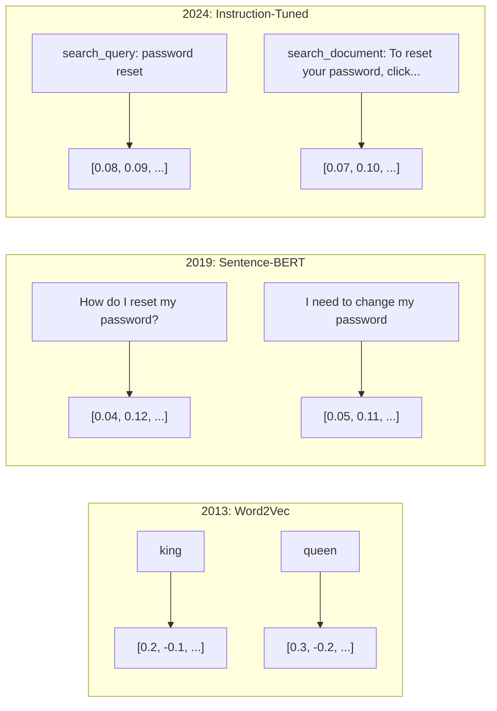
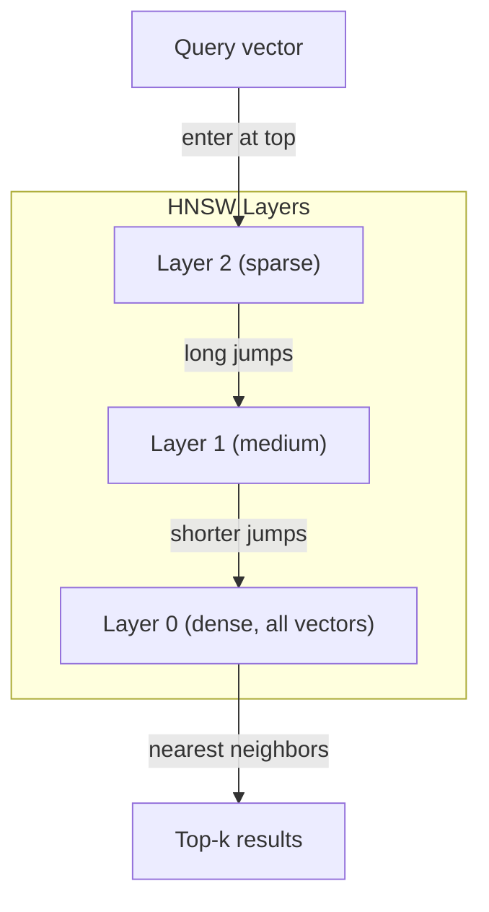
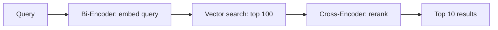

# Eklentiler ve vektör temsilleri.

> Metin ayrıdır. Matematik sürekli. LLM'den "böyle" belgeler bulmasını, anlamları karşılaştırmasını veya anahtar kelimelerden daha öte aramalarını istediğiniz her seferinde bu iki dünya arasındaki köprüye güveniyorsunuz. Bu köprü bir yerleşimdir. Eğer yerleşimleri anlamıyorsanız, modern Yapay zeka'yı anlamıyorsunuz. Sadece kullanıyorsunuz.

> **【中文解读】**文本是离散的,数学是连续的. 嵌入 (嵌入) 嵌入 (嵌入) 嵌入 (嵌入) 嵌入 (嵌入) 嵌入 (嵌入) 嵌入 (嵌入) 嵌入 (嵌入) 嵌入 (嵌入) 嵌入 (嵌入) 嵌入 (嵌入) 嵌入 (嵌入) 嵌入 (嵌入) 嵌入 (嵌入) 嵌入 (嵌入) 嵌入 (嵌入) 嵌入 (嵌入) 嵌入 (嵌入) 嵌入 (嵌入) 嵌入 (嵌入) 嵌入 (嵌入) 嵌入 (嵌入) 嵌入 (嵌入) 嵌入 (嵌入) 嵌入 (嵌入) 嵌入 (嵌入) 嵌入 (嵌入) 嵌入 (嵌入) 嵌入 (嵌入) 嵌入 (嵌入) 嵌入) 嵌入 (嵌入) 嵌入 (嵌入) 嵌入) 嵌入 (嵌入) 嵌入 (嵌入) 嵌入) 嵌入 (嵌入) 嵌入) 嵌入 (嵌入) 嵌入 (嵌入) 嵌入) 嵌入 (嵌入) 嵌入 (嵌入) 嵌入) 嵌入 (嵌入) 嵌入 (嵌入) 嵌入) 嵌入 (嵌入) 嵌入 (嵌入) 嵌入 (嵌入) 嵌入) 嵌入 (嵌入) 嵌入 (嵌入) 嵌入 ( (嵌入) 嵌入) 嵌入 ( ( ( ( ().

> **【拓展：嵌入→RAG与搜索】**嵌入就是RAG (RPG) 检索增强生成) sisteminin çekirdek altyapısı.

>  **【前置】**Öğrenci bölümünden önce önce öğrenmek için: 1) Python 基础 (numpy 向量运算、字典、列表推导); 2) 高中向量数学点积、角、模长 (不知道这些先看 01·02 Vector Matrices) (3) 05·03 (Word Embeddings Word2Vec)`numpy`- Evet.`scikit-learn`Seçilebilir.`chromadb`Ya da`qdrant`- Evet.

**Type:** Build | **类型:** 构建
**Languages:** Python | **语言:** Python
**Prerequisites:** Phase 11, Lesson 01 (Prompt Engineering) | **前置知识:** Phase 11 · 01 (提示工程)
**Time:** ~75 minutes | **时间:** ~75 分钟
**Related:**5 · 22 aşaması (Embedding Models Deep Dive) yoğun vs. nadir vs. çok vektör, Matryoshka kesimleme ve eksel model seçimini kapsar. Bu ders üretim borusuna (vektor DB'leri, HNSW, benzerlik matematiği) odaklanır.**相关:**5 · 22 (嵌入模型深度解析) kapsamı 密/稀疏/多向量、Matryoshka 截断和分轴模型选择。本课聚焦生产管线(向量库、HNSW、相似度数学)。选模型前先读 5 · 22。

## Öğrenme hedefleri

- API sağlayıcıları ve açık kaynaklı modeller kullanarak metin gömülmeleri oluşturun ve bunlar arasında cosine benzerliği hesaplayın
  API ve açık kaynak modeli kullanılarak metin yerleştirmeleri oluşturur ve bunlar arasındaki eksenin benzerliğini hesaplar
- Anahtar kelime aramalarının çözemeyeceği kelime birikimi eşleşmezliği sorunu neden yerleştirilmiş olduğunu açıklayın
  解释为什么嵌入能解决关键词搜索无法处理的词汇不匹配问题
- Anlamlardaki anahtar kelimeyle aynı değil, anlamla belgeler bulunan anlamlı bir arama endeksi oluşturun
  构建一个语义搜索索引,按意而非精确关键词匹配搜索文档
- Çıkarma referans markeri (precision@k, hatırlat) kullanarak yerleştirme kalitesini değerlendir ve göreviniz için doğru yerleştirme modelini seçin
  kullanın, kullanın, kullanın, kullanın, kullanın, kullanın, kullanın, kullanın, kullanın, kullanın, kullanın, kullanın, kullanın, kullanın, kullanın, kullanın, kullanın

> **【中文解读】**Bu dersin amacı: metin yerleştirilmesinin prensiplerini ve uygulamalarını anlamak. Metin yerleştirilmesinin metinlere dönüştürülmesini, metin gibi metinlerin metin alanındaki mesafeye daha yakın olmasını sağlar.


## Sorunlar. Sorunlar.

10,000 destek bileti var. Bir müşteri "Ödeme işlemim bitmedi". diye yazıyor. Aynı geçmiş biletleri bulmanız gerekiyor. Anahtar kelime arama "Ödeme işlem" ve "Ödeme işlemimiz bitmedi" içeren biletleri bulur. "Transaction failed", "charge was declined", ve "billing error" gibi kelimeleri kaybeder. Bu biletler tam olarak aynı sorunu tamamen farklı kelimelerle anlatır.

> "Ödemesi" ve "geçmedi" içeren işlemleri bulmuş, ancak "transaksiyon başarısız" ı, "çalganın reddedildiği" ve "biçim hatası" ı kaydettirdi. Bu işlemler tamamen aynı sorunu açıklıyor, sadece tamamen farklı kelimeler kullanıyor.

Bu kelime kaynağı eşleşme sorunu. İnsan dili aynı şeyi söylemek için düzinelerce yollara sahiptir. Anahtar kelime arama her kelimeyi anlamsız bağımsız bir sembol olarak değerlendirir. "Kesin" ve "geçmedi" aynı kavramı ifade ettiğini bilmiyor.

> İşte sözcük eşleşmezliği sorunu. İnsan dilinde aynı şeyi ifade etmek için birkaç farklı yol vardır.

>  **【类比】**关键词搜索像用"按拼音查字典""水果"和"果"是两条目,相互找不到. 嵌入像"按含义分类""水果""果实""果"都被放入"可食用植物产品"这个语义盒里,能跨语言、跨表达方式匹配──这就是为什么ChatGPT 能理解你的提议即使你打错字或用罕见说法──

"Ödemeyi yapmadım" ve "transaksiyon reddedildi" kelimelerini birbiriyle yakın bir şekilde bir araya getirmek için bir yöntem gerekir. "Ödemeyi zamanında aldım" kelimesini paylaştığınızda "Ödeme" kelimesini uzaklaştırarak.

> Bir metin ifade etme tarzı gerekir, bunun anlamı yazılı olarak değil, birbiriyle yakın bir matematik alanında "payments are not successful" ve "transactions are rejected" kelimelerini yerleştirmek için bir yöntem gerekir.

Bu temsil bir yerleşimdir.

> Bu şekilde ifade edilmek için yerleştirilmiştir.

## Konsepten bir şey.

> **【中文解读】**嵌入(Embeddings) metni yüksek boyutlu bir boyutlu metneye dönüştürür, bu sayede metin anlamına benzer metinlerin boyutlu bir uzaydaki mesafeye daha yakın olması.

> **【拓展：嵌入模型的演进】**嵌入型 from Word2Vec/GloVe (静态词嵌入) to BERT (上下文嵌入) to专用嵌入型模型 (如 BGE、E5、GTE) ⋅ OpenAI'nin metin gömülmesi-büyük-3 MTEB 基准 üzerinde yaklaşık 64 分に ulaşmaktadır.


### Bir İçeride Yerleşme Nedir?

Bir yerleştirme, metnin anlamını temsil eden yüzen nokta sayılarının yoğun bir vektörüdür. "Sık" kelimesi önemlidir - her boyut, çoğu boyut sıfır olan nadir temsillerden (saç sözcükler, TF-IDF) farklı olarak bilgi taşır.

> 嵌入是表示文本含义的浮点数密向量──"密" çok önemlidir每个维度都承载信息,不像稀疏表示(词袋、TF-IDF) 中大多数维度为零──

"Kedi çarşafta oturuyordu" gibi bir şey oluyor.`[0.023, -0.041, 0.087, ..., 0.012]`Bu sayıların anlamını kodlamasıdır. Onları asla doğrudan kontrol etmiyorsunuz. Onları karşılaştırıyorsunuz.

> "Kedi oturuyor 子上" gibi bir şey oldu.`[0.023, -0.041, 0.087, ..., 0.012]`Bu sayıların anlamı kodlanmıştır. Onları doğrudan kontrol etmiyorsun, karşılaştırıyorsun.

### Word2Vec'in Yürüyüşü

2013 yılında Tomas Mikolov ve Google'daki meslektaşları Word2Vec'i yayınladı. Temel anlayış: komşularından bir kelimeyi (veya komşuları bir kelimeyle) tahmin etmek için bir sinir ağını eğitmek ve gizli katman ağırlıkları anlamlı vektör temsilleri haline gelmek.

> 2013 yılında, Thomas Mikolov ve Google ortakları Word2Vec¬ yayımladı.

Ünlü sonuç:

> 著名结果:

```
king - man + woman = queen
```

Sözcük yerleştirmelerindeki vektör aritmetikleri anlamsal ilişkileri yakalar. "erkek"ten "kadın"a olan yön "kral"dan " kraliçe"e olan yön ile aynıdır. Bu, jeometri'nin anlamı kodlayabileceğini anlayan an oldu.

> 词嵌的向量算术能捕捉语义关系──"erkek"den "kadın"a kadar yönleri büyük ölçüde "kral"dan "kral"a kadar yönlere eşittir──

>  **【类比】**Görelim alanı yönü " anlamlı boyut " ıdır. Örneğin bir yönü " seks " ıdır. Bir yönü " erkek  kadın  kral  kraliçe  amca                                                                                                                                                                                                                                                                                                                                                                                                                                                                                    

Word2Vec 300 boyutlu vektörler üretti. Her kelime bağlamına bakılmaksızın bir vektör aldı. "Deniz kıyısında" ve "bank hesabı"daki "bank" aynı yerleşime sahipti. Bu sınırlama sonraki on yıllık araştırmayı yönlendirdi.

> Word2Vec  300 维向量 oluşturur. Her kelime ne olursa olsun aşağıdaki yazılarda nasıl bir 量 elde edilir.

### Sözlerden cümlelere

Sözcük yerleştirmeler tek bir simgeyi temsil eder. Üretim sistemleri tüm cümleleri, paragrafları veya belgeleri yerleştirmelidir. Dört yaklaşım ortaya çıktı:

> 词嵌入表示单个代币――生产系统需要嵌入整个句子、段落或文档―― dört farklı yöntem ortaya çıktı:

**Averaging**Bu cümle, kısa metin için şaşırtıcı derecede iyi bir şekilde kullanılır. kelimeler sırasını tamamen kaybeder. "Köpek adamı ısırır" ve "İnsan köpeği ısırır" aynı yerleşimleri alır.

> **平均法**Bu cümlelerdeki tüm kelimelerin ortalama değeri, ucuz, zararlı, kısa metin etkisine karşı garip bir şekilde iyi.

**CLS token**Transformer modelleri (BERT, 2018) tüm girişleri temsil eden özel bir [CLS] token gömülmesini çıkarır.

> **CLS token**Transformer 模型(BERT, 2018) 输出一个特殊的 [CLS] token 嵌入来表示整个输入──比平均法好,但[CLS] token 是为下一句预测任务训练的,不是为相似度任务──

**Contrastive learning**Bu yöntemin temelini oluşturan, "Hadişatimi nasıl yeniden ayarlarım?" ve "Hadişatimi değiştirmem gerekiyor" ifadelerini göz önüne alarak, model bu ifadelerin neredeyse aynı vektörlere sahip olması gerektiğini öğrenir.

> **对比学习**: açık bir eğitim modeli, yaklaşımlara benzer olacaktır, yaklaşımlara benzer olmayacaktır. Sence-BERT, Reimers & Gurevych, 2019) bu yöntemi modern yerleşim modelinin temeline dönüştürdü.

**Instruction-tuned embeddings**E5 ve GTE gibi modeller, modelin hangi tür yerleştirme üretmesi gerektiğini söyleyen bir görev önlüğünü kabul eder ("search_query:", "search_document:"). Bu, bir modelin birden fazla görevi yerine getirmesi sağlar.

> **指令微调嵌入**:最新方法──E5 和 GTE 等模型接受任务前("search_query:"、"search_document:"), modelin nasıl bir yerleşim oluşturması gerektiğini söyleyin──



### Modern İçeriği Modeller

Piyasa bir avuç üretim seviyesine sahip seçeneklere (MTEB puanları 2026 yılının başlarında MTEB v2) yerleştirildi:

> Piyasa az sayıda üretim sınıfı seçeneği için çökmüştür.

| Model | Provider | Dimensions | MTEB | Context | Cost / 1M tokens |
|-------|----------|-----------|------|---------|------------------|
| Gemini Embedding 2 | Google | 3072 (Matryoshka) | 67.7 (retrieval) | 8192 | $0.15 |
| embed-v4 | Cohere | 1024 (Matryoshka) | 65.2 | 128K | $0.12 |
| voyage-4 | Voyage AI | 1024/2048 (Matryoshka) | 66.8 | 32K | $0.12 |
| text-embedding-3-large | OpenAI | 3072 (Matryoshka) | 64.6 | 8192 | $0.13 |
| text-embedding-3-small | OpenAI | 1536 (Matryoshka) | 62.3 | 8192 | $0.02 |
| BGE-M3 | BAAI | 1024 (dense+sparse+ColBERT) | 63.0 multilingual | 8192 | Open-weight |
| Qwen3-Embedding | Alibaba | 4096 (Matryoshka) | 66.9 | 32K | Open-weight |
| Nomic-embed-v2 | Nomic | 768 (Matryoshka) | 63.1 | 8192 | Open-weight |

MTEB (Massive Text Embedding Benchmark) v2, geri alım, sınıflandırma, gruplama, yeniden sıralama ve özetleme alanında 100+ görevi kapsar. Daha yüksek daha iyidir. 2026 yılına kadar, açık ağırlıklı modeller (Qwen3-Embedding, BGE-M3) çoğu eksede kapalı konutlu modellerle eşleşir veya yenir. Gemini Embedding 2 saf geri alımı yönlendirir; Voyage/Cohere belirli alanları yönlendirir (mali, hukuk, kod). Her zaman kendinize karar vermeden önce kendi sorularınızı değerlendirin.

> MTEB(Massive Text Embedding Benchmark) v2 检索,分类,聚类,重排,摘要等等 100+ 个任务──分数越高越好──2026 yıl,开源权重模型──Qwen3-Embedding、BGE-M3) 大多数维度上匹配或超越闭源托管模型──Gemini Embedding 2 在纯检索上领先;Voyage/Cohere 在特定领域;;金融、法律、代码)领先──承诺之前必需在自己的查询上做基准测试──

### Benzerlik Metrikleri

İki yerleştirme vektörü verildiğinde, benzerliklerini ölçmenin üç yolu:

> İki yerleşim vektörünü belirleyerek, benzerliklerini ölçmenin üç yolu vardır:

**Cosine similarity**Bu, iki vektör arasındaki açının kozinüsünü gösterir. -1 (karşı) ile 1 (aynı yön) arasında değişir. Büyüklüğü görmezden gelir. 10 kelime cümle ve 500 kelimelik bir belge aynı yönü gösterirse 1.0 puan alabilir. Bu kullanım durumlarının %90'ında varsayılan puan.

> **余弦相似度**İki                                                                                                                                                                                                                                                               

> 🤔 **【困惑】**S: Neden çoğu sahne, özenli bir yönde özenli bir yönde benzerlik kullanıyor? A: Çünkü yerleşik bir yönde "uzunluk" (magnitude) genellikle anlamsızdır. Aynı cümle, 10 kelimeler veya 100 kelimelerle aynı anlamda kullanılır.

```
cosine_sim(a, b) = dot(a, b) / (||a|| * ||b||)
```

**Dot product**: iki vektörün çiğ iç ürünü. vektörler normalleştirildiğinde (birlik uzunluğu) kozin benzerliği ile aynı. Hesaplama daha hızlı. OpenAI'nin gömülmeleri normalleştirilmiştir, bu nedenle nokta ürünü ve kozin aynı sıralama verir.

> **点积**İki vektörün orijinal içeşi birleştirildiğinde, vektörün uzunluğu, diğer vektörlerin benzerliğiyle eşittir.

```
dot(a, b) = sum(a_i * b_i)
```

**Euclidean (L2) distance**Vectör alanında düz çizgi mesafe. Daha küçük = daha benzer. Büyüklük farklarına duyarlı. Sadece yön değil, uzaydaki mutlak pozisyon önemli olduğunda kullanın.

> **欧氏（L2）距离**:                                                                                                                                                                                                                                                               

```
L2(a, b) = sqrt(sum((a_i - b_i)^2))
```

Ne zaman kullanılır:

> Ne zaman kullanırsın?

| Metric | Use when | Avoid when |
|--------|----------|------------|
| Cosine similarity / 余弦相似度 | Comparing texts of different lengths; most retrieval tasks / 比较不同长度文本；大多数检索任务 | Magnitude carries information / 幅度携带信息 |
| Dot product / 点积 | Embeddings are already normalized; maximum speed / 嵌入已归一化；最大化速度 | Vectors have varying magnitudes / 向量幅度不同 |
| Euclidean distance / 欧氏距离 | Clustering; spatial nearest-neighbor problems / 聚类；空间近邻问题 | Comparing documents of wildly different lengths / 比较长度悬殊的文档 |

### Vektör Veritabanları ve HNSW

Bir kaba güç benzerlik arama sorguyu her depolanmış vektörle karşılaştırır. 1536 boyutlu 1 milyon vektörde, bu sorgu başına 1,5 milyar kat kat ekleme işlemidir. Çok yavaş.

> 暴力相似度搜索 暴力相似度搜索 暴力相似度搜索 暴力相似度搜索 暴力相似度搜索 暴力相似度搜索 暴力相似度搜索 暴力相似度搜索 暴力相似度搜索 暴力相似度搜索 暴力相似度搜索 暴力相似度搜索 暴力相似度搜索 暴力相似度搜索 暴力相似度搜索 暴力相似度搜索 暴力相似度搜索 暴力相似度搜索 暴力相似度搜索 暴力相似度搜索 暴力相似度搜索 暴力相似度搜索 暴力相似度搜索 暴力相似度搜索 暴力相似度搜索 暴力相似度搜索 暴力相似量 暴力相似量 暴力相似量 暴力相似量 暴力相似量 暴力相似量 暴力相似量 暴力相似量 暴力相似量 量 量 量 量 量 量 量 量 量 量 量 量 量 量 量 量 量 量 量 量 量 量 量 量 量 量 量 量 量 量 量 量 量 量 量 量 量 量 量 量 量 量 量 量 量 量 量 量 量 量 量 量 量 量 量 量 量 量 量 量 量 量 量 量 量 量 量 量 量 量 量 量 量 量 量 量 量 量 量 量 量 量 量 量 量 量 量 量 量 量 量 量 量 量 量 量 量 量 量 量 量 量 量 量 量 量 量 量 量 量 量 量 量 量 量 量 量 量 量 量 量 量 量 量 量 量 量 量 量 量 量 量 量 量 量 量 量 量 量 量 量 

Vektör veritabanları bunu Yaklaşık En Yakın Komşu (ANN) algoritmaları ile çözüyor.

> HNSW (HNSW) (Layer: 可导航小世界) için kullanılan algoritmalar:

1. Vektörlerin çok katmanlı bir grafik oluştur
   Konstrüksiyonu ve yapısal yapı
2. Yukarı katmanlar nadirdir. Uzak gruplar arasındaki uzun mesafeli bağlantılar.
   顶层稀疏远距离之间长程连接
3. Alt katmanlar yoğun -- yakın vektörler arasındaki ince tanelerli bağlantılar
   Alt katlı 密近向量 arasındaki ince粒度 bağlantısı
4. Arama üst katmandan başlar, açgözlülükle aramak için aşağı iner
   Arama üst seviyeden başlıyor, açgözlülükle aşağıya düşüyor.
5. O(log n) yerine O(n) zamanında yaklaşık üst-k sonuçları gönderir
   O(log n) 而非 O(n) 时间内返回近似 top-k 结果

HNSW, büyük hız kazanımları için küçük bir doğruluk kaybı (genellikle 95-99% hatırlama) ticareti yapar. 10 milyon vektörde kaba güç saniyeler alır. HNSW milisaniyeler alır.

> HNSW düşük bir hasar miktarında (genellikle %95-99 召回率) büyük bir hızla yükseltilmek için değişir.

>  **【类比】**HNSW 像地图搜索:"全国地图" sadece büyük şehirleri çizer, "省地图" sadece şehirleri çizer, "省地图" ise şehirleri çizer, "街地图" ise her bir binaya çizer, "北京大学" bul, önce ülke seviyesinde Pekine atlayın, sonra bölge seviyesinde deniz bölgeye atlayın, son olarak sokak seviyesinde belirli bir yer bul, küçük atlayın.



> ️ **【易错点】**HNSW'nin 3 个坑:(1) **召回率随参数变化**`ef_construction`太低(< 100) 图结构质量差,召回率下降到70% 图结构质量差,召回率下降到70% 图结构质量差,召回率下降到70% 图结构质量差,召回率下降到70% 图结构质量差,召回率下降到70% 图结构质量差,召回率下降到70% 图结构质量差,召回率下降到70% 图结构质量差,召回率下降到70% 图结构质量差,召回率下降到70% 图结构质量差,召回率下降到70% 图结构质量差,召回率下降到70% 图结构质量差,召回率下降到70% 图结构质量差,召回率下降到70% 图结构量差,**删除代价高**HNSW is图结构,删除节点会破坏连接,多数实现是"软删除" (HNSW) 标记为已删除),需要定期重建──(3) **过滤性能差**İlk yapılan kütleci arama yeniden 

Üretim seçenekleri:

> Üretim sınıfı seçeneği:

| Database | Type | Best for | Max scale |
|----------|------|----------|-----------|
| Pinecone | Managed SaaS / 托管 SaaS | Zero-ops production / 零运维生产 | Billions / 十亿级 |
| Weaviate | Open source / 开源 | Self-hosted, hybrid search / 自托管、混合搜索 | 100M+ / 一亿+ |
| Qdrant | Open source / 开源 | High performance, filtering / 高性能、过滤 | 100M+ / 一亿+ |
| ChromaDB | Embedded / 嵌入式 | Prototyping, local dev / 原型、本地开发 | 1M / 百万 |
| pgvector | Postgres extension / Postgres 扩展 | Already using Postgres / 已在用 Postgres | 10M / 千万 |
| FAISS | Library / 库 | In-process, research / 进程内、研究 | 1B+ / 十亿+ |

### Çürükleme Strategiları

Belgeler tek vektör olarak yerleştirilmeyecek kadar uzun. 50 sayfalık bir PDF düzinelerce konuyu kapsar. yerleştirilmesi her şeyin ortalaması haline gelir, hiçbir şeyle benzer. Belgeler parçalara ayırıp her birini yerleştirir.

> 文档太长,不能作为单向量嵌入──50页 PDF 包含几十个主题其嵌入成所有内容的平均,与任何具体内容都不相似──你需要将文档分分成块,分别嵌入每块──

**Fixed-size chunking**M-token üst üstelik olan her N tokeni bölün. Basit ve öngörülebilir. Belgeler net bir yapı olmamasında iyi çalışır. 50 token üst üstelik olan 512 token parçası: 1 token 0-511, 2 token 462-973.

> **固定大小分块**: Her N 个符号 拆分一次,带 M 个符号 重叠──简单可预测──文档无清晰结构时效果好──512 符号 分块加50 符号 重叠:块 1 是符号 0-511,块 2 是符号 462-973──

**Sentence-based chunking**Bir cümleyi iki parçaya ayırmak, cümle sınırlarını bölmek, cümleleri belirgin sınırına ulaşıncaya kadar gruplandırmak. Her parça en az bir cümleyi tamamlıyor.

> **基于句子的分块**Sıkıntılı bir şekilde, bir cümleyi bir cümleye ayırmak için, bir cümleyi bir cümleye ayırmak için, bir cümleyi bir cümleye ayırmak için, bir cümleyi bir cümleye ayırmak için, bir cümleyi bir cümleye ayırmak için, bir cümleyi bir cümleye ayırmak için, bir cümleyi bir cümleye ayırmak için, bir cümleyi bir cümleye ayırmak için, bir cümleyi bir cümleye ayırmak için, bir cümleyi bir cümleye ayırmak için, bir cümleyi bir cümleye ayırmak için, bir cümleyi bir cümleye ayırmak için, bir cümleyi bir cümleye ayırmak için, bir cümleyi bir cümleye ayırmak için, bir cümleyi bir cümleye ayırmak için, bir cümleyi bir cümleye ayırmak için, bir cümleyi bir cümleye ayırmak için, bir cümleyi bir cümleye ayırmak için, bir cümleyi bir cümleyi bir cümleye ayırmak için, bir cümleyi bir cümleyi ayırmak için, bir cümleyi bir cümleyi ayırmak için bir cümle yapmak için.

**Recursive chunking**Bu, LangChain'in sınırlarıdır.`RecursiveCharacterTextSplitter`ve karışık formatlı vücutlar için iyi çalışır.

> **递归分块**İlk olarak en büyük sınırda, daha sonra bir kısım sınırda, daha sonra bir kısım sınırda.`RecursiveCharacterTextSplitter`, mixed format speech material için iyi bir etki.

**Semantic chunking**Bu cümleler, bir cümleyi bir araya getirmek için bir cümleyi oluşturur.

> **语义分块**: her cümleyi yerleştirir, sonra benzer bir dizi cümle bölümü yerleştirir.  değerinden düşük bir benzerlik yerleştirildiğinde, yeni bir blok başlatılır.

| Strategy | Complexity | Quality | Best for |
|----------|-----------|---------|----------|
| Fixed-size / 固定大小 | Low / 低 | Decent / 尚可 | Unstructured text, logs / 非结构化文本、日志 |
| Sentence-based / 基于句子 | Low / 低 | Good / 好 | Articles, emails / 文章、邮件 |
| Recursive / 递归 | Medium / 中 | Good / 好 | Markdown, HTML, mixed docs / Markdown、HTML、混合文档 |
| Semantic / 语义 | High / 高 | Best / 最佳 | Critical retrieval quality / 关键检索质量 |

Çoğu sistem için en iyi nokta: 256-512 token parçası 50 token üst üste.

> %25, %25, %25, %25, %25, %25, %25, %25, %25, %25, %25, %25, %25, %25, %25, %25, %25, %25, %25, %25, %25, %25, %25, %25, %25, %25, %25, %25, %25, %25, %25, %25, %25, %25, %25, %25, %25, %25, %25, %25, %25, %25, %25, %25, %25, %25, %25, %25, %25, %25, %25, %25, %25, %25, %25, %25, %25, %25, %25, %25, %25, %25, %25, %25, %25, %25, %25, %25, %25, %25, %25, %25, %25, %25, %25, %25, %25, %25, %25, %25, %25, %25, %25, %25, %25, %25, %25, %25, %25, %25, %25, %25, %25, %25, %25, %25, %25, %25, %25, %25, %27, %27, %27, %27, %27, %27,%%%%%%%%%%%%%%%%%%%%%%%%%%%%%%%%%%%%%%%%%%%%%%%%%%%%%%%%%%%%%%%%%%%%%%%%%%%%%%%%%%%%%%%%%%%%%%%%%%%%%%%%%%%%%%%%%%%%%%%%%%%%%%%%%%%%%%%%%%%%%%%%%%%%%%%%%%%%%%%%%%%%%%%%%%%%%%%%%%%%%%%%%%%%%%%%

> ️ **【易错点】**Bölümün 3 tane gerçek savaş kazası:**块太大**(> 1024 token)嵌入被稀释,每个块都"既像A 又像B",检索精度暴跌;-指纹:不超过模型 max input 的 1/4──(2) **块太小**(< 64 token) 上下文丢失, "它"指代的前文消失了,嵌入成无意的噪音──(3) **重叠设为 0**                                                                                                                                                                                                                                                              **删除**Bu dosya iki parçaya ayrılmış olabilir, "deleted files" arama eşleşmez.

### Bi-Enkodlayıcılar vs. Çapraz-Enkodlayıcılar

Bir iki kodlayıcı sorgulama ve belgeyi bağımsız olarak yerleştirir, sonra vektörleri karşılaştırır. Hızlı - sorgulama bir kez yerleştirir ve önceden hesaplanmış belge yerleştirmelerine karşı karşılaştırır. Bu, geri almak için kullandığınız şey.

> 双编码器独立嵌入查询和文件,然后比较向量──快速你只嵌入查询一次,与预计算的文件嵌入比较──这是检查时使用的方案──

Bir çapraz kodlayıcı, sorgu ve belgeyi tek bir giriş olarak alır ve bir bağlayıcılık puanı çıkarır. Yavaş - her sorgu-belge çiftini tam model boyunca işliyor. Ama çok daha doğru çünkü sorgu ve belge tokenlerini aynı anda karşılayabilir.

> 交叉编码器, sorgu ve dosyaları tek bir giriş, çıkış ilişkililik oranı olarak kullanacaktır.

Üretim örneği: Bi-encoder en iyi 100 adayı alır, çapraz encoder onları en iyi 10'a geri gönderir. Bu, geri alın ve sonra yeniden sıralama borusu.

> 生产模式:双编码器检索前-100候选人,交叉编码器重排为前-10──这是先检索后重排管线──

> ️ **【易错点】**Performans felaketleri: doğrudan çapraz kodlayıcı ile kontrol yapmak. 100 milyon dosya, her kontrol için 100 milyon kez tamamlanmak anlamına geliyor.**永远用 Bi-Encoder 召回 + Cross-Encoder 重排**❖ Cross-Encoder sadece 100 kez, mil saniyelik bir şekilde top 100 aday için tamamlanmıştır.



Ranking modelleri: Cohere Rerank 3.5 (1000 sorgu başına 2 dolar), BGE-reranker-v2 (ücretsiz, açık kaynak), Jina Reranker v2 (ücretsiz, açık kaynak).

> Cohere Rerank 3.5( her 1000 查询 $2) ✓ BGE-renker-v2(免费、开源) ✓ Jina Reranker v2(免费、开源) ✓

### Matryoshka Eklemleri

Geleneksel yerleşimler her şey veya hiçbir şey değildir. 1536 boyutlu bir vektör 1536 yüzen kullanır.

> 传统嵌入不此即彼的──1536 维向量使用 1536 个浮点数──不重训就无法截断到 256 维──

> 🤔 **【困惑】**S: Matryoshka 嵌入的"截断"是什么意思?为什么要做? A: 类比俄罗斯套娃 (Matryoshka bebek) 大套娃里套小套娃,前 256 维是"最重要含义" (en önemli anlamı) 小套娃),加到 768 维是"中等细节",加到 1536 维是"完整精细含义" (en büyük anlamı) **收益**: depolama省 6 倍(1536→256),检索快 6 倍,精度只掉 1-3 个点──RAG 系统常用 256 维存向量 + 1536 维重排,兼顾速度和精度──

Matryoshka Reprezentation Learning (Kusupati et al., 2022) bunu düzeltir. Model, ilk N boyutları en önemli bilgileri yakalamak için eğitilmiştir, örneğin bir Rus yuva kuklası gibi. 1536-d bir Matryoshka gömülmesi 256 boyutlara kısaltmak bazı doğruluk kaybeder ancak işlevsel kalır.

> Matryoshka 図書 図書 図書 図書 図書 図書 図書 図書 図書 図書 図書 図書 図書 図書 図書 図書 図書 図書 図書 図書 図書 図書 図書 図書 図書 図書 図書 図書 図書 図書 図書 図書 図書 図書 図書 図書 図書 図書 図書 図書 図書 図書 図書 図書 図書 図書 図書 図書 図書 図書 図書 図書 図書 図書 図書 図書 図書 図書 図書 図書 図書 図書 図書 図書 図書 図書 図書 図書 図書 図書 図書 図書 図書 図書 図書 図書 図書 図書 図書 図書 図書 図書 図書 図書 図書 図書 図書 図書 図書 図書 図書 図書 図書 図書 図書 図書 図書 図書 図書 図書 図書 図書 図書 図書 図書 図書 図書 図書 図書 図書 図書 図書 図書 図書 図書 図書 図書 図書 図書 図書 図書 図書 図書 図書 図書 図書 図書 図書 図書 図書 図書 図書 図書 図書 図書 図書 図書 図書 図書 図書 図書 図書 図書 図書 図書 図書 図書 図書 図書 図書 図書 図書 図書 図書 図書 図書 図書 図書 図書  図書 図書 図書 図書 図書 図書  図書 図書 図書

OpenAI'nin metin içeren 3 küçük ve metin içeren 3 büyük destekleri Matryoshka kesimi `dimensions`Parametre: 1536 yerine 256 boyut talep etmek depolama alanını 6 kat azaltır ve MTEB referans değerlerinde yaklaşık %3-5% doğruluk kaybı ile azaltır.

> OpenAI'nin metin yerleştirme-3 küçük 和 metin yerleştirme-3 büyük 通過`dimensions`参数支持 Matryoshka 截断―― request 256 维 ve 1536 维 depolama 6 katı, MTEB 基准上损失约 3-5% 精度――

### Çiftlik Kvantizasyon

float32 olarak saklanan 1536 boyutlu bir gömme 6.144 byte kullanır. 10 milyon belge ile çarpın: sadece vektörler için 61 GB.

> 1536 维嵌入以 float32 存储用 6,144 字节──乘以1000万文档:仅向量就需要61 GB──

İkili kuantitasyon her akıştı tek bir bit olarak dönüştürür: olumlu değerler 1, negatif değerler 0 olur. Kayıtlama 6,144 bytes'ten 192 byte'ye düşer - 32x bir azalım. Benzerlik Hamming mesafesini kullanarak hesaplanır (farklı bit sayım), CPU'lar tek bir talimat ile yapabilir.

> 2. değerlilik, her bir değeri tek bir bit olarak dönüştürür: 1. değer değişikliği, 1. değer değişikliği, 0 ⋅ depolama 6.144 字节 azalır ve 192 字节 32 倍 ⋅ sıkıştırılır.

Çıkarma geri çağırışında doğruluk oranı yaklaşık %5-10'dur. Genel model: biner kuantitasyon, ilk geçiş arama için milyonlarca vektör üzerinde, sonra tam doğruluk vektörleri ile üst 1000'i yeniden gösterir. Bu size %95+ tam doğruluk doğruluk sağlar. 32 kat daha az bellek.

> 检索召回率精度损失约5-10%──常见模式:二值量化 kullanarak milyonlarca vektörün bir kez arama yapın, sonra tüm精度 vektörünün üst 1000 ağırlıklı sırasına karşı tüm精度 vektörünü kullanın── bu size 32 kat daha az内存 altında% 95+'ün tam精度 doğruluğunu elde etmeni sağlar──

## Yapın.
```figure
cosine-similarity
```

## Yapın

Semantik bir arama motoru oluşturduk sıfırdan. Vektör veritabanı yok. Dış yerleştirme API yok. Matematik için saf Python.

> Biz, sıfırdan başlamak için bir arama motoru oluşturmaya başladık.

### Adım 1: Metinleri parçala

```python
def chunk_text(text, chunk_size=200, overlap=50):
    words = text.split()
    chunks = []
    start = 0
    while start < len(words):
        end = start + chunk_size
        chunk = " ".join(words[start:end])
        chunks.append(chunk)
        start += chunk_size - overlap
    return chunks


def chunk_by_sentences(text, max_chunk_tokens=200):
    sentences = text.replace("\n", " ").split(".")
    sentences = [s.strip() + "." for s in sentences if s.strip()]
    chunks = []
    current_chunk = []
    current_length = 0
    for sentence in sentences:
        sentence_length = len(sentence.split())
        if current_length + sentence_length > max_chunk_tokens and current_chunk:
            chunks.append(" ".join(current_chunk))
            current_chunk = []
            current_length = 0
        current_chunk.append(sentence)
        current_length += sentence_length
    if current_chunk:
        chunks.append(" ".join(current_chunk))
    return chunks
```

### Adım 2: Baştan Yükleme Yapımları

L2 normalleştirmesi ile TF-IDF kullanarak basit yoğun bir yerleştirme uyguluyoruz. Bu bir nöral yerleştirme değil, aynı sözleşmeyi takip ediyor: metin içeri, sabit boyutlu vektör dışarı, benzer metinler benzer vektörler üretir.

> L2 ile birleşmiş TF-IDF'yi kullanarak basit gizli yerleşimler gerçekleştiririz. Bu sinir ağına yerleşim değil, aynı anlaşmaya uyarak: metin içeri, sabit büyüklükteki metin çıkıyor, benzer metin benzer metin oluşturuyor.

```python
import math
import numpy as np
from collections import Counter

class SimpleEmbedder:
    def __init__(self):
        self.vocab = []
        self.idf = []
        self.word_to_idx = {}

    def fit(self, documents):
        vocab_set = set()
        for doc in documents:
            vocab_set.update(doc.lower().split())
        self.vocab = sorted(vocab_set)
        self.word_to_idx = {w: i for i, w in enumerate(self.vocab)}
        n = len(documents)
        self.idf = np.zeros(len(self.vocab))
        for i, word in enumerate(self.vocab):
            doc_count = sum(1 for doc in documents if word in doc.lower().split())
            self.idf[i] = math.log((n + 1) / (doc_count + 1)) + 1

    def embed(self, text):
        words = text.lower().split()
        count = Counter(words)
        total = len(words) if words else 1
        vec = np.zeros(len(self.vocab))
        for word, freq in count.items():
            if word in self.word_to_idx:
                tf = freq / total
                vec[self.word_to_idx[word]] = tf * self.idf[self.word_to_idx[word]]
        norm = np.linalg.norm(vec)
        if norm > 0:
            vec = vec / norm
        return vec
```

### Adım 3: Benzerlik İşleri

```python
def cosine_similarity(a, b):
    dot = np.dot(a, b)
    norm_a = np.linalg.norm(a)
    norm_b = np.linalg.norm(b)
    if norm_a == 0 or norm_b == 0:
        return 0.0
    return float(dot / (norm_a * norm_b))


def dot_product(a, b):
    return float(np.dot(a, b))


def euclidean_distance(a, b):
    return float(np.linalg.norm(a - b))
```

### Adım 4: Brut-Force Arama ile Vektör İndeksi

```python
class VectorIndex:
    def __init__(self):
        self.vectors = []
        self.texts = []
        self.metadata = []

    def add(self, vector, text, meta=None):
        self.vectors.append(vector)
        self.texts.append(text)
        self.metadata.append(meta or {})

    def search(self, query_vector, top_k=5, metric="cosine"):
        scores = []
        for i, vec in enumerate(self.vectors):
            if metric == "cosine":
                score = cosine_similarity(query_vector, vec)
            elif metric == "dot":
                score = dot_product(query_vector, vec)
            elif metric == "euclidean":
                score = -euclidean_distance(query_vector, vec)
            else:
                raise ValueError(f"Unknown metric: {metric}")
            scores.append((i, score))
        scores.sort(key=lambda x: x[1], reverse=True)
        results = []
        for idx, score in scores[:top_k]:
            results.append({
                "text": self.texts[idx],
                "score": score,
                "metadata": self.metadata[idx],
                "index": idx
            })
        return results

    def size(self):
        return len(self.vectors)
```

### Adım 5: Semantik Arama Motoru

```python
class SemanticSearchEngine:
    def __init__(self, chunk_size=200, overlap=50):
        self.embedder = SimpleEmbedder()
        self.index = VectorIndex()
        self.chunk_size = chunk_size
        self.overlap = overlap

    def index_documents(self, documents, source_names=None):
        all_chunks = []
        all_sources = []
        for i, doc in enumerate(documents):
            chunks = chunk_text(doc, self.chunk_size, self.overlap)
            all_chunks.extend(chunks)
            name = source_names[i] if source_names else f"doc_{i}"
            all_sources.extend([name] * len(chunks))
        self.embedder.fit(all_chunks)
        for chunk, source in zip(all_chunks, all_sources):
            vec = self.embedder.embed(chunk)
            self.index.add(vec, chunk, {"source": source})
        return len(all_chunks)

    def search(self, query, top_k=5, metric="cosine"):
        query_vec = self.embedder.embed(query)
        return self.index.search(query_vec, top_k, metric)

    def search_with_scores(self, query, top_k=5):
        results = self.search(query, top_k)
        return [
            {
                "text": r["text"][:200],
                "source": r["metadata"].get("source", "unknown"),
                "score": round(r["score"], 4)
            }
            for r in results
        ]
```

### Adım 6: Benzerlik Metriklerini karşılaştırmak

```python
def compare_metrics(engine, query, top_k=3):
    results = {}
    for metric in ["cosine", "dot", "euclidean"]:
        hits = engine.search(query, top_k=top_k, metric=metric)
        results[metric] = [
            {"score": round(h["score"], 4), "preview": h["text"][:80]}
            for h in hits
        ]
    return results
```

## Çerçeveyi kullanın.

Bir üretim gömleyici API ile, mimarlık aynı kalır. Sadece gömleyici değişir:

> API'de yerleştirme aşamasında kullanılan yapı tamamen aynıdır. Sadece yerleştirme cihazı değişimi:

```python
from openai import OpenAI

client = OpenAI()

def openai_embed(texts, model="text-embedding-3-small", dimensions=None):
    kwargs = {"model": model, "input": texts}
    if dimensions:
        kwargs["dimensions"] = dimensions
    response = client.embeddings.create(**kwargs)
    return [item.embedding for item in response.data]
```

OpenAI ile matryoshka kesimi -- aynı model, daha az boyut, daha düşük depolama:

> OpenAI'nin Matryoshka 截断同一模型,更少维度,更低存储:

```python
full = openai_embed(["semantic search query"], dimensions=1536)
compact = openai_embed(["semantic search query"], dimensions=256)
```

256-d vektörü 6 kat daha az depolama kullanıyor. 10 milyon belge için, bu 10 GB vs 61 GB.

> 256 维向量 6 倍 daha az depo kullanımı, 1000 milyon dosya karşılığında 10 GB vs 61 GB, standart temel üzerinde hassaslık kaybı yaklaşık %3-5% olarak görülür.

Cohere'la yeniden sıralama için:

> Cohere kullanın 重排:

```python
import cohere

co = cohere.ClientV2()

results = co.rerank(
    model="rerank-v3.5",
    query="What is the refund policy?",
    documents=["Full refund within 30 days...", "No refunds after 90 days..."],
    top_n=3
)
```

API bağımlılığı olmayan yerel yerleşimler için:

> Yerel olarak yerleştirilmiş, API'si yoktur.

```python
from sentence_transformers import SentenceTransformer

model = SentenceTransformer("BAAI/bge-small-en-v1.5")
embeddings = model.encode(["semantic search query", "another document"])
```

Bu tür bir yapı ile vectorindex sınıfı çalışır. yerleştirme fonksiyonunu değiştirin, arama mantığını koruyun.

> Biz oluşturduğumuz VectorIndex 类可与上述任意方案配合──换嵌函数,保留搜索逻辑──

## İndirin . Ürünler .

Bu ders şunları ortaya çıkarır:
- `outputs/prompt-embedding-advisor.md`-- özel kullanım durumları için yerleştirme modelleri ve stratejileri seçmek için bir ipucu
  选择嵌入模型和策略 (module ve strateji seçin)
- `outputs/skill-embedding-patterns.md`-- bir yetenek ki ajanlara üretimde etkili şekilde gömülmüşleri nasıl kullanacaklarını öğretir
  Öğretmen  Nasıl üretiminde etkili şekilde gömülü becerileri kullanılır

## Egzersizler.

1. **Metric comparison**Bu nedenle, bir örnek olarak, bir örnek ile aynı 5 sorguyu cosine benzerliği, nokta ürünü ve Euclidean mesafeyi kullanarak çalıştırın.
   **指标比较**Bu nedenle, bu soruların cevapları:

2. **Chunk size experiment**: 50, 100, 200 ve 500 kelimelik parça boyutları ile örnek belgeleri indeksleyin. Her biri için 5 sorgu çalıştırın ve en iyi 1 benzerlik puanını kaydetin. parça boyutu ve çekim kalitesi arasındaki ilişkiyi çizin. Büyük parçaların acı çekmeye başladığı noktayı bulun.
   **分块大小实验**: 50、100、200、500 字のブロック大小索引サンプル文档──5 sorgu, top-1 kayıt, benzerlik oranı sayı──plak büyüklüğü ile sorgu kalitesi ilişkisini çizmek──plakın zararlı olan kritik noktalarını bulmak──

3. **Matryoshka simulation**Bu, gerçek bir eğitim hilesine ihtiyaç duymadan Matryoshka davranışını simüle eder.
   **Matryoshka 模拟**Bu model, Matryoshka davranışına benzer ve gerçek eğitim tekniklerine ihtiyaç yoktur.

4. **Binary quantization**Bu nedenle, bu değerler, bir araya gelerek, bir araya gelerek, bir araya gelerek, bir araya gelerek, bir araya gelerek, bir araya gelerek, bir araya gelerek, bir araya gelerek, bir araya gelerek, bir araya gelerek, bir araya gelerek, bir araya gelerek, bir araya gelerek, bir araya gelerek, bir araya gelerek, bir araya gelerek, bir araya gelerek, bir araya gelerek, bir araya gelerek, bir araya gelerek, bir araya gelerek, bir araya gelerek, bir araya gelerek, bir araya gelerek, bir araya gelerek, bir araya gelerek, bir araya gelerek, bir araya gelerek, bir araya gelerek, bir araya gelerek, bir araya gelerek, bir araya gelerek, bir araya gelerek, bir araya gelerek, bir araya gelerek, bir araya gelerek, bir araya gelerek, bir araya gelerek, bir araya gelerek, bir araya gelerek, bir araya gelerek, bir araya gelerek, bir araya gelerek, bir araya gelerek, bir araya gelişe, bir araya gelerek, bir araya gelerek, bir araya geleceğebilir.
   **二值量化**Arama motoru: Get search engine,转为二进制(正为1,负为0),实现汉明距离搜索──对比前十 结果与全精度余弦相似度──测量重叠百分比──

5. **Sentence-based chunking**: sabit boyutlu parçalanmayı `chunk_by_sentences`Aynı sorular sorup, sonuçları karşılaştır.
   **基于句子的分块**:                                                                                                                                                                                                                                                                                                                                                                                                                                                                                                                             `chunk_by_sentences`◊ Aynı sorguyu yürütmek, kontrol oranını karşılaştırmak ◊ Sınırları iyileştirildi mi?

## Anahtar Şartlar .

| Term | What people say | What it actually means | 中文释义 |
|------|----------------|----------------------|---------|
| Embedding | "Text to numbers" | A dense vector where geometric proximity encodes semantic similarity | 嵌入：稠密向量，几何邻近编码语义相似度 |
| Word2Vec | "The OG embedding" | 2013 model that learned word vectors by predicting context words; proved vector arithmetic encodes meaning | Word2Vec：2013 年模型，通过预测上下文词学习词向量；证明向量算术编码含义 |
| Cosine similarity | "How similar are two vectors" | Cosine of the angle between vectors; 1 = identical direction, 0 = orthogonal, -1 = opposite | 余弦相似度：向量夹角余弦；1=同向，0=正交，-1=反向 |
| HNSW | "Fast vector search" | Hierarchical Navigable Small World graph -- multi-layer structure enabling O(log n) approximate nearest neighbor search | HNSW：层次可导航小世界图——多层结构实现 O(log n) 近似最近邻搜索 |
| Bi-encoder | "Embed separately, compare fast" | Encodes query and document independently into vectors; enables pre-computation and fast retrieval | 双编码器：独立编码查询和文档为向量；允许预计算和快速检索 |
| Cross-encoder | "Slow but accurate reranker" | Processes query-document pair jointly through the full model; higher accuracy, no pre-computation | 交叉编码器：联合处理查询-文档对；更高精度，无法预计算 |
| Matryoshka embeddings | "Truncatable vectors" | Embeddings trained so the first N dimensions capture the most important information, enabling variable-size storage | Matryoshka 嵌入：训练使前 N 维捕获最重要信息，支持变维存储 |
| Binary quantization | "1-bit embeddings" | Converting float vectors to binary (sign bit only) for 32x storage reduction with Hamming distance search | 二值量化：将浮点向量转为二进制（仅符号位）实现 32 倍存储压缩配汉明距离搜索 |
| Chunking | "Split docs for embedding" | Breaking documents into 256-512 token segments so each can be independently embedded and retrieved | 分块：将文档拆分为 256-512 token 段以便独立嵌入和检索 |
| Vector database | "Search engine for embeddings" | Data store optimized for storing vectors and performing approximate nearest neighbor search at scale | 向量数据库：为存储向量和大规模近似最近邻搜索优化的数据存储 |
| Contrastive learning | "Train by comparison" | Training approach that pushes similar pair embeddings together and dissimilar pair embeddings apart | 对比学习：将相似对嵌入拉近、不相似对推远的训练方法 |
| MTEB | "The embedding benchmark" | Massive Text Embedding Benchmark -- 56 datasets across 8 tasks; standard for comparing embedding models | MTEB：大规模文本嵌入基准——8 任务 56 数据集；比较嵌入模型的标准 |

## Daha fazla okumak

- Mikolov et al., "Vectör Uzayında Kelimeler Temsillerinin Etkili Tahmini" (2013) - Kral- kraliçe benzerliği ile gömülme devrimini başlatan Word2Vec makalesi
  Mikolov 等, "Vectör Uzayında Söz Önergilerini Etkili Tahmin Etmek" (2013)                                                                                                                                                                                                                                                   
- Reimers & Gurevych, "Sentence-BERT: Sentence Embeddings using Siamese BERT-Networks" (2019) -- cümle seviyesindeki benzerlik için iki kodlayıcıyı nasıl eğiteceğiniz, modern gömleme modelleri temelini oluşturan
  Reimers & Gurevych, "Sentence-BERT" (Sentence-BERT) 2019)
- Kusupati et al., "Matryoshka Reprezentation Learning" (2022) -- OpenAI'nin metin yerleştirme için benimsemiş olduğu değişken boyutlu yerleşimlerin arkasındaki teknik-3
  Kusupati 等, "Matryoshka Reprezentation Learning" (Matryoshka Reprezentation Learning) 变维嵌入后后后的技术,OpenAI 在文本嵌入-3 中采用
- Malkov & Yashunin, "Hiyerarşik Yürüyen Küçük Dünya Grafiklerini Kullanarak En Yakın Komşunu Etkili ve Güçlü Yaklaşır" (2018) -- HNSW kağıdı, çoğu üretim vektör aramalarının arkasındaki algoritma
  Malkov & Yashunin, "HNSW"(2018) HNSW 论文, çoğu üretim 量搜索背后的算法
- OpenAI Embeddings Guide (platform.openai.com/docs/guides/embeddings) -- Matryoshka boyut azaltımı dahil olmak üzere metin-embedded-3 modelleri için pratik referans
  OpenAI 嵌入指南text-embedding-3 模型的实用参考, Matryoshka 降维 dahil olmak üzere
- MTEB Leaderboard (huggingface.co/spaces/mteb/leaderboard) -- Tüm yerleştirme modelleri görev ve diller arasında karşılaştıran canlı bir referans göstergesi
  MTEB  sıralama 跨任务和语言比较所有嵌入式的实时基准
- [Muennighoff et al., "MTEB: Massive Text Embedding Benchmark" (EACL 2023)](https://arxiv.org/abs/2210.07316)-- sıralama tablosunun raporladığı 8 görev kategorisini tanımlayan referans değerleri (sınıflama, gruplama, çift sınıflandırma, yeniden sıralama, geri alım, STS, özetleme, biteks madenciliği); herhangi bir MTEB puanına güvenmeden önce okuyun.
  Muennighoff 等, "MTEB"(EACL 2023)  define 8 个任务类别(分类、聚类、对分类、重排、检索、STS、摘要、双语文本挖掘) 的基准;信任任何单一MTEB 分数前必读──
- [Sentence Transformers documentation](https://www.sbert.net/)-- iki kodlayıcı vs çapraz kodlayıcı için kanonik referans, birleştirme stratejileri ve bu ders uygulanır.
  Cevap Transformers 文档双编码器 vs 交叉编码器、池化策略和本课实现的摄取-拆分-嵌入-存储RAG 管线的权威参考──
